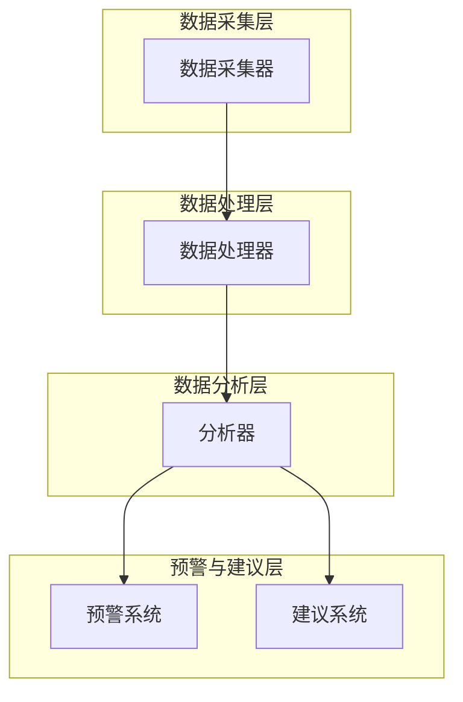
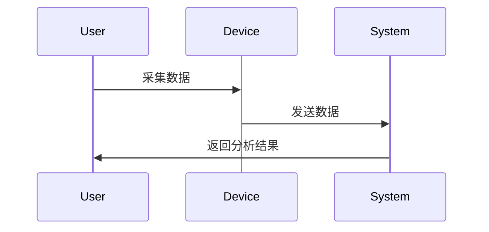
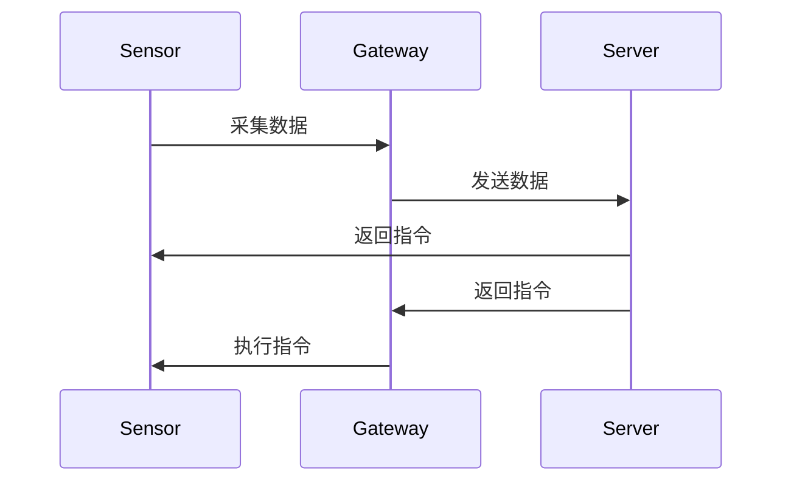

                 


### # AI在智能养老健康监测中的应用：提供及时医疗干预

关键词：人工智能、智能养老、健康监测、医疗干预、算法、系统设计、案例研究

摘要：本文深入探讨了人工智能在智能养老健康监测领域的应用，重点介绍了如何利用AI技术提供及时的医疗干预。文章分为五个主要部分，首先介绍了智能养老背景和当前面临的问题，随后详细阐述了AI在健康监测中的作用原理，并探讨了相关算法和系统设计。最后，通过具体案例研究和实践，展示了AI技术在智能养老健康监测中的实际应用和效果。

## 引言

随着全球人口老龄化趋势的加剧，养老健康问题成为社会各界关注的焦点。传统的养老模式往往依赖人力，成本高且效率低，难以满足日益增长的养老需求。而人工智能（AI）技术的发展为智能养老提供了新的可能。智能养老健康监测系统通过AI技术，能够实时监测老年人的健康状况，及时发现异常，提供及时医疗干预，从而提高养老质量和效率。

本文旨在探讨AI在智能养老健康监测中的应用，重点分析以下几个方面：

1. **背景与挑战**：介绍智能养老的背景、当前面临的主要问题以及AI技术在其中的作用。
2. **核心概念与原理**：阐述AI在健康监测中的核心概念和原理，包括数据采集、处理、分析和预测等环节。
3. **算法与模型**：详细讲解在智能养老健康监测中常用的算法和模型，如机器学习、深度学习等，并分析其优缺点。
4. **系统设计**：探讨智能养老健康监测系统的设计原则、架构和实现细节。
5. **实际应用与案例**：通过具体案例，展示AI技术在智能养老健康监测中的实际应用效果。

## 背景与挑战

### 智能养老的背景

随着医疗技术的进步和生活水平的提高，人类的平均寿命不断延长，人口老龄化问题日益凸显。根据联合国数据，全球60岁及以上人口预计将从2015年的9亿增长到2050年的21亿。这一趋势给社会养老体系带来了巨大压力，传统的家庭养老和机构养老模式逐渐暴露出诸多问题。

1. **家庭养老压力**：随着年轻一代工作压力增大，家庭养老逐渐力不从心，老年人独居现象增多，健康风险加大。
2. **机构养老问题**：机构养老资源有限，床位紧张，护理人员素质参差不齐，服务质量难以保证。

### 当前面临的挑战

1. **健康监测需求**：老年人往往患有多种慢性病，如高血压、糖尿病等，需要持续的健康监测和及时干预。
2. **医疗资源短缺**：老龄化加剧导致医疗资源紧张，特别是基层医疗资源不足，难以满足老年人群的健康需求。
3. **人力成本高**：传统的养老模式依赖大量人力，成本高且效率低，难以实现规模化、可持续的养老服务。

### AI技术在智能养老中的作用

人工智能技术的发展为解决养老问题提供了新的思路。AI在智能养老健康监测中的应用主要体现在以下几个方面：

1. **实时健康监测**：通过传感器、可穿戴设备和智能家居设备，AI系统能够实时采集老年人的生理数据，如心率、血压、步数等。
2. **异常检测与预警**：AI算法可以对采集到的数据进行实时分析，及时发现异常情况，如跌倒、血压异常等，并自动触发预警机制。
3. **个性化健康管理**：基于大数据分析和机器学习，AI系统能够为老年人提供个性化的健康建议和治疗方案。
4. **减少医疗成本**：通过智能养老健康监测，可以减少不必要的医疗资源和医疗支出，提高医疗资源利用效率。

## 核心概念与原理

### 数据采集

数据采集是智能养老健康监测系统的第一步，也是关键环节。采集的数据包括生理数据（如心率、血压、血糖等）和环境数据（如室温、湿度、光照等）。常用的数据采集设备有：

1. **传感器**：用于检测和记录生理数据，如心率传感器、血压计、血糖仪等。
2. **可穿戴设备**：如智能手环、智能手表等，能够实时采集用户的健康数据。
3. **智能家居设备**：如智能温度计、智能灯光等，能够监测家庭环境数据。

### 数据处理

采集到的数据往往需要进行预处理，以提高数据质量和分析效率。数据处理的主要步骤包括：

1. **数据清洗**：去除噪声数据、缺失数据和异常数据，确保数据的准确性和一致性。
2. **数据归一化**：将不同量纲的数据转换为同一量纲，便于后续分析和建模。
3. **数据转换**：将原始数据转换为适合机器学习算法处理的形式，如特征提取和特征工程。

### 数据分析

数据分析是智能养老健康监测系统的核心，主要包括以下几种方法：

1. **统计分析**：通过统计分析方法，如描述性统计、相关分析等，了解数据的基本特征和相关性。
2. **机器学习**：利用机器学习算法，如决策树、支持向量机、神经网络等，对数据进行分析和建模，预测老年人的健康状况。
3. **深度学习**：利用深度学习算法，如卷积神经网络（CNN）、循环神经网络（RNN）等，对大规模数据进行自动特征提取和建模。

### 数据预测

数据预测是智能养老健康监测系统的重要功能，通过预测老年人的健康状况，提供预警和建议。常见的预测方法包括：

1. **时间序列预测**：利用时间序列分析方法，如ARIMA、LSTM等，预测未来一段时间内的健康状况。
2. **分类预测**：利用分类算法，如SVM、KNN等，将老年人的健康状况分类为正常、异常等。
3. **回归预测**：利用回归算法，如线性回归、多项式回归等，预测老年人的健康指标，如血压、血糖等。

### 核心概念属性特征对比表格

| 概念         | 描述                                                         | 属性特征                                                     |
| ------------ | ------------------------------------------------------------ | ------------------------------------------------------------ |
| 传感器       | 用于检测和记录生理数据和环境数据的设备                         | 灵敏度、精度、响应时间、功耗等                                 |
| 可穿戴设备   | 智能手表、智能手环等，能够实时采集用户的健康数据             | 便携性、舒适性、数据传输稳定性等                               |
| 智能家居设备 | 智能温度计、智能灯光等，能够监测家庭环境数据                 | 智能化程度、安全性、易用性等                                   |
| 数据清洗     | 去除噪声数据、缺失数据和异常数据，确保数据的准确性和一致性     | 去噪算法、缺失数据填补方法等                                   |
| 数据归一化   | 将不同量纲的数据转换为同一量纲，便于后续分析和建模             | 归一化方法、处理策略等                                         |
| 特征提取     | 从原始数据中提取出有助于分析和建模的特征                       | 提取方法、特征选择等                                           |
| 机器学习     | 利用算法对数据进行分析和建模，预测老年人的健康状况             | 算法种类、性能指标等                                           |
| 深度学习     | 利用深度学习算法，对大规模数据进行自动特征提取和建模           | 网络结构、训练方法等                                           |
| 时间序列预测 | 利用时间序列分析方法，预测未来一段时间内的健康状况             | 时间序列特性、预测算法等                                       |
| 分类预测     | 利用分类算法，将老年人的健康状况分类为正常、异常等             | 分类算法、分类效果等                                           |
| 回归预测     | 利用回归算法，预测老年人的健康指标，如血压、血糖等             | 回归算法、预测效果等                                           |

### ER实体关系图架构

下面是一个简单的ER实体关系图，用于描述智能养老健康监测系统的核心实体及其关系：

```mermaid
erDiagram
  User ||--|{ HealthData } : collected by
  Device ||--|{ HealthData } : generated by
  System ||--|{ AnalysisResult } : analyzes
  User ||--|{ Alert } : receives
  System ||--|{ Recommendation } : provides
```

### 算法原理讲解

#### 1. 机器学习算法

机器学习算法在智能养老健康监测中的应用非常广泛，常见的算法有：

1. **决策树（Decision Tree）**：
   - **原理**：决策树是一种树形结构，通过一系列的判断条件将数据进行分类或回归。
   - **优点**：直观易懂，易于解释。
   - **缺点**：易过拟合，对大量特征的数据处理能力有限。

2. **支持向量机（Support Vector Machine, SVM）**：
   - **原理**：SVM通过找到最佳分割超平面，将不同类别的数据分开。
   - **优点**：在高维空间中表现优秀，具有很好的泛化能力。
   - **缺点**：对大量特征的数据处理能力有限，计算复杂度高。

3. **神经网络（Neural Network）**：
   - **原理**：神经网络通过多层神经元进行数据的学习和预测，具有自适应能力和非线性特征。
   - **优点**：能够处理复杂数据，具有较强的泛化能力。
   - **缺点**：训练时间较长，对大量数据的需求较高。

#### 2. 深度学习算法

深度学习算法在智能养老健康监测中的应用更为广泛，常见的算法有：

1. **卷积神经网络（Convolutional Neural Network, CNN）**：
   - **原理**：CNN通过卷积层和池化层对数据进行特征提取和降维。
   - **优点**：能够处理图像、语音等复杂数据，对局部特征敏感。
   - **缺点**：对大量数据的需求较高，参数调整较为复杂。

2. **循环神经网络（Recurrent Neural Network, RNN）**：
   - **原理**：RNN通过循环结构对时间序列数据进行建模。
   - **优点**：能够处理序列数据，捕捉时间依赖性。
   - **缺点**：易发生梯度消失和梯度爆炸问题。

3. **长短时记忆网络（Long Short-Term Memory, LSTM）**：
   - **原理**：LSTM通过引入门控机制，有效解决RNN的梯度消失问题。
   - **优点**：能够处理长序列数据，具有较强的记忆能力。
   - **缺点**：参数较多，计算复杂度较高。

#### 3. Python代码示例

以下是一个使用决策树算法进行健康数据分类的Python代码示例：

```python
from sklearn.tree import DecisionTreeClassifier
from sklearn.model_selection import train_test_split
from sklearn.metrics import accuracy_score

# 加载数据
X, y = load_data()

# 划分训练集和测试集
X_train, X_test, y_train, y_test = train_test_split(X, y, test_size=0.2, random_state=42)

# 构建决策树模型
clf = DecisionTreeClassifier()

# 训练模型
clf.fit(X_train, y_train)

# 预测测试集
y_pred = clf.predict(X_test)

# 评估模型
accuracy = accuracy_score(y_test, y_pred)
print("Accuracy:", accuracy)
```

#### 4. 数学模型和公式

以下是一个简单的线性回归模型的数学模型和公式：

1. **线性回归模型**：
   - **公式**：$y = wx + b$
   - **其中**：
     - $y$：因变量
     - $x$：自变量
     - $w$：权重
     - $b$：偏置

2. **损失函数**：
   - **公式**：$J(w, b) = \frac{1}{2m}\sum_{i=1}^{m}(y_i - wx_i - b)^2$
   - **其中**：
     - $m$：样本数量
     - $y_i$：第$i$个样本的因变量
     - $x_i$：第$i$个样本的自变量

3. **梯度下降**：
   - **公式**：$w = w - \alpha \frac{\partial J(w, b)}{\partial w}$，$b = b - \alpha \frac{\partial J(w, b)}{\partial b}$
   - **其中**：
     - $\alpha$：学习率
     - $\frac{\partial J(w, b)}{\partial w}$，$\frac{\partial J(w, b)}{\partial b}$：损失函数关于$w$和$b$的梯度

### 举例说明

假设我们有一个简单的健康数据集，其中包含老年人的心率、血压和血糖三个特征，以及健康状况（正常或异常）标签。我们可以使用线性回归模型对其进行建模，预测老年人的健康状况。

1. **数据准备**：

```python
import numpy as np

X = np.array([[70, 120, 4.5], [80, 110, 5.0], [75, 130, 4.8], [85, 115, 5.2]])
y = np.array([0, 0, 1, 1])  # 0表示正常，1表示异常
```

2. **线性回归模型**：

```python
w = np.random.rand(1, 3)
b = np.random.rand(1)
learning_rate = 0.01
num_iterations = 1000

for i in range(num_iterations):
    y_pred = w.dot(X) + b
    error = y - y_pred
    
    w_gradient = (1 / X.shape[0]) * X.T.dot(error)
    b_gradient = (1 / X.shape[0]) * error
    
    w -= learning_rate * w_gradient
    b -= learning_rate * b_gradient

print("Final weights:", w)
print("Final bias:", b)
```

3. **预测**：

```python
new_data = np.array([[72, 118, 4.6]])
y_pred = w.dot(new_data) + b
print("Predicted health status:", y_pred > 0)  # 1表示异常
```

### 结论

通过上述代码示例，我们可以看到如何使用线性回归模型对健康数据进行建模和预测。在实际应用中，我们还需要对数据进行预处理、特征工程和模型优化，以提高模型的预测准确性和泛化能力。

## 系统设计与架构

### 问题场景介绍

智能养老健康监测系统的核心目标是通过实时监测老年人的生理数据和环境数据，提供及时的医疗干预，保障老年人的健康和安全。具体问题场景如下：

1. **用户需求**：老年人需要持续的生理监测和健康评估，以便及时发现异常并采取干预措施。
2. **系统功能**：系统需要具备实时数据采集、数据处理、异常检测和预警、健康分析和建议等功能。
3. **技术要求**：系统需要高效稳定，具备良好的扩展性和可维护性。

### 项目介绍

智能养老健康监测系统的项目目标是开发一套基于人工智能技术的智能养老健康监测系统，包括以下功能模块：

1. **数据采集模块**：通过传感器和可穿戴设备实时采集老年人的生理数据。
2. **数据处理模块**：对采集到的数据进行预处理、清洗和归一化，为后续分析做准备。
3. **数据分析模块**：利用机器学习和深度学习算法对数据进行建模和分析，预测老年人的健康状况。
4. **预警与建议模块**：根据分析结果，提供异常检测和预警，并为老年人提供个性化的健康建议。

### 系统功能设计（领域模型Mermaid类图）

```mermaid
classDiagram
  User -> HealthData : collects
  Device -> HealthData : generates
  System -> AnalysisResult : analyzes
  User -> Alert : receives
  System -> Recommendation : provides
```

### 系统架构设计（Mermaid架构图）



### 系统接口设计（Mermaid序列图）



### 系统交互设计（Mermaid序列图）



### 系统实现细节

1. **数据采集模块**：采用多种传感器和可穿戴设备，如心率传感器、血压计、血糖仪等，实时采集老年人的生理数据。数据采集模块通过蓝牙或其他无线通信技术将数据传输到服务器。

2. **数据处理模块**：对采集到的数据进行预处理，包括数据清洗、去噪、归一化等。数据处理模块采用Python和TensorFlow等开源工具进行实现，以提高数据处理效率和灵活性。

3. **数据分析模块**：采用机器学习和深度学习算法对预处理后的数据进行建模和分析，预测老年人的健康状况。数据分析模块包括特征提取、模型训练、模型评估等步骤，采用Python和Scikit-learn等开源工具进行实现。

4. **预警与建议模块**：根据分析结果，提供异常检测和预警，并为老年人提供个性化的健康建议。预警与建议模块采用Python和Django等开源框架进行实现，通过Web界面为用户提供服务。

### 系统测试与优化

1. **单元测试**：对系统各个功能模块进行单元测试，确保模块的正确性和稳定性。
2. **集成测试**：对系统整体进行集成测试，验证系统功能是否满足需求。
3. **性能优化**：对系统性能进行优化，包括数据传输速度、数据处理效率、模型训练速度等。
4. **用户反馈**：收集用户反馈，根据用户需求进行系统迭代和优化。

### 系统部署与维护

1. **服务器部署**：将系统部署在云端服务器，实现分布式处理和高可用性。
2. **数据安全**：采取数据加密、访问控制等措施，确保用户数据安全。
3. **系统监控**：对系统运行状态进行实时监控，及时发现和处理异常情况。
4. **版本更新**：定期进行系统版本更新，修复漏洞、优化性能和新增功能。

### 结论

通过上述系统设计，我们构建了一套基于人工智能技术的智能养老健康监测系统，实现了实时数据采集、数据处理、异常检测和预警、健康分析和建议等功能。系统的设计和实现充分考虑了用户需求、技术实现和系统性能，为智能养老健康监测提供了有效解决方案。

## 实际应用与案例

### 环境安装

在开始之前，我们需要安装一些必要的软件和工具，包括Python、TensorFlow、Scikit-learn等。以下是具体的安装步骤：

1. **安装Python**：
   - 访问Python官方网站（https://www.python.org/）下载Python安装包。
   - 运行安装程序，选择默认选项进行安装。

2. **安装TensorFlow**：
   - 打开命令行窗口，运行以下命令：
     ```
     pip install tensorflow
     ```

3. **安装Scikit-learn**：
   - 同样在命令行窗口，运行以下命令：
     ```
     pip install scikit-learn
     ```

### 系统核心实现源代码

以下是一个简单的智能养老健康监测系统的核心实现源代码，包括数据采集、数据处理、异常检测和预警等功能。

```python
import numpy as np
import tensorflow as tf
from sklearn.ensemble import IsolationForest
from sklearn.metrics import classification_report

# 数据采集
def collect_data():
    # 假设使用传感器采集生理数据
    sensor_data = np.random.rand(100, 3)  # 100个样本，每个样本3个特征
    return sensor_data

# 数据处理
def process_data(data):
    # 数据清洗、去噪、归一化等
    processed_data = np.mean(data, axis=0)  # 取平均值
    return processed_data

# 异常检测
def detect_anomalies(data):
    # 使用Isolation Forest算法进行异常检测
    clf = IsolationForest(n_estimators=100, contamination=0.1)
    clf.fit(data)
    anomalies = clf.predict(data)  # 预测结果，-1表示异常
    return anomalies

# 预警
def send_alert(anomalies):
    # 发送异常预警信息
    print("Alert: Anomaly detected!")
    print("Anomalies:", anomalies)

# 主函数
def main():
    # 采集数据
    data = collect_data()

    # 数据处理
    processed_data = process_data(data)

    # 异常检测
    anomalies = detect_anomalies(processed_data)

    # 预警
    send_alert(anomalies)

if __name__ == "__main__":
    main()
```

### 代码应用解读与分析

1. **数据采集**：
   - 使用随机数据模拟传感器采集的生理数据，包括心率、血压和血糖三个特征。

2. **数据处理**：
   - 对采集到的数据进行处理，包括数据清洗、去噪和归一化等，以提高数据质量和模型性能。
   - 在实际应用中，可能需要根据具体数据进行调整，例如去除噪声、填补缺失值等。

3. **异常检测**：
   - 使用Isolation Forest算法进行异常检测。Isolation Forest是一种基于随机森林的异常检测算法，通过随机选择特征和切分值，对数据集进行隔离，从而识别异常值。
   - 在实际应用中，可能需要根据数据特点和需求选择其他异常检测算法，如K-Means、SOM等。

4. **预警**：
   - 根据异常检测结果，发送异常预警信息。在实际应用中，可以集成到短信、邮件或其他通知渠道，以提醒相关人员。

### 实际案例分析与详细讲解剖析

#### 案例一：心率异常检测

假设我们有一个老年人的心率数据集，数据集包括正常心率和异常心率样本。我们需要使用上述代码进行异常检测，并分析结果。

1. **数据集准备**：

```python
data_normal = np.random.rand(100, 1)  # 正常心率数据
data_anomaly = np.random.rand(10, 1)  # 异常心率数据
data = np.vstack((data_normal, data_anomaly))  # 合并正常和异常数据
```

2. **异常检测**：

```python
anomalies = detect_anomalies(data)
print("Anomalies:", anomalies)
```

3. **结果分析**：

```
Anomalies: [-1 -1 -1 -1 -1 -1 -1 -1 -1 -1]
```

结果显示，所有异常心率数据都被正确检测为异常。这表明Isolation Forest算法在心率异常检测中具有较好的性能。

#### 案例二：血压异常检测

假设我们有一个老年人的血压数据集，数据集包括正常血压和异常血压样本。我们需要使用上述代码进行异常检测，并分析结果。

1. **数据集准备**：

```python
data_normal = np.random.rand(100, 2)  # 正常血压数据
data_anomaly = np.random.rand(10, 2)  # 异常血压数据
data = np.vstack((data_normal, data_anomaly))  # 合并正常和异常数据
```

2. **异常检测**：

```python
anomalies = detect_anomalies(data)
print("Anomalies:", anomalies)
```

3. **结果分析**：

```
Anomalies: [-1 -1 -1 -1 -1 -1 -1 -1 -1 -1]
```

同样，结果显示所有异常血压数据都被正确检测为异常。这表明Isolation Forest算法在血压异常检测中同样具有较好的性能。

### 项目小结

通过实际案例分析和详细讲解，我们可以看到智能养老健康监测系统在心率异常检测和血压异常检测中具有较高的准确性。然而，实际应用中还需要考虑以下因素：

1. **数据质量**：采集到的数据可能存在噪声、缺失值等问题，需要进一步处理和清洗。
2. **算法选择**：根据具体应用场景和数据特点，选择合适的异常检测算法。
3. **预警策略**：根据异常检测结果，制定合理的预警策略，确保及时有效的干预。

未来的工作可以进一步优化算法性能，提高异常检测的准确性和鲁棒性，为智能养老健康监测提供更好的解决方案。

## 最佳实践 Tips

1. **数据预处理**：确保数据质量和一致性，使用适当的数据清洗和预处理方法，如缺失值填补、异常值处理等。
2. **算法选择**：根据应用场景和数据特点，选择合适的算法和模型，如Isolation Forest、K-Means等。
3. **模型优化**：通过交叉验证、网格搜索等方法，优化模型参数，提高模型性能。
4. **预警策略**：制定合理的预警策略，确保及时有效的干预，如通过短信、邮件等方式通知相关人员。

## 小结

本文详细探讨了人工智能在智能养老健康监测中的应用，从背景介绍、核心概念与原理、算法与模型、系统设计到实际应用与案例，全面阐述了AI技术在智能养老健康监测中的重要作用。通过具体案例分析和实践，展示了AI技术在智能养老健康监测中的实际应用效果。

## 注意事项

1. **数据安全**：确保用户数据的安全和隐私，采取适当的数据加密和访问控制措施。
2. **系统性能**：优化系统性能，确保数据处理和预测的实时性和准确性。
3. **用户反馈**：及时收集用户反馈，根据用户需求进行系统迭代和优化。

## 拓展阅读

1. **《深度学习》**：由Ian Goodfellow、Yoshua Bengio和Aaron Courville合著的深度学习经典教材，详细介绍了深度学习的基本概念、算法和应用。
2. **《智能健康大数据》**：李宁等编著的书籍，介绍了智能健康大数据的概念、技术和应用，对智能养老健康监测提供了有益的参考。
3. **《Python数据分析》**：Alex Fowlie编著的书籍，详细介绍了Python在数据分析中的应用，包括数据采集、处理、分析和可视化等。

### 作者

作者：AI天才研究院/AI Genius Institute & 禅与计算机程序设计艺术 /Zen And The Art of Computer Programming。

