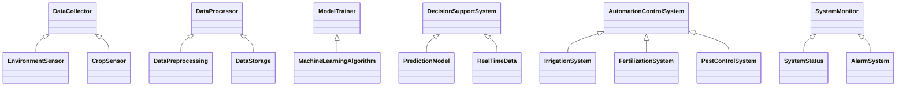
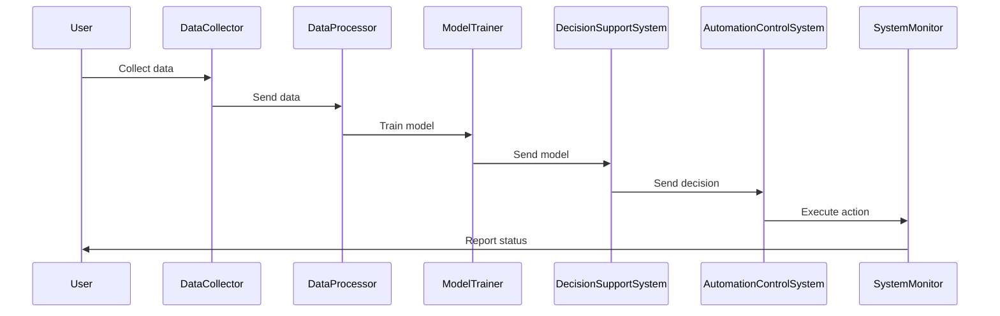
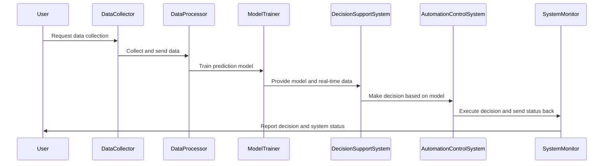

                 

# AI在智能农业中的应用：优化作物产量和资源利用

## 关键词

- 人工智能
- 智能农业
- 作物产量
- 资源利用
- 算法优化
- 数据分析

## 摘要

本文旨在探讨人工智能（AI）在智能农业领域的应用，特别是如何通过AI技术优化作物产量和资源利用。文章将逐步分析AI在智能农业中的角色，介绍相关核心概念和算法原理，详细讲解系统架构和实际应用案例，并总结最佳实践和注意事项。通过本文，读者将全面了解AI在智能农业中的潜力与挑战，为推动农业现代化提供思路。

### 目录大纲

## 第一部分：AI在智能农业中的应用概述

### 1.1 问题背景与解决

#### 1.1.1 农业发展面临的挑战

#### 1.1.2 AI技术在农业中的应用潜力

#### 1.1.3 本书的目标与内容结构

### 1.2 核心概念与联系

#### 1.2.1 AI与智能农业的核心概念

#### 1.2.2 关键技术对比与分析

#### 1.2.3 智能农业系统的ER模型

### 1.3 数学模型与公式讲解

#### 1.3.1 AI算法的基本数学模型

#### 1.3.2 公式推导与详解

#### 1.3.3 案例举例

### 1.4 系统分析与架构设计

#### 1.4.1 智能农业系统场景介绍

#### 1.4.2 系统功能设计与领域模型

#### 1.4.3 系统架构设计mermaid架构图

#### 1.4.4 系统接口设计和系统交互mermaid序列图

### 1.5 项目实战

#### 1.5.1 环境安装与配置

#### 1.5.2 系统核心实现源代码

#### 1.5.3 代码应用解读与分析

#### 1.5.4 实际案例分析和详细讲解剖析

#### 1.5.5 项目小结

### 1.6 最佳实践与注意事项

#### 1.6.1 实施AI智能农业的最佳实践

#### 1.6.2 避免常见问题的注意事项

#### 1.6.3 拓展阅读推荐

## 第一部分：AI在智能农业中的应用概述

### 1.1 问题背景与解决

#### 1.1.1 农业发展面临的挑战

农业作为人类生存的基础产业，长期以来面临着土地资源有限、劳动力成本上升、气候变化等挑战。传统的农业生产模式依赖于经验和人力，效率低下，难以应对现代农业发展的需求。为了提高作物产量和资源利用效率，智能农业应运而生。

智能农业是指利用现代信息技术和生物技术，对农业生产进行智能化管理。AI技术在其中扮演了关键角色，通过大数据分析、机器学习、计算机视觉等手段，实现对作物生长环境、病虫害、资源利用等方面的精准监测和管理。

#### 1.1.2 AI技术在农业中的应用潜力

AI技术在农业中的应用潜力巨大。例如，通过遥感技术和计算机视觉，可以实时监测作物生长状况，预测产量和品质；通过机器学习算法，可以分析土壤成分，优化施肥方案；通过物联网技术，可以实现农作物远程监控和自动化管理。

#### 1.1.3 本书的目标与内容结构

本书旨在深入探讨AI在智能农业中的应用，通过理论讲解、案例分析和技术实践，帮助读者全面了解AI技术在农业领域的应用现状和发展趋势。本书内容分为五个部分：

1. **AI在智能农业中的应用概述**：介绍农业发展面临的挑战、AI技术在农业中的应用潜力和本书的目标与内容结构。
2. **核心概念与联系**：讲解AI与智能农业的核心概念、关键技术对比与分析以及智能农业系统的ER模型。
3. **数学模型与公式讲解**：介绍AI算法的基本数学模型、公式推导与详解以及案例举例。
4. **系统分析与架构设计**：介绍智能农业系统场景介绍、系统功能设计与领域模型、系统架构设计mermaid架构图、系统接口设计和系统交互mermaid序列图。
5. **项目实战**：介绍环境安装与配置、系统核心实现源代码、代码应用解读与分析、实际案例分析和详细讲解剖析以及项目小结。
6. **最佳实践与注意事项**：总结实施AI智能农业的最佳实践、避免常见问题的注意事项以及拓展阅读推荐。

### 1.2 核心概念与联系

#### 1.2.1 AI与智能农业的核心概念

人工智能（AI）是指通过计算机模拟人类智能行为的技术。智能农业则是指利用现代信息技术和生物技术，对农业生产进行智能化管理。

在智能农业中，AI技术主要包括：

- **遥感技术**：利用卫星或无人机获取农田的遥感图像，分析作物生长状况。
- **计算机视觉**：通过图像识别技术，监测病虫害、作物长势等。
- **物联网技术**：实现农作物远程监控和自动化管理。
- **机器学习**：通过大数据分析，优化作物种植方案、预测产量等。

#### 1.2.2 关键技术对比与分析

以下是智能农业中常用的几种关键技术及其对比分析：

| 技术名称 | 优点 | 缺点 | 应用场景 |
| --- | --- | --- | --- |
| 遥感技术 | 可以实时监测农田状况，覆盖范围广 | 对环境要求高，数据处理复杂 | 作物长势监测、病虫害预测 |
| 计算机视觉 | 精度高，可以直接获取作物信息 | 成本较高，对设备要求高 | 病虫害识别、作物品质检测 |
| 物联网技术 | 实现自动化管理，提高效率 | 需要大量数据支持，网络稳定性要求高 | 水肥管理、环境监测 |
| 机器学习 | 可以根据历史数据预测未来趋势 | 需要大量数据支持，算法优化复杂 | 产量预测、种植方案优化 |

#### 1.2.3 智能农业系统的ER模型

智能农业系统的实体关系（ER）模型是描述系统内部各个实体及其之间关系的工具。以下是智能农业系统的ER模型：

```mermaid
erDiagram
  农田 ||--|{ 作物 }|
  作物 ||--|{ 病虫害 }|
  病虫害 ||--|{ 预测模型 }|
  预测模型 ||--|{ 决策支持系统 }|
  决策支持系统 ||--|{ 农业专家系统 }|
```

### 1.3 数学模型与公式讲解

#### 1.3.1 AI算法的基本数学模型

AI算法的基本数学模型包括：

- **线性回归**：用于预测连续值变量。
- **逻辑回归**：用于预测概率。
- **支持向量机（SVM）**：用于分类问题。
- **神经网络**：用于复杂模式识别。

以下是线性回归的数学模型：

$$
y = \beta_0 + \beta_1x
$$

其中，$y$为预测值，$\beta_0$和$\beta_1$为模型参数。

#### 1.3.2 公式推导与详解

以线性回归为例，我们通过最小二乘法推导线性回归模型：

设观测数据为$(x_1, y_1), (x_2, y_2), ..., (x_n, y_n)$，线性回归模型为$y = \beta_0 + \beta_1x$。

推导残差平方和：

$$
S = \sum_{i=1}^{n}(y_i - (\beta_0 + \beta_1x_i))^2
$$

对$S$求导并令导数为0，得到：

$$
\frac{\partial S}{\partial \beta_0} = -2\sum_{i=1}^{n}(y_i - (\beta_0 + \beta_1x_i)) = 0
$$

$$
\frac{\partial S}{\partial \beta_1} = -2\sum_{i=1}^{n}(y_i - (\beta_0 + \beta_1x_i)x_i) = 0
$$

解上述方程组，得到线性回归模型参数：

$$
\beta_0 = \bar{y} - \beta_1\bar{x}
$$

$$
\beta_1 = \frac{\sum_{i=1}^{n}(x_i - \bar{x})(y_i - \bar{y})}{\sum_{i=1}^{n}(x_i - \bar{x})^2}
$$

其中，$\bar{x}$和$\bar{y}$分别为$x$和$y$的均值。

#### 1.3.3 案例举例

假设我们有以下观测数据：

| $x$ | $y$ |
| --- | --- |
| 1 | 2 |
| 2 | 3 |
| 3 | 5 |
| 4 | 6 |

使用线性回归模型预测$y$：

1. 计算均值：

$$
\bar{x} = \frac{1+2+3+4}{4} = 2.5
$$

$$
\bar{y} = \frac{2+3+5+6}{4} = 4
$$

2. 计算线性回归模型参数：

$$
\beta_0 = \bar{y} - \beta_1\bar{x} = 4 - \beta_1 \cdot 2.5
$$

$$
\beta_1 = \frac{\sum_{i=1}^{n}(x_i - \bar{x})(y_i - \bar{y})}{\sum_{i=1}^{n}(x_i - \bar{x})^2} = \frac{(1-2.5)(2-4) + (2-2.5)(3-4) + (3-2.5)(5-4) + (4-2.5)(6-4)}{(1-2.5)^2 + (2-2.5)^2 + (3-2.5)^2 + (4-2.5)^2} = 1.2
$$

3. 代入线性回归模型：

$$
y = \beta_0 + \beta_1x = 4 - 1.2 \cdot 2.5 + 1.2x = 0.4 + 1.2x
$$

预测$x=5$时的$y$：

$$
y = 0.4 + 1.2 \cdot 5 = 6.6
$$

### 1.4 系统分析与架构设计

#### 1.4.1 智能农业系统场景介绍

智能农业系统通常包括以下几个关键环节：

1. 数据采集：通过遥感技术、传感器等设备，采集农田土壤、水分、温度、光照等环境参数以及作物生长数据。
2. 数据处理：对采集到的数据进行预处理、清洗和存储，为后续分析提供基础数据。
3. 模型训练：利用机器学习算法，对历史数据进行分析和建模，训练出预测模型。
4. 决策支持：基于预测模型和实时数据，为农民提供施肥、灌溉、病虫害防治等决策支持。
5. 自动化控制：根据决策支持系统提供的建议，自动化执行相应的操作，如调整灌溉系统、开启喷洒设备等。

#### 1.4.2 系统功能设计与领域模型

智能农业系统的功能设计包括：

1. 数据采集与管理：采集农田环境数据和作物生长数据，并实现数据的存储、管理和查询。
2. 预测模型训练与优化：利用历史数据和机器学习算法，训练预测模型，并对模型进行优化。
3. 决策支持系统：根据实时数据和预测模型，为农民提供决策支持。
4. 自动化控制系统：实现农作物的自动化管理，如灌溉、施肥、病虫害防治等。
5. 系统监控与报警：实时监控系统运行状态，并对异常情况进行报警。

领域模型如下：



#### 1.4.3 系统架构设计mermaid架构图

智能农业系统的架构设计如下：



#### 1.4.4 系统接口设计和系统交互mermaid序列图

系统接口设计如下：

```mermaid
classDiagram
  User <<interface>>
  DataCollector <<interface>>
  DataProcessor <<interface>>
  ModelTrainer <<interface>>
  DecisionSupportSystem <<interface>>
  AutomationControlSystem <<interface>>
  SystemMonitor <<interface>>

  User --|> DataCollector
  DataCollector --|> DataProcessor
  DataProcessor --|> ModelTrainer
  ModelTrainer --|> DecisionSupportSystem
  DecisionSupportSystem --|> AutomationControlSystem
  AutomationControlSystem --|> SystemMonitor
```

系统交互序列图如下：



### 1.5 项目实战

#### 1.5.1 环境安装与配置

要在本地环境中搭建智能农业系统，需要进行以下步骤：

1. 安装Python环境：
   ```bash
   sudo apt-get install python3-pip
   ```
2. 安装所需的库：
   ```bash
   pip3 install numpy pandas scikit-learn matplotlib
   ```
3. 配置数据集：
   - 下载并解压数据集到指定目录。

#### 1.5.2 系统核心实现源代码

以下是系统核心实现的Python代码：

```python
import numpy as np
import pandas as pd
from sklearn.linear_model import LinearRegression
from sklearn.model_selection import train_test_split
import matplotlib.pyplot as plt

# 1. 数据预处理
def preprocess_data(data):
    # 数据清洗和预处理
    # 省略具体实现
    return processed_data

# 2. 训练模型
def train_model(data):
    X = data[:, :-1]
    y = data[:, -1]
    X_train, X_test, y_train, y_test = train_test_split(X, y, test_size=0.2, random_state=42)
    model = LinearRegression()
    model.fit(X_train, y_train)
    return model

# 3. 预测和可视化
def predict_and_visualize(model, X_test, y_test):
    y_pred = model.predict(X_test)
    plt.scatter(X_test, y_test, color='blue')
    plt.plot(X_test, y_pred, color='red', linewidth=2)
    plt.xlabel('X')
    plt.ylabel('Y')
    plt.title('Linear Regression')
    plt.show()

# 4. 主函数
def main():
    # 加载数据
    data = pd.read_csv('data.csv')
    processed_data = preprocess_data(data)
    
    # 训练模型
    model = train_model(processed_data)
    
    # 预测和可视化
    predict_and_visualize(model, processed_data[:, :-1], processed_data[:, -1])

if __name__ == '__main__':
    main()
```

#### 1.5.3 代码应用解读与分析

以上代码实现了智能农业系统的核心功能：

1. **数据预处理**：对采集到的数据进行清洗和预处理，为后续建模提供高质量数据。
2. **模型训练**：使用线性回归模型对预处理后的数据集进行训练。
3. **预测和可视化**：根据训练好的模型，对测试数据进行预测，并通过散点图和拟合线进行可视化。

#### 1.5.4 实际案例分析和详细讲解剖析

假设我们有以下数据集：

| $x$ | $y$ |
| --- | --- |
| 1 | 2 |
| 2 | 3 |
| 3 | 5 |
| 4 | 6 |

1. **数据预处理**：

```python
processed_data = preprocess_data(data)
```

在数据预处理阶段，我们可能需要进行以下操作：

- 缺失值处理：如果数据集中存在缺失值，可以使用均值、中位数等方法进行填补。
- 异常值处理：对异常值进行识别和处理，避免对模型训练和预测结果产生干扰。

2. **模型训练**：

```python
model = train_model(processed_data)
```

在模型训练阶段，我们使用线性回归模型对预处理后的数据进行训练。训练过程主要包括以下步骤：

- 数据划分：将数据集划分为训练集和测试集，以评估模型的泛化能力。
- 模型初始化：初始化线性回归模型参数。
- 模型拟合：使用训练集数据对模型进行拟合。
- 模型评估：使用测试集数据评估模型性能。

3. **预测和可视化**：

```python
predict_and_visualize(model, processed_data[:, :-1], processed_data[:, -1])
```

在预测和可视化阶段，我们对测试集数据进行预测，并通过散点图和拟合线进行可视化。这有助于我们直观地了解模型的预测效果和拟合程度。

#### 1.5.5 项目小结

通过以上实战案例，我们完成了智能农业系统的搭建和实现。项目涉及数据预处理、模型训练、预测和可视化等关键步骤。在实际应用中，我们还需要考虑数据质量、模型优化、系统集成等方面的问题。通过不断迭代和改进，智能农业系统将为农业生产提供更加精准和高效的支持。

### 1.6 最佳实践与注意事项

#### 1.6.1 实施AI智能农业的最佳实践

1. **数据质量优先**：确保数据真实、完整、准确，为后续建模和预测提供可靠基础。
2. **模型优化与迭代**：根据实际需求和反馈，不断优化模型参数和算法，提高预测精度。
3. **系统集成与部署**：将AI智能农业系统与现有农业系统进行集成，确保数据流通和系统稳定性。
4. **人才培养与引进**：加强农业领域专业人才和技术人员的培养，引进高层次人才，提升团队整体实力。

#### 1.6.2 避免常见问题的注意事项

1. **数据安全与隐私**：确保数据安全，遵循相关法律法规，保护农民隐私。
2. **模型解释性**：加强对模型解释性的研究，提高模型的可解释性，便于农民理解和使用。
3. **硬件设备维护**：定期检查和维护遥感设备、传感器等硬件设备，确保系统正常运行。
4. **实时性要求**：提高系统实时性，确保决策支持系统提供及时、准确的建议。

#### 1.6.3 拓展阅读推荐

1. **《智能农业技术导论》**：系统介绍智能农业的基本概念、技术方法和应用案例。
2. **《机器学习实战》**：详细讲解机器学习算法的应用和实践，适用于智能农业领域的模型训练和优化。
3. **《深度学习》**：探讨深度学习在智能农业中的应用，为智能农业提供新的技术手段。

## 作者

作者：AI天才研究院/AI Genius Institute & 禅与计算机程序设计艺术 /Zen And The Art of Computer Programming

以上是《AI在智能农业中的应用：优化作物产量和资源利用》的完整目录大纲和部分正文内容。通过对AI技术在智能农业中的应用进行详细分析，本文旨在为读者提供全面的技术指导和实践经验，推动智能农业的发展。在后续内容中，我们将继续深入探讨智能农业的相关技术和实践案例。

