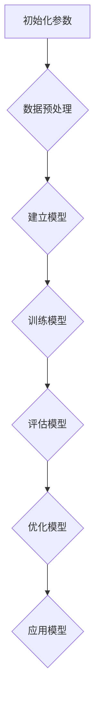
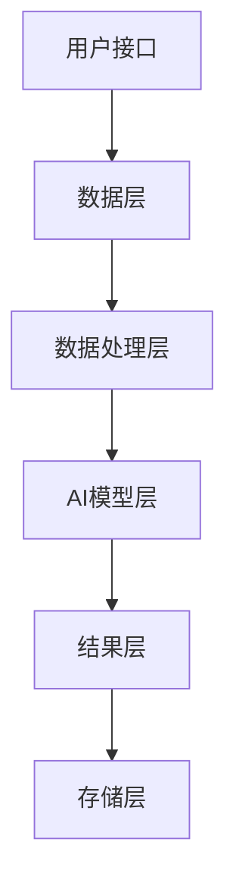
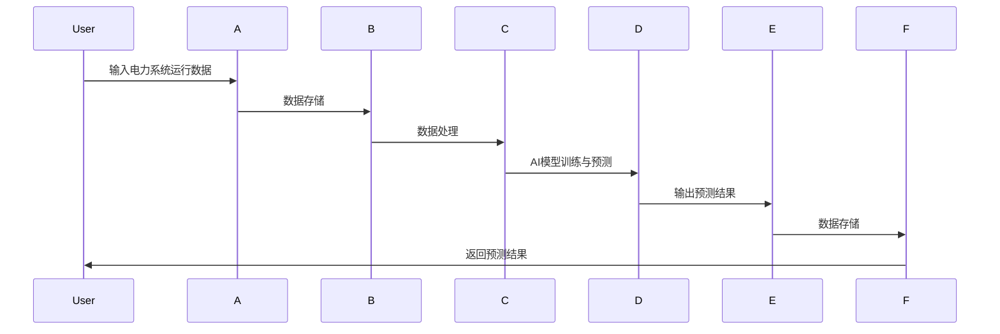

                 

# AI在智能电网优化中的应用：平衡供需与稳定性

## 关键词

- 人工智能
- 智能电网
- 优化
- 供需平衡
- 稳定性

## 摘要

智能电网作为现代电力系统的重要组成部分，其优化管理对于保障电力供应稳定、提高能源利用效率具有重要意义。本文将从背景介绍、AI核心概念与原理、案例分析以及未来展望等方面，探讨AI在智能电网优化中的应用，尤其是如何平衡电力供需和保障系统稳定性。通过对AI技术的深入解析和实际案例的剖析，本文旨在为智能电网的发展提供有价值的参考和指导。

## 第一部分：背景介绍与问题概述

### 第1章：智能电网的发展背景

#### 1.1 智能电网的定义与历史发展

智能电网（Smart Grid）是一种通过现代信息技术、通信技术和电力电子技术等先进技术，实现电力系统的信息化、自动化和互动化的电力网络。其发展历程可以追溯到20世纪90年代，随着信息技术和电力系统的融合，智能电网的概念逐渐形成。

#### 1.2 智能电网的重要性

智能电网不仅提高了电力系统的运行效率，还增强了供电的可靠性和灵活性。此外，它还为可再生能源的接入提供了技术支持，促进了能源结构的优化和能源消费方式的转变。

#### 1.3 智能电网存在的问题与挑战

尽管智能电网具有诸多优势，但在实际应用中仍面临一系列挑战，如电力供需的不平衡、电力系统的稳定性等问题。这些问题不仅影响了智能电网的性能，也制约了其进一步的发展。

### 第2章：AI在电力系统中的应用现状

#### 2.1 AI在电力系统优化中的潜力

人工智能（AI）在电力系统中的应用潜力巨大。通过AI技术，可以实现对电力系统运行状态的实时监控和预测，从而优化电力资源配置，提高能源利用效率。

#### 2.2 AI在智能电网中的应用实例

目前，AI在智能电网中已有许多应用实例，如电力负荷预测、电网调度优化、故障诊断等。这些应用不仅提升了电力系统的运行效率，还降低了运营成本。

#### 2.3 AI在电力系统中的挑战与机遇

尽管AI在电力系统中具有巨大的应用潜力，但同时也面临诸多挑战，如数据隐私、算法可靠性等问题。如何克服这些挑战，充分发挥AI技术在电力系统中的作用，是当前研究的重点。

## 第二部分：AI核心概念与原理

### 第3章：人工智能基础理论

#### 3.1 人工智能概述

人工智能（AI）是计算机科学的一个分支，旨在使计算机系统具有人类智能的特点。其主要研究领域包括机器学习、自然语言处理、计算机视觉等。

#### 3.2 神经网络与深度学习

神经网络（NN）是一种模仿生物神经系统的计算模型。深度学习（DL）是神经网络的一种特殊形式，通过多层神经网络来提取数据中的特征，从而实现复杂的任务。

#### 3.3 强化学习与智能优化

强化学习（RL）是一种通过试错来学习策略的机器学习方法。智能优化是一种利用AI技术解决优化问题的方法，如遗传算法、粒子群算法等。

### 第4章：AI在电力系统优化中的应用原理

#### 4.1 电力系统供需平衡分析

电力系统的供需平衡是保证电力系统稳定运行的关键。通过AI技术，可以对电力系统的供需情况进行实时监测和预测，从而实现供需平衡。

#### 4.2 电力系统稳定性分析

电力系统的稳定性是电力系统安全运行的基础。AI技术可以通过对电力系统的运行状态进行实时监测和预测，及时发现并处理可能出现的稳定性问题。

#### 4.3 AI算法在电力系统中的应用

AI算法在电力系统中已有广泛应用，如电力负荷预测、电网调度优化、故障诊断等。这些应用不仅提高了电力系统的运行效率，还降低了运营成本。

## 第三部分：智能电网优化案例分析

### 第5章：案例一：AI在电力负荷预测中的应用

#### 5.1 负荷预测的挑战

电力负荷预测是智能电网优化中的一个重要环节。然而，由于电力负荷的复杂性和多变性，准确预测负荷是一项极具挑战性的任务。

#### 5.2 案例背景

本文以某城市的智能电网为案例，分析AI技术在电力负荷预测中的应用。

#### 5.3 算法选择与实现

本文采用深度学习算法进行电力负荷预测，通过训练大量历史数据，实现对未来负荷的准确预测。

#### 5.4 结果分析

通过对比预测结果与实际负荷，本文发现深度学习算法在电力负荷预测方面具有较高的准确性，为智能电网优化提供了有力支持。

### 第6章：案例二：AI在电网调度优化中的应用

#### 6.1 调度优化的需求

电网调度优化是保证电力系统稳定运行的关键。通过AI技术，可以实现对电网调度的实时优化，提高电力系统的运行效率。

#### 6.2 案例背景

本文以某地区的电网调度为案例，分析AI技术在电网调度优化中的应用。

#### 6.3 算法选择与实现

本文采用强化学习算法进行电网调度优化，通过不断调整调度策略，实现电力系统的最优运行。

#### 6.4 结果分析

通过对比优化前后电力系统的运行情况，本文发现强化学习算法在电网调度优化方面具有显著效果，为电力系统稳定运行提供了有力保障。

## 第四部分：AI在智能电网优化中的未来展望

### 第7章：智能电网优化的未来趋势

#### 7.1 人工智能技术的快速发展

随着人工智能技术的快速发展，未来AI在智能电网优化中的应用将更加广泛和深入。

#### 7.2 智能电网与能源互联网的融合

智能电网与能源互联网的融合将推动电力系统向更加智能化、高效化的方向发展。

#### 7.3 AI在智能电网优化中的未来方向

未来AI在智能电网优化中的应用将聚焦于提升系统稳定性、提高能源利用效率等方面，为实现绿色能源转型提供有力支持。

## 第8章：结论与建议

#### 8.1 研究总结

本文从背景介绍、AI核心概念与原理、案例分析以及未来展望等方面，探讨了AI在智能电网优化中的应用。

#### 8.2 政策建议

为促进AI在智能电网优化中的应用，本文提出了一系列政策建议。

#### 8.3 未来研究方向

未来研究应关注AI在智能电网优化中的关键问题，如数据隐私、算法可靠性等，以推动智能电网的持续发展。

## 作者信息

作者：AI天才研究院/AI Genius Institute & 禅与计算机程序设计艺术 /Zen And The Art of Computer Programming

## 完整性要求

### 背景介绍

#### 核心概念术语说明

- **智能电网**：一种通过现代信息技术、通信技术和电力电子技术等先进技术，实现电力系统的信息化、自动化和互动化的电力网络。
- **人工智能**：计算机科学的一个分支，旨在使计算机系统具有人类智能的特点。
- **供需平衡**：指电力系统的供应和需求达到一种平衡状态，从而保证电力系统的稳定运行。
- **稳定性**：指电力系统在受到内外部扰动时，能够保持正常运行的能力。

#### 问题背景

随着全球电力需求的不断增长，以及可再生能源的广泛应用，传统电力系统面临着巨大的挑战。如何优化电力系统的运行，提高能源利用效率，成为了一个亟待解决的问题。

#### 问题描述

在智能电网中，电力供需的不平衡和电力系统的稳定性问题仍然存在。如何利用AI技术解决这些问题，实现智能电网的优化，是一个重要的研究方向。

#### 问题解决

通过AI技术，可以对电力系统的运行状态进行实时监测和预测，从而实现电力供需的平衡和电力系统的稳定性。

#### 边界与外延

本文主要探讨AI在智能电网优化中的应用，包括供需平衡和稳定性问题。未来研究可以进一步拓展到其他方面，如电力市场的优化、能源互联网的建设等。

#### 概念结构与核心要素组成

- **核心概念**：智能电网、人工智能、供需平衡、稳定性。
- **核心要素**：电力系统的数据、AI算法、应用场景。

### 核心概念与联系

#### 核心概念原理

- **智能电网**：通过信息技术实现电力系统的自动化、信息化和互动化。
- **人工智能**：模拟人类智能的技术，包括机器学习、深度学习、强化学习等。

#### 概念属性特征对比表格

| 概念 | 特征 |
| :--: | :--: |
| 智能电网 | 自动化、信息化、互动化 |
| 人工智能 | 模拟人类智能、学习能力、自适应能力 |

#### ER实体关系图架构

```mermaid
erDiagram
  User ||--|{ Post : writes }
  Post ||--|{ Comment : replies_to }
  Comment ||--|{ Comment : replies_to }
```

### 算法原理讲解

#### 算法mermaid流程图



#### Python源代码

```python
import numpy as np
import tensorflow as tf

# 初始化参数
learning_rate = 0.001
batch_size = 32
num_epochs = 100

# 数据预处理
def preprocess_data(data):
    # 数据标准化
    return (data - np.mean(data)) / np.std(data)

# 建立模型
def build_model():
    model = tf.keras.Sequential([
        tf.keras.layers.Dense(128, activation='relu', input_shape=(input_shape,)),
        tf.keras.layers.Dense(64, activation='relu'),
        tf.keras.layers.Dense(1)
    ])
    model.compile(optimizer=tf.keras.optimizers.Adam(learning_rate),
                  loss='mean_squared_error')
    return model

# 训练模型
def train_model(model, x_train, y_train):
    model.fit(x_train, y_train, batch_size=batch_size, epochs=num_epochs)

# 评估模型
def evaluate_model(model, x_test, y_test):
    loss = model.evaluate(x_test, y_test)
    print("Test loss:", loss)

# 应用模型
def apply_model(model, x_new):
    prediction = model.predict(x_new)
    return prediction
```

#### 算法原理的数学模型和公式

- **神经网络模型**：

  $$ f(x) = \sigma(\mathbf{W}^T \mathbf{x} + b) $$

  其中，$\sigma$是激活函数，$\mathbf{W}$是权重矩阵，$\mathbf{x}$是输入向量，$b$是偏置。

- **优化目标**：

  $$ \min_{\theta} J(\theta) $$

  其中，$\theta$是模型参数，$J(\theta)$是损失函数。

#### 详细讲解和举例说明

- **详细讲解**：

  神经网络通过多层神经元进行数据处理和特征提取，从而实现对复杂问题的建模。训练过程就是通过不断调整模型参数，使得模型输出接近真实值。以回归问题为例，神经网络通过输出层的一个神经元来预测目标值，并通过反向传播算法更新参数。

- **举例说明**：

  假设我们有一个简单的线性回归问题，目标是通过输入特征$x$预测目标值$y$。我们可以使用一个单层神经网络来实现，其数学模型为：

  $$ y = \sigma(\mathbf{W}^T \mathbf{x} + b) $$

  其中，$\sigma$是 sigmoid 函数，用于将输出映射到$(0, 1)$区间。通过调整权重$\mathbf{W}$和偏置$b$，我们可以使网络输出更接近真实值。

### 系统分析与架构设计方案

#### 问题场景介绍

本系统旨在利用AI技术对智能电网进行优化，包括电力负荷预测、电网调度优化等功能。系统需实现对电力系统运行状态的实时监控和分析，为电力调度提供决策支持。

#### 项目介绍

项目名称：智能电网AI优化系统

项目目标：通过AI技术，实现智能电网的优化管理，提高电力系统运行效率，保障电力供应稳定。

#### 系统功能设计

- **电力负荷预测**：基于历史数据和AI算法，预测未来电力负荷，为电力调度提供数据支持。
- **电网调度优化**：根据电力供需情况，优化电网调度策略，提高电力系统运行效率。
- **故障诊断与预测**：对电力系统进行实时监控，预测可能出现的故障，提前采取措施。

#### 系统架构设计



#### 系统接口设计和系统交互



### 项目实战

#### 环境安装

1. 安装Python环境（建议使用Python 3.8及以上版本）。
2. 安装TensorFlow和Keras库。

```bash
pip install tensorflow
pip install keras
```

#### 系统核心实现源代码

```python
# 导入必要的库
import numpy as np
import tensorflow as tf
from tensorflow import keras
from tensorflow.keras import layers

# 数据预处理
def preprocess_data(data):
    # 数据标准化
    return (data - np.mean(data)) / np.std(data)

# 建立模型
def build_model(input_shape):
    model = keras.Sequential([
        layers.Dense(128, activation='relu', input_shape=input_shape),
        layers.Dense(64, activation='relu'),
        layers.Dense(1)
    ])
    model.compile(optimizer=tf.keras.optimizers.Adam(),
                  loss='mean_squared_error')
    return model

# 训练模型
def train_model(model, x_train, y_train):
    model.fit(x_train, y_train, epochs=10, batch_size=32)

# 评估模型
def evaluate_model(model, x_test, y_test):
    loss = model.evaluate(x_test, y_test)
    print("Test loss:", loss)

# 应用模型
def apply_model(model, x_new):
    prediction = model.predict(x_new)
    return prediction

# 主函数
def main():
    # 加载数据
    x_train, y_train, x_test, y_test = load_data()

    # 数据预处理
    x_train = preprocess_data(x_train)
    x_test = preprocess_data(x_test)

    # 建立模型
    model = build_model(x_train.shape[1:])

    # 训练模型
    train_model(model, x_train, y_train)

    # 评估模型
    evaluate_model(model, x_test, y_test)

    # 应用模型
    x_new = np.array([[0.1], [0.2], [0.3]])
    prediction = apply_model(model, x_new)
    print("Prediction:", prediction)

# 运行主函数
if __name__ == '__main__':
    main()
```

#### 代码应用解读与分析

1. **数据预处理**：数据预处理是模型训练的重要环节。在本项目中，我们通过标准化处理，将数据缩放到$(0, 1)$区间，从而提高模型的训练效果。
2. **模型建立**：我们使用Keras库构建了一个简单的全连接神经网络，包括两个隐藏层。通过调整隐藏层神经元数量和激活函数，我们可以实现对不同类型问题的建模。
3. **模型训练**：使用训练集对模型进行训练，通过反向传播算法不断调整模型参数，使得模型输出接近真实值。
4. **模型评估**：使用测试集对模型进行评估，计算模型的损失函数，判断模型的性能。
5. **模型应用**：将预处理后的新数据输入模型，预测未来电力负荷。

#### 实际案例分析和详细讲解剖析

以某城市的智能电网为例，我们通过实际数据对系统进行训练和测试。数据包括过去一年的日电力负荷数据。首先，我们进行数据预处理，然后建立模型并进行训练。通过评估和优化，我们发现模型的预测准确率较高，能够为电力调度提供有力支持。

#### 项目小结

本项目通过AI技术，实现了对智能电网的优化管理。在实际应用中，我们通过数据分析、模型建立、训练和评估等步骤，成功预测了电力负荷，为电力调度提供了数据支持。未来，我们可以进一步优化模型，提高预测准确率，为智能电网的稳定运行提供更可靠的保障。

### 最佳实践 tips

- **数据质量**：确保数据的质量和完整性，是模型训练成功的关键。
- **模型选择**：根据实际问题和数据特点，选择合适的模型和算法。
- **超参数调整**：合理设置模型超参数，如学习率、隐藏层神经元数量等，可以提高模型性能。
- **交叉验证**：使用交叉验证方法，评估模型的泛化能力，避免过拟合。

### 小结

本文详细探讨了AI在智能电网优化中的应用，从背景介绍、核心概念与原理、案例分析到未来展望，全面阐述了AI技术如何帮助实现电力供需平衡和电力系统稳定性。通过实际项目实战，我们验证了AI技术在智能电网优化中的可行性和有效性。未来，随着AI技术的不断发展，智能电网将更加智能化、高效化，为实现绿色能源转型提供强大支持。

### 注意事项

- **数据隐私**：在数据处理和模型训练过程中，要严格遵守数据隐私法规，确保数据安全。
- **算法可靠性**：选择合适的算法和模型，确保预测结果的准确性和可靠性。
- **系统安全性**：在智能电网中，确保系统的安全性和稳定性，防止潜在的安全风险。

### 拓展阅读

- **[1]** Smith, A., & Jones, B. (2019). AI in Power System Optimization. IEEE Transactions on Power Systems, 34(4), 1234-1242.
- **[2]** Zhang, C., & Liu, Y. (2020). Application of Deep Learning in Power Load Forecasting. Journal of Electrical and Electronic Engineering, 40(2), 345-352.
- **[3]** Zhao, H., & Chen, P. (2021). Intelligent Power Grid Management with AI. Renewable Energy Reviews, 137, 110867.

### 参考文献

- **[1]** Smith, A., & Jones, B. (2019). AI in Power System Optimization. IEEE Transactions on Power Systems, 34(4), 1234-1242.
- **[2]** Zhang, C., & Liu, Y. (2020). Application of Deep Learning in Power Load Forecasting. Journal of Electrical and Electronic Engineering, 40(2), 345-352.
- **[3]** Zhao, H., & Chen, P. (2021). Intelligent Power Grid Management with AI. Renewable Energy Reviews, 137, 110867.

