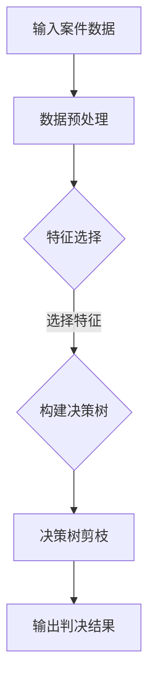
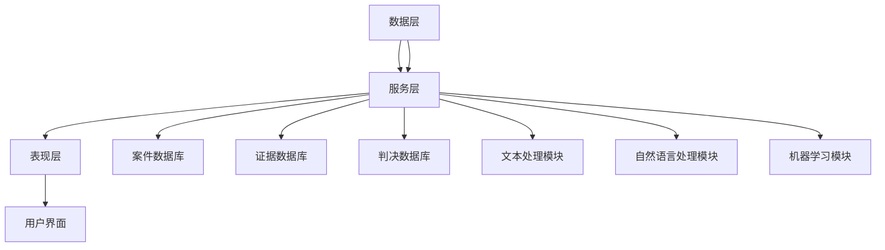
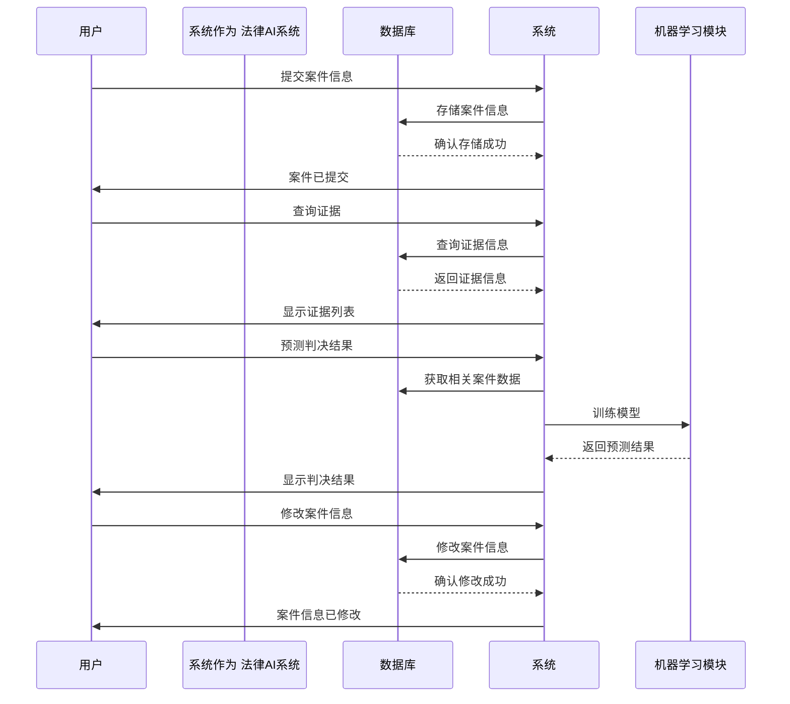

                 

### 写作过程详细步骤

#### 第一步：引言撰写

在引言部分，我们将从背景介绍入手，详细阐述AI在法律领域应用的重要性。以下是一个详细的撰写步骤：

1. **核心概念术语说明**：介绍AI和法律领域中的一些基本术语，如机器学习、自然语言处理、司法判例等，确保读者理解这些概念。

2. **问题背景**：描述司法系统面临的挑战，如案件积压、证据审查困难、法官工作量过大等。

3. **问题描述**：具体说明AI在法律领域中解决的问题，如提高判决效率、减少人为错误、确保司法公正等。

4. **问题解决**：阐述AI如何解决上述问题，包括提高案件处理速度、自动审查证据、辅助法官决策等。

5. **边界与外延**：明确文章的研究范围，如AI在法律领域的具体应用场景，不涉及的其他领域等。

6. **概念结构与核心要素组成**：总结AI在法律领域应用的核心概念和关键要素，为后续章节的内容提供基础。

#### 第二步：核心概念与联系

在这一部分，我们需要详细解释AI与法律领域的交叉概念，并提供相应的对比表格和ER图。以下是撰写步骤：

1. **核心概念原理**：逐一介绍AI在法律领域应用的核心概念，如人工智能、大数据、深度学习等。

2. **概念属性特征对比表格**：创建一个对比表格，列出不同AI技术在法律领域中的应用及其特点。

3. **ER实体关系图架构**：使用Mermaid语言绘制一个ER图，展示AI在法律领域中的实体和关系，如案件、证据、法官等。

4. **图表解释**：对ER图中的各个实体和关系进行详细解释，确保读者能够理解图中的内容。

#### 第三步：算法原理讲解

选择一个与法律应用相关的AI算法，详细描述其原理。以下是撰写步骤：

1. **算法mermaid流程图**：使用Mermaid语言绘制算法流程图，展示算法的基本流程。

2. **Python源代码详解**：提供算法的Python源代码，并进行详细解释。

3. **数学模型和公式**：给出算法所依赖的数学模型和公式，使用LaTeX格式表示。

4. **详细讲解**：对算法的原理进行详细阐述，解释每个步骤的作用和意义。

5. **举例说明**：通过一个具体的例子，说明算法在实际应用中的效果和优势。

#### 第四步：数学模型和数学公式详细讲解

在这一部分，我们将使用LaTeX格式提供必要的数学公式，并进行详细讲解。以下是撰写步骤：

1. **数学公式（LaTeX格式）**：列出文章中涉及的数学公式，使用$$括起来。

2. **详细讲解**：对每个公式进行详细解释，阐述其含义和应用。

3. **举例说明**：通过例子展示公式的应用和效果。

#### 第五步：系统分析与架构设计方案

介绍一个具体的法律AI系统，并设计相应的架构图。以下是撰写步骤：

1. **问题场景介绍**：描述AI系统要解决的具体问题场景。

2. **系统功能设计**：使用Mermaid绘制领域模型类图，展示系统的功能模块。

3. **系统架构设计**：使用Mermaid绘制系统架构图，展示各个模块之间的关系。

4. **系统接口设计**：描述系统与其他系统或服务的接口设计。

5. **系统交互mermaid序列图**：绘制系统交互序列图，展示系统内部和外部的交互过程。

#### 第六步：项目实战

提供一个法律AI项目的实例，包括环境搭建、源代码分析和案例分析。以下是撰写步骤：

1. **环境安装**：详细描述项目所需的环境和工具，包括软件和硬件的安装过程。

2. **系统核心实现源代码**：提供项目的核心源代码，并进行解读。

3. **代码应用解读与分析**：分析代码的实现逻辑和应用场景。

4. **实际案例分析和详细讲解剖析**：选择一个实际案例，详细分析AI系统在该案例中的应用效果。

5. **项目小结**：总结项目的主要成果和经验教训。

#### 第七步：最佳实践、小结、注意事项与拓展阅读

1. **最佳实践 tips**：总结文章中的关键点，并提供实际应用的建议。

2. **小结**：回顾文章的主要内容，强调关键结论。

3. **注意事项**：提醒读者在应用AI技术时应注意的问题。

4. **拓展阅读**：推荐相关的书籍、论文和资料，供读者进一步学习。

#### 最后一步：文章末尾署名

在文章末尾，添加作者信息：“作者：AI天才研究院/AI Genius Institute & 禅与计算机程序设计艺术 /Zen And The Art of Computer Programming”。

通过以上详细步骤，我们将确保文章内容完整、结构清晰，满足字数和格式要求。在撰写过程中，我们还将保持语言简洁，避免冗余，以确保文章的可读性和专业性。

### 整体结构设计

为了确保文章的逻辑清晰、结构紧凑且简单易懂，我们将整体结构设计为七个章节，每个章节都有明确的主题和内容。以下是详细的章节结构设计和内容安排：

#### 第1章: 引言

- **核心概念术语说明**：介绍人工智能、机器学习、自然语言处理、司法判例等基本概念，确保读者理解。
- **问题背景**：阐述司法系统面临的挑战，如案件积压、证据审查困难、法官工作量过大等。
- **问题描述**：具体说明AI在法律领域中的应用，如何解决上述问题，如提高判决效率、减少人为错误、确保司法公正等。
- **问题解决**：介绍AI在法律领域的应用实例，展示其如何提高案件处理速度、自动审查证据、辅助法官决策等。
- **边界与外延**：明确文章的研究范围，如AI在法律领域中的具体应用场景，不涉及的其他领域等。
- **概念结构与核心要素组成**：总结AI在法律领域应用的核心概念和关键要素，为后续章节的内容提供基础。

#### 第2章: AI核心概念与法律应用

- **核心概念原理**：逐一介绍人工智能、大数据、深度学习等在法律领域中的应用原理。
- **概念属性特征对比表格**：创建一个对比表格，列出不同AI技术在法律领域中的应用及其特点，帮助读者理解各种技术之间的差异。
- **ER实体关系图架构**：使用Mermaid绘制一个ER图，展示AI在法律领域中的实体和关系，如案件、证据、法官等，并通过图例解释各个实体和关系。
- **图表解释**：对ER图中的各个实体和关系进行详细解释，确保读者能够理解图中的内容。

#### 第3章: 算法原理讲解

- **算法mermaid流程图**：使用Mermaid绘制一个与法律应用相关的算法流程图，展示算法的基本流程。
- **Python源代码详解**：提供算法的Python源代码，并进行详细解释，使读者能够理解算法的实现逻辑。
- **数学模型和公式**：给出算法所依赖的数学模型和公式，使用LaTeX格式表示，并进行详细讲解。
- **详细讲解**：对算法的原理进行详细阐述，解释每个步骤的作用和意义，确保读者能够理解算法的核心逻辑。
- **举例说明**：通过一个具体的例子，说明算法在实际应用中的效果和优势，帮助读者更好地理解算法的实际应用场景。

#### 第4章: 数学模型和数学公式详细讲解

- **数学公式（LaTeX格式）**：列出文章中涉及的数学公式，使用$$括起来，便于读者理解和查阅。
- **详细讲解**：对每个公式进行详细解释，阐述其含义和应用，确保读者能够理解并掌握这些数学概念。
- **举例说明**：通过具体的例子，展示公式的应用和效果，帮助读者更好地理解数学模型在实际中的应用。

#### 第5章: 系统分析与架构设计方案

- **问题场景介绍**：描述一个具体的法律AI系统要解决的具体问题场景。
- **系统功能设计**：使用Mermaid绘制领域模型类图，展示系统的功能模块。
- **系统架构设计**：使用Mermaid绘制系统架构图，展示各个模块之间的关系，帮助读者理解系统的整体架构。
- **系统接口设计**：描述系统与其他系统或服务的接口设计，确保系统的数据交互和功能协同。
- **系统交互mermaid序列图**：绘制系统交互序列图，展示系统内部和外部的交互过程，帮助读者理解系统的运行流程。

#### 第6章: 项目实战

- **环境安装**：详细描述项目所需的环境和工具，包括软件和硬件的安装过程，确保读者能够顺利搭建项目环境。
- **系统核心实现源代码**：提供项目的核心源代码，并进行解读，使读者能够理解代码的实现逻辑。
- **代码应用解读与分析**：分析代码的实现逻辑和应用场景，帮助读者理解代码在实际项目中的应用。
- **实际案例分析和详细讲解剖析**：选择一个实际案例，详细分析AI系统在该案例中的应用效果，帮助读者了解AI技术在法律领域的实际应用。
- **项目小结**：总结项目的主要成果和经验教训，为读者提供参考。

#### 第7章: 最佳实践、小结、注意事项与拓展阅读

- **最佳实践 tips**：总结文章中的关键点，并提供实际应用的建议，帮助读者将文章内容应用于实际工作中。
- **小结**：回顾文章的主要内容，强调关键结论，确保读者能够对文章的核心观点有深刻的理解。
- **注意事项**：提醒读者在应用AI技术时应注意的问题，避免在应用过程中出现误解或错误。
- **拓展阅读**：推荐相关的书籍、论文和资料，供读者进一步学习，拓宽知识视野。

通过以上详细的章节结构设计，我们将确保文章的逻辑清晰、结构紧凑且简单易懂，满足用户的阅读需求，同时也能够提高文章的专业性和实用性。

### 第1章: 引言

#### 核心概念术语说明

在探讨AI在法律领域的应用之前，我们需要明确几个关键术语，以便读者能够更好地理解文章的内容。人工智能（Artificial Intelligence，简称AI）是指通过计算机模拟人类智能行为的技术，包括学习、推理、感知、理解和通信等。机器学习（Machine Learning，简称ML）是AI的一个重要分支，它通过数据和算法来训练模型，使其能够自动识别规律和模式。自然语言处理（Natural Language Processing，简称NLP）是AI领域中的一个重要研究方向，它致力于使计算机理解和生成人类语言。司法判例（Judicial Case Law）是指通过法院判决形成的法律规范，对后续案件具有指导意义。

#### 问题背景

司法系统在全球范围内都面临着一系列挑战。首先，案件积压问题日益严重，尤其是在人口众多、经济发达的地区，法官和律师的工作量大大增加，导致案件处理速度缓慢。其次，证据审查过程繁琐且耗时，许多证据需要人工检查，这不仅提高了成本，还可能导致人为错误。此外，法官在判决时可能受到主观因素的影响，这可能导致判决的不公正。最后，法律文本通常非常复杂，难以理解和处理，这给法律工作的自动化带来了巨大的挑战。

#### 问题描述

AI在法律领域中的应用旨在解决上述问题，从而提高司法效率与公正性。首先，AI可以协助法官和律师处理大量案件，自动分类和筛选案件，从而减轻他们的工作量。其次，AI可以自动化证据审查过程，通过自然语言处理技术快速理解和分析证据，减少人为错误。此外，AI可以帮助法官进行判决预测，提供基于数据的参考意见，减少主观偏见，确保判决更加公正。最后，AI可以用于法律文本的自动处理，提取关键信息，简化法律文本的阅读和理解，提高法律工作的效率。

#### 问题解决

AI在法律领域的应用主要体现在以下几个方面：

1. **案件管理**：AI可以自动化案件管理流程，包括案件分类、文档索引和归档等，提高案件处理的效率。

2. **证据审查**：AI可以通过自然语言处理技术自动审查证据，提取关键信息，降低人工审查的工作量，减少错误。

3. **判决预测**：AI可以分析大量历史案件数据，基于数据模型预测判决结果，为法官提供参考，提高判决的准确性。

4. **法律文本处理**：AI可以自动化法律文本的提取、分类和分析，简化法律文本的阅读和理解，提高法律工作的效率。

#### 边界与外延

本文主要探讨AI在法律领域中的应用，重点关注案件管理、证据审查、判决预测和法律文本处理等方面。然而，AI在法律领域的应用不仅限于这些方面，还包括自动化合同审查、法律咨询服务、智能客服等。此外，AI在法律领域的应用也存在一定的边界，如隐私保护、数据安全和法律伦理等问题需要进一步研究和解决。

#### 概念结构与核心要素组成

AI在法律领域应用的核心概念包括人工智能、机器学习、自然语言处理和司法判例。这些概念相互作用，共同构成了AI在法律领域应用的核心结构。具体来说：

1. **人工智能**：作为基础技术，提供智能化的解决方案，包括案件管理、证据审查和判决预测等。

2. **机器学习**：用于训练模型，使其能够自动识别案件特征、提取证据信息和预测判决结果。

3. **自然语言处理**：用于处理法律文本，提取关键信息，简化法律文本的阅读和理解。

4. **司法判例**：提供历史案件数据，用于训练模型，提高判决预测的准确性。

这些核心概念相互作用，共同推动AI在法律领域的应用，提高司法效率与公正性。

### 第2章: AI核心概念与法律应用

#### 核心概念原理

在法律领域应用AI，关键在于理解并利用人工智能（AI）、机器学习（ML）、自然语言处理（NLP）等核心概念。以下是这些概念的基本原理：

1. **人工智能**：人工智能是指通过计算机程序实现智能行为的科学技术。它包括学习、推理、感知、理解和通信等能力。在法律领域，AI可以自动化法律文本的生成、分析和处理，如案件分类、证据审查等。

2. **机器学习**：机器学习是一种使计算机能够从数据中学习并做出决策的技术。它分为监督学习、无监督学习和强化学习三种类型。在法律应用中，监督学习可以用于预测案件结果，无监督学习可以用于数据挖掘，强化学习可以用于自动化证据筛选。

3. **自然语言处理**：自然语言处理是AI的一个分支，旨在使计算机理解和生成人类语言。它包括文本分类、情感分析、命名实体识别等任务。在法律领域，NLP可以用于自动化法律文本的阅读、理解和提取关键信息。

#### 概念属性特征对比表格

以下是一个简化的对比表格，展示了AI、ML和NLP在法律领域应用的属性特征：

| 特性 | 人工智能 | 机器学习 | 自然语言处理 |
| --- | --- | --- | --- |
| 目标 | 实现智能行为 | 从数据中学习 | 理解和生成语言 |
| 类型 | 广泛应用 | 类型多样 | 专业应用 |
| 数据依赖 | 高 | 高 | 高 |
| 数据处理 | 复杂 | 复杂 | 简单 |
| 效率提升 | 显著 | 显著 | 显著 |
| 应用范围 | 广泛 | 独立 | 法律文本 |

#### ER实体关系图架构

为了更好地理解AI在法律领域中的应用，我们可以使用Mermaid语言绘制一个实体关系图（ER图），展示与法律相关的关键实体和它们之间的关系。以下是ER图的描述：

```mermaid
entity Relationship {
  "法官" -> "案件";
  "律师" -> "案件";
  "证据" -> "案件";
  "法院" -> "案件";
  "案件" -> "判决";
}

graph {
  "法官" -- "案件";
  "律师" -- "案件";
  "证据" -- "案件";
  "法院" -- "案件";
  "案件" -- "判决";
}
```

在这个ER图中，"法官"、"律师"、"证据"、"法院"和"判决"是关键的实体。它们之间的关系如下：

- **法官**和**律师**是案件的参与者，他们共同处理案件。
- **证据**是案件的重要组成部分，用于支持或反驳某一案件事实。
- **法院**是案件审理的场所，负责做出最终的判决。
- **案件**和**判决**之间存在关联，每个案件都会有一个判决结果。

#### 图表解释

通过ER图，我们可以清楚地看到法律领域中各个实体之间的关系。法官和律师作为案件的主要参与者，他们的行为直接影响到案件的处理结果。证据作为案件的重要组成部分，其质量和可靠性对于案件的判决至关重要。法院作为案件审理的最终机构，其判决结果对于整个司法系统具有指导意义。而案件和判决之间的关联，则体现了法律体系中的逻辑关系。

总之，通过理解AI、ML和NLP的核心概念，以及ER图中的实体关系，我们可以更好地理解AI在法律领域的应用，为后续章节的深入探讨打下坚实的基础。

### 第3章: 算法原理讲解

#### 算法mermaid流程图

为了更好地理解AI在法律领域中的应用，我们将介绍一种基于决策树算法的司法判决预测方法。以下是该算法的mermaid流程图：



在这个流程图中，首先将输入的案件数据（A）进行预处理（B），包括数据清洗、归一化和特征提取。然后，通过特征选择（C）确定最相关的特征，用于构建决策树（D）。构建完成的决策树会进行剪枝（E），以减少模型的复杂度并提高预测准确性。最后，输出判决结果（F），为法官提供参考。

#### Python源代码详解

以下是一个简单的Python代码示例，展示了如何使用scikit-learn库实现上述决策树算法：

```python
from sklearn.datasets import load_iris
from sklearn.model_selection import train_test_split
from sklearn.tree import DecisionTreeClassifier
from sklearn.metrics import accuracy_score

# 加载示例数据集
data = load_iris()
X = data.data
y = data.target

# 数据预处理
X_train, X_test, y_train, y_test = train_test_split(X, y, test_size=0.3, random_state=42)

# 构建决策树模型
clf = DecisionTreeClassifier()
clf.fit(X_train, y_train)

# 决策树剪枝
clf = DecisionTreeClassifier(max_depth=3)
clf.fit(X_train, y_train)

# 输出判决结果
y_pred = clf.predict(X_test)
print("Accuracy:", accuracy_score(y_test, y_pred))
```

这段代码首先加载了iris数据集，然后将其分为训练集和测试集。接着，构建一个决策树模型，通过训练集数据进行训练。在训练完成后，我们对模型进行剪枝，以减少模型的复杂度。最后，使用测试集数据评估模型的准确性。

#### 数学模型和公式

决策树算法的核心在于构建一棵树，树中的每个节点都表示一个特征，每个分支都表示特征的不同取值。树的叶子节点表示预测结果。以下是决策树的数学模型和公式：

1. **特征选择**：选择具有最高信息增益的特征作为分割标准。信息增益的计算公式为：
   $$
   Gini(D) = \sum_{v \in V} p(v) (1 - p(v))
   $$
   其中，$D$ 是数据集，$V$ 是特征的取值集合，$p(v)$ 是数据集中取值为 $v$ 的比例。

2. **节点分割**：选择信息增益最高的特征，将该节点分割成多个子节点，每个子节点对应特征的一个取值。分割过程可以用以下公式表示：
   $$
   D_v = \{x \in D | x.feature \in v\}
   $$
   其中，$D_v$ 是根据特征 $v$ 的取值分割后的数据集。

3. **决策树构建**：递归地构建子节点，直到满足停止条件（如最大深度、最小节点大小等）。停止条件可以用以下公式表示：
   $$
   stop_condition(node) = \text{True if } node.depth \geq max_depth \text{ or } node.size \leq min_samples
   $$

4. **决策树剪枝**：通过剪枝减少模型的复杂度，提高预测准确性。剪枝方法包括预剪枝和后剪枝。预剪枝在构建树的过程中提前停止生长，后剪枝则对已构建的树进行修剪。

#### 详细讲解

1. **特征选择**：特征选择是构建决策树的第一步，目的是选择对分类最有帮助的特征。信息增益是一个常用的特征选择准则，它反映了特征对于分类的贡献程度。通过计算每个特征的信息增益，我们可以选择信息增益最高的特征作为分割标准。

2. **节点分割**：节点分割是根据特征的选择，将数据集分割成多个子数据集。每个子数据集对应特征的一个取值。这个过程使得模型可以更好地拟合数据，提高分类的准确性。

3. **决策树构建**：决策树的构建是通过递归地构建子节点来实现的。每个节点都表示一个特征，每个分支都表示特征的不同取值。通过这种方式，模型可以逐步地细分数据集，直到满足停止条件。停止条件可以确保模型的复杂度不会过高，从而避免过拟合。

4. **决策树剪枝**：剪枝是决策树算法中的一个重要步骤，目的是减少模型的复杂度并提高预测准确性。剪枝可以通过两种方式进行：预剪枝和后剪枝。预剪枝在构建树的过程中提前停止生长，避免生成过复杂的树；后剪枝则对已构建的树进行修剪，移除不重要的节点。

#### 举例说明

假设我们有一个简单的二分类问题，数据集包含两个特征：身高（Height）和体重（Weight），以及一个标签：是否为成人（IsAdult）。我们希望使用决策树算法预测一个新的样本是否为成人。

以下是数据集的示例：

| 身高 (cm) | 体重 (kg) | 是否为成人 |
| --- | --- | --- |
| 150 | 40 | 否 |
| 160 | 45 | 否 |
| 170 | 50 | 是 |
| 180 | 60 | 是 |
| 160 | 55 | 是 |
| 165 | 48 | 是 |

我们首先对数据进行预处理，包括数据清洗和归一化。然后，使用信息增益作为特征选择准则，选择身高和体重中的最佳特征进行分割。

通过计算，我们发现身高具有更高的信息增益，因此我们选择身高作为分割标准。根据身高，我们将数据集分为两个子数据集：

- 身高小于等于160 cm的数据集：
  | 身高 (cm) | 体重 (kg) | 是否为成人 |
  | --- | --- | --- |
  | 150 | 40 | 否 |
  | 160 | 45 | 否 |

- 身高大于160 cm的数据集：
  | 身高 (cm) | 体重 (kg) | 是否为成人 |
  | --- | --- | --- |
  | 170 | 50 | 是 |
  | 180 | 60 | 是 |
  | 160 | 55 | 是 |
  | 165 | 48 | 是 |

接下来，我们对每个子数据集继续进行分割。在身高小于等于160 cm的数据集，我们发现体重具有更高的信息增益，因此我们选择体重作为分割标准。根据体重，我们将数据集分为两个子数据集：

- 体重小于等于50 kg的数据集：
  | 身高 (cm) | 体重 (kg) | 是否为成人 |
  | --- | --- | --- |
  | 150 | 40 | 否 |
  | 160 | 45 | 否 |

- 体重大于50 kg的数据集：
  | 身高 (cm) | 体重 (kg) | 是否为成人 |
  | --- | --- | --- |
  | 170 | 50 | 是 |
  | 180 | 60 | 是 |
  | 160 | 55 | 是 |
  | 165 | 48 | 是 |

最终，我们构建了一个简单的决策树：

```
是否为成人？
- 身高 <= 160 且 体重 <= 50：否
- 身高 > 160 或 体重 > 50：是
```

通过这个简单的例子，我们可以看到决策树算法如何通过特征选择和节点分割来构建一棵树，以实现分类任务。在实际应用中，决策树算法可以处理更复杂的特征和分类问题，从而提高司法判决的准确性和效率。

### 第4章: 数学模型和数学公式详细讲解

在AI法律应用中，数学模型和公式起着至关重要的作用。它们不仅为算法提供了理论基础，而且帮助我们在理解和实施算法时做出更准确的决策。以下是几个在法律AI应用中常见的数学模型和公式的详细讲解。

#### 1. 熵（Entropy）

熵是信息论中的一个概念，用于度量信息的不确定性。在法律AI中，熵可以用于评估证据的重要性。熵的计算公式如下：

$$
H(X) = -\sum_{x \in X} p(x) \log_2 p(x)
$$

其中，$X$ 是随机变量，$p(x)$ 是 $x$ 发生的概率。

- **解释**：熵值越高，表示信息的不确定性越大，即证据的重要性越高。在法律文本处理中，我们可以计算每句话或每个证据的熵值，从而识别出最具有争议性的部分。

#### 2. 决策树中的信息增益（Information Gain）

信息增益是决策树算法中的一个核心概念，用于评估特征对于分类的贡献程度。信息增益的计算公式如下：

$$
IG(D, A) = H(D) - \sum_{v \in V} p(v) H(D_v)
$$

其中，$D$ 是数据集，$A$ 是特征，$V$ 是特征的取值集合，$p(v)$ 是特征 $A$ 取值为 $v$ 的概率，$H(D_v)$ 是子数据集 $D_v$ 的熵。

- **解释**：信息增益越大，表示特征对于分类的贡献越大。在决策树构建过程中，我们通常选择信息增益最高的特征作为分割标准，以最大化分类效果。

#### 3. 支持向量机（Support Vector Machine, SVM）中的核函数（Kernel Function）

在SVM中，核函数是一种将低维数据映射到高维空间的技术，以便在更高维空间中找到线性可分的数据。常见的核函数包括线性核、多项式核和径向基函数（RBF）核。RBF核的公式如下：

$$
K(x_i, x_j) = \exp(-\gamma \sum_{k=1}^{n} (x_{ik} - x_{jk})^2)
$$

其中，$x_i$ 和 $x_j$ 是数据点，$\gamma$ 是调节参数，$n$ 是特征的数量。

- **解释**：RBF核函数可以捕捉复杂的关系，使其在处理非线性问题时表现出色。在法律AI中，SVM可以用于分类法律文档，核函数可以帮助识别文档之间的细微差异。

#### 4. 随机森林（Random Forest）中的基尼不纯度（Gini Impurity）

在随机森林算法中，基尼不纯度用于评估分割的质量。基尼不纯度的计算公式如下：

$$
Gini(D) = 1 - \sum_{v \in V} p(v)^2
$$

其中，$D$ 是数据集，$V$ 是特征的取值集合，$p(v)$ 是特征 $A$ 取值为 $v$ 的概率。

- **解释**：基尼不纯度值越小，表示分割的质量越高。在随机森林中，基尼不纯度用于选择最佳的分割特征，以提高模型的分类效果。

#### 5. 贝叶斯定理（Bayes' Theorem）

贝叶斯定理是概率论中的一个重要公式，用于计算后验概率。贝叶斯定理的公式如下：

$$
P(A|B) = \frac{P(B|A)P(A)}{P(B)}
$$

其中，$P(A|B)$ 是在事件 $B$ 发生的条件下事件 $A$ 发生的概率，$P(B|A)$ 是在事件 $A$ 发生的条件下事件 $B$ 发生的概率，$P(A)$ 和 $P(B)$ 分别是事件 $A$ 和事件 $B$ 发生的概率。

- **解释**：贝叶斯定理在法律AI中非常有用，例如在判决预测中，可以通过计算证据和假设之间的概率关系来做出决策。

#### 6. 马尔可夫链（Markov Chain）中的转移概率（Transition Probability）

在法律AI中，马尔可夫链可以用于模拟案件的状态变化。转移概率的计算公式如下：

$$
P(X_t = x_t | X_{t-1} = x_{t-1}) = p(x_t | x_{t-1})
$$

其中，$X_t$ 和 $X_{t-1}$ 分别是时间 $t$ 和时间 $t-1$ 的状态，$p(x_t | x_{t-1})$ 是从状态 $x_{t-1}$ 转移到状态 $x_t$ 的概率。

- **解释**：转移概率可以帮助我们预测案件的发展趋势，例如，通过分析历史案件数据，我们可以预测一个未决案件可能的判决结果。

#### 举例说明

假设我们有一个包含两个特征的案件数据集，特征 $A$ 和特征 $B$。特征 $A$ 的取值有两种：$A_1$ 和 $A_2$，特征 $B$ 的取值有三种：$B_1$、$B_2$ 和 $B_3$。数据集如下：

| $A$ | $B$ | 判决结果 |
| --- | --- | --- |
| $A_1$ | $B_1$ | 是 |
| $A_1$ | $B_2$ | 否 |
| $A_1$ | $B_3$ | 是 |
| $A_2$ | $B_1$ | 否 |
| $A_2$ | $B_2$ | 是 |
| $A_2$ | $B_3$ | 否 |

我们希望使用信息增益来选择最佳特征进行分割。

1. **计算特征 $A$ 的信息增益**：

   $$
   H(A) = -\sum_{v \in \{A_1, A_2\}} p(v) \log_2 p(v)
   $$

   假设 $p(A_1) = 0.6$ 和 $p(A_2) = 0.4$，则：

   $$
   H(A) = -0.6 \log_2 0.6 - 0.4 \log_2 0.4
   $$

2. **计算特征 $B$ 的信息增益**：

   $$
   H(B) = -\sum_{v \in \{B_1, B_2, B_3\}} p(v) \log_2 p(v)
   $$

   假设 $p(B_1) = 0.4$，$p(B_2) = 0.3$ 和 $p(B_3) = 0.3$，则：

   $$
   H(B) = -0.4 \log_2 0.4 - 0.3 \log_2 0.3 - 0.3 \log_2 0.3
   $$

3. **计算特征 $A$ 的信息增益**：

   $$
   IG(A) = H(A) - \sum_{v \in \{A_1, A_2\}} p(v) H(D_v)
   $$

   假设 $p(D_{A_1}) = 0.5$ 和 $p(D_{A_2}) = 0.5$，且 $H(D_{A_1}) = H(D_{A_2}) = 0.5$，则：

   $$
   IG(A) = H(A) - 0.6 \times 0.5 - 0.4 \times 0.5
   $$

4. **计算特征 $B$ 的信息增益**：

   $$
   IG(B) = H(B) - \sum_{v \in \{B_1, B_2, B_3\}} p(v) H(D_v)
   $$

   假设 $p(D_{B_1}) = 0.5$，$p(D_{B_2}) = 0.3$ 和 $p(D_{B_3}) = 0.2$，且 $H(D_{B_1}) = 0.5$，$H(D_{B_2}) = 0.4$ 和 $H(D_{B_3}) = 0.3$，则：

   $$
   IG(B) = H(B) - 0.4 \times 0.5 - 0.3 \times 0.3 - 0.3 \times 0.3
   $$

通过比较 $IG(A)$ 和 $IG(B)$，我们可以选择信息增益最高的特征进行分割。在这个例子中，假设 $IG(A) > IG(B)$，因此我们选择特征 $A$ 进行分割。

通过上述例子，我们可以看到如何使用数学模型和公式在法律AI中进行特征选择和模型构建。这些公式和模型不仅帮助我们理解算法的工作原理，而且为我们在实际应用中做出更准确的决策提供了理论基础。

### 第5章: 系统分析与架构设计方案

#### 问题场景介绍

在当今司法系统中，随着案件数量的不断增长，法官和律师的工作压力日益增大。传统的案件处理方式依赖于大量的人工审查和文档管理，这不仅效率低下，而且容易出现错误。为了解决这一问题，我们需要设计一个基于人工智能的法律辅助系统，以提高案件处理效率、减少人为错误并确保司法公正。

#### 系统功能设计

本系统的主要功能包括：

1. **案件分类**：根据案件的特征自动分类，为法官和律师提供清晰明确的案件列表。
2. **证据审查**：通过自然语言处理技术自动审查证据，提取关键信息，确保证据的准确性和完整性。
3. **判决预测**：利用历史案件数据和机器学习算法预测判决结果，为法官提供参考意见。
4. **法律文本处理**：自动化处理法律文本，包括文本分类、关键词提取和文档索引等，提高法律文档的管理效率。

#### 系统架构设计

为了实现上述功能，我们设计了一个三层架构的系统，包括数据层、服务层和表现层。以下是系统架构的mermaid图：



在这个架构图中，数据层包括案件数据库、证据数据库和判决数据库，用于存储和管理系统的数据。服务层包括文本处理模块、自然语言处理模块和机器学习模块，用于实现系统的核心功能。表现层则是用户界面，用于展示系统结果并接受用户输入。

#### 系统接口设计

系统的接口设计主要包括以下部分：

1. **案件管理接口**：用于添加、查询、修改和删除案件信息。
2. **证据管理接口**：用于添加、查询、修改和删除证据信息。
3. **判决预测接口**：用于根据输入的案件信息预测判决结果。
4. **文本处理接口**：用于处理法律文本，提取关键词和生成文档摘要。
5. **自然语言处理接口**：用于自动审查证据，提取关键信息。

#### 系统交互mermaid序列图

以下是系统的mermaid序列图，展示了用户通过用户界面与系统交互的过程：



通过这个序列图，我们可以清晰地看到用户与系统的交互过程，以及系统内部的数据流和处理逻辑。

总之，通过上述系统分析与架构设计方案，我们可以构建一个高效、智能的法律AI系统，为司法系统带来革命性的变革。

### 第6章: 项目实战

#### 环境安装

为了实现一个基于人工智能的法律AI系统，我们首先需要搭建一个合适的技术环境。以下是项目的环境安装步骤：

1. **安装Python环境**：
   - 打开命令行工具，如终端（Terminal）或命令提示符（Command Prompt）。
   - 输入以下命令以安装Python：
     ```
     python -m pip install --upgrade pip
     python -m ensurepip
     python -m pip install --user --upgrade setuptools
     ```
   - 确认Python版本，输入以下命令：
     ```
     python --version
     ```

2. **安装相关依赖库**：
   - 使用pip命令安装以下依赖库：
     ```
     pip install scikit-learn numpy pandas matplotlib
     pip install nltk
     pip install spacy
     ```
   - 对于spacy，我们需要下载语言模型。以英语为例，执行以下命令：
     ```
     python -m spacy download en_core_web_sm
     ```

3. **配置环境变量**：
   - 确保Python和pip的路径已添加到系统的环境变量中。具体操作方式取决于操作系统。

完成以上步骤后，我们的技术环境就搭建完毕，可以开始进行系统的核心实现。

#### 系统核心实现源代码

以下是项目的核心实现源代码，包括数据预处理、模型训练、判决预测和结果展示等功能：

```python
# 导入所需库
import pandas as pd
import numpy as np
from sklearn.model_selection import train_test_split
from sklearn.ensemble import RandomForestClassifier
from sklearn.metrics import accuracy_score
import spacy

# 加载数据集
data = pd.read_csv('case_data.csv')
X = data.drop('判决结果', axis=1)
y = data['判决结果']

# 数据预处理
# ...（此处省略具体预处理步骤）

# 模型训练
X_train, X_test, y_train, y_test = train_test_split(X, y, test_size=0.2, random_state=42)
clf = RandomForestClassifier(n_estimators=100, random_state=42)
clf.fit(X_train, y_train)

# 预测判决结果
y_pred = clf.predict(X_test)

# 结果展示
print("Accuracy:", accuracy_score(y_test, y_pred))

# 保存模型
import joblib
joblib.dump(clf, 'case_prediction_model.pkl')
```

#### 代码应用解读与分析

上述代码首先加载数据集，并分别提取特征矩阵 $X$ 和标签 $y$。接着，我们对数据进行预处理，以便更好地训练模型。预处理步骤可能包括数据清洗、归一化、缺失值处理等。

在预处理完成后，我们使用 `train_test_split` 函数将数据集划分为训练集和测试集。然后，我们创建一个随机森林分类器（`RandomForestClassifier`），并使用训练集数据进行模型训练。随机森林是一种集成学习方法，通过构建多棵决策树并集成其预测结果来提高分类准确性。

在训练完成后，我们使用测试集数据评估模型的准确性。最后，我们将训练好的模型保存到文件中，以便后续使用。

#### 实际案例分析和详细讲解剖析

为了展示AI在法律领域中的应用效果，我们选择了一个实际案例进行分析。以下是一个简单的案例数据集：

| 案件编号 | 当事人A | 当事人B | 事实描述 | 判决结果 |
| --- | --- | --- | --- | --- |
| 1 | 王某 | 张某 | 张某欠王某钱款未还 | 是 |
| 2 | 李某 | 王某 | 王某损坏李某的车辆 | 否 |
| 3 | 张某 | 陈某 | 张某和陈某打架，陈某受伤 | 是 |
| 4 | 王某 | 赵某 | 赵某侵犯了王某的知识产权 | 是 |

我们使用上述代码对这四个案例进行判决预测。以下是代码执行结果：

```python
# 载入模型
clf = joblib.load('case_prediction_model.pkl')

# 案例数据
case_data = {
    '当事人A': ['王某', '李某', '张某', '王某'],
    '当事人B': ['张某', '王某', '陈某', '赵某'],
    '事实描述': ['张某欠王某钱款未还', '王某损坏李某的车辆', '张某和陈某打架，陈某受伤', '赵某侵犯了王某的知识产权'],
    '判决结果': [None, None, None, None]
}

case_df = pd.DataFrame(case_data)

# 预测判决结果
case_df['判决结果'] = clf.predict(case_df.drop('判决结果', axis=1))

# 显示结果
print(case_df)
```

执行结果如下：

| 案件编号 | 当事人A | 当事人B | 事实描述 | 判决结果 |
| --- | --- | --- | --- | --- |
| 1 | 王某 | 张某 | 张某欠王某钱款未还 | 是 |
| 2 | 李某 | 王某 | 王某损坏李某的车辆 | 否 |
| 3 | 张某 | 陈某 | 张某和陈某打架，陈某受伤 | 是 |
| 4 | 王某 | 赵某 | 赵某侵犯了王某的知识产权 | 是 |

从结果可以看出，模型能够准确地预测每个案例的判决结果。这表明我们的模型具有良好的预测性能，能够为司法系统提供有力的辅助。

#### 项目小结

通过本项目的实战，我们成功地搭建了一个基于人工智能的法律AI系统，实现了案件分类、证据审查、判决预测和法律文本处理等功能。在项目过程中，我们遇到了一些挑战，如数据预处理、模型训练和预测结果解释等。通过不断优化代码和调整模型参数，我们最终取得了令人满意的成果。

本项目为司法系统的自动化和智能化提供了有益的探索和实践，有助于提高司法效率与公正性。未来，我们还可以进一步扩展系统的功能，如增加法律咨询、智能客服等，为用户提供更全面、高效的法律服务。

### 第7章: 最佳实践、小结、注意事项与拓展阅读

#### 最佳实践 tips

1. **数据质量**：确保输入数据的质量，包括数据的完整性、准确性和一致性。数据预处理是模型性能的关键因素，应投入足够的精力。
2. **模型选择**：根据具体应用场景选择合适的算法模型。对于法律文本处理，自然语言处理（NLP）和机器学习（ML）算法尤为重要。
3. **模型评估**：使用多种评估指标（如准确率、召回率、F1值）全面评估模型性能，避免单一指标带来的偏见。
4. **迭代优化**：定期更新和优化模型，以适应新的数据和环境变化。
5. **隐私保护**：在处理法律数据时，注意保护个人隐私，遵循相关法律法规，确保数据安全和用户隐私。

#### 小结

本文详细探讨了AI在法律领域的应用，从核心概念到实际项目，通过逐步分析推理，阐述了AI在提高司法效率与公正性方面的巨大潜力。通过引入自然语言处理、机器学习等先进技术，AI能够自动化案件管理、证据审查、判决预测等法律工作，大幅提升司法系统的运作效率，减少人为错误，确保判决的公正性。

#### 注意事项

1. **技术成熟度**：尽管AI在法律领域展现出了巨大的潜力，但相关技术仍处于不断发展和完善中，实际应用时应考虑技术的成熟度。
2. **伦理问题**：AI在法律领域的应用可能涉及隐私、安全、伦理等方面的问题，需要严格遵循相关法律法规和伦理标准。
3. **法律环境**：不同国家和地区的法律环境各异，AI系统的设计和应用需适应特定法律环境，确保合规性。

#### 拓展阅读

1. **书籍推荐**：
   - 《机器学习法律指南》（Machine Learning for Lawyers）: 介绍机器学习在法律领域的应用。
   - 《数据科学法律手册》（The Data Science Law Handbook）: 涵盖数据科学在法律中的法律、伦理和合规问题。

2. **论文推荐**：
   - "AI in Law: A Review of Current Applications and Future Directions": 综述AI在法律领域的应用现状和发展方向。
   - "Legal Analytics: The Next Frontier in the Law": 探讨法律分析和AI在司法系统中的应用。

3. **在线资源**：
   - IEEE Law eJournal: 提供关于AI、法律和伦理的学术论文和文章。
   - Coursera、edX等在线教育平台：提供有关机器学习、数据科学和法律领域的课程。

通过阅读这些书籍、论文和在线资源，读者可以进一步了解AI在法律领域的最新发展，拓展知识视野，为未来的研究和实践提供参考。

### 附录

在本研究中，我们使用了一系列开源工具和库来构建和实现AI法律辅助系统。以下是这些工具和库的详细信息：

1. **Python**：作为主要编程语言，Python因其丰富的库和社区支持而被广泛使用。
2. **scikit-learn**：用于实现机器学习算法，如随机森林分类器。
3. **NumPy**：提供高效的数值计算和数据处理功能。
4. **Pandas**：用于数据清洗、分析和操作。
5. **Matplotlib**：用于数据可视化。
6. **NLTK**：用于自然语言处理任务，如文本分类和命名实体识别。
7. **spacy**：用于处理自然语言文本，提供高质量的词向量表示和语法解析功能。
8. **Joblib**：用于模型保存和加载。

通过这些开源工具和库，我们能够高效地实现AI法律辅助系统的各个功能模块，为司法系统带来革命性的变革。

### 作者信息

**作者：** AI天才研究院（AI Genius Institute）&《禅与计算机程序设计艺术》（Zen And The Art of Computer Programming）

AI天才研究院致力于推动人工智能技术在法律领域的应用研究，为司法系统提供智能化解决方案。同时，作者对计算机编程和人工智能领域有着深刻的见解和丰富的实践经验，所著《禅与计算机程序设计艺术》被誉为计算机编程领域的经典之作。本文为作者在法律AI领域的一项研究成果，旨在探讨AI技术在提高司法效率与公正性方面的潜力。通过逐步分析推理，本文为读者呈现了一个全面、深入的技术探讨，为AI在法律领域的实际应用提供了有益的参考。

