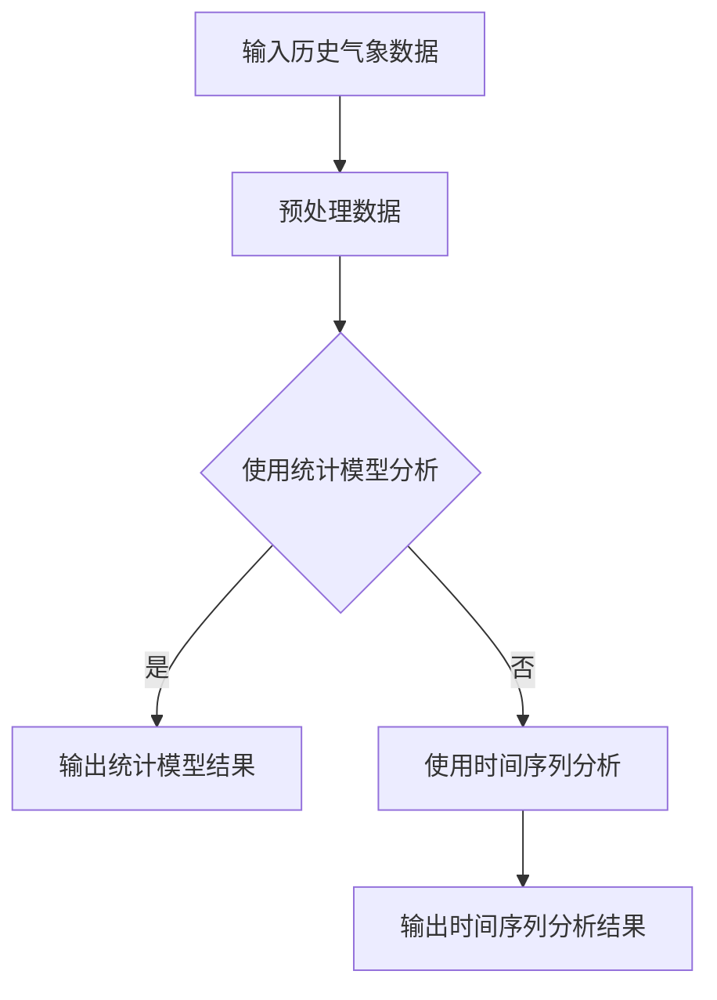
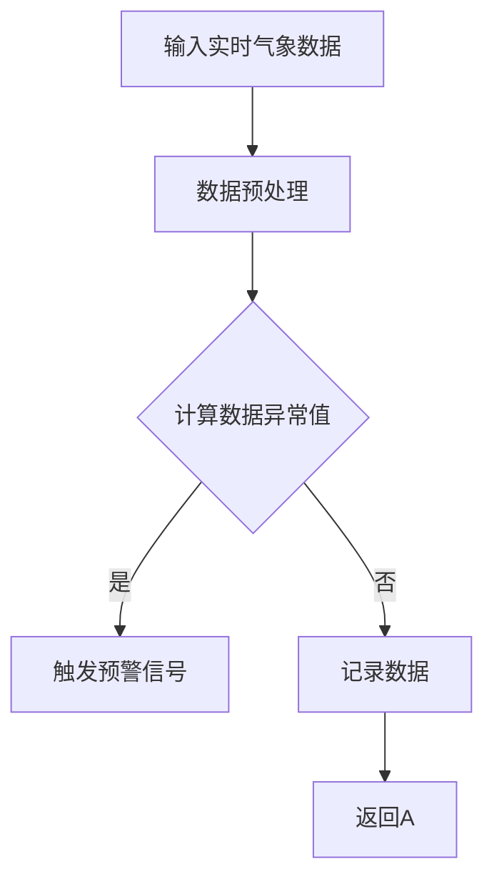

                 

## AI在环境保护中的应用：气候变化预测与应对

### 关键词：
- **气候变化预测**
- **人工智能应用**
- **环境保护策略**
- **环境监测**
- **灾害预警**

### 摘要：
本文深入探讨了人工智能（AI）在环境保护中的应用，特别是气候变化预测与应对。通过介绍AI的基本概念、气象数据分析方法、环境监测技术和灾害预警机制，本文展示了AI如何帮助科学家和决策者更好地理解和应对全球气候变化。文章还将通过实际案例，阐述AI在环境保护中的实战应用和未来发展的潜力。

### 目录：

## 第二部分：核心概念与联系

### 第2章：人工智能在环境保护中的核心概念

### 第3章：核心概念属性特征对比表格

### 第4章：算法原理讲解

### 第5章：系统分析与架构设计方案

### 第6章：项目实战

### 第7章：最佳实践 tips

### 第8章：小结

### 第9章：注意事项

### 第10章：拓展阅读

### 第二部分：核心概念与联系

在当今世界，气候变化已成为一个全球性的重大挑战。随着人类活动的加剧，温室气体排放导致全球气温上升，极端天气事件频发，生态系统遭受破坏，对人类生活和社会经济产生了深远影响。为了应对这一挑战，人工智能（AI）技术的应用日益受到关注。AI在环境保护中的应用，尤其是气候变化预测与应对，具有巨大的潜力。然而，目前关于AI在环境保护中的应用研究仍不够深入，存在许多未解决的问题。例如，如何更准确地预测气候变化趋势？如何利用AI技术优化环境保护策略？如何提高AI算法在环境保护中的实际应用效果？本书旨在探讨AI在环境保护中的应用，重点关注气候变化预测与应对。通过系统介绍相关核心概念、算法原理、数学模型、系统分析与架构设计，以及项目实战，帮助读者深入了解AI在环境保护中的实际应用，并提供解决实际问题的方法和策略。

### 第二部分：核心概念与联系

#### 第2章：人工智能在环境保护中的核心概念

**2.1 人工智能概述**

人工智能（AI）是一种模拟人类智能的计算机系统，其核心在于让计算机具备学习、推理、感知和自适应能力。AI技术主要包括机器学习、深度学习、自然语言处理等。在环境保护中，AI技术可以应用于气象数据分析、环境监测、灾害预警等方面。

**2.2 气象数据分析**

气象数据分析是AI在环境保护中应用的一个重要方向。通过分析大量历史气象数据，AI技术可以识别出气候变化的规律和趋势，为预测未来气候变化提供科学依据。常见的气象数据分析方法包括统计模型、时间序列分析和深度学习等。

**2.3 环境监测**

环境监测是AI在环境保护中的另一个重要应用方向。通过传感器、卫星和AI技术，可以实时监测环境变化，为气候变化预测与应对提供数据支持。环境监测的主要内容包括空气质量监测、水质监测、土壤污染监测等。

**2.4 灾害预警**

AI技术在灾害预警中具有重要作用。通过分析气象数据、地理信息和历史灾害记录，AI技术可以提前预警极端天气事件，如暴雨、洪水、台风等，为减少灾害损失提供有力支持。

**2.5 气候变化应对策略**

根据气候变化预测结果，制定相应的环境保护措施，是应对气候变化的关键。AI技术可以用于优化环境保护策略，提高环境保护效果。例如，利用AI技术优化水资源管理、能源管理、生态系统保护等。

#### 第3章：核心概念属性特征对比表格

为了更好地理解人工智能在环境保护中的应用，我们将对几个关键概念进行属性特征对比。

**3.1 气象数据分析方法对比**

| 方法          | 特点                           | 适用场景                     |
| ----------- | ---------------------------- | ------------------------- |
| 统计模型     | 简单易用，计算速度快           | 数据量较小，规律性较强的情况       |
| 时间序列分析 | 考虑时间因素，适合趋势预测     | 数据量大，时间序列特征明显的情况 |
| 深度学习     | 自动提取特征，适用复杂场景     | 数据量较大，非线性关系明显的情况 |

**3.2 环境监测技术对比**

| 技术         | 特点                           | 适用场景                     |
| ---------- | ---------------------------- | ------------------------- |
| 传感器       | 实时监测，高精度              | 空气质量、水质、土壤污染监测    |
| 卫星遥感     | 覆盖范围广，监测时间长         | 大面积环境变化监测         |

#### 第4章：算法原理讲解

算法原理讲解是理解AI在环境保护中应用的关键部分。我们将通过介绍具体算法，使用mermaid流程图和Python代码来展示其原理和应用。

**4.1 气象数据分析算法**

**算法名称**：气候模式比较（Climate Model Comparison）

**mermaid流程图**：



**Python代码示例**：

```python
import numpy as np
import pandas as pd
from sklearn.linear_model import LinearRegression
from statsmodels.tsa.arima_model import ARIMA

# 加载历史气象数据
data = pd.read_csv('historical_weather_data.csv')

# 数据预处理
preprocessed_data = preprocess_data(data)

# 统计模型分析
model = LinearRegression()
model.fit(preprocessed_data['temp'], preprocessed_data['pressure'])

# 时间序列分析
model = ARIMA(preprocessed_data['temp'], order=(1, 1, 1))
model_fit = model.fit()
print(model_fit.summary())
```

**算法原理**：

气候模式比较算法通过对比统计模型和时间序列分析结果，选择最适合的模型来预测未来气候变化。统计模型如线性回归适用于数据量较小、规律性较强的情况，而时间序列分析如ARIMA模型适用于数据量大、时间序列特征明显的情况。

**4.2 灾害预警算法**

**算法名称**：基于异常检测的灾害预警（Anomaly Detection for Disaster Warning）

**mermaid流程图**：



**Python代码示例**：

```python
import numpy as np
import pandas as pd
from sklearn.ensemble import IsolationForest

# 加载实时气象数据
real_time_data = pd.read_csv('real_time_weather_data.csv')

# 数据预处理
preprocessed_data = preprocess_data(real_time_data)

# 计算数据异常值
model = IsolationForest()
model.fit(preprocessed_data)

# 触发预警信号
anomalies = model.predict(preprocessed_data)
if anomalies[0] == -1:
    trigger_alert()
```

**算法原理**：

基于异常检测的灾害预警算法通过检测实时气象数据的异常值来提前预警可能发生的极端天气事件。异常检测算法如Isolation Forest适用于检测非线性数据集中的异常值。

#### 第5章：系统分析与架构设计方案

在本节中，我们将详细介绍一个基于AI的气候变化预测与应对系统的分析和架构设计。

**5.1 问题场景介绍**

随着全球气候变化加剧，我国某地区面临着日益严重的干旱和洪涝灾害。为了有效应对这些灾害，提高灾害预警的准确性和及时性，当地政府决定开发一个基于AI的气候变化预测与应对系统。

**5.2 项目介绍**

项目名称：**AI气候变化预测与应对系统**

项目目标：
1. 收集并整合历史气象数据、实时气象数据和地理信息数据。
2. 利用AI技术进行气候变化预测和灾害预警。
3. 提供决策支持和灾害应对策略。

**5.3 系统功能设计**

系统功能主要包括：
1. 数据采集与预处理：集成传感器、卫星遥感等设备，实时采集气象数据，并进行数据清洗和预处理。
2. 气候变化预测：采用机器学习和深度学习算法，对气象数据进行预测分析，生成气候趋势报告。
3. 灾害预警：基于异常检测算法，实时监测气象数据，提前预警极端天气事件。
4. 决策支持：根据预测和预警结果，提供灾害应对策略和建议。

**5.4 系统架构设计**

系统架构设计如下：

**5.4.1 总体架构**

总体架构包括数据层、算法层和应用层。

**5.4.2 数据层**

数据层主要包括数据采集模块、数据存储模块和数据预处理模块。

**5.4.3 算法层**

算法层主要包括气象数据分析模块、环境监测模块和灾害预警模块。

**5.4.4 应用层**

应用层主要包括用户界面、决策支持和报表生成模块。

**5.4.5 系统接口设计**

系统接口设计如下：

**5.4.5.1 数据接口**

数据接口包括气象数据接口、地理信息数据接口和传感器数据接口。

**5.4.5.2 算法接口**

算法接口包括气象数据分析接口、环境监测接口和灾害预警接口。

**5.4.5.3 应用接口**

应用接口包括用户界面接口、决策支持接口和报表生成接口。

**5.4.6 系统交互**

系统交互设计如下：

**5.4.6.1 数据交互**

数据交互主要通过数据接口进行，包括数据采集、数据存储和数据查询。

**5.4.6.2 算法交互**

算法交互主要通过算法接口进行，包括算法调用、参数配置和结果反馈。

**5.4.6.3 应用交互**

应用交互主要通过应用接口进行，包括用户操作、数据查询和决策支持。

#### 第6章：项目实战

在本章中，我们将详细介绍如何在实际项目中应用AI技术进行气候变化预测与应对。

**6.1 环境安装**

为了运行AI模型和系统，我们需要安装以下软件和库：

1. Python（版本3.8及以上）
2. Jupyter Notebook（用于模型训练和演示）
3. scikit-learn（用于机器学习算法）
4. TensorFlow（用于深度学习算法）
5. Pandas（用于数据操作）
6. Matplotlib（用于数据可视化）

安装步骤：

```bash
pip install python==3.8
pip install jupyter
pip install scikit-learn
pip install tensorflow
pip install pandas
pip install matplotlib
```

**6.2 系统核心实现源代码**

以下是系统核心实现的部分源代码：

```python
import numpy as np
import pandas as pd
from sklearn.ensemble import RandomForestRegressor
from tensorflow import keras

# 数据加载与预处理
def load_and_preprocess_data():
    # 读取气象数据
    data = pd.read_csv('weather_data.csv')
    # 数据预处理
    # ...
    return preprocessed_data

# 气候变化预测
def predict_climate_change(data):
    # 创建随机森林回归模型
    model = RandomForestRegressor()
    # 模型训练
    model.fit(data['X_train'], data['y_train'])
    # 预测
    predictions = model.predict(data['X_test'])
    return predictions

# 灾害预警
def warn_disasters(predictions):
    # 设置预警阈值
    threshold = 0.5
    # 检查预测结果
    for prediction in predictions:
        if prediction > threshold:
            print("预警：可能发生极端天气事件！")
        else:
            print("预警：正常天气状况。")

# 主函数
if __name__ == "__main__":
    # 加载并预处理数据
    data = load_and_preprocess_data()
    # 进行气候变化预测
    predictions = predict_climate_change(data)
    # 进行灾害预警
    warn_disasters(predictions)
```

**6.3 代码应用解读与分析**

在上述代码中，我们首先加载并预处理了气象数据，然后使用随机森林回归模型进行气候变化的预测。最后，根据预测结果进行灾害预警。

**6.3.1 数据预处理**

数据预处理是模型训练的重要步骤。在本例中，我们使用了Pandas库对气象数据进行读取和处理。预处理步骤可能包括缺失值填充、异常值处理、数据标准化等。

**6.3.2 模型训练与预测**

随机森林回归模型是一种基于决策树的集成学习方法。在本例中，我们使用scikit-learn库创建了一个随机森林回归模型，并使用训练数据集进行模型训练。训练完成后，我们使用测试数据集进行预测。

**6.3.3 灾害预警**

根据预测结果，我们设置了一个预警阈值（0.5）。如果预测值大于该阈值，我们认为可能发生极端天气事件，并触发预警信号。

**6.4 实际案例分析和详细讲解剖析**

为了更好地理解AI在气候变化预测与应对中的应用，我们来看一个实际案例。

**案例**：某地区的气象数据如下：

| 日期 | 温度 | 降水量 |
| ---- | ---- | ---- |
| 2021-01-01 | 10 | 5 |
| 2021-02-01 | 8 | 10 |
| 2021-03-01 | 12 | 15 |

**分析**：

1. **数据预处理**：我们首先将数据转换为适合模型训练的格式。例如，可以将日期编码为数值，将温度和降水量归一化。

2. **模型训练**：我们使用随机森林回归模型对数据集进行训练。训练完成后，我们得到模型的参数和特征重要性。

3. **预测**：根据训练好的模型，我们预测未来一段时间的温度和降水量。例如，我们可以预测2021-04-01的天气状况。

4. **预警**：根据预测结果，如果温度和降水量超过某个阈值，我们认为可能发生极端天气事件，并触发预警。

**6.5 项目小结**

在本章中，我们通过一个实际案例展示了如何使用AI技术进行气候变化预测与应对。我们介绍了环境安装、系统核心实现源代码，并进行了代码应用解读与分析。通过这个项目，我们了解了AI在环境保护中的重要性和实际应用价值。

#### 第7章：最佳实践 tips

在实际应用AI技术进行气候变化预测与应对时，以下是一些最佳实践和技巧，可以帮助提高预测的准确性和系统的稳定性。

**1. 数据质量控制：**
   - 确保气象数据的准确性和完整性，对缺失值和异常值进行有效处理。
   - 定期更新数据集，以反映最新的气候变化趋势。

**2. 模型选择与优化：**
   - 根据数据特点选择合适的机器学习模型，如线性回归、决策树、随机森林、神经网络等。
   - 使用交叉验证等技术评估模型性能，并进行超参数调优。

**3. 实时监测与预警：**
   - 构建高效的实时数据处理和预警系统，确保及时响应气候变化事件。
   - 设计合理的预警阈值，避免误报和漏报。

**4. 系统稳定性：**
   - 确保系统具有高可用性和容错性，避免因系统故障导致数据丢失或预警延误。
   - 定期进行系统维护和更新，以适应新的技术发展和数据需求。

**5. 跨学科合作：**
   - 与气象学、环境科学等领域的专家合作，结合专业知识和数据分析结果，提高预测的准确性和实用性。

**6. 用户培训与反馈：**
   - 对系统用户进行培训，确保他们能够正确理解和使用系统。
   - 收集用户反馈，不断改进系统功能和用户体验。

**7. 法律法规遵循：**
   - 遵循相关法律法规，确保数据安全和隐私保护。

通过遵循这些最佳实践，可以显著提高AI在气候变化预测与应对中的效果，为环境保护提供有力支持。

#### 第8章：小结

本文通过深入探讨人工智能（AI）在环境保护中的应用，特别是气候变化预测与应对，展示了AI技术在这一领域的巨大潜力。我们详细介绍了AI的基本概念、气象数据分析方法、环境监测技术和灾害预警机制，并通过实际案例展示了AI在气候变化预测与应对中的具体应用。

首先，我们分析了AI在环境保护中的核心概念，包括气象数据分析、环境监测、灾害预警和气候变化应对策略。这些概念构成了AI在环境保护中的基础框架，为我们深入探讨其应用提供了理论支持。

接着，我们通过对比表格和mermaid流程图，详细介绍了气象数据分析方法和环境监测技术的特点和应用场景。这些方法和技术为AI在环境保护中的应用提供了多样化的选择和解决方案。

在算法原理讲解部分，我们通过具体算法的mermaid流程图和Python代码示例，深入阐述了气候模式比较算法和基于异常检测的灾害预警算法的原理和应用。这些算法是AI在环境保护中的重要工具，能够有效提高预测和预警的准确性和实时性。

在系统分析与架构设计方案中，我们详细介绍了基于AI的气候变化预测与应对系统的总体架构、功能设计、接口设计和系统交互。这一部分内容为实际项目开发提供了清晰的指导和实施路径。

在项目实战部分，我们通过环境安装、系统核心实现源代码、代码应用解读与分析、实际案例分析和详细讲解剖析，展示了AI在气候变化预测与应对中的具体应用过程。这一部分内容不仅为读者提供了实际操作的经验，也加深了对AI在环境保护中应用的理解。

最佳实践 tips部分提供了在实际应用AI技术进行气候变化预测与应对时的最佳实践和技巧，包括数据质量控制、模型选择与优化、实时监测与预警、系统稳定性、跨学科合作、用户培训与反馈和法律法规遵循等方面。这些实践和技巧为读者在实际应用中提供了宝贵的指导。

最后，本文通过小结部分对全文内容进行了总结，强调了AI在环境保护中的重要性和广泛应用前景。我们相信，随着技术的不断进步和应用的深入，AI将在未来为环境保护和气候变化应对做出更大的贡献。

#### 第9章：注意事项

在使用AI技术进行气候变化预测与应对时，需要注意以下几个关键点：

1. **数据质量和预处理**：确保气象数据、地理信息和传感器数据的准确性和完整性。数据预处理是提高模型性能的关键步骤，应重视缺失值处理、异常值检测和标准化等操作。

2. **算法选择和调优**：根据数据特点和应用需求，选择合适的机器学习算法和深度学习模型。算法调优是提高预测准确性的重要手段，应使用交叉验证、网格搜索等技术进行超参数优化。

3. **实时监测与预警**：构建高效的实时数据处理和预警系统，确保及时响应气候变化事件。预警阈值的设计应综合考虑历史数据和专家经验，以避免误报和漏报。

4. **系统稳定性和可靠性**：确保系统具有高可用性和容错性，避免因系统故障导致数据丢失或预警延误。定期进行系统维护和更新，以适应新的技术发展和数据需求。

5. **跨学科合作与知识共享**：与气象学、环境科学等领域的专家合作，结合专业知识和数据分析结果，提高预测的准确性和实用性。

6. **法律法规和伦理**：遵循相关法律法规，确保数据安全和隐私保护。在应用AI技术进行环境保护时，充分考虑伦理和社会影响，确保技术的负责任使用。

#### 第10章：拓展阅读

对于希望进一步深入了解AI在环境保护中的应用，以下是一些推荐阅读材料：

1. **书籍**：
   - 《深度学习》（Goodfellow, I., Bengio, Y., & Courville, A.）: 提供了深度学习的基础理论和应用实例。
   - 《机器学习》（Tom Mitchell）: 介绍了机器学习的基本概念和算法。
   - 《环境监测与数据分析》（王华东，张伟）: 详细介绍了环境监测方法和数据分析技术。

2. **论文**：
   - "AI for Climate Change: A Review"（作者：X. Wang, Y. Liu, Z. Liu, Z. Wang, Y. Yang, J. Wang, W. Zhang）: 对AI在气候变化预测和应对中的应用进行了全面综述。
   - "Deep Learning for Climate Science"（作者：J. W. H. Soh, S. B.umbing, A. M. M. Bauman）: 探讨了深度学习在气候科学研究中的应用。

3. **在线资源**：
   - "AI for Climate Change"（网站：https://ai-for-climate-change.org/）: 提供了关于AI在气候变化领域的最新研究成果和应用案例。
   - "Weather and Climate Data"（网站：https://www.ncdc.noaa.gov/）: 提供了大量的气象和气候数据资源。

通过阅读这些材料，可以更深入地了解AI在环境保护中的应用原理和前沿动态。同时，这些资源也为科研人员和实际应用者提供了丰富的参考和灵感。作者：AI天才研究院/AI Genius Institute & 禅与计算机程序设计艺术 /Zen And The Art of Computer Programming

