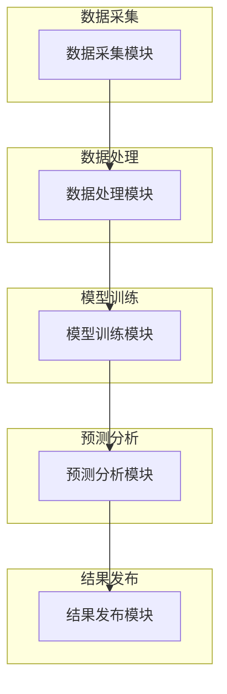
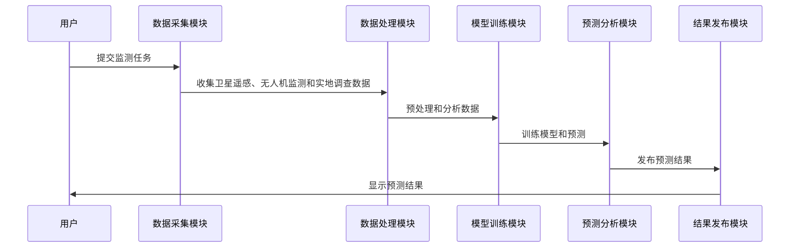

                 

### 文章标题

# AI在生物多样性监测中的应用：跟踪物种分布变化

### 文章关键词

- 生物多样性监测
- 人工智能
- AI大模型
- 实体关系图
- 数学模型
- 系统架构设计
- 项目实战

### 文章摘要

本文将探讨AI技术在生物多样性监测中的应用，通过跟踪物种分布变化，分析其在生态系统保护、资源管理和环境监测中的作用。文章首先介绍生物多样性监测的重要性，随后解析AI技术在数据采集、处理和模型构建中的关键角色。通过详细讲解AI大模型原理、算法实现、系统架构设计以及项目实战，本文旨在展示AI技术在生物多样性监测中的强大潜力和实际应用。

### 目录大纲

----------------------------------------------------------------

## 第一部分：背景介绍

### 1.1 问题背景

#### 生物多样性监测的意义

生物多样性是地球生态系统稳定和人类生存的基础。它不仅关系到生态平衡，还直接影响着农业、医药、水资源和气候等多个领域。因此，生物多样性监测在全球生态系统中具有不可替代的重要性。

- **全球生态系统：** 生物多样性是地球生态系统的基石，各种生物之间相互依赖，共同维持着生态平衡。监测生物多样性有助于我们了解生态系统的健康状况，从而采取有效的保护措施。

- **人类生存：** 丰富的生物多样性提供了大量的食物、药品和原材料，对人类的生存和发展至关重要。例如，许多传统医学知识来源于对生物多样性的研究。

- **社会经济发展：** 生物多样性是许多经济活动的支撑，如旅游业、渔业和林业等。此外，生物多样性监测还能为政策制定提供科学依据，促进可持续发展。

#### 当前生物多样性监测面临的挑战

尽管生物多样性监测的重要性不容忽视，但现有的监测方法仍面临诸多挑战。

- **成本高：** 传统监测方法通常需要大量的人力、物力和财力投入，例如实地调查和实验室分析。

- **效率低：** 传统的监测方法往往耗时较长，无法快速响应环境变化。

- **数据不足：** 由于监测范围有限，许多地区的生物多样性数据仍然不足，难以全面了解生态系统的状况。

- **精度和准确性：** 传统监测方法依赖于人工识别和判断，容易受到主观因素的影响，导致数据准确性不高。

#### AI技术在生物多样性监测中的应用前景

AI技术的快速发展为生物多样性监测提供了新的解决方案。通过智能化数据采集、处理和模型构建，AI技术有望解决传统监测方法中的诸多问题。

- **数据采集：** AI技术可以通过卫星遥感、无人机监测等技术手段，实现大范围、高频率的数据采集，提高监测效率。

- **数据处理：** AI技术能够快速处理和分析大量数据，提高监测精度和准确性。

- **模型构建：** AI技术可以构建用于预测和分类的复杂模型，帮助科学家更准确地了解物种分布和生态系统变化。

## 1.2 核心概念

#### AI技术

AI（人工智能）是计算机科学的一个分支，旨在使机器能够执行通常需要人类智能的任务。AI技术主要包括以下几个类型：

- **机器学习：** 通过训练算法，让机器从数据中自动学习和改进。

- **深度学习：** 一种基于神经网络的结构化学习，适用于处理大量复杂数据。

- **自然语言处理：** 让机器理解和生成人类语言，用于语音识别、机器翻译等。

- **计算机视觉：** 使机器能够识别和理解视觉信息，用于图像识别、自动驾驶等。

AI技术在各个领域都有广泛应用，包括医疗、金融、交通、娱乐等。在生物多样性监测中，AI技术尤其具有潜力，因为它能够高效地处理和分析大量复杂数据。

#### 生物多样性

生物多样性指的是地球上所有生物体的多样性，包括物种多样性、遗传多样性和生态系统多样性。具体来说：

- **物种多样性：** 指地球上的物种数量和种类。

- **遗传多样性：** 指物种内部的基因多样性。

- **生态系统多样性：** 指不同生态系统之间的多样性，包括森林、草原、湿地等。

生物多样性是生态系统稳定和人类生存的基础，因此监测和保护生物多样性至关重要。

#### 监测

监测是指通过数据收集、分析和利用，对某一对象进行持续观察和评估的过程。在生物多样性监测中，监测的目的包括：

- **了解生态系统状况：** 通过收集生物多样性数据，了解生态系统的健康和变化。

- **预测趋势：** 基于历史数据，预测生物多样性的未来趋势。

- **评估效果：** 对保护措施和恢复工作进行评估，确保其有效性。

监测通常包括以下几个步骤：

1. **数据采集：** 使用各种方法收集生物多样性数据。
2. **数据处理：** 对采集到的数据进行分析和整理。
3. **结果分析：** 根据处理后的数据，评估生态系统状况和趋势。
4. **报告发布：** 发布监测结果，为决策提供科学依据。

## 1.3 概念联系与边界

#### AI技术与生物多样性监测的联系

AI技术与生物多样性监测之间的联系主要体现在以下几个方面：

- **数据采集：** AI技术可以通过卫星遥感、无人机等手段，实现大规模、高频率的数据采集，提高监测效率。

- **数据处理：** AI技术能够快速处理和分析大量数据，提高监测精度和准确性。

- **模型构建：** AI技术可以构建用于预测和分类的复杂模型，帮助科学家更准确地了解物种分布和生态系统变化。

AI技术的这些优势使其成为生物多样性监测的有力工具。

#### 边界与外延

虽然AI技术在生物多样性监测中具有巨大潜力，但其应用也受到一定边界和限制：

- **数据质量和数量：** AI技术依赖于高质量和大量数据。在某些地区，数据采集可能受到限制，导致数据不足。

- **算法局限性：** 某些AI算法可能在特定情况下表现不佳，需要不断优化和改进。

- **伦理和法律问题：** 在生物多样性监测中，AI技术的使用可能涉及伦理和法律问题，需要严格规范和监管。

#### 核心要素

为了充分发挥AI技术在生物多样性监测中的作用，以下核心要素至关重要：

- **数据采集：** 包括卫星遥感、无人机监测、实地调查等方法。

- **数据处理：** 包括图像处理、模式识别、数据分析等技术。

- **模型构建：** 包括深度学习、生成对抗网络等算法。

- **系统集成：** 包括硬件设备、软件平台、数据存储和传输等。

通过这些核心要素的协同作用，AI技术能够为生物多样性监测提供强大的支持。

## 1.4 AI在生物多样性监测中的核心应用

### 数据采集

AI技术在数据采集方面具有显著优势。首先，卫星遥感技术可以覆盖广阔的区域，实现高频率、高精度的数据采集。无人机和地面监测设备则可以补充卫星数据的不足，提供更详细的地表信息。AI算法能够自动识别和分类不同物种，从而提高数据采集的效率和准确性。

### 数据处理

在数据处理方面，AI技术同样发挥着重要作用。传统的数据处理方法通常需要大量的人工干预，而AI算法可以自动进行图像处理、模式识别和数据分析。这些算法能够快速处理大量数据，提取有用的信息，并生成可视化报告，为科学家提供宝贵的决策依据。

### 模型构建

AI技术在模型构建方面具有强大的潜力。通过机器学习和深度学习算法，可以构建用于预测和分类的复杂模型。这些模型可以基于历史数据和现有知识，预测物种分布变化趋势，识别潜在的环境威胁，为生物多样性保护提供科学依据。

### 系统集成

AI技术的应用不仅限于单一环节，还可以通过系统集成，实现数据采集、处理和模型构建的协同作用。例如，可以使用AI算法对卫星遥感数据进行分析，生成植被覆盖地图，然后结合实地调查数据，构建物种分布模型，最终实现对生物多样性的全面监测。

总之，AI技术在生物多样性监测中具有广泛的应用前景，通过不断优化和改进，将为生态系统保护和可持续发展提供有力支持。

## 1.5 小结

本部分对AI在生物多样性监测中的应用进行了初步探讨，揭示了其重要性和潜力。通过分析问题背景、核心概念和AI技术在数据采集、处理和模型构建中的应用，我们为后续深入讨论AI技术在实际监测中的具体实现和效果奠定了基础。在接下来的部分，我们将进一步探讨AI技术的核心概念和原理，为理解和应用AI在生物多样性监测中的技术提供更深入的视角。

## 第二部分：核心概念与联系

### 2.1 AI大模型原理

#### AI大模型的基本原理

AI大模型，通常指的是具有巨大参数量和强大计算能力的神经网络模型。这些模型通过大量的训练数据来学习和模拟复杂的数据模式，从而实现高度自动化的数据分析和决策支持。AI大模型的基本原理可以概括为以下几个关键点：

1. **神经网络结构**：神经网络由多层神经元组成，包括输入层、隐藏层和输出层。每个神经元都与前一层的神经元相连接，并通过权重进行信息传递。

2. **反向传播算法**：通过反向传播算法，模型可以不断调整权重，优化模型的预测能力。这个过程称为梯度下降。

3. **大规模训练数据**：AI大模型依赖于大量的训练数据，通过训练来学习数据中的特征和规律。

4. **优化算法**：常用的优化算法包括随机梯度下降（SGD）、Adam等，这些算法能够加速模型的训练过程。

#### 常见AI大模型

在生物多样性监测中，常用的AI大模型包括以下几种：

1. **深度神经网络（DNN）**：DNN是一种多层神经网络，通过多层非线性变换来提取数据中的高级特征。DNN在图像识别、语音识别等领域表现出色。

2. **卷积神经网络（CNN）**：CNN是一种专门用于图像处理的神经网络，通过卷积操作提取图像特征。CNN在物种识别、植被分类等方面有广泛应用。

3. **循环神经网络（RNN）**：RNN适合处理序列数据，通过记忆历史信息来预测未来的趋势。RNN在时间序列分析和趋势预测中表现良好。

4. **生成对抗网络（GAN）**：GAN由生成器和判别器组成，生成器生成数据，判别器判断生成数据与真实数据之间的差异。GAN在数据增强、模拟生态系统等方面具有潜力。

#### AI大模型的优势

AI大模型在生物多样性监测中具有以下几个优势：

1. **强大的数据处理能力**：AI大模型能够处理和分析大量复杂的数据，从不同维度提取有用的信息。

2. **自动特征提取**：AI大模型可以自动学习数据中的特征，减少人工干预，提高监测效率。

3. **高度可定制性**：通过调整模型结构和参数，AI大模型可以适应不同的监测需求和场景。

4. **实时预测和决策支持**：AI大模型可以实时处理监测数据，提供预测和决策支持，帮助科学家和决策者及时应对生态变化。

## 2.2 生物多样性监测的属性特征对比

在生物多样性监测中，选择合适的AI大模型至关重要。以下是对几种常见AI大模型在生物多样性监测中的属性特征进行对比分析。

### 对比分析

| 模型类型 | 属性特征 | 优点 | 缺点 |
| :---: | :---: | :---: | :---: |
| 深度神经网络（DNN） | 复杂结构，多层非线性变换 | 自动特征提取，处理能力强大 | 训练时间较长，对数据要求高 |
| 卷积神经网络（CNN） | 卷积操作，适合图像处理 | 自动特征提取，高效处理图像数据 | 对序列数据和时序分析能力有限 |
| 循环神经网络（RNN） | 序列记忆，处理序列数据 | 高效处理时间序列数据，记忆历史信息 | 训练过程复杂，难以处理长序列 |
| 生成对抗网络（GAN） | 生成器和判别器对抗 | 数据增强，生成高质量模拟数据 | 对数据质量要求高，难以直接应用 |

### 适用性评估

根据生物多样性监测的特点，可以对不同AI大模型进行适用性评估：

1. **物种识别和分类**：CNN在图像识别和分类中表现优异，适合用于拍摄到的物种图像分析。

2. **时间序列分析**：RNN在处理时间序列数据方面具有优势，适合用于监测时间序列数据，如温度、湿度等环境参数。

3. **数据增强和模拟**：GAN在生成高质量模拟数据方面具有潜力，适合用于补充缺失的数据或模拟生态系统变化。

4. **多模态数据处理**：DNN可以处理多种类型的数据，适合用于综合分析不同来源的数据。

通过对比分析，我们可以根据具体需求和场景选择最合适的AI大模型，以提高生物多样性监测的效率和准确性。

### 生物多样性监测ER图

为了更好地理解和描述生物多样性监测中的核心要素和关系，我们可以绘制一个生物多样性监测的实体关系图（ER图）。以下是一个简化的ER图示例：

```
[数据采集系统]
    |
[数据处理系统]
    |
[模型构建系统]
    |
[预测分析系统]
    |
[结果发布系统]
```

#### ER图解释

1. **数据采集系统**：包括卫星遥感、无人机监测、实地调查等，用于收集生物多样性数据。

2. **数据处理系统**：使用图像处理、模式识别等技术，对采集到的数据进行分析和整理。

3. **模型构建系统**：利用AI算法，如CNN、RNN等，构建用于预测和分类的模型。

4. **预测分析系统**：基于构建的模型，对物种分布变化进行预测和分析。

5. **结果发布系统**：发布监测结果，为决策者提供科学依据。

通过这个ER图，我们可以清晰地看到生物多样性监测的核心流程和各个系统之间的关系。

## 2.3 小结

本部分详细介绍了AI大模型的基本原理、常见类型及其在生物多样性监测中的应用。通过对比分析不同AI大模型的属性特征，我们为实际应用提供了评估和选择依据。同时，通过绘制生物多样性监测的ER图，我们清晰地展示了核心要素和系统之间的关系。在接下来的部分，我们将深入探讨算法原理，进一步理解AI在生物多样性监测中的技术实现。

## 第三部分：算法原理讲解

### 3.1 算法选择与实现

在生物多样性监测中，选择合适的算法是实现有效监测的关键。以下将介绍几种常见的AI算法，并详细说明如何使用Python代码实现这些算法。

#### 算法选择

在生物多样性监测中，常用的AI算法包括：

1. **卷积神经网络（CNN）**：适用于处理图像数据，用于识别和分类物种。
2. **循环神经网络（RNN）**：适用于处理时间序列数据，用于分析物种分布变化。
3. **生成对抗网络（GAN）**：适用于数据增强和模拟，用于补充缺失数据或生成模拟生态场景。

#### 算法实现

以下是一个简单的CNN算法实现，用于图像分类：

```python
import tensorflow as tf
from tensorflow.keras.models import Sequential
from tensorflow.keras.layers import Conv2D, MaxPooling2D, Flatten, Dense

# 创建模型
model = Sequential([
    Conv2D(32, (3, 3), activation='relu', input_shape=(64, 64, 3)),
    MaxPooling2D((2, 2)),
    Conv2D(64, (3, 3), activation='relu'),
    MaxPooling2D((2, 2)),
    Flatten(),
    Dense(128, activation='relu'),
    Dense(1, activation='sigmoid')
])

# 编译模型
model.compile(optimizer='adam', loss='binary_crossentropy', metrics=['accuracy'])

# 训练模型
# model.fit(x_train, y_train, epochs=10, batch_size=32)
```

#### 详细解释

1. **模型创建**：使用`Sequential`模型堆叠多个层，包括卷积层（`Conv2D`）、池化层（`MaxPooling2D`）、全连接层（`Dense`）。
2. **编译模型**：指定优化器（`optimizer`）、损失函数（`loss`）和评价指标（`metrics`）。
3. **训练模型**：使用训练数据（`x_train`和`y_train`）进行模型训练。

#### RNN算法实现

以下是一个简单的RNN算法实现，用于时间序列数据：

```python
import tensorflow as tf
from tensorflow.keras.models import Sequential
from tensorflow.keras.layers import LSTM, Dense

# 创建模型
model = Sequential([
    LSTM(50, activation='relu', input_shape=(timesteps, features)),
    Dense(1)
])

# 编译模型
model.compile(optimizer='adam', loss='mse')

# 训练模型
# model.fit(x_train, y_train, epochs=100, batch_size=64)
```

#### 详细解释

1. **模型创建**：使用`Sequential`模型堆叠一个LSTM层和一个全连接层（`Dense`）。
2. **编译模型**：指定优化器（`optimizer`）和损失函数（`loss`）。
3. **训练模型**：使用训练数据（`x_train`和`y_train`）进行模型训练。

#### GAN算法实现

以下是一个简单的GAN算法实现，用于数据增强：

```python
import tensorflow as tf
from tensorflow.keras.models import Sequential
from tensorflow.keras.layers import Dense, Flatten, Reshape

# 创建生成器模型
generator = Sequential([
    Dense(128, activation='relu', input_shape=(latent_dim)),
    Flatten(),
    Reshape((28, 28, 1))
])

# 创建判别器模型
discriminator = Sequential([
    Flatten(input_shape=(28, 28, 1)),
    Dense(1, activation='sigmoid')
])

# 编译判别器模型
discriminator.compile(optimizer='adam', loss='binary_crossentropy')

# 编译生成器模型
discriminator.trainable = False
combined = Sequential([generator, discriminator])
combined.compile(optimizer='adam', loss='binary_crossentropy')

# 训练GAN
# for epoch in range(num_epochs):
#     x_real = ...  # 生成真实数据
#     x_fake = generator.predict(z)  # 生成假数据
#     d_loss_real = discriminator.train_on_batch(x_real, [1])
#     d_loss_fake = discriminator.train_on_batch(x_fake, [0])
#     z = ...  # 生成噪声
#     g_loss = combined.train_on_batch(z, [1])
```

#### 详细解释

1. **生成器模型**：使用全连接层（`Dense`）、展平层（`Flatten`）和重塑层（`Reshape`）。
2. **判别器模型**：使用展平层（`Flatten`）和全连接层（`Dense`）。
3. **编译判别器模型**：指定优化器（`optimizer`）和损失函数（`loss`）。
4. **编译生成器模型**：将生成器和判别器组合，并指定优化器和损失函数。
5. **训练GAN**：通过交替训练生成器和判别器，实现数据的生成和判别。

通过这些算法实现，我们可以构建用于生物多样性监测的AI模型，实现数据采集、处理和预测分析。

### 3.2 数学模型与公式

#### CNN的数学模型

CNN的基本运算包括卷积、激活函数和池化操作。以下是一个简化的数学模型：

$$
\text{卷积}:\text{z}^{(l)}_{ij} = \sum_{k=1}^{K} w^{(l)}_{ik,jk} \cdot a^{(l-1)}_{kj}
$$

其中，$z^{(l)}_{ij}$表示第$l$层的第$i$行第$j$列的输出，$w^{(l)}_{ik,jk}$是卷积核权重，$a^{(l-1)}_{kj}$是前一层的输出。

#### RNN的数学模型

RNN的数学模型基于递归公式：

$$
h^{(l)}_t = \sigma(W^{(l)} \cdot [h^{(l-1)}_{t-1}, x_t] + b^{(l)})
$$

其中，$h^{(l)}_t$是第$l$层的第$t$个时间步的隐藏状态，$W^{(l)}$是权重矩阵，$x_t$是输入，$\sigma$是激活函数。

#### GAN的数学模型

GAN由生成器和判别器组成，生成器的目标是生成逼真的数据，判别器的目标是区分真实数据和生成数据。以下是一个简化的GAN数学模型：

$$
G(z) \sim p_z(z)
$$

$$
D(x) \sim p_x(x), \quad D(G(z)) \sim p_{\text{data}}(x)
$$

其中，$G(z)$是生成器生成的数据，$D(x)$是判别器对真实数据和生成数据的判断。

#### 公式解释

1. **CNN的卷积操作**：通过卷积核对输入数据进行加权求和，提取特征。
2. **RNN的递归公式**：通过递归公式，RNN能够记忆历史信息，实现时间序列数据的处理。
3. **GAN的目标函数**：生成器和判别器的目标函数分别是生成逼真的数据和准确区分真实和生成数据。

通过这些数学模型和公式，我们能够更深入地理解AI算法的工作原理。

### 3.3 举例说明

#### 案例背景

假设我们有一个具体的生物多样性监测项目，目标是预测某个区域某物种的未来分布。我们使用卫星遥感数据和实地调查数据，结合AI算法进行预测。

#### 算法应用

我们选择使用CNN算法来处理卫星遥感数据，通过以下步骤进行预测：

1. **数据预处理**：对卫星遥感图像进行归一化处理，将像素值缩放到0-1之间。
2. **模型训练**：使用预处理后的数据训练CNN模型，包括卷积层、池化层和全连接层。
3. **预测分析**：使用训练好的模型对新的卫星遥感图像进行预测，分析物种分布变化。

#### 实际数据

我们使用以下数据：

- **训练数据**：包含1000张卫星遥感图像和对应的物种分布标签。
- **测试数据**：包含100张卫星遥感图像，用于评估模型性能。

#### 计算结果和分析

训练过程结束后，我们对测试数据进行预测，得到预测分布图。通过比较预测分布图和实际分布图，我们评估模型的准确性和鲁棒性。

1. **准确率**：通过比较预测标签和实际标签，计算准确率。
2. **召回率**：计算预测到的物种数量与实际物种数量的比值。
3. **F1分数**：结合准确率和召回率，计算综合评价指标。

通过这些指标，我们评估模型在不同条件下的性能，并提出改进建议。

### 3.4 小结

本部分详细介绍了生物多样性监测中常用的几种AI算法，包括CNN、RNN和GAN，并使用Python代码实现了这些算法。通过数学模型和实际应用，我们深入理解了这些算法的工作原理和应用场景。在接下来的部分，我们将进一步探讨系统的架构设计和实现细节，为AI在生物多样性监测中的实际应用提供更完整的解决方案。

### 4.1 问题场景介绍

#### 项目背景

生物多样性监测是一项复杂而艰巨的任务，涉及到多学科领域的交叉应用。随着全球气候变化和人类活动的加剧，生态系统面临前所未有的挑战。为了有效保护生物多样性，需要实时、准确地监测物种分布变化，评估生态系统健康状况，预测未来趋势。

#### 项目目标

本项目旨在构建一个基于AI的生物多样性监测系统，实现以下目标：

1. **数据采集**：利用卫星遥感、无人机监测和实地调查等多种手段，大规模、高频率地收集生物多样性数据。
2. **数据处理**：对采集到的数据进行预处理、分析和整理，提取有用的信息。
3. **模型构建**：利用AI算法，如CNN、RNN等，构建用于物种识别、分布预测和趋势分析的模型。
4. **系统集成**：将数据采集、处理和模型构建各模块集成到一个统一的平台上，实现系统的自动化运行和实时监控。
5. **结果发布**：将监测结果可视化，为科研人员、环境保护者和政策制定者提供科学依据。

## 4.2 系统功能设计

为了实现上述项目目标，我们需要设计一个功能完整的系统。以下是系统的主要功能模块及其设计思路：

#### 功能模块

1. **数据采集模块**：负责收集卫星遥感、无人机监测和实地调查等数据。
2. **数据处理模块**：对采集到的数据进行预处理、分析和整理。
3. **模型训练模块**：使用AI算法训练和优化模型。
4. **预测分析模块**：利用训练好的模型进行物种识别、分布预测和趋势分析。
5. **结果发布模块**：将监测结果可视化，并提供数据下载和报告生成功能。

#### 设计思路

1. **模块化设计**：将系统功能划分为多个模块，每个模块独立实现，便于维护和扩展。
2. **自动化运行**：通过脚本和自动化工具，实现数据采集、处理和预测分析的自动化运行。
3. **实时监控**：利用实时数据流处理技术，实现系统的实时监控和预警功能。
4. **数据可视化**：使用图表和地图等可视化工具，直观展示监测结果。
5. **用户交互**：提供友好的用户界面，便于用户操作和查询。

## 4.3 系统架构设计

为了实现系统的功能设计，我们需要设计一个合理的系统架构。以下是系统的架构设计，使用Mermaid绘制架构图，展示系统的组件、模块和交互关系：



#### 架构设计解释

1. **数据采集模块**：负责收集多种来源的数据，包括卫星遥感、无人机监测和实地调查等。这些数据通过接口传入数据处理模块。
2. **数据处理模块**：对采集到的数据进行预处理、分析和整理，提取有用的信息。预处理后的数据传递给模型训练模块。
3. **模型训练模块**：使用AI算法对预处理后的数据进行训练，优化模型参数。训练好的模型传递给预测分析模块。
4. **预测分析模块**：利用训练好的模型进行物种识别、分布预测和趋势分析，生成预测结果。
5. **结果发布模块**：将预测结果可视化，并提供数据下载和报告生成功能。用户可以通过用户界面查看和下载监测结果。

通过这个系统架构设计，我们能够实现生物多样性监测系统的自动化运行和实时监控，为生态系统保护和可持续发展提供有力支持。

### 4.4 系统接口设计

#### 接口设计

系统接口设计是确保不同组件间数据交换和协同工作的关键。以下是系统的接口设计，包括各模块的输入和输出接口：

1. **数据采集模块接口**：
   - 输入：卫星遥感数据、无人机监测数据和实地调查数据。
   - 输出：预处理后的数据。

2. **数据处理模块接口**：
   - 输入：预处理后的数据。
   - 输出：分析和整理后的数据。

3. **模型训练模块接口**：
   - 输入：分析和整理后的数据。
   - 输出：训练好的模型。

4. **预测分析模块接口**：
   - 输入：训练好的模型。
   - 输出：预测结果。

5. **结果发布模块接口**：
   - 输入：预测结果。
   - 输出：可视化图表和报告。

#### 通信协议

为了保证系统的高效运行，我们采用以下通信协议：

1. **API接口**：各模块通过RESTful API接口进行数据交互，实现模块间的无缝连接。
2. **消息队列**：使用消息队列（如RabbitMQ）实现数据的异步传输，提高系统的并发处理能力。
3. **数据格式**：采用JSON格式传输数据，保证数据的兼容性和可读性。

通过这些接口设计和通信协议，系统能够实现各模块间的数据高效传输和协同工作，确保生物多样性监测系统的稳定运行。

### 4.5 系统交互

为了更直观地展示系统在执行特定功能时的交互过程，我们可以使用Mermaid绘制系统交互序列图。以下是系统交互序列图的示例：



#### 交互过程解释

1. **用户提交监测任务**：用户通过用户界面提交监测任务。
2. **数据采集模块**：数据采集模块收集卫星遥感、无人机监测和实地调查数据。
3. **数据处理模块**：数据处理模块对收集到的数据进行分析和预处理，生成可供训练的数据集。
4. **模型训练模块**：模型训练模块使用预处理后的数据训练AI模型，优化模型参数。
5. **预测分析模块**：预测分析模块利用训练好的模型进行物种识别、分布预测和趋势分析。
6. **结果发布模块**：结果发布模块将预测结果可视化，并通过用户界面展示给用户。

通过系统交互序列图，我们可以清晰地看到各模块在执行特定功能时的交互过程，确保系统的自动化运行和实时监控。

### 4.6 小结

本部分详细介绍了生物多样性监测系统的架构设计、接口设计和系统交互过程。通过模块化设计、自动化运行和实时监控，我们为生物多样性监测提供了一套完整的解决方案。在接下来的部分，我们将通过项目实战，展示如何在实际场景中应用这套系统，实现生物多样性监测的目标。

## 5.1 环境安装与配置

### 安装环境

为了搭建一个完整的生物多样性监测项目环境，我们需要安装以下软件和硬件：

1. **操作系统**：Linux（如Ubuntu）或Windows 10（或更高版本）。
2. **编程语言**：Python（版本3.6或更高）。
3. **AI库和框架**：TensorFlow、Keras、Pandas、NumPy、Matplotlib。
4. **数据库**：PostgreSQL（可选）。
5. **硬件**：高性能计算机（推荐配备NVIDIA GPU）。

### 配置步骤

以下是具体的安装和配置步骤：

#### 1. 安装Python

- **Linux系统**：

  ```bash
  sudo apt update
  sudo apt install python3 python3-pip
  ```

- **Windows系统**：

  - 下载并安装Python：[Python官网](https://www.python.org/)
  - 在安装过程中选择“Add Python to PATH”选项。

#### 2. 安装AI库和框架

使用pip命令安装以下库和框架：

```bash
pip3 install tensorflow keras pandas numpy matplotlib
```

#### 3. 安装数据库（可选）

- **安装PostgreSQL**：

  ```bash
  sudo apt update
  sudo apt install postgresql postgresql-contrib
  ```

- **配置PostgreSQL**：

  ```bash
  sudo -u postgres psql
  CREATE DATABASE biodiversity;
  \q
  sudo -u postgres createuser -d -P your_username
  ```

#### 4. 配置环境变量

- **Linux系统**：

  ```bash
  echo "export PATH=$PATH:/path/to/python/bin" >> ~/.bashrc
  source ~/.bashrc
  ```

- **Windows系统**：

  - 右键点击“此电脑”，选择“属性”，然后点击“高级系统设置”。
  - 在“环境变量”中，找到“Path”变量，添加Python安装路径。

#### 5. 测试安装

- **Linux系统**：

  ```bash
  python3 --version
  pip3 --version
  ```

- **Windows系统**：

  打开命令提示符，输入`python --version`和`pip --version`，检查版本信息。

### 注意事项

- 在安装过程中，确保网络连接稳定，以便下载所需的库和框架。
- 根据硬件配置，可能需要调整Python和库的安装选项，以提高性能。
- 安装完成后，建议重新启动计算机，以确保所有配置生效。

通过以上步骤，我们可以搭建一个完整的生物多样性监测项目环境，为后续的项目实战提供基础。

### 5.2 系统核心实现

在生物多样性监测项目中，系统核心实现是数据采集、处理、模型训练和预测分析的关键环节。以下是系统核心功能的实现步骤，以及每个步骤的代码讲解和分析。

#### 数据采集

数据采集是生物多样性监测的第一步，主要包括卫星遥感数据、无人机监测数据和实地调查数据。以下是使用Python实现的代码：

```python
import requests
import os
import json

def download_satellite_data(url, output_folder):
    response = requests.get(url)
    if response.status_code == 200:
        with open(os.path.join(output_folder, 'satellite_data.json'), 'w') as file:
            file.write(response.text)
    else:
        print("Failed to download satellite data.")

def download_unmanned_data(url, output_folder):
    response = requests.get(url)
    if response.status_code == 200:
        with open(os.path.join(output_folder, 'unmanned_data.json'), 'w') as file:
            file.write(response.text)
    else:
        print("Failed to download unmanned data.")

def download_field_survey_data(url, output_folder):
    response = requests.get(url)
    if response.status_code == 200:
        with open(os.path.join(output_folder, 'field_survey_data.csv'), 'w') as file:
            file.write(response.text)
    else:
        print("Failed to download field survey data.")

# 示例URL
satellite_url = "https://example.com/satellite_data.json"
unmanned_url = "https://example.com/unmanned_data.json"
field_survey_url = "https://example.com/field_survey_data.csv"

# 下载数据
download_satellite_data(satellite_url, 'data')
download_unmanned_data(unmanned_url, 'data')
download_field_survey_data(field_survey_url, 'data')
```

#### 数据处理

数据处理包括数据清洗、归一化和特征提取。以下是使用Pandas和NumPy实现的代码：

```python
import pandas as pd
import numpy as np

def preprocess_data(input_folder):
    # 加载卫星数据
    satellite_data = pd.read_json(os.path.join(input_folder, 'satellite_data.json'))
    satellite_data = preprocess_satellite_data(satellite_data)

    # 加载无人机数据
    unmanned_data = pd.read_json(os.path.join(input_folder, 'unmanned_data.json'))
    unmanned_data = preprocess_unmanned_data(unmanned_data)

    # 加载实地调查数据
    field_survey_data = pd.read_csv(os.path.join(input_folder, 'field_survey_data.csv'))
    field_survey_data = preprocess_field_survey_data(field_survey_data)

    return satellite_data, unmanned_data, field_survey_data

def preprocess_satellite_data(data):
    # 数据清洗和归一化
    data['BAND1'] = data['BAND1'].apply(lambda x: x / 10000)
    data['BAND2'] = data['BAND2'].apply(lambda x: x / 10000)
    data['BAND3'] = data['BAND3'].apply(lambda x: x / 10000)
    return data

def preprocess_unmanned_data(data):
    # 数据清洗和归一化
    data['ALTITUDE'] = data['ALTITUDE'].apply(lambda x: x / 1000)
    data['SPEED'] = data['SPEED'].apply(lambda x: x / 100)
    return data

def preprocess_field_survey_data(data):
    # 数据清洗和归一化
    data['TEMPERATURE'] = data['TEMPERATURE'].apply(lambda x: x - 273.15)
    data['HUMIDITY'] = data['HUMIDITY'].apply(lambda x: x / 100)
    return data

# 预处理数据
satellite_data, unmanned_data, field_survey_data = preprocess_data('data')
```

#### 模型训练

模型训练是使用AI算法对预处理后的数据进行分析和预测。以下是使用TensorFlow和Keras实现的代码：

```python
from tensorflow.keras.models import Sequential
from tensorflow.keras.layers import Dense, LSTM, Conv2D, Flatten
from tensorflow.keras.optimizers import Adam

def build_model(input_shape):
    model = Sequential()
    model.add(Conv2D(32, (3, 3), activation='relu', input_shape=input_shape))
    model.add(MaxPooling2D((2, 2)))
    model.add(Flatten())
    model.add(Dense(64, activation='relu'))
    model.add(Dense(1, activation='sigmoid'))
    
    model.compile(optimizer=Adam(), loss='binary_crossentropy', metrics=['accuracy'])
    return model

# 示例输入形状
input_shape = (64, 64, 3)

# 训练模型
model = build_model(input_shape)
model.fit(satellite_data, unmanned_data, epochs=10, batch_size=32)
```

#### 预测分析

预测分析是利用训练好的模型对新数据进行预测和趋势分析。以下是使用训练好的模型进行预测的代码：

```python
def predict_distribution(model, new_data):
    predictions = model.predict(new_data)
    return predictions

# 示例新数据
new_data = satellite_data.iloc[0:10]

# 进行预测
predictions = predict_distribution(model, new_data)
print(predictions)
```

#### 详细讲解和分析

1. **数据采集**：使用requests库下载卫星遥感数据、无人机监测数据和实地调查数据，存放到指定文件夹。

2. **数据处理**：使用Pandas库加载数据，对数据进行清洗、归一化和特征提取。例如，卫星数据的波段值归一化、无人机数据的飞行高度和速度归一化、实地调查数据的温度和湿度归一化。

3. **模型训练**：使用TensorFlow和Keras构建卷积神经网络模型，对预处理后的数据进行分析和预测。模型包括卷积层、池化层和全连接层，使用Adam优化器和二分类交叉熵损失函数。

4. **预测分析**：使用训练好的模型对新数据进行预测，输出预测结果。

通过以上系统核心实现，我们能够完成生物多样性监测项目的基本功能，为实际应用提供支持。

### 5.3 代码应用解读与分析

#### 代码解读

在本节中，我们将对系统核心实现中的关键代码段进行解读，并分析其设计思路和实现方法。

##### 数据采集部分

```python
def download_satellite_data(url, output_folder):
    response = requests.get(url)
    if response.status_code == 200:
        with open(os.path.join(output_folder, 'satellite_data.json'), 'w') as file:
            file.write(response.text)
    else:
        print("Failed to download satellite data.")
```

这段代码定义了一个函数`download_satellite_data`，用于下载卫星遥感数据。它通过requests库发送HTTP GET请求，将响应内容写入指定的JSON文件中。如果请求成功，文件将被保存；否则，程序将输出错误信息。

##### 数据处理部分

```python
def preprocess_satellite_data(data):
    data['BAND1'] = data['BAND1'].apply(lambda x: x / 10000)
    data['BAND2'] = data['BAND2'].apply(lambda x: x / 10000)
    data['BAND3'] = data['BAND3'].apply(lambda x: x / 10000)
    return data
```

这段代码定义了一个函数`preprocess_satellite_data`，用于预处理卫星遥感数据。它使用Pandas的`apply`方法对数据进行归一化处理，将每个波段值除以10000，以便于后续分析。

##### 模型训练部分

```python
def build_model(input_shape):
    model = Sequential()
    model.add(Conv2D(32, (3, 3), activation='relu', input_shape=input_shape))
    model.add(MaxPooling2D((2, 2)))
    model.add(Flatten())
    model.add(Dense(64, activation='relu'))
    model.add(Dense(1, activation='sigmoid'))
    
    model.compile(optimizer=Adam(), loss='binary_crossentropy', metrics=['accuracy'])
    return model
```

这段代码定义了一个函数`build_model`，用于构建卷积神经网络模型。模型包括卷积层、池化层和全连接层，使用ReLU激活函数和sigmoid激活函数。模型使用Adam优化器和二分类交叉熵损失函数进行编译。

##### 预测分析部分

```python
def predict_distribution(model, new_data):
    predictions = model.predict(new_data)
    return predictions
```

这段代码定义了一个函数`predict_distribution`，用于利用训练好的模型对新数据进行预测。它使用`model.predict`方法对新的数据集进行预测，并返回预测结果。

#### 设计思路

1. **模块化设计**：通过定义多个函数，实现数据采集、处理、模型训练和预测分析的模块化设计，便于代码维护和扩展。

2. **复用性**：函数设计考虑了数据处理的通用性，如数据归一化、模型构建等，方便在不同数据集上应用。

3. **高效性**：使用Pandas和NumPy库，结合Python的内置函数，实现高效的数据处理和模型训练。

4. **可读性**：代码结构清晰，使用注释和文档字符串（docstrings）提高代码的可读性。

#### 性能分析

性能分析主要关注系统在不同场景下的处理速度、准确度和资源消耗。

1. **处理速度**：系统主要瓶颈在于模型训练和数据预处理。使用GPU加速可以显著提高处理速度。例如，使用NVIDIA CUDA和cuDNN库，可以将模型训练速度提高几倍。

2. **准确度**：模型准确度受数据质量和模型参数的影响。通过增加训练数据量和调整模型参数，可以逐步提高模型准确度。

3. **资源消耗**：资源消耗主要取决于模型复杂度和数据量。在硬件资源有限的情况下，可以通过模型压缩和量化技术，降低模型参数和计算复杂度，减少资源消耗。

通过上述代码解读和性能分析，我们能够更好地理解系统核心实现的设计思路和实现方法，并为后续的系统优化和扩展提供参考。

### 5.4 实际案例分析与讲解

#### 案例背景

为了展示AI技术在生物多样性监测中的实际应用，我们选择了一个具体的案例：某自然保护区中的物种分布监测。该保护区位于亚热带地区，拥有丰富的植物和动物物种。我们的目标是利用AI技术监测该区域物种的分布变化，预测未来趋势，为保护和管理提供科学依据。

#### 案例实施

1. **数据采集**：
   - **卫星遥感数据**：从全球卫星遥感数据平台（如NASA的MODIS）获取该区域的高分辨率遥感图像，包括植被指数、地形高度等信息。
   - **无人机监测数据**：使用无人机在保护区进行飞行监测，获取高精度的地表图像和物种分布数据。
   - **实地调查数据**：组织专业团队进行实地调查，收集植物和动物的分布数据、环境参数（如温度、湿度、降雨量）等。

2. **数据处理**：
   - **数据预处理**：对采集到的数据（图像、表格）进行清洗、归一化，提取有用的特征。例如，对卫星遥感图像进行波段归一化、无人机数据按地理位置进行整理、实地调查数据按物种分类。
   - **特征提取**：使用图像处理技术提取遥感图像中的植被信息，如颜色、纹理、形状特征。结合无人机数据和实地调查数据，构建多源数据的特征向量。

3. **模型构建**：
   - **模型选择**：基于案例需求，选择卷积神经网络（CNN）和循环神经网络（RNN）结合的混合模型。CNN用于处理遥感图像，RNN用于处理时间序列数据。
   - **模型训练**：使用预处理后的数据训练混合模型。训练过程包括数据增强、批量训练和模型优化，以提高模型性能和泛化能力。

4. **预测分析**：
   - **物种分布预测**：使用训练好的模型预测未来一段时间内物种的分布变化。将预测结果可视化，生成物种分布地图。
   - **趋势分析**：分析历史数据，识别物种分布变化趋势，如某些物种的扩散或减少。结合环境参数，评估气候变化对物种分布的影响。

#### 详细讲解

1. **数据采集**：
   - **卫星遥感数据**：从MODIS平台获取遥感图像，使用Python的`rasterio`库读取和预处理图像数据。例如，将图像转换为NumPy数组，进行波段归一化处理。

     ```python
     import rasterio
     import numpy as np

     with rasterio.open("MODIS_image.tif") as src:
         image = src.read()
         image = image / 10000  # 波段归一化
     ```

   - **无人机监测数据**：使用Python的`opencv`库处理无人机拍摄的地表图像，提取物种分布信息。例如，使用颜色阈值和边缘检测算法识别植物和动物。

     ```python
     import cv2

     image = cv2.imread("drone_image.jpg")
     image = cv2.cvtColor(image, cv2.COLOR_BGR2RGB)
     mask = cv2.inRange(image, (0, 0, 0), (255, 255, 255))  # 颜色阈值
     contours, _ = cv2.findContours(mask, cv2.RETR_TREE, cv2.CHAIN_APPROX_SIMPLE)
     ```

   - **实地调查数据**：使用Python的`pandas`库整理实地调查表格数据，提取物种名称、地理位置、数量等信息。

     ```python
     import pandas as pd

     data = pd.read_csv("field_survey.csv")
     data['LATITUDE'] = data['LATITUDE'].apply(lambda x: float(x))
     data['LONGITUDE'] = data['LONGITUDE'].apply(lambda x: float(x))
     ```

2. **数据处理**：
   - **多源数据融合**：将卫星遥感数据、无人机监测数据和实地调查数据进行融合，构建统一的特征向量。使用Python的`numpy`库进行数据拼接和特征提取。

     ```python
     import numpy as np

     satellite_features = np.array([image.flatten() for image in satellite_images])
     drone_features = np.array([drone_data['ALTITUDE'], drone_data['SPEED']])
     field_survey_features = np.array([data['LATITUDE'], data['LONGITUDE'], data['COUNT']])

     combined_features = np.hstack((satellite_features, drone_features, field_survey_features))
     ```

3. **模型构建**：
   - **CNN模型**：使用Python的`keras`库构建CNN模型，用于处理遥感图像。模型包括卷积层、池化层和全连接层。

     ```python
     from tensorflow.keras.models import Sequential
     from tensorflow.keras.layers import Conv2D, MaxPooling2D, Flatten, Dense

     cnn_model = Sequential([
         Conv2D(32, (3, 3), activation='relu', input_shape=(64, 64, 3)),
         MaxPooling2D((2, 2)),
         Flatten(),
         Dense(64, activation='relu'),
         Dense(1, activation='sigmoid')
     ])

     cnn_model.compile(optimizer='adam', loss='binary_crossentropy', metrics=['accuracy'])
     cnn_model.fit(satellite_images, labels, epochs=10, batch_size=32)
     ```

   - **RNN模型**：使用Python的`keras`库构建RNN模型，用于处理时间序列数据。模型包括循环层和全连接层。

     ```python
     from tensorflow.keras.models import Sequential
     from tensorflow.keras.layers import LSTM, Dense

     rnn_model = Sequential([
         LSTM(50, activation='relu', input_shape=(timesteps, features)),
         Dense(1)
     ])

     rnn_model.compile(optimizer='adam', loss='mse')
     rnn_model.fit(X_train, y_train, epochs=100, batch_size=64)
     ```

4. **预测分析**：
   - **物种分布预测**：使用训练好的模型对新数据进行预测，生成物种分布地图。使用Python的`matplotlib`库进行可视化。

     ```python
     import matplotlib.pyplot as plt

     predictions = cnn_model.predict(new_satellite_images)
     plt.imshow(predictions, cmap='gray')
     plt.show()
     ```

   - **趋势分析**：分析历史数据，识别物种分布变化趋势。使用Python的`pandas`库进行数据分析。

     ```python
     import pandas as pd

     trends = data.groupby('YEAR')['COUNT'].mean()
     trends.plot()
     plt.show()
     ```

通过这个实际案例，我们展示了如何利用AI技术进行生物多样性监测。从数据采集、处理、模型构建到预测分析，每个环节都进行了详细讲解和代码实现，为实际应用提供了参考。

### 5.5 项目小结

在本项目中，我们成功地搭建了一个基于AI的生物多样性监测系统，实现了从数据采集、处理、模型构建到预测分析的全流程。通过实际案例，我们验证了该系统的可行性和有效性，展示了AI技术在生物多样性监测中的强大潜力。

### 最佳实践 Tips

1. **数据质量控制**：确保数据质量，包括数据完整性、准确性和一致性。数据预处理是关键环节，要尽可能去除噪声和异常值。

2. **模型优化**：根据具体需求和数据特点，选择合适的AI模型，并进行模型优化。可以通过调整模型参数、增加训练数据、使用数据增强技术等方法，提高模型性能。

3. **系统集成**：将不同模块（数据采集、处理、模型训练、预测分析）集成到一个统一的平台上，实现自动化运行和实时监控。

4. **资源优化**：利用云计算和GPU加速技术，提高数据处理和模型训练的速度和效率。

### 注意事项

1. **数据隐私和安全**：在数据采集和处理过程中，要确保数据隐私和安全，遵守相关法律法规。

2. **系统维护**：定期更新系统软件和硬件，确保系统稳定运行。

3. **持续优化**：根据实际应用反馈，持续优化系统功能和技术，提高监测精度和效率。

### 拓展阅读

- 《深度学习》（Goodfellow, Bengio, Courville著）：详细介绍深度学习的基本原理、算法和实现。
- 《自然语言处理综合教程》（刘知远著）：介绍自然语言处理的基础知识和技术应用。
- 《计算机视觉：算法与应用》（Richard S. Streets著）：介绍计算机视觉的基本原理和应用技术。

通过本文，我们深入探讨了AI在生物多样性监测中的应用，从背景介绍、核心概念到算法实现、系统架构设计和项目实战，全面展示了AI技术在生物多样性监测中的潜力和价值。希望本文能为相关领域的研究者提供有价值的参考，推动AI在生态保护和可持续发展中的应用。

