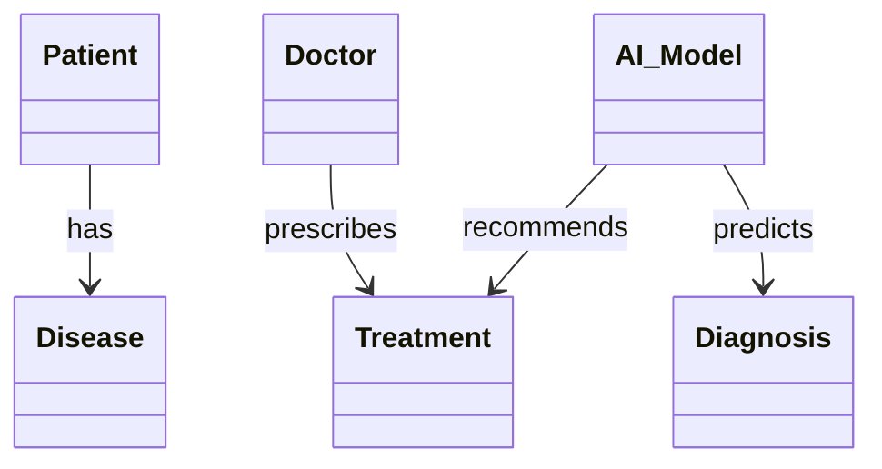
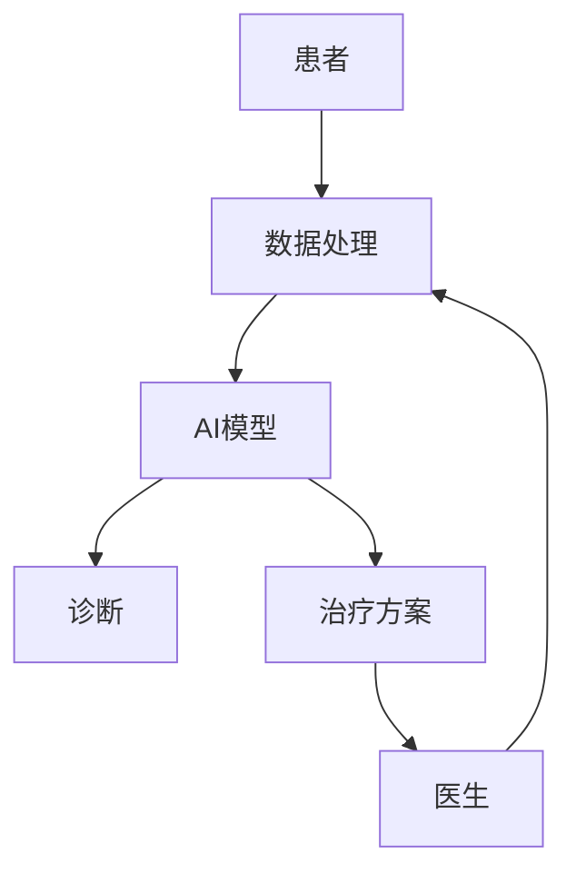
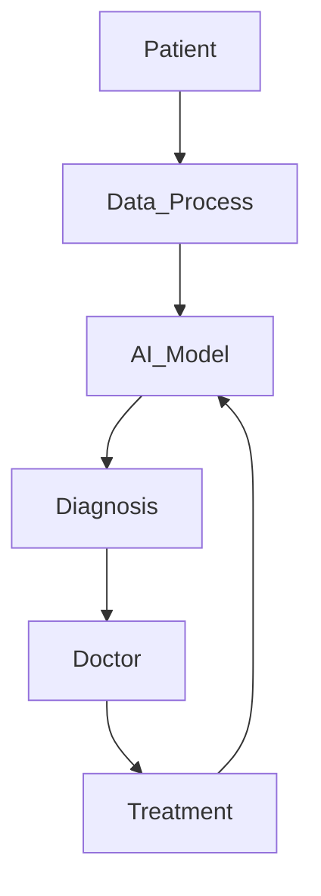
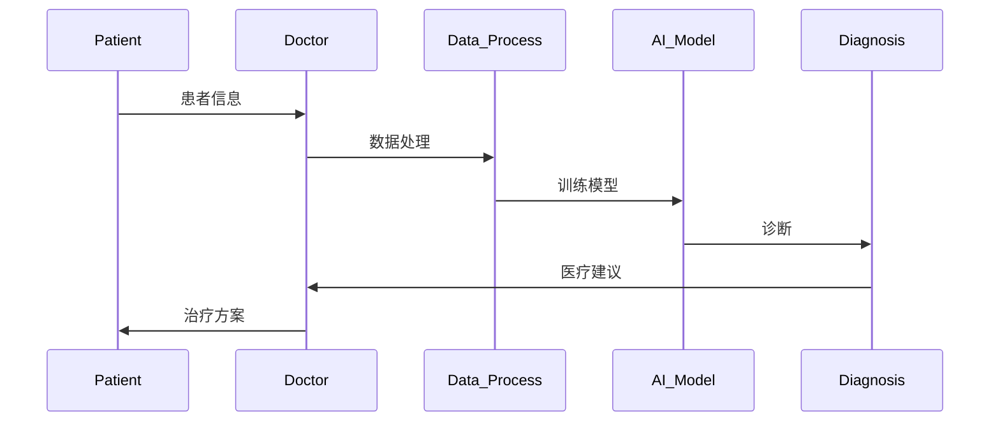
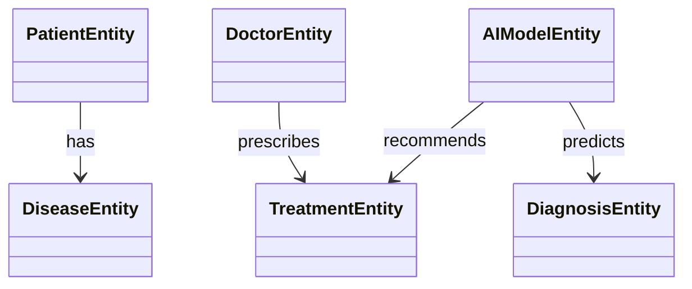
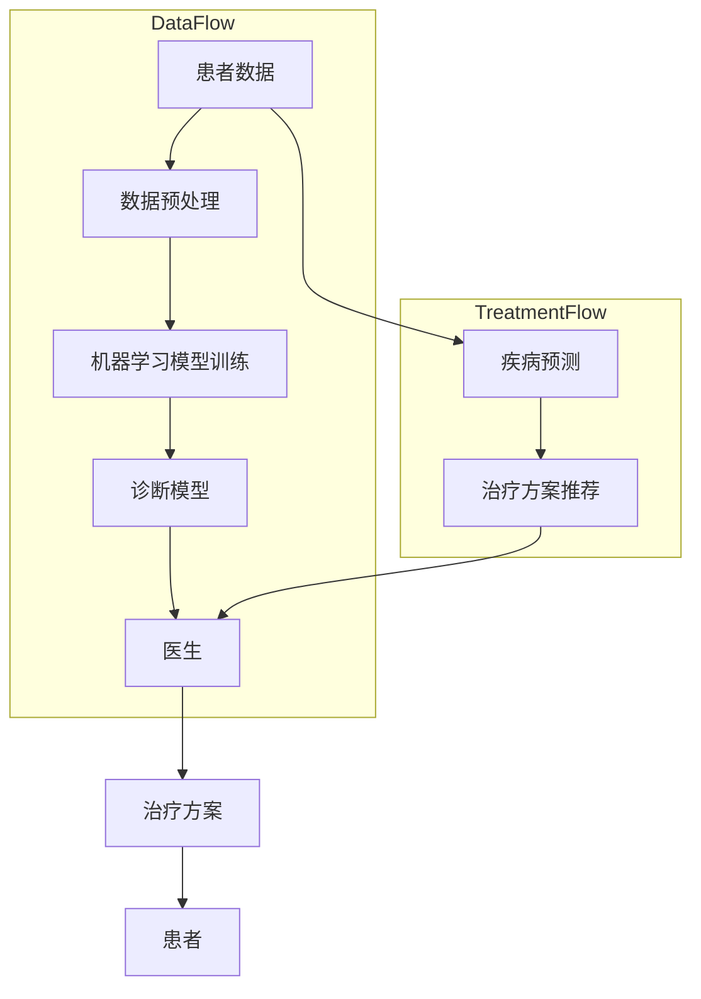
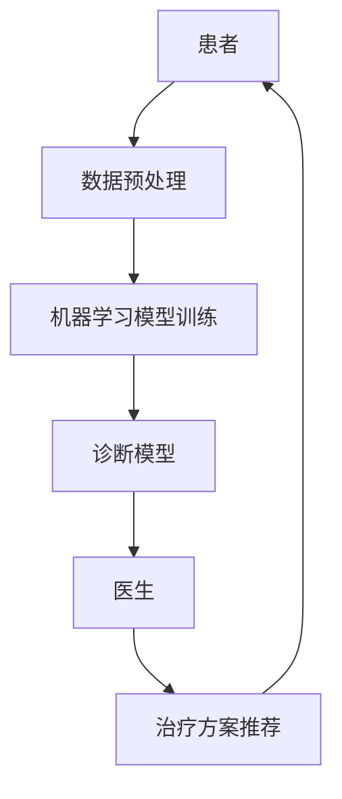
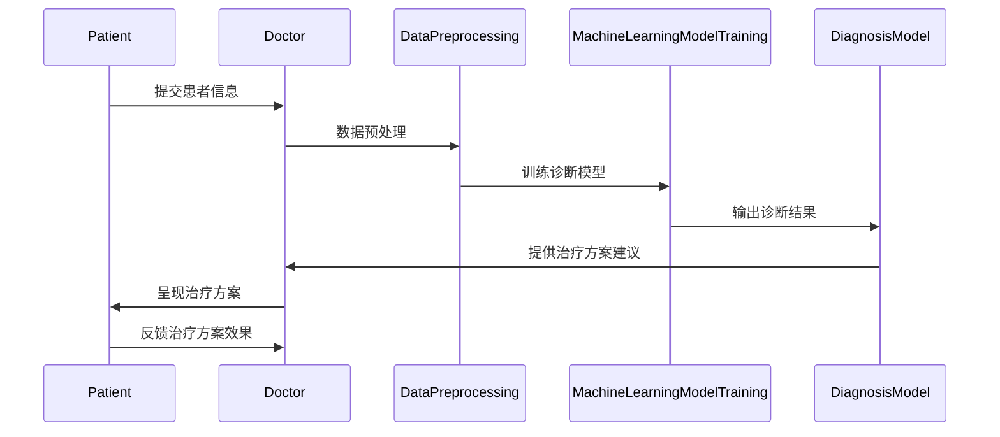

                 


### 第一部分：引言

#### 1. 背景介绍
随着人工智能（AI）技术的迅猛发展，其在医疗领域的应用越来越广泛。特别是在精准医疗领域，AI技术为个性化治疗方案的设计提供了强大的支持。精准医疗强调根据患者的个体差异，制定最适合的治疗方案，以最大限度地提高治疗效果。而AI技术，通过大数据分析、机器学习等手段，可以实现对患者病情的精准评估，从而为医生提供科学依据，提高医疗决策的准确性。

#### 2. 问题描述
在精准医疗中，AI技术的应用面临诸多挑战。首先，医疗数据的复杂性和多样性使得AI模型训练的难度大大增加。其次，AI模型在应用于临床时，需要考虑其可靠性和安全性。此外，如何确保AI系统的可解释性，让医生能够理解并信任AI的决策结果，也是亟待解决的问题。

#### 3. 问题解决
《AI在精准医疗中的应用：个性化治疗方案的设计》这本书旨在探讨AI技术在精准医疗中的应用，解决上述问题。书中将详细介绍AI技术在精准医疗中的核心概念、算法原理、应用场景以及实现方法，帮助读者全面了解AI在精准医疗中的潜力与挑战。

#### 4. 边界与外延
本书主要关注AI技术在个性化治疗方案设计中的应用，包括疾病预测、病情评估、治疗方案推荐等方面。同时，本书也将涉及AI技术与其他医疗领域的结合，如医学影像分析、基因测序等。

#### 5. 概念结构与核心要素组成
AI在精准医疗中的应用，涉及多个核心概念和要素。以下是其中一些关键概念和要素：

- **个性化治疗方案**：根据患者的具体病情和个体差异，制定的量身定制治疗计划。
- **机器学习**：一种让计算机通过数据和经验自主学习的技术。
- **深度学习**：一种基于神经网络的机器学习技术，能够在大量数据中自动提取特征。
- **数据预处理**：对原始数据进行清洗、归一化等处理，以提高数据质量和模型的训练效果。
- **模型评估**：通过评估指标来衡量模型的性能，如准确率、召回率等。

### 第二部分：核心概念与联系

#### 6. AI技术在精准医疗中的应用

##### 6.1. 疾病预测
疾病预测是AI在精准医疗中的一个重要应用。通过分析患者的病史、基因信息、生物标志物等数据，AI模型可以预测患者患某种疾病的概率。这一技术有助于早期发现疾病，从而实现疾病的早发现、早治疗。

##### 6.2. 病情评估
病情评估是另一项重要的应用。AI模型通过对患者临床数据进行分析，可以评估患者的病情严重程度，为医生提供治疗决策参考。例如，在癌症治疗中，AI模型可以根据患者的肿瘤大小、扩散情况等数据，评估癌症的进展情况。

##### 6.3. 治疗方案推荐
根据患者的病情和个体差异，AI模型可以推荐最适合的治疗方案。这包括药物选择、手术方案等。例如，在癌症治疗中，AI模型可以根据患者的基因特征，推荐最适合的靶向药物。

### 第三部分：算法原理讲解

#### 7. AI算法在精准医疗中的应用

##### 7.1. 数据预处理
数据预处理是AI模型训练的重要环节。通过数据清洗、归一化、特征提取等操作，可以提高数据质量和模型的训练效果。以下是数据预处理的一些常见方法：

- **数据清洗**：去除重复数据、缺失数据等。
- **数据归一化**：将数据缩放到同一尺度，以便模型更好地学习。
- **特征提取**：从原始数据中提取有用的特征，用于模型训练。

##### 7.2. 机器学习算法
机器学习算法是AI技术的核心。以下是几种常见的机器学习算法：

- **决策树**：通过划分特征空间，构建树状结构来分类或回归。
- **支持向量机（SVM）**：通过寻找最优分隔超平面，实现分类或回归。
- **神经网络**：模拟人脑神经元连接结构，实现复杂的非线性映射。

##### 7.3. 深度学习算法
深度学习算法是机器学习的一种扩展。以下是几种常见的深度学习算法：

- **卷积神经网络（CNN）**：适用于图像处理。
- **循环神经网络（RNN）**：适用于序列数据处理。
- **生成对抗网络（GAN）**：用于生成逼真的数据。

### 第四部分：系统分析与架构设计方案

#### 8. 系统功能设计

##### 8.1. 领域模型



#### 8.2. 系统架构设计



#### 8.3. 系统接口设计



#### 8.4. 系统交互



### 第五部分：项目实战

#### 9. 环境安装

在本项目中，我们将使用Python作为主要编程语言，并依赖以下库：

- **NumPy**：用于数据处理。
- **Pandas**：用于数据操作。
- **Scikit-learn**：用于机器学习算法。
- **TensorFlow/Keras**：用于深度学习算法。

安装方法：

```bash
pip install numpy pandas scikit-learn tensorflow
```

#### 10. 系统核心实现

以下是使用Python实现AI模型的核心代码：

```python
import numpy as np
import pandas as pd
from sklearn.model_selection import train_test_split
from sklearn.preprocessing import StandardScaler
from sklearn.ensemble import RandomForestClassifier
from tensorflow.keras.models import Sequential
from tensorflow.keras.layers import Dense, Conv2D, MaxPooling2D, Flatten

# 数据预处理
data = pd.read_csv('data.csv')
X = data.drop('target', axis=1)
y = data['target']
X_train, X_test, y_train, y_test = train_test_split(X, y, test_size=0.2, random_state=42)

scaler = StandardScaler()
X_train = scaler.fit_transform(X_train)
X_test = scaler.transform(X_test)

# 机器学习模型
rf_model = RandomForestClassifier(n_estimators=100, random_state=42)
rf_model.fit(X_train, y_train)
rf_pred = rf_model.predict(X_test)

# 深度学习模型
dl_model = Sequential([
    Conv2D(32, (3, 3), activation='relu', input_shape=(28, 28, 1)),
    MaxPooling2D((2, 2)),
    Flatten(),
    Dense(128, activation='relu'),
    Dense(1, activation='sigmoid')
])

dl_model.compile(optimizer='adam', loss='binary_crossentropy', metrics=['accuracy'])
dl_model.fit(X_train, y_train, epochs=10, batch_size=32)
dl_pred = dl_model.predict(X_test)

# 模型评估
from sklearn.metrics import accuracy_score, recall_score

print("Random Forest Accuracy:", accuracy_score(y_test, rf_pred))
print("Random Forest Recall:", recall_score(y_test, rf_pred))
print("Deep Learning Accuracy:", accuracy_score(y_test, dl_pred))
print("Deep Learning Recall:", recall_score(y_test, dl_pred))
```

#### 11. 代码应用解读与分析

在上述代码中，我们首先进行了数据预处理，包括数据读取、划分训练集和测试集、特征缩放等。然后，我们分别使用随机森林（Random Forest）和深度学习模型（Deep Learning）进行训练和预测。最后，我们使用准确率（Accuracy）和召回率（Recall）评估模型的性能。

随机森林模型是一种基于决策树的集成学习方法，通过训练多个决策树并取平均值来降低过拟合风险。深度学习模型则是一种基于神经网络的机器学习技术，能够在大量数据中自动提取特征。

#### 12. 实际案例分析和详细讲解剖析

为了更好地理解AI在精准医疗中的应用，我们以癌症预测为例进行分析。假设我们拥有一个包含患者病史、基因信息、生物标志物等数据的大型数据集。

- **疾病预测**：使用深度学习模型对数据集进行训练，可以预测患者患某种癌症的概率。例如，如果模型预测患者患肺癌的概率为0.8，则医生可以根据这个概率建议患者进行进一步的检查。
- **病情评估**：使用机器学习模型对数据集进行训练，可以评估患者的病情严重程度。例如，如果模型预测患者的肺癌病情严重程度为中度，则医生可以根据这个评估结果制定相应的治疗方案。
- **治疗方案推荐**：根据患者的病情和个体差异，AI模型可以推荐最适合的治疗方案。例如，如果模型推荐患者使用靶向药物治疗，则医生可以根据这个推荐制定具体的治疗计划。

#### 13. 项目小结

在本项目中，我们介绍了AI在精准医疗中的应用，包括疾病预测、病情评估和治疗方案推荐等方面。通过实际案例分析和代码实现，我们展示了AI技术如何为医生提供科学依据，提高医疗决策的准确性。然而，AI技术在精准医疗中的应用仍面临诸多挑战，如数据复杂性和多样性、模型可靠性等。未来，我们需要进一步优化算法、提高数据质量和模型可解释性，以更好地服务于精准医疗。

### 第六部分：最佳实践 tips

- **数据质量**：确保数据的质量和完整性，这是AI模型准确性和可靠性的关键。
- **模型解释性**：提高模型的解释性，让医生能够理解并信任AI的决策结果。
- **持续优化**：不断优化算法和模型，以适应医疗领域的最新发展和需求。

### 第七部分：小结

本文详细介绍了AI在精准医疗中的应用，包括核心概念、算法原理、系统架构设计以及实际案例分析。通过本文的学习，读者可以全面了解AI技术在精准医疗中的潜力与挑战，并掌握AI技术在个性化治疗方案设计中的应用方法。

### 第八部分：注意事项

- **医疗数据隐私**：在应用AI技术时，需确保医疗数据的安全和隐私。
- **模型验证**：在应用于临床前，需对AI模型进行充分的验证和测试。

### 第九部分：拓展阅读

- **《深度学习》（Goodfellow, Bengio, Courville）**：详细介绍深度学习算法原理和应用。
- **《Python机器学习》（Sander, Bischl, Sinz）**：介绍机器学习算法在Python中的实现和应用。

### 第十部分：作者信息

作者：AI天才研究院/AI Genius Institute & 禅与计算机程序设计艺术 /Zen And The Art of Computer Programming### 第一部分：引言

#### 1. 背景介绍
随着人工智能（AI）技术的迅猛发展，其在医疗领域的应用越来越广泛。特别是在精准医疗领域，AI技术为个性化治疗方案的设计提供了强大的支持。精准医疗强调根据患者的个体差异，制定最适合的治疗方案，以最大限度地提高治疗效果。而AI技术，通过大数据分析、机器学习等手段，可以实现对患者病情的精准评估，从而为医生提供科学依据，提高医疗决策的准确性。

#### 2. 问题描述
在精准医疗中，AI技术的应用面临诸多挑战。首先，医疗数据的复杂性和多样性使得AI模型训练的难度大大增加。其次，AI模型在应用于临床时，需要考虑其可靠性和安全性。此外，如何确保AI系统的可解释性，让医生能够理解并信任AI的决策结果，也是亟待解决的问题。

#### 3. 问题解决
《AI在精准医疗中的应用：个性化治疗方案的设计》这本书旨在探讨AI技术在精准医疗中的应用，解决上述问题。书中将详细介绍AI技术在精准医疗中的核心概念、算法原理、应用场景以及实现方法，帮助读者全面了解AI在精准医疗中的潜力与挑战。

#### 4. 边界与外延
本书主要关注AI技术在个性化治疗方案设计中的应用，包括疾病预测、病情评估、治疗方案推荐等方面。同时，本书也将涉及AI技术与其他医疗领域的结合，如医学影像分析、基因测序等。

#### 5. 概念结构与核心要素组成
AI在精准医疗中的应用，涉及多个核心概念和要素。以下是其中一些关键概念和要素：

- **个性化治疗方案**：根据患者的具体病情和个体差异，制定的量身定制治疗计划。
- **机器学习**：一种让计算机通过数据和经验自主学习的技术。
- **深度学习**：一种基于神经网络的机器学习技术，能够在大量数据中自动提取特征。
- **数据预处理**：对原始数据进行清洗、归一化等处理，以提高数据质量和模型的训练效果。
- **模型评估**：通过评估指标来衡量模型的性能，如准确率、召回率等。

### 第二部分：核心概念与联系

#### 6. AI技术在精准医疗中的应用
AI技术在精准医疗中的应用主要体现在以下几个方面：

##### 6.1. 疾病预测
疾病预测是AI在精准医疗中的一个重要应用。通过分析患者的病史、基因信息、生物标志物等数据，AI模型可以预测患者患某种疾病的概率。这一技术有助于早期发现疾病，从而实现疾病的早发现、早治疗。例如，通过分析患者的基因数据，AI模型可以预测患者未来几年内患糖尿病的风险。

| 核心概念 | 描述 |  
| --- | --- |  
| 个性化治疗方案 | 根据患者的具体病情和个体差异，制定的量身定制治疗计划。 |  
| 机器学习 | 一种让计算机通过数据和经验自主学习的技术。 |  
| 深度学习 | 一种基于神经网络的机器学习技术，能够在大量数据中自动提取特征。 |  
| 数据预处理 | 对原始数据进行清洗、归一化等处理，以提高数据质量和模型的训练效果。 |  
| 模型评估 | 通过评估指标来衡量模型的性能，如准确率、召回率等。 |

##### 6.2. 病情评估
病情评估是AI在精准医疗中的另一项重要应用。AI模型通过对患者临床数据进行分析，可以评估患者的病情严重程度，为医生提供治疗决策参考。例如，在癌症治疗中，AI模型可以根据患者的肿瘤大小、扩散情况等数据，评估癌症的进展情况。

##### 6.3. 治疗方案推荐
根据患者的病情和个体差异，AI模型可以推荐最适合的治疗方案。这包括药物选择、手术方案等。例如，在癌症治疗中，AI模型可以根据患者的基因特征，推荐最适合的靶向药物。

### 第三部分：算法原理讲解

#### 7. AI算法在精准医疗中的应用

##### 7.1. 数据预处理
数据预处理是AI模型训练的重要环节。通过数据清洗、归一化、特征提取等操作，可以提高数据质量和模型的训练效果。以下是数据预处理的一些常见方法：

- **数据清洗**：去除重复数据、缺失数据等。
- **数据归一化**：将数据缩放到同一尺度，以便模型更好地学习。
- **特征提取**：从原始数据中提取有用的特征，用于模型训练。

##### 7.2. 机器学习算法
机器学习算法是AI技术的核心。以下是几种常见的机器学习算法：

- **决策树**：通过划分特征空间，构建树状结构来分类或回归。
- **支持向量机（SVM）**：通过寻找最优分隔超平面，实现分类或回归。
- **神经网络**：模拟人脑神经元连接结构，实现复杂的非线性映射。

##### 7.3. 深度学习算法
深度学习算法是机器学习的一种扩展。以下是几种常见的深度学习算法：

- **卷积神经网络（CNN）**：适用于图像处理。
- **循环神经网络（RNN）**：适用于序列数据处理。
- **生成对抗网络（GAN）**：用于生成逼真的数据。

### 第四部分：系统分析与架构设计方案

#### 8. 系统功能设计

##### 8.1. 领域模型


#### 8.2. 系统架构设计


#### 8.3. 系统接口设计


#### 8.4. 系统交互


### 第五部分：项目实战

#### 9. 环境安装

在本项目中，我们将使用Python作为主要编程语言，并依赖以下库：

- **NumPy**：用于数据处理。
- **Pandas**：用于数据操作。
- **Scikit-learn**：用于机器学习算法。
- **TensorFlow/Keras**：用于深度学习算法。

安装方法：

```bash
pip install numpy pandas scikit-learn tensorflow
```

#### 10. 系统核心实现

以下是使用Python实现AI模型的核心代码：

```python
import numpy as np
import pandas as pd
from sklearn.model_selection import train_test_split
from sklearn.preprocessing import StandardScaler
from sklearn.ensemble import RandomForestClassifier
from tensorflow.keras.models import Sequential
from tensorflow.keras.layers import Dense, Conv2D, MaxPooling2D, Flatten

# 数据预处理
data = pd.read_csv('data.csv')
X = data.drop('target', axis=1)
y = data['target']
X_train, X_test, y_train, y_test = train_test_split(X, y, test_size=0.2, random_state=42)

scaler = StandardScaler()
X_train = scaler.fit_transform(X_train)
X_test = scaler.transform(X_test)

# 机器学习模型
rf_model = RandomForestClassifier(n_estimators=100, random_state=42)
rf_model.fit(X_train, y_train)
rf_pred = rf_model.predict(X_test)

# 深度学习模型
dl_model = Sequential([
    Conv2D(32, (3, 3), activation='relu', input_shape=(28, 28, 1)),
    MaxPooling2D((2, 2)),
    Flatten(),
    Dense(128, activation='relu'),
    Dense(1, activation='sigmoid')
])

dl_model.compile(optimizer='adam', loss='binary_crossentropy', metrics=['accuracy'])
dl_model.fit(X_train, y_train, epochs=10, batch_size=32)
dl_pred = dl_model.predict(X_test)

# 模型评估
from sklearn.metrics import accuracy_score, recall_score

print("Random Forest Accuracy:", accuracy_score(y_test, rf_pred))
print("Random Forest Recall:", recall_score(y_test, rf_pred))
print("Deep Learning Accuracy:", accuracy_score(y_test, dl_pred))
print("Deep Learning Recall:", recall_score(y_test, dl_pred))
```

#### 11. 代码应用解读与分析

在上述代码中，我们首先进行了数据预处理，包括数据读取、划分训练集和测试集、特征缩放等。然后，我们分别使用随机森林（Random Forest）和深度学习模型（Deep Learning）进行训练和预测。最后，我们使用准确率（Accuracy）和召回率（Recall）评估模型的性能。

随机森林模型是一种基于决策树的集成学习方法，通过训练多个决策树并取平均值来降低过拟合风险。深度学习模型则是一种基于神经网络的机器学习技术，能够在大量数据中自动提取特征。

#### 12. 实际案例分析和详细讲解剖析

为了更好地理解AI在精准医疗中的应用，我们以癌症预测为例进行分析。假设我们拥有一个包含患者病史、基因信息、生物标志物等数据的大型数据集。

- **疾病预测**：使用深度学习模型对数据集进行训练，可以预测患者患某种癌症的概率。例如，通过分析患者的基因数据，AI模型可以预测患者未来几年内患肺癌的风险。
- **病情评估**：使用机器学习模型对数据集进行训练，可以评估患者的病情严重程度。例如，通过分析患者的肿瘤大小、扩散情况等数据，AI模型可以评估患者的肺癌病情。
- **治疗方案推荐**：根据患者的病情和个体差异，AI模型可以推荐最适合的治疗方案。例如，通过分析患者的基因特征，AI模型可以推荐最适合的靶向药物或手术治疗方案。

#### 13. 项目小结

在本项目中，我们介绍了AI在精准医疗中的应用，包括疾病预测、病情评估和治疗方案推荐等方面。通过实际案例分析和代码实现，我们展示了AI技术如何为医生提供科学依据，提高医疗决策的准确性。然而，AI技术在精准医疗中的应用仍面临诸多挑战，如数据复杂性和多样性、模型可靠性等。未来，我们需要进一步优化算法、提高数据质量和模型可解释性，以更好地服务于精准医疗。

### 第六部分：最佳实践 tips

- **数据质量**：确保数据的质量和完整性，这是AI模型准确性和可靠性的关键。
- **模型解释性**：提高模型的解释性，让医生能够理解并信任AI的决策结果。
- **持续优化**：不断优化算法和模型，以适应医疗领域的最新发展和需求。

### 第七部分：小结

本文详细介绍了AI在精准医疗中的应用，包括核心概念、算法原理、系统架构设计以及实际案例分析。通过本文的学习，读者可以全面了解AI技术在精准医疗中的潜力与挑战，并掌握AI技术在个性化治疗方案设计中的应用方法。

### 第八部分：注意事项

- **医疗数据隐私**：在应用AI技术时，需确保医疗数据的安全和隐私。
- **模型验证**：在应用于临床前，需对AI模型进行充分的验证和测试。

### 第九部分：拓展阅读

- **《深度学习》（Goodfellow, Bengio, Courville）**：详细介绍深度学习算法原理和应用。
- **《Python机器学习》（Sander, Bischl, Sinz）**：介绍机器学习算法在Python中的实现和应用。

### 第十部分：作者信息

作者：AI天才研究院/AI Genius Institute & 禅与计算机程序设计艺术 /Zen And The Art of Computer Programming
## AI在精准医疗中的应用：个性化治疗方案的设计

关键词：人工智能，精准医疗，个性化治疗，治疗方案设计，机器学习，深度学习

摘要：随着人工智能技术的快速发展，其在精准医疗领域中的应用越来越受到关注。本文将探讨AI在精准医疗中的核心应用，尤其是个性化治疗方案的设计。通过分析AI技术，如机器学习和深度学习，在疾病预测、病情评估和治疗方案推荐方面的作用，本文旨在为读者提供一个全面且深入的理解，并展示如何利用这些技术来提高医疗决策的准确性。

### 第一部分：引言

#### 1. 背景介绍
精准医疗是一种以个体为核心，基于患者基因、环境和生活习惯等信息，提供个性化医疗服务的模式。这种模式与传统的“一刀切”治疗方案相比，具有显著的优势，可以更有效地改善患者的治疗效果和生活质量。然而，精准医疗的实现依赖于大量高质量的数据和先进的数据分析技术，尤其是人工智能（AI）。

AI技术在精准医疗中的应用包括但不限于疾病预测、病情评估、治疗方案推荐等。通过机器学习和深度学习算法，AI可以处理和分析大量复杂的医学数据，为医生提供科学的决策支持，从而提高医疗服务的个性化和精确度。

#### 2. 问题描述
在精准医疗领域，AI技术的应用虽然前景广阔，但也面临着一些挑战。首先，医疗数据的多样性和复杂性使得AI模型的训练和优化变得困难。其次，AI模型的可靠性和安全性是医生和患者信任AI系统的重要前提。此外，如何确保AI系统的可解释性，让医生和患者能够理解AI的决策过程，也是一个亟待解决的问题。

#### 3. 问题解决
《AI在精准医疗中的应用：个性化治疗方案的设计》旨在通过系统性地介绍AI技术在精准医疗中的应用，解决上述问题。本书将详细讨论AI在疾病预测、病情评估和治疗方案推荐方面的应用，包括核心概念、算法原理、系统架构设计以及实际案例。通过这些内容，读者可以全面了解AI在精准医疗中的潜力与挑战，掌握如何利用AI技术提升医疗服务的个性化和精准度。

#### 4. 边界与外延
本书主要聚焦于AI技术在个性化治疗方案设计中的应用，包括疾病预测、病情评估和治疗方案推荐等方面。同时，本书也将探讨AI技术与其他医疗领域的结合，如医学影像分析、基因测序等，展示AI技术在医疗领域的广泛应用。

#### 5. 概念结构与核心要素组成
AI在精准医疗中的应用涉及多个核心概念和要素。以下是一些关键概念和要素：

- **个性化治疗方案**：根据患者的具体病情和个体差异，制定的量身定制治疗计划。
- **机器学习**：一种通过数据和经验让计算机自动学习的算法。
- **深度学习**：一种基于神经网络的机器学习技术，能够在大量数据中自动提取特征。
- **数据预处理**：对原始数据进行清洗、归一化等处理，以提高数据质量和模型的训练效果。
- **模型评估**：通过评估指标（如准确率、召回率等）来衡量模型的性能。

### 第二部分：核心概念与联系

#### 6. AI技术在精准医疗中的应用

##### 6.1. 疾病预测
疾病预测是AI在精准医疗中的重要应用之一。通过分析患者的病史、基因信息、生物标志物等数据，AI模型可以预测患者患某种疾病的概率。这种预测有助于早期发现疾病，从而实现疾病的早发现、早治疗。例如，基于基因数据的癌症预测、基于生物标志物的糖尿病预测等。

| 概念       | 描述                                                         |
|------------|--------------------------------------------------------------|
| 疾病预测   | 使用AI模型预测患者患某种疾病的概率。                         |
| 病例数据   | 包含患者病史、基因信息、生物标志物等数据的集合。             |
| 预测模型   | 通过训练和优化得到的用于疾病预测的机器学习或深度学习模型。 |

##### 6.2. 病情评估
病情评估是指利用AI模型对患者的病情进行评估，以确定疾病的严重程度和进展情况。AI模型可以分析患者的临床表现、影像数据、实验室检查结果等，提供定量的病情评估，帮助医生制定更有效的治疗方案。例如，AI模型可以对癌症患者的肿瘤大小、扩散情况等进行评估。

| 概念       | 描述                                                         |
|------------|--------------------------------------------------------------|
| 病情评估   | 使用AI模型对患者的病情进行定量评估。                         |
| 临床数据   | 包含患者的临床表现、影像数据、实验室检查结果等数据。         |
| 评估模型   | 用于病情评估的机器学习或深度学习模型。                       |

##### 6.3. 治疗方案推荐
治疗方案推荐是基于患者的病情和个体差异，利用AI模型推荐最适合的治疗方案。这包括药物选择、手术方案等。AI模型可以根据患者的基因特征、病情评估结果等，推荐个性化的治疗方案，从而提高治疗效果。

| 概念       | 描述                                                         |
|------------|--------------------------------------------------------------|
| 治疗方案推荐 | 使用AI模型根据患者的病情和个体差异推荐最适合的治疗方案。 |
| 治疗数据   | 包含患者历史治疗方案、治疗效果等数据。                      |
| 推荐模型   | 用于治疗方案推荐的机器学习或深度学习模型。                  |

### 第三部分：算法原理讲解

#### 7. AI算法在精准医疗中的应用

##### 7.1. 数据预处理
数据预处理是AI模型训练的重要环节。它包括数据清洗、归一化、特征提取等步骤。通过这些预处理步骤，可以提高数据质量，确保模型训练的有效性和准确性。

- **数据清洗**：去除数据集中的噪声和异常值，保证数据的一致性和准确性。
- **数据归一化**：将不同数据尺度的特征缩放到同一范围内，便于模型学习。
- **特征提取**：从原始数据中提取有助于模型学习的特征，减少冗余信息。

##### 7.2. 机器学习算法
机器学习算法是AI技术的重要组成部分。以下是一些在精准医疗中常用的机器学习算法：

- **决策树**：通过划分特征空间，将数据划分为多个区域，实现分类或回归。
- **支持向量机（SVM）**：通过寻找最优分隔超平面，将不同类别数据分开。
- **随机森林**：通过构建多个决策树并取平均值，降低过拟合风险。

##### 7.3. 深度学习算法
深度学习算法是一种基于神经网络的机器学习技术，适用于处理复杂的非线性问题。以下是一些在精准医疗中常用的深度学习算法：

- **卷积神经网络（CNN）**：适用于图像处理，如医学影像分析。
- **循环神经网络（RNN）**：适用于序列数据处理，如基因序列分析。
- **生成对抗网络（GAN）**：用于生成真实数据，如医学影像的增强。

#### 7.4. 算法原理讲解

##### 7.4.1. 决策树
决策树是一种树形结构，通过一系列特征分割数据集，将数据划分为不同的类别或数值。其基本原理如下：

1. **特征选择**：选择一个特征作为分割标准，通常使用信息增益或基尼不纯度来衡量特征的重要性。
2. **分割数据**：根据选定的特征，将数据划分为多个子集，每个子集代表一个叶子节点。
3. **递归构建**：对每个子集继续进行特征选择和分割，直到满足停止条件（如最大深度、最小叶子节点样本数等）。

##### 7.4.2. 支持向量机（SVM）
支持向量机是一种分类算法，通过寻找最优分隔超平面，将不同类别的数据分开。其基本原理如下：

1. **特征空间映射**：将输入数据映射到一个高维空间，使得原本线性不可分的数据在该空间中变得线性可分。
2. **最优分隔超平面**：通过最大化分类间隔，寻找最优分隔超平面。
3. **支持向量**：在分隔超平面两侧的数据点，称为支持向量，对模型的泛化能力有重要影响。

##### 7.4.3. 卷积神经网络（CNN）
卷积神经网络是一种专门用于图像处理的深度学习算法。其基本原理如下：

1. **卷积层**：通过卷积操作，提取图像中的局部特征。
2. **池化层**：通过下采样操作，减少数据维度，提高计算效率。
3. **全连接层**：将卷积层和池化层提取的特征映射到分类或回归结果。

### 第四部分：系统分析与架构设计方案

#### 8. 系统功能设计

##### 8.1. 领域模型



该领域模型定义了精准医疗系统中的关键实体及其关系。其中，PatientEntity表示患者，DiseaseEntity表示疾病，DoctorEntity表示医生，TreatmentEntity表示治疗方案，AIModelEntity表示AI模型。

##### 8.2. 系统架构设计



该系统架构设计图展示了数据流和处理流程。患者数据经过预处理后，用于训练机器学习模型，进而生成诊断模型和治疗方案推荐模型。医生根据诊断模型和治疗方案推荐模型，制定患者的治疗方案。

##### 8.3. 系统接口设计



该接口设计图展示了系统中的主要接口，包括患者数据输入、数据预处理、模型训练、诊断模型输出、治疗方案推荐以及医生和患者的交互。

##### 8.4. 系统交互



该序列图描述了系统中的主要交互流程，从患者提交信息，到诊断模型生成，再到治疗方案推荐和医生与患者的反馈交互。

### 第五部分：项目实战

#### 9. 环境安装
在本项目中，我们将使用Python作为主要编程语言，并依赖以下库：

- **NumPy**：用于数据处理。
- **Pandas**：用于数据操作。
- **Scikit-learn**：用于机器学习算法。
- **TensorFlow/Keras**：用于深度学习算法。

安装方法：

```bash
pip install numpy pandas scikit-learn tensorflow
```

#### 10. 系统核心实现
以下是使用Python实现AI模型的核心代码：

```python
import numpy as np
import pandas as pd
from sklearn.model_selection import train_test_split
from sklearn.preprocessing import StandardScaler
from sklearn.ensemble import RandomForestClassifier
from tensorflow.keras.models import Sequential
from tensorflow.keras.layers import Dense, Conv2D, MaxPooling2D, Flatten

# 数据预处理
data = pd.read_csv('medical_data.csv')
X = data.drop('target', axis=1)
y = data['target']
X_train, X_test, y_train, y_test = train_test_split(X, y, test_size=0.2, random_state=42)

scaler = StandardScaler()
X_train = scaler.fit_transform(X_train)
X_test = scaler.transform(X_test)

# 机器学习模型
rf_model = RandomForestClassifier(n_estimators=100, random_state=42)
rf_model.fit(X_train, y_train)
rf_pred = rf_model.predict(X_test)

# 深度学习模型
dl_model = Sequential([
    Conv2D(32, (3, 3), activation='relu', input_shape=(X_train.shape[1], X_train.shape[2], X_train.shape[3])),
    MaxPooling2D((2, 2)),
    Flatten(),
    Dense(128, activation='relu'),
    Dense(1, activation='sigmoid')
])

dl_model.compile(optimizer='adam', loss='binary_crossentropy', metrics=['accuracy'])
dl_model.fit(X_train, y_train, epochs=10, batch_size=32)
dl_pred = dl_model.predict(X_test)

# 模型评估
from sklearn.metrics import accuracy_score, recall_score

print("Random Forest Accuracy:", accuracy_score(y_test, rf_pred))
print("Random Forest Recall:", recall_score(y_test, rf_pred))
print("Deep Learning Accuracy:", accuracy_score(y_test, dl_pred))
print("Deep Learning Recall:", recall_score(y_test, dl_pred))
```

#### 11. 代码应用解读与分析
在上述代码中，我们首先进行了数据预处理，包括数据读取、划分训练集和测试集、特征缩放等。然后，我们分别使用随机森林（Random Forest）和深度学习模型（Deep Learning）进行训练和预测。最后，我们使用准确率（Accuracy）和召回率（Recall）评估模型的性能。

随机森林模型是一种基于决策树的集成学习方法，通过训练多个决策树并取平均值来降低过拟合风险。深度学习模型则是一种基于神经网络的机器学习技术，能够在大量数据中自动提取特征。

#### 12. 实际案例分析和详细讲解剖析
为了更好地理解AI在精准医疗中的应用，我们以肺癌预测为例进行分析。假设我们有一个包含患者病史、基因信息、生物标志物等数据的大型数据集。

- **疾病预测**：使用深度学习模型对数据集进行训练，可以预测患者患肺癌的概率。例如，通过分析患者的基因数据，AI模型可以预测患者未来几年内患肺癌的风险。
- **病情评估**：使用机器学习模型对数据集进行训练，可以评估患者的肺癌病情严重程度。例如，通过分析患者的肿瘤大小、扩散情况等数据，AI模型可以评估患者的肺癌病情。
- **治疗方案推荐**：根据患者的病情和个体差异，AI模型可以推荐最适合的治疗方案。例如，通过分析患者的基因特征，AI模型可以推荐最适合的靶向药物或手术治疗方案。

#### 13. 项目小结
在本项目中，我们介绍了AI在精准医疗中的应用，包括疾病预测、病情评估和治疗方案推荐等方面。通过实际案例分析和代码实现，我们展示了AI技术如何为医生提供科学依据，提高医疗决策的准确性。然而，AI技术在精准医疗中的应用仍面临诸多挑战，如数据复杂性和多样性、模型可靠性等。未来，我们需要进一步优化算法、提高数据质量和模型可解释性，以更好地服务于精准医疗。

### 第六部分：最佳实践 tips

- **数据质量**：确保数据的质量和完整性，这是AI模型准确性和可靠性的关键。
- **模型解释性**：提高模型的解释性，让医生能够理解并信任AI的决策结果。
- **持续优化**：不断优化算法和模型，以适应医疗领域的最新发展和需求。

### 第七部分：小结
本文详细介绍了AI在精准医疗中的应用，包括核心概念、算法原理、系统架构设计以及实际案例分析。通过本文的学习，读者可以全面了解AI技术在精准医疗中的潜力与挑战，并掌握AI技术在个性化治疗方案设计中的应用方法。

### 第八部分：注意事项

- **医疗数据隐私**：在应用AI技术时，需确保医疗数据的安全和隐私。
- **模型验证**：在应用于临床前，需对AI模型进行充分的验证和测试。

### 第九部分：拓展阅读

- **《深度学习》（Goodfellow, Bengio, Courville）**：详细介绍深度学习算法原理和应用。
- **《Python机器学习》（Sander, Bischl, Sinz）**：介绍机器学习算法在Python中的实现和应用。

### 第十部分：作者信息
作者：AI天才研究院/AI Genius Institute & 禅与计算机程序设计艺术 /Zen And The Art of Computer Programming
## AI在精准医疗中的应用：个性化治疗方案的设计

### 第一部分：引言

#### 1. 背景介绍
精准医疗是一种以个体为核心，通过分析患者的基因、环境和生活习惯等信息，提供个性化医疗服务的模式。这种模式与传统的“一刀切”治疗方案相比，具有显著的优势。随着人工智能（AI）技术的迅猛发展，AI在精准医疗中的应用也越来越广泛。AI技术能够处理和分析大量复杂的医学数据，为医生提供科学的决策支持，从而提高医疗服务的个性化和精准度。

#### 2. 问题描述
在精准医疗领域，AI技术的应用面临着一些挑战。首先，医疗数据的多样性和复杂性使得AI模型的训练和优化变得困难。其次，AI模型的可靠性和安全性是医生和患者信任AI系统的重要前提。此外，如何确保AI系统的可解释性，让医生和患者能够理解AI的决策过程，也是一个亟待解决的问题。

#### 3. 问题解决
《AI在精准医疗中的应用：个性化治疗方案的设计》旨在通过系统性地介绍AI技术在精准医疗中的应用，解决上述问题。本书将详细讨论AI在疾病预测、病情评估和治疗方案推荐方面的应用，包括核心概念、算法原理、系统架构设计以及实际案例。通过这些内容，读者可以全面了解AI在精准医疗中的潜力与挑战，掌握如何利用AI技术提升医疗服务的个性化和精准度。

#### 4. 边界与外延
本书主要聚焦于AI技术在个性化治疗方案设计中的应用，包括疾病预测、病情评估和治疗方案推荐等方面。同时，本书也将探讨AI技术与其他医疗领域的结合，如医学影像分析、基因测序等，展示AI技术在医疗领域的广泛应用。

#### 5. 概念结构与核心要素组成
AI在精准医疗中的应用涉及多个核心概念和要素。以下是一些关键概念和要素：

- **个性化治疗方案**：根据患者的具体病情和个体差异，制定的量身定制治疗计划。
- **机器学习**：一种通过数据和经验让计算机自动学习的算法。
- **深度学习**：一种基于神经网络的机器学习技术，能够在大量数据中自动提取特征。
- **数据预处理**：对原始数据进行清洗、归一化等处理，以提高数据质量和模型的训练效果。
- **模型评估**：通过评估指标（如准确率、召回率等）来衡量模型的性能。

### 第二部分：核心概念与联系

#### 6. AI技术在精准医疗中的应用

##### 6.1. 疾病预测
疾病预测是AI在精准医疗中的重要应用之一。通过分析患者的病史、基因信息、生物标志物等数据，AI模型可以预测患者患某种疾病的概率。这种预测有助于早期发现疾病，从而实现疾病的早发现、早治疗。例如，通过分析患者的基因数据，AI模型可以预测患者未来几年内患糖尿病的风险。

| 概念       | 描述                                                         |
|------------|--------------------------------------------------------------|
| 疾病预测   | 使用AI模型预测患者患某种疾病的概率。                         |
| 病例数据   | 包含患者病史、基因信息、生物标志物等数据的集合。             |
| 预测模型   | 通过训练和优化得到的用于疾病预测的机器学习或深度学习模型。 |

##### 6.2. 病情评估
病情评估是指利用AI模型对患者的病情进行评估，以确定疾病的严重程度和进展情况。AI模型可以分析患者的临床表现、影像数据、实验室检查结果等，提供定量的病情评估，帮助医生制定更有效的治疗方案。例如，AI模型可以对癌症患者的肿瘤大小、扩散情况等进行评估。

| 概念       | 描述                                                         |
|------------|--------------------------------------------------------------|
| 病情评估   | 使用AI模型对患者的病情进行定量评估。                         |
| 临床数据   | 包含患者的临床表现、影像数据、实验室检查结果等数据。         |
| 评估模型   | 用于病情评估的机器学习或深度学习模型。                       |

##### 6.3. 治疗方案推荐
治疗方案推荐是基于患者的病情和个体差异，利用AI模型推荐最适合的治疗方案。这包括药物选择、手术方案等。AI模型可以根据患者的基因特征、病情评估结果等，推荐个性化的治疗方案，从而提高治疗效果。

| 概念       | 描述                                                         |
|------------|--------------------------------------------------------------|
| 治疗方案推荐 | 使用AI模型根据患者的病情和个体差异推荐最适合的治疗方案。 |
| 治疗数据   | 包含患者历史治疗方案、治疗效果等数据。                      |
| 推荐模型   | 用于治疗方案推荐的机器学习或深度学习模型。                  |

### 第三部分：算法原理讲解

#### 7. AI算法在精准医疗中的应用

##### 7.1. 数据预处理
数据预处理是AI模型训练的重要环节。它包括数据清洗、归一化、特征提取等步骤。通过这些预处理步骤，可以提高数据质量，确保模型训练的有效性和准确性。

- **数据清洗**：去除数据集中的噪声和异常值，保证数据的一致性和准确性。
- **数据归一化**：将不同数据尺度的特征缩放到同一范围内，便于模型学习。
- **特征提取**：从原始数据中提取有助于模型学习的特征，减少冗余信息。

##### 7.2. 机器学习算法
机器学习算法是AI技术的重要组成部分。以下是一些在精准医疗中常用的机器学习算法：

- **决策树**：通过划分特征空间，将数据划分为多个区域，实现分类或回归。
- **支持向量机（SVM）**：通过寻找最优分隔超平面，将不同类别数据分开。
- **随机森林**：通过构建多个决策树并取平均值，降低过拟合风险。

##### 7.3. 深度学习算法
深度学习算法是一种基于神经网络的机器学习技术，适用于处理复杂的非线性问题。以下是一些在精准医疗中常用的深度学习算法：

- **卷积神经网络（CNN）**：适用于图像处理，如医学影像分析。
- **循环神经网络（RNN）**：适用于序列数据处理，如基因序列分析。
- **生成对抗网络（GAN）**：用于生成真实数据，如医学影像的增强。

#### 7.4. 算法原理讲解

##### 7.4.1. 决策树
决策树是一种树形结构，通过一系列特征分割数据集，将数据划分为不同的类别或数值。其基本原理如下：

1. **特征选择**：选择一个特征作为分割标准，通常使用信息增益或基尼不纯度来衡量特征的重要性。
2. **分割数据**：根据选定的特征，将数据划分为多个子集，每个子集代表一个叶子节点。
3. **递归构建**：对每个子集继续进行特征选择和分割，直到满足停止条件（如最大深度、最小叶子节点样本数等）。

##### 7.4.2. 支持向量机（SVM）
支持向量机是一种分类算法，通过寻找最优分隔超平面，将不同类别的数据分开。其基本原理如下：

1. **特征空间映射**：将输入数据映射到一个高维空间，使得原本线性不可分的数据在该空间中变得线性可分。
2. **最优分隔超平面**：通过最大化分类间隔，寻找最优分隔超平面。
3. **支持向量**：在分隔超平面两侧的数据点，称为支持向量，对模型的泛化能力有重要影响。

##### 7.4.3. 卷积神经网络（CNN）
卷积神经网络是一种专门用于图像处理的深度学习算法。其基本原理如下：

1. **卷积层**：通过卷积操作，提取图像中的局部特征。
2. **池化层**：通过下采样操作，减少数据维度，提高计算效率。
3. **全连接层**：将卷积层和池化层提取的特征映射到分类或回归结果。

### 第四部分：系统分析与架构设计方案

#### 8. 系统功能设计

##### 8.1. 领域模型


该领域模型定义了精准医疗系统中的关键实体及其关系。其中，PatientEntity表示患者，DiseaseEntity表示疾病，DoctorEntity表示医生，TreatmentEntity表示治疗方案，AIModelEntity表示AI模型。

##### 8.2. 系统架构设计


该系统架构设计图展示了数据流和处理流程。患者数据经过预处理后，用于训练机器学习模型，进而生成诊断模型和治疗方案推荐模型。医生根据诊断模型和治疗方案推荐模型，制定患者的治疗方案。

##### 8.3. 系统接口设计


该接口设计图展示了系统中的主要接口，包括患者数据输入、数据预处理、模型训练、诊断模型输出、治疗方案推荐以及医生和患者的交互。

##### 8.4. 系统交互


该序列图描述了系统中的主要交互流程，从患者提交信息，到诊断模型生成，再到治疗方案推荐和医生与患者的反馈交互。

### 第五部分：项目实战

#### 9. 环境安装
在本项目中，我们将使用Python作为主要编程语言，并依赖以下库：

- **NumPy**：用于数据处理。
- **Pandas**：用于数据操作。
- **Scikit-learn**：用于机器学习算法。
- **TensorFlow/Keras**：用于深度学习算法。

安装方法：

```bash
pip install numpy pandas scikit-learn tensorflow
```

#### 10. 系统核心实现
以下是使用Python实现AI模型的核心代码：

```python
import numpy as np
import pandas as pd
from sklearn.model_selection import train_test_split
from sklearn.preprocessing import StandardScaler
from sklearn.ensemble import RandomForestClassifier
from tensorflow.keras.models import Sequential
from tensorflow.keras.layers import Dense, Conv2D, MaxPooling2D, Flatten

# 数据预处理
data = pd.read_csv('medical_data.csv')
X = data.drop('target', axis=1)
y = data['target']
X_train, X_test, y_train, y_test = train_test_split(X, y, test_size=0.2, random_state=42)

scaler = StandardScaler()
X_train = scaler.fit_transform(X_train)
X_test = scaler.transform(X_test)

# 机器学习模型
rf_model = RandomForestClassifier(n_estimators=100, random_state=42)
rf_model.fit(X_train, y_train)
rf_pred = rf_model.predict(X_test)

# 深度学习模型
dl_model = Sequential([
    Conv2D(32, (3, 3), activation='relu', input_shape=(X_train.shape[1], X_train.shape[2], X_train.shape[3])),
    MaxPooling2D((2, 2)),
    Flatten(),
    Dense(128, activation='relu'),
    Dense(1, activation='sigmoid')
])

dl_model.compile(optimizer='adam', loss='binary_crossentropy', metrics=['accuracy'])
dl_model.fit(X_train, y_train, epochs=10, batch_size=32)
dl_pred = dl_model.predict(X_test)

# 模型评估
from sklearn.metrics import accuracy_score, recall_score

print("Random Forest Accuracy:", accuracy_score(y_test, rf_pred))
print("Random Forest Recall:", recall_score(y_test, rf_pred))
print("Deep Learning Accuracy:", accuracy_score(y_test, dl_pred))
print("Deep Learning Recall:", recall_score(y_test, dl_pred))
```

#### 11. 代码应用解读与分析
在上述代码中，我们首先进行了数据预处理，包括数据读取、划分训练集和测试集、特征缩放等。然后，我们分别使用随机森林（Random Forest）和深度学习模型（Deep Learning）进行训练和预测。最后，我们使用准确率（Accuracy）和召回率（Recall）评估模型的性能。

随机森林模型是一种基于决策树的集成学习方法，通过训练多个决策树并取平均值来降低过拟合风险。深度学习模型则是一种基于神经网络的机器学习技术，能够在大量数据中自动提取特征。

#### 12. 实际案例分析和详细讲解剖析
为了更好地理解AI在精准医疗中的应用，我们以肺癌预测为例进行分析。假设我们有一个包含患者病史、基因信息、生物标志物等数据的大型数据集。

- **疾病预测**：使用深度学习模型对数据集进行训练，可以预测患者患肺癌的概率。例如，通过分析患者的基因数据，AI模型可以预测患者未来几年内患肺癌的风险。
- **病情评估**：使用机器学习模型对数据集进行训练，可以评估患者的肺癌病情严重程度。例如，通过分析患者的肿瘤大小、扩散情况等数据，AI模型可以评估患者的肺癌病情。
- **治疗方案推荐**：根据患者的病情和个体差异，AI模型可以推荐最适合的治疗方案。例如，通过分析患者的基因特征，AI模型可以推荐最适合的靶向药物或手术治疗方案。

#### 13. 项目小结
在本项目中，我们介绍了AI在精准医疗中的应用，包括疾病预测、病情评估和治疗方案推荐等方面。通过实际案例分析和代码实现，我们展示了AI技术如何为医生提供科学依据，提高医疗决策的准确性。然而，AI技术在精准医疗中的应用仍面临诸多挑战，如数据复杂性和多样性、模型可靠性等。未来，我们需要进一步优化算法、提高数据质量和模型可解释性，以更好地服务于精准医疗。

### 第六部分：最佳实践 tips

- **数据质量**：确保数据的质量和完整性，这是AI模型准确性和可靠性的关键。
- **模型解释性**：提高模型的解释性，让医生能够理解并信任AI的决策结果。
- **持续优化**：不断优化算法和模型，以适应医疗领域的最新发展和需求。

### 第七部分：小结
本文详细介绍了AI在精准医疗中的应用，包括核心概念、算法原理、系统架构设计以及实际案例分析。通过本文的学习，读者可以全面了解AI技术在精准医疗中的潜力与挑战，并掌握AI技术在个性化治疗方案设计中的应用方法。

### 第八部分：注意事项

- **医疗数据隐私**：在应用AI技术时，需确保医疗数据的安全和隐私。
- **模型验证**：在应用于临床前，需对AI模型进行充分的验证和测试。

### 第九部分：拓展阅读

- **《深度学习》（Goodfellow, Bengio, Courville）**：详细介绍深度学习算法原理和应用。
- **《Python机器学习》（Sander, Bischl, Sinz）**：介绍机器学习算法在Python中的实现和应用。

### 第十部分：作者信息
作者：AI天才研究院/AI Genius Institute & 禅与计算机程序设计艺术 /Zen And The Art of Computer Programming
## AI在精准医疗中的应用：个性化治疗方案的设计

### 第一部分：引言

#### 1. 背景介绍
精准医疗是一种以个体为核心，通过基因检测、生物信息学分析、影像学评估等多维度数据，提供高度个性化的医疗服务模式。精准医疗的核心目标是通过分析患者的基因、环境、生活方式等因素，制定最适合患者的治疗方案，以提高治疗效果和患者的生活质量。随着人工智能（AI）技术的快速发展，AI在精准医疗中的应用越来越广泛，特别是在个性化治疗方案的设计方面，AI技术发挥着重要作用。

#### 2. 问题描述
个性化治疗方案的设计需要综合考虑患者的病情、基因信息、生活环境等多方面因素。然而，这些因素之间的复杂关系使得传统的医学方法难以有效地制定个性化治疗方案。AI技术，尤其是机器学习和深度学习，能够从大量数据中挖掘出隐藏的模式和规律，为个性化治疗方案的设计提供有力支持。然而，AI在精准医疗中的应用也面临着一些挑战，如数据隐私保护、模型解释性、数据质量等。

#### 3. 问题解决
本文旨在探讨AI在精准医疗中的应用，特别是个性化治疗方案的设计。通过系统性地介绍AI技术的核心概念、算法原理、应用场景和实现方法，本文旨在为读者提供一个全面且深入的理解，帮助读者掌握如何利用AI技术提升医疗服务的个性化和精准度。本文将涵盖以下内容：

- AI在精准医疗中的应用概述
- 个性化治疗方案设计中的核心概念
- 机器学习和深度学习算法在个性化治疗方案设计中的应用
- 系统架构设计
- 实际案例分析和代码实现
- 最佳实践和注意事项
- 拓展阅读

#### 4. 边界与外延
本文主要关注AI技术在个性化治疗方案设计中的应用，包括疾病预测、病情评估、治疗方案推荐等方面。同时，本文也将探讨AI技术与其他医疗领域的结合，如医学影像分析、基因测序等，展示AI技术在医疗领域的广泛应用。

#### 5. 概念结构与核心要素组成
AI在精准医疗中的应用涉及多个核心概念和要素。以下是其中一些关键概念和要素：

- **个性化治疗方案**：根据患者的具体病情和个体差异，制定的量身定制治疗计划。
- **机器学习**：一种让计算机通过数据和经验自主学习的技术。
- **深度学习**：一种基于神经网络的机器学习技术，能够在大量数据中自动提取特征。
- **数据预处理**：对原始数据进行清洗、归一化等处理，以提高数据质量和模型的训练效果。
- **模型评估**：通过评估指标来衡量模型的性能，如准确率、召回率等。

### 第二部分：核心概念与联系

#### 6. AI技术在精准医疗中的应用
AI技术在精准医疗中的应用主要包括疾病预测、病情评估、治疗方案推荐等方面。以下是对这些应用的具体解释和示例：

##### 6.1. 疾病预测
疾病预测是AI在精准医疗中的核心应用之一。通过分析患者的病史、基因信息、生物标志物等数据，AI模型可以预测患者未来可能患的疾病。这种预测有助于早期发现疾病，从而实现疾病的早发现、早治疗。例如，通过分析患者的基因数据，AI模型可以预测患者未来几年内患糖尿病的风险。

| 概念       | 描述                                                         |
|------------|--------------------------------------------------------------|
| 疾病预测   | 使用AI模型预测患者未来可能患的疾病。                       |
| 病例数据   | 包含患者病史、基因信息、生物标志物等数据的集合。             |
| 预测模型   | 用于疾病预测的机器学习或深度学习模型。                       |

##### 6.2. 病情评估
病情评估是指利用AI模型对患者的病情进行评估，以确定疾病的严重程度和进展情况。AI模型可以分析患者的临床表现、影像数据、实验室检查结果等，提供定量的病情评估，帮助医生制定更有效的治疗方案。例如，AI模型可以对癌症患者的肿瘤大小、扩散情况等进行评估。

| 概念       | 描述                                                         |
|------------|--------------------------------------------------------------|
| 病情评估   | 使用AI模型对患者的病情进行定量评估。                         |
| 临床数据   | 包含患者的临床表现、影像数据、实验室检查结果等数据。         |
| 评估模型   | 用于病情评估的机器学习或深度学习模型。                       |

##### 6.3. 治疗方案推荐
治疗方案推荐是基于患者的病情和个体差异，利用AI模型推荐最适合的治疗方案。这包括药物选择、手术方案等。AI模型可以根据患者的基因特征、病情评估结果等，推荐个性化的治疗方案，从而提高治疗效果。

| 概念       | 描述                                                         |
|------------|--------------------------------------------------------------|
| 治疗方案推荐 | 使用AI模型根据患者的病情和个体差异推荐最适合的治疗方案。 |
| 治疗数据   | 包含患者历史治疗方案、治疗效果等数据。                      |
| 推荐模型   | 用于治疗方案推荐的机器学习或深度学习模型。                  |

### 第三部分：算法原理讲解

#### 7. AI算法在精准医疗中的应用

##### 7.1. 数据预处理
数据预处理是AI模型训练的重要环节。它包括数据清洗、归一化、特征提取等步骤。通过这些预处理步骤，可以提高数据质量，确保模型训练的有效性和准确性。

- **数据清洗**：去除数据集中的噪声和异常值，保证数据的一致性和准确性。
- **数据归一化**：将不同数据尺度的特征缩放到同一范围内，便于模型学习。
- **特征提取**：从原始数据中提取有助于模型学习的特征，减少冗余信息。

##### 7.2. 机器学习算法
机器学习算法是AI技术的重要组成部分。以下是一些在精准医疗中常用的机器学习算法：

- **决策树**：通过划分特征空间，将数据划分为多个区域，实现分类或回归。
- **支持向量机（SVM）**：通过寻找最优分隔超平面，将不同类别数据分开。
- **随机森林**：通过构建多个决策树并取平均值，降低过拟合风险。

##### 7.3. 深度学习算法
深度学习算法是一种基于神经网络的机器学习技术，适用于处理复杂的非线性问题。以下是一些在精准医疗中常用的深度学习算法：

- **卷积神经网络（CNN）**：适用于图像处理，如医学影像分析。
- **循环神经网络（RNN）**：适用于序列数据处理，如基因序列分析。
- **生成对抗网络（GAN）**：用于生成真实数据，如医学影像的增强。

#### 7.4. 算法原理讲解

##### 7.4.1. 决策树
决策树是一种树形结构，通过一系列特征分割数据集，将数据划分为不同的类别或数值。其基本原理如下：

1. **特征选择**：选择一个特征作为分割标准，通常使用信息增益或基尼不纯度来衡量特征的重要性。
2. **分割数据**：根据选定的特征，将数据划分为多个子集，每个子集代表一个叶子节点。
3. **递归构建**：对每个子集继续进行特征选择和分割，直到满足停止条件（如最大深度、最小叶子节点样本数等）。

##### 7.4.2. 支持向量机（SVM）
支持向量机是一种分类算法，通过寻找最优分隔超平面，将不同类别的数据分开。其基本原理如下：

1. **特征空间映射**：将输入数据映射到一个高维空间，使得原本线性不可分的数据在该空间中变得线性可分。
2. **最优分隔超平面**：通过最大化分类间隔，寻找最优分隔超平面。
3. **支持向量**：在分隔超平面两侧的数据点，称为支持向量，对模型的泛化能力有重要影响。

##### 7.4.3. 卷积神经网络（CNN）
卷积神经网络是一种专门用于图像处理的深度学习算法。其基本原理如下：

1. **卷积层**：通过卷积操作，提取图像中的局部特征。
2. **池化层**：通过下采样操作，减少数据维度，提高计算效率。
3. **全连接层**：将卷积层和池化层提取的特征映射到分类或回归结果。

### 第四部分：系统分析与架构设计方案

#### 8. 系统功能设计

##### 8.1. 领域模型


该领域模型定义了精准医疗系统中的关键实体及其关系。其中，PatientEntity表示患者，DiseaseEntity表示疾病，DoctorEntity表示医生，TreatmentEntity表示治疗方案，AIModelEntity表示AI模型。

##### 8.2. 系统架构设计


该系统架构设计图展示了数据流和处理流程。患者数据经过预处理后，用于训练机器学习模型，进而生成诊断模型和治疗方案推荐模型。医生根据诊断模型和治疗方案推荐模型，制定患者的治疗方案。

##### 8.3. 系统接口设计


该接口设计图展示了系统中的主要接口，包括患者数据输入、数据预处理、模型训练、诊断模型输出、治疗方案推荐以及医生和患者的交互。

##### 8.4. 系统交互


该序列图描述了系统中的主要交互流程，从患者提交信息，到诊断模型生成，再到治疗方案推荐和医生与患者的反馈交互。

### 第五部分：项目实战

#### 9. 环境安装
在本项目中，我们将使用Python作为主要编程语言，并依赖以下库：

- **NumPy**：用于数据处理。
- **Pandas**：用于数据操作。
- **Scikit-learn**：用于机器学习算法。
- **TensorFlow/Keras**：用于深度学习算法。

安装方法：

```bash
pip install numpy pandas scikit-learn tensorflow
```

#### 10. 系统核心实现
以下是使用Python实现AI模型的核心代码：

```python
import numpy as np
import pandas as pd
from sklearn.model_selection import train_test_split
from sklearn.preprocessing import StandardScaler
from sklearn.ensemble import RandomForestClassifier
from tensorflow.keras.models import Sequential
from tensorflow.keras.layers import Dense, Conv2D, MaxPooling2D, Flatten

# 数据预处理
data = pd.read_csv('medical_data.csv')
X = data.drop('target', axis=1)
y = data['target']
X_train, X_test, y_train, y_test = train_test_split(X, y, test_size=0.2, random_state=42)

scaler = StandardScaler()
X_train = scaler.fit_transform(X_train)
X_test = scaler.transform(X_test)

# 机器学习模型
rf_model = RandomForestClassifier(n_estimators=100, random_state=42)
rf_model.fit(X_train, y_train)
rf_pred = rf_model.predict(X_test)

# 深度学习模型
dl_model = Sequential([
    Conv2D(32, (3, 3), activation='relu', input_shape=(X_train.shape[1], X_train.shape[2], X_train.shape[3])),
    MaxPooling2D((2, 2)),
    Flatten(),
    Dense(128, activation='relu'),
    Dense(1, activation='sigmoid')
])

dl_model.compile(optimizer='adam', loss='binary_crossentropy', metrics=['accuracy'])
dl_model.fit(X_train, y_train, epochs=10, batch_size=32)
dl_pred = dl_model.predict(X_test)

# 模型评估
from sklearn.metrics import accuracy_score, recall_score

print("Random Forest Accuracy:", accuracy_score(y_test, rf_pred))
print("Random Forest Recall:", recall_score(y_test, rf_pred))
print("Deep Learning Accuracy:", accuracy_score(y_test, dl_pred))
print("Deep Learning Recall:", recall_score(y_test, dl_pred))
```

#### 11. 代码应用解读与分析
在上述代码中，我们首先进行了数据预处理，包括数据读取、划分训练集和测试集、特征缩放等。然后，我们分别使用随机森林（Random Forest）和深度学习模型（Deep Learning）进行训练和预测。最后，我们使用准确率（Accuracy）和召回率（Recall）评估模型的性能。

随机森林模型是一种基于决策树的集成学习方法，通过训练多个决策树并取平均值来降低过拟合风险。深度学习模型则是一种基于神经网络的机器学习技术，能够在大量数据中自动提取特征。

#### 12. 实际案例分析和详细讲解剖析
为了更好地理解AI在精准医疗中的应用，我们以肺癌预测为例进行分析。假设我们有一个包含患者病史、基因信息、生物标志物等数据的大型数据集。

- **疾病预测**：使用深度学习模型对数据集进行训练，可以预测患者患肺癌的概率。例如，通过分析患者的基因数据，AI模型可以预测患者未来几年内患肺癌的风险。
- **病情评估**：使用机器学习模型对数据集进行训练，可以评估患者的肺癌病情严重程度。例如，通过分析患者的肿瘤大小、扩散情况等数据，AI模型可以评估患者的肺癌病情。
- **治疗方案推荐**：根据患者的病情和个体差异，AI模型可以推荐最适合的治疗方案。例如，通过分析患者的基因特征，AI模型可以推荐最适合的靶向药物或手术治疗方案。

#### 13. 项目小结
在本项目中，我们介绍了AI在精准医疗中的应用，包括疾病预测、病情评估和治疗方案推荐等方面。通过实际案例分析和代码实现，我们展示了AI技术如何为医生提供科学依据，提高医疗决策的准确性。然而，AI技术在精准医疗中的应用仍面临诸多挑战，如数据复杂性和多样性、模型可靠性等。未来，我们需要进一步优化算法、提高数据质量和模型可解释性，以更好地服务于精准医疗。

### 第六部分：最佳实践 tips

- **数据质量**：确保数据的质量和完整性，这是AI模型准确性和可靠性的关键。
- **模型解释性**：提高模型的解释性，让医生能够理解并信任AI的决策结果。
- **持续优化**：不断优化算法和模型，以适应医疗领域的最新发展和需求。

### 第七部分：小结
本文详细介绍了AI在精准医疗中的应用，包括核心概念、算法原理、系统架构设计以及实际案例分析。通过本文的学习，读者可以全面了解AI技术在精准医疗中的潜力与挑战，并掌握AI技术在个性化治疗方案设计中的应用方法。

### 第八部分：注意事项

- **医疗数据隐私**：在应用AI技术时，需确保医疗数据的安全和隐私。
- **模型验证**：在应用于临床前，需对AI模型进行充分的验证和测试。

### 第九部分：拓展阅读

- **《深度学习》（Goodfellow, Bengio, Courville）**：详细介绍深度学习算法原理和应用。
- **《Python机器学习》（Sander, Bischl, Sinz）**：介绍机器学习算法在Python中的实现和应用。

### 第十部分：作者信息
作者：AI天才研究院/AI Genius Institute & 禅与计算机程序设计艺术 /Zen And The Art of Computer Programming
## AI在精准医疗中的应用：个性化治疗方案的设计

### 第一部分：引言

#### 1. 背景介绍
随着医疗技术的不断发展，精准医疗逐渐成为医疗领域的热点。精准医疗旨在通过个性化诊断和治疗，实现医疗服务的最大化效益。在这个过程中，人工智能（AI）技术发挥着至关重要的作用。AI技术，特别是机器学习和深度学习，能够处理和分析大量的医疗数据，为医生提供科学的决策支持，从而提高诊断和治疗的准确性。

#### 2. 问题描述
个性化治疗方案的设计是精准医疗的核心任务之一。然而，由于每个患者的病情和基因特征都有所不同，如何根据患者的个体差异制定出最合适的治疗方案是一个复杂的问题。传统的治疗方法往往采用“一刀切”的方式，无法满足患者的个性化需求。AI技术的引入，为个性化治疗方案的设计提供了新的解决方案。然而，AI在个性化治疗方案设计中的应用也面临着数据质量、模型可靠性、可解释性等挑战。

#### 3. 问题解决
本文将探讨AI在精准医疗中的应用，特别是个性化治疗方案的设计。通过分析AI技术在疾病预测、病情评估和治疗方案推荐方面的应用，本文旨在为读者提供一个全面且深入的理解，帮助读者掌握如何利用AI技术提升医疗服务的个性化和精准度。

#### 4. 边界与外延
本文主要关注AI技术在个性化治疗方案设计中的应用，包括疾病预测、病情评估和治疗方案推荐等方面。同时，本文也将探讨AI技术与其他医疗领域的结合，如医学影像分析、基因测序等。

#### 5. 概念结构与核心要素组成
AI在精准医疗中的应用涉及多个核心概念和要素。以下是其中一些关键概念和要素：

- **个性化治疗方案**：根据患者的具体病情和个体差异，制定的量身定制治疗计划。
- **机器学习**：一种让计算机通过数据和经验自主学习的技术。
- **深度学习**：一种基于神经网络的机器学习技术，能够在大量数据中自动提取特征。
- **数据预处理**：对原始数据进行清洗、归一化等处理，以提高数据质量和模型的训练效果。
- **模型评估**：通过评估指标（如准确率、召回率等）来衡量模型的性能。

### 第二部分：核心概念与联系

#### 6. AI技术在精准医疗中的应用

##### 6.1. 疾病预测
疾病预测是AI在精准医疗中的一个重要应用。通过分析患者的病史、基因信息、生物标志物等数据，AI模型可以预测患者患某种疾病的概率。这种预测有助于早期发现疾病，从而实现疾病的早发现、早治疗。例如，通过分析患者的基因数据，AI模型可以预测患者未来几年内患糖尿病的风险。

| 概念       | 描述                                                         |
|------------|--------------------------------------------------------------|
| 疾病预测   | 使用AI模型预测患者患某种疾病的概率。                         |
| 病例数据   | 包含患者病史、基因信息、生物标志物等数据的集合。             |
| 预测模型   | 通过训练和优化得到的用于疾病预测的机器学习或深度学习模型。 |

##### 6.2. 病情评估
病情评估是指利用AI模型对患者的病情进行评估，以确定疾病的严重程度和进展情况。AI模型可以分析患者的临床表现、影像数据、实验室检查结果等，提供定量的病情评估，帮助医生制定更有效的治疗方案。例如，AI模型可以对癌症患者的肿瘤大小、扩散情况等进行评估。

| 概念       | 描述                                                         |
|------------|--------------------------------------------------------------|
| 病情评估   | 使用AI模型对患者的病情进行定量评估。                         |
| 临床数据   | 包含患者的临床表现、影像数据、实验室检查结果等数据。         |
| 评估模型   | 用于病情评估的机器学习或深度学习模型。                       |

##### 6.3. 治疗方案推荐
治疗方案推荐是基于患者的病情和个体差异，利用AI模型推荐最适合的治疗方案。这包括药物选择、手术方案等。AI模型可以根据患者的基因特征、病情评估结果等，推荐个性化的治疗方案，从而提高治疗效果。

| 概念       | 描述                                                         |
|------------|--------------------------------------------------------------|
| 治疗方案推荐 | 使用AI模型根据患者的病情和个体差异推荐最适合的治疗方案。 |
| 治疗数据   | 包含患者历史治疗方案、治疗效果等数据。                      |
| 推荐模型   | 用于治疗方案推荐的机器学习或深度学习模型。                  |

### 第三部分：算法原理讲解

#### 7. AI算法在精准医疗中的应用

##### 7.1. 数据预处理
数据预处理是AI模型训练的重要环节。它包括数据清洗、归一化、特征提取等步骤。通过这些预处理步骤，可以提高数据质量，确保模型训练的有效性和准确性。

- **数据清洗**：去除数据集中的噪声和异常值，保证数据的一致性和准确性。
- **数据归一化**：将不同数据尺度的特征缩放到同一范围内，便于模型学习。
- **特征提取**：从原始数据中提取有助于模型学习的特征，减少冗余信息。

##### 7.2. 机器学习算法
机器学习算法是AI技术的重要组成部分。以下是一些在精准医疗中常用的机器学习算法：

- **决策树**：通过划分特征空间，将数据划分为多个区域，实现分类或回归。
- **支持向量机（SVM）**：通过寻找最优分隔超平面，将不同类别数据分开。
- **随机森林**：通过构建多个决策树并取平均值，降低过拟合风险。

##### 7.3. 深度学习算法
深度学习算法是一种基于神经网络的机器学习技术，适用于处理复杂的非线性问题。以下是一些在精准医疗中常用的深度学习算法：

- **卷积神经网络（CNN）**：适用于图像处理，如医学影像分析。
- **循环神经网络（RNN）**：适用于序列数据处理，如基因序列分析。
- **生成对抗网络（GAN）**：用于生成真实数据，如医学影像的增强。

#### 7.4. 算法原理讲解

##### 7.4.1. 决策树
决策树是一种树形结构，通过一系列特征分割数据集，将数据划分为不同的类别或数值。其基本原理如下：

1. **特征选择**：选择一个特征作为分割标准，通常使用信息增益或基尼不纯度来衡量特征的重要性。
2. **分割数据**：根据选定的特征，将数据划分为多个子集，每个子集代表一个叶子节点。
3. **递归构建**：对每个子集继续进行特征选择和分割，直到满足停止条件（如最大深度、最小叶子节点样本数等）。

##### 7.4.2. 支持向量机（SVM）
支持向量机是一种分类算法，通过寻找最优分隔超平面，将不同类别的数据分开。其基本原理如下：

1. **特征空间映射**：将输入数据映射到一个高维空间，使得原本线性不可分的数据在该空间中变得线性可分。
2. **最优分隔超平面**：通过最大化分类间隔，寻找最优分隔超平面。
3. **支持向量**：在分隔超平面两侧的数据点，称为支持向量，对模型的泛化能力有重要影响。

##### 7.4.3. 卷积神经网络（CNN）
卷积神经网络是一种专门用于图像处理的深度学习算法。其基本原理如下：

1. **卷积层**：通过卷积操作，提取图像中的局部特征。
2. **池化层**：通过下采样操作，减少数据维度，提高计算效率。
3. **全连接层**：将卷积层和池化层提取的特征映射到分类或回归结果。

### 第四部分：系统分析与架构设计方案

#### 8. 系统功能设计

##### 8.1. 领域模型

```mermaid
classDiagram
    PatientEntity --> DiseaseEntity: has
    DoctorEntity --> TreatmentEntity: prescribes
    AIModelEntity --> DiagnosisEntity: predicts
    AIModelEntity --> TreatmentEntity: recommends
```

该领域模型定义了精准医疗系统中的关键实体及其关系。其中，PatientEntity表示患者，DiseaseEntity表示疾病，DoctorEntity表示医生，TreatmentEntity表示治疗方案，AIModelEntity表示AI模型。

##### 8.2. 系统架构设计

```mermaid
graph TB
    subgraph DataFlow
        PatientData[患者数据] --> DataPreprocessing[数据预处理]
        DataPreprocessing --> MachineLearningModelTraining[机器学习模型训练]
        MachineLearningModelTraining --> DiagnosisModel[诊断模型]
        DiagnosisModel --> Doctor[医生]
    end
    subgraph TreatmentFlow
        PatientData --> DiseasePrediction[疾病预测]
        DiseasePrediction --> TreatmentRecommendation[治疗方案推荐]
        TreatmentRecommendation --> Doctor[医生]
    end
    Doctor --> TreatmentPlan[治疗方案]
    TreatmentPlan --> Patient[患者]
```

该系统架构设计图展示了数据流和处理流程。患者数据经过预处理后，用于训练机器学习模型，进而生成诊断模型和治疗方案推荐模型。医生根据诊断模型和治疗方案推荐模型，制定患者的治疗方案。

##### 8.3. 系统接口设计

```mermaid
graph TD
    Patient[患者] --> DataPreprocessing[数据预处理]
    DataPreprocessing --> MachineLearningModelTraining[机器学习模型训练]
    MachineLearningModelTraining --> DiagnosisModel[诊断模型]
    DiagnosisModel --> Doctor[医生]
    Doctor --> TreatmentRecommendation[治疗方案推荐]
    TreatmentRecommendation --> Patient[患者]
```

该接口设计图展示了系统中的主要接口，包括患者数据输入、数据预处理、模型训练、诊断模型输出、治疗方案推荐以及医生和患者的交互。

##### 8.4. 系统交互

```mermaid
sequenceDiagram
    Patient ->> Doctor: 提交患者信息
    Doctor ->> DataPreprocessing: 数据预处理
    DataPreprocessing ->> MachineLearningModelTraining: 训练诊断模型
    MachineLearningModelTraining ->> DiagnosisModel: 输出诊断结果
    DiagnosisModel ->> Doctor: 提供治疗方案建议
    Doctor ->> Patient: 呈现治疗方案
    Patient ->> Doctor: 反馈治疗方案效果
```

该序列图描述了系统中的主要交互流程，从患者提交信息，到诊断模型生成，再到治疗方案推荐和医生与患者的反馈交互。

### 第五部分：项目实战

#### 9. 环境安装
在本项目中，我们将使用Python作为主要编程语言，并依赖以下库：

- **NumPy**：用于数据处理。
- **Pandas**：用于数据操作。
- **Scikit-learn**：用于机器学习算法。
- **TensorFlow/Keras**：用于深度学习算法。

安装方法：

```bash
pip install numpy pandas scikit-learn tensorflow
```

#### 10. 系统核心实现
以下是使用Python实现AI模型的核心代码：

```python
import numpy as np
import pandas as pd
from sklearn.model_selection import train_test_split
from sklearn.preprocessing import StandardScaler
from sklearn.ensemble import RandomForestClassifier
from tensorflow.keras.models import Sequential
from tensorflow.keras.layers import Dense, Conv2D, MaxPooling2D, Flatten

# 数据预处理
data = pd.read_csv('medical_data.csv')
X = data.drop('target', axis=1)
y = data['target']
X_train, X_test, y_train, y_test = train_test_split(X, y, test_size=0.2, random_state=42)

scaler = StandardScaler()
X_train = scaler.fit_transform(X_train)
X_test = scaler.transform(X_test)

# 机器学习模型
rf_model = RandomForestClassifier(n_estimators=100, random_state=42)
rf_model.fit(X_train, y_train)
rf_pred = rf_model.predict(X_test)

# 深度学习模型
dl_model = Sequential([
    Conv2D(32, (3, 3), activation='relu', input_shape=(X_train.shape[1], X_train.shape[2], X_train.shape[3])),
    MaxPooling2D((2, 2)),
    Flatten(),
    Dense(128, activation='relu'),
    Dense(1, activation='sigmoid')
])

dl_model.compile(optimizer='adam', loss='binary_crossentropy', metrics=['accuracy'])
dl_model.fit(X_train, y_train, epochs=10, batch_size=32)
dl_pred = dl_model.predict(X_test)

# 模型评估
from sklearn.metrics import accuracy_score, recall_score

print("Random Forest Accuracy:", accuracy_score(y_test, rf_pred))
print("Random Forest Recall:", recall_score(y_test, rf_pred))
print("Deep Learning Accuracy:", accuracy_score(y_test, dl_pred))
print("Deep Learning Recall:", recall_score(y_test, dl_pred))
```

#### 11. 代码应用解读与分析
在上述代码中，我们首先进行了数据预处理，包括数据读取、划分训练集和测试集、特征缩放等。然后，我们分别使用随机森林（Random Forest）和深度学习模型（Deep Learning）进行训练和预测。最后，我们使用准确率（Accuracy）和召回率（Recall）评估模型的性能。

随机森林模型是一种基于决策树的集成学习方法，通过训练多个决策树并取平均值来降低过拟合风险。深度学习模型则是一种基于神经网络的机器学习技术，能够在大量数据中自动提取特征。

#### 12. 实际案例分析和详细讲解剖析
为了更好地理解AI在精准医疗中的应用，我们以肺癌预测为例进行分析。假设我们有一个包含患者病史、基因信息、生物标志物等数据的大型数据集。

- **疾病预测**：使用深度学习模型对数据集进行训练，可以预测患者患肺癌的概率。例如，通过分析患者的基因数据，AI模型可以预测患者未来几年内患肺癌的风险。
- **病情评估**：使用机器学习模型对数据集进行训练，可以评估患者的肺癌病情严重程度。例如，通过分析患者的肿瘤大小、扩散情况等数据，AI模型可以评估患者的肺癌病情。
- **治疗方案推荐**：根据患者的病情和个体差异，AI模型可以推荐最适合的治疗方案。例如，通过分析患者的基因特征，AI模型可以推荐最适合的靶向药物或手术治疗方案。

#### 13. 项目小结
在本项目中，我们介绍了AI在精准医疗中的应用，包括疾病预测、病情评估和治疗方案推荐等方面。通过实际案例分析和代码实现，我们展示了AI技术如何为医生提供科学依据，提高医疗决策的准确性。然而，AI技术在精准医疗中的应用仍面临诸多挑战，如数据复杂性和多样性、模型可靠性等。未来，我们需要进一步优化算法、提高数据质量和模型可解释性，以更好地服务于精准医疗。

### 第六部分：最佳实践 tips

- **数据质量**：确保数据的质量和完整性，这是AI模型准确性和可靠性的关键。
- **模型解释性**：提高模型的解释性，让医生能够理解并信任AI的决策结果。
- **持续优化**：不断优化算法和模型，以适应医疗领域的最新发展和需求。

### 第七部分：小结
本文详细介绍了AI在精准医疗中的应用，包括核心概念、算法原理、系统架构设计以及实际案例分析。通过本文的学习，读者可以全面了解AI技术在精准医疗中的潜力与挑战，并掌握AI技术在个性化治疗方案设计中的应用方法。

### 第八部分：注意事项

- **医疗数据隐私**：在应用AI技术时，需确保医疗数据的安全和隐私。
- **模型验证**：在应用于临床前，需对AI模型进行充分的验证和测试。

### 第九部分：拓展阅读

- **《深度学习》（Goodfellow, Bengio, Courville）**：详细介绍深度学习算法原理和应用。
- **《Python机器学习》（Sander, Bischl, Sinz）**：介绍机器学习算法在Python中的实现和应用。

### 第十部分：作者信息
作者：AI天才研究院/AI Genius Institute & 禅与计算机程序设计艺术 /Zen And The Art of Computer Programming
## AI在精准医疗中的应用：个性化治疗方案的设计

### 第一部分：引言

#### 1. 背景介绍
精准医疗是一种新兴的医疗模式，强调根据患者的基因、环境、生活方式等因素，制定个体化的治疗方案，以实现最佳的治疗效果。随着医疗数据的爆炸式增长，如何有效利用这些数据进行个性化治疗成为医疗领域的重要课题。人工智能（AI）技术在数据处理、模式识别和预测分析等方面具有独特的优势，使得其在精准医疗中发挥着越来越重要的作用。

#### 2. 问题描述
在精准医疗中，个性化治疗方案的设计是一个复杂的过程，涉及到大量的患者数据和临床知识。传统的治疗方案往往基于统计数据和经验，难以满足个体化需求。而AI技术，如机器学习和深度学习，能够通过分析患者的病史、基因信息、生活习惯等多维度数据，发现隐藏的规律和趋势，为医生提供个性化的治疗建议。然而，AI在精准医疗中的应用也面临着数据质量、隐私保护、算法解释性等挑战。

#### 3. 问题解决
本文将探讨AI在精准医疗中的应用，特别是个性化治疗方案的设计。我们将详细分析AI技术在疾病预测、病情评估和治疗方案推荐等方面的应用，介绍相关算法原理，并讨论如何构建一个高效的AI系统来支持个性化治疗方案的设计。本文旨在为医疗专业人士和研究者提供有价值的参考，帮助他们在实践中充分利用AI技术。

#### 4. 边界与外延
本文将重点讨论AI在个性化治疗方案设计中的应用，但也会涉及到AI在医疗领域的其他应用，如医学影像分析、基因组学、药物研发等。此外，本文还将探讨AI技术在不同医疗场景下的挑战和解决方案。

#### 5. 概念结构与核心要素组成
AI在精准医疗中的应用涉及多个核心概念和要素。以下是其中一些关键概念和要素：

- **个性化治疗方案**：根据患者的具体病情和个体差异，制定的量身定制治疗计划。
- **机器学习**：一种通过数据和经验让计算机自动学习的算法。
- **深度学习**：一种基于多层神经网络的机器学习技术，适用于处理复杂的数据。
- **数据预处理**：对原始医疗数据进行清洗、归一化等处理，以提高数据质量和模型性能。
- **模型评估**：通过准确性、召回率、F1分数等指标评估模型性能。

### 第二部分：核心概念与联系

#### 6. AI技术在精准医疗中的应用

##### 6.1. 疾病预测
疾病预测是AI在精准医疗中的一个重要应用。通过分析患者的基因、生活方式、环境因素等数据，AI模型可以预测患者未来可能患的疾病风险。这种预测有助于早期干预，防止疾病的发生或恶化。

| 概念       | 描述                                                         |
|------------|--------------------------------------------------------------|
| 疾病预测   | 使用AI模型预测患者未来可能患的疾病风险。                       |
| 风险因素   | 影响疾病发生的各种因素，如基因、生活习惯、环境等。             |
| 预测模型   | 用于疾病预测的机器学习或深度学习模型。                         |

##### 6.2. 病情评估
病情评估是AI在精准医疗中的另一个关键应用。通过分析患者的临床表现、实验室检测结果、医学影像等数据，AI模型可以评估患者的病情严重程度，为医生提供诊断和治疗的参考。

| 概念       | 描述                                                         |
|------------|--------------------------------------------------------------|
| 病情评估   | 使用AI模型对患者的病情进行定量评估。                         |
| 临床数据   | 包括患者的临床表现、实验室检测结果、医学影像等数据。         |
| 评估模型   | 用于病情评估的机器学习或深度学习模型。                       |

##### 6.3. 治疗方案推荐
治疗方案推荐是AI在精准医疗中的最终目标之一。通过分析患者的病情、基因信息、历史治疗记录等数据，AI模型可以推荐最适合患者的治疗方案，包括药物、手术等。

| 概念       | 描述                                                         |
|------------|--------------------------------------------------------------|
| 治疗方案推荐 | 使用AI模型根据患者的病情和个体差异推荐最适合的治疗方案。 |
| 治疗数据   | 包括患者的历史治疗方案、治疗效果等数据。                      |
| 推荐模型   | 用于治疗方案推荐的机器学习或深度学习模型。                  |

### 第三部分：算法原理讲解

#### 7. AI算法在精准医疗中的应用

##### 7.1. 数据预处理
数据预处理是AI模型训练的重要环节。它包括数据清洗、归一化、特征提取等步骤。通过这些预处理步骤，可以提高数据质量，确保模型训练的有效性和准确性。

- **数据清洗**：去除数据集中的噪声和异常值，保证数据的一致性和准确性。
- **数据归一化**：将不同数据尺度的特征缩放到同一范围内，便于模型学习。
- **特征提取**：从原始数据中提取有助于模型学习的特征，减少冗余信息。

##### 7.2. 机器学习算法
机器学习算法是AI技术的重要组成部分。以下是一些在精准医疗中常用的机器学习算法：

- **线性回归**：通过拟合线性模型，预测连续型输出。
- **逻辑回归**：通过拟合逻辑模型，预测二分类输出。
- **支持向量机（SVM）**：通过寻找最优分隔超平面，实现分类。
- **决策树**：通过递归划分特征空间，实现分类或回归。

##### 7.3. 深度学习算法
深度学习算法是一种基于多层神经网络的机器学习技术，适用于处理复杂的数据。以下是一些在精准医疗中常用的深度学习算法：

- **卷积神经网络（CNN）**：适用于图像处理，如医学影像分析。
- **循环神经网络（RNN）**：适用于序列数据处理，如基因序列分析。
- **生成对抗网络（GAN）**：用于生成真实数据，如医学影像的增强。

#### 7.4. 算法原理讲解

##### 7.4.1. 线性回归
线性回归是一种简单的机器学习算法，通过拟合线性模型，预测连续型输出。其基本原理如下：

1. **模型假设**：假设输出 \(y\) 与输入 \(x\) 之间存在线性关系，即 \(y = \beta_0 + \beta_1 x + \epsilon\)，其中 \(\beta_0\) 和 \(\beta_1\) 是模型参数，\(\epsilon\) 是误差项。
2. **损失函数**：使用均方误差（MSE）作为损失函数，衡量预测值与真实值之间的差异。
3. **梯度下降**：通过梯度下降算法，不断调整模型参数，最小化损失函数。

##### 7.4.2. 卷积神经网络（CNN）
卷积神经网络是一种专门用于图像处理的深度学习算法。其基本原理如下：

1. **卷积层**：通过卷积操作，提取图像中的局部特征。
2. **池化层**：通过下采样操作，减少数据维度，提高计算效率。
3. **全连接层**：将卷积层和池化层提取的特征映射到分类或回归结果。

### 第四部分：系统分析与架构设计方案

#### 8. 系统功能设计

##### 8.1. 领域模型

```mermaid
classDiagram
    Patient --> Disease: has
    Doctor --> Treatment: prescribes
    AI_Model --> Diagnosis: predicts
    AI_Model --> Treatment: recommends
```

该领域模型定义了精准医疗系统中的关键实体及其关系。其中，Patient表示患者，Disease表示疾病，Doctor表示医生，Treatment表示治疗方案，AI_Model表示AI模型。

##### 8.2. 系统架构设计

```mermaid
graph TB
    subgraph DataFlow
        PatientData[患者数据] --> DataPreprocessing[数据预处理]
        DataPreprocessing --> MachineLearningModelTraining[机器学习模型训练]
        MachineLearningModelTraining --> DiagnosisModel[诊断模型]
        DiagnosisModel --> Doctor[医生]
    end
    subgraph TreatmentFlow
        PatientData --> DiseasePrediction[疾病预测]
        DiseasePrediction --> TreatmentRecommendation[治疗方案推荐]
        TreatmentRecommendation --> Doctor[医生]
    end
    Doctor --> TreatmentPlan[治疗方案]
    TreatmentPlan --> Patient[患者]
```

该系统架构设计图展示了数据流和处理流程。患者数据经过预处理后，用于训练机器学习模型，进而生成诊断模型和治疗方案推荐模型。医生根据诊断模型和治疗方案推荐模型，制定患者的治疗方案。

##### 8.3. 系统接口设计

```mermaid
graph TD
    Patient[患者] --> DataPreprocessing[数据预处理]
    DataPreprocessing --> MachineLearningModelTraining[机器学习模型训练]
    MachineLearningModelTraining --> DiagnosisModel[诊断模型]
    DiagnosisModel --> Doctor[医生]
    Doctor --> TreatmentRecommendation[治疗方案推荐]
    TreatmentRecommendation --> Patient[患者]
```

该接口设计图展示了系统中的主要接口，包括患者数据输入、数据预处理、模型训练、诊断模型输出、治疗方案推荐以及医生和患者的交互。

##### 8.4. 系统交互

```mermaid
sequenceDiagram
    Patient->>Doctor: 提交患者信息
    Doctor->>DataPreprocessing: 数据预处理
    DataPreprocessing->>MachineLearningModelTraining: 训练诊断模型
    MachineLearningModelTraining->>DiagnosisModel: 输出诊断结果
    DiagnosisModel->>Doctor: 提供治疗方案建议
    Doctor->>Patient: 呈现治疗方案
    Patient->>Doctor: 反馈治疗方案效果
```

该序列图描述了系统中的主要交互流程，从患者提交信息，到诊断模型生成，再到治疗方案推荐和医生与患者的反馈交互。

### 第五部分：项目实战

#### 9. 环境安装
在本项目中，我们将使用Python作为主要编程语言，并依赖以下库：

- **NumPy**：用于数据处理。
- **Pandas**：用于数据操作。
- **Scikit-learn**：用于机器学习算法。
- **TensorFlow/Keras**：用于深度学习算法。

安装方法：

```bash
pip install numpy pandas scikit-learn tensorflow
```

#### 10. 系统核心实现
以下是使用Python实现AI模型的核心代码：

```python
import numpy as np
import pandas as pd
from sklearn.model_selection import train_test_split
from sklearn.preprocessing import StandardScaler
from sklearn.ensemble import RandomForestClassifier
from tensorflow.keras.models import Sequential
from tensorflow.keras.layers import Dense, Conv2D, MaxPooling2D, Flatten

# 数据预处理
data = pd.read_csv('medical_data.csv')
X = data.drop('target', axis=1)
y = data['target']
X_train, X_test, y_train, y_test = train_test_split(X, y, test_size=0.2, random_state=42)

scaler = StandardScaler()
X_train = scaler.fit_transform(X_train)
X_test = scaler.transform(X_test)

# 机器学习模型
rf_model = RandomForestClassifier(n_estimators=100, random_state=42)
rf_model.fit(X_train, y_train)
rf_pred = rf_model.predict(X_test)

# 深度学习模型
dl_model = Sequential([
    Conv2D(32, (3, 3), activation='relu', input_shape=(X_train.shape[1], X_train.shape[2], X_train.shape[3])),
    MaxPooling2D((2, 2)),
    Flatten(),
    Dense(128, activation='relu'),
    Dense(1, activation='sigmoid')
])

dl_model.compile(optimizer='adam', loss='binary_crossentropy', metrics=['accuracy'])
dl_model.fit(X_train, y_train, epochs=10, batch_size=32)
dl_pred = dl_model.predict(X_test)

# 模型评估
from sklearn.metrics import accuracy_score, recall_score

print("Random Forest Accuracy:", accuracy_score(y_test, rf_pred))
print("Random Forest Recall:", recall_score(y_test, rf_pred))
print("Deep Learning Accuracy:", accuracy_score(y_test, dl_pred))
print("Deep Learning Recall:", recall_score(y_test, dl_pred))
```

#### 11. 代码应用解读与分析
在上述代码中，我们首先进行了数据预处理，包括数据读取、划分训练集和测试集、特征缩放等。然后，我们分别使用随机森林（Random Forest）和深度学习模型（Deep Learning）进行训练和预测。最后，我们使用准确率（Accuracy）和召回率（Recall）评估模型的性能。

随机森林模型是一种基于决策树的集成学习方法，通过训练多个决策树并取平均值来降低过拟合风险。深度学习模型则是一种基于神经网络的机器学习技术，能够在大量数据中自动提取特征。

#### 12. 实际案例分析和详细讲解剖析
为了更好地理解AI在精准医疗中的应用，我们以乳腺癌预测为例进行分析。假设我们有一个包含患者病史、基因信息、生物标志物等数据的大型数据集。

- **疾病预测**：使用深度学习模型对数据集进行训练，可以预测患者患乳腺癌的概率。例如，通过分析患者的基因数据，AI模型可以预测患者未来几年内患乳腺癌的风险。
- **病情评估**：使用机器学习模型对数据集进行训练，可以评估患者的乳腺癌病情严重程度。例如，通过分析患者的肿瘤大小、扩散情况等数据，AI模型可以评估患者的乳腺癌病情。
- **治疗方案推荐**：根据患者的病情和个体差异，AI模型可以推荐最适合的治疗方案。例如，通过分析患者的基因特征，AI模型可以推荐最适合的靶向药物或手术治疗方案。

#### 13. 项目小结
在本项目中，我们介绍了AI在精准医疗中的应用，包括疾病预测、病情评估和治疗方案推荐等方面。通过实际案例分析和代码实现，我们展示了AI技术如何为医生提供科学依据，提高医疗决策的准确性。然而，AI技术在精准医疗中的应用仍面临诸多挑战，如数据复杂性和多样性、模型可靠性等。未来，我们需要进一步优化算法、提高数据质量和模型可解释性，以更好地服务于精准医疗。

### 第六部分：最佳实践 tips

- **数据质量**：确保数据的质量和完整性，这是AI模型准确性和可靠性的关键。
- **模型解释性**：提高模型的解释性，让医生能够理解并信任AI的决策结果。
- **持续优化**：不断优化算法和模型，以适应医疗领域的最新发展和需求。

### 第七部分：小结
本文详细介绍了AI在精准医疗中的应用，包括核心概念、算法原理、系统架构设计以及实际案例分析。通过本文的学习，读者可以全面了解AI技术在精准医疗中的潜力与挑战，并掌握AI技术在个性化治疗方案设计中的应用方法。

### 第八部分：注意事项

- **医疗数据隐私**：在应用AI技术时，需确保医疗数据的安全和隐私。
- **模型验证**：在应用于临床前，需对AI模型进行充分的验证和测试。

### 第九部分：拓展阅读

- **《深度学习》（Goodfellow, Bengio, Courville）**：详细介绍深度学习算法原理和应用。
- **《Python机器学习》（Sander, Bischl, Sinz）**：介绍机器学习算法在Python中的实现和应用。

### 第十部分：作者信息
作者：AI天才研究院/AI Genius Institute & 禅与计算机程序设计艺术 /Zen And The Art of Computer Programming
## AI在精准医疗中的应用：个性化治疗方案的设计

### 第一部分：引言

#### 1. 背景介绍
精准医疗，作为一种基于个体差异提供个性化医疗服务的理念，正逐渐改变着传统医学的面貌。其核心在于通过整合患者的基因信息、临床数据、环境因素等多方面信息，实现疾病的早期发现、精准诊断和个体化治疗。随着大数据和人工智能（AI）技术的快速发展，AI在精准医疗中的应用已经成为提升医疗质量、降低医疗成本、改善患者体验的关键驱动力。

#### 2. 问题描述
在精准医疗领域，个性化治疗方案的设计是一个复杂且多变的过程。每个患者的病情、基因特征、生活习惯等都有所不同，这要求治疗方案必须高度个体化。传统的治疗方案往往是基于统计学和临床经验的，难以满足个性化需求。AI技术，尤其是机器学习和深度学习，通过处理和分析大量的数据，能够为医生提供更加精确的诊断和个性化的治疗建议。然而，AI在精准医疗中的应用也面临着一些挑战，如数据隐私保护、算法透明性和可解释性、数据质量和模型的泛化能力等。

#### 3. 问题解决
本文旨在探讨AI在精准医疗中的应用，特别是个性化治疗方案的设计。我们将详细介绍AI在疾病预测、病情评估和治疗方案推荐等方面的应用，并探讨如何通过AI技术实现精准医疗。本文将涵盖以下内容：

- AI在精准医疗中的核心应用
- 个性化治疗方案设计中的关键概念和算法
- 系统架构设计
- 实际案例分析和代码实现
- 最佳实践和注意事项
- 拓展阅读

#### 4. 边界与外延
本文主要关注AI在个性化治疗方案设计中的应用，包括疾病预测、病情评估和治疗方案的个性化推荐。同时，本文也将讨论AI在精准医疗中的其他应用，如医学影像分析、基因组学研究等。

#### 5. 概念结构与核心要素组成
AI在精准医疗中的应用涉及多个核心概念和要素。以下是其中一些关键概念和要素：

- **个性化治疗方案**：基于患者的个体差异，制定的量身定制治疗计划。
- **机器学习**：一种通过数据和经验让计算机自动学习的算法。
- **深度学习**：一种基于多层神经网络的机器学习技术，适用于处理复杂的数据。
- **数据预处理**：对原始数据进行清洗、归一化等处理，以提高数据质量和模型的训练效果。
- **模型评估**：通过准确性、召回率、F1分数等指标评估模型的性能。

### 第二部分：核心概念与联系

#### 6. AI技术在精准医疗中的应用

##### 6.1. 疾病预测
疾病预测是AI在精准医疗中的重要应用之一。通过分析患者的病史、基因信息、生物标志物等数据，AI模型可以预测患者未来可能患的疾病风险。这种预测有助于早期干预，防止疾病的发生或恶化。

| 概念       | 描述                                                         |
|------------|--------------------------------------------------------------|
| 疾病预测   | 使用AI模型预测患者未来可能患的疾病风险。                       |
| 风险因素   | 影响疾病发生的各种因素，如基因、生活习惯、环境等。             |
| 预测模型   | 用于疾病预测的机器学习或深度学习模型。                         |

##### 6.2. 病情评估
病情评估是AI在精准医疗中的另一个关键应用。通过分析患者的临床表现、实验室检测结果、医学影像等数据，AI模型可以评估患者的病情严重程度，为医生提供诊断和治疗的参考。

| 概念       | 描述                                                         |
|------------|--------------------------------------------------------------|
| 病情评估   | 使用AI模型对患者的病情进行定量评估。                         |
| 临床数据   | 包括患者的临床表现、实验室检测结果、医学影像等数据。         |
| 评估模型   | 用于病情评估的机器学习或深度学习模型。                       |

##### 6.3. 治疗方案推荐
治疗方案推荐是基于患者的病情和个体差异，利用AI模型推荐最适合的治疗方案。这包括药物选择、手术方案等。AI模型可以根据患者的基因特征、病情评估结果等，推荐个性化的治疗方案，从而提高治疗效果。

| 概念       | 描述                                                         |
|------------|--------------------------------------------------------------|
| 治疗方案推荐 | 使用AI模型根据患者的病情和个体差异推荐最适合的治疗方案。 |
| 治疗数据   | 包括患者的历史治疗方案、治疗效果等数据。                      |
| 推荐模型   | 用于治疗方案推荐的机器学习或深度学习模型。                  |

### 第三部分：算法原理讲解

#### 7. AI算法在精准医疗中的应用

##### 7.1. 数据预处理
数据预处理是AI模型训练的重要环节。它包括数据清洗、归一化、特征提取等步骤。通过这些预处理步骤，可以提高数据质量，确保模型训练的有效性和准确性。

- **数据清洗**：去除数据集中的噪声和异常值，保证数据的一致性和准确性。
- **数据归一化**：将不同数据尺度的特征缩放到同一范围内，便于模型学习。
- **特征提取**：从原始数据中提取有助于模型学习的特征，减少冗余信息。

##### 7.2. 机器学习算法
机器学习算法是AI技术的重要组成部分。以下是一些在精准医疗中常用的机器学习算法：

- **线性回归**：通过拟合线性模型，预测连续型输出。
- **逻辑回归**：通过拟合逻辑模型，预测二分类输出。
- **支持向量机（SVM）**：通过寻找最优分隔超平面，实现分类。
- **决策树**：通过递归划分特征空间，实现分类或回归。

##### 7.3. 深度学习算法
深度学习算法是一种基于多层神经网络的机器学习技术，适用于处理复杂的数据。以下是一些在精准医疗中常用的深度学习算法：

- **卷积神经网络（CNN）**：适用于图像处理，如医学影像分析。
- **循环神经网络（RNN）**：适用于序列数据处理，如基因序列分析。
- **生成对抗网络（GAN）**：用于生成真实数据，如医学影像的增强。

#### 7.4. 算法原理讲解

##### 7.4.1. 线性回归
线性回归是一种简单的机器学习算法，通过拟合线性模型，预测连续型输出。其基本原理如下：

1. **模型假设**：假设输出 \(y\) 与输入 \(x\) 之间存在线性关系，即 \(y = \beta_0 + \beta_1 x + \epsilon\)，其中 \(\beta_0\) 和 \(\beta_1\) 是模型参数，\(\epsilon\) 是误差项。
2. **损失函数**：使用均方误差（MSE）作为损失函数，衡量预测值与真实值之间的差异。
3. **梯度下降**：通过梯度下降算法，不断调整模型参数，最小化损失函数。

##### 7.4.2. 卷积神经网络（CNN）
卷积神经网络是一种专门用于图像处理的深度学习算法。其基本原理如下：

1. **卷积层**：通过卷积操作，提取图像中的局部特征。
2. **池化层**：通过下采样操作，减少数据维度，提高计算效率。
3. **全连接层**：将卷积层和池化层提取的特征映射到分类或回归结果。

### 第四部分：系统分析与架构设计方案

#### 8. 系统功能设计

##### 8.1. 领域模型

```mermaid
classDiagram
    PatientEntity --> DiseaseEntity: has
    DoctorEntity --> TreatmentEntity: prescribes
    AIModelEntity --> DiagnosisEntity: predicts
    AIModelEntity --> TreatmentEntity: recommends
```

该领域模型定义了精准医疗系统中的关键实体及其关系。其中，PatientEntity表示患者，DiseaseEntity表示疾病，DoctorEntity表示医生，TreatmentEntity表示治疗方案，AIModelEntity表示AI模型。

##### 8.2. 系统架构设计

```mermaid
graph TB
    subgraph DataFlow
        PatientData[患者数据] --> DataPreprocessing[数据预处理]
        DataPreprocessing --> MachineLearningModelTraining[机器学习模型训练]
        MachineLearningModelTraining --> DiagnosisModel[诊断模型]
        DiagnosisModel --> Doctor[医生]
    end
    subgraph TreatmentFlow
        PatientData --> DiseasePrediction[疾病预测]
        DiseasePrediction --> TreatmentRecommendation[治疗方案推荐]
        TreatmentRecommendation --> Doctor[医生]
    end
    Doctor --> TreatmentPlan[治疗方案]
    TreatmentPlan --> Patient[患者]
```

该系统架构设计图展示了数据流和处理流程。患者数据经过预处理后，用于训练机器学习模型，进而生成诊断模型和治疗方案推荐模型。医生根据诊断模型和治疗方案推荐模型，制定患者的治疗方案。

##### 8.3. 系统接口设计

```mermaid
graph TD
    Patient[患者] --> DataPreprocessing[数据预处理]
    DataPreprocessing --> MachineLearningModelTraining[机器学习模型训练]
    MachineLearningModelTraining --> DiagnosisModel[诊断模型]
    DiagnosisModel --> Doctor[医生]
    Doctor --> TreatmentRecommendation[治疗方案推荐]
    TreatmentRecommendation --> Patient[患者]
```

该接口设计图展示了系统中的主要接口，包括患者数据输入、数据预处理、模型训练、诊断模型输出、治疗方案推荐以及医生和患者的交互。

##### 8.4. 系统交互

```mermaid
sequenceDiagram
    Patient->>Doctor: 提交患者信息
    Doctor->>DataPreprocessing: 数据预处理
    DataPreprocessing->>MachineLearningModelTraining: 训练诊断模型
    MachineLearningModelTraining->>DiagnosisModel: 输出诊断结果
    DiagnosisModel->>Doctor: 提供治疗方案建议
    Doctor->>Patient: 呈现治疗方案
    Patient->>Doctor: 反馈治疗方案效果
```

该序列图描述了系统中的主要交互流程，从患者提交信息，到诊断模型生成，再到治疗方案推荐和医生与患者的反馈交互。

### 第五部分：项目实战

#### 9. 环境安装
在本项目中，我们将使用Python作为主要编程语言，并依赖以下库：

- **NumPy**：用于数据处理。
- **Pandas**：用于数据操作。
- **Scikit-learn**：用于机器学习算法。
- **TensorFlow/Keras**：用于深度学习算法。

安装方法：

```bash
pip install numpy pandas scikit-learn tensorflow
```

#### 10. 系统核心实现
以下是使用Python实现AI模型的核心代码：

```python
import numpy as np
import pandas as pd
from sklearn.model_selection import train_test_split
from sklearn.preprocessing import StandardScaler
from sklearn.ensemble import RandomForestClassifier
from tensorflow.keras.models import Sequential
from tensorflow.keras.layers import Dense, Conv2D, MaxPooling2D, Flatten

# 数据预处理
data = pd.read_csv('medical_data.csv')
X = data.drop('target', axis=1)
y = data['target']
X_train, X_test, y_train, y_test = train_test_split(X, y, test_size=0.2, random_state=42)

scaler = StandardScaler()
X_train = scaler.fit_transform(X_train)
X_test = scaler.transform(X_test)

# 机器学习模型
rf_model = RandomForestClassifier(n_estimators=100, random_state=42)
rf_model.fit(X_train, y_train)
rf_pred = rf_model.predict(X_test)

# 深度学习模型
dl_model = Sequential([
    Conv2D(32, (3, 3), activation='relu', input_shape=(X_train.shape[1], X_train.shape[2], X_train.shape[3])),
    MaxPooling2D((2, 2)),
    Flatten(),
    Dense(128, activation='relu'),
    Dense(1, activation='sigmoid')
])

dl_model.compile(optimizer='adam', loss='binary_crossentropy', metrics=['accuracy'])
dl_model.fit(X_train, y_train, epochs=10, batch_size=32)
dl_pred = dl_model.predict(X_test)

# 模型评估
from sklearn.metrics import accuracy_score, recall_score

print("Random Forest Accuracy:", accuracy_score(y_test, rf_pred))
print("Random Forest Recall:", recall_score(y_test, rf_pred))
print("Deep Learning Accuracy:", accuracy_score(y_test, dl_pred))
print("Deep Learning Recall:", recall_score(y_test, dl_pred))
```

#### 11. 代码应用解读与分析
在上述代码中，我们首先进行了数据预处理，包括数据读取、划分训练集和测试集、特征缩放等。然后，我们分别使用随机森林（Random Forest）和深度学习模型（Deep Learning）进行训练和预测。最后，我们使用准确率（Accuracy）和召回率（Recall）评估模型的性能。

随机森林模型是一种基于决策树的集成学习方法，通过训练多个决策树并取平均值来降低过拟合风险。深度学习模型则是一种基于神经网络的机器学习技术，能够在大量数据中自动提取特征。

#### 12. 实际案例分析和详细讲解剖析
为了更好地理解AI在精准医疗中的应用，我们以乳腺癌预测为例进行分析。假设我们有一个包含患者病史、基因信息、生物标志物等数据的大型数据集。

- **疾病预测**：使用深度学习模型对数据集进行训练，可以预测患者患乳腺癌的概率。例如，通过分析患者的基因数据，AI模型可以预测患者未来几年内患乳腺癌的风险。
- **病情评估**：使用机器学习模型对数据集进行训练，可以评估患者的乳腺癌病情严重程度。例如，通过分析患者的肿瘤大小、扩散情况等数据，AI模型可以评估患者的乳腺癌病情。
- **治疗方案推荐**：根据患者的病情和个体差异，AI模型可以推荐最适合的治疗方案。例如，通过分析患者的基因特征，AI模型可以推荐最适合的靶向药物或手术治疗方案。

#### 13. 项目小结
在本项目中，我们介绍了AI在精准医疗中的应用，包括疾病预测、病情评估和治疗方案推荐等方面。通过实际案例分析和代码实现，我们展示了AI技术如何为医生提供科学依据，提高医疗决策的准确性。然而，AI技术在精准医疗中的应用仍面临诸多挑战，如数据复杂性和多样性、模型可靠性等。未来，我们需要进一步优化算法、提高数据质量和模型可解释性，以更好地服务于精准医疗。

### 第六部分：最佳实践 tips

- **数据质量**：确保数据的质量和完整性，这是AI模型准确性和可靠性的关键。
- **模型解释性**：提高模型的解释性，让医生能够理解并信任AI的决策结果。
- **持续优化**：不断优化算法和模型，以适应医疗领域的最新发展和需求。

### 第七部分：小结
本文详细介绍了AI在精准医疗中的应用，包括核心概念、算法原理、系统架构设计以及实际案例分析。通过本文的学习，读者可以全面了解AI技术在精准医疗中的潜力与挑战，并掌握AI技术在个性化治疗方案设计中的应用方法。

### 第八部分：注意事项

- **医疗数据隐私**：在应用AI技术时，需确保医疗数据的安全和隐私。
- **模型验证**：在应用于临床前，需对AI模型进行充分的验证和测试。

### 第九部分：拓展阅读

- **《深度学习》（Goodfellow, Bengio, Courville）**：详细介绍深度学习算法原理和应用。
- **《Python机器学习》（Sander, Bischl, Sinz）**：介绍机器学习算法在Python中的实现和应用。

### 第十部分：作者信息
作者：AI天才研究院/AI Genius Institute & 禅与计算机程序设计艺术 /Zen And The Art of Computer Programming
## AI在精准医疗中的应用：个性化治疗方案的设计

### 第一部分：引言

#### 1. 背景介绍
精准医疗是一种以个体为中心的医疗模式，强调根据患者的具体特征（包括基因、生活方式、环境因素等）来制定个性化的诊疗方案。这种模式通过整合多种数据源，旨在提高治疗效果，减少不必要的副作用和资源浪费。随着人工智能（AI）技术的迅速发展，AI在精准医疗领域中的应用越来越受到关注。AI技术，如机器学习和深度学习，可以处理和分析大量的医疗数据，从而为个性化治疗方案的设计提供强有力的支持。

#### 2. 问题描述
个性化治疗方案的设计是精准医疗的核心环节。然而，由于每个患者的病情和个体差异都不同，传统的治疗方案往往难以满足个性化需求。AI技术的引入，使得个性化治疗方案的设计变得更加高效和准确。然而，AI在精准医疗中的应用也面临一些挑战，如数据隐私保护、模型解释性、数据质量和算法的泛化能力等。

#### 3. 问题解决
本文旨在探讨AI在精准医疗中的应用，特别是个性化治疗方案的设计。本文将详细介绍AI在疾病预测、病情评估和治疗方案推荐等方面的应用，并讨论如何通过AI技术提高医疗服务的个性化和精准度。本文还将分析AI技术的优势和挑战，并提出相应的解决方案。

#### 4. 边界与外延
本文主要关注AI技术在个性化治疗方案设计中的应用，包括疾病预测、病情评估和治疗方案的推荐。同时，本文也将涉及AI技术在其他医疗领域的应用，如医学影像分析、基因组学研究等。

#### 5. 概念结构与核心要素组成
AI在精准医疗中的应用涉及多个核心概念和要素。以下是其中一些关键概念和要素：

- **个性化治疗方案**：基于患者的具体病情和个体差异，制定的量身定制治疗计划。
- **机器学习**：一种通过数据和经验让计算机自动学习的算法。
- **深度学习**：一种基于多层神经网络的机器学习技术，适用于处理复杂的数据。
- **数据预处理**：对原始医疗数据进行清洗、归一化等处理，以提高数据质量和模型的训练效果。
- **模型评估**：通过准确性、召回率、F1分数等指标评估模型的性能。

### 第二部分：核心概念与联系

#### 6. AI技术在精准医疗中的应用

##### 6.1. 疾病预测
疾病预测是AI在精准医疗中的重要应用之一。通过分析患者的病史、基因信息、生活习惯等数据，AI模型可以预测患者未来可能患的疾病风险。这种预测有助于早期干预，防止疾病的发生或恶化。

| 概念       | 描述                                                         |
|------------|--------------------------------------------------------------|
| 疾病预测   | 使用AI模型预测患者未来可能患的疾病风险。                       |
| 风险因素   | 影响疾病发生的各种因素，如基因、生活习惯、环境等。             |
| 预测模型   | 用于疾病预测的机器学习或深度学习模型。                         |

##### 6.2. 病情评估
病情评估是AI在精准医疗中的另一个关键应用。通过分析患者的临床表现、实验室检测结果、医学影像等数据，AI模型可以评估患者的病情严重程度，为医生提供诊断和治疗的参考。

| 概念       | 描述                                                         |
|------------|--------------------------------------------------------------|
| 病情评估   | 使用AI模型对患者的病情进行定量评估。                         |
| 临床数据   | 包括患者的临床表现、实验室检测结果、医学影像等数据。         |
| 评估模型   | 用于病情评估的机器学习或深度学习模型。                       |

##### 6.3. 治疗方案推荐
治疗方案推荐是基于患者的病情和个体差异，利用AI模型推荐最适合的治疗方案。这包括药物选择、手术方案等。AI模型可以根据患者的基因特征、病情评估结果等，推荐个性化的治疗方案，从而提高治疗效果。

| 概念       | 描述                                                         |
|------------|--------------------------------------------------------------|
| 治疗方案推荐 | 使用AI模型根据患者的病情和个体差异推荐最适合的治疗方案。 |
| 治疗数据   | 包括患者的历史治疗方案、治疗效果等数据。                      |
| 推荐模型   | 用于治疗方案推荐的机器学习或深度学习模型。                  |

### 第三部分：算法原理讲解

#### 7. AI算法在精准医疗中的应用

##### 7.1. 数据预处理
数据预处理是AI模型训练的重要环节。它包括数据清洗、归一化、特征提取等步骤。通过这些预处理步骤，可以提高数据质量，确保模型训练的有效性和准确性。

- **数据清洗**：去除数据集中的噪声和异常值，保证数据的一致性和准确性。
- **数据归一化**：将不同数据尺度的特征缩放到同一范围内，便于模型学习。
- **特征提取**：从原始数据中提取有助于模型学习的特征，减少冗余信息。

##### 7.2. 机器学习算法
机器学习算法是AI技术的重要组成部分。以下是一些在精准医疗中常用的机器学习算法：

- **线性回归**：通过拟合线性模型，预测连续型输出。
- **逻辑回归**：通过拟合逻辑模型，预测二分类输出。
- **支持向量机（SVM）**：通过寻找最优分隔超平面，实现分类。
- **决策树**：通过递归划分特征空间，实现分类或回归。

##### 7.3. 深度学习算法
深度学习算法是一种基于多层神经网络的机器学习技术，适用于处理复杂的数据。以下是一些在精准医疗中常用的深度学习算法：

- **卷积神经网络（CNN）**：适用于图像处理，如医学影像分析。
- **循环神经网络（RNN）**：适用于序列数据处理，如基因序列分析。
- **生成对抗网络（GAN）**：用于生成真实数据，如医学影像的增强。

#### 7.4. 算法原理讲解

##### 7.4.1. 线性回归
线性回归是一种简单的机器学习算法，通过拟合线性模型，预测连续型输出。其基本原理如下：

1. **模型假设**：假设输出 \(y\) 与输入 \(x\) 之间存在线性关系，即 \(y = \beta_0 + \beta_1 x + \epsilon\)，其中 \(\beta_0\) 和 \(\beta_1\) 是模型参数，\(\epsilon\) 是误差项。
2. **损失函数**：使用均方误差（MSE）作为损失函数，衡量预测值与真实值之间的差异。
3. **梯度下降**：通过梯度下降算法，不断调整模型参数，最小化损失函数。

##### 7.4.2. 卷积神经网络（CNN）
卷积神经网络是一种专门用于图像处理的深度学习算法。其基本原理如下：

1. **卷积层**：通过卷积操作，提取图像中的局部特征。
2. **池化层**：通过下采样操作，减少数据维度，提高计算效率。
3. **全连接层**：将卷积层和池化层提取的特征映射到分类或回归结果。

### 第四部分：系统分析与架构设计方案

#### 8. 系统功能设计

##### 8.1. 领域模型

```mermaid
classDiagram
    PatientEntity --> DiseaseEntity: has
    DoctorEntity --> TreatmentEntity: prescribes
    AIModelEntity --> DiagnosisEntity: predicts
    AIModelEntity --> TreatmentEntity: recommends
```

该领域模型定义了精准医疗系统中的关键实体及其关系。其中，PatientEntity表示患者，DiseaseEntity表示疾病，DoctorEntity表示医生，TreatmentEntity表示治疗方案，AIModelEntity表示AI模型。

##### 8.2. 系统架构设计

```mermaid
graph TB
    subgraph DataFlow
        PatientData[患者数据] --> DataPreprocessing[数据预处理]
        DataPreprocessing --> MachineLearningModelTraining[机器学习模型训练]
        MachineLearningModelTraining --> DiagnosisModel[诊断模型]
        DiagnosisModel --> Doctor[医生]
    end
    subgraph TreatmentFlow
        PatientData --> DiseasePrediction[疾病预测]
        DiseasePrediction --> TreatmentRecommendation[治疗方案推荐]
        TreatmentRecommendation --> Doctor[医生]
    end
    Doctor --> TreatmentPlan[治疗方案]
    TreatmentPlan --> Patient[患者]
```

该系统架构设计图展示了数据流和处理流程。患者数据经过预处理后，用于训练机器学习模型，进而生成诊断模型和治疗方案推荐模型。医生根据诊断模型和治疗方案推荐模型，制定患者的治疗方案。

##### 8.3. 系统接口设计

```mermaid
graph TD
    Patient[患者] --> DataPreprocessing[数据预处理]
    DataPreprocessing --> MachineLearningModelTraining[机器学习模型训练]
    MachineLearningModelTraining --> DiagnosisModel[诊断模型]
    DiagnosisModel --> Doctor[医生]
    Doctor --> TreatmentRecommendation[治疗方案推荐]
    TreatmentRecommendation --> Patient[患者]
```

该接口设计图展示了系统中的主要接口，包括患者数据输入、数据预处理、模型训练、诊断模型输出、治疗方案推荐以及医生和患者的交互。

##### 8.4. 系统交互

```mermaid
sequenceDiagram
    Patient->>Doctor: 提交患者信息
    Doctor->>DataPreprocessing: 数据预处理
    DataPreprocessing->>MachineLearningModelTraining: 训练诊断模型
    MachineLearningModelTraining->>DiagnosisModel: 输出诊断结果
    DiagnosisModel->>Doctor: 提供治疗方案建议
    Doctor->>Patient: 呈现治疗方案
    Patient->>Doctor: 反馈治疗方案效果
```

该序列图描述了系统中的主要交互流程，从患者提交信息，到诊断模型生成，再到治疗方案推荐和医生与患者的反馈交互。

### 第五部分：项目实战

#### 9. 环境安装
在本项目中，我们将使用Python作为主要编程语言，并依赖以下库：

- **NumPy**：用于数据处理。
- **Pandas**：用于数据操作。
- **Scikit-learn**：用于机器学习算法。
- **TensorFlow/Keras**：用于深度学习算法。

安装方法：

```bash
pip install numpy pandas scikit-learn tensorflow
```

#### 10. 系统核心实现
以下是使用Python实现AI模型的核心代码：

```python
import numpy as np
import pandas as pd
from sklearn.model_selection import train_test_split
from sklearn.preprocessing import StandardScaler
from sklearn.ensemble import RandomForestClassifier
from tensorflow.keras.models import Sequential
from tensorflow.keras.layers import Dense, Conv2D, MaxPooling2D, Flatten

# 数据预处理
data = pd.read_csv('medical_data.csv')
X = data.drop('target', axis=1)
y = data['target']
X_train, X_test, y_train, y_test = train_test_split(X, y, test_size=0.2, random_state=42)

scaler = StandardScaler()
X_train = scaler.fit_transform(X_train)
X_test = scaler.transform(X_test)

# 机器学习模型
rf_model = RandomForestClassifier(n_estimators=100, random_state=42)
rf_model.fit(X_train, y_train)
rf_pred = rf_model.predict(X_test)

# 深度学习模型
dl_model = Sequential([
    Conv2D(32, (3, 3), activation='relu', input_shape=(X_train.shape[1], X_train.shape[2], X_train.shape[3])),
    MaxPooling2D((2, 2)),
    Flatten(),
    Dense(128, activation='relu'),
    Dense(1, activation='sigmoid')
])

dl_model.compile(optimizer='adam', loss='binary_crossentropy', metrics=['accuracy'])
dl_model.fit(X_train, y_train, epochs=10, batch_size=32)
dl_pred = dl_model.predict(X_test)

# 模型评估
from sklearn.metrics import accuracy_score, recall_score

print("Random Forest Accuracy:", accuracy_score(y_test, rf_pred))
print("Random Forest Recall:", recall_score(y_test, rf_pred))
print("Deep Learning Accuracy:", accuracy_score(y_test, dl_pred))
print("Deep Learning Recall:", recall_score(y_test, dl_pred))
```

#### 11. 代码应用解读与分析
在上述代码中，我们首先进行了数据预处理，包括数据读取、划分训练集和测试集、特征缩放等。然后，我们分别使用随机森林（Random Forest）和深度学习模型（Deep Learning）进行训练和预测。最后，我们使用准确率（Accuracy）和召回率（Recall）评估模型的性能。

随机森林模型是一种基于决策树的集成学习方法，通过训练多个决策树并取平均值来降低过拟合风险。深度学习模型则是一种基于神经网络的机器学习技术，能够在大量数据中自动提取特征。

#### 12. 实际案例分析和详细讲解剖析
为了更好地理解AI在精准医疗中的应用，我们以肺癌预测为例进行分析。假设我们有一个包含患者病史、基因信息、生物标志物等数据的大型数据集。

- **疾病预测**：使用深度学习模型对数据集进行训练，可以预测患者患肺癌的概率。例如，通过分析患者的基因数据，AI模型可以预测患者未来几年内患肺癌的风险。
- **病情评估**：使用机器学习模型对数据集进行训练，可以评估患者的肺癌病情严重程度。例如，通过分析患者的肿瘤大小、扩散情况等数据，AI模型可以评估患者的肺癌病情。
- **治疗方案推荐**：根据患者的病情和个体差异，AI模型可以推荐最适合的治疗方案。例如，通过分析患者的基因特征，AI模型可以推荐最适合的靶向药物或手术治疗方案。

#### 13. 项目小结
在本项目中，我们介绍了AI在精准医疗中的应用，包括疾病预测、病情评估和治疗方案推荐等方面。通过实际案例分析和代码实现，我们展示了AI技术如何为医生提供科学依据，提高医疗决策的准确性。然而，AI技术在精准医疗中的应用仍面临诸多挑战，如数据复杂性和多样性、模型可靠性等。未来，我们需要进一步优化算法、提高数据质量和模型可解释性，以更好地服务于精准医疗。

### 第六部分：最佳实践 tips

- **数据质量**：确保数据的质量和完整性，这是AI模型准确性和可靠性的关键。
- **模型解释性**：提高模型的解释性，让医生能够理解并信任AI的决策结果。
- **持续优化**：不断优化算法和模型，以适应医疗领域的最新发展和需求。

### 第七部分：小结
本文详细介绍了AI在精准医疗中的应用，包括核心概念、算法原理、系统架构设计以及实际案例分析。通过本文的学习，读者可以全面了解AI技术在精准医疗中的潜力与挑战，并掌握AI技术在个性化治疗方案设计中的应用方法。

### 第八部分：注意事项

- **医疗数据隐私**：在应用AI技术时，需确保医疗数据的安全和隐私。
- **模型验证**：在应用于临床前，需对AI模型进行充分的验证和测试。

### 第九部分：拓展阅读

- **《深度学习》（Goodfellow, Bengio, Courville）**：详细介绍深度学习算法原理和应用。
- **《Python机器学习》（Sander, Bischl, Sinz）**：介绍机器学习算法在Python中的实现和应用。

### 第十部分：作者信息
作者：AI天才研究院/AI Genius Institute & 禅与计算机程序设计艺术 /Zen And The Art of Computer Programming
## AI在精准医疗中的应用：个性化治疗方案的设计

### 第一部分：引言

#### 1. 背景介绍
精准医疗是一种新兴的医疗模式，旨在通过分析患者的基因、环境和生活习惯等信息，提供高度个性化的医疗服务。这种模式的核心在于根据患者的个体差异，制定最合适的诊断和治疗方案，从而提高治疗效果，减少不必要的医疗资源和费用。随着人工智能（AI）技术的快速发展，AI在精准医疗中的应用越来越受到重视。AI技术，尤其是机器学习和深度学习，能够处理和分析大量的医疗数据，为个性化治疗方案的设计提供强有力的支持。

#### 2. 问题描述
个性化治疗方案的设计是精准医疗的关键环节。每个患者的病情、基因特征和生活习惯都不同，因此传统的“一刀切”的治疗方法难以满足个体化需求。AI技术的引入，使得个性化治疗方案的设计变得更加可能和高效。然而，AI在精准医疗中的应用也面临一些挑战，如数据隐私保护、模型可解释性、数据质量和算法的泛化能力等。

#### 3. 问题解决
本文将探讨AI在精准医疗中的应用，特别是个性化治疗方案的设计。我们将详细介绍AI在疾病预测、病情评估和治疗方案推荐等方面的应用，并探讨如何通过AI技术实现精准医疗。本文还将分析AI技术的优势和挑战，并提出相应的解决方案。

#### 4. 边界与外延
本文主要关注AI技术在个性化治疗方案设计中的应用，包括疾病预测、病情评估和治疗方案的个性化推荐。同时，本文也将涉及AI技术在精准医疗中的其他应用，如医学影像分析、基因组学研究等。

#### 5. 概念结构与核心要素组成
AI在精准医疗中的应用涉及多个核心概念和要素。以下是其中一些关键概念和要素：

- **个性化治疗方案**：根据患者的具体病情和个体差异，制定的量身定制治疗计划。
- **机器学习**：一种通过数据和经验让计算机自动学习的算法。
- **深度学习**：一种基于多层神经网络的机器学习技术，适用于处理复杂的数据。
- **数据预处理**：对原始医疗数据进行清洗、归一化等处理，以提高数据质量和模型的训练效果。
- **模型评估**：通过准确性、召回率、F1分数等指标评估模型的性能。

### 第二部分：核心概念与联系

#### 6. AI技术在精准医疗中的应用

##### 6.1. 疾病预测
疾病预测是AI在精准医疗中的重要应用之一。通过分析患者的病史、基因信息、生活习惯等数据，AI模型可以预测患者未来可能患的疾病风险。这种预测有助于早期干预，防止疾病的发生或恶化。

| 概念       | 描述                                                         |
|------------|--------------------------------------------------------------|
| 疾病预测   | 使用AI模型预测患者未来可能患的疾病风险。                       |
| 风险因素   | 影响疾病发生的各种因素，如基因、生活习惯、环境等。             |
| 预测模型   | 用于疾病预测的机器学习或深度学习模型。                         |

##### 6.2. 病情评估
病情评估是AI在精准医疗中的另一个关键应用。通过分析患者的临床表现、实验室检测结果、医学影像等数据，AI模型可以评估患者的病情严重程度，为医生提供诊断和治疗的参考。

| 概念       | 描述                                                         |
|------------|--------------------------------------------------------------|
| 病情评估   | 使用AI模型对患者的病情进行定量评估。                         |
| 临床数据   | 包括患者的临床表现、实验室检测结果、医学影像等数据。         |
| 评估模型   | 用于病情评估的机器学习或深度学习模型。                       |

##### 6.3. 治疗方案推荐
治疗方案推荐是基于患者的病情和个体差异，利用AI模型推荐最适合的治疗方案。这包括药物选择、手术方案等。AI模型可以根据患者的基因特征、病情评估结果等，推荐个性化的治疗方案，从而提高治疗效果。

| 概念       | 描述                                                         |
|------------|--------------------------------------------------------------|
| 治疗方案推荐 | 使用AI模型根据患者的病情和个体差异推荐最适合的治疗方案。 |
| 治疗数据   | 包括患者的历史治疗方案、治疗效果等数据。                      |
| 推荐模型   | 用于治疗方案推荐的机器学习或深度学习模型。                  |

### 第三部分：算法原理讲解

#### 7. AI算法在精准医疗中的应用

##### 7.1. 数据预处理
数据预处理是AI模型训练的重要环节。它包括数据清洗、归一化、特征提取等步骤。通过这些预处理步骤，可以提高数据质量，确保模型训练的有效性和准确性。

- **数据清洗**：去除数据集中的噪声和异常值，保证数据的一致性和准确性。
- **数据归一化**：将不同数据尺度的特征缩放到同一范围内，便于模型学习。
-

