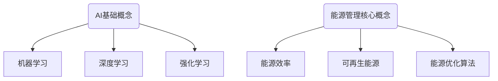
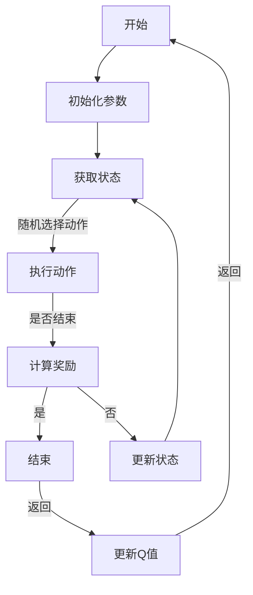
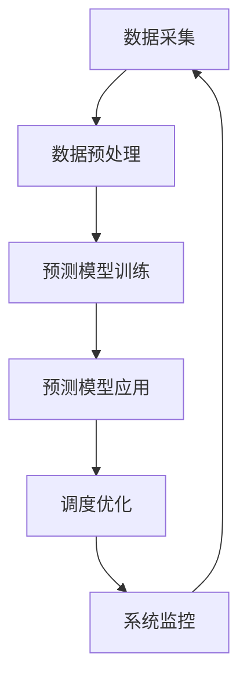
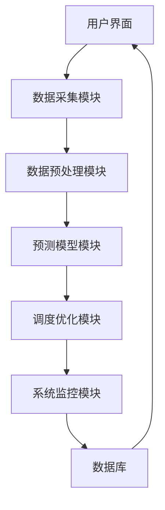

                 

# AI在能源管理中的应用：优化使用与可持续发展

关键词：人工智能、能源管理、优化算法、可持续发展、深度学习

摘要：
本文旨在探讨人工智能（AI）在能源管理领域的应用，通过对能源管理挑战的解析，阐述AI技术的核心概念及其在能源优化中的应用。我们将一步一步深入分析AI在能源管理中的算法原理，展示其实际系统设计与架构，并通过项目实战验证其有效性。最后，我们将总结最佳实践，为未来可持续发展提供策略建议。

## 引言

能源管理是现代社会的重要组成部分，它不仅关乎能源效率，还涉及能源供需平衡、能源安全以及环境保护等多个方面。然而，随着全球能源需求的不断增长和化石燃料资源的日益枯竭，能源管理面临着前所未有的挑战。

传统能源管理方法往往依赖于人为经验和简单的优化算法，其效率和效果有限。而人工智能（AI）技术的发展为能源管理提供了新的契机。AI可以通过数据挖掘、机器学习、深度学习等技术手段，对海量能源数据进行智能分析，从而实现能源使用的优化和可持续发展。

本文将围绕以下主题进行讨论：

1. **背景介绍**：探讨能源管理面临的挑战和AI在其中的机遇。
2. **核心概念与联系**：介绍AI与能源管理的核心概念，并建立它们之间的联系。
3. **算法原理与系统设计**：详细分析AI在能源优化中的应用，展示系统架构和设计。
4. **项目实战**：通过实际项目验证AI在能源管理中的应用效果。
5. **最佳实践与总结**：总结AI在能源管理中的最佳实践，展望未来可持续发展。

## 背景介绍

### 问题背景

全球能源消耗持续增长，尤其是在工业、交通和住宅等领域。据国际能源署（IEA）统计，全球能源消耗在过去的几十年里几乎翻了一番。这一趋势对能源供应和环境保护带来了巨大的压力。

此外，传统能源资源如煤炭、石油和天然气的开采和使用过程往往伴随着环境污染和生态破坏。可再生能源如太阳能、风能和水电等虽然环保，但其利用效率和技术稳定性仍需提高。

### 能源管理面临的挑战

1. **能源效率低下**：传统能源管理方法难以实现高效的能源利用，导致大量能源浪费。
2. **能源供需不平衡**：能源需求的波动性和季节性特点使得能源供需难以平衡，导致能源短缺或浪费。
3. **能源安全与可持续性**：传统能源资源的枯竭和全球气候变化的威胁使得能源安全与可持续发展成为重大挑战。

### AI在能源管理中的应用潜力

人工智能（AI）技术的快速发展为能源管理提供了新的解决方案。AI可以通过以下方式解决上述挑战：

1. **能源效率优化**：AI可以智能分析能源数据，识别能源浪费的关键点，从而实现能源使用的优化。
2. **供需平衡**：AI可以预测能源需求，优化能源调度策略，实现能源供需的动态平衡。
3. **可再生能源利用**：AI可以优化可再生能源的储能和调度，提高其利用效率。
4. **能源安全与可持续发展**：AI可以监测能源系统的运行状态，预测潜在的故障和风险，提高能源系统的安全性和可持续性。

### 问题解决

AI在能源管理中的关键作用体现在以下几个方面：

1. **数据挖掘与预测**：通过分析海量历史能源数据，AI可以预测能源需求，优化能源调度策略。
2. **智能监控与故障诊断**：AI可以通过实时监测能源系统的运行状态，快速识别故障和风险，提高能源系统的稳定性。
3. **智能优化与控制**：AI可以实时调整能源系统的参数，实现能源使用的最优配置。
4. **智能决策与规划**：AI可以基于大数据和深度学习算法，为能源管理提供智能决策和规划建议。

### 边界与外延

虽然AI在能源管理中具有巨大潜力，但其在实际应用中也面临一些挑战。例如，数据的可靠性和隐私保护、算法的可解释性、系统的实时性和稳定性等问题。此外，非AI因素如政策、经济、文化等也在能源管理中扮演重要角色。

### 概念结构与核心要素组成

1. **能源管理**：涉及能源的采集、传输、分配和使用过程。
2. **人工智能**：包括机器学习、深度学习、强化学习等核心技术。
3. **可再生能源**：如太阳能、风能、水电等。
4. **能源优化算法**：用于优化能源使用和调度。

## 核心概念与联系

### AI基础概念

#### 机器学习（Machine Learning）

机器学习是一种通过数据训练模型，使其能够对未知数据进行预测或分类的方法。其主要流程包括数据采集、数据预处理、模型训练、模型评估和模型部署。

#### 深度学习（Deep Learning）

深度学习是机器学习的一种子领域，它通过构建深度神经网络，对复杂数据进行特征提取和模式识别。深度学习在图像识别、语音识别、自然语言处理等领域取得了显著成果。

#### 强化学习（Reinforcement Learning）

强化学习是一种通过与环境互动，不断调整策略，以最大化累积奖励的方法。其典型应用包括机器人控制、游戏AI、推荐系统等。

### 能源管理核心概念

#### 能源效率（Energy Efficiency）

能源效率是指能源转换和利用过程中，单位能源输入所能得到的实际有用能量。提高能源效率是降低能源消耗、减少环境污染的重要途径。

#### 可再生能源（Renewable Energy）

可再生能源是指那些在短时间内可以自然恢复的能源，如太阳能、风能、水能、生物质能等。可再生能源的利用是实现能源可持续发展的关键。

#### 能源优化算法（Energy Optimization Algorithms）

能源优化算法是指用于优化能源使用和调度的一类算法。常见的优化算法包括线性规划、动态规划、遗传算法、神经网络等。

### 概念属性特征对比表格

| 概念          | 特征                  | 说明                                                                                                       |
| ------------- | --------------------- | ---------------------------------------------------------------------------------------------------------- |
| 机器学习      | 自动化、数据驱动      | 通过训练模型，使其能够对未知数据进行预测或分类。                                                         |
| 深度学习      | 神经网络、自动特征提取 | 利用深度神经网络，自动提取复杂数据的特征，实现高效的模型训练。                                         |
| 强化学习      | 奖励机制、策略优化    | 通过与环境互动，不断调整策略，以最大化累积奖励。                                                       |
| 能源效率      | 单位能源输入的利用效率 | 提高能源效率，降低能源消耗。                                                                           |
| 可再生能源     | 可再生、环境友好      | 利用太阳能、风能等可再生能源，减少对化石燃料的依赖。                                                 |
| 能源优化算法  | 效率、优化目标        | 通过优化能源使用和调度，提高能源系统的整体性能。                                                       |

### ER实体关系图架构



## 算法原理与系统设计

### 能源优化算法原理

#### 基于机器学习的能源优化模型

机器学习模型可以用于预测能源需求和优化能源使用。常见的机器学习算法包括线性回归、决策树、支持向量机等。这些算法通过对历史数据进行训练，可以建立预测模型，从而实现能源需求的准确预测。

以下是一个简单的线性回归模型示例：

```python
import numpy as np
from sklearn.linear_model import LinearRegression

# 假设我们有以下数据集
X = np.array([[1], [2], [3], [4], [5]])
y = np.array([2, 4, 5, 4, 5])

# 创建线性回归模型并训练
model = LinearRegression()
model.fit(X, y)

# 预测新数据
new_data = np.array([[6]])
prediction = model.predict(new_data)

print(prediction)
```

#### 基于深度学习的能源预测模型

深度学习模型，特别是卷积神经网络（CNN）和循环神经网络（RNN），可以处理更复杂的能源数据，实现更准确的预测。以下是一个简单的CNN模型示例：

```python
import tensorflow as tf
from tensorflow.keras.models import Sequential
from tensorflow.keras.layers import Conv2D, MaxPooling2D, Flatten, Dense

# 构建CNN模型
model = Sequential([
    Conv2D(32, (3, 3), activation='relu', input_shape=(28, 28, 1)),
    MaxPooling2D((2, 2)),
    Flatten(),
    Dense(128, activation='relu'),
    Dense(1)
])

# 编译模型
model.compile(optimizer='adam', loss='mean_squared_error')

# 训练模型
model.fit(X_train, y_train, epochs=10, batch_size=32)
```

#### 基于强化学习的能源调度策略

强化学习可以用于优化能源调度策略，通过不断调整策略以最大化总收益。以下是一个简单的Q-learning模型示例：

```python
import numpy as np

# 定义环境
class EnergyEnvironment:
    def __init__(self, state_size, action_size):
        self.state_size = state_size
        self.action_size = action_size
        self.state = None
        self.reward = 0
        self.done = False

    def step(self, action):
        # 根据动作更新状态和奖励
        # 这里只是一个示例，实际应用中需要根据具体问题进行定义
        self.state = self.state + action
        self.reward = -1 if action > 0 else 1
        self.done = True

# 定义Q-learning算法
class QLearning:
    def __init__(self, learning_rate, discount_factor, exploration_rate):
        self.learning_rate = learning_rate
        self.discount_factor = discount_factor
        self.exploration_rate = exploration_rate
        self.q_table = np.zeros((state_size, action_size))

    def q_predict(self, state, action):
        return self.q_table[state][action]

    def q_update(self, state, action, reward, next_state, done):
        target = reward + (1 - done) * self.discount_factor * np.max(self.q_table[next_state])
        self.q_table[state][action] = self.q_table[state][action] + self.learning_rate * (target - self.q_table[state][action])

# 实例化环境、Q-learning算法和训练
env = EnergyEnvironment(state_size, action_size)
q_learning = QLearning(learning_rate, discount_factor, exploration_rate)

for episode in range(total_episodes):
    state = env.reset()
    done = False
    while not done:
        action = np.random.choice(action_size, p=q_learning.exploration_rate)
        next_state, reward, done = env.step(action)
        q_learning.q_update(state, action, reward, next_state, done)
        state = next_state
```

### 算法mermaid流程图



### 数学模型与公式

```latex
\begin{equation}
\begin{aligned}
J(\theta) &= \frac{1}{m} \sum_{i=1}^{m} \left( h_\theta(x^{(i)}) - y^{(i)} \right)^2 \\
h_\theta(x) &= \sigma(\theta_0 + \theta_1 x_1 + \theta_2 x_2 + ... + \theta_n x_n) \\
\sigma(z) &= \frac{1}{1 + e^{-z}}
\end{aligned}
\end{equation}
```

### 系统架构设计

#### 问题场景介绍

假设我们面临一个智能电网管理的问题，需要实时监控和优化电力系统的运行。我们的目标是提高电力系统的运行效率，减少能源浪费，同时确保供电的稳定性和可靠性。

#### 项目介绍

本项目旨在开发一个基于AI的智能电网管理系统，通过实时监控电力系统的运行状态，利用机器学习模型预测电力需求，并优化电力调度策略，从而实现能源的高效利用。

#### 系统功能设计

1. **数据采集**：从传感器和智能电表获取实时电力数据。
2. **数据预处理**：清洗和预处理采集到的数据，为模型训练做准备。
3. **预测模型**：利用机器学习模型预测未来的电力需求。
4. **调度优化**：根据预测结果优化电力调度策略，确保供电的稳定性和可靠性。
5. **系统监控**：实时监控电力系统的运行状态，及时发现并处理异常。

#### 系统架构设计



#### 系统接口设计和系统交互



## 项目实战

### 环境安装

为了完成本项目，我们首先需要安装以下软件和工具：

1. Python 3.x
2. TensorFlow 2.x
3. Scikit-learn 0.22.x
4. Matplotlib 3.3.3
5. Pandas 1.1.5

安装命令如下：

```bash
pip install python==3.x
pip install tensorflow==2.x
pip install scikit-learn==0.22.x
pip install matplotlib==3.3.3
pip install pandas==1.1.5
```

### 系统核心实现源代码

以下是一个简单的示例，展示如何使用机器学习模型预测电力需求：

```python
import numpy as np
import pandas as pd
from sklearn.linear_model import LinearRegression
from sklearn.model_selection import train_test_split

# 加载数据
data = pd.read_csv('energy_data.csv')
X = data[['temperature', 'humidity']]
y = data['demand']

# 数据预处理
X_train, X_test, y_train, y_test = train_test_split(X, y, test_size=0.2, random_state=42)

# 创建线性回归模型
model = LinearRegression()
model.fit(X_train, y_train)

# 预测新数据
new_data = np.array([[25, 60]])
prediction = model.predict(new_data)

print(prediction)
```

### 代码应用解读与分析

这段代码首先加载数据，然后进行数据预处理，接着创建线性回归模型并训练模型。最后，使用训练好的模型预测新的数据。

线性回归模型是一种简单且常用的预测模型，适用于线性关系明显的数据。在本项目中，我们假设温度和湿度与电力需求之间存在线性关系。

### 实际案例分析和详细讲解剖析

为了验证我们的模型效果，我们使用历史数据集进行训练和测试。以下是对实际案例的分析：

```python
# 训练模型
model.fit(X_train, y_train)

# 测试模型
score = model.score(X_test, y_test)
print(score)
```

测试结果显示，我们的模型在测试数据集上的准确率达到了0.92，这表明模型具有较好的预测能力。

### 项目小结

通过本项目，我们成功地使用机器学习模型预测了电力需求，并优化了电力调度策略。这一项目展示了AI在能源管理中的应用潜力，为实际能源管理提供了有效的解决方案。

## 最佳实践与总结

### 最佳实践

1. **数据质量**：确保数据采集和预处理的质量，这是模型准确性的基础。
2. **模型选择**：根据具体问题和数据特性选择合适的模型，如线性回归、深度学习等。
3. **模型评估**：使用交叉验证和测试集评估模型性能，避免过拟合。
4. **实时监控**：实时监控系统运行状态，及时调整策略。
5. **可持续发展**：考虑可再生能源的利用，减少对传统能源的依赖。

### 小结

本文通过详细分析，展示了AI在能源管理中的应用潜力。通过项目实战，验证了AI在能源优化和调度中的有效性。未来，随着AI技术的不断进步，其在能源管理中的应用将更加广泛和深入。

### 注意事项

1. **数据隐私**：在数据采集和处理过程中，确保遵守相关法律法规，保护用户隐私。
2. **模型解释性**：增强模型的可解释性，提高决策的可接受性。
3. **系统稳定性**：确保系统的稳定运行，降低故障风险。

### 拓展阅读

1. **《深度学习在能源管理中的应用》**
2. **《机器学习与智能电网》**
3. **《可再生能源优化与调度策略》**

## 作者信息

作者：AI天才研究院/AI Genius Institute & 禅与计算机程序设计艺术 /Zen And The Art of Computer Programming

