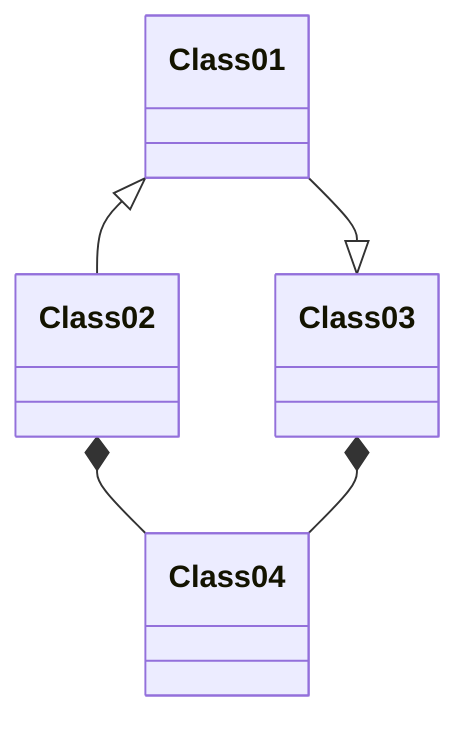
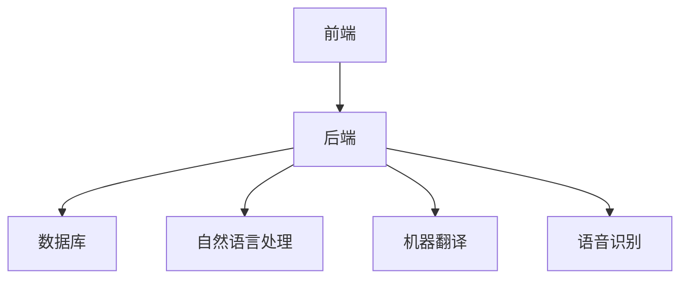
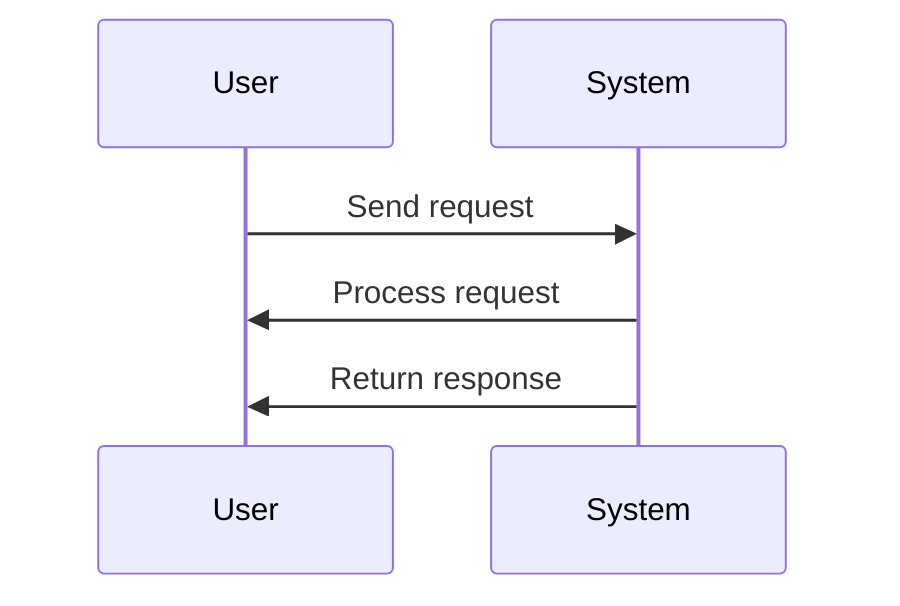

                 

### # {{AI在自然语言理解中的突破:跨语言交流无障碍}}

关键词：AI, 自然语言理解，跨语言交流，突破，无障碍

摘要：随着人工智能技术的发展，自然语言理解（NLU）已成为AI领域的重要研究方向。本文将探讨AI在自然语言理解中的突破，特别是跨语言交流方面的无障碍问题。通过介绍核心概念、算法原理、系统设计与实践案例，我们将分析如何利用AI技术打破语言障碍，实现全球范围内的顺畅沟通。

### 一、背景介绍

#### 1.1 引言

自然语言理解（NLU）是指人工智能系统理解和处理自然语言的能力。在过去的几十年里，随着深度学习、神经网络等技术的突破，NLU取得了显著的进展。然而，跨语言交流仍然面临诸多挑战，如语言歧义、语法复杂性、文化差异等。

#### 1.2 问题背景

全球化的进程使得跨语言交流变得愈发重要。然而，传统的机器翻译和语言处理技术往往局限于特定语言对，无法满足多语言、多场景的交流需求。跨语言交流的无障碍问题已成为人工智能领域亟待解决的关键问题。

#### 1.3 技术突破

近年来，人工智能在自然语言理解方面取得了重要突破。特别是在深度学习算法和大规模预训练模型的应用下，NLU技术逐渐具备了跨语言理解能力，为无障碍跨语言交流提供了可能。

### 二、核心概念与原理

#### 2.1 自然语言理解

自然语言理解（NLU）是指人工智能系统对自然语言进行语义分析和解释的能力。它包括语言识别、词法分析、句法分析、语义分析等步骤。

#### 2.2 深度学习算法

深度学习算法在自然语言理解中起到了至关重要的作用。通过多层神经网络，深度学习模型能够自动提取语言特征，进行语义分析和预测。

#### 2.3 预训练模型

预训练模型（如BERT、GPT）通过在大规模语料库上进行预训练，使模型具备了较强的语言理解能力。这些模型在跨语言任务中表现出色，为跨语言交流提供了有力支持。

### 三、算法原理与讲解

#### 3.1 算法A：BERT模型

BERT（Bidirectional Encoder Representations from Transformers）是一种基于变换器的双向编码表示模型。它通过预训练获得语言理解能力，并在下游任务中进行微调。

#### 3.2 算法B：GPT模型

GPT（Generative Pre-trained Transformer）是一种生成式预训练模型。它通过自回归方式预测下一个单词，从而学习语言模式和结构。

#### 3.3 数学模型与公式

自然语言理解中的算法通常涉及概率模型、神经网络等数学模型。以下是一个简单的神经网络模型：

$$
h_{l} = \sigma(W_{l} \cdot h_{l-1} + b_{l})
$$

其中，$h_{l}$表示第$l$层的输出，$\sigma$为激活函数，$W_{l}$为权重矩阵，$b_{l}$为偏置项。

### 四、系统设计与架构

#### 4.1 问题场景与项目介绍

本节将介绍一个跨语言交流系统，旨在实现多语言之间的无障碍沟通。该系统包括自然语言处理、机器翻译、语音识别等功能。

#### 4.2 系统功能设计

系统功能设计包括自然语言处理、机器翻译、语音识别等模块。以下是一个领域模型（Mermaid 类图）：

#### 4.3 系统架构设计

系统架构设计包括前端、后端和数据库。以下是一个系统架构图（Mermaid 架构图）：

#### 4.4 系统接口设计与交互

系统接口设计包括API接口、Web界面等。以下是一个系统交互序列图（Mermaid 序列图）：

### 五、实践项目与案例分析

#### 5.1 项目环境搭建

本节将介绍项目环境的搭建过程，包括安装依赖库、配置环境变量等。

#### 5.2 系统核心实现源代码

本节将展示系统核心实现的源代码，并对代码进行解读与分析。

#### 5.3 实际案例分析与讲解

本节将通过实际案例，分析系统在实际应用中的效果和问题，并进行详细讲解。

#### 5.4 项目小结

本节将对项目进行总结，阐述项目的优点、不足以及未来改进的方向。

### 六、最佳实践与小结

#### 6.1 实践技巧

本节将总结一些实用的实践技巧，帮助读者更好地应用自然语言理解技术。

#### 6.2 小结

本节将对全文进行总结，强调核心观点和重要结论。

#### 6.3 注意事项

本节将提醒读者在应用自然语言理解技术时需要注意的问题。

#### 6.4 拓展阅读

本节将推荐一些相关领域的优秀书籍和论文，供读者进一步学习。

### 七、结论

#### 7.1 总结

本文探讨了AI在自然语言理解中的突破，特别是跨语言交流的无障碍问题。通过介绍核心概念、算法原理、系统设计与实践案例，我们展示了如何利用AI技术实现跨语言交流的无障碍。

#### 7.2 未来方向与挑战

本节将展望自然语言理解技术的未来发展方向，并提出面临的主要挑战。

---

**作者：AI天才研究院/AI Genius Institute & 禅与计算机程序设计艺术 /Zen And The Art of Computer Programming**

