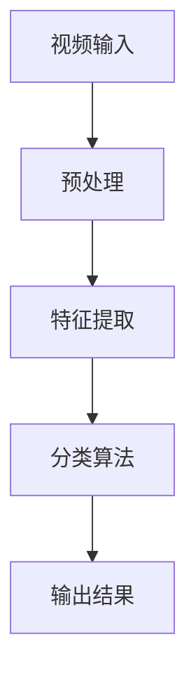
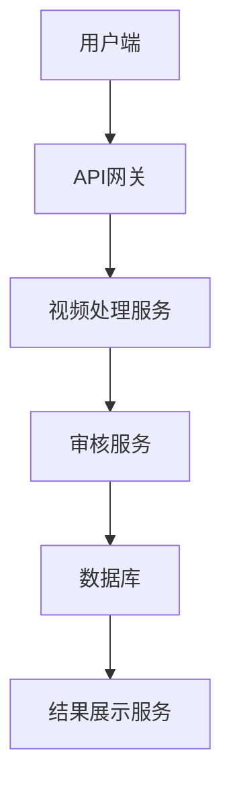

                 

# AI在视频内容审核中的应用：提高效率与准确性

关键词：AI、视频内容审核、算法、效率、准确性

摘要：本文深入探讨了人工智能（AI）在视频内容审核中的应用，分析了如何利用AI技术提高审核效率与准确性。文章首先介绍了视频内容审核的背景和重要性，然后详细阐述了AI核心概念与算法原理，并通过实际案例展示了AI视频内容审核系统的设计与实现。最后，本文总结了最佳实践，并展望了未来发展的方向。

## 第一部分：AI与视频内容审核概述

### 第1章：AI与视频内容审核背景

#### 1.1.1 视频内容审核的重要性

视频内容审核是确保互联网平台内容健康、合规的重要环节。随着互联网的快速发展，视频内容审核的需求日益增加。审核的目的在于过滤不良信息，保护用户权益，维护社会秩序。

- **内容审核的定义与目的**：内容审核是指对互联网平台上的视频内容进行审查和筛选，确保其符合法规和平台规定。
- **视频内容审核的挑战**：视频内容多样、动态性强，审核过程面临实时性、准确性、效率等多重挑战。

#### 1.1.2 AI在视频内容审核中的应用

人工智能技术的发展为视频内容审核带来了新的机遇。AI技术能够自动识别和处理视频内容，提高审核的效率与准确性。

- **AI技术概述**：AI是一种模拟人类智能的技术，包括机器学习、深度学习、自然语言处理等领域。
- **AI在视频内容审核中的应用场景**：AI可以应用于视频分类、关键词提取、情感分析等，实现对视频内容的自动审核。
- **提高审核效率与准确性的意义**：AI技术能够显著提高视频内容审核的效率，降低人力成本，同时提高审核的准确性，减少误判。

#### 1.1.3 提高审核效率与准确性的必要性

在互联网时代，视频内容审核的效率与准确性至关重要。

- **审核效率与准确性的重要性**：高效的审核可以快速响应用户需求，准确的审核可以避免不良信息的传播。
- **提高效率与准确性的必要性**：随着视频内容的爆炸式增长，传统的审核方式已无法满足需求。AI技术的引入，可以有效提升审核能力。

### 第2章：AI核心概念与算法原理

#### 2.1.1 AI基础理论

- **机器学习与深度学习的区别**：机器学习是一种通过训练模型来从数据中学习的算法，而深度学习是机器学习的一个分支，主要使用神经网络来实现。
- **常见算法介绍**：
  - **卷积神经网络（CNN）**：用于图像识别。
  - **递归神经网络（RNN）**：用于序列数据处理，如自然语言处理。
  - **自然语言处理（NLP）**：用于文本分析和理解。

#### 2.1.2 常见算法介绍

| 算法          | 特点                         | 适用场景                   |
| ------------- | -------------------------- | ------------------------ |
| 卷积神经网络（CNN） | 适用于图像识别           | 图像识别                   |
| 递归神经网络（RNN） | 适用于序列数据处理       | 语言建模                   |
| 自然语言处理（NLP） | 适用于文本分析和理解     | 文本分析                   |

#### 2.1.3 概念属性特征对比表格

| 算法          | 特点                         | 适用场景                   |
| ------------- | -------------------------- | ------------------------ |
| 卷积神经网络（CNN） | 适用于图像识别           | 图像识别                   |
| 递归神经网络（RNN） | 适用于序列数据处理       | 语言建模                   |
| 自然语言处理（NLP） | 适用于文本分析和理解     | 文本分析                   |

### 第3章：视频内容审核的算法原理

#### 3.1.1 视频内容审核算法概述

- **视频内容审核的基本流程**：视频输入 -> 预处理 -> 特征提取 -> 分类算法 -> 输出结果。
- **审核算法的核心任务**：识别视频内容是否违规，并给出相应的处理建议。

#### 3.1.2 常见算法mermaid流程图



#### 3.1.3 算法原理与数学模型

- **特征提取**：将视频数据转换为特征向量。
- **分类算法**：使用分类算法（如SVM、朴素贝叶斯等）对特征向量进行分类。

$$
P(y|x) = \frac{e^{\theta^T x}}{\sum_{i=1}^{K} e^{\theta^T x_i}}
$$

#### 3.1.4 算法举例说明

- **以CNN为例**，讲解视频内容审核中的图像识别过程。

### 第4章：AI视频内容审核系统架构设计

#### 4.1.1 系统功能设计

- **视频上传**：用户可以上传视频。
- **实时审核**：系统对上传的视频进行实时审核。
- **审核结果展示**：展示审核结果，包括通过、拒绝或需要人工复审等。

#### 4.1.2 系统架构设计

- **架构图设计**：



#### 4.1.3 系统接口设计

- **API接口定义**：

```python
class VideoReviewAPI():
    def upload_video(self, video_path):
        # 上传视频处理

    def get_review_result(self, video_id):
        # 获取审核结果
```

### 第5章：项目实战与实现

#### 5.1.1 环境安装与配置

- 安装Python、TensorFlow等环境。

#### 5.1.2 系统核心实现

- 实现视频上传、处理、审核等功能。

#### 5.1.3 代码应用解读与分析

- **代码解读**：详细解读系统核心代码。
- **分析与优化**：分析系统性能，提出优化方案。

### 第6章：实际案例分析与讲解

#### 6.1.1 案例背景

- **某视频平台的审核需求**：需要对上传的视频进行实时审核，过滤违规内容。

#### 6.1.2 案例实现

- **实现过程**：详细描述实现步骤。
- **遇到的挑战与解决方法**：分析案例中遇到的挑战，并提出解决方案。

#### 6.1.3 案例小结

- **案例总结**：总结案例的主要经验和教训。
- **经验分享**：分享案例中的经验教训，为其他项目提供参考。

### 第7章：最佳实践与拓展

#### 7.1.1 最佳实践

- **提高审核效率与准确性的技巧**：分享一些实用的技巧。

#### 7.1.2 注意事项

- **审核系统维护与更新**：介绍系统维护和更新的重要性。

#### 7.1.3 拓展阅读

- **AI视频内容审核领域的最新研究动态**：介绍当前的研究热点和发展趋势。

---

**作者：AI天才研究院/AI Genius Institute & 禅与计算机程序设计艺术 /Zen And The Art of Computer Programming**

---

本文深入探讨了AI在视频内容审核中的应用，分析了AI技术如何提高审核效率与准确性。通过对AI核心概念与算法原理的讲解，以及实际案例的分析与讲解，本文为读者提供了全面的技术参考。未来，AI视频内容审核领域将继续发展，带来更多的创新和机遇。

