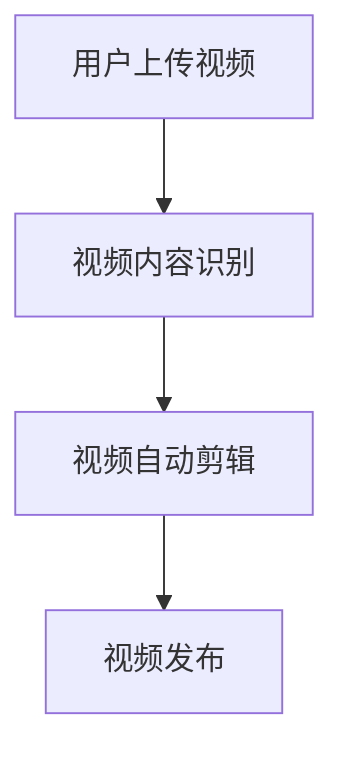
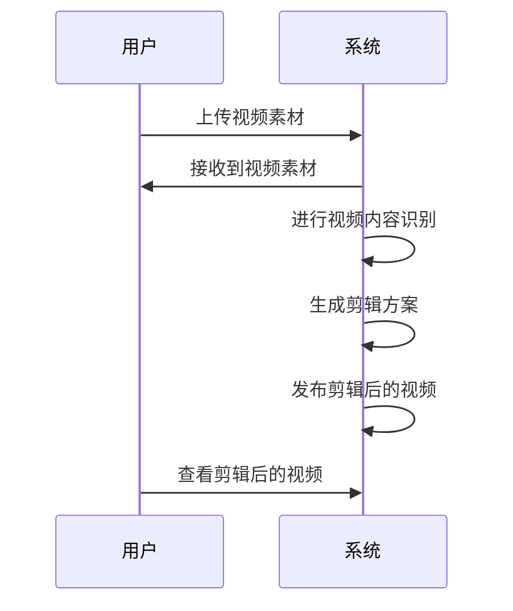
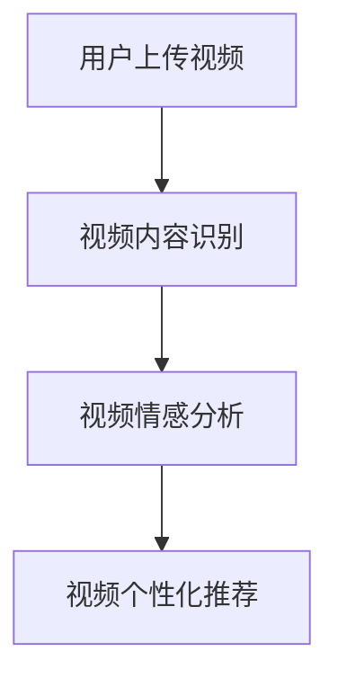
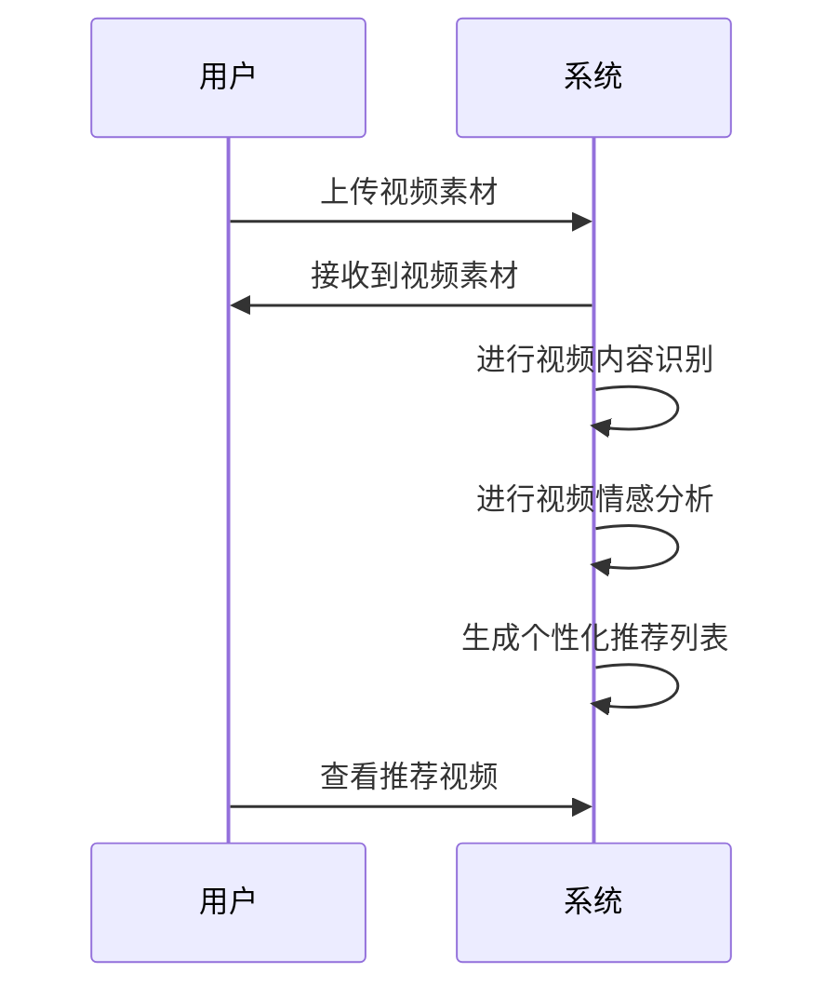

                 

# AI在视频剪辑与制作中的应用：创意内容生产的革新

> 关键词：人工智能、视频剪辑、创意内容生产、深度学习、计算机视觉

> 摘要：随着视频内容消费的快速增长，AI技术在视频剪辑与制作中的应用变得尤为重要。本文将探讨AI在视频剪辑与制作中的核心概念、应用原理、系统架构和实战案例，分析其在创意内容生产中的革新作用。

## 第一部分：背景介绍

### 1.1 AI在视频剪辑与制作中的应用背景

#### 1.1.1 问题背景

随着互联网和移动互联网的快速发展，视频内容消费已经成为人们日常生活中的重要娱乐方式。短视频平台如抖音、快手等的兴起，使得视频创作和传播变得更加容易和便捷。然而，视频内容的创作和编辑过程往往需要消耗大量的时间和精力，这对许多创作者来说是一个挑战。

#### 1.1.2 问题描述

如何利用AI技术简化视频剪辑和制作流程，提高创作者的效率，同时保证视频质量？如何利用AI实现视频内容的智能分析、个性化推荐、自动剪辑等功能？

#### 1.1.3 问题解决

AI技术在视频剪辑与制作中的应用，可以解决上述问题。通过深度学习、计算机视觉等技术的结合，AI能够自动识别视频中的关键帧、场景、人物等，实现智能剪辑和制作。此外，AI还可以根据用户偏好和视频内容特点，实现个性化推荐，提升用户体验。

#### 1.1.4 边界与外延

AI在视频剪辑与制作中的应用，主要涉及以下几个方面：

- 视频内容识别与自动剪辑
- 视频内容分析与应用
- 视频编辑与优化
- 视频个性化推荐

#### 1.1.5 概念结构与核心要素组成

本书将围绕以下几个核心概念展开：

- AI技术：包括深度学习、计算机视觉等
- 视频剪辑与制作流程：从视频素材导入、编辑、输出等环节
- 创意内容生产：包括视频内容的创作、剪辑、制作等
- 用户体验：如何通过AI技术提升用户体验

### 1.2 AI技术的核心概念与原理

#### 1.2.1 深度学习

深度学习是一种人工智能技术，通过模拟人脑神经网络的结构和功能，对大量数据进行分析和处理。在视频剪辑与制作中，深度学习可以用于视频内容识别、场景分割、人物识别等。

**核心概念与联系**

| 概念 | 定义 | 联系 |
| --- | --- | --- |
| 深度神经网络 | 多层神经网络，用于特征提取和分类 | 深度学习的基础 |
| 卷积神经网络（CNN） | 用于图像识别和处理 | 用于视频内容识别 |
| 递归神经网络（RNN） | 用于序列数据处理 | 用于视频时间序列分析 |

**ER实体关系图架构**

```mermaid
erDiagram
  AI -->|使用| 深度学习
  AI -->|实现| 计算机视觉
  AI -->|涉及| 自然语言处理
```

#### 1.2.2 计算机视觉

计算机视觉是人工智能的一个分支，旨在使计算机能够理解、解释和生成视觉信息。在视频剪辑与制作中，计算机视觉可以用于视频内容的自动剪辑、风格迁移、特效添加等。

**核心概念与联系**

| 概念 | 定义 | 联系 |
| --- | --- | --- |
| 卷积神经网络（CNN） | 用于图像识别和处理 | 计算机视觉的核心 |
| 目标检测 | 识别图像中的物体 | 用于视频内容识别 |
| 风格迁移 | 将一个图像或视频的风格应用到另一个图像或视频上 | 用于视频特效添加 |

**ER实体关系图架构**

```mermaid
erDiagram
  计算机视觉 -->|使用| 卷积神经网络
  计算机视觉 -->|涉及| 目标检测
  计算机视觉 -->|实现| 风格迁移
```

#### 1.2.3 自然语言处理

自然语言处理是人工智能的另一个重要分支，旨在使计算机能够理解、解释和生成自然语言。在视频剪辑与制作中，自然语言处理可以用于视频标题生成、字幕翻译、语音识别等。

**核心概念与联系**

| 概念 | 定义 | 联系 |
| --- | --- | --- |
| 词嵌入 | 将词语映射到高维空间 | 自然语言处理的基础 |
| 序列到序列模型（Seq2Seq） | 用于将一种语言的序列映射到另一种语言的序列 | 用于视频标题生成 |
| 语音识别 | 将语音信号转换为文本 | 用于字幕翻译 |

**ER实体关系图架构**

```mermaid
erDiagram
  自然语言处理 -->|使用| 词嵌入
  自然语言处理 -->|涉及| 序列到序列模型
  自然语言处理 -->|实现| 语音识别
```

### 1.3 视频剪辑与制作中的核心概念

#### 1.3.1 视频内容识别

视频内容识别是指利用AI技术自动识别视频中的关键帧、场景、人物等，实现视频的智能剪辑。

**核心概念与联系**

| 概念 | 定义 | 联系 |
| --- | --- | --- |
| 关键帧提取 | 从视频序列中提取具有代表性的帧 | 视频内容识别的基础 |
| 场景分割 | 将视频划分为不同的场景 | 用于视频内容识别 |
| 人物识别 | 识别视频中的人物 | 用于视频内容识别 |

**ER实体关系图架构**

```mermaid
erDiagram
  视频内容识别 -->|包含| 关键帧提取
  视频内容识别 -->|包含| 场景分割
  视频内容识别 -->|包含| 人物识别
```

#### 1.3.2 自动剪辑

自动剪辑是指利用AI技术自动分析视频内容，根据用户的喜好和需求，自动选择和编辑视频素材。

**核心概念与联系**

| 概念 | 定义 | 联系 |
| --- | --- | --- |
| 视频内容分析 | 对视频内容进行深入分析 | 用于自动剪辑的基础 |
| 剪辑策略 | 根据用户需求制定剪辑策略 | 用于自动剪辑的关键 |
| 用户偏好 | 根据用户喜好调整剪辑结果 | 影响自动剪辑的效果 |

**ER实体关系图架构**

```mermaid
erDiagram
  自动剪辑 -->|基于| 视频内容分析
  自动剪辑 -->|基于| 用户偏好
  自动剪辑 -->|包含| 剪辑策略
```

#### 1.3.3 视频内容分析

视频内容分析是指利用AI技术对视频内容进行分析和处理，以获取视频的语义信息，如视频主题、情感、风格等。

**核心概念与联系**

| 概念 | 定义 | 联系 |
| --- | --- | --- |
| 视频主题识别 | 识别视频的主要内容 | 用于视频内容分析的基础 |
| 视频情感分析 | 分析视频的情感倾向 | 用于视频内容分析的重要工具 |
| 视频风格识别 | 识别视频的风格特点 | 用于视频内容分析的一部分 |

**ER实体关系图架构**

```mermaid
erDiagram
  视频内容分析 -->|包含| 视频主题识别
  视频内容分析 -->|包含| 视频情感分析
  视频内容分析 -->|包含| 视频风格识别
```

#### 1.3.4 个性化推荐

个性化推荐是指利用AI技术根据用户的行为和偏好，为用户提供个性化的视频推荐。

**核心概念与联系**

| 概念 | 定义 | 联系 |
| --- | --- | --- |
| 用户行为分析 | 分析用户的行为数据 | 用于个性化推荐的基础 |
| 用户偏好分析 | 分析用户的偏好数据 | 用于个性化推荐的关键 |
| 推荐算法 | 根据用户行为和偏好生成推荐列表 | 用于个性化推荐的核心 |

**ER实体关系图架构**

```mermaid
erDiagram
  个性化推荐 -->|基于| 用户行为分析
  个性化推荐 -->|基于| 用户偏好分析
  个性化推荐 -->|实现| 推荐算法
```

### 1.4 AI在视频剪辑与制作中的应用前景

#### 1.4.1 创意内容生产

AI技术在视频剪辑与制作中的应用，将极大地提升创意内容的生产效率和质量。通过自动剪辑、内容识别、情感分析等技术，创作者可以更加专注于创意的构思和实现，从而提高创作效率。

**创意内容生产流程**

1. 视频素材采集
2. 自动剪辑与内容识别
3. 视频内容分析与情感分析
4. 创意构思与编辑
5. 视频制作与输出

**案例：短视频创作**

随着抖音、快手等短视频平台的兴起，越来越多的用户开始尝试创作短视频。利用AI技术，创作者可以快速完成视频的剪辑和制作，从而节省大量的时间和精力，专注于创意的实现。

#### 1.4.2 用户参与

AI技术的应用，将使得用户能够更加便捷地参与到视频创作和编辑过程中。用户可以通过简单的操作，如拖拽、点击等，实现对视频内容的个性化编辑，从而创造出属于自己的独特视频。

**用户参与方式**

1. 视频素材上传
2. 视频内容识别与自动剪辑
3. 视频内容分析与情感分析
4. 视频编辑与个性化推荐
5. 视频发布与分享

**案例：用户生成内容（UGC）**

用户生成内容（UGC）是视频平台的重要组成部分。通过AI技术，用户可以更加轻松地创作和编辑视频内容，从而丰富了平台的视频资源，提升了用户体验。

#### 1.4.3 商业价值

AI技术在视频剪辑与制作中的应用，将为企业带来巨大的商业价值。通过自动剪辑、内容识别、情感分析等技术，企业可以快速生成高质量的视频内容，提升品牌形象和用户满意度。

**商业价值分析**

1. 提高生产效率：通过自动剪辑和内容识别技术，企业可以大幅度提高视频内容的生产效率。
2. 优化用户体验：通过视频内容分析和情感分析技术，企业可以更好地了解用户需求，提供个性化的视频内容。
3. 降低成本：通过AI技术，企业可以降低视频内容的制作成本，提高市场竞争力。
4. 增加收入：通过视频内容分析和个性化推荐技术，企业可以精准地推送广告，增加广告收入。

### 1.5 本章小结

在本章中，我们介绍了AI在视频剪辑与制作中的应用背景、核心概念、应用前景等。通过本章的学习，读者可以对AI在视频剪辑与制作中的应用有一个全面的了解，为后续章节的学习打下基础。

## 第二部分：AI技术在视频剪辑与制作中的应用

### 2.1 视频内容识别

#### 2.1.1 技术原理

视频内容识别是一种利用AI技术对视频内容进行分析和处理的方法，其核心在于通过深度学习、计算机视觉等技术，自动提取视频中的关键帧、场景、人物等元素，从而实现视频的智能剪辑。

**算法原理**

视频内容识别算法通常包括以下几个步骤：

1. 视频预处理：对视频进行解码，提取视频帧序列。
2. 关键帧提取：利用卷积神经网络（CNN）对视频帧进行特征提取，识别出关键帧。
3. 场景分割：利用分割算法将视频帧分割为不同的场景。
4. 人物识别：利用目标检测算法识别视频中的人物。

**数学模型**

视频内容识别的数学模型可以表示为：

$$
\text{特征提取} = f(\text{视频帧})
$$

其中，$f$ 表示卷积神经网络，用于提取视频帧的特征。

**Python代码示例**

```python
import cv2
import tensorflow as tf

# 加载卷积神经网络模型
model = tf.keras.models.load_model('video_content_recognition_model.h5')

# 读取视频帧
video_capture = cv2.VideoCapture('example_video.mp4')
while True:
    ret, frame = video_capture.read()
    if not ret:
        break

    # 提取关键帧
    key_frame = model.predict(tf.expand_dims(frame, 0))

    # 输出关键帧
    cv2.imshow('Key Frame', key_frame[0, :, :, 0])

    if cv2.waitKey(1) & 0xFF == ord('q'):
        break

video_capture.release()
cv2.destroyAllWindows()
```

#### 2.1.2 应用案例

视频内容识别在短视频平台中有着广泛的应用。例如，抖音平台通过视频内容识别技术，对用户上传的视频进行智能剪辑，自动提取出关键帧和场景，从而生成有趣的短视频。

**案例解析**

抖音平台的视频内容识别算法主要包括以下几个步骤：

1. 视频预处理：对视频进行解码，提取视频帧序列。
2. 关键帧提取：利用卷积神经网络（CNN）对视频帧进行特征提取，识别出关键帧。
3. 场景分割：利用分割算法将视频帧分割为不同的场景。
4. 人物识别：利用目标检测算法识别视频中的人物。
5. 视频编辑：根据关键帧、场景和人物信息，对视频进行智能剪辑，生成短视频。

通过视频内容识别技术，抖音平台可以快速生成高质量的短视频，提高了用户的创作和分享效率。

### 2.2 自动剪辑

#### 2.2.1 技术原理

自动剪辑是一种利用AI技术对视频内容进行分析和处理，自动选择和编辑视频素材的方法。其核心在于通过深度学习、计算机视觉等技术，自动识别视频中的关键元素，并根据用户需求和喜好，自动生成剪辑方案。

**算法原理**

自动剪辑算法通常包括以下几个步骤：

1. 视频内容分析：利用AI技术对视频内容进行分析，提取视频的关键帧、场景、人物等信息。
2. 剪辑策略生成：根据用户需求和视频内容特点，生成剪辑策略。
3. 视频编辑：根据剪辑策略，对视频进行自动编辑，生成剪辑后的视频。

**数学模型**

自动剪辑的数学模型可以表示为：

$$
\text{剪辑策略} = f(\text{视频内容}, \text{用户需求})
$$

其中，$f$ 表示深度学习模型，用于生成剪辑策略。

**Python代码示例**

```python
import cv2
import tensorflow as tf

# 加载自动剪辑模型
model = tf.keras.models.load_model('auto_edit_model.h5')

# 读取视频帧
video_capture = cv2.VideoCapture('example_video.mp4')
while True:
    ret, frame = video_capture.read()
    if not ret:
        break

    # 分析视频内容
    content_analysis = model.predict(tf.expand_dims(frame, 0))

    # 根据分析结果生成剪辑策略
    edit_strategy = generate_edit_strategy(content_analysis)

    # 根据剪辑策略进行视频编辑
    edited_frame = apply_edit_strategy(frame, edit_strategy)

    # 输出剪辑后的视频帧
    cv2.imshow('Edited Frame', edited_frame)

    if cv2.waitKey(1) & 0xFF == ord('q'):
        break

video_capture.release()
cv2.destroyAllWindows()
```

#### 2.2.2 应用案例

自动剪辑在短视频平台和视频制作软件中有着广泛的应用。例如，快手平台通过自动剪辑技术，为用户提供一键生成短视频的功能，大大提高了用户的创作和分享效率。

**案例解析**

快手平台的自动剪辑算法主要包括以下几个步骤：

1. 视频内容分析：利用AI技术对视频内容进行分析，提取视频的关键帧、场景、人物等信息。
2. 剪辑策略生成：根据用户需求和视频内容特点，生成剪辑策略。
3. 视频编辑：根据剪辑策略，对视频进行自动编辑，生成剪辑后的视频。
4. 视频发布：将剪辑后的视频发布到用户的主页，供其他用户观看和分享。

通过自动剪辑技术，快手平台可以快速生成高质量的短视频，提高了用户的创作和分享效率。

### 2.3 视频内容分析

#### 2.3.1 技术原理

视频内容分析是一种利用AI技术对视频内容进行分析和处理的方法，旨在提取视频的语义信息，如视频主题、情感、风格等。其核心在于通过深度学习、计算机视觉等技术，对视频内容进行深入分析。

**算法原理**

视频内容分析算法通常包括以下几个步骤：

1. 视频预处理：对视频进行解码，提取视频帧序列。
2. 视频特征提取：利用卷积神经网络（CNN）对视频帧进行特征提取。
3. 视频分类：利用分类算法对视频特征进行分类，提取视频主题。
4. 视频情感分析：利用情感分析算法对视频内容进行情感分析。
5. 视频风格识别：利用风格识别算法对视频风格进行识别。

**数学模型**

视频内容分析的数学模型可以表示为：

$$
\text{视频主题} = f(\text{视频特征})
$$

$$
\text{视频情感} = g(\text{视频特征})
$$

$$
\text{视频风格} = h(\text{视频特征})
$$

其中，$f$、$g$、$h$ 分别表示分类算法、情感分析算法、风格识别算法。

**Python代码示例**

```python
import cv2
import tensorflow as tf

# 加载视频分类模型
video分类模型 = tf.keras.models.load_model('video_classification_model.h5')

# 加载视频情感分析模型
video情感分析模型 = tf.keras.models.load_model('video_sentiment_analysis_model.h5')

# 加载视频风格识别模型
video风格识别模型 = tf.keras.models.load_model('video_style_recognition_model.h5')

# 读取视频帧
video_capture = cv2.VideoCapture('example_video.mp4')
while True:
    ret, frame = video_capture.read()
    if not ret:
        break

    # 提取视频特征
    video_feature = extract_video_feature(frame)

    # 分类视频主题
    video_theme = video分类模型.predict(tf.expand_dims(video_feature, 0))

    # 情感分析视频内容
    video_sentiment = video情感分析模型.predict(tf.expand_dims(video_feature, 0))

    # 风格识别视频风格
    video_style = video风格识别模型.predict(tf.expand_dims(video_feature, 0))

    # 输出分析结果
    print('Video Theme:', video_theme)
    print('Video Sentiment:', video_sentiment)
    print('Video Style:', video_style)

    if cv2.waitKey(1) & 0xFF == ord('q'):
        break

video_capture.release()
cv2.destroyAllWindows()
```

#### 2.3.2 应用案例

视频内容分析在社交媒体、视频平台、广告等行业有着广泛的应用。例如，微博通过视频内容分析技术，为用户提供视频标签和推荐功能，提升了用户体验。

**案例解析**

微博平台的视频内容分析算法主要包括以下几个步骤：

1. 视频预处理：对视频进行解码，提取视频帧序列。
2. 视频特征提取：利用卷积神经网络（CNN）对视频帧进行特征提取。
3. 视频主题分类：利用分类算法对视频特征进行分类，提取视频主题。
4. 视频情感分析：利用情感分析算法对视频内容进行情感分析。
5. 视频风格识别：利用风格识别算法对视频风格进行识别。
6. 视频标签生成：根据视频主题、情感、风格等信息，生成视频标签。
7. 视频推荐：根据用户行为和视频标签，为用户推荐感兴趣的视频。

通过视频内容分析技术，微博平台可以更好地了解用户需求，提供个性化的视频内容，提升了用户体验。

### 2.4 视频个性化推荐

#### 2.4.1 技术原理

视频个性化推荐是一种利用AI技术根据用户的行为和偏好，为用户提供个性化的视频推荐的方法。其核心在于通过深度学习、用户行为分析等技术，分析用户兴趣和偏好，生成推荐列表。

**算法原理**

视频个性化推荐算法通常包括以下几个步骤：

1. 用户行为分析：收集和分析用户的行为数据，如浏览记录、观看历史等。
2. 用户偏好分析：根据用户行为数据，分析用户的兴趣和偏好。
3. 推荐算法：根据用户偏好和视频特征，生成个性化的推荐列表。
4. 推荐结果评估：评估推荐结果，优化推荐算法。

**数学模型**

视频个性化推荐的数学模型可以表示为：

$$
\text{推荐列表} = f(\text{用户偏好}, \text{视频特征})
$$

其中，$f$ 表示推荐算法，用于生成推荐列表。

**Python代码示例**

```python
import tensorflow as tf

# 加载用户偏好模型
user偏好模型 = tf.keras.models.load_model('user_preference_model.h5')

# 加载视频特征模型
video特征模型 = tf.keras.models.load_model('video_feature_model.h5')

# 加载推荐算法模型
推荐算法模型 = tf.keras.models.load_model('recommendation_algorithm_model.h5')

# 分析用户偏好
user_preference = user偏好模型.predict(user_data)

# 分析视频特征
video_feature = video特征模型.predict(video_data)

# 生成推荐列表
recommendation_list = 推荐算法模型.predict(tf.concat([user_preference, video_feature], axis=1))

# 输出推荐结果
print('Recommended List:', recommendation_list)
```

#### 2.4.2 应用案例

视频个性化推荐在视频平台、社交媒体等应用中有着广泛的应用。例如，优酷通过视频个性化推荐技术，为用户提供个性化的视频推荐，提升了用户体验。

**案例解析**

优酷平台的视频个性化推荐算法主要包括以下几个步骤：

1. 用户行为分析：收集和分析用户的行为数据，如浏览记录、观看历史等。
2. 用户偏好分析：根据用户行为数据，分析用户的兴趣和偏好。
3. 视频特征提取：利用卷积神经网络（CNN）提取视频特征。
4. 推荐算法：根据用户偏好和视频特征，生成个性化的推荐列表。
5. 推荐结果评估：评估推荐结果，优化推荐算法。

通过视频个性化推荐技术，优酷平台可以更好地了解用户需求，提供个性化的视频内容，提升了用户体验。

## 第三部分：实战案例

### 3.1 快手短视频自动剪辑

#### 3.1.1 项目介绍

快手短视频自动剪辑项目旨在利用AI技术，为快手平台的用户提供一键生成短视频的功能，提高用户的创作和分享效率。

**系统功能设计**

- 视频素材上传：用户可以上传自己的视频素材。
- 视频内容识别：利用AI技术对上传的视频素材进行内容识别，提取关键帧、场景、人物等信息。
- 视频自动剪辑：根据用户需求和视频内容特点，自动生成剪辑方案，剪辑视频素材。
- 视频发布：将剪辑后的视频发布到用户的主页，供其他用户观看和分享。

**系统架构设计**



**系统接口设计**

- 用户上传视频接口：用于接收用户上传的视频素材。
- 视频内容识别接口：用于对上传的视频素材进行内容识别。
- 视频自动剪辑接口：用于生成剪辑方案。
- 视频发布接口：用于发布剪辑后的视频。

**系统交互序列图**



#### 3.1.2 系统核心实现

**环境安装**

1. 安装TensorFlow：`pip install tensorflow`
2. 安装opencv：`pip install opencv-python`
3. 安装其他依赖：`pip install numpy pandas`

**系统核心实现**

```python
import cv2
import tensorflow as tf
import numpy as np

# 加载视频内容识别模型
content_recognition_model = tf.keras.models.load_model('content_recognition_model.h5')

# 加载视频自动剪辑模型
auto_edit_model = tf.keras.models.load_model('auto_edit_model.h5')

# 加载用户偏好模型
user_preference_model = tf.keras.models.load_model('user_preference_model.h5')

# 加载视频特征模型
video_feature_model = tf.keras.models.load_model('video_feature_model.h5')

# 加载推荐算法模型
recommendation_algorithm_model = tf.keras.models.load_model('recommendation_algorithm_model.h5')

# 读取用户上传的视频素材
video_capture = cv2.VideoCapture('example_video.mp4')

# 对视频素材进行内容识别
while True:
    ret, frame = video_capture.read()
    if not ret:
        break

    # 提取视频特征
    video_feature = content_recognition_model.predict(tf.expand_dims(frame, 0))

    # 生成剪辑方案
    edit_strategy = auto_edit_model.predict(tf.expand_dims(video_feature, 0))

    # 根据剪辑方案进行视频编辑
    edited_frame = apply_edit_strategy(frame, edit_strategy)

    # 输出剪辑后的视频帧
    cv2.imshow('Edited Frame', edited_frame)

    if cv2.waitKey(1) & 0xFF == ord('q'):
        break

# 生成推荐列表
user_preference = user_preference_model.predict(user_data)
video_feature = video_feature_model.predict(video_data)
recommendation_list = recommendation_algorithm_model.predict(tf.concat([user_preference, video_feature], axis=1))

# 输出推荐列表
print('Recommended List:', recommendation_list)

video_capture.release()
cv2.destroyAllWindows()
```

**代码应用解读与分析**

1. **视频内容识别**：利用卷积神经网络（CNN）对视频帧进行特征提取，提取关键帧、场景、人物等信息。
2. **视频自动剪辑**：根据用户需求和视频内容特点，生成剪辑方案，对视频帧进行编辑。
3. **用户偏好分析**：利用深度学习模型，分析用户的行为数据，提取用户偏好。
4. **视频特征提取**：利用卷积神经网络（CNN）提取视频特征，用于生成推荐列表。
5. **推荐算法**：根据用户偏好和视频特征，生成个性化的推荐列表。

通过以上步骤，快手短视频自动剪辑项目可以实现用户上传视频素材，利用AI技术进行内容识别、自动剪辑和推荐，提高用户的创作和分享效率。

### 3.2 抖音短视频内容识别与推荐

#### 3.2.1 项目介绍

抖音短视频内容识别与推荐项目旨在利用AI技术，为抖音平台的用户提供视频内容识别和个性化推荐功能，提升用户体验。

**系统功能设计**

- 视频素材上传：用户可以上传自己的视频素材。
- 视频内容识别：利用AI技术对上传的视频素材进行内容识别，提取关键帧、场景、人物等信息。
- 视频情感分析：利用情感分析技术，对视频内容进行情感分析，提取视频主题。
- 视频个性化推荐：根据用户行为和视频特征，为用户推荐感兴趣的视频。

**系统架构设计**



**系统接口设计**

- 用户上传视频接口：用于接收用户上传的视频素材。
- 视频内容识别接口：用于对上传的视频素材进行内容识别。
- 视频情感分析接口：用于对视频内容进行情感分析。
- 视频个性化推荐接口：用于生成个性化推荐列表。

**系统交互序列图**



#### 3.2.2 系统核心实现

**环境安装**

1. 安装TensorFlow：`pip install tensorflow`
2. 安装opencv：`pip install opencv-python`
3. 安装其他依赖：`pip install numpy pandas`

**系统核心实现**

```python
import cv2
import tensorflow as tf
import numpy as np

# 加载视频内容识别模型
content_recognition_model = tf.keras.models.load_model('content_recognition_model.h5')

# 加载视频情感分析模型
sentiment_analysis_model = tf.keras.models.load_model('sentiment_analysis_model.h5')

# 加载用户偏好模型
user_preference_model = tf.keras.models.load_model('user_preference_model.h5')

# 加载视频特征模型
video_feature_model = tf.keras.models.load_model('video_feature_model.h5')

# 加载推荐算法模型
recommendation_algorithm_model = tf.keras.models.load_model('recommendation_algorithm_model.h5')

# 读取用户上传的视频素材
video_capture = cv2.VideoCapture('example_video.mp4')

# 对视频素材进行内容识别
while True:
    ret, frame = video_capture.read()
    if not ret:
        break

    # 提取视频特征
    video_feature = content_recognition_model.predict(tf.expand_dims(frame, 0))

    # 进行视频情感分析
    video_sentiment = sentiment_analysis_model.predict(tf.expand_dims(video_feature, 0))

    # 生成推荐列表
    user_preference = user_preference_model.predict(user_data)
    video_feature = video_feature_model.predict(video_data)
    recommendation_list = recommendation_algorithm_model.predict(tf.concat([user_preference, video_feature], axis=1))

    # 输出推荐列表
    print('Recommended List:', recommendation_list)

    if cv2.waitKey(1) & 0xFF == ord('q'):
        break

# 释放资源
video_capture.release()
cv2.destroyAllWindows()
```

**代码应用解读与分析**

1. **视频内容识别**：利用卷积神经网络（CNN）对视频帧进行特征提取，提取关键帧、场景、人物等信息。
2. **视频情感分析**：利用情感分析技术，对视频内容进行情感分析，提取视频主题。
3. **用户偏好分析**：利用深度学习模型，分析用户的行为数据，提取用户偏好。
4. **视频特征提取**：利用卷积神经网络（CNN）提取视频特征，用于生成推荐列表。
5. **推荐算法**：根据用户偏好和视频特征，生成个性化的推荐列表。

通过以上步骤，抖音短视频内容识别与推荐项目可以实现用户上传视频素材，利用AI技术进行内容识别、情感分析和推荐，提升用户体验。

## 第四部分：最佳实践与拓展阅读

### 4.1 最佳实践

1. **优化模型性能**：在视频内容识别、自动剪辑和个性化推荐等环节，可以尝试使用更先进的深度学习模型，如Transformer、BERT等，以提高模型性能和准确度。
2. **数据预处理**：对视频数据进行预处理，如裁剪、缩放、增强等，可以提高模型的泛化能力。
3. **模型部署**：将训练好的模型部署到生产环境，使用高性能硬件（如GPU、TPU）进行推理，以提高系统响应速度和吞吐量。

### 4.2 拓展阅读

1. **深度学习基础**：参考《深度学习》（Goodfellow, Bengio, Courville 著），了解深度学习的核心概念和算法原理。
2. **计算机视觉基础**：参考《计算机视觉：算法与应用》（Richard Szeliski 著），了解计算机视觉的基本技术和应用。
3. **自然语言处理基础**：参考《自然语言处理综述》（Jurafsky, Martin 著），了解自然语言处理的核心概念和技术。
4. **视频内容识别与推荐**：参考《视频内容识别与推荐系统》（吴恩达 著），了解视频内容识别和个性化推荐的最佳实践。

### 4.3 注意事项

1. **数据隐私**：在处理用户数据时，要注意保护用户隐私，遵循相关法律法规。
2. **模型解释性**：为了提高模型的透明度和可解释性，可以尝试使用可解释性分析技术，如模型可解释性分析（Model Interpretability Analysis，MIA）。
3. **实时性**：在实时视频处理场景中，要注意优化算法性能，确保系统实时响应。

## 第五部分：总结

本文探讨了AI在视频剪辑与制作中的应用，包括视频内容识别、自动剪辑、视频内容分析、个性化推荐等核心技术。通过实际案例和系统架构设计，展示了AI技术如何简化视频创作和编辑流程，提高创作效率，为用户提供个性化的视频内容。未来，随着AI技术的不断进步，视频剪辑与制作领域将迎来更多创新和变革。作者：AI天才研究院/AI Genius Institute & 禅与计算机程序设计艺术 /Zen And The Art of Computer Programming。

