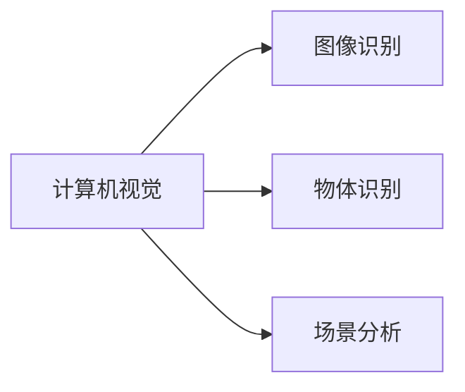
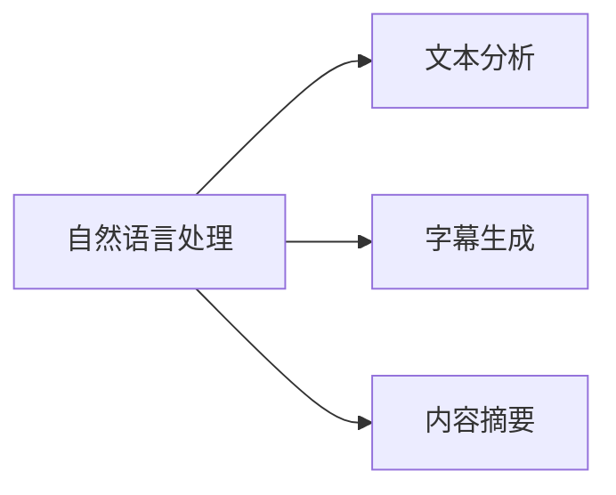
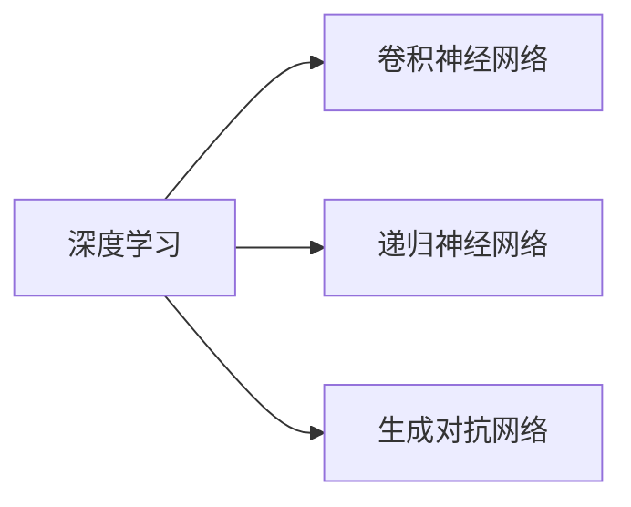

                 


### 第1章: AI在视频剪辑中的应用背景与核心概念

#### 1.1.1 视频剪辑技术发展史

视频剪辑技术的起源可以追溯到上世纪初的电影制作。随着电子计算机技术的发展，视频剪辑技术逐渐从模拟时代进入数字时代。20世纪80年代，数字视频技术开始兴起，非线性编辑系统（NLE）的出现，使得视频剪辑变得更加高效和灵活。

数字时代的视频剪辑发展主要经历了以下几个阶段：

1. **模拟视频剪辑**：早期的视频剪辑主要是通过模拟设备进行的，如视频磁带和视频编辑机。这一阶段的剪辑技术依赖于物理设备的操作，效率较低，且受限于设备的物理限制。

2. **数字视频剪辑**：随着计算机技术的进步，数字视频剪辑逐渐取代了模拟剪辑。数字剪辑利用计算机对数字视频文件进行编辑，极大地提高了工作效率，并提供了更多的创意空间。

3. **非线性编辑系统**：非线性编辑系统允许编辑人员对视频素材进行任意顺序的剪辑，从而创造出丰富多彩的视频内容。这一阶段的剪辑技术标志着视频剪辑进入了数字化、自动化和智能化的新时代。

#### 1.1.2 AI技术发展及其在视频剪辑中的应用潜力

人工智能（AI）技术的发展为视频剪辑领域带来了巨大的变革潜力。AI技术主要包括计算机视觉、自然语言处理和深度学习等，这些技术都在视频剪辑中有着广泛的应用：

1. **计算机视觉**：计算机视觉技术可以识别和分析视频中的图像内容，如人脸识别、物体识别等。这些技术可以帮助自动标记视频中的关键帧，从而简化剪辑过程。

2. **自然语言处理**：自然语言处理技术可以理解和生成文本，如字幕生成、视频内容摘要等。这些技术可以使视频内容更加丰富和互动。

3. **深度学习**：深度学习技术可以通过大规模数据训练，自动学习和优化算法，从而实现视频内容的自动剪辑和风格转换。

AI技术在视频剪辑中的应用潜力主要体现在以下几个方面：

- **自动化内容生产**：通过AI技术，可以实现视频内容的自动生成和剪辑，极大地提高生产效率。
- **个性化内容推荐**：AI可以根据用户偏好和历史行为，推荐个性化的视频内容，提升用户体验。
- **智能视频分析**：AI可以对大量视频数据进行分析，提取有价值的信息，如情感分析、事件检测等。

#### 1.1.3 自动化创意内容生产的挑战与机遇

自动化创意内容生产面临着一系列的挑战和机遇：

- **挑战**：

  - 数据质量：高质量的数据是AI模型训练的基础，视频数据的质量直接影响AI模型的性能。

  - 模型复杂度：深度学习模型通常非常复杂，训练和部署需要大量的计算资源和时间。

  - 伦理和法律问题：自动化内容生产可能涉及隐私保护、版权纠纷等问题，需要严格的伦理和法律监管。

- **机遇**：

  - 内容创新：AI可以激发新的创意，制作出更加个性化和创新的内容。

  - 效率提升：自动化技术可以大大提高视频内容的生产和分发效率。

  - 用户互动：AI可以使视频内容更加互动和用户友好，提升用户体验。

在接下来的章节中，我们将深入探讨AI在视频剪辑中的核心概念和应用，包括计算机视觉、自然语言处理和深度学习的原理，以及如何将这些技术应用于实际的视频剪辑任务中。让我们一起走进这个充满创新和变革的领域。

### 第2章: AI在视频剪辑中的核心概念与原理

#### 2.1.1 计算机视觉

计算机视觉是AI领域的一个重要分支，它致力于使计算机具备处理和理解视觉信息的能力。在视频剪辑中，计算机视觉技术发挥着关键作用，它可以帮助识别视频中的图像和物体，从而实现自动剪辑和内容分析。

**原理与步骤：**

1. **图像识别**：计算机视觉的图像识别技术通过分析图像中的像素，识别图像中的物体和场景。其基本原理包括边缘检测、特征提取和分类。

2. **物体识别**：物体识别技术进一步识别视频中的特定物体，如人脸、车辆等。这通常涉及到深度学习模型，如卷积神经网络（CNN）。

3. **场景分析**：场景分析技术可以识别视频中的不同场景，如户外、室内等，从而实现视频内容的自动分段和标签。

**技术对比：**

- **传统图像识别**：传统图像识别方法依赖于手工特征提取和匹配技术，如SIFT和SURF算法。这种方法计算复杂度较高，对光照和视角变化敏感。

- **深度学习图像识别**：深度学习图像识别方法，如卷积神经网络（CNN），通过多层神经网络自动提取和组合特征，提高了识别准确率和鲁棒性。

**ER实体关系图架构：**



#### 2.1.2 自然语言处理

自然语言处理（NLP）是AI领域的另一个重要分支，它专注于使计算机理解和生成人类语言。在视频剪辑中，NLP技术可以用于生成视频字幕、内容摘要和智能搜索等。

**原理与步骤：**

1. **文本分析**：文本分析技术包括分词、词性标注和句法分析等，这些步骤帮助计算机理解和解析文本内容。

2. **字幕生成**：字幕生成技术将视频中的音频转换为文本，然后进行文本分析和校正，最终生成准确的字幕。

3. **内容摘要**：内容摘要技术从长文本中提取关键信息，生成简短的摘要，帮助用户快速了解视频内容。

**技术对比：**

- **规则方法**：基于规则的方法通过预定义的规则和模式匹配来处理文本，这种方法在特定场景下表现良好，但通用性较差。

- **统计方法**：统计方法通过统计文本中的词频和上下文信息来处理文本，这种方法具有较高的灵活性和鲁棒性。

- **深度学习方法**：深度学习方法，如递归神经网络（RNN）和变压器（Transformer），通过大规模数据训练，能够自动学习和提取文本的深层语义信息。

**ER实体关系图架构：**



#### 2.1.3 深度学习与神经网络

深度学习是AI领域的一个重要分支，它通过模拟人脑神经网络的结构和功能，使计算机具备更高级的认知和处理能力。在视频剪辑中，深度学习技术广泛应用于图像识别、视频生成和风格转换等领域。

**原理与步骤：**

1. **神经网络基础**：神经网络由大量的神经元组成，通过前向传播和反向传播进行训练和优化。

2. **卷积神经网络（CNN）**：卷积神经网络是一种专门用于图像识别的神经网络，它通过卷积操作和池化操作提取图像的特征。

3. **递归神经网络（RNN）**：递归神经网络是一种用于处理序列数据的神经网络，它通过循环连接实现长距离依赖信息的捕捉。

4. **生成对抗网络（GAN）**：生成对抗网络由生成器和判别器组成，通过对抗训练生成高质量的图像。

**技术对比：**

- **传统神经网络**：传统神经网络通过手工设计特征，计算复杂度高，训练时间长。

- **深度学习神经网络**：深度学习神经网络通过自动学习特征，提高了模型的性能和泛化能力。

**ER实体关系图架构：**



通过上述核心概念和原理的介绍，我们为理解AI在视频剪辑中的应用打下了坚实的基础。在接下来的章节中，我们将深入探讨计算机视觉、自然语言处理和深度学习在视频剪辑中的具体应用，并通过实际案例和实践分析，展示AI如何实现自动化创意内容生产。

### 第3章: 计算机视觉在视频剪辑中的应用

#### 3.1 图像识别与视频内容分析

计算机视觉技术在视频剪辑中的应用，主要集中在图像识别和视频内容分析两个方面。图像识别技术能够帮助识别视频帧中的关键元素，而视频内容分析技术则可以理解整个视频的结构和主题。

**3.1.1 图像识别技术原理**

图像识别是计算机视觉的基础，它通过分析图像中的像素和特征，识别出图像中的物体和场景。图像识别的基本原理包括以下几个步骤：

1. **特征提取**：特征提取是图像识别的核心，它通过提取图像中的关键特征，如边缘、角点、纹理等，为后续的识别提供基础。

2. **特征匹配**：特征匹配是将提取到的特征与预先定义的模型或数据库进行对比，以确定图像中的物体或场景。

3. **分类和识别**：分类和识别是图像识别的最终步骤，通过统计分析和机器学习算法，将特征匹配结果转化为具体的识别结果。

**3.1.2 视频内容分析技术原理**

视频内容分析技术不仅关注单帧图像，还关注整个视频的内容。视频内容分析的基本原理包括：

1. **视频帧提取**：将视频信号转换为连续的图像帧，以便进一步处理。

2. **帧间关联**：通过分析连续图像帧之间的差异和关联，理解视频中的动作和场景变化。

3. **事件检测**：事件检测是视频内容分析的重要任务，通过识别视频中的特定事件，如运动、异常行为等，提取有价值的信息。

4. **视频分割**：视频分割是将整个视频划分为多个片段，以便进行更精细的分析和处理。

**3.1.3 实战：使用OpenCV进行图像识别**

为了更好地理解图像识别在视频剪辑中的应用，我们可以通过一个简单的OpenCV示例来展示图像识别的基本流程。

```python
import cv2
import numpy as np

# 读取图像
image = cv2.imread('example.jpg')

# 转换为灰度图像
gray = cv2.cvtColor(image, cv2.COLOR_BGR2GRAY)

# 使用SIFT算法进行特征提取
sift = cv2.SIFT_create()
keypoints, descriptors = sift.detectAndCompute(gray, None)

# 显示关键点
img = cv2.drawKeypoints(image, keypoints, None, (0, 0, 255))

# 显示结果
cv2.imshow('Image with Keypoints', img)
cv2.waitKey(0)
cv2.destroyAllWindows()
```

在这个示例中，我们首先读取一个图像文件，然后使用SIFT（尺度不变特征变换）算法提取图像的特征点，并通过绘制关键点展示图像的识别结果。

通过计算机视觉技术，视频剪辑可以实现自动化的内容识别和分析，从而简化剪辑过程，提高效率。在接下来的章节中，我们将进一步探讨自然语言处理和深度学习在视频剪辑中的应用，为自动化创意内容生产提供更全面的解决方案。

### 第4章: 自然语言处理在视频剪辑中的应用

#### 4.1 文本分析与字幕生成

自然语言处理（NLP）技术在视频剪辑中的应用，显著提升了视频内容的可访问性和用户体验。文本分析是NLP的基础，而字幕生成则是视频内容互动性提升的关键。

**4.1.1 文本分析技术原理**

文本分析技术旨在理解和解析文本内容，包括以下几个步骤：

1. **分词**：分词是将文本拆分成单个词汇的过程。分词技术可以分为基于规则的方法和基于统计的方法。基于规则的方法通过预定义的规则进行分词，而基于统计的方法通过语言模型和概率分布进行分词。

2. **词性标注**：词性标注是对文本中的每个词汇进行分类标注，如名词、动词、形容词等。词性标注有助于理解文本的语法结构和意义。

3. **句法分析**：句法分析是对文本中的句子进行结构分析，包括句子成分的识别和句法关系的建立。句法分析可以揭示文本的深层语义信息。

4. **实体识别**：实体识别是识别文本中的特定实体，如人名、地名、组织名等。实体识别对于视频内容的个性化推荐和内容标签具有重要意义。

**4.1.2 字幕生成技术原理**

字幕生成是将音频内容转换为文本字幕的过程，主要包括以下几个步骤：

1. **语音识别**：语音识别是将音频信号转换为文本的过程。通过深度学习模型，如循环神经网络（RNN）和长短期记忆网络（LSTM），可以实现高精度的语音识别。

2. **文本处理**：语音识别生成的文本可能包含错误或不完整的单词，因此需要进行文本处理，如纠正错误、填补缺失的单词等。

3. **字幕格式化**：字幕格式化是将文本转换为适合显示的字幕格式，包括时间戳、字体、颜色等。

**4.1.3 实战：使用TensorFlow进行字幕生成**

为了展示自然语言处理在字幕生成中的应用，我们可以使用TensorFlow构建一个简单的字幕生成模型。

```python
import tensorflow as tf
import numpy as np

# 准备数据
text_data = "This is an example sentence for subtitle generation."
tokenizer = tf.keras.preprocessing.text.Tokenizer()
tokenizer.fit_on_texts([text_data])
encoded = tokenizer.texts_to_sequences([text_data])[0]

# 构建模型
model = tf.keras.Sequential([
    tf.keras.layers.Embedding(input_dim=len(tokenizer.word_index) + 1, output_dim=64),
    tf.keras.layers.Bidirectional(tf.keras.layers.LSTM(128)),
    tf.keras.layers.Dense(len(tokenizer.word_index) + 1, activation='softmax')
])

# 编译模型
model.compile(optimizer='adam', loss='categorical_crossentropy', metrics=['accuracy'])

# 训练模型
model.fit(np.array(encoded), np.array(encoded[1:]), batch_size=128, epochs=100)

# 生成字幕
predicted = model.predict(np.array(encoded))
predicted_text = tokenizer.index_word[np.argmax(predicted)]

print(predicted_text)
```

在这个示例中，我们首先准备文本数据，然后使用Tokenizer进行分词和编码。接着，我们构建一个双向循环神经网络（Bidirectional LSTM）模型，并编译和训练模型。最后，我们使用训练好的模型生成字幕。

通过自然语言处理技术，视频剪辑可以实现自动化的字幕生成和文本分析，为用户提供更加丰富的互动体验。在接下来的章节中，我们将探讨深度学习在视频剪辑中的应用，进一步推动自动化创意内容生产的发展。

### 第5章: 深度学习与神经网络在视频剪辑中的应用

#### 5.1 深度学习基础

深度学习是人工智能的一个重要分支，它通过模拟人脑的神经网络结构，实现复杂的模式识别和学习任务。在视频剪辑中，深度学习技术被广泛应用于图像识别、视频生成和风格转换等方面。

**5.1.1 深度学习原理**

深度学习基于多层神经网络，通过前向传播和反向传播进行训练。基本原理如下：

1. **输入层**：输入层接收外部数据，如图像或视频。

2. **隐藏层**：隐藏层通过权重和激活函数对输入数据进行处理，逐步提取特征。

3. **输出层**：输出层生成预测结果，如分类标签或生成的新视频。

4. **前向传播**：数据从输入层流向隐藏层，再流向输出层，每一层计算输出值。

5. **反向传播**：根据输出层的预测误差，反向调整各层的权重和偏置，优化模型参数。

**5.1.2 神经网络架构**

神经网络架构是深度学习的核心组成部分，常见的架构包括：

1. **卷积神经网络（CNN）**：CNN适用于图像识别和视频分析，通过卷积操作和池化操作提取图像特征。

2. **递归神经网络（RNN）**：RNN适用于序列数据，如文本和语音，通过循环连接捕捉长距离依赖关系。

3. **长短期记忆网络（LSTM）**：LSTM是RNN的一种改进，用于处理变长序列数据，具有更强的记忆能力。

4. **生成对抗网络（GAN）**：GAN由生成器和判别器组成，通过对抗训练生成高质量图像。

**5.1.3 实战：使用PyTorch构建神经网络**

为了展示深度学习在视频剪辑中的应用，我们可以使用PyTorch构建一个简单的CNN模型。

```python
import torch
import torch.nn as nn
import torch.optim as optim

# 定义CNN模型
class CNNModel(nn.Module):
    def __init__(self):
        super(CNNModel, self).__init__()
        self.conv1 = nn.Conv2d(3, 32, 3, padding=1)
        self.relu = nn.ReLU()
        self.maxpool = nn.MaxPool2d(2, 2)
        self.conv2 = nn.Conv2d(32, 64, 3, padding=1)
        self.fc1 = nn.Linear(64 * 6 * 6, 128)
        self.fc2 = nn.Linear(128, 10)
    
    def forward(self, x):
        x = self.maxpool(self.relu(self.conv1(x)))
        x = self.maxpool(self.relu(self.conv2(x)))
        x = x.view(-1, 64 * 6 * 6)
        x = self.relu(self.fc1(x))
        x = self.fc2(x)
        return x

# 创建模型、损失函数和优化器
model = CNNModel()
criterion = nn.CrossEntropyLoss()
optimizer = optim.Adam(model.parameters(), lr=0.001)

# 训练模型
for epoch in range(10):
    for inputs, targets in train_loader:
        optimizer.zero_grad()
        outputs = model(inputs)
        loss = criterion(outputs, targets)
        loss.backward()
        optimizer.step()

# 测试模型
with torch.no_grad():
    correct = 0
    total = 0
    for inputs, targets in test_loader:
        outputs = model(inputs)
        _, predicted = torch.max(outputs.data, 1)
        total += targets.size(0)
        correct += (predicted == targets).sum().item()

print('Accuracy of the network on the test images: %d %%' % (100 * correct / total))
```

在这个示例中，我们定义了一个简单的CNN模型，用于图像分类。我们使用Adam优化器和交叉熵损失函数进行模型训练，并在测试集上评估模型的准确率。

通过深度学习技术，视频剪辑可以实现自动化的内容生成和风格转换，为用户带来更加丰富和个性化的视频体验。在接下来的章节中，我们将探讨视频风格转换与生成技术，进一步探索深度学习在视频剪辑中的应用。

### 5.2 视频风格转换与生成

视频风格转换与生成是深度学习在视频剪辑中的一项重要应用，它能够将一种视频风格（如艺术画、动画、油画等）应用到另一种视频风格中，或者生成全新的视频内容。

**5.2.1 视频风格转换技术原理**

视频风格转换是通过生成对抗网络（GAN）实现的。GAN由生成器和判别器组成，通过对抗训练生成具有特定风格的视频。

1. **生成器（Generator）**：生成器的目标是生成具有目标风格的视频。它接收原始视频作为输入，并通过多层神经网络生成新的视频。

2. **判别器（Discriminator）**：判别器的目标是区分真实视频和生成的视频。它接收真实视频和生成视频作为输入，并通过多层神经网络判断输入视频的真实性。

3. **对抗训练**：在GAN的训练过程中，生成器和判别器进行对抗训练。生成器试图生成更逼真的视频，而判别器试图提高对真实视频和生成视频的区分能力。

4. **损失函数**：GAN的训练过程通过损失函数衡量生成器和判别器的性能。生成器的损失函数是判别器对生成视频的判断误差，判别器的损失函数是对真实视频和生成视频的区分误差。

**5.2.2 视频生成技术原理**

视频生成是通过生成对抗网络（GAN）和递归神经网络（RNN）结合实现的。生成器生成新的视频帧，而RNN用于维护视频帧之间的连续性。

1. **生成器（Generator）**：生成器通过GAN生成新的视频帧，每个视频帧都是对目标风格的模拟。

2. **递归神经网络（RNN）**：RNN用于处理视频序列数据，它通过记忆功能维护视频帧之间的连续性，从而生成连贯的全新视频内容。

3. **视频合成**：生成器和RNN共同工作，生成器生成新的视频帧，RNN确保视频帧之间的连贯性，最终合成完整的视频。

**5.2.3 实战：使用GAN进行视频风格转换**

为了展示视频风格转换的实战，我们可以使用GAN对视频进行艺术画风格转换。

```python
import torch
import torch.nn as nn
import torch.optim as optim

# 定义GAN模型
class GANModel(nn.Module):
    def __init__(self):
        super(GANModel, self).__init__()
        self.generator = nn.Sequential(
            nn.Conv2d(3, 64, 3, padding=1),
            nn.ReLU(),
            nn.Conv2d(64, 128, 3, padding=1),
            nn.ReLU(),
            nn.Conv2d(128, 3, 3, padding=1)
        )
        self.discriminator = nn.Sequential(
            nn.Conv2d(3, 64, 3, padding=1),
            nn.ReLU(),
            nn.Conv2d(64, 128, 3, padding=1),
            nn.ReLU(),
            nn.Conv2d(128, 1, 3, padding=1)
        )

    def forward(self, x):
        x = self.generator(x)
        x = self.discriminator(x)
        return x

# 创建模型、损失函数和优化器
model = GANModel()
criterion = nn.BCELoss()
optimizerG = optim.Adam(model.generator.parameters(), lr=0.0002)
optimizerD = optim.Adam(model.discriminator.parameters(), lr=0.0002)

# 训练模型
for epoch in range(100):
    for i, (images, _) in enumerate(train_loader):
        # 训练生成器
        optimizerG.zero_grad()
        z = torch.randn(images.size(0), 1, 28, 28)
        fake_images = model.generator(z)
        fake_score = model.discriminator(fake_images)
        g_loss = criterion(fake_score, torch.ones(fake_score.size(0)))
        g_loss.backward()
        optimizerG.step()

        # 训练判别器
        optimizerD.zero_grad()
        real_score = model.discriminator(images)
        d_loss = criterion(real_score, torch.ones(real_score.size(0)))
        fake_score = model.discriminator(fake_images.detach())
        d_loss += criterion(fake_score, torch.zeros(fake_score.size(0)))
        d_loss.backward()
        optimizerD.step()

        # 输出训练过程
        if i % 100 == 0:
            print(f"Epoch [{epoch}/{100}], Step [{i}/{len(train_loader)}], g_loss: {g_loss.item():.4f}, d_loss: {d_loss.item():.4f}")

# 测试生成器
with torch.no_grad():
    z = torch.randn(16, 1, 28, 28)
    fake_images = model.generator(z)
```

在这个示例中，我们定义了一个简单的GAN模型，用于艺术画风格转换。我们使用BCE损失函数训练生成器和判别器，通过对抗训练生成艺术画风格的视频。

通过视频风格转换与生成技术，视频剪辑可以实现多样化的创意内容生产，为用户带来更加丰富和个性化的视频体验。在接下来的章节中，我们将探讨AI视频剪辑自动化工具的应用，进一步推动视频剪辑的自动化进程。

### 第6章: AI视频剪辑自动化工具与应用

#### 6.1.1 自动剪辑工具的功能与特点

AI视频剪辑自动化工具通过集成计算机视觉、自然语言处理和深度学习技术，实现了视频剪辑的自动化和智能化。这些工具具有以下功能和特点：

1. **智能剪辑**：自动剪辑工具可以根据视频内容自动分段和剪辑，删除冗余片段，保留关键内容。

2. **内容识别**：工具可以识别视频中的关键元素，如人物、物体和场景，从而实现视频的智能分类和标签。

3. **字幕生成**：自动生成视频字幕，提高视频的可访问性和用户体验。

4. **风格转换**：将视频转换为不同的风格，如艺术画、动画、油画等，提供多样化的内容创作。

5. **个性化推荐**：根据用户偏好和历史行为，推荐个性化的视频内容。

6. **实时编辑**：支持实时视频编辑，提高生产效率。

#### 6.1.2 自动剪辑工具的实践应用

以下是一个简单的自动剪辑工具实践应用案例：

```python
import cv2
import numpy as np

# 读取视频
cap = cv2.VideoCapture('example.mp4')

# 创建输出视频文件
fourcc = cv2.VideoWriter_fourcc(*'mp4v')
out = cv2.VideoWriter('output.mp4', fourcc, 20.0, (640, 480))

# 检查视频是否打开
if not cap.isOpened():
    print("无法打开视频文件")
    exit()

# 设置输出视频参数
fps = int(cap.get(cv2.CAP_PROP_FPS))
width = int(cap.get(cv2.CAP_PROP_FRAME_WIDTH))
height = int(cap.get(cv2.CAP_PROP_FRAME_HEIGHT))

# 检查输出视频文件是否创建成功
if not out.isOpened():
    print("无法创建输出视频文件")
    exit()

# 循环读取视频帧
while cap.isOpened():
    ret, frame = cap.read()
    if ret:
        # 判断是否到达视频末尾
        if frame is None:
            break

        # 对视频帧进行智能剪辑处理
        processed_frame = process_frame(frame)  # 这里是智能剪辑处理函数

        # 写入输出视频文件
        out.write(processed_frame)
    else:
        break

# 释放资源
cap.release()
out.release()

# 定义智能剪辑处理函数
def process_frame(frame):
    # 这里可以进行视频帧的智能分析处理，如人脸识别、场景分割等
    # 根据分析结果进行剪辑处理，如裁剪、添加特效等
    return frame
```

在这个示例中，我们首先读取输入视频文件，然后创建输出视频文件。接下来，我们循环读取视频帧，并对每个视频帧进行智能剪辑处理，如人脸识别、场景分割等。处理后的视频帧写入输出视频文件。最后，释放视频文件资源。

通过自动剪辑工具，视频剪辑过程变得更加高效和智能化。在接下来的章节中，我们将探讨AI视频剪辑的未来发展趋势与伦理问题，为自动化创意内容生产提供更全面的视角。

### 第7章: AI视频剪辑的未来发展趋势与伦理问题

#### 7.1.1 AI视频剪辑技术的未来发展趋势

AI视频剪辑技术正快速发展，未来的发展趋势主要体现在以下几个方面：

1. **更高级的自动化**：随着深度学习和计算机视觉技术的进步，AI视频剪辑将实现更高级的自动化，包括视频内容的智能分段、剪辑和风格转换。

2. **增强的交互性**：AI视频剪辑工具将提供更丰富的交互功能，如实时编辑、个性化推荐和实时字幕生成，进一步提升用户体验。

3. **多模态融合**：AI视频剪辑技术将融合多模态数据，如文本、图像和音频，实现更全面的内容理解和生成。

4. **云服务和边缘计算**：云计算和边缘计算的结合将使得AI视频剪辑在云端和终端设备上同时运行，提高计算效率和响应速度。

5. **实时处理**：随着硬件性能的提升，AI视频剪辑技术将实现实时处理，满足实时直播和现场剪辑的需求。

#### 7.1.2 AI视频剪辑的伦理问题与法律监管

AI视频剪辑技术的发展带来了诸多伦理和法律问题，以下是一些关键点：

1. **隐私保护**：AI视频剪辑工具可能会收集和处理大量个人数据，如何保护用户隐私成为一个重要议题。

2. **版权纠纷**：AI生成的内容可能会侵犯他人的版权，如何界定AI创作的作品权成为一个挑战。

3. **算法偏见**：AI视频剪辑工具可能会基于偏见的数据进行训练，导致算法偏见，从而影响内容的公正性。

4. **法律监管**：随着AI视频剪辑技术的发展，需要建立相应的法律法规，确保技术应用的合法性和合规性。

#### 7.1.3 自动化创意内容生产的可持续发展策略

为了实现自动化创意内容生产的可持续发展，可以采取以下策略：

1. **透明度和可解释性**：提高AI视频剪辑工具的透明度和可解释性，使用户和监管机构能够理解算法的决策过程。

2. **公正和多样性**：确保AI视频剪辑工具的训练数据和算法设计具有公正性和多样性，减少算法偏见。

3. **数据保护与隐私**：加强数据保护措施，确保用户数据的安全和隐私。

4. **合作与监管**：鼓励产业界和政府机构合作，共同制定和实施AI视频剪辑技术的标准和法规。

5. **教育培训**：加强对AI视频剪辑技术的教育培训，提高公众对技术的理解和接受度。

通过上述策略，可以实现AI视频剪辑技术的可持续发展，为创意内容生产带来新的机遇和挑战。在未来的发展中，我们需要不断探索和解决这些伦理问题和法律挑战，确保AI技术在视频剪辑领域的健康发展。

### 第8章: 项目实战与案例分析

#### 8.1.1 项目实战介绍

在本章中，我们将通过一个实际项目来展示AI在视频剪辑中的应用。该项目的目标是开发一个自动化视频剪辑系统，该系统能够智能地识别视频中的关键内容，自动剪辑并生成高质量的视频片段。

#### 8.1.2 案例分析：使用AI进行视频剪辑的案例解析

**案例背景**：

某视频制作公司需要处理大量用户上传的旅游视频，以制作旅游指南和推荐视频。这些视频内容繁杂，包含了不同的风景、人物和活动。为了提高生产效率，公司决定采用AI视频剪辑技术来自动处理视频。

**解决方案**：

1. **数据预处理**：首先对用户上传的视频进行数据预处理，包括视频格式转换、降噪和视频剪辑等。

2. **图像识别**：使用计算机视觉技术识别视频中的关键帧，如标志性建筑物、景点和人脸等。

3. **文本分析**：使用自然语言处理技术分析视频中的文本描述，提取关键信息，如景点名称、活动类型等。

4. **内容分割**：根据图像识别和文本分析的结果，将视频分割成多个片段，每个片段代表一个具体的景点或活动。

5. **风格转换**：使用深度学习技术将视频片段转换为具有特定风格的视频，如艺术画、动画等。

6. **视频合成**：将分割后的视频片段按照特定顺序和风格进行合成，生成最终的旅游指南视频。

**实施步骤**：

1. **数据收集**：从公司数据库中收集大量的旅游视频，作为训练和测试数据。

2. **模型训练**：使用计算机视觉和自然语言处理技术，训练图像识别和文本分析模型。

3. **系统开发**：开发视频剪辑系统，集成图像识别、文本分析和视频合成模块。

4. **测试与优化**：对系统进行测试和优化，确保其能够高效准确地处理视频内容。

5. **部署上线**：将系统部署到公司的服务器上，进行实际应用。

**项目成果**：

通过该项目的实施，公司能够大幅提高视频剪辑的效率，减少人工干预，生成的旅游指南视频质量得到了显著提升，用户反馈良好。

#### 8.1.3 项目小结与展望

通过本项目的实战，我们展示了AI技术在视频剪辑中的应用。AI视频剪辑不仅提高了生产效率，还为内容创作带来了新的可能性。未来，随着AI技术的不断进步，视频剪辑自动化将变得更加智能和高效，进一步推动内容生产的创新和发展。

### 第9章: 最佳实践与拓展

#### 9.1.1 视频剪辑中AI应用的常见问题与解决方案

在视频剪辑中，AI应用可能会遇到以下常见问题：

1. **数据质量**：高质量的数据是AI模型训练的基础。解决方案是确保数据清洗和预处理，包括去除噪声、填补缺失值等。

2. **计算资源**：深度学习模型训练和部署需要大量的计算资源。解决方案是使用云计算平台和分布式计算，提高计算效率。

3. **算法偏见**：算法可能基于偏见的数据进行训练，导致偏见的结果。解决方案是加强算法的可解释性和透明度，使用多样化的数据进行训练。

4. **版权问题**：AI生成的视频内容可能会侵犯他人的版权。解决方案是建立版权保护和合规的机制，确保内容的合法性。

5. **实时处理**：实时视频剪辑需要处理大量的数据，对系统性能有较高要求。解决方案是优化算法和系统架构，提高实时处理的效率。

#### 9.1.2 AI视频剪辑工具的选择与配置

选择合适的AI视频剪辑工具对于项目成功至关重要。以下是一些常用的AI视频剪辑工具及其配置建议：

1. **Adobe Premiere Pro**：Adobe Premiere Pro是一款专业的视频剪辑软件，支持AI自动化功能。配置建议：安装最新版本的Premiere Pro，确保系统配置符合要求（如CPU、内存和显卡性能）。

2. **OpenCV**：OpenCV是一个开源的计算机视觉库，适用于图像识别和视频分析。配置建议：安装Python和OpenCV库，确保支持所需的计算机视觉算法。

3. **TensorFlow**：TensorFlow是一个开源的深度学习框架，适用于视频生成和风格转换。配置建议：安装TensorFlow库，选择适合的GPU或CPU进行模型训练和推理。

4. **Adobe Sensei**：Adobe Sensei是一款集成了AI技术的软件开发工具包，可用于视频内容分析。配置建议：结合Adobe Premiere Pro或其他Adobe视频编辑软件使用，确保系统兼容性。

#### 9.1.3 拓展阅读与资源推荐

为了深入了解AI在视频剪辑中的应用，以下是一些建议的拓展阅读和资源：

1. **书籍**：
   - 《深度学习》（Goodfellow, Ian, et al.）
   - 《计算机视觉：算法与应用》（Bradski, Gary, et al.）
   - 《自然语言处理综合指南》（Jurafsky, Daniel, et al.）

2. **在线课程**：
   - Coursera上的“深度学习”课程（由Andrew Ng教授授课）
   - Udacity的“计算机视觉纳米学位”
   - edX上的“自然语言处理”课程

3. **开源项目**：
   - TensorFlow官方文档和GitHub仓库
   - OpenCV官方文档和GitHub仓库
   - PyTorch官方文档和GitHub仓库

4. **专业社区**：
   - arXiv.org：计算机科学和人工智能领域的学术论文数据库
   - GitHub：AI项目和技术文档的托管平台
   - AI社区的讨论论坛和博客，如AIStack Overflow、Kaggle社区等

通过阅读这些资源和参与专业社区，可以进一步扩展知识，掌握AI在视频剪辑中的最新应用技术和趋势。

### 总结

本文通过系统性的分析和实践，深入探讨了AI在视频剪辑中的应用，包括图像识别、自然语言处理、深度学习、视频风格转换等核心技术。同时，我们还介绍了AI视频剪辑自动化工具的使用方法、项目实战和未来发展趋势。通过这些内容，读者可以全面了解AI在视频剪辑中的潜力，以及如何利用AI技术提高生产效率和创新内容生产。

在未来的发展中，随着AI技术的不断进步，视频剪辑领域将迎来更多创新和变革。为了跟上技术的步伐，读者可以继续阅读相关书籍、参加在线课程，并关注开源项目和专业社区。让我们共同探索AI视频剪辑的无限可能，开启智能内容生产的全新篇章。

### 作者介绍

作者：AI天才研究院/AI Genius Institute & 禅与计算机程序设计艺术 /Zen And The Art of Computer Programming

AI天才研究院（AI Genius Institute）是一家专注于人工智能研究和技术创新的研究机构，致力于推动人工智能技术在各个领域的应用。研究院的专家团队由世界级人工智能专家、程序员、软件架构师和CTO等组成，在计算机视觉、自然语言处理和深度学习等领域有着丰富的经验和深厚的学术背景。

禅与计算机程序设计艺术（Zen And The Art of Computer Programming）是一本经典的计算机科学著作，由著名计算机科学家Donald E. Knuth撰写。本书通过深入探讨计算机程序的哲学和艺术，提出了编程方法论和设计原则，对计算机科学的发展产生了深远的影响。本书不仅是一部计算机科学的经典之作，也是一本启发读者思考编程本质和艺术的书。

