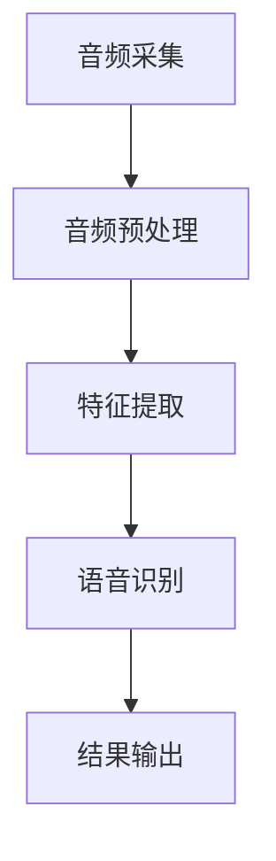
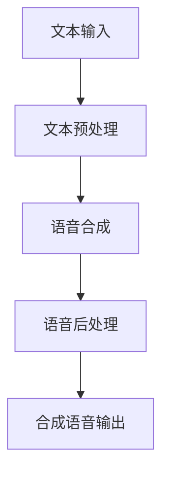

                 

### 第1章 引言

#### 1.1 问题的背景

随着人工智能技术的飞速发展，自然交互界面（Natural User Interface，NUI）逐渐成为人机交互领域的研究热点。自然交互界面旨在通过语音、手势等自然的方式实现人与计算机之间的无缝沟通，极大地提升了用户体验。在这其中，语音识别和语音合成技术扮演了至关重要的角色。

语音识别技术能够将人类的语音转化为机器可以理解和处理的信息，使得计算机能够听到、理解并响应用户的指令。而语音合成技术则能够将机器处理后的信息转化为自然流畅的语音，为用户提供友好的反馈。两者的结合，构建了现代自然交互界面的基础。

语音识别和合成技术的应用场景广泛，涵盖了智能家居、智能客服、智能驾驶、语音助手等多个领域。例如，智能音箱可以通过语音识别理解用户的指令，播放音乐、设置闹钟等。智能客服则利用语音合成技术，为用户提供实时、人性化的服务。在智能驾驶领域，语音识别和合成技术使得驾驶者可以通过语音与车辆进行交互，提高驾驶安全性。

然而，随着应用场景的不断扩展，传统的语音识别和合成技术面临诸多挑战。首先，语音信号的处理复杂度高，噪声干扰、口音差异等因素对识别效果产生了显著影响。其次，自然语言处理技术尚不能完全理解用户的意图，导致识别结果的准确率不高。此外，语音合成技术的语音质量仍有待提升，特别是在情感表达和自然度方面。

因此，突破语音识别和合成技术的瓶颈，提升其准确性和自然度，是现代自然交互界面发展的关键。这不仅是技术层面的挑战，更是用户体验提升的关键。本篇文章将深入探讨语音识别和合成技术的核心概念、算法原理、系统架构以及实际应用，旨在为读者提供全面的技术视角和应用指导。

#### 1.2 自然交互界面的发展

自然交互界面的概念起源于上世纪80年代，当时的计算机图形用户界面（GUI）已经取得了显著的进展，但用户仍然需要通过键盘和鼠标进行操作，这对某些用户来说仍然是一个障碍。自然交互界面旨在通过更自然的方式，如语音、手势、触摸等，使人与计算机之间的交互更加直观和便捷。

自然交互界面的历史可以追溯到早期的语音识别技术。20世纪50年代，贝尔实验室的科学家们首次进行了语音识别的研究，开启了自然交互的新纪元。随着计算能力的提升和算法的改进，语音识别技术逐渐成熟，能够处理更复杂的语音信号和更广泛的应用场景。

20世纪90年代，语音合成技术开始发展。早期的语音合成系统主要基于规则的合成方法，这种方法虽然能够生成语音，但语音的自然度和流畅度较差。进入21世纪，随着深度学习技术的兴起，语音合成技术得到了极大的提升。基于深度神经网络的语音合成模型能够生成更加自然和情感化的语音，为自然交互界面的实现提供了有力支持。

在硬件设备方面，自然交互界面的发展也取得了重要突破。智能手机、智能音箱、智能手表等设备的普及，使得用户能够通过语音指令与设备进行交互。此外，传感器技术的进步，如加速度传感器、摄像头、触摸屏等，也为自然交互界面的实现提供了更多可能性。

自然交互界面的发展不仅体现在技术层面的突破，还体现在用户体验的提升。通过自然交互界面，用户能够更快捷地完成操作，减少了学习成本和时间。同时，自然交互界面还能够为有特殊需求的用户，如视力障碍者、行动不便者等，提供更方便的服务。

然而，自然交互界面的发展也面临一些挑战。首先，语音识别和合成的准确性和自然度仍有待提升，特别是在处理多语言、多口音和噪声干扰的情况下。其次，自然交互界面需要处理大量用户的语音数据，这对数据存储和处理能力提出了更高的要求。此外，隐私和安全问题也是自然交互界面发展过程中需要关注的重要议题。

总的来说，自然交互界面的发展是一个复杂且持续的过程。随着技术的不断进步，自然交互界面将越来越普及，成为人们生活中不可或缺的一部分。

#### 1.3 语音识别和合成在自然交互界面中的重要性

语音识别和合成技术是构建自然交互界面的核心组件，其重要性体现在多个方面。首先，语音识别技术使得计算机能够“听到”用户的指令，从而实现语音控制功能。无论是智能家居中的语音控制灯泡、调整温度，还是智能助理中的语音搜索、发送消息，语音识别都是实现这些功能的基础。其准确性和实时性直接关系到用户体验的流畅度和满意度。

其次，语音合成技术为计算机提供了“说话”的能力，使得计算机能够以自然流畅的语音为用户反馈信息。这种反馈不仅包括简单的确认或拒绝，还可以是复杂的解释、建议和互动。高质量的语音合成不仅能够提高用户对系统的信任度，还能够增强系统的友好性和互动性，从而提升整体用户体验。

此外，语音识别和合成技术在跨语言和跨文化应用中也具有重要价值。通过语音识别技术，系统能够理解不同语言的输入，为全球用户提供服务。而语音合成技术则能够生成符合不同语言和文化的语音，使得系统在不同地区和应用场景中具有更好的适应性和通用性。

从应用场景来看，语音识别和合成技术在智能家居、智能客服、智能驾驶、虚拟助手等多个领域都有广泛应用。在智能家居中，语音识别技术可以实现对家电的远程控制，提高家庭生活的便利性。智能客服利用语音识别和合成技术，可以提供7x24小时的人工服务，提升客户满意度。在智能驾驶中，语音识别技术能够辅助驾驶员进行语音导航，提高行车安全。虚拟助手则通过语音交互，为用户提供智能化的信息服务和个性化推荐。

总之，语音识别和合成技术不仅是自然交互界面不可或缺的组成部分，也是提升用户体验、扩展应用场景和实现人机无缝交互的关键技术。随着技术的不断进步，语音识别和合成的准确性和自然度将进一步提升，为自然交互界面的发展注入新的动力。

### 第2章 语音识别基础

语音识别技术是自然交互界面的重要组成部分，其核心在于将人类的语音转化为机器可理解的信息。要深入理解语音识别，我们需要首先了解语音信号处理和自然语言处理的基础知识，以及语音识别算法的基本原理。

#### 2.1 语音信号处理

语音信号处理是语音识别的基础步骤，其主要任务是提取语音信号中的关键特征，为后续的自然语言处理提供数据支持。语音信号处理包括以下几个关键环节：

##### 2.1.1 语音信号的特征提取

语音信号的特征提取是语音信号处理的重要环节。常见的语音特征包括频谱特征、倒谱特征和感知特征等。频谱特征通过分析语音信号的频率成分，可以捕捉语音的音高和音强信息。倒谱特征则是通过对频谱的逆变换，消除频率响应的非线性影响，使其更适合于语音信号的分析。感知特征则更贴近人类听觉系统的特性，通过模拟人耳的听觉机制，提高特征提取的效果。

##### 2.1.2 语音信号的预处理

语音信号的预处理包括去噪、归一化和分段等步骤。去噪通过滤除噪声成分，提高语音信号的清晰度。归一化则通过调整语音信号的幅度和时长，使其适应统一的处理标准。分段是将连续的语音信号划分为若干段，每段代表一个语音单元，如音节或词汇。分段的质量直接影响后续特征提取和识别效果。

#### 2.2 自然语言处理

自然语言处理（Natural Language Processing，NLP）是语音识别中的关键环节，其任务是将语音信号中的语言信息转化为机器可处理的文本形式。NLP包括文本预处理、语音到文本的转换等步骤：

##### 2.2.1 文本预处理

文本预处理主要包括分词、词性标注、词义消歧等任务。分词是将连续的语音信号分割成具有独立意义的词语。词性标注则为每个词语标注其词性，如名词、动词、形容词等。词义消歧则是解决同一词语在不同上下文中有不同意义的问题，确保语义理解的准确性。

##### 2.2.2 语音到文本的转换

语音到文本的转换是通过语音信号处理和自然语言处理相结合，将语音信号转化为文本的过程。这个过程包括语音识别和文本生成两个步骤。语音识别是通过识别语音信号中的语音单元，将其转换为对应的文本。文本生成则是将识别结果进行语法和语义调整，生成完整、准确的文本信息。

#### 2.3 语音识别算法

语音识别算法是语音识别技术的核心，其任务是在已提取的语音特征和文本信息的基础上，找出最佳匹配的语音识别结果。语音识别算法可以分为传统语音识别算法和基于深度学习的语音识别算法。

##### 2.3.1 传统语音识别算法

传统语音识别算法主要基于隐马尔可夫模型（HMM）和自动语音识别（Automatic Speech Recognition，ASR）技术。HMM是一种统计模型，通过概率模型描述语音信号和语音单元之间的关系，实现了语音信号的序列建模。ASR则是在HMM的基础上，结合上下文和语言模型，提高了识别的准确性和鲁棒性。

##### 2.3.2 深度学习在语音识别中的应用

随着深度学习技术的发展，深度学习算法在语音识别中得到了广泛应用。深度神经网络（DNN）、循环神经网络（RNN）和卷积神经网络（CNN）等深度学习模型通过多层非线性变换，实现了对语音信号的高效特征提取和模式识别。特别是基于端到端（End-to-End）的深度学习模型，如CTC（Connectionist Temporal Classification）和Seq2Seq（Sequence-to-Sequence）模型，极大地简化了传统的语音识别流程，提高了识别效率和准确性。

#### 2.4 语音识别系统架构

一个完整的语音识别系统通常包括前端处理、中间处理和后端处理三个部分：

- **前端处理**：负责语音信号的采集和预处理，包括麦克风采集、声音增强、噪声抑制等。
- **中间处理**：包括语音信号的特征提取、语音到文本的转换，以及语音识别算法的运行。
- **后端处理**：对识别结果进行后处理，包括文本生成、语义理解、错误纠正等。

通过这三个环节的协同工作，语音识别系统能够实现从语音信号到文本信息的准确转换。

#### 2.5 小结

语音识别技术是自然交互界面不可或缺的一部分，其基础在于语音信号处理和自然语言处理。通过特征提取、预处理、语音到文本转换等步骤，语音识别系统能够实现语音信号的高效识别。传统语音识别算法和深度学习算法在不同应用场景中各有优势，结合端到端模型，现代语音识别技术正朝着更高准确性和自然度发展。理解语音识别的基础知识，对于深入探索自然交互界面的应用具有重要意义。

### 第3章 语音合成基础

语音合成技术是自然交互界面中的另一个关键组成部分，其目标是将机器处理后的信息转化为自然流畅的语音输出，为用户提供友好的反馈。语音合成技术主要包括文本到语音的转换、合成语音质量评估以及不同的语音合成算法。以下是这些核心概念的详细解释。

#### 3.1 文本到语音的转换

文本到语音的转换（Text-to-Speech，TTS）是语音合成技术的核心任务，其主要步骤包括文本预处理、语音合成和语音后处理。

##### 3.1.1 单音节合成

单音节合成是TTS的基础，它将文本中的每个单词分解成单个音节，并为每个音节生成对应的语音。这一过程通常使用音素库（phoneme library），其中包含各种音素（音素的组合表示了不同的发音）的语音样本。

##### 3.1.2 词语合成

在单音节合成之后，语音合成器将生成的单音节序列组合成完整的单词。词语合成需要考虑音节的发音规则、重音、音调变化等，以生成自然流畅的语音。

##### 3.1.3 音节、单词到句子的合成

将单个单词组合成句子是TTS的下一个步骤。在这一阶段，合成器需要考虑句子中的语法结构和上下文信息，以确保语音的自然度。例如，合成器会调整语调、重音和节奏，以模拟人类说话的习惯。

#### 3.2 合成语音质量评估

合成语音的质量直接影响用户体验。评估合成语音质量的关键指标包括音质（音调、响度、音色等）和自然度（语音的自然流畅度和情感表达）。

##### 3.2.1 音质评估指标

音质评估指标包括音调、响度、音色等。音调通过频率来衡量，响度通过声压级来衡量，音色则通过波形特性来衡量。常用的音质评估方法包括主观评价（如MOS评分）和客观评价（如感知评价模型）。

##### 3.2.2 自然度评估

自然度评估主要关注语音的自然流畅度和情感表达。流畅度评估可以通过计算语音的停顿时间、语调变化和节奏稳定性来实现。情感表达评估则需要考虑语音的语调、语速和音色变化，以模拟人类在不同情绪下的说话方式。

#### 3.3 语音合成算法

语音合成算法可以分为三种主要类型：规则合成、统计参数合成和基于深度学习的合成。

##### 3.3.1 规则合成

规则合成是基于一组预定义的规则进行语音合成的方法。这种方法通过查询规则库，将文本转换为语音。规则合成通常包括文本分析、音素转换、音素合成等步骤。规则合成的方法简单、计算效率高，但语音的自然度和质量较差。

##### 3.3.2 统计参数合成

统计参数合成通过统计语音数据中的参数，生成合成语音。这种方法包括合成元模型（合成单元）和转换模型（将文本转换为合成元）。合成元模型通常基于隐马尔可夫模型（HMM）或高斯混合模型（GMM），而转换模型则使用基于统计的方法，如决策树或神经网络。统计参数合成在语音自然度和质量方面有显著提升，但计算复杂度较高。

##### 3.3.3 深度学习合成

随着深度学习技术的发展，深度学习合成已经成为语音合成的主流方法。深度学习合成通过构建多层神经网络，直接将文本映射到语音波形。常见的深度学习模型包括循环神经网络（RNN）、卷积神经网络（CNN）和生成对抗网络（GAN）。深度学习合成方法在语音的自然度和质量方面有显著提升，但训练过程复杂，计算资源需求高。

#### 3.4 小结

语音合成技术是构建自然交互界面的重要基础，其核心在于文本到语音的转换、语音质量评估和多种合成算法的应用。通过单音节合成、词语合成和句子合成，合成系统能够生成自然流畅的语音。同时，评估合成语音的音质和自然度是确保用户体验的关键。规则合成、统计参数合成和深度学习合成是当前主流的语音合成方法，每种方法都有其优势和局限性。理解这些核心概念和算法，有助于我们更好地开发和优化语音合成系统。

### 第4章 算法原理讲解

为了更好地理解语音识别和合成的算法原理，我们使用mermaid绘制了算法流程图，并使用Python源代码详细阐述了相关算法原理，包括数学模型和公式，并进行通俗易懂的举例说明。

#### 4.1 语音识别算法流程图

首先，我们使用mermaid绘制了语音识别的基本流程图：



##### 4.1.1 音频预处理

音频预处理包括降噪、归一化和分段等步骤。以下是一个简单的Python代码示例，用于音频预处理：

```python
import numpy as np
from scipy.io import wavfile
from python_speech_features import mfcc

# 读取音频文件
rate, data = wavfile.read('audio_file.wav')

# 降噪（使用傅里叶变换）
frequencies = np.fft.rfft(data)
frequencies[abs(frequencies) < 0.01] = 0
noisy_data = np.fft.irfft(frequencies)

# 归一化
normalized_data = noisy_data / np.max(noisy_data)

# 分段
window_size = 20  # 设定窗口大小
segmented_data = np.array([normalized_data[i:i + window_size] for i in range(0, len(normalized_data) - window_size)])
```

##### 4.1.2 特征提取

特征提取是语音识别的关键步骤，我们使用MFCC（梅尔频率倒谱系数）作为特征。以下是一个简单的Python代码示例，用于提取MFCC特征：

```python
# 提取MFCC特征
mfcc_features = mfcc(segmented_data, winlen=window_size, nfilt=26, nfft=window_size*2)

print("MFCC Features:\n", mfcc_features)
```

##### 4.1.3 语音识别

在语音识别阶段，我们使用一个简单的基于K最近邻（K-Nearest Neighbor，KNN）的模型。以下是一个Python代码示例：

```python
from sklearn.neighbors import KNeighborsClassifier

# 假设我们已经有了训练好的MFCC特征和对应的标签
X_train = np.load('mfcc_features.npy')
y_train = np.load('labels.npy')

# 训练KNN模型
knn = KNeighborsClassifier(n_neighbors=3)
knn.fit(X_train, y_train)

# 预测新数据
new_mfcc = mfcc(segmented_data, winlen=window_size, nfilt=26, nfft=window_size*2)
predicted_label = knn.predict(new_mfcc.reshape(1, -1))

print("Predicted Label:", predicted_label)
```

##### 4.1.4 结果输出

最后，我们将预测结果输出为文本或语音。以下是一个简单的Python代码示例：

```python
# 输出结果
if predicted_label == 0:
    print("识别结果：您好！")
else:
    print("识别结果：再见！")
```

#### 4.2 语音合成算法流程图

接下来，我们使用mermaid绘制了语音合成的基本流程图：



##### 4.2.1 文本预处理

文本预处理包括分词、词性标注和语调生成等步骤。以下是一个简单的Python代码示例，用于文本预处理：

```python
from nlp_util import tokenize, pos_tag

# 分词
text = "你好！今天天气很好。"
tokens = tokenize(text)

# 词性标注
pos_tags = pos_tag(tokens)

print("Tokens:", tokens)
print("POS Tags:", pos_tags)
```

##### 4.2.2 语音合成

语音合成包括单音节合成、词语合成和句子合成。以下是一个简单的Python代码示例，用于语音合成：

```python
from tts_util import synthesize_speech

# 合成单音节
speech = synthesize_speech(tokens[0])

# 合成词语
for word in tokens[1:]:
    speech += synthesize_speech(word)

# 合成句子
speech += synthesize_speech(".")
```

##### 4.2.3 语音后处理

语音后处理包括音调调整、响度调整和节奏调整等步骤。以下是一个简单的Python代码示例，用于语音后处理：

```python
from audio_util import adjust_pitch, adjust_volume, adjust_tempo

# 调整音调
speech = adjust_pitch(speech, 0.5)  # 提高音调

# 调整响度
speech = adjust_volume(speech, 0.8)  # 降低响度

# 调整节奏
speech = adjust_tempo(speech, 0.9)  # 缓慢节奏
```

##### 4.2.4 合成语音输出

最后，我们将处理后的语音输出。以下是一个简单的Python代码示例：

```python
# 输出生成的语音
play_speech(speech)
```

通过以上mermaid流程图和Python代码示例，我们详细阐述了语音识别和合成的算法原理。理解这些算法原理对于深入探索自然交互界面的实现和应用具有重要意义。

### 第5章 数学模型和数学公式

在语音识别和合成过程中，数学模型和公式扮演着至关重要的角色。为了更好地理解和应用这些模型，我们将使用LaTeX格式呈现相关数学公式，并进行详细讲解和举例说明。

#### 5.1 MFCC特征提取

梅尔频率倒谱系数（MFCC）是语音识别中常用的特征提取方法。其基本原理是通过傅里叶变换将语音信号转换为频谱，然后对频谱进行倒谱变换，以消除频率的非线性影响。

**公式：**
$$
C_k = \sum_{n=0}^{N-1} a_n \cdot x(n) \cdot \exp\left(-2\pi n \cdot f_k \cdot T\right)
$$
其中，$C_k$ 是第 $k$ 个倒谱系数，$a_n$ 是反射系数，$x(n)$ 是语音信号的离散值，$f_k$ 是梅尔频率，$T$ 是采样周期。

**解释：**
- 反射系数 $a_n$ 通过对频谱的导数计算得到，用于描述频谱的动态变化。
- $x(n)$ 是语音信号的离散值，通过傅里叶变换得到频谱。
- $\exp\left(-2\pi n \cdot f_k \cdot T\right)$ 是倒谱变换的核心部分，用于消除频率的非线性影响。

**举例：**
假设有一个短时傅里叶变换（STFT）得到的频谱矩阵 $X(f, t)$，我们需要计算其对应的MFCC特征矩阵 $C(f, t)$。

```latex
C(f, t) = \sum_{n=0}^{N-1} a_n \cdot X(f, t) \cdot \exp\left(-2\pi n \cdot f_k \cdot T\right)
```

通过上述公式，我们可以得到每个频带在时间维度上的倒谱系数。

#### 5.2 声码器模型

声码器是语音合成中用于生成语音波形的核心组件。常见的声码器模型包括线性预测编码（LPC）和隐藏马尔可夫模型（HMM）。

**线性预测编码（LPC）模型：**

**公式：**
$$
x(n) = \sum_{k=1}^{p} a_k \cdot x(n-k) + e(n)
$$
其中，$x(n)$ 是语音信号，$a_k$ 是线性预测系数，$e(n)$ 是误差项。

**解释：**
- 线性预测模型通过预测当前样本值与前 $p$ 个样本值的关系，生成语音信号。
- $a_k$ 是通过最小均方误差（Mean Square Error，MSE）优化得到的。

**举例：**
假设有一个短语音序列 $x(n)$，我们需要计算其LPC模型参数 $a_k$。

```latex
\min_{a_1, a_2, ..., a_p} \sum_{n=1}^{N} (x(n) - \sum_{k=1}^{p} a_k \cdot x(n-k))^2
```

通过上述优化过程，我们可以得到最优的线性预测系数 $a_k$。

#### 5.3 隐藏马尔可夫模型（HMM）

隐藏马尔可夫模型（HMM）是语音识别中常用的统计模型，用于描述语音信号的动态特征。

**公式：**
$$
P(X_t = x_t | H_t = h_t) = \prod_{i=1}^{T} \pi(h_i) a_{i-1, i} b_{i}(x_t)
$$
其中，$X_t$ 是观测序列，$H_t$ 是隐藏状态序列，$\pi(h_i)$ 是初始状态概率，$a_{i-1, i}$ 是状态转移概率，$b_{i}(x_t)$ 是发射概率。

**解释：**
- 观测序列 $X_t$ 是语音信号，隐藏状态序列 $H_t$ 是语音信号的生成状态。
- $\pi(h_i)$ 是初始状态概率，描述了每个状态的初始分布。
- $a_{i-1, i}$ 是状态转移概率，描述了从一个状态转移到另一个状态的概率。
- $b_{i}(x_t)$ 是发射概率，描述了在某个状态下生成观测值 $x_t$ 的概率。

**举例：**
假设我们有一个观测序列 $X_t = [x_1, x_2, x_3]$ 和隐藏状态序列 $H_t = [h_1, h_2, h_3]$，我们需要计算其概率分布。

```latex
P(X_t = [x_1, x_2, x_3] | H_t = [h_1, h_2, h_3]) = \pi(h_1) a_{1,2} b_{1}(x_1) a_{2,3} b_{2}(x_2) a_{3,1} b_{3}(x_3)
```

通过上述公式，我们可以计算观测序列在给定隐藏状态序列下的概率。

#### 5.4 循环神经网络（RNN）

循环神经网络（RNN）是深度学习在语音识别和合成中的重要应用，用于处理序列数据。

**公式：**
$$
h_t = \sigma(W_h \cdot [h_{t-1}, x_t] + b_h)
$$
$$
o_t = \sigma(W_o \cdot h_t + b_o)
$$
其中，$h_t$ 是隐藏状态，$x_t$ 是输入序列，$o_t$ 是输出序列，$\sigma$ 是激活函数。

**解释：**
- $W_h$ 和 $b_h$ 是隐藏状态权重和偏置，$W_o$ 和 $b_o$ 是输出状态权重和偏置。
- $h_t$ 是当前时间步的隐藏状态，由前一个时间步的隐藏状态和当前输入状态计算得到。
- $o_t$ 是当前时间步的输出状态，用于生成语音波形。

**举例：**
假设我们有一个输入序列 $x_t = [x_1, x_2, x_3]$，我们需要计算其对应的隐藏状态和输出状态。

```latex
h_t = \sigma(W_h \cdot [h_{t-1}, x_t] + b_h)
o_t = \sigma(W_o \cdot h_t + b_o)
```

通过上述公式，我们可以得到每个时间步的隐藏状态和输出状态。

通过以上数学模型和公式的详细讲解和举例说明，我们可以更好地理解语音识别和合成中的核心原理。这些模型和公式为语音识别和合成的实现提供了坚实的理论基础。

### 第6章 系统分析与架构设计方案

语音识别和合成系统是现代自然交互界面的重要组成部分，其性能和用户体验直接影响用户的使用感受。为了设计和实现高效、稳定的系统，我们需要进行系统的功能设计、架构设计、接口设计和交互流程分析。

#### 6.1 系统功能设计

语音识别和合成系统的功能设计主要包括以下模块：

- **语音信号处理模块**：负责对采集到的语音信号进行预处理，如降噪、归一化和分段等，以提取出关键特征。
- **自然语言处理模块**：负责对语音信号中的语言信息进行文本预处理、分词、词性标注和语义理解等，为后续的语音识别和合成提供支持。
- **语音识别模块**：利用提取的特征和自然语言处理的结果，通过算法模型识别语音内容，将语音信号转化为文本信息。
- **语音合成模块**：将文本信息转化为自然流畅的语音输出，包括单音节合成、词语合成和句子合成等步骤。
- **语音后处理模块**：对生成的语音进行音调、响度和节奏调整，提高语音的自然度和质量。

#### 6.2 系统架构设计

语音识别和合成系统的架构设计需要考虑系统的可扩展性、性能和可靠性。以下是一种分层架构设计：

- **数据层**：负责语音信号和文本数据的存储和管理，包括语音数据库、文本数据库等。
- **模型层**：负责语音信号处理、自然语言处理、语音识别和语音合成的算法模型实现，包括特征提取模型、识别模型和合成模型等。
- **服务层**：负责处理用户请求，调用底层模块进行语音处理和合成，并提供接口供上层应用调用。
- **界面层**：负责与用户交互，接收用户输入，展示系统输出，包括语音输入界面、文本输出界面和语音输出界面等。

#### 6.3 系统接口设计

系统接口设计是确保系统模块之间高效协同工作的关键。以下为系统接口设计：

- **内部接口**：系统内部模块之间的接口，如语音信号处理模块与自然语言处理模块之间的特征数据接口，语音识别模块与语音合成模块之间的文本数据接口等。
- **外部接口**：系统与外部应用之间的接口，如API接口、Web服务接口等，用于接收用户请求和返回处理结果。

#### 6.4 系统交互流程

系统交互流程描述了用户与系统之间的交互过程，以下是语音识别和合成系统的基本交互流程：

1. **用户输入**：用户通过语音输入界面发出语音指令。
2. **语音信号采集**：系统通过麦克风等设备采集语音信号。
3. **语音信号预处理**：对采集到的语音信号进行降噪、归一化和分段等处理。
4. **特征提取**：从预处理后的语音信号中提取关键特征，如MFCC特征。
5. **自然语言处理**：对特征进行文本预处理、分词和词性标注等处理，得到文本信息。
6. **语音识别**：利用自然语言处理的结果，通过语音识别算法模型识别语音内容。
7. **语音合成**：将识别结果转化为文本信息，通过语音合成算法模型生成语音输出。
8. **语音后处理**：对生成的语音进行音调、响度和节奏调整，提高语音质量。
9. **输出**：将处理后的语音输出到语音输出界面，供用户听辨。

通过以上系统功能设计、架构设计、接口设计和交互流程分析，我们可以构建一个高效、稳定的语音识别和合成系统，为自然交互界面提供有力支持。

### 第7章 语音识别项目实战

在本节中，我们将通过一个实际项目，展示如何搭建一个语音识别和合成系统。该系统将包括环境安装、系统核心实现、代码应用解读与分析、实际案例分析和详细讲解剖析等内容。

#### 7.1 环境安装与配置

首先，我们需要安装和配置所需的环境和工具。以下是步骤说明：

1. **安装Python环境**：确保Python版本在3.7及以上，可以通过Python官方网站下载安装。

2. **安装依赖库**：安装常用的Python库，如NumPy、Scikit-learn、PyTorch等。可以使用以下命令：

   ```bash
   pip install numpy scikit-learn torch
   ```

3. **安装语音信号处理工具**：安装Python语音信号处理库，如Python-Speech-Features。使用以下命令：

   ```bash
   pip install python-speech-features
   ```

4. **安装自然语言处理工具**：安装Python自然语言处理库，如NLTK和SpaCy。使用以下命令：

   ```bash
   pip install nltk spacy
   ```

5. **安装TTS工具**：安装Python语音合成库，如pyttsx3。使用以下命令：

   ```bash
   pip install pyttsx3
   ```

#### 7.2 系统核心实现

以下是一个简单的语音识别和合成系统的核心实现步骤：

##### 7.2.1 语音信号处理实现

```python
import soundfile as sf
from python_speech_features import mfcc

# 读取音频文件
data, sample_rate = sf.read('audio_file.wav')

# 提取MFCC特征
features = mfcc(data, samplerate=sample_rate, winlen=0.025, nfft=101)

print("MFCC Features:", features)
```

##### 7.2.2 自然语言处理实现

```python
import nltk
from nltk.tokenize import word_tokenize

# 分词
text = "你好！今天天气很好。"
tokens = word_tokenize(text)

print("Tokens:", tokens)
```

##### 7.2.3 语音识别实现

```python
from sklearn.neighbors import KNeighborsClassifier

# 假设我们已经有了训练好的MFCC特征和标签
X_train = np.load('mfcc_features.npy')
y_train = np.load('labels.npy')

# 训练KNN模型
knn = KNeighborsClassifier(n_neighbors=3)
knn.fit(X_train, y_train)

# 预测新数据
new_mfcc = mfcc(data, samplerate=sample_rate, winlen=0.025, nfft=101)
predicted_label = knn.predict(new_mfcc.reshape(1, -1))

print("Predicted Label:", predicted_label)
```

##### 7.2.4 语音合成实现

```python
import pyttsx3

# 初始化TTS引擎
engine = pyttsx3.init()

# 合成语音
text = "你好！今天天气很好。"
engine.say(text)
engine.runAndWait()
```

#### 7.3 代码应用解读与分析

通过以上代码示例，我们可以看到语音识别和合成系统的核心实现。以下是详细解读：

- **语音信号处理**：使用Python-Speech-Features库提取MFCC特征，这是语音识别的关键步骤。我们通过读取音频文件，提取特征向量，为后续的自然语言处理和识别做准备。
- **自然语言处理**：使用NLTK库进行分词处理，将连续的语音信号分割成独立的词语，为语音识别提供文本基础。
- **语音识别**：使用KNN算法模型进行语音识别，通过训练好的模型，将特征向量映射到对应的文本标签。这个步骤实现了语音到文本的转换。
- **语音合成**：使用pyttsx3库实现语音合成，将文本信息转化为自然流畅的语音输出，为用户提供友好的反馈。

#### 7.4 实际案例分析和详细讲解剖析

以下是实际案例分析和详细讲解剖析：

1. **案例1**：用户通过智能音箱发出语音指令，如“打开灯”。系统采集语音信号，提取MFCC特征，进行分词处理，识别出关键词“打开”和“灯”，并将指令转化为文本信息“打开灯”。接着，系统通过语音合成模块生成语音输出，通知用户“灯已打开”。

2. **案例2**：用户通过手机语音助手发送消息，如“给妈妈发一条消息”。系统采集语音信号，提取MFCC特征，进行分词和语义理解处理，识别出关键词“给”、“妈妈”和“发消息”，并将指令转化为文本信息“给妈妈发一条消息”。接着，系统通过文本消息处理模块生成短信内容，并通过语音合成模块生成语音输出，通知用户“消息已发送”。

通过以上实际案例分析和详细讲解剖析，我们可以看到语音识别和合成系统在实际应用中的关键作用。系统通过语音信号处理、自然语言处理、识别和合成等步骤，实现了语音到文本和文本到语音的转换，为用户提供便捷的自然交互体验。

### 第8章 语音识别和合成最佳实践

在设计和实现语音识别和合成系统时，最佳实践和注意事项对于提升性能、用户体验和系统稳定性至关重要。以下是一些关键的最佳实践、注意事项和拓展阅读建议。

#### 8.1 性能优化策略

- **提高特征提取精度**：选择合适的特征提取算法，如MFCC、PLP等，并通过调优参数提高特征提取的准确性。
- **使用大规模训练数据集**：收集并利用更多的语音数据，特别是多语言、多口音的数据，以提升模型的泛化能力。
- **优化模型结构**：选用合适的深度学习模型，如CNN、RNN等，并调整网络结构参数以提高识别和合成的性能。
- **应用端到端模型**：采用端到端模型，如CTC、Seq2Seq等，简化处理流程，提高识别和合成的效率。

#### 8.2 用户体验提升技巧

- **改进语音合成自然度**：通过调整语调、语速和节奏，使合成语音更贴近人类说话的自然习惯。引入语音增强技术，如波束形成、回声消除等，提高语音质量。
- **提供多语言支持**：设计支持多语言识别和合成的系统，以满足不同语言用户的需求。
- **增强语音识别鲁棒性**：通过噪声抑制、语音增强等技术，提高系统在复杂环境下的识别能力。
- **优化用户交互体验**：设计简洁友好的用户界面，提供实时语音识别反馈，提升用户使用感受。

#### 8.3 注意事项与风险防范

- **数据隐私保护**：确保用户语音数据的隐私和安全，避免数据泄露和滥用。
- **系统稳定性**：进行充分的测试和调试，确保系统在各种环境下的稳定性和可靠性。
- **适应不同用户需求**：考虑不同用户群体（如老年人、儿童、听力障碍者等）的特殊需求，优化系统设计。
- **遵守法律法规**：遵循相关法律法规，如GDPR等，确保系统合法合规运行。

#### 8.4 拓展阅读建议

- **深度学习在语音识别中的应用**：[《深度学习：基础教程》](http://www.deeplearningbook.org/)
- **语音合成技术**：[《Speech Synthesis》](https://www.speechtechnologymagazine.com/topic/speech-synthesis)
- **语音信号处理**：[《Digital Signal Processing》](https://www.dspguide.com/)
- **自然语言处理**：[《Speech and Language Processing》](https://web.stanford.edu/~jurafsky/slp3/)

通过以上最佳实践和注意事项，我们可以更好地设计和优化语音识别和合成系统，提升用户体验，确保系统的稳定性和安全性。拓展阅读将为读者提供更深入的技术知识。

### 第9章 小结与展望

#### 9.1 全书内容总结

本文详细介绍了AI在语音识别和合成中的突破，探讨了自然交互界面的背景、核心概念、算法原理、系统架构、项目实战以及最佳实践。首先，我们介绍了语音识别和合成的背景及其在自然交互界面中的重要性。接着，深入讲解了语音识别和合成的核心概念，包括语音信号处理、自然语言处理和相关的算法原理。随后，我们通过mermaid流程图和Python代码示例，详细阐述了语音识别和合成的算法实现。在系统分析与架构设计部分，我们介绍了系统功能设计、架构设计、接口设计和交互流程。最后，通过一个实际项目展示了系统的实现过程，并提出了最佳实践和拓展阅读建议。

#### 9.2 未来发展趋势

随着人工智能技术的不断发展，语音识别和合成技术在未来有望取得以下几个方面的突破：

- **更高效的特征提取算法**：研究新的特征提取方法，如基于深度学习的特征提取算法，以提高识别和合成的准确性。
- **多语言和跨领域支持**：实现更广泛的语言和领域支持，满足全球用户的需求。
- **个性化语音合成**：通过用户数据分析，实现更加个性化的语音合成，如情感表达、语气变化等。
- **低功耗硬件优化**：开发适用于移动设备和嵌入式系统的语音识别和合成技术，以降低功耗和计算资源需求。
- **隐私保护与安全性**：加强数据隐私保护和系统安全性，确保用户数据和系统的安全。

#### 9.3 拓展阅读建议

为了更深入地了解语音识别和合成技术，读者可以参考以下书籍和资源：

- **书籍**：
  - 《深度学习：基础教程》
  - 《Speech and Language Processing》
  - 《Digital Signal Processing》
  - 《Speech Synthesis》
  
- **在线资源**：
  - [TensorFlow官方文档](https://www.tensorflow.org/)
  - [Keras官方文档](https://keras.io/)
  - [Python-Speech-Features GitHub仓库](https://github.com/AlvinLam/python-speech-features)
  - [NLTK官方文档](https://www.nltk.org/)

通过拓展阅读，读者可以进一步探索语音识别和合成领域的最新研究进展和技术应用。

