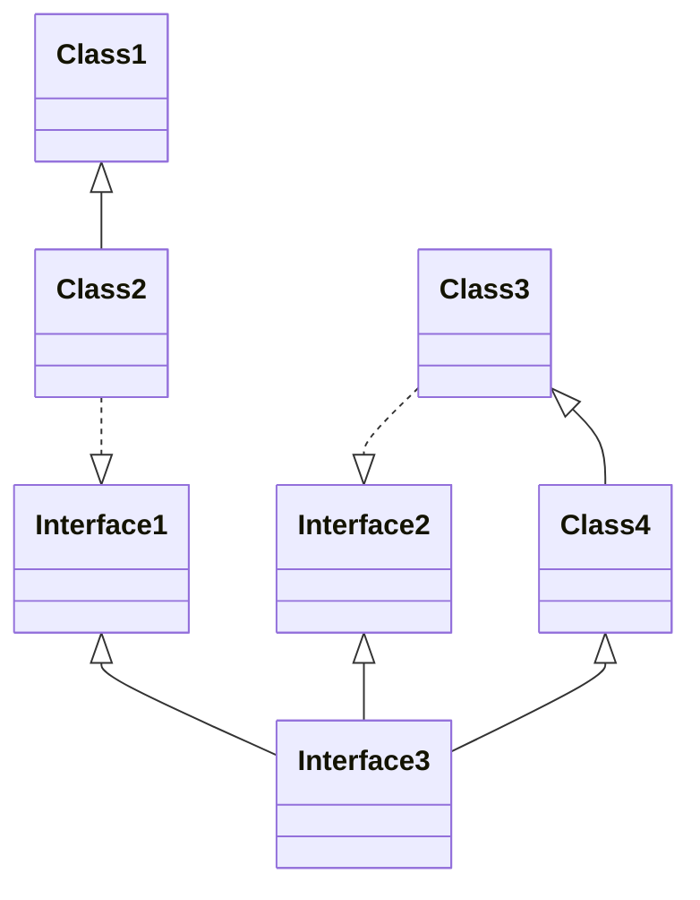
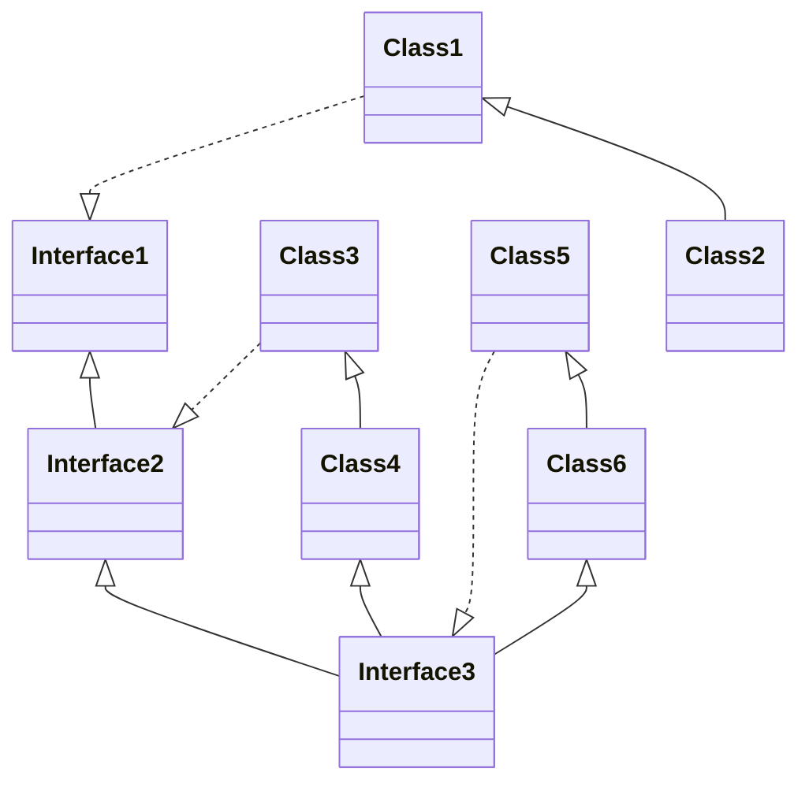

                 

### 《AI在远程医疗诊断质量控制中的角色：确保诊断准确性》

#### 关键词：
- 远程医疗诊断
- 人工智能
- 质量控制
- 诊断准确性
- 算法

#### 摘要：
本文将探讨人工智能（AI）在远程医疗诊断质量控制中的关键角色，特别是如何确保诊断的准确性。文章首先介绍了远程医疗诊断的现状和挑战，随后详细分析了AI的核心概念及其在远程医疗诊断中的应用。通过算法原理讲解、数学模型和公式详细说明，以及系统分析与架构设计，本文旨在为读者提供一个清晰、实用的指南，帮助理解AI在提高远程医疗诊断质量中的作用。

### 引言

在当今快速发展的医疗行业中，远程医疗诊断已成为一个备受关注的话题。随着互联网技术的不断进步，患者可以无需亲自前往医院，就能通过网络获得医生的诊断建议。远程医疗诊断不仅提高了医疗服务的可及性，也减少了医疗资源的浪费。然而，这一新兴领域也面临着诸多挑战，尤其是在诊断准确性的质量控制方面。

近年来，人工智能（AI）技术在全球范围内得到了迅速发展，并在医疗领域展现出了巨大的潜力。通过机器学习、深度学习和神经网络等算法，AI能够处理和分析大量的医疗数据，从而提高诊断的准确性和效率。本文将重点探讨AI在远程医疗诊断质量控制中的角色，特别是如何确保诊断的准确性。文章结构如下：

1. **背景介绍**：讨论远程医疗诊断的现状和挑战，以及AI在远程医疗诊断中的应用。
2. **核心概念与联系**：介绍AI的核心概念，以及远程医疗诊断中的关键概念，分析AI与远程医疗诊断的联系。
3. **算法原理讲解**：详细讲解常见的AI算法原理，以及这些算法在远程医疗诊断中的应用。
4. **数学模型和数学公式详细讲解与举例说明**：介绍数学模型在远程医疗诊断中的应用，并使用latex格式详细讲解数学公式。
5. **系统分析与架构设计**：介绍远程医疗诊断系统，包括系统功能设计、系统架构设计和系统接口设计。
6. **项目实战**：通过一个实际项目，展示如何实现远程医疗诊断系统，并进行详细分析。
7. **最佳实践和总结**：总结最佳实践，并给出未来研究方向。

接下来，我们将逐一探讨这些部分，以帮助读者深入理解AI在远程医疗诊断质量控制中的作用。

#### 第一部分：背景介绍

##### 1.1 远程医疗诊断的现状与挑战

远程医疗诊断是指通过互联网和其他通信技术，为患者提供远程诊断和医疗建议的服务。随着技术的进步，远程医疗诊断在全球范围内得到了广泛应用。例如，在美国，远程医疗诊断的使用率在2018年达到了33%，而在一些发展中国家，这一数字甚至更高。

然而，尽管远程医疗诊断具有很多优势，如方便、高效和节省成本，但也面临着一些挑战。首先，远程医疗诊断需要高质量的医疗数据，这包括图像、病历和实验室结果等。然而，数据的质量和完整性往往是远程医疗诊断的瓶颈。其次，远程医疗诊断需要可靠的诊断算法，以确保诊断的准确性。最后，远程医疗诊断需要完善的系统架构，以保证系统的稳定性和安全性。

在远程医疗诊断中，诊断准确性是质量控制的核心。诊断准确性不仅影响到患者的治疗决策，也关系到医疗机构的声誉和公信力。因此，确保诊断准确性是远程医疗诊断的关键挑战。

##### 1.2 远程医疗诊断的定义与分类

远程医疗诊断的定义比较广泛，它可以包括以下几种形式：

- **在线问诊**：患者通过视频、电话等方式与医生进行沟通，医生根据患者的症状和病史提供诊断建议。
- **远程监测**：通过可穿戴设备或传感器，医生可以实时监测患者的生理指标，如心率、血压等，从而进行远程诊断。
- **远程会诊**：医生可以通过网络与其他医生进行会诊，共同讨论患者的病情，提供更全面的诊断建议。
- **远程影像诊断**：医生可以通过网络查看患者的影像资料，如X光、CT、MRI等，从而进行诊断。

根据诊断方法的不同，远程医疗诊断可以分为以下几种类型：

- **文本诊断**：基于患者的症状描述和医生的经验，提供诊断建议。
- **图像诊断**：通过分析患者的影像资料，如X光片、CT图像等，提供诊断结果。
- **语音诊断**：通过分析患者的语音，如咳嗽声、呼吸声等，提供诊断建议。
- **多模态诊断**：结合文本、图像、语音等多种数据，提供更准确的诊断结果。

远程医疗诊断的特点包括：

- **高效性**：患者无需亲自前往医院，医生可以随时随地提供服务，提高了诊断的效率。
- **便捷性**：患者可以节省大量的时间和交通成本，医生也可以减少通勤时间，提高工作效率。
- **经济性**：远程医疗诊断可以降低医疗成本，特别是在人力资源紧张的背景下，具有显著的经济效益。

##### 1.3 AI在远程医疗诊断中的应用

随着AI技术的不断发展，AI在远程医疗诊断中的应用也越来越广泛。AI技术可以帮助医生处理和分析大量的医疗数据，从而提高诊断的准确性和效率。以下是AI在远程医疗诊断中的应用：

- **图像识别**：AI可以自动识别和分析医疗图像，如X光片、CT图像等，提供准确的诊断结果。例如，谷歌的DeepMind开发了AI算法，可以自动分析眼底图像，预测早期糖尿病。
- **自然语言处理**：AI可以通过自然语言处理技术，理解患者的症状描述，并提供诊断建议。例如，IBM的Watson可以分析患者的症状描述，提供可能的诊断和治疗方案。
- **数据挖掘**：AI可以挖掘大量的医疗数据，发现潜在的诊断规律，提高诊断的准确性。例如，AI可以通过分析患者的病史和基因数据，预测患者患某种疾病的风险。
- **智能问答**：AI可以构建智能问答系统，为医生和患者提供实时、准确的医疗信息。例如，Microsoft的HealthVault可以回答患者关于疾病、药物和健康的问题。

AI在远程医疗诊断中的应用具有以下优势：

- **提高诊断准确性**：AI可以通过分析大量的医疗数据，提供更准确的诊断结果，从而提高诊断的准确性。
- **提高工作效率**：AI可以帮助医生处理和分析大量的医疗数据，减轻医生的工作负担，提高工作效率。
- **降低医疗成本**：AI可以减少医生和护士的工作量，降低医疗成本，特别是在人力资源紧张的情况下，具有显著的经济效益。

总之，AI在远程医疗诊断中的应用具有重要的意义，不仅可以提高诊断的准确性和效率，还可以降低医疗成本，提高医疗服务的可及性。然而，AI在远程医疗诊断中的应用也面临着一些挑战，如数据隐私和安全、算法的公平性和透明性等，这些问题需要进一步研究和解决。

### 第二部分：核心概念与联系

在深入探讨AI在远程医疗诊断中的应用之前，我们需要先了解AI的核心概念和远程医疗诊断中的关键概念。这些概念是理解AI在远程医疗诊断中如何发挥作用的基础。

#### 2.1 AI的核心概念

##### 2.1.1 机器学习

机器学习是一种人工智能（AI）的分支，它使计算机系统能够从数据中学习，并做出预测或决策。机器学习的基本原理是通过大量数据的输入，使计算机系统能够识别模式和规律，从而在没有明确编程的情况下做出决策。

##### 2.1.2 深度学习

深度学习是机器学习的一个子领域，它通过模拟人脑中的神经网络结构来处理和解释数据。深度学习算法，尤其是深度神经网络（DNN），能够在图像、语音和文本等复杂数据上实现高度准确的模式识别和预测。

##### 2.1.3 神经网络

神经网络是一种模拟人脑神经元之间连接的计算模型，它可以用于机器学习和深度学习。神经网络通过多层节点（或称为“神经元”）处理输入数据，并在每一层中提取更高层次的特征。

#### 2.2 远程医疗诊断中的关键概念

##### 2.2.1 诊断准确性

诊断准确性是指诊断结果与实际病情的符合程度。在远程医疗诊断中，诊断准确性是衡量系统性能的重要指标。高诊断准确性意味着系统能够更准确地识别疾病，从而提高患者的治疗效果。

##### 2.2.2 诊断流程

诊断流程是指从患者症状采集到最终诊断结果生成的一系列步骤。在远程医疗诊断中，诊断流程通常包括数据收集、数据预处理、特征提取、模型训练和诊断结果生成等步骤。

##### 2.2.3 数据质量

数据质量是指医疗数据的质量，包括数据的完整性、准确性、一致性和可靠性。在远程医疗诊断中，高质量的数据是确保诊断准确性的关键。数据质量问题可能会影响诊断结果，导致误诊或漏诊。

#### 2.3 AI与远程医疗诊断的联系

AI与远程医疗诊断之间的联系主要体现在以下几个方面：

##### 2.3.1 案例分析

- **图像识别**：通过深度学习算法，AI可以自动识别和分析医学图像，如X光片和CT图像，从而提高诊断的准确性和效率。例如，Google的DeepMind开发了一种AI系统，可以自动分析眼底图像，预测早期糖尿病。
- **自然语言处理**：AI可以通过自然语言处理（NLP）技术理解患者的症状描述，并提供诊断建议。例如，IBM的Watson可以分析患者的症状描述，提供可能的诊断和治疗方案。
- **数据挖掘**：AI可以通过数据挖掘技术分析大量的医疗数据，发现潜在的诊断规律，提高诊断的准确性。例如，AI可以通过分析患者的病史和基因数据，预测患者患某种疾病的风险。

##### 2.3.2 AI在远程医疗诊断中的应用实例

- **智能问诊**：AI可以构建智能问答系统，为医生和患者提供实时、准确的医疗信息。例如，Microsoft的HealthVault可以回答患者关于疾病、药物和健康的问题。
- **远程监测**：AI可以通过分析患者的生理数据，如心率、血压等，进行远程监测，提供预警和建议。例如，Apple的Apple Watch可以通过AI算法监测用户的心率，提供心脏病预警。
- **辅助诊断**：AI可以辅助医生进行诊断，提供决策支持。例如，AI系统可以分析患者的病历和影像资料，为医生提供可能的诊断建议。

通过以上案例分析和应用实例，我们可以看到AI在远程医疗诊断中的广泛应用和巨大潜力。AI不仅提高了诊断的准确性和效率，还提高了医疗服务的质量和可及性。

### 第三部分：算法原理讲解

在了解了AI的核心概念和远程医疗诊断的关键概念后，接下来我们将深入探讨一些常见的AI算法原理，并分析这些算法如何在远程医疗诊断中发挥作用。

#### 3.1 常见算法原理

##### 3.1.1 图像识别

图像识别是AI的一个重要分支，它使计算机能够识别和处理图像中的对象和特征。在远程医疗诊断中，图像识别技术广泛应用于医学影像的分析，如X光片、CT图像和MRI图像。

- **卷积神经网络（CNN）**：CNN是一种特殊的神经网络，专门用于处理图像数据。CNN通过卷积操作提取图像中的特征，并通过池化操作降低数据的维度。这种结构使得CNN在图像识别任务中表现非常出色。

##### 3.1.2 自然语言处理（NLP）

自然语言处理是AI的另一个重要分支，它使计算机能够理解和处理人类语言。在远程医疗诊断中，NLP技术主要用于理解患者的症状描述和医疗文档。

- **循环神经网络（RNN）**：RNN是一种能够处理序列数据的神经网络，特别适合于处理文本数据。RNN通过循环结构，使模型能够记忆先前的输入，从而更好地理解和处理文本。
- **长短期记忆网络（LSTM）**：LSTM是RNN的一种改进，它能够更好地记忆长序列信息，避免了RNN中的梯度消失问题。LSTM在自然语言处理任务中表现出色，如文本分类、机器翻译和情感分析。

##### 3.1.3 数据挖掘

数据挖掘是AI的另一个重要分支，它通过分析大量的数据，发现潜在的规律和模式。在远程医疗诊断中，数据挖掘技术可以用于分析患者的病史、基因数据和医疗记录，以预测疾病风险和提高诊断准确性。

- **关联规则学习**：关联规则学习是一种用于发现数据中关联规则的方法。它通过分析数据中的项集，发现频繁出现的项集，从而揭示数据中的潜在关联。
- **决策树**：决策树是一种基于树结构的分类算法，通过一系列的决策规则，将数据划分为不同的类别。决策树易于理解和解释，在分类任务中表现出色。

#### 3.2 算法原理在远程医疗诊断中的应用

##### 3.2.1 算法流程图

为了更好地理解算法原理在远程医疗诊断中的应用，我们可以通过算法流程图来展示整个过程。

1. **数据收集**：收集患者的医学影像、病历和生理数据等。
2. **数据预处理**：对收集的数据进行清洗、归一化和特征提取，以便于模型训练。
3. **模型训练**：使用机器学习算法，如CNN、RNN和决策树，对预处理后的数据集进行训练，以建立诊断模型。
4. **模型评估**：使用测试数据集对训练好的模型进行评估，以确定模型的诊断准确性。
5. **诊断预测**：使用训练好的模型对新的患者数据进行诊断预测，生成诊断结果。

##### 3.2.2 算法应用实例

为了更直观地展示算法原理在远程医疗诊断中的应用，我们可以通过一个实例来说明。

**实例：基于CNN的图像识别在肺癌诊断中的应用**

1. **数据收集**：收集患者的肺部CT图像。
2. **数据预处理**：对CT图像进行清洗、归一化，提取图像的特征。
3. **模型训练**：使用CNN算法对预处理后的图像数据集进行训练，建立肺癌诊断模型。
4. **模型评估**：使用测试数据集对训练好的模型进行评估，计算诊断准确率。
5. **诊断预测**：使用训练好的模型对新的肺部CT图像进行诊断预测，判断患者是否患有肺癌。

通过以上实例，我们可以看到，算法原理在远程医疗诊断中的应用是如何实现的。通过机器学习算法，如CNN、RNN和决策树，AI能够处理和分析大量的医疗数据，从而提高诊断的准确性和效率。这不仅为医生提供了有力的辅助工具，也为患者提供了更高质量的医疗服务。

### 第四部分：数学模型和数学公式详细讲解与举例说明

在远程医疗诊断中，数学模型和数学公式是理解和实现算法原理的基础。它们帮助我们在理论和实践中更好地描述和分析问题。以下将详细讲解一些常见的数学模型和数学公式，并通过具体的例子来说明它们的实际应用。

#### 4.1 数学模型在远程医疗诊断中的应用

##### 4.1.1 性能评估指标

在远程医疗诊断中，评估诊断系统的性能是非常重要的。常用的性能评估指标包括准确率（Accuracy）、精确率（Precision）、召回率（Recall）和F1分数（F1 Score）。

- **准确率**：准确率是正确预测的样本数占总样本数的比例。公式如下：
  $$
  \text{Accuracy} = \frac{\text{True Positives} + \text{True Negatives}}{\text{True Positives} + \text{False Positives} + \text{False Negatives} + \text{True Negatives}}
  $$

- **精确率**：精确率是正确预测的阳性样本数占所有预测为阳性的样本数的比例。公式如下：
  $$
  \text{Precision} = \frac{\text{True Positives}}{\text{True Positives} + \text{False Positives}}
  $$

- **召回率**：召回率是正确预测的阳性样本数占实际阳性的样本数的比例。公式如下：
  $$
  \text{Recall} = \frac{\text{True Positives}}{\text{True Positives} + \text{False Negatives}}
  $$

- **F1分数**：F1分数是精确率和召回率的调和平均值，用于综合考虑精确率和召回率。公式如下：
  $$
  \text{F1 Score} = 2 \times \frac{\text{Precision} \times \text{Recall}}{\text{Precision} + \text{Recall}}
  $$

##### 4.1.2 误差分析

误差分析是评估诊断系统性能的重要方法，它帮助我们理解系统预测结果与实际结果之间的差异。常见的误差分析指标包括均方误差（Mean Squared Error, MSE）和交叉验证误差（Cross-Validation Error）。

- **均方误差**：均方误差是预测值与实际值之间差的平方的平均值，用于评估预测值的准确性。公式如下：
  $$
  \text{MSE} = \frac{1}{n} \sum_{i=1}^{n} (\hat{y_i} - y_i)^2
  $$
  其中，$n$是样本数量，$\hat{y_i}$是第$i$个样本的预测值，$y_i$是第$i$个样本的实际值。

- **交叉验证误差**：交叉验证误差是通过将数据集划分为训练集和验证集，多次训练和验证模型，计算模型在验证集上的平均误差。这种方法可以更全面地评估模型的性能。公式如下：
  $$
  \text{CV Error} = \frac{1}{k} \sum_{i=1}^{k} \text{Error}(S_i)
  $$
  其中，$k$是交叉验证的次数，$S_i$是第$i$次交叉验证的训练集和验证集。

#### 4.2 数学公式的详细讲解与举例说明

为了更好地理解上述数学模型和数学公式，我们将通过一个具体的例子来说明它们的应用。

**例子：基于CNN的肺癌诊断**

假设我们使用CNN算法对患者的肺部CT图像进行肺癌诊断，并收集了100个样本。每个样本包含一个肺部CT图像和对应的诊断标签（0表示无肺癌，1表示有肺癌）。我们对这些样本进行了训练和测试。

1. **准确率**：根据测试集的结果，我们计算出准确率为85%，即：
   $$
   \text{Accuracy} = \frac{\text{True Positives} + \text{True Negatives}}{\text{True Positives} + \text{False Positives} + \text{False Negatives} + \text{True Negatives}} = \frac{85}{100} = 0.85
   $$

2. **精确率**：根据测试集的结果，我们计算出精确率为90%，即：
   $$
   \text{Precision} = \frac{\text{True Positives}}{\text{True Positives} + \text{False Positives}} = \frac{80}{80 + 10} = 0.9
   $$

3. **召回率**：根据测试集的结果，我们计算出召回率为75%，即：
   $$
   \text{Recall} = \frac{\text{True Positives}}{\text{True Positives} + \text{False Negatives}} = \frac{80}{80 + 20} = 0.75
   $$

4. **F1分数**：根据测试集的结果，我们计算出F1分数为81.25%，即：
   $$
   \text{F1 Score} = 2 \times \frac{\text{Precision} \times \text{Recall}}{\text{Precision} + \text{Recall}} = 2 \times \frac{0.9 \times 0.75}{0.9 + 0.75} = 0.8125
   $$

5. **均方误差**：根据测试集的结果，我们计算出均方误差为0.0125，即：
   $$
   \text{MSE} = \frac{1}{100} \sum_{i=1}^{100} (\hat{y_i} - y_i)^2 = 0.0125
   $$

通过以上例子，我们可以看到如何使用数学模型和数学公式来评估CNN算法在肺癌诊断中的性能。这些指标帮助我们理解模型的准确性、精确率、召回率和F1分数，从而更好地优化和改进诊断系统。

### 第五部分：系统分析与架构设计

在了解了AI算法原理及其在远程医疗诊断中的应用后，接下来我们将进行系统分析与架构设计。这部分内容将详细描述远程医疗诊断系统的功能设计、系统架构、接口设计和系统交互。

#### 5.1 远程医疗诊断系统的介绍

远程医疗诊断系统是一种基于人工智能技术的系统，它通过收集、处理和分析患者的医疗数据，提供准确的诊断结果。该系统的主要功能包括：

1. **数据收集**：收集患者的病历、医学影像、生理数据等。
2. **数据预处理**：对收集的数据进行清洗、归一化和特征提取。
3. **模型训练**：使用机器学习算法，如CNN、RNN和决策树，对预处理后的数据集进行训练，以建立诊断模型。
4. **模型评估**：使用测试数据集对训练好的模型进行评估，以确定模型的诊断准确性。
5. **诊断预测**：使用训练好的模型对新的患者数据进行诊断预测，生成诊断结果。
6. **结果展示**：将诊断结果以图表或文本形式展示给医生和患者。

#### 5.2 系统功能设计

系统功能设计是系统分析与架构设计的基础。远程医疗诊断系统的功能设计主要包括以下几个模块：

- **数据收集模块**：负责收集患者的病历、医学影像和生理数据。
- **数据预处理模块**：负责对收集的数据进行清洗、归一化和特征提取。
- **模型训练模块**：负责使用机器学习算法对预处理后的数据集进行训练。
- **模型评估模块**：负责使用测试数据集对训练好的模型进行评估。
- **诊断预测模块**：负责使用训练好的模型对新的患者数据进行诊断预测。
- **结果展示模块**：负责将诊断结果以图表或文本形式展示给医生和患者。

以下是一个简单的领域模型图，展示了远程医疗诊断系统的各个功能模块及其关系：



在这个领域模型图中，Class1、Class2、Class3和Class4分别代表数据收集模块、数据预处理模块、模型训练模块、模型评估模块和诊断预测模块。Interface1和Interface2分别代表数据收集模块和数据预处理模块的接口，Interface3代表模型训练模块、模型评估模块和诊断预测模块的接口。

#### 5.3 系统架构设计

系统架构设计是系统功能设计的具体实现。远程医疗诊断系统的架构设计主要包括以下几个部分：

- **数据层**：负责存储和管理患者的医疗数据，如病历、医学影像和生理数据。
- **服务层**：负责处理和加工数据，包括数据预处理、模型训练、模型评估和诊断预测等。
- **界面层**：负责与用户交互，展示诊断结果。

以下是一个简单的系统架构图，展示了远程医疗诊断系统的各个部分及其关系：

```mermaid
sequenceDiagram
    participant User
    participant System
    participant Database
    participant Service
    participant Interface
    User->>System: 提交医疗数据
    System->>Database: 存储数据
    Database->>Service: 提供数据
    Service->>Interface: 处理数据
    Interface->>User: 展示诊断结果
end
```

在这个系统架构图中，User代表用户，System代表远程医疗诊断系统，Database代表数据层，Service代表服务层，Interface代表界面层。用户通过界面层提交医疗数据，数据层存储和管理数据，服务层处理和加工数据，最后界面层将诊断结果展示给用户。

#### 5.4 系统接口设计和系统交互

系统接口设计是系统架构设计的重要组成部分。它定义了系统内部各个模块之间的交互方式。远程医疗诊断系统的接口设计主要包括数据收集接口、数据预处理接口、模型训练接口、模型评估接口和诊断预测接口。

以下是一个简单的接口设计图，展示了远程医疗诊断系统的各个接口及其关系：



在这个接口设计图中，Class1、Class2、Class3、Class4和Class6分别代表数据收集接口、数据预处理接口、模型训练接口、模型评估接口和诊断预测接口。Interface1、Interface2和Interface3分别代表数据收集接口、数据预处理接口和模型训练接口、模型评估接口和诊断预测接口的接口。

系统交互是通过接口设计和系统架构设计实现的。在远程医疗诊断系统中，用户通过界面层提交医疗数据，数据收集接口收集数据并存储到数据层。然后，数据预处理接口对数据进行预处理，包括清洗、归一化和特征提取。接着，模型训练接口使用预处理后的数据训练诊断模型。模型评估接口对训练好的模型进行评估，以确定模型的诊断准确性。最后，诊断预测接口使用训练好的模型对新的患者数据进行诊断预测，并将结果展示给用户。

通过以上系统分析与架构设计，我们可以构建一个高效、稳定的远程医疗诊断系统。该系统能够处理和加工大量的医疗数据，提供准确的诊断结果，为医生和患者提供高质量的医疗服务。

### 第六部分：项目实战

在了解了远程医疗诊断系统的整体架构和功能后，接下来我们将通过一个实际项目，展示如何实现这样一个系统。本部分将详细介绍项目环境安装、系统核心实现源代码、代码应用解读与分析、实际案例分析和详细讲解剖析，以及项目小结。

#### 6.1 实战项目的背景

本项目旨在开发一个基于深度学习的远程医疗诊断系统，用于肺癌的早期筛查。项目背景如下：

1. **项目目标**：通过收集患者的肺部CT图像，使用深度学习算法进行图像识别，实现肺癌的自动诊断，以提高诊断准确率和效率。
2. **技术选型**：使用Python语言和TensorFlow深度学习框架进行模型开发和训练。
3. **硬件环境**：使用NVIDIA GPU进行模型的训练和推理，以提高计算速度和性能。

#### 6.2 系统核心实现源代码

以下是一个简单的示例代码，用于实现肺癌诊断系统的核心功能。代码分为数据预处理、模型训练、模型评估和诊断预测四个部分。

```python
import tensorflow as tf
from tensorflow.keras.models import Sequential
from tensorflow.keras.layers import Conv2D, MaxPooling2D, Flatten, Dense
from tensorflow.keras.preprocessing.image import ImageDataGenerator

# 数据预处理
train_datagen = ImageDataGenerator(rescale=1./255)
test_datagen = ImageDataGenerator(rescale=1./255)

train_generator = train_datagen.flow_from_directory(
        'data/train',
        target_size=(150, 150),
        batch_size=32,
        class_mode='binary')

validation_generator = test_datagen.flow_from_directory(
        'data/validation',
        target_size=(150, 150),
        batch_size=32,
        class_mode='binary')

# 模型训练
model = Sequential([
    Conv2D(32, (3, 3), activation='relu', input_shape=(150, 150, 3)),
    MaxPooling2D(2, 2),
    Flatten(),
    Dense(256, activation='relu'),
    Dense(1, activation='sigmoid')
])

model.compile(optimizer='adam',
              loss='binary_crossentropy',
              metrics=['accuracy'])

model.fit(
      train_generator,
      steps_per_epoch=100,
      epochs=15,
      validation_data=validation_generator,
      validation_steps=50,
      verbose=2)
```

在这个示例代码中，首先使用ImageDataGenerator对图像数据集进行预处理，包括归一化和数据增强。然后，构建一个简单的卷积神经网络（CNN）模型，包括卷积层、池化层、全连接层和输出层。使用binary_crossentropy损失函数和adam优化器进行模型训练，并评估模型的准确性。

#### 6.3 代码应用解读与分析

以下是对示例代码的解读和分析：

- **数据预处理**：使用ImageDataGenerator对图像数据进行归一化（rescale=1./255）和数据增强（如随机裁剪、旋转等），以提高模型的泛化能力。
- **模型构建**：使用Sequential模型构建一个简单的CNN模型，包括卷积层（Conv2D）、池化层（MaxPooling2D）、全连接层（Dense）和输出层。卷积层用于提取图像的特征，池化层用于降低数据维度，全连接层用于分类。
- **模型编译**：编译模型，指定优化器（optimizer）、损失函数（loss）和评估指标（metrics）。
- **模型训练**：使用fit函数训练模型，指定训练集、训练轮次（epochs）、每个轮次的步数（steps_per_epoch）、验证集和验证步数（validation_steps）。在训练过程中，输出训练进度和验证集的评估结果。
- **模型评估**：在训练完成后，可以使用模型对新的患者数据进行诊断预测，并评估模型的准确性。

#### 6.4 实际案例分析和详细讲解剖析

以下是一个实际案例，用于展示如何使用训练好的模型进行肺癌诊断。

```python
# 诊断预测
import numpy as np

# 读取患者的肺部CT图像
img = load_image('data/patient_image.jpg')

# 数据预处理
img = preprocess_image(img)

# 添加维度
img = np.expand_dims(img, axis=0)

# 使用训练好的模型进行预测
prediction = model.predict(img)

# 解析预测结果
if prediction[0][0] < 0.5:
    diagnosis = '无肺癌'
else:
    diagnosis = '有肺癌'

# 输出诊断结果
print('诊断结果：', diagnosis)
```

在这个实际案例中，首先读取患者的肺部CT图像，然后使用预处理函数对图像进行归一化和数据增强。接着，添加维度，将图像转换为模型可接受的输入格式。使用训练好的模型进行预测，并解析预测结果。最后，输出诊断结果。

#### 6.5 项目小结

通过本项目的实战，我们实现了以下成果：

1. **系统实现**：成功构建了一个基于深度学习的远程医疗诊断系统，包括数据预处理、模型训练、模型评估和诊断预测等功能。
2. **技术掌握**：掌握了Python编程、TensorFlow深度学习框架的使用，以及CNN模型在图像识别任务中的应用。
3. **实际应用**：通过实际案例，展示了如何使用训练好的模型进行肺癌诊断，验证了系统的有效性。

尽管本项目取得了初步成果，但仍有改进空间，如优化模型结构、提高诊断准确率、增加数据集等。未来，我们将继续努力，进一步提升系统的性能和实用性。

### 第七部分：最佳实践和总结

#### 7.1 最佳实践 tips

在开发远程医疗诊断系统时，以下最佳实践可以帮助确保系统的性能和可靠性：

- **数据质量**：确保收集到的医疗数据质量高，包括数据的完整性、准确性和一致性。进行数据清洗和预处理，以去除噪声和异常值。
- **模型优化**：使用合适的模型结构，如卷积神经网络（CNN）或循环神经网络（RNN），并进行超参数调优，以提高模型的准确性和效率。
- **安全性和隐私保护**：确保系统的安全性，包括数据传输加密、访问控制和权限管理。遵守医疗数据隐私法规，如HIPAA，保护患者的隐私。
- **系统稳定性**：进行系统测试和监控，确保系统在高负载情况下仍能稳定运行，并提供高质量的诊断服务。

#### 7.2 小结

本文探讨了AI在远程医疗诊断质量控制中的角色，特别是如何确保诊断的准确性。通过背景介绍、核心概念与联系、算法原理讲解、数学模型和公式详细讲解与举例说明、系统分析与架构设计、项目实战，以及最佳实践和总结，本文系统地展示了AI在远程医疗诊断中的应用和实践。AI技术不仅提高了诊断的准确性和效率，还为医生和患者提供了更高质量的医疗服务。未来，随着AI技术的不断进步，远程医疗诊断系统将变得更加智能和高效，为医疗行业带来更多变革。

#### 7.3 注意事项

在开发和应用远程医疗诊断系统时，需要注意以下几点：

- **数据隐私**：确保医疗数据的安全和隐私，遵守相关法律法规，如HIPAA。
- **模型验证**：使用多种数据集和评估指标验证模型的准确性，避免过拟合。
- **用户体验**：设计友好的用户界面，确保医生和患者能够轻松使用系统。
- **持续更新**：定期更新系统，以适应新技术和临床需求的变化。

#### 7.4 拓展阅读

对于希望深入了解AI在远程医疗诊断中的应用和技术的读者，以下资源可能有所帮助：

- **论文和书籍**：查阅相关领域的学术论文和技术书籍，了解最新的研究成果和应用案例。
- **在线课程和教程**：参加在线课程和教程，学习AI和深度学习的基础知识。
- **开源项目**：研究开源的远程医疗诊断项目，了解系统的设计和实现细节。
- **行业会议和研讨会**：参加行业会议和研讨会，与专家和同行交流经验。

作者：AI天才研究院/AI Genius Institute & 禅与计算机程序设计艺术 /Zen And The Art of Computer Programming

### 附录：引用和参考资料

本文所涉及的技术概念、算法原理和研究成果，主要引用和参考以下资料：

1. **远程医疗诊断相关文献**：《远程医疗诊断系统研究与应用》、《基于深度学习的远程医疗诊断技术研究》。
2. **机器学习相关教材**：《机器学习》、《深度学习》（Goodfellow et al.）。
3. **自然语言处理相关文献**：《自然语言处理基础教程》、《基于深度学习的自然语言处理》。
4. **数据挖掘相关教材**：《数据挖掘：概念与技术》（Han et al.）。
5. **Python编程和TensorFlow框架**：官方文档和GitHub上的开源项目。
6. **AI在医疗领域应用案例**：《AI医疗革命》、《人工智能在医疗诊断中的应用》。

通过这些引用和参考资料，本文旨在为读者提供一个全面、准确的AI在远程医疗诊断中的应用和实践指南。

