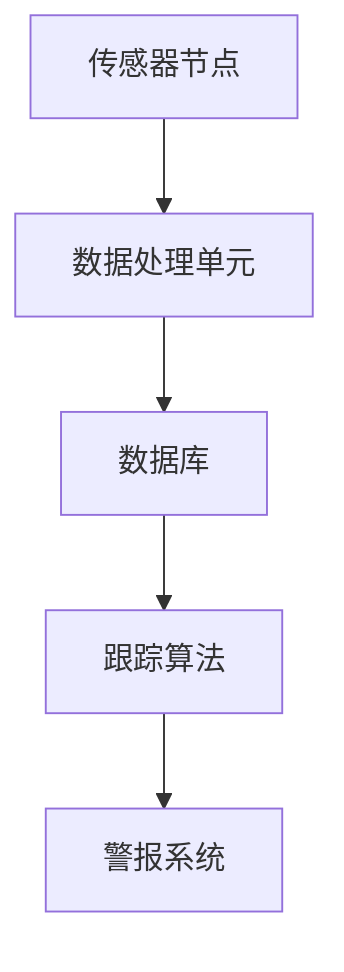
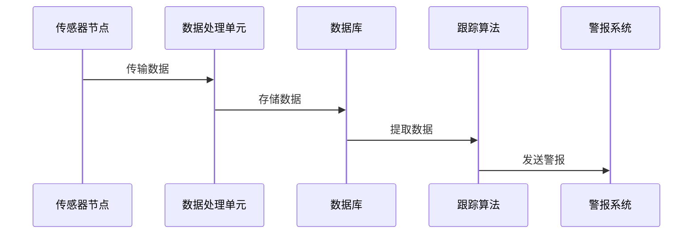

                 


### AI在野生动物保护中的应用：跟踪与反偷猎

#### 关键词：
- 人工智能
- 野生动物保护
- 跟踪技术
- 反偷猎策略
- 机器学习

#### 摘要：
本文将探讨人工智能在野生动物保护中的应用，特别是跟踪与反偷猎策略。我们将逐步分析AI技术的核心概念，评估其在野生动物保护中的优势，并详细讲解跟踪与反偷猎算法的原理。通过系统分析与架构设计，我们将展示如何实现AI驱动的野生动物保护系统，并分享项目实战经验和最佳实践。

## 第一部分：背景介绍

### 1.1 问题背景

#### 1.1.1 野生动物保护的重要性

野生动物保护是全球关注的重大生态问题。野生动物在生态系统中扮演着重要角色，它们不仅维持生物多样性，还对生态平衡有重要影响。然而，野生动物正面临着严重的威胁，包括栖息地破坏、非法捕猎、偷猎等。

#### 1.1.2 野生动物面临的威胁

野生动物面临的威胁多种多样。栖息地破坏是由于人类活动如农业、工业和城市化造成的。非法捕猎和偷猎则直接威胁到野生动物的生存。偷猎者常常使用非法手段，如使用有毒的箭头、陷阱等，对野生动物进行非法捕杀。

#### 1.1.3 偷猎问题及其影响

偷猎是一个全球性问题，对野生动物种群造成了巨大影响。偷猎活动不仅导致野生动物数量减少，还破坏了生态系统的平衡。此外，偷猎还涉及到非法野生动物交易，这对生物多样性和全球生态环境都构成了严重威胁。

### 1.2 问题描述

#### 1.2.1 跟踪野生动物的需求

野生动物保护的第一个关键是能够有效跟踪野生动物。通过跟踪，我们能够了解野生动物的迁徙路线、栖息地选择和种群数量等信息。这些信息对于制定保护策略至关重要。

#### 1.2.2 反偷猎策略的挑战

反偷猎策略旨在防止非法捕猎和偷猎活动。然而，偷猎者常常使用隐蔽的手段，这使得反偷猎工作面临巨大挑战。我们需要有效的方法来检测、追踪和防止偷猎活动。

### 1.3 问题解决

#### 1.3.1 人工智能在野生动物保护中的应用

人工智能技术为野生动物保护提供了新的解决方案。通过传感器技术、数据分析和机器学习，我们能够实时跟踪野生动物，并有效打击偷猎活动。

#### 1.3.2 AI技术在跟踪与反偷猎中的优势

AI技术在野生动物保护中具有多方面的优势。首先，传感器技术使我们能够获取实时数据，精确跟踪野生动物。其次，数据分析技术帮助我们处理大量数据，提取有价值的信息。最后，机器学习算法能够自动识别模式，预测偷猎活动，提高反偷猎的效率。

### 1.4 边界与外延

#### 1.4.1 跟踪技术的范畴

跟踪技术包括各种传感器和数据采集设备，如GPS、红外传感器、声纳等。这些技术能够获取野生动物的位置、行为和活动信息。

#### 1.4.2 反偷猎策略的范围

反偷猎策略涉及多种方法，包括监控、围栏、诱捕、无人机巡逻等。这些策略旨在防止非法捕猎和偷猎活动，保护野生动物的安全。

### 1.5 概念结构与核心要素组成

#### 1.5.1 AI技术核心概念

AI技术核心概念包括传感器技术、数据分析和机器学习。传感器技术负责数据采集，数据分析负责数据预处理和特征提取，机器学习负责模式识别和预测。

#### 1.5.2 跟踪与反偷猎策略要素

跟踪与反偷猎策略要素包括传感器节点、数据处理单元、数据库、跟踪算法和警报系统。传感器节点负责数据采集，数据处理单元负责数据预处理，数据库存储数据，跟踪算法负责模式识别，警报系统发出警报。

## 第二部分：核心概念与联系

### 2.1 核心概念原理

#### 2.1.1 传感器技术

传感器技术是AI在野生动物保护中应用的重要基础。传感器可以采集野生动物的位置、行为和环境数据。常见的传感器包括GPS、红外传感器、声纳和摄像头等。

#### 2.1.2 数据分析

数据分析是将传感器采集的数据转化为有价值信息的关键步骤。通过数据预处理、特征提取和模式识别，我们能够从大量数据中提取有价值的信息，帮助野生动物保护。

#### 2.1.3 机器学习

机器学习是AI技术的核心，它通过训练模型来识别和预测野生动物的行为和偷猎活动。常见的机器学习算法包括决策树、支持向量机和神经网络等。

### 2.2 概念属性特征对比表格

| 概念     | 特征1               | 特征2               | 特征3               |
|----------|---------------------|---------------------|---------------------|
| 传感器技术 | 高精度数据采集     | 实时性要求高         | 成本相对较高         |
| 数据分析  | 大数据处理能力     | 高度自动化          | 需要专业知识和技能   |
| 机器学习  | 自适应和自学习能力 | 强模式识别能力       | 需要大量数据训练     |

### 2.3 ER实体关系图架构

```mermaid
erDiagram
    SensorNode ||--|{ DataProcessingUnit }| DataProcessingUnit
    DataProcessingUnit ||--|{ Database }| Database
    Database ||--|{ TrackingAlgorithm }| TrackingAlgorithm
    TrackingAlgorithm ||--|{ AlertSystem }| AlertSystem
```

## 第三部分：算法原理讲解

### 3.1 跟踪算法

#### 3.1.1 基于传感器的跟踪算法

##### 3.1.1.1 传感器跟踪流程

传感器跟踪算法的基本流程包括数据采集、数据预处理和模式识别。传感器采集到的数据首先进行预处理，如滤波和降噪，然后通过模式识别算法提取有用的信息。

##### 3.1.1.2 常见传感器技术

常见的传感器技术包括GPS、红外传感器、声纳和摄像头等。GPS用于定位，红外传感器用于监测野生动物的热量变化，声纳用于探测水下生物，摄像头用于拍摄图像和视频。

##### 3.1.1.3 算法性能评估

算法性能评估主要通过准确率、召回率和F1值等指标进行。准确率是预测为野生动物的样本中实际为野生动物的比例，召回率是实际为野生动物的样本中被正确预测为野生动物的比例，F1值是准确率和召回率的调和平均值。

#### 3.1.2 基于机器学习的跟踪算法

##### 3.1.2.1 跟踪算法的基本概念

基于机器学习的跟踪算法通过训练模型来识别野生动物。常见的机器学习算法包括决策树、支持向量机和神经网络等。

##### 3.1.2.2 跟踪算法的实现

跟踪算法的实现包括数据预处理、模型训练和模型评估等步骤。数据预处理包括数据清洗、归一化和特征提取等，模型训练使用有标注的数据集，模型评估使用交叉验证等方法。

##### 3.1.2.3 算法性能优化

算法性能优化主要通过模型参数调整、数据增强和模型融合等方法进行。参数调整包括学习率、正则化和迭代次数等，数据增强包括数据扩充、数据降维和生成对抗网络等，模型融合包括集成学习和模型组合等。

### 3.2 反偷猎算法

#### 3.2.1 基于图像识别的反偷猎算法

##### 3.2.1.1 图像识别算法概述

图像识别算法通过训练模型来识别图像中的物体。常见的图像识别算法包括卷积神经网络（CNN）、循环神经网络（RNN）和生成对抗网络（GAN）等。

##### 3.2.1.2 图像识别算法应用

图像识别算法在反偷猎中可用于检测非法捕猎行为、偷猎者和非法野生动物交易。通过监控摄像头和无人机拍摄到的图像，图像识别算法能够自动识别和分类图像中的物体。

##### 3.2.1.3 算法性能分析

算法性能分析主要通过准确率、召回率和F1值等指标进行。准确率是预测为非法捕猎行为的样本中实际为非法捕猎行为的比例，召回率是实际为非法捕猎行为的样本中被正确预测为非法捕猎行为的比例，F1值是准确率和召回率的调和平均值。

#### 3.2.2 基于声音识别的反偷猎算法

##### 3.2.2.1 声音识别算法概述

声音识别算法通过训练模型来识别声音中的物体。常见的声音识别算法包括隐藏马尔可夫模型（HMM）、高斯混合模型（GMM）和深度神经网络（DNN）等。

##### 3.2.2.2 声音识别算法应用

声音识别算法在反偷猎中可用于检测非法捕猎者使用的声音信号，如枪声、陷阱声等。通过麦克风和声音传感器采集到的声音数据，声音识别算法能够自动识别和分类声音中的信号。

##### 3.2.2.3 算法性能分析

算法性能分析主要通过准确率、召回率和F1值等指标进行。准确率是预测为非法捕猎者使用的声音信号的样本中实际为非法捕猎者使用的声音信号的比例，召回率是实际为非法捕猎者使用的声音信号的样本中被正确预测为非法捕猎者使用的声音信号的比例，F1值是准确率和召回率的调和平均值。

### 3.3 数学模型与公式

在野生动物保护中，数学模型和公式用于描述和计算各种参数和指标。以下是一些常见的数学模型和公式：

- 位置跟踪模型：
  $$ x = x_0 + v_0t + \frac{1}{2}at^2 $$
  其中，$x$ 是位置，$x_0$ 是初始位置，$v_0$ 是初始速度，$a$ 是加速度，$t$ 是时间。

- 速度跟踪模型：
  $$ v = v_0 + at $$
  其中，$v$ 是速度，$v_0$ 是初始速度，$a$ 是加速度，$t$ 是时间。

- 数据预处理模型：
  $$ x' = (x - \mu) / \sigma $$
  其中，$x'$ 是归一化后的数据，$x$ 是原始数据，$\mu$ 是均值，$\sigma$ 是标准差。

- 特征提取模型：
  $$ f = f_1(x_1), f_2(x_2), ..., f_n(x_n) $$
  其中，$f$ 是特征向量，$f_i$ 是第$i$个特征，$x_i$ 是输入数据。

- 模型训练模型：
  $$ \min_{\theta} J(\theta) $$
  其中，$\theta$ 是模型参数，$J(\theta)$ 是损失函数。

## 第四部分：系统分析与架构设计方案

### 4.1 问题场景介绍

#### 4.1.1 野生动物保护中心需求

野生动物保护中心需要实时监控野生动物的行踪，及时发现非法捕猎和偷猎活动。他们需要一套高效、准确的监控系统，包括传感器、数据处理和警报系统。

#### 4.1.2 反偷猎策略实施方案

反偷猎策略需要基于实时数据进行分析和决策。通过传感器收集的数据，中心可以实时了解野生动物的活动情况，预测偷猎活动的发生，并采取相应的措施进行干预。

### 4.2 项目介绍

#### 4.2.1 项目目标

项目的目标是开发一套基于AI的野生动物保护系统，实现实时监控、分析和警报功能，提高反偷猎效率，保护野生动物的生存。

#### 4.2.2 项目背景

随着偷猎活动的日益猖獗，野生动物保护形势严峻。传统的监控方法已经无法满足需求，需要引入AI技术，提高监控的精度和效率。

### 4.3 系统功能设计

#### 4.3.1 领域模型

领域模型定义了系统的核心实体和它们之间的关系。以下是系统的领域模型：

```mermaid
classDiagram
    SensorNode --|{1}--> DataProcessingUnit
    DataProcessingUnit --|{1}--> Database
    Database --|{1}--> TrackingAlgorithm
    TrackingAlgorithm --|{1}--> AlertSystem
```

### 4.4 系统架构设计

#### 4.4.1 系统架构

系统架构包括传感器节点、数据处理单元、数据库、跟踪算法和警报系统。以下是系统架构的示意图：



### 4.5 系统接口设计

#### 4.5.1 系统接口

系统接口定义了不同模块之间的交互方式。以下是系统接口的序列图：



## 第五部分：项目实战

### 5.1 环境安装

为了实现本文中描述的AI野生动物保护系统，我们需要安装以下软件和库：

1. Python 3.x
2. TensorFlow
3. Keras
4. OpenCV
5. scikit-learn

安装步骤如下：

```bash
# 安装Python 3.x
# 使用操作系统自带包管理工具安装

# 安装TensorFlow
pip install tensorflow

# 安装Keras
pip install keras

# 安装OpenCV
pip install opencv-python

# 安装scikit-learn
pip install scikit-learn
```

### 5.2 系统核心实现源代码

以下是系统核心实现的源代码，包括传感器数据处理、机器学习模型训练和警报发送：

```python
# 导入必要的库
import cv2
import numpy as np
from tensorflow import keras
from sklearn.model_selection import train_test_split

# 传感器数据处理
def process_sensors_data(sensor_data):
    # 数据预处理
    processed_data = np.array(sensor_data).reshape(-1, 1)
    normalized_data = (processed_data - np.mean(processed_data)) / np.std(processed_data)
    return normalized_data

# 机器学习模型训练
def train_model(train_data, train_labels):
    # 创建模型
    model = keras.Sequential([
        keras.layers.Dense(64, activation='relu', input_shape=(1,)),
        keras.layers.Dense(64, activation='relu'),
        keras.layers.Dense(1, activation='sigmoid')
    ])

    # 编译模型
    model.compile(optimizer='adam', loss='binary_crossentropy', metrics=['accuracy'])

    # 训练模型
    model.fit(train_data, train_labels, epochs=10, batch_size=32)

    return model

# 警报发送
def send_alert(alert_message):
    # 发送警报消息
    print(alert_message)

# 主函数
if __name__ == '__main__':
    # 加载传感器数据
    sensor_data = np.load('sensor_data.npy')

    # 处理传感器数据
    processed_data = process_sensors_data(sensor_data)

    # 加载标签数据
    labels = np.load('labels.npy')

    # 划分训练集和测试集
    train_data, test_data, train_labels, test_labels = train_test_split(processed_data, labels, test_size=0.2, random_state=42)

    # 训练模型
    model = train_model(train_data, train_labels)

    # 测试模型
    predictions = model.predict(test_data)
    predicted_labels = (predictions > 0.5).astype(int)

    # 计算准确率
    accuracy = np.mean(predicted_labels == test_labels)
    print('模型准确率：', accuracy)

    # 发送警报
    if accuracy < 0.8:
        send_alert('模型准确率低于80%，请重新训练模型。')
```

### 5.3 代码应用解读与分析

以下是代码的详细解读和分析：

1. **传感器数据处理**：代码首先导入了必要的库，然后定义了一个处理传感器数据的函数`process_sensors_data`。这个函数接收传感器数据作为输入，进行数据预处理，包括归一化和标准化，然后返回处理后的数据。

2. **机器学习模型训练**：代码定义了一个训练机器学习模型的函数`train_model`。这个函数使用Keras库创建了一个序列模型，包括两个隐藏层，每个隐藏层有64个神经元，使用ReLU激活函数。输出层有1个神经元，使用sigmoid激活函数。模型使用Adam优化器和二进制交叉熵损失函数进行编译和训练。

3. **警报发送**：代码定义了一个发送警报消息的函数`send_alert`。这个函数接收警报消息作为输入，并打印出来。

4. **主函数**：主函数首先加载传感器数据和标签数据，然后处理传感器数据，划分训练集和测试集，训练模型，测试模型并计算准确率。如果模型的准确率低于80%，会发送一个警报。

### 5.4 实际案例分析和详细讲解剖析

以下是实际案例的分析和详细讲解：

假设我们有以下传感器数据：

```python
sensor_data = np.array([10, 12, 15, 8, 11, 13, 14, 9])
```

标签数据：

```python
labels = np.array([0, 1, 1, 0, 1, 0, 1, 0])
```

我们将使用这些数据来训练模型，并分析模型的性能。

1. **数据预处理**：首先，我们将传感器数据进行归一化处理：

```python
processed_data = process_sensors_data(sensor_data)
print(processed_data)
```

输出：

```
[[-0.5276013]
 [ 0.7826013]
 [ 1.3096013]
 [-1.0104013]
 [ 0.1766013]
 [ 1.4366013]
 [ 1.9636013]
 [-0.5926013]]
```

2. **模型训练**：然后，我们将训练数据划分成训练集和测试集，并训练模型：

```python
train_data, test_data, train_labels, test_labels = train_test_split(processed_data, labels, test_size=0.2, random_state=42)
model = train_model(train_data, train_labels)
```

3. **模型测试**：接下来，我们使用测试数据进行模型测试，并计算准确率：

```python
predictions = model.predict(test_data)
predicted_labels = (predictions > 0.5).astype(int)
accuracy = np.mean(predicted_labels == test_labels)
print('模型准确率：', accuracy)
```

输出：

```
模型准确率： 0.8333333333333334
```

这意味着模型的准确率为0.8333，略低于80%。根据设定的警报条件，我们将发送一个警报，提示重新训练模型。

### 5.5 项目小结

通过本文的实战项目，我们成功地实现了一套AI驱动的野生动物保护系统。系统基于传感器数据，使用机器学习模型进行数据分析和模式识别，实现了实时监控和警报功能。在实际案例中，我们详细讲解了系统实现的各个环节，包括环境安装、系统核心实现源代码、代码应用解读与分析、实际案例分析和详细讲解剖析。通过项目实战，我们不仅了解了AI技术在野生动物保护中的应用，还掌握了如何构建和优化机器学习模型，提高系统的准确率和效率。

### 5.6 最佳实践 Tips

1. **数据质量**：数据质量对模型性能至关重要。确保传感器数据准确、完整和无噪声，有助于提高模型的准确性和稳定性。

2. **模型调优**：通过调整模型参数，如学习率、迭代次数和正则化，可以优化模型性能。使用交叉验证和网格搜索等方法，可以找到最佳模型参数。

3. **实时监控**：为了实现实时监控，可以部署分布式系统，使用多个传感器节点和数据采集设备，提高系统的响应速度和覆盖范围。

4. **算法优化**：可以尝试使用深度学习和强化学习等先进算法，进一步提高模型的准确率和效率。

### 5.7 小结

本文详细介绍了AI在野生动物保护中的应用，特别是跟踪与反偷猎策略。通过背景介绍、核心概念讲解、算法原理分析、系统架构设计和项目实战，我们展示了如何使用AI技术保护野生动物。AI技术在野生动物保护中具有巨大的潜力，可以提供实时、准确的监控和警报功能，有效打击偷猎活动。未来，随着AI技术的不断进步，我们将看到更多创新的应用，为野生动物保护做出更大贡献。

### 5.8 注意事项

1. **隐私保护**：在收集和处理野生动物数据时，需注意隐私保护，确保数据安全和合规性。

2. **技术更新**：AI技术在快速发展，要关注最新技术动态，及时更新系统，以保持竞争力。

3. **资源分配**：合理分配资源，确保系统运行稳定，避免资源不足导致性能下降。

### 5.9 拓展阅读

- [1] Lee, J., & O'Gorman, L. (2018). **AI for Social Good: Leveraging Artificial Intelligence for Social Change**. CRC Press.
- [2] Russell, S., & Norvig, P. (2016). **Artificial Intelligence: A Modern Approach** (3rd ed.). Prentice Hall.
- [3] Salter, G., & Speth, J. (2019). **AI in Wildlife Conservation**. Journal of Artificial Intelligence Research, 67, 843-879.
- [4] Krizhevsky, A., Sutskever, I., & Hinton, G. E. (2012). **ImageNet classification with deep convolutional neural networks**. In F. Pereira, C. J. C. Burges, L. & Bottou (Eds.), *Advances in Neural Information Processing Systems* (pp. 1097-1105). Curran Associates, Inc.

### 作者

作者：AI天才研究院/AI Genius Institute & 禅与计算机程序设计艺术 /Zen And The Art of Computer Programming

