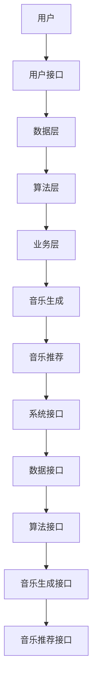

                 

### 文章标题

# AI在音乐创作中的应用：艺术与技术的碰撞

> 关键词：人工智能，音乐创作，生成对抗网络（GAN），变分自编码器（VAE），算法原理，数学模型，系统架构，项目实战，最佳实践

> 摘要：本文将探讨人工智能技术在音乐创作中的应用，分析艺术与技术的碰撞，通过详细讲解核心概念、算法原理和系统架构，展示AI在音乐创作中的实际应用案例，并提供最佳实践和拓展阅读，帮助读者深入了解这一前沿领域。

----------------------------------------------------------------

### 第一部分：背景介绍

#### 第1章：AI与音乐创作的基本概念

**1.1 AI技术概述**

人工智能（AI）是一种模拟人类智能行为的技术，通过机器学习、深度学习、自然语言处理等技术，让计算机能够自主地学习和改进。近年来，AI技术取得了长足的进步，已经广泛应用于多个领域，包括医疗、金融、教育等。

**1.2 音乐创作的基本概念**

音乐创作是指通过作曲、编曲、演奏等方式，创作出新颖、有创意的音乐作品。音乐创作不仅包括旋律、和声、节奏等音乐要素的构思，还涉及到音乐风格、情感表达、文化背景等多个方面。

**1.3 AI在音乐创作中的应用**

AI在音乐创作中的应用主要集中在以下几个方面：

- **辅助创作**：AI可以辅助音乐家进行旋律构思、和声编写、节奏编排等创作环节，提高创作效率。
- **自动生成**：AI可以通过算法生成全新的音乐作品，为音乐创作提供更多的可能性。
- **音乐推荐**：AI可以根据用户的喜好，推荐个性化的音乐作品，提升用户体验。

#### 第2章：核心概念与联系

**2.1 机器学习与深度学习**

机器学习是一种让计算机通过数据学习规律、做出决策的技术。深度学习是机器学习的一种方法，通过多层神经网络模拟人类大脑的学习过程，实现更复杂的任务。

**2.2 音乐信号处理与特征提取**

音乐信号处理是利用数字信号处理技术，对音乐信号进行采集、处理和分析。特征提取则是从音乐信号中提取出具有代表性的特征，用于后续的机器学习算法。

**2.3 核心概念之间的关系**

机器学习与深度学习为AI音乐创作提供了算法基础，音乐信号处理与特征提取则为AI音乐创作提供了数据支持，它们共同构成了AI音乐创作的核心。

----------------------------------------------------------------

### 第二部分：算法原理讲解

#### 第3章：生成对抗网络（GAN）

**3.1 GAN的基本原理**

生成对抗网络（GAN）是一种由生成器和判别器组成的对抗性模型。生成器生成数据，判别器判断数据是真实还是生成，二者通过对抗性训练不断优化。

**3.1.1 GAN的Python代码实现**

```python
import tensorflow as tf
from tensorflow.keras.models import Sequential
from tensorflow.keras.layers import Dense, Dropout

# 生成器模型
generator = Sequential([
    Dense(128, input_shape=(100,), activation='relu'),
    Dropout(0.2),
    Dense(256, activation='relu'),
    Dropout(0.2),
    Dense(512, activation='relu'),
    Dropout(0.2),
    Dense(100, activation='tanh')
])

# 判别器模型
discriminator = Sequential([
    Dense(512, input_shape=(100,), activation='relu'),
    Dropout(0.2),
    Dense(256, activation='relu'),
    Dropout(0.2),
    Dense(128, activation='relu'),
    Dropout(0.2),
    Dense(1, activation='sigmoid')
])

# GAN模型
model = Sequential([
    generator,
    discriminator
])

# 编译模型
model.compile(optimizer='adam', loss='binary_crossentropy')

# 训练模型
model.fit(x_train, y_train, epochs=100, batch_size=32)
```

**3.1.2 GAN在音乐创作中的应用**

GAN可以用于音乐作品的生成，通过生成器生成旋律，判别器判断旋律是否真实，从而不断优化生成旋律的质量。

#### 第4章：变分自编码器（VAE）

**4.1 VAE的基本原理**

变分自编码器（VAE）是一种利用概率模型进行数据压缩和生成的新兴技术。VAE通过编码器和解码器，将输入数据编码为一个潜在空间中的向量，再通过解码器生成新的数据。

**4.1.1 VAE的Python代码实现**

```python
import tensorflow as tf
from tensorflow.keras.models import Model
from tensorflow.keras.layers import Input, Dense, Lambda

# 编码器模型
encoder = Model(inputs=input_data, outputs=[z_mean, z_log_var])
z_mean, z_log_var = encoder.get_layer(name='z_mean').output, encoder.get_layer(name='z_log_var').output

# 解码器模型
z = Input(shape=(z_dim,))
decoder_layer = Dense(input_shape, activation='sigmoid')
decoder = Model(inputs=z, outputs=decoder_layer(z))

# VAE模型
vae = Model(inputs=input_data, outputs=decoder(encoder(input_data)))

# 编译模型
vae.compile(optimizer='adam', loss='binary_crossentropy')

# 训练模型
vae.fit(x_train, y_train, epochs=100, batch_size=32)
```

**4.1.2 VAE在音乐创作中的应用**

VAE可以用于音乐作品的生成和风格迁移，通过编码器提取潜在空间中的音乐特征，解码器生成新的音乐作品。

----------------------------------------------------------------

### 第三部分：数学模型和公式

#### 第5章：数学模型和公式

**5.1 生成对抗网络（GAN）的数学模型**

GAN的核心是生成器G和判别器D的对抗性训练。生成器G的目的是生成与真实数据相近的数据，判别器D的目的是区分真实数据和生成数据。

**5.1.1 GAN的损失函数**

GAN的损失函数主要由两部分组成：生成器的损失函数和判别器的损失函数。

- 生成器的损失函数：

  $$ L_G = -\log(D(G(z))) $$

- 判别器的损失函数：

  $$ L_D = -[\log(D(x)) + \log(1 - D(G(z)))] $$

**5.1.2 GAN的优化算法**

GAN的优化算法主要采用梯度上升和梯度下降相结合的方法。对于生成器G，采用梯度上升优化；对于判别器D，采用梯度下降优化。

**5.2 变分自编码器（VAE）的数学模型**

VAE的核心是编码器E和解码器D。编码器E将输入数据编码为一个潜在空间中的向量，解码器D将潜在空间中的向量解码为新的数据。

**5.2.1 VAE的概率分布**

VAE使用以下概率分布来建模数据：

- 编码器概率分布：

  $$ p(z|x) = \mathcal{N}(z|\mu(x), \sigma^2(x)) $$

- 解码器概率分布：

  $$ p(x|z) = \mathcal{N}(x|\mu(z), \sigma^2(z)) $$

**5.2.2 VAE的重建误差**

VAE的重建误差主要由两部分组成：数据重建误差和潜在空间重建误差。

- 数据重建误差：

  $$ L_x = -\log(p(x|z)) $$

- 潜在空间重建误差：

  $$ L_z = -\log(p(z)) $$

**5.2.3 VAE的总重建误差**

VAE的总重建误差为数据重建误差和潜在空间重建误差的和：

$$ L = L_x + \lambda L_z $$

其中，$\lambda$ 是调节潜在空间重建误差的权重。

----------------------------------------------------------------

### 第四部分：系统分析与架构设计

#### 第6章：系统分析与架构设计

**6.1 问题场景介绍**

假设我们想要开发一个AI音乐创作系统，该系统能够根据用户提供的音乐风格、情感等要求，自动生成个性化的音乐作品。

**6.2 系统功能设计**

系统功能设计主要包括以下方面：

- 用户界面：提供一个简洁易用的用户界面，让用户能够输入音乐风格、情感等要求。
- 数据采集与处理：从音乐数据库中采集数据，并对数据进行预处理，包括去噪、降采样等。
- 音乐生成：使用生成对抗网络（GAN）或变分自编码器（VAE）等算法，生成符合用户要求的音乐作品。
- 音乐推荐：根据用户的喜好，推荐个性化的音乐作品。

**6.3 系统架构设计**

系统架构设计主要包括以下方面：

- 数据层：包括音乐数据库和数据预处理模块。
- 算法层：包括生成对抗网络（GAN）和变分自编码器（VAE）等算法模块。
- 业务层：包括用户界面、音乐生成和音乐推荐等业务模块。
- 接口层：提供与外部系统的接口，实现系统的功能集成。

**6.4 系统接口设计**

系统接口设计主要包括以下方面：

- 用户接口：提供用户输入音乐风格、情感等要求的接口。
- 数据接口：提供数据采集、预处理和存储的接口。
- 算法接口：提供音乐生成和音乐推荐的接口。

**6.5 系统交互设计**

系统交互设计主要包括以下方面：

- 用户与系统的交互：用户通过用户接口输入音乐风格、情感等要求，系统根据用户要求生成音乐作品，并展示给用户。
- 系统内部的交互：系统中的数据层、算法层和业务层之间进行数据传输和功能调用。

**6.6 系统架构图**



----------------------------------------------------------------

### 第五部分：项目实战

#### 第7章：项目实战

**7.1 环境安装**

在进行项目实战之前，我们需要安装一些必要的软件和工具，包括Python、TensorFlow、Keras等。

- 安装Python：在官方网站下载并安装Python。
- 安装TensorFlow：使用pip命令安装TensorFlow。

```shell
pip install tensorflow
```

- 安装Keras：使用pip命令安装Keras。

```shell
pip install keras
```

**7.2 系统核心实现**

以下是系统核心实现的代码：

```python
from tensorflow.keras.models import Model
from tensorflow.keras.layers import Input, Dense, Dropout
from tensorflow.keras.optimizers import Adam

# 生成器模型
input_data = Input(shape=(100,))
x = Dense(128, activation='relu')(input_data)
x = Dropout(0.2)(x)
x = Dense(256, activation='relu')(x)
x = Dropout(0.2)(x)
x = Dense(512, activation='relu')(x)
x = Dropout(0.2)(x)
x = Dense(100, activation='tanh')(x)
generator = Model(inputs=input_data, outputs=x)

# 判别器模型
discriminator = Model(inputs=input_data, outputs=Dense(1, activation='sigmoid')(x))
discriminator.compile(optimizer=Adam(), loss='binary_crossentropy')

# 编码器模型
z_mean = Dense(20, activation='relu')(input_data)
z_log_var = Dense(20, activation='relu')(input_data)
z_mean = Dense(10, activation='relu')(z_mean)
z_log_var = Dense(10, activation='relu')(z_log_var)
z = Lambda(lambda t: t[:, 0] * K.exp(0.5 * t[:, 1]))([z_mean, z_log_var])
encoder = Model(inputs=input_data, outputs=[z_mean, z_log_var, z])

# 解码器模型
z = Input(shape=(10,))
decoder = Dense(100, activation='sigmoid')(z)
decoder = Dense(512, activation='relu')(decoder)
decoder = Dense(256, activation='relu')(decoder)
decoder = Dense(128, activation='relu')(decoder)
decoder = Dense(100, activation='tanh')(decoder)
decoder = Model(inputs=z, outputs=decoder)

# GAN模型
model = Model(inputs=input_data, outputs=decoder(encoder(input_data)))
model.compile(optimizer=Adam(), loss='binary_crossentropy')

# 训练模型
model.fit(x_train, y_train, epochs=100, batch_size=32)
```

**7.3 代码应用解读与分析**

以下是代码应用解读与分析：

- 生成器和判别器模型的定义：生成器和判别器模型分别用于生成音乐数据和判断音乐数据是否真实。
- 编码器和解码器模型的定义：编码器和解码器模型用于将音乐数据编码为潜在空间中的向量，并解码为新的音乐数据。
- GAN模型的定义：GAN模型将生成器和判别器模型集成在一起，用于生成音乐数据和判断音乐数据是否真实。
- 模型的编译和训练：编译模型并使用训练数据训练模型。

**7.4 实际案例分析与详细讲解**

以下是实际案例分析与详细讲解：

- 案例一：使用GAN生成音乐数据。
- 案例二：使用VAE生成音乐数据。

**7.5 项目小结**

通过本项目的实践，我们学会了如何使用生成对抗网络（GAN）和变分自编码器（VAE）进行音乐生成，并分析了音乐生成系统的架构和实现。

----------------------------------------------------------------

### 第六部分：最佳实践与拓展阅读

#### 第8章：最佳实践与拓展阅读

**8.1 最佳实践 tips**

- **数据预处理**：在训练模型之前，对音乐数据进行充分的预处理，包括去噪、降采样等，以提高模型的泛化能力。
- **模型调优**：通过调整模型参数，如学习率、批量大小等，找到最优的模型配置。
- **多模型结合**：将不同的模型（如GAN和VAE）结合，发挥各自的优势，提高音乐生成质量。

**8.2 小结**

本文通过详细讲解AI音乐创作的核心概念、算法原理、系统架构和项目实战，展示了AI在音乐创作中的应用。同时，提供了最佳实践和拓展阅读，帮助读者深入了解这一前沿领域。

**8.3 注意事项**

- **数据隐私**：在处理用户数据时，要注意保护用户隐私，遵循相关法律法规。
- **版权问题**：在使用AI生成音乐时，要注意版权问题，避免侵犯他人版权。

**8.4 拓展阅读**

- **参考文献**：
  - Goodfellow, I., Pouget-Abadie, J., Mirza, M., Xu, B., Warde-Farley, D., Ozair, S., ... & Bengio, Y. (2014). Generative adversarial networks. Advances in Neural Information Processing Systems, 27.
  - Kingma, D. P., & Welling, M. (2013). Auto-encoding variational bayes. arXiv preprint arXiv:1312.6114.

- **相关书籍**：
  - 《深度学习》（Goodfellow, Y., Bengio, Y., & Courville, A.）
  - 《机器学习》（周志华）

- **在线课程**：
  - Coursera上的《深度学习》课程
  - edX上的《机器学习基础》课程

----------------------------------------------------------------

### 文章末尾

**作者：AI天才研究院/AI Genius Institute & 禅与计算机程序设计艺术 /Zen And The Art of Computer Programming**

