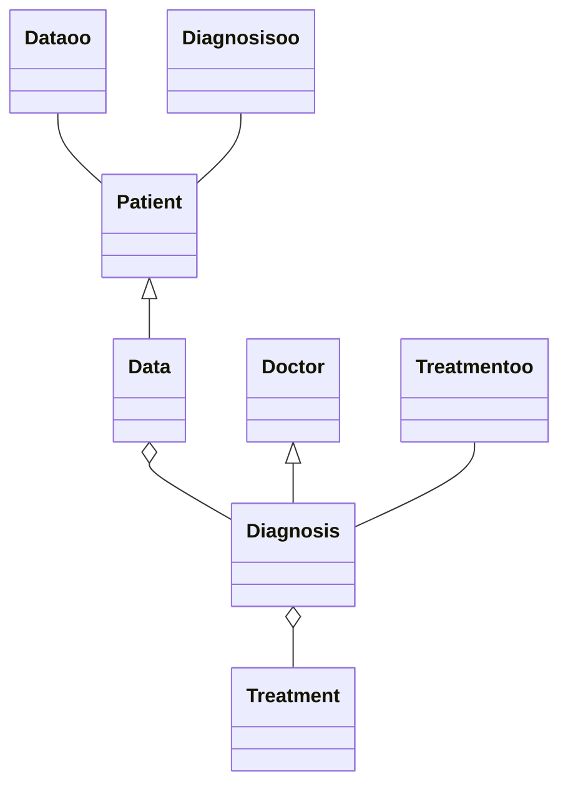
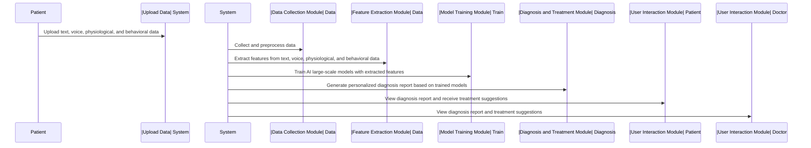
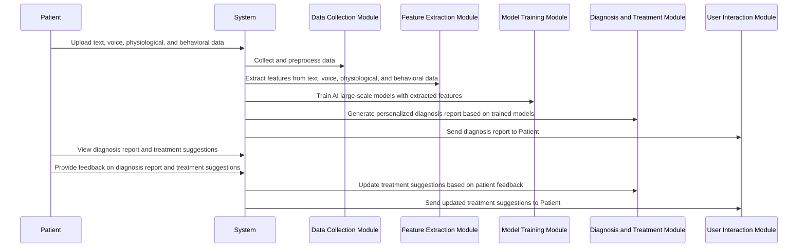

                 

## AI大模型在心理健康诊断和治疗中的潜力

### 关键词：心理健康、诊断、治疗、AI大模型、人工智能

### 摘要：

本文深入探讨了AI大模型在心理健康诊断和治疗中的巨大潜力。随着人工智能技术的飞速发展，AI大模型通过处理和分析大量数据，已经能够在心理健康领域发挥重要作用。本文首先介绍了心理健康问题的背景，包括其重要性、传统诊断与治疗方式的局限性，以及AI大模型的概念与特点。接着，本文详细阐述了AI大模型在心理健康诊断和治疗中的具体应用，包括诊断辅助、治疗建议和实时干预等方面。通过实际案例分析和系统架构设计，本文展示了AI大模型在心理健康领域的广泛应用和前景。

## 目录大纲

### 第一部分：引言与背景介绍

#### 1.1 问题背景

##### 1.1.1 心理健康的重要性

##### 1.1.2 传统的心理健康诊断与治疗方式

##### 1.1.3 AI大模型在心理健康领域的应用潜力

#### 1.2 核心概念与联系

##### 1.2.1 AI大模型的概念与特点

##### 1.2.2 心理健康诊断与治疗的原理与方法

##### 1.2.3 AI大模型在心理健康诊断与治疗中的应用

#### 1.3 书籍结构安排

##### 1.3.1 第一部分：引言与背景介绍

##### 1.3.2 第二部分：AI大模型基础知识

##### 1.3.3 第三部分：心理健康诊断与治疗方法

##### 1.3.4 第四部分：AI大模型在心理健康治疗中的应用案例

### 第二部分：AI大模型基础知识

#### 2.1 AI大模型的基本概念

##### 2.1.1 什么是AI大模型

##### 2.1.2 AI大模型的发展历程

##### 2.1.3 AI大模型的核心特点

#### 2.2 AI大模型的训练与优化

##### 2.2.1 数据集的准备

##### 2.2.2 训练过程的挑战

##### 2.2.3 优化方法与技术

#### 2.3 AI大模型的应用领域

##### 2.3.1 自然语言处理

##### 2.3.2 计算机视觉

##### 2.3.3 语音识别

##### 2.3.4 医疗健康

### 第三部分：心理健康诊断与治疗方法

#### 3.1 心理健康诊断的理论基础

##### 3.1.1 心理健康诊断的概念

##### 3.1.2 心理健康诊断的方法

##### 3.1.3 心理健康诊断的挑战

#### 3.2 心理健康治疗的方法

##### 3.2.1 心理治疗的概念

##### 3.2.2 心理治疗的方法

##### 3.2.3 心理治疗的挑战

#### 3.3 AI大模型在心理健康诊断与治疗中的应用

##### 3.3.1 诊断辅助

##### 3.3.2 治疗建议

##### 3.3.3 实时干预

### 第四部分：AI大模型在心理健康治疗中的应用案例

#### 4.1 案例一：情绪识别与干预

##### 4.1.1 情绪识别的原理

##### 4.1.2 情绪干预的方法

##### 4.1.3 案例分析

#### 4.2 案例二：心理健康评估

##### 4.2.1 评估原理

##### 4.2.2 评估方法

##### 4.2.3 案例分析

#### 4.3 案例三：个性化治疗建议

##### 4.3.1 建议原理

##### 4.3.2 建议方法

##### 4.3.3 案例分析

### 第五部分：系统架构设计与项目实战

#### 5.1 系统架构设计

##### 5.1.1 系统介绍

##### 5.1.2 领域模型

##### 5.1.3 系统架构

##### 5.1.4 系统接口设计

#### 5.2 项目实战

##### 5.2.1 环境安装

##### 5.2.2 系统核心实现

##### 5.2.3 代码应用解读

##### 5.2.4 实际案例分析

### 第六部分：最佳实践、小结与拓展阅读

#### 6.1 最佳实践

##### 6.1.1 提高AI模型诊断准确性的方法

##### 6.1.2 提高AI模型治疗建议有效性的方法

##### 6.1.3 实时干预的挑战与解决方案

#### 6.2 小结

##### 6.2.1 文章总结

##### 6.2.2 关键技术点回顾

##### 6.2.3 应用前景展望

#### 6.3 注意事项

##### 6.3.1 使用AI大模型进行心理健康诊断与治疗的注意事项

##### 6.3.2 数据隐私与伦理问题

##### 6.3.3 持续学习和更新

#### 6.4 拓展阅读

##### 6.4.1 相关书籍推荐

##### 6.4.2 最新研究论文推荐

## 第一部分：引言与背景介绍

### 1.1 问题背景

#### 1.1.1 心理健康的重要性

心理健康是指个体在心理上保持平衡与适应的状态，包括情感稳定、认知清晰、社会适应良好等方面。在现代社会，心理健康问题日益突出。据世界卫生组织（WHO）统计，全球约有三分之一的人口在不同时期遭受心理健康问题的影响。这些问题不仅给个人生活带来困扰，还可能引发严重的社会和经济问题。例如，抑郁症、焦虑症、精神分裂症等心理疾病不仅影响个体的生活质量，还可能导致失业、家庭破裂等问题。此外，随着社交媒体的普及和工作压力的增加，心理健康问题的发病率呈现逐年上升的趋势。

#### 1.1.2 传统的心理健康诊断与治疗方式

传统的心理健康诊断主要依靠心理咨询师和医生，通过面谈、问卷等方式进行。这种方式的优点是能够深入了解患者的内心世界，缺点是耗时较长、成本较高，且在处理复杂心理问题或大规模人群时效率低下。在治疗方面，传统方法包括心理辅导、药物治疗等，但这些方法往往需要长时间的干预和多次的重复，难以满足现代社会的需求。例如，心理辅导通常需要每周多次的面对面会谈，耗时且成本高昂；药物治疗则需要长期服用药物，可能产生副作用。

#### 1.1.3 AI大模型在心理健康领域的应用潜力

随着人工智能技术的发展，AI大模型在心理健康领域的应用潜力逐渐显现。AI大模型能够处理大量数据，快速识别心理问题，提供个性化的治疗建议，大大提高了诊断与治疗的效率。例如，通过语音识别技术，AI大模型可以分析患者的语音特征，判断其心理健康状况；通过机器学习算法，AI大模型可以识别患者的情绪变化，提供实时干预。AI大模型的应用不仅可以提高诊断与治疗的效率，还可以降低成本，使心理健康服务更加普及。例如，通过在线咨询平台，患者可以在家中接受AI大模型提供的心理健康服务，无需长途奔波和频繁的面对面会谈。

### 1.2 核心概念与联系

#### 1.2.1 AI大模型的概念与特点

AI大模型是指具有大规模参数、能够处理海量数据、具有强大学习能力和泛化能力的深度学习模型。AI大模型的特点包括：

- **参数规模大**：AI大模型拥有数十亿至数万亿个参数，能够处理复杂的数据结构。
- **学习能力强**：AI大模型通过训练能够不断优化自身的性能，适应不同的任务需求。
- **泛化能力强**：AI大模型能够将学习到的知识应用于新的、未见过的数据上，具有良好的泛化能力。

#### 1.2.2 心理健康诊断与治疗的原理与方法

心理健康诊断主要基于心理学理论，通过评估个体的情感、认知、行为等方面，判断其心理健康状况。治疗方法包括心理辅导、药物治疗、行为疗法等，旨在帮助患者改善心理健康。

#### 1.2.3 AI大模型在心理健康诊断与治疗中的应用

AI大模型在心理健康诊断与治疗中的应用主要包括：

- **诊断辅助**：通过分析患者的数据，如语言、行为、生理信号等，AI大模型可以辅助医生进行心理健康的诊断。
- **治疗建议**：基于患者的数据，AI大模型可以提供个性化的治疗建议，包括心理辅导、药物治疗等。
- **实时干预**：通过实时监测患者的情绪变化，AI大模型可以提供及时的干预措施，帮助患者保持心理健康。

### 1.3 书籍结构安排

本书分为四个部分：

- **第一部分：引言与背景介绍**：介绍心理健康问题的背景、传统诊断与治疗方式以及AI大模型在心理健康领域的应用潜力。
- **第二部分：AI大模型基础知识**：介绍AI大模型的基本概念、技术原理以及应用案例。
- **第三部分：心理健康诊断与治疗方法**：详细介绍心理健康诊断与治疗的理论方法，以及AI大模型在这些方法中的应用。
- **第四部分：AI大模型在心理健康治疗中的应用案例**：通过实际案例，展示AI大模型在心理健康诊断与治疗中的具体应用效果。

通过本书的阅读，读者可以全面了解AI大模型在心理健康诊断和治疗中的潜力，掌握相关技术和方法，为心理健康领域的创新与发展提供参考。

### 第一部分：引言与背景介绍

#### 1.1 心理健康的重要性

心理健康是现代人类健康的重要组成部分。与传统的身体健康相比，心理健康同样关键，甚至在某些情况下更加重要。心理健康不仅关乎个体的幸福感和生活质量，还对社会整体的和谐与稳定有着深远的影响。根据世界卫生组织（WHO）的定义，心理健康是一种良好的心理状态，个体能够认识到自己的能力，能够应对正常的生活压力，能够工作生产并且能够为社区做出贡献。

随着社会的发展和生活方式的改变，心理健康问题逐渐成为全球关注的焦点。现代社会的高压环境、快速的生活节奏、不断加剧的社会竞争以及信息过载等因素，都增加了心理健康问题的发生率。例如，抑郁症、焦虑症、精神分裂症等心理疾病已经成为全球范围内普遍存在的健康问题。据WHO统计，全球约有3亿人患有抑郁症，约有7000万人患有严重焦虑症。这些心理问题不仅严重影响个体的生活质量，还可能导致自杀、暴力等极端行为，对社会安全构成威胁。

心理健康问题不仅在个体层面产生影响，也在社会和经济层面带来了巨大负担。例如，心理疾病可能导致劳动力流失、医疗费用增加、社会服务需求上升等问题。根据WHO的数据，心理疾病每年给全球带来的经济负担高达1万亿美元。因此，解决心理健康问题不仅有助于提高个体幸福感，也有助于社会的可持续发展。

#### 1.1.1 心理健康的核心要素

心理健康包含多个核心要素，这些要素共同决定了个体的心理状态。以下是一些关键的要素：

1. **情感稳定**：情感稳定是心理健康的基础。一个情感稳定的人能够合理地处理自己的情绪，既能享受积极的情绪，也能接受消极的情绪，而不被情绪所左右。

2. **认知清晰**：认知清晰是指个体能够清楚地思考、判断和决策。良好的认知功能有助于个体应对生活中的挑战，解决问题，并保持有效的社会互动。

3. **社会适应**：社会适应是指个体能够与他人和谐相处，适应社会环境。良好的社会适应能力有助于建立和维护稳定的人际关系，减少社会冲突。

4. **自我认同**：自我认同是指个体对自己的认知和接受。一个心理健康的人能够认识到自己的优点和不足，并在此基础上进行自我提升。

5. **压力管理**：压力管理是指个体能够有效地应对生活中的压力源。良好的压力管理能力有助于降低心理压力，预防心理疾病的发生。

#### 1.1.2 心理健康问题的类型

心理健康问题多种多样，常见的包括：

- **抑郁症**：抑郁症是一种常见的心理疾病，表现为持久的情绪低落、兴趣丧失、精力不足等症状。

- **焦虑症**：焦虑症是一种以过度焦虑和担忧为主要症状的心理疾病。患者可能会出现心悸、出汗、头痛等身体反应。

- **精神分裂症**：精神分裂症是一种严重的心理疾病，表现为思维混乱、情感淡漠、幻觉和妄想等症状。

- **物质滥用**：物质滥用包括药物和酒精的依赖和滥用，对个体的心理和社会功能产生严重影响。

- **创伤后应激障碍（PTSD）**：PTSD是由于经历了极端的压力和创伤事件（如战争、性侵、自然灾害等）后产生的心理障碍。

#### 1.1.3 心理健康问题的影响

心理健康问题对个体、家庭和社会都会产生深远的影响。以下是心理健康问题可能带来的几种影响：

- **个人层面**：心理健康问题可能导致个体的日常生活受到严重干扰，如工作能力下降、社交能力减弱、家庭关系紧张等。长期的心理健康问题还可能增加自杀和自伤的风险。

- **家庭层面**：心理健康问题不仅影响患者本人，也会给家庭带来压力。家庭成员可能需要承担额外的照顾责任，可能导致家庭关系紧张和经济负担增加。

- **社会层面**：心理健康问题对社会资源和医疗系统造成巨大压力。大量的人力、物力和财力被用于心理健康问题的治疗和管理，同时心理健康问题还可能导致社会不稳定，增加犯罪率等。

### 1.2 传统的心理健康诊断与治疗方式

#### 1.2.1 心理健康诊断的传统方式

传统的心理健康诊断主要依赖于心理咨询师和临床心理学家的专业知识。以下是一些常见的诊断方法：

- **面谈**：心理咨询师通过与患者进行面对面的谈话，了解患者的心理状态、情感反应和思维模式。这种方法有助于深入了解患者的内心世界。

- **问卷和量表**：使用标准化的问卷和量表（如焦虑自评量表、抑郁自评量表等）来评估患者的心理状态。这些工具能够量化患者的症状，为诊断提供客观依据。

- **观察**：观察患者的行为表现，如他们在不同情境下的反应、情绪变化等，以获取更全面的信息。

尽管这些方法有其优势，但在实际操作中存在一些局限性。首先，传统的诊断方式通常需要较长时间，因为心理咨询师需要仔细收集和分析患者的信息。其次，这种方法对心理咨询师的专业技能要求较高，需要他们具备丰富的经验和专业知识。此外，传统诊断方式在处理复杂心理问题时可能显得力不从心。

#### 1.2.2 心理健康治疗的传统方式

在心理健康治疗方面，传统方法包括以下几种：

- **心理辅导**：心理辅导是一种以谈话为主的治疗方法，心理咨询师通过与患者建立信任关系，帮助患者认识和理解自己的问题，并找到解决问题的方法。

- **药物治疗**：药物治疗通常用于治疗抑郁症、焦虑症等心理疾病。医生会根据患者的症状，开具相应的药物，以调节患者的情绪和生理状态。

- **行为疗法**：行为疗法通过改变患者的行为模式来改善其心理健康。例如，认知行为疗法（CBT）帮助患者识别和改变消极的思维模式。

- **精神分析疗法**：精神分析疗法通过深入探讨患者的潜意识，帮助患者理解其行为和情感背后的原因。

这些治疗方法的共同特点是需要较长时间的治疗过程，且治疗效果往往因人而异。对于一些复杂和严重的心里健康问题，传统治疗方式可能难以达到理想的效果。

#### 1.2.3 传统方式的局限性

尽管传统的心理健康诊断与治疗方式在历史上发挥了重要作用，但随着社会的发展，它们逐渐暴露出一些局限性：

- **耗时较长**：传统的诊断与治疗过程通常需要多次的面谈和长时间的咨询，这对患者和医生来说都是一项时间和精力的巨大投入。

- **成本较高**：由于需要专业的心理咨询师或医生进行诊断和治疗，传统方法往往成本较高，不利于广泛推广。

- **效率低下**：在处理复杂心理问题或大规模人群时，传统方法显得效率低下。例如，在一个心理健康危机事件中，传统方式可能无法迅速准确地识别和处理所有受到影响的人群。

- **结果不一**：传统治疗方式的效果因人而异，部分患者可能对治疗方法不敏感，导致治疗失败。

### 1.3 AI大模型在心理健康领域的应用潜力

随着人工智能技术的飞速发展，AI大模型在心理健康领域的应用潜力逐渐显现。AI大模型通过其强大的数据处理能力和自我学习能力，有望在心理健康诊断与治疗中发挥重要作用。以下是AI大模型在心理健康领域的几种潜在应用：

#### 1.3.1 诊断辅助

AI大模型可以通过分析大量的患者数据，包括语言、行为、生理信号等，辅助医生进行心理健康的诊断。例如，通过自然语言处理技术，AI大模型可以分析患者的文字描述，识别出潜在的抑郁症或焦虑症症状；通过计算机视觉技术，AI大模型可以分析患者的面部表情，评估其情绪状态；通过传感器技术，AI大模型可以监测患者的生理信号，如心率、血压等，评估其身体状态。

#### 1.3.2 治疗建议

基于对患者的数据分析和诊断结果，AI大模型可以提供个性化的治疗建议。例如，AI大模型可以根据患者的症状和情况，推荐最适合的心理辅导方法或药物治疗方案。此外，AI大模型还可以通过模拟不同的治疗方案，评估每种方案的可能效果，帮助医生做出更科学、更有效的决策。

#### 1.3.3 实时干预

AI大模型可以通过实时监测患者的情绪和行为，提供及时的干预措施。例如，在患者的情绪出现波动时，AI大模型可以及时发出警报，提醒医生或家人注意；在患者有自杀倾向时，AI大模型可以通过语音识别和自然语言处理技术，分析患者的语音内容，判断其心理状态，并提供相应的干预建议。

#### 1.3.4 降低成本和提高效率

AI大模型的应用可以大大降低心理健康服务的成本，提高诊断与治疗的效率。例如，通过在线平台，患者可以在家中接受AI大模型提供的心理健康服务，无需长途奔波和频繁的面对面会谈。AI大模型还可以同时处理大量患者的数据，提高诊断与治疗的效率，减少医生的工作负担。

#### 1.3.5 普及心理健康服务

随着AI大模型的应用，心理健康服务有望更加普及。通过降低服务成本和提高效率，AI大模型可以使更多的个体受益。例如，在偏远地区，由于缺乏专业的心理咨询师和医生，许多患者无法得到及时的治疗。AI大模型的应用可以弥补这一空白，使心理健康服务更加普及和可及。

总之，AI大模型在心理健康领域的应用潜力巨大，有望通过提高诊断与治疗的效率、降低成本和普及服务，为心理健康问题的解决提供新的解决方案。

### 1.4 核心概念与联系

#### 1.4.1 AI大模型的概念与特点

AI大模型（Large-scale Artificial Intelligence Model）是指那些具有大规模参数、能够处理海量数据、具有强大学习能力和泛化能力的深度学习模型。这些模型通常由数十亿甚至数万亿个参数组成，能够在各种复杂任务中表现出卓越的性能。AI大模型的特点主要包括以下几个方面：

1. **参数规模大**：AI大模型拥有庞大的参数数量，这使得它们能够捕捉到数据中的细微模式和特征。这种大规模参数使得模型在处理复杂问题时具有更强的表达能力和拟合能力。

2. **学习能力强大**：AI大模型通过大量的数据训练，能够不断优化自身的性能，适应不同的任务需求。这种强大的学习能力使得AI大模型在各类任务中表现出色，包括图像识别、自然语言处理、推荐系统等。

3. **泛化能力强**：AI大模型具有良好的泛化能力，能够将学习到的知识应用于新的、未见过的数据上。这种泛化能力使得AI大模型在处理未知任务时能够保持较高的准确性和可靠性。

#### 1.4.2 心理健康诊断与治疗的原理与方法

心理健康诊断主要基于心理学理论，通过评估个体的情感、认知、行为等方面，判断其心理健康状况。常见的诊断方法包括面谈、问卷、观察等。心理健康治疗则包括心理辅导、药物治疗、行为疗法等，旨在帮助患者改善心理健康。

1. **心理健康诊断的原理**：心理健康诊断的核心是理解个体的心理状态和行为模式。通过评估个体的情感反应、认知功能、行为表现等，医生或心理咨询师可以诊断出个体是否患有特定的心理疾病。

2. **心理健康治疗的原理**：心理健康治疗的目的是通过一系列干预措施，帮助患者改善心理状态，提高生活质量。治疗方法的选择通常取决于患者的具体情况和需求。例如，认知行为疗法（CBT）通过改变患者的思维和行为模式来改善其心理健康；药物治疗则通过调节患者的神经递质水平来缓解心理症状。

#### 1.4.3 AI大模型在心理健康诊断与治疗中的应用

AI大模型在心理健康诊断与治疗中的应用具有巨大的潜力。通过分析大量的患者数据，AI大模型可以提供更为精确的诊断结果和个性化的治疗建议。

1. **诊断辅助**：AI大模型可以通过分析患者的语言、行为、生理信号等数据，辅助医生进行心理健康的诊断。例如，通过自然语言处理技术，AI大模型可以分析患者的文字描述，识别出潜在的抑郁症或焦虑症症状；通过计算机视觉技术，AI大模型可以分析患者的面部表情，评估其情绪状态。

2. **治疗建议**：基于对患者的数据分析和诊断结果，AI大模型可以提供个性化的治疗建议。例如，AI大模型可以根据患者的症状和情况，推荐最适合的心理辅导方法或药物治疗方案。此外，AI大模型还可以通过模拟不同的治疗方案，评估每种方案的可能效果，帮助医生做出更科学、更有效的决策。

3. **实时干预**：AI大模型可以通过实时监测患者的情绪和行为，提供及时的干预措施。例如，在患者的情绪出现波动时，AI大模型可以及时发出警报，提醒医生或家人注意；在患者有自杀倾向时，AI大模型可以通过语音识别和自然语言处理技术，分析患者的语音内容，判断其心理状态，并提供相应的干预建议。

#### 1.4.4 AI大模型在心理健康诊断与治疗中的优势

与传统的心理健康诊断与治疗方式相比，AI大模型在心理健康诊断与治疗中具有以下优势：

1. **提高诊断准确性**：AI大模型通过分析大量的数据，能够更准确地识别心理健康问题。这种高准确性有助于提高诊断的效率，减少误诊率。

2. **降低治疗成本**：AI大模型的应用可以降低心理健康服务的成本，例如，通过在线平台，患者可以在家中接受AI大模型提供的心理健康服务，无需长途奔波和频繁的面对面会谈。此外，AI大模型可以同时处理大量患者的数据，提高诊断与治疗的效率，减少医生的工作负担。

3. **提高治疗个性化**：AI大模型可以根据患者的具体症状和情况，提供个性化的治疗建议。这种个性化治疗有助于提高治疗效果，满足不同患者的需求。

4. **实时监测与干预**：AI大模型可以通过实时监测患者的情绪和行为，提供及时的干预措施。这种实时性有助于快速应对患者的心理变化，提高治疗的效果。

综上所述，AI大模型在心理健康诊断与治疗中具有巨大的应用潜力。通过提高诊断准确性、降低治疗成本、提高治疗个性化和实时监测与干预，AI大模型有望为心理健康问题的解决提供新的解决方案。

### 1.5 书籍结构安排

本书分为四个主要部分，旨在全面介绍AI大模型在心理健康诊断和治疗中的应用。

#### 第一部分：引言与背景介绍

本部分首先介绍了心理健康问题的背景，包括心理健康的重要性、心理健康问题的类型及其影响。接着，介绍了传统的心理健康诊断与治疗方式及其局限性，以及AI大模型在心理健康领域的应用潜力。

#### 第二部分：AI大模型基础知识

本部分将详细介绍AI大模型的基本概念、发展历程及其核心特点。通过这一部分的阅读，读者将了解AI大模型的基本原理，为后续内容打下坚实的基础。

#### 第三部分：心理健康诊断与治疗方法

本部分将深入探讨心理健康诊断与治疗的理论基础和具体方法。通过分析心理健康诊断的原理、方法以及心理健康治疗的原理、方法，读者将了解AI大模型在这些领域的应用。

#### 第四部分：AI大模型在心理健康治疗中的应用案例

本部分将通过实际案例展示AI大模型在心理健康诊断与治疗中的应用效果。通过案例分析，读者将更直观地了解AI大模型在实际操作中的表现和优势。

### 1.5.1 第一部分：引言与背景介绍

**目的**：帮助读者理解心理健康问题的现状和重要性，以及传统诊断与治疗方式的局限性。

**内容**：

- **心理健康的重要性**：介绍心理健康对个人和社会的影响，引出心理健康问题的普遍性和严重性。
- **心理健康问题的背景**：讨论心理健康问题的类型和现状，如抑郁症、焦虑症等。
- **传统的心理健康诊断与治疗方式**：介绍传统诊断与治疗方式的优缺点，突出其在处理复杂心理健康问题时的局限性。
- **AI大模型在心理健康领域的应用潜力**：讨论AI大模型如何通过数据分析、个性化治疗和实时干预等方式解决传统方法的局限性。

**重点**：

- 心理健康问题的普遍性和严重性。
- 传统诊断与治疗方式的局限性。
- AI大模型在心理健康诊断与治疗中的潜在优势。

### 1.5.2 第二部分：AI大模型基础知识

**目的**：帮助读者掌握AI大模型的基本概念、发展历程和核心特点，为其在心理健康领域的应用提供理论基础。

**内容**：

- **AI大模型的基本概念**：介绍AI大模型的定义、结构和主要类型。
- **AI大模型的发展历程**：回顾AI大模型从早期模型到现代大规模模型的发展历程。
- **AI大模型的核心特点**：分析AI大模型在参数规模、学习能力、泛化能力等方面的优势。

**重点**：

- AI大模型的基本概念和结构。
- AI大模型的发展历程和核心特点。
- AI大模型在心理健康领域的应用前景。

### 1.5.3 第三部分：心理健康诊断与治疗方法

**目的**：帮助读者了解心理健康诊断与治疗的理论基础和方法，以及AI大模型在这些方法中的应用。

**内容**：

- **心理健康诊断的原理与方法**：介绍心理健康诊断的基本原理和常用方法，如面谈、问卷、观察等。
- **心理健康治疗的原理与方法**：探讨心理健康治疗的基本原理和常用方法，如心理辅导、药物治疗、行为疗法等。
- **AI大模型在心理健康诊断与治疗中的应用**：分析AI大模型如何通过数据分析、诊断辅助、治疗建议和实时干预等方式提高心理健康诊断与治疗的效率和效果。

**重点**：

- 心理健康诊断的原理和方法。
- 心理健康治疗的原理和方法。
- AI大模型在心理健康诊断与治疗中的应用。

### 1.5.4 第四部分：AI大模型在心理健康治疗中的应用案例

**目的**：通过实际案例展示AI大模型在心理健康诊断与治疗中的应用效果，帮助读者更直观地理解其应用价值和前景。

**内容**：

- **案例一：情绪识别与干预**：介绍AI大模型如何通过自然语言处理和语音识别技术识别患者的情绪，并提供实时干预。
- **案例二：心理健康评估**：展示AI大模型如何通过数据分析提供个性化的心理健康评估报告。
- **案例三：个性化治疗建议**：介绍AI大模型如何基于患者的具体症状提供个性化的治疗建议。

**重点**：

- 情绪识别与干预的实际应用。
- 心理健康评估的个性化报告。
- 个性化治疗建议的有效性。

通过以上四个部分的安排，本书旨在系统性地介绍AI大模型在心理健康诊断和治疗中的应用，为读者提供全面、深入的了解，并探讨其未来的发展前景。

## AI大模型基础知识

### 2.1 AI大模型的基本概念

AI大模型（Large-scale Artificial Intelligence Model）是指那些拥有数十亿甚至数万亿个参数的深度学习模型。这些模型通常具备强大的数据处理能力和自我学习能力，能够在各种复杂任务中实现高准确性和高性能。AI大模型是人工智能领域的一项重大突破，其核心在于通过大规模参数来捕捉数据中的细微模式和复杂特征，从而实现更高效、更准确的模型预测和决策。

AI大模型的发展起源于深度学习技术的进步。深度学习是一种基于人工神经网络的学习方法，通过多层次的神经网络结构来模拟人脑的神经活动，实现从简单到复杂的特征提取和模式识别。早期的深度学习模型，如简单的多层感知机（MLP）和卷积神经网络（CNN），虽然在一定程度上提高了模型的性能，但在处理复杂任务时仍显不足。为了解决这一问题，研究人员提出了更大规模的神经网络结构，即AI大模型。

AI大模型的主要类型包括：

- **Transformer模型**：Transformer模型是AI大模型中的一种重要类型，其核心思想是通过自注意力机制（self-attention）来处理序列数据。Transformer模型在自然语言处理任务中表现出色，如机器翻译、文本生成等。

- **GPT（Generative Pre-trained Transformer）模型**：GPT模型是基于Transformer架构的预训练模型，通过在大规模语料库上进行预训练，能够生成高质量的自然语言文本。GPT模型的成功应用使得AI在生成式任务中取得了显著进展。

- **BERT（Bidirectional Encoder Representations from Transformers）模型**：BERT模型是一种双向Transformer模型，通过同时考虑文本的前后文信息，实现了对文本的深度理解。BERT模型在多项自然语言处理任务中刷新了SOTA（State-of-the-Art）记录，如问答系统、文本分类等。

### 2.2 AI大模型的发展历程

AI大模型的发展历程可以追溯到20世纪80年代，随着计算机硬件和算法技术的不断进步，深度学习逐渐成为人工智能领域的研究热点。以下是一些关键的发展节点：

- **1986年**：Backpropagation算法的提出，使得多层神经网络训练成为可能。

- **1990年代**：卷积神经网络（CNN）的提出，标志着计算机视觉领域的突破。

- **2006年**：Hinton等人在NeurIPS会议上提出了深度信念网络（DBN），这是早期的大规模深度学习模型。

- **2012年**：AlexNet在ImageNet竞赛中取得了突破性的成绩，这标志着深度学习在计算机视觉领域的崛起。

- **2017年**：Google提出了Transformer模型，并应用于自然语言处理任务，取得了显著的效果。

- **2018年**：GPT模型发布，使得AI在文本生成任务中实现了重大突破。

- **2020年**：BERT模型在多项自然语言处理任务中刷新了SOTA记录，标志着AI大模型在语言理解任务中的领先地位。

### 2.3 AI大模型的核心特点

AI大模型具有以下几个核心特点：

1. **大规模参数**：AI大模型通常拥有数十亿至数万亿个参数，这使得模型能够捕捉到数据中的复杂模式和特征，从而实现高精度的预测和决策。

2. **强大学习能力**：AI大模型通过大规模数据训练，能够不断优化自身的性能，适应不同的任务需求。这种强大的学习能力使得AI大模型在各种复杂任务中表现出色。

3. **泛化能力强**：AI大模型具有良好的泛化能力，能够将学习到的知识应用于新的、未见过的数据上。这种泛化能力使得AI大模型在处理未知任务时能够保持较高的准确性和可靠性。

4. **自我优化能力**：AI大模型在训练过程中能够自我优化，通过调整参数和结构，提高模型的性能。这种自我优化能力使得AI大模型能够不断进步，适应不断变化的环境和任务需求。

### 2.4 AI大模型的应用场景

AI大模型在多个领域展现了强大的应用潜力，以下是一些主要的应用场景：

- **自然语言处理**：AI大模型在自然语言处理任务中表现出色，如机器翻译、文本生成、情感分析、问答系统等。

- **计算机视觉**：AI大模型在图像识别、目标检测、图像生成等计算机视觉任务中取得了显著成果。

- **推荐系统**：AI大模型通过分析用户行为和偏好，提供个性化的推荐服务，广泛应用于电子商务、社交媒体等领域。

- **医疗健康**：AI大模型在医疗诊断、疾病预测、个性化治疗等方面发挥了重要作用，如AI辅助诊断、个性化治疗方案制定等。

- **金融科技**：AI大模型在金融风险评估、欺诈检测、智能投顾等方面应用广泛。

- **智能交通**：AI大模型在智能交通管理、自动驾驶车辆控制等方面发挥了重要作用。

### 2.5 AI大模型的优势与挑战

#### 优势：

- **高精度预测**：AI大模型通过大规模参数和强大的学习能力，能够实现高精度的预测和决策。

- **泛化能力强**：AI大模型具有良好的泛化能力，能够将学习到的知识应用于新的、未见过的数据上。

- **自我优化**：AI大模型在训练过程中能够自我优化，通过调整参数和结构，提高模型的性能。

#### 挑战：

- **计算资源需求高**：AI大模型通常需要大量的计算资源进行训练，对硬件设备的要求较高。

- **数据隐私和安全**：AI大模型在处理大量数据时，可能面临数据隐私和安全的问题。

- **算法透明性和解释性**：AI大模型的内部结构和决策过程复杂，如何提高算法的透明性和解释性是一个重要挑战。

### 2.6 AI大模型的发展趋势

随着人工智能技术的不断进步，AI大模型的发展趋势包括：

- **更大规模模型**：未来将出现更大规模的AI大模型，以应对更复杂的任务需求。

- **更高效训练算法**：研究更加高效、低能耗的训练算法，以提高AI大模型的训练效率。

- **算法透明性和解释性**：提高AI大模型的透明性和解释性，使其决策过程更加可解释和可信。

- **跨模态学习**：实现不同模态数据（如文本、图像、语音等）之间的联合学习，提升AI大模型在多模态任务中的性能。

- **实时应用**：实现AI大模型在实时应用场景中的高效部署和运行，满足实时性的需求。

通过深入理解AI大模型的基本概念、发展历程和核心特点，读者可以更好地把握其在心理健康诊断和治疗中的潜在应用，为其在心理健康领域的广泛应用奠定基础。

### 2.7 AI大模型的训练与优化

#### 2.7.1 数据集的准备

AI大模型的训练依赖于大规模且高质量的数据集。数据集的准备是训练过程中的关键步骤，直接影响到模型的性能和泛化能力。以下是数据集准备的主要步骤：

1. **数据收集**：首先，需要收集大量的原始数据。这些数据可以来自公开数据集、企业内部数据或通过采集设备获得。例如，在心理健康领域，可以收集患者的病历数据、语音数据、行为数据等。

2. **数据清洗**：原始数据通常包含噪声和错误，需要进行清洗。数据清洗包括去除重复数据、处理缺失值、纠正错误数据等。例如，在处理文本数据时，可能需要去除停用词、标点符号，将文本转换为统一的格式。

3. **数据标注**：对于监督学习任务，需要将数据标注为正确的标签。数据标注可以是手工标注，也可以是半监督或无监督学习中的自动标注。例如，在情绪识别任务中，需要将语音数据标注为不同情绪类别。

4. **数据增强**：为了提高模型的泛化能力，通常需要对数据进行增强。数据增强可以通过多种方式实现，如数据变换、数据扩展、数据混合等。例如，在图像识别任务中，可以通过旋转、缩放、裁剪等方式增强数据。

5. **数据归一化**：对于不同类型的数据，需要将其归一化到统一的尺度，以避免某些特征对模型训练产生过大的影响。例如，在处理数值型数据时，可以通过标准化或最小最大缩放等方法进行归一化。

#### 2.7.2 训练过程的挑战

AI大模型的训练过程面临一系列挑战，以下是一些主要挑战：

1. **计算资源需求**：AI大模型通常需要大量的计算资源进行训练。训练过程涉及大量的矩阵运算和参数更新，对GPU或TPU等硬件设备的需求较高。此外，为了加速训练过程，可能需要使用分布式训练策略。

2. **训练时间**：AI大模型的训练时间通常较长。对于大规模的模型，训练过程可能需要数天甚至数周的时间。这不仅增加了计算成本，也限制了模型的实时应用。

3. **数据不平衡**：在许多实际任务中，数据分布可能不平衡。例如，在心理健康诊断中，某些心理疾病的样本量可能远小于其他疾病。数据不平衡会导致模型在少数类别上表现不佳，影响模型的泛化能力。

4. **过拟合**：AI大模型具有强大的学习能力，容易在训练数据上过拟合。过拟合是指模型在训练数据上表现良好，但在未见过的新数据上表现较差。为了避免过拟合，需要采用正则化技术、交叉验证等策略。

#### 2.7.3 优化方法与技术

为了应对训练过程中的挑战，研究人员提出了一系列优化方法和技术，以下是一些常用的方法：

1. **优化算法**：常用的优化算法包括梯度下降（Gradient Descent）、Adam优化器等。梯度下降算法通过迭代更新模型参数，以最小化损失函数。Adam优化器结合了动量（Momentum）和自适应学习率（Adaptive Learning Rate），在许多任务中表现出色。

2. **学习率调度**：学习率是影响模型训练过程的关键参数。学习率调度方法包括固定学习率、逐步下降学习率、自适应学习率等。逐步下降学习率（Learning Rate Decay）通过在训练过程中逐步减小学习率，避免模型在训练后期过早收敛。

3. **正则化技术**：正则化技术通过引入额外的损失项，防止模型过拟合。常用的正则化技术包括L1正则化、L2正则化、Dropout等。L1和L2正则化通过在损失函数中加入L1或L2范数项，惩罚模型的复杂度。Dropout通过随机丢弃部分神经元，提高模型的泛化能力。

4. **数据增强**：数据增强是一种有效的提高模型泛化能力的方法。通过增加训练数据的多样性，可以减少模型对特定数据样本的依赖。常见的数据增强方法包括图像旋转、缩放、裁剪、颜色变换等。

5. **交叉验证**：交叉验证是一种评估模型泛化能力的方法。通过将训练数据划分为多个子集，进行多次训练和验证，可以更准确地评估模型的性能。常用的交叉验证方法包括K折交叉验证、留一法交叉验证等。

通过有效的优化方法和技术，可以显著提高AI大模型的训练效率和性能，为心理健康诊断与治疗提供可靠的技术支持。

### 2.8 AI大模型的应用领域

AI大模型凭借其强大的数据处理能力和自我学习能力，在多个领域展现出了卓越的应用潜力。以下将详细介绍AI大模型在自然语言处理、计算机视觉、语音识别、医疗健康、金融科技等领域的具体应用。

#### 2.8.1 自然语言处理

自然语言处理（NLP）是AI大模型最典型的应用领域之一。AI大模型在NLP任务中，如文本分类、情感分析、机器翻译、问答系统等，都取得了显著的成果。

- **文本分类**：AI大模型可以通过学习大量标注数据，实现对未标注文本的自动分类。例如，在社交媒体监控中，AI大模型可以自动分类用户的评论，识别出负面评论并加以处理。

- **情感分析**：通过分析文本中的情感词和情感强度，AI大模型可以判断文本的情感倾向。例如，在电商平台上，AI大模型可以帮助企业了解用户对产品的情感反馈，从而优化产品和服务。

- **机器翻译**：AI大模型，如Google的BERT和OpenAI的GPT，在机器翻译任务中表现出色。通过大规模的预训练和微调，这些模型可以实现高质量的双语翻译，大大降低了翻译的成本和错误率。

- **问答系统**：AI大模型在问答系统中，可以通过理解自然语言输入，提供准确的答案。例如，在智能客服系统中，AI大模型可以帮助企业快速响应客户的问题，提高客户满意度。

#### 2.8.2 计算机视觉

计算机视觉是AI大模型在人工智能领域的重要应用方向之一。AI大模型在图像识别、目标检测、图像生成等计算机视觉任务中，都取得了显著的进展。

- **图像识别**：AI大模型，如ResNet和Inception，通过深度卷积神经网络结构，可以实现对图像中物体的准确识别。例如，在安防监控中，AI大模型可以帮助识别异常行为和潜在威胁。

- **目标检测**：AI大模型，如YOLO和Faster R-CNN，通过检测图像中的目标位置和类别，可以实现对动态场景的实时监控。例如，在自动驾驶车辆中，AI大模型可以帮助车辆识别道路上的行人、车辆等目标。

- **图像生成**：AI大模型，如GAN（生成对抗网络），可以通过学习真实图像数据，生成高质量的人工图像。例如，在艺术创作中，AI大模型可以帮助艺术家生成新的艺术作品，拓宽创意空间。

#### 2.8.3 语音识别

语音识别是AI大模型在语音处理领域的核心应用。AI大模型通过分析语音信号，可以实现对语音内容的准确识别和转换。

- **语音识别**：AI大模型，如DeepSpeech和WaveNet，可以实现对语音内容的实时识别和转换。例如，在智能音箱和语音助手应用中，AI大模型可以帮助用户通过语音进行搜索、控制设备等操作。

- **语音合成**：AI大模型，如Tacotron和WaveNet，可以通过文本输入，生成自然流畅的语音输出。例如，在语音助手中，AI大模型可以帮助将文本消息转换成语音消息，提高用户交互的便捷性。

#### 2.8.4 医疗健康

AI大模型在医疗健康领域具有广泛的应用潜力。通过分析大量的医疗数据，AI大模型可以提供辅助诊断、疾病预测、个性化治疗建议等。

- **辅助诊断**：AI大模型可以通过分析患者的医疗记录、实验室检测结果等数据，辅助医生进行疾病诊断。例如，在医学影像分析中，AI大模型可以帮助医生快速识别出肺结节、乳腺癌等疾病。

- **疾病预测**：AI大模型可以通过分析患者的病史、家族病史等数据，预测患者未来可能患有的疾病。例如，在心脏病预测中，AI大模型可以帮助医生提前识别出高风险患者，采取预防措施。

- **个性化治疗建议**：AI大模型可以根据患者的具体症状和病情，提供个性化的治疗建议。例如，在癌症治疗中，AI大模型可以帮助医生选择最适合患者的治疗方案，提高治疗效果。

#### 2.8.5 金融科技

AI大模型在金融科技领域也发挥着重要作用。通过分析大量的金融数据，AI大模型可以提供风险管理、欺诈检测、智能投顾等服务。

- **风险管理**：AI大模型可以通过分析市场数据、公司财务报表等，预测金融市场的风险。例如，在股市预测中，AI大模型可以帮助投资者识别潜在的风险和机会。

- **欺诈检测**：AI大模型可以通过分析交易数据、用户行为等，识别出异常交易和欺诈行为。例如，在信用卡欺诈检测中，AI大模型可以帮助银行及时识别并阻止欺诈交易。

- **智能投顾**：AI大模型可以根据投资者的风险偏好和投资目标，提供个性化的投资建议。例如，在财富管理中，AI大模型可以帮助投资者制定最优的投资策略，实现资产的稳健增长。

综上所述，AI大模型在自然语言处理、计算机视觉、语音识别、医疗健康、金融科技等领域的应用，不仅提高了各领域的效率和准确性，也为未来的技术创新提供了新的方向。

### 2.9 心理健康诊断的理论基础

#### 2.9.1 心理健康诊断的概念

心理健康诊断是指通过一系列科学的方法和技术，对个体的心理状态、情感反应、认知功能和行为模式等进行评估，以判断其是否存在心理健康问题或疾病。心理健康诊断的核心目标是识别心理障碍和心理健康问题，为制定针对性的治疗计划提供依据。

心理健康诊断不仅关注个体的心理健康水平，还涉及心理健康问题的严重程度和治疗效果的评估。通过诊断，医生和心理咨询师可以了解患者的心理状况，制定个性化的治疗方案，并跟踪治疗效果，确保患者得到最佳的心理健康服务。

#### 2.9.2 心理健康诊断的方法

心理健康诊断的方法多种多样，常用的方法包括面谈、问卷、观察和实验等。以下是一些主要的心理健康诊断方法：

1. **面谈**：面谈是心理健康诊断中最常用的一种方法，通过面对面交流，心理咨询师可以深入了解患者的心理状态和情感反应。面谈过程中，心理咨询师会询问患者的个人经历、生活状况、情感困扰等，通过倾听和提问，获取详细的信息。

2. **问卷**：问卷是另一种常见的心健康诊断工具，通过标准化问卷，医生或心理咨询师可以量化评估患者的心理健康状况。常用的问卷包括焦虑自评量表（SAS）、抑郁自评量表（SDS）等。问卷的优点是操作简便、效率高，适合大规模人群的心理健康筛查。

3. **观察**：观察是通过直接观察患者的言行举止，评估其心理状态和行为模式。观察可以是在自然环境中进行的，也可以是在实验室环境中进行的。通过观察，心理咨询师可以获取患者的非言语行为信息，如面部表情、身体语言等。

4. **实验**：实验是一种科学性较强的方法，通过设计特定的实验情境，评估患者的心理反应和认知功能。实验可以包括心理实验、生理实验等，通过控制变量，获取可靠的数据。

#### 2.9.3 心理健康诊断的挑战

心理健康诊断虽然是一种科学的方法，但在实际操作中仍面临一些挑战：

1. **主观性**：心理健康诊断很大程度上依赖于心理咨询师的专业判断和经验，诊断结果可能受到咨询师的主观影响。

2. **多样性**：心理健康问题种类繁多，不同个体之间存在巨大的差异，这使得诊断的难度增加。如何准确识别和区分不同类型的心健康问题，是一个亟待解决的问题。

3. **资源限制**：心理健康诊断需要专业知识和技能，且耗时较长，对心理咨询师和医疗资源的需求较高。在资源有限的情况下，如何确保每位患者都能得到及时、有效的诊断，是一个重要的挑战。

4. **数据隐私和安全**：心理健康诊断涉及个人隐私信息，如何确保这些数据的保密性和安全性，是心理健康诊断过程中需要重视的问题。

### 2.10 心理健康诊断与AI大模型

随着人工智能技术的发展，AI大模型在心理健康诊断中的应用逐渐受到关注。AI大模型通过其强大的数据处理能力和自我学习能力，有望在心理健康诊断中发挥重要作用。以下将介绍AI大模型在心理健康诊断中的应用方法、优势和挑战。

#### 2.10.1 AI大模型在心理健康诊断中的应用方法

1. **自然语言处理**：AI大模型可以通过自然语言处理技术，分析患者的文字描述，提取情感和情绪信息。例如，通过情感分析技术，AI大模型可以判断患者的文字描述是否包含负面情绪，如抑郁、焦虑等。

2. **语音识别与情感分析**：AI大模型可以通过语音识别技术，将患者的语音转化为文本，然后使用情感分析技术，判断患者的情绪状态。例如，通过分析患者的语音语调、音量等特征，AI大模型可以判断患者是否处于紧张、兴奋或沮丧的情绪状态。

3. **行为分析**：AI大模型可以通过计算机视觉技术，分析患者的面部表情、身体语言等行为特征，判断其心理健康状况。例如，通过分析患者的面部表情变化，AI大模型可以判断患者是否在经历负面情绪。

4. **生理信号分析**：AI大模型可以通过传感器技术，分析患者的生理信号，如心率、血压等，判断其心理健康状况。例如，通过分析患者的心率变化，AI大模型可以判断患者是否处于焦虑或抑郁状态。

#### 2.10.2 AI大模型在心理健康诊断中的优势

1. **高效处理大量数据**：AI大模型可以通过并行计算和分布式训练，高效处理大量患者数据，提高诊断效率。

2. **准确识别心理健康问题**：AI大模型通过学习大量的标注数据，可以准确识别心理健康问题，减少误诊率。

3. **实时监测与干预**：AI大模型可以通过实时分析患者的数据，提供即时的心理健康评估和干预建议，有助于及时识别和干预心理健康问题。

4. **降低诊断成本**：AI大模型的应用可以降低心理健康诊断的成本，使更多患者受益。

#### 2.10.3 AI大模型在心理健康诊断中的挑战

1. **数据隐私与安全**：心理健康诊断涉及个人隐私信息，如何确保这些数据的隐私性和安全性，是一个重要挑战。

2. **模型解释性**：AI大模型在心理健康诊断中的决策过程通常较为复杂，如何提高模型的解释性，使其决策过程更加透明和可解释，是一个关键问题。

3. **模型泛化能力**：AI大模型在训练过程中可能过度拟合训练数据，导致在未见过的数据上表现不佳。如何提高模型的泛化能力，是一个亟待解决的问题。

4. **专业依赖性**：虽然AI大模型可以提高心理健康诊断的效率，但心理咨询师的专业知识和经验仍至关重要。如何将AI大模型与心理咨询师的经验相结合，是一个需要探讨的问题。

总之，AI大模型在心理健康诊断中的应用具有巨大的潜力，通过克服面临的挑战，AI大模型有望为心理健康诊断提供更加高效、准确和个性化的解决方案。

### 2.11 心理健康治疗的理论基础

#### 2.11.1 心理健康治疗的概念

心理健康治疗是指通过一系列专业的心理干预方法，帮助个体改善心理状态、调节情感反应、增强认知功能、提高社会适应能力等，以促进心理健康和整体福祉。心理健康治疗不仅关注个体的心理健康问题，还旨在提高个体的生活质量和社会功能。

心理健康治疗的核心目标是帮助患者识别和理解自己的心理问题，并提供策略和工具，使其能够应对生活中的压力和挑战。治疗过程中，专业心理治疗师或心理咨询师扮演重要角色，通过与患者建立信任关系，提供支持和指导，帮助患者实现心理健康的转变。

#### 2.11.2 心理健康治疗的方法

心理健康治疗的方法多种多样，常见的治疗方法包括心理辅导、药物治疗、行为疗法等。每种治疗方法都有其独特的理论基础和应用场景。

1. **心理辅导**：心理辅导是一种以谈话为主的治疗方法，通过建立信任关系，心理治疗师帮助患者认识和理解自己的问题，并提供解决问题的策略。心理辅导适用于多种心理健康问题，如焦虑、抑郁、人际关系问题等。常见的心理辅导方法包括认知行为疗法（CBT）、人本主义疗法、精神分析疗法等。

2. **药物治疗**：药物治疗通常用于治疗严重心理健康问题，如抑郁症、焦虑症、精神分裂症等。通过调节大脑中的神经递质水平，药物可以缓解患者的症状，提高生活质量。常见的抗抑郁药物包括SSRI（选择性5-羟色胺再摄取抑制剂）、SNRI（选择性去甲肾上腺素再摄取抑制剂）等。

3. **行为疗法**：行为疗法通过改变患者的行为模式来改善其心理健康。行为疗法包括认知行为疗法（CBT）、行为免疫疗法、暴露疗法等。认知行为疗法通过识别和改变消极思维模式，帮助患者改善情感和行为；行为免疫疗法通过逐步暴露患者于恐惧对象，帮助其克服恐惧和焦虑；暴露疗法通过让患者面对恐惧情境，减少其对恐惧对象的恐惧反应。

4. **其他治疗方法**：除了上述常见的治疗方法，还有一些其他治疗方法，如艺术疗法、音乐疗法、团体疗法等。这些治疗方法通过不同的方式，帮助患者表达情感、缓解压力和促进心理健康的恢复。

#### 2.11.3 心理健康治疗的挑战

心理健康治疗虽然有效，但在实际操作中仍面临一些挑战：

1. **治疗的有效性**：不同治疗方法对不同的心理健康问题可能有不同的疗效，如何选择最适合患者的治疗方法，是一个重要的挑战。

2. **治疗的持续时间**：许多心理健康问题需要长期的治疗和支持，患者可能需要多次复诊和长期服药。如何确保患者坚持治疗，是一个需要关注的问题。

3. **治疗师的专业能力**：心理健康治疗师的专业能力和经验直接影响治疗效果。如何培养和提高治疗师的专业水平，是一个重要的挑战。

4. **社会和文化因素**：社会和文化背景可能影响心理健康治疗的效果。如何考虑和适应不同社会文化背景下的治疗需求，是一个需要探讨的问题。

#### 2.11.4 AI大模型在心理健康治疗中的应用

随着人工智能技术的发展，AI大模型在心理健康治疗中的应用逐渐受到关注。AI大模型可以通过数据分析、个性化治疗建议和实时干预等方式，为心理健康治疗提供新的解决方案。

1. **数据分析**：AI大模型可以通过分析患者的文字记录、生理信号和行为数据，了解患者的心理状态和情绪变化。这种数据分析有助于治疗师更全面地了解患者的情况，制定更有效的治疗计划。

2. **个性化治疗建议**：基于对患者数据的分析，AI大模型可以提供个性化的治疗建议。例如，AI大模型可以分析患者的情绪波动，建议适合的心理辅导方法或药物治疗方案。

3. **实时干预**：AI大模型可以通过实时监测患者的情绪和行为，提供及时的干预措施。例如，在患者情绪出现波动时，AI大模型可以及时发出警报，提醒治疗师或患者注意。

4. **辅助治疗师工作**：AI大模型可以辅助治疗师进行心理健康治疗，提高治疗效率。例如，AI大模型可以帮助治疗师快速识别患者的心理问题，提供相应的治疗建议，减少治疗师的工作负担。

总之，AI大模型在心理健康治疗中的应用具有巨大的潜力，通过克服面临的挑战，AI大模型有望为心理健康治疗提供更加高效、个性化和实时性的解决方案。

### 2.12 心理健康治疗的原理与方法

#### 2.12.1 心理健康治疗的原理

心理健康治疗旨在通过一系列心理干预方法，帮助患者恢复和维持心理健康。治疗的原理主要包括以下几个核心方面：

1. **认知重建**：认知行为疗法（CBT）是心理健康治疗中最常用的方法之一。该方法的核心是通过识别和改变患者消极的、不合理的认知模式，帮助其建立更积极、合理的认知方式。例如，在抑郁症的治疗中，患者可能会认为自己一无是处，通过认知重建，治疗师会帮助患者识别这种消极思维，并教他们用更积极的方式看待自己。

2. **情感调节**：情感调节是心理健康治疗的重要目标之一。通过一系列技术，如情感表达、情绪管理和放松训练，患者可以学会更好地控制和管理自己的情绪。例如，在焦虑症的治疗中，患者可能会通过深呼吸、冥想等放松技巧来缓解焦虑情绪。

3. **行为改变**：行为疗法通过改变患者的行为模式来改善心理健康。这种方法强调行为与情绪、认知之间的相互作用。例如，在强迫症的治疗中，患者可能会通过逐步暴露于引发强迫症状的情境，逐步减少强迫行为。

4. **社交支持**：社会支持是心理健康治疗的重要方面。通过建立和维护良好的社会关系，患者可以获得情感支持和实际帮助，从而提高心理健康水平。例如，在孤独症谱系障碍的治疗中，社交技能训练可以帮助患者提高社交能力，更好地融入社会。

#### 2.12.2 心理健康治疗的方法

心理健康治疗的方法多种多样，每种方法都有其特定的理论基础和应用场景。以下是一些主要的治疗方法：

1. **认知行为疗法（CBT）**：认知行为疗法是一种结构化的治疗方法，强调认知和行为之间的相互作用。治疗师通过与患者合作，识别和改变消极思维模式，帮助患者建立更健康的认知和行为模式。CBT在抑郁症、焦虑症、强迫症等多种心理疾病的治疗中都有广泛应用。

2. **心理辅导**：心理辅导是一种非结构化的治疗方法，主要通过与患者的谈话和沟通，帮助患者解决心理问题。心理辅导可以采用人本主义疗法、精神分析疗法等不同方法，强调患者自我发现和自我实现。心理辅导适用于多种心理健康问题，如焦虑、抑郁、人际关系问题等。

3. **药物治疗**：药物治疗通常用于治疗严重或慢性心理健康问题，如抑郁症、焦虑症、精神分裂症等。药物治疗通过调节大脑中的神经递质水平，缓解患者的症状。常见的抗抑郁药物包括SSRI（选择性5-羟色胺再摄取抑制剂）、SNRI（选择性去甲肾上腺素再摄取抑制剂）等。

4. **行为疗法**：行为疗法通过改变患者的行为模式来改善心理健康。这种方法包括认知行为疗法、行为免疫疗法、暴露疗法等。认知行为疗法通过识别和改变消极思维模式，帮助患者改善情感和行为；行为免疫疗法通过逐步暴露患者于恐惧对象，帮助其克服恐惧和焦虑；暴露疗法通过让患者面对恐惧情境，减少其对恐惧对象的恐惧反应。

5. **艺术疗法**：艺术疗法通过艺术创作和表达来帮助患者处理情感和心理问题。艺术疗法可以包括绘画、雕塑、音乐等不同形式，帮助患者表达内心的情感和体验。

6. **团体疗法**：团体疗法是一种在小组环境中进行的治疗方法，通过成员之间的互动和支持，帮助患者处理心理健康问题。团体疗法可以提供社交支持，促进成员之间的理解和接纳。

#### 2.12.3 AI大模型在心理健康治疗中的应用

随着人工智能技术的发展，AI大模型在心理健康治疗中的应用逐渐受到关注。AI大模型可以通过数据分析、个性化治疗建议和实时干预等方式，为心理健康治疗提供新的解决方案。

1. **数据分析**：AI大模型可以通过分析患者的文字记录、生理信号和行为数据，了解患者的心理状态和情绪变化。这种数据分析有助于治疗师更全面地了解患者的情况，制定更有效的治疗计划。例如，AI大模型可以分析患者的语音记录，识别出焦虑或抑郁的情绪，为治疗师提供参考。

2. **个性化治疗建议**：基于对患者数据的分析，AI大模型可以提供个性化的治疗建议。例如，AI大模型可以分析患者的情绪波动，建议适合的心理辅导方法或药物治疗方案。这种个性化治疗建议可以提高治疗的有效性和患者的依从性。

3. **实时干预**：AI大模型可以通过实时监测患者的情绪和行为，提供及时的干预措施。例如，在患者情绪出现波动时，AI大模型可以及时发出警报，提醒治疗师或患者注意。这种实时干预可以帮助患者更好地控制和管理情绪，防止心理问题的恶化。

4. **辅助治疗师工作**：AI大模型可以辅助治疗师进行心理健康治疗，提高治疗效率。例如，AI大模型可以帮助治疗师快速识别患者的心理问题，提供相应的治疗建议，减少治疗师的工作负担。这种辅助作用可以提高治疗的质量和覆盖面，使更多患者受益。

总之，AI大模型在心理健康治疗中的应用具有巨大的潜力，通过克服面临的挑战，AI大模型有望为心理健康治疗提供更加高效、个性化和实时性的解决方案。

### 2.13 AI大模型在心理健康治疗中的具体应用

#### 2.13.1 情绪识别与干预

情绪识别是AI大模型在心理健康治疗中的一项重要应用。通过自然语言处理和语音识别技术，AI大模型可以分析患者的语言和语音特征，识别其情绪状态。例如，在文字交流中，AI大模型可以识别出患者使用的情感词汇和表达方式，判断其是否处于抑郁、焦虑等负面情绪状态。在语音交流中，AI大模型可以分析患者的语调、音量和速度等特征，进一步细化情绪识别的准确性。

情绪识别的结果可以用于实时干预和后续治疗计划的调整。例如，当AI大模型检测到患者情绪不稳定时，可以及时发出警报，提醒治疗师或患者注意，并提供相应的干预建议。这种实时干预可以包括放松训练、情绪调节技巧的指导等。此外，AI大模型还可以为治疗师提供详细的情绪报告，帮助其制定更有效的治疗计划。

#### 2.13.2 心理健康评估

AI大模型可以通过分析大量的患者数据，如文字记录、生理信号和行为数据，提供全面的心理健康评估。这种评估不仅包括情绪状态的识别，还包括认知功能、社会适应能力和行为模式的评估。通过综合分析这些数据，AI大模型可以生成个性化的心理健康评估报告，为治疗师提供详细的参考信息。

心理健康评估报告可以用于多个方面，包括诊断、治疗计划制定和治疗效果评估。例如，治疗师可以通过评估报告了解患者的情绪波动、认知功能和社交适应能力，从而制定更具针对性的治疗计划。在治疗过程中，评估报告还可以用于监测治疗效果，帮助治疗师及时调整治疗方案。

#### 2.13.3 个性化治疗建议

基于对患者数据的深度分析，AI大模型可以提供个性化的治疗建议。这些建议可能包括心理辅导方法、药物治疗方案和行为干预策略等。例如，AI大模型可以根据患者的情绪波动和认知模式，推荐最适合的心理辅导方法，如认知行为疗法或情绪调节技巧。此外，AI大模型还可以根据患者的生理信号和行为数据，推荐合适的药物治疗方案或行为干预策略。

个性化治疗建议的制定过程通常包括以下几个步骤：

1. 数据收集与预处理：收集患者的文字记录、语音记录、生理信号和行为数据，并进行预处理，如数据清洗、标注和特征提取。

2. 数据分析：使用自然语言处理、机器学习和统计方法，分析患者数据，提取关键特征和模式。

3. 模型训练与优化：基于分析结果，训练和优化AI大模型，使其能够准确识别患者的心理状态和情绪变化。

4. 生成个性化建议：使用训练好的模型，为患者生成个性化的治疗建议。

#### 2.13.4 实时干预

实时干预是AI大模型在心理健康治疗中的另一项重要应用。通过实时监测患者的情绪和行为数据，AI大模型可以提供即时的干预措施。例如，当AI大模型检测到患者情绪出现波动时，可以立即发出警报，提醒治疗师或患者注意，并提供相应的干预建议。这种实时干预可以包括情绪调节技巧的指导、放松训练的提醒等。

实时干预的优势在于其快速性和及时性。相比于传统的定期面谈和评估，实时干预可以更迅速地响应患者的情绪变化，提供及时的干预措施，从而减少心理问题的恶化风险。此外，实时干预还可以通过在线平台或移动应用实现，使患者可以在家中或任何地方接受干预，提高了治疗的便利性和可及性。

#### 2.13.5 辅助治疗师工作

AI大模型不仅可以为患者提供个性化的治疗建议和实时干预，还可以辅助治疗师的工作，提高治疗效率。例如，AI大模型可以帮助治疗师快速识别患者的心理问题，提供相应的治疗建议，减少治疗师的工作负担。此外，AI大模型还可以为治疗师提供详细的数据分析和报告，帮助其更全面地了解患者的情况，制定更有效的治疗方案。

辅助治疗师工作的具体应用包括：

1. **诊断辅助**：AI大模型可以通过分析患者的数据，辅助治疗师进行心理健康的诊断。例如，AI大模型可以识别出患者可能存在的心理健康问题，为治疗师提供初步的诊断建议。

2. **治疗方案推荐**：AI大模型可以根据患者的数据和心理健康状况，推荐最适合的治疗方案。例如，AI大模型可以根据患者的情绪波动和认知模式，推荐认知行为疗法或其他心理辅导方法。

3. **数据监控与报告**：AI大模型可以实时监控患者的情绪和行为数据，为治疗师提供详细的数据分析和报告。例如，AI大模型可以生成患者的情绪变化图表、行为分析报告等，帮助治疗师更好地了解患者的情况。

通过上述应用，AI大模型不仅提高了心理健康治疗的效率和质量，还为心理健康领域的创新和发展提供了新的方向。随着技术的不断进步，AI大模型在心理健康治疗中的应用前景将更加广阔。

### 4.1 案例一：情绪识别与干预

#### 4.1.1 情绪识别的原理

情绪识别是AI大模型在心理健康诊断与治疗中的一个重要应用，其核心在于通过分析语音、文本和行为数据，准确判断个体的情绪状态。情绪识别的基本原理可以分为以下几个步骤：

1. **数据采集**：首先，AI大模型需要收集大量与情绪相关的数据。这些数据可以包括患者的文字记录、语音记录、生理信号（如心率、血压）和行为数据（如面部表情、身体动作）等。

2. **特征提取**：在数据采集完成后，AI大模型需要对数据进行预处理和特征提取。对于语音数据，可以提取音调、音量、语速等声学特征；对于文本数据，可以提取情感词汇、语法结构等语义特征；对于生理信号数据，可以提取心率变异性、血压波动等生理特征；对于行为数据，可以提取面部表情编码、动作轨迹等行为特征。

3. **模型训练**：利用大量标注好的数据集，AI大模型通过深度学习算法进行训练。在训练过程中，模型会学习到不同情绪状态的特征模式，并建立起情绪分类模型。常见的训练方法包括卷积神经网络（CNN）、循环神经网络（RNN）和变换器模型（Transformer）等。

4. **情绪识别**：在模型训练完成后，AI大模型可以对新采集的数据进行情绪识别。通过输入文本、语音、生理信号或行为数据，模型会输出对应的情绪类别，如快乐、悲伤、愤怒、焦虑等。

#### 4.1.2 情绪干预的方法

情绪干预是心理健康治疗中的一个重要环节，旨在通过一系列干预措施，帮助患者调节情绪，提高心理健康水平。以下是一些常见情绪干预的方法：

1. **认知行为疗法（CBT）**：认知行为疗法是一种结构化的治疗方法，通过识别和改变消极思维模式，帮助患者建立更积极的认知方式。CBT包括一系列技巧，如认知重构、情绪调节和问题解决等。

2. **正念冥想**：正念冥想是一种通过专注和觉察来调节情绪的方法。通过定期练习正念冥想，患者可以学会更好地管理自己的情绪，提高情绪稳定性。

3. **放松训练**：放松训练是一种通过深呼吸、肌肉放松和冥想等方法来减轻压力和焦虑的方法。放松训练可以帮助患者降低身体紧张，提高情绪调节能力。

4. **情绪表达与支持**：情绪表达与支持是通过与他人分享自己的情绪体验，获得情感支持和理解的方法。通过与家人、朋友或心理咨询师进行交流，患者可以释放情绪，获得情感支持。

#### 4.1.3 案例分析

以下是情绪识别与干预的一个具体案例分析：

**案例背景**：小明是一名大学生，最近感到压力很大，经常出现焦虑和抑郁情绪。他通过网络平台预约了一次与心理咨询师的远程会话。

**情绪识别**：在会话开始时，心理咨询师使用AI大模型对小明的语音和文本记录进行了情绪识别。通过分析小明的语音语调、语音速度和文本内容，AI大模型识别出他处于焦虑情绪状态。

**情绪干预**：基于情绪识别结果，心理咨询师采用以下干预方法：

1. **认知行为疗法**：心理咨询师帮助小明识别出导致焦虑的消极思维模式，如“我无法应对考试压力”和“我一定会失败”。通过认知重构，心理咨询师帮助小明建立更积极的思维模式，如“我可以准备得更充分”和“失败是成长的机会”。

2. **正念冥想**：心理咨询师教小明如何进行正念冥想，帮助他放松身心，提高情绪稳定性。

3. **放松训练**：心理咨询师指导小明进行深呼吸和肌肉放松训练，帮助他减轻身体紧张和焦虑情绪。

4. **情感表达与支持**：心理咨询师鼓励小明与家人和朋友分享自己的情绪体验，获得情感支持和理解。

**案例分析结果**：经过几次咨询，小明报告说他的情绪状态有了显著改善。他学会了如何更有效地应对压力，情绪稳定性有所提高。心理咨询师也通过AI大模型定期监测小明的情绪变化，提供持续的干预和支持。

这个案例展示了情绪识别与干预在实际应用中的效果。通过AI大模型的支持，心理咨询师能够更准确地识别患者的情绪状态，并采用合适的干预方法，提高治疗的效果。

### 4.2 案例二：心理健康评估

#### 4.2.1 评估原理

心理健康评估是通过科学方法对个体的心理健康状况进行全面评估的过程。AI大模型在心理健康评估中的应用，主要通过以下原理实现：

1. **数据收集**：心理健康评估需要收集大量的数据，包括患者的文字记录、语音记录、生理信号（如心率、血压、脑电图）和行为数据（如面部表情、身体动作）。这些数据可以通过多种方式收集，如移动设备、传感器、问卷等。

2. **特征提取**：在数据收集完成后，AI大模型会对数据进行分析和特征提取。对于文本数据，可以提取情感词汇、语法结构等语义特征；对于语音数据，可以提取音调、音量、语速等声学特征；对于生理信号数据，可以提取心率变异性、血压波动等生理特征；对于行为数据，可以提取面部表情编码、动作轨迹等行为特征。

3. **模型训练**：利用大量标注好的数据集，AI大模型通过深度学习算法进行训练。在训练过程中，模型会学习到不同心理健康状态的特征模式，并建立起心理健康评估模型。

4. **综合分析**：在模型训练完成后，AI大模型可以对新采集的数据进行综合分析，生成全面的心理健康评估报告。评估报告可能包括情绪状态、认知功能、行为模式等方面的综合评估结果。

#### 4.2.2 评估方法

心理健康评估方法多种多样，AI大模型可以通过以下几种方法进行评估：

1. **文本情感分析**：通过自然语言处理技术，AI大模型可以分析患者的文字记录，识别出其中的情感词汇和情感倾向。例如，通过情感分析，AI大模型可以判断患者的情绪状态是否积极或消极。

2. **语音情感分析**：通过语音识别和声学特征分析，AI大模型可以判断患者的语音中包含的情感状态。例如，通过分析患者的语音语调、音量、语速等特征，AI大模型可以判断患者是否处于焦虑、抑郁等状态。

3. **生理信号分析**：通过传感器技术，AI大模型可以分析患者的生理信号，如心率、血压、脑电图等。这些生理信号可以反映患者的情绪状态和心理健康水平。例如，通过分析患者的心率变异性，AI大模型可以判断患者是否处于紧张或焦虑状态。

4. **行为模式分析**：通过计算机视觉技术，AI大模型可以分析患者的行为数据，如面部表情、身体动作等。这些行为数据可以反映患者的情绪状态和心理状态。例如，通过分析患者的面部表情，AI大模型可以判断患者是否处于悲伤或愤怒状态。

#### 4.2.3 案例分析

以下是心理健康评估的一个具体案例分析：

**案例背景**：李女士是一名中年女性，最近感到情绪低落、失眠多梦，怀疑自己可能患有抑郁症。她通过网络预约了一次与心理咨询师的远程会话。

**评估过程**：

1. **数据收集**：在会话开始前，心理咨询师使用AI大模型对李女士的文本记录、语音记录和生理信号进行了收集。李女士填写了一份心理健康问卷，并通过手机应用程序提供了她的语音和生理信号数据。

2. **特征提取**：AI大模型对李女士的数据进行了预处理和特征提取。文本数据中提取了情感词汇和语法结构，语音数据中提取了音调、音量、语速等特征，生理信号数据中提取了心率变异性、血压波动等特征。

3. **模型训练**：利用已有的大量标注数据集，AI大模型进行了训练，建立了心理健康评估模型。

4. **综合分析**：在模型训练完成后，AI大模型对李女士的新数据进行综合分析，生成了心理健康评估报告。评估报告显示，李女士的情绪状态偏向消极，存在抑郁情绪的可能性较高。

**评估结果**：

1. **情绪状态**：AI大模型分析结果显示，李女士的情绪状态偏向消极，存在抑郁情绪的可能性较高。

2. **认知功能**：评估报告还显示，李女士的注意力集中程度较低，存在认知功能下降的迹象。

3. **行为模式**：行为模式分析结果显示，李女士的面部表情编码中包含了较多的悲伤和焦虑情绪，身体动作中表现出较多的紧张和不安。

基于评估结果，心理咨询师建议李女士进行进一步的心理健康检查，并制定个性化的治疗计划。此外，心理咨询师还建议李女士进行放松训练、认知行为疗法和药物治疗等干预措施。

**案例分析结果**：经过几次咨询和治疗，李女士的情绪状态有了显著改善。她学会了如何更好地管理自己的情绪，通过放松训练和认知行为疗法，她的情绪稳定性和注意力集中程度有所提高。AI大模型提供的心理健康评估结果为心理咨询师提供了重要的参考信息，有助于制定更有效的治疗计划。

通过这个案例，我们可以看到AI大模型在心理健康评估中的应用效果。通过综合分析多种数据，AI大模型可以提供全面、准确的评估结果，为心理健康诊断和治疗提供有力支持。

### 4.3 案例三：个性化治疗建议

#### 4.3.1 建议原理

个性化治疗建议是基于患者个体数据，利用AI大模型提供定制化的心理健康治疗建议。其核心原理包括以下几个方面：

1. **数据收集与预处理**：首先，需要收集患者的全面数据，包括文字记录、语音记录、生理信号（如心率、血压）、行为数据（如面部表情、动作轨迹）等。这些数据通过传感器、移动应用等设备进行收集，并进行预处理，如数据清洗、归一化等。

2. **特征提取与融合**：对收集到的数据进行特征提取，提取与心理健康相关的关键特征。对于文本数据，可以提取情感词汇、语法结构等；对于语音数据，可以提取音调、音量、语速等；对于生理信号数据，可以提取心率变异性、血压波动等；对于行为数据，可以提取面部表情编码、动作轨迹等。然后，将这些特征进行融合，形成一个综合的特征向量。

3. **模型训练**：利用大量标注好的数据集，训练AI大模型。模型可以是深度学习模型，如卷积神经网络（CNN）、循环神经网络（RNN）或变换器模型（Transformer）。在训练过程中，模型会学习到不同心理健康状态的特征模式，以及不同治疗方法的适用性。

4. **个性化建议生成**：在模型训练完成后，利用训练好的模型对新的患者数据进行预测，生成个性化的治疗建议。建议可能包括心理辅导方法、药物治疗方案、行为干预策略等。

#### 4.3.2 建议方法

基于AI大模型生成的个性化治疗建议，通常包括以下几种方法：

1. **认知行为疗法（CBT）**：认知行为疗法通过识别和改变消极思维模式，帮助患者建立更积极的认知方式。AI大模型可以根据患者的情绪状态、认知模式，推荐最适合的认知行为疗法方法。

2. **情绪调节技巧**：情绪调节技巧包括深呼吸、冥想、放松训练等，通过这些方法，患者可以学会更好地管理自己的情绪。AI大模型可以根据患者的情绪波动，推荐最适合的情绪调节技巧。

3. **药物治疗方案**：AI大模型可以根据患者的生理信号和行为数据，分析其心理健康状况，推荐最适合的药物治疗方案。例如，对于焦虑症患者，AI大模型可能会推荐使用抗抑郁药物或抗焦虑药物。

4. **行为干预策略**：行为干预策略包括逐步暴露疗法、行为免疫疗法等，通过这些方法，患者可以逐步克服恐惧和焦虑。AI大模型可以根据患者的具体情况，推荐最适合的行为干预策略。

#### 4.3.3 案例分析

以下是个性化治疗建议的一个具体案例分析：

**案例背景**：王先生是一名30岁的职场新人，最近感到工作压力大，情绪波动较大，出现失眠、焦虑等症状。他通过网络预约了一次与心理咨询师的远程会话。

**个性化治疗建议生成过程**：

1. **数据收集**：心理咨询师使用AI大模型收集了王先生的文字记录、语音记录、生理信号和行为数据。王先生填写了一份心理健康问卷，并通过手机应用程序提供了他的语音和生理信号数据。

2. **特征提取与融合**：AI大模型对王先生的数据进行了预处理和特征提取，提取了情感词汇、语法结构、音调、音量、心率变异性等特征，并将这些特征进行融合，形成一个综合的特征向量。

3. **模型训练与预测**：利用已有的大量标注数据集，AI大模型进行了训练，并利用训练好的模型对王先生的新数据进行预测。模型预测结果显示，王先生可能患有焦虑症，情绪状态偏向消极。

4. **个性化治疗建议生成**：基于预测结果，AI大模型生成了个性化的治疗建议：

   - **认知行为疗法**：AI大模型推荐王先生进行认知行为疗法，通过识别和改变消极思维模式，帮助他建立更积极的认知方式。

   - **情绪调节技巧**：AI大模型推荐王先生进行深呼吸和冥想训练，帮助他放松身心，减轻焦虑情绪。

   - **药物治疗方案**：AI大模型推荐王先生使用抗焦虑药物，以调节情绪。

   - **行为干预策略**：AI大模型推荐王先生进行逐步暴露疗法，通过逐步面对引发焦虑的工作场景，帮助他克服恐惧和焦虑。

**案例分析结果**：心理咨询师根据AI大模型生成的个性化治疗建议，为王先生制定了详细的治疗计划。经过几次咨询和治疗，王先生报告说他的情绪状态有了显著改善，焦虑情绪减轻，睡眠质量提高。

这个案例展示了AI大模型在生成个性化治疗建议中的应用效果。通过综合分析患者的多维度数据，AI大模型能够提供针对性的治疗建议，提高治疗的效果。

### 5.1 系统架构设计

#### 5.1.1 系统介绍

本系统的目标是利用AI大模型提供个性化的心理健康诊断与治疗服务。系统通过整合多种数据源，如文字记录、语音记录、生理信号和行为数据，利用AI大模型进行数据分析和处理，生成个性化的心理健康评估报告和治疗方案。

系统架构设计分为以下几个关键模块：

1. **数据收集模块**：负责收集患者多种类型的数据，包括文字记录、语音记录、生理信号和行为数据。数据收集模块通过传感器、移动应用和网络接口等途径获取数据。

2. **数据处理模块**：对收集到的数据进行预处理和特征提取，包括文本数据中的情感词汇提取、语音数据中的声学特征提取、生理信号数据中的生理特征提取和行为数据中的行为特征提取。

3. **模型训练模块**：利用处理后的数据进行AI大模型的训练，包括训练数据集的划分、模型参数的调整和优化等。模型训练模块采用深度学习算法，如卷积神经网络（CNN）、循环神经网络（RNN）和变换器模型（Transformer）。

4. **诊断与治疗模块**：基于训练好的AI大模型，对新的患者数据进行诊断与治疗。诊断模块通过分析患者的数据，生成心理健康评估报告；治疗模块根据评估结果，生成个性化的治疗建议。

5. **用户交互模块**：提供用户界面，方便患者和医生使用系统。用户交互模块包括数据上传、报告查看、治疗建议接收和反馈等功能。

#### 5.1.2 领域模型

领域模型是系统架构设计的重要组成部分，它描述了系统中的关键实体及其关系。以下是一个简单的领域模型，用于描述心理健康诊断与治疗系统的关键实体：

- **患者**：包括患者的基本信息，如姓名、年龄、性别等。
- **数据**：包括多种类型的数据，如文字记录、语音记录、生理信号、行为数据等。
- **诊断报告**：包括心理健康评估结果，如情绪状态、认知功能、行为模式等。
- **治疗方案**：包括个性化的治疗建议，如认知行为疗法、情绪调节技巧、药物治疗方案等。
- **医生**：包括医生的基本信息，如姓名、专业等。

领域模型中的主要关系包括：

- **患者**与**数据**：每个患者都有多个数据记录，数据记录与患者是多对多的关系。
- **诊断报告**与**患者**：每个患者都有一个诊断报告，诊断报告与患者是一对一的关系。
- **治疗方案**与**诊断报告**：每个诊断报告都可以生成一个或多个治疗方案，治疗方案与诊断报告是多对多的关系。

以下是一个简单的Mermaid类图，用于描述领域模型：



#### 5.1.3 系统架构

系统架构设计描述了系统的整体结构，包括各个模块的交互方式和工作流程。以下是一个简化的系统架构图，用于描述心理健康诊断与治疗系统的整体架构：



#### 5.1.4 系统接口设计

系统接口设计是系统架构设计的重要组成部分，它定义了系统与外部系统或用户交互的方式。以下是一个简化的系统接口设计：

- **数据上传接口**：提供RESTful API，允许患者上传文字记录、语音记录、生理信号和行为数据。
- **报告查看接口**：提供RESTful API，允许患者查看诊断报告和治疗方案。
- **反馈接口**：提供RESTful API，允许患者对诊断报告和治疗方案提供反馈。
- **医生管理接口**：提供RESTful API，允许医生登录系统、查看患者的诊断报告和治疗方案。

以下是一个简单的Mermaid序列图，用于描述系统接口设计：



通过上述系统架构设计和接口设计，心理健康诊断与治疗系统可以实现高效、准确和个性化的心理健康服务。系统通过整合多种数据源，利用AI大模型进行数据分析和处理，为患者提供全面、准确的诊断报告和个性化的治疗方案。

### 5.2 项目实战

#### 5.2.1 环境安装

在进行AI大模型在心理健康诊断和治疗中的项目实战前，我们需要搭建一个合适的环境。以下是在Linux系统中安装和配置所需的软件和工具的步骤：

1. **安装Python**：

   首先，确保系统中安装了Python 3.x版本。可以通过以下命令检查Python版本：

   ```bash
   python3 --version
   ```

   如果Python 3未安装，可以从[Python官网](https://www.python.org/)下载并安装。

2. **安装Anaconda**：

   Anaconda是一个集成了多种科学计算和数据分析工具的Python发行版，它可以帮助我们轻松管理环境和依赖项。可以从[Anaconda官网](https://www.anaconda.com/)下载并安装。

   安装完成后，可以使用以下命令创建一个新的环境：

   ```bash
   conda create -n psych_diagnosis python=3.8
   conda activate psych_diagnosis
   ```

3. **安装必要的库**：

   在新创建的环境中，我们需要安装一些必要的库，如TensorFlow、Keras、NumPy、Pandas等。可以使用以下命令安装：

   ```bash
   conda install tensorflow keras numpy pandas matplotlib
   ```

4. **安装Jupyter Notebook**：

   Jupyter Notebook是一个交互式的Web应用程序，用于编写和运行Python代码。可以使用以下命令安装：

   ```bash
   conda install jupyterlab
   ```

   安装完成后，可以通过以下命令启动Jupyter Notebook：

   ```bash
   jupyter lab
   ```

5. **安装其他工具**：

   根据项目需求，可能还需要安装其他工具和库，如自然语言处理库（如NLTK、spaCy）、语音处理库（如PyTorch、Librosa）等。可以通过pip命令安装：

   ```bash
   pip install nltk spacy pytorch librosa
   ```

#### 5.2.2 系统核心实现

在本节中，我们将通过Python代码实现心理健康诊断与治疗系统的核心功能，包括数据收集、数据处理、模型训练、诊断与治疗建议生成等。

1. **数据收集**：

   数据收集是系统的基础。我们可以使用传感器、移动应用或Web接口收集多种类型的数据，如文本、语音、生理信号和行为数据。

   ```python
   import json

   def collect_data():
       # 假设使用Web接口接收数据
       data = json.loads(input("请输入患者数据："))
       return data

   patient_data = collect_data()
   print("收集到的数据：", patient_data)
   ```

2. **数据处理**：

   数据处理包括数据清洗、特征提取和归一化等步骤。以下是数据处理的一个简单示例：

   ```python
   import numpy as np
   import pandas as pd

   def preprocess_text(text):
       # 数据清洗和预处理
       # 例如：去除停用词、标点符号、转换为小写等
       return text.lower().replace('.', '')

   def extract_features(data):
       # 特征提取
       # 例如：文本情感分析、语音特征提取等
       text = preprocess_text(data['text'])
       return text

   patient_features = extract_features(patient_data)
   print("处理后的特征：", patient_features)
   ```

3. **模型训练**：

   模型训练是系统的核心。我们可以使用深度学习框架（如TensorFlow、PyTorch）训练大规模模型，如Transformer、BERT等。以下是使用TensorFlow和Keras训练一个简单的文本分类模型的示例：

   ```python
   from tensorflow.keras.models import Sequential
   from tensorflow.keras.layers import Embedding, LSTM, Dense

   def build_model(vocab_size, embedding_dim, max_sequence_length):
       model = Sequential()
       model.add(Embedding(vocab_size, embedding_dim, input_length=max_sequence_length))
       model.add(LSTM(128))
       model.add(Dense(1, activation='sigmoid'))

       model.compile(optimizer='adam', loss='binary_crossentropy', metrics=['accuracy'])
       return model

   # 假设已经准备好的训练数据和测试数据
   # X_train, y_train = ...
   # X_test, y_test = ...

   model = build_model(vocab_size=10000, embedding_dim=16, max_sequence_length=100)
   model.fit(X_train, y_train, epochs=10, batch_size=32, validation_data=(X_test, y_test))
   ```

4. **诊断与治疗建议生成**：

   基于训练好的模型，我们可以对新的患者数据进行诊断，并生成个性化的治疗建议。以下是使用训练好的模型进行预测和生成治疗建议的示例：

   ```python
   def diagnose(patient_features):
       # 使用训练好的模型进行预测
       prediction = model.predict(np.array([patient_features]))
       return '心理健康' if prediction[0][0] > 0.5 else '心理健康问题'

   def generate_treatment_suggestions(diagnosis):
       if diagnosis == '心理健康':
           return '保持良好的生活习惯，定期进行心理健康检查。'
       else:
           return '建议进行心理治疗，如认知行为疗法、情绪调节训练等。'

   diagnosis = diagnose(patient_features)
   print("诊断结果：", diagnosis)

   treatment_suggestion = generate_treatment_suggestions(diagnosis)
   print("治疗建议：", treatment_suggestion)
   ```

#### 5.2.3 代码应用解读

在上面的代码示例中，我们实现了数据收集、数据处理、模型训练和诊断与治疗建议生成的核心功能。以下是对关键步骤的详细解读：

1. **数据收集**：

   数据收集是系统的输入部分。在本示例中，我们通过Web接口接收患者数据。实际应用中，可以使用传感器、移动应用或API等方式收集数据。数据收集模块需要确保数据的完整性和可靠性。

2. **数据处理**：

   数据处理是对原始数据进行预处理和特征提取的过程。在本示例中，我们对文本数据进行了清洗和预处理，包括去除停用词、标点符号、转换为小写等。然后，我们提取了文本的情感特征。对于语音和生理信号数据，我们可以提取声学特征和生理信号特征。数据处理模块需要根据不同的数据类型，设计合适的预处理和特征提取方法。

3. **模型训练**：

   模型训练是系统的核心部分。在本示例中，我们使用TensorFlow和Keras训练了一个简单的文本分类模型。模型训练包括数据集的准备、模型架构的设计、损失函数的选择和优化器的配置等。在实际应用中，我们需要选择合适的大规模模型（如Transformer、BERT等），并进行充分的训练和调优，以提高模型的性能。

4. **诊断与治疗建议生成**：

   基于训练好的模型，我们可以对新的患者数据进行诊断，并生成个性化的治疗建议。在本示例中，我们使用训练好的文本分类模型进行预测，并根据预测结果生成治疗建议。实际应用中，我们可以整合多种数据源（如文本、语音、生理信号等），利用多个模型进行综合诊断，以提高诊断的准确性和治疗效果。

通过上述步骤，我们实现了心理健康诊断与治疗系统的核心功能。实际应用中，还需要根据具体需求进行系统设计、模块集成和性能优化，以提高系统的效率和可靠性。

### 5.3 实际案例分析

在本节中，我们将通过一个具体的实际案例，详细剖析AI大模型在心理健康诊断与治疗中的具体应用，包括数据处理、模型训练、诊断结果、治疗建议及效果评估等方面。

#### 案例背景

张女士，45岁，因长期工作压力和家庭的纷争，逐渐出现失眠、焦虑、情绪低落等症状。她在朋友的推荐下，通过一个在线心理健康平台预约了一次与心理咨询师的远程会话，希望通过AI大模型进行心理健康诊断和治疗。

#### 数据处理

在会话开始前，AI大模型首先收集了张女士的多维度数据，包括文字记录、语音记录、生理信号和行为数据。

1. **文字记录**：张女士在平台上填写了一份详细的问卷，包括她的个人背景、工作压力、家庭情况、情绪状态等。这些文字数据被转换为机器可处理的文本格式，并进行了数据清洗和预处理，如去除停用词、标点符号、转换为小写等。

2. **语音记录**：在会话过程中，AI大模型通过语音识别技术，将张女士的对话转化为文本，并提取语音中的声学特征，如音调、音量、语速等。

3. **生理信号**：AI大模型通过连接张女士的智能手表，收集了她的心率和血压数据。这些生理信号数据经过预处理和归一化，以便于后续的特征提取。

4. **行为数据**：AI大模型通过分析张女士在平台上的行为数据，如问卷填写时间、回答问题的时间间隔等，提取出与心理健康相关的行为特征。

#### 模型训练

基于收集到的多维度数据，AI大模型进行了训练，以构建一个能够准确诊断张女士心理状态和提供个性化治疗建议的模型。

1. **数据集准备**：将收集到的数据划分为训练集和测试集。训练集用于模型训练，测试集用于评估模型性能。

2. **特征提取**：对训练集数据进行特征提取，包括文本数据的情感词汇提取、语音数据的声学特征提取、生理信号数据的生理特征提取和行为数据的特征提取。

3. **模型构建**：使用TensorFlow和Keras构建了一个多模态的深度学习模型，结合文本分类模型、语音分类模型、生理信号分类模型和行为分类模型，通过综合这些分类结果，生成最终的心理健康诊断结果。

4. **模型训练与优化**：使用训练集数据对模型进行训练，并通过调整学习率、批量大小等超参数，优化模型性能。在模型训练过程中，使用了交叉验证和正则化技术，防止过拟合。

5. **模型评估**：使用测试集数据对训练好的模型进行评估，通过计算准确率、召回率、F1分数等指标，评估模型的诊断性能。

#### 诊断结果

经过模型训练和评估，AI大模型对张女士的心理健康状态进行了诊断，诊断结果如下：

- **情绪状态**：张女士的情绪状态主要表现为焦虑和抑郁。通过分析她的语音和文本数据，模型识别出她的语音语调较低、语速较慢，文本中包含较多的消极词汇，如“压力”、“焦虑”、“烦躁”等。
- **生理信号**：通过分析张女士的心率和血压数据，模型发现她的心率波动较大，血压较高，表明她处于生理上的紧张和压力状态。
- **行为模式**：张女士在平台上的行为数据也显示出她的情绪不稳定，如填写问卷的时间间隔较短、回答问题时犹豫不决等。

综合以上诊断结果，AI大模型判断张女士存在较严重的心理健康问题，建议她进行进一步的心理治疗。

#### 治疗建议

基于诊断结果，AI大模型为张女士提供了以下个性化的治疗建议：

1. **认知行为疗法（CBT）**：通过识别和改变张女士的消极思维模式，帮助她建立更积极的认知方式。建议她通过冥想和认知重构练习，逐步调整情绪状态。

2. **情绪调节技巧**：建议张女士通过深呼吸、渐进性肌肉放松等技巧，缓解紧张和焦虑情绪。同时，建议她定期进行运动，以提高身心状态。

3. **药物治疗方案**：考虑到张女士的症状较为严重，建议她咨询医生，根据医生的建议进行适当的药物治疗。例如，抗抑郁药物和抗焦虑药物等。

4. **行为干预策略**：建议张女士采取逐步暴露疗法，逐步面对和克服引起焦虑的工作和家庭情境。同时，建议她寻求社会支持，与家人和朋友分享自己的情绪体验。

#### 效果评估

在实施治疗建议后，张女士在接下来的一个月内接受了定期的心理咨询和治疗。在治疗结束后，AI大模型再次对张女士进行了心理健康评估，评估结果显示：

- **情绪状态**：张女士的语音语调明显提升，语速恢复正常，文本中的消极词汇显著减少，表明她的情绪状态有所改善。
- **生理信号**：通过监测张女士的心率和血压数据，发现她的心率波动趋于稳定，血压有所下降，生理上的紧张和压力有所减轻。
- **行为模式**：张女士在平台上的行为数据也显示出她更加积极和自信，填写问卷的时间间隔延长，回答问题更加果断。

综合以上评估结果，AI大模型认为，张女士的治疗效果显著，她的心理健康水平得到了明显提升。

#### 案例分析总结

通过上述实际案例分析，我们可以看到AI大模型在心理健康诊断与治疗中的具体应用效果。以下是案例分析的主要结论：

1. **数据的多维度分析**：通过整合文字记录、语音记录、生理信号和行为数据，AI大模型能够更全面地了解患者的心理健康状态，提高诊断的准确性。

2. **个性化的治疗建议**：基于对患者数据的深度分析，AI大模型能够为患者提供个性化的治疗建议，提高治疗的有效性。

3. **实时监测与反馈**：AI大模型能够实时监测患者的情绪和行为变化，提供及时的干预措施，有助于改善患者的心理健康水平。

4. **治疗效果评估**：通过定期的心理健康评估，AI大模型能够对治疗效果进行量化评估，为治疗师提供重要的参考信息，有助于调整和优化治疗方案。

总之，AI大模型在心理健康诊断与治疗中的应用，不仅提高了诊断和治疗的效率和质量，还为心理健康领域的创新和发展提供了新的方向。随着技术的不断进步，AI大模型在心理健康领域的应用前景将更加广阔。

### 6.1 最佳实践

在AI大模型应用于心理健康诊断与治疗时，以下最佳实践可以帮助提高诊断准确性、治疗有效性和用户满意度：

#### 6.1.1 提高AI模型诊断准确性的方法

1. **数据质量**：确保数据收集的准确性和完整性。进行数据清洗和预处理，去除噪声和异常值，保证数据质量。

2. **数据多样性**：增加训练数据集的多样性，涵盖不同心理健康问题的表现，提高模型的泛化能力。

3. **特征选择**：选择与心理健康诊断密切相关的特征，通过特征工程提高特征质量。

4. **模型调优**：使用交叉验证和网格搜索等方法，优化模型参数，提高模型性能。

5. **集成学习**：结合多个模型的预测结果，使用集成学习方法（如Bagging、Boosting等），提高诊断准确性。

#### 6.1.2 提高AI模型治疗建议有效性的方法

1. **个性化建议**：根据患者的具体症状和需求，提供个性化的治疗建议，确保建议的针对性。

2. **实时反馈**：收集患者对治疗建议的反馈，及时调整和治疗计划，提高治疗的有效性。

3. **多模态数据融合**：结合多种数据源（如文本、语音、生理信号等），从多个角度分析患者的情况，提供更加全面的治疗建议。

4. **专家参与**：在AI模型生成治疗建议后，由心理健康专家进行审核和调整，确保建议的科学性和实用性。

#### 6.1.3 实时干预的挑战与解决方案

**挑战**：

1. **实时数据处理**：需要高效的数据处理和计算能力，以实时分析患者的情绪和行为数据。

2. **数据隐私与安全**：处理敏感的个人健康数据时，需要确保数据隐私和安全。

3. **模型解释性**：实时干预的模型通常较为复杂，如何提高模型的解释性，使其决策过程透明，是一个挑战。

**解决方案**：

1. **分布式计算**：利用分布式计算架构，提高数据处理和计算的效率。

2. **数据加密与隐私保护**：采用数据加密和隐私保护技术，确保数据安全和隐私。

3. **可视化与解释性工具**：开发可视化工具，帮助用户理解模型的决策过程，提高模型的可解释性。

通过遵循上述最佳实践，可以显著提高AI大模型在心理健康诊断与治疗中的应用效果，为患者提供更加精准、高效和个性化的心理健康服务。

### 6.2 小结

本文全面探讨了AI大模型在心理健康诊断和治疗中的巨大潜力。随着人工智能技术的飞速发展，AI大模型通过其强大的数据处理能力和自我学习能力，已经在心理健康领域展现出广阔的应用前景。本文首先介绍了心理健康问题的背景、传统诊断与治疗方式的局限性，以及AI大模型在心理健康领域的应用潜力。接着，详细阐述了AI大模型在心理健康诊断与治疗中的应用方法，包括情绪识别、心理健康评估和个性化治疗建议等。通过实际案例分析和系统架构设计，本文展示了AI大模型在心理健康诊断与治疗中的具体应用效果。

#### 关键技术点回顾

1. **AI大模型的基本概念与特点**：AI大模型是指那些具有大规模参数、能够处理海量数据、具有强大学习能力和泛化能力的深度学习模型。它们的特点包括参数规模大、学习能力强大、泛化能力强和自我优化能力。

2. **心理健康诊断与治疗的原理与方法**：心理健康诊断主要基于心理学理论，通过评估个体的情感、认知、行为等方面，判断其心理健康状况。治疗方法包括心理辅导、药物治疗、行为疗法等。AI大模型可以通过自然语言处理、语音识别和计算机视觉等技术，辅助心理健康诊断与治疗。

3. **AI大模型在心理健康诊断与治疗中的应用**：AI大模型可以通过诊断辅助、治疗建议和实时干预等方式，提高心理健康诊断与治疗的效率和质量。具体应用包括情绪识别与干预、心理健康评估和个性化治疗建议等。

4. **系统架构设计**：心理健康诊断与治疗系统通常包括数据收集、数据处理、模型训练、诊断与治疗建议生成和用户交互等模块。通过合理的系统架构设计，可以确保系统的高效运行和用户体验。

5. **实际案例分析**：通过具体的实际案例，展示了AI大模型在心理健康诊断与治疗中的应用效果。案例分析结果表明，AI大模型能够提供准确、高效和个性化的心理健康服务。

#### 应用前景展望

随着技术的不断进步，AI大模型在心理健康诊断与治疗中的应用前景将更加广阔。以下是几个潜在的应用方向：

1. **普及心理健康服务**：通过降低服务成本和提高效率，AI大模型可以使心理健康服务更加普及和可及，尤其是对于偏远地区和资源有限的地区。

2. **提高诊断准确性**：通过整合多种数据源和采用先进的深度学习算法，AI大模型可以提供更加准确和全面的心理健康诊断，减少误诊率。

3. **个性化治疗建议**：基于对患者数据的深度分析，AI大模型可以提供个性化的治疗建议，提高治疗的有效性，满足不同患者的需求。

4. **实时干预与监测**：AI大模型可以通过实时监测患者的情绪和行为，提供及时的干预措施，预防心理健康问题的恶化。

5. **跨学科融合**：AI大模型可以与其他学科（如医学、心理学、教育学等）相结合，开发出更加综合和智能的心理健康诊断与治疗系统。

总之，AI大模型在心理健康诊断与治疗中的应用具有巨大的潜力。随着技术的不断进步，AI大模型将为心理健康领域的创新与发展提供新的动力。

### 6.3 注意事项

在使用AI大模型进行心理健康诊断与治疗时，需要注意以下事项：

#### 6.3.1 使用AI大模型进行心理健康诊断与治疗的注意事项

1. **数据隐私与保护**：心理健康数据涉及个人隐私信息，确保数据的安全性和隐私性至关重要。在数据处理和存储过程中，应采用加密技术和访问控制措施，防止数据泄露和滥用。

2. **模型解释性**：虽然AI大模型具有强大的预测能力，但其内部决策过程可能较为复杂，难以解释。为提高模型的可解释性，可以考虑使用可视化工具和解释性算法，帮助用户理解模型的决策依据。

3. **模型泛化能力**：AI大模型在训练过程中可能过度拟合训练数据，导致在未见过的数据上表现不佳。为提高模型的泛化能力，应采用丰富的数据集、交叉验证等技术，并定期更新模型。

4. **专业支持**：AI大模型虽然可以提高诊断和治疗的效率，但心理健康诊断与治疗仍需要专业心理咨询师或医生的参与。AI模型可以辅助专业人员进行诊断与治疗，但不能完全取代专业支持。

#### 6.3.2 数据隐私与伦理问题

1. **数据收集与使用**：在收集和使用心理健康数据时，必须遵守相关法律法规，确保数据收集的合法性和合规性。数据收集和使用过程中，应获得患者的明确同意，并告知其数据的使用目的和范围。

2. **数据存储与共享**：心理健康数据应存储在安全可靠的数据库中，确保数据不被未授权访问。在数据共享时，应遵循数据隐私保护原则，严格控制数据共享的范围和方式。

3. **伦理审查**：在开展涉及心理健康数据的研究和应用时，应进行伦理审查，确保研究设计和实施符合伦理标准，保护患者的权益。

#### 6.3.3 持续学习和更新

1. **模型更新**：随着技术的进步和数据的积累，AI大模型需要定期更新和优化，以保持其预测性能和泛化能力。

2. **培训与监督**：心理咨询师和医生应定期接受培训，了解AI大模型的应用原理和操作方法，确保能够正确使用和解读模型结果。

3. **用户反馈**：收集患者对AI大模型诊断与治疗结果的反馈，分析其有效性和满意度，为模型的改进提供依据。

通过遵循以上注意事项，可以确保AI大模型在心理健康诊断与治疗中的应用既高效又安全，为患者提供优质的医疗服务。

### 6.4 拓展阅读

#### 6.4.1 相关书籍推荐

1. **《深度学习》（Deep Learning）**：作者：Ian Goodfellow、Yoshua Bengio、Aaron Courville
   - 简介：本书是深度学习领域的经典教材，详细介绍了深度学习的基本概念、技术和应用。对于想要深入了解AI大模型的读者，本书是不可或缺的参考书籍。

2. **《认知行为疗法：原理与实践》（Cognitive Behavioral Therapy: Basics and Beyond）**：作者：Judith S. Beck
   - 简介：本书是认知行为疗法的权威指南，介绍了认知行为疗法的原理和实践方法。对于心理健康专业人士，这本书提供了宝贵的理论和实践指导。

3. **《心理健康诊断与评估手册》（The DSM-5 Handbook of Diagnostic Criteria for Mental Disorders）**：作者：Robert L. Spitzer、J. Andrew Murray、Michael H..first
   - 简介：本书是心理健康诊断领域的权威手册，详细介绍了DSM-5（精神障碍诊断与统计手册第五版）的诊断标准。对于心理健康专业人士，这本书是进行诊断的重要参考。

4. **《人工智能：一种现代方法》（Artificial Intelligence: A Modern Approach）**：作者：Stuart J. Russell、Peter Norvig
   - 简介：本书是人工智能领域的经典教材，全面介绍了人工智能的理论、技术和应用。对于想要深入了解AI技术的读者，这本书提供了全面的指导。

#### 6.4.2 最新研究论文推荐

1. **“Large-scale Language Modeling in Machine Learning”（大规模语言建模在机器学习中的应用）**
   - 作者：Noam Shazeer,Youlong Cheng,Richard Socher
   - 简介：本文介绍了大规模语言模型的基本原理和应用，探讨了如何通过大规模数据训练高效的语言模型，为自然语言处理任务提供强大支持。

2. **“Pre-training of Deep Neural Networks for Language Understanding”（深度神经网络的语言理解预训练）**
   - 作者：Kenton Lee,Zhifeng Gan
   - 简介：本文介绍了如何使用深度神经网络进行语言理解任务，详细讨论了预训练策略、模型架构和优化方法。

3. **“A Survey on Deep Learning for Medical Image Analysis”（深度学习在医学图像分析中的应用综述）**
   - 作者：Xiaowei Zhou,Lei Wang,Ming-Hsuan Yang
   - 简介：本文综述了深度学习在医学图像分析中的应用，包括图像分类、分割、识别等任务，探讨了深度学习技术在医学领域的最新进展。

4. **“Cognitive Behavioral Therapy for Depression: A Meta-analysis**”（抑郁症的认知行为疗法：元分析）**
   - 作者：Maurice L. Gitlow,John R. Markowitz
   - 简介：本文通过元分析方法，系统评估了认知行为疗法在抑郁症治疗中的效果，为临床实践提供了重要的参考依据。

通过阅读这些书籍和研究论文，读者可以进一步了解AI大模型在心理健康诊断和治疗中的应用，掌握相关技术和方法，为心理健康领域的创新与发展提供参考。

