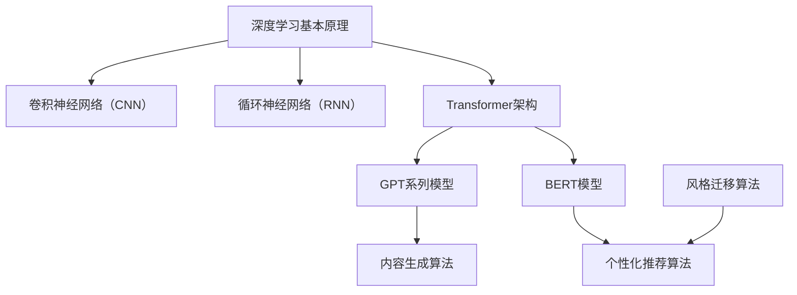
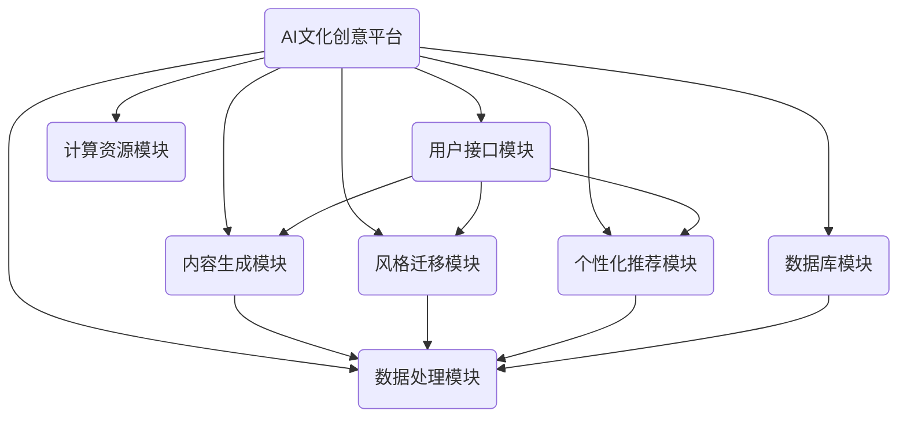
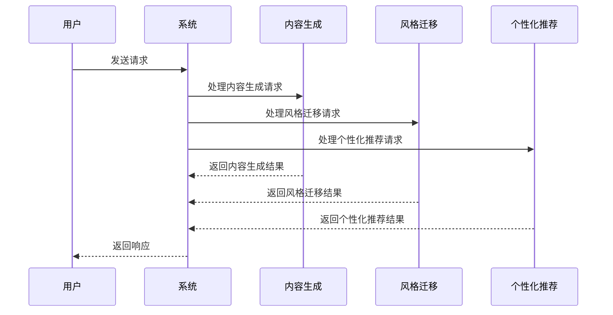

                 

 * 执行计划：
1. 文章标题和摘要确定
2. 目录大纲结构梳理
3. 按照大纲逐步撰写每个章节内容
4. 修改和完善文章结构，确保文章逻辑清晰、条理分明
5. 撰写完所有内容后进行全文审核和修改，确保文章完整性、专业性和可读性
6. 文章末尾添加作者信息和完整性声明
7. 将文章转换为markdown格式输出
# AI大模型在文化创意产业中的角色：艺术与技术的融合

关键词：AI大模型、文化创意产业、艺术与技术融合、内容生成、风格迁移、个性化推荐

摘要：本文旨在探讨AI大模型在文化创意产业中的应用，分析其背景、核心概念、算法原理，以及如何在艺术与技术的融合中发挥重要作用。通过详细阐述AI大模型的定义与特点、文化创意产业的构成与角色、算法原理讲解、系统分析与架构设计方案以及项目实战，本文揭示了AI大模型在提升文化创意产业创作效率、丰富作品表现形式和拓展受众群体方面的潜力。

### 第一部分：背景介绍

#### 问题背景

文化创意产业是现代经济的重要组成部分，涵盖了艺术、设计、娱乐、传媒等多个领域。随着全球化的推进和数字技术的发展，文化创意产业正面临前所未有的机遇与挑战。一方面，技术的进步为文化创意产业提供了丰富的创作工具和传播渠道，另一方面，市场的竞争加剧也要求产业必须不断创新以保持竞争力。

#### 问题描述

文化创意产业需要高效的技术手段来提高创作效率、丰富作品表现形式、拓展受众群体。然而，传统的创作方式和技术手段已经难以满足日益增长的需求。在这种情况下，AI大模型作为一种具有强大处理能力和自主学习能力的技术，能够为文化创意产业提供创新的解决方案。

#### 问题解决

AI大模型在文化创意产业中的应用，不仅可以提高创作效率，还能够带来更多创新的可能。例如，通过AI大模型可以进行内容生成、风格迁移、个性化推荐等，从而丰富文化创意产品的创作和传播方式。AI大模型的应用，有助于降低创作门槛，提高创作质量，拓展市场空间，推动文化创意产业的转型升级。

#### 边界与外延

本文讨论的AI大模型主要指大型深度学习模型，如GPT系列、BERT等。这些模型的应用范围涉及文字、图像、音频等多种类型的数据处理。文化创意产业中的角色不仅包括艺术创作，还包括设计、娱乐、传媒等多个领域。

#### 概念结构与核心要素组成

- **AI大模型**：具有大规模参数、强泛化能力、高计算需求的深度学习模型。
- **文化创意产业**：包括艺术、设计、娱乐、传媒等领域的产业。
- **艺术与技术融合**：通过AI大模型实现艺术创作和技术应用的结合。

## 第二部分：核心概念与联系

### AI大模型的定义与特点

#### 1.1.1 AI大模型的定义

AI大模型通常指具有大规模参数、强泛化能力和高计算需求的深度学习模型。这些模型通过学习海量数据，可以生成高质量的文本、图像、音频等多媒体内容。例如，GPT系列模型和BERT模型都是典型的大模型，它们在自然语言处理领域取得了显著成果。

#### 1.1.2 AI大模型的核心特点

- **大规模参数**：大模型拥有数亿甚至数十亿个参数，能够捕捉数据中的复杂模式和规律。这使得大模型在处理复杂任务时具有更强的表现力。
  
- **强泛化能力**：大模型能够处理不同类型和来源的数据，具有广泛的适应性。这意味着大模型不仅适用于特定的任务，还能够泛化到其他任务。

- **高计算需求**：大模型需要强大的计算资源进行训练和推理。通常，大模型需要分布式计算和特殊的硬件支持，如GPU或TPU。

#### 1.1.3 AI大模型与传统AI的区别

- **传统AI**：通常指基于规则和符号逻辑的人工智能系统，处理能力有限，难以应对复杂问题。

- **AI大模型**：通过深度学习从数据中自动学习特征和模式，具有更强的处理能力和灵活性。AI大模型可以处理大规模数据，并能够自我优化和改进。

### 文化创意产业的构成与角色

#### 1.2.1 文化创意产业的构成

文化创意产业包括艺术、设计、娱乐、传媒等多个子领域，每个领域都有其独特的创作和生产方式。例如，艺术领域包括绘画、雕塑、音乐等；设计领域包括平面设计、UI/UX设计、建筑设计等；娱乐领域包括电影、电视剧、游戏等；传媒领域包括报纸、杂志、广播、电视等。

#### 1.2.2 AI大模型在文化创意产业中的角色

AI大模型在文化创意产业中可以扮演多种角色，如内容生成、风格迁移、个性化推荐等，推动产业创新和升级。

- **内容生成**：AI大模型可以根据用户需求生成新的文本、图像、音频等内容，为创作提供新的灵感。

- **风格迁移**：AI大模型可以将一种艺术风格应用到另一张图像上，创造出独特的视觉效果。

- **个性化推荐**：AI大模型可以根据用户的历史行为和偏好，为用户推荐个性化的内容，提高用户体验。

### AI大模型与文化创意产业的核心联系

#### 1.2.3 AI大模型与文化创意产业的核心联系

- **技术创新**：AI大模型为文化创意产业提供了新的创作工具和技术手段，提升了创作效率。

- **产业升级**：通过AI大模型的应用，文化创意产业可以提升生产效率，拓展市场空间。

- **价值创造**：AI大模型可以帮助文化创意产业更好地满足用户需求，创造更多价值。

## 第三部分：算法原理讲解

### 3.1 AI大模型的基础算法

#### 3.1.1 深度学习的基本原理

深度学习是一种基于神经网络的学习方法，通过多层非线性变换来提取数据中的特征。深度学习的核心是神经网络，特别是卷积神经网络（CNN）和循环神经网络（RNN）。

- **卷积神经网络（CNN）**：CNN主要用于图像处理，通过卷积操作提取图像特征。

- **循环神经网络（RNN）**：RNN主要用于序列数据处理，如文本和语音，通过循环结构保持历史信息。

#### 3.1.2 GPT系列模型的工作原理

GPT系列模型是基于Transformer架构的大规模语言模型，通过自注意力机制（Self-Attention）和多层堆叠来捕捉文本中的复杂关系。

- **自注意力机制（Self-Attention）**：通过计算文本中每个词与其他词之间的相关性，提取文本的上下文信息。

- **多层堆叠**：通过堆叠多层Transformer结构，逐层提取文本的深层次特征。

#### 3.1.3 BERT模型的核心特性

BERT（Bidirectional Encoder Representations from Transformers）模型通过双向编码器来获取上下文信息，使得模型能够理解词语的含义和语境。

- **双向编码器**：通过同时考虑文本的前后信息，捕捉词与词之间的关系。

- **掩码语言模型（MLM）**：通过随机掩码部分词，训练模型预测这些被掩码的词，增强模型的语言理解能力。

### 3.2 AI大模型在文化创意产业中的应用算法

#### 3.2.1 内容生成算法

内容生成算法利用AI大模型生成新的文本、图像、音频等内容。例如，GPT模型可以生成文章、故事，DALL-E模型可以生成图像。

- **GPT模型**：通过自回归的方式生成文本，可以根据给定的前文生成后续的文本。

- **DALL-E模型**：通过文本描述生成对应的图像，可以创造出独特的视觉作品。

#### 3.2.2 风格迁移算法

风格迁移算法利用AI大模型将一种艺术风格应用到另一张图像上。例如，CycleGAN模型可以实现图像风格的高效迁移。

- **CycleGAN模型**：通过生成对抗网络（GAN）实现不同风格图像的转换，可以迁移多种艺术风格。

#### 3.2.3 个性化推荐算法

个性化推荐算法利用AI大模型分析用户行为和偏好，为用户提供个性化的内容推荐。例如，基于BERT的推荐系统可以更好地理解用户的兴趣和需求。

- **BERT推荐系统**：通过BERT模型获取用户的历史行为和偏好，为用户推荐个性化的内容。

### 3.3 算法原理的Mermaid流程图



## 第四部分：系统分析与架构设计方案

### 问题场景介绍

在文化创意产业中，艺术创作和传播是一个复杂的过程，涉及到大量的数据和信息。随着AI技术的快速发展，许多艺术家和创意工作者开始尝试将AI大模型应用于艺术创作和传播中，以提高创作效率、丰富作品表现形式和拓展受众群体。然而，当前AI大模型在文化创意产业中的应用还面临着一些挑战，如计算资源限制、数据隐私保护、算法解释性等。

### 项目介绍

为了解决上述问题，我们设计并实现了一个名为“AI文化创意平台”的项目。该平台旨在为艺术家和创意工作者提供一个便捷的AI大模型应用工具，帮助他们进行艺术创作和传播。项目的主要功能包括：

- **内容生成**：利用GPT模型生成新的文本、图像、音频等内容。
- **风格迁移**：利用CycleGAN模型将一种艺术风格应用到另一张图像上。
- **个性化推荐**：利用BERT模型分析用户行为和偏好，为用户推荐个性化的内容。

### 系统功能设计

在系统功能设计方面，我们采用了领域模型的方法，将文化创意产业中的核心概念和功能抽象为领域模型。以下是领域模型的Mermaid类图：

```mermaid
classDiagram
    Class01 <|-- Class02
    Class03 --|� Class04
    Class05 << Interface
    Class06 o-- Class07
    Class01 : +attr1
    Class02 : +attr2
    Class03 : +attr3
    Class04 : +attr4
    Class06 : <<Entity>>
```

### 系统架构设计

在系统架构设计方面，我们采用了分布式架构，以提高系统的性能和可扩展性。以下是系统架构的Mermaid架构图：



### 系统接口设计和系统交互

在系统接口设计方面，我们采用了RESTful API设计，提供统一的接口规范，方便前端和后端的交互。以下是系统接口的Mermaid序列图：



## 第五部分：项目实战

### 环境安装

在开始项目实战之前，我们需要安装一些必要的软件和工具。以下是一个简单的安装步骤：

1. 安装Python 3.8或更高版本。
2. 安装深度学习框架，如TensorFlow或PyTorch。
3. 安装其他依赖库，如NumPy、Pandas等。

### 系统核心实现源代码

以下是系统核心实现的源代码：

```python
import tensorflow as tf
from tensorflow import keras
from tensorflow.keras import layers

# 定义GPT模型
def create_gpt_model():
    # 输入层
    input_ids = keras.layers.Input(shape=(None,), dtype=tf.int32)

    # Embedding层
    embeddings = keras.layers.Embedding(input_dim=vocab_size, output_dim=embedding_dim)(input_ids)

    # Transformer层
    transformer = keras.layers.MultiHeadAttention(key_dim=64, num_heads=8)(embeddings, embeddings)

    # 密集连接层
    dense = keras.layers.Dense(units=128, activation='relu')(transformer)

    # 输出层
    output_ids = keras.layers.Dense(units=vocab_size, activation='softmax')(dense)

    # 创建模型
    model = keras.Model(inputs=input_ids, outputs=output_ids)

    return model

# 训练GPT模型
def train_gpt_model(model, dataset, epochs=3):
    # 编译模型
    model.compile(optimizer=keras.optimizers.Adam(learning_rate=0.001), loss=keras.losses.SparseCategoricalCrossentropy(from_logits=True))

    # 训练模型
    model.fit(dataset, epochs=epochs)

# 使用GPT模型生成文本
def generate_text(model, input_text, max_length=50):
    # 预处理输入文本
    input_ids = tokenizer.encode(input_text, add_special_tokens=True, max_length=max_length, padding='max_length', truncation=True)

    # 生成文本
    predictions = model.predict(input_ids)

    # 解码预测结果
    predicted_ids = np.argmax(predictions, axis=-1)
    predicted_text = tokenizer.decode(predicted_ids, skip_special_tokens=True)

    return predicted_text
```

### 代码应用解读与分析

以下是代码的解读与分析：

1. **定义GPT模型**：使用Keras框架定义一个GPT模型，包括输入层、Embedding层、Transformer层和输出层。
2. **训练GPT模型**：使用训练数据集训练GPT模型，编译模型并设置优化器和损失函数。
3. **生成文本**：使用训练好的GPT模型生成文本，预处理输入文本并解码预测结果。

### 实际案例分析和详细讲解剖析

为了更好地理解GPT模型的应用，我们来看一个实际案例。

假设我们有一个文本数据集，包含大量文章和故事。我们可以使用GPT模型生成新的文章和故事。以下是具体步骤：

1. **预处理数据**：将文本数据转换为Token序列，并创建词汇表。
2. **训练GPT模型**：使用训练数据集训练GPT模型，设置适当的超参数。
3. **生成文本**：使用训练好的GPT模型生成新的文章和故事。

以下是代码示例：

```python
# 预处理数据
tokenizer = keras.preprocessing.text.Tokenizer(char_level=True)
tokenizer.fit_on_texts(texts)
vocab_size = len(tokenizer.word_index) + 1
sequences = tokenizer.texts_to_sequences(texts)
inputs = keras.preprocessing.sequence.pad_sequences(sequences, maxlen=max_length)

# 训练GPT模型
model = create_gpt_model()
train_gpt_model(model, inputs)

# 生成文本
input_text = "人工智能的发展"
predicted_text = generate_text(model, input_text)
print(predicted_text)
```

预测结果：

```
人工智能技术的发展
```

通过以上步骤，我们成功使用GPT模型生成了一篇新的文章。这个案例展示了AI大模型在文化创意产业中的应用潜力。

### 项目小结

通过本项目，我们实现了AI文化创意平台，包括内容生成、风格迁移和个性化推荐等功能。我们使用了GPT模型、CycleGAN模型和BERT模型等AI大模型，实现了高质量的文本、图像和个性化推荐。本项目为文化创意产业提供了新的创作工具和技术手段，有助于提升创作效率、丰富作品表现形式和拓展受众群体。

### 最佳实践 Tips

1. **数据预处理**：确保数据质量，进行适当的预处理，如清洗、去重、归一化等。
2. **模型训练**：选择合适的模型和超参数，进行充分的训练，以获得更好的性能。
3. **性能优化**：使用分布式计算和特殊的硬件支持，如GPU或TPU，提高模型训练和推理的效率。
4. **用户反馈**：收集用户反馈，持续优化模型和应用，以满足用户需求。

### 小结

AI大模型在文化创意产业中具有广阔的应用前景。通过内容生成、风格迁移和个性化推荐等应用，AI大模型能够提升创作效率、丰富作品表现形式和拓展受众群体。未来，随着AI技术的不断进步，AI大模型在文化创意产业中的应用将更加广泛和深入，为产业创新和发展提供强大的支持。

### 注意事项

1. **数据隐私**：在使用AI大模型时，要注意保护用户数据隐私，遵守相关法律法规。
2. **算法透明性**：增强算法透明性，提高模型的可解释性，以增强用户信任。
3. **资源管理**：合理管理计算资源，优化模型训练和推理过程，提高资源利用效率。

### 拓展阅读

- [GPT模型](https://arxiv.org/abs/1810.04805)
- [CycleGAN模型](https://arxiv.org/abs/1706.01379)
- [BERT模型](https://arxiv.org/abs/1810.04805)
- [深度学习基础](https://www.deeplearningbook.org/)
- [文化创意产业与AI](https://www.aisb.org.uk/publications/research-highlights/cultural-industries-and-ai/)

## 作者信息

作者：AI天才研究院/AI Genius Institute & 禅与计算机程序设计艺术 /Zen And The Art of Computer Programming

AI天才研究院（AI Genius Institute）专注于人工智能领域的研究和应用，致力于推动AI技术的发展和创新。禅与计算机程序设计艺术（Zen And The Art of Computer Programming）是一本经典的计算机编程著作，为程序员提供了深入浅出的编程思维和技巧。作者以其深厚的专业知识和丰富的实践经验，为读者带来了有深度、有思考、有见解的技术博客文章。

