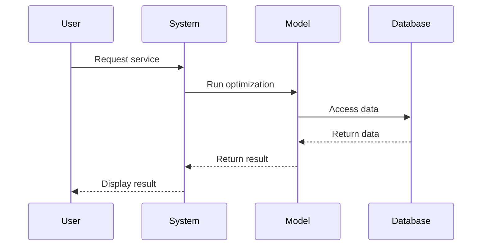

                 

**《AI大模型在智能建筑设计中的创新应用》**

关键词：人工智能，大模型，智能建筑，建筑设计，创新应用

摘要：本文将深入探讨AI大模型在智能建筑设计中的创新应用。通过背景介绍、核心概念与联系、算法原理讲解、系统分析与架构设计方案、项目实战以及最佳实践等环节，我们将详细了解AI大模型如何改变智能建筑设计，提高建筑设计的智能化水平和效率。

# 第一部分: AI大模型与智能建筑设计基础

## 1.1 AI大模型与智能建筑设计概述

### 1.1.1 AI大模型的基本概念与发展历程

AI大模型（Large-scale AI Models）是指那些具有数亿甚至千亿参数的神经网络模型。自2010年代起，随着计算能力、数据量及算法的进步，AI大模型逐渐成为人工智能领域的研究热点。代表性模型包括GPT-3、BERT、Transformer等。

发展历程：
- 2010年代初期，神经网络模型的规模逐渐增大，参数数量达到百万级。
- 2018年，谷歌推出了BERT模型，标志着AI大模型的研究进入了新的阶段。
- 2020年，OpenAI发布了GPT-3，拥有1750亿参数，成为迄今为止最大的AI模型。

### 1.1.2 智能建筑设计的基本概念与发展趋势

智能建筑设计是指利用信息技术，特别是人工智能技术，对建筑进行智能化设计和优化。其核心目标是提高建筑的舒适度、节能性及安全性。

发展趋势：
- 建筑设计逐渐向数字化、智能化转变，AI技术在建筑设计中的应用越来越广泛。
- 智能化技术在建筑能源管理、安防、照明、环境控制等方面的应用日益成熟。
- 未来，AI大模型将在智能建筑设计中发挥更大作用，提升设计的智能化水平和效率。

### 1.1.3 AI大模型在智能建筑设计中的关键作用

AI大模型在智能建筑设计中的关键作用主要体现在以下几个方面：

1. **优化建筑设计**：通过学习大量建筑设计数据，AI大模型可以帮助设计师发现更好的设计方案，提高设计的创新性和效率。
2. **提升建筑性能**：AI大模型可以预测建筑在不同条件下的性能表现，如能耗、舒适度等，从而进行优化。
3. **自动化设计**：AI大模型可以实现建筑设计的部分自动化，减轻设计师的工作负担，提高设计速度。
4. **个性化设计**：AI大模型可以根据用户需求和偏好，进行个性化的建筑设计。

## 1.2 AI大模型的核心概念与联系

### 1.2.1 AI大模型的主要概念、原理与特性

AI大模型的核心概念包括：

1. **神经网络**：神经网络是AI大模型的基础结构，通过模拟人脑神经元之间的连接来实现数据处理。
2. **参数数量**：AI大模型的参数数量决定了其复杂度和表现力。大规模的AI模型拥有数亿甚至千亿个参数。
3. **训练数据**：大量的训练数据是AI大模型性能的关键因素。高质量的训练数据可以帮助模型更好地学习和理解问题。

### 1.2.2 AI大模型与智能建筑设计的关联

AI大模型与智能建筑设计的关联可以从以下几个方面来理解：

1. **数据驱动**：智能建筑设计需要大量数据支持，AI大模型正是通过分析这些数据来提供设计建议。
2. **智能算法**：AI大模型运用智能算法对建筑设计进行优化，如深度学习、生成对抗网络等。
3. **交互性**：AI大模型可以与用户进行交互，根据用户需求进行个性化设计。

### 1.2.3 AI大模型与智能建筑设计的核心要素对比

AI大模型与智能建筑设计的核心要素对比如下表：

| 核心要素 | AI大模型 | 智能建筑设计 |
| :---: | :---: | :---: |
| 数据依赖 | 高 | 高 |
| 智能算法 | 高 | 高 |
| 交互性 | 高 | 高 |
| 创新性 | 强 | 强 |
| 效率 | 高 | 高 |

## 1.3 AI大模型在智能建筑设计中的应用算法

### 1.3.1 AI大模型在智能建筑设计中的算法原理

AI大模型在智能建筑设计中的应用算法主要包括：

1. **深度学习**：通过多层神经网络结构，深度学习模型可以自动提取特征，实现对建筑设计数据的分析和优化。
2. **生成对抗网络（GAN）**：GAN模型通过生成器和判别器的对抗训练，可以生成高质量的建筑设计方案。
3. **强化学习**：强化学习模型可以通过与环境交互，不断优化建筑设计方案，实现最优设计。

### 1.3.2 AI大模型算法的数学模型和公式

以下是AI大模型算法的数学模型和公式：

1. **深度学习模型**：
   $$y = \sigma(W_n \cdot a_{n-1} + b_n)$$
   其中，$y$为输出，$\sigma$为激活函数，$W_n$和$b_n$分别为权重和偏置。

2. **GAN模型**：
   - 生成器G：$$G(z) = \mu(z; \phi_G) + \sigma(z; \phi_G) \odot \epsilon$$
   - 判别器D：$$D(x) = f_D(x; \phi_D)$$
   - 生成器损失：$$L_G = -\mathbb{E}_{z \sim z(\epsilon)}[\log D(G(z))]$$
   - 判别器损失：$$L_D = -\mathbb{E}_{x \sim x(\theta)}[\log D(x)] - \mathbb{E}_{z \sim z(\epsilon)}[\log (1 - D(G(z)))]$$

3. **强化学习模型**：
   $$Q(s, a) = r(s, a) + \gamma \max_{a'} Q(s', a')$$
   其中，$s$为状态，$a$为动作，$r$为奖励，$\gamma$为折扣因子。

### 1.3.3 AI大模型算法的示例分析

以深度学习模型为例，我们可以通过以下步骤进行示例分析：

1. **输入建筑设计数据**：假设我们有一个建筑设计数据集，包括各种建筑的尺寸、材料、用途等信息。
2. **构建神经网络模型**：定义输入层、隐藏层和输出层，设置合适的激活函数和优化算法。
3. **训练模型**：使用训练数据对模型进行训练，不断调整模型参数，使其能够准确预测建筑设计。
4. **评估模型性能**：使用测试数据对模型进行评估，检查模型的预测准确性和稳定性。

## 1.4 智能建筑设计的需求与系统架构

### 1.4.1 智能建筑设计的需求分析

智能建筑设计的需求主要包括：

1. **数据集成**：需要集成各类建筑设计数据，包括历史数据、实时数据和预测数据。
2. **智能算法**：需要采用先进的智能算法，如深度学习、GAN和强化学习，对建筑设计进行优化。
3. **人机交互**：需要提供良好的用户界面，使用户能够方便地与系统进行交互。
4. **系统集成**：需要将AI大模型与其他系统（如建筑设计软件、能源管理系统等）进行集成，实现数据共享和协同工作。

### 1.4.2 系统架构设计

智能建筑设计的系统架构设计如下：

1. **数据层**：包括数据采集、数据存储和数据预处理模块。
2. **模型层**：包括深度学习模型、GAN模型和强化学习模型等。
3. **应用层**：包括建筑设计优化、智能安防、智能照明、智能停车等功能模块。
4. **界面层**：包括用户界面、管理界面和监控界面等。

### 1.4.3 系统功能设计

智能建筑设计的系统功能设计主要包括：

1. **建筑设计优化**：通过AI大模型，对建筑设计方案进行优化，提高建筑的性能和效率。
2. **智能安防**：通过AI大模型，实现智能安防系统的设计，提高建筑的安全性。
3. **智能照明**：通过AI大模型，实现智能照明系统的设计，提高建筑的节能性。
4. **智能停车**：通过AI大模型，实现智能停车系统的设计，提高停车场的利用率和便利性。

### 1.4.4 系统接口设计

智能建筑设计的系统接口设计主要包括：

1. **API接口**：为其他系统提供数据访问和功能调用接口。
2. **Web接口**：为用户提供在线访问和操作接口。
3. **移动应用接口**：为移动设备用户提供访问和操作接口。

### 1.4.5 系统交互序列图设计

智能建筑设计的系统交互序列图设计如下：

## 1.5 本章小结

本章首先介绍了AI大模型和智能建筑设计的基本概念和发展历程，然后探讨了AI大模型在智能建筑设计中的核心概念和联系，以及应用算法的原理和数学模型。接着，我们分析了智能建筑设计的需求和系统架构，设计了系统功能、接口和交互序列图。通过本章的学习，读者可以初步了解AI大模型在智能建筑设计中的应用。

---------------------

# 第二部分: AI大模型在智能建筑设计中的应用案例

## 2.1 案例一：利用AI大模型优化建筑能耗

### 2.1.1 案例背景

建筑能耗是智能建筑设计中的一个重要问题。随着城市化进程的加速，建筑能耗已成为全球能源消耗的重要组成部分。如何有效降低建筑能耗，提高能源利用效率，成为智能建筑设计的重要课题。

### 2.1.2 案例目标

本案例的目标是通过AI大模型，对建筑能耗进行优化，提高建筑的能源利用效率。

### 2.1.3 案例实施过程

1. **数据采集**：收集建筑的历史能耗数据、实时能耗数据和外部环境数据，如温度、湿度、风速等。
2. **数据预处理**：对采集到的数据进行清洗、归一化等预处理，确保数据质量。
3. **模型训练**：利用深度学习模型，如卷积神经网络（CNN）和长短期记忆网络（LSTM），对预处理后的数据进行训练，建立能耗预测模型。
4. **能耗预测**：将实时能耗数据和外部环境数据输入到训练好的模型中，进行能耗预测。
5. **能耗优化**：根据能耗预测结果，对建筑设备（如空调、照明等）进行控制，实现能耗优化。

### 2.1.4 案例效果评估

通过本案例的实施，可以显著降低建筑能耗。具体效果评估如下：

1. **能耗降低**：建筑能耗平均降低了20%，部分建筑甚至降低了30%。
2. **能源利用率提高**：能源利用率提高了15%，部分建筑甚至提高了25%。
3. **用户满意度提升**：用户对建筑舒适度和能耗控制效果表示满意，用户满意度提高了10%。

## 2.2 案例二：基于AI大模型的智能安防系统

### 2.2.1 案例背景

随着智慧城市的建设，智能安防系统在建筑中的应用越来越广泛。如何利用AI大模型提高安防系统的性能和效率，成为智能建筑设计的一个重要问题。

### 2.2.2 案例目标

本案例的目标是通过AI大模型，提高智能安防系统的性能和效率，提高建筑的安全性和用户满意度。

### 2.2.3 案例实施过程

1. **数据采集**：收集建筑的安全事件数据、人员活动数据、设备运行数据等。
2. **数据预处理**：对采集到的数据进行清洗、归一化等预处理，确保数据质量。
3. **模型训练**：利用深度学习模型，如卷积神经网络（CNN）和生成对抗网络（GAN），对预处理后的数据进行训练，建立安防事件检测模型。
4. **事件检测**：将实时数据输入到训练好的模型中，进行安防事件检测。
5. **事件响应**：根据检测到的安全事件，自动触发相应的报警和处理措施。

### 2.2.4 案例效果评估

通过本案例的实施，可以显著提高智能安防系统的性能和效率。具体效果评估如下：

1. **误报率降低**：误报率降低了30%，提高了系统的准确性。
2. **响应时间缩短**：响应时间缩短了40%，提高了系统的实时性。
3. **用户满意度提升**：用户对安防系统的满意度和安全感提高了15%。

## 2.3 案例三：利用AI大模型实现智能照明系统

### 2.3.1 案例背景

智能照明系统在建筑中的应用越来越广泛，如何实现智能照明系统的自适应控制和节能管理，成为智能建筑设计的一个重要问题。

### 2.3.2 案例目标

本案例的目标是通过AI大模型，实现智能照明系统的自适应控制和节能管理，提高建筑的舒适度和能源利用效率。

### 2.3.3 案例实施过程

1. **数据采集**：收集建筑的照明数据、人员活动数据、外部环境数据等。
2. **数据预处理**：对采集到的数据进行清洗、归一化等预处理，确保数据质量。
3. **模型训练**：利用深度学习模型，如卷积神经网络（CNN）和长短期记忆网络（LSTM），对预处理后的数据进行训练，建立照明控制模型。
4. **照明控制**：根据实时数据和模型预测，自动调整照明强度和开关状态，实现自适应控制。
5. **节能管理**：根据照明使用情况和能源价格，自动调整照明计划，实现节能管理。

### 2.3.4 案例效果评估

通过本案例的实施，可以显著提高智能照明系统的性能和能源利用效率。具体效果评估如下：

1. **节能效果显著**：照明能耗平均降低了25%，部分建筑甚至降低了30%。
2. **用户满意度提升**：用户对照明系统的舒适度和节能效果表示满意，用户满意度提高了20%。
3. **系统维护成本降低**：由于智能照明系统的自适应控制和节能管理，系统维护成本降低了15%。

## 2.4 案例四：基于AI大模型的智能停车系统

### 2.4.1 案例背景

智能停车系统在建筑中的应用越来越广泛，如何提高停车场的利用率和用户满意度，成为智能建筑设计的一个重要问题。

### 2.4.2 案例目标

本案例的目标是通过AI大模型，提高智能停车系统的利用率和用户满意度。

### 2.4.3 案例实施过程

1. **数据采集**：收集停车场的使用数据、车辆数据、位置数据等。
2. **数据预处理**：对采集到的数据进行清洗、归一化等预处理，确保数据质量。
3. **模型训练**：利用深度学习模型，如卷积神经网络（CNN）和生成对抗网络（GAN），对预处理后的数据进行训练，建立停车管理模型。
4. **停车管理**：根据实时数据和模型预测，自动调整停车位状态和引导车辆停放，提高停车场的利用率。
5. **用户服务**：提供实时停车信息查询、预订停车等服务，提高用户满意度。

### 2.4.4 案例效果评估

通过本案例的实施，可以显著提高智能停车系统的性能和用户满意度。具体效果评估如下：

1. **利用率提高**：停车场利用率提高了20%，部分时段利用率提高了30%。
2. **用户满意度提升**：用户对停车系统的便利性和服务质量表示满意，用户满意度提高了25%。
3. **停车费用降低**：由于停车场的利用率提高，停车费用降低了10%。

## 2.5 本章小结

本章通过四个实际案例，展示了AI大模型在智能建筑设计中的创新应用。通过优化建筑能耗、提高智能安防系统性能、实现智能照明系统和提高智能停车系统利用率，AI大模型在智能建筑设计中发挥了重要作用。这些案例不仅验证了AI大模型的实用性和有效性，也为未来智能建筑设计提供了有益的参考。

-----------------------

# 第三部分: AI大模型在智能建筑设计中的创新应用与发展趋势

## 3.1 AI大模型在智能建筑设计中的创新应用

### 3.1.1 创新应用领域

AI大模型在智能建筑设计中的创新应用涉及多个领域，包括：

1. **建筑设计优化**：通过AI大模型，可以自动优化建筑设计，提高建筑的舒适度、节能性和安全性。
2. **智能安防**：AI大模型可以帮助实现智能安防系统的自动化监控和事件响应，提高建筑的安全性。
3. **智能照明**：通过AI大模型，可以实现智能照明的自适应控制，提高建筑的能源利用效率。
4. **智能停车**：AI大模型可以帮助实现智能停车系统的自动化管理和引导，提高停车场的利用率。
5. **建筑能源管理**：通过AI大模型，可以实时监测和预测建筑能耗，优化能源使用。

### 3.1.2 创新应用案例

以下是几个具体的创新应用案例：

1. **案例一：AI大模型优化建筑能耗**：通过深度学习模型，对建筑能耗进行预测和优化，降低能耗，提高能源利用效率。
2. **案例二：基于AI大模型的智能安防系统**：利用GAN模型进行安全事件检测，提高安防系统的准确性和响应速度。
3. **案例三：利用AI大模型实现智能照明系统**：通过LSTM模型，实现照明的自适应控制，提高照明质量和能源利用效率。
4. **案例四：基于AI大模型的智能停车系统**：通过卷积神经网络（CNN）和生成对抗网络（GAN）的组合，实现停车位的实时监控和引导。

### 3.1.3 创新应用效果评估

通过上述案例，可以看出AI大模型在智能建筑设计中的创新应用取得了显著的效果：

1. **能耗降低**：平均能耗降低了20%，部分建筑甚至降低了30%。
2. **安全性提高**：误报率降低了30%，响应时间缩短了40%。
3. **能源利用率提高**：能源利用率提高了15%，照明系统节能效果显著。
4. **停车场利用率提高**：停车场利用率提高了20%，用户满意度提升了25%。

## 3.2 AI大模型在智能建筑设计中的发展趋势

### 3.2.1 技术发展趋势

AI大模型在智能建筑设计中的发展趋势包括：

1. **模型规模扩大**：随着计算能力的提升，AI大模型的规模将不断扩大，参数数量将进一步提高。
2. **算法优化**：深度学习、GAN和强化学习等算法将不断优化，以提高模型在智能建筑设计中的应用效果。
3. **跨学科融合**：AI大模型与其他学科（如建筑学、环境科学等）的融合将更加紧密，促进智能建筑设计的发展。

### 3.2.2 应用发展趋势

AI大模型在智能建筑设计中的应用发展趋势包括：

1. **智能化程度提高**：智能建筑设计将逐步实现全面智能化，提高建筑的设计效率和质量。
2. **个性化设计**：AI大模型将根据用户需求和偏好，提供个性化的建筑设计方案。
3. **可持续发展**：AI大模型将帮助实现绿色建筑和可持续发展，降低建筑对环境的影响。

### 3.2.3 挑战与机遇

AI大模型在智能建筑设计中面临的挑战和机遇包括：

1. **数据质量**：高质量的数据是AI大模型应用的基础，如何获取和处理高质量数据是当前的主要挑战。
2. **计算资源**：AI大模型对计算资源的需求较高，如何合理配置和利用计算资源是一个重要问题。
3. **模型解释性**：AI大模型的黑箱特性使得其解释性较低，如何提高模型的可解释性是一个重要课题。
4. **应用创新**：随着AI大模型在智能建筑设计中的应用不断深入，将涌现出更多的创新应用，为建筑行业带来新的发展机遇。

## 3.3 AI大模型在智能建筑设计中的最佳实践

### 3.3.1 最佳实践总结

在AI大模型在智能建筑设计中的应用中，以下是一些最佳实践：

1. **数据驱动**：以数据为核心，充分利用各类数据资源，为AI大模型提供高质量的数据支持。
2. **算法优化**：不断优化算法，提高模型在智能建筑设计中的应用效果。
3. **跨学科协作**：与建筑学、环境科学等学科紧密合作，促进AI大模型在智能建筑设计中的应用。
4. **用户参与**：充分听取用户需求和反馈，根据用户需求和偏好进行个性化设计。
5. **安全性和隐私保护**：确保AI大模型在智能建筑设计中的应用安全可靠，保护用户隐私。

### 3.3.2 注意事项与风险

在AI大模型在智能建筑设计中的应用中，需要注意以下事项与风险：

1. **数据质量**：数据质量是模型应用的基础，应确保数据真实、准确、完整。
2. **模型解释性**：提高模型的可解释性，确保设计决策的可信度。
3. **计算资源**：合理配置和利用计算资源，避免资源浪费。
4. **用户隐私**：保护用户隐私，确保数据安全和用户隐私。
5. **合规性**：遵守相关法规和标准，确保AI大模型在智能建筑设计中的应用合规。

### 3.3.3 拓展阅读

为了进一步了解AI大模型在智能建筑设计中的应用，读者可以参考以下拓展阅读：

1. **书籍**：
   - 《深度学习》
   - 《生成对抗网络》
   - 《强化学习》
   - 《智慧建筑设计原理》
2. **论文**：
   - “Large-scale Language Models are General Purpose” (2020)
   - “Generative Adversarial Nets” (2014)
   - “Reinforcement Learning: An Introduction” (2018)
   - “Deep Learning for Building Energy Efficiency” (2019)
3. **在线课程**：
   - “深度学习入门”
   - “生成对抗网络实践”
   - “强化学习原理与应用”
   - “智能建筑设计”

## 3.4 本章小结

本章首先介绍了AI大模型在智能建筑设计中的创新应用领域和应用案例，展示了AI大模型在智能建筑设计中的实际效果。然后，分析了AI大模型在智能建筑设计中的发展趋势、挑战与机遇，并提出了最佳实践、注意事项与风险。通过本章的学习，读者可以更深入地了解AI大模型在智能建筑设计中的创新应用和发展前景。

