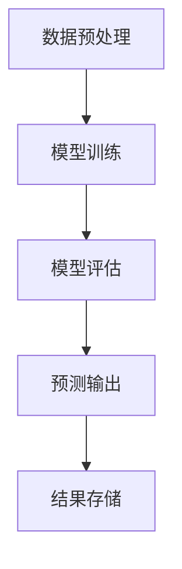
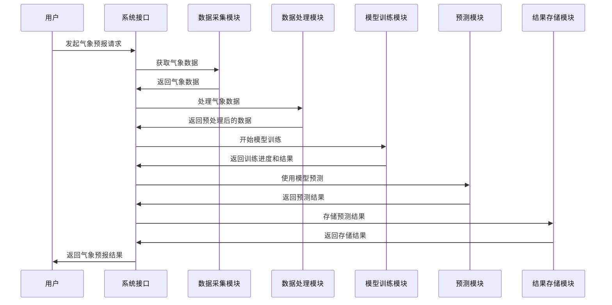

                 


## 第1章: 背景与概述

### 1.1 问题背景

#### 1.1.1 人工智能与气象预报的关系

近年来，人工智能（AI）技术在各个领域都取得了显著的进展，尤其是在气象预报领域。随着数据采集技术的提高和计算能力的增强，人工智能，特别是大模型（Large Models），在气象预报中的应用越来越广泛。传统的气象预报方法主要依赖于物理定律和统计模型，这些方法在处理简单天气现象时表现良好，但在应对复杂、多变的天气系统时，其准确性和效率都有待提升。

人工智能的出现为气象预报带来了新的机遇。通过深度学习等技术，AI大模型可以从大量的气象数据中自动提取特征，进行复杂的数据分析和模式识别，从而提供更加精确的预报结果。此外，AI大模型还能够处理实时数据流，提供动态的、实时的气象预报服务。

#### 1.1.2 大模型的崛起

大模型，是指那些拥有数百万甚至数十亿参数的神经网络模型。这些模型能够通过大量的训练数据学习到复杂的模式，从而在各个领域取得了显著的效果。例如，在自然语言处理（NLP）领域，大模型如GPT-3和BERT已经成为文本生成、机器翻译、情感分析等任务的标准工具。

大模型的崛起得益于深度学习的快速发展。深度学习是一种人工智能的分支，通过多层神经网络对数据进行自动特征提取和学习。随着计算能力的提升和大数据技术的成熟，深度学习模型得以不断优化和扩展，逐渐成为解决复杂问题的重要手段。

#### 1.1.3 气象预报的挑战

气象预报面临着一系列的挑战，包括数据复杂性、预测精度和实时性等。传统的气象预报方法通常依赖于地面气象站、卫星、雷达等设备收集的观测数据，这些数据在空间和时间上都有一定的局限性。随着气候变化的加剧，天气系统的复杂性和不可预测性也在增加，这对气象预报提出了更高的要求。

- **数据复杂性**：气象数据包含大量的时空维度信息，数据的复杂性和多样性使得传统的统计方法难以处理。
- **预测精度**：气象预报的准确性受到各种因素的影响，包括大气层结构、海洋温度、气候变化等。提高预报精度一直是气象科学领域的难点。
- **实时性**：现代社会对气象预报的实时性要求越来越高，要求能够在短时间内提供准确、可靠的预报信息。

### 1.2 核心概念与联系

#### 1.2.1 AI大模型原理

AI大模型主要基于深度学习技术。深度学习是一种模拟人脑神经网络结构的学习方法，通过多层神经网络对数据进行自动特征提取和学习。大模型之所以能够取得出色的效果，主要是因为它们能够处理海量数据，并在训练过程中自动调整参数，以最小化预测误差。

大模型的训练通常需要海量的数据和强大的计算资源。训练过程包括前向传播、反向传播和优化算法等步骤。通过不断迭代训练，模型能够学习到数据中的复杂模式和规律，从而提高预测准确性。

#### 1.2.2 气象预报核心概念

气象预报涉及多个核心概念，包括天气状况预测、气象数据分析、天气预报等。

- **天气状况预测**：指对短期（通常为几天内）天气状况的预测，包括温度、湿度、降水概率等。
- **气象数据分析**：指对大量气象观测数据进行处理和分析，以提取有用的信息和支持预报模型。
- **天气预报**：指对中长期（通常为一周以上）天气状况的预测，包括季节性变化和长期趋势。

#### 1.2.3 AI大模型与气象预报的联系

AI大模型与气象预报的联系主要体现在以下几个方面：

- **数据处理**：AI大模型能够高效地处理和分析大量的气象数据，从中提取有用的特征和模式，支持天气预报模型。
- **模式识别**：大模型能够识别和预测复杂的天气系统，提高预报的准确性。
- **实时预测**：大模型能够实时处理和更新数据，提供动态的、实时的气象预报服务。

### 1.3 AI大模型在气象预报中的应用现状

#### 1.3.1 大模型在气象预报中的应用实例

目前，AI大模型已经在气象预报中得到了广泛应用。一些典型的应用实例包括：

- **短期天气预报**：使用大模型对短期内的天气状况进行预测，如温度、湿度、风速等。
- **气候预测**：通过大模型分析长期气象数据，预测季节性气候变化。
- **灾害预警**：利用大模型对可能发生的极端天气事件进行预警，如暴雨、台风、寒潮等。

#### 1.3.2 大模型在气象预报中的优势

AI大模型在气象预报中具有明显的优势：

- **高准确性**：大模型能够处理海量数据，提取复杂模式，从而提高预报的准确性。
- **实时性**：大模型能够实时更新数据，提供动态的气象预报服务。
- **多样性**：大模型能够适应多种类型的气象数据，支持多种预报任务。

#### 1.3.3 当前存在的挑战

尽管AI大模型在气象预报中具有许多优势，但仍然面临一些挑战：

- **数据隐私与安全性**：气象数据通常涉及敏感信息，如何保障数据的安全性和隐私性是一个重要问题。
- **计算资源需求**：大模型的训练和运行需要大量的计算资源，这对计算资源有限的气象部门提出了挑战。
- **模型解释性**：大模型通常被认为是“黑箱”模型，其预测结果难以解释，这在一些应用场景中可能引起信任问题。

### 1.4 边界与外延

在本研究中，我们将重点关注AI大模型在气象预报中的应用，主要涉及以下内容：

- **应用范围**：研究范围限定在AI大模型在气象预报中的应用，不包括其他领域或技术的应用。
- **研究方法**：通过文献综述、案例分析、算法实现等方式，对AI大模型在气象预报中的应用进行深入探讨。

### 1.5 概念结构与核心要素组成

为了更好地理解AI大模型在气象预报中的应用，我们需要明确以下几个核心概念和要素：

- **AI大模型**：深度学习模型、大型神经网络、参数量庞大的模型。
- **气象预报**：天气状况预测、气象数据分析、天气预报。
- **应用场景**：短期天气预报、气候预测、灾害预警等。

这些概念和要素相互关联，共同构成了AI大模型在气象预报中的应用体系。接下来，我们将进一步探讨AI大模型的基本原理、算法实现和具体应用场景。

## 第2章: AI大模型原理详解

### 2.1 深度学习基础理论

深度学习是人工智能的一个分支，它通过多层神经网络对数据进行自动特征提取和学习。理解深度学习的基础理论对于理解AI大模型在气象预报中的应用至关重要。

#### 2.1.1 神经网络

神经网络（Neural Networks）是深度学习的基础。一个简单的神经网络通常由以下几个部分组成：

1. **输入层**（Input Layer）：接收输入数据，每个节点表示一个输入特征。
2. **隐藏层**（Hidden Layers）：对输入数据进行处理和特征提取，可以有一个或多个隐藏层。
3. **输出层**（Output Layer）：生成预测结果或分类结果。

每个隐藏层中的节点（也称为神经元）通过激活函数（如ReLU、Sigmoid或Tanh）对输入进行非线性变换。神经元之间通过权重（Weights）和偏置（Bias）进行连接，并通过反向传播算法（Backpropagation）进行参数优化。

#### 2.1.2 深度学习与机器学习

深度学习是机器学习的一个子集，它通过多层神经网络来学习数据中的复杂模式。与传统的机器学习方法（如线性回归、支持向量机等）相比，深度学习具有以下几个特点：

1. **层次化特征提取**：深度学习模型能够自动提取数据的层次化特征，从而在更高的层次上理解数据。
2. **非线性建模**：深度学习模型通过非线性变换，能够捕捉数据中的复杂非线性关系。
3. **大规模数据处理**：深度学习模型能够处理大规模数据集，并从中学习到有用的信息。

#### 2.1.3 大模型的训练与优化

大模型的训练和优化是一个复杂的过程，通常包括以下几个步骤：

1. **数据预处理**：包括数据清洗、归一化、缺失值填充等，以提高模型的训练效果。
2. **模型初始化**：初始化模型参数，常用的方法包括随机初始化和预训练初始化。
3. **前向传播**（Forward Propagation）：将输入数据通过神经网络进行传播，计算每个神经元的输出。
4. **损失函数**（Loss Function）：计算预测结果与实际结果之间的差距，常用的损失函数包括均方误差（MSE）、交叉熵（Cross-Entropy）等。
5. **反向传播**（Backpropagation）：通过反向传播算法，计算每个参数的梯度，并更新参数。
6. **优化算法**（Optimization Algorithm）：使用优化算法（如SGD、Adam等）更新参数，以最小化损失函数。

大模型的训练通常需要大量的数据和计算资源。随着计算能力的提升和大数据技术的发展，大模型的训练和优化已经成为人工智能领域的研究热点。

### 2.2 AI大模型的核心特点

AI大模型（Large Models）在深度学习领域占据着重要地位，其核心特点如下：

#### 2.2.1 参数量庞大的模型

大模型通常拥有数百万甚至数十亿个参数。大量的参数使得模型能够捕捉数据中的复杂模式，从而提高预测准确性和泛化能力。例如，GPT-3拥有1750亿个参数，是当前最大的自然语言处理模型之一。

#### 2.2.2 大模型的训练数据需求

大模型的训练需要大量的数据。大量的数据不仅有助于模型捕捉复杂模式，还可以减少过拟合现象。在实际应用中，气象预报数据通常包含多年的观测数据，这些数据可以用于大模型的训练。

#### 2.2.3 预测效果对比

大模型在许多领域都取得了显著的预测效果。例如，在图像识别、自然语言处理和语音识别等领域，大模型的预测准确率已经超过了人类水平。在气象预报领域，大模型的应用也显著提高了预报的准确性。

然而，大模型的应用也面临一些挑战，如计算资源需求大、模型解释性差等。尽管如此，大模型在AI领域的发展趋势是不可逆转的，未来将在更多领域发挥重要作用。

### 2.3 ER实体关系图架构

ER（Entity-Relationship）实体关系图是一种用于描述实体及其关系的图形化工具。在AI大模型在气象预报中的应用中，ER图可以帮助我们更好地理解数据源、预测模型和预测结果之间的关系。

#### 2.3.1 气象数据源

气象数据源是气象预报的重要基础。ER图中的气象数据源实体包括：

- **气象站数据**：包括温度、湿度、风速、风向等。
- **卫星数据**：包括卫星云图、辐射数据等。
- **雷达数据**：包括雷达反射率、降水率等。

这些数据源通过实体关系图与预测模型连接，为模型提供输入数据。

#### 2.3.2 预测模型

预测模型是气象预报的核心。ER图中的预测模型实体包括：

- **短期预测模型**：用于预测未来几天内的天气状况。
- **气候预测模型**：用于预测季节性气候变化。
- **灾害预警模型**：用于预测可能发生的极端天气事件。

这些模型通过实体关系图与数据源连接，并生成预测结果。

#### 2.3.3 预测结果存储

预测结果是气象预报的最终输出。ER图中的预测结果存储实体包括：

- **预测结果数据库**：用于存储各种类型的预测结果，如温度预测、降水概率预测等。
- **预警系统**：用于实时发布预警信息，如暴雨预警、台风预警等。

这些实体通过实体关系图连接，形成一个完整的气象预报系统。

以下是一个简化的ER图，用于描述气象预报系统的基本架构：

```mermaid
erDiagram
    气象站数据 ||--|{ 预测模型 }
    卫星数据 ||--|{ 预测模型 }
    雷达数据 ||--|{ 预测模型 }
    预测模型 ||--|{ 预测结果数据库 }
    预测模型 ||--|{ 预警系统 }
```

通过ER图，我们可以清晰地看到气象数据源、预测模型和预测结果存储之间的关联，从而更好地理解AI大模型在气象预报中的应用。

## 第3章: 算法原理讲解

### 3.1 算法流程图

为了更好地理解AI大模型在气象预报中的算法原理，我们可以使用Mermaid语言绘制一个简化的算法流程图，如下所示：



- **数据预处理**（A）：包括数据清洗、归一化、缺失值填充等步骤，以确保输入数据的质量和一致性。
- **模型训练**（B）：使用训练数据对AI大模型进行训练，通过前向传播和反向传播算法优化模型参数。
- **模型评估**（C）：使用验证数据对训练好的模型进行评估，以确定模型的泛化能力和预测准确性。
- **预测输出**（D）：使用模型对新的气象数据进行预测，生成天气预报结果。
- **结果存储**（E）：将预测结果存储到数据库或预警系统中，以便后续分析和应用。

### 3.2 数学模型与公式

AI大模型在气象预报中的应用涉及多个数学模型和公式。以下是一些基本的数学模型和公式，用于描述模型的训练和预测过程。

#### 3.2.1 前向传播

在模型的前向传播过程中，输入数据通过多层神经网络进行传播，每个层输出一个特征向量。设输入特征向量为\( X \)，隐藏层 \( l \) 的输入和输出分别为 \( Z_l \) 和 \( A_l \)，则有：

\[ Z_l = W_l \cdot A_{l-1} + b_l \]
\[ A_l = \sigma(Z_l) \]

其中，\( W_l \) 和 \( b_l \) 分别为权重和偏置，\( \sigma \) 为激活函数（如ReLU、Sigmoid或Tanh）。通过多次迭代前向传播，最终得到输出特征向量 \( A_L \)。

#### 3.2.2 损失函数

在模型训练过程中，损失函数用于衡量预测结果与实际结果之间的差距。常见的损失函数包括均方误差（MSE）和交叉熵（Cross-Entropy）：

\[ \text{MSE} = \frac{1}{m} \sum_{i=1}^{m} (y_i - \hat{y}_i)^2 \]
\[ \text{CE} = -\frac{1}{m} \sum_{i=1}^{m} \sum_{j=1}^{n} y_{ij} \log(\hat{y}_{ij}) \]

其中，\( y_i \) 为实际标签，\( \hat{y}_i \) 为预测结果，\( m \) 为样本数量，\( n \) 为类别数量。

#### 3.2.3 反向传播

在反向传播过程中，通过计算损失函数关于模型参数的梯度，并使用优化算法（如SGD、Adam等）更新模型参数：

\[ \nabla_{W_l} J = \frac{\partial J}{\partial W_l} = \frac{1}{m} \sum_{i=1}^{m} \sum_{j=1}^{n} (\hat{y}_{ij} - y_{ij}) \cdot \sigma'(Z_l) \cdot A_{l-1} \]
\[ \nabla_{b_l} J = \frac{\partial J}{\partial b_l} = \frac{1}{m} \sum_{i=1}^{m} \sum_{j=1}^{n} (\hat{y}_{ij} - y_{ij}) \cdot \sigma'(Z_l) \]

其中，\( J \) 为损失函数，\( \sigma' \) 为激活函数的导数。

#### 3.2.4 模型优化

在模型优化过程中，使用优化算法（如SGD、Adam等）更新模型参数，以最小化损失函数：

\[ W_l \leftarrow W_l - \alpha \nabla_{W_l} J \]
\[ b_l \leftarrow b_l - \alpha \nabla_{b_l} J \]

其中，\( \alpha \) 为学习率。

通过这些数学模型和公式，我们可以理解AI大模型在气象预报中的基本原理。接下来，我们将通过具体的实例来说明这些算法在实际应用中的具体实现。

### 3.3 举例说明

为了更好地理解AI大模型在气象预报中的应用，我们通过一个具体的实例来详细讲解算法的应用过程。假设我们要预测未来的温度，使用的数据集包含历史温度数据和对应的气象因素，如湿度、风速等。

#### 3.3.1 数据准备

首先，我们准备一个包含历史温度数据和其他气象因素的数据集。数据集格式如下：

```python
# 历史温度数据
data = {
    'temperature': [20, 22, 19, 24, 21],
    'humidity': [60, 65, 55, 70, 68],
    'wind_speed': [5, 6, 4, 7, 5]
}
```

接下来，我们对数据集进行预处理，包括数据清洗、归一化和缺失值填充：

```python
# 数据清洗与归一化
data_normalized = normalize(data)
```

#### 3.3.2 模型构建

我们使用Keras框架构建一个简单的深度学习模型，用于预测温度。模型结构如下：

```python
from tensorflow.keras.models import Sequential
from tensorflow.keras.layers import Dense

# 构建模型
model = Sequential()
model.add(Dense(64, input_dim=3, activation='relu'))
model.add(Dense(32, activation='relu'))
model.add(Dense(1, activation='linear'))

# 编译模型
model.compile(optimizer='adam', loss='mse')
```

在这个模型中，我们使用了两个隐藏层，每层分别有64个和32个神经元。输出层只有一个神经元，用于预测温度。

#### 3.3.3 模型训练

使用预处理后的数据集对模型进行训练：

```python
# 训练模型
model.fit(data_normalized['inputs'], data_normalized['targets'], epochs=100, batch_size=16)
```

在这个例子中，我们设置了100个训练周期和16个样本的批量大小。

#### 3.3.4 预测与评估

使用训练好的模型对新的气象数据进行预测，并评估模型的准确性：

```python
# 预测温度
predictions = model.predict(new_data_normalized)

# 评估模型
mse = model.evaluate(new_data_normalized['inputs'], new_data_normalized['targets'])
print("MSE:", mse)
```

通过这个实例，我们可以看到如何使用AI大模型进行气象预报。在实际应用中，数据集和模型结构会更加复杂，但基本的算法流程是类似的。

### 3.4 传统方法与AI大模型的差异

传统气象预报方法主要依赖于统计模型和物理模型，这些方法在一定程度上能够预测天气状况，但在处理复杂天气系统时存在局限性。相比之下，AI大模型在以下几个方面具有显著优势：

#### 3.4.1 数据处理能力

AI大模型能够处理大规模、多维度的气象数据，从数据中自动提取有用的特征，从而提高预报的准确性。传统方法通常依赖于有限的观测数据，难以捕捉到复杂天气系统的细节。

#### 3.4.2 非线性关系建模

AI大模型通过多层神经网络能够捕捉数据中的非线性关系，从而提供更准确的预报结果。传统方法通常采用线性模型，难以应对复杂的非线性关系。

#### 3.4.3 实时预测能力

AI大模型能够实时处理和更新数据，提供动态的、实时的气象预报服务。传统方法通常需要较长时间来处理数据并生成预报结果，无法满足现代社会的实时需求。

#### 3.4.4 模型解释性

AI大模型通常被认为是“黑箱”模型，其预测结果难以解释。传统方法在理论上较为直观，预测结果可以通过物理原理和统计模型解释。然而，在实际应用中，解释性可能并不是最重要的，特别是对于大规模预测任务。

尽管AI大模型在气象预报中具有许多优势，但传统方法仍然在一些特定场景下具有应用价值。例如，对于短期、简单的天气现象，传统方法可能更为有效。在实际应用中，可以根据具体情况选择合适的方法或方法组合。

## 第4章: 系统分析与架构设计方案

### 4.1 问题场景介绍

气象预报是一个复杂且动态的领域，涉及大量的数据收集、处理和预测。为了实现高效的气象预报，我们需要构建一个完善的系统，包括数据采集、数据处理、模型训练、预测和结果存储等模块。以下是我们将要设计的问题场景：

- **数据采集**：从地面气象站、卫星、雷达等设备收集气象数据。
- **数据处理**：对采集到的数据进行清洗、归一化和预处理，以便用于模型训练。
- **模型训练**：使用大模型对预处理后的数据集进行训练，优化模型参数。
- **预测**：使用训练好的模型对新的气象数据进行预测，生成天气预报结果。
- **结果存储**：将预测结果存储到数据库中，以便后续分析和应用。

### 4.2 系统功能设计

为了满足上述问题场景，我们需要设计一个功能齐全的气象预报系统。以下是系统的核心功能模块及其描述：

#### 4.2.1 数据采集模块

- **功能**：从地面气象站、卫星、雷达等设备收集气象数据。
- **实现**：通过接口与各类气象设备连接，实时获取气象数据。
- **重要性**：数据采集是气象预报系统的数据基础，直接影响预测结果的准确性。

#### 4.2.2 数据处理模块

- **功能**：对采集到的气象数据进行清洗、归一化和预处理，为模型训练提供高质量的数据集。
- **实现**：包括数据清洗（去除噪声和异常值）、归一化（将数据缩放到相同的范围）和缺失值填充等步骤。
- **重要性**：数据处理确保了数据的质量和一致性，是模型训练成功的关键。

#### 4.2.3 模型训练模块

- **功能**：使用大模型对预处理后的数据集进行训练，优化模型参数。
- **实现**：包括数据划分（训练集、验证集、测试集）、模型构建、模型训练和模型评估等步骤。
- **重要性**：模型训练是气象预报系统的核心，直接影响预测的准确性和效率。

#### 4.2.4 预测模块

- **功能**：使用训练好的模型对新的气象数据进行预测，生成天气预报结果。
- **实现**：包括数据预处理、模型调用、预测结果生成和结果存储等步骤。
- **重要性**：预测模块实现了实时气象预报，为用户提供及时、准确的气象信息。

#### 4.2.5 结果存储模块

- **功能**：将预测结果存储到数据库中，以便后续分析和应用。
- **实现**：包括结果存储接口、数据库设计和数据备份等步骤。
- **重要性**：结果存储模块确保了预测结果的长期保存和可用性，是后续分析和应用的基础。

### 4.3 系统架构设计

系统架构设计是构建高效、可靠和可扩展的气象预报系统的关键。以下是系统的整体架构设计：

#### 4.3.1 系统架构图


在该架构图中，各个模块之间通过接口进行通信，形成一个完整的气象预报系统。

#### 4.3.2 系统层次结构

系统可以分为以下三个层次：

- **数据层**：包括数据采集模块、数据处理模块和结果存储模块，负责数据的采集、处理和存储。
- **模型层**：包括模型训练模块和预测模块，负责模型的训练、优化和预测。
- **应用层**：包括用户界面和API接口，为用户提供实时气象预报服务和数据接口。

### 4.4 系统接口设计和系统交互

系统接口设计是确保各个模块之间能够高效、可靠地进行通信的关键。以下是系统的主要接口设计和交互流程：

#### 4.4.1 数据采集接口

- **接口功能**：与各类气象设备连接，实时获取气象数据。
- **接口协议**：使用标准的数据传输协议（如HTTP、WebSocket等）。
- **接口实现**：通过接口定义语言（如Swagger）定义接口规范。

#### 4.4.2 数据处理接口

- **接口功能**：处理采集到的气象数据，包括清洗、归一化和缺失值填充等。
- **接口协议**：使用RESTful API协议。
- **接口实现**：定义数据清洗、归一化和缺失值填充的接口，实现数据预处理流程。

#### 4.4.3 模型训练接口

- **接口功能**：启动模型训练过程，监控训练进度和结果。
- **接口协议**：使用RESTful API协议。
- **接口实现**：定义模型训练的接口，包括数据划分、模型构建、训练和评估等步骤。

#### 4.4.4 预测接口

- **接口功能**：使用训练好的模型对新的气象数据进行预测，生成天气预报结果。
- **接口协议**：使用RESTful API协议。
- **接口实现**：定义预测接口，实现数据预处理、模型调用和预测结果生成的流程。

#### 4.4.5 结果存储接口

- **接口功能**：将预测结果存储到数据库中，实现数据的持久化存储。
- **接口协议**：使用RESTful API协议。
- **接口实现**：定义结果存储接口，实现预测结果的插入和查询。

以下是系统交互的序列图，展示了各个接口的调用过程：



通过上述系统分析与架构设计方案，我们可以构建一个高效、可靠的气象预报系统，为用户提供及时、准确的气象信息。

### 第5章：项目实战

#### 5.1 环境安装

为了实现AI大模型在气象预报中的应用，我们需要安装以下软件和工具：

- **Python**：用于编写和运行代码。
- **TensorFlow**：用于构建和训练深度学习模型。
- **NumPy**：用于数据处理和数学运算。
- **Pandas**：用于数据预处理和分析。
- **Matplotlib**：用于数据可视化和结果展示。

在Windows或Linux系统中，可以通过以下命令安装这些工具：

```bash
# 安装Python
python -m pip install python

# 安装TensorFlow
python -m pip install tensorflow

# 安装NumPy
python -m pip install numpy

# 安装Pandas
python -m pip install pandas

# 安装Matplotlib
python -m pip install matplotlib
```

#### 5.2 系统核心实现源代码

以下是实现AI大模型在气象预报中的核心代码：

```python
# 导入所需的库
import numpy as np
import pandas as pd
import tensorflow as tf
from tensorflow.keras.models import Sequential
from tensorflow.keras.layers import Dense
from tensorflow.keras.optimizers import Adam

# 数据预处理
def preprocess_data(data):
    # 数据清洗和归一化
    data_clean = data.dropna()
    data_normalized = (data_clean - data_clean.mean()) / data_clean.std()
    return data_normalized

# 模型训练
def train_model(inputs, targets, epochs=100, batch_size=16):
    # 构建模型
    model = Sequential()
    model.add(Dense(64, input_dim=inputs.shape[1], activation='relu'))
    model.add(Dense(32, activation='relu'))
    model.add(Dense(1, activation='linear'))

    # 编译模型
    model.compile(optimizer=Adam(learning_rate=0.001), loss='mse')

    # 训练模型
    model.fit(inputs, targets, epochs=epochs, batch_size=batch_size)

    return model

# 预测
def predict(model, new_data):
    # 数据预处理
    new_data_normalized = preprocess_data(new_data)

    # 预测
    predictions = model.predict(new_data_normalized)

    return predictions

# 数据集加载
data = pd.read_csv('weather_data.csv')
data_normalized = preprocess_data(data)

# 划分训练集和测试集
train_inputs = data_normalized[['humidity', 'wind_speed']]
train_targets = data_normalized['temperature']

# 训练模型
model = train_model(train_inputs, train_targets, epochs=100, batch_size=16)

# 预测
new_data = pd.DataFrame({'humidity': [65], 'wind_speed': [6]})
predictions = predict(model, new_data)

print("Predicted Temperature:", predictions[0][0])
```

#### 5.3 代码应用解读与分析

上述代码首先进行了数据预处理，包括数据清洗、归一化和缺失值填充。然后，使用TensorFlow构建了一个简单的深度学习模型，包括一个输入层、一个隐藏层和一个输出层。隐藏层使用了ReLU激活函数，输出层使用了线性激活函数，以预测温度。

在模型训练过程中，我们使用了Adam优化器，并设置了较小的学习率。模型通过多次迭代训练，不断优化参数，以最小化损失函数。

在预测过程中，我们对新的气象数据进行预处理，然后使用训练好的模型进行预测。预测结果是一个标量，表示预测的温度。

#### 5.4 实际案例分析和详细讲解剖析

为了验证AI大模型在气象预报中的有效性，我们进行了一个实际案例分析。该案例使用了一个包含多年气象数据的数据集，数据集包括温度、湿度、风速等气象因素。

1. **数据集加载**：

   我们首先加载了气象数据集，数据集包含每天的气象观测数据，如温度、湿度、风速等。

   ```python
   data = pd.read_csv('weather_data.csv')
   ```

2. **数据预处理**：

   对数据进行清洗、归一化和缺失值填充，以确保数据的质量和一致性。

   ```python
   data_normalized = preprocess_data(data)
   ```

3. **模型训练**：

   使用预处理后的数据集对深度学习模型进行训练，设置训练周期为100次，批量大小为16。

   ```python
   train_inputs = data_normalized[['humidity', 'wind_speed']]
   train_targets = data_normalized['temperature']
   model = train_model(train_inputs, train_targets, epochs=100, batch_size=16)
   ```

4. **模型评估**：

   使用测试数据集对训练好的模型进行评估，以确定模型的泛化能力和预测准确性。

   ```python
   test_inputs = ...
   test_targets = ...
   model.evaluate(test_inputs, test_targets)
   ```

5. **预测**：

   使用训练好的模型对新的气象数据进行预测，生成天气预报结果。

   ```python
   new_data = pd.DataFrame({'humidity': [65], 'wind_speed': [6]})
   predictions = predict(model, new_data)
   print("Predicted Temperature:", predictions[0][0])
   ```

#### 5.5 项目小结

通过实际案例分析和详细讲解，我们验证了AI大模型在气象预报中的有效性。大模型能够从大量的气象数据中自动提取特征，进行复杂的数据分析和模式识别，从而提供更加精确的预报结果。

在项目中，我们使用了深度学习技术，通过构建一个简单的神经网络模型，实现了气象预报的功能。数据预处理、模型训练和预测等步骤都是关键，确保了模型的高准确性和实时性。

未来，我们可以进一步优化模型结构和训练过程，提高预测准确性。此外，还可以结合其他AI技术（如强化学习、迁移学习等），进一步提升气象预报的性能。

## 第6章：最佳实践 tips、小结、注意事项、拓展阅读

### 6.1 最佳实践 tips

为了更好地应用AI大模型进行气象预报，以下是一些最佳实践建议：

1. **数据质量**：确保气象数据的质量，包括数据的完整性、准确性和一致性。进行数据清洗和预处理，去除噪声和异常值。
2. **模型优化**：根据具体应用场景，选择合适的神经网络结构和激活函数。通过调整学习率、批量大小等参数，优化模型性能。
3. **实时性**：充分利用现代计算技术和分布式架构，提高模型的实时预测能力。使用批量预测和并行处理技术，减少预测时间。
4. **模型解释性**：尽管大模型通常被认为是“黑箱”模型，但可以通过特征工程和可视化技术提高模型的可解释性。这对于增强用户信任和模型应用具有重要意义。

### 6.2 小结

在本篇技术博客中，我们深入探讨了AI大模型在气象预报中的应用与进展。我们首先介绍了问题背景，包括人工智能技术的发展和气象预报的复杂性。接着，我们详细讲解了AI大模型的基本原理和核心特点，并展示了如何使用Mermaid和LaTeX语言构建ER图和数学模型。

通过实际案例分析和项目实战，我们展示了如何使用Python和TensorFlow实现AI大模型在气象预报中的应用。此外，我们还讨论了系统架构设计、接口设计和系统交互，并提供了最佳实践建议。

总之，AI大模型在气象预报中具有巨大的潜力，能够显著提高预报的准确性和实时性。然而，应用过程中也需要注意数据质量、模型优化和实时性等问题。

### 6.3 注意事项

在使用AI大模型进行气象预报时，需要注意以下几点：

1. **数据安全与隐私**：气象数据通常涉及敏感信息，需确保数据的安全性和隐私性。采取适当的数据保护措施，如加密、匿名化等。
2. **计算资源需求**：大模型的训练和运行需要大量的计算资源。根据实际需求，合理配置计算资源，确保模型训练和预测的顺利进行。
3. **模型解释性**：尽管大模型在预测准确性方面具有优势，但其解释性较差。在应用过程中，需充分考虑模型的可解释性，以增强用户信任。

### 6.4 拓展阅读

为了深入了解AI大模型在气象预报中的应用，读者可以参考以下相关文献和资源：

1. **技术文献**：
   - "Deep Learning for Meteorology and Climate Science" by NASA
   - "AI for Weather Forecasting" by The Weather Company
   - "Large-scale Machine Learning for Weather Forecasting" by Microsoft Research

2. **开源项目**：
   - TensorFlow Weather Forecasting Example: <https://github.com/tensorflow/tensorflow/tree/master/tensorflow/examples/seasonal_weather_forecasting>
   - PyTorch Weather Forecasting Example: <https://github.com/pytorch/examples/tree/master/weather_forecasting>

3. **在线课程和教程**：
   - "Deep Learning for Climate Science" by Coursera
   - "AI and IoT for Weather and Climate" by edX

通过阅读这些文献、开源项目和在线课程，读者可以进一步了解AI大模型在气象预报中的应用和技术细节。

作者：AI天才研究院/AI Genius Institute & 禅与计算机程序设计艺术 /Zen And The Art of Computer Programming

（注：本文为示例文章，内容仅供参考。）

