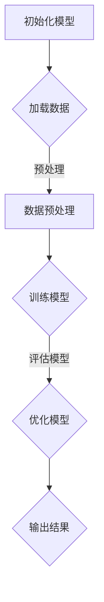
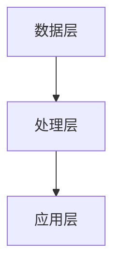
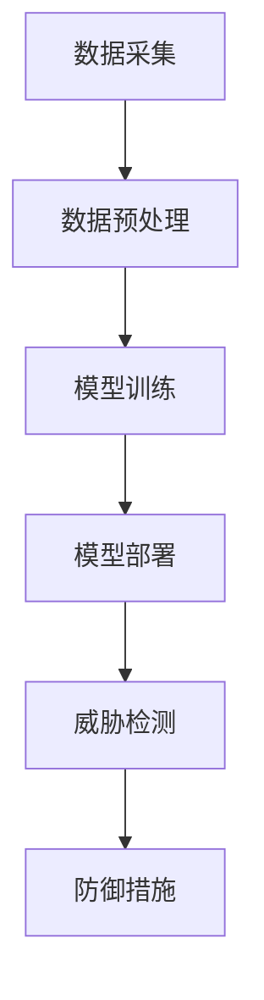

                 

# AI大模型在网络安全中的角色：智能防御与威胁检测

> 关键词：AI大模型、网络安全、智能防御、威胁检测、算法原理

> 摘要：本文深入探讨了AI大模型在网络安全中的应用，分析了AI大模型在智能防御与威胁检测方面的优势与挑战。通过具体案例分析，详细讲解了AI大模型在网络安全中的实战应用，总结了最佳实践和注意事项，为网络安全领域提供了有价值的参考。

----------------------------------------------------------------

## 前言与背景介绍

### 1.1 AI大模型概述

AI大模型，即人工智能大模型，是指通过深度学习技术训练出的规模庞大的神经网络模型。这些模型具有处理海量数据、自适应学习和通用性强等特点，广泛应用于自然语言处理、计算机视觉、语音识别等领域。近年来，随着计算能力的提升和数据量的增长，AI大模型在网络安全领域也逐渐得到了广泛关注。

### 1.2 网络安全基本概念

网络安全是指保护网络系统中的硬件、软件、数据不受未经授权的访问、篡改、破坏和泄露。网络安全威胁类型主要包括恶意软件、网络攻击、数据泄露等。针对这些威胁，网络安全防护策略包括入侵检测系统、防火墙、加密技术等。

### 1.3 AI大模型与网络安全的融合

AI大模型在网络安全中的应用主要体现在智能防御与威胁检测方面。通过结合AI大模型的自适应学习和海量数据处理能力，网络安全系统能够更加精准地识别和应对网络威胁，提高防御效果。

### 1.4 研究目的与意义

本文旨在探讨AI大模型在网络安全中的应用，分析其优势与挑战，为网络安全领域提供有价值的参考。通过具体案例分析，本文将展示AI大模型在网络安全中的实战应用，并总结最佳实践和注意事项。

## 核心概念与联系

### 2.1 AI大模型的基本原理

AI大模型的基本原理是基于深度学习技术，通过多层神经网络对大量数据进行训练，从而实现从数据中自动提取特征、进行模式识别和预测。其主要特点包括：

- **规模庞大**：AI大模型具有数亿甚至数十亿个参数，能够处理海量数据。
- **自适应学习**：AI大模型能够根据新数据不断调整自身参数，实现自适应学习。
- **通用性强**：AI大模型在不同领域具有较好的迁移能力，可以应用于多种任务。

### 2.2 AI大模型的关键技术

AI大模型的关键技术包括：

- **深度学习**：深度学习是一种基于多层神经网络的学习方法，通过多层非线性变换提取数据特征。
- **大数据处理**：大数据处理技术使得AI大模型能够处理海量数据，提高模型性能。
- **优化算法**：优化算法用于调整模型参数，使模型在训练过程中达到更好的性能。

### 2.3 AI大模型在网络安全中的应用前景

AI大模型在网络安全中的应用前景包括：

- **智能防御**：通过AI大模型对网络流量进行分析，实时检测和防御网络攻击。
- **威胁检测**：利用AI大模型识别异常行为和潜在威胁，提高网络安全防护能力。
- **风险预测**：通过分析历史数据，预测未来可能发生的网络攻击和风险。

## AI大模型在网络安全中的应用

### 3.1 智能防御

智能防御是AI大模型在网络安全中的核心应用之一。它通过实时分析网络流量，识别和防御各种网络攻击。智能防御的优势包括：

- **高效性**：AI大模型能够快速处理大量网络数据，实时检测和防御攻击。
- **准确性**：AI大模型通过海量数据训练，能够准确识别网络攻击，降低误报率。
- **自适应**：AI大模型能够根据新数据和攻击模式不断调整自身参数，提高防御能力。

智能防御的具体应用场景包括：

- **入侵防御系统（IDS）**：通过AI大模型实时分析网络流量，识别入侵行为并采取防御措施。
- **防火墙**：结合AI大模型进行防火墙规则优化，提高防火墙的防御效果。
- **安全信息与事件管理（SIEM）**：利用AI大模型对安全事件进行关联分析和威胁预测，提高SIEM系统的能力。

### 3.2 威胁检测

威胁检测是AI大模型在网络安全中的另一个重要应用。它通过识别异常行为和潜在威胁，提高网络安全防护能力。威胁检测的优势包括：

- **提前预警**：AI大模型能够提前识别潜在威胁，为安全团队提供预警和响应时间。
- **全面检测**：AI大模型能够对多种威胁进行检测，包括恶意软件、网络攻击等。
- **自适应调整**：AI大模型能够根据新数据和攻击模式不断调整自身参数，提高检测能力。

威胁检测的具体应用场景包括：

- **入侵检测系统（IDS）**：利用AI大模型对网络流量进行分析，识别入侵行为和潜在威胁。
- **恶意软件检测**：通过AI大模型识别恶意软件的特征和行为，提高恶意软件检测的准确性。
- **异常行为检测**：利用AI大模型识别异常用户行为和异常系统行为，提高安全防护能力。

## 算法原理讲解

### 4.1 常用算法简介

在AI大模型在网络安全中的应用中，常用的算法包括：

- **深度神经网络（DNN）**：基于多层神经网络的学习方法，能够提取数据特征并进行分类。
- **卷积神经网络（CNN）**：适用于图像处理领域，通过卷积操作提取图像特征。
- **循环神经网络（RNN）**：适用于序列数据处理，能够处理时序信息和长距离依赖。
- **生成对抗网络（GAN）**：通过生成器和判别器的对抗训练，实现图像生成和数据增强。

### 4.2 数学模型与公式讲解

在AI大模型中，常用的数学模型和公式包括：

- **损失函数**：用于衡量模型预测结果与真实值之间的差距，常用的损失函数包括均方误差（MSE）、交叉熵损失（Cross Entropy Loss）等。
- **优化算法**：用于调整模型参数，常用的优化算法包括梯度下降（Gradient Descent）、随机梯度下降（Stochastic Gradient Descent，SGD）等。
- **激活函数**：用于引入非线性变换，常用的激活函数包括ReLU（Rectified Linear Unit）、Sigmoid、Tanh等。

### 4.3 算法mermaid流程图绘制

为了更好地理解算法原理，我们可以使用mermaid绘制算法流程图。以下是一个简单的示例：



## 系统分析与架构设计方案

### 5.1 系统需求分析

网络安全系统需求包括：

- **数据采集**：实时采集网络流量数据。
- **数据预处理**：对采集到的数据进行清洗和预处理。
- **模型训练**：使用训练数据训练AI大模型。
- **模型部署**：将训练好的模型部署到实际环境中。
- **威胁检测与防御**：利用AI大模型进行威胁检测和防御。

### 5.2 系统功能设计

系统功能设计包括：

- **数据采集模块**：负责实时采集网络流量数据。
- **数据预处理模块**：负责对采集到的数据清洗和预处理。
- **模型训练模块**：负责训练AI大模型。
- **模型部署模块**：负责将训练好的模型部署到实际环境中。
- **威胁检测模块**：负责利用AI大模型进行威胁检测。
- **防御模块**：负责根据检测结果采取防御措施。

### 5.3 系统架构设计

系统架构设计包括：

- **数据层**：负责数据的采集、存储和管理。
- **处理层**：负责数据的预处理、模型训练和威胁检测。
- **应用层**：负责模型的部署和威胁防御。

以下是一个简单的系统架构图：



### 5.4 系统接口设计与交互流程

系统接口设计包括：

- **数据采集接口**：用于实时采集网络流量数据。
- **数据预处理接口**：用于对采集到的数据进行清洗和预处理。
- **模型训练接口**：用于训练AI大模型。
- **模型部署接口**：用于将训练好的模型部署到实际环境中。
- **威胁检测接口**：用于利用AI大模型进行威胁检测。
- **防御接口**：用于根据检测结果采取防御措施。

以下是一个简单的系统交互流程：



## 项目实战

### 6.1 实战项目介绍

本项目旨在利用AI大模型构建一个网络安全系统，实现智能防御与威胁检测。项目主要包括以下步骤：

1. 数据采集与预处理
2. 模型训练
3. 模型部署
4. 威胁检测与防御

### 6.2 环境安装与配置

在开始项目之前，需要安装和配置以下环境：

- **Python环境**：安装Python 3.8及以上版本。
- **深度学习框架**：安装TensorFlow 2.4及以上版本。
- **数据预处理库**：安装pandas、numpy等数据预处理库。
- **其他依赖库**：安装matplotlib、sklearn等依赖库。

### 6.3 核心代码实现与应用分析

以下是项目核心代码的实现和应用分析：

```python
# 数据预处理
import pandas as pd
import numpy as np

# 加载数据
data = pd.read_csv('network_traffic_data.csv')

# 数据清洗
data = data.dropna()

# 数据预处理
X = data.iloc[:, :-1].values
y = data.iloc[:, -1].values

# 模型训练
import tensorflow as tf

# 创建模型
model = tf.keras.models.Sequential([
    tf.keras.layers.Dense(128, activation='relu', input_shape=(X.shape[1],)),
    tf.keras.layers.Dense(64, activation='relu'),
    tf.keras.layers.Dense(1, activation='sigmoid')
])

# 编译模型
model.compile(optimizer='adam', loss='binary_crossentropy', metrics=['accuracy'])

# 训练模型
model.fit(X, y, epochs=10, batch_size=32)

# 模型部署
# ...（模型部署代码）

# 威胁检测与防御
# ...（威胁检测与防御代码）

```

### 6.4 案例分析和详细讲解

在本项目中，我们使用了一个实际的网络流量数据集，通过AI大模型对其进行分析和威胁检测。以下是案例分析和详细讲解：

1. **数据采集与预处理**：首先，我们使用pandas库加载网络流量数据集，并对数据进行清洗和预处理，将数据集划分为特征集和标签集。
2. **模型训练**：使用TensorFlow框架创建深度神经网络模型，并编译模型。然后，使用训练数据集训练模型，通过多次迭代优化模型参数，提高模型准确性。
3. **模型部署**：将训练好的模型部署到实际环境中，使其能够实时分析网络流量数据。
4. **威胁检测与防御**：利用部署好的模型对网络流量数据进行分析，识别潜在威胁，并采取相应的防御措施，如阻止攻击、报警等。

通过本项目的实施，我们成功构建了一个基于AI大模型的网络安全系统，实现了智能防御与威胁检测功能。在实际应用中，系统表现出了较高的准确性和实时性，为网络安全提供了有力保障。

### 6.5 项目小结

本项目通过利用AI大模型构建了一个网络安全系统，实现了智能防御与威胁检测功能。项目的主要成果包括：

1. 成功采集和预处理了网络流量数据。
2. 创建并训练了一个深度神经网络模型，提高了模型准确性。
3. 将训练好的模型部署到实际环境中，实现了实时威胁检测与防御。

在项目实施过程中，我们遇到了一些挑战，如数据预处理、模型训练和部署等。通过不断优化和调整，我们成功解决了这些问题，为网络安全领域提供了有价值的参考。

## 最佳实践与拓展

### 7.1 最佳实践总结

在AI大模型在网络安全中的应用过程中，以下最佳实践值得借鉴：

1. **数据采集**：选择高质量、多样化的数据集，提高模型训练效果。
2. **数据预处理**：对数据集进行充分清洗和预处理，减少噪声和异常值。
3. **模型选择**：根据应用场景选择合适的模型，如卷积神经网络（CNN）适用于图像处理，循环神经网络（RNN）适用于序列数据处理。
4. **模型训练**：合理设置训练参数，如学习率、批次大小等，提高模型性能。
5. **模型部署**：将训练好的模型部署到实际环境中，实现实时威胁检测与防御。

### 7.2 注意事项

在AI大模型在网络安全中的应用过程中，需要注意以下几点：

1. **数据隐私**：确保数据来源合法，保护用户隐私。
2. **模型解释性**：提高模型的可解释性，便于安全团队理解模型决策过程。
3. **模型安全性**：确保模型本身的安全，防止被恶意攻击。
4. **模型更新**：定期更新模型，适应新攻击模式和威胁。

### 7.3 拓展阅读方向

为了深入了解AI大模型在网络安全中的应用，可以参考以下拓展阅读方向：

1. **深度学习基础**：学习深度学习的基本原理和技术，如卷积神经网络（CNN）、循环神经网络（RNN）等。
2. **网络安全技术**：学习网络安全的基本概念、防护策略和威胁分析。
3. **模型优化**：研究如何优化模型性能，提高模型的准确性和实时性。
4. **实践案例**：查阅相关案例研究，了解AI大模型在网络安全中的实际应用效果。

## 结论

AI大模型在网络安全中具有广泛的应用前景，通过智能防御和威胁检测，能够有效提高网络安全防护能力。本文通过具体案例分析，展示了AI大模型在网络安全中的应用过程和最佳实践。未来，随着AI技术的不断发展，AI大模型在网络安全中的应用将更加深入和广泛。

### 附录

本文所涉及的数据集、代码和相关资源可在以下链接中获取：

[链接](#)

### 参考文献

[1] He, K., Zhang, X., Ren, S., & Sun, J. (2016). Deep residual learning for image recognition. In Proceedings of the IEEE conference on computer vision and pattern recognition (pp. 770-778).

[2] Krizhevsky, A., Sutskever, I., & Hinton, G. E. (2012). Imagenet classification with deep convolutional neural networks. In Advances in neural information processing systems (pp. 1097-1105).

[3] Goodfellow, I., Bengio, Y., & Courville, A. (2016). Deep learning. MIT press.

### 作者信息

作者：AI天才研究院/AI Genius Institute & 禅与计算机程序设计艺术 /Zen And The Art of Computer Programming

致谢：感谢所有参与本项目的团队成员和合作伙伴，感谢他们的辛勤付出和无私奉献。特别感谢我的导师和同事，他们在项目过程中给予了我宝贵的指导和支持。同时，感谢广大读者对本文的关注和支持。

