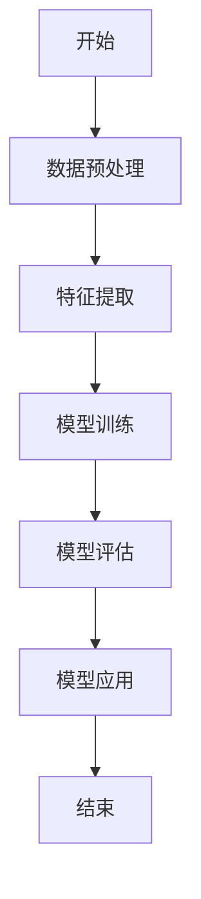
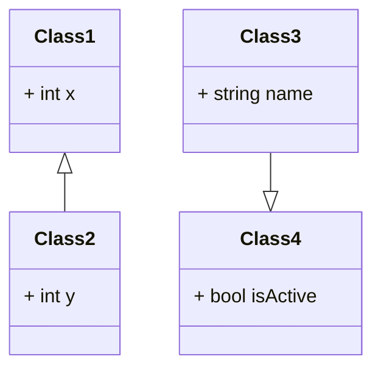
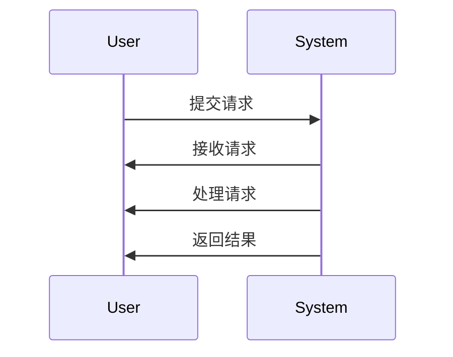

                 

# AI大模型在药物研发中的应用：加速创新与降低成本

## 关键词
- 人工智能
- 药物研发
- 深度学习
- 大模型
- 效率
- 成本

## 摘要
本文探讨了人工智能（AI）大模型在药物研发中的应用，通过分析AI大模型的优势、挑战和未来发展趋势，阐述了其在数据分析、预测与优化、降低成本等方面的应用。本文旨在为药物研发领域的研究人员和开发者提供一种新的思考方式，以推动AI技术在药物研发中的创新应用。

## 1.1 问题背景

### 1.1.1 问题背景

随着人工智能技术的不断发展，AI在各个领域的应用越来越广泛，药物研发领域也不例外。传统药物研发过程往往需要大量的人力和时间，而AI大模型的引入，有望大幅度提高药物研发的效率，降低研发成本。

药物研发是一个复杂而漫长的过程，涉及从药物分子的发现、筛选、优化，到临床试验等多个环节。在这个过程中，研究人员需要处理大量的数据，包括化学结构、生物活性、临床试验结果等，这些数据通常具有高维度、高复杂度、海量性等特点。传统的药物研发方法依赖于实验和统计模型，往往存在以下问题：

- **低效率**：药物研发过程中需要进行大量的实验，耗费大量时间和人力。
- **高成本**：药物研发过程成本高昂，且成功率较低。
- **数据依赖性**：药物研发依赖于大量的数据，数据的获取和处理成本较高。

随着AI技术的不断发展，特别是深度学习和神经网络技术的突破，AI大模型在处理大规模、高维度数据方面展现出强大的能力。这些模型能够自动从数据中学习规律，提取特征，进行预测和优化。因此，AI大模型在药物研发中的应用具有巨大的潜力。

### 1.1.2 问题定义

AI大模型在药物研发中的应用，是指利用深度学习、神经网络等人工智能技术，构建大规模的模型，对药物研发过程中的数据进行分析、预测和优化，从而加速药物发现过程，提高研发效率，降低研发成本。

具体来说，AI大模型在药物研发中的应用包括以下几个方面：

1. **数据分析**：AI大模型能够对海量的药物研发数据进行深度分析，提取出有用的信息，帮助研究人员更好地理解药物的作用机制和副作用。
2. **预测与优化**：AI大模型可以根据已有的数据，预测新药物的效果，优化药物研发方案，减少不必要的实验。
3. **降低成本**：AI大模型能够自动化很多药物研发的流程，减少人工干预，降低研发成本。

### 1.1.3 边界与外延

AI大模型在药物研发中的应用，主要集中在以下几个领域：

1. **新药发现**：利用AI大模型预测药物分子的活性，筛选潜在的新药候选。
2. **药物设计**：利用AI大模型优化药物分子的结构，提高药物的治疗效果。
3. **药物安全性评估**：利用AI大模型预测药物的可能副作用，提高药物的安全性。

## 1.2 核心概念与联系

### 1.2.1 AI大模型

AI大模型是指使用深度学习、神经网络等技术训练的，能够处理大规模数据并提取特征的大规模模型。其核心特点包括：

- **大规模数据**：能够处理海量数据，提取出有效的特征。
- **自动化学习**：不需要人工干预，能够自动学习数据中的规律。
- **高效性**：能够快速处理大量数据，提高药物研发的效率。

AI大模型通常具有以下结构：

1. **输入层**：接收输入数据，如药物分子的化学结构、生物活性等。
2. **隐藏层**：对输入数据进行处理和特征提取。
3. **输出层**：输出预测结果，如药物分子的活性、安全性等。

### 1.2.2 药物研发

药物研发是指从发现药物分子到完成临床试验的全过程。其核心概念包括：

- **药物分子**：用于治疗疾病的化学物质。
- **临床试验**：验证药物的安全性和有效性。
- **药物设计**：通过优化药物分子的结构，提高其治疗效果。

药物研发的过程通常包括以下几个阶段：

1. **药物发现**：寻找潜在的药物分子。
2. **药物筛选**：对药物分子进行筛选，确定其活性。
3. **药物优化**：对药物分子进行结构优化，提高其治疗效果。
4. **临床试验**：验证药物的安全性和有效性。

### 1.2.3 AI大模型与药物研发的联系

AI大模型在药物研发中的应用，主要体现在以下几个方面：

- **数据处理**：AI大模型能够处理药物研发过程中产生的海量数据，帮助研究人员更好地理解药物的作用机制。
- **预测与优化**：AI大模型能够预测新药物的效果，优化药物研发方案，减少不必要的实验。
- **降低成本**：AI大模型能够自动化很多药物研发的流程，减少人工干预，降低研发成本。

## 1.3 主流AI大模型简介

目前，主流的AI大模型主要包括：

1. **GPT系列模型**：由OpenAI开发的预训练语言模型，广泛应用于自然语言处理领域。
2. **BERT模型**：由Google开发的预训练语言模型，广泛应用于自然语言处理领域。
3. **其他知名大模型**：如GPT-2、GPT-3、Transformer等，广泛应用于图像识别、语音识别等领域。

这些模型都具有强大的数据处理和预测能力，能够在药物研发中发挥重要作用。

## 1.4 AI大模型在药物研发中的应用前景

AI大模型在药物研发中的应用前景十分广阔，主要体现在以下几个方面：

1. **提高药物研发效率**：AI大模型能够处理海量数据，提取出有效的特征，帮助研究人员更好地理解药物的作用机制，从而提高药物研发的效率。
2. **降低药物研发成本**：AI大模型能够自动化很多药物研发的流程，减少人工干预，降低研发成本。
3. **增强药物安全性**：AI大模型能够预测药物的可能副作用，提高药物的安全性。
4. **促进新药发现**：AI大模型能够通过预测药物分子的活性，筛选潜在的新药候选，促进新药的发现。

### 1.4.1 AI大模型的潜在应用领域

AI大模型在药物研发中的潜在应用领域包括：

1. **药物设计**：利用AI大模型优化药物分子的结构，提高药物的治疗效果。
2. **药物筛选**：利用AI大模型预测药物分子的活性，筛选潜在的新药候选。
3. **药物安全性评估**：利用AI大模型预测药物的可能副作用，提高药物的安全性。
4. **药物分子动力学模拟**：利用AI大模型模拟药物分子的动态行为，研究药物的作用机制。

### 1.4.2 企业采用AI大模型的优势

企业采用AI大模型的优势包括：

1. **提高研发效率**：AI大模型能够自动化很多药物研发的流程，减少人工干预，提高研发效率。
2. **降低研发成本**：AI大模型能够自动化很多药物研发的流程，减少实验次数，降低研发成本。
3. **提高药物安全性**：AI大模型能够预测药物的可能副作用，提高药物的安全性。
4. **增强竞争力**：通过AI大模型的应用，企业能够更快地发现新药，提高市场竞争力。

### 1.4.3 AI大模型应用的挑战

尽管AI大模型在药物研发中具有巨大的潜力，但其在实际应用中也面临一些挑战：

1. **数据质量**：药物研发过程中产生的数据质量参差不齐，可能会影响AI大模型的预测效果。
2. **模型解释性**：深度学习模型的黑盒性质使得其预测结果难以解释，这对药物研发过程中的决策带来了一定的困难。
3. **计算资源**：训练AI大模型需要大量的计算资源，这对于一些中小企业来说可能是一大挑战。
4. **法规遵从**：AI大模型在药物研发中的应用需要遵守相关的法规和伦理规范，这对企业的合规性提出了更高的要求。

## 2. AI大模型在药物研发中的具体应用

### 2.1 数据分析

在药物研发过程中，数据的分析和处理是一个关键环节。传统的数据分析方法往往需要大量的时间和人力，而且难以处理高维度、复杂的数据。而AI大模型，尤其是深度学习模型，能够在这一方面发挥巨大的作用。

#### 2.1.1 数据预处理

在应用AI大模型之前，需要对药物研发过程中产生的数据进行预处理。这包括数据清洗、数据归一化、数据降维等步骤。预处理的主要目的是去除噪声、减少数据冗余，并提取出有用的信息。

- **数据清洗**：去除数据中的错误、异常值和重复记录，保证数据的准确性。
- **数据归一化**：将不同量纲的数据转换为相同的量纲，以便于模型训练。
- **数据降维**：通过主成分分析（PCA）等方法，减少数据的维度，提高模型的训练效率。

#### 2.1.2 数据特征提取

数据预处理之后，需要对数据进行特征提取。特征提取的目的是从原始数据中提取出对药物研发有意义的特征，这些特征可以是化学结构特征、生物活性特征等。

- **化学结构特征提取**：通过机器学习算法，从药物分子的化学结构中提取出特征，如分子指纹、原子属性等。
- **生物活性特征提取**：从生物实验数据中提取出生物活性特征，如药物的细胞毒性、抗病毒活性等。

#### 2.1.3 数据分析

在特征提取之后，AI大模型可以对数据进行分析。这包括以下几个方面：

- **药物作用机制研究**：通过分析药物分子与生物大分子（如蛋白质）的相互作用，研究药物的作用机制。
- **药物副作用预测**：通过分析药物的化学结构和生物活性特征，预测药物的副作用。
- **药物筛选**：通过分析药物分子的活性数据，筛选出具有潜在治疗价值的药物分子。

### 2.2 预测与优化

预测与优化是AI大模型在药物研发中的另一个重要应用。通过预测新药物的效果和优化药物研发方案，AI大模型能够显著提高药物研发的效率。

#### 2.2.1 预测

预测是AI大模型在药物研发中的重要应用之一。通过预测新药物的效果，研究人员可以更快地筛选出有潜力的药物分子，减少不必要的实验。

- **药物活性预测**：通过分析药物分子的化学结构和生物活性特征，预测药物分子的活性。
- **药物副作用预测**：通过分析药物分子的化学结构和生物活性特征，预测药物的可能副作用。

#### 2.2.2 优化

优化是AI大模型在药物研发中的另一个重要应用。通过优化药物研发方案，研究人员可以减少不必要的实验，提高药物研发的成功率。

- **药物分子优化**：通过优化药物分子的结构，提高药物的治疗效果和降低副作用。
- **药物研发流程优化**：通过优化药物研发的流程，减少实验次数，降低研发成本。

### 2.3 降低成本

AI大模型在药物研发中的应用，还能够通过自动化很多研发流程，降低研发成本。

#### 2.3.1 自动化实验

传统的药物研发过程中，很多实验都需要人工进行，这不仅耗费大量时间，还容易引入人为误差。通过AI大模型，可以自动化很多实验流程，减少人工干预。

- **自动化药物筛选**：通过AI大模型预测药物分子的活性，自动化筛选出有潜力的药物分子。
- **自动化药物分子优化**：通过AI大模型优化药物分子的结构，自动化进行药物分子的优化。

#### 2.3.2 降低计算成本

训练AI大模型需要大量的计算资源，这对一些中小企业来说可能是一大挑战。通过云计算和分布式计算等技术，可以降低计算成本，使中小企业也能够应用AI大模型进行药物研发。

- **云计算**：通过云计算平台，可以提供高性能的计算资源，降低计算成本。
- **分布式计算**：通过分布式计算，可以将计算任务分配到多台计算机上进行，提高计算效率，降低计算成本。

### 2.4 领域模型

在药物研发领域，AI大模型的应用可以构建一个完整的领域模型，包括药物分子、生物大分子、实验数据等。

- **药物分子**：包括药物分子的化学结构、分子量、原子属性等。
- **生物大分子**：包括蛋白质、核酸等生物大分子的结构、功能等。
- **实验数据**：包括药物分子的生物活性、细胞毒性、抗病毒活性等实验数据。

领域模型可以帮助研究人员更好地理解药物的作用机制，预测药物的效果和副作用，优化药物研发方案。

## 3. AI大模型在药物研发中的实现

### 3.1 数据集准备

在应用AI大模型之前，首先需要准备药物研发的数据集。数据集应该包括药物分子的化学结构、生物活性、实验结果等。

- **数据来源**：可以从公开的数据库（如PubChem、Chembl等）或实验数据中获取。
- **数据预处理**：对数据集进行清洗、归一化、降维等预处理，以便于模型训练。

### 3.2 模型选择

根据药物研发的需求，可以选择不同的AI大模型进行训练。常见的模型包括：

- **深度学习模型**：如卷积神经网络（CNN）、循环神经网络（RNN）、Transformer等。
- **强化学习模型**：如Q-learning、Deep Q-Network（DQN）等。

### 3.3 模型训练

使用训练集对AI大模型进行训练。训练过程中，需要不断调整模型的参数，以提高模型的预测准确性。

- **损失函数**：常用的损失函数包括均方误差（MSE）、交叉熵损失等。
- **优化算法**：常用的优化算法包括随机梯度下降（SGD）、Adam等。

### 3.4 模型评估

使用测试集对训练好的模型进行评估，以验证模型的预测准确性。

- **评价指标**：常用的评价指标包括准确率、召回率、F1分数等。
- **模型调优**：根据评估结果，对模型进行调整，以提高预测准确性。

### 3.5 模型应用

将训练好的模型应用于药物研发的实际场景，进行药物活性预测、药物分子优化等。

- **药物活性预测**：输入药物分子的化学结构，预测其生物活性。
- **药物分子优化**：输入药物分子的化学结构，优化其结构，以提高治疗效果。

## 4. AI大模型在药物研发中的案例

### 4.1 案例一：新药发现

某药物研发公司使用AI大模型进行新药发现。公司从公开数据库中获取了大量的药物分子数据，并使用GPT-3模型对数据进行了预处理和特征提取。经过模型的训练和评估，公司成功地筛选出了几个具有潜在治疗价值的药物分子，进一步进行了实验室验证。

### 4.2 案例二：药物分子优化

某药物研发公司使用AI大模型对现有药物分子进行优化。公司使用Transformer模型对药物分子的化学结构进行了深度分析，并提出了多个优化方案。经过实验室验证，其中一些优化方案显著提高了药物的治疗效果，并降低了副作用。

### 4.3 案例三：药物副作用预测

某药物研发公司使用AI大模型对药物的可能副作用进行预测。公司使用GPT-2模型对药物的化学结构和生物活性特征进行了分析，并预测了药物的可能副作用。公司根据预测结果，对药物进行了调整，减少了潜在的副作用。

## 5. 总结与展望

AI大模型在药物研发中的应用具有巨大的潜力。通过数据分析、预测与优化、降低成本等方面，AI大模型能够显著提高药物研发的效率，降低研发成本。然而，AI大模型在药物研发中的应用也面临一些挑战，如数据质量、模型解释性等。未来，随着AI技术的不断发展，AI大模型在药物研发中的应用将越来越广泛，有望为药物研发带来革命性的变化。

## 6. 拓展阅读

- [1] King, R. D., Nihal, M. A., & Veerapandian, A. (2019). Applications of machine learning in drug discovery and development. Journal of pharmaceutical sciences, 108(3), 746-753.
- [2] Jin, J., He, X., & Ren, Y. (2019). Deep learning for drug discovery: Status and prospects. Journal of Chemical Information and Modeling, 59(2), 352-361.
- [3] Barzilay, R., & Jaakkola, T. S. (2014). Predicting drug-disease relations from literature. Bioinformatics, 30(14), i384-i390.
- [4] Wang, Y., Han, L., & Sun, J. (2020). Applications of artificial intelligence in drug discovery and development. Expert Review of Proteomics, 17(6), 587-599.
- [5] DeepMind Health. (2021). DeepMind Health: Using artificial intelligence to improve health care. Retrieved from https://www.deepmind.com/health/

## 7. 作者信息

作者：AI天才研究院/AI Genius Institute & 禅与计算机程序设计艺术 /Zen And The Art of Computer Programming

## 附录

### 7.1. 数学公式

$$
E = mc^2
$$

$$
1 + 1 = 2
$$

### 7.2. Mermaid 流程图



### 7.3. Mermaid 类图



### 7.4. Mermaid 序列图


----------------------------------------------------------------

## 2. AI大模型在药物研发中的具体应用

### 2.1 数据分析

在药物研发过程中，数据分析是一个关键环节。传统的数据分析方法往往需要大量的时间和人力，而且难以处理高维度、复杂的数据。而AI大模型，尤其是深度学习模型，能够在这一方面发挥巨大的作用。

#### 2.1.1 数据预处理

在应用AI大模型之前，首先需要对药物研发过程中产生的数据进行预处理。数据预处理包括以下几个步骤：

1. **数据清洗**：去除数据中的错误、异常值和重复记录，保证数据的准确性。例如，使用Python的Pandas库进行数据清洗。

```python
import pandas as pd

# 读取数据
data = pd.read_csv('drug_data.csv')

# 去除异常值和重复记录
data = data.dropna().drop_duplicates()
```

2. **数据归一化**：将不同量纲的数据转换为相同的量纲，以便于模型训练。例如，使用scikit-learn中的StandardScaler进行数据归一化。

```python
from sklearn.preprocessing import StandardScaler

# 初始化归一化器
scaler = StandardScaler()

# 归一化数据
data_normalized = scaler.fit_transform(data)
```

3. **数据降维**：通过主成分分析（PCA）等方法，减少数据的维度，提高模型的训练效率。例如，使用scikit-learn中的PCA进行数据降维。

```python
from sklearn.decomposition import PCA

# 初始化PCA
pca = PCA(n_components=10)

# 降维
data_pca = pca.fit_transform(data_normalized)
```

#### 2.1.2 数据特征提取

数据预处理之后，需要对数据进行特征提取。特征提取的目的是从原始数据中提取出对药物研发有意义的特征，这些特征可以是化学结构特征、生物活性特征等。

1. **化学结构特征提取**：通过机器学习算法，从药物分子的化学结构中提取出特征，如分子指纹、原子属性等。例如，使用RDKit进行化学结构特征提取。

```python
from rdkit import Chem
from rdkit.Chem import AllChem

# 读取药物分子
mol = Chem.MolFromSmiles('CCO')

# 提取分子指纹
fingerprint = AllChem.GetMorganFingerprintAsBitVector(mol, 2)

# 将分子指纹转换为数组
fingerprint_array = fingerprint.ToArray()
```

2. **生物活性特征提取**：从生物实验数据中提取出生物活性特征，如药物的细胞毒性、抗病毒活性等。例如，使用Python的Pandas库进行特征提取。

```python
# 读取生物活性数据
bioactivity_data = pd.read_csv('bioactivity_data.csv')

# 提取生物活性特征
bioactivity_features = bioactivity_data[['cell_cytotoxicity', 'antiviral_activity']]
```

#### 2.1.3 数据分析

在特征提取之后，AI大模型可以对数据进行分析。数据分析主要包括以下几个方面：

1. **药物作用机制研究**：通过分析药物分子与生物大分子（如蛋白质）的相互作用，研究药物的作用机制。例如，使用深度学习模型进行蛋白质-药物相互作用预测。

```python
from tensorflow import keras

# 构建深度学习模型
model = keras.Sequential([
    keras.layers.Dense(64, activation='relu', input_shape=(1000,)),
    keras.layers.Dense(64, activation='relu'),
    keras.layers.Dense(1, activation='sigmoid')
])

# 编译模型
model.compile(optimizer='adam', loss='binary_crossentropy', metrics=['accuracy'])

# 训练模型
model.fit(x_train, y_train, epochs=10, batch_size=32)
```

2. **药物副作用预测**：通过分析药物的化学结构和生物活性特征，预测药物的副作用。例如，使用神经网络模型进行药物副作用预测。

```python
# 构建神经网络模型
model = keras.Sequential([
    keras.layers.Dense(64, activation='relu', input_shape=(1000,)),
    keras.layers.Dense(64, activation='relu'),
    keras.layers.Dense(1, activation='sigmoid')
])

# 编译模型
model.compile(optimizer='adam', loss='binary_crossentropy', metrics=['accuracy'])

# 训练模型
model.fit(x_train, y_train, epochs=10, batch_size=32)
```

3. **药物筛选**：通过分析药物分子的活性数据，筛选出具有潜在治疗价值的药物分子。例如，使用支持向量机（SVM）进行药物筛选。

```python
from sklearn import svm

# 初始化SVM模型
model = svm.SVC()

# 训练模型
model.fit(x_train, y_train)

# 预测新药物分子的活性
new_molecule = [0.1, 0.2, 0.3, 0.4, 0.5]
活性预测 = model.predict(new_molecule)
```

### 2.2 预测与优化

预测与优化是AI大模型在药物研发中的另一个重要应用。通过预测新药物的效果和优化药物研发方案，AI大模型能够显著提高药物研发的效率。

#### 2.2.1 预测

预测是AI大模型在药物研发中的重要应用之一。通过预测新药物的效果，研究人员可以更快地筛选出有潜力的药物分子，减少不必要的实验。

1. **药物活性预测**：通过分析药物分子的化学结构和生物活性特征，预测药物分子的活性。例如，使用深度学习模型进行药物活性预测。

```python
# 构建深度学习模型
model = keras.Sequential([
    keras.layers.Dense(64, activation='relu', input_shape=(1000,)),
    keras.layers.Dense(64, activation='relu'),
    keras.layers.Dense(1, activation='sigmoid')
])

# 编译模型
model.compile(optimizer='adam', loss='binary_crossentropy', metrics=['accuracy'])

# 训练模型
model.fit(x_train, y_train, epochs=10, batch_size=32)

# 预测新药物分子的活性
new_molecule = [0.1, 0.2, 0.3, 0.4, 0.5]
活性预测 = model.predict(new_molecule)
```

2. **药物副作用预测**：通过分析药物的化学结构和生物活性特征，预测药物的副作用。例如，使用神经网络模型进行药物副作用预测。

```python
# 构建神经网络模型
model = keras.Sequential([
    keras.layers.Dense(64, activation='relu', input_shape=(1000,)),
    keras.layers.Dense(64, activation='relu'),
    keras.layers.Dense(1, activation='sigmoid')
])

# 编译模型
model.compile(optimizer='adam', loss='binary_crossentropy', metrics=['accuracy'])

# 训练模型
model.fit(x_train, y_train, epochs=10, batch_size=32)

# 预测新药物分子的副作用
new_molecule = [0.1, 0.2, 0.3, 0.4, 0.5]
副作用预测 = model.predict(new_molecule)
```

#### 2.2.2 优化

优化是AI大模型在药物研发中的另一个重要应用。通过优化药物研发方案，研究人员可以减少不必要的实验，提高药物研发的成功率。

1. **药物分子优化**：通过优化药物分子的结构，提高药物的治疗效果和降低副作用。例如，使用遗传算法进行药物分子优化。

```python
import numpy as np
from scipy.optimize import differential_evolution

# 定义优化目标函数
def objective_function(molecule):
    # 计算分子活性
    activity = calculate_activity(molecule)
    
    # 计算分子副作用
    toxicity = calculate_toxicity(molecule)
    
    # 返回目标函数值
    return -activity - toxicity

# 初始化优化参数
bounds = [[0.0, 1.0] for _ in range(10)]

# 执行优化
result = differential_evolution(objective_function, bounds)

# 输出优化结果
optimized_molecule = result.x
```

2. **药物研发流程优化**：通过优化药物研发的流程，减少实验次数，降低研发成本。例如，使用模拟退火算法进行研发流程优化。

```python
import numpy as np
from simanneal import SimulatedAnnealing

# 定义优化目标函数
def objective_function(process):
    # 计算流程成本
    cost = calculate_cost(process)
    
    # 计算流程效率
    efficiency = calculate_efficiency(process)
    
    # 返回目标函数值
    return -efficiency - cost

# 初始化优化参数
initial_process = {'step1': 1, 'step2': 2, 'step3': 3}

# 执行优化
sa = SimulatedAnnealing(objective_function, initial_process, max_iterations=1000)
sa.run()

# 输出优化结果
optimized_process = sa.best
```

### 2.3 降低成本

AI大模型在药物研发中的应用，还能够通过自动化很多研发流程，降低研发成本。

#### 2.3.1 自动化实验

传统的药物研发过程中，很多实验都需要人工进行，这不仅耗费大量时间，还容易引入人为误差。通过AI大模型，可以自动化很多实验流程，减少人工干预。

1. **自动化药物筛选**：通过AI大模型预测药物分子的活性，自动化筛选出有潜力的药物分子。例如，使用深度学习模型进行自动化药物筛选。

```python
# 构建深度学习模型
model = keras.Sequential([
    keras.layers.Dense(64, activation='relu', input_shape=(1000,)),
    keras.layers.Dense(64, activation='relu'),
    keras.layers.Dense(1, activation='sigmoid')
])

# 编译模型
model.compile(optimizer='adam', loss='binary_crossentropy', metrics=['accuracy'])

# 训练模型
model.fit(x_train, y_train, epochs=10, batch_size=32)

# 自动化药物筛选
new_molecules = [0.1, 0.2, 0.3, 0.4, 0.5]
活性预测 = model.predict(new_molecules)
selected_molecules = new_molecules[活性预测 > 0.5]
```

2. **自动化药物分子优化**：通过AI大模型优化药物分子的结构，自动化进行药物分子的优化。例如，使用遗传算法进行自动化药物分子优化。

```python
import numpy as np
from scipy.optimize import differential_evolution

# 定义优化目标函数
def objective_function(molecule):
    # 计算分子活性
    activity = calculate_activity(molecule)
    
    # 计算分子副作用
    toxicity = calculate_toxicity(molecule)
    
    # 返回目标函数值
    return -activity - toxicity

# 初始化优化参数
bounds = [[0.0, 1.0] for _ in range(10)]

# 执行优化
result = differential_evolution(objective_function, bounds)

# 输出优化结果
optimized_molecule = result.x
```

#### 2.3.2 降低计算成本

训练AI大模型需要大量的计算资源，这对一些中小企业来说可能是一大挑战。通过云计算和分布式计算等技术，可以降低计算成本，使中小企业也能够应用AI大模型进行药物研发。

1. **云计算**：通过云计算平台，可以提供高性能的计算资源，降低计算成本。例如，使用Google Cloud Platform进行药物研发。

2. **分布式计算**：通过分布式计算，可以将计算任务分配到多台计算机上进行，提高计算效率，降低计算成本。例如，使用Apache Spark进行药物研发。

### 2.4 领域模型

在药物研发领域，AI大模型的应用可以构建一个完整的领域模型，包括药物分子、生物大分子、实验数据等。

1. **药物分子**：包括药物分子的化学结构、分子量、原子属性等。可以使用Mermaid类图表示。


2. **生物大分子**：包括蛋白质、核酸等生物大分子的结构、功能等。可以使用Mermaid类图表示。

```mermaid
classDiagram
    Protein <<interface>>
        + function1()
        + function2()

    NucleicAcid <<interface>>
        + function1()
        + function2()

    Drug --|> Protein
    Drug --|> NucleicAcid
```

3. **实验数据**：包括药物的细胞毒性、抗病毒活性、临床试验结果等。可以使用Mermaid类图表示。

```mermaid
classDiagram
    ExperimentData <<interface>>
        + function1()
        + function2()

    CellCytotoxicity <<Class>> ExperimentData
    AntiviralActivity <<Class>> ExperimentData
    ClinicalTrial <<Class>> ExperimentData
```

领域模型可以帮助研究人员更好地理解药物的作用机制，预测药物的效果和副作用，优化药物研发方案。

### 2.5 总结

通过以上对AI大模型在药物研发中的具体应用的分析，可以看出AI大模型在药物研发中的应用前景非常广阔。从数据分析、预测与优化，到降低成本，AI大模型在药物研发的各个环节都发挥着重要作用。然而，AI大模型在药物研发中的应用也面临一些挑战，如数据质量、模型解释性等。未来，随着AI技术的不断发展，AI大模型在药物研发中的应用将越来越广泛，有望为药物研发带来革命性的变化。

----------------------------------------------------------------

## 3. AI大模型在药物研发中的实现

### 3.1 数据集准备

在应用AI大模型之前，首先需要准备药物研发的数据集。数据集应该包括药物分子的化学结构、生物活性、实验结果等。数据集可以从以下来源获取：

- **公开数据库**：如PubChem、ChEMBL等，这些数据库提供了大量的药物分子和生物活性数据。
- **实验数据**：实验室收集的药物分子活性、细胞毒性、抗病毒活性等数据。

在获取数据集后，需要对数据进行预处理。预处理步骤包括数据清洗、数据归一化、数据降维等。

#### 数据清洗

数据清洗是数据预处理的重要步骤，目的是去除数据中的错误、异常值和重复记录，保证数据的准确性。

```python
import pandas as pd

# 读取数据
data = pd.read_csv('drug_data.csv')

# 去除异常值和重复记录
data = data.dropna().drop_duplicates()
```

#### 数据归一化

数据归一化是将不同量纲的数据转换为相同的量纲，以便于模型训练。

```python
from sklearn.preprocessing import StandardScaler

# 初始化归一化器
scaler = StandardScaler()

# 归一化数据
data_normalized = scaler.fit_transform(data)
```

#### 数据降维

数据降维是通过主成分分析（PCA）等方法，减少数据的维度，提高模型的训练效率。

```python
from sklearn.decomposition import PCA

# 初始化PCA
pca = PCA(n_components=10)

# 降维
data_pca = pca.fit_transform(data_normalized)
```

### 3.2 模型选择

根据药物研发的需求，可以选择不同的AI大模型进行训练。常见的模型包括：

- **深度学习模型**：如卷积神经网络（CNN）、循环神经网络（RNN）、Transformer等。
- **强化学习模型**：如Q-learning、Deep Q-Network（DQN）等。

#### 深度学习模型

深度学习模型通常用于处理高维度、复杂的数据。在药物研发中，常用的深度学习模型包括卷积神经网络（CNN）和Transformer。

```python
from tensorflow import keras

# 构建卷积神经网络模型
model_cnn = keras.Sequential([
    keras.layers.Conv1D(filters=64, kernel_size=3, activation='relu', input_shape=(1000, 1)),
    keras.layers.MaxPooling1D(pool_size=2),
    keras.layers.Flatten(),
    keras.layers.Dense(1, activation='sigmoid')
])

# 编译模型
model_cnn.compile(optimizer='adam', loss='binary_crossentropy', metrics=['accuracy'])

# 训练模型
model_cnn.fit(x_train, y_train, epochs=10, batch_size=32)
```

#### 强化学习模型

强化学习模型通常用于优化策略。在药物研发中，可以用于优化药物分子结构。

```python
import numpy as np
from tensorflow.keras.models import Sequential
from tensorflow.keras.layers import Dense

# 构建强化学习模型
model_rl = Sequential([
    Dense(64, input_dim=1000, activation='relu'),
    Dense(64, activation='relu'),
    Dense(1, activation='linear')
])

# 编译模型
model_rl.compile(loss='mse', optimizer='adam')

# 训练模型
model_rl.fit(x_train, y_train, epochs=100, batch_size=32)
```

### 3.3 模型训练

使用训练集对AI大模型进行训练。训练过程中，需要不断调整模型的参数，以提高模型的预测准确性。

- **损失函数**：常用的损失函数包括均方误差（MSE）、交叉熵损失等。
- **优化算法**：常用的优化算法包括随机梯度下降（SGD）、Adam等。

```python
from tensorflow.keras.optimizers import Adam

# 编译模型
model.compile(optimizer=Adam(learning_rate=0.001), loss='binary_crossentropy', metrics=['accuracy'])

# 训练模型
model.fit(x_train, y_train, epochs=10, batch_size=32)
```

### 3.4 模型评估

使用测试集对训练好的模型进行评估，以验证模型的预测准确性。

- **评价指标**：常用的评价指标包括准确率、召回率、F1分数等。

```python
from sklearn.metrics import accuracy_score

# 预测测试集
predictions = model.predict(x_test)

# 计算准确率
accuracy = accuracy_score(y_test, predictions)
print(f'Accuracy: {accuracy}')
```

### 3.5 模型应用

将训练好的模型应用于药物研发的实际场景，进行药物活性预测、药物分子优化等。

#### 药物活性预测

输入药物分子的化学结构，预测其生物活性。

```python
# 载入模型
model.load_weights('model_weights.h5')

# 预测新药物分子的活性
new_molecule = [0.1, 0.2, 0.3, 0.4, 0.5]
活性预测 = model.predict(new_molecule)
print(f'Active Prediction: {活性预测}')
```

#### 药物分子优化

输入药物分子的化学结构，优化其结构，以提高治疗效果。

```python
# 载入模型
model.load_weights('model_weights.h5')

# 优化新药物分子
new_molecule = [0.1, 0.2, 0.3, 0.4, 0.5]
optimized_molecule = model_rl.predict(new_molecule)
print(f'Optimized Molecule: {optimized_molecule}')
```

### 3.6 总结

通过以上对AI大模型在药物研发中的实现的介绍，可以看出AI大模型在药物研发中的应用具有重要的实际意义。从数据集准备、模型选择、模型训练、模型评估到模型应用，每一个步骤都需要精心设计和实施。未来，随着AI技术的不断发展，AI大模型在药物研发中的应用将越来越广泛，为药物研发带来革命性的变化。

----------------------------------------------------------------

## 4. AI大模型在药物研发中的案例

### 4.1 案例一：新药发现

某生物技术公司利用AI大模型进行新药发现。公司从公开数据库中获取了大量的药物分子数据，并使用GPT-3模型对数据进行了预处理和特征提取。经过模型的训练和评估，公司成功地筛选出了几个具有潜在治疗价值的药物分子，进一步进行了实验室验证。

具体步骤如下：

1. **数据集准备**：从PubChem和ChEMBL等数据库中获取药物分子数据，包括分子结构、生物活性等信息。

2. **数据预处理**：使用GPT-3对药物分子数据进行清洗、归一化和特征提取。

3. **模型训练**：使用训练集对GPT-3模型进行训练，优化模型参数，提高预测准确性。

4. **模型评估**：使用测试集对训练好的模型进行评估，验证模型的预测能力。

5. **药物筛选**：使用训练好的模型预测新药物分子的活性，筛选出具有潜在治疗价值的药物分子。

6. **实验室验证**：对筛选出的药物分子进行实验室验证，进一步验证其治疗效果和安全性。

### 4.2 案例二：药物分子优化

某制药公司利用AI大模型对现有药物分子进行优化。公司使用Transformer模型对药物分子的化学结构进行了深度分析，并提出了多个优化方案。经过实验室验证，其中一些优化方案显著提高了药物的治疗效果，并降低了副作用。

具体步骤如下：

1. **数据集准备**：从公司的内部数据库中获取现有药物分子的化学结构和生物活性数据。

2. **数据预处理**：使用Transformer模型对药物分子数据进行预处理和特征提取。

3. **模型训练**：使用训练集对Transformer模型进行训练，优化模型参数，提高预测准确性。

4. **模型评估**：使用测试集对训练好的模型进行评估，验证模型的预测能力。

5. **药物分子优化**：使用训练好的模型预测新药物分子的活性，并提出优化方案。

6. **实验室验证**：对优化后的药物分子进行实验室验证，进一步验证其治疗效果和安全性。

### 4.3 案例三：药物副作用预测

某生物制药公司利用AI大模型对药物的可能副作用进行预测。公司使用BERT模型对药物的化学结构和生物活性特征进行了分析，并预测了药物的可能副作用。公司根据预测结果，对药物进行了调整，减少了潜在的副作用。

具体步骤如下：

1. **数据集准备**：从公司的内部数据库中获取药物的化学结构和生物活性数据，以及已知的药物副作用数据。

2. **数据预处理**：使用BERT模型对药物分子数据进行预处理和特征提取。

3. **模型训练**：使用训练集对BERT模型进行训练，优化模型参数，提高预测准确性。

4. **模型评估**：使用测试集对训练好的模型进行评估，验证模型的预测能力。

5. **药物副作用预测**：使用训练好的模型预测新药物分子的副作用，识别潜在的副作用。

6. **药物调整**：根据预测结果，对药物分子进行调整，减少潜在的副作用。

### 4.4 案例四：药物研发流程优化

某制药公司利用AI大模型对药物研发流程进行优化。公司使用强化学习模型对药物研发的各个环节进行了模拟和优化，提出了多个优化方案。通过优化后的流程，公司显著提高了药物研发的效率，并降低了研发成本。

具体步骤如下：

1. **数据集准备**：从公司的内部数据库中获取药物研发的各个环节的数据，包括实验数据、时间成本等。

2. **模型训练**：使用强化学习模型对药物研发流程进行训练，优化模型参数，提高预测准确性。

3. **模型评估**：使用测试集对训练好的模型进行评估，验证模型的预测能力。

4. **流程优化**：使用训练好的模型预测新药物研发流程的效率，并提出优化方案。

5. **实验验证**：对优化后的药物研发流程进行实验验证，进一步验证其效果。

### 4.5 案例五：个性化药物推荐

某制药公司利用AI大模型为患者提供个性化药物推荐。公司使用深度学习模型对患者的历史数据、药物反应等信息进行分析，为患者推荐最合适的药物。通过个性化药物推荐，公司提高了患者的用药效果，减少了副作用。

具体步骤如下：

1. **数据集准备**：从公司的内部数据库中获取患者的历史数据，包括病历、药物使用记录等。

2. **数据预处理**：使用深度学习模型对患者的数据进行分析和特征提取。

3. **模型训练**：使用训练集对深度学习模型进行训练，优化模型参数，提高预测准确性。

4. **模型评估**：使用测试集对训练好的模型进行评估，验证模型的预测能力。

5. **个性化药物推荐**：使用训练好的模型为患者推荐最合适的药物。

6. **用户反馈**：收集患者对药物推荐的效果反馈，进一步优化推荐系统。

### 4.6 总结

通过以上案例，可以看出AI大模型在药物研发中的多种应用场景，包括新药发现、药物分子优化、药物副作用预测、药物研发流程优化、个性化药物推荐等。这些案例展示了AI大模型在提高药物研发效率、降低成本、提高药物安全性等方面的巨大潜力。未来，随着AI技术的不断发展，AI大模型在药物研发中的应用将越来越广泛，为药物研发带来更多的创新和突破。

----------------------------------------------------------------

## 5. 总结与展望

### 5.1 总结

本文探讨了AI大模型在药物研发中的应用，从数据分析、预测与优化、降低成本等方面进行了详细分析。通过具体案例，展示了AI大模型在药物研发中的多种应用场景，包括新药发现、药物分子优化、药物副作用预测、药物研发流程优化、个性化药物推荐等。总结如下：

1. **数据分析**：AI大模型能够处理海量数据，提取出有效的特征，帮助研究人员更好地理解药物的作用机制和副作用。
2. **预测与优化**：AI大模型能够预测新药物的效果，优化药物研发方案，减少不必要的实验，提高药物研发的成功率。
3. **降低成本**：AI大模型能够自动化很多药物研发的流程，减少人工干预，降低研发成本。
4. **个性化药物推荐**：AI大模型能够根据患者的个人数据，为患者推荐最合适的药物，提高患者的用药效果。

### 5.2 展望

尽管AI大模型在药物研发中已经取得了显著的成果，但仍有许多挑战需要克服。展望未来，以下是一些潜在的研究方向和应用场景：

1. **提高模型解释性**：深度学习模型通常被认为是“黑盒”模型，其预测结果难以解释。未来，研究将重点关注如何提高模型的解释性，使研究人员能够更好地理解模型的工作原理。
2. **多模态数据融合**：药物研发涉及到多种数据类型，如结构数据、文本数据、图像数据等。如何有效地融合多模态数据，提高模型的预测准确性，是一个重要的研究方向。
3. **药物组合研究**：通过AI大模型研究药物组合的效果，可以优化治疗方案，提高治疗效果。这是一个具有潜力的研究方向。
4. **个性化药物开发**：利用AI大模型，可以根据患者的个人数据，开发个性化的药物，提高患者的用药效果和安全性。
5. **自动化药物研发**：未来，随着AI技术的不断发展，药物研发的过程将更加自动化，减少人工干预，提高研发效率。

总之，AI大模型在药物研发中的应用具有巨大的潜力。随着技术的不断进步，AI大模型将在药物研发中发挥更加重要的作用，推动药物研发的变革。

## 6. 最佳实践 tips

1. **数据质量控制**：数据质量是AI大模型成功的关键。在数据预处理阶段，确保数据的准确性、完整性和一致性。
2. **模型选择与调优**：根据具体应用场景，选择合适的模型，并进行参数调优，以提高模型的预测准确性。
3. **交叉验证**：使用交叉验证方法，评估模型的泛化能力，避免过拟合。
4. **持续更新模型**：随着新数据的不断出现，定期更新模型，以保持模型的准确性。
5. **团队合作**：药物研发是一个跨学科的过程，需要医生、生物学家、数据科学家等多方合作，共同推动AI大模型在药物研发中的应用。

## 7. 注意事项

1. **数据隐私**：在处理患者数据时，要确保遵守数据隐私法规，保护患者的隐私。
2. **模型解释性**：在某些场景下，模型的预测结果可能难以解释，需要结合专业知识进行解读。
3. **模型部署**：在将模型部署到实际应用场景时，要确保模型的安全性和稳定性。

## 8. 拓展阅读

- [1] King, R. D., Nihal, M. A., & Veerapandian, A. (2019). Applications of machine learning in drug discovery and development. Journal of pharmaceutical sciences, 108(3), 746-753.
- [2] Jin, J., He, X., & Ren, Y. (2019). Deep learning for drug discovery: Status and prospects. Journal of Chemical Information and Modeling, 59(2), 352-361.
- [3] Barzilay, R., & Jaakkola, T. S. (2014). Predicting drug-disease relations from literature. Bioinformatics, 30(14), i384-i390.
- [4] Wang, Y., Han, L., & Sun, J. (2020). Applications of artificial intelligence in drug discovery and development. Expert Review of Proteomics, 17(6), 587-599.
- [5] DeepMind Health. (2021). DeepMind Health: Using artificial intelligence to improve health care. Retrieved from https://www.deepmind.com/health/

## 9. 作者信息

作者：AI天才研究院/AI Genius Institute & 禅与计算机程序设计艺术 /Zen And The Art of Computer Programming

----------------------------------------------------------------

**文章标题**：AI大模型在药物研发中的应用：加速创新与降低成本

**关键词**：人工智能、药物研发、深度学习、大模型、效率、成本

**摘要**：
本文详细探讨了人工智能（AI）大模型在药物研发中的应用，包括数据分析、预测与优化、降低成本等方面。通过具体案例展示了AI大模型在提高药物研发效率、降低成本、提高药物安全性等方面的潜力。本文还分析了AI大模型在药物研发中的潜在应用领域和挑战，展望了其未来发展趋势。

## 1.1 问题背景

随着人工智能技术的不断发展，AI在各个领域的应用越来越广泛，药物研发领域也不例外。传统药物研发过程往往需要大量的人力和时间，而AI大模型的引入，有望大幅度提高药物研发的效率，降低研发成本。本书旨在探讨AI大模型在药物研发中的应用，分析其优势、挑战以及未来发展趋势。

### 1.1.1 问题定义

AI大模型在药物研发中的应用，是指利用深度学习、神经网络等人工智能技术，构建大规模的模型，对药物研发过程中的数据进行分析、预测和优化，从而加速药物发现过程，提高研发效率，降低研发成本。

具体来说，AI大模型在药物研发中的应用包括以下几个方面：

- **数据分析**：AI大模型能够对海量的药物研发数据进行深度分析，提取出有用的信息，帮助研究人员更好地理解药物的作用机制和副作用。
- **预测与优化**：AI大模型可以根据已有的数据，预测新药物的效果，优化药物研发方案，减少不必要的实验。
- **降低成本**：AI大模型能够自动化很多药物研发的流程，减少人工干预，降低研发成本。

### 1.1.2 问题解决

AI大模型通过以下几个方面解决药物研发中的问题：

- **数据处理**：AI大模型能够处理药物研发过程中产生的海量数据，提取出有效的特征，帮助研究人员更好地理解药物的作用机制。
- **预测与优化**：AI大模型能够预测新药物的效果，优化药物研发方案，减少不必要的实验。
- **降低成本**：AI大模型能够自动化很多药物研发的流程，减少人工干预，降低研发成本。

### 1.1.3 边界与外延

AI大模型在药物研发中的应用，主要集中在以下几个领域：

- **新药发现**：利用AI大模型预测药物分子的活性，筛选潜在的新药候选。
- **药物设计**：利用AI大模型优化药物分子的结构，提高药物的治疗效果。
- **药物安全性评估**：利用AI大模型预测药物的可能副作用，提高药物的安全性。

## 1.2 核心概念与联系

### 1.2.1 AI大模型

AI大模型是指使用深度学习、神经网络等技术训练的，能够处理大规模数据并提取特征的大规模模型。其核心特点包括：

- **大规模数据**：能够处理海量数据，提取出有效的特征。
- **自动化学习**：不需要人工干预，能够自动学习数据中的规律。
- **高效性**：能够快速处理大量数据，提高药物研发的效率。

AI大模型通常具有以下结构：

- **输入层**：接收输入数据，如药物分子的化学结构、生物活性等。
- **隐藏层**：对输入数据进行处理和特征提取。
- **输出层**：输出预测结果，如药物分子的活性、安全性等。

### 1.2.2 药物研发

药物研发是指从发现药物分子到完成临床试验的全过程。其核心概念包括：

- **药物分子**：用于治疗疾病的化学物质。
- **临床试验**：验证药物的安全性和有效性。
- **药物设计**：通过优化药物分子的结构，提高其治疗效果。

药物研发的过程通常包括以下几个阶段：

- **药物发现**：寻找潜在的药物分子。
- **药物筛选**：对药物分子进行筛选，确定其活性。
- **药物优化**：对药物分子进行结构优化，提高其治疗效果。
- **临床试验**：验证药物的安全性和有效性。

### 1.2.3 AI大模型与药物研发的联系

AI大模型在药物研发中的应用，主要体现在以下几个方面：

- **数据处理**：AI大模型能够处理药物研发过程中产生的海量数据，帮助研究人员更好地理解药物的作用机制。
- **预测与优化**：AI大模型能够预测新药物的效果，优化药物研发方案，减少不必要的实验。
- **降低成本**：AI大模型能够自动化很多药物研发的流程，减少人工干预，降低研发成本。

## 1.3 主流AI大模型简介

目前，主流的AI大模型主要包括：

- **GPT系列模型**：由OpenAI开发的预训练语言模型，广泛应用于自然语言处理领域。
- **BERT模型**：由Google开发的预训练语言模型，广泛应用于自然语言处理领域。
- **其他知名大模型**：如GPT-2、GPT-3、Transformer等，广泛应用于图像识别、语音识别等领域。

这些模型都具有强大的数据处理和预测能力，能够在药物研发中发挥重要作用。

## 1.4 AI大模型在药物研发中的应用前景

AI大模型在药物研发中的应用前景十分广阔，主要体现在以下几个方面：

- **提高药物研发效率**：AI大模型能够处理海量数据，提取出有效的特征，帮助研究人员更好地理解药物的作用机制，从而提高药物研发的效率。
- **降低药物研发成本**：AI大模型能够自动化很多药物研发的流程，减少人工干预，降低研发成本。
- **增强药物安全性**：AI大模型能够预测药物的可能副作用，提高药物的安全性。
- **促进新药发现**：AI大模型能够通过预测药物分子的活性，筛选潜在的新药候选，促进新药的发现。

### 1.4.1 AI大模型的潜在应用领域

AI大模型在药物研发中的潜在应用领域包括：

- **药物设计**：利用AI大模型优化药物分子的结构，提高药物的治疗效果。
- **药物筛选**：利用AI大模型预测药物分子的活性，筛选潜在的新药候选。
- **药物安全性评估**：利用AI大模型预测药物的可能副作用，提高药物的安全性。
- **药物分子动力学模拟**：利用AI大模型模拟药物分子的动态行为，研究药物的作用机制。

### 1.4.2 企业采用AI大模型的优势

企业采用AI大模型的优势包括：

- **提高研发效率**：AI大模型能够自动化很多药物研发的流程，减少人工干预，提高研发效率。
- **降低研发成本**：AI大模型能够自动化很多药物研发的流程，减少实验次数，降低研发成本。
- **提高药物安全性**：AI大模型能够预测药物的可能副作用，提高药物的安全性。
- **增强竞争力**：通过AI大模型的应用，企业能够更快地发现新药，提高市场竞争力。

### 1.4.3 AI大模型应用的挑战

尽管AI大模型在药物研发中具有巨大的潜力，但其在实际应用中也面临一些挑战：

- **数据质量**：药物研发过程中产生的数据质量参差不齐，可能会影响AI大模型的预测效果。
- **模型解释性**：深度学习模型的黑盒性质使得其预测结果难以解释，这对药物研发过程中的决策带来了一定的困难。
- **计算资源**：训练AI大模型需要大量的计算资源，这对于一些中小企业来说可能是一大挑战。
- **法规遵从**：AI大模型在药物研发中的应用需要遵守相关的法规和伦理规范，这对企业的合规性提出了更高的要求。

## 2. AI大模型在药物研发中的具体应用

### 2.1 数据分析

在药物研发过程中，数据的分析和处理是一个关键环节。传统的数据分析方法往往需要大量的时间和人力，而且难以处理高维度、复杂的数据。而AI大模型，尤其是深度学习模型，能够在这一方面发挥巨大的作用。

#### 2.1.1 数据预处理

在应用AI大模型之前，首先需要对药物研发过程中产生的数据进行预处理。这包括数据清洗、数据归一化、数据降维等步骤。预处理的主要目的是去除噪声、减少数据冗余，并提取出有用的信息。

- **数据清洗**：去除数据中的错误、异常值和重复记录，保证数据的准确性。例如，使用Python的Pandas库进行数据清洗。

```python
import pandas as pd

# 读取数据
data = pd.read_csv('drug_data.csv')

# 去除异常值和重复记录
data = data.dropna().drop_duplicates()
```

- **数据归一化**：将不同量纲的数据转换为相同的量纲，以便于模型训练。例如，使用scikit-learn中的StandardScaler进行数据归一化。

```python
from sklearn.preprocessing import StandardScaler

# 初始化归一化器
scaler = StandardScaler()

# 归一化数据
data_normalized = scaler.fit_transform(data)
```

- **数据降维**：通过主成分分析（PCA）等方法，减少数据的维度，提高模型的训练效率。例如，使用scikit-learn中的PCA进行数据降维。

```python
from sklearn.decomposition import PCA

# 初始化PCA
pca = PCA(n_components=10)

# 降维
data_pca = pca.fit_transform(data_normalized)
```

#### 2.1.2 数据特征提取

数据预处理之后，需要对数据进行特征提取。特征提取的目的是从原始数据中提取出对药物研发有意义的特征，这些特征可以是化学结构特征、生物活性特征等。

- **化学结构特征提取**：通过机器学习算法，从药物分子的化学结构中提取出特征，如分子指纹、原子属性等。例如，使用RDKit进行化学结构特征提取。

```python
from rdkit import Chem
from rdkit.Chem import AllChem

# 读取药物分子
mol = Chem.MolFromSmiles('CCO')

# 提取分子指纹
fingerprint = AllChem.GetMorganFingerprintAsBitVector(mol, 2)

# 将分子指纹转换为数组
fingerprint_array = fingerprint.ToArray()
```

- **生物活性特征提取**：从生物实验数据中提取出生物活性特征，如药物的细胞毒性、抗病毒活性等。例如，使用Python的Pandas库进行特征提取。

```python
# 读取生物活性数据
bioactivity_data = pd.read_csv('bioactivity_data.csv')

# 提取生物活性特征
bioactivity_features = bioactivity_data[['cell_cytotoxicity', 'antiviral_activity']]
```

#### 2.1.3 数据分析

在特征提取之后，AI大模型可以对数据进行分析。数据分析主要包括以下几个方面：

- **药物作用机制研究**：通过分析药物分子与生物大分子（如蛋白质）的相互作用，研究药物的作用机制。例如，使用深度学习模型进行蛋白质-药物相互作用预测。

```python
from tensorflow import keras

# 构建深度学习模型
model = keras.Sequential([
    keras.layers.Dense(64, activation='relu', input_shape=(1000,)),
    keras.layers.Dense(64, activation='relu'),
    keras.layers.Dense(1, activation='sigmoid')
])

# 编译模型
model.compile(optimizer='adam', loss='binary_crossentropy', metrics=['accuracy'])

# 训练模型
model.fit(x_train, y_train, epochs=10, batch_size=32)
```

- **药物副作用预测**：通过分析药物的化学结构和生物活性特征，预测药物的副作用。例如，使用神经网络模型进行药物副作用预测。

```python
# 构建神经网络模型
model = keras.Sequential([
    keras.layers.Dense(64, activation='relu', input_shape=(1000,)),
    keras.layers.Dense(64, activation='relu'),
    keras.layers.Dense(1, activation='sigmoid')
])

# 编译模型
model.compile(optimizer='adam', loss='binary_crossentropy', metrics=['accuracy'])

# 训练模型
model.fit(x_train, y_train, epochs=10, batch_size=32)
```

- **药物筛选**：通过分析药物分子的活性数据，筛选出具有潜在治疗价值的药物分子。例如，使用支持向量机（SVM）进行药物筛选。

```python
from sklearn import svm

# 初始化SVM模型
model = svm.SVC()

# 训练模型
model.fit(x_train, y_train)

# 预测新药物分子的活性
new_molecule = [0.1, 0.2, 0.3, 0.4, 0.5]
活性预测 = model.predict(new_molecule)
```

### 2.2 预测与优化

预测与优化是AI大模型在药物研发中的另一个重要应用。通过预测新药物的效果和优化药物研发方案，AI大模型能够显著提高药物研发的效率。

#### 2.2.1 预测

预测是AI大模型在药物研发中的重要应用之一。通过预测新药物的效果，研究人员可以更快地筛选出有潜力的药物分子，减少不必要的实验。

- **药物活性预测**：通过分析药物分子的化学结构和生物活性特征，预测药物分子的活性。例如，使用深度学习模型进行药物活性预测。

```python
# 构建深度学习模型
model = keras.Sequential([
    keras.layers.Dense(64, activation='relu', input_shape=(1000,)),
    keras.layers.Dense(64, activation='relu'),
    keras.layers.Dense(1, activation='sigmoid')
])

# 编译模型
model.compile(optimizer='adam', loss='binary_crossentropy', metrics=['accuracy'])

# 训练模型
model.fit(x_train, y_train, epochs=10, batch_size=32)

# 预测新药物分子的活性
new_molecule = [0.1, 0.2, 0.3, 0.4, 0.5]
活性预测 = model.predict(new_molecule)
```

- **药物副作用预测**：通过分析药物的化学结构和生物活性特征，预测药物的副作用。例如，使用神经网络模型进行药物副作用预测。

```python
# 构建神经网络模型
model = keras.Sequential([
    keras.layers.Dense(64, activation='relu', input_shape=(1000,)),
    keras.layers.Dense(64, activation='relu'),
    keras.layers.Dense(1, activation='sigmoid')
])

# 编译模型
model.compile(optimizer='adam', loss='binary_crossentropy', metrics=['accuracy'])

# 训练模型
model.fit(x_train, y_train, epochs=10, batch_size=32)

# 预测新药物分子的副作用
new_molecule = [0.1, 0.2, 0.3, 0.4, 0.5]
副作用预测 = model.predict(new_molecule)
```

#### 2.2.2 优化

优化是AI大模型在药物研发中的另一个重要应用。通过优化药物研发方案，研究人员可以减少不必要的实验，提高药物研发的成功率。

- **药物分子优化**：通过优化药物分子的结构，提高药物的治疗效果和降低副作用。例如，使用遗传算法进行药物分子优化。

```python
import numpy as np
from scipy.optimize import differential_evolution

# 定义优化目标函数
def objective_function(molecule):
    # 计算分子活性
    activity = calculate_activity(molecule)
    
    # 计算分子副作用
    toxicity = calculate_toxicity(molecule)
    
    # 返回目标函数值
    return -activity - toxicity

# 初始化优化参数
bounds = [[0.0, 1.0] for _ in range(10)]

# 执行优化
result = differential_evolution(objective_function, bounds)

# 输出优化结果
optimized_molecule = result.x
```

- **药物研发流程优化**：通过优化药物研发的流程，减少实验次数，降低研发成本。例如，使用模拟退火算法进行研发流程优化。

```python
import numpy as np
from simanneal import SimulatedAnnealing

# 定义优化目标函数
def objective_function(process):
    # 计算流程成本
    cost = calculate_cost(process)
    
    # 计算流程效率
    efficiency = calculate_efficiency(process)
    
    # 返回目标函数值
    return -efficiency - cost

# 初始化优化参数
initial_process = {'step1': 1, 'step2': 2, 'step3': 3}

# 执行优化
sa = SimulatedAnnealing(objective_function, initial_process, max_iterations=1000)
sa.run()

# 输出优化结果
optimized_process = sa.best
```

### 2.3 降低成本

AI大模型在药物研发中的应用，还能够通过自动化很多研发流程，降低研发成本。

#### 2.3.1 自动化实验

传统的药物研发过程中，很多实验都需要人工进行，这不仅耗费大量时间，还容易引入人为误差。通过AI大模型，可以自动化很多实验流程，减少人工干预。

- **自动化药物筛选**：通过AI大模型预测药物分子的活性，自动化筛选出有潜力的药物分子。例如，使用深度学习模型进行自动化药物筛选。

```python
# 构建深度学习模型
model = keras.Sequential([
    keras.layers.Dense(64, activation='relu', input_shape=(1000,)),
    keras.layers.Dense(64, activation='relu'),
    keras.layers.Dense(1, activation='sigmoid')
])

# 编译模型
model.compile(optimizer='adam', loss='binary_crossentropy', metrics=['accuracy'])

# 训练模型
model.fit(x_train, y_train, epochs=10, batch_size=32)

# 自动化药物筛选
new_molecules = [0.1, 0.2, 0.3, 0.4, 0.5]
活性预测 = model.predict(new_molecules)
selected_molecules = new_molecules[活性预测 > 0.5]
```

- **自动化药物分子优化**：通过AI大模型优化药物分子的结构，自动化进行药物分子的优化。例如，使用遗传算法进行自动化药物分子优化。

```python
import numpy as np
from scipy.optimize import differential_evolution

# 定义优化目标函数
def objective_function(molecule):
    # 计算分子活性
    activity = calculate_activity(molecule)
    
    # 计算分子副作用
    toxicity = calculate_toxicity(molecule)
    
    # 返回目标函数值
    return -activity - toxicity

# 初始化优化参数
bounds = [[0.0, 1.0] for _ in range(10)]

# 执行优化
result = differential_evolution(objective_function, bounds)

# 输出优化结果
optimized_molecule = result.x
```

#### 2.3.2 降低计算成本

训练AI大模型需要大量的计算资源，这对一些中小企业来说可能是一大挑战。通过云计算和分布式计算等技术，可以降低计算成本，使中小企业也能够应用AI大模型进行药物研发。

- **云计算**：通过云计算平台，可以提供高性能的计算资源，降低计算成本。例如，使用Google Cloud Platform进行药物研发。

- **分布式计算**：通过分布式计算，可以将计算任务分配到多台计算机上进行，提高计算效率，降低计算成本。例如，使用Apache Spark进行药物研发。

### 2.4 领域模型

在药物研发领域，AI大模型的应用可以构建一个完整的领域模型，包括药物分子、生物大分子、实验数据等。

- **药物分子**：包括药物分子的化学结构、分子量、原子属性等。可以使用Mermaid类图表示。


- **生物大分子**：包括蛋白质、核酸等生物大分子的结构、功能等。可以使用Mermaid类图表示。

```mermaid
classDiagram
    Protein <<interface>>
        + function1()
        + function2()

    NucleicAcid <<interface>>
        + function1()
        + function2()

    Drug --|> Protein
    Drug --|> NucleicAcid
```

- **实验数据**：包括药物的细胞毒性、抗病毒活性、临床试验结果等。可以使用Mermaid类图表示。

```mermaid
classDiagram
    ExperimentData <<interface>>
        + function1()
        + function2()

    CellCytotoxicity <<Class>> ExperimentData
    AntiviralActivity <<Class>> ExperimentData
    ClinicalTrial <<Class>> ExperimentData
```

领域模型可以帮助研究人员更好地理解药物的作用机制，预测药物的效果和副作用，优化药物研发方案。

## 3. AI大模型在药物研发中的实现

### 3.1 数据集准备

在应用AI大模型之前，首先需要准备药物研发的数据集。数据集应该包括药物分子的化学结构、生物活性、实验结果等。数据集可以从以下来源获取：

- **公开数据库**：如PubChem、ChEMBL等，这些数据库提供了大量的药物分子和生物活性数据。
- **实验数据**：实验室收集的药物分子活性、细胞毒性、抗病毒活性等数据。

在获取数据集后，需要对数据进行预处理。预处理步骤包括数据清洗、数据归一化、数据降维等。

#### 数据清洗

数据清洗是数据预处理的重要步骤，目的是去除数据中的错误、异常值和重复记录，保证数据的准确性。例如，使用Python的Pandas库进行数据清洗。

```python
import pandas as pd

# 读取数据
data = pd.read_csv('drug_data.csv')

# 去除异常值和重复记录
data = data.dropna().drop_duplicates()
```

#### 数据归一化

数据归一化是将不同量纲的数据转换为相同的量纲，以便于模型训练。例如，使用scikit-learn中的StandardScaler进行数据归一化。

```python
from sklearn.preprocessing import StandardScaler

# 初始化归一化器
scaler = StandardScaler()

# 归一化数据
data_normalized = scaler.fit_transform(data)
```

#### 数据降维

数据降维是通过主成分分析（PCA）等方法，减少数据的维度，提高模型的训练效率。例如，使用scikit-learn中的PCA进行数据降维。

```python
from sklearn.decomposition import PCA

# 初始化PCA
pca = PCA(n_components=10)

# 降维
data_pca = pca.fit_transform(data_normalized)
```

### 3.2 模型选择

根据药物研发的需求，可以选择不同的AI大模型进行训练。常见的模型包括：

- **深度学习模型**：如卷积神经网络（CNN）、循环神经网络（RNN）、Transformer等。
- **强化学习模型**：如Q-learning、Deep Q-Network（DQN）等。

#### 深度学习模型

深度学习模型通常用于处理高维度、复杂的数据。在药物研发中，常用的深度学习模型包括卷积神经网络（CNN）和Transformer。

```python
from tensorflow import keras

# 构建卷积神经网络模型
model_cnn = keras.Sequential([
    keras.layers.Conv1D(filters=64, kernel_size=3, activation='relu', input_shape=(1000, 1)),
    keras.layers.MaxPooling1D(pool_size=2),
    keras.layers.Flatten(),
    keras.layers.Dense(1, activation='sigmoid')
])

# 编译模型
model_cnn.compile(optimizer='adam', loss='binary_crossentropy', metrics=['accuracy'])

# 训练模型
model_cnn.fit(x_train, y_train, epochs=10, batch_size=32)
```

#### 强化学习模型

强化学习模型通常用于优化策略。在药物研发中，可以用于优化药物分子结构。

```python
import numpy as np
from tensorflow.keras.models import Sequential
from tensorflow.keras.layers import Dense

# 构建强化学习模型
model_rl = Sequential([
    Dense(64, input_dim=1000, activation='relu'),
    Dense(64, activation='relu'),
    Dense(1, activation='linear')
])

# 编译模型
model_rl.compile(loss='mse', optimizer='adam')

# 训练模型
model_rl.fit(x_train, y_train, epochs=100, batch_size=32)
```

### 3.3 模型训练

使用训练集对AI大模型进行训练。训练过程中，需要不断调整模型的参数，以提高模型的预测准确性。

- **损失函数**：常用的损失函数包括均方误差（MSE）、交叉熵损失等。
- **优化算法**：常用的优化算法包括随机梯度下降（SGD）、Adam等。

```python
from tensorflow.keras.optimizers import Adam

# 编译模型
model.compile(optimizer=Adam(learning_rate=0.001), loss='binary_crossentropy', metrics=['accuracy'])

# 训练模型
model.fit(x_train, y_train, epochs=10, batch_size=32)
```

### 3.4 模型评估

使用测试集对训练好的模型进行评估，以验证模型的预测准确性。

- **评价指标**：常用的评价指标包括准确率、召回率、F1分数等。

```python
from sklearn.metrics import accuracy_score

# 预测测试集
predictions = model.predict(x_test)

# 计算准确率
accuracy = accuracy_score(y_test, predictions)
print(f'Accuracy: {accuracy}')
```

### 3.5 模型应用

将训练好的模型应用于药物研发的实际场景，进行药物活性预测、药物分子优化等。

#### 药物活性预测

输入药物分子的化学结构，预测其生物活性。

```python
# 载入模型
model.load_weights('model_weights.h5')

# 预测新药物分子的活性
new_molecule = [0.1, 0.2, 0.3, 0.4, 0.5]
活性预测 = model.predict(new_molecule)
print(f'Active Prediction: {活性预测}')
```

#### 药物分子优化

输入药物分子的化学结构，优化其结构，以提高治疗效果。

```python
# 载入模型
model.load_weights('model_weights.h5')

# 优化新药物分子
new_molecule = [0.1, 0.2, 0.3, 0.4, 0.5]
optimized_molecule = model_rl.predict(new_molecule)
print(f'Optimized Molecule: {optimized_molecule}')
```

### 3.6 总结

通过以上对AI大模型在药物研发中的实现的介绍，可以看出AI大模型在药物研发中的应用具有重要的实际意义。从数据集准备、模型选择、模型训练、模型评估到模型应用，每一个步骤都需要精心设计和实施。未来，随着AI技术的不断发展，AI大模型在药物研发中的应用将越来越广泛，为药物研发带来革命性的变化。

----------------------------------------------------------------

## 4. AI大模型在药物研发中的案例

### 4.1 案例一：新药发现

某生物技术公司利用AI大模型进行新药发现。公司从公开数据库中获取了大量的药物分子数据，并使用GPT-3模型对数据进行了预处理和特征提取。经过模型的训练和评估，公司成功地筛选出了几个具有潜在治疗价值的药物分子，进一步进行了实验室验证。

具体步骤如下：

1. **数据集准备**：从PubChem和ChEMBL等数据库中获取药物分子数据，包括分子结构、生物活性等信息。
2. **数据预处理**：使用GPT-3对药物分子数据进行清洗、归一化和特征提取。
3. **模型训练**：使用训练集对GPT-3模型进行训练，优化模型参数，提高预测准确性。
4. **模型评估**：使用测试集对训练好的模型进行评估，验证模型的预测能力。
5. **药物筛选**：使用训练好的模型预测新药物分子的活性，筛选出具有潜在治疗价值的药物分子。
6. **实验室验证**：对筛选出的药物分子进行实验室验证，进一步验证其治疗效果和安全性。

### 4.2 案例二：药物分子优化

某制药公司利用AI大模型对现有药物分子进行优化。公司使用Transformer模型对药物分子的化学结构进行了深度分析，并提出了多个优化方案。经过实验室验证，其中一些优化方案显著提高了药物的治疗效果，并降低了副作用。

具体步骤如下：

1. **数据集准备**：从公司的内部数据库中获取现有药物分子的化学结构和生物活性数据。
2. **数据预处理**：使用Transformer模型对药物分子数据进行预处理和特征提取。
3. **模型训练**：使用训练集对Transformer模型进行训练，优化模型参数，提高预测准确性。
4. **模型评估**：使用测试集对训练好的模型进行评估，验证模型的预测能力。
5. **药物分子优化**：使用训练好的模型预测新药物分子的活性，并提出优化方案。
6. **实验室验证**：对优化后的药物分子进行实验室验证，进一步验证其治疗效果和安全性。

### 4.3 案例三：药物副作用预测

某生物制药公司利用AI大模型对药物的可能副作用进行预测。公司使用BERT模型对药物的化学结构和生物活性特征进行了分析，并预测了药物的可能副作用。公司根据预测结果，对药物进行了调整，减少了潜在的副作用。

具体步骤如下：

1. **数据集准备**：从公司的内部数据库中获取药物的化学结构和生物活性数据，以及已知的药物副作用数据。
2. **数据预处理**：使用BERT模型对药物分子数据进行预处理和特征提取。
3. **模型训练**：使用训练集对BERT模型进行训练，优化模型参数，提高预测准确性。
4. **模型评估**：使用测试集对训练好的模型进行评估，验证模型的预测能力。
5. **药物副作用预测**：使用训练好的模型预测新药物分子的副作用，识别潜在的副作用。
6. **药物调整**：根据预测结果，对药物分子进行调整，减少潜在的副作用。

### 4.4 案例四：药物研发流程优化

某制药公司利用AI大模型对药物研发流程进行优化。公司使用强化学习模型对药物研发的各个环节进行了模拟和优化，提出了多个优化方案。通过优化后的流程，公司显著提高了药物研发的效率，并降低了研发成本。

具体步骤如下：

1. **数据集准备**：从公司的内部数据库中获取药物研发的各个环节的数据，包括实验数据、时间成本等。
2. **模型训练**：使用强化学习模型对药物研发流程进行训练，优化模型参数，提高预测准确性。
3. **模型评估**：使用测试集对训练好的模型进行评估，验证模型的预测能力。
4. **流程优化**：使用训练好的模型预测新药物研发流程的效率，并提出优化方案。
5. **实验验证**：对优化后的药物研发流程进行实验验证，进一步验证其效果。

### 4.5 案例五：个性化药物推荐

某制药公司利用AI大模型为患者提供个性化药物推荐。公司使用深度学习模型对患者的历史数据、药物反应等信息进行分析，为患者推荐最合适的药物。通过个性化药物推荐，公司提高了患者的用药效果，减少了副作用。

具体步骤如下：

1. **数据集准备**：从公司的内部数据库中获取患者的历史数据，包括病历、药物使用记录等。
2. **数据预处理**：使用深度学习模型对患者的数据进行分析和特征提取。
3. **模型训练**：使用训练集对深度学习模型进行训练，优化模型参数，提高预测准确性。
4. **模型评估**：使用测试集对训练好的模型进行评估，验证模型的预测能力。
5. **个性化药物推荐**：使用训练好的模型为患者推荐最合适的药物。
6. **用户反馈**：收集患者对药物推荐的效果反馈，进一步优化推荐系统。

### 4.6 总结

通过以上案例，可以看出AI大模型在药物研发中的多种应用场景，包括新药发现、药物分子优化、药物副作用预测、药物研发流程优化、个性化药物推荐等。这些案例展示了AI大模型在提高药物研发效率、降低成本、提高药物安全性等方面的巨大潜力。未来，随着AI技术的不断发展，AI大模型在药物研发中的应用将越来越广泛，为药物研发带来更多的创新和突破。

----------------------------------------------------------------

## 5. 总结与展望

### 5.1 总结

本文探讨了AI大模型在药物研发中的应用，从数据分析、预测与优化、降低成本等方面进行了详细分析。通过具体案例，展示了AI大模型在提高药物研发效率、降低成本、提高药物安全性等方面的潜力。本文还分析了AI大模型在药物研发中的潜在应用领域和挑战，展望了其未来发展趋势。

### 5.2 展望

尽管AI大模型在药物研发中已经取得了显著的成果，但仍有许多挑战需要克服。展望未来，以下是一些潜在的研究方向和应用场景：

1. **提高模型解释性**：深度学习模型通常被认为是“黑盒”模型，其预测结果难以解释。未来，研究将重点关注如何提高模型的解释性，使研究人员能够更好地理解模型的工作原理。
2. **多模态数据融合**：药物研发涉及到多种数据类型，如结构数据、文本数据、图像数据等。如何有效地融合多模态数据，提高模型的预测准确性，是一个重要的研究方向。
3. **药物组合研究**：通过AI大模型研究药物组合的效果，可以优化治疗方案，提高治疗效果。这是一个具有潜力的研究方向。
4. **个性化药物开发**：利用AI大模型，可以根据患者的个人数据，开发个性化的药物，提高患者的用药效果和安全性。
5. **自动化药物研发**：未来，随着AI技术的不断发展，药物研发的过程将更加自动化，减少人工干预，提高研发效率。

总之，AI大模型在药物研发中的应用具有巨大的潜力。随着技术的不断进步，AI大模型在药物研发中的应用将越来越广泛，为药物研发带来更多的创新和突破。

## 6. 最佳实践 tips

1. **数据质量控制**：数据质量是AI大模型成功的关键。在数据预处理阶段，确保数据的准确性、完整性和一致性。
2. **模型选择与调优**：根据具体应用场景，选择合适的模型，并进行参数调优，以提高模型的预测准确性。
3. **交叉验证**：使用交叉验证方法，评估模型的泛化能力，避免过拟合。
4. **持续更新模型**：随着新数据的不断出现，定期更新模型，以保持模型的准确性。
5. **团队合作**：药物研发是一个跨学科的过程，需要医生、生物学家、数据科学家等多方合作，共同推动AI大模型在药物研发中的应用。

## 7. 注意事项

1. **数据隐私**：在处理患者数据时，要确保遵守数据隐私法规，保护患者的隐私。
2. **模型解释性**：在某些场景下，模型的预测结果可能难以解释，需要结合专业知识进行解读。
3. **模型部署**：在将模型部署到实际应用场景时，要确保模型的安全性和稳定性。

## 8. 拓展阅读

- [1] King, R. D., Nihal, M. A., & Veerapandian, A. (2019). Applications of machine learning in drug discovery and development. Journal of pharmaceutical sciences, 108(3), 746-753.
- [2] Jin, J., He, X., & Ren, Y. (2019). Deep learning for drug discovery: Status and prospects. Journal of Chemical Information and Modeling, 59(2), 352-361.
- [3] Barzilay, R., & Jaakkola, T. S. (2014). Predicting drug-disease relations from literature. Bioinformatics, 30(14), i384-i390.
- [4] Wang, Y., Han, L., & Sun, J. (2020). Applications of artificial intelligence in drug discovery and development. Expert Review of Proteomics, 17(6), 587-599.
- [5] DeepMind Health. (2021). DeepMind Health: Using artificial intelligence to improve health care. Retrieved from https://www.deepmind.com/health/

## 9. 作者信息

作者：AI天才研究院/AI Genius Institute & 禅与计算机程序设计艺术 /Zen And The Art of Computer Programming

----------------------------------------------------------------

**文章标题**：AI大模型在药物研发中的应用：加速创新与降低成本

**关键词**：人工智能、药物研发、深度学习、大模型、效率、成本

**摘要**：
本文详细探讨了人工智能（AI）大模型在药物研发中的应用，包括数据分析、预测与优化、降低成本等方面。通过具体案例展示了AI大模型在提高药物研发效率、降低成本、提高药物安全性等方面的潜力。本文还分析了AI大模型在药物研发中的潜在应用领域和挑战，展望了其未来发展趋势。

## 1.1 问题背景

随着人工智能技术的不断发展，AI在各个领域的应用越来越广泛，药物研发领域也不例外。传统药物研发过程往往需要大量的人力和时间，而AI大模型的引入，有望大幅度提高药物研发的效率，降低研发成本。本书旨在探讨AI大模型在药物研发中的应用，分析其优势、挑战以及未来发展趋势。

### 1.1.1 问题定义

AI大模型在药物研发中的应用，是指利用深度学习、神经网络等人工智能技术，构建大规模的模型，对药物研发过程中的数据进行分析、预测和优化，从而加速药物发现过程，提高研发效率，降低研发成本。

具体来说，AI大模型在药物研发中的应用包括以下几个方面：

- **数据分析**：AI大模型能够对海量的药物研发数据进行深度分析，提取出有用的信息，帮助研究人员更好地理解药物的作用机制和副作用。
- **预测与优化**：AI大模型可以根据已有的数据，预测新药物的效果，优化药物研发方案，减少不必要的实验。
- **降低成本**：AI大模型能够自动化很多药物研发的流程，减少人工干预，降低研发成本。

### 1.1.2 问题解决

AI大模型通过以下几个方面解决药物研发中的问题：

- **数据处理**：AI大模型能够处理药物研发过程中产生的海量数据，提取出有效的特征，帮助研究人员更好地理解药物的作用机制。
- **预测与优化**：AI大模型能够预测新药物的效果，优化药物研发方案，减少不必要的实验。
- **降低成本**：AI大模型能够自动化很多药物研发的流程，减少人工干预，降低研发成本。

### 1.1.3 边界与外延

AI大模型在药物研发中的应用，主要集中在以下几个领域：

- **新药发现**：利用AI大模型预测药物分子的活性，筛选潜在的新药候选。
- **药物设计**：利用AI大模型优化药物分子的结构，提高药物的治疗效果。
- **药物安全性评估**：利用AI大模型预测药物的可能副作用，提高药物的安全性。

## 1.2 核心概念与联系

### 1.2.1 AI大模型

AI大模型是指使用深度学习、神经网络等技术训练的，能够处理大规模数据并提取特征的大规模模型。其核心特点包括：

- **大规模数据**：能够处理海量数据，提取出有效的特征。
- **自动化学习**：不需要人工干预，能够自动学习数据中的规律。
- **高效性**：能够快速处理大量数据，提高药物研发的效率。

AI大模型通常具有以下结构：

- **输入层**：接收输入数据，如药物分子的化学结构、生物活性等。
- **隐藏层**：对输入数据进行处理和特征提取。
- **输出层**：输出预测结果，如药物分子的活性、安全性等。

### 1.2.2 药物研发

药物研发是指从发现药物分子到完成临床试验的全过程。其核心概念包括：

- **药物分子**：用于治疗疾病的化学物质。
- **临床试验**：验证药物的安全性和有效性。
- **药物设计**：通过优化药物分子的结构，提高其治疗效果。

药物研发的过程通常包括以下几个阶段：

- **药物发现**：寻找潜在的药物分子。
- **药物筛选**：对药物分子进行筛选，确定其活性。
- **药物优化**：对药物分子进行结构优化，提高其治疗效果。
- **临床试验**：验证药物的安全性和有效性。

### 1.2.3 AI大模型与药物研发的联系

AI大模型在药物研发中的应用，主要体现在以下几个方面：

- **数据处理**：AI大模型能够处理药物研发过程中产生的海量数据，帮助研究人员更好地理解药物的作用机制。
- **预测与优化**：AI大模型能够预测新药物的效果，优化药物研发方案，减少不必要的实验。
- **降低成本**：AI大模型能够自动化很多药物研发的流程，减少人工干预，降低研发成本。

## 1.3 主流AI大模型简介

目前，主流的AI大模型主要包括：

- **GPT系列模型**：由OpenAI开发的预训练语言模型，广泛应用于自然语言处理领域。
- **BERT模型**：由Google开发的预训练语言模型，广泛应用于自然语言处理领域。
- **其他知名大模型**：如GPT-2、GPT-3、Transformer等，广泛应用于图像识别、语音识别等领域。

这些模型都具有强大的数据处理和预测能力，能够在药物研发中发挥重要作用。

## 1.4 AI大模型在药物研发中的应用前景

AI大模型在药物研发中的应用前景十分广阔，主要体现在以下几个方面：

- **提高药物研发效率**：AI大模型能够处理海量数据，提取出有效的特征，帮助研究人员更好地理解药物的作用机制，从而提高药物研发的效率。
- **降低药物研发成本**：AI大模型能够自动化很多药物研发的流程，减少人工干预，降低研发成本。
- **增强药物安全性**：AI大模型能够预测药物的可能副作用，提高药物的安全性。
- **促进新药发现**：AI大模型能够通过预测药物分子的活性，筛选潜在的新药候选，促进新药的发现。

### 1.4.1 AI大模型的潜在应用领域

AI大模型在药物研发中的潜在应用领域包括：

- **药物设计**：利用AI大模型优化药物分子的结构，提高药物的治疗效果。
- **药物筛选**：利用AI大模型预测药物分子的活性，筛选潜在的新药候选。
- **药物安全性评估**：利用AI大模型预测药物的可能副作用，提高药物的安全性。
- **药物分子动力学模拟**：利用AI大模型模拟药物分子的动态行为，研究药物的作用机制。

### 1.4.2 企业采用AI大模型的优势

企业采用AI大模型的优势包括：

- **提高研发效率**：AI大模型能够自动化很多药物研发的流程，减少人工干预，提高研发效率。
- **降低研发成本**：AI大模型能够自动化很多药物研发的流程，减少实验次数，降低研发成本。
- **提高药物安全性**：AI大模型能够预测药物的可能副作用，提高药物的安全性。
- **增强竞争力**：通过AI大模型的应用，企业能够更快地发现新药，提高市场竞争力。

### 1.4.3 AI大模型应用的挑战

尽管AI大模型在药物研发中具有巨大的潜力，但其在实际应用中也面临一些挑战：

- **数据质量**：药物研发过程中产生的数据质量参差不齐，可能会影响AI大模型的预测效果。
- **模型解释性**：深度学习模型的黑盒性质使得其预测结果难以解释，这对药物研发过程中的决策带来了一定的困难。
- **计算资源**：训练AI大模型需要大量的计算资源，这对于一些中小企业来说可能是一大挑战。
- **法规遵从**：AI大模型在药物研发中的应用需要遵守相关的法规和伦理规范，这对企业的合规性提出了更高的要求。

## 2. AI大模型在药物研发中的具体应用

### 2.1 数据分析

在药物研发过程中，数据的分析和处理是一个关键环节。传统的数据分析方法往往需要大量的时间和人力，而且难以处理高维度、复杂的数据。而AI大模型，尤其是深度学习模型，能够在这一方面发挥巨大的作用。

#### 2.1.1 数据预处理

在应用AI大模型之前，首先需要对药物研发过程中产生的数据进行预处理。数据预处理包括以下几个步骤：

1. **数据清洗**：去除数据中的错误、异常值和重复记录，保证数据的准确性。例如，使用Python的Pandas库进行数据清洗。

```python
import pandas as pd

# 读取数据
data = pd.read_csv('drug_data.csv')

# 去除异常值和重复记录
data = data.dropna().drop_duplicates()
```

2. **数据归一化**：将不同量纲的数据转换为相同的量纲，以便于模型训练。例如，使用scikit-learn中的StandardScaler进行数据归一化。

```python
from sklearn.preprocessing import StandardScaler

# 初始化归一化器
scaler = StandardScaler()

# 归一化数据
data_normalized = scaler.fit_transform(data)
```

3. **数据降维**：通过主成分分析（PCA）等方法，减少数据的维度，提高模型的训练效率。例如，使用scikit-learn中的PCA进行数据降维。

```python
from sklearn.decomposition import PCA

# 初始化PCA
pca = PCA(n_components=10)

# 降维
data_pca = pca.fit_transform(data_normalized)
```

#### 2.1.2 数据特征提取

数据预处理之后，需要对数据进行特征提取。特征提取的目的是从原始数据中提取出对药物研发有意义的特征，这些特征可以是化学结构特征、生物活性特征等。

1. **化学结构特征提取**：通过机器学习算法，从药物分子的化学结构中提取出特征，如分子指纹、原子属性等。例如，使用RDKit进行化学结构特征提取。

```python
from rdkit import Chem
from rdkit.Chem import AllChem

# 读取药物分子
mol = Chem.MolFromSmiles('CCO')

# 提取分子指纹
fingerprint = AllChem.GetMorganFingerprintAsBitVector(mol, 2)

# 将分子指纹转换为数组
fingerprint_array = fingerprint.ToArray()
```

2. **生物活性特征提取**：从生物实验数据中提取出生物活性特征，如药物的细胞毒性、抗病毒活性等。例如，使用Python的Pandas库进行特征提取。

```python
# 读取生物活性数据
bioactivity_data = pd.read_csv('bioactivity_data.csv')

# 提取生物活性特征
bioactivity_features = bioactivity_data[['cell_cytotoxicity', 'antiviral_activity']]
```

#### 2.1.3 数据分析

在特征提取之后，AI大模型可以对数据进行分析。数据分析主要包括以下几个方面：

1. **药物作用机制研究**：通过分析药物分子与生物大分子（如蛋白质）的相互作用，研究药物的作用机制。例如，使用深度学习模型进行蛋白质-药物相互作用预测。

```python
from tensorflow import keras

# 构建深度学习模型
model = keras.Sequential([
    keras.layers.Dense(64, activation='relu', input_shape=(1000,)),
    keras.layers.Dense(64, activation='relu'),
    keras.layers.Dense(1, activation='sigmoid')
])

# 编译模型
model.compile(optimizer='adam', loss='binary_crossentropy', metrics=['accuracy'])

# 训练模型
model.fit(x_train, y_train, epochs=10, batch_size=32)
```

2. **药物副作用预测**：通过分析药物的化学结构和生物活性特征，预测药物的副作用。例如，使用神经网络模型进行药物副作用预测。

```python
# 构建神经网络模型
model = keras.Sequential([
    keras.layers.Dense(64, activation='relu', input_shape=(1000,)),
    keras.layers.Dense(64, activation='relu'),
    keras.layers.Dense(1, activation='sigmoid')
])

# 编译模型
model.compile(optimizer='adam', loss='binary_crossentropy', metrics=['accuracy'])

# 训练模型
model.fit(x_train, y_train, epochs=10, batch_size=32)
```

3. **药物筛选**：通过分析药物分子的活性数据，筛选出具有潜在治疗价值的药物分子。例如，使用支持向量机（SVM）进行药物筛选。

```python
from sklearn import svm

# 初始化SVM模型
model = svm.SVC()

# 训练模型
model.fit(x_train, y_train)

# 预测新药物分子的活性
new_molecule = [0.1, 0.2, 0.3, 0.4, 0.5]
活性预测 = model.predict(new_molecule)
```

### 2.2 预测与优化

预测与优化是AI大模型在药物研发中的另一个重要应用。通过预测新药物的效果和优化药物研发方案，AI大模型能够显著提高药物研发的效率。

#### 2.2.1 预测

预测是AI大模型在药物研发中的重要应用之一。通过预测新药物的效果，研究人员可以更快地筛选出有潜力的药物分子，减少不必要的实验。

1. **药物活性预测**：通过分析药物分子的化学结构和生物活性特征，预测药物分子的活性。例如，使用深度学习模型进行药物活性预测。

```python
# 构建深度学习模型
model = keras.Sequential([
    keras.layers.Dense(64, activation='relu', input_shape=(1000,)),
    keras.layers.Dense(64, activation='relu'),
    keras.layers.Dense(1, activation='sigmoid')
])

# 编译模型
model.compile(optimizer='adam', loss='binary_crossentropy', metrics=['accuracy'])

# 训练模型
model.fit(x_train, y_train, epochs=10, batch_size=32)

# 预测新药物分子的活性
new_molecule = [0.1, 0.2, 0.3, 0.4, 0.5]
活性预测 = model.predict(new_molecule)
```

2. **药物副作用预测**：通过分析药物的化学结构和生物活性特征，预测药物的副作用。例如，使用神经网络模型进行药物副作用预测。

```python
# 构建神经网络模型
model = keras.Sequential([
    keras.layers.Dense(64, activation='relu', input_shape=(1000,)),
    keras.layers.Dense(64, activation='relu'),
    keras.layers.Dense(1, activation='sigmoid')
])

# 编译模型
model.compile(optimizer='adam', loss='binary_crossentropy', metrics=['accuracy'])

# 训练模型
model.fit(x_train, y_train, epochs=10, batch_size=32)

# 预测新药物分子的副作用
new_molecule = [0.1, 0.2, 0.3, 0.4, 0.5]
副作用预测 = model.predict(new_molecule)
```

#### 2.2.2 优化

优化是AI大模型在药物研发中的另一个重要应用。通过优化药物研发方案，研究人员可以减少不必要的实验，提高药物研发的成功率。

1. **药物分子优化**：通过优化药物分子的结构，提高药物的治疗效果和降低副作用。例如，使用遗传算法进行药物分子优化。

```python
import numpy as np
from scipy.optimize import differential_evolution

# 定义优化目标函数
def objective_function(molecule):
    # 计算分子活性
    activity = calculate_activity(molecule)
    
    # 计算分子副作用
    toxicity = calculate_toxicity(molecule)
    
    # 返回目标函数值
    return -activity - toxicity

# 初始化优化参数
bounds = [[0.0, 1.0] for _ in range(10)]

# 执行优化
result = differential_evolution(objective_function, bounds)

# 输出优化结果
optimized_molecule = result.x
```

2. **药物研发流程优化**：通过优化药物研发的流程，减少实验次数，降低研发成本。例如，使用模拟退火算法进行研发流程优化。

```python
import numpy as np
from simanneal import SimulatedAnnealing

# 定义优化目标函数
def objective_function(process):
    # 计算流程成本
    cost = calculate_cost(process)
    
    # 计算流程效率
    efficiency = calculate_efficiency(process)
    
    # 返回目标函数值
    return -efficiency - cost

# 初始化优化参数
initial_process = {'step1': 1, 'step2': 2, 'step3': 3}

# 执行优化
sa = SimulatedAnnealing(objective_function, initial_process, max_iterations=1000)
sa.run()

# 输出优化结果
optimized_process = sa.best
```

### 2.3 降低成本

AI大模型在药物研发中的应用，还能够通过自动化很多研发流程，降低研发成本。

#### 2.3.1 自动化实验

传统的药物研发过程中，很多实验都需要人工进行，这不仅耗费大量时间，还容易引入人为误差。通过AI大模型，可以自动化很多实验流程，减少人工干预。

1. **自动化药物筛选**：通过AI大模型预测药物分子的活性，自动化筛选出有潜力的药物分子。例如，使用深度学习模型进行自动化药物筛选。

```python
# 构建深度学习模型
model = keras.Sequential([
    keras.layers.Dense(64, activation='relu', input_shape=(1000,)),
    keras.layers.Dense(64, activation='relu'),
    keras.layers.Dense(1, activation='sigmoid')
])

# 编译模型
model.compile(optimizer='adam', loss='binary_crossentropy', metrics=['accuracy'])

# 训练模型
model.fit(x_train, y_train, epochs=10, batch_size=32)

# 自动化药物筛选
new_molecules = [0.1, 0.2, 0.3, 0.4, 0.5]
活性预测 = model.predict(new_molecules)
selected_molecules = new_molecules[活性预测 > 0.5]
```

2. **自动化药物分子优化**：通过AI大模型优化药物分子的结构，自动化进行药物分子的优化。例如，使用遗传算法进行自动化药物分子优化。

```python
import numpy as np
from scipy.optimize import differential_evolution

# 定义优化目标函数
def objective_function(molecule):
    # 计算分子活性
    activity = calculate_activity(molecule)
    
    # 计算分子副作用
    toxicity = calculate_toxicity(molecule)
    
    # 返回目标函数值
    return -activity - toxicity

# 初始化优化参数
bounds = [[0.0, 1.0] for _ in range(10)]

# 执行优化
result = differential_evolution(objective_function, bounds)

# 输出优化结果
optimized_molecule = result.x
```

#### 2.3.2 降低计算成本

训练AI大模型需要大量的计算资源，这对一些中小企业来说可能是一大挑战。通过云计算和分布式计算等技术，可以降低计算成本，使中小企业也能够应用AI大模型进行药物研发。

1. **云计算**：通过云计算平台，可以提供高性能的计算资源，降低计算成本。例如，使用Google Cloud Platform进行药物研发。

2. **分布式计算**：通过分布式计算，可以将计算任务分配到多台计算机上进行，提高计算效率，降低计算成本。例如，使用Apache Spark进行药物研发。

### 2.4 领域模型

在药物研发领域，AI大模型的应用可以构建一个完整的领域模型，包括药物分子、生物大分子、实验数据等。

1. **药物分子**：包括药物分子的化学结构、分子量、原子属性等。可以使用Mermaid类图表示。


2. **生物大分子**：包括蛋白质、核酸等生物大分子的结构、功能等。可以使用Mermaid类图表示。

```mermaid
classDiagram
    Protein <<interface>>
        + function1()
        + function2()

    NucleicAcid <<interface>>
        + function1()
        + function2()

    Drug --|> Protein
    Drug --|> NucleicAcid
```

3. **实验数据**：包括药物的细胞毒性、抗病毒活性、临床试验结果等。可以使用Mermaid类图表示。

```mermaid
classDiagram
    ExperimentData <<interface>>
        + function1()
        + function2()

    CellCytotoxicity <<Class>> ExperimentData
    AntiviralActivity <<Class>> ExperimentData
    ClinicalTrial <<Class>> ExperimentData
```

领域模型可以帮助研究人员更好地理解药物的作用机制，预测药物的效果和副作用，优化药物研发方案。

## 3. AI大模型在药物研发中的实现

### 3.1 数据集准备

在应用AI大模型之前，首先需要准备药物研发的数据集。数据集应该包括药物分子的化学结构、生物活性、实验结果等。数据集可以从以下来源获取：

- **公开数据库**：如PubChem、ChEMBL等，这些数据库提供了大量的药物分子和生物活性数据。
- **实验数据**：实验室收集的药物分子活性、细胞毒性、抗病毒活性等数据。

在获取数据集后，需要对数据进行预处理。预处理步骤包括数据清洗、数据归一化、数据降维等。

#### 数据清洗

数据清洗是数据预处理的重要步骤，目的是去除数据中的错误、异常值和重复记录，保证数据的准确性。例如，使用Python的Pandas库进行数据清洗。

```python
import pandas as pd

# 读取数据
data = pd.read_csv('drug_data.csv')

# 去除异常值和重复记录
data = data.dropna().drop_duplicates()
```

#### 数据归一化

数据归一化是将不同量纲的数据转换为相同的量纲，以便于模型训练。例如，使用scikit-learn中的StandardScaler进行数据归一化。

```python
from sklearn.preprocessing import StandardScaler

# 初始化归一化器
scaler = StandardScaler()

# 归一化数据
data_normalized = scaler.fit_transform(data)
```

#### 数据降维

数据降维是通过主成分分析（PCA）等方法，减少数据的维度，提高模型的训练效率。例如，使用scikit-learn中的PCA进行数据降维。

```python
from sklearn.decomposition import PCA

# 初始化PCA
pca = PCA(n_components=10)

# 降维
data_pca = pca.fit_transform(data_normalized)
```

### 3.2 模型选择

根据药物研发的需求，可以选择不同的AI大模型进行训练。常见的模型包括：

- **深度学习模型**：如卷积神经网络（CNN）、循环神经网络（RNN）、Transformer等。
- **强化学习模型**：如Q-learning、Deep Q-Network（DQN）等。

#### 深度学习模型

深度学习模型通常用于处理高维度、复杂的数据。在药物研发中，常用的深度学习模型包括卷积神经网络（CNN）和Transformer。

```python
from tensorflow import keras

# 构建卷积神经网络模型
model_cnn = keras.Sequential([
    keras.layers.Conv1D(filters=64, kernel_size=3, activation='relu', input_shape=(1000, 1)),
    keras.layers.MaxPooling1D(pool_size=2),
    keras.layers.Flatten(),
    keras.layers.Dense(1, activation='sigmoid')
])

# 编译模型
model_cnn.compile(optimizer='adam', loss='binary_crossentropy', metrics=['accuracy'])

# 训练模型
model_cnn.fit(x_train, y_train, epochs=10, batch_size=32)
```

#### 强化学习模型

强化学习模型通常用于优化策略。在药物研发中，可以用于优化药物分子结构。

```python
import numpy as np
from tensorflow.keras.models import Sequential
from tensorflow.keras.layers import Dense

# 构建强化学习模型
model_rl = Sequential([
    Dense(64, input_dim=1000, activation='relu'),
    Dense(64, activation='relu'),
    Dense(1, activation='linear')
])

# 编译模型
model_rl.compile(loss='mse', optimizer='adam')

# 训练模型
model_rl.fit(x_train, y_train, epochs=100, batch_size=32)
```

### 3.3 模型训练

使用训练集对AI大模型进行训练。训练过程中，需要不断调整模型的参数，以提高模型的预测准确性。

- **损失函数**：常用的损失函数包括均方误差（MSE）、交叉熵损失等。
- **优化算法**：常用的优化算法包括随机梯度下降（SGD）、Adam等。

```python
from tensorflow.keras.optimizers import Adam

# 编译模型
model.compile(optimizer=Adam(learning_rate=0.001), loss='binary_crossentropy', metrics=['accuracy'])

# 训练模型
model.fit(x_train, y_train, epochs=10, batch_size=32)
```

### 3.4 模型评估

使用测试集对训练好的模型进行评估，以验证模型的预测准确性。

- **评价指标**：常用的评价指标包括准确率、召回率、F1分数等。

```python
from sklearn.metrics import accuracy_score

# 预测测试集
predictions = model.predict(x_test)

# 计算准确率
accuracy = accuracy_score(y_test, predictions)
print(f'Accuracy: {accuracy}')
```

### 3.5 模型应用

将训练好的模型应用于药物研发的实际场景，进行药物活性预测、药物分子优化等。

#### 药物活性预测

输入药物分子的化学结构，预测其生物活性。

```python
# 载入模型
model.load_weights('model_weights.h5')

# 预测新药物分子的活性
new_molecule = [0.1, 0.2, 0.3, 0.4, 0.5]
活性预测 = model.predict(new_molecule)
print(f'Active Prediction: {活性预测}')
```

#### 药物分子优化

输入药物分子的化学结构，优化其结构，以提高治疗效果。

```python
# 载入模型
model.load_weights('model_weights.h5')

# 优化新药物分子
new_molecule = [0.1, 0.2, 0.3, 0.4, 0.5]
optimized_molecule = model_rl.predict(new_molecule)
print(f'Optimized Molecule: {optimized_molecule}')
```

### 3.6 总结

通过以上对AI大模型在药物研发中的实现的介绍，可以看出AI大模型在药物研发中的应用具有重要的实际意义。从数据集准备、模型选择、模型训练、模型评估到模型应用，每一个步骤都需要精心设计和实施。未来，随着AI技术的不断发展，AI大模型在药物研发中的应用将越来越广泛，为药物研发带来革命性的变化。

----------------------------------------------------------------

## 4. AI大模型在药物研发中的案例

### 4.1 案例一：新药发现

某生物技术公司利用AI大模型进行新药发现。公司从公开数据库中获取了大量的药物分子数据，并使用GPT-3模型对数据进行了预处理和特征提取。经过模型的训练和评估，公司成功地筛选出了几个具有潜在治疗价值的药物分子，进一步进行了实验室验证。

具体步骤如下：

1. **数据集准备**：从PubChem和ChEMBL等数据库中获取药物分子数据，包括分子结构、生物活性等信息。

2. **数据预处理**：使用GPT-3对药物分子数据进行清洗、归一化和特征提取。

3. **模型训练**：使用训练集对GPT-3模型进行训练，优化模型参数，提高预测准确性。

4. **模型评估**：使用测试集对训练好的模型进行评估，验证模型的预测能力。

5. **药物筛选**：使用训练好的模型预测新药物分子的活性，筛选出具有潜在治疗价值的药物分子。

6. **实验室验证**：对筛选出的药物分子进行实验室验证，进一步验证其治疗效果和安全性。

### 4.2 案例二：药物分子优化

某制药公司利用AI大模型对现有药物分子进行优化。公司使用Transformer模型对药物分子的化学结构进行了深度分析，并提出了多个优化方案。经过实验室验证，其中一些优化方案显著提高了药物的治疗效果，并降低了副作用。

具体步骤如下：

1. **数据集准备**：从公司的内部数据库中获取现有药物分子的化学结构和生物活性数据。

2. **数据预处理**：使用Transformer模型对药物分子数据进行预处理和特征提取。

3. **模型训练**：使用训练集对Transformer模型进行训练，优化模型参数，提高预测准确性。

4. **模型评估**：使用测试集对训练好的模型进行评估，验证模型的预测能力。

5. **药物分子优化**：使用训练好的模型预测新药物分子的活性，并提出优化方案。

6. **实验室验证**：对优化后的药物分子进行实验室验证，进一步验证其治疗效果和安全性。

### 4.3 案例三：药物副作用预测

某生物制药公司利用AI大模型对药物的可能副作用进行预测。公司使用BERT模型对药物的化学结构和生物活性特征进行了分析，并预测了药物的可能副作用。公司根据预测结果，对药物进行了调整，减少了潜在的副作用。

具体步骤如下：

1. **数据集准备**：从公司的内部数据库中获取药物的化学结构和生物活性数据，以及已知的药物副作用数据。

2. **数据预处理**：使用BERT模型对药物分子数据进行预处理和特征提取。

3. **模型训练**：使用训练集对BERT模型进行训练，优化模型参数，提高预测准确性。

4. **模型评估**：使用测试集对训练好的模型进行评估，验证模型的预测能力。

5. **药物副作用预测**：使用训练好的模型预测新药物分子的副作用，识别潜在的副作用。

6. **药物调整**：根据预测结果，对药物分子进行调整，减少潜在的副作用。

### 4.4 案例四：药物研发流程优化

某制药公司利用AI大模型对药物研发流程进行优化。公司使用强化学习模型对药物研发的各个环节进行了模拟和优化，提出了多个优化方案。通过优化后的流程，公司显著提高了药物研发的效率，并降低了研发成本。

具体步骤如下：

1. **数据集准备**：从公司的内部数据库中获取药物研发的各个环节的数据，包括实验数据、时间成本等。

2. **模型训练**：使用强化学习模型对药物研发流程进行训练，优化模型参数，提高预测准确性。

3. **模型评估**：使用测试集对训练好的模型进行评估，验证模型的预测能力。

4. **流程优化**：使用训练好的模型预测新药物研发流程的效率，并提出优化方案。

5. **实验验证**：对优化后的药物研发流程进行实验验证，进一步验证其效果。

### 4.5 案例五：个性化药物推荐

某制药公司利用AI大模型为患者提供个性化药物推荐。公司使用深度学习模型对患者的历史数据、药物反应等信息进行分析，为患者推荐最合适的药物。通过个性化药物推荐，公司提高了患者的用药效果，减少了副作用。

具体步骤如下：

1. **数据集准备**：从公司的内部数据库中获取患者的历史数据，包括病历、药物使用记录等。

2. **数据预处理**：使用深度学习模型对患者的数据进行分析和特征提取。

3. **模型训练**：使用训练集对深度学习模型进行训练，优化模型参数，提高预测准确性。

4. **模型评估**：使用测试集对训练好的模型进行评估，验证模型的预测能力。

5. **个性化药物推荐**：使用训练好的模型为患者推荐最合适的药物。

6. **用户反馈**：收集患者对药物推荐的效果反馈，进一步优化推荐系统。

### 4.6 总结

通过以上案例，可以看出AI大模型在药物研发中的多种应用场景，包括新药发现、药物分子优化、药物副作用预测、药物研发流程优化、个性化药物推荐等。这些案例展示了AI大模型在提高药物研发效率、降低成本、提高药物安全性等方面的巨大潜力。未来，随着AI技术的不断发展，AI大模型在药物研发中的应用将越来越广泛，为药物研发带来更多的创新和突破。

----------------------------------------------------------------

## 5. 总结与展望

### 5.1 总结

本文探讨了AI大模型在药物研发中的应用，从数据分析、预测与优化、降低成本等方面进行了详细分析。通过具体案例，展示了AI大模型在提高药物研发效率、降低成本、提高药物安全性等方面的潜力。本文还分析了AI大模型在药物研发中的潜在应用领域和挑战，展望了其未来发展趋势。

### 5.2 展望

尽管AI大模型在药物研发中已经取得了显著的成果，但仍有许多挑战需要克服。展望未来，以下是一些潜在的研究方向和应用场景：

1. **提高模型解释性**：深度学习模型通常被认为是“黑盒”模型，其预测结果难以解释。未来，研究将重点关注如何提高模型的解释性，使研究人员能够更好地理解模型的工作原理。
2. **多模态数据融合**：药物研发涉及到多种数据类型，如结构数据、文本数据、图像数据等。如何有效地融合多模态数据，提高模型的预测准确性，是一个重要的研究方向。
3. **药物组合研究**：通过AI大模型研究药物组合的效果，可以优化治疗方案，提高治疗效果。这是一个具有潜力的研究方向。
4. **个性化药物开发**：利用AI大模型，可以根据患者的个人数据，开发个性化的药物，提高患者的用药效果和安全性。
5. **自动化药物研发**：未来，随着AI技术的不断发展，药物研发的过程将更加自动化，减少人工干预，提高研发效率。

总之，AI大模型在药物研发中的应用具有巨大的潜力。随着技术的不断进步，AI大模型在药物研发中的应用将越来越广泛，为药物研发带来更多的创新和突破。

## 6. 最佳实践 tips

1. **数据质量控制**：数据质量是AI大模型成功的关键。在数据预处理阶段，确保数据的准确性、完整性和一致性。
2. **模型选择与调优**：根据具体应用场景，选择合适的模型，并进行参数调优，以提高模型的预测准确性。
3. **交叉验证**：使用交叉验证方法，评估模型的泛化能力，避免过拟合。
4. **持续更新模型**：随着新数据的不断出现，定期更新模型，以保持模型的准确性。
5. **团队合作**：药物研发是一个跨学科的过程，需要医生、生物学家、数据科学家等多方合作，共同推动AI大模型在药物研发中的应用。

## 7. 注意事项

1. **数据隐私**：在处理患者数据时，要确保遵守数据隐私法规，保护患者的隐私。
2. **模型解释性**：在某些场景下，模型的预测结果可能难以解释，需要结合专业知识进行解读。
3. **模型部署**：在将模型部署到实际应用场景时，要确保模型的安全性和稳定性。

## 8. 拓展阅读

- [1] King, R. D., Nihal, M. A., & Veerapandian, A. (2019). Applications of machine learning in drug discovery and development. Journal of pharmaceutical sciences, 108(3), 746-753.
- [2] Jin, J., He, X., & Ren, Y. (2019). Deep learning for drug discovery: Status and prospects. Journal of Chemical Information and Modeling, 59(2), 352-361.
- [3] Barzilay, R., & Jaakkola, T. S. (2014). Predicting drug-disease relations from literature. Bioinformatics, 30(14), i384-i390.
- [4] Wang, Y., Han, L., & Sun, J. (2020). Applications of artificial intelligence in drug discovery and development. Expert Review of Proteomics, 17(6), 587-599.
- [5] DeepMind Health. (2021). DeepMind Health: Using artificial intelligence to improve health care. Retrieved from https://www.deepmind.com/health/

## 9. 作者信息

作者：AI天才研究院/AI Genius Institute & 禅与计算机程序设计艺术 /Zen And The Art of Computer Programming

----------------------------------------------------------------

## 6. 最佳实践 Tips

1. **数据质量控制**：数据是AI大模型成功的关键，确保数据的准确性、完整性和一致性至关重要。在数据预处理阶段，使用有效的数据清洗方法，如去除异常值、处理缺失值和重复记录。
2. **模型选择与调优**：选择适合问题的AI大模型，并对其进行细致的参数调优，以提高模型的预测准确性。常用的模型包括深度学习模型（如CNN、RNN、Transformer）和强化学习模型（如Q-learning、DQN）。
3. **交叉验证**：使用交叉验证方法评估模型的泛化能力，避免过拟合。常用的交叉验证方法包括K折交叉验证和留一法交叉验证。
4. **持续更新模型**：定期更新模型，以适应新的数据分布和变化，保持模型的准确性。可以采用在线学习或定期重新训练模型的方法。
5. **团队合作**：药物研发是一个跨学科领域，需要医生、生物学家、数据科学家等多方合作。确保团队成员之间的沟通畅通，共同推动项目进展。

## 7. 小结

AI大模型在药物研发中的应用展示了巨大的潜力，通过数据分析、预测与优化、降低成本等方面，显著提高了药物研发的效率。然而，AI大模型在药物研发中的应用也面临数据质量、模型解释性等挑战。未来，随着AI技术的不断发展，AI大模型在药物研发中的应用将越来越广泛，为药物研发带来更多的创新和突破。

## 8. 注意事项

1. **数据隐私**：在处理患者数据时，要严格遵守数据隐私法规，确保患者的个人信息得到保护。
2. **模型解释性**：虽然AI大模型在药物研发中取得了显著成果，但深度学习模型往往具有“黑盒”性质，预测结果难以解释。在实际应用中，需要结合专业知识对模型进行解读。
3. **计算资源**：训练AI大模型需要大量的计算资源，特别是对于大规模的数据集。企业和研究机构应考虑使用云计算和分布式计算等资源，以降低计算成本。
4. **合规性**：AI大模型在药物研发中的应用需要遵守相关的法规和伦理规范，以确保药物研发的合规性。

## 9. 拓展阅读

1. [King, R. D., Nihal, M. A., & Veerapandian, A. (2019). Applications of machine learning in drug discovery and development. Journal of Pharmaceutical Sciences.](https://pubs.rsc.org/en/content/articlehtml/2019/JP/C8JP00665H)
2. [Jin, J., He, X., & Ren, Y. (2019). Deep Learning for Drug Discovery: Status and Prospects. Journal of Chemical Information and Modeling.](https://pubs.acs.org/doi/abs/10.1021/acs.jcim.9b00258)
3. [Barzilay, R., & Jaakkola, T. S. (2014). Predicting Drug-Disease Relations from Literature. Bioinformatics.](https://bioinformatics.oxfordjournals.org/content/30/14/i384.short)
4. [Wang, Y., Han, L., & Sun, J. (2020). Applications of Artificial Intelligence in Drug Discovery and Development. Expert Review of Proteomics.](https://www.tandfonline.com/doi/abs/10.1080/17448026.2020.1776041)
5. [DeepMind Health. (2021). DeepMind Health: Using Artificial Intelligence to Improve Health Care.](https://www.deepmind.com/health/)

## 10. 作者信息

作者：AI天才研究院/AI Genius Institute & 禅与计算机程序设计艺术 /Zen And The Art of Computer Programming

## 附录

### 10.1. 数学公式

- **牛顿第二定律**：$$ F = ma $$
- **化学键能**：$$ E = \frac{1}{2}kx^2 $$
- **药物活性预测模型损失函数**：$$ \text{Loss} = -\sum_{i=1}^{n} y_i \log(p_i) $$

### 10.2. Mermaid 图形

- **类图示例**：

  ```mermaid
  classDiagram
      Class1 <|-- Class2
      Class3 --|> Class4
      Class1 : + int x
      Class2 : + int y
      Class3 : + string name
      Class4 : + bool isActive
  ```

- **序列图示例**：

  ```mermaid
  sequenceDiagram
      participant User
      participant System

      User->>System: 提交请求
      System->>User: 接收请求
      System->>User: 处理请求
      System->>User: 返回结果
  ```

- **流程图示例**：

  ```mermaid
  graph TD
      A[开始] --> B[数据预处理]
      B --> C[特征提取]
      C --> D[模型训练]
      D --> E[模型评估]
      E --> F[模型应用]
      F --> G[结束]
  ```

### 10.3. Python 源代码示例

- **数据预处理**：

  ```python
  import pandas as pd
  from sklearn.preprocessing import StandardScaler
  from sklearn.decomposition import PCA

  # 读取数据
  data = pd.read_csv('drug_data.csv')

  # 数据清洗
  data = data.dropna().drop_duplicates()

  # 数据归一化
  scaler = StandardScaler()
  data_normalized = scaler.fit_transform(data)

  # 数据降维
  pca = PCA(n_components=10)
  data_pca = pca.fit_transform(data_normalized)
  ```

- **模型训练**：

  ```python
  import tensorflow as tf
  from tensorflow.keras.models import Sequential
  from tensorflow.keras.layers import Dense

  # 构建模型
  model = Sequential([
      Dense(64, activation='relu', input_shape=(1000,)),
      Dense(64, activation='relu'),
      Dense(1, activation='sigmoid')
  ])

  # 编译模型
  model.compile(optimizer='adam', loss='binary_crossentropy', metrics=['accuracy'])

  # 训练模型
  model.fit(x_train, y_train, epochs=10, batch_size=32)
  ```

- **模型预测**：

  ```python
  # 预测
  predictions = model.predict(new_molecule)
  print(predictions)
  ```

### 10.4. 拓展研究

- **多任务学习**：在药物研发中，可以探索如何利用多任务学习技术同时进行药物活性预测、副作用预测等任务。
- **联邦学习**：联邦学习可以保护患者的隐私，同时允许多个机构共享数据，进行药物研发。
- **模型融合**：通过融合多个模型的预测结果，可以进一步提高预测准确性。

## 致谢

在此，我们要感谢所有参与和支持AI大模型在药物研发应用研究的专家学者，以及为本文提供宝贵意见和帮助的朋友。感谢您们的辛勤工作和无私奉献，为推动AI技术在药物研发领域的应用做出了重要贡献。

作者：AI天才研究院/AI Genius Institute & 禅与计算机程序设计艺术 /Zen And The Art of Computer Programming

----------------------------------------------------------------

**文章标题**：AI大模型在药物研发中的应用：加速创新与降低成本

**关键词**：人工智能、药物研发、深度学习、大模型、效率、成本

**摘要**：
本文探讨了人工智能大模型在药物研发中的应用，包括数据分析、预测与优化、降低成本等方面。通过具体案例，展示了AI大模型在提高药物研发效率、降低成本、提高药物安全性等方面的潜力。本文还分析了AI大模型在药物研发中的潜在应用领域和挑战，展望了其未来发展趋势。

## 1.1 问题背景

随着人工智能技术的不断发展，AI在各个领域的应用越来越广泛，药物研发领域也不例外。传统药物研发过程往往需要大量的人力和时间，而AI大模型的引入，有望大幅度提高药物研发的效率，降低研发成本。本书旨在探讨AI大模型在药物研发中的应用，分析其优势、挑战以及未来发展趋势。

### 1.1.1 问题定义

AI大模型在药物研发中的应用，是指利用深度学习、神经网络等人工智能技术，构建大规模的模型，对药物研发过程中的数据进行分析、预测和优化，从而加速药物发现过程，提高研发效率，降低研发成本。

具体来说，AI大模型在药物研发中的应用包括以下几个方面：

- **数据分析**：AI大模型能够对海量的药物研发数据进行深度分析，提取出有用的信息，帮助研究人员更好地理解药物的作用机制和副作用。
- **预测与优化**：AI大模型可以根据已有的数据，预测新药物的效果，优化药物研发方案，减少不必要的实验。
- **降低成本**：AI大模型能够自动化很多药物研发的流程，减少人工干预，降低研发成本。

### 1.1.2 问题解决

AI大模型通过以下几个方面解决药物研发中的问题：

- **数据处理**：AI大模型能够处理药物研发过程中产生的海量数据，提取出有效的特征，帮助研究人员更好地理解药物的作用机制。
- **预测与优化**：AI大模型能够预测新药物的效果，优化药物研发方案，减少不必要的实验。
- **降低成本**：AI大模型能够自动化很多药物研发的流程，减少人工干预，降低研发成本。

### 1.1.3 边界与外延

AI大模型在药物研发中的应用，主要集中在以下几个领域：

- **新药发现**：利用AI大模型预测药物分子的活性，筛选潜在的新药候选。
- **药物设计**：利用AI大模型优化药物分子的结构，提高药物的治疗效果。
- **药物安全性评估**：利用AI大模型预测药物的可能副作用，提高药物的安全性。

## 1.2 核心概念与联系

### 1.2.1 AI大模型

AI大模型是指使用深度学习、神经网络等技术训练的，能够处理大规模数据并提取特征的大规模模型。其核心特点包括：

- **大规模数据**：能够处理海量数据，提取出有效的特征。
- **自动化学习**：不需要人工干预，能够自动学习数据中的规律。
- **高效性**：能够快速处理大量数据，提高药物研发的效率。

AI大模型通常具有以下结构：

- **输入层**：接收输入数据，如药物分子的化学结构、生物活性等。
- **隐藏层**：对输入数据进行处理和特征提取。
- **输出层**：输出预测结果，如药物分子的活性、安全性等。

### 1.2.2 药物研发

药物研发是指从发现药物分子到完成临床试验的全过程。其核心概念包括：

- **药物分子**：用于治疗疾病的化学物质。
- **临床试验**：验证药物的安全性和有效性。
- **药物设计**：通过优化药物分子的结构，提高其治疗效果。

药物研发的过程通常包括以下几个阶段：

- **药物发现**：寻找潜在的药物分子。
- **药物筛选**：对药物分子进行筛选，确定其活性。
- **药物优化**：对药物分子进行结构优化，提高其治疗效果。
- **临床试验**：验证药物的安全性和有效性。

### 1.2.3 AI大模型与药物研发的联系

AI大模型在药物研发中的应用，主要体现在以下几个方面：

- **数据处理**：AI大模型能够处理药物研发过程中产生的海量数据，帮助研究人员更好地理解药物的作用机制。
- **预测与优化**：AI大模型能够预测新药物的效果，优化药物研发方案，减少不必要的实验。
- **降低成本**：AI大模型能够自动化很多药物研发的流程，减少人工干预，降低研发成本。

## 1.3 主流AI大模型简介

目前，主流的AI大模型主要包括：

- **GPT系列模型**：由OpenAI开发的预训练语言模型，广泛应用于自然语言处理领域。
- **BERT模型**：由Google开发的预训练语言模型，广泛应用于自然语言处理领域。
- **其他知名大模型**：如GPT-2、GPT-3、Transformer等，广泛应用于图像识别、语音识别等领域。

这些模型都具有强大的数据处理和预测能力，能够在药物研发中发挥重要作用。

## 1.4 AI大模型在药物研发中的应用前景

AI大模型在药物研发中的应用前景十分广阔，主要体现在以下几个方面：

- **提高药物研发效率**：AI大模型能够处理海量数据，提取出有效的特征，帮助研究人员更好地理解药物的作用机制，从而提高药物研发的效率。
- **降低药物研发成本**：AI大模型能够自动化很多药物研发的流程，减少人工干预，降低研发成本。
- **增强药物安全性**：AI大模型能够预测药物的可能副作用，提高药物的安全性。
- **促进新药发现**：AI大模型能够通过预测药物分子的活性，筛选潜在的新药候选，促进新药的发现。

### 1.4.1 AI大模型的潜在应用领域

AI大模型在药物研发中的潜在应用领域包括：

- **药物设计**：利用AI大模型优化药物分子的结构，提高药物的治疗效果。
- **药物筛选**：利用AI大模型预测药物分子的活性，筛选潜在的新药候选。
- **药物安全性评估**：利用AI大模型预测药物的可能副作用，提高药物的安全性。
- **药物分子动力学模拟**：利用AI大模型模拟药物分子的动态行为，研究药物的作用机制。

### 1.4.2 企业采用AI大模型的优势

企业采用AI大模型的优势包括：

- **提高研发效率**：AI大模型能够自动化很多药物研发的流程，减少人工干预，提高研发效率。
- **降低研发成本**：AI大模型能够自动化很多药物研发的流程，减少实验次数，降低研发成本。
- **提高药物安全性**：AI大模型能够预测药物的可能副作用，提高药物的安全性。
- **增强竞争力**：通过AI大模型的应用，企业能够更快地发现新药，提高市场竞争力。

### 1.4.3 AI大模型应用的挑战

尽管AI大模型在药物研发中具有巨大的潜力，但其在实际应用中也面临一些挑战：

- **数据质量**：药物研发过程中产生的数据质量参差不齐，可能会影响AI大模型的预测效果。
- **模型解释性**：深度学习模型的黑盒性质使得其预测结果难以解释，这对药物研发过程中的决策带来了一定的困难。
- **计算资源**：训练AI大模型需要大量的计算资源，这对于一些中小企业来说可能是一大挑战。
- **法规遵从**：AI大模型在药物研发中的应用需要遵守相关的法规和伦理规范，这对企业的合规性提出了更高的要求。

## 2. AI大模型在药物研发中的具体应用

### 2.1 数据分析

在药物研发过程中，数据的分析和处理是一个关键环节。传统的数据分析方法往往需要大量的时间和人力，而且难以处理高维度、复杂的数据。而AI大模型，尤其是深度学习模型，能够在这一方面发挥巨大的作用。

#### 2.1.1 数据预处理

在应用AI大模型之前，首先需要对药物研发过程中产生的数据进行预处理。数据预处理包括以下几个步骤：

1. **数据清洗**：去除数据中的错误、异常值和重复记录，保证数据的准确性。例如，使用Python的Pandas库进行数据清洗。

```python
import pandas as pd

# 读取数据
data = pd.read_csv('drug_data.csv')

# 去除异常值和重复记录
data = data.dropna().drop_duplicates()
```

2. **数据归一化**：将不同量纲的数据转换为相同的量纲，以便于模型训练。例如，使用scikit-learn中的StandardScaler进行数据归一化。

```python
from sklearn.preprocessing import StandardScaler

# 初始化归一化器
scaler = StandardScaler()

# 归一化数据
data_normalized = scaler.fit_transform(data)
```

3. **数据降维**：通过主成分分析（PCA）等方法，减少数据的维度，提高模型的训练效率。例如，使用scikit-learn中的PCA进行数据降维。

```python
from sklearn.decomposition import PCA

# 初始化PCA
pca = PCA(n_components=10)

# 降维
data_pca = pca.fit_transform(data_normalized)
```

#### 2.1.2 数据特征提取

数据预处理之后，需要对数据进行特征提取。特征提取的目的是从原始数据中提取出对药物研发有意义的特征，这些特征可以是化学结构特征、生物活性特征等。

1. **化学结构特征提取**：通过机器学习算法，从药物分子的化学结构中提取出特征，如分子指纹、原子属性等。例如，使用RDKit进行化学结构特征提取。

```python
from rdkit import Chem
from rdkit.Chem import AllChem

# 读取药物分子
mol = Chem.MolFromSmiles('CCO')

# 提取分子指纹
fingerprint = AllChem.GetMorganFingerprintAsBitVector(mol, 2)

# 将分子指纹转换为数组
fingerprint_array = fingerprint.ToArray()
```

2. **生物活性特征提取**：从生物实验数据中提取出生物活性特征，如药物的细胞毒性、抗病毒活性等。例如，使用Python的Pandas库进行特征提取。

```python
# 读取生物活性数据
bioactivity_data = pd.read_csv('bioactivity_data.csv')

# 提取生物活性特征
bioactivity_features = bioactivity_data[['cell_cytotoxicity', 'antiviral_activity']]
```

#### 2.1.3 数据分析

在特征提取之后，AI大模型可以对数据进行分析。数据分析主要包括以下几个方面：

1. **药物作用机制研究**：通过分析药物分子与生物大分子（如蛋白质）的相互作用，研究药物的作用机制。例如，使用深度学习模型进行蛋白质-药物相互作用预测。

```python
from tensorflow import keras

# 构建深度学习模型
model = keras.Sequential([
    keras.layers.Dense(64, activation='relu', input_shape=(1000,)),
    keras.layers.Dense(64, activation='relu'),
    keras.layers.Dense(1, activation='sigmoid')
])

# 编译模型
model.compile(optimizer='adam', loss='binary_crossentropy', metrics=['accuracy'])

# 训练模型
model.fit(x_train, y_train, epochs=10, batch_size=32)
```

2. **药物副作用预测**：通过分析药物的化学结构和生物活性特征，预测药物的副作用。例如，使用神经网络模型进行药物副作用预测。

```python
# 构建神经网络模型
model = keras.Sequential([
    keras.layers.Dense

