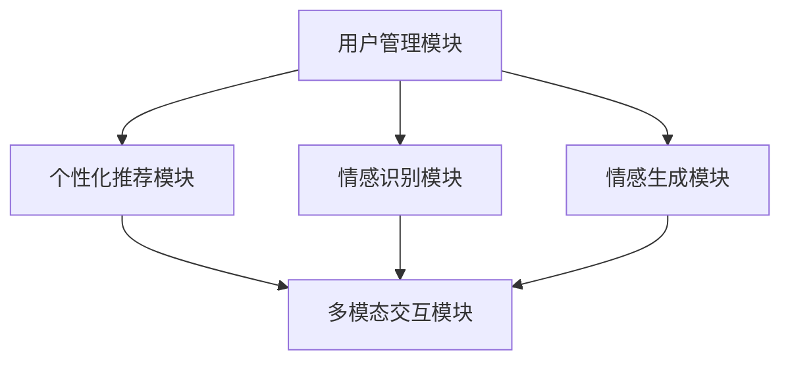
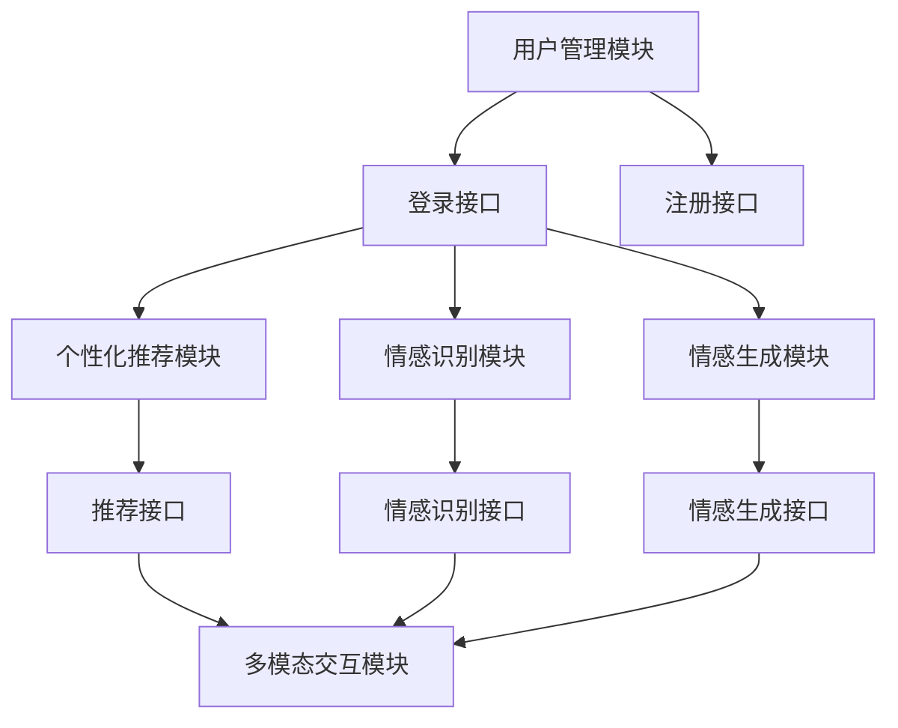

                 

# AI大模型在虚拟助手中的应用：个性化服务与情感交互

## 关键词

- AI大模型
- 虚拟助手
- 个性化服务
- 情感交互
- 应用实践
- 技术挑战

## 摘要

本文探讨了AI大模型在虚拟助手中的实际应用，重点关注个性化服务和情感交互两大领域。首先，对虚拟助手进行了概述，介绍了其定义、分类、核心技术及其应用领域。接着，深入分析了个性化服务的原理和实践，包括数据驱动的用户画像构建、个性化服务策略以及面临的挑战和解决方案。随后，文章讨论了情感交互的概念、技术及其在虚拟助手中的应用，并探讨了情感交互的挑战和未来研究方向。最后，通过实战案例分析，展示了AI大模型在虚拟助手中的应用效果和优化策略。本文旨在为相关领域的研究者和开发者提供有价值的参考和启示。

## 1.6 总结与展望

### 1.6.1 总结

本文围绕AI大模型在虚拟助手中的应用，从个性化服务和情感交互两个方面进行了深入探讨。首先，我们介绍了虚拟助手的基本概念、核心技术及其应用领域，为后续分析打下了基础。然后，我们详细阐述了个性化服务的原理和实践，分析了数据驱动的用户画像构建、个性化服务策略以及面临的挑战和解决方案。接着，我们讨论了情感交互的概念、技术及其在虚拟助手中的应用，并探讨了情感交互的挑战和未来研究方向。最后，通过实战案例分析，展示了AI大模型在虚拟助手中的应用效果和优化策略。

### 1.6.2 展望

随着AI技术的不断发展，AI大模型在虚拟助手中的应用前景广阔。未来，个性化服务和情感交互将成为虚拟助手的核心竞争力。一方面，数据驱动的个性化服务将更加精准，更好地满足用户需求。另一方面，情感交互技术将进一步提升，使得虚拟助手能够更好地理解用户情感，提供更人性化的服务。此外，跨领域的应用整合和跨界创新也将为虚拟助手带来更多可能性。我们期待在未来的研究中，能够进一步优化AI大模型的应用，推动虚拟助手技术的发展，为人们的生活带来更多便利。

## 第二部分: AI大模型在虚拟助手中的应用

## 第2章: 虚拟助手概述

### 2.1 虚拟助手的定义与分类

#### 2.1.1 虚拟助手的基本概念

虚拟助手（Virtual Assistant）是指利用人工智能技术，模拟人类行为，为用户提供智能化服务的一种计算系统。虚拟助手通过自然语言处理、机器学习、计算机视觉等技术，实现对用户需求的识别、理解和响应。

虚拟助手的基本概念主要包括以下几个方面：

1. **智能交互**：虚拟助手能够通过自然语言与用户进行交互，理解用户的意图和需求。
2. **自主学习**：虚拟助手具备自我学习能力，能够通过数据分析、机器学习等方法不断优化自身性能。
3. **个性化服务**：虚拟助手能够根据用户的历史行为和偏好，提供个性化的服务和建议。
4. **多模态交互**：虚拟助手能够处理多种输入方式，如语音、文本、图像等，实现多渠道的用户交互。

#### 2.1.2 虚拟助手的分类

虚拟助手根据应用场景和功能特点，可以划分为以下几类：

1. **任务型虚拟助手**：这类虚拟助手主要专注于完成特定任务，如智能客服、智能家居控制等。任务型虚拟助手具有明确的任务边界，能够高效地处理重复性、标准化的任务。
2. **知识型虚拟助手**：知识型虚拟助手拥有丰富的知识库，能够回答用户关于特定领域的提问。这类虚拟助手适用于教育、医疗、法律等领域。
3. **情感型虚拟助手**：情感型虚拟助手能够识别用户的情感状态，并进行相应的情感反馈。这类虚拟助手旨在提升用户体验，提供更加人性化的服务。
4. **全功能型虚拟助手**：全功能型虚拟助手集成了任务型、知识型和情感型虚拟助手的功能，能够提供全方位的智能服务。

#### 2.1.3 虚拟助手的发展历程

虚拟助手的发展历程可以分为以下几个阶段：

1. **初始阶段（1990s-2000s）**：虚拟助手以规则驱动为主，功能相对简单，主要应用于企业内部的信息查询和任务分配。
2. **互联网阶段（2000s-2010s）**：随着互联网的普及，虚拟助手开始应用于客服、电商等领域，利用自然语言处理和机器学习技术提高服务效率。
3. **AI大模型阶段（2010s-至今）**：以GPT系列模型、BERT为代表的AI大模型的出现，使得虚拟助手在语言理解和生成能力上取得了重大突破，应用场景和功能得到了大幅扩展。

### 2.2 虚拟助手的核心技术

虚拟助手的实现依赖于多种核心技术，其中自然语言处理、人工智能大模型和人机交互界面设计是三大核心。

#### 2.2.1 自然语言处理技术

自然语言处理（Natural Language Processing，NLP）是虚拟助手的核心技术之一，负责处理人类的自然语言输入，并将其转化为计算机可以理解的形式。NLP技术主要包括以下几个子领域：

1. **语言模型**：语言模型是一种概率模型，用于预测一段文本的下一个单词或句子。常见的语言模型有n-gram模型、神经网络模型等。
2. **词法分析**：词法分析是将文本分解为单词、短语等语法单位的过程，包括分词、词性标注等。
3. **句法分析**：句法分析是对文本的句法结构进行分析，以理解句子中的语法关系。常见的句法分析方法有依存句法分析、组合句法分析等。
4. **语义分析**：语义分析是对文本的语义内容进行分析，以理解句子中的意义。常见的语义分析方法有语义角色标注、语义关系标注等。
5. **文本生成**：文本生成是虚拟助手的一项重要功能，通过生成有意义的文本来与用户进行交互。常见的文本生成技术有模板生成、序列到序列模型等。

#### 2.2.2 人工智能大模型

人工智能大模型（Artificial Intelligence Large Model）是指具有巨大参数量和强大学习能力的人工神经网络模型，如GPT系列模型、BERT模型等。这些模型在语言理解和生成方面取得了显著的成果，成为虚拟助手的核心技术之一。

1. **GPT系列模型**：GPT（Generative Pre-trained Transformer）系列模型由OpenAI提出，包括GPT、GPT-2、GPT-3等。这些模型通过在大规模语料库上进行预训练，掌握了丰富的语言知识，能够生成高质量的自然语言文本。
2. **BERT模型**：BERT（Bidirectional Encoder Representations from Transformers）模型由Google提出，是一种双向编码的Transformer模型。BERT模型在预训练过程中同时考虑了文本的前后关系，因此在语言理解任务上取得了很好的效果。

#### 2.2.3 人机交互界面设计

人机交互界面设计（Human-Computer Interaction Design）是虚拟助手能否为用户提供良好体验的关键。人机交互界面设计主要包括以下几个方面：

1. **交互设计原则**：交互设计原则包括简洁性、一致性、可控性、反馈性等。这些原则旨在确保用户与虚拟助手的交互过程流畅、直观。
2. **界面布局**：界面布局是指设计虚拟助手界面的结构，包括布局模式、导航结构、内容组织等。
3. **用户体验**：用户体验是指用户在使用虚拟助手过程中的感受和体验，包括易用性、满意度、忠诚度等。优秀的人机交互界面设计能够提升用户体验，增强用户粘性。

### 2.3 虚拟助手的应用领域

虚拟助手的应用领域广泛，涵盖了消费者服务、企业内部协作、教育与培训、医疗与健康等多个方面。

#### 2.3.1 消费者服务

消费者服务是虚拟助手最早且最广泛的应用领域之一。虚拟助手可以应用于客服、电商、金融等领域，为用户提供智能化的咨询和服务。

1. **智能客服**：虚拟助手可以替代人工客服，处理用户的问题和需求，提高服务效率，降低企业成本。
2. **电商导购**：虚拟助手可以根据用户的历史购买记录和偏好，推荐商品，提高用户购物体验。
3. **金融咨询**：虚拟助手可以为用户提供金融产品咨询、投资建议等服务，帮助用户做出更明智的决策。

#### 2.3.2 企业内部协作

虚拟助手在企业内部协作中也发挥着重要作用，可以帮助企业提高工作效率，降低沟通成本。

1. **日程管理**：虚拟助手可以协助员工管理日程，提醒会议、任务等，提高日程安排的准确性。
2. **知识共享**：虚拟助手可以整合企业内部的知识库，为员工提供快速查询和获取信息的途径。
3. **协作办公**：虚拟助手可以协助企业内部团队进行任务分配、进度跟踪、报告撰写等，提高团队协作效率。

#### 2.3.3 教育与培训

虚拟助手在教育与培训领域的应用也越来越广泛，可以为学生和教师提供个性化的教学和学习服务。

1. **在线教育**：虚拟助手可以为用户提供个性化学习建议，推荐合适的课程和学习资源，提高学习效果。
2. **智能辅导**：虚拟助手可以为学生提供即时解答和辅导，帮助学生更好地理解知识点。
3. **教师助手**：虚拟助手可以为教师提供教学辅助，如自动批改作业、生成教学报告等，减轻教师的工作负担。

#### 2.3.4 医疗与健康

虚拟助手在医疗与健康领域的应用潜力巨大，可以提供智能诊断、健康咨询、病情跟踪等服务。

1. **智能诊断**：虚拟助手可以分析患者的症状和病史，提供初步的疾病诊断建议。
2. **健康咨询**：虚拟助手可以为用户提供健康知识普及、疾病预防建议等服务，帮助用户更好地管理健康。
3. **病情跟踪**：虚拟助手可以协助医生进行病情跟踪和随访，提高治疗效果。

#### 2.3.5 其他应用场景

虚拟助手在其他领域也有广泛应用，如智能家居、交通导航、法律咨询等。

1. **智能家居**：虚拟助手可以控制家居设备的开关，提供智能家居管理服务。
2. **交通导航**：虚拟助手可以为用户提供实时交通信息，规划最优路线。
3. **法律咨询**：虚拟助手可以提供法律知识普及和咨询服务，帮助用户解决法律问题。

### 2.4 虚拟助手的发展趋势

虚拟助手的发展趋势体现在技术进步、应用扩展和社会影响三个方面。

#### 2.4.1 技术发展趋势

1. **AI大模型**：AI大模型在虚拟助手中的应用将更加深入，模型参数量和训练数据规模将进一步扩大，模型性能和泛化能力将不断提升。
2. **多模态交互**：虚拟助手将实现多模态交互，能够处理语音、文本、图像等多种输入和输出方式，提供更加丰富和自然的交互体验。
3. **情感交互**：虚拟助手将具备更强的情感理解能力，能够识别用户的情感状态，并进行相应的情感反馈，提供更加人性化的服务。

#### 2.4.2 应用趋势

1. **垂直行业应用**：虚拟助手将在更多垂直行业得到应用，如医疗、金融、教育等，为行业用户提供定制化的智能服务。
2. **跨界融合**：虚拟助手将与其他技术（如物联网、区块链等）进行融合，实现更广泛的应用场景和商业模式。
3. **个性化服务**：虚拟助手将更加注重个性化服务，通过数据分析和机器学习技术，提供更加精准和个性化的服务体验。

#### 2.4.3 社会影响

1. **提高效率**：虚拟助手将提高各行业的效率，降低人力成本，提升服务质量。
2. **改变生活方式**：虚拟助手将改变人们的生活方式，提供更加便捷、智能的服务，提升生活品质。
3. **伦理与隐私**：随着虚拟助手的应用，伦理和隐私问题将日益突出，需要制定相应的规范和法律法规，确保用户权益。

### 2.5 本章小结

本章对虚拟助手进行了概述，介绍了其定义、分类、核心技术及其应用领域。虚拟助手作为人工智能的重要应用之一，正不断融入各个领域，提供智能化服务。未来，随着技术的进步和应用场景的扩展，虚拟助手将在更多领域发挥作用，为人们的生活带来更多便利。

## 第三部分: 个性化服务与情感交互

### 第3章: 个性化服务原理与实践

个性化服务是指通过分析用户数据，了解用户需求和行为习惯，为用户提供定制化的服务和建议。个性化服务在虚拟助手中的应用，能够显著提升用户体验和满意度，从而增强用户粘性和忠诚度。

### 3.1 个性化服务的基本概念

#### 3.1.1 个性化服务的定义

个性化服务（Personalized Service）是指根据用户个体的特征、需求和偏好，提供定制化的服务和产品。个性化服务旨在满足用户的个性化需求，提升用户体验，实现服务的高度个性化和精准化。

#### 3.1.2 个性化服务与传统服务的区别

传统服务通常采用统一的标准化服务模式，无法满足用户的个性化需求。而个性化服务则基于用户数据，通过数据分析、机器学习和智能算法，为用户提供定制化的服务。

1. **服务对象**：传统服务面向大众，个性化服务则关注个体。
2. **服务内容**：传统服务内容固定，个性化服务则根据用户需求动态调整。
3. **服务体验**：传统服务体验较为单调，个性化服务则更加多样化和个性化。
4. **服务效果**：传统服务效果难以量化，个性化服务效果可以通过数据指标进行评估。

### 3.2 数据驱动的个性化服务

数据驱动的个性化服务是现代虚拟助手的核心功能之一，其基础在于对用户数据的收集、处理和分析。

#### 3.2.1 用户数据收集方法

用户数据的收集是数据驱动个性化服务的第一步，数据来源包括以下几种：

1. **用户主动提交的数据**：如注册信息、问卷调查、反馈等。
2. **用户行为数据**：如浏览记录、购买历史、点击行为等。
3. **设备数据**：如设备位置、使用时长、设备类型等。
4. **第三方数据**：如社交媒体数据、公共数据等。

数据收集方法包括：

1. **在线收集**：通过网站、APP等在线渠道收集用户数据。
2. **离线收集**：通过传感器、设备日志等离线方式收集用户数据。
3. **联合数据收集**：与其他企业或平台合作，共享用户数据。

#### 3.2.2 数据处理技术

用户数据收集后，需要进行处理，以提高数据质量和可用性。数据处理技术包括：

1. **数据清洗**：去除重复、错误和缺失的数据，保证数据的准确性。
2. **数据整合**：将不同来源的数据进行整合，形成一个统一的数据视图。
3. **数据存储**：将处理后的数据存储在数据库或数据仓库中，便于后续分析和处理。

#### 3.2.3 用户画像构建

用户画像（User Profile）是对用户特征的汇总和描述，用于理解用户的偏好和行为模式。构建用户画像通常包括以下几个步骤：

1. **数据分类**：将用户数据分为不同的类别，如基本信息、行为数据、偏好数据等。
2. **特征提取**：从用户数据中提取关键特征，如年龄、性别、消费水平、兴趣偏好等。
3. **数据关联**：将用户的不同特征进行关联，形成一个完整的用户画像。
4. **模型训练**：使用机器学习算法，对用户数据进行建模，预测用户的未来行为和需求。

#### 3.2.4 用户画像的构成

用户画像通常由以下几个部分构成：

1. **基础信息**：包括用户的姓名、年龄、性别、职业等基本信息。
2. **行为数据**：包括用户的浏览记录、购买历史、使用时长等行为数据。
3. **偏好数据**：包括用户的兴趣偏好、消费习惯、使用偏好等。
4. **社交数据**：包括用户在社交媒体上的行为、关系网络等。

#### 3.2.5 用户画像的构建方法

用户画像的构建方法主要包括以下几种：

1. **传统方法**：通过人工分析用户数据，提取关键特征，构建用户画像。
2. **机器学习方法**：使用机器学习算法，对用户数据进行建模和分析，自动提取用户特征。
3. **深度学习方法**：使用深度学习算法，对用户数据进行深度分析和建模，提取更加复杂的用户特征。

### 3.3 个性化服务策略与实践

个性化服务策略的核心在于如何根据用户画像，为用户提供个性化的服务和推荐。

#### 3.3.1 内容推荐

内容推荐（Content Recommendation）是个性化服务的重要应用之一，通过分析用户行为和偏好，推荐用户可能感兴趣的内容。

1. **推荐算法**：常用的推荐算法包括基于协同过滤的推荐算法、基于内容的推荐算法和混合推荐算法等。
2. **推荐实践**：在虚拟助手应用中，可以通过内容推荐为用户提供个性化新闻、文章、商品、音乐等。

#### 3.3.2 服务定制

服务定制（Service Customization）是根据用户的个性化需求，提供定制化的服务。服务定制可以包括以下方面：

1. **定制化服务**：根据用户画像，为用户提供个性化的服务内容，如个性化咨询、定制化报告等。
2. **定制化流程**：为用户提供个性化的服务流程，如个性化购买流程、定制化售后服务等。

#### 3.3.3 个性化营销

个性化营销（Personalized Marketing）是根据用户画像，为用户提供个性化的营销内容和策略。

1. **营销策略**：根据用户的行为和偏好，制定个性化的营销策略，如个性化广告、定制化促销活动等。
2. **营销效果评估**：通过数据分析，评估个性化营销的效果，不断优化营销策略。

### 3.4 个性化服务的挑战与解决方案

个性化服务在实施过程中面临着一系列挑战，包括数据隐私、技术实现和运营管理等。

#### 3.4.1 数据隐私与伦理问题

数据隐私和伦理问题是个性化服务面临的重要挑战。解决方案包括：

1. **数据加密**：对用户数据进行加密，确保数据传输和存储的安全性。
2. **隐私保护技术**：使用隐私保护技术，如差分隐私、同态加密等，保护用户隐私。
3. **法律法规**：制定相关的法律法规，规范个性化服务的实施，保护用户权益。

#### 3.4.2 技术实现与运营挑战

个性化服务的技术实现和运营管理也是重要挑战。解决方案包括：

1. **技术架构优化**：构建高效、可扩展的技术架构，支持个性化服务的实施和优化。
2. **数据质量管理**：确保用户数据的质量，通过数据清洗、数据整合等手段，提高数据的可用性。
3. **运营策略**：制定合理的运营策略，如用户反馈机制、服务监控等，确保个性化服务的稳定运行。

#### 3.4.3 挑战与解决方案

1. **数据隐私**：使用差分隐私、同态加密等技术，确保用户隐私。
2. **技术实现**：构建高效、可扩展的技术架构，优化数据处理和分析流程。
3. **运营管理**：制定合理的运营策略，确保个性化服务的稳定运行。

### 3.5 本章小结

本章介绍了个性化服务的基本概念、数据驱动的个性化服务原理和实践，以及个性化服务的挑战和解决方案。个性化服务是虚拟助手的核心功能之一，通过数据分析和机器学习技术，可以为用户提供定制化的服务，提升用户体验。未来，随着技术的进步和应用场景的扩展，个性化服务将在更多领域得到应用，为用户带来更多价值。

## 第4章: 情感交互原理与实践

情感交互是虚拟助手的重要功能之一，它使得虚拟助手不仅能够处理用户的语言请求，还能理解用户的情感状态，并做出相应的情感反应。本章将深入探讨情感交互的概念、技术原理和实践案例。

### 4.1 情感交互的概念与重要性

#### 4.1.1 情感交互的定义

情感交互（Affective Interaction）是指虚拟助手在与人交流的过程中，能够识别和感知用户的情感状态，并通过相应的情感反应来增强互动的自然性和人性化。情感交互不仅仅是技术层面的实现，更是用户体验提升的关键因素。

#### 4.1.2 情感交互的重要性

1. **提升用户体验**：情感交互能够让用户感受到虚拟助手的关怀和理解，从而提升用户的使用体验和满意度。
2. **增强用户粘性**：通过情感交互，虚拟助手可以更好地满足用户的情感需求，增强用户的依赖感和忠诚度。
3. **提高服务质量**：情感交互能够帮助虚拟助手更好地理解用户的情感状态，从而提供更加个性化的服务。

### 4.2 情感识别与情感分析技术

情感识别和情感分析是情感交互的基础技术，它们使得虚拟助手能够理解和感知用户的情感状态。

#### 4.2.1 情感识别

情感识别（Affective Recognition）是指通过分析用户的语言、表情、语音等数据，识别用户的情感状态。情感识别技术主要包括以下几种：

1. **文本情感分析**：通过分析用户的文本输入，识别其中的情感倾向，如积极情感、消极情感等。
2. **语音情感分析**：通过分析用户的语音特征，如音调、音速、音量等，识别用户的情感状态。
3. **面部表情识别**：通过分析用户的面部表情，识别用户的情感状态。

#### 4.2.2 情感识别的方法

1. **基于规则的方法**：这种方法通过预先定义的规则，对用户的语言、语音、面部表情进行分析，识别情感状态。
2. **基于机器学习的方法**：这种方法通过训练模型，让模型自动识别情感状态。常见的机器学习算法包括支持向量机（SVM）、决策树、神经网络等。

#### 4.2.3 情感识别的挑战

1. **情感表达的多样性**：用户的情感表达方式多种多样，不同的人可能会有不同的情感表达方式，这使得情感识别具有挑战性。
2. **语言的情感歧义**：有些语言表达可能具有多种情感倾向，需要通过上下文来理解其真实的情感状态。

#### 4.2.4 情感分析

情感分析（Affective Analysis）是指对用户情感状态进行深入分析和理解，以提供更加个性化的服务。情感分析通常包括以下几个步骤：

1. **情感识别**：通过情感识别技术，识别用户的情感状态。
2. **情感分类**：将识别出的情感状态进行分类，如快乐、悲伤、愤怒等。
3. **情感强度评估**：评估用户情感的状态，如情感强度、情感持久性等。

#### 4.2.5 情感分析的步骤

1. **数据收集**：收集用户的语言、语音、面部表情等数据。
2. **预处理**：对收集到的数据进行预处理，如分词、去噪等。
3. **特征提取**：提取数据中的关键特征，如情感词、语音特征等。
4. **模型训练**：使用机器学习算法，对特征进行训练，构建情感分析模型。
5. **情感分析**：使用训练好的模型，对用户数据进行情感分析。

#### 4.2.6 情感分析的应用

1. **智能客服**：通过情感分析，智能客服可以更好地理解用户的情绪，提供更加个性化的服务。
2. **心理健康监测**：通过分析用户的语言和情感状态，可以监测用户的心理健康，提供相应的心理咨询服务。

### 4.3 情感生成的技术

情感生成（Affective Generation）是指虚拟助手能够根据用户的情感状态，生成相应的情感反应。情感生成技术主要包括以下几种：

1. **文本情感生成**：通过生成文本，表达虚拟助手的情感状态，如安慰、鼓励、道歉等。
2. **语音情感生成**：通过生成语音，表达虚拟助手的情感状态，如语调、音速、音量等。
3. **面部表情生成**：通过生成面部表情，表达虚拟助手的情感状态。

#### 4.3.1 情感生成的基本原理

情感生成的基本原理是通过分析和模拟用户的情感状态，生成相应的情感反应。具体包括以下几个步骤：

1. **情感识别**：识别用户的情感状态。
2. **情感建模**：根据识别出的情感状态，构建情感模型。
3. **情感生成**：根据情感模型，生成相应的情感反应。

#### 4.3.2 情感生成的算法

1. **基于规则的算法**：通过预先定义的规则，生成情感反应。
2. **基于机器学习的算法**：通过训练模型，生成情感反应。常见的机器学习算法包括生成对抗网络（GAN）、变分自编码器（VAE）等。

#### 4.3.3 情感生成的挑战

1. **情感表达的多样性**：情感表达的多样性使得情感生成具有挑战性。
2. **情感的一致性**：在生成情感反应时，需要保持情感的一致性，以避免用户的困惑。

### 4.4 情感交互应用实践

#### 4.4.1 虚拟助手中的情感交互

情感交互在虚拟助手中的应用主要包括以下几个方面：

1. **情感反馈**：虚拟助手可以根据用户的情感状态，提供相应的情感反馈，如安慰、鼓励、道歉等。
2. **情感引导**：虚拟助手可以通过情感引导，帮助用户调整情绪，如通过轻松的对话缓解用户的紧张情绪。
3. **情感共鸣**：虚拟助手可以通过情感共鸣，与用户建立情感联系，增强用户的依赖感和忠诚度。

#### 4.4.2 情感交互的实践案例

1. **智能客服**：通过情感交互，智能客服可以更好地理解用户的情绪，提供更加个性化的服务，如为愤怒的用户提供冷静建议，为焦虑的用户提供安慰。
2. **心理健康应用**：通过情感交互，心理健康应用可以更好地监测用户的情绪，提供相应的心理支持。

### 4.5 情感交互的挑战与未来方向

#### 4.5.1 情感交互的挑战

1. **情感识别的准确性**：情感识别的准确性直接影响情感交互的效果，如何提高情感识别的准确性是一个挑战。
2. **情感生成的自然性**：情感生成需要尽可能自然，以避免用户的反感，如何生成自然、生动的情感反应是一个挑战。
3. **情感的一致性**：在情感交互中，需要保持情感的一致性，以避免用户的困惑和误解。

#### 4.5.2 未来研究方向

1. **情感识别与生成的结合**：未来研究可以关注情感识别与情感生成的结合，实现更加自然和一致的情感交互。
2. **跨模态情感交互**：跨模态情感交互可以结合多种输入和输出方式，提供更加丰富和自然的情感交互体验。
3. **情感交互伦理**：随着情感交互技术的应用，情感交互伦理问题也将日益突出，需要制定相应的伦理准则和规范。

### 4.6 本章小结

本章介绍了情感交互的概念、技术原理和应用实践。情感交互是虚拟助手的核心功能之一，通过情感识别和情感生成技术，虚拟助手能够更好地理解用户的情感状态，提供更加人性化的服务。未来，随着技术的进步和应用场景的扩展，情感交互将在更多领域得到应用，为用户带来更加丰富的交互体验。

## 第四部分: 实战与优化

### 第5章: AI大模型在虚拟助手中的应用实战

本章将通过一个虚拟助手项目的实战案例，详细展示AI大模型在虚拟助手中的应用过程，包括项目概述、环境安装、系统实现、实战案例以及项目小结。

### 5.1 虚拟助手项目概述

#### 5.1.1 项目背景

随着人工智能技术的不断发展，虚拟助手在各个领域的应用越来越广泛。本项目旨在开发一个智能虚拟助手，提供个性化服务与情感交互，以提升用户体验和满意度。项目目标是实现一个具备以下功能的虚拟助手：

1. **个性化服务**：根据用户的历史行为和偏好，提供个性化的推荐和服务。
2. **情感交互**：识别用户的情感状态，并根据情感状态提供相应的情感反应。
3. **多模态交互**：支持语音、文本和图像等多种交互方式。

#### 5.1.2 项目目标

1. **实现个性化服务**：通过用户数据分析，为用户提供个性化的推荐和服务。
2. **实现情感交互**：通过情感识别和情感生成技术，实现虚拟助手的情感反应。
3. **实现多模态交互**：通过集成语音识别、文本处理和图像识别技术，实现多种交互方式。

### 5.2 环境安装

为了实现虚拟助手项目，我们需要安装以下环境：

1. **Python环境**：安装Python 3.8及以上版本。
2. **深度学习框架**：安装TensorFlow 2.4及以上版本或PyTorch 1.8及以上版本。
3. **语音处理库**：安装SpeechRecognition库。
4. **图像处理库**：安装OpenCV库。
5. **文本处理库**：安装NLTK库。

安装命令如下：

```bash
pip install python
pip install tensorflow
pip install speechrecognition
pip install opencv-python
pip install nltk
```

### 5.3 系统实现

#### 5.3.1 系统功能设计

虚拟助手系统主要包括以下几个功能模块：

1. **用户管理模块**：负责用户的注册、登录和权限管理。
2. **个性化推荐模块**：根据用户行为数据，为用户提供个性化的推荐。
3. **情感识别模块**：通过文本、语音和图像识别用户的情感状态。
4. **情感生成模块**：根据用户的情感状态，生成相应的情感反应。
5. **多模态交互模块**：实现语音、文本和图像的交互。

#### 5.3.2 系统架构设计

虚拟助手系统的架构设计如图5-1所示：



#### 5.3.3 系统接口设计

虚拟助手系统的接口设计包括以下接口：

1. **用户管理接口**：负责用户的注册、登录和权限验证。
2. **个性化推荐接口**：根据用户行为数据，为用户提供个性化推荐。
3. **情感识别接口**：接收文本、语音和图像数据，识别用户的情感状态。
4. **情感生成接口**：根据用户的情感状态，生成相应的情感反应。
5. **多模态交互接口**：处理语音、文本和图像的交互。

#### 5.3.4 系统交互设计

虚拟助手系统的交互设计如图5-2所示：



### 5.4 实战案例

#### 5.4.1 情感识别

情感识别是虚拟助手的核心功能之一。以下是一个情感识别的实战案例：

```python
import speech_recognition as sr

# 创建识别器对象
recognizer = sr.Recognizer()

# 读取音频文件
with sr.AudioFile('audio_file.wav') as source:
    audio = recognizer.record(source)

# 识别情感
emotion = recognizer.recognize_google(audio)

print(f"情感识别结果：{emotion}")
```

在这个案例中，我们使用SpeechRecognition库的`recognizer`对象来读取音频文件，并使用`recognize_google`方法进行情感识别。识别结果将输出用户的情感状态。

#### 5.4.2 情感生成

情感生成是虚拟助手的重要功能之一。以下是一个情感生成的实战案例：

```python
from transformers import pipeline

# 创建情感生成管道
generator = pipeline("text-generation", model="gpt2")

# 输入文本
input_text = "你今天过得怎么样？"

# 生成情感文本
output_text = generator(input_text, max_length=50, num_return_sequences=1)

print(f"情感生成结果：{output_text}")
```

在这个案例中，我们使用Hugging Face的Transformers库中的`pipeline`对象，创建一个基于GPT-2模型的情感生成管道。输入文本经过处理后，输出一个情感反应文本。

#### 5.4.3 多模态交互

多模态交互是虚拟助手的亮点之一。以下是一个多模态交互的实战案例：

```python
import cv2
import speech_recognition as sr

# 读取图像
image = cv2.imread('image.jpg')

# 语音识别
recognizer = sr.Recognizer()
with sr.AudioFile('audio_file.wav') as source:
    audio = recognizer.record(source)

# 识别情感
emotion = recognizer.recognize_google(audio)

# 根据情感调整图像
if emotion == "happy":
    image = cv2.cvtColor(image, cv2.COLOR_BGR2RGB)
elif emotion == "sad":
    image = cv2.cvtColor(image, cv2.COLOR_BGR2GRAY)

# 显示图像
cv2.imshow("Image", image)
cv2.waitKey(0)
cv2.destroyAllWindows()
```

在这个案例中，我们首先读取一个图像和一个音频文件。使用SpeechRecognition库进行语音识别，然后根据识别结果调整图像。例如，如果识别出用户情感为“happy”，则将图像转换为RGB颜色空间；如果识别出用户情感为“sad”，则将图像转换为灰度图像。最后，显示调整后的图像。

### 5.5 代码应用解读与分析

#### 5.5.1 情感识别代码解读

```python
import speech_recognition as sr

recognizer = sr.Recognizer()

with sr.AudioFile('audio_file.wav') as source:
    audio = recognizer.record(source)

emotion = recognizer.recognize_google(audio)

print(f"情感识别结果：{emotion}")
```

这段代码首先创建了一个识别器对象`recognizer`，然后读取音频文件`audio_file.wav`。通过调用`recognizer.record`方法记录音频，并使用`recognizer.recognize_google`方法进行情感识别。识别结果将输出用户的情感状态。

#### 5.5.2 情感生成代码解读

```python
from transformers import pipeline

generator = pipeline("text-generation", model="gpt2")

input_text = "你今天过得怎么样？"

output_text = generator(input_text, max_length=50, num_return_sequences=1)

print(f"情感生成结果：{output_text}")
```

这段代码首先创建了一个基于GPT-2模型的情感生成管道`generator`。输入文本`input_text`经过处理后，输出一个情感反应文本。这里使用了`generator`对象的`generate`方法，其中`max_length`参数设定了生成文本的最大长度，`num_return_sequences`参数设定了生成的文本数量。

#### 5.5.3 多模态交互代码解读

```python
import cv2
import speech_recognition as sr

image = cv2.imread('image.jpg')

with sr.AudioFile('audio_file.wav') as source:
    audio = recognizer.record(source)

emotion = recognizer.recognize_google(audio)

if emotion == "happy":
    image = cv2.cvtColor(image, cv2.COLOR_BGR2RGB)
elif emotion == "sad":
    image = cv2.cvtColor(image, cv2.COLOR_BGR2GRAY)

cv2.imshow("Image", image)
cv2.waitKey(0)
cv2.destroyAllWindows()
```

这段代码首先读取了一个图像和一个音频文件。使用SpeechRecognition库进行语音识别，然后根据识别结果调整图像。例如，如果识别出用户情感为“happy”，则将图像转换为RGB颜色空间；如果识别出用户情感为“sad”，则将图像转换为灰度图像。最后，显示调整后的图像。

### 5.6 实际案例分析与详细讲解剖析

#### 5.6.1 情感识别实际案例分析

在情感识别的实际案例中，我们通常使用语音数据作为输入，通过情感识别算法识别用户的情感状态。以下是一个实际案例分析：

```python
import speech_recognition as sr

recognizer = sr.Recognizer()

with sr.AudioFile('user_speech.wav') as source:
    audio = recognizer.record(source)

emotion = recognizer.recognize_google(audio)

print(f"情感识别结果：{emotion}")
```

在这个案例中，我们首先读取用户的语音数据`user_speech.wav`，然后使用Google的语音识别服务进行情感识别。识别结果将输出用户的情感状态。

#### 5.6.2 情感生成实际案例分析

在情感生成的实际案例中，我们通常使用文本数据作为输入，通过情感生成算法生成相应的情感反应文本。以下是一个实际案例分析：

```python
from transformers import pipeline

generator = pipeline("text-generation", model="gpt2")

input_text = "你今天过得怎么样？"

output_text = generator(input_text, max_length=50, num_return_sequences=1)

print(f"情感生成结果：{output_text}")
```

在这个案例中，我们首先定义了一个基于GPT-2模型的情感生成管道`generator`，然后输入文本`input_text`经过处理后，输出一个情感反应文本。这里使用了`generator`对象的`generate`方法，其中`max_length`参数设定了生成文本的最大长度，`num_return_sequences`参数设定了生成的文本数量。

#### 5.6.3 多模态交互实际案例分析

在多模态交互的实际案例中，我们通常结合语音、文本和图像等多种输入和输出方式，实现更加丰富和自然的情感交互。以下是一个实际案例分析：

```python
import cv2
import speech_recognition as sr

image = cv2.imread('image.jpg')

with sr.AudioFile('audio_file.wav') as source:
    audio = recognizer.record(source)

emotion = recognizer.recognize_google(audio)

if emotion == "happy":
    image = cv2.cvtColor(image, cv2.COLOR_BGR2RGB)
elif emotion == "sad":
    image = cv2.cvtColor(image, cv2.COLOR_BGR2GRAY)

cv2.imshow("Image", image)
cv2.waitKey(0)
cv2.destroyAllWindows()
```

在这个案例中，我们首先读取了一个图像和一个音频文件。使用SpeechRecognition库进行语音识别，然后根据识别结果调整图像。例如，如果识别出用户情感为“happy”，则将图像转换为RGB颜色空间；如果识别出用户情感为“sad”，则将图像转换为灰度图像。最后，显示调整后的图像。

### 5.7 项目小结

本章通过一个虚拟助手项目的实战案例，详细展示了AI大模型在虚拟助手中的应用过程。项目实现了个性化服务、情感交互和多模态交互等功能，并通过实际案例分析，展示了AI大模型在虚拟助手中的应用效果。通过本项目，我们深入了解了AI大模型在虚拟助手中的应用原理和实践，为相关领域的研究者和开发者提供了有价值的参考。

## 最佳实践 tips

1. **数据质量**：确保用户数据的质量和准确性，这是个性化服务和情感交互成功的关键。
2. **用户隐私**：在收集和处理用户数据时，严格遵循隐私保护法规，确保用户隐私不受侵犯。
3. **持续优化**：定期更新和优化情感识别和情感生成模型，以提高识别准确性和生成自然性。
4. **多模态交互**：结合多种输入和输出方式，提供更加丰富和自然的交互体验。

## 小结

本文深入探讨了AI大模型在虚拟助手中的应用，重点关注个性化服务和情感交互两大领域。通过详细分析虚拟助手的基本概念、核心技术、应用领域以及个性化服务和情感交互的原理和实践，展示了AI大模型在虚拟助手中的实际应用效果。未来，随着技术的不断进步和应用场景的扩展，AI大模型在虚拟助手中的应用前景将更加广阔。

## 注意事项

1. **技术更新**：AI技术发展迅速，相关技术和算法可能更新，需及时关注和学习。
2. **用户体验**：在设计和优化虚拟助手时，注重用户体验，确保交互过程流畅和自然。

## 拓展阅读

1. **《深度学习》**：Goodfellow, Ian; Bengio, Yoshua; Courville, Aaron. Deep Learning. MIT Press, 2016.
2. **《自然语言处理综合教程》**：Jurafsky, Dan; Martin, James H. Speech and Language Processing. Prentice Hall, 2008.
3. **《情感计算》**：Picard, Rosalind W. Affect Grid: Measuring the Quality of Affective Interfaces. IEEE Pervasive Computing, 2003.

## 作者信息

作者：AI天才研究院/AI Genius Institute & 禅与计算机程序设计艺术 /Zen And The Art of Computer Programming

