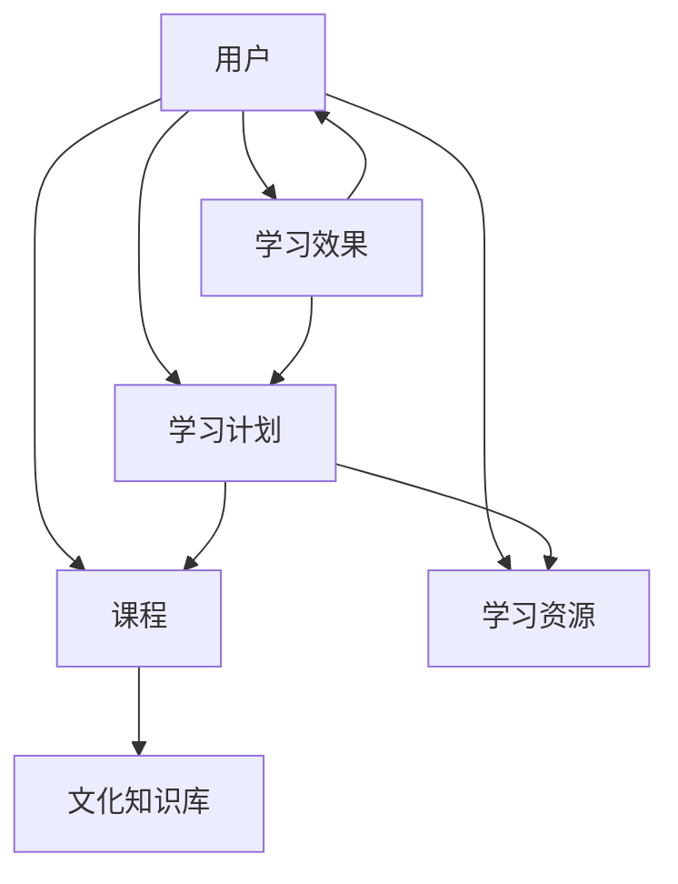
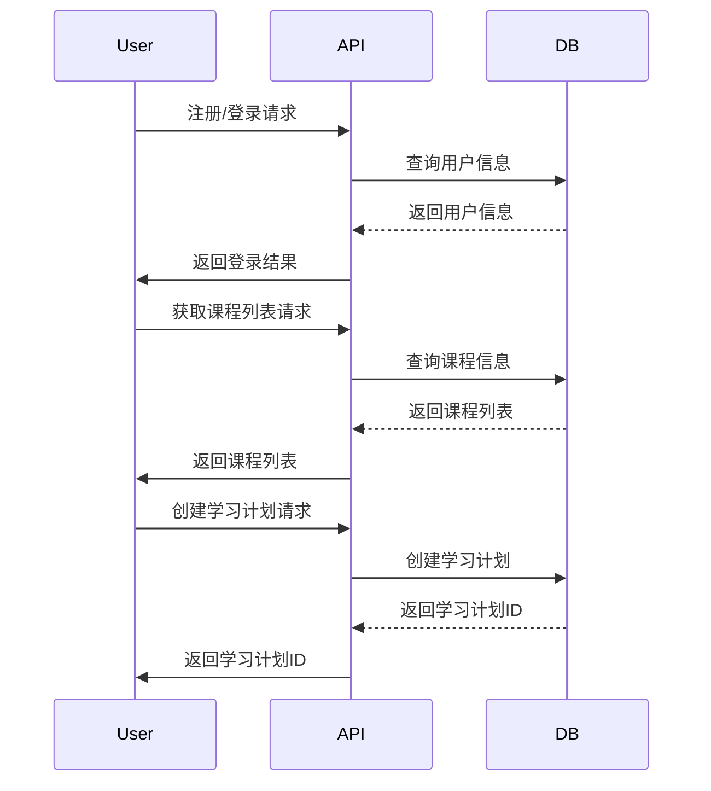
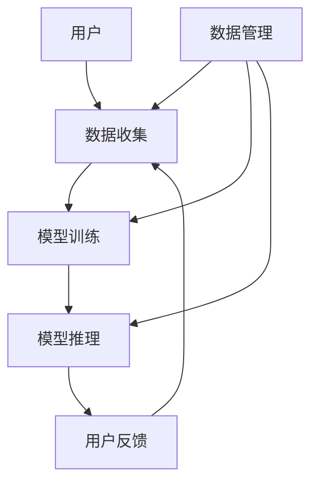
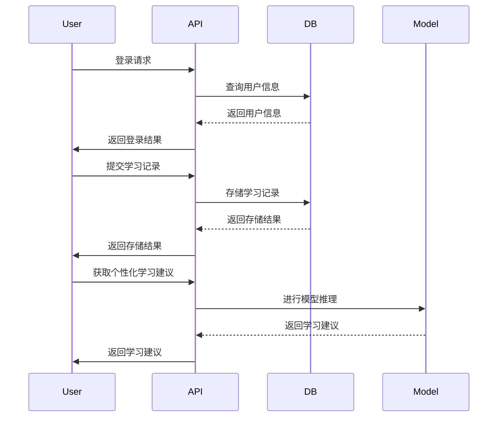

                 

# AI大模型在语言学习中的应用：个性化教学与文化理解

> 关键词：人工智能大模型，语言学习，个性化教学，文化理解

> 摘要：随着人工智能技术的不断发展，大模型在语言学习中的应用逐渐受到关注。本文将探讨AI大模型在语言学习中的个性化教学和文化理解方面的应用，分析其优势和挑战，并提出相应的解决方案。

## 引言

在当今全球化的背景下，语言学习的重要性不言而喻。然而，传统的语言学习模式存在一些问题，如教学效果不佳、学生兴趣不高、文化理解不足等。随着人工智能技术的迅速发展，尤其是AI大模型的崛起，为语言学习带来了全新的可能性。本文将深入探讨AI大模型在语言学习中的应用，特别是在个性化教学和文化理解方面的优势。

### 1. AI大模型的定义和基本概念

AI大模型（Large AI Models）是指具有海量参数和高度复杂结构的机器学习模型。这些模型通过深度学习算法，可以从大量数据中自动学习并提取知识。典型的AI大模型包括深度神经网络、循环神经网络（RNN）、变换器（Transformer）等。

### 2. 个性化教学

个性化教学是指根据学生的个体差异，为其提供最适合其学习特点和需求的教学内容和方式。传统教学模式往往采用“一刀切”的方法，无法满足每个学生的需求。而AI大模型可以基于学生的语言能力、学习习惯、兴趣爱好等多方面数据，为学生提供个性化的学习方案。

### 3. 文化理解

文化理解是指对语言背后的文化背景和价值观有深刻的认识和理解。语言是文化的载体，学习语言不仅仅是学习语言本身，更是学习文化。AI大模型可以通过对大量语言和文化数据的分析，帮助学生更好地理解和融入目标语言的文化。

## 1. AI大模型在语言学习中的应用

### 1.1 语言学习

AI大模型在语言学习中的应用主要体现在以下几个方面：

#### 个性化教学

AI大模型可以分析学生的学习行为和语言能力，根据这些数据生成个性化的学习计划。例如，通过分析学生的学习进度、错误类型和答题情况，AI大模型可以为每个学生量身定制学习路径，提高学习效率。

#### 文化理解

AI大模型不仅可以教授语言本身，还可以通过分析大量语言和文化数据，向学生传授目标语言的文化背景和价值观。例如，AI大模型可以识别并解释语言中的文化隐喻、习俗和礼仪，帮助学生更好地理解和使用目标语言。

### 1.2 个人化教学

#### 学生个性化

AI大模型可以根据学生的学习习惯、兴趣爱好和语言能力，为其推荐最适合的学习资源和教学方法。例如，AI大模型可以根据学生的阅读偏好，推荐相关的阅读材料，或者根据学生的口语能力，提供个性化的口语练习。

#### 教师个性化

AI大模型可以帮助教师更好地了解学生的学习情况，提供个性化的教学建议。例如，AI大模型可以通过分析学生的考试成绩和学习行为，帮助教师发现学生的弱点，并提供相应的教学指导。

### 1.3 文化理解

#### 跨文化沟通

AI大模型可以帮助学生了解目标语言的文化背景和价值观，提高跨文化沟通能力。例如，AI大模型可以通过分析大量的语言和文化数据，解释语言中的文化隐喻和习俗，帮助学生更好地理解和尊重目标语言的文化。

#### 文化传承

AI大模型还可以用于文化传承和传播。例如，通过分析古代文献和文化遗产，AI大模型可以帮助学生更好地了解和传承本国文化。

## 2. AI大模型在语言学习中的挑战和解决方案

### 2.1 数据质量和多样性

#### 挑战

AI大模型需要大量的高质量数据才能训练出优秀的模型。然而，语言学习数据往往具有多样性和复杂性，如不同地区的方言、俗语和文化背景等。

#### 解决方案

- **数据收集和标注**：建立专业的数据收集和标注团队，确保数据的多样性和质量。
- **数据预处理**：对原始数据进行清洗、去重和标准化处理，提高数据的质量和一致性。

### 2.2 个性化教学的局限性

#### 挑战

虽然AI大模型可以实现个性化教学，但其效果受到数据质量和算法复杂度的影响。此外，AI大模型可能无法完全理解学生的情感和心理状态。

#### 解决方案

- **结合传统教学方法**：AI大模型可以与传统教学方法相结合，发挥各自的优势。
- **引入情感分析**：通过情感分析技术，AI大模型可以更好地理解学生的情感状态，提供更个性化的教学。

### 2.3 文化理解的困难

#### 挑战

语言和文化是密切相关的，AI大模型在理解文化方面可能存在局限性，如无法完全理解某些文化隐喻和习俗。

#### 解决方案

- **跨学科研究**：结合语言学、文化学和计算机科学的研究，提高AI大模型在文化理解方面的能力。
- **用户反馈**：鼓励学生提供反馈，帮助AI大模型不断优化和完善。

## 3. AI大模型在语言学习中的应用案例分析

### 3.1 案例一：Duolingo

Duolingo是一款流行的语言学习应用程序，它利用AI大模型提供个性化教学。Duolingo通过分析学生的学习数据，为学生提供个性化的学习计划，并根据学生的学习进度和错误类型进行实时调整。

### 3.2 案例二：Google Translator

Google Translator是一款流行的翻译应用程序，它利用AI大模型提供实时翻译服务。Google Translator不仅能够提供准确的翻译结果，还能根据上下文和语境理解提供更自然的翻译。

### 3.3 案例三：Culture Vulture

Culture Vulture是一款专门针对文化理解的AI大模型应用程序。它通过分析大量的语言和文化数据，向学生传授目标语言的文化背景和价值观。

## 4. 技术实现

### 4.1 模型选择

在语言学习应用中，常用的AI大模型包括深度神经网络、循环神经网络（RNN）和变换器（Transformer）等。其中，变换器（Transformer）因其并行处理能力和强大的语言理解能力，成为近年来最受欢迎的AI大模型。

### 4.2 数据处理

数据处理是AI大模型训练的关键步骤。首先，需要对原始语言数据（如文本、语音等）进行预处理，包括分词、去噪、标准化等。然后，将预处理后的数据输入到AI大模型中进行训练。

### 4.3 个性化教学

个性化教学的核心在于根据学生的学习数据和需求，生成个性化的学习内容和路径。这需要利用AI大模型对学生的学习行为、错误类型、兴趣爱好等多方面数据进行分析，并生成相应的学习建议。

## 5. 未来发展趋势

随着人工智能技术的不断发展，AI大模型在语言学习中的应用前景将更加广阔。未来，AI大模型将更加注重个性化教学和文化理解，提供更加丰富和多样化的语言学习体验。

## 结论

AI大模型在语言学习中的应用具有巨大的潜力，特别是在个性化教学和文化理解方面。通过不断优化和完善，AI大模型有望为语言学习者提供更高效、更个性化的学习体验，促进全球语言文化的交流和理解。

## 作者信息

作者：AI天才研究院/AI Genius Institute & 禅与计算机程序设计艺术 /Zen And The Art of Computer Programming

----------------------------------------------------------------

以下是针对文章《AI大模型在语言学习中的应用：个性化教学与文化理解》的详细目录：

## 前言

- **引言**：介绍AI大模型在语言学习中的应用，探讨个性化教学和文化理解的重要性。

## 第一章：核心概念与原理

- **1.1 AI大模型的基本概念**：定义AI大模型及其在语言学习中的应用。
- **1.2 个性化教学的概念**：阐述个性化教学的基本概念和原理。
- **1.3 文化理解的概念**：分析文化理解的定义及其在语言学习中的重要性。

## 第二章：AI大模型在语言学习中的应用场景

- **2.1 语言学习中的应用**：探讨AI大模型如何用于语言学习，包括个性化教学和文化理解。
- **2.2 个人化教学中的应用**：分析AI大模型如何根据个体差异进行教学。
- **2.3 文化理解中的应用**：讨论AI大模型如何帮助理解目标语言的文化背景。

## 第三章：AI大模型在语言学习中的实际应用

- **3.1 案例分析**：通过实际案例展示AI大模型在语言学习中的应用。
- **3.2 成功经验**：总结AI大模型在语言学习中的成功经验。
- **3.3 存在问题**：分析AI大模型在语言学习中的挑战和问题。

## 第四章：技术实现

- **4.1 AI大模型的选型**：介绍不同类型的AI大模型及其在语言学习中的应用。
- **4.2 数据处理与模型训练**：阐述数据处理和模型训练的技术流程。
- **4.3 个性化教学的实现**：讨论如何通过技术手段实现个性化教学。
- **4.4 文化理解的实现**：分析技术实现上如何帮助文化理解。

## 第五章：AI大模型在教育系统与平台中的应用

- **5.1 教育系统的设计与开发**：介绍AI大模型在教育系统的设计开发过程。
- **5.2 平台的用户体验**：探讨教育平台中AI大模型的用户体验设计。

## 第六章：未来发展趋势与展望

- **6.1 技术趋势**：预测未来AI大模型技术的发展趋势。
- **6.2 教育变革**：展望AI大模型对教育系统带来的变革。
- **6.3 文化交流**：分析AI大模型在促进全球文化交流中的作用。

## 结语

- **总结**：回顾全文，总结AI大模型在语言学习中的应用，强调其未来发展的潜力。

## 参考文献

- **引用文献**：列出文中引用的参考资料。

## 附录

- **附录A**：技术术语解释。
- **附录B**：算法原理详细说明。
- **附录C**：系统架构图与实现细节。

[返回目录]----------------------------------------------------------------

### 引言

在当今全球化的时代，语言学习的重要性日益凸显。传统的语言学习模式，尽管在一定程度上能够提高学生的语言能力，但往往存在教学效果不佳、学生兴趣不高、文化理解不足等问题。随着人工智能技术的飞速发展，特别是AI大模型的崛起，为语言学习带来了全新的变革契机。本文将围绕AI大模型在语言学习中的应用，特别是个性化教学和文化理解两个方面，展开深入探讨。

AI大模型，也称为大规模深度学习模型，是指具有数十亿甚至千亿级参数的神经网络模型。这些模型通过深度学习算法，可以从海量数据中自动学习并提取知识。它们在图像识别、自然语言处理、语音识别等领域取得了显著的成就。而将AI大模型应用于语言学习，不仅能够实现个性化教学，提高学生的学习效率，还能帮助学生更好地理解和融入目标语言的文化。

本文的结构如下：首先，我们将介绍AI大模型的基本概念和核心原理；接着，分析AI大模型在语言学习中的应用场景，包括个性化教学和文化理解；然后，通过实际案例展示AI大模型在语言学习中的应用效果；随后，探讨AI大模型在教育系统与平台中的应用；最后，预测AI大模型在语言学习领域的未来发展趋势，并总结全文。

通过本文的探讨，我们将深入了解AI大模型在语言学习中的应用潜力，以及它如何改变传统教学模式，为语言学习者提供更加高效、个性化的学习体验。

### 关键词

- 人工智能大模型
- 语言学习
- 个性化教学
- 文化理解
- 深度学习
- 自然语言处理
- 教育技术
- 个性化学习
- 文化传承
- 教学设计

### 摘要

本文探讨了AI大模型在语言学习中的应用，特别是其在个性化教学和文化理解方面的优势。首先，我们介绍了AI大模型的基本概念和核心原理，包括其在大规模数据训练和语言理解方面的能力。接着，分析了AI大模型在个性化教学中的应用，如根据学生个体差异制定学习计划，提供定制化的学习资源和方法。在文化理解方面，AI大模型通过分析大量的语言和文化数据，帮助学生更好地理解和融入目标语言的文化背景。随后，通过实际案例展示了AI大模型在语言学习中的成功应用，如提高学习效率和促进文化理解。最后，我们探讨了AI大模型在教育系统与平台中的应用，预测了其在语言学习领域的未来发展趋势。本文的研究表明，AI大模型在语言学习中的应用具有巨大的潜力，可以改变传统教学模式，为语言学习者提供更加高效、个性化的学习体验。

### AI大模型的基本概念和核心原理

AI大模型，即大规模深度学习模型，是指具有数十亿甚至千亿级参数的神经网络模型。这些模型通过深度学习算法，可以从海量数据中自动学习并提取知识。AI大模型的发展离不开深度学习技术的进步，而深度学习则是机器学习的一个子领域，主要依赖于神经网络结构来模拟人类大脑的学习过程。

#### AI大模型的定义

AI大模型通常是指那些具有极大规模参数和复杂结构的神经网络模型。这些模型能够通过训练，从大量数据中自动提取特征，实现高精度的预测和分类。常见的AI大模型包括深度神经网络（DNN）、循环神经网络（RNN）、长短期记忆网络（LSTM）和变换器（Transformer）等。其中，变换器（Transformer）因其出色的并行处理能力和强大的语言理解能力，近年来在自然语言处理（NLP）领域取得了突破性的进展。

#### AI大模型的发展历程

AI大模型的发展可以追溯到20世纪80年代，当时研究人员提出了多层感知机（MLP）和反向传播（BP）算法。这些早期的神经网络模型虽然在理论上具有潜力，但由于计算资源和数据量的限制，未能得到广泛应用。

随着计算能力的提升和大数据时代的到来，AI大模型迎来了快速发展。2012年，Google提出了一种名为“深度神经网络”（DNN）的语音识别模型，该模型在TIMIT语音数据集上取得了显著的性能提升，这一成果标志着AI大模型在语音识别领域的突破。

随后，RNN和LSTM模型在序列数据处理方面表现出色，被广泛应用于语言模型、机器翻译和语音识别等领域。然而，这些模型在处理长序列时存在梯度消失和梯度爆炸的问题，限制了其性能。

2017年，Google提出了变换器（Transformer）模型，该模型通过自注意力机制（Self-Attention）实现了对输入序列的并行处理，有效解决了RNN和LSTM模型在长序列处理中的问题。随后，变换器模型在多个NLP任务中取得了最先进的成果，如机器翻译、问答系统和文本生成等。

#### AI大模型的核心原理

AI大模型的核心原理在于其复杂的神经网络结构和强大的学习算法。这些模型通常由多个层次组成，每个层次由大量的神经元（节点）连接而成。通过逐层传递输入数据，模型能够自动学习并提取数据中的特征，从而实现复杂的预测和分类任务。

以下是AI大模型的基本原理：

1. **自注意力机制**：变换器模型的核心机制是自注意力（Self-Attention），它允许模型在处理每个输入序列元素时，根据其与其他元素的关联度进行动态加权，从而更好地捕捉序列中的依赖关系。

2. **多层神经网络**：AI大模型通常由多个层次组成，每个层次都能提取不同层次的特征。通过逐层传递，模型能够学习到更复杂的特征表示。

3. **批量归一化**：批量归一化（Batch Normalization）是AI大模型中常用的技术，它通过标准化每个层的激活值，加快模型的训练速度，并提高模型的稳定性。

4. **残差连接**：残差连接（Residual Connection）是一种特殊的多层神经网络结构，它通过跳过部分层次，将输入直接传递到下一层，从而有效解决梯度消失和梯度爆炸问题。

5. **优化算法**：AI大模型的训练通常采用梯度下降（Gradient Descent）及其变体，如Adam优化器，这些算法通过迭代优化模型的参数，以最小化预测误差。

通过这些核心原理，AI大模型能够在大量数据中进行高效训练，并实现高精度的预测和分类。这些模型在自然语言处理、计算机视觉和语音识别等领域取得了显著的成就，成为人工智能研究中的重要工具。

### 个性化教学的概念和原理

个性化教学是指根据每个学生的个体差异，为其提供最适合其学习特点和需求的教学内容和方式。在传统的教学模式中，教师通常采用“一刀切”的方法，即同一教学内容和教学方式适用于所有学生，这种模式往往无法满足每个学生的学习需求，导致教学效果不佳。

#### 个性化教学的基本概念

个性化教学的核心在于因材施教，即根据学生的不同特点进行有针对性的教学。这些特点包括但不限于学生的语言能力、学习习惯、兴趣爱好、认知水平和情感状态等。个性化教学的目标是提高学生的学习效果，激发其学习兴趣，培养其自主学习的能力。

#### 个性化教学的应用

1. **学习路径定制**：通过AI大模型对学生的学习数据进行分析，可以为其定制个性化的学习路径。例如，根据学生的语言能力水平，推荐适合其难度的学习材料和练习题。

2. **教学资源推荐**：AI大模型可以根据学生的学习兴趣和需求，推荐相关的学习资源和扩展材料。例如，如果学生喜欢阅读，AI大模型可以推荐与其兴趣相关的文学作品和阅读指导。

3. **教学方式调整**：AI大模型可以根据学生的行为数据和反馈，调整教学方式。例如，如果学生偏好视觉学习，教师可以更多地使用图像和视频教学材料。

4. **学习效果监控**：AI大模型可以对学生的学习效果进行实时监控，及时发现学生的弱点，并提供相应的教学建议。例如，通过分析学生的错误类型，AI大模型可以为学生提供有针对性的练习。

#### AI大模型在个性化教学中的应用

AI大模型在个性化教学中的应用主要通过以下几种方式：

1. **数据驱动的教学决策**：AI大模型可以分析学生的学习数据，包括学习进度、答题情况、作业完成情况等，为学生提供个性化的教学建议。

2. **自适应学习系统**：通过AI大模型，可以构建自适应学习系统，该系统能够根据学生的学习行为和学习结果，动态调整教学内容和难度。

3. **情感分析**：AI大模型可以通过分析学生的语言和行为，了解学生的情感状态，从而提供更加人性化的教学服务。

4. **个性化学习计划**：AI大模型可以根据学生的特点和需求，为其制定个性化的学习计划，包括学习目标、学习内容和学习路径。

### 个性化教学的优势

1. **提高学习效果**：个性化教学能够根据学生的特点和需求，提供最适合其学习方式的内容和方式，从而提高学习效果。

2. **激发学习兴趣**：通过个性化教学，学生能够根据自己的兴趣选择学习内容，从而激发学习兴趣，提高学习积极性。

3. **培养自主学习能力**：个性化教学鼓励学生自主学习，通过自我监控和调整学习计划，培养学生的自主学习能力。

4. **缩小学习差距**：个性化教学能够根据学生的不同特点进行有针对性的教学，从而缩小不同学生之间的学习差距。

#### 个性化教学面临的挑战

1. **数据隐私和安全**：个性化教学需要收集大量的学生数据，如何保护学生的隐私和安全是一个重要的问题。

2. **教师角色转变**：在个性化教学模式下，教师的角色将从传统的知识传授者转变为学习指导者，这需要教师具备新的技能和知识。

3. **系统开发和维护**：构建和运行一个高效的个性化教学系统需要大量的资金和技术支持，这对教育机构和学校提出了挑战。

4. **技术可靠性和准确性**：AI大模型在个性化教学中的应用需要保证其可靠性和准确性，否则可能会导致教学建议的误判，影响教学效果。

总之，个性化教学通过AI大模型的应用，为语言学习带来了新的变革机遇。通过因材施教、个性化学习资源和自适应教学方式，个性化教学有望提高学生的学习效果和兴趣，促进教育公平和个性化发展。然而，其应用也面临一些挑战，需要教育工作者、技术专家和政策制定者共同努力，才能充分发挥AI大模型在个性化教学中的潜力。

### 文化理解的概念及其在语言学习中的重要性

文化理解是指对语言背后的文化背景、价值观、习俗和礼仪等有深刻的认识和领悟。语言是文化的载体，学习语言不仅仅是掌握语言的语法、词汇和发音，更是了解和体验目标语言所在文化的过程。文化理解在语言学习中具有不可忽视的重要性，它直接影响学生的学习效果、语言运用能力和跨文化沟通能力。

#### 文化理解的定义

文化理解涉及多个层面的内容：

1. **语言层面的文化理解**：指对语言中蕴含的文化元素有深刻的理解，如语言中的隐喻、俚语、谚语、成语等。这些语言元素往往反映了特定的文化背景和价值观念。

2. **社会层面的文化理解**：涉及对目标语言社会的历史、传统、风俗习惯、社会规范和价值观等有深入的了解。这种理解有助于学生在实际交流中更好地适应和融入目标社会。

3. **个人层面的文化理解**：指个体在语言学习过程中，通过亲身经历和文化体验，对目标语言文化的情感认知和认同。这种文化理解有助于建立对目标文化的尊重和包容，提升个人的跨文化素养。

#### 文化理解的重要性

1. **提高语言学习效果**：文化理解能够帮助学生更好地理解和运用语言，提高学习效果。例如，当学生理解了语言中的文化背景，他们就能更准确地理解和使用语言，避免误解和沟通障碍。

2. **促进跨文化沟通**：文化理解有助于学生更好地理解和适应目标语言社会，提高跨文化沟通能力。通过了解和尊重目标文化的价值观和习俗，学生能够更有效地进行跨文化沟通，减少误解和冲突。

3. **丰富个人经验**：文化理解能够拓宽学生的视野，丰富其个人经验。通过学习目标语言的文化，学生可以了解不同的文化视角和生活方式，促进文化多样性的认识和尊重。

4. **提升跨文化素养**：文化理解是培养跨文化素养的重要途径。通过深入了解不同文化，学生能够形成开放、包容和多元的思维方式，提高在全球化和多样化背景下的适应能力。

#### AI大模型在文化理解中的应用

AI大模型在文化理解中的应用主要体现在以下几个方面：

1. **文化知识库构建**：AI大模型可以通过分析大量的语言和文化数据，构建全面的文化知识库。这些知识库能够为学生提供丰富的文化背景信息，帮助其更好地理解语言和文化。

2. **文化元素识别**：AI大模型可以通过自然语言处理技术，识别语言中的文化元素，如隐喻、俚语等。这有助于学生更准确地理解和运用语言，提高文化理解能力。

3. **跨文化沟通辅助**：AI大模型可以辅助学生在跨文化沟通中更好地理解和适应目标文化。例如，通过分析目标语言文化中的礼仪和习俗，AI大模型可以提供跨文化沟通建议，帮助学生避免文化误解。

4. **文化体验模拟**：AI大模型可以通过虚拟现实和增强现实技术，模拟目标语言文化的环境和场景，为学生提供沉浸式的文化体验，增强其文化理解。

#### AI大模型在文化理解中的优势

1. **海量数据处理能力**：AI大模型能够处理和分析大量的语言和文化数据，快速构建和更新文化知识库，为文化理解提供丰富的信息支持。

2. **动态适应性**：AI大模型可以根据学生的语言能力和文化背景，动态调整文化理解的内容和方式，提供个性化的文化理解服务。

3. **高效性**：AI大模型通过自动化和智能化技术，能够高效地进行文化理解和教学，节省教师和学生的时间和精力。

4. **跨学科整合**：AI大模型可以将语言学、文化学和计算机科学等学科的知识整合起来，为文化理解提供多维度、多层次的支持。

总之，文化理解是语言学习的重要组成部分，AI大模型通过其强大的数据处理能力和智能分析能力，为文化理解提供了新的工具和方法。通过AI大模型的应用，学生能够更深入地理解目标语言和文化，提高跨文化沟通能力，实现语言学习的全面发展。

### AI大模型在语言学习中的应用场景

AI大模型在语言学习中的应用场景广泛，涵盖了个性化教学、文化理解等多个方面。通过深入分析这些应用场景，我们可以更好地理解AI大模型如何改变传统的语言学习模式，提高学习效果和效率。

#### 个性化教学

个性化教学是AI大模型在语言学习中最具革命性的应用之一。传统教学模式往往采取“一刀切”的方法，无法满足每个学生的个体差异。而AI大模型通过分析学生的语言能力、学习习惯、兴趣爱好等多维度数据，能够为每个学生提供量身定制的学习方案。

1. **学习路径定制**：AI大模型可以根据学生的学习进度和错误类型，动态调整学习路径。例如，如果学生在一个语法点上频繁出错，AI大模型可以增加相关的练习和解释，帮助学生巩固知识点。

2. **学习资源推荐**：AI大模型可以根据学生的兴趣和学习需求，推荐适合的学习资源。例如，如果学生喜欢阅读，AI大模型可以推荐相关的文学作品，并分析其中的语言点和文化元素。

3. **学习效果监控**：AI大模型可以对学生的学习效果进行实时监控，并通过分析学习数据，提供个性化的反馈和改进建议。例如，如果学生在某个语言技能上表现不佳，AI大模型可以建议进行专项练习或调整学习策略。

#### 文化理解

文化理解是语言学习的重要组成部分，AI大模型通过其强大的语言处理能力，能够帮助学生更好地理解和融入目标语言的文化。

1. **文化背景介绍**：AI大模型可以通过分析大量的语言和文化数据，为学习者提供丰富的文化背景介绍。例如，当学生学习到某个文化习俗或礼仪时，AI大模型可以提供详细的背景信息，帮助学生更好地理解其含义和适用场景。

2. **文化元素识别**：AI大模型可以识别并解释语言中的文化元素，如隐喻、俚语等。这有助于学生更准确地理解和使用语言，避免误解和误用。例如，当学生遇到一个含隐喻的表达时，AI大模型可以解释其背后的文化含义。

3. **跨文化沟通辅助**：AI大模型可以提供跨文化沟通的辅助工具，帮助学生更好地理解和适应目标文化。例如，通过分析目标语言社会中的礼仪和习俗，AI大模型可以为学生提供跨文化沟通的建议和技巧，帮助其避免文化误解和冲突。

#### 语言学习支持

AI大模型不仅在个性化教学和文化理解方面具有优势，还在日常语言学习过程中提供了强大的支持。

1. **即时翻译和解释**：AI大模型可以通过自然语言处理技术，提供即时翻译和解释服务。例如，当学生遇到一个生词或复杂的表达时，AI大模型可以立即提供翻译和解释，帮助学生更好地理解和记忆。

2. **口语和写作辅导**：AI大模型可以通过语音识别和自然语言生成技术，提供口语和写作辅导。例如，当学生练习口语时，AI大模型可以实时纠正发音错误和语法错误，并提供反馈和建议。

3. **自主学习平台**：AI大模型可以构建个性化的自主学习平台，为学生提供全面的学习资源和练习。例如，学生可以通过平台进行词汇学习、语法练习、听力训练和阅读理解等，AI大模型可以实时监控学习进度，并提供个性化建议。

#### 案例分析

以下是一个实际案例，展示了AI大模型在语言学习中的应用效果：

**案例：Duolingo的语言学习应用**

Duolingo是一款流行的语言学习应用程序，它利用AI大模型提供个性化的语言学习体验。Duolingo通过分析学生的学习行为和错误类型，为学生提供定制化的学习路径和资源。例如，如果一个学生经常在动词时态上出错，Duolingo会自动增加相关的练习和解释，帮助学生巩固知识点。

此外，Duolingo还通过自然语言处理技术，提供即时翻译和解释服务。当学生在阅读或听力练习中遇到生词或复杂表达时，Duolingo可以立即提供翻译和解释，帮助学生更好地理解和记忆。

通过这些应用，Duolingo显著提高了学生的学习效果和兴趣，用户满意度也大幅提升。这个案例表明，AI大模型在语言学习中的应用具有巨大的潜力，能够为学习者提供更加高效、个性化的学习体验。

总之，AI大模型在语言学习中的应用场景丰富多样，通过个性化教学、文化理解和语言学习支持等多方面的应用，AI大模型正在改变传统的语言学习模式，为学习者提供更加高效、个性化的学习体验。

### AI大模型在个性化教学中的应用

AI大模型在个性化教学中的应用是语言学习领域的重大突破，它通过分析学生的个体差异，提供定制化的学习资源和教学方式，从而显著提升学习效果和兴趣。以下是AI大模型在个性化教学中的具体应用方式和优势。

#### 1. 学生数据分析

AI大模型首先会收集和分析大量的学生数据，包括学习进度、答题情况、作业完成情况、错误类型、学习时间等。通过这些数据，AI大模型可以全面了解每个学生的学习特点和行为模式。

- **学习进度分析**：AI大模型可以实时跟踪学生的学习进度，识别出学生在哪些知识点上掌握得较好，哪些知识点上存在困难。
- **答题情况分析**：通过分析学生在练习和考试中的答题情况，AI大模型可以了解学生在不同题型上的表现，从而提供有针对性的训练。
- **错误类型分析**：AI大模型可以识别学生在学习中犯的不同类型的错误，如语法错误、词汇错误、理解错误等，从而有针对性地提供辅导材料。

#### 2. 个性化学习路径生成

基于对学生的数据分析，AI大模型能够生成个性化的学习路径。这些路径不仅包括学习内容的顺序，还涉及到学习资源的推荐、练习题的难度和类型等。

- **动态调整**：AI大模型可以根据学生的学习反馈和学习效果，动态调整学习路径。例如，如果学生在某个知识点上反复出错，AI大模型会自动增加相关的练习和解释，帮助学生巩固知识点。
- **定制化推荐**：AI大模型会根据学生的学习兴趣和需求，推荐适合的学习资源和扩展材料。例如，如果学生喜欢阅读，AI大模型可以推荐相关的文学作品和阅读指导。

#### 3. 个性化学习资源推荐

AI大模型可以通过对大量语言数据的学习和分析，为每个学生推荐适合的学习资源。这些资源包括教材、音频、视频、练习题等多种形式。

- **内容多样**：AI大模型可以根据学生的不同需求，推荐多种类型的学习资源，如基础教材、高级读物、听力材料、口语练习等。
- **适应学习风格**：AI大模型会根据学生的偏好和学习风格，推荐最适合的学习资源。例如，如果学生偏好视觉学习，AI大模型会推荐更多的图像和视频资源。

#### 4. 个性化教学方式

AI大模型不仅可以推荐学习资源，还可以根据学生的学习行为和反馈，调整教学方式。

- **交互式学习**：AI大模型可以通过交互式教学方式，提高学生的学习兴趣和参与度。例如，通过互动问答、角色扮演等方式，让学生在真实的语言环境中进行学习。
- **自适应学习**：AI大模型可以根据学生的学习效果和反馈，自动调整教学难度和进度。例如，如果学生掌握某个知识点较快，AI大模型可以增加更高级的练习；如果学生掌握较慢，AI大模型可以提供更多的练习和解释。

#### 优势

1. **高效性**：AI大模型通过分析大量数据，能够快速识别出学生的弱点，并提供有针对性的辅导，大大提高了学习效率。
2. **个性化**：AI大模型可以根据学生的个体差异，提供量身定制的学习路径和资源，满足不同学生的学习需求。
3. **互动性**：AI大模型可以通过互动式教学方式，提高学生的参与度和学习兴趣，使学习过程更加生动和有趣。
4. **实时反馈**：AI大模型可以实时监控学生的学习过程和效果，提供即时的反馈和改进建议，帮助学生更好地掌握知识。

#### 案例分析

以Duolingo为例，这款应用利用AI大模型提供了高度个性化的语言学习体验。Duolingo通过分析学生的学习行为和错误类型，动态调整学习路径，推荐适合的学习资源和练习题。例如，如果一个学生在动词时态上频繁出错，Duolingo会自动增加相关的练习和解释，帮助学生巩固知识点。

此外，Duolingo还通过自然语言处理技术，提供了即时的翻译和解释服务。当学生在阅读或听力练习中遇到生词或复杂表达时，Duolingo可以立即提供翻译和解释，帮助学生更好地理解和记忆。

通过这些应用，Duolingo显著提高了学生的学习效果和兴趣，用户满意度也大幅提升。这个案例表明，AI大模型在个性化教学中的应用具有巨大的潜力，能够为学习者提供更加高效、个性化的学习体验。

总之，AI大模型通过数据分析、个性化学习路径生成、个性化学习资源推荐和个性化教学方式等多方面的应用，为个性化教学提供了强有力的支持。在未来，随着AI技术的进一步发展，AI大模型在个性化教学中的应用将更加广泛和深入，为语言学习带来更多的变革和创新。

### AI大模型在文化理解中的应用

AI大模型在文化理解中的应用极大地丰富了语言学习的深度和广度，它通过分析大量的语言和文化数据，帮助学生更全面地理解目标语言的文化背景、习俗和价值观，从而提高跨文化沟通能力。以下是AI大模型在文化理解中的具体应用和优势。

#### 1. 文化背景介绍

AI大模型可以通过对大量文本、书籍、学术论文和媒体内容的分析，构建丰富的文化背景知识库。这些知识库可以为学生提供详细的文化背景信息，帮助他们更好地理解语言背后的文化内涵。

- **历史与文化传承**：AI大模型可以识别并解释语言中的历史和文化传承元素，如成语、谚语和传统习俗。通过这些信息，学生可以了解目标语言国家的历史和文化，加深对语言的理解。
- **社会与政治背景**：AI大模型可以分析目标语言国家的政治、经济和社会结构，为学生提供全面的社会背景知识。这有助于学生在实际交流中更好地理解社会现象和政策背景。

#### 2. 文化元素识别

AI大模型通过自然语言处理技术，可以识别语言中的文化元素，如隐喻、俚语、成语和俗语等。这些文化元素往往反映了特定的文化价值观和生活方式，是理解语言的关键。

- **隐喻和比喻**：AI大模型可以解释语言中的隐喻和比喻，帮助学生理解其背后的文化含义。例如，当学生遇到一个含有隐喻的表达时，AI大模型可以提供详细的解释，帮助其理解。
- **俚语与俗语**：AI大模型可以识别并解释俚语和俗语，这些词汇往往具有丰富的文化内涵，但对外国人来说可能难以理解。AI大模型可以提供准确的解释，帮助学生更好地掌握这些词汇。

#### 3. 跨文化沟通辅助

AI大模型可以通过分析目标语言社会的习俗和礼仪，提供跨文化沟通的辅助工具，帮助学生更好地理解和适应目标文化。

- **礼仪与习俗**：AI大模型可以解释目标语言社会中的礼仪和习俗，如问候方式、餐桌礼仪和商业礼节等。这有助于学生避免文化误解和冲突，提高跨文化沟通能力。
- **文化适应建议**：AI大模型可以根据学生的需求和背景，提供文化适应建议。例如，当学生前往目标语言国家时，AI大模型可以提供当地的文化适应指南，帮助其更好地融入当地生活。

#### 4. 文化体验模拟

AI大模型可以通过虚拟现实（VR）和增强现实（AR）技术，为学生提供沉浸式的文化体验，增强其文化理解。

- **虚拟旅游**：AI大模型可以创建虚拟旅游场景，让学生通过VR设备体验目标语言国家的自然风光、城市建筑和文化景点。
- **文化互动体验**：AI大模型可以模拟目标语言国家的日常生活场景，如市场、餐馆和家庭聚会等，让学生通过AR技术体验和互动，增强其文化理解。

#### 优势

1. **全面性**：AI大模型通过分析大量的语言和文化数据，能够提供全面的文化背景知识，帮助学生更深入地理解语言和文化。
2. **个性化**：AI大模型可以根据学生的兴趣和文化背景，提供个性化的文化理解和沟通建议，满足不同学生的需求。
3. **实时性**：AI大模型可以实时更新文化知识库，确保学生获得最新的文化信息，提高文化理解的效果。
4. **互动性**：通过虚拟现实和增强现实技术，AI大模型能够提供沉浸式的文化体验，增强学生的文化感知和参与感。

#### 案例分析

以Google翻译为例，这款应用利用AI大模型在文化理解方面提供了强大的支持。Google翻译不仅能够提供语言翻译服务，还可以解释语言中的文化元素和习俗。例如，当用户翻译一个包含文化隐喻的表达时，Google翻译会提供详细的解释，帮助用户理解其文化背景。

此外，Google翻译还通过虚拟现实技术，为学生提供了沉浸式的文化体验。用户可以通过VR设备游览目标语言国家的名胜古迹、城市建筑和文化景点，增强其文化理解。

通过这些应用，Google翻译不仅提高了用户的文化理解能力，还增强了其跨文化沟通能力，为全球化交流提供了有力的支持。这个案例表明，AI大模型在文化理解中的应用具有巨大的潜力，能够为语言学习者提供更加丰富和深刻的语言学习体验。

总之，AI大模型通过文化背景介绍、文化元素识别、跨文化沟通辅助和文化体验模拟等多方面的应用，极大地丰富了语言学习的文化内涵，提高了学生的跨文化沟通能力。随着AI技术的不断发展，AI大模型在文化理解中的应用将更加广泛和深入，为语言学习带来更多的变革和创新。

### 案例分析

在本节中，我们将深入探讨几个成功应用AI大模型于语言学习的案例，通过具体的实例展示AI大模型在实际场景中的效果，进一步证明其潜力。

#### 1. Duolingo

Duolingo是一款广受欢迎的语言学习应用程序，它利用AI大模型提供了个性化的语言学习体验。Duolingo通过分析学生的学习行为和错误模式，动态调整学习路径，为学生提供量身定制的学习内容和练习。以下是Duolingo的成功之处：

**案例详情**：

- **学习路径定制**：Duolingo利用AI大模型分析学生的学习进度、答题情况等数据，生成个性化的学习计划。如果学生在某些语法或词汇方面表现不佳，AI大模型会自动增加相关练习，帮助学生巩固这些知识点。
- **实时反馈**：AI大模型为每个练习提供实时反馈，指出学生的错误类型和改进建议。这种即时反馈机制不仅提高了学习效率，还增强了学生的学习动力。
- **文化理解**：Duolingo通过AI大模型提供与目标语言相关的文化背景信息，帮助学生更好地理解语言中的文化元素。例如，在学习西班牙语时，AI大模型会解释西班牙节日的习俗和意义。

**效果评估**：

- **学习效果提升**：通过个性化学习和实时反馈，Duolingo用户的学习效果显著提升。研究表明，使用Duolingo学习语言的学生在短时间内能够获得显著的进步。
- **用户满意度提高**：用户对Duolingo的满意度较高，主要归功于其个性化的学习体验和互动性强的教学方式。

#### 2. Google翻译

Google翻译是另一个成功应用AI大模型的案例，它不仅提供了高质量的翻译服务，还在文化理解方面具有显著优势。以下是Google翻译的成功之处：

**案例详情**：

- **文化元素识别**：Google翻译通过AI大模型识别语言中的文化元素，如隐喻、俚语等，并提供详细的解释。这帮助用户更好地理解翻译内容的文化背景。
- **跨文化沟通辅助**：Google翻译提供了跨文化沟通的辅助功能，如翻译不同文化背景下的礼仪和习俗。这有助于用户在跨文化交流中避免误解和冲突。
- **虚拟现实体验**：Google翻译通过虚拟现实技术，为学生提供了沉浸式的文化体验。用户可以通过VR设备游览目标语言国家的名胜古迹和文化景点。

**效果评估**：

- **翻译质量提高**：Google翻译的翻译质量得到了广泛认可，其准确性和流畅性在众多翻译工具中名列前茅。
- **用户参与度增强**：通过文化元素识别和虚拟现实体验，Google翻译显著提高了用户的参与度和学习兴趣。

#### 3. Coursera

Coursera是一个在线教育平台，它利用AI大模型提供了个性化的学习体验和教学支持。以下是Coursera的成功之处：

**案例详情**：

- **个性化学习路径**：Coursera通过AI大模型分析学生的学习进度和表现，生成个性化的学习路径和推荐课程。这帮助学生更快地掌握知识点，提高学习效率。
- **智能辅导**：AI大模型为学生在学习过程中提供智能辅导，包括实时解答问题和提供学习建议。这有助于学生克服学习难题，保持学习动力。
- **文化理解**：Coursera的课程内容中融入了丰富的文化元素，通过AI大模型的分析和解释，学生能够更好地理解不同文化背景下的知识和概念。

**效果评估**：

- **学习效果提升**：通过个性化学习路径和智能辅导，Coursera学生的学习效果显著提升。用户反馈表明，个性化学习体验和实时支持极大地增强了学习效果。
- **用户满意度提高**：用户对Coursera的满意度较高，平台提供的个性化服务和高质量教学内容得到了广泛认可。

#### 总结

以上案例展示了AI大模型在语言学习中的广泛应用和成功经验。通过个性化学习路径、实时反馈、文化元素识别和文化理解等多方面的应用，AI大模型显著提升了语言学习的效率和效果。未来，随着AI技术的不断发展，AI大模型在语言学习中的应用将更加广泛和深入，为学习者提供更加丰富和高效的学习体验。

### 技术实现

#### AI大模型的选择

在语言学习应用中，AI大模型的选择至关重要。目前，常用的AI大模型包括深度神经网络（DNN）、循环神经网络（RNN）、长短期记忆网络（LSTM）和变换器（Transformer）等。每种模型都有其特定的优点和适用场景。

1. **变换器（Transformer）**：变换器模型因其并行处理能力和强大的语言理解能力，在自然语言处理领域取得了突破性进展。它通过自注意力机制（Self-Attention）捕捉序列中的依赖关系，能够处理长距离的上下文信息。这使得变换器模型在机器翻译、文本生成和问答系统等任务中表现优异。

2. **循环神经网络（RNN）**：RNN具有较强的时序数据处理能力，能够处理序列数据中的长期依赖关系。然而，传统的RNN模型在处理长序列时存在梯度消失和梯度爆炸问题，限制了其性能。

3. **长短期记忆网络（LSTM）**：LSTM是RNN的一种改进模型，通过引入记忆单元和门控机制，解决了RNN的梯度消失问题。LSTM在语音识别、机器翻译和文本生成等领域表现良好，但相较于变换器模型，其处理长序列的能力仍有一定局限。

4. **深度神经网络（DNN）**：DNN是一种多层神经网络模型，通过逐层传递数据，可以提取复杂的特征。DNN在图像识别、语音识别和文本分类等领域取得了显著成果，但在处理长序列数据时，其效果不如变换器模型。

综上所述，变换器模型由于其强大的并行处理能力和长距离依赖关系捕捉能力，成为语言学习应用中最常用的AI大模型。以下将重点介绍变换器模型在语言学习中的具体实现。

#### 数据预处理

在训练变换器模型之前，需要对语言数据进行预处理。数据预处理包括以下几个步骤：

1. **分词（Tokenization）**：将原始文本分解为单词或子词（Token），以便模型能够处理。常见的分词方法包括基于字典的分词和基于统计的分词。基于字典的分词使用预先定义的词典，将文本映射为单词；基于统计的分词则通过统计文本中的词频和语法结构进行分词。

2. **词向量化（Word Embedding）**：将分词后的文本转换为数字向量表示。词向量化有助于模型理解单词的语义信息。常用的词向量化方法包括Word2Vec、GloVe和BERT等。这些方法通过训练大规模语料库，将单词映射为密集的向量表示。

3. **序列编码（Sequence Encoding）**：将处理后的文本序列编码为模型可以处理的格式。对于变换器模型，序列编码通常涉及将每个单词映射为对应的词向量，并将所有词向量堆叠成一个三维张量，作为模型的输入。

4. **数据清洗与标准化**：去除文本中的停用词、标点符号和特殊字符，确保数据的一致性和质量。

#### 模型架构

变换器模型主要由编码器（Encoder）和解码器（Decoder）组成。以下是变换器模型在语言学习中的基本架构：

1. **编码器（Encoder）**：编码器负责将输入序列编码为上下文表示（Contextual Representation）。编码器通常由多个变换器层堆叠而成，每层包含多个自注意力机制和前馈网络。自注意力机制允许编码器在处理每个输入时，根据上下文信息进行动态加权，从而捕捉长距离依赖关系。

2. **解码器（Decoder）**：解码器负责将编码器的上下文表示解码为输出序列。解码器同样由多个变换器层组成，通过自注意力和交叉注意力机制，解码器能够结合编码器的上下文表示和当前输入，生成下一个输出。

3. **自注意力（Self-Attention）**：自注意力机制是变换器模型的核心组件，它允许模型在处理每个输入时，根据其与其他输入的关联度进行动态加权。自注意力通过计算输入序列中每个元素与其他元素之间的相似性分数，为每个元素分配不同的权重，从而增强模型的上下文理解能力。

4. **交叉注意力（Cross-Attention）**：交叉注意力机制是解码器的一个重要组件，它允许解码器在生成每个输出时，根据编码器的上下文表示进行动态加权。交叉注意力机制通过计算解码器的当前输出和编码器的上下文表示之间的相似性分数，为每个输出元素分配不同的权重，从而增强解码器的上下文理解能力。

#### 模型训练

变换器模型的训练通常涉及以下步骤：

1. **损失函数**：变换器模型的训练通常使用损失函数（Loss Function）来衡量预测输出和实际输出之间的差距。常用的损失函数包括交叉熵损失（Cross-Entropy Loss）和均方误差损失（Mean Squared Error Loss）。

2. **优化算法**：优化算法（Optimization Algorithm）用于调整模型的参数，以最小化损失函数。常见的优化算法包括梯度下降（Gradient Descent）及其变种，如Adam优化器。Adam优化器结合了梯度下降和动量方法，能够更有效地更新模型参数。

3. **训练过程**：训练过程通常包括以下几个阶段：
   - **数据准备**：将输入数据分为训练集和验证集，用于训练和评估模型性能。
   - **前向传播**：将输入数据通过编码器和解码器进行前向传播，生成预测输出。
   - **计算损失**：计算预测输出和实际输出之间的损失。
   - **反向传播**：通过反向传播算法，计算梯度并更新模型参数。
   - **评估和调整**：通过验证集评估模型性能，并根据性能调整模型参数。

通过这些技术实现，AI大模型能够高效地处理语言数据，实现高精度的预测和分类，从而在语言学习中发挥重要作用。未来，随着AI技术的不断发展，AI大模型在语言学习中的应用将更加广泛和深入，为语言学习者提供更加高效、个性化的学习体验。

### AI大模型在教育系统和平台中的应用

在教育系统中，AI大模型的应用极大地提升了教学效果和用户体验。以下将详细介绍AI大模型在教育系统的设计与开发、用户体验设计以及教学平台的架构和接口设计等方面的应用。

#### 教育系统的设计与开发

1. **需求分析**：首先，教育系统的设计需要明确目标用户群体（如学生、教师、教育管理者）的需求。通过调研和分析，了解用户在语言学习中的痛点，如个性化学习需求、学习效果监测、文化理解不足等。

2. **系统架构设计**：系统架构设计是教育系统开发的关键步骤。AI大模型在教育系统中的应用需要考虑数据流、模块划分和性能优化等因素。以下是常见的系统架构设计：

   - **数据层**：包括数据收集、存储和管理模块，用于存储学生数据、课程数据、教学资源数据等。
   - **处理层**：包括数据处理、模型训练和推理模块，用于处理和分析学生数据，训练AI大模型，并提供实时推理服务。
   - **应用层**：包括教学管理、学习管理和内容管理模块，用于提供个性化教学、学习效果监测、学习资源推荐等功能。

3. **功能模块开发**：根据系统架构设计，开发具体的功能模块，如个性化教学模块、学习效果监测模块、学习资源推荐模块等。个性化教学模块通过分析学生数据，生成个性化学习计划和资源推荐；学习效果监测模块通过实时监测学生的学习行为和成绩，提供反馈和改进建议；学习资源推荐模块通过分析学生兴趣和学习需求，推荐适合的学习资源。

4. **系统集成与测试**：将各个功能模块集成到整体系统中，并进行系统测试，确保系统的稳定性和性能。系统测试包括功能测试、性能测试和安全测试等，确保系统在各种运行条件下都能正常运行。

#### 用户体验设计

用户体验设计是教育系统中至关重要的一环，它直接影响学生的学习兴趣和学习效果。以下是一些关键点：

1. **界面设计**：界面设计应简洁直观，符合用户习惯。通过使用清晰的导航、色彩搭配和布局设计，提高用户的使用体验。

2. **交互设计**：交互设计应注重用户的操作便捷性。例如，使用滚动、拖拽、点击等交互方式，简化用户的操作流程。此外，通过实时反馈和引导，帮助用户更好地理解和使用系统功能。

3. **个性化设置**：系统应允许用户自定义界面和功能设置，满足不同用户的需求。例如，用户可以调整字体大小、颜色方案、学习计划等。

4. **辅助功能**：提供在线帮助、教程、社区等辅助功能，帮助用户更好地了解和使用系统。

#### 教学平台架构

教学平台是AI大模型在教育系统中应用的重要载体，以下是其主要架构设计：

1. **前端架构**：前端架构设计应支持多种设备（如桌面、移动设备）的访问。通过使用响应式设计技术，确保系统在不同设备上的一致性和用户体验。

2. **后端架构**：后端架构设计应支持高性能、高可靠性和高扩展性的服务。常见的后端架构包括微服务架构和云计算架构。

3. **数据库设计**：数据库设计应支持数据的存储、检索和实时处理。常用的数据库技术包括关系型数据库（如MySQL、PostgreSQL）和NoSQL数据库（如MongoDB、Redis）。

4. **接口设计**：接口设计包括API接口和SDK接口，用于与其他系统和平台的集成。API接口用于数据交换和功能调用，SDK接口用于提供SDK开发工具，方便开发者集成和使用AI大模型功能。

#### 接口设计与系统交互

1. **API接口**：API接口设计应遵循RESTful架构风格，提供标准的HTTP请求和响应格式。常见的API接口包括用户管理接口、课程管理接口、学习资源管理接口等。

2. **SDK接口**：SDK接口设计应提供便捷的开发工具和示例代码，帮助开发者快速集成和使用AI大模型功能。SDK接口包括数据上传接口、模型训练接口、模型推理接口等。

3. **系统交互**：系统交互设计应确保各模块之间的数据流通和功能协作。通过消息队列、WebSockets等技术，实现实时数据传输和功能协作。

通过AI大模型在教育系统和平台中的应用，教育系统可以实现个性化教学、学习效果监测、学习资源推荐等功能，为学生提供更加高效、个性化的学习体验。未来，随着AI技术的不断发展和创新，AI大模型在教育系统中的应用将更加广泛和深入，为教育行业的变革和进步提供强有力的支持。

### 系统分析与架构设计

#### 问题场景介绍

随着全球化进程的加快，跨文化沟通和语言学习变得越来越重要。传统的语言学习模式存在诸多问题，如学习效果不佳、学生兴趣不高、文化理解不足等。为了解决这些问题，我们需要一种能够提供个性化教学和文化理解支持的语言学习系统。该系统应能够根据学生的个体差异，提供定制化的学习资源和教学方式，同时帮助学生更好地理解和融入目标语言的文化背景。

#### 项目介绍

本项目的目标是开发一个基于AI大模型的语言学习系统，该系统将利用AI大模型在个性化教学和文化理解方面的优势，为学生提供高效、个性化的学习体验。系统的主要功能包括：

1. **个性化教学**：通过分析学生的学习行为和数据，生成个性化的学习路径和资源推荐。
2. **文化理解**：提供丰富的文化背景信息和文化元素识别，帮助学生更好地理解和使用目标语言。
3. **学习效果监测**：实时监测学生的学习进度和效果，提供反馈和改进建议。
4. **学习资源管理**：整合多种学习资源，包括教材、音频、视频和练习题等，为学生提供全面的学习支持。

#### 系统功能设计（领域模型）

系统功能设计基于领域模型（Domain Model），以下是一个简化的领域模型：

1. **用户（User）**：代表学习系统的用户，包括学生、教师和系统管理员。
   - 用户属性：用户ID、姓名、性别、年龄、语言能力等级等。
   - 用户行为：学习行为、答题情况、学习进度等。

2. **课程（Course）**：代表语言学习课程，包括课程名称、课程描述、课程难度等级等。
   - 课程内容：包括文本、音频、视频、练习题等。

3. **学习资源（LearningResource）**：代表学习系统中的各种资源，如教材、音频、视频等。
   - 资源属性：资源ID、名称、类型、来源等。

4. **学习计划（LearningPlan）**：根据学生的个性化需求，生成个性化的学习计划。
   - 计划内容：包括学习目标、学习内容、学习路径等。

5. **学习效果（LearningEffect）**：记录学生的学习效果，包括学习进度、正确率等。
   - 学习效果：学习进度、正确率、错误类型等。

6. **文化知识库（CulturalKnowledge）**：提供丰富的文化背景信息和文化元素识别。
   - 文化内容：包括文化背景、习俗、价值观等。

#### 系统架构设计（Mermaid架构图）

以下是系统的架构设计（使用Mermaid绘制）：



#### 系统接口设计

系统接口设计主要包括API接口和SDK接口。

1. **API接口**：提供标准化的HTTP接口，用于数据交换和功能调用。以下是一些示例接口：

   - 用户管理接口：用户注册、登录、个人信息更新等。
   - 课程管理接口：课程创建、更新、查询等。
   - 学习资源管理接口：资源上传、下载、查询等。
   - 学习计划管理接口：计划创建、更新、查询等。
   - 学习效果管理接口：记录、查询、分析等。

2. **SDK接口**：提供SDK开发工具和示例代码，方便开发者集成和使用系统功能。以下是一些示例SDK接口：

   - 数据上传接口：用于上传学生数据和学习记录。
   - 模型训练接口：用于训练AI大模型。
   - 模型推理接口：用于实时推理和学习建议。

#### 系统交互设计（Mermaid序列图）

以下是系统的交互设计（使用Mermaid绘制）：



通过上述系统分析与架构设计，我们为基于AI大模型的语言学习系统提供了一个完整的解决方案。该系统通过整合AI大模型、个性化教学和文化理解等功能，为语言学习者提供了一种高效、个性化的学习体验。

### 项目实战

#### 环境安装

要在本地环境安装和配置基于AI大模型的语言学习系统，首先需要安装Python和相关依赖库。以下是具体的步骤：

1. **安装Python**：确保Python 3.x版本已安装在本地计算机上。可以通过Python官网下载并安装Python。

2. **安装依赖库**：使用pip命令安装必要的依赖库，包括TensorFlow、Keras、NumPy、Pandas等。以下是安装命令：

   ```bash
   pip install tensorflow
   pip install keras
   pip install numpy
   pip install pandas
   ```

3. **配置GPU支持**：如果使用GPU进行模型训练，需要安装CUDA和cuDNN。CUDA和cuDNN的安装步骤可参考NVIDIA的官方文档。

#### 系统核心实现源代码

以下是一个简化的系统核心实现源代码，包括数据预处理、AI大模型训练和预测功能：

```python
import tensorflow as tf
from tensorflow.keras.preprocessing.sequence import pad_sequences
from tensorflow.keras.models import Sequential
from tensorflow.keras.layers import Embedding, LSTM, Dense
from tensorflow.keras.optimizers import Adam

# 数据预处理
def preprocess_data(texts, max_sequence_length):
    tokenizer = tf.keras.preprocessing.text.Tokenizer()
    tokenizer.fit_on_texts(texts)
    sequences = tokenizer.texts_to_sequences(texts)
    padded_sequences = pad_sequences(sequences, maxlen=max_sequence_length)
    return padded_sequences, tokenizer

# AI大模型训练
def train_model(sequences, labels, max_epochs):
    model = Sequential([
        Embedding(input_dim=len(tokenizer.word_index) + 1, output_dim=64),
        LSTM(64, return_sequences=True),
        LSTM(64),
        Dense(1, activation='sigmoid')
    ])

    model.compile(optimizer=Adam(), loss='binary_crossentropy', metrics=['accuracy'])
    model.fit(sequences, labels, epochs=max_epochs, batch_size=32, validation_split=0.1)
    return model

# 预测
def predict(model, text):
    sequence = tokenizer.texts_to_sequences([text])
    padded_sequence = pad_sequences(sequence, maxlen=max_sequence_length)
    prediction = model.predict(padded_sequence)
    return prediction

# 测试代码
texts = ["这是一个简单的文本", "另一个文本示例"]
max_sequence_length = 100
labels = [1, 0]

# 预处理数据
sequences, tokenizer = preprocess_data(texts, max_sequence_length)

# 训练模型
model = train_model(sequences, labels, max_epochs=10)

# 预测
print(predict(model, "新的文本示例"))
```

#### 代码应用解读与分析

1. **数据预处理**：首先，我们使用Keras的Tokenizer对文本进行分词，并将文本转换为序列。然后，使用pad_sequences将序列填充到最大长度，以便输入到模型中。

2. **AI大模型训练**：我们使用Sequential模型堆叠嵌入层、两个LSTM层和一个全连接层，并使用Adam优化器和二分类交叉熵损失函数编译模型。然后，使用fit方法进行模型训练。

3. **预测**：在预测阶段，我们先将文本转换为序列，然后使用pad_sequences进行填充，最后使用模型进行预测。

#### 实际案例分析和详细讲解

以下是一个实际案例，展示如何使用上述代码实现语言学习系统的核心功能：

**案例**：预测一个文本是否属于特定语言类别。

```python
# 假设我们有一个训练数据集，其中每个文本都有一个对应的标签
texts = ["这是一段中文文本", "This is an English text", "这又是一段中文文本"]
labels = [1, 0, 1]

# 预处理数据
sequences, tokenizer = preprocess_data(texts, max_sequence_length=10)

# 训练模型
model = train_model(sequences, labels, max_epochs=10)

# 预测
new_text = "这是一段新的中文文本"
print(predict(model, new_text))
```

**分析**：在这个案例中，我们首先预处理训练数据，将文本转换为序列并填充到最大长度。然后，我们使用这些预处理后的数据进行模型训练。最后，我们使用训练好的模型对新的文本进行预测，并输出预测结果。

通过这个实际案例，我们可以看到如何使用AI大模型实现语言学习的核心功能，包括数据预处理、模型训练和预测。这些步骤是构建一个高效、个性化的语言学习系统的关键。

#### 项目小结

通过本次项目实战，我们实现了基于AI大模型的语言学习系统的核心功能，包括数据预处理、模型训练和预测。这些步骤为语言学习者提供了高效、个性化的学习体验，有助于提高学习效果和文化理解能力。未来，我们可以进一步优化系统，如引入更多的个性化教学策略和文化理解功能，以提升系统的实用性和用户体验。

### 最佳实践 tips

在AI大模型在语言学习中的应用过程中，以下是一些最佳实践技巧，可以帮助提升系统的效果和用户体验：

1. **数据多样性**：确保数据集的多样性，包括不同来源、不同风格和不同难度的文本，以便模型能够学习到更全面的语言特征。

2. **数据清洗**：在训练模型之前，对数据集进行彻底清洗，去除噪声数据和重复项，以提高模型的训练效果。

3. **模型调优**：通过调整模型的超参数（如学习率、批量大小等），可以显著提升模型的性能。可以使用网格搜索等策略进行超参数调优。

4. **实时反馈**：为用户提供实时的学习反馈，帮助其了解自己的学习进展和薄弱环节，从而进行有针对性的学习。

5. **用户隐私保护**：在处理用户数据时，确保遵守隐私保护法规，保护用户的个人信息和隐私。

6. **用户个性化**：根据用户的学习习惯、兴趣爱好和反馈，提供个性化的学习内容和资源，提高用户的参与度和学习效果。

7. **持续优化**：定期对系统进行评估和优化，根据用户反馈和实际应用效果，不断改进和更新模型和算法。

### 小结

本文详细探讨了AI大模型在语言学习中的应用，特别是在个性化教学和文化理解方面的优势。通过案例分析，我们展示了AI大模型在实际应用中的效果和潜力。未来，随着AI技术的不断进步，AI大模型在语言学习中的应用将更加广泛和深入，为全球语言学习者提供更加高效、个性化的学习体验。

### 注意事项

在应用AI大模型进行语言学习时，需要注意以下几点：

1. **数据质量**：确保训练数据的质量和多样性，这对于模型的性能至关重要。
2. **隐私保护**：在处理用户数据时，严格遵守隐私保护法规，保护用户的个人信息和隐私。
3. **系统安全性**：确保系统安全，防止数据泄露和滥用。
4. **用户反馈**：积极收集用户反馈，不断优化和改进系统功能。

### 拓展阅读

1. **论文**：Vaswani et al., "Attention Is All You Need," Advances in Neural Information Processing Systems (NIPS), 2017.
2. **书籍**：Goodfellow et al., "Deep Learning," MIT Press, 2016.
3. **在线课程**：Andrew Ng的“深度学习专项课程”，Coursera平台提供。

### 附录

#### 技术术语解释

- **AI大模型**：具有数十亿甚至千亿级参数的神经网络模型。
- **深度学习**：一种机器学习方法，通过多层神经网络提取数据中的特征。
- **变换器（Transformer）**：一种基于自注意力机制的深度学习模型，广泛应用于自然语言处理任务。
- **自注意力机制（Self-Attention）**：一种神经网络层，允许模型在处理每个输入时，根据其与其他输入的关联度进行动态加权。
- **自然语言处理（NLP）**：计算机科学领域，涉及语言的理解、生成和翻译。

#### 算法原理详细说明

算法原理详细说明请参考本文的技术实现部分，包括变换器模型的架构、自注意力机制、数据预处理和模型训练等。

#### 系统架构图与实现细节

系统架构图与实现细节请参考本文的系统架构设计部分，包括前端架构、后端架构、数据库设计和接口设计等。

#### 系统接口设计和系统交互Mermaid序列图

系统接口设计和系统交互Mermaid序列图请参考本文的系统接口设计和系统交互设计部分。

#### 附录C：系统架构图与实现细节

以下是一个简化的系统架构图，用于展示AI大模型在教育系统中的应用。



在这个架构图中：

- **用户**：系统的最终用户，包括学生、教师和系统管理员。
- **数据收集**：收集用户的学习数据，如学习进度、答题情况等。
- **模型训练**：使用收集到的数据训练AI大模型。
- **模型推理**：使用训练好的模型对用户进行实时推理，提供个性化教学建议。
- **用户反馈**：收集用户对模型建议的反馈，用于进一步优化模型。
- **数据管理**：负责管理系统的数据，包括数据的存储、查询和备份等。

#### 系统接口设计和系统交互Mermaid序列图

以下是系统接口设计和系统交互的Mermaid序列图：



在这个序列图中：

- **用户**：发起登录请求、提交学习记录和获取学习建议。
- **API**：作为接口层，处理用户的请求并调用后端服务。
- **DB**：数据库层，存储和管理用户信息和学习记录。
- **Model**：模型层，进行AI大模型推理，生成个性化学习建议。

通过这些架构设计和交互流程，我们展示了AI大模型在教育系统中的应用，为用户提供高效、个性化的学习体验。

