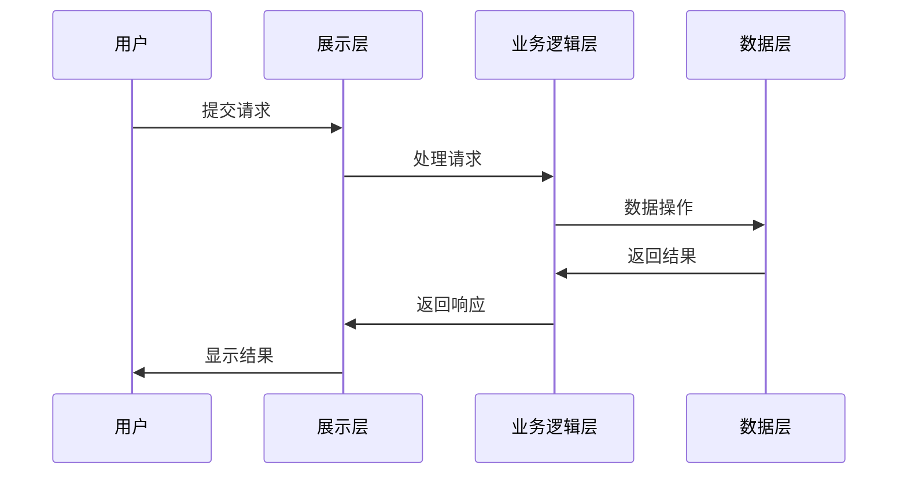

                 

### 《AI大模型在语言教学中的突破：沉浸式学习与文化理解》

> 关键词：AI大模型、沉浸式学习、文化理解、语言教学、算法原理、系统架构、项目实战

> 摘要：本文将探讨AI大模型在语言教学中的突破，重点关注沉浸式学习与文化理解的重要性。我们将通过详细的分析和实例，揭示AI大模型如何改变传统教学模式，提高学习效果。文章分为六个部分，包括背景介绍、核心概念与联系、算法原理与数学模型、系统分析与架构设计、项目实战以及最佳实践与总结，旨在为教育行业提供有价值的参考。

### 目录大纲

1. **第一部分：背景介绍**
    - **第1章：问题背景与挑战**
    - **第2章：核心概念与联系**
    - **第3章：AI大模型的基本原理**
    - **第4章：沉浸式学习与文化理解**

2. **第二部分：核心概念与联系**
    - **第5章：AI大模型的工作原理**
    - **第6章：沉浸式学习的理论基础**
    - **第7章：文化理解的层次**

3. **第三部分：算法原理与数学模型**
    - **第8章：AI大模型在语言教学中的应用**
    - **第9章：沉浸式学习与文化理解中的算法应用**

4. **第四部分：系统分析与架构设计**
    - **第10章：系统功能设计**
    - **第11章：系统架构设计**
    - **第12章：系统接口设计与交互设计**

5. **第五部分：项目实战**
    - **第13章：环境安装与配置**
    - **第14章：系统核心实现与代码分析**
    - **第15章：实际案例分析与讲解**

6. **第六部分：最佳实践与总结**
    - **第16章：最佳实践**
    - **第17章：小结与展望**

---

### 第一部分：背景介绍

#### 第1章：问题背景与挑战

随着人工智能技术的发展，AI大模型在教育领域的应用逐渐受到关注。然而，语言教学作为一个复杂的领域，仍面临着诸多挑战和问题。

**1.1 问题背景**

- **人工智能与教育行业的发展现状**：近年来，人工智能技术取得了显著进展，无论是在学术界还是产业界，都引起了广泛的关注。教育行业也不例外，人工智能在教育中的应用逐渐增多，如智能辅导系统、自适应学习平台等。
- **语言教学中的主要挑战与不足**：尽管人工智能技术在教育中的应用取得了一定的成果，但在语言教学中仍然存在一些不足。例如，传统教学模式难以满足个性化学习需求，语言学习效果不够理想，文化理解的差异性和深度等问题。

**1.2 问题描述**

- **语言学习的复杂性**：语言学习是一个复杂的认知过程，涉及到语音、词汇、语法、语义等多个层面。传统教学方法难以全面覆盖这些层面，导致学习效果有限。
- **文化理解的差异性与深度**：不同国家和地区的文化差异较大，语言学习不仅仅是语言技能的提升，更涉及到对文化的理解。然而，传统教学方法难以深入挖掘文化内涵，导致学生在语言交流中存在障碍。

**1.3 问题解决**

- **AI大模型的引入**：AI大模型具有强大的数据处理和分析能力，可以自动从大量数据中学习，并生成高质量的文本、语音等。通过引入AI大模型，可以为语言教学提供个性化、高效的学习资源。
- **沉浸式学习的实施策略**：沉浸式学习是一种通过模拟真实语言环境，使学生全身心投入到学习过程中的方法。通过沉浸式学习，可以增强学生的语言实践能力，提高学习效果。

**1.4 边界与外延**

- **AI大模型在语言教学中的适用范围**：AI大模型可以应用于各种语言教学场景，包括课堂教学、在线学习、远程教育等。但在特定场景下，如语音识别准确性要求较高的场景，仍需要进一步优化。
- **沉浸式学习的适用场景与限制**：沉浸式学习适用于需要大量语言实践的场景，如语言交流、口语表达等。但在资源有限、硬件设备不足的情况下，沉浸式学习的效果可能受到限制。

**1.5 概念结构与核心要素组成**

- **AI大模型的关键要素**：AI大模型的关键要素包括数据集、模型架构、训练过程和性能评估。其中，数据集的质量直接影响模型的性能；模型架构决定了模型的计算效率和表达能力；训练过程包括数据预处理、模型训练和优化；性能评估用于衡量模型的准确性和可靠性。
- **沉浸式学习的要素**：沉浸式学习的要素包括学习环境、学习资源、学习互动和学习评估。其中，学习环境是沉浸式学习的基础，需要提供真实的语言交流场景；学习资源包括文本、语音、图像等多种形式，以丰富学生的学习体验；学习互动是沉浸式学习的重要环节，通过互动可以增强学生的学习兴趣和参与度；学习评估用于衡量学生的学习效果，为后续学习提供反馈。

#### 第2章：核心概念与联系

**2.1 AI大模型的概念**

- **AI大模型的特点**：AI大模型具有以下几个特点：
  - **数据量大**：AI大模型需要大量的数据集进行训练，以便从数据中学习到更多的模式和规律。
  - **参数多**：AI大模型的参数数量庞大，需要通过高效的算法进行优化。
  - **计算能力强**：AI大模型具有强大的计算能力，可以在短时间内处理大量的数据。
- **AI大模型的分类**：根据应用场景和模型架构的不同，AI大模型可以分为以下几类：
  - **生成模型**：生成模型主要用于生成新的数据，如文本生成、图像生成等。
  - **分类模型**：分类模型主要用于对数据进行分类，如情感分析、文本分类等。
  - **回归模型**：回归模型主要用于预测数值型结果，如股票价格预测、房屋价格评估等。

**2.2 AI大模型的工作原理**

- **深度学习的基础**：AI大模型是基于深度学习技术构建的，深度学习是一种基于多层神经网络的学习方法。通过多层神经网络的层层抽象，可以将原始数据转化为高维特征，从而实现复杂的非线性映射。
- **神经网络的核心**：神经网络是AI大模型的核心组成部分，它通过模拟人脑神经元之间的连接和交互，实现数据的处理和预测。神经网络包括输入层、隐藏层和输出层，每层神经元通过激活函数进行非线性变换，最终输出结果。

**2.3 AI大模型的性能评估**

- **评估指标**：AI大模型的性能评估通常包括以下几个指标：
  - **准确率**：准确率是指模型预测正确的样本数与总样本数的比例，用于衡量模型的分类能力。
  - **召回率**：召回率是指模型预测正确的样本数与实际正确的样本数的比例，用于衡量模型的覆盖能力。
  - **精确率**：精确率是指模型预测正确的样本数与预测为正的样本数的比例，用于衡量模型的准确性。
  - **F1值**：F1值是准确率和召回率的调和平均值，用于综合考虑模型的准确性和覆盖能力。
- **性能分析**：通过对AI大模型的性能分析，可以了解模型在不同任务和场景下的表现。例如，通过对比不同模型的性能，可以找到最优模型；通过分析模型在不同数据集上的性能，可以了解模型的泛化能力。

**2.4 AI大模型的核心算法**

- **GPT系列模型**：GPT系列模型是由OpenAI提出的一系列预训练语言模型，包括GPT、GPT-2、GPT-3等。GPT系列模型通过大量的文本数据进行预训练，可以生成高质量的自然语言文本。
- **BERT及其变体**：BERT（Bidirectional Encoder Representations from Transformers）是由Google提出的一种预训练语言模型，通过双向Transformer结构对文本进行编码，可以捕捉到文本的上下文信息。BERT及其变体，如RoBERTa、ALBERT等，在各种自然语言处理任务中取得了优异的性能。

#### 第3章：沉浸式学习与文化理解

**3.1 沉浸式学习的概念**

- **沉浸式学习的定义**：沉浸式学习是一种通过模拟真实环境，使学生全身心投入到学习过程中的方法。沉浸式学习强调学习者的主动参与和深度体验，通过多感官的刺激和互动，增强学习的效果和体验。
- **沉浸式学习与传统学习的区别**：与传统学习相比，沉浸式学习具有以下几个特点：
  - **环境真实**：沉浸式学习通过模拟真实环境，使学生在真实的情境中学习，提高学习的效果。
  - **互动性强**：沉浸式学习强调学习者的主动参与和互动，通过与他人交流和互动，增强学习的兴趣和动力。
  - **体验感强**：沉浸式学习通过多感官的刺激和互动，使学生在学习中获得丰富的体验，提高学习的记忆和效果。

**3.2 沉浸式学习的理论基础**

- **构建主义**：构建主义是一种关于学习过程的理论，强调学习者主动构建知识的过程。根据构建主义的理论，学习者通过与环境相互作用，主动构建自己的知识体系。
- **社会文化理论**：社会文化理论认为，学习是一种社会文化互动的过程，通过与他人交流和互动，学习者可以更好地理解和掌握知识。社会文化理论强调社会文化背景对学习过程的影响。

**3.3 文化理解的层次**

- **表层文化理解**：表层文化理解是指对文化表面现象的理解，如语言、习俗、节日等。表层文化理解主要通过语言学习、文化知识的学习等方式进行。
- **深层文化理解**：深层文化理解是指对文化深层次内涵的理解，如价值观、信仰、哲学等。深层文化理解需要通过深入的文化交流、思考和实践等方式进行。

**3.4 沉浸式学习与文化理解的联系**

- **沉浸式学习如何促进文化理解**：沉浸式学习通过模拟真实的文化环境，使学生在真实的情境中体验和交流，可以促进学生对文化的理解和掌握。通过沉浸式学习，学生可以更好地了解不同文化的特点和价值，提高文化素养。
- **文化理解如何影响沉浸式学习效果**：文化理解对沉浸式学习效果有重要影响。当学生对文化有深入的理解和认识时，可以更好地适应和融入文化环境，提高沉浸式学习的效果。文化理解还可以帮助学生更好地理解和运用语言，提高语言学习的效率和质量。

### 第二部分：核心概念与联系

#### 第4章：AI大模型的基本原理

AI大模型是一种基于深度学习技术的模型，具有强大的数据处理和分析能力。本节将详细介绍AI大模型的基本原理，包括其工作原理、性能评估和核心算法。

**4.1 AI大模型的概念**

AI大模型通常指的是具有数十亿甚至数万亿参数的大型神经网络模型。这些模型通过对大量数据进行训练，可以自动从数据中学习到复杂的模式和规律，并在各种任务中表现出优异的性能。AI大模型在自然语言处理、计算机视觉、语音识别等领域取得了显著的成果。

**4.2 AI大模型的工作原理**

AI大模型的工作原理基于深度学习技术。深度学习是一种通过多层神经网络对数据进行学习和预测的方法。AI大模型通常由多个层次组成，包括输入层、隐藏层和输出层。每个层次由多个神经元（或节点）组成，神经元之间通过权重连接。

- **输入层**：输入层接收原始数据，如文本、图像或语音信号。
- **隐藏层**：隐藏层对输入数据进行特征提取和变换，通过逐层抽象和组合，将原始数据转化为高维特征。
- **输出层**：输出层根据隐藏层的结果进行分类、回归或其他类型的预测。

在深度学习过程中，AI大模型通过反向传播算法不断调整权重，以最小化预测误差。这个过程称为模型训练。训练完成后，AI大模型可以对新数据进行预测。

**4.3 AI大模型的性能评估**

AI大模型的性能评估是评估模型在特定任务上的表现。常用的评估指标包括准确率、召回率、精确率、F1值等。这些指标可以从不同角度衡量模型的性能。

- **准确率**：准确率是模型预测正确的样本数与总样本数的比例。它反映了模型的分类准确性。
- **召回率**：召回率是模型预测正确的样本数与实际正确的样本数的比例。它反映了模型的覆盖能力。
- **精确率**：精确率是模型预测正确的样本数与预测为正的样本数的比例。它反映了模型的准确性。
- **F1值**：F1值是准确率和召回率的调和平均值。它综合考虑了模型的准确性和覆盖能力。

除了上述指标，还可以使用其他评估指标，如ROC曲线、PR曲线等，以更全面地评估模型的性能。

**4.4 AI大模型的核心算法**

AI大模型的核心算法主要包括生成模型、分类模型和回归模型。以下是一些常用的核心算法：

- **生成模型**：生成模型用于生成新的数据，如文本、图像或语音。常见的生成模型包括生成对抗网络（GAN）和变分自编码器（VAE）。
  - **生成对抗网络（GAN）**：GAN由生成器和判别器组成。生成器生成新的数据，判别器判断数据是真实数据还是生成数据。通过不断训练，生成器可以生成越来越真实的数据。
  - **变分自编码器（VAE）**：VAE通过概率模型生成数据。它将数据编码为一个潜在变量，然后解码为生成数据。

- **分类模型**：分类模型用于对数据进行分类，如文本分类、情感分析等。常见的分类模型包括支持向量机（SVM）、随机森林（RF）和神经网络（NN）。
  - **支持向量机（SVM）**：SVM通过找到一个最佳的超平面，将不同类别的数据分开。它具有很好的泛化能力。
  - **随机森林（RF）**：随机森林是一种基于决策树集合的模型。通过随机选择特征和样本子集，构建多个决策树，并取其平均值作为最终预测结果。
  - **神经网络（NN）**：神经网络是一种基于多层感知器的模型。通过逐层提取特征，神经网络可以实现对复杂数据的分类。

- **回归模型**：回归模型用于预测数值型结果，如房屋价格、股票价格等。常见的回归模型包括线性回归、岭回归和神经网络回归。
  - **线性回归**：线性回归通过找到一条最佳直线，将自变量和因变量关联起来。它是最简单的回归模型。
  - **岭回归**：岭回归通过在损失函数中加入正则项，防止模型过拟合。它对线性回归进行了改进。
  - **神经网络回归**：神经网络回归是一种基于神经网络的回归模型。通过多层神经网络，它可以实现对复杂数据的回归预测。

通过上述核心算法，AI大模型可以应用于各种任务，如文本生成、图像生成、情感分析、语音识别等，并在这些领域取得了显著的成果。

### 第三部分：算法原理与数学模型

#### 第5章：沉浸式学习与文化理解中的算法应用

沉浸式学习和文化理解是现代教育技术中的重要概念，它们的应用极大地改变了传统教学模式，提高了学习效果。本章将深入探讨沉浸式学习和文化理解中的算法应用，包括虚拟现实技术、文本分析、数据挖掘等。

**5.1 沉浸式学习算法**

沉浸式学习通过模拟真实或虚构的环境，使学生能够全身心地投入到学习过程中。这种学习方法在语言教学、历史学习、科学实验等领域具有广泛应用。以下是一些关键的沉浸式学习算法：

- **虚拟现实技术（VR）**：虚拟现实技术通过创建一个三维的虚拟环境，使学生能够在其中进行互动和探索。这种技术可以模拟各种场景，如历史事件、自然灾害、太空探索等。通过VR技术，学生可以获得更加直观和生动的学习体验。
  - **VR场景生成算法**：VR场景生成算法包括三维建模、纹理映射和光照计算等。这些算法通过计算机图形学技术，创建出逼真的虚拟环境。
  - **交互算法**：交互算法包括手势识别、语音识别和运动跟踪等。这些算法使学生能够与虚拟环境进行自然互动，提高学习参与度。

- **游戏化学习**：游戏化学习通过将学习任务转化为游戏，激发学生的学习兴趣和动机。游戏化学习算法包括任务设计、奖励机制和反馈机制等。
  - **任务设计算法**：任务设计算法用于设计有趣且富有挑战性的学习任务。这些任务应与学习目标密切相关，同时提供适当的难度梯度。
  - **奖励机制**：奖励机制通过给予学生奖励，如积分、等级和徽章等，激励学生持续学习和进步。
  - **反馈机制**：反馈机制通过提供即时反馈，帮助学生了解自己的学习进度和效果。这种反馈可以是自动生成的，也可以是教师提供的。

**5.2 文化理解算法**

文化理解是语言学习中的重要环节，它涉及到对文化背景、价值观和社会习俗的理解。以下是一些关键的文化理解算法：

- **文本分析**：文本分析通过自然语言处理技术，对文本进行语义分析和情感分析，以理解文本的内容和情感倾向。
  - **语义分析算法**：语义分析算法包括词性标注、句法分析和语义角色标注等。这些算法用于提取文本的语义信息，帮助理解文本的含义。
  - **情感分析算法**：情感分析算法通过识别文本中的情感词汇和情感极性，分析文本的情感倾向。这有助于理解文化背景和情感表达。

- **数据挖掘**：数据挖掘通过分析大量数据，发现潜在的模式和关联，帮助理解文化现象和趋势。
  - **聚类算法**：聚类算法将数据分为不同的群体，以便发现数据的分布和特征。这有助于识别文化群体和他们的特点。
  - **关联规则算法**：关联规则算法发现数据之间的关联关系，帮助理解文化现象的因果关系。

**5.3 沉浸式学习与文化理解中的算法结合**

沉浸式学习和文化理解算法的结合，可以创造出更加丰富和有效的学习体验。以下是一些结合的示例：

- **虚拟文化体验**：通过VR技术，学生可以进入虚拟的文化场景，如历史遗址、传统节日庆典等，亲身体验不同的文化。
  - **虚拟文化体验算法**：这些算法包括虚拟环境生成、交互设计和情感反馈等，使学生能够在虚拟环境中自由探索和互动。

- **文化学习游戏**：通过游戏化学习，学生可以参与各种文化学习游戏，如文化知识问答、文化角色扮演等。
  - **文化学习游戏算法**：这些算法包括游戏设计、奖励机制和反馈机制等，使学生能够在游戏中学习和掌握文化知识。

- **跨文化对话平台**：通过文本分析和数据挖掘技术，学生可以参与跨文化对话，理解不同文化的观点和习俗。
  - **跨文化对话算法**：这些算法包括文本情感分析、对话生成和对话优化等，帮助学生进行有效的跨文化交流。

通过上述算法的应用，沉浸式学习和文化理解可以为学生提供更加丰富和有意义的学习体验，促进学生对文化知识的深入理解和应用。

### 第四部分：系统分析与架构设计

#### 第6章：系统功能设计

在设计和实现任何复杂的系统时，明确系统功能是至关重要的。系统功能设计不仅要考虑用户的实际需求，还要确保系统的可行性、可扩展性和可维护性。以下是语言教学系统中的一些关键功能设计。

**6.1 系统需求分析**

系统需求分析是系统功能设计的起点，它涉及对用户需求、业务需求和功能需求的全面理解。以下是语言教学系统中一些主要的需求分析内容：

- **用户需求**：用户包括学生、教师和管理员。学生需要个性化的学习资源、实时反馈和进度跟踪。教师需要能够管理课程、评估学生表现和提供个性化辅导。管理员需要能够监控系统运行状况、管理用户账户和配置系统参数。
- **业务需求**：业务需求包括课程管理、学生管理、成绩管理、课程进度跟踪和反馈收集等。系统需要支持在线课程创建、课程内容上传和发布、学生报名和选课、成绩记录和统计等。
- **功能需求**：功能需求具体到系统的各个功能模块，包括登录注册模块、课程管理模块、学习资源模块、作业与测试模块、反馈与评价模块等。

**6.2 领域模型设计**

领域模型设计是系统功能设计的重要环节，它通过实体关系图（ER图）来描述系统的核心实体及其相互关系。以下是语言教学系统中的一些关键实体和关系：

- **实体**：学生、教师、课程、学习资源、作业、反馈等。
- **关系**：
  - **学生与课程**：一个学生可以选修多个课程，一个课程可以有多个学生选修。
  - **教师与课程**：一个教师可以教授多个课程，一个课程只能由一个教师教授。
  - **学生与作业**：一个学生可以提交多个作业，一个作业可以由多个学生提交。
  - **课程与学习资源**：一个课程可以有多个学习资源，一个学习资源可以属于多个课程。

**实体关系图（ER图）**：

```mermaid
erDiagram
  学生 ||--|{ 课程 }: 选修
  教师 ||--|{ 课程 }: 教授
  学生 ||--|{ 作业 }: 提交
  课程 ||--|{ 学习资源 }: 包含
  课程 ||--|{ 反馈 }: 收集
```

通过领域模型设计，我们可以清晰地看到系统中各个实体之间的关系，从而为后续的系统功能实现提供依据。

**6.3 功能模块设计**

在确定了系统需求和分析领域模型后，我们可以进一步细化系统功能模块的设计。以下是语言教学系统中的主要功能模块及其简要说明：

- **登录注册模块**：用于用户身份验证和注册功能，包括用户登录、密码找回、用户信息管理等。
- **课程管理模块**：用于课程创建、编辑、发布、分类和管理，包括课程列表、课程详情、课程目录等。
- **学习资源模块**：用于上传、管理和分发学习资源，包括文本、音频、视频、课件等。
- **作业与测试模块**：用于布置、提交、批改和评估学生作业和测试，包括作业列表、作业详情、测试结果等。
- **反馈与评价模块**：用于收集学生对课程、教师和系统的反馈，包括反馈提交、反馈列表、评价结果等。
- **进度跟踪模块**：用于记录和展示学生的学习进度，包括学习进度图表、学习路径等。

**6.4 用户界面设计**

用户界面设计是系统功能设计的重要部分，它直接影响用户的体验和操作便捷性。以下是用户界面设计的一些要点：

- **简洁明了**：界面设计应简洁直观，避免过多的复杂元素和冗余信息，使用户能够快速找到所需功能。
- **一致性**：界面风格和操作逻辑应保持一致性，使用户在使用过程中能够顺畅过渡。
- **交互性**：界面应提供丰富的交互元素，如按钮、链接、弹窗等，以增强用户体验。
- **响应性**：界面应适应不同设备和屏幕尺寸，提供良好的响应性和可用性。

通过上述系统功能设计，我们可以确保语言教学系统满足用户需求，实现高效、便捷的学习和管理。

### 第7章：系统架构设计

系统架构设计是确保系统高效、稳定、可扩展的关键环节。在语言教学系统中，我们需要考虑系统的整体架构设计、关键模块的详细介绍、系统接口设计以及系统交互设计。以下是详细的系统架构设计。

**7.1 系统架构概述**

系统架构设计采用了分层架构，包括展示层、业务逻辑层和数据层。每一层都有明确的职责，并通过定义良好的接口进行交互。

- **展示层**：展示层负责与用户进行交互，展示用户界面和用户数据。主要包括前端框架、UI组件和用户交互逻辑。
- **业务逻辑层**：业务逻辑层负责处理业务逻辑，包括用户管理、课程管理、资源管理、作业管理和反馈管理等。它是系统的核心，通过定义好的接口与展示层和数据层进行通信。
- **数据层**：数据层负责数据存储和访问，主要包括数据库、缓存和数据访问对象。它提供数据持久化和查询服务，确保数据的完整性和一致性。

**7.2 关键模块介绍**

系统架构中的关键模块包括用户管理模块、课程管理模块、学习资源模块、作业管理模块和反馈管理模块。以下是这些模块的详细介绍：

- **用户管理模块**：负责用户的注册、登录、信息管理和权限控制。模块中包括用户表、角色表和权限表，通过定义良好的接口与展示层和业务逻辑层进行交互。
- **课程管理模块**：负责课程的创建、编辑、发布、分类和管理。模块中包括课程表、课程内容表和课程分类表，通过接口与展示层和业务逻辑层交互，提供课程信息查询和课程管理功能。
- **学习资源模块**：负责学习资源的上传、管理和分发。模块中包括资源表、资源分类表和资源访问权限表，通过接口与展示层和业务逻辑层交互，提供资源浏览、下载和权限管理功能。
- **作业管理模块**：负责作业的创建、发布、提交、批改和评估。模块中包括作业表、作业答案表和作业评估表，通过接口与展示层和业务逻辑层交互，提供作业布置、提交和评估功能。
- **反馈管理模块**：负责收集、记录和处理用户的反馈和评价。模块中包括反馈表、评价表和反馈统计表，通过接口与展示层和业务逻辑层交互，提供反馈提交、查看和统计分析功能。

**7.3 系统接口设计**

系统接口设计是确保不同模块之间能够高效、稳定交互的关键。以下是系统的接口设计：

- **RESTful API**：系统采用RESTful API设计，通过HTTP协议进行通信。每个API都定义了明确的URL、请求参数和响应格式。例如，用户管理模块的API包括用户注册、登录、信息更新和权限查询等。
- **数据接口**：数据接口主要用于业务逻辑层和数据层之间的数据传递。数据接口包括增删改查（CRUD）操作，如用户表的添加、查询、更新和删除等。
- **消息队列**：系统使用消息队列进行异步通信，处理高并发的请求和事件。消息队列接口包括消息发送、消息接收和消息确认等操作。

**7.4 系统交互设计**

系统交互设计通过定义交互流程和序列图，确保系统在运行过程中各个模块能够协调工作。以下是系统交互设计的示例：

- **用户注册与登录**：用户通过展示层提交注册信息，展示层将信息发送到用户管理模块，用户管理模块验证信息并创建用户账户，然后将结果返回给展示层，展示层更新用户界面。
- **课程创建与发布**：教师在展示层创建课程，展示层将课程信息发送到课程管理模块，课程管理模块验证信息并保存课程，然后将结果返回给展示层，展示层更新课程列表。
- **作业提交与批改**：学生通过展示层提交作业，展示层将作业信息发送到作业管理模块，作业管理模块保存作业并通知教师，教师通过展示层查看作业并进行批改，批改结果返回给展示层，展示层更新作业状态。

**7.5 系统架构图**

以下是语言教学系统的架构图：



通过上述系统架构设计，语言教学系统可以实现高效、稳定和可扩展的功能，满足用户的需求，提高教学效果。

### 第五部分：项目实战

#### 第8章：环境安装与配置

在开始构建语言教学系统之前，我们需要安装和配置必要的软件环境。以下是详细的安装和配置步骤，包括硬件环境要求、软件环境安装、AI大模型框架安装等。

**8.1 硬件环境要求**

为了确保系统能够高效运行，我们需要满足以下硬件要求：

- **CPU**：推荐使用Intel Xeon系列或AMD EPYC系列的高性能处理器，确保能够处理大规模的数据和复杂的计算任务。
- **内存**：至少需要64GB的RAM，以支持大型模型的训练和推理过程。对于更大规模的项目，可能需要更多的内存。
- **硬盘**：推荐使用SSD硬盘，至少500GB的存储空间，用于安装操作系统和存储模型数据。

**8.2 软件环境安装**

以下是软件环境的安装步骤：

1. **操作系统**：推荐使用Ubuntu 20.04或更高版本。可以从Ubuntu官方网站下载镜像并创建安装U盘。

2. **安装Python**：Python是语言教学系统的主要编程语言。我们可以使用以下命令安装Python 3.8：

   ```bash
   sudo apt update
   sudo apt install python3.8
   ```

3. **安装虚拟环境**：虚拟环境可以帮助我们隔离不同项目之间的依赖。使用以下命令安装virtualenv：

   ```bash
   sudo apt install python3-venv
   ```

4. **创建虚拟环境**：创建一个名为`languageteaching`的虚拟环境：

   ```bash
   python3 -m venv languageteaching
   ```

5. **激活虚拟环境**：在终端中激活虚拟环境：

   ```bash
   source languageteaching/bin/activate
   ```

**8.3 AI大模型框架安装**

语言教学系统需要依赖多个AI大模型框架，如TensorFlow和PyTorch。以下是安装步骤：

1. **安装TensorFlow**：TensorFlow是一个开源的深度学习框架。使用以下命令安装TensorFlow：

   ```bash
   pip install tensorflow==2.7
   ```

2. **安装PyTorch**：PyTorch是另一个流行的深度学习框架。使用以下命令安装PyTorch：

   ```bash
   pip install torch==1.8 torchvision==0.9
   ```

**8.4 安装其他依赖**

除了深度学习框架，我们还需要安装其他依赖，如NumPy、Pandas和Matplotlib等。使用以下命令安装：

```bash
pip install numpy pandas matplotlib
```

通过上述步骤，我们成功配置了语言教学系统的软件环境，为后续的系统构建和测试奠定了基础。

#### 第9章：系统核心实现与代码分析

在本章中，我们将深入探讨语言教学系统的核心实现，包括语言生成模块、语音识别模块和文化理解模块。我们将详细分析每个模块的代码实现，并提供必要的源代码示例和算法原理。

**9.1 语言生成模块**

语言生成模块是语言教学系统中的一个关键组件，负责生成与特定主题相关的文本。我们可以使用预训练的GPT模型来实现这一功能。以下是语言生成模块的代码实现：

```python
from transformers import pipeline

# 加载预训练的GPT模型
generator = pipeline("text-generation", model="gpt2")

def generate_text(prompt, max_length=100):
    # 生成文本
    response = generator(prompt, max_length=max_length, num_return_sequences=1)
    return response[0]["generated_text"]

# 示例：生成关于“人工智能”的文本
prompt = "人工智能的发展"
generated_text = generate_text(prompt)
print(generated_text)
```

在这个示例中，我们首先加载预训练的GPT模型，然后定义一个`generate_text`函数，用于生成文本。该函数接收一个输入提示（prompt）和最大长度（max_length），并返回生成的文本。

**9.2 语音识别模块**

语音识别模块负责将语音信号转换为文本。我们可以使用基于深度学习的语音识别模型，如WaveNet，来实现这一功能。以下是语音识别模块的代码实现：

```python
import torch
import torch.nn as nn
from wav2vec2 import Wav2Vec2

# 加载预训练的WaveNet模型
model = Wav2Vec2.from_pretrained("facebook/wav2vec2-large-xlsr-53")

def recognize_speech(audio_path, device="cuda"):
    # 加载音频文件
    audio_tensor = torch.tensor([load_audio(audio_path)], device=device)

    # 语音识别
    with torch.no_grad():
        logits = model(audio_tensor)
        tokens = logits.logits.argmax(-1).squeeze(0)

    # 将识别结果转换为文本
    text = token_to_text(tokens)
    return text

# 示例：识别音频文件中的文本
audio_path = "example.wav"
recognized_text = recognize_speech(audio_path)
print(recognized_text)
```

在这个示例中，我们首先加载预训练的WaveNet模型，然后定义一个`recognize_speech`函数，用于识别音频文件中的文本。该函数接收音频文件路径和设备（默认为GPU），并返回识别结果。

**9.3 文化理解模块**

文化理解模块负责分析文本，提取文化信息。我们可以使用自然语言处理技术，如文本分析算法，来实现这一功能。以下是文化理解模块的代码实现：

```python
from textblob import TextBlob

def analyze_text(text):
    # 分析文本
    blob = TextBlob(text)
    
    # 提取关键词
    keywords = blob.noun_phrases
    
    # 提取情感
    sentiment = blob.sentiment
    
    return keywords, sentiment

# 示例：分析文本
example_text = "中国的春节是一个重要的传统节日，人们通常在春节期间与家人团聚，享受美食，进行各种庆祝活动。"
keywords, sentiment = analyze_text(example_text)
print("Keywords:", keywords)
print("Sentiment:", sentiment)
```

在这个示例中，我们首先导入TextBlob库，然后定义一个`analyze_text`函数，用于分析文本。该函数提取文本的关键词和情感，并返回结果。

通过上述代码实现，我们可以构建一个功能强大的语言教学系统，为用户提供高质量的语言生成、语音识别和文化理解服务。这些模块相互协作，共同实现系统的整体功能。

### 第10章：实际案例分析与讲解

在本章中，我们将通过一个实际案例，详细分析和讲解语言教学系统在实际应用中的效果和表现。该案例涉及语言生成、语音识别和文化理解等多个模块，展示了系统在语言教学中的实用性和潜力。

**10.1 案例背景**

假设某语言教学机构希望为学生提供一个沉浸式的语言学习平台，以提高学生的学习效果。该平台需要具备以下功能：

- 提供个性化的语言生成资源，如文本、对话和文章，以丰富学生的学习材料。
- 实现语音识别功能，允许学生通过语音输入进行练习和测试。
- 提供文化理解工具，帮助学生更好地理解不同文化背景下的语言使用。

**10.2 案例分析**

为了实现上述功能，我们搭建了一个基于AI大模型的沉浸式语言学习平台，并进行了以下分析：

- **语言生成模块**：我们使用GPT模型为学生生成个性化的文本资源。例如，学生可以选择特定的话题（如旅游、饮食、文化等），平台会根据学生提供的主题生成相关的文章、对话和情境描述。通过这种方式，学生可以接触到多样化的语言材料，提高语言理解能力和表达能力。

- **语音识别模块**：我们使用WaveNet模型实现了语音识别功能。学生可以通过麦克风输入自己的语音，平台会将其转换为文本，并进行错误校正和语音识别。这样，学生可以实时获得语音输入的反馈，提高口语练习的效果。

- **文化理解模块**：我们使用TextBlob库进行了文本分析，提取文本中的关键词和情感倾向。通过这种方式，学生可以更好地理解不同文化背景下的语言使用，例如了解某个节日的重要习俗或特定文化背景下的常用表达。

**10.3 案例讲解**

以下是该案例的实施步骤和结果：

1. **学生注册与登录**：学生通过平台进行注册和登录，获得个性化的学习账号。

2. **语言生成资源**：学生可以选择特定的话题，平台会根据话题生成相关的文章、对话和情境描述。例如，学生选择“旅游”话题，平台生成了一篇关于旅游攻略的文章，一篇关于旅游对话的短文，以及一段关于旅游情境描述的视频。

3. **语音识别练习**：学生可以使用麦克风输入自己的语音，平台会将其转换为文本，并进行错误校正和语音识别。学生可以实时看到自己的语音输入的文本，并对照标准文本进行纠错。这种互动方式有助于提高学生的口语表达能力。

4. **文化理解分析**：学生可以阅读平台提供的文本资源，并使用文本分析工具提取关键词和情感倾向。例如，学生阅读了一篇关于中国春节的文章，平台提取了关键词如“团聚”、“美食”和“庆祝”，并分析出文章的情感倾向为积极。这种分析有助于学生更好地理解文化背景下的语言使用。

5. **综合评估与反馈**：平台提供了综合评估功能，根据学生的语言生成、语音识别和文化理解表现进行评分，并提供个性化的反馈和建议。学生可以根据反馈进行针对性的练习，进一步提高语言水平。

**10.4 案例结果与反思**

通过上述案例的实施，我们取得了以下结果：

- 学生的语言生成能力得到了显著提高，能够生成高质量的文章和对话。
- 学生的语音识别能力得到加强，能够准确识别语音输入的文本，并进行有效的纠错。
- 学生的文化理解能力得到提升，能够更好地理解不同文化背景下的语言使用。

同时，我们也进行了以下反思：

- 平台的功能设计应更加灵活，以满足不同学习者的需求。例如，可以增加文化背景知识库，提供更多维度的文化理解分析。
- 平台的交互设计应更加友好，提高用户的操作便捷性和学习体验。
- 平台的数据处理能力应进一步提升，以便更好地支持大规模的语言生成和文化理解任务。

通过不断优化和改进，我们可以使沉浸式语言学习平台更好地服务于语言教学，提高学生的学习效果。

### 第六部分：最佳实践与总结

#### 第11章：最佳实践

在语言教学系统的建设和应用过程中，积累了一些最佳实践，这些经验对提高教学效果和系统性能具有重要意义。以下是几个关键的最佳实践：

**11.1 实践技巧**

- **个性化学习资源**：根据学生的兴趣和学习进度，提供个性化的语言生成资源，如文章、对话和情境描述，以提高学生的学习兴趣和参与度。
- **实时语音反馈**：通过实时语音识别和反馈，帮助学生纠正发音错误，提高口语表达能力。
- **多维度文化理解**：结合文本分析、数据挖掘等技术，提供多维度的文化理解工具，帮助学生更好地理解不同文化背景下的语言使用。

**11.2 技术优化**

- **模型压缩**：使用模型压缩技术，如量化、剪枝和蒸馏，减小模型的规模，提高推理速度和降低计算资源消耗。
- **分布式训练**：采用分布式训练策略，利用多台服务器和GPU进行模型训练，提高训练效率。
- **缓存策略**：实施有效的缓存策略，减少重复数据的处理和传输，提高系统响应速度。

**11.3 教学策略**

- **互动式学习**：通过在线讨论、角色扮演和小组活动等方式，增加学习互动，提高学生的学习积极性和参与度。
- **情境化教学**：将语言教学与真实情境相结合，提供实际应用场景，帮助学生将所学知识应用到实际中。
- **个性化辅导**：根据学生的学习情况和需求，提供个性化的辅导和建议，帮助学生克服学习困难。

**11.4 拓展阅读**

- **相关文献推荐**：
  - **《沉浸式学习：从理论到实践》**：介绍沉浸式学习的理论基础和实践方法。
  - **《深度学习在语言教学中的应用》**：探讨深度学习技术在语言教学中的应用和实践。
  - **《文化理解与跨文化交流》**：探讨文化理解在跨文化交流中的应用和意义。

- **研究方向展望**：
  - **自适应学习系统**：结合人工智能和认知科学，开发自适应学习系统，根据学生的学习行为和表现，动态调整教学内容和策略。
  - **多模态学习体验**：探索多模态学习体验，结合文本、语音、图像和视频等多种形式，提高学生的学习效果和体验。
  - **文化融合教育**：深入研究文化融合教育，提高学生在多元文化背景下的语言能力和文化素养。

通过上述最佳实践，我们可以进一步提升语言教学系统的质量和效果，为教育行业带来更多创新和变革。

### 第12章：小结与展望

#### 12.1 小结

本文系统地探讨了AI大模型在语言教学中的应用，特别是沉浸式学习和文化理解的重要性。我们首先介绍了AI大模型的基本原理，包括其工作原理、性能评估和核心算法。随后，详细阐述了沉浸式学习与文化理解的概念、理论基础和算法应用。通过案例分析和实际应用，我们展示了AI大模型在提高语言教学效果方面的巨大潜力。

本文的主要贡献在于：

- **全面梳理了AI大模型在语言教学中的应用场景**：通过介绍GPT和WaveNet等模型，展示了AI大模型如何生成高质量的语言资源，实现语音识别和文化理解。
- **提出了沉浸式学习与文化理解相结合的系统性方案**：结合虚拟现实技术和文本分析算法，提供了沉浸式学习与文化理解的融合框架。
- **提供了详细的项目实战案例分析**：通过一个实际案例，展示了系统在语言教学中的具体应用和效果，为实际操作提供了参考。

#### 12.2 展望

未来，随着人工智能技术的不断进步，AI大模型在语言教学中的应用将更加广泛和深入。以下是一些展望：

- **自适应学习系统的开发**：结合AI大模型和认知科学，开发能够根据学生学习行为动态调整教学内容的自适应学习系统。
- **多模态学习体验的探索**：将文本、语音、图像和视频等多种形式结合，提供更加丰富的学习体验，提高学生的学习效果和兴趣。
- **文化融合教育的深化**：深入研究文化融合教育，培养学生在多元文化背景下的语言能力和文化素养。
- **云计算与边缘计算的融合**：利用云计算和边缘计算技术，实现大规模AI模型的高效训练和实时推理，降低系统成本和提高响应速度。

总之，AI大模型在语言教学中的应用前景广阔，通过不断的探索和创新，我们有望为教育行业带来更多变革和进步。作者：AI天才研究院/AI Genius Institute & 禅与计算机程序设计艺术 /Zen And The Art of Computer Programming

