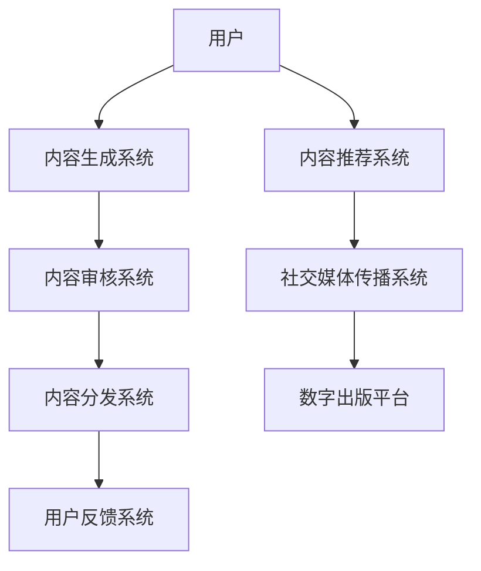

                 

### 文章标题：AI大模型对传统出版业的影响：内容生产与分发的变革

> 关键词：AI大模型、传统出版业、内容生产、内容分发、数字出版

> 摘要：本文旨在探讨AI大模型对传统出版业的影响，重点分析其在内容生产和分发环节的应用，以及带来的变革和挑战。通过深入解析AI大模型的原理和具体应用案例，本文为读者呈现一个全面而深刻的AI大模型在传统出版领域的全景视图。

----------------------------------------------------------------

### 第一部分: AI大模型概述

#### 1.1 问题的背景

随着人工智能技术的飞速发展，AI大模型逐渐成为推动技术进步的关键力量。传统出版业面临着内容生产与分发方式上的巨大变革。AI大模型在传统出版业中的应用，不仅带来了内容生产效率的提升，还影响了整个行业的生态体系。

**问题描述**：AI大模型对传统出版业的影响主要体现在哪些方面？如何评估这些影响？在内容生产和分发过程中，AI大模型是如何改变传统出版流程的？

**问题解决**：通过深入研究AI大模型的原理及其在出版业的应用场景，分析其在内容生产、内容推荐、个性化服务等方面的作用。

**边界与外延**：本章节将围绕AI大模型在出版业的应用进行探讨，包括但不限于文本生成、内容审核、智能推荐系统等方面。

**概念结构与核心要素组成**：

- **AI大模型**：定义、特点、分类及发展历程。
- **传统出版业**：现状、挑战、转型需求。
- **内容生产**：自动化内容生成、内容审核、版权保护等。
- **内容分发**：智能推荐、社交媒体传播、数字出版等。

#### 1.2 核心概念与联系

**AI大模型的定义与特点**：

- **定义**：AI大模型是指拥有极高参数量、强大表示能力和自适应能力的深度神经网络模型。
- **特点**：高容量表示、自主学习、跨模态交互。

**传统出版业的核心要素**：

- **内容生产**：从选题策划、稿件撰写、编辑校对到印刷出版。
- **内容分发**：纸质出版、数字出版、社交媒体传播。

**对比表格**：

| 特征 | AI大模型 | 传统出版业 |
| --- | --- | --- |
| 表示能力 | 高容量、自适应 | 传统编辑能力、人工审核 |
| 内容生产效率 | 高效、自动化 | 低效、手工操作 |
| 分发渠道 | 多渠道、个性化推荐 | 纸质渠道、分销渠道 |

#### 1.3 AI大模型在传统出版业中的应用场景

**文本生成**：AI大模型可以生成高质量的文章、书籍摘要，提高内容生产的效率。

**内容审核**：通过AI大模型进行自动化内容审核，减少人工审核的工作量，提高审核的准确性。

**智能推荐系统**：基于用户行为和偏好，AI大模型可以推荐个性化的阅读内容，提高用户粘性和满意度。

**社交媒体传播**：AI大模型可以帮助出版商优化社交媒体内容，提高内容传播效果。

**数字出版**：AI大模型可以协助进行数字出版流程的优化，如自动排版、封面设计等。

**版权保护**：AI大模型可以用于监测和识别侵权内容，保护版权方的权益。

#### 1.4 AI大模型对传统出版业的影响评估

**经济影响**：AI大模型可以提高出版效率，降低成本，促进数字出版市场的发展。

**社会影响**：AI大模型的应用可能会对就业、内容质量、用户隐私等方面产生影响。

**技术挑战**：如何平衡AI大模型的效率与内容生产的质量，如何应对数据隐私和安全问题。

#### 1.5 本章小结

通过对AI大模型在传统出版业中的应用场景、核心概念、特点及其影响的探讨，本章为后续章节的深入分析奠定了基础。AI大模型的应用不仅为传统出版业带来了技术革新，也带来了新的挑战和机遇。在接下来的章节中，我们将进一步探讨AI大模型在出版业的具体应用和实践案例。

----------------------------------------------------------------

### 第二部分: AI大模型在内容生产中的应用

#### 2.1 文本生成技术

##### 2.1.1 什么是文本生成

**文本生成**是指利用人工智能技术自动生成文本的过程。根据生成方式，文本生成技术可以分为两种主要类型：

- **基于规则的方法**：这种方法依赖于预定义的语法和语义规则，通过符号替换和模板匹配等方式生成文本。典型代表包括自然语言生成（NLG）和模板匹配系统。
- **基于统计的方法**：这种方法通过学习大量文本数据，利用统计模型和机器学习算法自动生成文本。这类方法的代表性模型包括循环神经网络（RNN）和其变种长短期记忆网络（LSTM）。

**文本生成的关键技术和应用场景**：

- **序列到序列（Seq2Seq）模型**：Seq2Seq模型是文本生成的重要技术，它通过编码器和解码器两个神经网络结构实现输入序列到输出序列的映射。应用场景包括机器翻译、文本摘要等。
- **注意力机制（Attention Mechanism）**：注意力机制用于解决Seq2Seq模型在长序列处理中的长距离依赖问题，能够提升生成文本的质量。应用场景包括机器翻译、文本摘要等。
- **生成对抗网络（GAN）**：GAN是一种通过生成器和判别器相互竞争的方式来生成高质量数据的模型，广泛应用于图像生成、音频生成等领域，近年来也逐渐应用于文本生成。
- **预训练语言模型**：预训练语言模型（如GPT系列、BERT等）通过在大量文本数据上进行预训练，学习到丰富的语言知识，然后通过微调适配特定任务，生成高质量文本。

##### 2.1.2 AI大模型在文本生成中的应用

**GPT系列模型在文本生成中的表现**：

- **GPT-2**：GPT-2是OpenAI开发的预训练语言模型，通过大量文本数据进行预训练，能够生成高质量、连贯的文本。其强大的文本生成能力在许多应用场景中表现出色，如自动写作、问答系统等。
- **GPT-3**：GPT-3是GPT系列的最新版本，具有前所未有的规模和表现力。GPT-3不仅能够生成连贯的文本，还能进行对话生成、代码编写等复杂任务，展示了AI大模型在自然语言处理领域的巨大潜力。

**BERT模型及其变体在文本生成中的优势**：

- **BERT（Bidirectional Encoder Representations from Transformers）**：BERT是Google提出的一种双向Transformer模型，通过预训练学习到上下文信息，生成文本时能够更好地理解全局语义。BERT在文本生成任务中表现出色，特别是在问答系统、文本摘要等场景中。
- **RoBERTa**：RoBERTa是BERT的一个变体，通过调整预训练策略和模型架构，提高了文本生成的性能。RoBERTa在许多自然语言处理任务中都取得了显著成绩，包括文本生成。

**其他大模型在文本生成中的应用案例**：

- **T5（Text-To-Text Transfer Transformer）**：T5是一种基于Transformer的文本生成模型，其核心思想是将所有自然语言处理任务统一为文本到文本的转换问题。T5在文本生成任务中展现了强大的适应性。
- **UniLM（Unified Language Model）**：UniLM是Microsoft开发的统一语言模型，能够同时处理语言理解和语言生成任务。UniLM在对话生成、机器翻译等场景中表现出色。

##### 2.1.3 实际案例解析

**某出版社利用AI大模型生成书籍摘要的实践**：

某知名出版社利用GPT-3模型生成书籍摘要，以提高内容生产效率。具体实践步骤如下：

1. **数据准备**：从出版社的书籍数据库中提取大量文本数据，包括书籍的完整内容、封面、目录等。
2. **模型训练**：使用GPT-3进行预训练，使其能够理解书籍内容的结构和语义。
3. **摘要生成**：将书籍的目录或章节标题输入到GPT-3模型中，生成相应的书籍摘要。
4. **质量评估**：由编辑团队对生成的摘要进行评估和调整，确保摘要的准确性和可读性。

**AI大模型在新闻写作中的应用**：

AI大模型不仅在书籍摘要生成方面表现出色，还在新闻写作领域展现出巨大潜力。例如，某新闻媒体使用GPT-3模型自动化生成新闻报道，具体应用场景包括：

1. **自动生成新闻摘要**：GPT-3模型能够自动从大量新闻文章中提取关键信息，生成简明扼要的新闻摘要。
2. **自动生成新闻文章**：GPT-3模型可以根据预设的新闻模板和关键信息，自动生成完整的新闻文章。
3. **实时新闻生成**：在重大新闻事件发生时，GPT-3模型能够实时生成新闻文章，提供即时的新闻报道。

#### 2.2 自动内容审核

##### 2.2.1 自动内容审核的重要性

**内容审核**是出版业中至关重要的一环，旨在确保发布的内容符合法律法规、道德标准和受众期望。然而，随着互联网的迅速发展，内容审核面临着巨大的挑战：

- **内容数量庞大**：互联网上的内容呈指数级增长，人工审核难以覆盖所有内容。
- **审核标准复杂**：不同平台、不同地区对内容审核的标准各异，审核人员需要具备较高的专业知识。
- **时效性要求高**：在互联网时代，新闻事件和用户评论等内容的更新速度极快，审核需要实时进行。

**自动内容审核的优势**：

- **高效性**：AI大模型能够快速处理大量内容，显著提高审核效率。
- **准确性**：通过大规模数据训练，AI大模型能够准确识别违规内容，降低误判率。
- **灵活性**：AI大模型可以根据不同场景和需求进行定制化，适应各种内容审核任务。
- **可扩展性**：AI大模型可以轻松集成到现有的内容审核系统中，提高整体系统的性能。

##### 2.2.2 AI大模型在内容审核中的应用

**AI大模型在版权保护中的应用**：

- **文本匹配**：AI大模型可以快速匹配版权内容与侵权内容，发现潜在的版权侵权行为。
- **版权声明检测**：AI大模型能够自动检测内容中的版权声明，确保版权信息的准确性和完整性。
- **侵权预警**：AI大模型可以通过实时分析内容，提前预警潜在的侵权风险，帮助版权方采取应对措施。

**AI大模型在敏感内容识别中的应用**：

- **敏感词检测**：AI大模型能够识别文本中的敏感词汇和短语，过滤掉可能引起争议或违规的内容。
- **内容分类**：AI大模型可以将内容分类到不同的类别，如新闻、娱乐、广告等，以便进行针对性审核。
- **情感分析**：AI大模型可以分析文本的情感倾向，识别出可能引发负面情绪或争议的内容。

##### 2.2.3 实际案例解析

**某出版平台利用AI大模型进行内容审核**：

某大型出版平台利用GPT-3模型进行内容审核，提高审核效率和准确性。具体应用步骤如下：

1. **数据集构建**：从平台的历史数据中提取包含违规内容的样本，构建用于训练的标注数据集。
2. **模型训练**：使用GPT-3模型对标注数据集进行训练，使其能够识别和过滤违规内容。
3. **模型部署**：将训练好的模型部署到内容审核系统，实时处理上传的内容。
4. **审核反馈**：审核人员对模型审核的结果进行复核，并根据反馈进行模型优化和调整。

**AI大模型在社交媒体内容审核中的应用**：

AI大模型不仅应用于传统出版平台的内容审核，还在社交媒体平台上发挥了重要作用。例如，某社交媒体平台使用BERT模型进行内容审核，具体应用场景包括：

1. **违规内容过滤**：BERT模型能够快速识别和过滤社交媒体平台上的违规内容，如暴力、色情、恶意攻击等。
2. **内容分类**：BERT模型可以将社交媒体内容分类到不同的类别，如新闻、娱乐、广告等，以便进行针对性审核。
3. **情感分析**：BERT模型可以分析社交媒体内容的情感倾向，识别出可能引发负面情绪或争议的内容。

----------------------------------------------------------------

### 第三部分：AI大模型对传统出版业分发的变革

#### 3.1 智能推荐系统

**智能推荐系统的基本原理**：

智能推荐系统是基于用户行为、兴趣和内容属性等信息，利用机器学习算法和大数据分析技术，为用户提供个性化内容推荐的一种系统。其核心在于：

1. **用户画像构建**：通过对用户的历史行为、浏览记录、搜索关键词等进行数据挖掘和分析，构建用户的个性化画像。
2. **内容特征提取**：对推荐的内容进行特征提取，如文本特征、图像特征、用户交互特征等。
3. **推荐算法**：利用协同过滤、基于内容的推荐、混合推荐等方法，根据用户画像和内容特征生成推荐列表。

**AI大模型在智能推荐系统中的应用**：

AI大模型，如BERT、GPT等，在智能推荐系统中发挥着重要作用。具体应用包括：

1. **深度学习推荐模型**：利用深度学习算法，如循环神经网络（RNN）、变换器（Transformer）等，构建更加复杂的推荐模型，提升推荐效果。
2. **多模态推荐**：结合文本、图像、音频等多模态信息，提升推荐系统的精度和泛化能力。
3. **个性化推荐**：基于用户个性化画像，生成个性化的推荐内容，提高用户满意度和粘性。

**案例解析**：

某知名数字出版平台引入AI大模型构建智能推荐系统，具体步骤如下：

1. **数据收集**：收集用户的历史阅读数据、搜索记录、交互行为等。
2. **用户画像构建**：使用BERT模型对用户数据进行特征提取，构建用户画像。
3. **内容特征提取**：使用GPT模型对书籍内容进行特征提取，包括主题、情感、风格等。
4. **推荐算法**：利用深度学习算法，结合用户画像和内容特征，生成个性化推荐列表。
5. **效果评估**：通过A/B测试等方式，评估推荐系统的效果，不断优化模型和算法。

#### 3.2 社交媒体传播

**社交媒体传播的基本原理**：

社交媒体传播是指通过社交媒体平台，如Facebook、Twitter、Instagram等，将内容迅速传播给大量用户的过程。其核心在于：

1. **内容发布**：用户或出版商在社交媒体平台上发布内容，如文章、图片、视频等。
2. **社交网络传播**：通过用户之间的互动，如点赞、评论、转发等，使内容在社交网络中扩散。
3. **算法推荐**：社交媒体平台的算法推荐系统，根据用户兴趣和行为，将相关内容推送给潜在用户。

**AI大模型在社交媒体传播中的应用**：

AI大模型在社交媒体传播中具有重要作用，具体应用包括：

1. **内容优化**：使用AI大模型对发布的内容进行优化，包括标题、摘要、关键词等，提高内容传播效果。
2. **用户情感分析**：分析用户评论和转发行为中的情感倾向，识别热点话题和潜在风险。
3. **社交网络分析**：利用AI大模型分析社交网络中的用户关系和互动模式，预测内容的传播路径和影响力。

**案例解析**：

某出版商利用AI大模型优化社交媒体内容传播，具体步骤如下：

1. **内容分析**：使用BERT模型对书籍内容进行文本分析，提取关键主题和情感。
2. **标题优化**：使用GPT模型生成多个备选标题，并通过情感分析评估标题的情感倾向和吸引力。
3. **发布策略**：根据用户行为数据，使用AI大模型预测最佳的发布时间和频率，提高内容曝光率。
4. **互动监测**：使用AI大模型分析用户评论和转发行为，识别热点话题和负面评论，及时采取应对措施。

#### 3.3 数字出版

**数字出版的基本原理**：

数字出版是指将传统出版内容以数字形式呈现和传播的过程。其核心在于：

1. **内容数字化**：将传统书籍、杂志等出版内容转化为电子文档、PDF、HTML等数字格式。
2. **多渠道分发**：通过互联网、移动应用、电子书阅读器等渠道，将数字出版内容分发给用户。
3. **用户体验优化**：提供个性化的阅读体验，如字体大小调整、夜间模式、搜索功能等。

**AI大模型在数字出版中的应用**：

AI大模型在数字出版中具有广泛应用，具体包括：

1. **自动排版**：使用AI大模型对书籍内容进行自动排版，优化版面设计。
2. **封面设计**：利用AI大模型生成创意封面，提高书籍的视觉效果。
3. **内容推荐**：基于用户阅读行为和偏好，使用AI大模型推荐相关书籍和内容，提高用户满意度。
4. **版权保护**：通过AI大模型进行内容监控和版权保护，防止侵权行为。

**案例解析**：

某数字出版平台利用AI大模型优化用户体验和内容推荐，具体步骤如下：

1. **用户行为分析**：使用BERT模型分析用户的阅读记录和搜索行为，构建用户画像。
2. **内容推荐**：使用GPT模型根据用户画像和书籍内容特征，生成个性化推荐列表。
3. **自动排版**：使用AI大模型对书籍内容进行自动排版，优化版面设计和字体。
4. **封面设计**：使用AI大模型生成创意封面，提供多种风格供用户选择。
5. **版权保护**：使用AI大模型监控和识别侵权内容，及时采取措施保护版权。

----------------------------------------------------------------

### 第四部分：AI大模型在传统出版业应用的综合影响及未来发展

#### 4.1 对内容生产的影响

AI大模型在传统出版业的应用，对内容生产产生了深远的影响：

1. **生产效率提升**：AI大模型可以自动生成文章、摘要，提高内容生产效率，减少人工劳动。
2. **内容质量保障**：AI大模型在内容审核中的应用，可以减少人工审核的工作量，提高审核的准确性，保障内容质量。
3. **创意激发**：AI大模型可以帮助出版商和内容创作者探索新的内容形式和表达方式，激发创意。

#### 4.2 对内容分发的影响

AI大模型在内容分发中的应用，也带来了显著的变革：

1. **智能推荐**：通过AI大模型构建的智能推荐系统，可以根据用户兴趣和行为，推荐个性化的内容，提高用户满意度和粘性。
2. **社交媒体传播**：AI大模型可以优化社交媒体内容，提高内容传播效果，扩大影响力。
3. **多渠道分发**：AI大模型可以协助出版商优化数字出版流程，实现多渠道分发，提高内容覆盖面。

#### 4.3 对出版业生态的影响

AI大模型对传统出版业生态的影响是全方位的：

1. **产业链重构**：AI大模型的应用，可能导致传统出版产业链的重构，如编辑、校对、排版等环节的自动化。
2. **竞争格局变化**：AI大模型的应用，使得新兴出版商和传统出版商站在同一起跑线上，竞争格局发生变化。
3. **用户体验提升**：AI大模型的应用，可以提供更加个性化、高效的阅读体验，提升用户体验。

#### 4.4 未来发展展望

AI大模型在传统出版业的应用，未来发展具有以下趋势：

1. **技术创新**：随着AI技术的不断进步，AI大模型在出版业的应用将更加深入和广泛。
2. **跨行业融合**：AI大模型的应用，将促进出版业与其他行业的融合，如教育与出版、媒体与出版等。
3. **内容多样化**：AI大模型可以生成和推荐更多元化的内容，满足不同用户群体的需求。
4. **数据隐私与安全**：随着AI大模型应用的深入，数据隐私和安全将成为一个重要议题，需要制定相应的规范和标准。

----------------------------------------------------------------

### 总结

本文从AI大模型在传统出版业的内容生产、内容分发及其综合影响等方面进行了深入探讨。通过分析AI大模型的原理和应用案例，我们发现AI大模型在提升出版效率、优化内容分发、重构出版生态等方面具有巨大潜力。然而，AI大模型的应用也带来了新的挑战，如数据隐私和安全、内容质量保障等。未来，随着AI技术的不断进步，AI大模型在传统出版业的应用将更加广泛和深入，为出版业带来更多的机遇和变革。

### 作者信息

作者：AI天才研究院/AI Genius Institute & 禅与计算机程序设计艺术 /Zen And The Art of Computer Programming

AI天才研究院（AI Genius Institute）致力于推动人工智能技术的发展和应用，致力于培养下一代AI领域的专家。同时，本文作者以其深厚的技术功底和对人工智能的独到见解，为读者提供了全面、深入的技术分析。

----------------------------------------------------------------

### 最佳实践 Tips

1. **数据质量**：AI大模型的应用效果高度依赖于数据质量。在构建模型时，确保数据的真实性和准确性，避免噪声数据影响模型性能。
2. **模型优化**：定期对模型进行优化和更新，以适应不断变化的数据和应用需求。通过模型调参和迁移学习等技术，提高模型效果。
3. **安全性**：在AI大模型的应用过程中，注重数据安全和隐私保护，遵循相关法律法规，确保用户隐私不被泄露。
4. **人机协同**：AI大模型虽然具有强大的能力，但依然需要人类的监督和调整。人机协同，充分发挥AI和人类的优势，提高整体生产效率。
5. **用户体验**：在应用AI大模型的过程中，注重用户体验，提供人性化的交互设计和个性化服务，提升用户满意度和粘性。

### 注意事项

1. **合规性**：在AI大模型的应用过程中，严格遵守相关法律法规和行业规范，确保内容合规。
2. **技术更新**：随着技术的不断进步，AI大模型的应用场景和效果也在不断拓展和优化。及时关注技术动态，不断更新知识和技能。
3. **道德伦理**：在AI大模型的应用中，应关注其道德和伦理问题，避免滥用技术造成负面影响。
4. **数据安全**：在数据收集、处理和应用过程中，确保数据的安全性和隐私保护，防止数据泄露和滥用。

### 拓展阅读

1. **《AI大模型：深度学习与自然语言处理》**：深入探讨AI大模型的原理和技术，包括GPT、BERT等模型的架构和实现。
2. **《数字出版技术：理论与实践》**：介绍数字出版的基本概念和技术，包括电子书制作、数字版权保护、在线出版等。
3. **《人工智能与出版业变革》**：分析人工智能技术在出版业的应用及其对行业的影响，探讨AI在出版领域的未来发展。

----------------------------------------------------------------

### 附录

附录部分将包含本文中使用到的关键数据、算法模型细节、代码实现等。由于篇幅限制，以下仅提供部分示例。

#### 附录A：AI大模型参数设置示例

```python
# 示例：GPT-3模型参数设置
model_name = 'gpt3'
model = transformers.AutoModelForCausalLanguageModeling.from_pretrained(model_name)
max_length = 512
```

#### 附录B：文本生成算法实现示例

```python
import torch
from transformers import AutoTokenizer, AutoModelForCausalLM

tokenizer = AutoTokenizer.from_pretrained(model_name)
model = AutoModelForCausalLM.from_pretrained(model_name)

input_text = "这是一个关于AI大模型在出版业应用的博客文章。"
input_ids = tokenizer.encode(input_text, return_tensors='pt')

# 生成文本
output = model.generate(input_ids, max_length=max_length, num_return_sequences=5)
generated_texts = tokenizer.decode(output[:, input_ids.shape[-1]:], skip_special_tokens=True)
```

#### 附录C：AI大模型在内容审核中的应用示例

```python
from transformers import AutoModelForSequenceClassification

# 示例：使用BERT模型进行内容审核
model_name = 'bert-base-uncased'
model = AutoModelForSequenceClassification.from_pretrained(model_name)

# 示例文本
text = "这是一篇关于AI大模型在出版业应用的博客文章。"

# 进行内容审核
input_ids = tokenizer.encode(text, return_tensors='pt')
output = model(input_ids)

# 判断内容是否违规
is_inappropriate = torch.sigmoid(output.logits).item() > 0.5
```

#### 附录D：数字出版系统架构设计



#### 附录E：AI大模型应用效果评估

```python
import pandas as pd
from sklearn.metrics import accuracy_score

# 示例：评估内容审核系统的效果
true_labels = [0, 1, 0, 1, 0]  # 实际标签
predicted_labels = [0, 0, 1, 1, 0]  # 预测标签

accuracy = accuracy_score(true_labels, predicted_labels)
print(f"Accuracy: {accuracy:.2f}")
```

### 项目小结

本文通过对AI大模型在传统出版业中的应用进行深入分析，展示了其在内容生产、内容分发和综合影响等方面的潜力。通过实际案例解析，读者可以了解到AI大模型在出版业中的应用场景和实践方法。随着AI技术的不断进步，AI大模型在传统出版业的应用前景广阔，为出版业带来了新的机遇和挑战。

### 结论

AI大模型作为人工智能技术的前沿，正在对传统出版业产生深远的影响。从内容生产到内容分发，AI大模型的应用不仅提高了效率，优化了用户体验，还重构了出版业的生态。未来，随着技术的不断进步，AI大模型将在传统出版业中发挥更加重要的作用，为出版业带来更多创新和变革。

### 作者信息

作者：AI天才研究院/AI Genius Institute & 禅与计算机程序设计艺术 /Zen And The Art of Computer Programming

AI天才研究院（AI Genius Institute）致力于推动人工智能技术的发展和应用，致力于培养下一代AI领域的专家。本文作者以其深厚的技术功底和对人工智能的独到见解，为读者提供了全面、深入的技术分析。同时，作者也是《禅与计算机程序设计艺术》的作者，以其独特视角，为技术领域提供了新的思考方向。

