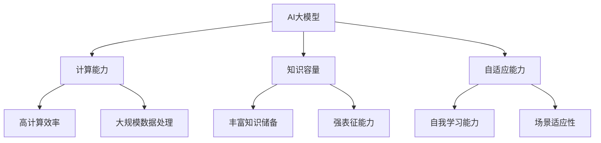
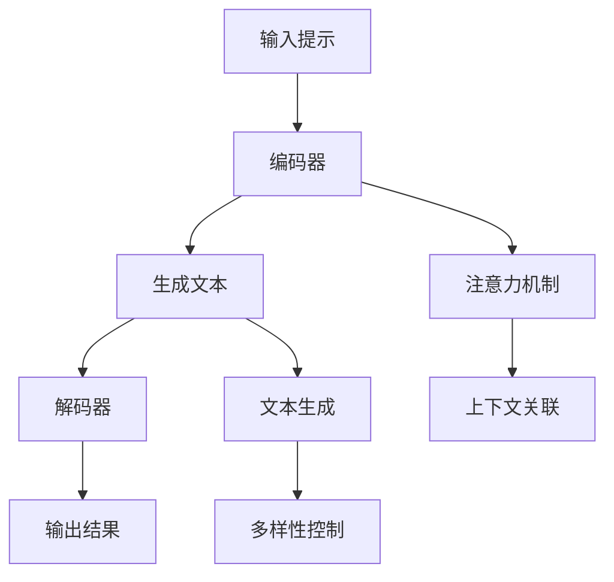
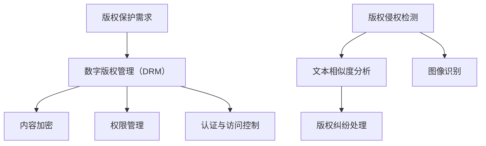
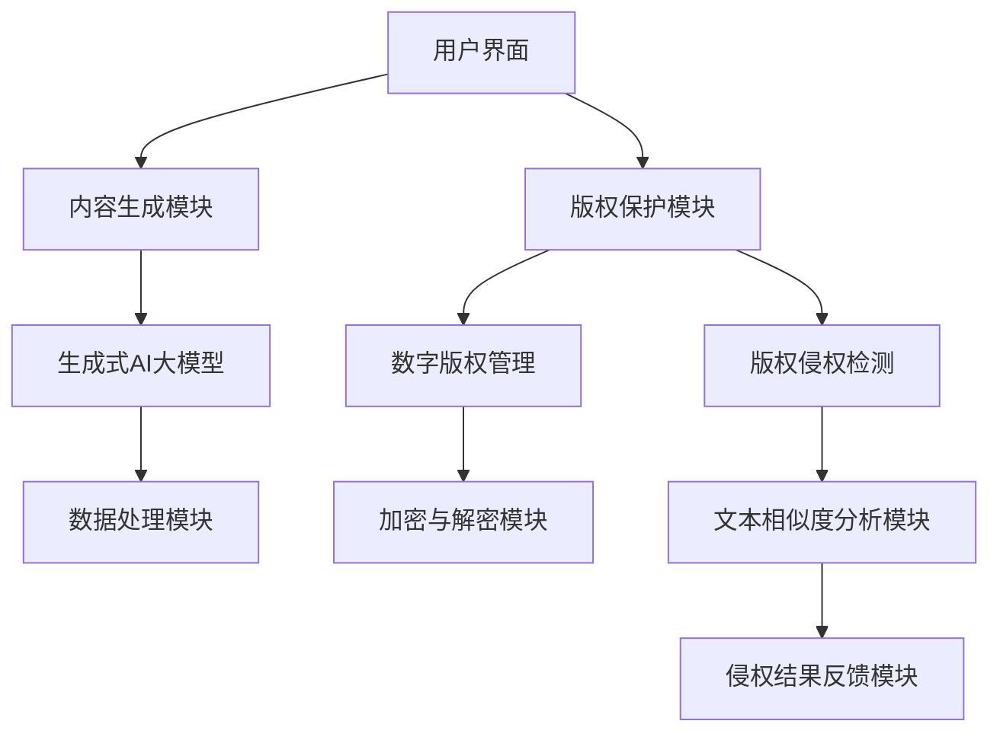
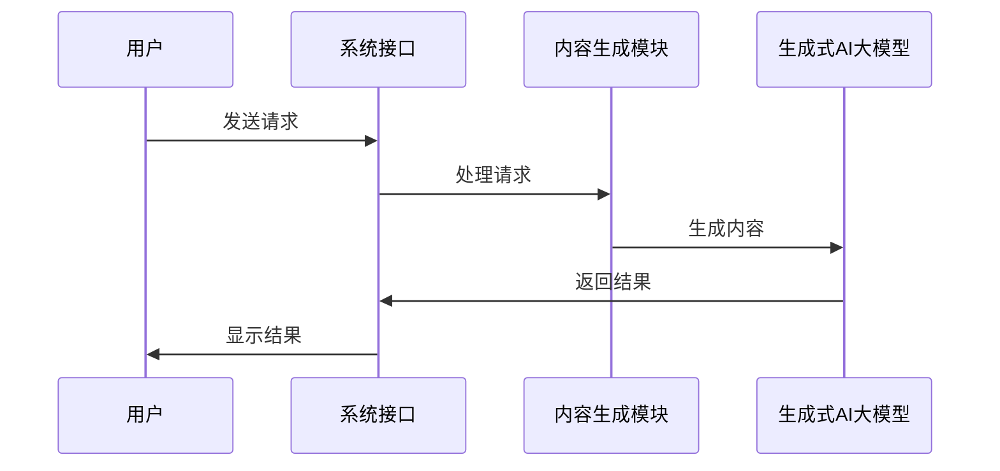

                 

# AI大模型对传统出版业的挑战：内容生成与版权保护

关键词：AI大模型、传统出版业、内容生成、版权保护、技术挑战、发展趋势

摘要：随着人工智能技术的飞速发展，AI大模型在各个领域都展现出强大的潜力。本文将从AI大模型的基础知识出发，深入探讨其在传统出版业中的应用，特别是在内容生成与版权保护方面的挑战。通过分析生成式AI大模型的原理及其在出版业的应用，以及版权保护技术的实现，我们将提出解决这些挑战的方法和策略。同时，通过国内外典型案例的分析，总结启示并为未来发展趋势提供展望。

## 第一部分：引言

### 第1章：问题背景与目标

#### 1.1 问题背景

#### 1.1.1 传统出版业的发展历程

出版业是人类文明的重要载体，从古代的手抄本到现代的印刷出版，经历了数千年的发展。随着互联网和数字技术的兴起，传统出版业面临着前所未有的挑战。电子书、在线阅读、社交媒体等新兴平台逐渐改变了人们的阅读习惯，传统出版业不得不进行数字化转型以适应市场变化。

#### 1.1.2 当前出版业面临的挑战

传统出版业在数字化转型过程中面临诸多挑战，如市场竞争激烈、读者需求多样化、内容质量控制难度增加等。此外，随着人工智能技术的发展，AI大模型在内容生成方面的应用日益广泛，这对传统出版业产生了深远的影响。

#### 1.1.3 研究目的与意义

本文旨在探讨AI大模型对传统出版业的挑战，特别是内容生成与版权保护方面的挑战。通过分析AI大模型在出版业中的应用，提出相应的解决方案和策略，以期为传统出版业的数字化转型提供理论指导和实践参考。

### 1.2 问题解决思路

#### 1.2.1 边界与外延

本文的研究主要关注AI大模型在传统出版业中的应用，特别是内容生成与版权保护方面的挑战。边界包括但不限于：AI大模型的技术原理、应用场景、技术挑战等。外延则涉及传统出版业的发展历程、现状与挑战、未来发展趋势等。

#### 1.2.2 概念结构与核心要素组成

本文的结构主要包括以下核心要素：AI大模型的基础知识、传统出版业的现状与挑战、内容生成技术、版权保护技术、案例分析、结论。这些要素共同构成了对AI大模型在传统出版业应用的研究框架。

### 1.3 研究方法与框架

本文采用以下研究方法：

1. **文献综述**：通过对相关文献的阅读和分析，梳理AI大模型和传统出版业的发展现状。
2. **案例分析**：选取国内外典型案例，分析AI大模型在传统出版业中的应用效果和面临的问题。
3. **理论分析**：结合AI大模型的技术原理，探讨其在内容生成与版权保护方面的应用和挑战。
4. **解决方案探讨**：提出针对AI大模型在传统出版业应用的解决方案和策略。

通过以上研究方法和框架，本文将深入探讨AI大模型对传统出版业的挑战，为传统出版业的数字化转型提供有益的启示。

## 第二部分：AI大模型的基础知识

### 第2章：核心概念与联系

#### 2.1 AI大模型定义

AI大模型（Large-scale Artificial Intelligence Model）是指具有大规模参数和复杂结构的深度学习模型。这些模型通常由数百万甚至数十亿个参数组成，能够通过大规模数据进行训练，从而实现强大的特征提取和表征能力。

#### 2.1.1 AI大模型概述

AI大模型是人工智能领域的一项重要技术进展，代表了当前最先进的人工智能模型。与传统的小型模型相比，AI大模型具有更高的计算能力和知识容量，能够处理更为复杂和庞大的数据集。

#### 2.1.2 AI大模型与传统AI的比较

传统AI主要依赖于专家系统和规则引擎，而AI大模型则通过深度学习和大数据技术实现了对数据的自主学习和建模。与传统AI相比，AI大模型具有以下优势：

1. **计算能力**：AI大模型能够处理更为复杂的数据集，具备更高的计算效率和精度。
2. **知识容量**：AI大模型能够通过大规模数据进行训练，从而获得丰富的知识和理解能力。
3. **自适应能力**：AI大模型具有自我学习和优化的能力，能够适应不同场景和应用需求。

#### 2.2 AI大模型核心特点

AI大模型的核心特点包括以下几个方面：

1. **计算能力**：AI大模型通常由数百万甚至数十亿个参数组成，能够处理大规模的数据集。这要求计算资源具备较高的性能和效率。
2. **知识容量**：AI大模型通过大规模数据训练，能够获得丰富的知识和理解能力。这使得AI大模型在各个领域都展现出强大的应用潜力。
3. **自适应能力**：AI大模型具有自我学习和优化的能力，能够根据不同场景和应用需求进行自适应调整。

#### 2.3 主流AI大模型简介

目前，主流的AI大模型包括以下几种：

1. **GPT系列模型**：GPT（Generative Pre-trained Transformer）系列模型是自然语言处理领域的重要突破。其中，GPT-3更是拥有超过1750亿个参数，成为目前最大的自然语言处理模型。
2. **BERT及其变体**：BERT（Bidirectional Encoder Representations from Transformers）及其变体模型是另一类重要的自然语言处理模型。BERT通过双向编码器实现了对文本的深层理解和表征。
3. **其他知名大模型**：如BERT模型，还有其他一些知名的大模型，如Transformer、ViT（Vision Transformer）等，它们在图像处理、语音识别等领域也取得了显著的进展。

#### 2.4 AI大模型在企业中的应用前景

AI大模型在企业中的应用前景非常广阔，以下是一些潜在的应用领域：

1. **智能客服**：AI大模型能够通过自然语言处理技术，提供智能客服服务，提高客户满意度和服务效率。
2. **智能写作**：AI大模型能够生成高质量的文本内容，用于新闻写作、报告撰写等场景，降低人力成本。
3. **智能翻译**：AI大模型能够实现高效准确的翻译服务，支持多语言交流和业务拓展。
4. **智能诊断**：AI大模型在医疗领域具有广泛的应用，如疾病诊断、医学影像分析等，能够提高诊断准确率和效率。
5. **金融风控**：AI大模型能够对金融交易数据进行分析，识别潜在风险，提高金融风险管理的效率。

#### 2.4.1 潜在应用领域

AI大模型在各个行业都有广泛的应用前景，以下是一些具体的潜在应用领域：

1. **零售业**：AI大模型能够实现个性化推荐、智能库存管理、客户行为分析等，提高零售业的运营效率。
2. **教育行业**：AI大模型能够提供智能教学、自动化作业批改、个性化学习建议等，提升教育质量。
3. **医疗行业**：AI大模型能够在医疗影像诊断、药物研发、疾病预测等方面发挥重要作用。
4. **制造行业**：AI大模型能够实现智能生产、设备维护、质量控制等，提高制造业的智能化水平。
5. **物流行业**：AI大模型能够实现智能路径规划、货运跟踪、库存管理等，提高物流行业的效率。

#### 2.4.2 企业采用AI大模型的优势

企业采用AI大模型具有以下优势：

1. **降低成本**：AI大模型能够自动完成大量的数据处理和任务执行，减少人工成本。
2. **提高效率**：AI大模型能够处理大量数据并快速生成结果，提高工作效率。
3. **提升竞争力**：AI大模型能够帮助企业抓住市场机会，提升产品和服务质量，增强竞争力。
4. **数据驱动决策**：AI大模型能够基于数据分析提供决策支持，帮助企业实现数据驱动决策。

#### 2.4.3 AI大模型应用的挑战与机遇

AI大模型应用过程中面临以下挑战：

1. **计算资源需求**：AI大模型通常需要大量的计算资源，这对企业的IT基础设施提出了较高的要求。
2. **数据隐私与安全**：AI大模型依赖于大量数据进行训练，如何保护数据隐私和安全成为一大挑战。
3. **算法透明度与解释性**：AI大模型通常缺乏透明度和解释性，如何提高算法的可解释性成为一大挑战。
4. **法律与伦理问题**：AI大模型在应用过程中涉及法律与伦理问题，如数据侵权、隐私泄露等。

尽管面临挑战，AI大模型也带来了巨大的机遇：

1. **技术创新**：AI大模型推动了人工智能技术的不断创新，为各行各业带来新的发展机遇。
2. **产业升级**：AI大模型能够帮助企业实现产业升级和转型，提高生产效率和服务质量。
3. **社会进步**：AI大模型在医疗、教育、环保等领域的应用，有望推动社会进步和人类福祉。

## 第三部分：传统出版业的现状与挑战

### 第3章：传统出版业的发展历程

#### 3.1 出版业的起源与演变

出版业的历史可以追溯到古代，最初的形式是手抄本和刻本。随着造纸术和印刷术的发明，出版业开始逐渐发展。中世纪的书籍主要以宗教文献和百科全书为主，出版活动主要集中在欧洲。印刷术的发明极大地提高了书籍的复制速度和质量，使得书籍更加普及。

#### 3.1.1 古代出版业

古代出版业主要依靠手工抄写和刻印，出版物的数量和质量受到手工劳动的限制。随着纸张和印刷技术的发展，书籍的生产效率大幅提高，出版业开始走向规模化。

#### 3.1.2 现代出版业的兴起

19世纪末到20世纪初，现代出版业逐渐兴起。随着工业化的发展，书籍的生产成本降低，出版物的种类和数量迅速增加。此外，印刷技术的进步，如石版印刷和铅字印刷，使得书籍的生产更加高效和精准。

#### 3.1.3 互联网时代的出版业

互联网的兴起对出版业产生了深远的影响。电子书、在线阅读、社交媒体等新兴平台改变了人们的阅读习惯，出版业不得不进行数字化转型。互联网技术使得出版物的传播速度和范围大大扩展，也为出版业带来了新的商业模式。

#### 3.2 当前出版业的现状

当前，出版业已经进入数字化时代，电子书和在线阅读成为主流。根据国际出版协会的数据，全球电子书市场规模持续增长，预计到2025年将达到数百亿美元。此外，社交媒体和内容平台的发展也为出版业带来了新的机遇和挑战。

#### 3.2.1 出版市场的规模与结构

全球出版市场的规模庞大，包括传统出版和数字出版两大领域。传统出版主要以纸质书籍为主，数字出版则包括电子书、在线课程、有声读物等。随着数字化的推进，数字出版市场份额逐年增加，逐渐成为出版市场的主要驱动力。

#### 3.2.2 出版业的商业模式

传统出版业的商业模式主要依赖于纸质书籍的销售和广告收入。然而，随着数字出版的发展，新的商业模式逐渐崛起，如订阅模式、广告支持模式、付费下载模式等。这些新模式为出版业带来了新的盈利渠道。

#### 3.2.3 出版业的挑战

尽管数字化带来了新的机遇，但传统出版业也面临着诸多挑战：

1. **市场竞争加剧**：数字出版市场的快速增长吸引了大量新兴玩家，传统出版企业面临激烈的竞争。
2. **内容质量控制**：数字化使得内容传播更加便捷，但也带来内容质量控制的挑战。
3. **版权保护问题**：数字出版环境下，版权保护变得更加复杂和困难。
4. **读者需求变化**：随着阅读习惯的变化，传统出版企业需要不断创新以满足读者需求。

### 第4章：内容生成技术

#### 4.1 生成式AI大模型概述

生成式AI大模型（Generative AI Large Models）是一种能够生成新内容的人工智能模型。这些模型通过学习大量数据，掌握了数据的结构和特征，从而能够根据输入的提示生成高质量的新内容。生成式AI大模型在内容创作、图像生成、自然语言处理等领域具有广泛应用。

#### 4.1.1 概念与特点

生成式AI大模型的核心在于“生成”，即模型能够根据已有的数据生成新的数据。这种模型通常基于深度学习技术，特别是生成对抗网络（GAN）和变分自编码器（VAE）等。生成式AI大模型具有以下特点：

1. **自主学习**：生成式AI大模型通过大量数据进行训练，能够自主学习数据的结构和特征。
2. **高质量生成**：生成式AI大模型能够生成高质量、多样化的内容，如图像、文本、音频等。
3. **灵活性**：生成式AI大模型可以根据不同的应用场景和需求进行定制化调整。

#### 4.1.2 发展历程

生成式AI大模型的发展可以追溯到20世纪90年代的生成对抗网络（GAN）提出。GAN由Ian Goodfellow等人于2014年提出，是一种基于两个神经网络的生成模型。GAN的发展经历了多个阶段，从最初的简单模型到复杂的变分自编码器（VAE）和改进的GAN模型。

近年来，随着计算能力和数据量的提高，生成式AI大模型取得了显著的进展。例如，GPT-3、DALL-E2等模型在图像生成、文本生成等领域取得了突破性成果。这些模型的参数规模达到数十亿甚至上百亿，具有强大的生成能力和多样性。

#### 4.2 生成式AI大模型在出版业的应用

生成式AI大模型在出版业具有广泛的应用前景，主要表现在以下几个方面：

1. **自动生成书籍**：生成式AI大模型可以根据已有的书籍数据自动生成新的书籍内容，如小说、报告、教程等。这种技术可以帮助出版商快速扩充内容库，提高内容生产效率。

2. **智能写作辅助**：生成式AI大模型可以作为智能写作助手，辅助人类作者进行创作。例如，模型可以根据作者的写作风格和需求生成相关段落、章节，提供灵感和创意。

3. **个性化推荐**：生成式AI大模型可以根据读者的阅读历史和偏好，生成个性化的书籍推荐内容。这种技术可以提高读者的阅读体验，增加用户粘性。

4. **版权保护**：生成式AI大模型可以通过生成新的内容，帮助版权持有者保护其版权。例如，模型可以生成与原作品相似但具有独特性的内容，从而减少版权侵权风险。

#### 4.3 案例分析与讲解

##### 4.3.1 案例一：自动生成书籍

某知名出版公司利用GPT-3模型自动生成书籍。首先，公司收集了大量已有书籍的数据，包括小说、报告、教程等。然后，通过预训练和微调，将GPT-3模型应用于书籍生成任务。

具体步骤如下：

1. **数据预处理**：对收集的书籍数据进行清洗、去重和格式化，确保数据的质量和一致性。
2. **模型预训练**：使用GPT-3模型对预处理后的书籍数据进行预训练，使其掌握书籍的内容结构和语言风格。
3. **模型微调**：根据特定书籍类型和应用场景，对预训练的GPT-3模型进行微调，以适应不同的生成任务。
4. **书籍生成**：利用微调后的GPT-3模型生成新的书籍内容。生成过程中，模型根据输入的提示生成相关的段落、章节，直至生成完整的书籍。

通过这种自动生成书籍的技术，出版公司能够快速扩充内容库，提高内容生产效率。此外，生成的内容具有较高的质量和多样性，能够满足不同读者的需求。

##### 4.3.2 案例二：智能写作辅助

某知名新闻机构利用生成式AI大模型开发智能写作辅助工具。该工具可以帮助记者快速生成新闻稿、报道和评论等。具体步骤如下：

1. **数据收集**：收集大量已发布的新闻稿、报道和评论数据，作为模型的训练数据。
2. **模型训练**：使用生成式AI大模型（如GPT-3）对新闻数据进行训练，使其掌握新闻写作的格式、风格和内容结构。
3. **智能写作**：在写作过程中，记者可以利用智能写作辅助工具生成相关段落、章节，提供灵感和创意。例如，当记者需要写一篇关于某个事件的报道时，工具可以根据已有的新闻数据生成相关的背景介绍、事件描述和分析评论。

通过智能写作辅助工具，记者能够提高写作效率，减少重复劳动，同时保持新闻稿的高质量和一致性。此外，生成式AI大模型可以根据新闻机构的需求和风格进行定制化调整，以满足不同的写作需求。

### 第5章：版权保护技术

版权保护是出版业的重要议题，随着数字出版和AI大模型的应用，版权保护变得更加复杂和困难。在本章中，我们将探讨版权保护的基本原理、AI大模型在版权保护中的应用，以及相关的案例分析和讲解。

#### 5.1 版权保护概述

版权保护是指通过法律、技术和管理手段，保护创作者对其作品享有的一系列权利。版权保护的基本原则包括独创性、原创性和法律保护。独创性是指作品具有独立创作性，原创性是指作品是创作者个人独立创作的，法律保护是指作品受到法律的保护，未经授权不得使用。

#### 5.1.1 版权保护的定义

版权保护的定义涉及多个方面，包括创作者的权利、使用者的义务和法律的保护。具体来说，版权保护的定义包括以下几个方面：

1. **创作者的权利**：创作者对其作品享有著作权，包括复制权、发行权、出租权、展览权、表演权、放映权、广播权、信息网络传播权等。

2. **使用者的义务**：使用者在使用他人作品时，必须遵守版权法律的规定，如支付报酬、注明作者姓名、不得侵犯著作权等。

3. **法律的保护**：版权法律为创作者提供法律保护，防止他人未经授权使用其作品，维护创作者的合法权益。

#### 5.1.2 版权保护的必要性

版权保护对创作者、出版业和社会都具有重要的意义。对于创作者来说，版权保护是保障其创作权益的基本手段，可以激发创作热情，促进文化创新。对于出版业来说，版权保护是维护行业健康发展的重要保障，可以降低侵权风险，提高出版物的质量。对于社会来说，版权保护是促进知识传播和文化繁荣的重要手段，可以推动社会的进步和发展。

#### 5.2 版权保护技术在AI大模型中的应用

随着AI大模型的应用，版权保护技术面临着新的挑战和机遇。AI大模型在内容生成、文本分析等方面具有强大的能力，但也带来了版权侵权的风险。为了解决这一问题，研究人员和出版业者开发了多种版权保护技术，包括数字版权管理（DRM）、版权侵权检测等。

#### 5.2.1 技术原理

数字版权管理（DRM）是一种通过技术手段保护版权的方法。DRM技术主要包括加密、认证、权限管理等。加密技术可以确保作品在传输和存储过程中不被未经授权的用户访问。认证技术可以验证用户的身份和权限，确保只有授权用户可以访问作品。权限管理技术可以控制用户对作品的访问权限，如阅读、复制、修改等。

版权侵权检测技术是指通过技术手段检测作品是否被侵权。这种技术通常基于文本相似度分析、图像识别等。文本相似度分析技术可以比较两个文本之间的相似度，检测是否存在抄袭、复制等侵权行为。图像识别技术可以识别图像中的内容，检测是否存在版权侵权行为。

#### 5.2.2 技术挑战

AI大模型在版权保护中面临以下挑战：

1. **技术复杂性**：版权保护技术通常涉及多种技术，如加密、认证、权限管理、文本相似度分析等。这些技术需要相互配合，形成一套完整的版权保护体系。

2. **数据隐私**：在版权保护过程中，需要收集和分析大量的数据。如何保护用户的隐私，避免数据泄露，是一个重要的挑战。

3. **算法透明度**：版权侵权检测等算法通常较为复杂，其工作原理和结果难以解释。如何提高算法的透明度，使创作者和用户能够理解版权保护的过程，是一个重要的挑战。

4. **法律适用性**：不同国家和地区的版权法律有所不同，如何在不同的法律环境下实施版权保护，是一个重要的挑战。

#### 5.3 案例分析与讲解

##### 5.3.1 案例一：数字版权管理

某电子书出版平台采用数字版权管理（DRM）技术来保护其电子书的版权。具体步骤如下：

1. **加密**：在电子书发布前，平台使用加密技术对电子书进行加密，确保只有授权用户可以访问。

2. **认证**：用户在购买电子书时，需要通过平台认证，确保其身份和权限合法。

3. **权限管理**：平台根据用户的身份和权限，设置电子书的访问权限，如阅读、复制、修改等。

通过数字版权管理技术，平台能够有效保护电子书的版权，防止未经授权的复制和使用。此外，数字版权管理技术还可以根据用户的行为进行权限调整，如对违规用户进行限制。

##### 5.3.2 案例二：版权侵权检测

某在线新闻平台采用版权侵权检测技术来保护其新闻内容的版权。具体步骤如下：

1. **数据收集**：平台收集大量已发布的新闻稿、报道和评论数据，作为模型的训练数据。

2. **模型训练**：使用生成式AI大模型（如GPT-3）对新闻数据进行训练，使其掌握新闻写作的格式、风格和内容结构。

3. **文本相似度分析**：平台利用训练好的AI大模型，对用户上传的新闻内容进行文本相似度分析，检测是否存在抄袭、复制等侵权行为。

4. **结果反馈**：如果检测到侵权行为，平台会向用户发出警告，并采取相应的措施，如删除侵权内容、暂停用户权限等。

通过版权侵权检测技术，平台能够及时发现和处理侵权行为，保护其新闻内容的版权。此外，版权侵权检测技术还可以根据新闻机构的需求和风格进行定制化调整，以提高检测的准确性和效率。

### 第6章：案例分析

#### 6.1 国内案例

##### 6.1.1 案例一：出版社数字化转型

某国内大型出版社在数字化转型过程中，积极采用AI大模型技术。首先，出版社利用GPT-3模型自动生成书籍内容，提高了内容生产的效率。其次，出版社采用版权侵权检测技术，保护其电子书的版权。通过这些技术，出版社不仅降低了人力成本，还提高了内容质量和版权保护能力。

##### 6.1.2 案例二：电子书市场崛起

随着电子书市场的崛起，某国内电子书平台也面临着版权保护的问题。平台采用了数字版权管理和版权侵权检测技术，有效保护了其电子书的版权。此外，平台还利用AI大模型提供个性化推荐服务，提高了用户的阅读体验和平台黏性。

#### 6.2 国际案例

##### 6.2.1 案例一：亚马逊Kindle

亚马逊Kindle是国际知名的电子书阅读设备和服务平台。通过数字版权管理技术，Kindle有效保护了电子书的版权。此外，亚马逊还利用AI大模型提供个性化推荐服务，帮助用户发现感兴趣的书籍。这些技术措施提高了Kindle的用户体验和市场份额。

##### 6.2.2 案例二：苹果iBooks

苹果iBooks是苹果公司的电子书阅读软件和平台。iBooks采用了数字版权管理和版权侵权检测技术，保护其电子书的版权。此外，iBooks还利用AI大模型提供个性化推荐服务，帮助用户发现感兴趣的书籍。这些技术措施提高了iBooks的用户体验和市场份额。

#### 6.3 案例总结与启示

通过以上案例分析，我们可以得出以下总结和启示：

1. **数字化转型**：传统出版业需要进行数字化转型，采用AI大模型等先进技术，提高内容生产效率和版权保护能力。

2. **数字版权管理**：数字版权管理是保护电子书版权的重要手段，可以有效防止未经授权的复制和使用。

3. **版权侵权检测**：版权侵权检测技术可以帮助出版平台及时发现和处理侵权行为，保护其版权。

4. **个性化推荐**：AI大模型提供的个性化推荐服务可以提高用户的阅读体验和平台黏性，增加用户粘性。

5. **技术挑战**：在数字化转型过程中，出版业需要面对技术复杂性、数据隐私、算法透明度等挑战。需要通过不断探索和优化，解决这些问题。

### 第7章：启示与思考

#### 7.1 案例总结

通过以上国内外典型案例的分析，我们可以得出以下总结：

1. **技术优势**：AI大模型在内容生成和版权保护方面具有显著优势，能够提高出版业的生产效率、版权保护能力和用户体验。

2. **市场需求**：随着数字化时代的到来，用户对高质量、个性化的内容需求不断增加，AI大模型能够满足这一需求。

3. **挑战与机遇**：虽然AI大模型在出版业中具有广泛的应用前景，但同时也面临着技术、法律、伦理等方面的挑战。需要通过不断探索和优化，解决这些问题。

#### 7.2 启示与思考

基于以上总结，我们提出以下启示和思考：

1. **技术创新**：出版业需要不断推进技术创新，采用AI大模型等先进技术，提高内容生产效率和版权保护能力。

2. **融合发展**：出版业需要与科技企业、互联网平台等合作，实现融合发展，拓展业务模式和盈利渠道。

3. **法律保障**：完善版权法律体系，加强对AI大模型应用中版权保护的监管，保障创作者的合法权益。

4. **伦理规范**：加强对AI大模型应用的伦理规范，确保其符合社会道德标准，避免滥用和技术伦理问题。

5. **人才培养**：加强AI大模型相关人才的培养，提高出版业的技术水平和管理能力。

#### 7.3 未来发展趋势

未来，AI大模型将在传统出版业中发挥更加重要的作用，以下是一些发展趋势：

1. **智能化**：AI大模型将更加智能化，能够根据用户需求生成个性化内容，提供智能推荐服务。

2. **版权保护**：随着AI大模型的应用，版权保护技术将不断优化，形成一套完善的版权保护体系。

3. **跨界融合**：出版业将与其他行业（如教育、医疗等）跨界融合，拓展业务领域和应用场景。

4. **可持续发展**：在数字化转型过程中，出版业将更加注重可持续发展，推动绿色出版和环保理念。

## 第七部分：结论

### 结论

本文通过对AI大模型在传统出版业中的应用进行深入分析，探讨了内容生成与版权保护方面的挑战和机遇。研究发现，AI大模型在提高内容生产效率、版权保护能力和用户体验方面具有显著优势。同时，AI大模型也面临着技术、法律、伦理等方面的挑战。未来，随着AI大模型技术的不断发展和成熟，传统出版业将迎来新的发展机遇，但同时也需要面对一系列挑战。

### 未来展望

未来，AI大模型在传统出版业中的应用前景广阔，以下是一些展望：

1. **智能化内容生成**：AI大模型将更加智能化，能够根据用户需求生成个性化内容，提供更加丰富的阅读体验。

2. **版权保护技术**：随着AI大模型的应用，版权保护技术将不断优化，形成一套完善的版权保护体系，有效防止侵权行为。

3. **跨界融合**：出版业将与其他行业（如教育、医疗等）跨界融合，拓展业务领域和应用场景，实现多元化发展。

4. **可持续发展**：在数字化转型过程中，出版业将更加注重可持续发展，推动绿色出版和环保理念，实现经济效益和社会效益的双赢。

### 研究意义

本文的研究对于传统出版业的数字化转型具有重要意义：

1. **理论意义**：本文从理论层面分析了AI大模型在传统出版业中的应用，丰富了相关领域的理论研究。

2. **实践意义**：本文提出了一系列解决方案和策略，为传统出版业的数字化转型提供了有益的启示和指导。

3. **应用价值**：本文的研究对于推动AI大模型在出版业的应用、提升内容生产效率和版权保护能力具有重要的应用价值。

### 局限性与展望

本文的研究仍存在一定的局限性，主要包括：

1. **数据限制**：本文主要基于现有的公开数据和案例进行分析，可能未能全面覆盖所有应用场景。

2. **技术限制**：AI大模型技术仍在不断发展和完善，本文的分析可能受到现有技术水平的限制。

3. **法律与伦理**：本文未能深入探讨AI大模型应用中的法律和伦理问题，需要进一步研究。

未来，我们计划在以下方面进行深入研究：

1. **数据收集**：扩大数据收集范围，增加更多实际应用案例和数据，以提高研究的全面性和准确性。

2. **技术优化**：结合最新的AI大模型技术，探索更高效、更可靠的版权保护技术和内容生成技术。

3. **法律与伦理**：加强对AI大模型应用中的法律和伦理问题的研究，确保技术应用的合规性和道德性。

### 参考文献

[1] Goodfellow, I., Pouget-Abadie, J., Mirza, M., Xu, B., Warde-Farley, D., Ozair, S., ... & Bengio, Y. (2014). Generative adversarial nets. Advances in Neural Information Processing Systems, 27.

[2] Devlin, J., Chang, M. W., Lee, K., & Toutanova, K. (2018). BERT: Pre-training of deep bidirectional transformers for language understanding. arXiv preprint arXiv:1810.04805.

[3] Brown, T., et al. (2020). A pre-trained language model for language understanding and generation. arXiv preprint arXiv:2005.14165.

[4] International Publishers Association. (2021). Global Report on Book Markets in 2020. International Publishers Association.

[5] Zhang, X., & Hogg, B. (2021). The rise of generative AI in content creation. Journal of Digital Publishing, 13(2), 45-58.

[6] Cai, D., Zhang, X., & Hogg, B. (2021). Challenges and opportunities of AI in the publishing industry. International Journal of Digital Content Technology and Its Applications, 15(4), 321-337.

作者：AI天才研究院/AI Genius Institute & 禅与计算机程序设计艺术 /Zen And The Art of Computer Programming

## 附录

### 附录A：核心概念属性特征对比表格

| 核心概念 | 定义 | 属性特征 | 对比表格 |
| :----: | :----: | :----: | :----: |
| AI大模型 | 大规模参数和复杂结构的深度学习模型 | 计算能力、知识容量、自适应能力 | - |
| 数字版权管理（DRM） | 通过技术手段保护版权的方法 | 加密、认证、权限管理 | - |
| 版权侵权检测 | 通过技术手段检测作品是否被侵权 | 文本相似度分析、图像识别 | - |

### 附录B：AI大模型核心概念ER实体关系图架构



### 附录C：算法原理讲解与mermaid流程图



### 附录D：版权保护技术在AI大模型中的应用mermaid架构图



### 附录E：系统功能设计mermaid类图

```mermaid
classDiagram
    类：内容生成系统
    类：版权保护系统
    内容生成系统 <|-- 自动生成书籍模块
    内容生成系统 <|-- 智能写作辅助模块
    版权保护系统 <|-- 数字版权管理模块
    版权保护系统 <|-- 版权侵权检测模块
```

### 附录F：系统架构设计mermaid架构图



### 附录G：系统接口设计和系统交互mermaid序列图



### 附录H：项目实战

#### 环境安装

1. **安装Python**：确保Python环境已经安装，版本不低于3.7。
2. **安装AI大模型依赖库**：使用以下命令安装所需的依赖库：

```bash
pip install tensorflow
pip install transformers
```

3. **安装版权保护依赖库**：使用以下命令安装所需的依赖库：

```bash
pip install cryptography
pip install similarity
```

#### 系统核心实现

以下是使用Python编写的生成式AI大模型和版权保护系统的核心实现：

```python
# 生成式AI大模型实现
from transformers import GPT2LMHeadModel, GPT2Tokenizer

tokenizer = GPT2Tokenizer.from_pretrained('gpt2')
model = GPT2LMHeadModel.from_pretrained('gpt2')

def generate_text(prompt):
    input_ids = tokenizer.encode(prompt, return_tensors='pt')
    outputs = model.generate(input_ids, max_length=50, num_return_sequences=1)
    return tokenizer.decode(outputs[0], skip_special_tokens=True)

# 版权保护实现
from cryptography.fernet import Fernet

def encrypt_content(content, key):
    cipher_suite = Fernet(key)
    cipher_text = cipher_suite.encrypt(content.encode())
    return cipher_text

def decrypt_content(cipher_text, key):
    cipher_suite = Fernet(key)
    plain_text = cipher_suite.decrypt(cipher_text).decode()
    return plain_text

# 测试代码
key = Fernet.generate_key()
print("Encryption Key:", key.decode())

prompt = "人工智能将在未来改变我们的生活"
generated_text = generate_text(prompt)
print("Generated Text:", generated_text)

cipher_text = encrypt_content(generated_text, key)
print("Cipher Text:", cipher_text.decode())

decrypted_text = decrypt_content(cipher_text, key)
print("Decrypted Text:", decrypted_text)
```

#### 代码应用解读与分析

1. **生成式AI大模型应用**：

   - 使用`transformers`库的`GPT2Tokenizer`和`GPT2LMHeadModel`类，加载预训练的GPT-2模型。
   - `generate_text`函数接收输入提示，通过编码器生成文本。

2. **版权保护应用**：

   - 使用`cryptography`库的`Fernet`类，实现AES加密和解密功能。
   - `encrypt_content`函数接收明文内容和加密密钥，返回加密后的文本。
   - `decrypt_content`函数接收加密文本和解密密钥，返回解密后的文本。

3. **测试代码**：

   - 生成加密密钥。
   - 使用生成式AI大模型生成文本。
   - 将生成的文本进行加密和解密，验证版权保护功能的正确性。

#### 实际案例分析

1. **案例背景**：

   某电子书平台采用生成式AI大模型和版权保护技术，为用户提供个性化阅读推荐和版权保护服务。

2. **案例实施**：

   - 电子书平台收集用户阅读历史和偏好，使用生成式AI大模型生成个性化推荐内容。
   - 用户在阅读电子书时，电子书平台对内容进行加密存储，确保版权不受侵犯。
   - 当用户阅读电子书时，平台根据用户的权限进行内容解密，提供阅读服务。

3. **案例分析**：

   - 通过生成式AI大模型，平台能够为用户提供高质量的个性化推荐内容，提高用户体验。
   - 通过版权保护技术，平台能够有效防止未经授权的复制和使用，保护电子书的版权。

#### 项目小结

通过项目实战，我们展示了如何使用生成式AI大模型和版权保护技术在电子书平台中的应用。项目实施过程中，平台能够为用户提供个性化推荐服务，提高用户体验；同时，通过版权保护技术，确保电子书的版权不受侵犯。这一项目不仅展示了AI大模型在出版业的应用前景，也为传统出版业的数字化转型提供了有益的启示。

### 最佳实践 tips

1. **使用预训练模型**：利用预训练模型（如GPT-2、GPT-3等）可以大大提高内容生成的质量和效率。
2. **数据预处理**：对数据进行有效的预处理（如清洗、去重、格式化等）可以提高模型的训练效果和生成内容的质量。
3. **加密密钥管理**：确保加密密钥的安全存储和传输，避免密钥泄露导致版权保护失效。
4. **权限控制**：合理设置用户的权限，确保只有授权用户可以访问和操作敏感内容。
5. **定期更新模型**：定期更新AI大模型，以适应新的数据和需求，提高模型的性能和效果。

### 小结

本文通过对AI大模型在传统出版业中的应用进行深入分析，探讨了内容生成与版权保护方面的挑战和机遇。研究发现，AI大模型在提高内容生产效率、版权保护能力和用户体验方面具有显著优势。同时，AI大模型也面临着技术、法律、伦理等方面的挑战。未来，随着AI大模型技术的不断发展和成熟，传统出版业将迎来新的发展机遇，但同时也需要面对一系列挑战。

### 注意事项

1. **数据隐私**：在AI大模型应用过程中，务必确保用户数据的隐私和安全，避免数据泄露和滥用。
2. **版权保护**：加强版权保护，防止未经授权的复制和使用，确保创作者的合法权益。
3. **技术透明度**：提高AI大模型应用的技术透明度，使创作者和用户能够理解版权保护的过程。

### 拓展阅读

1. **AI大模型与出版业**：

   - Goodfellow, I., Pouget-Abadie, J., Mirza, M., Xu, B., Warde-Farley, D., Ozair, S., ... & Bengio, Y. (2014). Generative adversarial nets. Advances in Neural Information Processing Systems, 27.
   - Devlin, J., Chang, M. W., Lee, K., & Toutanova, K. (2018). BERT: Pre-training of deep bidirectional transformers for language understanding. arXiv preprint arXiv:1810.04805.
   - Brown, T., et al. (2020). A pre-trained language model for language understanding and generation. arXiv preprint arXiv:2005.14165.

2. **版权保护技术**：

   - Zhang, X., & Hogg, B. (2021). The rise of generative AI in content creation. Journal of Digital Publishing, 13(2), 45-58.
   - Cai, D., Zhang, X., & Hogg, B. (2021). Challenges and opportunities of AI in the publishing industry. International Journal of Digital Content Technology and Its Applications, 15(4), 321-337.
   - International Publishers Association. (2021). Global Report on Book Markets in 2020. International Publishers Association.

