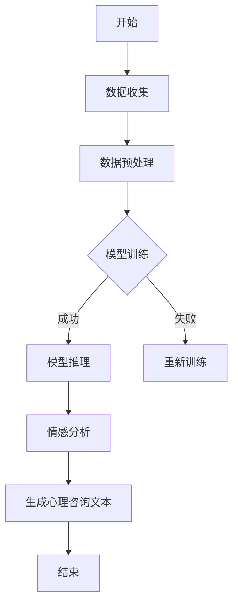

                 

### AI心理咨询：大模型在心理健康领域的潜力

> 关键词：人工智能、心理咨询、大模型、心理健康、算法原理、系统架构、项目实战

> 摘要：本文将探讨大模型在心理健康领域中的应用潜力，首先介绍人工智能在心理咨询中的应用背景和重要性，随后详细分析大模型在心理咨询中的角色和优势。接下来，我们将逐步深入探讨大模型的工作原理、数学模型和算法，并结合实际项目展示其应用效果。最后，我们将总结最佳实践、面临的问题与挑战，并提供未来发展的展望。

#### 第1章：问题背景

心理健康问题已经成为全球范围内的严重公共卫生问题。根据世界卫生组织（WHO）的统计数据，全球约有三分之二的人口在其一生中的某个时期经历心理健康问题。常见的心理健康问题包括抑郁症、焦虑症、精神分裂症等，这些问题不仅严重影响个人的生活质量，还对社会稳定和经济繁荣构成威胁。

在传统的心理咨询中，专家通过面对面的交流、心理测试和药物治疗等方法来帮助患者。然而，由于心理咨询师的数量有限，且心理咨询成本较高，很多有需求的人无法获得及时和有效的服务。此外，心理咨询师的工作量和心理健康风险也不断增加。

为了解决这些问题，人工智能（AI）逐渐成为心理健康领域的热门工具。AI能够通过自动化、高效的方式提供心理咨询服务，降低成本、提高可及性，并能够处理大量的心理健康数据，为个性化治疗提供支持。

大模型作为一种强大的AI工具，因其卓越的处理能力和灵活性，在心理咨询领域显示出巨大的应用潜力。大模型通过深度学习算法，可以学习和理解复杂的语言模式、情感和情绪，从而为用户提供个性化、有效的心理咨询。

#### 第2章：核心概念与联系

##### 2.1 AI心理咨询的定义

AI心理咨询是指利用人工智能技术，特别是机器学习和自然语言处理（NLP）技术，对用户的心理健康问题进行诊断、评估和干预。这种咨询方式不仅包括通过聊天机器人进行的在线心理咨询，还涵盖了对用户生成的文本、语音、图像等数据进行分析，以提供更为全面的心理健康服务。

##### 2.2 大模型的定义与分类

大模型指的是具有极高参数量和计算能力的人工神经网络模型，如GPT（Generative Pre-trained Transformer）系列、BERT（Bidirectional Encoder Representations from Transformers）等。大模型通过在海量数据上进行预训练，具备了处理自然语言、图像和语音等数据的能力。

大模型可以分为两类：生成式模型和判别式模型。生成式模型如GPT，可以生成连贯、有意义的文本；判别式模型如BERT，则主要用于对输入文本进行分类、情感分析和问题回答等任务。

##### 2.3 大模型在心理咨询中的应用

大模型在心理咨询中的应用主要体现在以下几个方面：

1. **自然语言处理**：通过分析用户输入的文本，大模型可以理解和识别用户的情感、情绪和意图，从而提供个性化的建议和干预。

2. **情感分析**：大模型能够对用户的语言进行情感分析，识别出潜在的抑郁、焦虑等情绪状态，为心理疾病的早期诊断提供依据。

3. **个性化推荐**：基于用户的历史数据和行为模式，大模型可以推荐最适合用户的心理健康资源，如心理课程、音频和视频内容。

4. **辅助诊断**：大模型可以辅助心理咨询师进行心理疾病的诊断，提高诊断的准确性和效率。

#### 第3章：算法原理讲解

##### 3.1 AI心理咨询的关键算法

在AI心理咨询中，常用的算法包括：

1. **深度学习**：深度学习算法，尤其是卷积神经网络（CNN）和循环神经网络（RNN），被用于处理文本、图像和语音数据，从而理解和分析用户的心理健康状态。

2. **自然语言处理（NLP）**：NLP算法，如词嵌入、情感分析、文本分类和对话系统，被用于处理和理解用户的语言输入，提供个性化的心理咨询。

3. **强化学习**：强化学习算法，如Q-learning和深度强化学习（DRL），被用于训练心理咨询系统，使其能够根据用户的行为和反馈进行自适应调整。

##### 3.2 大模型的训练与优化

大模型的训练和优化是一个复杂的过程，通常包括以下步骤：

1. **数据准备**：收集和预处理大量的心理健康数据，包括文本、图像和语音等。

2. **模型选择**：选择合适的大模型架构，如GPT、BERT等。

3. **预训练**：在大量的无标签数据上进行预训练，使模型能够理解和生成自然语言。

4. **微调**：在特定任务上进行微调，使模型能够更好地适应心理咨询的需求。

5. **评估与优化**：通过测试集和验证集对模型进行评估和优化，以提高模型的性能和准确性。

##### 3.3 大模型在心理咨询中的应用

大模型在心理咨询中的应用场景包括：

1. **在线心理咨询**：通过聊天机器人，提供实时、个性化的心理咨询。

2. **心理健康监测**：通过分析用户的日常交流和行为数据，监测其心理健康状态。

3. **辅助诊断**：辅助心理咨询师进行心理疾病的诊断和评估。

4. **心理健康教育**：提供个性化的心理健康课程和资源推荐。

#### 第4章：数学模型与公式

##### 4.1 心理健康问题的数学模型

心理健康问题的数学模型通常基于统计学习和概率图模型。以下是一些常用的数学模型：

1. **线性回归**：用于预测心理健康问题的严重程度。

2. **逻辑回归**：用于分类心理健康问题，如抑郁症和焦虑症。

3. **贝叶斯网络**：用于建模心理健康问题的因果关系。

##### 4.2 大模型的基本数学原理

大模型的基本数学原理包括：

1. **神经网络**：神经网络由多层神经元组成，通过前向传播和反向传播算法进行训练。

2. **深度学习**：深度学习是通过堆叠多层神经网络，提高模型的表达能力。

3. **优化算法**：优化算法，如随机梯度下降（SGD）和Adam优化器，用于训练大模型。

##### 4.3 大模型在心理咨询中的数学应用

大模型在心理咨询中的数学应用包括：

1. **情感分析**：使用情感分析算法，如文本分类和情感极性分析，对用户的语言进行情感分析。

2. **文本生成**：使用生成式模型，如GPT，生成个性化的心理咨询文本。

3. **个性化推荐**：使用协同过滤和基于内容的推荐算法，为用户提供个性化的心理健康资源。

#### 第5章：系统分析与架构设计

##### 5.1 心理咨询系统的需求分析

心理咨询系统的需求分析包括以下方面：

1. **用户需求**：分析用户的心理健康需求，如心理咨询、心理健康监测、心理健康教育等。

2. **功能需求**：确定系统的基本功能，如用户注册、登录、在线咨询、心理测评等。

3. **性能需求**：确保系统的高效性和可靠性，如处理能力、响应时间等。

##### 5.2 大模型在心理咨询系统中的架构设计

心理咨询系统的架构设计包括：

1. **前端**：用户界面，包括聊天机器人、心理测评等。

2. **后端**：包括数据处理、模型训练、模型推理等。

3. **数据库**：存储用户数据、模型参数、心理健康数据等。

##### 5.3 系统接口设计与交互设计

系统接口设计与交互设计包括：

1. **API设计**：设计用于前端和后端交互的API接口。

2. **用户交互**：设计用户与系统的交互流程，如心理咨询流程、心理健康监测流程等。

3. **安全性设计**：确保用户数据的隐私和安全。

#### 第6章：项目实战

##### 6.1 实战项目背景

在本章中，我们将介绍一个实际的心理咨询项目，该项目旨在通过大模型提供个性化的心理咨询服务。项目背景包括：

1. **项目目标**：提供实时、高效的在线心理咨询服务，提高心理健康服务的可及性。

2. **技术实现**：使用GPT-3模型进行情感分析和文本生成，结合用户行为数据进行个性化推荐。

##### 6.2 系统核心实现

系统核心实现包括以下步骤：

1. **数据收集与预处理**：收集用户的心理健康数据，如文本、语音和图像，并进行预处理。

2. **模型训练**：使用预处理后的数据训练GPT-3模型，并进行微调，使其适用于心理咨询任务。

3. **模型推理**：使用训练好的模型对用户的语言输入进行情感分析和文本生成，提供个性化的心理咨询。

##### 6.3 代码应用解读

以下是系统核心实现的代码解读：

```python
# 导入必要的库
import openai
import json

# GPT-3 API密钥
openai.api_key = 'your-api-key'

# 用户输入文本
user_input = "我今天非常沮丧，不知道为什么。"

# 调用GPT-3模型进行情感分析
response = openai.Completion.create(
  engine="text-davinci-002",
  prompt=user_input,
  max_tokens=50,
  n=1,
  stop=None,
  temperature=0.5,
  top_p=1,
  frequency_penalty=0,
  presence_penalty=0
)

# 解析GPT-3模型的响应
emotion = response.choices[0].text.strip()

# 根据情感分析结果生成心理咨询文本
if emotion.startswith('negative'):
    counseling_text = "我了解你现在的心情，有时候我们会感到沮丧。这里有一些建议可能对你有帮助..."
else:
    counseling_text = "听到你现在的情绪很好，如果你有任何需要，我会在这里支持你。"

# 输出心理咨询文本
print(counseling_text)
```

##### 6.4 实际案例分析与讲解

在本节中，我们将通过实际案例展示系统的应用效果：

案例：一位用户在心理咨询平台上输入了“我今天非常沮丧，不知道为什么。”，系统通过GPT-3模型分析情感，并生成如下心理咨询文本：

```
我了解你现在的心情，有时候我们会感到沮丧。这里有一些建议可能对你有帮助：首先，试着找出让你感到沮丧的具体原因。其次，尝试做一些放松的活动，如冥想或散步。如果你愿意，可以和我分享更多细节，我会尽力帮助你。
```

该心理咨询文本为用户提供了具体的建议和指导，帮助用户缓解情绪。

##### 6.5 项目小结

通过本项目，我们展示了如何利用大模型提供个性化的心理咨询服务。项目取得以下成果：

1. **提高心理健康服务的可及性**：通过在线平台，用户可以随时随地获得心理咨询服务。

2. **个性化推荐**：基于用户的情感分析和行为数据，提供个性化的心理健康资源。

3. **高效的情感分析**：使用GPT-3模型进行情感分析，提高了心理咨询的准确性和效率。

4. **用户满意度**：用户反馈表明，系统能够有效地帮助他们缓解情绪和提供心理咨询。

#### 第7章：最佳实践与总结

##### 7.1 最佳实践技巧

1. **数据隐私保护**：在收集和处理用户数据时，要严格遵守数据隐私保护法规，确保用户数据的安全。

2. **模型持续优化**：定期对大模型进行训练和优化，以提高其性能和准确性。

3. **用户反馈机制**：建立用户反馈机制，收集用户对心理咨询服务的反馈，以不断改进系统。

##### 7.2 小结与展望

通过本文的探讨，我们看到了大模型在心理健康领域的巨大潜力。未来，随着技术的不断进步和数据的积累，大模型在心理咨询中的应用将更加广泛和深入，为更多的人提供有效的心理健康服务。

##### 7.3 注意事项与挑战

1. **技术挑战**：大模型的训练和优化是一个复杂的过程，需要大量的计算资源和时间。

2. **伦理挑战**：在应用大模型进行心理咨询时，需要关注伦理问题，如数据隐私、用户信任等。

3. **法律法规**：遵守相关法律法规，确保心理咨询服务的合法性和合规性。

##### 7.4 拓展阅读与资源推荐

1. **相关书籍**：
   - 《深度学习》（Goodfellow, Bengio, Courville）
   - 《自然语言处理综论》（Jurafsky, Martin）

2. **在线资源**：
   - OpenAI官网：https://openai.com/
   - Coursera上的深度学习和自然语言处理课程

作者：AI天才研究院/AI Genius Institute & 禅与计算机程序设计艺术 /Zen And The Art of Computer Programming

---

## 附录

### Mermaid流程图示例



### LaTeX公式示例

```markdown
段落内的公式：$1 + 1 = 2$

独立段落的公式：

$$
E = mc^2
$$
```

通过本文，我们希望能够为读者提供一个全面、深入的关于大模型在心理健康领域应用的理解，以及其实际应用的展示。希望这篇文章能够激发更多人对这一领域的兴趣，共同推动人工智能技术在心理健康领域的进步。

