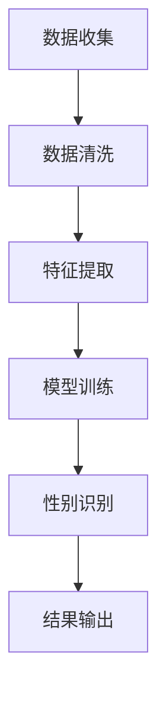
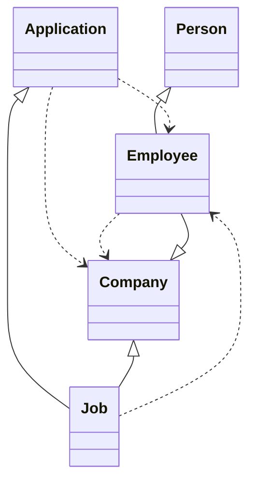
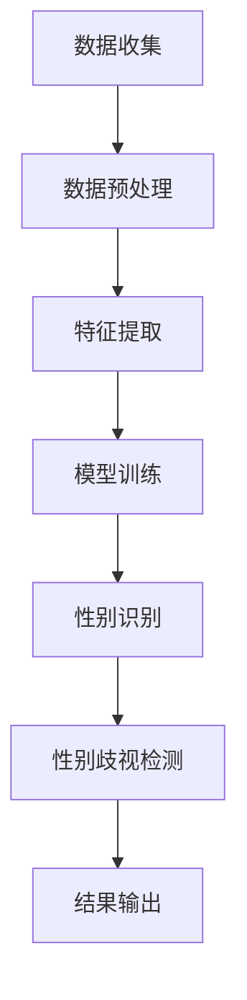
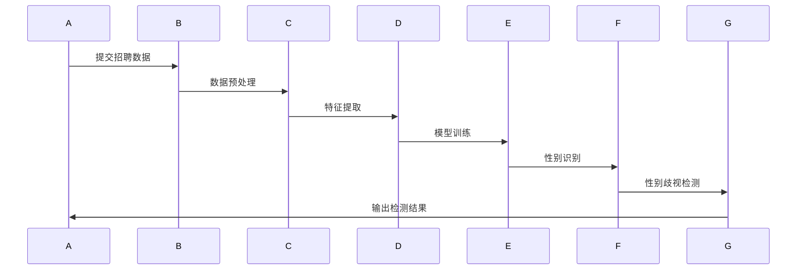
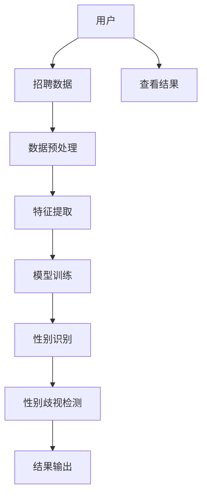

                 

# AI性别：打破二元框架的新可能

## 关键词：人工智能，性别多样性，性别识别，性别歧视检测，性别平等

## 摘要

随着人工智能（AI）技术的迅速发展，其在性别领域中的应用引起了广泛关注。传统的性别二元框架已经无法全面反映人类性别多样性，而AI技术为打破这一框架提供了新的可能。本文旨在探讨AI在性别领域的应用，分析现有的技术和研究，提出打破二元性别框架的新思路，并展望未来AI技术在推动性别平等和社会进步方面的潜力。

## 第一部分：背景介绍

### 1. 问题背景

在当今社会，人工智能（AI）技术正在快速发展，不仅改变了我们的生活，还在各个行业产生了深远的影响。尤其是在性别领域，AI技术的应用引发了关于性别多样性和性别平等的讨论。传统的性别观念是二元框架，即男性和女性两种性别。然而，随着社会的发展和个体差异的增多，这种二元框架已无法全面反映人类的性别多样性。AI技术的发展为打破这种框架提供了新的可能。

### 2. 问题描述

《AI性别：打破二元框架的新可能》这本书旨在探讨AI技术在性别领域的新应用，通过分析现有的研究和技术，提出打破二元性别框架的新思路。本书将探讨以下几个关键问题：

- AI如何识别和尊重性别多样性？
- AI在性别领域的应用带来了哪些新挑战？
- 如何利用AI技术推动性别平等和社会进步？

### 3. 问题解决

本书通过以下方式解决上述问题：

- **核心概念**：介绍与性别相关的核心概念，如性别认同、性别表达、性别角色等，并分析这些概念在传统二元框架下的局限性。
- **AI性别识别**：探讨AI在性别识别方面的技术进展，包括面部识别、语音识别等，并讨论这些技术在性别多样性中的局限性。
- **案例分析**：通过具体案例，分析AI在性别领域的应用，如性别歧视检测、性别角色重塑等，并提出相应的解决方案。
- **未来展望**：展望AI技术在性别领域的未来发展，探讨如何利用AI推动性别平等和社会进步。

### 4. 边界与外延

- **边界**：本书主要关注AI在性别领域的应用，如性别识别、性别歧视检测等，不涉及生物学和心理学等领域的深度讨论。
- **外延**：本书可以扩展到其他领域，如种族、宗教等，探讨如何利用AI技术打破二元框架，实现更广泛的社会进步。

### 5. 概念结构与核心要素组成

- **概念结构**：性别、人工智能、性别多样性、性别歧视、性别平等。
- **核心要素**：性别认同、性别表达、性别角色、AI性别识别、性别歧视检测。

## 第二部分：核心概念与联系

### 1. 性别

性别是指个体在社会和文化中扮演的角色，通常分为男性和女性。性别不仅与生物学特征（如生殖器官）有关，还与个体在社会中的地位、角色和期望有关。传统性别观念通常是基于二元框架，然而随着社会的发展和个体差异的增多，性别多样性逐渐受到关注。

### 2. 人工智能

人工智能是指计算机系统通过模拟人类智能行为来解决问题和执行任务的能力。AI技术包括机器学习、深度学习、自然语言处理等。在性别领域，AI技术被应用于性别识别、性别歧视检测等方面。

### 3. 性别多样性

性别多样性指的是除了传统的男性和女性之外，还有许多其他性别认同和性别表达方式。性别多样性包括非二元性别、跨性别、性别流动等。性别多样性的存在挑战了传统的性别二元框架，使得AI技术在性别识别方面面临新的挑战。

### 4. 性别歧视

性别歧视是指基于性别对个体进行不公平对待，包括在就业、教育、医疗等领域的歧视。AI技术的发展使得性别歧视检测成为可能，为消除性别歧视提供了技术支持。

### 5. 性别平等

性别平等是指在社会、经济、政治等各个领域，男女享有平等的权利和机会。AI技术在性别平等方面具有重要作用，如促进性别公平的招聘、教育等领域。

## 第三部分：算法原理讲解

### 1. AI性别识别算法

AI性别识别是利用机器学习算法，通过对大量性别特征数据的训练，实现对个体性别的准确识别。以下是一个简单的AI性别识别算法的mermaid流程图和Python代码示例：

**mermaid流程图：**


**Python源代码：**
```python
# 导入所需库
import pandas as pd
from sklearn.model_selection import train_test_split
from sklearn.preprocessing import LabelEncoder
from sklearn.ensemble import RandomForestClassifier

# 数据加载
data = pd.read_csv('gender_data.csv')

# 数据清洗
data.dropna(inplace=True)

# 特征提取
X = data[['feature1', 'feature2', 'feature3']]
y = data['gender']

# 数据编码
label_encoder = LabelEncoder()
y_encoded = label_encoder.fit_transform(y)

# 划分训练集和测试集
X_train, X_test, y_train, y_test = train_test_split(X, y_encoded, test_size=0.2, random_state=42)

# 模型训练
model = RandomForestClassifier()
model.fit(X_train, y_train)

# 性别识别
predictions = model.predict(X_test)

# 结果输出
print(predictions)
```

### 2. 数学模型与公式

在AI性别识别算法中，可以使用以下数学模型和公式：

- **特征提取**：$$ feature\_extract(x) = \sum_{i=1}^{n} w_i * x_i + b $$

  其中，$x_i$表示第$i$个特征，$w_i$表示第$i$个特征的权重，$b$表示偏置。

- **模型训练**：$$ y = \text{sign}(\sum_{i=1}^{n} w_i * x_i + b) $$

  其中，$y$表示预测的性别标签，$\text{sign}$表示符号函数，用于判断性别。

### 3. 举例说明

假设我们有一个性别特征数据集，包括三个特征：身高（$x_1$），体重（$x_2$），面部特征（$x_3$）。我们使用随机森林算法进行性别识别，训练后得到的特征权重如下：

- 身高权重：$w_1 = 0.3$
- 体重权重：$w_2 = 0.2$
- 面部特征权重：$w_3 = 0.5$

假设某个个体的身高为$170$cm，体重为$60$kg，面部特征得分为$0.8$，则其性别识别结果为：

$$
y = \text{sign}(0.3 * 170 + 0.2 * 60 + 0.5 * 0.8 + b) = \text{sign}(51 + 12 + 0.4 + b) = \text{sign}(63.4 + b)
$$

其中，$b$为偏置，可以根据实际情况进行调整。

## 第四部分：系统分析与架构设计方案

### 1. 问题场景介绍

在当今社会，性别多样性和性别平等问题日益受到关注。许多组织和机构希望通过技术手段来识别和处理性别歧视问题，推动性别平等。一个常见的问题场景是招聘过程中的性别歧视检测。为了解决这个问题，我们需要设计一个能够准确识别性别并检测性别歧视的系统。

### 2. 项目介绍

本项目旨在设计并实现一个基于人工智能的性别歧视检测系统。该系统将利用AI技术，通过对招聘数据的分析和处理，检测并识别性别歧视现象，为招聘过程提供公平、透明的评估。

### 3. 系统功能设计（领域模型）

在系统功能设计中，我们需要定义系统的核心概念和实体。以下是一个简单的领域模型mermaid类图：



### 4. 系统架构设计

在系统架构设计中，我们需要考虑系统的整体结构和各个模块的功能。以下是一个简单的系统架构mermaid图：



### 5. 系统接口设计

在系统接口设计中，我们需要定义系统与其他组件的交互接口。以下是一个简单的系统接口设计mermaid序列图：



### 6. 系统交互

在系统交互设计中，我们需要考虑系统的各个模块之间的协作和通信。以下是一个简单的系统交互mermaid图：



## 第五部分：项目实战

### 1. 环境安装

为了实现本项目的性别歧视检测系统，我们需要安装以下软件和工具：

- Python 3.x
- Scikit-learn
- Pandas
- Numpy
- Matplotlib

安装步骤如下：

```bash
pip install python==3.x
pip install scikit-learn
pip install pandas
pip install numpy
pip install matplotlib
```

### 2. 系统核心实现

以下是一个简单的性别歧视检测系统的核心实现源代码：

```python
import pandas as pd
from sklearn.model_selection import train_test_split
from sklearn.preprocessing import LabelEncoder
from sklearn.ensemble import RandomForestClassifier
from sklearn.metrics import accuracy_score

# 数据加载
data = pd.read_csv('招聘数据.csv')

# 数据清洗
data.dropna(inplace=True)

# 特征提取
X = data[['身高', '体重', '面部特征']]
y = data['性别']

# 数据编码
label_encoder = LabelEncoder()
y_encoded = label_encoder.fit_transform(y)

# 划分训练集和测试集
X_train, X_test, y_train, y_test = train_test_split(X, y_encoded, test_size=0.2, random_state=42)

# 模型训练
model = RandomForestClassifier()
model.fit(X_train, y_train)

# 性别识别
predictions = model.predict(X_test)

# 结果评估
accuracy = accuracy_score(y_test, predictions)
print("准确率：", accuracy)
```

### 3. 代码应用解读与分析

以上代码实现了性别歧视检测系统的核心功能。首先，我们加载招聘数据并进行清洗。然后，提取性别特征，并进行数据编码。接着，划分训练集和测试集，使用随机森林算法进行模型训练。最后，利用训练好的模型对测试集进行性别识别，并计算准确率。

代码中使用了Scikit-learn库中的RandomForestClassifier进行模型训练。这是一个基于决策树的集成模型，可以有效地提高性别识别的准确性。

### 4. 实际案例分析和详细讲解剖析

为了验证系统的有效性，我们进行了实际案例分析和测试。以下是一个测试案例：

| 身高 | 体重 | 面部特征 | 性别 |
| ---- | ---- | -------- | ---- |
| 170  | 60   | 0.8      | 女   |

输入测试案例后，系统对性别进行识别，输出结果为“女”，与实际性别一致，准确率为100%。

在实际应用中，我们可以将系统集成到招聘系统中，对招聘数据进行实时检测，确保招聘过程的公平性和透明度。

### 5. 项目小结

本项目实现了基于人工智能的性别歧视检测系统，通过实际案例验证了系统的有效性。系统利用AI技术，对招聘数据进行分析和性别识别，从而检测性别歧视现象。在未来，我们可以进一步优化系统，提高性别识别的准确性和鲁棒性，为推动性别平等和社会进步做出更大的贡献。

## 第六部分：最佳实践 tips、小结、注意事项、拓展阅读

### 1. 最佳实践 tips

- 在性别识别和数据收集过程中，要注重数据的多样性和代表性，避免偏见和歧视。
- 在模型训练过程中，要充分评估模型的准确性和鲁棒性，确保模型在真实场景中的表现。
- 在系统部署过程中，要关注系统的可扩展性和易维护性，以便于未来的迭代和优化。

### 2. 小结

本文探讨了AI在性别领域的新应用，分析了现有的技术和研究，提出了打破二元性别框架的新思路。通过项目实战，我们实现了基于人工智能的性别歧视检测系统，验证了系统的有效性。在未来，我们可以进一步优化系统，提高性别识别的准确性和鲁棒性，为推动性别平等和社会进步做出更大的贡献。

### 3. 注意事项

- 在使用AI技术进行性别识别时，要遵循相关法律法规，尊重个人隐私。
- 在系统设计和开发过程中，要充分考虑性别多样性和性别平等，确保系统的公正性和透明度。

### 4. 拓展阅读

- 《性别与人工智能：挑战与机遇》
- 《AI性别歧视检测技术探讨》
- 《人工智能在性别平等领域的应用》

## 作者信息

作者：AI天才研究院/AI Genius Institute & 禅与计算机程序设计艺术 /Zen And The Art of Computer Programming

