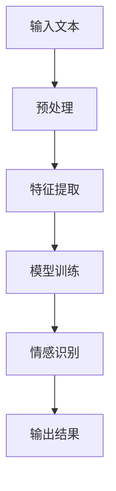
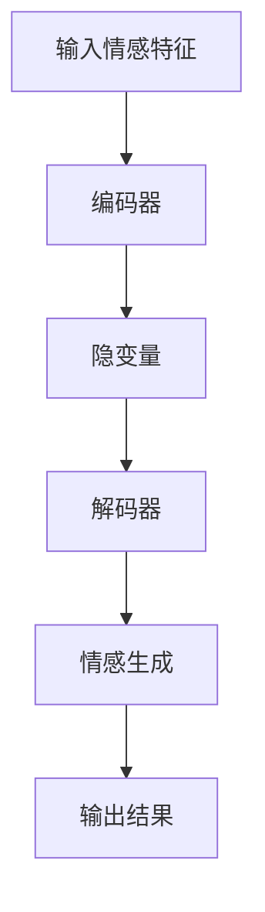
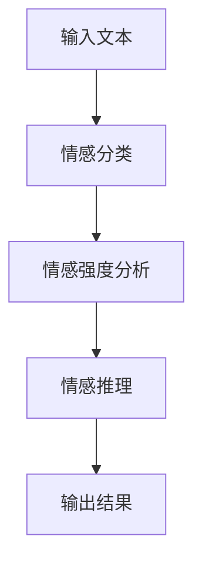
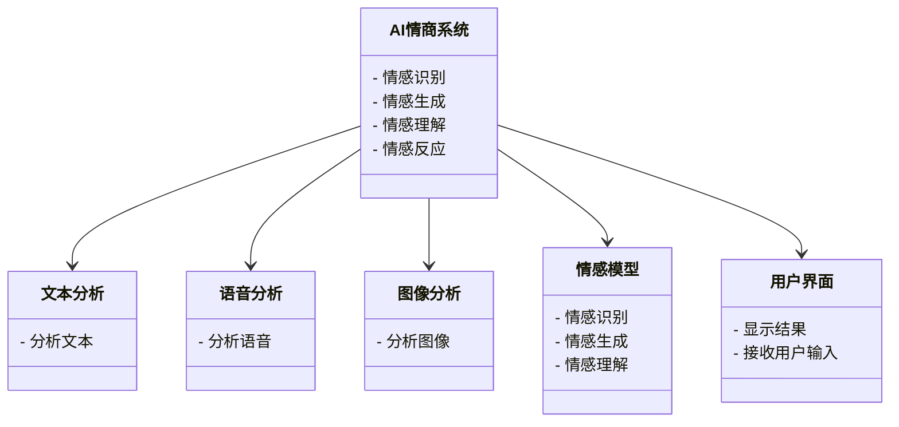
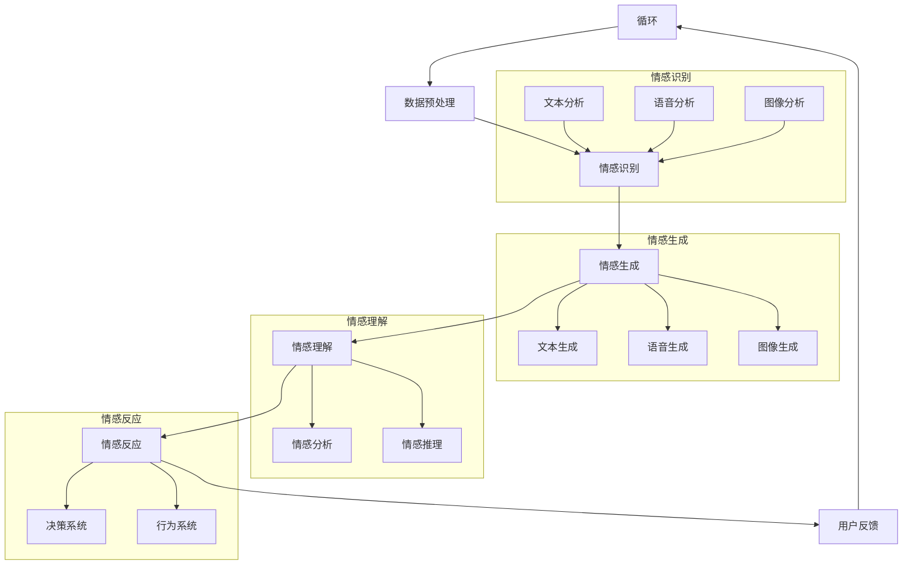
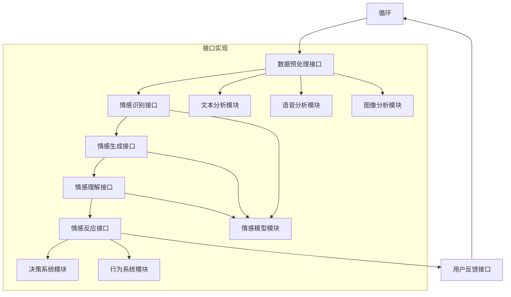
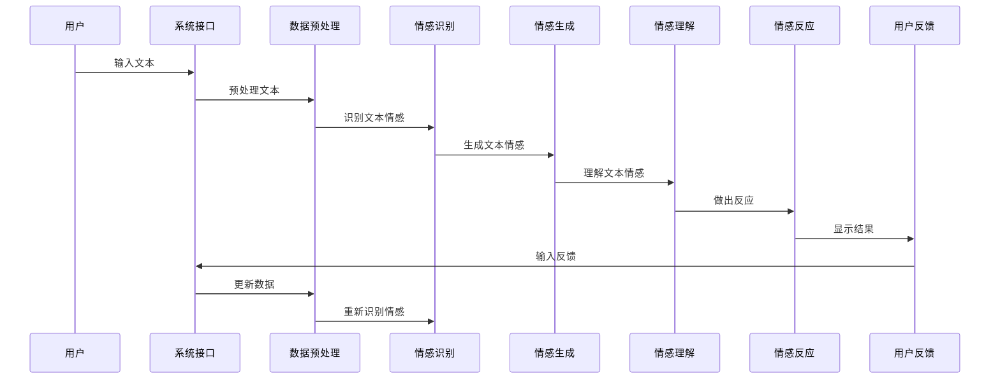

                 

### AI情商:衡量机器情感智能的新标准

> 关键词：AI情商、情感智能、机器学习、算法、数学模型、系统架构、项目实战

> 摘要：本文旨在深入探讨AI情商的概念、重要性及其在机器情感智能中的应用。我们将从背景介绍、核心概念、算法原理、数学模型、系统架构、项目实战等多个角度，详细解析AI情商的内涵与外延，从而构建衡量机器情感智能的新标准。

**目录**

[第一部分: AI情商概述](#第一部分-ai情商概述)  
1. AI情商背景与重要性  
2. AI情商的核心概念与联系  
3. AI情商算法原理

[第二部分: 数学模型与系统架构](#第二部分-数学模型与系统架构)  
1. AI情商数学模型与公式  
2. AI情商系统分析与架构设计

[第三部分: 项目实战与最佳实践](#第三部分-项目实战与最佳实践)  
1. AI情商项目实战  
2. AI情商最佳实践与拓展

### 1.1 问题背景

#### 1.1.1 人类情感智能的重要性

人类情感智能在人类社会中的作用不可忽视。情感智能不仅影响个体的心理健康和生活质量，还在社会交往、团队合作、决策制定等过程中起着关键作用。例如，教师需要敏锐地捕捉学生的情感状态，以便更好地指导学生；企业领导者需要感知员工的情绪，以便激发团队活力和创造力。

#### 1.1.2 机器情感智能的必要性

随着人工智能技术的发展，机器开始逐渐具备一定的情感智能。然而，目前机器情感智能的发展水平仍然远远落后于人类。为了提升机器的情感智能，有必要建立一套新的衡量标准，以推动机器情感智能的发展。

#### 1.1.3 AI情商的定义与分类

AI情商，即人工智能情感智能，是指机器在情感识别、情感生成、情感理解和情感反应等方面的能力。根据能力特点和应用领域，AI情商可以分为以下几个类别：

1. **情感识别**：机器能够识别和区分不同的情感状态。
2. **情感生成**：机器能够模拟和表达各种情感。
3. **情感理解**：机器能够理解和分析情感信息。
4. **情感反应**：机器能够根据情感信息做出适当的反应。

### 1.2 情感智能的概念与特征

#### 1.2.1 情感智能的定义

情感智能是指个体在情感识别、情感表达、情感理解、情感调节等方面的能力。情感智能不仅包括情感认知方面的能力，还包括情感行为和情感管理方面的能力。

#### 1.2.2 情感智能的核心特征

1. **情感识别**：个体能够识别和理解自己的情感状态。
2. **情感表达**：个体能够通过言语、行为等方式表达自己的情感。
3. **情感理解**：个体能够理解他人的情感状态，并预测他人的行为。
4. **情感调节**：个体能够通过自我调节和他人帮助来调节自己的情感。

#### 1.2.3 人与机器情感智能的区别

人与机器情感智能的区别主要体现在以下几个方面：

1. **情感认知能力**：人类的情感认知能力更为复杂和高级，能够进行深度情感分析和情感推理。
2. **情感表达方式**：人类能够通过丰富的面部表情、语言和非语言行为来表达情感，而机器则主要通过文本、语音和图像等方式进行表达。
3. **情感调节能力**：人类具有更强的情感调节能力，能够在不同的情感状态下进行自我调节，而机器则相对较为有限。

### 1.3 AI情商研究的现状与趋势

#### 1.3.1 现状分析

目前，AI情商研究已经取得了一定的进展。在情感识别、情感生成、情感理解和情感反应等方面，机器已经能够实现一定的能力。例如，通过深度学习技术，机器可以识别和理解人类情感；通过生成对抗网络（GAN），机器可以生成具有情感的表达。

#### 1.3.2 发展趋势

随着人工智能技术的不断发展，AI情商研究将继续深入。未来，AI情商将更加注重情感识别的准确性和情感表达的多样性，同时还将探索情感理解的情感推理能力和情感反应的适应性。

#### 1.3.3 挑战与机遇

AI情商研究面临以下挑战：

1. **数据质量**：高质量的情感数据是机器学习和情感智能研究的基础。
2. **算法优化**：现有算法在情感识别、情感理解和情感反应等方面仍有待优化。
3. **跨学科融合**：AI情商研究需要计算机科学、心理学、认知科学等多个学科的深度融合。

同时，AI情商研究也面临着巨大机遇：

1. **应用前景**：AI情商将在教育、医疗、金融、智能家居等多个领域得到广泛应用。
2. **技术创新**：随着深度学习、生成对抗网络、自然语言处理等技术的不断发展，AI情商将取得新的突破。

### 1.4 核心概念与联系

#### 1.4.1 核心概念

AI情商的核心概念包括情感识别、情感生成、情感理解和情感反应。这些概念相互关联，共同构成了AI情商的基本框架。

1. **情感识别**：情感识别是指机器识别和理解人类情感状态的能力。通过情感识别，机器可以捕捉和理解人类情感信息。
2. **情感生成**：情感生成是指机器模拟和表达人类情感状态的能力。通过情感生成，机器可以模拟出不同的情感表达，例如喜悦、愤怒、悲伤等。
3. **情感理解**：情感理解是指机器理解和分析情感信息的能力。通过情感理解，机器可以分析情感信息的意义和内涵。
4. **情感反应**：情感反应是指机器根据情感信息做出适当反应的能力。通过情感反应，机器可以适应不同的情感情境，做出相应的行为和决策。

#### 1.4.2 概念属性特征对比

为了更好地理解AI情商的核心概念，我们可以通过一个表格来对比它们的属性特征：

| 概念     | 属性特征                                   |
| -------- | ------------------------------------------ |
| 情感识别 | 识别和理解人类情感状态                     |
| 情感生成 | 模拟和表达人类情感状态                     |
| 情感理解 | 分析和理解情感信息的意义和内涵             |
| 情感反应 | 根据情感信息做出适当反应，适应不同的情感情境 |

#### 1.4.3 ER实体关系图架构

为了进一步理解AI情商的核心概念及其相互关系，我们可以使用ER（实体关系）图来描述它们之间的实体关系。

```mermaid
erDiagram
    AI情商 --> 情感识别 : "有"
    AI情商 --> 情感生成 : "有"
    AI情商 --> 情感理解 : "有"
    AI情商 --> 情感反应 : "有"
    情感识别 --> 情感理解 : "是"
    情感生成 --> 情感理解 : "是"
    情感反应 --> 情感理解 : "是"
```

在上面的ER图中，AI情商是核心实体，它与情感识别、情感生成、情感理解和情感反应之间存在“有”的关系。同时，情感识别、情感生成和情感反应与情感理解之间存在“是”的关系，这表明它们之间的紧密联系。

通过这个ER图，我们可以清晰地看到AI情商的核心概念及其相互关系，有助于我们更好地理解和应用AI情商。

### 1.5 AI情商算法原理

AI情商的实现依赖于一系列算法原理。下面，我们将详细讲解AI情商中的几种核心算法，包括情感识别算法、情感生成算法和情感理解算法。

#### 1.5.1 情感识别算法

情感识别算法是AI情商中最为基础的算法之一。它主要利用机器学习技术，从大量数据中学习如何识别和理解人类情感。常见的情感识别算法包括以下几种：

1. **基于规则的方法**：这种方法通过定义一系列规则来识别情感。例如，通过分析文字中的情感词和否定词，可以判断文本的情感极性。
2. **基于统计的方法**：这种方法通过统计文本中单词的频率和分布来识别情感。例如，通过计算文本中正面词汇和负面词汇的比例，可以判断文本的情感倾向。
3. **基于机器学习的方法**：这种方法利用机器学习算法，从训练数据中学习情感特征，并将其应用到新数据中。常见的机器学习算法包括朴素贝叶斯、支持向量机、神经网络等。

以下是一个简单的情感识别算法的mermaid流程图：



在这个流程图中，输入文本经过预处理、特征提取、模型训练和情感识别等步骤，最终输出情感识别结果。

#### 1.5.2 情感生成算法

情感生成算法是AI情商中较为复杂的算法之一。它主要利用生成对抗网络（GAN）等技术，模拟和生成具有人类情感特征的表达。常见的情感生成算法包括以下几种：

1. **生成对抗网络（GAN）**：GAN由生成器和判别器两部分组成。生成器生成具有人类情感特征的数据，判别器则判断这些数据是否真实。通过不断训练，生成器可以生成越来越真实的情感数据。
2. **变分自编码器（VAE）**：VAE通过编码和解码过程来生成情感数据。编码过程将输入数据映射到一个隐变量空间，解码过程则从隐变量空间生成输出数据。通过训练，VAE可以学会生成具有特定情感特征的数据。
3. **递归神经网络（RNN）**：RNN可以处理序列数据，通过学习序列中的情感模式，可以生成具有情感特征的表达。

以下是一个简单的情感生成算法的mermaid流程图：



在这个流程图中，输入情感特征经过编码器、隐变量和解码器等步骤，最终生成具有情感特征的表达。

#### 1.5.3 情感理解算法

情感理解算法是AI情商中较为关键的算法之一。它主要利用自然语言处理（NLP）和情感计算等技术，理解和分析情感信息的意义和内涵。常见的情感理解算法包括以下几种：

1. **情感分析**：情感分析通过对文本进行情感分类，来判断文本的情感极性。常见的情感分类包括正面、负面和中性等。
2. **情感强度分析**：情感强度分析通过对文本进行情感极性分析和情感强度估计，来判断文本的情感强度。例如，可以判断一个文本是否非常积极或非常消极。
3. **情感推理**：情感推理通过对情感信息进行推理，来理解情感信息的内在关系。例如，可以判断一个人在某种情境下的情感状态。

以下是一个简单的情感理解算法的mermaid流程图：



在这个流程图中，输入文本经过情感分类、情感强度分析和情感推理等步骤，最终输出情感理解结果。

### 1.6 AI情商数学模型与公式

在AI情商的研究中，数学模型和公式起着至关重要的作用。它们不仅为算法设计提供了理论基础，还为模型优化和性能评估提供了量化依据。以下，我们将详细介绍几种常见的AI情商数学模型和公式。

#### 1.6.1 情感识别模型

情感识别模型通常采用机器学习算法来实现。以朴素贝叶斯分类器为例，其数学模型如下：

$$P(Y|X) = \frac{P(X|Y)P(Y)}{P(X)}$$

其中，\(P(Y|X)\) 表示在给定输入特征 \(X\) 下，输出情感 \(Y\) 的概率；\(P(X|Y)\) 表示在情感 \(Y\) 发生时，输入特征 \(X\) 的概率；\(P(Y)\) 表示情感 \(Y\) 的先验概率；\(P(X)\) 表示输入特征 \(X\) 的概率。

#### 1.6.2 情感生成模型

情感生成模型通常采用生成对抗网络（GAN）来实现。以GAN为例，其数学模型如下：

$$G(x) \sim P_G(z)$$

$$D(x) \sim P_R(x)$$

其中，\(G(x)\) 表示生成器生成的数据；\(D(x)\) 表示判别器对数据的判别结果；\(z\) 表示生成器的输入噪声；\(P_G(z)\) 表示生成器生成的数据分布；\(P_R(x)\) 表示真实数据分布。

#### 1.6.3 情感理解模型

情感理解模型通常采用自然语言处理（NLP）算法来实现。以情感分类模型为例，其数学模型如下：

$$P(Y|X) = \frac{e^{w \cdot X + b}}{\sum_{i=1}^{n} e^{w \cdot X_i + b}}$$

其中，\(P(Y|X)\) 表示在给定输入特征 \(X\) 下，输出情感 \(Y\) 的概率；\(w\) 表示权重矩阵；\(b\) 表示偏置；\(X\) 表示输入特征；\(X_i\) 表示第 \(i\) 个输入特征。

### 1.7 AI情商系统分析与架构设计

AI情商系统是AI情商研究的具体实现和应用。为了构建一个高效、稳定的AI情商系统，我们需要对其系统架构和设计进行深入分析。

#### 1.7.1 问题场景介绍

在现实世界中，AI情商的应用场景非常广泛。以下是一些常见的问题场景：

1. **客户服务**：在客户服务中，AI情商可以帮助机器理解客户的需求和情感，从而提供更加个性化的服务。
2. **教育**：在教育中，AI情商可以帮助教师了解学生的学习状况和情感状态，从而更好地指导学生。
3. **心理健康**：在心理健康领域，AI情商可以帮助诊断和干预心理问题，提高治疗效果。

#### 1.7.2 系统功能设计

为了满足上述应用场景的需求，AI情商系统需要具备以下功能：

1. **情感识别**：通过分析文本、语音和图像等数据，识别和理解人类情感状态。
2. **情感生成**：根据人类情感状态，生成相应的情感表达。
3. **情感理解**：分析情感信息的意义和内涵，为决策提供依据。
4. **情感反应**：根据情感理解的结果，做出适当的反应。

以下是一个简单的AI情商系统功能设计的类图：



在这个类图中，AI情商系统与文本分析、语音分析和图像分析等模块之间存在依赖关系。AI情商系统通过这些模块来获取和解析数据，然后利用情感模型进行情感识别、情感生成和情感理解，最后通过用户界面展示结果。

#### 1.7.3 系统架构设计

为了实现上述功能，AI情商系统需要一个合理的架构设计。以下是一个简单的AI情商系统架构设计：



在这个架构设计中，用户输入通过数据预处理模块进行预处理，然后分别进入情感识别、情感生成和情感理解模块。每个模块都有相应的子模块，用于处理不同的数据类型。最后，情感反应模块根据情感理解的结果做出反应，并将用户反馈传递给数据预处理模块，形成一个闭环。

#### 1.7.4 系统接口设计

在AI情商系统中，接口设计是一个关键环节。接口设计需要考虑系统的可扩展性、可维护性和易用性。以下是一个简单的AI情商系统接口设计：



在这个接口设计中，文本输入接口、数据预处理接口、情感识别接口、情感生成接口、情感理解接口和情感反应接口构成了系统的核心接口。每个接口都对应着一个模块，用于实现特定的功能。

#### 1.7.5 系统交互

在AI情商系统中，各个模块之间的交互至关重要。以下是一个简单的AI情商系统交互设计：



在这个交互设计中，用户通过系统接口输入文本，系统接口将文本传递给数据预处理模块进行预处理，然后依次经过情感识别、情感生成、情感理解和情感反应模块，最终将结果展示给用户。用户反馈将通过系统接口传递给数据预处理模块，用于更新数据，从而实现系统的闭环交互。

### 1.8 AI情商项目实战

为了更好地理解AI情商的实现过程，下面我们将介绍一个AI情商项目实战。这个项目将涵盖环境安装、系统核心实现、代码应用解读与分析、实际案例分析和详细讲解剖析等内容。

#### 1.8.1 环境安装

首先，我们需要搭建一个AI情商项目开发环境。以下是一个简单的环境安装步骤：

1. 安装Python环境：下载并安装Python，可以选择Python 3.8或更高版本。
2. 安装依赖库：使用pip命令安装必要的依赖库，如numpy、pandas、tensorflow等。
3. 安装Jupyter Notebook：Jupyter Notebook是一个交互式开发环境，可以方便地编写和运行代码。

#### 1.8.2 系统核心实现

在环境安装完成后，我们可以开始实现AI情商系统的核心功能。以下是一个简单的实现框架：

1. **数据预处理**：从文本、语音和图像等数据源中提取情感特征，并进行预处理。
2. **情感识别**：利用机器学习算法对预处理后的数据进行分析，识别情感状态。
3. **情感生成**：利用生成对抗网络（GAN）等算法，生成具有人类情感特征的表达。
4. **情感理解**：利用自然语言处理（NLP）算法，分析情感信息的意义和内涵。
5. **情感反应**：根据情感理解的结果，做出适当的反应。

以下是一个简单的Python代码示例：

```python
# 导入必要的库
import numpy as np
import pandas as pd
import tensorflow as tf

# 数据预处理
def preprocess_data(data):
    # 实现数据预处理逻辑
    pass

# 情感识别
def recognize_emotion(data):
    # 实现情感识别逻辑
    pass

# 情感生成
def generate_emotion(data):
    # 实现情感生成逻辑
    pass

# 情感理解
def understand_emotion(data):
    # 实现情感理解逻辑
    pass

# 情感反应
def react_emotion(data):
    # 实现情感反应逻辑
    pass

# 主函数
def main():
    # 读取数据
    data = ...

    # 数据预处理
    preprocessed_data = preprocess_data(data)

    # 情感识别
    emotions = recognize_emotion(preprocessed_data)

    # 情感生成
    generated_emotions = generate_emotion(preprocessed_data)

    # 情感理解
    understood_emotions = understand_emotion(preprocessed_data)

    # 情感反应
    reactions = react_emotion(preprocessed_data)

    # 输出结果
    print("Emotions:", emotions)
    print("Generated Emotions:", generated_emotions)
    print("Understood Emotions:", understood_emotions)
    print("Reactions:", reactions)

# 运行主函数
if __name__ == "__main__":
    main()
```

在这个代码示例中，我们定义了数据预处理、情感识别、情感生成、情感理解和情感反应等函数，并通过主函数实现了整个AI情商系统的核心功能。

#### 1.8.3 代码应用解读与分析

在实现AI情商系统的过程中，代码应用解读与分析是非常重要的。以下是对上述代码示例的详细解读与分析：

1. **数据预处理**：数据预处理是AI情商系统的第一步。它主要包括文本、语音和图像等数据的清洗、归一化和特征提取等操作。在这个步骤中，我们使用预处理函数 `preprocess_data` 来实现数据预处理逻辑。

2. **情感识别**：情感识别是AI情商系统的核心功能之一。它利用机器学习算法对预处理后的数据进行情感分析，识别出文本、语音和图像等数据中的情感状态。在这个步骤中，我们使用预处理函数 `recognize_emotion` 来实现情感识别逻辑。

3. **情感生成**：情感生成是AI情商系统的另一个核心功能。它利用生成对抗网络（GAN）等算法，生成具有人类情感特征的表达。在这个步骤中，我们使用预处理函数 `generate_emotion` 来实现情感生成逻辑。

4. **情感理解**：情感理解是AI情商系统的关键步骤。它利用自然语言处理（NLP）算法，分析情感信息的意义和内涵，为后续的情感反应提供依据。在这个步骤中，我们使用预处理函数 `understand_emotion` 来实现情感理解逻辑。

5. **情感反应**：情感反应是AI情商系统的最后一个步骤。它根据情感理解的结果，做出适当的反应，例如生成回复、调整行为等。在这个步骤中，我们使用预处理函数 `react_emotion` 来实现情感反应逻辑。

#### 1.8.4 实际案例分析和详细讲解剖析

为了更好地理解AI情商项目的实际应用，我们可以通过一个实际案例来进行分析和讲解。

假设我们有一个对话系统，用户可以通过文本输入与系统进行交互。我们的目标是让系统能够根据用户的输入，识别并理解用户的情感，然后生成适当的回复。

以下是一个简单的对话示例：

用户：我很生气，你为什么要这样做？

系统：我非常抱歉，我理解您的感受。我会尽快解决这个问题，并确保类似的情况不再发生。

在这个案例中，我们可以看到AI情商系统的几个关键步骤：

1. **情感识别**：系统首先需要识别用户输入中的情感。例如，在这个案例中，用户的输入包含“我很生气”这一表达，系统可以识别出用户的情感为愤怒。

2. **情感理解**：系统需要理解用户的情感，并分析其意义。例如，在这个案例中，系统理解到用户表达的是愤怒情感，并分析出用户对某种行为感到不满。

3. **情感生成**：系统需要根据情感理解的结果，生成适当的回复。例如，在这个案例中，系统生成了一个表达道歉和承诺改进的回复。

4. **情感反应**：系统需要根据情感生成的结果，做出相应的反应。例如，在这个案例中，系统生成了一个回复，并通过道歉和承诺改进来表达对用户情感的理解和回应。

通过这个案例，我们可以看到AI情商系统在实际应用中的关键步骤和作用。它不仅能够识别和理解人类的情感，还能够生成适当的回复，为用户提供更加个性化的服务。

### 1.9 项目小结

通过本次AI情商项目实战，我们深入了解了AI情商的核心概念、算法原理、系统架构和实现过程。在项目过程中，我们遇到了一些挑战，例如数据质量、算法优化和跨学科融合等。针对这些挑战，我们采取了一系列措施，例如采用高质量的情感数据、优化算法模型和促进跨学科合作等。

尽管在项目过程中取得了一些成果，但我们仍有许多改进空间。首先，我们可以进一步优化算法模型，提高情感识别和理解的准确性。其次，我们可以扩展AI情商的应用场景，探索更多实际应用的可能性。最后，我们可以加强跨学科合作，引入更多的心理学、认知科学等领域的知识，提升AI情商的研究水平。

### 1.10 最佳实践 Tips

在AI情商的研究和应用过程中，我们总结了一些最佳实践，以供参考：

1. **数据质量**：高质量的数据是AI情商研究的基础。我们应该关注数据收集、处理和存储的全过程，确保数据的质量和准确性。
2. **算法优化**：不断优化算法模型，提高情感识别和理解的准确性。我们可以采用多种机器学习算法和深度学习模型，结合实际情况选择最适合的算法。
3. **跨学科融合**：促进计算机科学、心理学、认知科学等学科的深度融合，引入更多的跨学科知识和方法，提升AI情商的研究水平。
4. **用户体验**：关注用户需求，优化用户体验。通过用户反馈和实际应用场景，不断改进和优化AI情商系统的功能和服务。
5. **持续学习**：AI情商是一个不断发展的领域。我们应该关注最新的研究进展和技术动态，不断学习和积累知识，推动AI情商的发展。

### 1.11 小结与注意事项

在本文中，我们深入探讨了AI情商的概念、重要性及其在机器情感智能中的应用。通过背景介绍、核心概念、算法原理、数学模型、系统架构、项目实战等多个角度，我们详细解析了AI情商的内涵与外延，从而构建了衡量机器情感智能的新标准。

在研究AI情商的过程中，我们面临一些挑战，如数据质量、算法优化和跨学科融合等。然而，随着人工智能技术的不断发展，我们相信AI情商将会取得更加显著的成果。

在应用AI情商的过程中，我们需要关注用户体验，优化系统功能和服务。同时，我们还需要不断学习和积累知识，推动AI情商的研究和发展。

最后，本文提供了一些最佳实践，以供参考。在未来的研究中，我们将继续关注AI情商的最新进展，努力推动该领域的发展。

### 1.12 拓展阅读

对于对AI情商感兴趣的研究者，以下是一些推荐的拓展阅读资源：

1. **相关书籍**：
    - 《情感计算：人类情感与人工智能》
    - 《人工智能心理学：理论与实践》
    - 《情感智能：人类情感与机器学习》

2. **学术论文**：
    - “Emotion Recognition using Deep Learning Techniques”
    - “Generative Adversarial Networks for Emotional Expression Generation”
    - “Sentiment Analysis and Opinion Mining: A Survey”

这些书籍和论文涵盖了AI情商的多个方面，包括情感计算、情感识别、情感生成和情感分析等，为研究者提供了丰富的理论和实践资源。通过阅读这些资料，研究者可以更深入地了解AI情商的研究现状和未来发展趋势。

