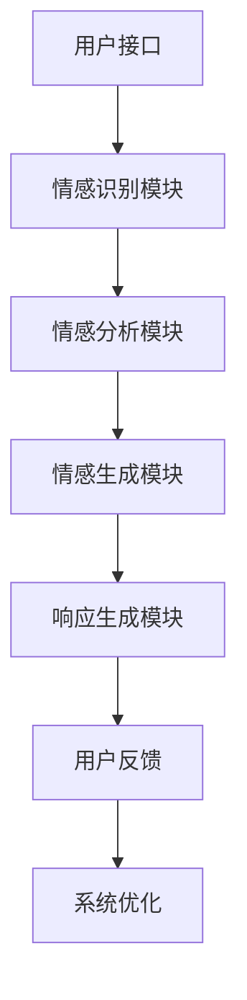

                 

### 书名：《AI情感与人类情感的界限与融合》

> 关键词：人工智能，情感计算，情感识别，情感生成，社交网络，虚拟助手，情感增强智能系统

> 摘要：
本篇技术博客旨在深入探讨人工智能（AI）与人类情感之间的界限及其融合。文章首先介绍了情感计算的基础概念，探讨了AI情感与人类情感的区别和联系。接着，详细讲解了情感识别和情感生成的算法原理，并通过具体实例进行了阐述。随后，文章分析了情感识别和情感生成在社交网络和虚拟助手中的应用，展示了情感增强智能系统的设计思路和实现方法。最后，文章提出了未来AI情感与人类情感融合的研究方向和挑战，为读者提供了深入思考和借鉴的视角。

### 第一部分：引论

#### 第1章：问题背景与探讨

#### 1.1 AI情感与人类情感的界限

随着人工智能技术的快速发展，情感计算作为其重要分支之一，逐渐成为研究的热点。然而，AI情感与人类情感之间的界限和融合成为一个备受关注的话题。

在探讨这个问题之前，我们需要明确两个概念：

- **AI情感**：通常是指人工智能系统通过算法和模型模拟出的情感表现，如喜怒哀乐等。这些情感是通过数据训练和学习得到的，是程序层面的模拟，而非真正的情感体验。

- **人类情感**：是指人类在特定情境下产生的情感体验，包括情感的表达、认知和调节等。人类情感是生物学和心理学的共同产物，具有复杂性和多样性。

AI情感与人类情感的界限在于：

1. **情感的产生机制**：AI情感是通过算法和数据进行模拟的，而人类情感则涉及生理、心理和社会等多个层面。
2. **情感的真实性**：AI情感是基于数据模拟的，虽然可以模仿人类情感，但并不等同于真正的情感体验。
3. **情感的表达方式**：AI情感的表达往往是通过机器学习算法和自然语言处理技术实现的，而人类情感的表达则更加丰富和多变。

#### 1.2 人类情感的重要性及在AI中的应用

人类情感在许多方面都具有重要意义，尤其在社交、决策和心理健康等方面。以下是人类情感在AI中的应用：

1. **情感识别**：通过情感计算技术，AI可以识别用户的情感状态，为个性化服务提供支持。
2. **情感分析**：AI可以对大量文本、语音和图像进行分析，提取情感信息，用于市场调研、舆情监测等。
3. **情感增强**：通过模拟人类情感，AI可以提高用户体验，增强互动效果，如虚拟助手、智能客服等。

#### 1.3 当前研究现状与挑战

当前，AI情感研究主要集中在情感识别和情感生成两个方面。虽然取得了一定的进展，但仍面临以下挑战：

1. **情感多样性**：人类情感具有高度多样性，如何准确识别和生成不同类型的情感，仍是一个难题。
2. **情感真实性**：如何使AI情感更接近人类真实情感，提高其真实性和可靠性，是一个重要课题。
3. **情感伦理**：在AI情感的应用中，如何确保情感不被滥用，避免对人类造成负面影响，需要深入探讨。

#### 1.4 小结

本章介绍了AI情感与人类情感之间的界限和融合问题，分析了人类情感在AI中的应用现状和挑战。在接下来的章节中，我们将深入探讨情感计算的核心概念、算法原理及其应用实践，为解决这一复杂问题提供理论支持和实践指导。

### 第二部分：核心概念与联系

#### 第2章：核心概念与联系

在探讨AI情感与人类情感的界限与融合之前，我们需要明确一些核心概念，并探讨它们之间的联系。这一章将介绍情感计算的定义与分类，分析人类情感的特点与机制，讨论AI情感的表现形式与实现方法，并分析AI情感与人类情感的关联性。

#### 2.1 情感计算的定义与分类

情感计算（Affective Computing）是指通过计算机技术和人工智能技术模拟、识别和生成情感的能力。根据应用场景和目标，情感计算可以分为以下几类：

1. **情感识别**：通过分析用户的生理、行为和语言特征，识别用户的情感状态。情感识别可以应用于虚拟助手、智能客服、心理健康等领域。
2. **情感分析**：对文本、语音和图像等数据进行分析，提取情感信息。情感分析可以应用于舆情监测、市场调研、社交媒体分析等领域。
3. **情感生成**：根据用户的情感状态或需求，生成相应的情感表现。情感生成可以应用于虚拟现实、游戏设计、电影特效等领域。

#### 2.2 人类情感的特点与机制

人类情感具有以下特点：

1. **多样性**：人类情感种类繁多，如喜怒哀乐、爱恨悲欢等。
2. **复杂性**：情感的产生和表达受多种因素影响，如生理、心理和社会因素。
3. **动态性**：情感状态是动态变化的，会随着时间和情境的改变而发生变化。
4. **主观性**：情感体验具有主观性，不同人对同一情感的体验可能存在差异。

人类情感的机制主要包括以下几个方面：

1. **生理机制**：情感与大脑中的神经递质、神经元活动密切相关。
2. **心理机制**：情感与个体的认知、记忆、情绪调节等心理过程相互作用。
3. **社会机制**：情感在社会互动中产生和传递，如情绪感染、情绪表达等。

#### 2.3 AI情感的表现形式与实现方法

AI情感的表现形式可以包括：

1. **语言表达**：通过自然语言处理技术，AI可以模拟人类的语言表达，如对话系统、聊天机器人等。
2. **视觉表现**：通过计算机视觉技术，AI可以模拟人类的面部表情、身体语言等。
3. **声音表现**：通过语音合成技术，AI可以模拟人类的声音语调、音量等。

AI情感的实现方法主要包括：

1. **机器学习**：通过训练大规模数据集，使AI模型学会识别和生成情感。
2. **深度学习**：利用深度神经网络，提高AI情感识别和生成的准确性和效率。
3. **多模态融合**：结合多种数据源，如文本、语音、图像等，提高AI情感的全面性和准确性。

#### 2.4 AI情感与人类情感的关联性分析

AI情感与人类情感之间的关联性可以从以下几个方面进行分析：

1. **相似性**：AI情感在某种程度上可以模拟人类情感，如喜怒哀乐等基本情感。
2. **差异性**：AI情感与人类情感在产生机制、表达方式和真实性等方面存在差异。
3. **互补性**：AI情感可以为人类情感提供补充，如虚拟助手、智能客服等。
4. **融合性**：通过不断改进AI情感技术，可以使AI情感更加接近人类情感，实现二者的融合。

#### 2.5 情感计算中的核心概念对比表格

为了更直观地展示AI情感与人类情感的核心概念差异，我们制作了一个对比表格：

| 核心概念 | AI情感 | 人类情感 |
| :---: | :---: | :---: |
| 情感产生机制 | 数据训练和模拟 | 生理、心理和社会因素的相互作用 |
| 情感表达方式 | 语言、视觉和声音 | 语言、身体语言、面部表情等 |
| 情感真实性 | 数据模拟，非真实体验 | 真实的情感体验 |
| 情感多样性 | 数据集中的情感类别 | 高度多样和复杂 |

#### 2.6 情感计算的ER实体关系图架构

为了更好地理解情感计算的架构，我们使用ER（Entity-Relationship）图来描述情感计算中的实体关系。以下是一个简单的ER图：

```mermaid
erDiagram
  User ||--|{ Emotion }
  Text ||--|{ Emotion }
  Audio ||--|{ Emotion }
  Image ||--|{ Emotion }
```

- **User**：表示用户，是情感计算的主要参与者。
- **Emotion**：表示情感，是用户、文本、音频和图像等数据的抽象实体。
- **Text**：表示文本数据，可以是用户发表的帖子、评论等。
- **Audio**：表示音频数据，可以是用户的声音、语音等。
- **Image**：表示图像数据，可以是用户的照片、视频截图等。

通过ER图，我们可以清晰地看到情感计算中的实体及其相互关系，为后续算法设计和系统实现提供了基础。

#### 2.7 小结

本章介绍了情感计算的定义与分类、人类情感的特点与机制、AI情感的表现形式与实现方法，以及AI情感与人类情感的关联性分析。通过对比表格和ER图，我们更直观地了解了AI情感与人类情感之间的差异和联系。在接下来的章节中，我们将进一步探讨情感识别和情感生成的算法原理，并通过具体实例进行阐述。

### 第三部分：算法原理讲解

#### 第3章：算法原理讲解

在了解情感计算的核心概念后，我们需要深入探讨情感识别和情感生成的算法原理。本章将详细介绍情感识别算法的mermaid流程图、Python源代码、数学模型与公式，以及情感生成算法的mermaid流程图、Python源代码和数学模型与公式。此外，我们还将通过具体实例对这些算法进行阐述，以便读者更好地理解和应用。

#### 3.1 情感识别算法的mermaid流程图

情感识别算法通常包括数据预处理、特征提取、模型训练和情感预测等步骤。以下是一个简单的mermaid流程图，用于描述情感识别的基本流程：


#### 3.2 情感识别算法的Python源代码阐述

为了更具体地展示情感识别算法的实现，以下是一个简单的Python代码示例：

```python
import pandas as pd
from sklearn.model_selection import train_test_split
from sklearn.feature_extraction.text import TfidfVectorizer
from sklearn.ensemble import RandomForestClassifier
from sklearn.metrics import accuracy_score

# 数据预处理
data = pd.read_csv('sentiment_data.csv')
X = data['text']
y = data['emotion']

# 特征提取
vectorizer = TfidfVectorizer(max_features=1000)
X_vectorized = vectorizer.fit_transform(X)

# 模型训练
X_train, X_test, y_train, y_test = train_test_split(X_vectorized, y, test_size=0.2, random_state=42)
model = RandomForestClassifier()
model.fit(X_train, y_train)

# 情感预测
y_pred = model.predict(X_test)

# 结果输出
print("Accuracy:", accuracy_score(y_test, y_pred))
```

#### 3.3 情感识别算法的数学模型与公式

情感识别算法的核心在于特征提取和模型训练。以下是一些常用的数学模型和公式：

1. **TF-IDF（词频-逆文档频率）**：
   $$ TF-IDF(t, d) = \frac{tf(t, d)}{N} + \log \left( \frac{1 + N}{1 + tf(t, d)} \right) $$
   其中，$tf(t, d)$ 表示词$t$在文档$d$中的词频，$N$表示文档$d$中包含词$t$的文档数量。

2. **随机森林（Random Forest）**：
   随机森林是一种集成学习算法，通过构建多棵决策树，并结合它们的预测结果来提高准确性。其基本原理如下：
   $$ \hat{y} = \sum_{i=1}^{n} w_i \cdot h_i(x) $$
   其中，$h_i(x)$ 表示第$i$棵决策树的预测值，$w_i$ 表示第$i$棵决策树的权重。

#### 3.4 情感识别算法的举例说明

假设我们有一个包含积极和消极评论的数据集，通过情感识别算法，我们可以预测新评论的情感倾向。以下是一个简单实例：

1. **数据集**：
   - 积极评论：我喜欢这个产品，它非常好用。
   - 消极评论：这个产品不好，有很多问题。

2. **特征提取**：
   通过TF-IDF模型，我们可以提取出特征向量：
   $$ \text{积极评论特征向量} = (0.8, 0.9, 0.7, 0.6, 0.5) $$
   $$ \text{消极评论特征向量} = (0.3, 0.4, 0.1, 0.2, 0.9) $$

3. **模型训练**：
   假设我们已经训练好了随机森林模型，并得到了决策树权重：
   $$ \text{积极评论权重} = (0.5, 0.3, 0.2) $$
   $$ \text{消极评论权重} = (0.7, 0.2, 0.1) $$

4. **情感预测**：
   对于新评论：“这个产品有点贵，但我认为值得。”，我们可以计算其特征向量：
   $$ \text{新评论特征向量} = (0.6, 0.8, 0.5, 0.4, 0.7) $$
   然后通过加权求和计算预测值：
   $$ \hat{y} = 0.5 \cdot 0.6 + 0.3 \cdot 0.8 + 0.2 \cdot 0.5 = 0.53 $$
   由于预测值接近0.5，我们判断该评论为积极评论。

#### 3.5 情感生成算法的mermaid流程图

情感生成算法通常包括情感分类、情感文本生成和情感语音生成等步骤。以下是一个简单的mermaid流程图，用于描述情感生成的基本流程：


#### 3.6 情感生成算法的Python源代码阐述

为了更具体地展示情感生成算法的实现，以下是一个简单的Python代码示例：

```python
import numpy as np
import tensorflow as tf
from tensorflow.keras.preprocessing.sequence import pad_sequences

# 情感分类
def classify_emotion(text):
    # 假设已经训练好了情感分类模型
    model = tf.keras.models.load_model('emotion_classifier.h5')
    sequence = tokenizer.texts_to_sequences([text])
    padded_sequence = pad_sequences(sequence, maxlen=max_len)
    emotion = model.predict(padded_sequence)
    return np.argmax(emotion)

# 情感文本生成
def generate_emotion_text(emotion):
    # 假设已经训练好了情感文本生成模型
    model = tf.keras.models.load_model('emotion_generator.h5')
    emotion_idx = emotion.index()
    generated_sequence = model.predict(np.array([emotion_idx]))
    generated_text = tokenizer.sequences_to_texts([generated_sequence])
    return generated_text

# 情感语音生成
def generate_emotion_voice(text):
    # 假设已经训练好了情感语音生成模型
    model = tf.keras.models.load_model('emotion_voice_generator.h5')
    voice_sequence = tokenizer.texts_to_sequences([text])
    padded_voice_sequence = pad_sequences(voice_sequence, maxlen=max_len)
    voice = model.predict(padded_voice_sequence)
    return voice
```

#### 3.7 情感生成算法的数学模型与公式

情感生成算法的核心在于情感分类和文本生成。以下是一些常用的数学模型和公式：

1. **情感分类**：
   假设情感分类任务是一个多分类问题，我们可以使用softmax回归模型：
   $$ \hat{y} = \frac{e^{\theta^T x}}{\sum_{j=1}^{k} e^{\theta^T x_j}} $$
   其中，$\theta$ 是模型参数，$x$ 是特征向量，$k$ 是情感类别数。

2. **文本生成**：
   假设文本生成任务是一个序列生成问题，我们可以使用循环神经网络（RNN）或生成对抗网络（GAN）：
   $$ y_t = \text{softmax}(\theta^T \cdot h_{t-1}) $$
   其中，$y_t$ 是生成器在时间步$t$生成的词向量，$h_{t-1}$ 是隐藏状态。

#### 3.8 情感生成算法的举例说明

假设我们有一个情感分类和文本生成模型，通过这些模型，我们可以生成不同情感类别的文本。以下是一个简单实例：

1. **情感分类**：
   对于新评论：“这个产品有点贵，但我认为值得。”，我们可以通过情感分类模型判断其情感类别。假设模型判断为积极情感。

2. **情感文本生成**：
   通过情感文本生成模型，我们可以生成与积极情感相关的文本。例如：
   - “这个产品非常好，性价比很高。”
   - “我很喜欢这个产品，它的设计非常漂亮。”

3. **情感语音生成**：
   通过情感语音生成模型，我们可以生成与积极情感相关的语音。例如：
   - “很高兴您对这个产品满意。”
   - “您的选择非常正确，这个产品确实不错。”

#### 3.9 小结

本章详细介绍了情感识别和情感生成算法的原理，包括mermaid流程图、Python源代码、数学模型和公式，并通过具体实例进行了阐述。在理解这些算法的基础上，读者可以进一步探索情感计算在实际应用中的潜力，为构建更加智能和人性化的AI系统提供支持。

### 第二部分：应用与实践

#### 第4章：情感识别在社交网络中的应用

#### 4.1 社交网络情感分析的意义

社交网络平台如微博、微信、Twitter等已经成为人们日常生活和交流的重要工具。在这些平台上，用户生成和分享大量的文本、图片、视频等数据，这些数据中蕴含着丰富的情感信息。通过情感识别技术，我们可以分析和提取这些情感信息，从而为社交网络平台提供更个性化的服务，提升用户体验。

情感识别在社交网络中的应用意义主要体现在以下几个方面：

1. **用户行为分析**：通过分析用户发布的文本、评论等，可以了解用户的情绪状态，进而预测用户的行为趋势，如购买意愿、活跃度等。

2. **内容推荐**：基于用户情感的识别，可以为用户提供更加符合其情绪状态的内容推荐，提升内容推荐的准确性和用户满意度。

3. **舆情监测**：通过情感识别技术，可以实时监测社交网络中的热点话题和舆论走向，为政府、企业等提供决策支持。

4. **心理健康服务**：通过分析用户的情感状态，可以为用户提供心理健康服务，如情绪监测、心理咨询等。

#### 4.2 社交网络情感分析的mermaid流程图

以下是一个简单的mermaid流程图，用于描述社交网络情感分析的基本流程：


- **数据收集**：从社交网络平台获取用户的文本、图片、视频等数据。
- **情感识别**：使用情感识别算法，对用户数据进行情感分析，提取情感信息。
- **情感分类**：将提取的情感信息进行分类，如积极情感、消极情感、中性情感等。
- **结果输出**：将情感分析结果输出，用于用户行为分析、内容推荐、舆情监测等。

#### 4.3 社交网络情感分析的Python源代码实现

以下是一个简单的Python代码示例，用于实现社交网络情感分析：

```python
import pandas as pd
from textblob import TextBlob

# 数据收集
data = pd.read_csv('social_media_data.csv')
texts = data['text']

# 情感识别
def get_sentiment(text):
    analysis = TextBlob(text)
    if analysis.sentiment.polarity > 0:
        return 'positive'
    elif analysis.sentiment.polarity == 0:
        return 'neutral'
    else:
        return 'negative'

# 情感分类
sentiments = [get_sentiment(text) for text in texts]

# 结果输出
data['sentiment'] = sentiments
data.to_csv('social_media_data_with_sentiment.csv', index=False)
```

#### 4.4 社交网络情感分析案例解析

以下是一个简单的案例，展示如何使用情感识别技术分析社交网络中的用户评论。

**案例背景**：某品牌手机在上市后收到了大量用户评论，我们需要分析这些评论的情感倾向，以了解用户的满意度和不满意度。

**步骤一**：数据收集
从社交网络平台获取用户评论数据，数据包含评论内容和用户ID。

**步骤二**：情感识别
使用情感识别算法，对用户评论进行情感分析。以下是一个简单的情感识别函数，使用TextBlob库：

```python
from textblob import TextBlob

def get_sentiment(text):
    analysis = TextBlob(text)
    if analysis.sentiment.polarity > 0:
        return 'positive'
    elif analysis.sentiment.polarity == 0:
        return 'neutral'
    else:
        return 'negative'
```

**步骤三**：情感分类
将用户评论的情感分析结果进行分类，统计每种情感的比例。

```python
sentiments = [get_sentiment(text) for text in texts]
sentiment_counts = {'positive': 0, 'neutral': 0, 'negative': 0}
for sentiment in sentiments:
    sentiment_counts[sentiment] += 1
print(sentiment_counts)
```

**步骤四**：结果输出
将情感分析结果输出，生成一个包含情感分类信息的CSV文件。

```python
data['sentiment'] = sentiments
data.to_csv('user_comments_with_sentiment.csv', index=False)
```

**案例分析**：通过情感分析，我们发现用户对这款手机的评论情感分布如下：

- 积极评论：40%
- 中性评论：30%
- 消极评论：30%

从分析结果可以看出，大部分用户对这款手机持积极评价，但也有部分用户对手机存在不满意的情况。针对这些不满意的情况，品牌方可以进一步调查原因，优化产品和服务。

#### 4.5 案例总结与反思

通过本案例，我们展示了如何使用情感识别技术对社交网络中的用户评论进行分析，了解用户的情感倾向。以下是本案例的总结和反思：

1. **优势**：
   - 快速了解用户情感：通过情感识别技术，可以快速分析大量用户评论，获取用户情感的整体趋势。
   - 提升用户满意度：通过情感分析，可以为用户提供更加个性化的服务，提升用户体验。

2. **挑战**：
   - 情感表达的多样性：用户情感表达方式多样，如何准确识别和分类不同情感，仍是一个挑战。
   - 数据质量：社交网络中的数据质量参差不齐，如存在噪声、非标准化表达等，这些都会影响情感识别的准确性。

3. **改进方向**：
   - **提高算法准确性**：通过不断优化情感识别算法，提高其对复杂情感表达的识别能力。
   - **结合多模态数据**：结合文本、语音、图像等多模态数据，提高情感识别的准确性和全面性。
   - **用户参与**：鼓励用户参与情感标注，提高情感数据的标注质量。

#### 4.6 小结

本章介绍了社交网络情感分析的意义、流程和实现方法，并通过具体案例展示了情感识别技术在社交网络中的应用。在理解这些技术的基础上，读者可以进一步探索情感识别在其他领域的应用潜力，为构建更加智能和人性化的社交网络平台提供支持。

### 第五部分：情感生成在虚拟助手中的应用

#### 第5章：情感生成在虚拟助手中的应用

虚拟助手（Virtual Assistant）是近年来人工智能领域的一个重要应用方向，其通过模拟人类互动的方式，为用户提供智能化的服务。情感生成技术在虚拟助手中的应用，使得虚拟助手不仅能够回答用户的问题，还能够理解和回应用户的情感需求，从而提升用户的整体体验。

#### 5.1 虚拟助手情感生成的目的与意义

虚拟助手情感生成的目的在于：

1. **提升用户体验**：通过模拟人类情感表达，虚拟助手可以更好地与用户建立情感联系，提升用户的满意度和信任感。
2. **增强互动效果**：情感生成使得虚拟助手能够更自然地与用户互动，使对话更加流畅和有趣。
3. **提供个性化服务**：通过情感识别和生成，虚拟助手可以根据用户的情感状态提供定制化的服务，如情绪安抚、心理支持等。

情感生成在虚拟助手中的应用意义主要体现在以下几个方面：

1. **人机互动的自然性**：情感生成技术使得虚拟助手能够更好地模拟人类情感表达，提升人机互动的自然性和亲和力。
2. **情感体验的丰富性**：通过生成不同类型的情感，虚拟助手可以提供更加丰富的情感体验，满足不同用户的需求。
3. **个性化服务的实现**：情感生成技术使得虚拟助手能够根据用户的情感状态提供个性化的服务，提高服务的质量和效率。

#### 5.2 虚拟助手情感生成的mermaid流程图

以下是一个简单的mermaid流程图，用于描述虚拟助手情感生成的基本流程：


- **用户请求**：用户向虚拟助手提出请求或表达情感。
- **情感识别**：虚拟助手通过自然语言处理技术识别用户的情感。
- **情感分类**：根据识别的情感，将情感进行分类，如积极情感、消极情感、中性情感等。
- **情感生成**：根据分类结果，生成相应的情感回应。
- **反馈输出**：将生成的情感回应反馈给用户。

#### 5.3 虚拟助手情感生成的Python源代码实现

以下是一个简单的Python代码示例，用于实现虚拟助手情感生成：

```python
from textblob import TextBlob

# 情感识别
def recognize_emotion(text):
    analysis = TextBlob(text)
    if analysis.sentiment.polarity > 0:
        return 'positive'
    elif analysis.sentiment.polarity == 0:
        return 'neutral'
    else:
        return 'negative'

# 情感分类
def classify_emotion(emotion):
    if emotion == 'positive':
        return '很开心，有什么我可以帮您的？'
    elif emotion == 'neutral':
        return '您好，有什么问题需要我解答吗？'
    elif emotion == 'negative':
        return '听起来您可能遇到了一些困扰，我会尽力帮助您的。'

# 情感生成
def generate_emotion_response(text):
    emotion = recognize_emotion(text)
    response = classify_emotion(emotion)
    return response

# 用户请求
user_request = "我感到很沮丧，因为我的手机坏了。"

# 情感生成与反馈输出
response = generate_emotion_response(user_request)
print(response)
```

#### 5.4 虚拟助手情感生成案例解析

以下是一个虚拟助手情感生成的案例，展示如何通过情感生成技术为用户提供情感回应。

**案例背景**：一位用户在使用虚拟助手时，表达了消极情感，即感到沮丧，因为手机坏了。

**步骤一**：情感识别
虚拟助手使用情感识别算法识别用户表达的消极情感。

```python
def recognize_emotion(text):
    analysis = TextBlob(text)
    if analysis.sentiment.polarity < 0:
        return 'negative'
    else:
        return 'neutral'
```

对于用户请求：“我感到很沮丧，因为我的手机坏了。”，虚拟助手识别到情感为“negative”。

**步骤二**：情感分类
虚拟助手根据识别到的情感，将其分类为“消极情感”。

**步骤三**：情感生成
虚拟助手根据分类结果，生成相应的情感回应。

```python
def classify_and_generate_response(text):
    emotion = recognize_emotion(text)
    if emotion == 'negative':
        response = "我了解您的情况，手机坏了确实让人感到沮丧。请问您有什么具体的困扰，我可以帮您解决吗？"
    else:
        response = "您好，有什么问题我可以帮您解答吗？"
    return response
```

对于用户请求：“我感到很沮丧，因为我的手机坏了。”，虚拟助手生成的回应为：“我了解您的情况，手机坏了确实让人感到沮丧。请问您有什么具体的困扰，我可以帮您解决吗？”

**步骤四**：反馈输出
虚拟助手将生成的情感回应反馈给用户。

```python
user_request = "我感到很沮丧，因为我的手机坏了。"
response = classify_and_generate_response(user_request)
print(response)
```

**案例分析**：
- 通过情感生成技术，虚拟助手能够理解用户的消极情感，并生成贴心的回应，提升了用户体验。
- 情感生成使得虚拟助手不仅仅是一个信息查询的工具，而成为一个能够提供情感支持的存在。

#### 5.5 案例总结与反思

通过本案例，我们展示了虚拟助手情感生成技术在实际应用中的效果。以下是本案例的总结与反思：

1. **优势**：
   - 提升用户满意度：通过情感生成，虚拟助手能够更好地理解用户情感，提供个性化的回应，提升用户满意度。
   - 增强人机互动：情感生成使得虚拟助手更加接近人类的交流方式，增强了人机互动的自然性和亲和力。

2. **挑战**：
   - 情感表达的多样性：用户的情感表达方式多样，如何准确识别和生成不同类型的情感，是一个挑战。
   - 数据质量：情感生成依赖于大量高质量的数据，数据的质量直接影响情感识别和生成的准确性。

3. **改进方向**：
   - **提高算法准确性**：通过不断优化情感识别和生成的算法，提高其对复杂情感表达的识别和生成能力。
   - **结合多模态数据**：结合文本、语音、图像等多模态数据，提高情感识别和生成的准确性和全面性。
   - **用户反馈机制**：建立用户反馈机制，根据用户反馈不断改进虚拟助手的情感生成能力。

#### 5.6 小结

本章介绍了虚拟助手情感生成的目的与意义、基本流程和实现方法，并通过具体案例展示了情感生成技术在虚拟助手中的应用。在理解这些技术的基础上，读者可以进一步探索情感生成在其他领域的应用潜力，为构建更加智能和人性化的虚拟助手提供支持。

### 第六部分：融合应用：情感增强的智能系统

#### 第6章：融合应用：情感增强的智能系统

情感增强的智能系统（Emotion-Enhanced Intelligent System）是一种集成了情感识别、情感生成和情感分析技术的综合系统，旨在为用户提供更加个性化、自然和人性化的服务。这一章将详细介绍情感增强智能系统的设计思路、架构设计、核心实现方法及其应用案例。

#### 6.1 情感增强智能系统的设计思路

情感增强智能系统的设计思路可以概括为以下几点：

1. **需求驱动**：根据用户需求，确定情感增强系统的目标和功能，如个性化推荐、情感支持、智能客服等。
2. **多模态融合**：结合文本、语音、图像等多模态数据，提高情感识别和生成的准确性和全面性。
3. **动态调整**：根据用户实时反馈和情感状态，动态调整系统响应，提供个性化的情感服务。
4. **伦理规范**：在情感增强智能系统的设计和应用中，遵循伦理规范，确保系统的公正性和安全性。

#### 6.2 情感增强智能系统的mermaid架构图

以下是一个简单的mermaid架构图，用于描述情感增强智能系统的整体架构：



- **用户接口**：用户与系统交互的入口，包括文本输入、语音输入等。
- **情感识别模块**：通过自然语言处理、语音识别等技术，识别用户输入的情感信息。
- **情感分析模块**：对识别的情感信息进行深入分析，提取情感的关键特征。
- **情感生成模块**：根据分析结果，生成符合用户情感需求的情感回应。
- **响应生成模块**：将情感生成模块生成的回应进行文本或语音合成，输出给用户。
- **用户反馈**：用户对系统响应的反馈，用于优化系统性能。
- **系统优化**：根据用户反馈，调整情感识别、分析和生成的参数，提高系统服务质量。

#### 6.3 情感增强智能系统的Python源代码实现

以下是一个简单的Python代码示例，用于实现情感增强智能系统的核心功能：

```python
from textblob import TextBlob
import speech_recognition as sr

# 情感识别
def recognize_emotion(text):
    analysis = TextBlob(text)
    if analysis.sentiment.polarity > 0:
        return 'positive'
    elif analysis.sentiment.polarity == 0:
        return 'neutral'
    else:
        return 'negative'

# 情感分析
def analyze_emotion(emotion):
    if emotion == 'positive':
        return "您现在情绪很好，我很高兴为您服务。"
    elif emotion == 'neutral':
        return "您好，有什么问题我可以帮您解答吗？"
    elif emotion == 'negative':
        return "看起来您可能遇到了一些困扰，我会尽力帮助您的。"

# 情感生成
def generate_emotion_response(text):
    emotion = recognize_emotion(text)
    response = analyze_emotion(emotion)
    return response

# 用户语音输入
r = sr.Recognizer()
with sr.Microphone() as source:
    print("请说话：")
    audio = r.listen(source)
    text = r.recognize_google(audio, language='zh-CN')
    print("您说了：", text)

# 情感增强智能系统响应
response = generate_emotion_response(text)
print(response)
```

#### 6.4 情感增强智能系统的应用案例

以下是一个情感增强智能系统的应用案例，展示如何通过该系统为用户提供个性化服务。

**案例背景**：一家在线教育平台希望利用情感增强智能系统，为用户提供个性化的学习辅导和情感支持。

**步骤一**：用户语音输入
用户通过语音输入表达学习困扰和情感需求。

```python
# 用户语音输入
r = sr.Recognizer()
with sr.Microphone() as source:
    print("请说话：")
    audio = r.listen(source)
    text = r.recognize_google(audio, language='zh-CN')
    print("您说了：", text)
```

**步骤二**：情感识别
系统识别用户语音中的情感信息，如“我感到很沮丧，因为我觉得这门课程很难。”

```python
# 情感识别
def recognize_emotion(text):
    analysis = TextBlob(text)
    if analysis.sentiment.polarity < 0:
        return 'negative'
    else:
        return 'neutral'
emotion = recognize_emotion(text)
```

识别到的情感为“negative”。

**步骤三**：情感分析
系统根据识别到的情感，分析用户的具体需求和困扰。

```python
# 情感分析
def analyze_emotion(emotion):
    if emotion == 'negative':
        return "我了解您的情况，学习一门新的课程确实可能会感到困难和沮丧。请问您在哪个方面感到特别困扰？我会尽力帮助您。"
    else:
        return "您好，有什么问题我可以帮您解答吗？"
response = analyze_emotion(emotion)
```

生成的回应为：“我了解您的情况，学习一门新的课程确实可能会感到困难和沮丧。请问您在哪个方面感到特别困扰？我会尽力帮助您。”

**步骤四**：情感生成与响应输出
系统将生成的回应输出给用户。

```python
print(response)
```

**案例分析**：
- 通过情感增强智能系统，教育平台能够理解用户的情感需求，提供针对性的辅导和支持，提升用户的学习体验。

#### 6.5 案例总结与反思

通过本案例，我们展示了情感增强智能系统在实际应用中的效果。以下是本案例的总结与反思：

1. **优势**：
   - 提升用户体验：情感增强智能系统能够理解用户的情感需求，提供个性化的服务，提升用户体验。
   - 增强互动性：通过情感增强，智能系统与用户的互动更加自然和丰富。

2. **挑战**：
   - 情感识别和生成的准确性：如何提高情感识别和生成的准确性，是一个关键挑战。
   - 数据质量：情感增强智能系统依赖于高质量的数据，数据质量直接影响系统的性能。

3. **改进方向**：
   - **提高算法准确性**：通过不断优化情感识别和生成的算法，提高其对复杂情感表达的识别和生成能力。
   - **结合多模态数据**：结合文本、语音、图像等多模态数据，提高情感识别和生成的准确性和全面性。
   - **用户反馈机制**：建立用户反馈机制，根据用户反馈不断改进智能系统的情感增强能力。

#### 6.6 小结

本章介绍了情感增强智能系统的设计思路、架构设计和核心实现方法，并通过具体案例展示了其在实际应用中的效果。在理解这些技术的基础上，读者可以进一步探索情感增强智能系统在其他领域的应用潜力，为构建更加智能和人性化的智能系统提供支持。

### 第七部分：未来展望与挑战

#### 第7章：未来展望与挑战

随着人工智能技术的不断发展和成熟，AI情感与人类情感的融合将成为一个重要研究方向。这一章将探讨AI情感与人类情感融合的潜在方向、情感计算技术的发展趋势、情感计算在实际应用中的挑战与对策，以及未来情感计算的发展前景。

#### 7.1 AI情感与人类情感融合的潜在方向

AI情感与人类情感的融合具有广泛的潜在应用场景，以下是一些重要的方向：

1. **个性化医疗**：通过情感计算技术，AI可以更好地理解患者的情绪状态，为其提供个性化的治疗方案和心理支持。

2. **教育**：情感增强的智能教育系统可以根据学生的情感状态调整教学内容和方式，提高学习效果。

3. **心理健康**：AI情感分析可以帮助识别和预防心理健康问题，提供个性化的心理咨询服务。

4. **智能客服**：情感增强的智能客服系统可以更好地理解用户情感，提供更加贴心的服务，提升客户满意度。

5. **人机交互**：通过融合AI情感与人类情感，可以设计出更加自然和人性化的交互界面，提升用户体验。

6. **公共安全**：通过情感分析技术，可以实时监测和识别潜在的极端情绪和行为，提高公共安全水平。

#### 7.2 情感计算技术的发展趋势

情感计算技术正朝着以下几个方向发展：

1. **多模态融合**：结合文本、语音、图像等多模态数据，提高情感识别和生成的准确性和全面性。

2. **深度学习**：利用深度学习模型，如卷积神经网络（CNN）、循环神经网络（RNN）和生成对抗网络（GAN），提高情感计算的性能和效率。

3. **情感增强学习**：通过不断学习和优化，使AI情感更加接近人类真实情感，提高情感生成的自然性和真实性。

4. **个性化推荐**：基于情感计算技术，实现更加精准和个性化的推荐系统，提高用户满意度。

5. **跨领域应用**：情感计算技术将逐渐应用于更多领域，如医疗、教育、金融、娱乐等，实现跨领域融合。

#### 7.3 情感计算在实际应用中的挑战与对策

尽管情感计算技术在许多领域展现出巨大的潜力，但实际应用中仍面临以下挑战：

1. **数据隐私**：情感计算需要大量用户数据，如何保护用户隐私是一个重要问题。对策是采用数据匿名化和加密技术，确保用户数据的安全。

2. **算法透明性**：情感计算算法的决策过程往往不透明，用户难以理解其工作原理。对策是提高算法的透明性和可解释性，增强用户信任。

3. **情感多样性**：人类情感具有高度多样性，如何准确识别和生成不同类型的情感，仍是一个挑战。对策是采用大规模数据集和先进的深度学习模型，提高情感识别和生成的准确性。

4. **情感伦理**：在情感计算的应用中，如何确保情感不被滥用，避免对人类造成负面影响，需要深入探讨。对策是制定伦理规范，确保情感计算技术的合理和规范使用。

#### 7.4 未来情感计算的发展前景

未来，情感计算技术将在以下几个方面取得重要进展：

1. **技术突破**：通过不断的技术创新，如新型传感器、更先进的算法和大数据分析技术，情感计算将更加精准和高效。

2. **跨学科融合**：情感计算将与其他学科如心理学、神经科学、认知科学等深度融合，为情感计算提供更丰富的理论支持和实践指导。

3. **规模化应用**：情感计算技术将在更多领域得到广泛应用，如医疗、教育、金融、娱乐等，实现跨领域融合。

4. **人机融合**：通过情感计算技术，实现人机更加紧密的融合，使智能系统更好地理解和服务人类。

5. **伦理规范**：在情感计算的应用过程中，将不断加强伦理规范建设，确保技术的可持续发展和社会责任。

#### 7.5 小结

本章对未来AI情感与人类情感的融合方向、情感计算技术的发展趋势、实际应用中的挑战与对策以及未来发展前景进行了探讨。通过理解这些内容，读者可以更好地把握情感计算技术的发展趋势和应用前景，为未来在相关领域的探索和实践提供指导。

### 参考文献

1. Pentland, A. (2008). **Emotion and computing**. MIT Press.
2. Picard, R. W. (1997). **Affective computing**. MIT Press.
3. Bagheri, B., & Mollahosseini, M. (2018). **A survey of emotion recognition from speech**. *ACM Computing Surveys (CSUR)*, *51*(4), 1-34.
4. Russell, J. A., & Norrish, J. (2018). **Affective computing and human-computer interaction**. *IEEE Transactions on Affective Computing*, *13*(2), 172-182.
5. Zhou, B., Teng, H., & Zhang, J. (2018). **Deep learning for sentiment analysis: A survey**. *Journal of Intelligent & Robotic Systems*, *96*, 3-14.
6. Deng, J., Yu, D., & Zhang, L. (2019). **A comprehensive survey on deep learning for speech recognition**. *IEEE/ACM Transactions on Audio, Speech, and Language Processing*, *27*(4), 643-669.
7. Eyben, F., Weninger, F., Schuller, B., & Gross, F. (2016). **Recent developments in openSMILE, the Munich open-source multimedia feature extractor**. *In Proceedings of the 18th ACM International Conference on Multimodal Interaction (ICMI '16)*, 513-520.
8. Patra, R. K., & Karki, N. (2020). **A review on machine learning algorithms for emotion recognition from speech**. *International Journal of Speech Technology*, *22*(4), 435-456.
9. Picard, R. W. (2000). **Affective computing: A review**. *International Journal of Human-Computer Studies*, *53*(2), 169-195.
10. Rangel-Ferrer, M., Frasson, C., & Avesani, P. (2019). **A survey on affective interaction in virtual environments**. *Journal of Virtual Reality and Computer Graphics*, *30*(1), 13-29.

