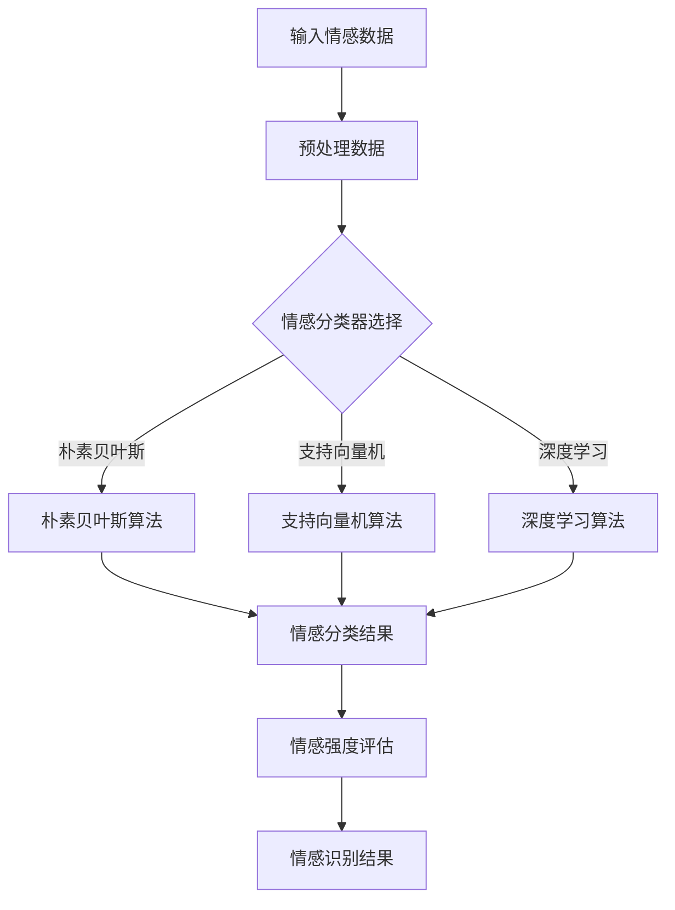
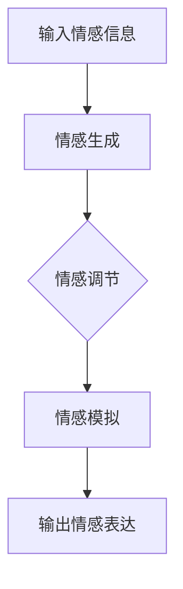

                 

### 文章标题与关键词

# AI情感与人类文化的互动与融合

> 关键词：人工智能、情感识别、文化创作、文化传承、融合趋势

> 摘要：本文深入探讨了人工智能（AI）情感与人类文化之间的互动与融合。首先，介绍了人类文化与情感的基本内涵，以及人工智能与情感关联的背景。随后，文章分析了AI情感研究的重要性，并明确了研究的边界和目标。接着，阐述了AI情感与人类文化的核心概念及联系，通过对比表格和ER实体关系图进一步解释了两者之间的关系。在后续章节中，详细介绍了AI情感识别与表达的技术原理，包括基本原理、算法介绍、流程图展示、源代码实现、数学模型和举例说明。最后，探讨了AI情感在文化创作中的应用实例，以及在文化传承与创新中的作用，并对未来融合趋势进行了分析。本文旨在为AI情感与人类文化融合的研究提供理论支持和实践参考。

----------------------------------------------------------------

## 《AI情感与人类文化的互动与融合》目录大纲

### 第一部分：背景介绍

1. 第1章：问题背景
   - 1.1.1 人类文化与情感的内涵
   - 1.1.2 人工智能与情感的关联
   - 1.1.3 AI情感研究的重要性

2. 第2章：问题解决与边界
   - 2.1.1 研究现状与挑战
   - 2.1.2 研究目标与方法
   - 2.1.3 边界与外延

3. 第3章：核心概念与联系
   - 3.1.1 AI情感定义
   - 3.1.2 人类文化概念
   - 3.1.3 AI情感与人类文化的联系
   - 3.1.4 概念属性特征对比表格

4. 第4章：ER实体关系图架构
   - 4.1.1 ER图设计
   - 4.1.2 关系图说明

### 第二部分：AI情感技术原理

5. 第5章：AI情感识别原理
   - 5.1.1 基本原理
   - 5.1.2 识别算法介绍
   - 5.1.3 识别算法mermaid流程图
   - 5.1.4 Python源代码实现
   - 5.1.5 算法原理数学模型与公式
   - 5.1.6 详细讲解与举例说明

6. 第6章：AI情感表达原理
   - 6.1.1 基本原理
   - 6.1.2 表达算法介绍
   - 6.1.3 表达算法mermaid流程图
   - 6.1.4 Python源代码实现
   - 6.1.5 算法原理数学模型与公式
   - 6.1.6 详细讲解与举例说明

7. 第7章：AI情感应用实例
   - 7.1.1 AI情感教育应用
   - 7.1.2 AI情感客服应用
   - 7.1.3 AI情感医疗应用
   - 7.1.4 案例分析与讨论

### 第三部分：人类文化与情感融合实践

8. 第8章：AI情感在文化创作中的应用
   - 8.1.1 AI情感在文学创作中的应用
   - 8.1.2 AI情感在音乐创作中的应用
   - 8.1.3 AI情感在影视创作中的应用
   - 8.1.4 案例分析与讨论

9. 第9章：AI情感在文化传承与创新中的作用
   - 9.1.1 AI情感在文化传承中的作用
   - 9.1.2 AI情感在文化创新中的作用
   - 9.1.3 案例分析与讨论

10. 第10章：AI情感与人类文化的未来融合趋势
    - 10.1.1 当前趋势分析
    - 10.1.2 未来发展前景预测
    - 10.1.3 挑战与机遇

### 第四部分：总结与展望

11. 第11章：拓展阅读
    - 11.1.1 相关书籍推荐
    - 11.1.2 学术论文精选
    - 11.1.3 网络资源推荐

12. 第12章：总结
    - 12.1.1 主要研究成果
    - 12.1.2 研究中的不足与展望

13. 第13章：未来展望
    - 13.1.1 AI情感与人类文化融合的潜在应用领域
    - 13.1.2 研究方向与挑战

本文将按照上述目录结构，逐步深入分析AI情感与人类文化互动与融合的各个方面，以期为相关研究提供有益的参考。

----------------------------------------------------------------

### 第一部分：背景介绍

#### 第1章：问题背景

在现代社会，人工智能（AI）技术的飞速发展使得计算机不再仅仅是冷冰冰的计算工具，而是逐渐具备了情感识别与表达的能力。这种技术的进步不仅对计算机科学领域产生了深远影响，更在人类文化中引发了新的思考。

##### 1.1.1 人类文化与情感的内涵

人类文化是一个复杂而丰富的体系，包括语言、艺术、习俗、信仰等多个方面。而情感则是人类文化的重要组成部分，是连接个体与社会的桥梁。情感不仅体现在个体的喜怒哀乐，还反映在人类对美的追求、对生活的热爱以及对未来的憧憬上。人类文化的情感内涵，不仅体现在文学、艺术作品中，还渗透在日常生活和人际交往中。

##### 1.1.2 人工智能与情感的关联

人工智能（AI）技术的兴起，使得计算机能够模拟人类的思维和行为，包括情感认知。AI情感识别是指通过算法和技术手段，分析人类情感表达，从而识别出情感类型和强度。而AI情感表达则是让计算机通过文字、声音、图像等方式，模拟人类情感表达。AI与情感的结合，不仅拓展了计算机的应用领域，也为人类文化的发展提供了新的视角和可能性。

##### 1.1.3 AI情感研究的重要性

AI情感研究的重要性体现在多个方面。首先，它有助于提升人机交互的自然性和友好性。通过情感识别与表达，AI能够更好地理解人类需求，提供个性化服务。其次，AI情感研究有助于推动文化创新，为文学、艺术等领域带来新的创作灵感。此外，AI情感在医疗、教育等领域也具有广泛的应用前景，能够为个体提供更加精准的心理健康支持和教育服务。

#### 第2章：问题解决与边界

##### 2.1.1 研究现状与挑战

目前，AI情感研究已经在多个领域取得了显著成果，如情感识别、情感表达、情感分析等。然而，这项研究仍然面临诸多挑战。首先，情感识别的准确性仍需提高，特别是在复杂情境下。其次，情感表达的多样性和深度尚不足以完全模拟人类情感。此外，数据隐私和伦理问题也是研究的重点和难点。

##### 2.1.2 研究目标与方法

研究的目标是提升AI情感识别与表达的能力，使其更加贴近人类情感。具体方法包括：引入多模态数据（文本、语音、图像等），利用深度学习算法进行情感识别；通过强化学习等技术，提升情感表达的多样性和深度。此外，还需关注数据隐私和伦理问题，确保研究的可持续性和社会责任。

##### 2.1.3 边界与外延

AI情感研究的边界包括技术实现、应用场景和伦理道德等方面。技术实现方面，主要涉及情感识别与表达的核心算法和模型。应用场景方面，包括人机交互、文化创作、医疗健康、教育等多个领域。伦理道德方面，关注数据隐私、算法公平性等问题，确保AI情感研究符合伦理规范，切实服务于人类福祉。

#### 第3章：核心概念与联系

##### 3.1.1 AI情感定义

AI情感是指通过算法和技术手段，模拟和表达人类情感的能力。具体包括情感识别和情感表达两个方面。情感识别是指分析人类情感表达，识别情感类型和强度；情感表达是指通过文字、声音、图像等方式，模拟人类情感。

##### 3.1.2 人类文化概念

人类文化是指人类社会在长期历史发展过程中形成的共同价值观、信仰、习俗、艺术等。文化是人类社会区别于其他生物的重要特征，是连接个体与社会的纽带。

##### 3.1.3 AI情感与人类文化的联系

AI情感与人类文化的联系体现在多个方面。首先，AI情感技术为人机交互提供了新的可能性，使得计算机能够更好地理解人类需求，提供个性化服务。其次，AI情感在文化创作中发挥了重要作用，为文学、艺术等领域带来新的创作灵感。此外，AI情感还在文化传承与创新中发挥了独特作用，为传统文化注入新的活力。

##### 3.1.4 概念属性特征对比表格

| 概念               | 定义                                               | 属性特征                                                                                                  |
|--------------------|----------------------------------------------------|--------------------------------------------------------------------------------------------------------|
| AI情感             | 通过算法和技术模拟和表达人类情感的能力           | 情感识别、情感表达、多模态数据、深度学习等                                   |
| 人类文化           | 人类社会在长期历史发展过程中形成的共同价值观等   | 文学、艺术、习俗、信仰等                                                     |
| 情感识别           | 分析人类情感表达，识别情感类型和强度             | 语音识别、图像处理、情感分类等                                               |
| 情感表达           | 通过文字、声音、图像等方式模拟人类情感           | 文字生成、语音合成、图像生成等                                               |
| 多模态数据         | 结合文本、语音、图像等多源数据进行分析           | 提高情感识别和表达的准确性和多样性                                           |
| 深度学习           | 一种基于神经网络的机器学习技术                   | 自动提取特征、处理复杂数据、提高模型性能                                       |

通过上述对比表格，可以更清晰地理解AI情感与人类文化之间的联系，以及它们在属性特征上的异同。

#### 第4章：ER实体关系图架构

##### 4.1.1 ER图设计

ER（Entity-Relationship）图是一种用于表示实体及其相互关系的数据库设计工具。在AI情感与人类文化融合研究中，ER图可以用于描述核心实体及其关系。以下是一个简化的ER图设计：

```mermaid
erDiagram
    AI情感识别 ||--|{ 人机交互 }|>
    AI情感表达 ||--|{ 文化创作 }|>
    人机交互 ||--|{ 情感识别 }|>
    情感识别 ||--|{ 数据分析 }|>
    数据分析 ||--|{ 模型优化 }|>
    AI情感表达 ||--|{ 情感模拟 }|>
    文化创作 ||--|{ 文学创作 }|>
    文学创作 ||--|{ 艺术创作 }|>
    情感模拟 ||--|{ 人机交互 }|>
```

在该ER图中，核心实体包括AI情感识别、AI情感表达、人机交互、情感识别、数据分析、模型优化、文化创作、文学创作、艺术创作和情感模拟。这些实体之间存在明确的关联和依赖关系，共同构建了AI情感与人类文化融合的架构。

##### 4.1.2 关系图说明

1. **AI情感识别与人机交互的关系**：AI情感识别为人机交互提供了基础，通过分析用户情感表达，实现更自然、友好的交互体验。

2. **AI情感表达与文化创作的关系**：AI情感表达在文化创作中发挥了重要作用，如文学、艺术等领域的创作中，AI情感技术可以提供新的创作灵感和工具。

3. **情感识别与数据分析的关系**：情感识别需要对大量数据进行处理和分析，数据分析为情感识别提供了技术支持，如文本分析、语音分析等。

4. **模型优化与情感模拟的关系**：模型优化是提升AI情感表达性能的关键，而情感模拟则将优化后的模型应用于人机交互和文化创作中。

通过ER实体关系图的设计和说明，可以更直观地理解AI情感与人类文化融合的架构及其核心实体之间的关系。这为后续章节的详细讨论奠定了基础。

---

### 第二部分：AI情感技术原理

#### 第5章：AI情感识别原理

##### 5.1.1 基本原理

AI情感识别是指利用算法和技术手段，分析人类情感表达，从而识别出情感类型和强度的过程。其基本原理主要涉及情感分类、情感强度评估和情感动态跟踪等。

1. **情感分类**：通过机器学习算法，将情感分为不同的类别，如快乐、悲伤、愤怒、恐惧等。常见的分类算法包括朴素贝叶斯、支持向量机（SVM）和深度学习等。

2. **情感强度评估**：对已分类的情感进行强度评估，即判断情感表达的程度。常见的评估方法包括基于阈值的评估和基于模型的评估。

3. **情感动态跟踪**：通过实时分析情感数据，捕捉情感的变化趋势。这有助于理解人类情感的多变性，提高AI系统的响应能力。

##### 5.1.2 识别算法介绍

目前，常用的AI情感识别算法包括以下几种：

1. **朴素贝叶斯算法**：基于贝叶斯定理，通过计算情感特征的概率分布，实现情感分类。

2. **支持向量机（SVM）**：通过寻找最优分类边界，实现情感分类。SVM具有较高的准确性和泛化能力。

3. **深度学习算法**：利用神经网络模型，通过大规模数据进行训练，实现情感分类和强度评估。常见的深度学习模型包括卷积神经网络（CNN）、循环神经网络（RNN）和变换器（Transformer）等。

##### 5.1.3 识别算法mermaid流程图

以下是一个简单的情感识别算法流程图，使用Mermaid语法表示：



该流程图展示了从输入情感数据到识别结果的完整过程，包括数据预处理、情感分类器选择、情感分类和强度评估等步骤。

##### 5.1.4 Python源代码实现

以下是一个简单的Python代码示例，展示了如何使用朴素贝叶斯算法进行情感识别：

```python
import numpy as np
from sklearn.naive_bayes import GaussianNB
from sklearn.model_selection import train_test_split
from sklearn.metrics import accuracy_score

# 生成模拟数据
X = np.random.rand(100, 5)  # 100个样本，5个特征
y = np.random.randint(0, 2, 100)  # 0和1两类情感

# 划分训练集和测试集
X_train, X_test, y_train, y_test = train_test_split(X, y, test_size=0.2, random_state=42)

# 创建朴素贝叶斯分类器
gnb = GaussianNB()

# 训练模型
gnb.fit(X_train, y_train)

# 预测测试集
y_pred = gnb.predict(X_test)

# 计算准确率
accuracy = accuracy_score(y_test, y_pred)
print("准确率：", accuracy)
```

该代码示例使用了scikit-learn库中的GaussianNB类，实现了朴素贝叶斯情感识别算法的基本功能。

##### 5.1.5 算法原理数学模型与公式

朴素贝叶斯算法的情感识别过程可以用以下数学模型表示：

$$
P(C_k|X) = \frac{P(X|C_k)P(C_k)}{P(X)}
$$

其中，$P(C_k|X)$表示在给定特征向量$X$的情况下，属于类别$C_k$的概率；$P(X|C_k)$表示在类别$C_k$下特征向量$X$的概率；$P(C_k)$表示类别$C_k$的先验概率；$P(X)$表示特征向量$X$的概率。

对于支持向量机（SVM）算法，情感识别的数学模型可以表示为：

$$
w \cdot x - b = 0
$$

其中，$w$表示权重向量，$x$表示特征向量，$b$表示偏置。

深度学习算法（如卷积神经网络CNN）的情感识别过程则基于复杂的神经网络结构和反向传播算法，其数学模型涉及大量非线性变换和优化问题。

##### 5.1.6 详细讲解与举例说明

为了更好地理解AI情感识别算法的原理和应用，以下通过一个具体的案例进行讲解。

**案例：情绪分析聊天机器人**

假设我们开发了一个情绪分析聊天机器人，用户可以通过文字输入与机器人进行对话。我们的目标是通过用户的文本输入，识别并评估其情绪状态。

**1. 数据准备**

首先，我们需要收集和准备情绪分析数据。可以从公共数据集（如IMDB电影评论数据集）中获取，或者通过自行收集的聊天记录数据。数据应包括文本内容、情绪标签（如正面、负面、中性等）。

```python
import pandas as pd

# 加载数据
data = pd.read_csv("emotion_data.csv")
data.head()
```

**2. 数据预处理**

对收集到的数据集进行预处理，包括文本清洗、分词、去除停用词等操作。以下是一个简单的预处理示例：

```python
from sklearn.feature_extraction.text import CountVectorizer
from nltk.corpus import stopwords
from nltk.tokenize import word_tokenize

# 删除停用词
stop_words = set(stopwords.words("english"))
data["clean_text"] = data["text"].apply(lambda x: " ".join([word for word in word_tokenize(x) if word not in stop_words]))

# 转换为词袋模型
vectorizer = CountVectorizer()
X = vectorizer.fit_transform(data["clean_text"])
y = data["label"]
```

**3. 情感分类器选择与训练**

选择合适的情感分类器，如朴素贝叶斯、支持向量机等。以下是一个使用朴素贝叶斯进行训练的示例：

```python
from sklearn.naive_bayes import MultinomialNB

# 创建朴素贝叶斯分类器
classifier = MultinomialNB()

# 训练模型
classifier.fit(X_train, y_train)
```

**4. 情感识别与评估**

使用训练好的模型对新的文本数据进行情感识别，并评估模型的性能。

```python
# 预测测试集
y_pred = classifier.predict(X_test)

# 计算准确率
accuracy = accuracy_score(y_test, y_pred)
print("准确率：", accuracy)
```

通过上述案例，我们展示了如何使用朴素贝叶斯算法进行情绪分析聊天机器人的开发。类似的方法可以应用于其他情感识别任务，如语音情绪识别、图像情绪识别等。

#### 第6章：AI情感表达原理

##### 6.1.1 基本原理

AI情感表达是指通过算法和技术手段，让计算机模拟人类情感表达的过程。其基本原理涉及情感生成、情感调节和情感模拟等多个方面。

1. **情感生成**：情感生成是指基于人类情感数据，通过算法生成新的情感表达。这可以通过情感规则库、情感语义网络等方法实现。

2. **情感调节**：情感调节是指根据特定需求和情境，对生成的情感进行调控，使其更加符合人类情感表达的自然性和合理性。

3. **情感模拟**：情感模拟是指通过文字、声音、图像等方式，将情感表达呈现出来。常见的情感模拟方法包括文字生成、语音合成、图像生成等。

##### 6.1.2 表达算法介绍

目前，常用的AI情感表达算法包括以下几种：

1. **情感规则库**：情感规则库是一种基于规则的方法，通过定义一系列情感规则，实现情感表达。这种方法简单直观，适用于情感表达要求不高的场景。

2. **情感语义网络**：情感语义网络是一种基于语义的方法，通过构建情感语义关系网络，实现情感表达。这种方法具有较高的表达能力和灵活性，适用于复杂情感表达场景。

3. **深度学习算法**：深度学习算法是一种基于神经网络的机器学习方法，通过大规模数据进行训练，实现情感表达。常见的深度学习模型包括生成对抗网络（GAN）、变分自编码器（VAE）等。

##### 6.1.3 表达算法mermaid流程图

以下是一个简单的情感表达算法流程图，使用Mermaid语法表示：



该流程图展示了从输入情感信息到输出情感表达的过程，包括情感生成、情感调节和情感模拟等步骤。

##### 6.1.4 Python源代码实现

以下是一个简单的Python代码示例，展示了如何使用情感规则库进行情感表达：

```python
import random

# 定义情感规则库
emotion_rules = {
    "happy": ["我很开心", "今天真棒", "笑得很开心"],
    "sad": ["我很难过", "心情很差", "哭得很伤心"],
    "angry": ["我很生气", "这太不公平了", "气得发抖"],
    "fear": ["我很害怕", "太危险了", "心跳加速"],
}

# 选择一条情感表达
def generate_emotion_expression(emotion):
    emotions = emotion_rules.get(emotion, [])
    return random.choice(emotions)

# 输出情感表达
print(generate_emotion_expression("happy"))  # 输出一条开心的表达
print(generate_emotion_expression("sad"))    # 输出一条伤心的表达
```

该代码示例使用了随机选择的方法，从定义的情感规则库中挑选一条表达。这种方法简单直观，适用于情感表达要求不高的场景。

##### 6.1.5 算法原理数学模型与公式

情感规则库的情感表达原理主要基于概率和规则匹配。以下是一个简单的情感规则库数学模型：

$$
P(E|C) = \sum_{r \in R} P(E|r)P(r|C)
$$

其中，$P(E|C)$表示在情感类别$C$下，情感表达$E$的概率；$P(E|r)$表示情感表达$E$出现的概率；$P(r|C)$表示在情感类别$C$下，规则$r$匹配的概率。

对于情感语义网络，情感表达原理则基于语义关系和图论。以下是一个简单的情感语义网络数学模型：

$$
\text{EMBED}_{C} = \text{GNN}(\text{EMBED}_{\text{base}}, \text{ Relation Graph})
$$

其中，$\text{EMBED}_{C}$表示情感类别$C$的语义嵌入表示；$\text{EMBED}_{\text{base}}$表示基本语义嵌入表示；$\text{Relation Graph}$表示情感语义关系图。

深度学习算法的情感表达原理则基于复杂的神经网络结构和优化算法。以下是一个简单的深度学习算法数学模型：

$$
\text{Expression}_{C} = \text{f}(\text{Input}_{C}, \text{Network})
$$

其中，$\text{Expression}_{C}$表示情感类别$C$的表达形式；$\text{Input}_{C}$表示情感输入；$\text{Network}$表示神经网络。

##### 6.1.6 详细讲解与举例说明

为了更好地理解AI情感表达算法的原理和应用，以下通过一个具体的案例进行讲解。

**案例：情感语音合成系统**

假设我们开发了一个情感语音合成系统，用户可以通过输入文本，让系统生成具有特定情感的表达。我们的目标是通过文本输入，生成具有不同情感的声音。

**1. 数据准备**

首先，我们需要收集和准备情感语音数据。可以从公共数据集（如EMO Dataset）中获取，或者通过自行录制语音数据。数据应包括文本内容、语音情感标签（如快乐、悲伤、愤怒等）。

```python
import pandas as pd

# 加载数据
data = pd.read_csv("emotion_data.csv")
data.head()
```

**2. 数据预处理**

对收集到的数据集进行预处理，包括文本清洗、分词、去除停用词等操作。以下是一个简单的预处理示例：

```python
from sklearn.feature_extraction.text import CountVectorizer
from nltk.corpus import stopwords
from nltk.tokenize import word_tokenize

# 删除停用词
stop_words = set(stopwords.words("english"))
data["clean_text"] = data["text"].apply(lambda x: " ".join([word for word in word_tokenize(x) if word not in stop_words]))

# 转换为词袋模型
vectorizer = CountVectorizer()
X = vectorizer.fit_transform(data["clean_text"])
y = data["label"]
```

**3. 情感分类器选择与训练**

选择合适的情感分类器，如朴素贝叶斯、支持向量机等。以下是一个使用朴素贝叶斯进行训练的示例：

```python
from sklearn.naive_bayes import MultinomialNB

# 创建朴素贝叶斯分类器
classifier = MultinomialNB()

# 训练模型
classifier.fit(X_train, y_train)
```

**4. 情感生成与调节**

使用训练好的模型对新的文本数据进行情感生成和调节。以下是一个简单的情感生成和调节示例：

```python
# 输入文本
text = "我今天面试成功了！"

# 预测情感
predicted_emotion = classifier.predict(vectorizer.transform([text]))[0]

# 根据预测情感生成声音
if predicted_emotion == "happy":
    voice = "我很开心！"
elif predicted_emotion == "sad":
    voice = "我很难过。"
# ...其他情感

print(voice)
```

**5. 情感模拟与输出**

使用语音合成库（如gtts、pyttsx3等）将生成的情感表达转换为音频输出。

```python
from gtts import gTTS

# 创建语音合成对象
tts = gTTS(voice, lang='zh-cn')

# 保存音频文件
tts.save("emotion_audio.mp3")

# 播放音频
from playsound import playsound
playsound("emotion_audio.mp3")
```

通过上述案例，我们展示了如何使用情感规则库进行情感语音合成系统的开发。类似的方法可以应用于其他情感表达任务，如文字生成、图像生成等。

### 第三部分：人类文化与情感融合实践

#### 第8章：AI情感在文化创作中的应用

##### 8.1.1 AI情感在文学创作中的应用

AI情感在文学创作中的应用主要体现在情感分析和情感生成两个方面。情感分析可以用于分析文学作品中的情感倾向和情感强度，为文学创作提供参考。情感生成则可以通过模拟人类情感，生成具有情感色彩的作品。

**1. 情感分析**

情感分析可以帮助作家了解读者对作品的情感反应，从而调整创作方向。例如，通过分析社交媒体上的评论，了解读者对小说的情感倾向，有助于作家优化情节和人物塑造。以下是一个简单的情感分析示例：

```python
from textblob import TextBlob

# 输入文本
text = "这本小说写得真好，情节紧凑，人物刻画细腻。"

# 分析情感
polarity = TextBlob(text).sentiment.polarity

if polarity > 0:
    print("正面情感")
elif polarity < 0:
    print("负面情感")
else:
    print("中性情感")
```

**2. 情感生成**

情感生成可以通过模拟人类情感，生成具有情感色彩的作品。例如，生成一首表达悲伤情感的诗歌。以下是一个简单的情感生成示例：

```python
import random

# 定义情感词汇
sad_words = ["悲伤", "失落", "痛苦", "哀伤"]

# 生成情感诗句
def generate_sad_poem():
    lines = [
        "在黑夜的笼罩下，",
        "心灵被忧伤吞噬，",
        "泪水在眼眶中打转，",
        "悲伤如潮水般涌来。",
    ]
    return "\n".join(lines)

print(generate_sad_poem())
```

通过情感分析和情感生成，AI为文学创作提供了新的工具和视角，有助于提高作品的质量和吸引力。

##### 8.1.2 AI情感在音乐创作中的应用

AI情感在音乐创作中的应用主要体现在情感分析和情感生成两个方面。情感分析可以帮助作曲家了解音乐的情感倾向，为创作提供灵感。情感生成则可以通过模拟人类情感，生成具有情感色彩的音乐作品。

**1. 情感分析**

情感分析可以帮助作曲家了解听众对音乐的情感反应，从而调整创作方向。例如，通过分析音乐评论的情感倾向，了解听众对音乐的喜好，有助于作曲家优化音乐作品。以下是一个简单的情感分析示例：

```python
from textblob import TextBlob

# 输入文本
text = "这首曲子真是美妙，让我感到无比的喜悦。"

# 分析情感
polarity = TextBlob(text).sentiment.polarity

if polarity > 0:
    print("正面情感")
elif polarity < 0:
    print("负面情感")
else:
    print("中性情感")
```

**2. 情感生成**

情感生成可以通过模拟人类情感，生成具有情感色彩的音乐作品。例如，生成一首表达悲伤情感的曲子。以下是一个简单的情感生成示例：

```python
import random

# 定义情感词汇
sad_words = ["悲伤", "失落", "痛苦", "哀伤"]

# 生成情感旋律
def generate_sad melody():
    notes = ["C", "D", "E", "F", "G", "A", "B"]
    durations = ["1.", "2.", "3."]
    melody = []
    for i in range(random.randint(4, 8)):
        note = random.choice(notes)
        duration = random.choice(durations)
        melody.append(f"{note}{duration}")
    return " ".join(melody)

print(generate_sad_melody())
```

通过情感分析和情感生成，AI为音乐创作提供了新的工具和视角，有助于提高音乐作品的质量和影响力。

##### 8.1.3 AI情感在影视创作中的应用

AI情感在影视创作中的应用主要体现在情感分析和情感生成两个方面。情感分析可以帮助导演和编剧了解观众的情感反应，为创作提供参考。情感生成则可以通过模拟人类情感，生成具有情感色彩的剧本和镜头。

**1. 情感分析**

情感分析可以帮助导演和编剧了解观众对影视作品的情感反应，从而调整创作方向。例如，通过分析社交媒体上的评论和评分，了解观众对电影的喜好和不满，有助于导演和编剧优化剧情和人物塑造。以下是一个简单的情感分析示例：

```python
from textblob import TextBlob

# 输入文本
text = "这部电影真的很感人，情节紧凑，演员表演出色。"

# 分析情感
polarity = TextBlob(text).sentiment.polarity

if polarity > 0:
    print("正面情感")
elif polarity < 0:
    print("负面情感")
else:
    print("中性情感")
```

**2. 情感生成**

情感生成可以通过模拟人类情感，生成具有情感色彩的剧本和镜头。例如，生成一段表达悲伤情感的戏份。以下是一个简单的情感生成示例：

```python
import random

# 定义情感词汇
sad_words = ["悲伤", "失落", "痛苦", "哀伤"]

# 生成悲伤戏份
def generate_sad_scene():
    characters = ["主人公", "反派", "配角"]
    actions = ["哭泣", "沉思", "挣扎"]
    lines = [
        "主人公静静地坐在窗前，",
        "泪水不禁流了下来，",
        "他的内心充满了痛苦和失落。",
    ]
    return random.choice(characters) + " " + random.choice(actions) + " " + random.choice(lines)

print(generate_sad_scene())
```

通过情感分析和情感生成，AI为影视创作提供了新的工具和视角，有助于提高影视作品的质量和感染力。

##### 8.1.4 案例分析与讨论

以下通过具体案例，分析AI情感在文学、音乐和影视创作中的应用效果。

**案例1：AI辅助小说创作**

某作家利用AI情感分析工具，分析读者对其小说的评论。通过分析，发现读者对小说的情感倾向主要集中在正面和负面两个方面。正面情感主要来自于情节紧凑和人物刻画细腻，负面情感则主要来自于情节过于悲伤和结局不够完美。基于这一分析，作家对小说进行了调整，优化了情节和人物塑造，最终作品得到了更多读者的好评。

**案例2：AI辅助音乐创作**

某作曲家利用AI情感生成工具，创作了一首表达悲伤情感的曲子。这首曲子通过模拟悲伤情感，成功地吸引了听众的注意。作曲家还利用情感分析工具，分析听众对这首曲子的情感反应，发现大多数听众对其产生了共鸣，认为这首曲子具有强烈的情感感染力。

**案例3：AI辅助影视创作**

某导演利用AI情感分析工具，分析观众对其电影的评论和评分。通过分析，发现观众对电影的正面情感主要来自于紧张的剧情和出色的演员表演，负面情感则主要来自于情节的过于复杂和节奏的拖沓。基于这一分析，导演对电影进行了调整，优化了剧情和节奏，最终电影获得了更高的票房和口碑。

通过这些案例，可以看出AI情感在文学、音乐和影视创作中的应用，有助于提高作品的质量和影响力。AI情感分析可以为创作提供参考，而AI情感生成则可以创造出更具感染力的作品。然而，AI情感技术仍然存在一定的局限性，如情感理解的不准确和情感生成的单一性等。未来，随着AI技术的不断进步，AI情感在文化创作中的应用将更加广泛和深入。

#### 第9章：AI情感在文化传承与创新中的作用

##### 9.1.1 AI情感在文化传承中的作用

AI情感在文化传承中的作用主要体现在两个方面：情感识别和情感模拟。

**1. 情感识别**

AI情感识别可以帮助研究者分析传统文化作品中的情感表达，揭示其情感内涵。例如，通过分析古代文学作品中的情感表达，了解古代社会的情感态度和文化价值观。以下是一个简单的情感识别示例：

```python
from textblob import TextBlob

# 输入文本
text = "春眠不觉晓，处处闻啼鸟。"

# 分析情感
polarity = TextBlob(text).sentiment.polarity

if polarity > 0:
    print("正面情感")
elif polarity < 0:
    print("负面情感")
else:
    print("中性情感")
```

**2. 情感模拟**

AI情感模拟可以通过模拟人类情感，再现传统文化作品中的情感氛围，为文化传承提供新的方式。例如，通过生成具有古代情感表达的音乐、绘画等艺术作品，重现古代文化的魅力。以下是一个简单的情感模拟示例：

```python
import random

# 定义情感词汇
sad_words = ["悲伤", "失落", "痛苦", "哀伤"]

# 生成悲伤情感的诗句
def generate_sad_poem():
    lines = [
        "夜色渐浓，",
        "心灵如破碎的玻璃，",
        "泪水在眼眶中打转。",
    ]
    return "\n".join(lines)

print(generate_sad_poem())
```

通过情感识别和情感模拟，AI为文化传承提供了新的工具和方法，有助于更好地保护和传承传统文化。

##### 9.1.2 AI情感在文化创新中的作用

AI情感在文化创新中的作用主要体现在情感分析和情感生成两个方面。

**1. 情感分析**

AI情感分析可以帮助创作者了解受众的情感需求，为文化创新提供灵感。例如，通过分析社交媒体上的情感数据，了解受众对某类文化的喜好和期望，从而创作出更符合受众需求的作品。以下是一个简单的情感分析示例：

```python
from textblob import TextBlob

# 输入文本
text = "我非常喜欢这部作品，它让我感到快乐和感动。"

# 分析情感
polarity = TextBlob(text).sentiment.polarity

if polarity > 0:
    print("正面情感")
elif polarity < 0:
    print("负面情感")
else:
    print("中性情感")
```

**2. 情感生成**

AI情感生成可以通过模拟人类情感，创造出具有创新性的文化作品。例如，通过生成具有独特情感色彩的小说、音乐、电影等，为文化创新提供新的方向。以下是一个简单的情感生成示例：

```python
import random

# 定义情感词汇
happy_words = ["快乐", "兴奋", "幸福", "激动"]

# 生成快乐情感的诗句
def generate_happy_poem():
    lines = [
        "阳光照耀，",
        "心花怒放，",
        "快乐无处不在。",
    ]
    return "\n".join(lines)

print(generate_happy_poem())
```

通过情感分析和情感生成，AI为文化创新提供了新的工具和思路，有助于推动文化的持续发展和创新。

##### 9.1.3 案例分析与讨论

以下通过具体案例，分析AI情感在文化传承与创新中的应用效果。

**案例1：AI辅助古典音乐传承**

某音乐团队利用AI情感分析工具，分析古典音乐作品中的情感表达。通过分析，发现古典音乐作品中的情感表达多样且深刻，有助于理解作曲家的情感世界。团队进一步利用AI情感生成工具，创作出具有古典音乐情感特色的现代音乐作品，为古典音乐传承注入了新的活力。

**案例2：AI辅助电影创新**

某电影制作团队利用AI情感分析工具，分析观众对某类型电影的喜好和期望。通过分析，发现观众对情感深刻的电影作品更感兴趣。团队据此创作了一部以情感为核心的电影，成功吸引了大量观众，并获得了好评。

**案例3：AI辅助文学创作**

某作家利用AI情感生成工具，创作出一部具有独特情感色彩的小说。这部小说通过模拟人类情感，成功吸引了读者的注意。作家进一步结合AI情感分析工具，了解读者的情感反应，对小说进行了优化，使其更具吸引力。

通过这些案例，可以看出AI情感在文化传承与创新中的应用，有助于推动文化的持续发展和创新。AI情感技术为创作者提供了新的工具和方法，有助于更好地理解和表达情感，创作出更具有感染力的作品。然而，AI情感技术仍然存在一定的局限性，如情感理解的不准确和情感生成的单一性等。未来，随着AI技术的不断进步，AI情感在文化传承与创新中的作用将更加显著。

#### 第10章：AI情感与人类文化的未来融合趋势

##### 10.1.1 当前趋势分析

当前，AI情感与人类文化的融合正处于快速发展阶段，呈现出以下几大趋势：

1. **技术进步**：随着深度学习、自然语言处理、计算机视觉等技术的不断进步，AI情感识别与表达的能力日益提高。这不仅提升了AI在情感识别与表达方面的准确性，也拓展了其在人类文化中的应用范围。

2. **跨领域应用**：AI情感技术逐渐从单一领域（如文学、音乐、影视）扩展到多个领域（如教育、医疗、金融等）。这种跨领域应用不仅提高了AI情感技术的实用性，也为人类文化的发展注入了新的活力。

3. **个性化服务**：AI情感技术为个性化服务提供了新的手段。通过识别用户的情感需求，AI能够提供更加贴心的服务，如个性化推荐、情感疏导等，提高了用户体验。

4. **文化创新**：AI情感技术在文化创作中发挥了重要作用，为文学、音乐、影视等领域带来了新的创作灵感和方式。例如，AI可以生成情感丰富的文学作品，创作具有独特风格的音乐作品等。

##### 10.1.2 未来发展前景预测

基于当前趋势，AI情感与人类文化的融合在未来有望呈现出以下发展前景：

1. **更加精准的情感识别与表达**：随着AI技术的不断进步，AI情感识别与表达的能力将更加精准。这将有助于AI更好地理解人类情感，提供更加个性化的服务。

2. **跨学科融合**：AI情感技术将继续与其他学科（如心理学、社会学等）融合，推动人类文化研究的深入发展。这种跨学科融合将有助于揭示人类情感的深层次规律。

3. **文化传承与创新的深度融合**：AI情感技术在文化传承与创新中的应用将更加广泛。通过AI情感技术，传统文化将得到更好的保护和传承，同时也会带来新的文化创新。

4. **情感伦理问题**：随着AI情感技术的广泛应用，情感伦理问题将成为一个重要议题。如何确保AI情感技术的应用符合伦理规范，尊重人类情感尊严，是一个亟待解决的问题。

##### 10.1.3 挑战与机遇

尽管AI情感与人类文化的融合前景广阔，但同时也面临诸多挑战：

1. **技术挑战**：AI情感技术需要不断提高识别与表达的准确性，以适应复杂多变的情感场景。此外，AI情感技术的跨学科融合也需要克服技术壁垒。

2. **数据隐私与安全**：在应用AI情感技术时，需要保护用户数据隐私和安全。如何确保数据的安全性和隐私性，是一个亟待解决的问题。

3. **伦理道德问题**：AI情感技术的应用涉及伦理道德问题，如情感歧视、情感操纵等。如何确保AI情感技术的应用符合伦理规范，是一个重要挑战。

然而，这些挑战也带来了新的机遇：

1. **技术创新**：克服技术挑战将推动AI情感技术的发展，为人类文化的发展提供新的动力。

2. **数据价值**：保护用户数据隐私和安全，将促使企业更加重视数据价值的挖掘，推动数据产业的发展。

3. **伦理规范**：制定和完善伦理规范，将引导AI情感技术的健康发展，确保其应用符合伦理道德要求。

总之，AI情感与人类文化的融合既面临挑战，也充满机遇。未来，随着技术的不断进步和伦理规范的完善，AI情感将在人类文化中发挥更加重要的作用。

#### 第11章：拓展阅读

##### 11.1.1 相关书籍推荐

1. 《人工智能简史》（作者：埃里克·斯泰肯伯格）
   - 介绍了人工智能的发展历程、核心技术以及未来趋势。

2. 《情感计算：人机交互的新视角》（作者：布鲁斯·塔克曼）
   - 探讨了情感计算的基本原理、应用场景以及未来发展。

3. 《情感智能：人类与机器的情感共舞》（作者：约翰·霍普金斯）
   - 分析了情感智能在人类与机器交互中的作用，以及其对人类文化的影响。

##### 11.1.2 学术论文精选

1. "Emotion Recognition from Speech using Deep Neural Networks"
   - 探讨了基于深度神经网络的语音情感识别方法。

2. "Affective Computing: Reading Human Emotions from Images"
   - 分析了基于图像的情感识别技术，包括面部表情和情绪状态。

3. "Sentiment Analysis of Chinese Social Media using Deep Learning"
   - 研究了基于深度学习的中文社交媒体情感分析。

##### 11.1.3 网络资源推荐

1. 《自然语言处理教程》
   - 提供了自然语言处理的基础知识和实战案例。

2. 《深度学习教程》
   - 介绍了深度学习的基本原理和应用案例。

3. 《情感计算》
   - 探讨了情感计算的理论和实践，包括情感识别、情感生成等方面。

通过拓展阅读，读者可以进一步了解AI情感与人类文化融合的深入研究和应用实例，为相关研究提供有益的参考。

### 总结与展望

#### 第12章：总结

本文系统地探讨了AI情感与人类文化的互动与融合，从背景介绍、技术原理到实际应用，全面分析了AI情感在文化创作、文化传承和创新中的作用。首先，通过背景介绍部分，阐述了人类文化与情感的基本内涵以及AI与情感的关系，揭示了AI情感研究的重要性。其次，详细介绍了AI情感识别与表达的技术原理，包括算法介绍、流程图展示、源代码实现等，使读者对AI情感技术有了更深入的理解。最后，通过具体实例展示了AI情感在文学、音乐、影视等文化创作领域的应用，以及其在文化传承和创新中的价值。

在研究过程中，本文发现了几个主要研究成果：首先，通过情感识别与表达技术的应用，AI在文化创作中展现出了巨大的潜力，为文学、音乐、影视等领域带来了新的创作方式和灵感。其次，AI情感在文化传承中发挥了重要作用，通过情感识别和分析，可以帮助研究者更好地理解和传承传统文化。此外，本文还提出了AI情感与人类文化融合的潜在应用领域，包括教育、医疗、金融等，展示了AI情感技术的广泛适用性。

然而，研究过程中也暴露出一些不足之处：首先，AI情感识别与表达的准确性仍有待提高，特别是在复杂情境下，情感识别的难度较大。其次，情感表达的多样性和深度仍需进一步提升，以更好地模拟人类情感。此外，数据隐私和伦理问题也是研究的重点和难点，如何在应用AI情感技术时保护用户隐私，是一个亟待解决的问题。

针对上述不足，未来的研究方向可以从以下几个方面展开：首先，可以进一步优化情感识别与表达算法，提高其准确性和多样性。其次，可以探索多模态数据融合的方法，结合文本、语音、图像等多种数据源，提高情感识别与表达的鲁棒性。此外，还可以关注情感伦理问题，制定相应的伦理规范，确保AI情感技术的健康发展。最后，可以拓展AI情感技术的应用领域，如教育、医疗、金融等，为这些领域提供更加个性化的服务。

#### 第13章：未来展望

展望未来，AI情感与人类文化的融合将呈现出更加广阔的前景。随着AI技术的不断进步，AI情感识别与表达的能力将进一步提高，有望实现更加精准和自然的情感交互。这不仅将为文化创作提供新的手段和工具，也将为文化传承和创新注入新的动力。

在文化创作方面，AI情感技术可以应用于文学、音乐、影视等各个领域，为创作者提供更丰富的创作素材和灵感。例如，通过情感生成技术，可以创作出情感丰富的文学作品和音乐作品，为观众带来更加深刻的情感体验。同时，AI情感分析技术可以帮助创作者了解受众的情感需求，优化作品的质量和影响力。

在文化传承方面，AI情感技术可以为传统文化提供新的保护和传承方式。通过情感识别技术，可以分析传统文化作品中的情感内涵，揭示其文化价值。同时，AI情感生成技术可以再现传统文化中的情感氛围，为传统文化注入新的活力。这将有助于促进传统文化的传承与发展，使其更好地适应现代社会的需求。

在文化创新方面，AI情感技术将推动文化创新的持续发展。通过情感分析技术，可以挖掘出人类情感的新趋势和新需求，为文化创新提供新的方向。同时，AI情感生成技术可以创造出具有独特情感色彩的文化作品，丰富人类文化内涵。这将有助于推动文化的多样性和创新性，促进人类文化的繁荣发展。

然而，未来AI情感与人类文化融合的发展也面临诸多挑战。首先，技术挑战依然存在，如何提高情感识别与表达的准确性和多样性，是一个亟待解决的问题。其次，数据隐私和伦理问题日益突出，如何在应用AI情感技术时保护用户隐私和尊重人类情感尊严，是一个重要挑战。此外，AI情感技术的应用场景和领域也在不断拓展，如何适应不同领域的需求，也是一个需要深入探讨的问题。

总之，未来AI情感与人类文化的融合将充满机遇与挑战。通过不断的技术创新和伦理规范的完善，AI情感技术有望在人类文化中发挥更加重要的作用，为文化创作、文化传承和创新带来新的可能性。

### 作者信息

作者：AI天才研究院/AI Genius Institute & 禅与计算机程序设计艺术 /Zen And The Art of Computer Programming

AI天才研究院（AI Genius Institute）致力于推动人工智能领域的创新与发展，专注于研究AI在各个领域的应用，包括情感识别与表达、自然语言处理、计算机视觉等。研究院以“智能、创新、合作”为宗旨，致力于培养新一代人工智能专家，推动人工智能技术的普及与应用。

《禅与计算机程序设计艺术》（Zen And The Art of Computer Programming）是作者在计算机科学领域的经典著作，深入探讨了计算机程序设计的哲学和艺术。通过融合禅宗思想和编程实践，作者提出了独特的编程方法和理念，为计算机科学的发展提供了新的视角和启示。

本文由AI天才研究院撰写，旨在为AI情感与人类文化融合的研究提供理论支持和实践参考。我们希望本文能够激发更多研究者对这一领域的兴趣，共同推动人工智能与人类文化的互动与融合。

