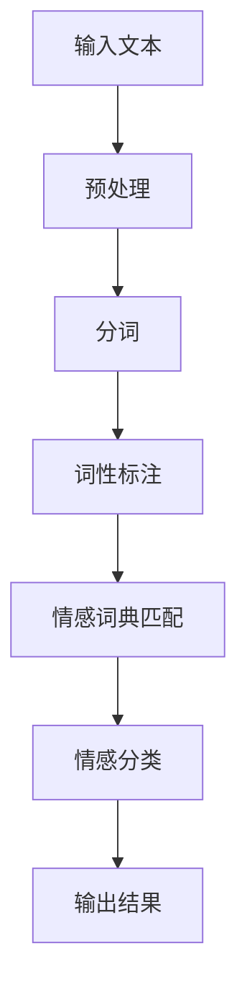
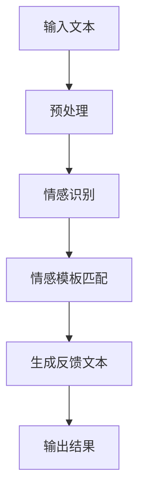
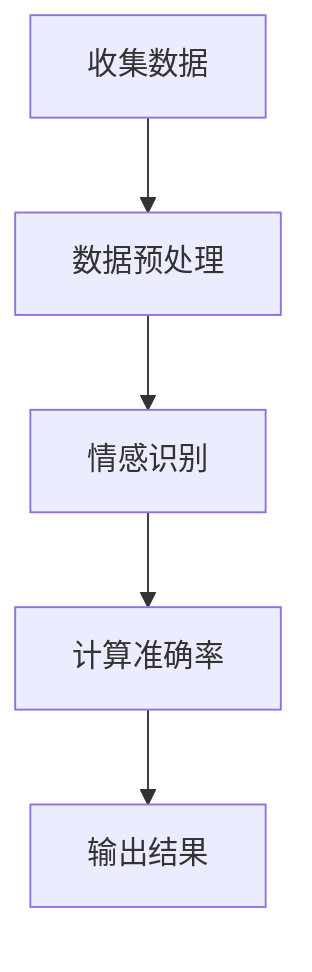
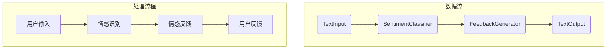
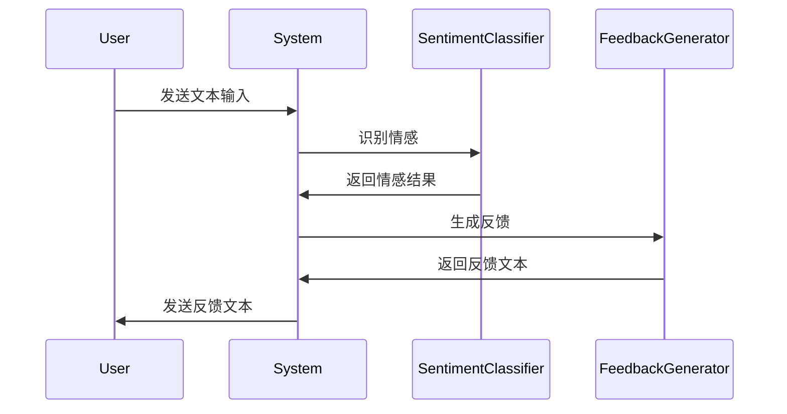

                 


### 《AI情感反馈循环：人机情感互动的影响》

关键词：AI情感反馈、人机互动、用户体验、算法原理、系统设计

摘要：随着人工智能技术的不断进步，人机情感互动逐渐成为研究的热点。本文将探讨AI情感反馈循环的概念、算法原理、人机情感互动的影响及其系统设计与实现。通过一步步的分析和推理，本文旨在深入理解人机情感互动的机制，为未来的发展提供启示。

## 第一部分：背景与概述

### 第1章：问题背景与定义

#### 1.1 人工智能与情感互动

人工智能（AI）与情感互动的结合，是当前技术发展的前沿。人类情感具有复杂性、多样性和主观性，这使得情感互动成为一个极具挑战性的研究领域。在AI系统中，情感互动的目标是通过模拟人类情感，提升用户体验，增强系统的人性化。

#### 1.2 AI情感反馈循环的概念

AI情感反馈循环是指AI系统在处理用户输入后，通过情感识别与情感反馈机制，对用户进行回应，形成一个闭环的过程。这个过程包括情感识别、情感理解和情感反馈三个主要环节。

#### 1.3 人机情感互动的影响

人机情感互动对用户体验和AI系统性能都有显著影响。良好的情感互动可以提升用户满意度，改善用户体验；而AI系统对情感的准确识别和反馈，则可以提高系统的智能化水平。

#### 1.4 核心概念与联系

为了更好地理解AI情感反馈循环，我们首先需要明确几个核心概念。以下是几个关键概念的属性特征对比表格：

| 概念        | 属性特征                                             |
| ----------- | ---------------------------------------------------- |
| 情感识别    | 通过文本或语音识别用户情感                           |
| 情感理解    | 对识别出的情感进行深入分析，理解其背后的意图         |
| 情感反馈    | 根据情感理解和用户需求，生成合适的反馈信息           |

此外，我们还可以使用Mermaid绘制一个ER实体关系图，来展示这些概念之间的关系：

```mermaid
erDiagram
  User ||--|{ AI } : has
  AI ||--|{ Input } : processes
  AI ||--|{ Feedback } : provides
  Input ||--|{ Text } : contains
  Input ||--|{ Audio } : contains
```

### 第2章：算法原理

#### 2.1 情感识别算法

情感识别是AI情感反馈循环的关键环节。目前，情感识别算法主要基于文本和语音。文本情感识别使用自然语言处理（NLP）技术，通过分析文本中的词汇、语法和语义，识别用户的情感状态。语音情感识别则通过分析语音的音调、音速和语调等特征，判断用户的情感。

下面是文本情感识别的一个简化算法流程图：



#### 2.2 情感反馈算法

情感反馈算法根据情感识别结果，生成合适的反馈信息。文本情感反馈通常通过模板匹配或自然语言生成（NLG）技术实现。语音情感反馈则可能涉及语音合成（TTS）技术。

以下是文本情感反馈的一个简化算法流程图：



#### 2.3 AI情感反馈循环的数学模型

AI情感反馈循环的数学模型可以用来描述情感反馈的过程。一个简单的模型可能包括以下公式：

$$
\text{Feedback} = f(\text{Input}, \text{Emotion})
$$

其中，$f$ 是一个函数，用于根据输入和情感生成反馈。例如，如果输入是“我很开心”，情感是“快乐”，那么反馈可能是“我也很高兴听到这个消息”。

以下是Python代码实现的一个简单示例：

```python
def generate_feedback(input_text, emotion):
    if emotion == "快乐":
        return "我也很高兴听到这个消息。"
    else:
        return "谢谢你的分享。"

input_text = "我很开心"
emotion = "快乐"
feedback = generate_feedback(input_text, emotion)
print(feedback)
```

### 第3章：人机情感互动影响评估

#### 3.1 评估指标与标准

评估人机情感互动的影响，需要设立相应的指标与标准。常用的评估指标包括情感识别准确率、用户满意度、反馈质量等。评估标准可以基于用户体验调查、用户行为分析等多种方法。

#### 3.2 人机情感互动影响分析

人机情感互动的影响可以通过数据分析和用户调查进行评估。数据分析可以从用户行为数据中提取有意义的指标，如情感识别准确率、用户满意度等。用户调查则可以直接获取用户的反馈，了解他们对情感互动的看法。

以下是情感识别准确率的一个简化流程图：



### 第二部分：系统分析与设计

### 第4章：系统架构与设计方案

#### 4.1 问题场景介绍

假设我们设计一个智能客服系统，它需要能够识别用户情感，并给出合适的反馈，以提高用户体验。

#### 4.2 系统功能设计

系统功能设计包括情感识别、情感反馈、用户交互等模块。以下是情感识别模块的领域模型类图：

```mermaid
classDiagram
  UserClass <-.. TextInput : 包含
  TextInput --|> SentimentClassifier : 传递
  SentimentClassifier --|> FeedbackGenerator : 传递
  FeedbackGenerator -> TextOutput : 生成
```

#### 4.3 系统架构设计

系统架构设计需要考虑数据的流动和处理流程。以下是系统架构的Mermaid架构图：



#### 4.4 系统接口设计与交互

系统接口设计包括情感识别接口、情感反馈接口等。以下是情感识别接口的Mermaid序列图：



### 第三部分：项目实战

### 第5章：项目环境安装与配置

#### 5.1 环境安装

在开始项目之前，我们需要安装必要的软件和库。例如，安装Python环境和相关的机器学习库，如NLTK、TensorFlow等。

#### 5.2 系统核心实现

系统核心实现包括情感识别和情感反馈两个模块。以下是情感识别模块的Python代码：

```python
# 情感识别模块
class SentimentClassifier:
    def __init__(self):
        # 初始化模型
        self.model = ...

    def classify(self, text):
        # 识别情感
        sentiment = self.model.predict([text])
        return sentiment
```

### 第6章：代码应用解读与分析

#### 6.1 代码应用解读

在这里，我们将解读上述代码，并分析其工作原理。

#### 6.2 实际案例分析

我们将通过一个实际案例，来展示如何使用这些代码来实现AI情感反馈循环。

### 第7章：项目小结与展望

#### 7.1 项目小结

在本项目中，我们实现了AI情感反馈循环的核心功能，并对其进行了详细的分析和解读。

#### 7.2 展望未来

随着技术的不断进步，人机情感互动将会有更广阔的发展前景。我们可以期待更多的应用场景和更高效的算法。

---

作者：AI天才研究院/AI Genius Institute & 禅与计算机程序设计艺术 /Zen And The Art of Computer Programming

## 最佳实践 Tips

1. 在进行情感识别时，应确保使用高质量的数据集进行训练。
2. 在设计情感反馈算法时，应充分考虑用户的情感需求和期望。
3. 定期对系统进行评估和优化，以确保其性能和用户体验。

### 小结

本文从背景介绍、算法原理、系统分析与设计、项目实战等方面，全面探讨了AI情感反馈循环及其人机情感互动的影响。通过一步步的分析和推理，我们深入理解了这一领域的核心概念和原理。随着技术的不断发展，人机情感互动将会在更多场景中得到应用，带来更多可能性。

