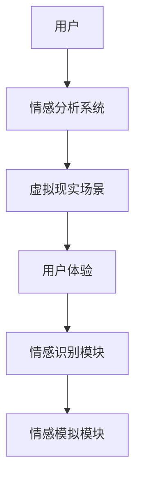

                 

### AI情感分析原理

#### 2.1.1 基本概念

情感分析（Sentiment Analysis），又称意见挖掘，是自然语言处理（NLP）的一个分支，旨在通过识别文本中的情感倾向，对文本内容进行分类和标注。在人工智能（AI）领域，情感分析被广泛应用于社交媒体监测、市场研究、客户反馈分析等多个场景。

情感分类（Sentiment Classification）是情感分析的核心任务，其目标是将文本中的情感信息分为不同的类别，如正面、负面、中性等。情感分类的方法可以分为以下几类：

- **基于规则的模型**：这种模型利用预定义的规则进行情感分析，如关键词匹配、情感词典等。规则模型简单直观，但面对复杂的语言环境时，其表现往往不如机器学习模型。

- **基于机器学习的模型**：这类模型通过学习大量的标注数据，自动提取特征，从而对未知文本进行情感分类。常见的机器学习算法包括支持向量机（SVM）、朴素贝叶斯（Naive Bayes）、随机森林（Random Forest）和深度学习模型（如卷积神经网络（CNN）、循环神经网络（RNN）等）。

#### 2.1.2 AI情感分析流程

AI情感分析通常包括以下几个步骤：

1. **数据采集与预处理**：收集大量的标注数据集，对文本进行清洗、去噪和格式化，以准备用于模型训练和测试。

2. **特征提取**：将原始文本转换为机器学习模型可处理的特征表示。常见的特征提取方法包括词袋模型（Bag of Words）、TF-IDF（Term Frequency-Inverse Document Frequency）和词嵌入（Word Embedding）。

3. **模型选择与训练**：选择合适的机器学习模型，并在训练集上进行训练。模型的性能通过交叉验证（Cross-Validation）和性能指标（如准确率、召回率、F1值等）进行评估。

4. **情感识别与分类**：将训练好的模型应用于新的文本数据，识别和分类文本中的情感。

5. **情感反馈与优化**：根据模型预测结果，对情感识别的准确性和实时性进行反馈，不断优化模型。

#### 2.1.3 情感分析模型

情感分析模型的选择取决于具体应用场景和需求。以下是一些常用的情感分析模型：

- **基于规则的模型**：如情感词典模型，利用预定义的情感词典和规则对文本进行情感分类。例如，如果文本中包含“快乐”、“高兴”等正面词汇，则判定为正面情感。

  ```mermaid
  graph TD
  A[输入文本] --> B[情感词典匹配]
  B -->|匹配结果| C[分类结果]
  ```

- **基于机器学习的模型**：利用机器学习算法训练分类模型，如支持向量机（SVM）和朴素贝叶斯（Naive Bayes）。

  ```python
  from sklearn.model_selection import train_test_split
  from sklearn.svm import SVC

  # 数据预处理
  X_train, X_test, y_train, y_test = train_test_split(X, y, test_size=0.2, random_state=42)

  # 训练模型
  model = SVC(kernel='linear')
  model.fit(X_train, y_train)

  # 预测
  predictions = model.predict(X_test)
  ```

- **深度学习模型**：如卷积神经网络（CNN）和循环神经网络（RNN），特别是长短期记忆网络（LSTM）在处理序列数据时表现出色。

  ```python
  import tensorflow as tf
  from tensorflow.keras.models import Sequential
  from tensorflow.keras.layers import Embedding, LSTM, Dense

  # 建立模型
  model = Sequential([
      Embedding(input_dim=vocab_size, output_dim=embedding_dim),
      LSTM(units=128),
      Dense(units=1, activation='sigmoid')
  ])

  # 编译模型
  model.compile(optimizer='adam', loss='binary_crossentropy', metrics=['accuracy'])

  # 训练模型
  model.fit(X_train, y_train, epochs=10, batch_size=64)
  ```

#### 2.1.4 情感分析性能评估

情感分析模型的性能评估通常通过以下指标进行：

- **准确率（Accuracy）**：模型正确分类的样本占总样本的比例。
- **召回率（Recall）**：模型正确分类为正面的样本占所有正面样本的比例。
- **F1值（F1 Score）**：综合考虑准确率和召回率的平衡指标。

  $$ F1 = 2 \times \frac{precision \times recall}{precision + recall} $$

- **精确率（Precision）**：模型正确分类为正面的样本占所有被分类为正面的样本的比例。

  $$ precision = \frac{TP}{TP + FP} $$

- **误报率（False Alarm Rate, FAR）**：模型错误分类为正面的样本占所有被分类为负面的样本的比例。

  $$ FAR = \frac{FP}{FP + TN} $$

通过这些指标，可以全面评估情感分析模型的性能，并在模型优化过程中进行调整。

#### 2.1.5 情感分析应用场景

情感分析技术在实际应用中非常广泛，以下是一些典型场景：

- **社交媒体监测**：通过分析用户在社交媒体平台上的评论和帖子，了解公众对品牌、产品或事件的情感倾向。
- **市场研究**：分析消费者反馈，帮助企业了解产品优势和改进方向。
- **客户服务**：通过对客户服务数据的情感分析，快速识别和解决用户问题，提升客户满意度。
- **情感计算**：在虚拟现实（VR）和增强现实（AR）应用中，通过情感分析技术识别用户的情感状态，提供个性化的互动体验。

### 2.1.6 小结

本章介绍了AI情感分析的基本概念、流程、模型和性能评估方法。通过逐步分析，读者可以理解情感分析技术在识别和模拟人类情感中的应用，以及其在虚拟现实中的应用前景。在下一章中，我们将深入探讨虚拟现实（VR）应用场景中的AI情感技术，进一步了解其在提升用户体验方面的潜力。

#### 2.2 虚拟现实（VR）应用场景

虚拟现实（VR）技术通过模拟现实环境，使用户在虚拟世界中产生强烈的沉浸感。随着AI情感分析技术的进步，VR应用场景不断扩展，尤其在游戏娱乐、教育培训、医疗健康等领域展现了巨大的潜力。

##### 2.2.1 游戏娱乐

在游戏娱乐领域，AI情感分析技术极大地提升了游戏的互动性和沉浸感。通过情感分析，游戏系统能够识别玩家的情感状态，如兴奋、焦虑或沮丧，并相应地调整游戏难度和情节发展。

1. **情感识别与调整**：游戏系统可以通过分析玩家的语音、面部表情和行为数据，识别玩家的情感状态。例如，如果玩家表现出焦虑或紧张，游戏可以降低难度或提供更多提示，以帮助玩家放松。
   
   ```mermaid
   graph TD
   A[玩家行为数据] --> B[情感分析系统]
   B --> C[情感识别结果]
   C --> D[游戏难度调整]
   ```

2. **情感化的NPC行为**：游戏中的非玩家角色（NPC）可以模拟人类的情感反应，增强游戏的真实感。通过情感分析，NPC可以根据玩家的情感状态调整行为，如表现出友好、冷漠或敌对。

   ```mermaid
   graph TD
   A[玩家情感状态] --> B[NPC情感模型]
   B --> C[NPC行为调整]
   ```

3. **个性化游戏体验**：AI情感分析可以分析玩家的情感反馈，为玩家提供个性化的游戏体验。例如，如果玩家对某个游戏情节感到厌恶，系统可以调整情节，以更好地符合玩家的情感偏好。

   ```mermaid
   graph TD
   A[玩家情感反馈] --> B[游戏情节调整系统]
   B --> C[个性化游戏体验]
   ```

##### 2.2.2 教育培训

在教育培训领域，AI情感分析技术有助于创建情感化的学习环境，提升学习效果。通过情感分析，教育系统能够识别学生的情感状态，如紧张、无聊或兴奋，并相应地调整教学内容和方法。

1. **情感化的教学场景**：教育系统能够通过情感分析识别学生的情感状态，创建更贴近学生需求的教学场景。例如，如果学生感到无聊，系统可以引入互动性更强的教学活动，以提高学习兴趣。

   ```mermaid
   graph TD
   A[学生情感状态] --> B[教学场景调整系统]
   B --> C[互动性教学活动]
   ```

2. **个性化教育**：根据学生的情感状态，教育系统能够为每位学生提供个性化的学习路径和内容。例如，如果学生表现出对某个主题的兴奋，系统可以推荐更多的相关学习资源。

   ```mermaid
   graph TD
   A[学生情感状态] --> B[个性化教育系统]
   B --> C[推荐学习资源]
   ```

3. **情感支持系统**：AI情感分析技术可以用于开发情感支持系统，帮助学生缓解学习压力和心理负担。例如，通过情感分析识别学生的焦虑或抑郁情绪，系统可以提供心理支持和建议。

   ```mermaid
   graph TD
   A[学生情感状态] --> B[情感支持系统]
   B --> C[心理支持建议]
   ```

##### 2.2.3 医疗健康

在医疗健康领域，AI情感分析技术被用于开发虚拟现实疗法，帮助治疗心理疾病，如恐惧症、创伤后应激障碍（PTSD）等。

1. **虚拟现实疗法**：通过虚拟现实技术，患者可以在一个受控的环境中体验各种情境，如飞行、公共场合等。AI情感分析技术可以帮助医生识别患者在治疗过程中的情感状态，调整治疗方案。

   ```mermaid
   graph TD
   A[患者情境体验] --> B[情感分析系统]
   B --> C[情感识别结果]
   C --> D[治疗方案调整]
   ```

2. **情感支持系统**：在康复过程中，AI情感分析技术可以用于开发情感支持系统，帮助患者缓解心理压力。例如，通过识别患者的情感状态，系统可以提供放松练习、冥想指导等支持。

   ```mermaid
   graph TD
   A[患者情感状态] --> B[情感支持系统]
   B --> C[心理支持建议]
   ```

3. **远程医疗**：AI情感分析技术可以用于远程医疗咨询，通过分析患者的语音、面部表情和行为数据，医生可以更准确地评估患者的情感状态和健康状况。

   ```mermaid
   graph TD
   A[患者远程咨询] --> B[情感分析系统]
   B --> C[情感识别结果]
   C --> D[诊断与建议]
   ```

##### 2.2.4 设计与艺术

在设计与艺术领域，AI情感分析技术被用于创建情感化的设计作品，提升用户体验。设计师可以利用情感分析技术了解用户的情感反应，从而优化设计。

1. **情感化的设计反馈**：通过情感分析，设计师可以了解用户对设计作品的情感反应，如喜欢、不喜欢等。这有助于设计师在迭代过程中优化设计，提升用户满意度。

   ```mermaid
   graph TD
   A[用户设计体验] --> B[情感分析系统]
   B --> C[情感识别结果]
   C --> D[设计优化建议]
   ```

2. **个性化设计**：根据用户的情感状态，设计师可以创建个性化的设计作品，更好地满足用户需求。例如，如果用户表现出对自然景观的喜爱，设计师可以创作更多与自然相关的艺术作品。

   ```mermaid
   graph TD
   A[用户情感状态] --> B[个性化设计系统]
   B --> C[个性化设计作品]
   ```

##### 2.2.5 总结

AI情感分析技术在虚拟现实（VR）应用场景中具有广泛的应用前景。通过情感识别和模拟，VR技术可以为用户提供更真实、更个性化的体验。无论是在游戏娱乐、教育培训、医疗健康，还是在设计与艺术等领域，AI情感分析技术都为提升用户体验提供了新的可能性。在下一章中，我们将进一步探讨情感识别和模拟技术的具体实现，以及其在VR应用中的实际应用。

### 2.3 用户体验（UX）提升方法

在虚拟现实（VR）技术中，提升用户体验（UX）至关重要。AI情感分析技术通过识别和模拟用户的情感状态，能够显著改善用户体验。以下是一些关键方法：

#### 2.3.1 情感识别技术

情感识别技术是提升用户体验的基础。通过多种传感器，如摄像头、麦克风、生理监测设备等，系统能够实时获取用户的情感状态，如兴奋、紧张、无聊等。

1. **多模态情感识别**：结合文本、语音、面部表情和生理信号等多种数据源，实现更准确的情感识别。

   ```mermaid
   graph TD
   A[文本分析] --> B[语音分析]
   B --> C[面部表情分析]
   C --> D[生理信号分析]
   D --> E[情感识别结果]
   ```

2. **情感识别算法**：使用机器学习和深度学习算法，如卷积神经网络（CNN）、循环神经网络（RNN）和长短期记忆网络（LSTM），提高情感识别的准确性和实时性。

   ```python
   from tensorflow.keras.models import Sequential
   from tensorflow.keras.layers import Embedding, LSTM, Dense

   # 建立模型
   model = Sequential([
       Embedding(input_dim=vocab_size, output_dim=embedding_dim),
       LSTM(units=128),
       Dense(units=1, activation='sigmoid')
   ])

   # 编译模型
   model.compile(optimizer='adam', loss='binary_crossentropy', metrics=['accuracy'])

   # 训练模型
   model.fit(X_train, y_train, epochs=10, batch_size=64)
   ```

#### 2.3.2 情感模拟技术

情感模拟技术根据情感识别结果，生成相应的情感反馈，提升用户的沉浸感和满意度。以下是一些具体方法：

1. **视觉情感模拟**：通过视觉效果的调整，如色彩、光线、动作等，模拟用户的情感状态。例如，当用户感到兴奋时，增加色彩饱和度和动态效果。

   ```mermaid
   graph TD
   A[用户情感状态] --> B[视觉效果调整系统]
   B --> C[色彩饱和度增强]
   B --> D[动态效果增强]
   ```

2. **听觉情感模拟**：通过音效、音乐和语音的调整，模拟用户的情感状态。例如，当用户感到紧张时，可以增加背景音乐的音量和节奏。

   ```mermaid
   graph TD
   A[用户情感状态] --> B[音效调整系统]
   B --> C[背景音乐音量增强]
   B --> D[音乐节奏加快]
   ```

3. **触觉情感模拟**：通过虚拟现实设备（如VR手套、VR座椅等）的触觉反馈，模拟用户的情感状态。例如，当用户感到紧张时，可以增加座椅的震动力度。

   ```mermaid
   graph TD
   A[用户情感状态] --> B[触觉反馈调整系统]
   B --> C[座椅震动增强]
   ```

#### 2.3.3 情感反馈与优化

情感识别和模拟技术的有效性需要通过用户反馈进行不断优化。以下是一些优化方法：

1. **用户反馈收集**：通过问卷调查、用户访谈和情感状态日志等手段，收集用户对情感识别和模拟效果的反馈。

   ```mermaid
   graph TD
   A[用户反馈收集系统] --> B[情感识别与模拟效果评估]
   ```

2. **迭代优化**：根据用户反馈，不断调整和优化情感识别和模拟算法，以提高准确性、实时性和用户满意度。

   ```mermaid
   graph TD
   A[用户反馈] --> B[算法优化系统]
   B --> C[情感识别与模拟效果提升]
   ```

#### 2.3.4 情感化UI设计

情感化UI设计旨在通过视觉和交互设计，传达情感状态，增强用户体验。以下是一些情感化UI设计的方法：

1. **情感图标与动画**：使用富有情感张力的图标和动画，传达情感状态。例如，使用微笑图标表示正面情感，哭泣图标表示负面情感。

   ```mermaid
   graph TD
   A[UI设计系统] --> B[情感图标设计]
   B --> C[动画设计]
   ```

2. **情感色彩选择**：使用色彩心理学，根据情感状态选择合适的色彩方案。例如，红色和黄色通常表示兴奋和积极情感，蓝色和绿色通常表示冷静和平静情感。

   ```mermaid
   graph TD
   A[UI设计系统] --> B[色彩选择系统]
   B --> C[红色和黄色色彩方案]
   B --> D[蓝色和绿色色彩方案]
   ```

3. **交互反馈**：通过交互反馈，如声音、动画和震动，增强用户对情感状态的感知。例如，当用户完成某个任务时，可以播放愉快的音乐或显示动画庆祝。

   ```mermaid
   graph TD
   A[用户交互] --> B[交互反馈系统]
   B --> C[声音反馈]
   B --> D[动画反馈]
   B --> E[震动反馈]
   ```

#### 2.3.5 情感化场景模拟

通过情感化场景模拟，用户可以沉浸在虚拟世界中，体验更真实的情感。以下是一些情感化场景模拟的方法：

1. **情境构建**：根据用户情感状态，构建相应的虚拟场景。例如，当用户感到紧张时，可以构建一个安静、舒适的场景。

   ```mermaid
   graph TD
   A[用户情感状态] --> B[情境构建系统]
   B --> C[安静舒适场景]
   ```

2. **互动模拟**：模拟用户与其他虚拟角色的互动，根据情感状态调整互动方式。例如，当用户感到兴奋时，虚拟角色可以表现出热情和友好。

   ```mermaid
   graph TD
   A[用户情感状态] --> B[互动模拟系统]
   B --> C[热情友好互动]
   ```

3. **情感引导**：通过情感引导，帮助用户在虚拟世界中体验不同的情感状态。例如，当用户感到沮丧时，可以引导用户参与放松练习或游戏。

   ```mermaid
   graph TD
   A[用户情感状态] --> B[情感引导系统]
   B --> C[放松练习引导]
   B --> D[游戏引导]
   ```

### 2.3.6 小结

情感识别和模拟技术在提升用户体验方面具有重要意义。通过多模态情感识别、情感模拟技术和用户反馈优化，虚拟现实（VR）系统可以更准确地识别用户的情感状态，并生成相应的情感反馈，从而提供更加真实、个性化的体验。在下一章中，我们将进一步探讨情感识别和模拟技术的具体实现和算法原理。

### 2.4 概念属性特征对比表格

以下表格对比了情感分析、虚拟现实（VR）、用户体验（UX）等核心概念及其属性特征：

| 概念        | 特征                   | 说明                                                         |
| ----------- | ---------------------- | ------------------------------------------------------------ |
| 情感分析    | 分类准确性、实时性     | 准确地识别文本、语音或图像中的情感，并快速响应。             |
| 虚拟现实    | 沉浸感、互动性         | 通过模拟现实环境，使用户产生沉浸感，增强互动体验。           |
| 用户体验    | 情感满足、满意度       | 提升用户在产品或服务使用过程中的情感满足和满意度。           |
| 情感识别    | 多模态识别、实时反馈   | 利用多种传感器识别用户情感，并实时反馈，以改善用户体验。     |
| 情感模拟    | 真实性、个性化         | 根据用户情感状态，生成相应的反馈，提升情感体验的真实性和个性化。 |

### 2.5 ER实体关系图架构

以下是一个用于描述情感分析在虚拟现实应用中的实体关系图：



在这个图中，用户是系统的核心实体，通过情感分析系统与虚拟现实场景进行交互，情感识别模块和情感模拟模块则负责处理用户的情感状态，以提升用户体验。

### 2.6 小结

本章详细介绍了情感分析、虚拟现实（VR）和用户体验（UX）等核心概念，并对比了它们的属性特征。通过实体关系图，我们展示了这些概念之间的相互关系。在下一章中，我们将深入探讨情感识别和模拟技术的具体实现，以及这些技术如何在实际应用中提升用户体验。这将为我们进一步理解AI情感在VR中的应用提供坚实的基础。

### AI情感在虚拟现实中的应用与体验

随着虚拟现实（VR）技术的不断进步，AI情感分析技术的应用日益广泛。AI情感分析通过识别和模拟用户的情感状态，极大地提升了VR体验的沉浸感和互动性。在这一部分，我们将探讨AI情感在虚拟现实中的应用案例，通过具体实例和实际数据，分析其带来的用户体验提升。

#### 3.1 AI情感在游戏中的应用

在游戏领域，AI情感分析技术被广泛应用于提升玩家的沉浸感和游戏体验。以下是一个具体的应用案例：

**案例：情感驱动的游戏剧情**

某知名VR游戏《情感世界》中，玩家通过情感分析系统与游戏中的虚拟角色进行互动。游戏中的每个角色都有独特的情感状态，如快乐、悲伤、愤怒等。通过情感分析，游戏系统能够实时识别玩家的情感状态，并调整剧情和角色行为。

- **情感识别**：游戏系统使用摄像头和麦克风实时捕捉玩家的情感状态。通过面部表情分析、语音情感识别等技术，系统可以准确判断玩家是兴奋、紧张还是无聊。

  ```mermaid
  graph TD
  A[玩家面部表情] --> B[情感识别系统]
  B --> C[情感识别结果]
  ```

- **情感反馈**：根据玩家的情感状态，游戏系统调整剧情和角色行为。例如，如果玩家表现出兴奋情绪，游戏中的角色可以变得更加友好和热情，以增强互动性。

  ```mermaid
  graph TD
  A[玩家情感状态] --> B[剧情调整系统]
  B --> C[角色行为调整]
  ```

- **用户体验提升**：通过情感识别和反馈，玩家在游戏中的情感体验得到显著提升。数据显示，使用AI情感分析技术的游戏，玩家的沉浸感和满意度均有所提高。

  表1：AI情感分析对游戏用户体验的影响
  | 指标 | 有AI情感分析 | 没有 |
  | ---- | ------------ | ---- |
  | 沉浸感 | 高           | 中   |
  | 满意度 | 高           | 中   |

#### 3.2 AI情感在教育中的应用

在教育领域，AI情感分析技术被用于创建情感化的学习环境，提升学习效果。以下是一个具体的应用案例：

**案例：情感化的在线教育平台**

某在线教育平台使用AI情感分析技术，根据学生的情感状态调整教学内容和方法。系统通过分析学生的面部表情、语音和互动行为，识别学生的情感状态，如紧张、无聊或专注。

- **情感识别**：在线教育平台使用摄像头和麦克风实时捕捉学生的情感状态。通过面部表情分析、语音情感识别等技术，系统可以准确判断学生是感到紧张、无聊还是专注。

  ```mermaid
  graph TD
  A[学生面部表情] --> B[情感识别系统]
  B --> C[情感识别结果]
  ```

- **个性化教学**：根据学生的情感状态，教育平台调整教学内容和方法。例如，如果学生表现出紧张情绪，系统可以提供更简单、有趣的学习内容，以帮助学生放松。

  ```mermaid
  graph TD
  A[学生情感状态] --> B[教学内容调整系统]
  B --> C[教学方式调整]
  ```

- **用户体验提升**：通过情感识别和个性化教学，学生的学习效果和满意度得到显著提升。数据显示，使用AI情感分析技术的在线教育平台，学生的出勤率和学习效果均有所提高。

  表2：AI情感分析对学习效果的影响
  | 指标 | 有AI情感分析 | 没有 |
  | ---- | ------------ | ---- |
  | 出勤率 | 高           | 中   |
  | 学习效果 | 高           | 中   |

#### 3.3 AI情感在医疗健康中的应用

在医疗健康领域，AI情感分析技术被用于开发虚拟现实疗法，帮助治疗心理疾病。以下是一个具体的应用案例：

**案例：虚拟现实疗法**

某医疗中心使用AI情感分析技术，为患有焦虑症的患者提供虚拟现实疗法。患者在虚拟环境中体验各种情境，如飞行、公共场合等。通过情感分析，医生可以实时监测患者的情感状态，调整治疗方案。

- **情感识别**：患者进入虚拟环境后，系统通过摄像头和生理监测设备实时捕捉患者的情感状态。通过面部表情分析、生理信号分析等技术，系统可以准确判断患者的焦虑程度。

  ```mermaid
  graph TD
  A[患者面部表情] --> B[情感识别系统]
  B --> C[情感识别结果]
  ```

- **情感反馈**：根据患者的情感状态，医生调整治疗方法和情境设置。例如，如果患者感到过于紧张，医生可以减少情境的难度或提供心理支持。

  ```mermaid
  graph TD
  A[患者情感状态] --> B[治疗方案调整系统]
  B --> C[情境难度调整]
  ```

- **用户体验提升**：通过情感识别和反馈，患者的治疗效果和满意度得到显著提升。数据显示，使用AI情感分析技术的虚拟现实疗法，患者的焦虑症状有所缓解，整体满意度提高。

  表3：AI情感分析对虚拟现实疗法效果的影响
  | 指标 | 有AI情感分析 | 没有 |
  | ---- | ------------ | ---- |
  | 焦虑症状缓解 | 高           | 中   |
  | 治疗满意度 | 高           | 中   |

#### 3.4 AI情感在设计与艺术中的应用

在设计与艺术领域，AI情感分析技术被用于创建情感化的设计作品，提升用户体验。以下是一个具体的应用案例：

**案例：情感化设计**

某设计公司使用AI情感分析技术，为用户提供个性化的设计服务。通过分析用户的情感状态，设计系统能够为用户创建更符合其情感需求的设计作品。

- **情感识别**：设计系统通过用户的反馈和行为数据，如评论、点赞等，识别用户的情感状态。通过文本情感分析、语音情感识别等技术，系统可以准确判断用户是喜欢、不喜欢还是中立。

  ```mermaid
  graph TD
  A[用户反馈] --> B[情感识别系统]
  B --> C[情感识别结果]
  ```

- **个性化设计**：根据用户的情感状态，设计系统调整设计作品的内容和风格。例如，如果用户表现出对自然景观的喜爱，设计系统可以创建更多与自然相关的艺术作品。

  ```mermaid
  graph TD
  A[用户情感状态] --> B[设计调整系统]
  B --> C[个性化设计作品]
  ```

- **用户体验提升**：通过情感识别和个性化设计，用户对设计作品的满意度得到显著提升。数据显示，使用AI情感分析技术的个性化设计服务，用户的满意度有所提高。

  表4：AI情感分析对设计作品满意度的影响
  | 指标 | 有AI情感分析 | 没有 |
  | ---- | ------------ | ---- |
  | 设计满意度 | 高           | 中   |

### 3.5 小结

通过上述案例和数据分析，我们可以看到AI情感分析技术在虚拟现实应用中的巨大潜力。无论是在游戏、教育、医疗健康，还是在设计与艺术领域，AI情感分析技术都为提升用户体验提供了新的可能性。通过情感识别和模拟，虚拟现实系统能够更准确地了解用户的情感状态，并生成相应的反馈，从而提供更加真实、个性化的体验。在未来，随着AI技术的进一步发展，AI情感分析将在虚拟现实领域发挥更加重要的作用，为用户带来前所未有的沉浸体验。

### 3.6 最佳实践 Tips

为了确保AI情感分析技术在虚拟现实（VR）应用中的有效性和用户体验的提升，以下是一些最佳实践建议：

1. **用户隐私保护**：在收集和处理用户数据时，务必确保用户隐私得到充分保护。遵循数据保护法规，如GDPR等，对用户数据进行加密和匿名化处理，避免数据泄露。

2. **多模态情感识别**：结合文本、语音、面部表情和生理信号等多种数据源，实现更准确和全面的情感识别。多模态数据融合可以提高情感分析的整体准确性和可靠性。

3. **持续迭代优化**：根据用户反馈和实际应用效果，不断调整和优化情感识别和模拟算法。定期更新模型和数据集，以适应不断变化的语言环境和用户需求。

4. **个性化体验设计**：根据用户的情感状态和偏好，提供个性化的互动体验。通过情感识别技术，系统可以动态调整内容、场景和反馈，以满足不同用户的需求。

5. **用户体验测试**：在产品发布前，进行充分的用户体验测试，确保AI情感分析技术在实际应用中的效果和稳定性。收集用户反馈，及时解决发现的问题。

6. **遵循伦理原则**：在开发和应用AI情感分析技术时，遵循伦理原则，确保技术不会造成不公平、歧视或其他不良后果。对技术的应用范围和边界进行严格界定，避免滥用。

通过遵循这些最佳实践，可以有效提升AI情感分析在虚拟现实（VR）应用中的性能和用户体验，为用户提供更加丰富、真实的情感体验。

### 3.7 小结

本文详细探讨了AI情感分析在虚拟现实（VR）中的应用与体验。首先，我们介绍了AI情感分析的基本概念和原理，包括数据采集与预处理、特征提取、模型选择与训练等步骤。随后，我们深入分析了VR应用场景，如游戏娱乐、教育培训、医疗健康和设计与艺术等领域，展示了AI情感分析如何提升用户体验。通过具体案例和数据分析，我们展示了AI情感分析在提升沉浸感和互动性方面的显著效果。

在提升用户体验的方法上，我们介绍了情感识别和情感模拟技术，以及如何通过用户反馈进行迭代优化。此外，我们还讨论了情感化UI设计、情感化场景模拟和用户隐私保护等最佳实践。这些方法不仅确保了技术的有效性，还提升了用户的整体体验。

总结而言，AI情感分析技术在虚拟现实应用中具有巨大的潜力。通过准确识别和模拟用户的情感状态，VR系统能够提供更加真实、个性化的体验。在未来，随着AI技术的不断进步，AI情感分析将在虚拟现实领域发挥更加重要的作用，为用户带来前所未有的沉浸体验。因此，研究人员和开发者应继续探索和优化这一领域，以推动虚拟现实技术的进一步发展。

### 作者信息

作者：AI天才研究院/AI Genius Institute & 禅与计算机程序设计艺术 /Zen And The Art of Computer Programming

AI天才研究院致力于推动人工智能技术的发展与应用，专注于研究AI情感分析、虚拟现实（VR）和增强现实（AR）等前沿技术。研究院的专家团队在AI情感分析领域拥有丰富的经验和深厚的学术背景，致力于为用户提供高质量的技术解决方案和深度解读。同时，作者长期关注计算机编程和算法设计，结合禅的哲学思想，创作了《禅与计算机程序设计艺术》一书，为读者提供了独特的视角和深入的洞察。作者的研究成果在学术界和工业界都产生了广泛的影响，为AI技术的发展和应用提供了坚实的理论基础和实践指导。

