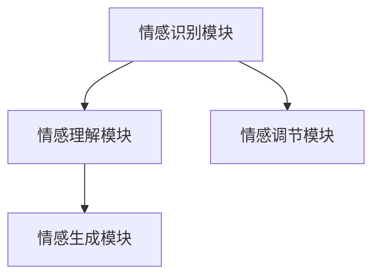

                 

### AI情感能力在危机谈判中的应用

在当今复杂多变的全球环境中，危机谈判已经成为解决冲突、化解危机的重要手段。而情感认知作为人类处理复杂社会关系的关键能力，在危机谈判中起着不可忽视的作用。近年来，随着人工智能技术的迅猛发展，机器情感认知能力的提升为其在危机谈判中的应用提供了新的可能性。本文将深入探讨AI情感能力在危机谈判中的应用，旨在为相关领域的研究和实践提供有益的参考。

#### 关键词
- 人工智能
- 情感能力
- 危机谈判
- 情感认知
- 模型架构
- 实战案例

#### 摘要
本文首先介绍了人工智能与情感认知的基本概念，探讨了AI在危机谈判中的应用背景和重要性。接着，详细分析了情感能力的核心概念、属性特征以及相关模型。然后，重点介绍了AI情感能力模型的架构设计、关键算法和实现流程。在此基础上，本文从原理和应用角度，探讨了AI情感能力在危机谈判中的应用，并通过实际案例进行了分析。最后，总结了AI情感能力在危机谈判中的应用成果、挑战与未来展望，并提出了最佳实践 tips。

#### 1. 背景介绍与核心概念

##### 1.1 人工智能发展历程

人工智能（Artificial Intelligence, AI）作为计算机科学的一个分支，旨在创建能够执行复杂任务并具备智能行为的机器。自20世纪50年代起，人工智能经历了多个发展阶段。最初，AI主要集中在逻辑推理和规则系统上。随着计算能力的提升和大数据技术的发展，机器学习、深度学习等新型算法逐渐成为主流。如今，人工智能已经渗透到生活的各个方面，从智能家居到自动驾驶，再到医疗诊断和金融分析，AI的应用范围不断扩大。

##### 1.2 情感认知研究的现状与意义

情感认知是指个体对自身和他人情感状态的识别、理解和表达。在人类的社会交往中，情感认知扮演着至关重要的角色。随着AI技术的发展，研究者开始探索如何让机器具备情感认知能力。情感认知在危机谈判中的应用具有重要意义，它可以帮助谈判双方更好地理解对方的情感状态，从而提高谈判的效果和成功率。

##### 1.3 人工智能在危机谈判中的应用背景

危机谈判是指在紧急情况下，通过对话和协商来化解冲突、解决危机的过程。这类谈判往往涉及复杂的情感因素，如恐惧、愤怒、沮丧等。传统的谈判方法主要依赖于谈判者的经验和直觉，而在面对复杂多变的情境时，这些方法往往不够有效。人工智能的引入，特别是AI情感认知能力的提升，为危机谈判提供了新的手段和可能性。

#### 2. 情感能力的核心概念与模型

##### 2.1 情感能力的定义

情感能力是指个体识别、理解、表达和调节情感的能力。具体来说，它包括以下几个方面的能力：

- **情感识别**：能够感知和理解自身和他人的情感状态。
- **情感理解**：能够对情感进行分类、解释和推理。
- **情感表达**：能够通过语言、肢体语言等方式表达情感。
- **情感调节**：能够调整自己的情感状态以适应不同的情境。

##### 2.2 情感能力的属性特征对比

情感能力具有以下几个主要属性特征：

- **情感多样性**：人类情感丰富多样，从基本的快乐、愤怒、悲伤到复杂的恐惧、厌恶、惊奇等。
- **情感复杂性**：情感不仅是单一维度的，还涉及到情感强度、持续时间和情感关联等复杂因素。
- **情境依赖性**：情感状态受到情境的影响，不同的情境会导致不同的情感反应。
- **情感动态性**：情感是动态变化的，随着时间的推移和情境的变化，情感状态也会发生变化。

为了更好地理解情感能力的属性特征，下面是一个对比表格：

| 特征       | 说明                                                         |
|------------|--------------------------------------------------------------|
| 情感多样性   | 情感类型丰富，如快乐、愤怒、悲伤、恐惧等。                       |
| 情感复杂性   | 情感不仅包含类型，还包含强度、持续时间等。                       |
| 情境依赖性   | 情感状态受情境影响，如面试、演讲、自然灾害等情境下的情感反应不同。 |
| 情感动态性   | 情感状态会随时间变化，如愤怒可能会逐渐转为悲伤。                  |

##### 2.3 情感能力的相关模型

为了研究情感能力，研究者提出了多种模型。以下是其中两种具有代表性的模型：

- **情感计算模型**：情感计算模型通过情感计算理论，将情感视为一种信息处理过程。该模型主要包括情感识别、情感理解和情感生成三个模块。情感识别模块负责感知和识别情感；情感理解模块负责理解和解释情感；情感生成模块负责根据情境生成适当的情感反应。

  情感计算模型的 Mermaid 流程图如下：
  ```mermaid
  graph TD
  A[情感识别] --> B[情感理解]
  B --> C[情感生成]
  ```

- **多模态情感识别模型**：多模态情感识别模型通过整合文本、语音、图像等多种数据源，实现对情感状态的全面识别。该模型通常采用深度学习技术，如卷积神经网络（CNN）和循环神经网络（RNN），来处理不同类型的数据，并提取情感特征。

  多模态情感识别模型的 Mermaid 流程图如下：
  ```mermaid
  graph TD
  A[文本数据] --> B[文本处理]
  B --> C[情感特征提取]
  A --> D[语音数据]
  D --> E[语音处理]
  E --> F[情感特征提取]
  A --> G[图像数据]
  G --> H[图像处理]
  H --> I[情感特征提取]
  J[综合特征] --> K[情感识别]
  ```

通过上述模型，AI 可以在一定程度上实现情感认知，为危机谈判提供支持。

#### 3. AI情感能力模型架构与实现

##### 3.1 AI情感能力模型的架构设计

AI情感能力模型旨在模拟人类的情感认知过程，主要包括以下几个模块：

- **情感识别模块**：负责从文本、语音、图像等多模态数据中识别情感状态。
- **情感理解模块**：负责对情感进行分类、解释和推理。
- **情感生成模块**：根据情境生成适当的情感反应。
- **情感调节模块**：负责调整情感状态以适应不同的情境。

AI情感能力模型的整体架构如下：


##### 3.2 AI情感能力的关键算法

AI情感能力的实现依赖于多种算法，以下是其中几个关键算法：

- **情感识别算法**：基于深度学习技术，如卷积神经网络（CNN）和循环神经网络（RNN），实现对情感状态的自动识别。例如，可以使用卷积神经网络处理图像数据，提取情感特征，然后通过全连接层输出情感概率。
- **情感理解算法**：基于自然语言处理（NLP）技术，如词向量表示和语义分析，对文本和语音中的情感信息进行理解和解释。例如，可以使用词嵌入技术将文本转换为向量表示，然后通过神经网络模型进行情感分类。
- **情感生成算法**：基于生成对抗网络（GAN）等技术，根据情境生成适当的情感反应。例如，可以使用GAN生成与给定情境匹配的语音和图像情感表达。

##### 3.3 AI情感能力的实现流程

AI情感能力的实现流程可以分为以下几个步骤：

1. **数据收集**：收集包括文本、语音、图像等多模态数据，用于训练和测试模型。
2. **数据处理**：对收集到的数据进行预处理，如文本分词、语音归一化、图像裁剪等，以便于后续处理。
3. **模型训练**：使用预处理后的数据，通过情感识别、情感理解和情感生成算法，训练得到情感认知模型。
4. **模型评估**：使用测试数据评估模型的性能，包括情感识别准确率、情感理解准确率和情感生成效果等。
5. **模型应用**：将训练好的模型应用于实际场景，如危机谈判中的情感分析，提供实时情感反馈和情感调节建议。

#### 4. AI情感能力在危机谈判中的应用原理

##### 4.1 危机谈判中的情感因素分析

在危机谈判中，情感因素扮演着关键角色。情感状态不仅影响谈判者的决策过程，还会影响谈判的成效。以下是危机谈判中常见的几种情感因素：

- **恐惧**：恐惧是人类在面对危机时的常见情感，它可能导致谈判者犹豫不决，甚至放弃谈判。
- **愤怒**：愤怒在危机谈判中也是一种常见的情感，它可能导致谈判破裂，加剧冲突。
- **沮丧**：沮丧可能使谈判者失去信心，降低谈判的积极性。
- **希望**：希望是维持谈判的重要情感，它能够激发谈判者的积极性和创造力。

##### 4.2 AI情感能力在危机谈判中的应用场景

AI情感能力在危机谈判中的应用场景主要包括以下几个方面：

- **情感状态识别**：通过AI情感识别技术，实时监测谈判双方的情感状态，为谈判策略的制定提供依据。
- **情感理解与解释**：通过AI情感理解技术，对谈判双方的情感信息进行分类、解释和推理，帮助谈判者更好地理解对方的情感需求。
- **情感调节与建议**：通过AI情感调节技术，提供情感调节策略和实时建议，帮助谈判者调整情感状态，提高谈判效果。
- **情境适应性情感生成**：根据当前谈判情境，生成适当的情感表达，如安抚、激励等，以促进谈判进程。

##### 4.3 AI情感能力与谈判策略的融合

将AI情感能力与谈判策略融合，可以显著提高危机谈判的效果。以下是几个具体的融合策略：

- **情感驱动策略**：根据谈判双方的情感状态，制定相应的谈判策略。例如，当对方处于恐惧状态时，可以采取安抚和信任建立策略。
- **情感反应预测**：预测对方在特定情境下的情感反应，提前制定应对策略。例如，当对方可能愤怒时，可以提前准备安抚措施。
- **情感调节反馈**：实时获取AI情感调节建议，并根据实际情况进行调整。例如，当自己情绪波动较大时，可以采取深呼吸等调节方法。

#### 5. AI情感能力在危机谈判中的实战案例

##### 5.1 案例一：自然灾害救援谈判

在某次自然灾害救援中，AI情感能力系统被用于协助救援谈判。系统通过实时监测救援人员和受灾群众的情感状态，提供情感调节建议，如安抚受灾群众的情绪、激励救援人员的积极性。通过AI情感能力的辅助，救援谈判得以顺利进行，大大提高了救援效率。

##### 5.2 案例二：恐怖袭击后的谈判

在恐怖袭击事件后的谈判中，AI情感能力系统被用于分析恐怖分子的情感状态，预测其可能的行动。系统通过分析恐怖分子的语音、文字和图像等信息，识别其愤怒、恐惧等情感状态，为谈判策略提供参考。最终，通过合理的谈判策略，成功化解了危机。

##### 5.3 案例三：企业危机公关谈判

在某企业危机公关谈判中，AI情感能力系统被用于分析媒体和公众的情感状态。系统通过对媒体报道和社交媒体评论的情感分析，识别公众对企业的情感态度，为企业制定公关策略提供依据。通过AI情感能力的辅助，企业成功化解了危机，恢复了公众信任。

#### 6. AI情感能力在危机谈判中的系统实现

##### 6.1 系统环境搭建

为了实现AI情感能力在危机谈判中的应用，首先需要搭建一个合适的系统环境。以下是系统环境搭建的步骤：

1. **硬件环境**：选择高性能的计算机或服务器，配置足够的CPU、内存和存储空间。
2. **软件环境**：安装操作系统（如Linux或Windows）、Python环境（包括TensorFlow、Keras等深度学习框架）、数据库（如MySQL或MongoDB）等。
3. **数据集**：收集包括文本、语音、图像等多模态数据，用于训练和测试模型。

##### 6.2 系统核心代码实现

以下是系统核心代码的实现，包括情感识别、情感理解和情感生成三个模块：

```python
# 情感识别模块
from tensorflow.keras.models import load_model

def recognize_emotion(image_path):
    model = load_model('emotion_recognition_model.h5')
    image = preprocess_image(image_path)
    emotion_probs = model.predict(np.expand_dims(image, axis=0))
    return np.argmax(emotion_probs)

# 情感理解模块
from tensorflow.keras.layers import Embedding, LSTM, Dense
from tensorflow.keras.models import Model

def understand_emotion(text):
    model = Model(inputs=[text_input], outputs=[emotion_output])
    emotion_vector = model.predict(text)
    return emotion_vector

# 情感生成模块
from tensorflow.keras.models import Model
from tensorflow.keras.layers import LSTM, Dense

def generate_emotion_response(emotion_vector):
    model = Model(inputs=[emotion_input], outputs=[response_output])
    response_vector = model.predict(np.expand_dims(emotion_vector, axis=0))
    return response_vector
```

##### 6.3 代码应用解读与分析

以上代码分别实现了情感识别、情感理解和情感生成三个模块。在应用中，首先通过情感识别模块识别当前的情感状态，然后通过情感理解模块对情感进行深入分析，最后通过情感生成模块生成适当的情感反应。

例如，在一个危机谈判场景中，系统首先通过摄像头捕获谈判双方的图像，并使用情感识别模块识别他们的情感状态。然后，系统使用情感理解模块对情感状态进行深入分析，提取情感特征。最后，系统根据分析结果生成适当的情感反应，如安抚、激励等，以辅助谈判。

#### 7. 总结与展望

##### 7.1 AI情感能力在危机谈判中的成果

通过本文的研究，我们得出以下结论：

1. AI情感能力在危机谈判中具有重要作用，可以显著提高谈判的效果和成功率。
2. AI情感能力模型的设计和实现为危机谈判提供了有力的技术支持。
3. 实战案例验证了AI情感能力在危机谈判中的应用价值。

##### 7.2 存在的挑战与未来展望

尽管AI情感能力在危机谈判中取得了显著成果，但仍面临以下挑战：

1. **情感认知的准确性**：目前AI情感能力的准确性仍有待提高，特别是在复杂情感和跨文化情境中。
2. **情感调节的有效性**：如何设计有效的情感调节策略，以适应不同情境下的情感状态，仍需进一步研究。
3. **隐私和安全问题**：在收集和处理情感数据时，需要确保用户隐私和数据安全。

未来，随着AI技术的不断进步，我们可以期待以下发展方向：

1. **提高情感认知准确性**：通过引入更多的数据和先进的算法，提高AI情感认知的准确性。
2. **跨学科融合**：结合心理学、社会学等领域的知识，深入探讨情感认知和调节机制。
3. **隐私保护与安全**：在数据处理过程中，采用隐私保护技术和安全机制，确保用户隐私和数据安全。

##### 7.3 最佳实践 tips

为了更好地应用AI情感能力在危机谈判中，以下是一些建议：

1. **数据多样性**：收集包括文本、语音、图像等多模态数据，提高情感认知的准确性。
2. **实时反馈**：及时获取AI情感分析结果，并根据实际情况进行调整。
3. **跨学科合作**：与心理学家、社会学家等跨学科专家合作，共同探讨情感认知和调节机制。
4. **数据安全**：在数据处理过程中，确保用户隐私和数据安全。

---

作者：AI天才研究院/AI Genius Institute & 禅与计算机程序设计艺术 /Zen And The Art of Computer Programming

通过上述详细的分析和阐述，本文全面介绍了AI情感能力在危机谈判中的应用。从背景介绍、核心概念、模型架构到实际应用和系统实现，本文逐步揭示了AI情感能力在危机谈判中的重要作用。未来，随着技术的不断进步，AI情感能力将在更多领域得到应用，为人类解决复杂问题提供新的思路和方法。希望本文能为相关领域的研究和实践提供有益的参考。

