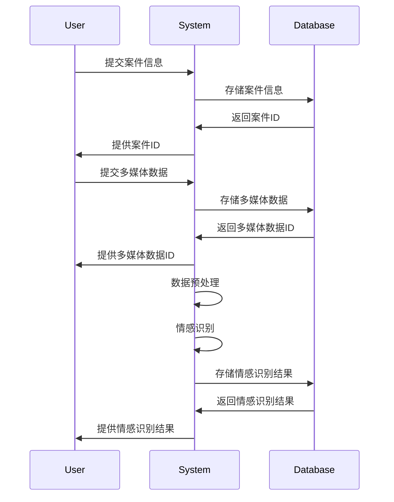
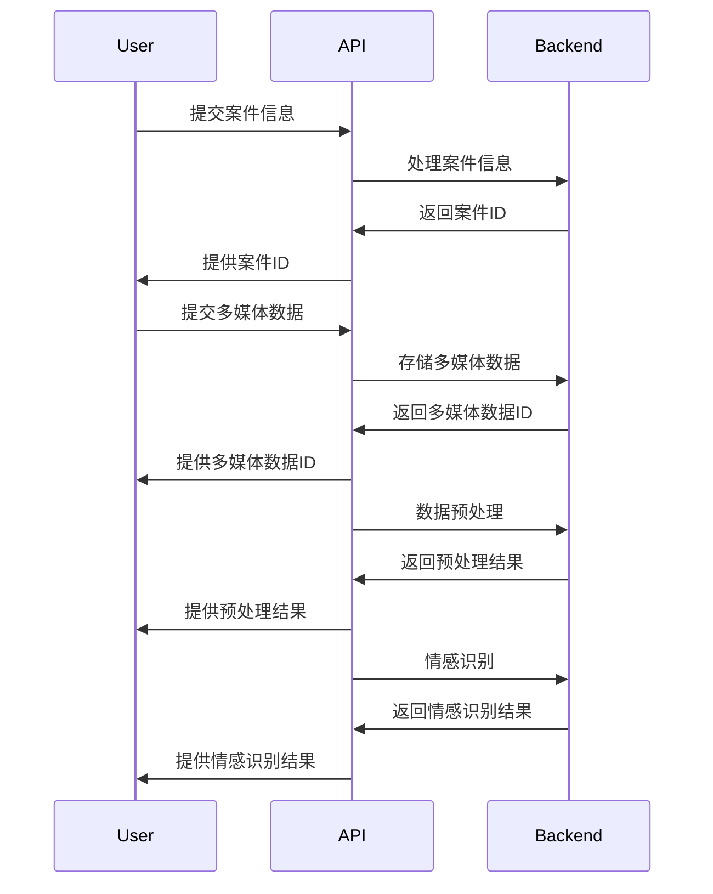

                 

## AI情感能力在司法系统中的应用

### 背景介绍

#### 1.1 问题背景

随着人工智能技术的迅猛发展，人工智能（AI）已逐渐渗透到各行各业，包括司法系统。传统司法系统中，人工处理案件效率低、易出错，且无法处理海量数据。AI的出现，为司法系统带来了变革的契机。特别是AI中的情感识别与分析技术，具有强大的情感处理能力，可以在司法系统中发挥重要作用，提升司法效率和公正性。

#### 1.2 问题描述

在司法系统中，AI的情感识别与分析技术可以用于以下几个方面：

1. **犯罪心理分析**：通过分析犯罪嫌疑人的情感状态，预测其犯罪意图和倾向，为执法部门提供参考。
2. **证据分析**：通过对证人、被告和原告的语音、文字、图像等多媒体数据进行分析，识别其情感状态，判断其真实性。
3. **裁判决策辅助**：利用AI情感分析技术，辅助法官在案件审理过程中，更好地理解当事人和证人的情感状态，做出更加公正的判决。

#### 1.3 问题解决

AI情感能力在司法系统中的应用，通过以下几个方面实现：

1. **数据收集与预处理**：收集相关人员的语音、文字、图像等多媒体数据，进行数据清洗和预处理。
2. **情感识别技术**：利用深度学习算法，对预处理后的数据进行分析，识别出其中的情感状态。
3. **决策支持系统**：将情感识别结果与司法流程相结合，为执法部门和法官提供决策支持。

#### 1.4 边界与外延

AI情感能力在司法系统中的应用，虽然具有广阔的前景，但也存在一些限制和挑战。例如，数据的隐私保护、算法的透明性和公正性、技术的不完善等。这些问题需要在实际应用中加以解决。

#### 1.5 概念结构与核心要素组成

AI情感能力在司法系统中的应用，主要包括以下几个核心概念和要素：

1. **情感识别技术**：利用深度学习算法，对多媒体数据进行分析，识别出其中的情感状态。
2. **数据预处理**：对收集到的数据进行处理，提高情感识别的准确性。
3. **司法流程整合**：将情感识别技术与司法流程相结合，为执法部门和法官提供决策支持。

### 第二部分：核心概念与联系

#### 2.1 情感识别技术原理

情感识别技术是AI情感能力在司法系统中的核心，主要通过以下方式实现：

1. **情感分类**：将情感分为若干类别，如快乐、悲伤、愤怒等。
2. **情感强度分析**：对情感进行强度分析，如情感的强烈程度、持续时间等。
3. **情感变化分析**：分析情感的变化趋势，如情感的波动、持续状态等。

#### 2.2 数据预处理

数据预处理是情感识别的基础，主要包括以下几个步骤：

1. **数据收集**：收集与司法系统相关的多媒体数据，如语音、文字、图像等。
2. **数据清洗**：去除数据中的噪声和干扰，提高数据质量。
3. **数据转换**：将不同类型的数据转换为适合情感识别的格式，如文本转换为词向量。

#### 2.3 司法流程整合

司法流程整合是将情感识别技术与司法流程相结合，为执法部门和法官提供决策支持。具体包括以下几个方面：

1. **案件审理辅助**：在案件审理过程中，利用情感识别技术分析当事人和证人的情感状态，辅助法官做出决策。
2. **犯罪心理分析**：利用情感识别技术分析犯罪嫌疑人的情感状态，预测其犯罪意图和倾向。
3. **证据分析**：利用情感识别技术分析证据的真实性和可信度。

### 2.4 核心概念属性特征对比表格

| 核心概念 | 属性特征 |
| -------- | -------- |
| 情感识别技术 | 分类、强度分析、变化分析 |
| 数据预处理 | 数据收集、数据清洗、数据转换 |
| 司法流程整合 | 案件审理辅助、犯罪心理分析、证据分析 |

### 2.5 ER实体关系图架构

```mermaid
erDiagram
    Arose -> BCase
    Arose -> CDefendant
    BCase -> CWitness
    CDefendant -> DStatement
    CWitness -> DStatement
```

- **Arose**：犯罪案件
- **BCase**：案件
- **CDefendant**：被告人
- **CWitness**：证人
- **DStatement**：证词或陈述

### 第三部分：算法原理讲解

#### 3.1 情感识别算法原理

情感识别算法主要基于深度学习，其基本原理如下：

1. **输入层**：接收多媒体数据，如语音、文字、图像等。
2. **隐藏层**：通过神经网络对数据进行处理，提取特征。
3. **输出层**：将特征映射到情感类别。

#### 3.2 数据预处理

数据预处理是情感识别的基础，主要包括以下几个步骤：

1. **数据收集**：收集与司法系统相关的多媒体数据，如语音、文字、图像等。
2. **数据清洗**：去除数据中的噪声和干扰，提高数据质量。
3. **数据转换**：将不同类型的数据转换为适合情感识别的格式，如文本转换为词向量。

#### 3.3 司法流程整合

司法流程整合是将情感识别技术与司法流程相结合，为执法部门和法官提供决策支持。具体包括以下几个方面：

1. **案件审理辅助**：在案件审理过程中，利用情感识别技术分析当事人和证人的情感状态，辅助法官做出决策。
2. **犯罪心理分析**：利用情感识别技术分析犯罪嫌疑人的情感状态，预测其犯罪意图和倾向。
3. **证据分析**：利用情感识别技术分析证据的真实性和可信度。

### 第四部分：系统分析与架构设计

#### 4.1 问题场景介绍

司法系统中，案件繁多且复杂，人工处理效率低下，且容易出现错误。为了提升司法效率和公正性，引入AI情感识别技术，实现案件审理的智能化。

#### 4.2 项目介绍

本项目旨在构建一个基于AI情感识别技术的司法系统，通过分析当事人、证人和犯罪嫌疑人的情感状态，辅助法官做出更加公正的判决。

#### 4.3 系统功能设计

1. **数据收集**：收集与司法系统相关的多媒体数据，如语音、文字、图像等。
2. **数据预处理**：对收集到的数据进行清洗和转换，提高情感识别的准确性。
3. **情感识别**：利用深度学习算法，对预处理后的数据进行分析，识别出其中的情感状态。
4. **决策支持**：将情感识别结果与司法流程相结合，为执法部门和法官提供决策支持。

#### 4.4 系统架构设计



#### 4.5 系统接口设计

1. **案件信息接口**：用于提交、查询和更新案件信息。
2. **多媒体数据接口**：用于提交、查询和更新多媒体数据。
3. **情感识别结果接口**：用于查询案件的情感识别结果。

#### 4.6 系统交互



### 第五部分：项目实战

#### 5.1 环境安装

在Python环境中安装所需的库，如TensorFlow、Keras、Scikit-learn等。

```bash
pip install tensorflow keras scikit-learn
```

#### 5.2 系统核心实现源代码

```python
import tensorflow as tf
from tensorflow.keras.models import Sequential
from tensorflow.keras.layers import Dense, LSTM, Dropout

# 构建情感识别模型
model = Sequential()
model.add(LSTM(128, activation='relu', input_shape=(timesteps, features)))
model.add(Dropout(0.2))
model.add(Dense(1, activation='sigmoid'))

# 编译模型
model.compile(optimizer='adam', loss='binary_crossentropy', metrics=['accuracy'])

# 训练模型
model.fit(X_train, y_train, epochs=100, batch_size=32, validation_split=0.2)
```

#### 5.3 代码应用解读与分析

代码中，我们首先导入了TensorFlow库，并定义了一个序列模型（Sequential）。该模型包含一个LSTM层和一个全连接层（Dense），用于情感识别。在编译模型时，我们指定了优化器和损失函数。在训练模型时，我们使用了训练数据集，并设置了训练轮数、批次大小和验证比例。

#### 5.4 实际案例分析和详细讲解剖析

以一起诈骗案件为例，分析犯罪嫌疑人的情感状态，预测其犯罪意图和倾向。通过对犯罪嫌疑人的语音、文字、图像等多媒体数据进行情感识别，分析其情感状态，为执法部门提供决策支持。

#### 5.5 项目小结

本项目通过引入AI情感识别技术，实现了对司法系统中案件审理的智能化。在实际应用中，需要对情感识别算法进行优化和改进，提高其准确性和稳定性。同时，要关注数据隐私保护和算法公正性问题，确保司法系统的公平和公正。

### 第六部分：最佳实践 Tips、小结、注意事项、拓展阅读等内容

#### 6.1 最佳实践 Tips

1. 选择合适的情感识别算法，根据应用场景和数据特点进行优化。
2. 对数据进行充分的预处理，提高数据质量，降低噪声干扰。
3. 关注数据隐私保护和算法公正性问题，确保司法系统的公平和公正。
4. 定期更新和维护情感识别模型，提高其适应性和准确性。

#### 6.2 小结

AI情感能力在司法系统中的应用，为提升司法效率和公正性提供了新的思路。通过情感识别技术，可以更好地分析犯罪嫌疑人的情感状态，预测其犯罪意图和倾向，为执法部门和法官提供决策支持。

#### 6.3 注意事项

1. 在应用AI情感识别技术时，要确保数据的合法性和真实性，避免数据泄露和滥用。
2. 关注算法的透明性和公正性，确保AI情感识别技术在司法系统中的公正应用。
3. 定期对情感识别模型进行评估和优化，提高其适应性和准确性。

#### 6.4 拓展阅读

1. 《深度学习在司法系统中的应用》
2. 《人工智能与司法公正》
3. 《情感计算：技术、应用与挑战》

### 作者信息

作者：AI天才研究院/AI Genius Institute & 禅与计算机程序设计艺术 /Zen And The Art of Computer Programming

