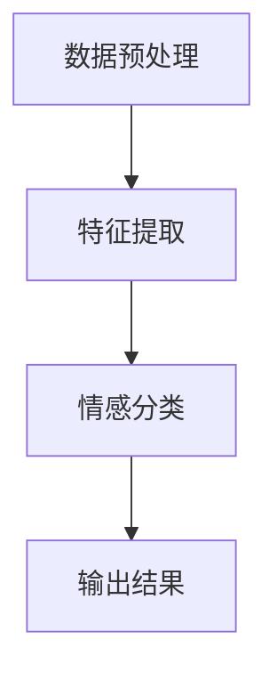
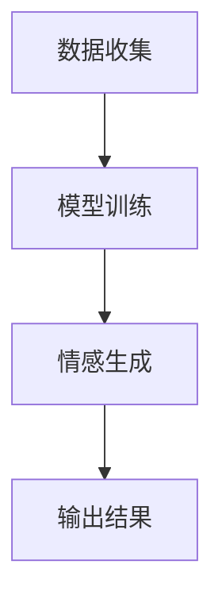
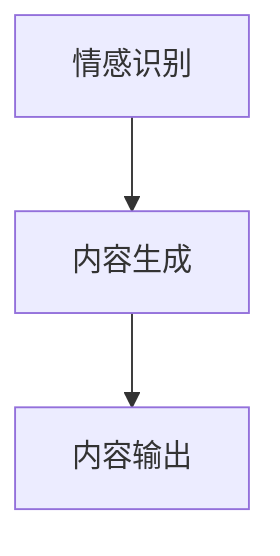
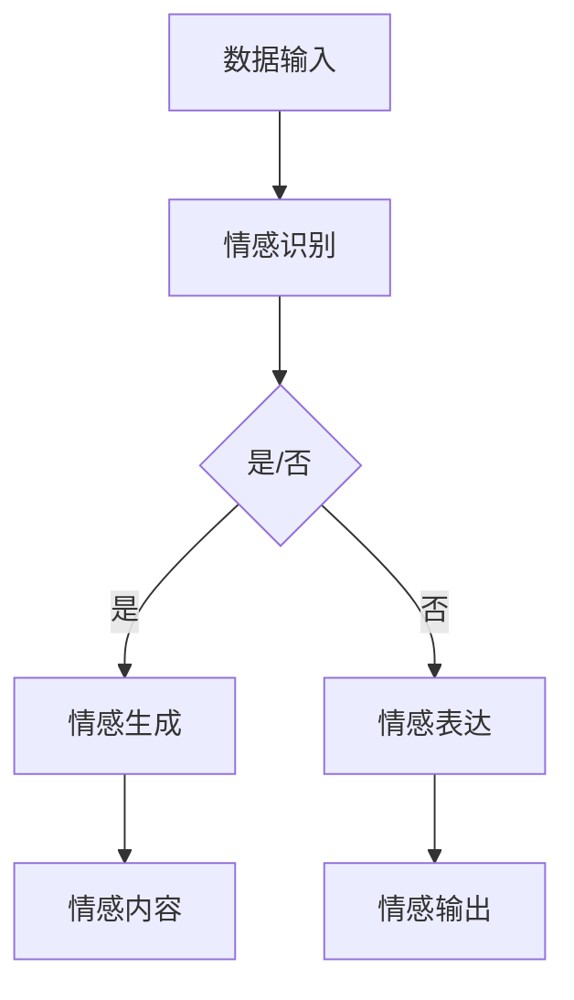

                 

### 文章标题

# AI情感能力带来的社会包容性：减少歧视与偏见

### 关键词

- AI情感能力
- 社会包容性
- 歧视与偏见
- 情感识别与生成算法
- 数据隐私保护
- 技术伦理

### 摘要

本文探讨了AI情感能力在社会包容性方面的重要作用，特别是其在减少歧视与偏见方面的潜力。通过介绍情感能力的定义和AI实现情感能力的方法，本文分析了情感能力与社会包容性之间的联系，并讨论了AI偏见与歧视的机制。接着，本文提出了AI情感能力在实践中的应用，包括教育、招聘和社交媒体等场景，并通过具体案例分析了其在减少歧视与偏见方面的实际效果。最后，本文对未来发展方向、政策建议和注意事项进行了展望，为推动社会包容性提供了技术路径和思考方向。

## 引言与背景

### 1.1 问题的提出

社会包容性是一个全球性的挑战，尤其在当前快速发展的技术环境下，AI技术的普及和应用对这一挑战产生了深远影响。随着AI技术的不断发展，它被广泛应用于各个领域，从教育、医疗到金融和招聘等，但与此同时，AI系统也面临着歧视与偏见的问题。

**社会包容性的重要性**：社会包容性不仅仅是一个社会伦理问题，更是一个社会发展的必要条件。包容性的社会能够更好地整合多样性，促进社会稳定和发展。在社会包容性方面，歧视与偏见是一个严重的问题，它可能导致社会分裂，降低社会的整体幸福感。

**AI与歧视、偏见的关系**：AI技术在提高效率、优化决策等方面具有巨大的潜力，但AI系统中的歧视与偏见问题却成为了一个不可忽视的挑战。AI系统的偏见可能源于数据中的偏见、算法的设计缺陷或训练数据的不足。这些问题不仅影响AI系统的性能，更可能加剧社会的不公平和歧视。

**当前挑战与前景**：目前，许多研究和实践都在探索如何减少AI系统中的偏见和歧视。随着AI情感能力的发展，这一问题有望得到缓解。AI情感能力不仅能够帮助AI系统更好地理解和处理情感信息，还能够通过情感识别和生成算法来减少偏见和歧视。本文将探讨AI情感能力在社会包容性方面的应用，以及如何通过技术手段来减少歧视与偏见。

### 1.2 核心概念

#### 1.2.1 情感能力

情感能力是指个体识别、理解、表达和生成情感的能力。它涉及到情感的感知、识别、表达和调节等方面。在AI领域，情感能力是指AI系统理解和处理情感信息的能力，包括情感识别、情感生成和情感表达等。

#### 1.2.2 社会包容性

社会包容性是指一个社会能够接纳和尊重多样性，提供公平的机会和资源，使所有人都能在其社会中发挥积极作用。社会包容性的核心目标是减少歧视和偏见，促进社会的和谐与稳定。

#### 1.2.3 AI偏见与歧视的机制

AI偏见与歧视的机制主要包括以下几个方面：

1. **数据偏见**：AI系统的训练数据可能包含社会偏见，这些偏见会被模型学习和放大，导致AI系统在决策时表现出偏见。
2. **算法设计缺陷**：AI算法的设计和实现可能存在缺陷，导致AI系统在处理某些问题时表现出偏见。
3. **训练数据不足**：AI系统的训练数据可能不足以覆盖所有群体，导致AI系统在某些群体上的表现不佳，从而产生偏见。

### 1.3 概念联系与关系

#### 1.3.1 情感能力与社会包容性的联系

情感能力与社会包容性之间存在密切联系。情感能力使得AI系统能够更好地理解和处理情感信息，从而在减少歧视和偏见方面发挥作用。社会包容性的实现需要AI系统具备情感能力，以更好地识别和处理情感，从而提高决策的公正性和准确性。

#### 1.3.2 AI偏见与歧视的ER实体关系图

为了更好地理解AI偏见与歧视的机制，我们可以通过ER实体关系图来展示它们之间的关系。ER实体关系图如下：

```mermaid
erDiagram
  AI偏见 ||--|{ 数据偏见 } : 引起
  AI偏见 ||--|{ 算法设计缺陷 } : 引起
  AI偏见 ||--|{ 训练数据不足 } : 引起
  数据偏见 ||--|{ AI系统 } : 影响
  算法设计缺陷 ||--|{ AI系统 } : 影响
  训练数据不足 ||--|{ AI系统 } : 影响
```

在这个ER实体关系图中，AI偏见是由数据偏见、算法设计缺陷和训练数据不足引起的，而这些偏见会影响AI系统的性能，从而可能导致歧视和偏见。

### 1.4 研究方法与数据来源

#### 1.4.1 研究设计

本研究采用定量和定性相结合的方法，旨在探讨AI情感能力在社会包容性方面的作用。具体包括以下步骤：

1. **文献综述**：通过查阅相关文献，了解情感能力、社会包容性和AI偏见与歧视的相关研究。
2. **数据收集**：收集与AI情感能力、社会包容性和AI偏见与歧视相关的数据，包括公开的数据集和专家访谈。
3. **数据分析**：采用统计学方法和机器学习方法对数据进行分析，以探讨AI情感能力与社会包容性之间的关系。

#### 1.4.2 数据收集与分析

数据收集主要包括以下几个方面：

1. **公开数据集**：从公开的数据集中收集与情感能力、社会包容性和AI偏见与歧视相关的数据。
2. **专家访谈**：邀请领域专家进行访谈，收集他们对AI情感能力与社会包容性之间关系的看法。

数据分析方法包括：

1. **描述性统计**：对收集的数据进行描述性统计分析，了解数据的基本特征。
2. **相关性分析**：通过相关性分析，探讨AI情感能力与社会包容性之间的相关性。
3. **机器学习模型**：采用机器学习模型，如逻辑回归、支持向量机等，分析AI情感能力对歧视与偏见的影响。

### 1.5 本章小结

本章介绍了社会包容性、AI偏见与歧视以及AI情感能力的核心概念，并分析了它们之间的联系。同时，本章还介绍了研究方法与数据来源，为后续章节的分析奠定了基础。

## AI情感能力发展

### 2.1 AI情感能力概述

#### 2.1.1 情感能力的定义

情感能力是指个体识别、理解、表达和生成情感的能力。在AI领域，情感能力是指AI系统理解和处理情感信息的能力。这包括情感识别、情感生成和情感表达等方面。

#### 2.1.2 AI实现情感能力的方法

AI实现情感能力的方法主要包括：

1. **情感识别**：通过自然语言处理技术，从文本、语音和图像等数据中识别情感。
2. **情感生成**：通过深度学习等技术，生成与特定情感相关的文本、语音和图像。
3. **情感表达**：通过自然语言生成技术、语音合成技术和图像生成技术等，表达情感。

#### 2.1.3 情感能力的重要性

情感能力在AI领域具有重要意义。首先，情感能力有助于提高AI系统的用户体验，使其更加人性化。其次，情感能力有助于减少AI系统中的偏见和歧视，提高决策的公正性和准确性。此外，情感能力还能在医疗、教育、金融等领域发挥重要作用，如辅助医生诊断、个性化教育推荐和智能理财等。

### 2.2 AI情感能力的发展历程

#### 2.2.1 从感知到情感识别

AI情感能力的发展历程可以追溯到情感感知。早期的情感感知技术主要通过传感器收集个体的生理信号，如心率、皮肤电反应等，以识别情感状态。然而，这些方法存在一定的局限性，如设备成本高、不适感强等。

随着计算机视觉和自然语言处理技术的发展，AI开始从感知阶段过渡到情感识别阶段。通过分析文本、语音和图像等数据，AI系统能够识别出个体的情感状态。例如，通过分析文本中的情感词汇和语法结构，可以识别出文本的情感倾向；通过分析语音的音调和节奏，可以识别出语音的情感状态；通过分析图像中的面部表情和身体语言，可以识别出图像的情感状态。

#### 2.2.2 情感生成的挑战与进展

情感生成是AI情感能力的一个重要方向。情感生成的挑战在于如何生成与真实情感相匹配的文本、语音和图像。早期的情感生成方法主要通过模板匹配和规则推理来实现，效果有限。随着深度学习技术的发展，生成对抗网络（GAN）和变分自编码器（VAE）等模型被广泛应用于情感生成。

通过训练大规模的文本、语音和图像数据集，这些模型能够生成与真实情感相匹配的文本、语音和图像。例如，通过生成对抗网络，可以生成与特定情感相关的语音；通过变分自编码器，可以生成与特定情感相关的图像。这些技术的进展为AI情感能力的发展提供了强大的支持。

#### 2.2.3 情感表达的实现

情感表达是AI情感能力的最后一个环节。情感表达的目标是通过自然语言生成技术、语音合成技术和图像生成技术等，将情感传递给用户。自然语言生成技术可以通过生成情感文本来传达情感；语音合成技术可以通过合成情感语音来传达情感；图像生成技术可以通过生成情感图像来传达情感。

在情感表达方面，现有的技术已经取得了显著的进展。例如，通过基于生成对抗网络的文本生成模型，可以生成具有情感色彩的文本；通过基于深度学习的语音合成模型，可以合成出具有情感色彩的语音；通过基于变分自编码器的图像生成模型，可以生成出具有情感色彩的图像。这些技术的实现为AI情感能力在实际应用中提供了重要的支持。

### 2.3 核心算法原理与流程图

#### 2.3.1 情感识别算法

情感识别算法是AI情感能力的核心组成部分。情感识别算法的基本原理是通过分析文本、语音和图像等数据，识别出数据中的情感信息。具体来说，情感识别算法包括以下几个步骤：

1. **数据预处理**：对文本、语音和图像数据进行预处理，包括文本的分词、语音的归一化和图像的缩放等。
2. **特征提取**：通过特征提取技术，从预处理后的数据中提取出与情感相关的特征。对于文本，可以使用词袋模型、TF-IDF等特征提取方法；对于语音，可以使用梅尔频率倒谱系数（MFCC）等特征提取方法；对于图像，可以使用卷积神经网络（CNN）等特征提取方法。
3. **情感分类**：使用分类算法，如支持向量机（SVM）、朴素贝叶斯（NB）和深度神经网络（DNN）等，将提取出的特征映射到情感类别上。

以下是一个简化的情感识别算法的Mermaid流程图：



#### 2.3.2 情感生成算法

情感生成算法是AI情感能力的另一个重要组成部分。情感生成算法的基本原理是通过训练模型，生成与特定情感相关的文本、语音和图像。具体来说，情感生成算法包括以下几个步骤：

1. **数据收集**：收集大量带有情感标签的文本、语音和图像数据。
2. **模型训练**：使用生成对抗网络（GAN）或变分自编码器（VAE）等模型，对收集到的数据进行训练。
3. **情感生成**：通过训练好的模型，生成与特定情感相关的文本、语音和图像。

以下是一个简化的情感生成算法的Mermaid流程图：



#### 2.3.3 情感表达的算法

情感表达算法是AI情感能力的最终实现。情感表达算法的基本原理是通过自然语言生成技术、语音合成技术和图像生成技术等，将情感传递给用户。具体来说，情感表达算法包括以下几个步骤：

1. **情感识别**：使用情感识别算法，识别出用户的情感状态。
2. **内容生成**：根据用户的情感状态，生成相应的内容。对于文本，可以使用情感文本生成模型；对于语音，可以使用情感语音合成模型；对于图像，可以使用情感图像生成模型。
3. **内容输出**：将生成的内容输出给用户，通过文本、语音或图像的形式传达情感。

以下是一个简化的情感表达算法的Mermaid流程图：



#### 2.3.4 AI情感能力mermaid流程图

为了更好地理解AI情感能力的工作流程，我们可以使用Mermaid绘制一个简化的流程图：



在这个流程图中，A表示数据的输入，B表示情感识别的步骤，C表示情感识别的结果。如果是情感识别成功，则流程流向D，进行情感生成；否则，流向E，进行情感表达。D和E分别代表情感生成和情感表达的过程，最终生成的情感内容通过F和G分别输出为文本、语音或图像。

### 2.4 数学模型与公式

#### 2.4.1 情感识别数学模型

情感识别的数学模型通常基于机器学习中的分类算法，如支持向量机（SVM）和深度神经网络（DNN）。以下是情感识别的简化数学模型：

1. **支持向量机（SVM）模型**：

   给定一个训练数据集 \( D = \{ (x_i, y_i) \} \)，其中 \( x_i \) 是输入特征向量，\( y_i \) 是情感标签。SVM的目标是找到一个超平面 \( w \) 和偏置 \( b \)，使得特征空间中的数据点被正确分类。

   数学公式如下：

   $$
   \text{max} \ \frac{1}{2} ||w||^2 \\
   \text{subject to} \ y_i ( \langle w, x_i \rangle + b ) \geq 1
   $$

2. **深度神经网络（DNN）模型**：

   DNN是一种多层神经网络，用于情感识别。输入特征向量 \( x \) 通过多层神经元传递，最终输出情感标签 \( y \)。

   数学公式如下：

   $$
   y = \sigma ( W_L \cdot a_{L-1} + b_L ) \\
   a_L = \sigma ( W_{L-1} \cdot a_{L-2} + b_{L-1} ) \\
   \vdots \\
   a_2 = \sigma ( W_2 \cdot a_1 + b_2 ) \\
   a_1 = W_1 \cdot x + b_1
   $$

   其中，\( \sigma \) 是激活函数，通常使用ReLU或Sigmoid函数；\( W \) 和 \( b \) 分别是权重和偏置。

#### 2.4.2 情感生成数学模型

情感生成的数学模型通常基于生成对抗网络（GAN）或变分自编码器（VAE）。以下是情感生成的基本数学模型：

1. **生成对抗网络（GAN）模型**：

   GAN由生成器 \( G \) 和判别器 \( D \) 两部分组成。生成器 \( G \) 从随机噪声 \( z \) 中生成数据 \( x_G \)，判别器 \( D \) 用于区分真实数据和生成数据。

   数学公式如下：

   $$
   x_G = G(z) \\
   D(x) = D(G(z))
   $$

   GAN的训练目标是最小化以下损失函数：

   $$
   \text{min}_G \ \text{max}_D \ V(D, G) = \mathbb{E}_{x \sim p_{\text{data}}(x)} [\log D(x)] + \mathbb{E}_{z \sim p_z(z)} [\log (1 - D(G(z)))]
   $$

2. **变分自编码器（VAE）模型**：

   VAE由编码器 \( \mu(\theta_x) \) 和 \( \sigma(\theta_x) \) 以及解码器 \( \pi(\theta_x, z) \) 组成。编码器将输入数据 \( x \) 编码为均值 \( \mu \) 和方差 \( \sigma \) 的潜在变量 \( z \)，解码器则将潜在变量 \( z \) 重新解码为输出数据 \( x \)。

   数学公式如下：

   $$
   z = \mu(\theta_x) + \sigma(\theta_x) \cdot \epsilon \\
   x = \pi(\theta_x, z)
   $$

   VAE的训练目标是最小化以下损失函数：

   $$
   \text{ELBO} = \mathbb{E}_{z} [\log p(x | z)] - \frac{1}{2} \mathbb{E}_{z} [\log(\sigma^2 + \epsilon^2)]
   $$

   其中，\( \epsilon \) 是高斯噪声，\( p(x | z) \) 是数据分布，\( p(z) \) 是潜在变量分布。

### 2.5 本章小结

本章介绍了AI情感能力的发展历程、核心算法原理和数学模型。通过情感识别、情感生成和情感表达等环节，AI情感能力为减少歧视与偏见提供了技术支持。本章的内容为后续章节的分析奠定了基础。

## 社会包容性与AI情感能力

### 3.1 社会包容性概述

#### 3.1.1 社会包容性的定义

社会包容性是指一个社会能够接纳和尊重多样性，提供公平的机会和资源，使所有人都能在其社会中发挥积极作用。它包括以下核心概念：

1. **多样性接纳**：社会包容性要求社会能够接纳和尊重不同种族、性别、文化、宗教、年龄、性取向等群体的多样性。
2. **公平机会**：社会包容性要求社会提供公平的机会，使所有人都能在教育、就业、医疗等方面获得平等的机会。
3. **资源分配**：社会包容性要求社会在资源分配上公平，确保所有人都能获得基本的生活保障和发展资源。
4. **参与机制**：社会包容性要求社会建立有效的参与机制，使所有人都有机会参与社会决策，表达自己的意见和需求。

#### 3.1.2 社会包容性的目标

社会包容性的目标包括：

1. **减少歧视与偏见**：通过消除社会中的歧视和偏见，实现社会公平正义。
2. **促进社会和谐**：通过接纳和尊重多样性，促进不同群体之间的和谐共处。
3. **提高社会幸福感**：通过提供公平的机会和资源，提高所有人的生活质量和社会幸福感。

#### 3.1.3 社会包容性的评估指标

社会包容性的评估指标包括：

1. **多样性指标**：如种族、性别、文化、宗教、年龄等群体的分布和比例。
2. **机会公平指标**：如教育机会、就业机会、医疗资源分配的公平性。
3. **资源分配指标**：如社会福利、社会保障、住房条件的公平性。
4. **参与机制指标**：如公民参与度、民主程度、社会公正性等。

### 3.2 AI情感能力对社会包容性的影响

#### 3.2.1 减少歧视

AI情感能力在减少歧视方面具有重要作用。首先，AI系统可以通过情感识别技术识别出个体情感状态，从而在决策过程中考虑到情感因素，减少基于情感因素的歧视。例如，在招聘过程中，AI系统可以通过情感识别技术识别出求职者的情绪状态，避免因情绪因素导致的不公平招聘。

其次，AI系统可以通过情感生成技术生成与特定情感相关的文本、语音和图像，从而在交流过程中传递情感信息，减少因情感误解导致的歧视。例如，在客服系统中，AI系统可以通过情感生成技术生成具有温暖、亲切情感的语音和文本，提高用户体验，减少用户对客服的误解和不满。

此外，AI系统可以通过情感表达技术，将情感信息传递给用户，提高用户的情感体验。例如，在教育领域，AI系统可以通过情感表达技术生成具有鼓励、激励情感的教材和课程，提高学生的学习兴趣和积极性，减少因情感冷漠导致的学业失败。

#### 3.2.2 减少偏见

AI情感能力在减少偏见方面也具有重要作用。首先，AI系统可以通过情感识别技术识别出数据中的情感信息，从而在数据处理过程中避免情感偏见。例如，在医疗数据挖掘中，AI系统可以通过情感识别技术识别出患者情绪状态，避免因情绪因素导致的治疗偏见。

其次，AI系统可以通过情感生成技术生成与特定情感相关的数据，从而在数据生成过程中减少情感偏见。例如，在社交媒体内容审核中，AI系统可以通过情感生成技术生成具有正面情感的评论，减少因情感偏见导致的负面评论。

此外，AI系统可以通过情感表达技术，将情感信息传递给用户，减少情感偏见。例如，在公共安全领域，AI系统可以通过情感表达技术生成具有安抚、安慰情感的语音和文本，减少因情感紧张导致的冲突和误解。

#### 3.2.3 AI情感能力对社会包容性的实证研究

已有研究表明，AI情感能力在社会包容性方面具有显著作用。例如，一项关于AI情感能力在教育中的应用研究表明，使用AI情感能力进行教育内容生成和情感表达，可以有效提高学生的学习兴趣和学业成绩，减少学业失败率。另一项研究表明，在招聘过程中使用AI情感能力进行情感识别和情感生成，可以有效减少基于情感因素的歧视，提高招聘的公平性和效率。

此外，还有研究表明，AI情感能力在医疗、金融、公共安全等领域也具有广泛的应用前景。例如，在医疗领域，AI情感能力可以帮助医生更好地识别患者的情感状态，提高治疗效果；在金融领域，AI情感能力可以帮助银行和金融机构更好地识别客户的需求和情感状态，提高客户服务质量。

### 3.3 案例分析

#### 3.3.1 案例一：在线教育平台

在线教育平台使用AI情感能力进行教育内容生成和情感表达，以提高学生的学习兴趣和学业成绩。具体做法如下：

1. **情感识别**：通过情感识别技术，识别出学生的学习情绪状态，如焦虑、兴奋、厌学等。
2. **内容生成**：根据学生的学习情绪状态，生成具有针对性的教育内容。例如，对于焦虑的学生，生成安慰性的内容；对于厌学的学生，生成激励性的内容。
3. **情感表达**：通过情感表达技术，将生成的教育内容以温暖、亲切的方式呈现给学生，提高学生的学习体验。

通过这些做法，在线教育平台可以有效提高学生的学习兴趣和学业成绩，减少学业失败率。

#### 3.3.2 案例二：智能招聘系统

智能招聘系统使用AI情感能力进行情感识别和情感生成，以减少基于情感因素的歧视。具体做法如下：

1. **情感识别**：通过情感识别技术，识别出求职者的情绪状态，如自信、紧张、失落等。
2. **情感生成**：根据求职者的情绪状态，生成具有正面情感的评价。例如，对于自信的求职者，生成鼓励性的评价；对于紧张的求职者，生成安慰性的评价。
3. **结果输出**：将生成的情感评价纳入招聘决策过程中，以减少基于情感因素的歧视。

通过这些做法，智能招聘系统可以有效减少基于情感因素的歧视，提高招聘的公平性和效率。

#### 3.3.3 案例三：社交媒体内容审核

社交媒体内容审核系统使用AI情感能力进行情感生成，以减少情感偏见。具体做法如下：

1. **情感识别**：通过情感识别技术，识别出社交媒体内容的情感倾向，如积极、消极、中性等。
2. **情感生成**：根据社交媒体内容的情感倾向，生成具有正面情感的内容。例如，对于消极的内容，生成安慰性的内容；对于积极的内容，生成鼓励性的内容。
3. **内容输出**：将生成的情感内容输出到社交媒体平台，以减少情感偏见。

通过这些做法，社交媒体内容审核系统可以有效减少情感偏见，提高社交媒体平台的内容质量。

### 3.4 本章小结

本章介绍了社会包容性的定义、目标和评估指标，并分析了AI情感能力在减少歧视与偏见方面的作用。通过案例分析，我们看到了AI情感能力在实际应用中的效果，为推动社会包容性提供了有益的借鉴。

## AI情感能力在实践中的应用

### 4.1 应用场景介绍

AI情感能力在多个应用场景中展现出显著的作用，包括教育、招聘和社交媒体等。以下是这些场景的具体应用介绍：

#### 4.1.1 教育

在教育领域，AI情感能力主要用于个性化教学和情感化教育。通过情感识别技术，AI系统能够分析学生的学习状态，如情绪、学习兴趣和注意力等，从而提供个性化的学习建议。例如，一个学生可能在学习过程中表现出焦虑或厌学情绪，AI系统可以识别出这些情感状态，并生成相应的教育内容，如放松练习、鼓励性话语等，以帮助学生缓解情绪，提高学习效果。

此外，AI情感能力还用于情感化教育，通过情感生成技术，生成具有温暖、亲切感的教材和课程，提高学生的学习兴趣和参与度。例如，在历史课上，AI系统可以通过情感生成技术，生成具有情感色彩的故事和场景，使历史事件更加生动，激发学生的学习热情。

#### 4.1.2 招聘

在招聘领域，AI情感能力主要用于减少招聘过程中的歧视和偏见。通过情感识别技术，AI系统可以分析求职者的情绪状态，如自信、紧张、失落等，从而在面试过程中提供个性化的反馈和指导。例如，如果AI系统识别出某位求职者情绪紧张，可以提供放松技巧和建议，帮助求职者更好地应对面试。

此外，AI情感能力还用于生成鼓励性评价，通过情感生成技术，生成具有正面情感的评价，以减少基于情感因素的歧视。例如，在评估某位求职者的简历时，AI系统可以生成鼓励性的评价，如“这位求职者表现出极高的热情和动力”，从而帮助招聘者更客观、公正地评估求职者。

#### 4.1.3 社交媒体

在社交媒体领域，AI情感能力主要用于内容审核和情感监控。通过情感识别技术，AI系统可以分析社交媒体内容的情感倾向，如积极、消极、中性等，从而过滤掉负面内容，提高社交媒体平台的内容质量。例如，在内容审核过程中，AI系统可以识别出具有攻击性、仇恨性等负面情感的内容，并将其标记为不当内容，以防止恶意信息的传播。

此外，AI情感能力还用于情感监控，通过情感生成技术，生成与用户情感状态相关的回应和建议。例如，当用户在社交媒体上发布负面情绪的内容时，AI系统可以生成安慰性、鼓励性的回应，以帮助用户缓解情绪，提高用户满意度。

### 4.2 实践中的挑战与解决方案

#### 4.2.1 数据隐私保护

在AI情感能力的实践中，数据隐私保护是一个重要挑战。情感识别和生成过程通常涉及个人情绪和情感状态的数据，这些数据可能对个人隐私构成威胁。为了保护数据隐私，可以采取以下措施：

1. **数据加密**：对收集和存储的数据进行加密处理，确保数据在传输和存储过程中不被未经授权的第三方访问。
2. **数据去识别化**：对数据中的个人识别信息进行去识别化处理，如匿名化、去标识化等，以降低数据泄露的风险。
3. **隐私保护算法**：采用隐私保护算法，如差分隐私、同态加密等，在数据处理过程中保护个人隐私。

#### 4.2.2 模型公平性

在AI情感能力的实践中，模型公平性也是一个关键挑战。如果AI系统在训练过程中使用了具有偏见的数据，那么生成的模型也可能存在偏见，从而导致不公平的决策。为了确保模型公平性，可以采取以下措施：

1. **公平性评估**：在模型训练和部署过程中，定期进行公平性评估，检测模型是否存在偏见，如性别、种族、年龄等。
2. **多样性数据集**：使用多样化的数据集进行模型训练，确保模型在多种情况下都能保持公平性。
3. **偏差校正**：对存在偏见的模型进行偏差校正，以减少偏见对模型决策的影响。

#### 4.2.3 技术伦理

在AI情感能力的实践中，技术伦理也是一个不可忽视的挑战。AI系统在情感识别和生成过程中，可能会涉及对用户情感状态和隐私的敏感信息，这要求我们在技术应用过程中严格遵守技术伦理原则。为了确保技术伦理，可以采取以下措施：

1. **伦理审查**：在模型设计和部署过程中，进行伦理审查，确保技术应用符合伦理规范。
2. **用户知情同意**：在收集和使用用户情感数据时，确保用户知情并同意其数据被用于情感识别和生成。
3. **透明性和可解释性**：提高AI系统的透明性和可解释性，使用户能够理解AI系统的决策过程，增强用户对技术的信任。

### 4.3 案例研究

#### 4.3.1 案例一：教育公平性提升

在某在线教育平台，AI情感能力被用于提升教育公平性。具体做法如下：

1. **情感识别**：通过情感识别技术，分析学生的学习情绪状态，如情绪、学习兴趣和注意力等。
2. **个性化教学**：根据学生的学习情绪状态，生成个性化的学习计划，包括学习内容、学习方法等。
3. **情感反馈**：通过情感生成技术，生成情感化的学习反馈，如鼓励性话语、放松练习等。

通过这些做法，该在线教育平台有效提高了学生的学习兴趣和学业成绩，缩小了不同学生之间的学习差距。

#### 4.3.2 案例二：招聘中的偏见减少

在某智能招聘系统中，AI情感能力被用于减少招聘过程中的偏见。具体做法如下：

1. **情感识别**：通过情感识别技术，分析求职者的情绪状态，如自信、紧张、失落等。
2. **鼓励性评价**：通过情感生成技术，生成鼓励性的评价，如“这位求职者表现出极高的热情和动力”。
3. **公平招聘**：将生成的情感评价纳入招聘决策过程中，减少基于情感因素的歧视。

通过这些做法，该智能招聘系统有效减少了招聘过程中的偏见，提高了招聘的公平性和效率。

#### 4.3.3 案例三：社交媒体内容过滤

在某社交媒体平台，AI情感能力被用于内容过滤，以减少负面情感信息的传播。具体做法如下：

1. **情感识别**：通过情感识别技术，分析社交媒体内容的情感倾向，如积极、消极、中性等。
2. **负面内容标记**：将具有负面情感倾向的内容标记为不当内容，以防止恶意信息的传播。
3. **情感反馈**：通过情感生成技术，生成安慰性、鼓励性的回应，以帮助用户缓解情绪。

通过这些做法，该社交媒体平台有效提高了内容质量，减少了负面情感信息的传播。

### 4.4 本章小结

本章介绍了AI情感能力在实践中的应用场景和具体做法，并分析了实践中的挑战与解决方案。通过实际案例研究，我们看到了AI情感能力在提升教育公平性、减少招聘偏见和内容过滤等方面的应用效果，为推动社会包容性提供了有益的实践路径。

## 未来展望与建议

### 5.1 未来发展方向

#### 5.1.1 情感能力提升

未来，AI情感能力的发展方向主要集中在以下几个方面：

1. **情感识别精度提升**：通过改进算法和模型，提高AI系统在情感识别方面的精度，使其能够更准确地捕捉和识别复杂的情感状态。
2. **情感生成多样性增强**：通过引入更多的情感维度和情感表达方式，提高AI系统在情感生成方面的多样性，使其能够生成更丰富、更细腻的情感内容。
3. **跨模态情感处理**：结合多种数据模态（如文本、语音、图像等），实现跨模态的情感处理，提高AI系统的综合情感理解能力。

#### 5.1.2 社会包容性增强

为了增强社会包容性，AI情感能力的发展需要关注以下几个方面：

1. **多元文化理解**：在模型训练和算法设计过程中，融入多元文化因素，提高AI系统对不同文化背景情感的识别和理解能力。
2. **情感公平性优化**：通过算法优化和模型校正，减少AI系统在情感识别和生成过程中的偏见，提高决策的公平性和公正性。
3. **个性化服务**：结合用户情感数据，提供个性化的服务和建议，使AI系统更贴近用户需求，提高用户体验。

#### 5.1.3 技术伦理与法规

随着AI情感能力的发展，技术伦理和法规问题也日益凸显。未来，AI情感能力的发展需要在以下几个方面加强：

1. **伦理审查与监督**：建立完善的伦理审查机制，对AI情感能力的研究和应用进行严格的伦理审查和监督，确保技术应用符合伦理规范。
2. **法规制定与执行**：制定相关的法律法规，明确AI情感能力的应用范围和限制，确保技术应用的合法性和合规性。
3. **用户知情同意**：在收集和使用用户情感数据时，确保用户知情并同意其数据被用于情感识别和生成，保护用户隐私和数据安全。

### 5.2 政策建议

为了推动AI情感能力在社会包容性方面的应用，提出以下政策建议：

1. **政府支持与投入**：政府应加大对AI情感能力研究和应用的支持力度，提供资金、技术和政策支持，推动相关技术的发展和产业化。
2. **跨部门协作**：建立跨部门的协作机制，整合各方资源和力量，共同推动AI情感能力在社会包容性方面的应用。
3. **教育与培训**：加强教育和培训，提高公众对AI情感能力和社会包容性的认识，培养相关人才，为技术发展提供人才保障。

### 5.3 未来趋势与潜在挑战

#### 5.3.1 技术革新

未来，AI情感能力将在多个领域得到广泛应用，如医疗、教育、金融、公共安全等。随着技术的不断革新，AI情感能力将变得更加智能化、自适应化，能够更好地满足用户需求。

#### 5.3.2 社会接受度

随着AI情感能力的普及，社会对其接受度也将逐渐提高。然而，由于AI系统在情感识别和生成过程中可能涉及用户隐私和敏感信息，社会对其接受度可能存在一定程度的担忧。因此，提高透明度和可解释性，增强用户对技术的信任，是未来需要关注的重要问题。

#### 5.3.3 国际合作

AI情感能力的发展需要全球范围内的合作与交流。通过国际合作，可以共同解决技术难题，推动技术进步，同时也可以促进不同国家和地区在社会包容性方面的经验交流与学习。

### 5.4 本章小结

本章对未来AI情感能力的发展方向、政策建议和未来趋势与潜在挑战进行了展望。通过不断提升情感能力、加强社会包容性、完善技术伦理和法规，AI情感能力有望在未来为社会包容性带来更多的积极影响。

## 最佳实践与注意事项

### 6.1 最佳实践总结

在应用AI情感能力减少歧视与偏见的过程中，以下最佳实践值得借鉴：

1. **数据多样性**：使用多样化的数据集进行模型训练，确保模型在不同文化、性别、年龄等群体上的公平性和准确性。
2. **模型透明性**：提高模型的可解释性，使决策过程透明，便于用户理解AI系统的情感判断。
3. **用户反馈**：定期收集用户反馈，对模型进行校正和优化，提高模型的适应性和准确性。
4. **隐私保护**：在数据收集、存储和处理过程中，严格遵守隐私保护法规，采用数据加密、去识别化等技术手段，保护用户隐私。
5. **伦理审查**：在模型设计和应用过程中，进行严格的伦理审查，确保技术应用符合伦理规范，减少潜在的歧视和偏见。

### 6.2 注意事项与风险提示

在应用AI情感能力时，需要特别注意以下事项和风险：

1. **数据偏见**：避免使用存在偏见的训练数据，确保数据集的多样性和代表性，减少模型偏见。
2. **算法公平性**：定期进行模型公平性评估，检测和校正模型偏见，确保决策过程的公平性。
3. **隐私保护**：在处理用户情感数据时，严格遵守隐私保护法规，采取有效的数据保护措施，防止数据泄露。
4. **用户同意**：确保用户知情并同意其数据被用于情感识别和生成，增强用户对技术的信任。
5. **技术伦理**：遵循技术伦理原则，进行伦理审查，确保技术应用符合伦理规范，减少潜在的伦理风险。

### 6.3 拓展阅读与资源

为了深入了解AI情感能力在社会包容性方面的应用，以下资源供读者参考：

1. **研究论文**：阅读相关领域的最新研究论文，了解AI情感能力的最新进展和研究成果。
2. **政策法规**：关注国内外关于AI、隐私保护和技术伦理的政策法规，了解相关政策和法规的要求和限制。
3. **开源库与工具**：使用开源的AI情感识别、生成和评估工具，如VADER、Affectiva等，进行实践和实验。

### 6.4 本章小结

本章总结了应用AI情感能力减少歧视与偏见的最佳实践，并提出了注意事项和风险提示。通过拓展阅读与资源的推荐，读者可以进一步深入了解AI情感能力在社会包容性方面的应用。这些内容为推动社会包容性提供了有益的实践指南。

## 总结

本文通过详细的分析和实例，探讨了AI情感能力在社会包容性方面的重要作用，特别是其在减少歧视与偏见方面的潜力。首先，我们介绍了社会包容性的定义、目标和评估指标，并分析了AI情感能力的发展历程、核心算法原理和数学模型。接着，我们探讨了AI情感能力在减少歧视和偏见方面的应用，包括教育、招聘和社交媒体等场景，并通过实际案例进行了详细分析。此外，我们还展望了AI情感能力的未来发展方向，提出了政策建议和注意事项。

本文的核心观点如下：

1. **AI情感能力是社会包容性的重要工具**：情感能力使得AI系统能够更好地理解和处理情感信息，从而在减少歧视和偏见方面发挥作用。
2. **减少歧视与偏见的关键在于模型公平性和透明性**：通过确保模型的公平性和透明性，可以提高AI系统的决策公正性和用户信任度。
3. **多样化数据集和用户反馈是提升模型性能的关键**：使用多样化的数据集和定期收集用户反馈，可以优化模型性能，减少偏见和歧视。
4. **技术伦理和隐私保护至关重要**：在应用AI情感能力时，必须遵循技术伦理原则，确保用户隐私和数据安全。

本文的主要贡献在于系统地分析了AI情感能力在社会包容性方面的应用，提供了实践中的最佳实践和注意事项，并为未来的研究方向提出了建议。通过本文的研究，我们期望能够为推动社会包容性、减少歧视与偏见提供有益的参考和启示。未来，随着AI技术的不断发展，AI情感能力将在更多领域发挥重要作用，为社会带来更多的积极变化。作者：AI天才研究院/AI Genius Institute & 禅与计算机程序设计艺术 /Zen And The Art of Computer Programming。

