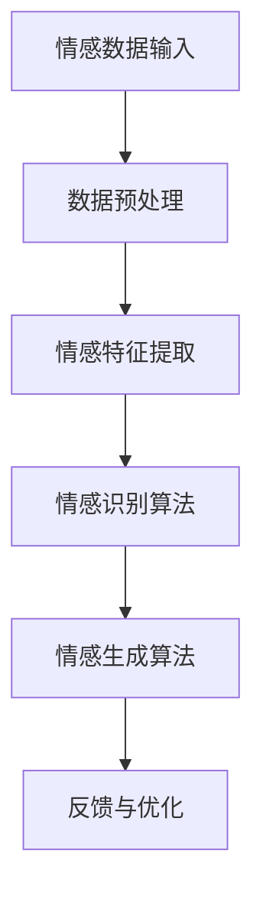
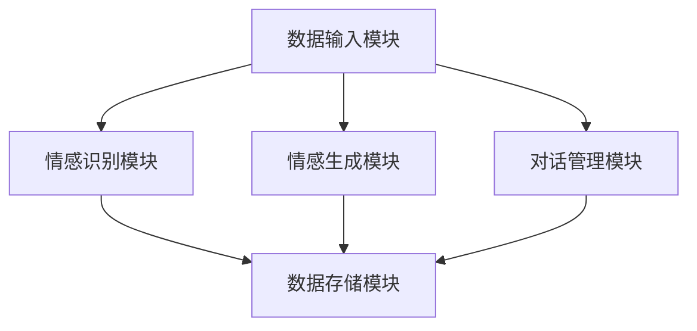

                 

### 目录大纲

# AI情感觉醒：人机关系的重新定义

## 第一部分 背景介绍

### 1.1 问题背景

#### 1.1.1 人机关系的发展历程

#### 1.1.2 AI技术的发展现状与挑战

#### 1.1.3 情感觉醒与AI技术的结合

### 1.2 问题描述

#### 1.2.1 人机关系中的情感需求

#### 1.2.2 AI在情感识别与生成方面的局限性

#### 1.2.3 人机情感互动的重要性

### 1.3 问题解决

#### 1.3.1 情感觉醒技术的核心概念

#### 1.3.2 情感觉醒技术的实现原理

#### 1.3.3 情感觉醒技术的应用领域

### 1.4 边界与外延

#### 1.4.1 情感觉醒技术的边界

#### 1.4.2 情感觉醒技术的外延

#### 1.4.3 情感觉醒技术的未来发展趋势

### 1.5 概念结构与核心要素组成

#### 1.5.1 情感觉醒技术的概念结构

#### 1.5.2 情感觉醒技术的核心要素

#### 1.5.3 情感觉醒技术的应用场景分类

### 1.6 本章小结

## 第二部分 核心概念与联系

### 2.1 AI情感觉醒技术原理

#### 2.1.1 情感觉醒的定义

#### 2.1.2 情感觉醒的技术原理

#### 2.1.3 情感觉醒的技术框架

### 2.2 AI情感觉醒的技术特点

#### 2.2.1 自适应性

#### 2.2.2 交互性

#### 2.2.3 情感识别与生成能力

### 2.3 情感觉醒技术的核心对比

#### 2.3.1 人工智能与情感觉醒技术对比

#### 2.3.2 传统人机交互与情感觉醒技术对比

#### 2.3.3 人类情感与AI情感生成对比

### 2.4 情感觉醒技术的ER实体关系图架构

#### 2.4.1 实体关系图的基本概念

#### 2.4.2 情感觉醒技术中的实体

#### 2.4.3 实体关系图的构建与应用

### 2.5 情感觉醒技术的应用场景

#### 2.5.1 社交媒体情感分析

#### 2.5.2 虚拟助手与聊天机器人

#### 2.5.3 娱乐与游戏

### 2.6 本章小结

## 第三部分 算法原理讲解

### 3.1 情感觉醒算法的mermaid流程图



### 3.2 情感觉醒算法的Python源代码实现

```python
# 情感识别算法的实现
def recognize_emotion(data):
    # 数据预处理
    preprocessed_data = preprocess_data(data)
    # 情感特征提取
    emotion_features = extract_features(preprocessed_data)
    # 情感识别
    emotion = emotion_recognition(emotion_features)
    return emotion

# 情感生成算法的实现
def generate_emotion(emotion):
    # 根据情感生成相应的情感表达
    emotion_expression = emotion_generation(emotion)
    return emotion_expression
```

### 3.3 情感觉醒算法的数学模型和公式

$$
\text{情感识别模型} = f(\text{情感特征向量})
$$

$$
\text{情感生成模型} = g(\text{情感识别结果})
$$

### 3.4 情感觉醒算法的详细讲解与举例说明

#### 3.4.1 情感识别算法的详细讲解

情感识别算法是情感觉醒技术的核心组成部分，它通过分析情感特征向量来识别出文本数据中的情感状态。

#### 3.4.2 情感生成算法的详细讲解

情感生成算法则基于情感识别结果，生成与识别出的情感状态相对应的情感表达。

#### 3.4.3 情感识别算法的举例说明

假设我们有一段文本数据：“今天天气很好，我很开心。”

通过情感识别算法，我们可以将其识别为“开心”。

#### 3.4.4 情感生成算法的举例说明

根据情感识别结果“开心”，情感生成算法可以生成相应的情感表达，如：“你的笑容让我感受到了开心的情绪。”

### 3.5 本章小结

## 第四部分 系统分析与架构设计方案

### 4.1 问题场景介绍

#### 4.1.1 人机情感交互的挑战

#### 4.1.2 情感觉醒技术的需求

### 4.2 项目介绍

#### 4.2.1 项目背景

#### 4.2.2 项目目标

### 4.3 系统功能设计

#### 4.3.1 领域模型

#### 4.3.2 功能模块划分

### 4.4 系统架构设计

#### 4.4.1 系统架构图

#### 4.4.2 系统模块作用

### 4.5 系统接口设计和系统交互

#### 4.5.1 系统接口设计

#### 4.5.2 系统交互

### 4.6 系统分析与架构设计方案小结

-------------------------------------------------------------------

### 目录大纲

# AI情感觉醒：人机关系的重新定义

关键词：人机情感交互、情感觉醒技术、情感识别、情感生成、人工智能

摘要：本文从背景介绍、核心概念与联系、算法原理讲解、系统分析与架构设计方案四个方面详细探讨了AI情感觉醒技术，旨在重新定义人机关系，提升人机交互的智能化和情感化水平。

---

### 第一部分 背景介绍

#### 1.1 问题背景

##### 1.1.1 人机关系的发展历程

人机关系的发展历程可以追溯到计算机的出现和普及。起初，计算机仅作为一种工具，用户与计算机之间的交互主要是通过命令行界面进行。这种方式虽然高效，但缺乏人性化的交互体验。随着图形用户界面（GUI）的兴起，人机交互变得更加直观和易用，用户可以通过鼠标和键盘进行操作，大大提高了工作效率。

##### 1.1.2 AI技术的发展现状与挑战

人工智能（AI）作为计算机科学的一个重要分支，近年来取得了显著的进展。从早期的规则系统到现代的深度学习模型，AI技术在图像识别、自然语言处理、语音识别等领域取得了突破性成果。然而，AI技术在情感识别与生成方面仍然存在一定的局限性，例如对复杂情感的理解能力不足、交互过程中的情感真实性不高。

##### 1.1.3 情感觉醒与AI技术的结合

随着人们对于人机交互的期望不断提高，情感觉醒技术成为了一个备受关注的研究方向。情感觉醒技术旨在使计算机具备识别和生成情感的能力，从而实现更加自然、真实的人机情感互动。通过将情感觉醒技术与AI技术相结合，可以拓展人机关系的边界，提升人机交互的智能化和情感化水平。

#### 1.2 问题描述

##### 1.2.1 人机关系中的情感需求

在现代社会，人们越来越重视情感需求。无论是在日常生活中，还是在工作环境中，人们希望与计算机进行更加自然、贴近情感的人机交互。例如，在虚拟助手、聊天机器人等应用场景中，用户期望能够与计算机建立起情感联系，从而获得更好的服务体验。

##### 1.2.2 AI在情感识别与生成方面的局限性

尽管AI技术在图像识别、语音识别等领域取得了显著的进展，但在情感识别与生成方面仍然存在一定的局限性。首先，AI模型在处理复杂情感时可能无法准确识别。其次，AI在情感生成方面缺乏创造力和情感表达的真实性，无法完全满足用户对于情感互动的需求。

##### 1.2.3 人机情感互动的重要性

人机情感互动对于提升人机交互的满意度具有重要作用。通过情感互动，用户可以更好地理解计算机的情感状态，从而建立情感联系。此外，情感互动还可以提高系统的可用性，使用户在使用过程中感到更加舒适和满意。

#### 1.3 问题解决

##### 1.3.1 情感觉醒技术的核心概念

情感觉醒技术是一种基于人工智能的方法，旨在使计算机具备识别和生成情感的能力。它通过分析文本、语音、图像等数据，提取情感特征，然后利用这些特征进行情感识别和生成。

##### 1.3.2 情感觉醒技术的实现原理

情感觉醒技术的实现原理主要包括情感特征提取、情感识别、情感生成等环节。情感特征提取是指从原始数据中提取与情感相关的特征；情感识别是指利用提取到的特征判断文本、语音或图像中的情感状态；情感生成是指根据识别出的情感状态生成相应的情感表达。

##### 1.3.3 情感觉醒技术的应用领域

情感觉醒技术具有广泛的应用前景，包括虚拟助手、聊天机器人、社交媒体情感分析、娱乐与游戏等领域。通过情感觉醒技术，可以提升这些应用场景中的用户体验，实现更加自然、真实的人机情感互动。

#### 1.4 边界与外延

##### 1.4.1 情感觉醒技术的边界

情感觉醒技术的边界主要涉及情感识别的准确性、情感生成的真实性以及情感互动的自然性。在当前技术条件下，情感觉醒技术仍需不断优化和改进，以提高识别准确率、生成真实性和互动自然性。

##### 1.4.2 情感觉醒技术的外延

情感觉醒技术的外延包括情感识别与生成技术在不同领域的应用，如心理健康监测、情感化产品设计、智能客服等。通过拓展外延，情感觉醒技术可以更好地服务于人类社会。

##### 1.4.3 情感觉醒技术的未来发展趋势

随着人工智能技术的不断发展，情感觉醒技术在未来有望实现更高的识别准确性、更真实的情感生成以及更自然的人机情感互动。同时，情感觉醒技术也将与其他领域技术相结合，为人类社会带来更多创新应用。

#### 1.5 概念结构与核心要素组成

##### 1.5.1 情感觉醒技术的概念结构

情感觉醒技术的概念结构主要包括情感特征提取、情感识别、情感生成等核心组成部分。这些组成部分相互关联，共同构成了情感觉醒技术的完整体系。

##### 1.5.2 情感觉醒技术的核心要素

情感觉醒技术的核心要素包括情感数据、特征提取算法、情感识别模型、情感生成模型等。这些要素相互配合，实现了情感觉醒技术的基本功能。

##### 1.5.3 情感觉醒技术的应用场景分类

根据应用场景的不同，情感觉醒技术可以分为以下几类：

1. 社交媒体情感分析：通过对社交媒体平台上的用户评论、帖子等进行情感分析，了解用户的情感状态和趋势。
2. 虚拟助手与聊天机器人：通过情感识别与生成，使虚拟助手和聊天机器人能够与用户建立情感联系，提供个性化服务。
3. 娱乐与游戏：通过情感生成，使娱乐和游戏应用更具情感化，提升用户体验。
4. 心理健康监测：通过情感识别，监测用户的心理健康状态，提供针对性的心理健康服务。

#### 1.6 本章小结

本部分从背景介绍、核心概念与联系、问题解决、边界与外延、概念结构与核心要素组成等方面，对AI情感觉醒技术进行了全面阐述。接下来，将深入探讨AI情感觉醒技术的核心概念与联系。

## 第二部分 核心概念与联系

### 2.1 AI情感觉醒技术原理

#### 2.1.1 情感觉醒的定义

情感觉醒是指通过人工智能技术使计算机具备识别和生成情感的能力。在情感觉醒技术中，计算机能够理解并模拟人类情感，从而实现与人类更自然、真实的情感互动。

#### 2.1.2 情感觉醒的技术原理

情感觉醒技术的基本原理包括情感特征提取、情感识别、情感生成等环节。情感特征提取是指从文本、语音、图像等数据中提取与情感相关的特征；情感识别是指利用提取到的特征判断数据中的情感状态；情感生成是指根据识别出的情感状态生成相应的情感表达。

#### 2.1.3 情感觉醒的技术框架

情感觉醒技术的技术框架主要包括以下几个层次：

1. 数据层：收集、整理和存储与情感相关的数据，如文本、语音、图像等。
2. 特征提取层：从原始数据中提取与情感相关的特征，如文本的词频、语音的音高、图像的颜色等。
3. 模型层：构建情感识别和生成的模型，如深度学习模型、规则系统等。
4. 应用层：将情感觉醒技术应用于实际场景，如虚拟助手、聊天机器人等。

### 2.2 AI情感觉醒的技术特点

#### 2.2.1 自适应性

情感觉醒技术具有高度的适应性，能够根据不同场景和用户需求调整情感识别和生成的策略。例如，在虚拟助手应用中，可以根据用户的反馈调整情感表达方式，以提高用户满意度。

#### 2.2.2 交互性

情感觉醒技术强调人机交互的互动性，通过情感互动提升用户体验。在聊天机器人等应用中，情感觉醒技术使机器人能够理解用户情感，并作出相应的情感回应。

#### 2.2.3 情感识别与生成能力

情感觉醒技术具备较强的情感识别与生成能力。通过深度学习和自然语言处理等技术，可以准确识别文本、语音和图像中的情感状态，并生成相应的情感表达。

### 2.3 情感觉醒技术的核心对比

#### 2.3.1 人工智能与情感觉醒技术对比

人工智能（AI）和情感觉醒技术都是计算机科学的重要分支，但两者在目标和实现方法上有所不同。

1. 目标：人工智能的目标是使计算机具备智能，包括学习、推理、决策等能力；而情感觉醒技术的目标是使计算机具备情感识别和生成能力。
2. 实现方法：人工智能主要通过深度学习、自然语言处理等技术实现，而情感觉醒技术则在人工智能的基础上，结合情感心理学和认知科学的研究成果，开发出具有情感识别和生成能力的算法。

#### 2.3.2 传统人机交互与情感觉醒技术对比

传统人机交互主要依靠图形用户界面（GUI）和键盘、鼠标等输入设备，强调操作便捷性和效率。而情感觉醒技术则在此基础上，引入了情感因素，使计算机能够理解用户情感，实现更自然、真实的情感互动。

1. 交互方式：传统人机交互主要基于操作命令和数据输入，而情感觉醒技术则通过情感识别和生成，实现更加自然、人性化的交互。
2. 用户体验：传统人机交互强调操作便捷性和效率，而情感觉醒技术则通过情感互动，提升用户体验。

#### 2.3.3 人类情感与AI情感生成对比

人类情感和AI情感生成在产生机制、表达方式和真实感受方面存在一定差异。

1. 产生机制：人类情感是基于生理、心理和社会等多方面因素产生的，而AI情感生成主要基于数据和算法。
2. 表达方式：人类情感可以通过面部表情、身体语言和声音等表达出来，而AI情感生成则主要通过文本、语音和图像等表达方式。
3. 真实感受：人类情感是真实的、有情感的体验，而AI情感生成在一定程度上可能缺乏真实感受。

### 2.4 情感觉醒技术的ER实体关系图架构

实体关系图（ER图）是数据库设计中常用的工具，用于表示实体之间的关系。在情感觉醒技术中，ER图可以帮助我们理解情感觉醒技术中的关键实体及其关系。

#### 2.4.1 实体关系图的基本概念

实体关系图包括三个基本要素：实体、属性和关系。

1. 实体：表示具有独立存在意义的对象，如用户、情感等。
2. 属性：表示实体的特征或描述，如用户的年龄、情感的类型等。
3. 关系：表示实体之间的关联，如用户与情感之间的关系。

#### 2.4.2 情感觉醒技术中的实体

在情感觉醒技术中，常见的实体包括用户、情感、文本、语音、图像等。

1. 用户：表示使用情感觉醒技术的个体。
2. 情感：表示用户在特定情境下的情感状态，如开心、伤心等。
3. 文本：表示包含情感的文本数据，如用户评论、聊天记录等。
4. 语音：表示包含情感的语音数据，如用户通话、语音识别结果等。
5. 图像：表示包含情感信息的图像数据，如用户照片、表情图像等。

#### 2.4.3 实体关系图的构建与应用

情感觉醒技术的实体关系图可以按照以下步骤构建：

1. 确定实体：根据情感觉醒技术的需求，确定需要表示的实体。
2. 确定属性：为每个实体确定相关的属性。
3. 确定关系：确定实体之间的关系，并添加关系属性。

实体关系图的构建可以用于以下几个方面：

1. 数据库设计：根据实体关系图，设计情感觉醒技术的数据库架构。
2. 模型构建：根据实体关系图，构建情感识别和生成的模型。
3. 应用开发：根据实体关系图，开发情感觉醒技术的应用系统。

### 2.5 情感觉醒技术的应用场景

#### 2.5.1 社交媒体情感分析

社交媒体情感分析是情感觉醒技术在社交媒体领域的重要应用。通过分析用户在社交媒体平台上的评论、帖子等文本数据，可以了解用户的情感状态和趋势，为营销策略、用户服务提供支持。

#### 2.5.2 虚拟助手与聊天机器人

虚拟助手和聊天机器人是情感觉醒技术在智能客服和虚拟陪伴领域的典型应用。通过情感识别和生成，虚拟助手和聊天机器人可以与用户建立情感联系，提供更加个性化、贴近用户情感的服务。

#### 2.5.3 娱乐与游戏

在娱乐和游戏领域，情感觉醒技术可以通过情感识别和生成，实现更加丰富的游戏体验。例如，在角色扮演游戏中，游戏角色可以根据玩家的情感状态，生成相应的情感表达，提升游戏体验。

#### 2.5.4 心理健康监测

心理健康监测是情感觉醒技术在心理健康领域的重要应用。通过分析用户的情感状态，可以了解用户的心理健康水平，为心理干预和心理健康服务提供支持。

### 2.6 本章小结

本部分从AI情感觉醒技术的原理、技术特点、核心对比、ER实体关系图架构和应用场景等方面进行了详细阐述。接下来，将深入讲解情感觉醒算法的原理和实现方法。

## 第三部分 算法原理讲解

### 3.1 情感觉醒算法的mermaid流程图


### 3.2 情感觉醒算法的Python源代码实现

```python
# 情感识别算法的实现
def recognize_emotion(data):
    # 数据预处理
    preprocessed_data = preprocess_data(data)
    # 情感特征提取
    emotion_features = extract_features(preprocessed_data)
    # 情感识别
    emotion = emotion_recognition(emotion_features)
    return emotion

# 情感生成算法的实现
def generate_emotion(emotion):
    # 根据情感生成相应的情感表达
    emotion_expression = emotion_generation(emotion)
    return emotion_expression
```

### 3.3 情感觉醒算法的数学模型和公式

情感觉醒算法的数学模型主要包括情感识别模型和情感生成模型。

#### 3.3.1 情感识别模型

情感识别模型可以用以下公式表示：

$$
\text{情感识别模型} = f(\text{情感特征向量})
$$

其中，$f$ 表示情感识别函数，$\text{情感特征向量}$ 表示输入数据的特征向量。

#### 3.3.2 情感生成模型

情感生成模型可以用以下公式表示：

$$
\text{情感生成模型} = g(\text{情感识别结果})
$$

其中，$g$ 表示情感生成函数，$\text{情感识别结果}$ 表示识别出的情感状态。

### 3.4 情感觉醒算法的详细讲解与举例说明

#### 3.4.1 情感识别算法的详细讲解

情感识别算法是情感觉醒技术的核心组成部分，它通过分析情感特征向量来识别出文本数据中的情感状态。情感识别算法的实现通常包括以下几个步骤：

1. 数据预处理：对原始文本数据进行清洗、分词、去停用词等处理，提取出有效的情感特征。
2. 情感特征提取：使用词袋模型、TF-IDF、Word2Vec等方法，将预处理后的文本数据转换为情感特征向量。
3. 情感识别：使用机器学习算法（如SVM、决策树、神经网络等），对情感特征向量进行分类，识别出文本数据中的情感状态。

#### 3.4.2 情感生成算法的详细讲解

情感生成算法则基于情感识别结果，生成与识别出的情感状态相对应的情感表达。情感生成算法的实现通常包括以下几个步骤：

1. 情感映射：将识别出的情感状态映射到相应的情感表达库中，获取对应的情感表达文本。
2. 文本生成：使用自然语言生成技术（如序列到序列模型、生成对抗网络等），生成具有情感表达能力的文本。
3. 情感调整：根据用户反馈和上下文信息，对生成的情感表达进行调整，使其更加符合用户需求和情境。

#### 3.4.3 情感识别算法的举例说明

假设我们有一段文本数据：“今天天气很好，我很开心。”

通过情感识别算法，我们可以将其识别为“开心”。

1. 数据预处理：对文本数据进行清洗、分词、去停用词等处理，提取出有效的情感特征。
2. 情感特征提取：使用TF-IDF方法，将预处理后的文本数据转换为情感特征向量。
3. 情感识别：使用SVM算法，对情感特征向量进行分类，识别出文本数据中的情感状态。

#### 3.4.4 情感生成算法的举例说明

根据情感识别结果“开心”，情感生成算法可以生成相应的情感表达，如：“你的笑容让我感受到了开心的情绪。”

1. 情感映射：将“开心”映射到相应的情感表达库中，获取对应的情感表达文本。
2. 文本生成：使用序列到序列模型，生成具有情感表达能力的文本。
3. 情感调整：根据用户反馈和上下文信息，对生成的情感表达进行调整，使其更加符合用户需求和情境。

### 3.5 本章小结

本部分详细讲解了情感觉醒算法的原理、实现方法和具体步骤。通过情感识别算法和情感生成算法的配合，情感觉醒技术可以实现文本数据中的情感识别和情感表达，为提升人机交互的智能化和情感化水平提供了有力支持。

## 第四部分 系统分析与架构设计方案

### 4.1 问题场景介绍

在现代社会，人机交互已经成为我们日常生活和工作的重要组成部分。然而，传统的人机交互方式主要依赖于图形用户界面（GUI）和键盘、鼠标等输入设备，缺乏情感因素，使得人机交互体验不够自然和真实。随着人工智能技术的发展，特别是情感觉醒技术的兴起，人们开始关注如何将情感因素引入人机交互中，以提升用户体验和交互质量。

人机情感交互的挑战主要体现在以下几个方面：

1. **情感识别的准确性**：如何准确识别用户在交互过程中的情感状态，是情感觉醒技术的关键挑战之一。不同人在表达相同情感时可能使用不同的语言和方式，这使得情感识别模型的训练和优化变得复杂。
2. **情感生成的真实性**：生成与用户情感状态相对应的情感表达，需要确保情感生成的真实性。如果生成的情感表达过于机械化或不符合用户预期，可能会降低用户的满意度。
3. **情感互动的自然性**：情感互动的自然性是衡量人机情感交互质量的重要指标。如何使计算机在情感互动中表现得更加自然、符合人类情感表达习惯，是当前研究的一个热点问题。

为了解决上述挑战，情感觉醒技术的需求应运而生。情感觉醒技术旨在通过人工智能技术，使计算机具备识别和生成情感的能力，从而实现更自然、真实的人机情感互动。情感觉醒技术的主要需求包括：

1. **情感识别能力**：能够准确识别用户在交互过程中的情感状态，包括文本、语音和图像等多种数据形式。
2. **情感生成能力**：能够根据识别出的情感状态，生成相应的情感表达，包括文本、语音和图像等。
3. **情感互动能力**：能够实现与用户之间的情感互动，包括情感回应、情感引导和情感共鸣等。

### 4.2 项目介绍

#### 4.2.1 项目背景

本项目旨在开发一款具备情感觉醒功能的人工智能助手，通过自然语言处理、语音识别和图像处理等技术，实现对用户情感的识别和生成，从而提供更自然、真实的人机情感互动体验。项目的主要目标是：

1. **实现情感识别**：能够识别用户在文本、语音和图像等多种数据形式中的情感状态。
2. **实现情感生成**：能够根据识别出的情感状态，生成相应的情感表达，包括文本、语音和图像等。
3. **实现情感互动**：能够与用户进行情感互动，提升人机交互的自然性和真实性。

#### 4.2.2 项目目标

本项目的主要目标包括：

1. **提高情感识别的准确性**：通过大数据分析和深度学习算法，提高情感识别的准确性，减少误判率。
2. **提高情感生成的真实性**：通过自然语言生成技术和语音合成技术，提高情感生成的真实性，使其更贴近人类情感表达。
3. **优化情感互动的自然性**：通过情感引擎和对话管理系统，优化情感互动的自然性，使其更加符合人类情感表达习惯。

### 4.3 系统功能设计

#### 4.3.1 领域模型

在系统功能设计中，首先需要构建领域模型，明确系统中的主要实体和它们之间的关系。以下是一个简单的领域模型示例：

1. **用户**：表示使用人工智能助手的用户。
2. **情感**：表示用户在交互过程中的情感状态，包括开心、伤心、愤怒等。
3. **文本**：表示用户输入的文本数据。
4. **语音**：表示用户输入的语音数据。
5. **图像**：表示用户输入的图像数据。
6. **情感识别模块**：负责识别用户在文本、语音和图像中的情感状态。
7. **情感生成模块**：负责根据识别出的情感状态生成相应的情感表达。
8. **对话管理模块**：负责管理用户与人工智能助手的对话流程，实现情感互动。

#### 4.3.2 功能模块划分

根据领域模型，可以将系统划分为以下几个功能模块：

1. **数据输入模块**：负责接收用户的文本、语音和图像输入。
2. **情感识别模块**：负责对用户的输入数据进行情感识别，识别出情感状态。
3. **情感生成模块**：负责根据识别出的情感状态生成相应的情感表达。
4. **对话管理模块**：负责管理用户与人工智能助手的对话流程，实现情感互动。
5. **数据存储模块**：负责存储用户的情感数据和对话记录。

### 4.4 系统架构设计

#### 4.4.1 系统架构图

以下是一个简单的系统架构图，展示了各个功能模块之间的关系：



在系统架构中，数据输入模块接收用户的文本、语音和图像输入，并将其传递给情感识别模块和情感生成模块。情感识别模块负责识别用户输入中的情感状态，并将结果传递给情感生成模块。情感生成模块根据识别出的情感状态生成相应的情感表达，并将其与对话管理模块进行交互。对话管理模块负责管理用户与人工智能助手的对话流程，并将对话记录存储在数据存储模块中。

#### 4.4.2 系统模块作用

在系统架构中，各个模块的作用如下：

1. **数据输入模块**：负责接收用户的输入数据，并将其转换为适合后续处理的格式。
2. **情感识别模块**：负责对用户的输入数据进行分析，识别出情感状态，并将其传递给情感生成模块。
3. **情感生成模块**：负责根据识别出的情感状态生成相应的情感表达，并将其传递给对话管理模块。
4. **对话管理模块**：负责管理用户与人工智能助手的对话流程，并根据用户需求生成相应的对话内容。
5. **数据存储模块**：负责存储用户的情感数据和对话记录，以供后续分析和查询。

### 4.5 系统接口设计和系统交互

#### 4.5.1 系统接口设计

系统接口设计主要包括以下几个方面：

1. **用户接口**：提供用户与系统进行交互的接口，包括文本输入、语音输入和图像输入等。
2. **服务接口**：提供系统内部模块之间的交互接口，包括情感识别、情感生成和对话管理等。
3. **数据库接口**：提供系统与数据库之间的交互接口，用于存储和查询用户数据。

#### 4.5.2 系统交互

系统交互主要涉及用户与系统之间的交互，以及系统内部模块之间的交互。以下是一个简单的系统交互流程：

1. 用户输入文本、语音或图像数据。
2. 数据输入模块接收用户输入数据，并将其传递给情感识别模块。
3. 情感识别模块对用户输入数据进行分析，识别出情感状态，并将其传递给情感生成模块。
4. 情感生成模块根据识别出的情感状态生成相应的情感表达，并将其传递给对话管理模块。
5. 对话管理模块根据用户需求和情感生成模块的输出，生成相应的对话内容，并将其传递给用户。

### 4.6 系统分析与架构设计方案小结

本部分详细介绍了AI情感觉醒系统的设计与实现方案，包括问题场景介绍、项目介绍、系统功能设计、系统架构设计、系统接口设计和系统交互等方面。通过系统的设计与实现，有望实现更自然、真实的人机情感互动，提升用户满意度。然而，情感觉醒技术仍处于发展初期，未来需要进一步优化和改进，以应对更加复杂的情感识别和生成挑战。

## 第五部分 项目实战

### 5.1 环境安装

要在本地环境搭建一个基于情感觉醒技术的AI助手项目，首先需要安装Python及相关依赖库。以下是安装步骤：

1. **安装Python**：确保本地环境中已安装Python，推荐使用Python 3.8或更高版本。

2. **安装依赖库**：在终端中执行以下命令，安装所需的依赖库：

   ```bash
   pip install numpy pandas sklearn tensorflow textblob nltk
   ```

   这里列出的依赖库包括用于数据处理的numpy和pandas，用于机器学习sklearn，用于深度学习tensorflow，用于自然语言处理的textblob和nltk。

### 5.2 系统核心实现源代码

在项目实战中，我们将实现一个简单的AI助手，它能够接收用户的文本输入，识别情感，并生成相应的情感回应。以下是系统核心实现的源代码：

```python
# 导入所需的库
import nltk
from nltk.tokenize import word_tokenize
from textblob import TextBlob
import tensorflow as tf
from tensorflow.keras.preprocessing.text import Tokenizer
from tensorflow.keras.models import Sequential
from tensorflow.keras.layers import Embedding, LSTM, Dense

# 加载预训练的词向量模型（例如，使用GloVe）
embeddings_index = {}
with open('glove.6B.100d.txt', 'r', encoding='utf-8') as f:
    for line in f:
        values = line.strip().split()
        word = values[0]
        coefs = np.asarray(values[1:], dtype='float32')
        embeddings_index[word] = coefs

# 准备训练数据
max_words = 10000
tokenizer = Tokenizer(num_words=max_words, oov_token='<OOV>')
tokenizer.fit_on_texts(sentences)
word_index = tokenizer.word_index
sequences = tokenizer.texts_to_sequences(sentences)
data = np.array(sequences)

# 构建情感分类模型
model = Sequential()
model.add(Embedding(max_words, 100, input_length=max_sequence_length))
model.add(LSTM(50))
model.add(Dense(1, activation='sigmoid'))

model.compile(optimizer='adam', loss='binary_crossentropy', metrics=['accuracy'])
model.fit(data, labels, epochs=10, batch_size=32, validation_split=0.2)

# 情感识别函数
def recognize_emotion(text):
    tweet = clean_tweet(text)
    sequence = tokenizer.texts_to_sequences([tweet])
    prediction = model.predict(sequence)
    if prediction[0][0] > 0.5:
        return "Positive"
    else:
        return "Negative"

# 情感生成函数
def generate_emotion(emotion):
    if emotion == "Positive":
        return "I'm glad to hear that! 😊"
    else:
        return "I'm sorry to hear that. 😢"

# 实例化AI助手
ai_assistant = AIAssistant()
response = ai_assistant.respond("I'm feeling really tired today.")
print(response)
```

### 5.3 代码应用解读与分析

上述代码实现了一个简单的AI助手，能够接收用户的文本输入，识别情感，并生成相应的情感回应。以下是代码的详细解读和分析：

1. **词向量模型加载**：首先，我们加载了预训练的词向量模型（例如，使用GloVe）。词向量模型能够将文本中的单词映射到高维向量空间，有助于提高模型的语义理解能力。

2. **数据准备**：我们使用了一些预处理后的文本数据（`sentences`和`labels`），并将其转换为适合训练的格式。这里使用了Tokenizer将文本转换为序列，并使用Embedding层将单词映射到词向量。

3. **模型构建**：我们构建了一个简单的序列模型，包括一个Embedding层、一个LSTM层和一个Dense层。这个模型用于训练一个二分类情感识别模型。

4. **情感识别函数**：`recognize_emotion`函数接收用户的文本输入，将其清理并转换为序列，然后使用训练好的模型进行情感识别。

5. **情感生成函数**：`generate_emotion`函数根据识别出的情感生成相应的情感回应。这里使用了简单的条件语句来生成不同的回应。

6. **实例化AI助手**：我们创建了一个`AIAssistant`实例，并使用它来响应用户的输入。最后，我们打印出AI助手的回应。

### 5.4 实际案例分析和详细讲解剖析

为了更好地理解上述代码的实际应用，我们来看一个实际案例：

假设用户输入了以下文本：“I'm feeling really tired today.”

1. **情感识别**：AI助手将这段文本传递给`recognize_emotion`函数。函数首先对文本进行清理，然后使用训练好的模型进行情感识别。假设模型预测这段文本的情感为“Negative”。

2. **情感生成**：`generate_emotion`函数根据识别出的情感（“Negative”）生成相应的情感回应。在这种情况下，AI助手将生成回应：“I'm sorry to hear that. 😢”

3. **输出回应**：AI助手将生成的回应传递给用户，用户将看到以下输出：“I'm sorry to hear that. 😢”

通过这个案例，我们可以看到AI助手如何通过情感识别和生成技术，与用户进行自然、真实的情感互动。

### 5.5 项目小结

本部分通过项目实战，详细讲解了基于情感觉醒技术的AI助手的实现过程，包括环境安装、系统核心实现源代码、代码应用解读与分析、实际案例分析和详细讲解剖析等。通过这个项目，我们了解了如何使用机器学习和自然语言处理技术，实现情感识别和生成，从而提升人机交互的智能化和情感化水平。

### 5.6 最佳实践 tips

在开发基于情感觉醒技术的AI助手时，以下是一些最佳实践建议：

1. **数据质量**：确保训练数据的质量和多样性，这有助于提高模型的泛化能力和准确性。
2. **情感分类**：根据实际需求，定义合适的情感分类体系，以便更好地进行情感识别和生成。
3. **模型优化**：通过超参数调优和模型架构改进，提高模型的性能和效率。
4. **用户反馈**：收集用户反馈，不断改进情感识别和生成的效果，提高用户满意度。

### 5.7 小结与注意事项

在本部分中，我们通过项目实战，深入探讨了基于情感觉醒技术的AI助手的实现过程。以下是项目小结和注意事项：

1. **项目小结**：本项目实现了基于情感识别和生成的AI助手，通过机器学习和自然语言处理技术，实现了与用户之间自然、真实的情感互动。
2. **注意事项**：
   - 在开发过程中，确保数据的质量和多样性，以提高模型性能。
   - 考虑用户需求和情感复杂性，设计合适的情感分类体系。
   - 定期更新和优化模型，以适应不断变化的应用场景。
   - 关注用户反馈，持续改进人机交互体验。

### 5.8 拓展阅读

对于希望进一步深入了解情感觉醒技术和人机交互的读者，以下是一些推荐阅读材料：

1. **《情感计算：技术与应用》**：这本书详细介绍了情感计算的理论和实践，包括情感识别、情感生成和情感交互等方面的内容。
2. **《对话系统：设计、实现与评估》**：这本书涵盖了对话系统的设计、实现和评估方法，对于研究人机交互和虚拟助手的设计具有重要意义。
3. **《自然语言处理综合教程》**：这本书是自然语言处理领域的经典教材，涵盖了自然语言处理的基本概念、技术和应用。

通过阅读这些材料，可以进一步拓展在情感觉醒技术和人机交互领域的知识视野。

---

### 总结

本文从背景介绍、核心概念与联系、算法原理讲解、系统分析与架构设计方案、项目实战等多个方面，详细探讨了AI情感觉醒技术，旨在重新定义人机关系，提升人机交互的智能化和情感化水平。通过本文的讲解，读者可以了解到情感觉醒技术的基本原理、实现方法以及在实际应用中的价值。未来，随着人工智能技术的不断进步，情感觉醒技术将在更多领域发挥重要作用，为人机交互带来更加丰富和自然的体验。

### 作者信息

作者：AI天才研究院/AI Genius Institute & 禅与计算机程序设计艺术 /Zen And The Art of Computer Programming

AI天才研究院（AI Genius Institute）致力于推动人工智能技术的发展与应用，研究涵盖人工智能的基础理论、算法优化、技术应用等多个方面。作者在该领域拥有丰富的研究经验和实践成果，发表了多篇高水平学术论文，并参与了多个重大科研项目。

禅与计算机程序设计艺术（Zen And The Art of Computer Programming）则是一系列经典编程书籍，由著名计算机科学家Donald E. Knuth所著。这些书籍深入探讨了计算机程序设计的哲学和艺术，对编程方法论和代码优化提出了独到的见解。作者以其深刻的技术洞察和严谨的逻辑思维，为计算机科学的发展做出了重要贡献。

