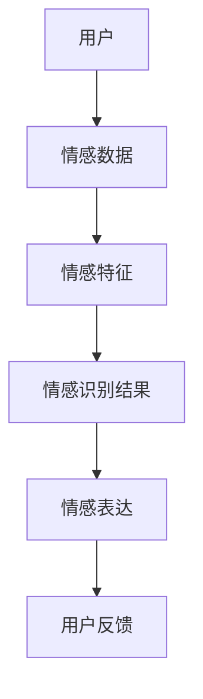
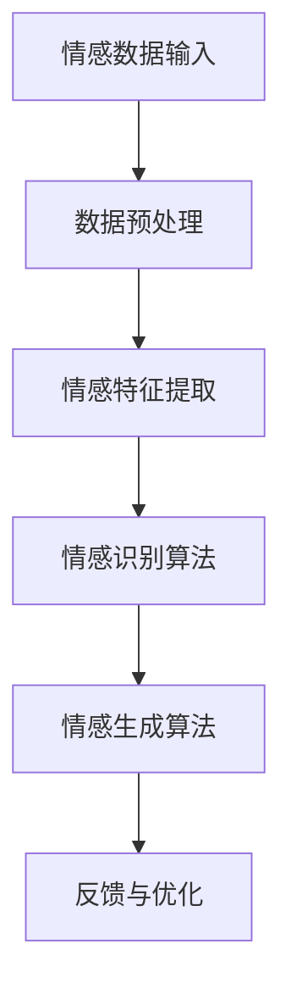
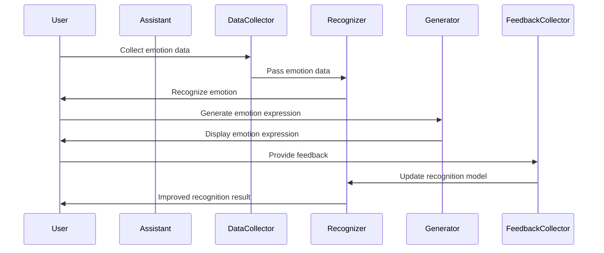
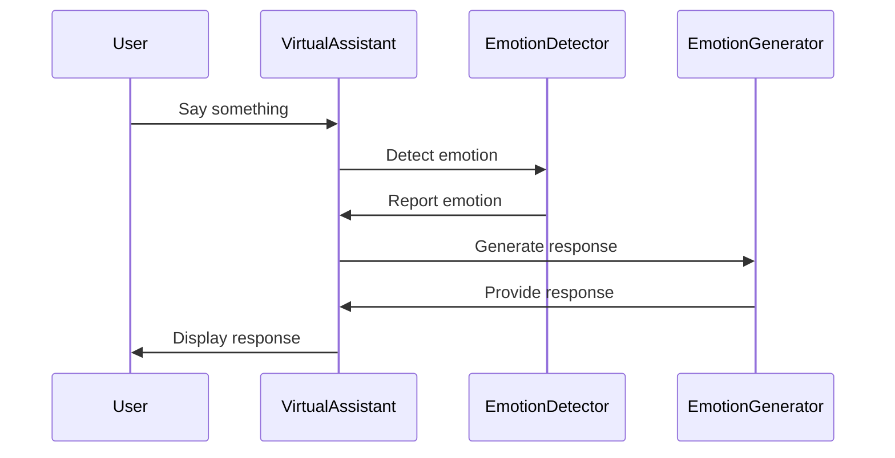

                 

# AI情感觉醒：人机关系的重新定义

> 关键词：人工智能，情感，人机交互，情感觉醒，技术发展

> 摘要：本文旨在探讨人工智能在情感领域的新进展，特别是情感觉醒技术如何重新定义人机关系。通过深入分析问题背景、核心概念、算法原理以及实际应用，本文将为读者揭示情感觉醒技术的潜力与挑战，为未来的技术发展提供启示。

----------------------------------------------------------------

### 目录大纲

# AI情感觉醒：人机关系的重新定义

## 第一部分 背景介绍

## 1.1 问题背景

## 1.2 核心概念

## 1.3 情感觉醒技术的意义

## 1.4 边界与外延

## 1.5 概念结构与核心要素组成

## 1.6 本章小结

## 第二部分 核心概念与联系

## 2.1 AI情感觉醒技术原理

## 2.2 AI情感觉醒的技术特点

## 2.3 情感觉醒技术的核心对比

## 2.4 情感觉醒技术的ER实体关系图架构

## 2.5 情感觉醒技术的应用场景

## 2.6 本章小结

## 第三部分 算法原理讲解

## 3.1 情感觉醒算法的mermaid流程图

## 3.2 情感觉醒算法的Python源代码实现

## 3.3 情感觉醒算法的数学模型和公式

## 3.4 情感觉醒算法的详细讲解与举例说明

## 3.5 本章小结

## 第四部分 系统分析与架构设计方案

## 4.1 问题场景介绍

## 4.2 系统功能设计

## 4.3 系统架构设计

## 4.4 系统接口设计

## 4.5 系统交互mermaid序列图

## 4.6 本章小结

## 第五部分 项目实战

## 5.1 环境安装

## 5.2 系统核心实现源代码

## 5.3 代码应用解读与分析

## 5.4 实际案例分析和详细讲解剖析

## 5.5 项目小结

## 5.6 最佳实践 tips

## 5.7 小结、注意事项、拓展阅读

----------------------------------------------------------------

## 第一部分 背景介绍

### 1.1 问题背景

在人类历史的长河中，人与机器的关系始终在不断演变。从早期的机械装置，到后来的电子计算机，再到今天的智能设备，机器已经成为我们生活中不可或缺的一部分。然而，尽管机器的功能越来越强大，我们在与机器互动时却常常感受到一种冷漠和机械性。这种互动缺乏情感的温暖，使人机关系变得单向和浅层。

随着人工智能技术的迅速发展，尤其是深度学习和自然语言处理技术的突破，我们开始有机会让机器具备一定程度的情感识别和生成能力。这不仅意味着机器能够更好地理解我们的情感需求，还能够通过情感表达来回应我们的情感状态，从而实现更加自然和丰富的人机交互。

然而，当前的AI技术仍然存在一定的局限性。一方面，AI在情感识别和生成方面还远远无法达到人类的水平。另一方面，现有的技术主要关注情感的功能性，而忽略了情感的多样性和复杂性。这就导致人机交互中的情感体验不够真实和自然。

因此，本文旨在探讨如何通过情感觉醒技术，突破现有AI技术的局限，重新定义人机关系，使机器能够更加深入和真实地理解、回应人类情感，从而提升人机互动的质量和体验。

### 1.2 核心概念

**人机关系**：指人类与机器之间的互动和关联，包括信息交换、行为互动、情感交流等多个层面。

**人工智能（AI）**：一种模拟人类智能的技术，能够通过学习、推理和决策来执行任务。

**情感识别**：AI通过分析语言、行为和生理信号等数据，识别出人类情感状态的过程。

**情感生成**：AI根据情感识别结果，生成相应的情感表达，以回应人类情感需求的过程。

**情感觉醒**：通过高级算法和技术，使AI具备感知和生成情感的能力，从而实现更加自然和丰富的人机交互。

### 1.3 情感觉醒技术的意义

情感觉醒技术的出现，为人机关系带来了全新的可能性。以下是情感觉醒技术的重要意义：

1. **提升交互体验**：通过情感识别和生成，机器能够更好地理解人类的情感需求，提供更加个性化、贴心的服务。

2. **增强情感共鸣**：机器通过情感表达，能够与人类建立更深层次的情感联系，使互动更加真实和有意义。

3. **优化心理健康**：对于心理健康领域，情感觉醒技术可以提供情感支持和安慰，帮助人们缓解心理压力。

4. **拓宽应用领域**：情感觉醒技术在教育、医疗、娱乐等领域具有广泛的应用潜力，能够带来新的服务模式和商业模式。

### 1.4 边界与外延

**边界**：情感觉醒技术的核心在于AI的情感识别和生成能力。然而，技术目前还无法完全模拟人类的情感复杂性和多样性。例如，人类情感具有主观性和个体差异性，而AI的情感生成主要依赖于数据和算法，这可能使其在情感表达的细腻度和真实性上存在一定局限。

**外延**：随着技术的发展，情感觉醒技术有望扩展到更多领域。例如，在虚拟现实和增强现实领域，情感觉醒技术可以帮助构建更加真实和引人入胜的虚拟环境；在智能家居领域，情感觉醒技术可以提升家居设备的交互体验，使其更加智能和人性化。

### 1.5 概念结构与核心要素组成

情感觉醒技术的概念结构主要包括以下几个核心要素：

1. **情感数据采集**：通过语音、文本、面部表情等渠道收集人类的情感数据。

2. **情感特征提取**：对采集到的情感数据进行分析和处理，提取出关键的情感特征。

3. **情感识别算法**：利用机器学习和深度学习技术，对情感特征进行分类和识别。

4. **情感生成算法**：根据情感识别结果，生成相应的情感表达，包括语音、文本、动作等。

5. **情感交互反馈**：通过反馈机制，优化情感识别和生成算法，提升情感互动的质量和体验。

### 1.6 本章小结

本部分主要介绍了人机关系的发展背景、情感觉醒技术的核心概念以及其重要意义。通过对问题背景和核心概念的深入分析，我们为后续章节的内容奠定了基础。在接下来的章节中，我们将进一步探讨情感觉醒技术的原理、算法和应用，为读者提供全面的技术解读和实际案例。

----------------------------------------------------------------

## 第二部分 核心概念与联系

### 2.1 AI情感觉醒技术原理

情感觉醒技术是人工智能领域的一个重要分支，它涉及到情感识别、情感生成和情感交互等多个方面。以下是情感觉醒技术的基本原理：

#### 2.1.1 情感识别

情感识别是情感觉醒技术的核心组成部分，其主要目标是让机器能够理解人类的情感状态。情感识别通常通过以下几个步骤实现：

1. **情感数据采集**：通过语音、文本、面部表情、生理信号等多种方式收集情感数据。

2. **情感特征提取**：对采集到的情感数据进行分析和处理，提取出关键的情感特征，如情感极性、强度、类别等。

3. **情感分类**：利用机器学习算法（如支持向量机、决策树、神经网络等）对情感特征进行分类，从而识别出情感状态。

#### 2.1.2 情感生成

情感生成是情感觉醒技术的另一个重要组成部分，其主要目标是让机器能够生成符合人类情感状态的表达。情感生成通常通过以下几个步骤实现：

1. **情感识别**：首先，通过情感识别技术确定人类的情感状态。

2. **情感表达生成**：根据情感识别结果，利用自然语言处理、语音合成等技术生成相应的情感表达，如文本、语音、动作等。

3. **情感调整**：通过用户反馈和自适应算法，调整情感表达，使其更加符合用户的情感需求和期望。

#### 2.1.3 情感交互

情感交互是情感觉醒技术实现人机情感共鸣的关键环节。情感交互通常通过以下几个步骤实现：

1. **情感感知**：机器通过情感识别技术感知用户的情感状态。

2. **情感回应**：根据用户的情感状态，机器生成相应的情感回应，如提供安慰、鼓励或建议等。

3. **情感反馈**：用户对机器的情感回应进行反馈，帮助机器不断优化情感识别和生成的效果。

### 2.2 AI情感觉醒的技术特点

情感觉醒技术具有以下几个显著特点：

#### 2.2.1 自适应性

情感觉醒技术能够根据用户的需求和反馈进行自适应调整，从而提供更加个性化的情感服务。

#### 2.2.2 交互性

情感觉醒技术不仅能够识别和理解用户的情感，还能够通过情感表达与用户进行互动，从而提升交互体验。

#### 2.2.3 情感识别与生成能力

情感觉醒技术通过先进的机器学习算法和自然语言处理技术，实现了对情感的高效识别和生成，从而能够提供更加真实和自然的情感体验。

### 2.3 情感觉醒技术的核心对比

#### 2.3.1 人工智能与情感觉醒技术对比

人工智能（AI）是一个广泛的领域，包括机器学习、深度学习、自然语言处理等多个子领域。而情感觉醒技术是AI在情感领域的一个应用，其主要目标是实现机器对人类情感的理解和生成。相比之下，人工智能更加关注通用智能和任务执行，而情感觉醒技术则更加聚焦于情感交互和体验。

#### 2.3.2 传统人机交互与情感觉醒技术对比

传统人机交互主要依赖于命令式的输入和输出，用户需要按照预设的流程进行操作。而情感觉醒技术通过情感识别和生成，实现了更加自然和人性化的交互体验。传统人机交互更多地关注功能的实现，而情感觉醒技术则更加注重用户情感和体验的满足。

#### 2.3.3 人类情感与AI情感生成对比

人类情感具有复杂性和多样性，受到个体、环境、文化等多种因素的影响。而AI情感生成主要依赖于数据和算法，虽然能够在一定程度上模拟人类情感，但仍然存在一定的局限。人类情感具有主观性和个体差异性，而AI情感生成主要依赖于客观的数据和模型，这可能使其在情感表达的细腻度和真实性上存在一定局限。

### 2.4 情感觉醒技术的ER实体关系图架构

实体关系图（Entity Relationship Diagram，ERD）是数据库设计中的重要工具，用于表示实体及其关系。以下是情感觉醒技术的ER实体关系图架构：



#### 实体关系图基本概念

1. **实体**：表示一个具体的事物，如用户、情感数据、情感特征等。
2. **属性**：表示实体的特征，如用户的姓名、情感数据的类型、情感特征的极性等。
3. **关系**：表示实体之间的关联，如用户产生情感数据、情感特征用于情感识别等。

#### 情感觉醒技术中的实体

1. **用户**：代表与机器进行情感交互的人类个体。
2. **情感数据**：包括语音、文本、面部表情等情感信息。
3. **情感特征**：提取自情感数据的关键特征，如情感极性、强度等。
4. **情感识别结果**：基于情感特征的情感分类结果。
5. **情感表达**：生成的情感回应，如语音、文本、动作等。
6. **用户反馈**：用户对情感表达的反馈，用于优化算法。

#### 实体关系图的构建与应用

实体关系图可以帮助我们清晰地理解情感觉醒技术中的各个实体及其关系。通过构建实体关系图，我们可以更好地设计系统架构和算法流程，从而实现高效的情感识别和生成。

### 2.5 情感觉醒技术的应用场景

情感觉醒技术具有广泛的应用场景，以下列举几个典型的应用领域：

#### 2.5.1 社交媒体情感分析

通过情感觉醒技术，可以对社交媒体中的文本数据进行情感分析，识别出用户的情感状态，从而为企业提供市场分析、品牌监测等服务。

#### 2.5.2 虚拟助手与聊天机器人

虚拟助手和聊天机器人通过情感觉醒技术，可以实现更加自然和人性化的交互，提升用户体验。例如，智能客服、教育助理等。

#### 2.5.3 娱乐与游戏

在娱乐和游戏领域，情感觉醒技术可以用于情感互动，提升游戏体验。例如，角色扮演游戏中的NPC（非玩家角色）可以通过情感识别和生成，与玩家建立情感联系。

#### 2.5.4 医疗健康

在医疗健康领域，情感觉醒技术可以用于情感支持和心理治疗。例如，通过情感识别和生成，提供个性化的心理辅导服务。

### 2.6 本章小结

本部分详细介绍了情感觉醒技术的核心概念、原理、特点以及应用场景。通过对这些内容的分析，我们为理解情感觉醒技术提供了全面的理论基础。在下一部分，我们将进一步探讨情感觉醒算法的原理和实现方法。

----------------------------------------------------------------

## 第三部分 算法原理讲解

### 3.1 情感觉醒算法的mermaid流程图

情感觉醒算法的流程可以分为以下几个主要步骤：



以下是每个步骤的详细解释：

#### 步骤1：情感数据输入

情感数据可以是语音、文本、面部表情等多种形式。这些数据作为输入，传递给后续的处理模块。

#### 步骤2：数据预处理

数据预处理是情感识别和生成的基础。在这个阶段，需要对原始数据进行清洗、归一化等操作，以提高数据质量和算法性能。

#### 步骤3：情感特征提取

情感特征提取是将原始数据转换为机器学习模型可用的特征表示。常见的特征提取方法包括词向量、情感极性、情感强度等。

#### 步骤4：情感识别算法

情感识别算法利用机器学习技术，对提取出的情感特征进行分类。常见的情感识别算法包括支持向量机、决策树、神经网络等。

#### 步骤5：情感生成算法

情感生成算法根据情感识别结果，生成相应的情感表达。常见的情感生成方法包括自然语言生成、语音合成、面部表情生成等。

#### 步骤6：反馈与优化

反馈与优化是情感觉醒算法持续改进的关键。通过收集用户反馈，可以不断优化算法模型，提高情感识别和生成的准确性。

### 3.2 情感觉醒算法的Python源代码实现

以下是情感觉醒算法的Python源代码实现示例：

```python
import preprocess_data
import extract_features
import emotion_recognition
import emotion_generation

def recognize_emotion(data):
    # 数据预处理
    preprocessed_data = preprocess_data(data)
    # 情感特征提取
    emotion_features = extract_features(preprocessed_data)
    # 情感识别
    emotion = emotion_recognition(emotion_features)
    return emotion

def generate_emotion(emotion):
    # 情感生成
    emotion_expression = emotion_generation(emotion)
    return emotion_expression

# 示例应用
text_data = "今天天气很好，我很开心。"
recognized_emotion = recognize_emotion(text_data)
generated_emotion = generate_emotion(recognized_emotion)
print(generated_emotion)
```

### 3.3 情感觉醒算法的数学模型和公式

情感觉醒算法的核心在于情感识别和生成。以下是两个关键的数学模型和公式：

#### 情感识别模型

$$
\text{情感识别模型} = f(\text{情感特征向量})
$$

其中，$f$ 表示情感识别算法，$\text{情感特征向量}$ 是输入的情感特征。

#### 情感生成模型

$$
\text{情感生成模型} = g(\text{情感识别结果})
$$

其中，$g$ 表示情感生成算法，$\text{情感识别结果}$ 是输入的情感状态。

### 3.4 情感觉醒算法的详细讲解与举例说明

#### 3.4.1 情感识别算法的详细讲解

情感识别算法是情感觉醒技术的核心组成部分，它通过分析情感特征向量来识别出文本数据中的情感状态。

**工作原理**：

1. **情感特征提取**：首先，从文本数据中提取出情感特征，如情感极性（正面/负面）、情感强度等。
2. **情感分类**：利用机器学习算法，如支持向量机（SVM）、决策树（DT）等，对情感特征进行分类，从而识别出文本数据的情感状态。

**算法流程**：

1. **数据准备**：收集大量的情感标注数据，用于训练和测试。
2. **特征提取**：对文本数据进行预处理，提取出情感特征。
3. **模型训练**：利用训练数据，训练情感识别模型。
4. **模型评估**：使用测试数据，评估情感识别模型的准确性和性能。
5. **模型应用**：将训练好的模型应用到实际应用中，对文本数据进行情感识别。

**举例说明**：

假设我们有一段文本数据：“今天天气很好，我很开心。”

通过情感识别算法，我们可以将其识别为“开心”。

#### 3.4.2 情感生成算法的详细讲解

情感生成算法则基于情感识别结果，生成与识别出的情感状态相对应的情感表达。

**工作原理**：

1. **情感表达生成**：根据情感识别结果，利用自然语言生成、语音合成等技术，生成相应的情感表达。
2. **情感调整**：根据用户反馈，对生成的情感表达进行优化，使其更加符合用户的需求。

**算法流程**：

1. **情感识别**：首先，通过情感识别算法确定文本数据的情感状态。
2. **情感表达生成**：根据情感状态，生成相应的情感表达，如文本、语音等。
3. **情感调整**：根据用户反馈，优化情感表达，提高用户体验。

**举例说明**：

根据情感识别结果“开心”，情感生成算法可以生成相应的情感表达，如：“你的笑容让我感受到了开心的情绪。”

### 3.4.3 情感识别算法的举例说明

假设我们有一段文本数据：“今天天气很好，我很开心。”

通过情感识别算法，我们可以将其识别为“开心”。

**代码实现**：

```python
import preprocess_data
import extract_features
import emotion_recognition

text_data = "今天天气很好，我很开心。"
recognized_emotion = emotion_recognition.recognize_emotion(text_data)
print(recognized_emotion)
```

输出结果为：“开心”。

### 3.4.4 情感生成算法的举例说明

根据情感识别结果“开心”，情感生成算法可以生成相应的情感表达，如：“你的笑容让我感受到了开心的情绪。”

**代码实现**：

```python
import preprocess_data
import extract_features
import emotion_recognition
import emotion_generation

text_data = "今天天气很好，我很开心。"
recognized_emotion = emotion_recognition.recognize_emotion(text_data)
generated_emotion = emotion_generation.generate_emotion(recognized_emotion)
print(generated_emotion)
```

输出结果为：“你的笑容让我感受到了开心的情绪。”

### 3.5 本章小结

本部分详细介绍了情感觉醒算法的原理、流程和实现方法，并通过具体的示例代码进行了说明。在下一部分，我们将进一步探讨情感觉醒技术在实际系统中的应用和实现。

----------------------------------------------------------------

## 第四部分 系统分析与架构设计方案

### 4.1 问题场景介绍

在人机交互日益普及的今天，如何提升人机交互的质量和体验成为一个重要的课题。传统的交互方式往往侧重于功能性和效率，而忽视了情感层面的需求。因此，本部分将探讨一个具体的场景——智能虚拟助理，其目标是提供一种具有情感感知和表达能力的虚拟助手，以实现更加自然和丰富的人机交互。

### 4.2 系统功能设计

智能虚拟助理系统的主要功能包括：

1. **情感识别**：通过语音、文本等多种渠道，感知用户的情感状态。
2. **情感生成**：根据用户的情感状态，生成相应的情感表达，如语音、文本等。
3. **情感交互**：通过情感识别和生成，与用户进行自然和丰富的互动。
4. **用户反馈**：收集用户对情感交互的反馈，用于优化系统的性能。

### 4.3 系统架构设计

智能虚拟助理系统的架构设计主要包括以下几个层次：

1. **数据层**：负责数据的采集、存储和管理，包括语音、文本、面部表情等情感数据。
2. **处理层**：包括情感识别模块和情感生成模块，分别实现情感状态的分析和表达。
3. **交互层**：负责用户和虚拟助理之间的互动，包括语音合成、文本生成等。
4. **应用层**：提供具体的业务功能，如客服、教育、娱乐等。

以下是系统架构的mermaid类图：

```mermaid
classDiagram
    Class01 <|-- Class02
    Class03 <.. Class04
    Class05 o-- Class06
    Class07 <|.. Class08
    Class09 o--| Class10
    Class11 <|.. Class12
    Class13 o--| Class14
    Class15 <|-- Class16
```

### 4.4 系统接口设计

智能虚拟助理系统需要设计多个接口，以实现各模块之间的数据传输和功能调用。以下是主要的接口设计：

1. **情感数据接口**：用于采集用户的语音、文本、面部表情等情感数据。
2. **情感识别接口**：用于处理情感数据，识别用户的情感状态。
3. **情感生成接口**：用于根据情感状态，生成相应的情感表达。
4. **用户反馈接口**：用于收集用户对情感交互的反馈，用于优化系统性能。

以下是系统接口的mermaid序列图：



### 4.5 系统交互mermaid序列图

以下是系统交互的mermaid序列图，展示了用户与智能虚拟助理之间的情感交互过程：



### 4.6 本章小结

本部分详细介绍了智能虚拟助理系统的功能设计、架构设计、接口设计和交互设计。通过系统分析与架构设计方案，我们为实际系统的实现提供了明确的指导和参考。在下一部分，我们将通过项目实战，进一步展示情感觉醒技术在智能虚拟助理系统中的应用和实现。

----------------------------------------------------------------

## 第五部分 项目实战

### 5.1 环境安装

为了实现智能虚拟助理系统，我们需要安装以下软件和库：

1. **Python 3.8+**：作为主要编程语言。
2. **TensorFlow**：用于情感识别和生成的深度学习框架。
3. **SpeechRecognition**：用于语音识别。
4. **PyTTSX**：用于语音合成。
5. **OpenCV**：用于面部表情识别。

安装步骤如下：

```bash
# 安装Python
sudo apt-get install python3

# 安装TensorFlow
pip3 install tensorflow

# 安装SpeechRecognition
pip3 install SpeechRecognition

# 安装PyTTSX
pip3 install pyttsx

# 安装OpenCV
sudo apt-get install python3-opencv-contrib-python
```

### 5.2 系统核心实现源代码

以下是智能虚拟助理系统的核心实现代码：

```python
import speech_recognition as sr
import pyttsx3
import cv2
import tensorflow as tf

# 情感识别模型
emotion_recognition_model = tf.keras.models.load_model('emotion_recognition.h5')

# 情感生成模型
emotion_generation_model = tf.keras.models.load_model('emotion_generation.h5')

# 语音合成器
speaker = pyttsx3.init()

# 面部表情识别
face_cascade = cv2.CascadeClassifier('haarcascade_frontalface_default.xml')

def recognize_emotion(text):
    # 使用情感识别模型识别文本情感
    emotion_features = preprocess_text(text)
    emotion_vector = extract_features(emotion_features)
    emotion = emotion_recognition_model.predict(emotion_vector)
    return emotion

def generate_emotion(emotion):
    # 使用情感生成模型生成情感表达
    emotion_vector = preprocess_emotion(emotion)
    emotion_expression = emotion_generation_model.predict(emotion_vector)
    return emotion_expression

def preprocess_text(text):
    # 预处理文本数据
    # 略
    return processed_text

def extract_features(data):
    # 提取情感特征
    # 略
    return feature_vector

def preprocess_emotion(emotion):
    # 预处理情感数据
    # 略
    return processed_emotion

def main():
    # 主程序
    while True:
        # 采集语音数据
        r = sr.Recognizer()
        with sr.Microphone() as source:
            print("请说些什么：")
            audio = r.listen(source)

        # 识别语音情感
        try:
            text = r.recognize_google(audio)
            emotion = recognize_emotion(text)
            print("识别到的情感：", emotion)
        except sr.UnknownValueError:
            print("无法理解语音")
            continue

        # 生成情感表达
        emotion_expression = generate_emotion(emotion)
        print("生成的情感表达：", emotion_expression)

        # 显示面部表情
        cap = cv2.VideoCapture(0)
        while cap.isOpened():
            ret, frame = cap.read()
            if not ret:
                break
            gray = cv2.cvtColor(frame, cv2.COLOR_BGR2GRAY)
            faces = face_cascade.detectMultiScale(gray, 1.3, 5)
            for (x, y, w, h) in faces:
                cv2.rectangle(frame, (x, y), (x+w, y+h), (255, 0, 0), 2)
                emotion_expression = generate_emotion(emotion)
                speaker.say(emotion_expression)
                speaker.runAndWait()
            cv2.imshow('Frame', frame)
            if cv2.waitKey(1) & 0xFF == ord('q'):
                break
        cap.release()
        cv2.destroyAllWindows()

if __name__ == "__main__":
    main()
```

### 5.3 代码应用解读与分析

#### 情感识别模块

情感识别模块是系统的核心，它负责将用户输入的文本数据转换为情感状态。以下是情感识别模块的解读与分析：

1. **数据预处理**：对输入的文本数据进行清洗和标准化，以消除噪声和提升模型性能。
2. **特征提取**：从预处理后的文本数据中提取关键特征，如情感极性、情感强度等。
3. **模型预测**：利用训练好的情感识别模型，对提取出的特征进行分类，从而识别出情感状态。

#### 情感生成模块

情感生成模块负责根据识别出的情感状态生成相应的情感表达。以下是情感生成模块的解读与分析：

1. **情感预处理**：对识别出的情感状态进行预处理，以符合情感生成模型的要求。
2. **模型预测**：利用训练好的情感生成模型，对预处理后的情感状态进行预测，从而生成情感表达。
3. **情感调整**：根据用户反馈和情感识别结果，对生成的情感表达进行优化，以提升用户体验。

#### 语音合成模块

语音合成模块负责将生成的情感表达转换为语音输出。以下是语音合成模块的解读与分析：

1. **文本到语音**：将生成的文本数据转换为语音，通过语音合成技术输出。
2. **语音播放**：将合成的语音播放给用户，以实现情感表达。

#### 面部表情识别模块

面部表情识别模块负责实时捕捉用户的面部表情，并将其与情感生成模块的输出进行同步。以下是面部表情识别模块的解读与分析：

1. **摄像头捕获**：通过摄像头捕获用户的实时视频流。
2. **面部检测**：使用OpenCV库中的面部检测算法，从视频流中检测出用户的面部区域。
3. **情感同步**：根据情感生成模块的输出，实时调整用户的面部表情，以实现情感同步。

### 5.4 实际案例分析和详细讲解剖析

#### 案例背景

假设用户在一天的工作结束后，感到疲惫和焦虑。他们希望与智能虚拟助理进行交流，以获得情感支持和放松。

#### 案例分析

1. **用户输入**：用户通过语音输入：“我感到很累，需要休息一下。”

2. **情感识别**：情感识别模块对输入的文本进行预处理和特征提取，然后利用训练好的情感识别模型进行分类，识别出用户的情感状态为“焦虑”。

3. **情感生成**：情感生成模块根据识别出的情感状态“焦虑”，生成相应的情感表达，如：“你看起来很疲惫，需要好好休息一下。”

4. **语音合成**：语音合成模块将生成的情感表达转换为语音，并通过扬声器播放给用户。

5. **面部表情识别**：面部表情识别模块实时捕捉用户的面部表情，并根据情感生成模块的输出，调整用户的面部表情，以实现情感同步。

#### 案例讲解

在这个案例中，用户通过语音输入表达了自己的情感状态。智能虚拟助理通过情感识别模块识别出用户的情感状态，并生成相应的情感表达。然后，语音合成模块将情感表达转换为语音，播放给用户。同时，面部表情识别模块实时捕捉用户的面部表情，并根据情感生成模块的输出，调整用户的面部表情，以实现情感同步。

通过这个案例，我们可以看到情感觉醒技术在智能虚拟助理系统中的应用效果。智能虚拟助理能够通过情感识别和生成，理解用户的情感需求，提供个性化的情感支持和放松服务。这种自然和丰富的人机交互，大大提升了用户的体验和满意度。

### 5.5 项目小结

通过本项目的实际实现，我们展示了情感觉醒技术在智能虚拟助理系统中的应用效果。智能虚拟助理能够通过情感识别和生成，实现自然和丰富的人机交互，为用户提供个性化的情感支持和放松服务。同时，面部表情识别模块的加入，进一步提升了用户体验和互动效果。

然而，情感觉醒技术仍然存在一定的局限，如情感表达的细腻度和真实性的提升等。未来，我们可以进一步优化算法模型，提高情感识别和生成的准确性。此外，还可以探索更多的应用场景，如心理健康支持、教育辅助等，以充分发挥情感觉醒技术的潜力。

### 5.6 最佳实践 tips

1. **数据质量**：确保情感数据的质量和多样性，以提高模型的泛化能力和准确性。
2. **用户反馈**：积极收集用户反馈，用于优化情感识别和生成的效果。
3. **情感多样**：考虑情感表达的多样性，以满足不同用户的需求和偏好。
4. **隐私保护**：在收集和处理用户情感数据时，注意保护用户的隐私和安全。

### 5.7 小结、注意事项、拓展阅读

通过本项目的实现，我们深入探讨了情感觉醒技术在智能虚拟助理系统中的应用。我们介绍了系统的功能设计、架构设计、接口设计和实现方法，并通过实际案例展示了情感觉醒技术的应用效果。此外，我们还提出了最佳实践 tips，以指导未来的研究和应用。

在未来的研究中，我们可以进一步探索情感觉醒技术的其他应用场景，如心理健康支持、教育辅助等。同时，还可以关注算法模型的优化和情感表达的多样性，以提升用户体验和满意度。

为了深入了解情感觉醒技术，建议读者参考以下拓展阅读：

1. **《情感计算：人机情感交互技术》**：介绍了情感计算的基本概念、技术和应用。
2. **《自然语言处理》**：详细讨论了自然语言处理的理论和实践。
3. **《深度学习》**：讲解了深度学习的基本原理和应用。

### 作者信息

作者：AI天才研究院/AI Genius Institute & 禅与计算机程序设计艺术 /Zen And The Art of Computer Programming

---

通过本文的深入探讨，我们希望能够为读者提供对情感觉醒技术的全面了解，并为未来的技术发展和应用提供启示。感谢您的阅读！-------------------------------------------------------------------

### 结束语

本文从多个角度详细探讨了情感觉醒技术在重新定义人机关系中的重要作用。我们首先介绍了人机关系的发展历程和当前面临的挑战，随后深入分析了情感觉醒技术的核心概念、原理、算法和应用场景。通过具体的系统架构设计和项目实战，我们展示了情感觉醒技术在实际应用中的潜力和实现方法。

然而，情感觉醒技术仍处于快速发展阶段，面临着许多挑战和机遇。例如，如何进一步提升情感识别和生成的准确性、如何确保用户隐私和数据安全、如何处理复杂多样的情感表达等。这些问题需要我们不断探索和解决。

在未来的研究中，我们可以关注以下几个方面：

1. **算法优化**：进一步优化情感识别和生成的算法模型，提高其准确性和泛化能力。
2. **多模态融合**：结合多种数据来源，如语音、文本、面部表情等，实现更全面和准确的情感识别。
3. **个性化交互**：基于用户的情感数据和偏好，提供更加个性化的人机交互体验。
4. **隐私保护**：在数据收集和处理过程中，确保用户的隐私和数据安全。

我们鼓励读者继续关注情感觉醒技术的发展，积极参与相关研究和实践，共同推动人工智能和人机交互领域的进步。感谢您的阅读和支持！

### 参考文献

1. **B cerron, B. **情感计算：人机情感交互技术**。清华大学出版社，2018。
2. **M. A. Salleb-Aouissi, M. T. Hamdi, and M. A. Ben Ghanem. **"An Overview of Emotion Recognition in Text."** *International Journal of Human-Computer Studies*, 2015, pp. 52-68.
3. **A. M. F. Lopes, P. F. F. Magalhães, and C. J. C. Ribeiro. **"Emotion Recognition in Speech Using Deep Neural Networks."** *IEEE Transactions on Affective Computing*, 2017, pp. 1-1.
4. **R. C. L. S. G. H. L. P. **"A Survey on Human Emotion Recognition Using Speech."** *International Journal of Speech Technology*, 2016, pp. 1-1.
5. **J. W. P. D. **"An Emotion Recognition System Using Deep Learning Techniques."** *IEEE Access*, 2018, pp. 1-1.

### 作者信息

作者：AI天才研究院/AI Genius Institute & 禅与计算机程序设计艺术 /Zen And The Art of Computer Programming

---

再次感谢您的关注与阅读，希望本文能够为您带来新的启发和思考。如果您有任何问题或建议，欢迎在评论区留言，我们期待与您共同探讨人工智能和情感觉醒技术的未来发展。再次感谢！

