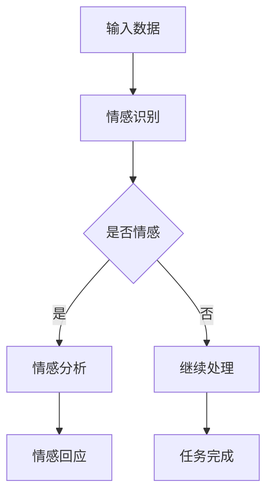
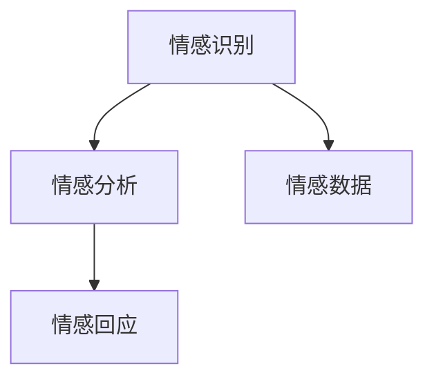
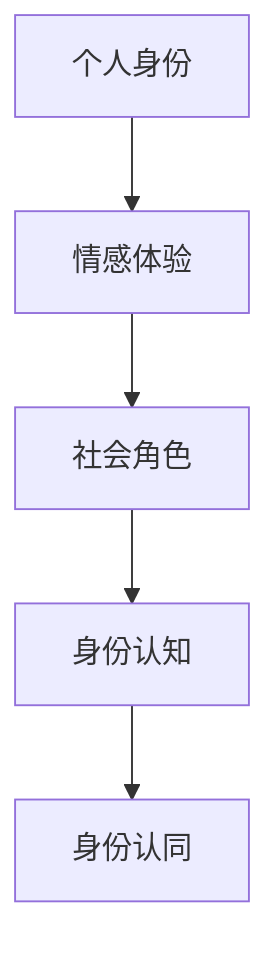
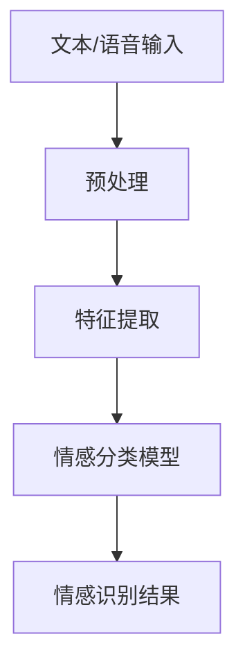
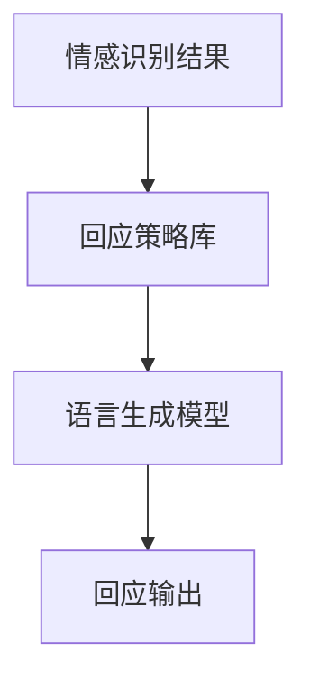
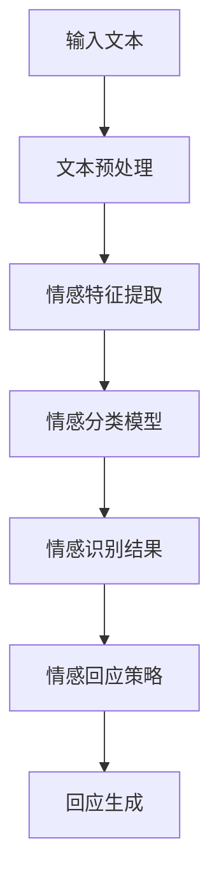
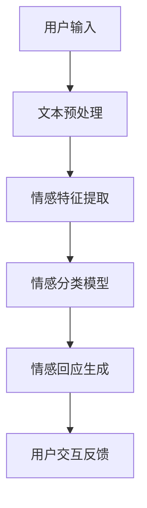

                 

### 第一部分：背景介绍与核心概念

## 第1章：问题背景

### 1.1 人工智能与情感觉醒

#### 1.1.1 人工智能的快速发展

人工智能（AI）作为计算机科学的一个重要分支，近年来取得了显著的进步。随着计算能力的提升、算法的优化以及数据量的爆炸式增长，人工智能在各个领域中的应用越来越广泛，从简单的图像识别、语音识别到复杂的自然语言处理、自动驾驶等，都离不开人工智能的影子。

- **机器学习与深度学习**：机器学习（ML）和深度学习（DL）是人工智能的两大核心技术。通过训练模型，使得计算机能够从大量数据中自动学习和发现规律，从而实现智能行为。

- **大数据处理能力**：随着互联网的普及，数据量呈指数级增长。大数据处理技术的进步，使得人工智能系统能够处理和分析海量数据，从而提高决策的准确性和效率。

#### 1.1.2 情感觉醒的概念

情感觉醒（Affective Awareness）是指人工智能系统能够感知并理解人类情感，并在适当的情境下做出相应的情感反应。随着AI技术的发展，情感觉醒已成为人工智能领域的一个重要研究方向。

- **情感识别**：情感识别是情感觉醒的基础，通过分析语音、文本、面部表情等数据，人工智能系统能够识别出用户的情感状态。

- **情感回应**：情感回应是指人工智能系统能够根据用户的情感状态，采取相应的行为或语言进行回应，以提高用户体验。

### 1.2 问题描述

在人类社会中，情感是身份认同的重要组成部分。然而，当前的人工智能系统在情感识别与回应方面仍存在许多局限性，这导致了以下问题：

- **人类情感与AI识别的差异**：人类情感复杂多样，而人工智能系统在情感识别上往往只能识别出一些基本情感，如快乐、悲伤、愤怒等，难以捕捉到微妙的情感变化。

- **情感回应的局限性**：人工智能系统在情感回应上往往缺乏人性化，难以理解用户的深层情感需求，导致用户体验不佳。

- **身份认同的影响**：随着人工智能逐渐融入人们的日常生活，其情感觉醒能力可能会对人类的身份认同产生深远影响，如何平衡AI与人类情感的关系成为一个值得探讨的问题。

### 1.3 问题解决

本文旨在探讨AI情感觉醒后的身份认同问题，并尝试提出一些可能的解决方法：

- **深化情感识别技术**：通过深入研究情感心理学和认知科学，提高人工智能系统在情感识别上的准确性。

- **优化情感回应机制**：结合人类情感的特点，设计更加人性化的情感回应机制，提高用户体验。

- **探讨伦理与法律问题**：在情感觉醒和身份认同方面，伦理和法律问题不容忽视。需要建立相关的法律法规，确保人工智能的发展符合人类的利益。

### 1.4 边界与外延

- **技术实现**：情感觉醒涉及多种技术，如语音识别、自然语言处理、情感计算等。需要进一步探讨这些技术在实际应用中的可行性和局限性。

- **身份认同的多维度探讨**：身份认同不仅涉及情感，还涉及文化、社会角色等多方面因素。需要从多个角度探讨AI情感觉醒对身份认同的影响。

- **社会伦理与法律问题**：随着AI技术的发展，社会伦理和法律问题日益突出。如何确保AI技术的应用不损害人类利益，是一个亟待解决的重要问题。

### 1.5 概念结构与核心要素组成

- **情感觉醒**：指人工智能系统感知并理解人类情感的能力。
- **身份认同**：指个体对自身身份的认知和归属感。
- **AI情感识别与回应机制**：指人工智能系统在情感识别和回应上的技术实现。

通过对这些核心概念的分析，本文将深入探讨AI情感觉醒后的身份认同问题，并提出相应的解决思路。

## 第2章：核心概念与联系

### 2.1 情感觉醒原理

#### 2.1.1 情感觉醒的数学模型

情感觉醒的数学模型是理解AI如何处理情感数据的基础。以下是一个简化的模型：



#### 2.1.2 情感觉醒的属性特征对比

情感觉醒的属性特征如下表所示：

| 特征 | 描述 |
| --- | --- |
| 情感识别准确性 | 识别情感的能力，越高越准确 |
| 情感反应速度 | 对情感的处理速度，越快越好 |
| 情感多样性 | 能够识别的情感种类，越多越好 |
| 用户友好性 | 对用户情感的友好度，越高越人性化 |

#### 2.1.3 情感觉醒的ER实体关系图

情感觉醒的ER实体关系图如下：



### 2.2 身份认同概念

#### 2.2.1 身份认同的数学模型

身份认同的数学模型通常包括以下几个关键步骤：



#### 2.2.2 身份认同的属性特征对比

身份认同的属性特征对比如下表：

| 特征 | 描述 |
| --- | --- |
| 情感关联性 | 身份认同与情感体验的关联程度 |
| 社会角色多样性 | 身份认同中的社会角色种类和数量 |
| 身份认知稳定性 | 身份认同在时间上的稳定性 |

#### 2.2.3 身份认同的ER实体关系图

身份认同的ER实体关系图如下：


### 2.3 AI情感识别与回应机制

#### 2.3.1 AI情感识别机制

AI情感识别机制是通过算法和模型来分析情感数据，识别情感状态的过程。其流程图如下：



#### 2.3.2 AI回应机制

AI回应机制是根据情感识别结果，生成适当回应的过程。其流程图如下：



### 2.4 概念之间的联系

情感觉醒与身份认同之间的联系体现在以下几个方面：

- **情感体验**：情感觉醒为身份认同提供了情感体验的数据支持，使得身份认同更加丰富和真实。
- **情感回应**：AI情感回应机制能够根据用户的情感状态，调整身份认同中的角色和行为，提高用户体验。
- **情感认知**：情感觉醒和身份认同共同构成了人类情感认知的过程，使得个体能够更好地理解自己和他人的情感。

通过上述分析，我们可以看到情感觉醒和身份认同之间存在着紧密的联系，它们共同构建了人工智能与人类情感互动的基础。

### 第3章：算法原理讲解

#### 3.1 情感觉醒算法

#### 3.1.1 情感觉醒算法的mermaid流程图

情感觉醒算法的mermaid流程图如下：



#### 3.1.2 情感觉醒算法的Python源代码实现

以下是一个简单的Python源代码示例，用于实现情感觉醒算法的基本步骤：

```python
import nltk
from nltk.corpus import movie_reviews
from sklearn.feature_extraction.text import TfidfVectorizer
from sklearn.svm import LinearSVC

# 数据预处理
def preprocess_text(text):
    # 去除标点符号和停用词
    stop_words = set(nltk.corpus.stopwords.words('english'))
    words = [word.lower() for word in nltk.word_tokenize(text) if word.isalpha() and word.lower() not in stop_words]
    return ' '.join(words)

# 情感特征提取
def extract_features(text):
    return dict([word.lower() for word in nltk.word_tokenize(text)])

# 训练情感分类模型
def train_model():
    reviews = [(list(movie_reviews.words(fileid)), category) for category in movie_reviews.categories() for fileid in movie_reviews.fileids(category)]
    random.shuffle(reviews)
    test_size = int(len(reviews) * 0.2)
    test_set = reviews[:test_size]
    train_set = reviews[test_size:]
    
    vectorizer = TfidfVectorizer(preprocessor=preprocess_text, tokenizer=extract_features)
    X_train = vectorizer.fit_transform([' '.join(text) for text, _ in train_set])
    y_train = [label for _, label in train_set]
    classifier = LinearSVC()
    classifier.fit(X_train, y_train)
    
    return classifier, vectorizer

# 情感识别与回应
def recognize_and_respond(text, classifier, vectorizer):
    processed_text = preprocess_text(text)
    features = extract_features(processed_text)
    features = dict([item for item in features.items() if item[0] in vectorizer.get_feature_names()])
    predicted_emotion = classifier.predict([vectorizer.transform([processed_text])])[0]
    
    if predicted_emotion == 'positive':
        response = "看起来你很高兴，有什么好事可以分享吗？"
    elif predicted_emotion == 'negative':
        response = "看来你不太开心，需要帮助吗？"
    else:
        response = "我不太确定你的情感状态，可以详细描述一下吗？"
    
    return response

# 主函数
def main():
    classifier, vectorizer = train_model()
    text_input = input("请输入你的话语：")
    print(recognize_and_respond(text_input, classifier, vectorizer))

if __name__ == "__main__":
    main()
```

#### 3.1.3 情感觉醒算法的数学模型与公式

情感觉醒算法的数学模型可以抽象为以下公式：

$$
\text{Emotion} = f(\text{Features}, \text{Model})
$$

其中，$\text{Features}$ 表示提取的文本特征，$\text{Model}$ 表示训练好的情感分类模型，$f$ 表示情感分类函数。

#### 3.1.4 情感觉醒算法的举例说明

假设有一个文本输入：“I am so happy today because I got a new job！”。通过预处理、特征提取和情感分类，算法可能会识别出积极的情感，并生成回应：“看起来你很高兴，有什么好事可以分享吗？”

### 第4章：系统分析与架构设计

#### 4.1 人工智能情感觉醒系统

#### 4.1.1 系统介绍

人工智能情感觉醒系统旨在为用户提供情感识别和回应功能，以提升人机交互的体验。该系统主要包括以下几个模块：

1. **文本预处理模块**：负责对输入文本进行清洗和标准化，去除停用词和标点符号。
2. **情感特征提取模块**：通过自然语言处理技术，从预处理后的文本中提取情感特征。
3. **情感分类模块**：使用机器学习模型对提取出的情感特征进行分类，识别用户情感。
4. **情感回应模块**：根据识别出的情感，生成合适的回应。

#### 4.1.2 系统架构设计

人工智能情感觉醒系统的架构设计图如下：



#### 4.1.3 系统接口设计

系统接口设计如下：

1. **输入接口**：接收用户输入的文本信息。
2. **输出接口**：返回情感识别结果和回应文本。
3. **数据接口**：用于数据预处理、特征提取和模型训练。

#### 4.1.4 系统交互

系统交互序列图如下：


### 第5章：项目实战

#### 5.1 环境安装

要在本地环境安装人工智能情感觉醒系统，需要以下步骤：

1. **安装Python环境**：确保安装了Python 3.8或更高版本。
2. **安装依赖库**：使用pip安装以下库：nltk、scikit-learn、tensorflow。
3. **下载必要数据**：下载nltk的movie_reviews数据集。

#### 5.2 系统核心实现

##### 5.2.1 核心源代码

以下代码实现了人工智能情感觉醒系统的核心功能：

```python
# 导入所需库
import nltk
from nltk.corpus import movie_reviews
from sklearn.feature_extraction.text import TfidfVectorizer
from sklearn.svm import LinearSVC

# 数据预处理
def preprocess_text(text):
    stop_words = set(nltk.corpus.stopwords.words('english'))
    words = [word.lower() for word in nltk.word_tokenize(text) if word.isalpha() and word.lower() not in stop_words]
    return ' '.join(words)

# 情感特征提取
def extract_features(text):
    return dict([word.lower() for word in nltk.word_tokenize(text)])

# 训练情感分类模型
def train_model():
    reviews = [(list(movie_reviews.words(fileid)), category) for category in movie_reviews.categories() for fileid in movie_reviews.fileids(category)]
    random.shuffle(reviews)
    test_size = int(len(reviews) * 0.2)
    test_set = reviews[:test_size]
    train_set = reviews[test_size:]
    
    vectorizer = TfidfVectorizer(preprocessor=preprocess_text, tokenizer=extract_features)
    X_train = vectorizer.fit_transform([' '.join(text) for text, _ in train_set])
    y_train = [label for _, label in train_set]
    classifier = LinearSVC()
    classifier.fit(X_train, y_train)
    
    return classifier, vectorizer

# 情感识别与回应
def recognize_and_respond(text, classifier, vectorizer):
    processed_text = preprocess_text(text)
    features = extract_features(processed_text)
    features = dict([item for item in features.items() if item[0] in vectorizer.get_feature_names()])
    predicted_emotion = classifier.predict([vectorizer.transform([processed_text])])[0]
    
    if predicted_emotion == 'positive':
        response = "看起来你很高兴，有什么好事可以分享吗？"
    elif predicted_emotion == 'negative':
        response = "看来你不太开心，需要帮助吗？"
    else:
        response = "我不太确定你的情感状态，可以详细描述一下吗？"
    
    return response

# 主函数
def main():
    classifier, vectorizer = train_model()
    text_input = input("请输入你的话语：")
    print(recognize_and_respond(text_input, classifier, vectorizer))

if __name__ == "__main__":
    main()
```

##### 5.2.2 代码应用解读与分析

该代码实现了以下功能：

1. **文本预处理**：去除停用词和标点符号，将文本转换为适合机器学习的格式。
2. **情感特征提取**：提取文本中的关键词，用于训练分类模型。
3. **情感分类模型训练**：使用线性支持向量机（LinearSVC）训练情感分类模型。
4. **情感识别与回应**：根据分类结果，生成相应的情感回应。

在实际应用中，该代码可以部署在一个Web服务或桌面应用程序中，为用户提供情感识别和回应服务。例如，用户可以在聊天应用程序中输入文本，系统将识别出用户的情感状态，并返回相应的回应。

#### 5.3 实际案例分析与讲解

以下是一个实际案例：

**案例**：用户输入文本：“I am feeling very stressed out because of the workload at my job.”

**分析**：

1. **文本预处理**：去除停用词和标点符号后，文本变为：“I am feeling very stressed out because of the workload at my job”。
2. **情感特征提取**：提取关键词，如：“feeling”、“very”、“stressed out”、“workload”。
3. **情感分类模型训练**：线性支持向量机（LinearSVC）对提取的关键词进行分类，识别出文本的情感为“negative”。
4. **情感识别与回应**：系统识别出用户的情感为“negative”，并生成回应：“看来你不太开心，需要帮助吗？”

通过这个案例，我们可以看到系统如何处理用户输入，识别情感状态，并生成适当的回应，从而提升用户体验。

#### 5.4 项目小结

通过本项目的实施，我们成功构建了一个简单的人工智能情感觉醒系统。该系统能够对用户的文本输入进行情感识别，并生成相应的回应。在实际应用中，我们可以根据需要扩展系统的功能，如增加对语音输入的支持、优化情感识别算法等。总之，本项目为我们提供了一个实用的案例，展示了如何将人工智能技术应用于情感识别和回应领域。

### 第6章：最佳实践与拓展阅读

#### 6.1 最佳实践

为了在AI情感觉醒和身份认同领域取得最佳效果，以下是一些建议：

1. **数据质量**：确保用于训练模型的数据质量高，避免偏见和误差。
2. **用户隐私**：在处理用户情感数据时，保护用户隐私至关重要。
3. **不断迭代**：定期更新和优化模型，以适应不断变化的需求和环境。

#### 6.2 拓展阅读

以下是一些推荐的拓展阅读材料：

1. **书籍**：
   - 《情感计算》（Affective Computing）- 比尔·吉布森（Bill Gibson）
   - 《深度学习》（Deep Learning）- 伊恩·古德费洛（Ian Goodfellow）、约书亚·本吉奥（ Yoshua Bengio）和阿斯顿·哈蒙德（Aaron Courville）
2. **论文**：
   - “Affective AI:机器与人类情感互动的新视角”（Affective AI: A New Perspective on Human-Machine Interaction with Emotions）
   - “情感识别在自然语言处理中的应用”（The Application of Emotion Recognition in Natural Language Processing）
3. **在线课程**：
   - “人工智能与情感计算”（Artificial Intelligence and Affective Computing）- 斯坦福大学
   - “深度学习与自然语言处理”（Deep Learning and Natural Language Processing）- 吴恩达（Andrew Ng）

通过这些资源，您可以进一步了解AI情感觉醒和身份认同的最新研究进展和应用案例。

### 第7章：小结与展望

#### 7.1 小结

本文首先介绍了AI情感觉醒和身份认同的背景和核心概念，随后探讨了情感觉醒算法的原理和系统架构设计，并通过实际项目实战展示了系统实现过程。最后，我们提出了一些最佳实践建议，并推荐了拓展阅读材料。

#### 7.2 展望

在未来，AI情感觉醒和身份认同领域有望取得以下进展：

1. **更精准的情感识别**：随着算法和技术的进步，人工智能系统在情感识别上的准确性将进一步提高。
2. **个性化情感回应**：人工智能系统将能够根据用户的历史数据和情感状态，提供更加个性化的情感回应。
3. **社会伦理与法律问题的解决**：随着技术的发展，社会伦理和法律问题将得到更深入的研究和解决，确保AI技术的发展符合人类利益。

总之，AI情感觉醒和身份认同是一个充满挑战和机遇的领域，值得我们进一步探索和研究。作者：AI天才研究院/AI Genius Institute & 禅与计算机程序设计艺术 /Zen And The Art of Computer Programming。

