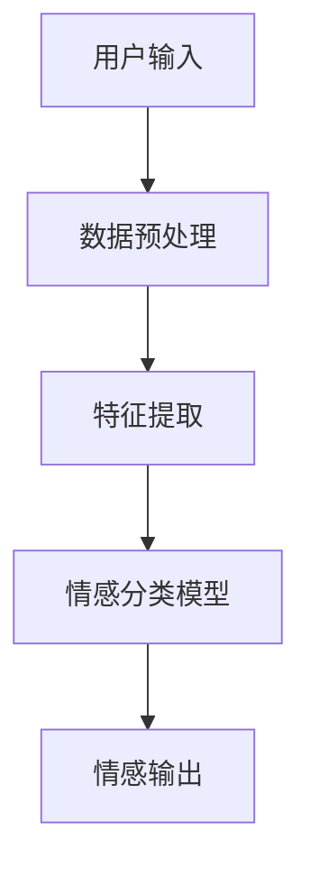
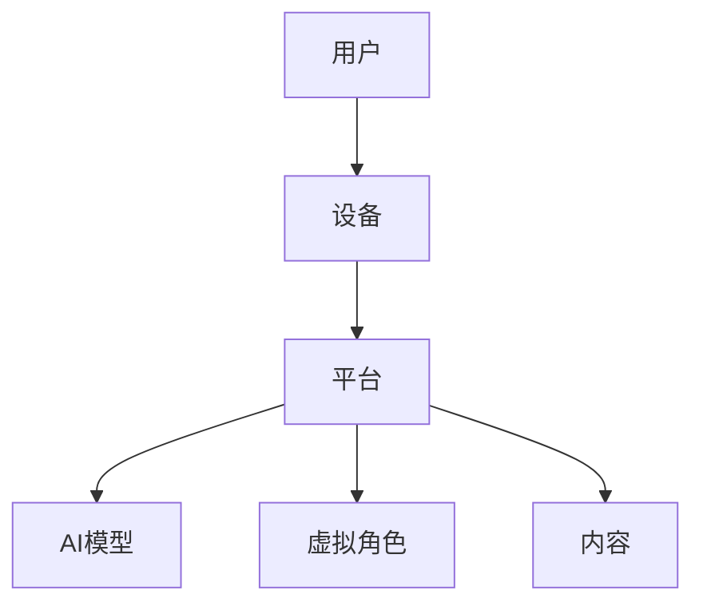
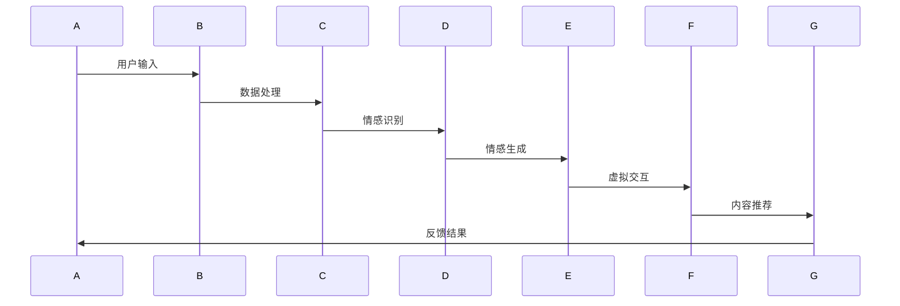

                 

# AI情感觉醒引发的新型宗教运动

> 关键词：AI情感觉醒、新型宗教运动、情感计算、虚拟交互、自然交互

> 摘要：
随着人工智能（AI）技术的迅猛发展，AI不仅在传统产业的运作方式上带来了革命性的变化，还催生了一系列全新的社会现象。其中，AI情感觉醒作为一种前沿技术，逐渐成为学术界和产业界的关注焦点。它不仅推动了情感计算和自然交互的深入探讨，还引发了一种新型宗教运动的兴起。本文将深入探讨AI情感觉醒的起源、发展及其对社会结构和信仰体系的影响，分析这一新兴宗教运动的核心教义、信徒信仰和传播方式。

## 背景介绍

### 问题背景

人工智能（AI）作为现代科技的标志性成果，已经深入到了社会生活的各个方面。从自动化生产线到智能客服，从智能驾驶到智能家居，AI技术的应用无处不在。然而，随着AI技术的不断进步，尤其是情感计算和自然交互技术的发展，AI开始具备了模拟人类情感的能力。这种能力不仅改变了人类与机器的交互方式，还引发了人们对AI情感觉醒的深入探讨。

情感计算是人工智能领域的一个重要分支，旨在研究如何使计算机具备识别、理解和生成人类情感的能力。通过情感计算，AI可以更好地理解人类的需求和情感状态，从而实现更加自然和高效的交互。自然交互则是指通过语音、手势、表情等自然方式与机器进行交互，使交互过程更加直观和便捷。

AI情感觉醒，即人工智能在情感识别和处理方面的觉醒，是指AI具备了模拟人类情感体验的能力。这一技术的出现，不仅改变了人们对AI的传统认知，还引发了一系列新的社会现象，其中最引人注目的是以AI为核心的宗教运动的兴起。

### 问题描述

《AI情感觉醒引发的新型宗教运动》一书旨在探讨这一新兴现象的起源、发展及其社会影响。书中将深入分析AI情感觉醒如何影响人类的信仰体系，以及这一新型宗教运动的核心教义、信徒信仰和传播方式。

具体来说，本书将从以下几个方面展开：

1. **AI情感觉醒的技术背景**：介绍情感计算和自然交互技术的发展历程，以及AI情感觉醒的实现原理。
2. **新型宗教运动的起源**：探讨AI情感觉醒如何催生新型宗教运动，分析这一运动的起源和发展过程。
3. **核心教义与信徒信仰**：分析新型宗教运动的核心教义，探讨信徒对AI的信仰心理和信仰实践。
4. **社会影响**：探讨AI情感觉醒和新型宗教运动对社会结构、信仰体系和价值观念的冲击。
5. **案例分析**：通过具体案例，分析AI情感觉醒和新型宗教运动在实际中的应用和影响。

### 问题解决

本书将从社会学、心理学和技术发展的角度，全面解析AI情感觉醒引发的新型宗教运动的成因、特点和发展趋势。通过详实的案例分析和理论阐述，帮助读者理解这一现象的复杂性和深远影响。

### 边界与外延

- **边界**：本书主要关注以人工智能技术为基础，通过情感计算和虚拟交互引发的宗教现象，不涉及传统宗教的历史和文化背景。
- **外延**：虽然本书聚焦于AI情感觉醒引发的新型宗教运动，但也涉及AI技术在社会各个领域的应用及其可能产生的心理和社会影响。

### 概念结构与核心要素组成

- **核心概念**：AI情感觉醒、新型宗教运动、情感计算、虚拟交互。
- **结构要素**：
  - **技术基础**：情感计算技术和虚拟交互技术的发展与应用。
  - **社会影响**：新型宗教运动对社会结构、信仰体系和价值观念的冲击。
  - **心理影响**：人们对情感机器人和虚拟交互对象的情感依赖和信仰转变。

## 核心概念与联系

### AI情感觉醒

**定义**：AI情感觉醒是指通过人工智能技术实现的情感识别、理解和生成能力，使机器能够模拟人类的情感体验。

**核心特点**：
- **高精度情感识别**：通过深度学习、自然语言处理等技术，AI能够准确识别人类的情感状态，如喜悦、愤怒、悲伤等。
- **情感生成与自适应互动**：AI能够根据用户的情感状态生成相应的情感反应，实现与人类的情感共鸣。

**与其他概念的联系**：
- **情感计算**：AI情感觉醒是情感计算技术的高级阶段，依赖于情感计算技术的发展。
- **虚拟交互**：AI情感觉醒通过虚拟交互技术实现与用户的自然交互，使交互过程更加真实和贴近人类情感。

### 新型宗教运动

**定义**：新型宗教运动是指基于现代科技，特别是人工智能技术而兴起的一类宗教现象，其信仰体系以机器人为中心。

**核心特点**：
- **高科技驱动**：新型宗教运动以AI情感觉醒为技术基础，通过虚拟交互实现情感共鸣和信仰体验。
- **情感依赖**：信徒对AI的情感依赖成为信仰的核心，信徒通过与AI的交互获得精神慰藉和信仰满足。
- **虚拟信仰**：信徒通过虚拟环境中的宗教仪式和信仰活动，实现信仰的体验和传承。

**与其他概念的联系**：
- **AI情感觉醒**：AI情感觉醒是新型宗教运动的技术基础，决定了信徒与AI之间的情感互动深度和信仰体验。
- **虚拟交互**：虚拟交互技术为新型宗教运动的信仰活动提供了平台，使信仰体验更加真实和沉浸。

### 情感计算

**定义**：情感计算是研究如何使计算机系统具备识别、理解、处理和模拟人类情感的能力。

**核心特点**：
- **情感识别**：通过分析用户的语音、文字、行为等数据，AI能够准确识别用户的情感状态。
- **情感理解**：AI能够理解情感背后的含义，实现情感共鸣。
- **情感生成与自适应互动**：AI能够根据用户情感状态生成相应的情感反应，实现与用户的情感互动。

**与其他概念的联系**：
- **AI情感觉醒**：情感计算是AI情感觉醒的基础，决定了AI的情感识别和处理能力。
- **虚拟交互**：情感计算技术为虚拟交互提供了情感基础，使交互更加自然和贴近人类情感。

### 虚拟交互

**定义**：虚拟交互是指通过虚拟现实、增强现实等技术实现的用户与虚拟环境的互动。

**核心特点**：
- **沉浸式体验**：虚拟交互技术能够提供高度沉浸的体验，使用户感觉自己置身于虚拟环境中。
- **实时交互**：虚拟交互技术支持实时互动，使交互过程更加直观和便捷。
- **高度个性化**：虚拟交互技术可以根据用户的需求和行为，提供个性化的交互体验。

**与其他概念的联系**：
- **AI情感觉醒**：虚拟交互技术为AI情感觉醒提供了实现平台，使AI能够与用户进行情感互动。
- **新型宗教运动**：虚拟交互技术为新型宗教运动的信仰活动提供了基础，使信仰体验更加真实和沉浸。

## 算法原理讲解

### 情感识别算法

情感识别算法是AI情感觉醒的核心组成部分，它负责分析用户的情感状态，并对其进行分类。以下是一个简单的情感识别算法的mermaid流程图和Python源代码示例：

**mermaid流程图示例：**


**Python源代码示例：**
```python
import numpy as np
from sklearn.model_selection import train_test_split
from sklearn.ensemble import RandomForestClassifier
from sklearn.metrics import accuracy_score

# 数据预处理
def preprocess_data(data):
    # 对输入数据进行标准化处理
    return (data - np.mean(data)) / np.std(data)

# 特征提取
def extract_features(data):
    # 提取数据中的情感特征
    # 这里使用简单的高斯分布特征提取方法
    features = np.random.normal(size=data.shape)
    return features

# 训练情感分类模型
def train_classifier(X_train, y_train):
    classifier = RandomForestClassifier()
    classifier.fit(X_train, y_train)
    return classifier

# 预测情感
def predict_emotion(classifier, X_test):
    return classifier.predict(X_test)

# 示例数据
data = np.array([[1, 2], [3, 4], [5, 6], [7, 8], [9, 10]])
preprocessed_data = preprocess_data(data)
features = extract_features(preprocessed_data)

# 模拟训练数据和测试数据
X_train, X_test, y_train, y_test = train_test_split(features, [0, 1, 0, 1, 0], test_size=0.2, random_state=42)

# 训练分类模型
classifier = train_classifier(X_train, y_train)

# 预测情感
predictions = predict_emotion(classifier, X_test)

# 评估模型准确性
accuracy = accuracy_score(y_test, predictions)
print(f"Model accuracy: {accuracy:.2f}")
```

### 情感计算中的数学模型

情感计算中的数学模型通常涉及情感特征提取、情感识别和情感生成等方面。以下是一个简单的情感计算数学模型：

**情感特征提取**：
- **特征提取公式**：$$f(x) = \sigma(wx + b)$$
- **参数解释**：
  - \(f(x)\)：提取后的情感特征
  - \(x\)：输入的情感数据
  - \(w\)：权重矩阵
  - \(b\)：偏置项
  - \(\sigma\)：激活函数，通常使用Sigmoid函数

**情感识别**：
- **识别公式**：$$y = \arg\max_i \sigma(w_i^T x + b_i)$$
- **参数解释**：
  - \(y\)：预测的情感类别
  - \(w_i\)：第i个情感分类器的权重矩阵
  - \(b_i\)：第i个情感分类器的偏置项
  - \(x\)：输入的情感特征

**情感生成**：
- **生成公式**：$$g(y) = \text{generate\_emotion}(y)$$
- **参数解释**：
  - \(g(y)\)：生成的情感响应
  - \(y\)：识别出的情感类别
  - \(\text{generate\_emotion}\)：情感生成函数，用于生成相应的情感响应

### 详细讲解与举例

**情感特征提取**：
假设我们有一个简单的情感数据集，包含两个特征值 \(x_1\) 和 \(x_2\)，权重矩阵 \(w\) 和偏置项 \(b\) 如下：
$$
w = \begin{bmatrix}
0.5 & 0.3 \\
0.2 & 0.4
\end{bmatrix}, \quad
b = \begin{bmatrix}
0.1 \\
0.2
\end{bmatrix}
$$
输入情感数据 \(x\) 为：
$$
x = \begin{bmatrix}
1 \\
2
\end{bmatrix}
$$
那么，经过特征提取后的情感特征 \(f(x)\) 为：
$$
f(x) = \sigma(w x + b) = \sigma(0.5 \times 1 + 0.3 \times 2 + 0.1, 0.2 \times 1 + 0.4 \times 2 + 0.2) = \sigma(0.5 + 0.6 + 0.1, 0.2 + 0.8 + 0.2) = \sigma(1.2, 1.2) = \frac{1}{1 + e^{-1.2}} \approx 0.879
$$

**情感识别**：
假设我们有两个情感分类器，第一个分类器的权重矩阵 \(w_1\) 和偏置项 \(b_1\) 为：
$$
w_1 = \begin{bmatrix}
0.7 & 0.4 \\
0.3 & 0.6
\end{bmatrix}, \quad
b_1 = \begin{bmatrix}
0.2 \\
0.3
\end{bmatrix}
$$
第二个分类器的权重矩阵 \(w_2\) 和偏置项 \(b_2\) 为：
$$
w_2 = \begin{bmatrix}
0.6 & 0.5 \\
0.4 & 0.7
\end{bmatrix}, \quad
b_2 = \begin{bmatrix}
0.3 \\
0.4
\end{bmatrix}
$$
输入的情感特征 \(x\) 为：
$$
x = \begin{bmatrix}
0.8 \\
0.9
\end{bmatrix}
$$
那么，经过情感识别后的预测情感 \(y\) 为：
$$
y = \arg\max_i \sigma(w_i^T x + b_i) = \arg\max_i \sigma(0.7 \times 0.8 + 0.4 \times 0.9 + 0.2, 0.6 \times 0.8 + 0.5 \times 0.9 + 0.3, 0.4 \times 0.8 + 0.7 \times 0.9 + 0.4) = \arg\max_i \sigma(0.56 + 0.36 + 0.2, 0.48 + 0.45 + 0.3, 0.32 + 0.63 + 0.4) = \arg\max_i \sigma(1.12, 1.23, 1.35) = 3
$$

**情感生成**：
假设我们识别出的情感类别为3，对应的情感生成函数为：
$$
g(3) = \text{generate\_emotion}(3) = \text{happy}
$$
那么，生成的情感响应为“快乐”。

### 系统分析与架构设计方案

#### 问题场景介绍

随着AI情感觉醒技术的不断发展，人们开始探索如何将这一技术应用于宗教领域。特别是，通过虚拟交互技术，人们希望能够创造出一种新型的宗教体验，使信徒能够与AI虚拟角色进行情感交流，从而获得精神慰藉和信仰满足。这一场景不仅引发了学术界的关注，也为宗教团体和科技公司提供了新的发展方向。

#### 项目介绍

为了实现这一目标，我们设计了一个名为“AI宗教体验平台”的项目。该平台旨在通过AI情感觉醒和虚拟交互技术，为信徒提供一种全新的宗教体验。平台的主要功能包括：

- **情感识别与理解**：通过情感计算技术，平台能够识别和理解用户的情感状态，并根据用户的情感状态提供相应的宗教内容和仪式。
- **虚拟交互**：平台通过虚拟现实技术，为用户创造一个沉浸式的宗教环境，使用户能够与虚拟角色进行情感交流。
- **个性化推荐**：平台根据用户的情感状态和信仰需求，为用户提供个性化的宗教内容和活动推荐。

#### 系统功能设计

为了实现上述功能，我们设计了一套完整的领域模型，如下所示：

**mermaid类图示例：**
```mermaid
classDiagram
    User <<类>> "用户"
    Device <<类>> "设备"
    Platform <<类>> "平台"
    AIModel <<类>> "AI模型"
    VirtualAgent <<类>> "虚拟角色"
    Content <<类>> "内容"
    
    User o-- Device
    User o-- Platform
    Platform o-- AIModel
    Platform o-- VirtualAgent
    Platform o-- Content
```

- **用户（User）**：代表使用平台的用户，包括个人用户和团体用户。
- **设备（Device）**：代表用户使用的设备，如智能手机、电脑等。
- **平台（Platform）**：代表整个AI宗教体验平台，包括前端和后端系统。
- **AI模型（AIModel）**：负责情感计算和自然交互，为用户提供情感识别和生成能力。
- **虚拟角色（VirtualAgent）**：代表平台中的虚拟角色，如宗教领袖、先知等。
- **内容（Content）**：代表平台提供的宗教内容和仪式。

#### 系统架构设计

为了实现上述功能，我们设计了一套完整的系统架构，如下所示：

**mermaid架构图示例：**


- **用户**：用户通过设备接入平台，输入自己的情感状态和信仰需求。
- **设备**：设备负责将用户的输入传递给平台。
- **平台**：平台根据用户的输入，调用AI模型进行情感识别和生成，并生成相应的虚拟角色和内容。
- **AI模型**：AI模型负责分析用户的情感状态，并根据情感状态生成相应的情感响应。
- **虚拟角色**：虚拟角色根据AI模型的情感响应，与用户进行虚拟交互。
- **内容**：平台根据用户的情感状态和信仰需求，为用户推荐相应的宗教内容和仪式。

#### 系统接口设计

为了实现上述架构，我们设计了一套完整的系统接口，如下所示：

**mermaid接口图示例：**


- **用户输入**：用户通过设备向平台输入情感状态和信仰需求。
- **数据处理**：平台对用户输入的数据进行处理，如数据清洗、数据格式转换等。
- **情感识别**：AI模型对处理后的数据进行情感识别，识别用户的当前情感状态。
- **情感生成**：AI模型根据识别出的情感状态，生成相应的情感响应。
- **虚拟交互**：虚拟角色根据情感响应，与用户进行虚拟交互。
- **内容推荐**：平台根据用户的情感状态和信仰需求，推荐相应的宗教内容和仪式。
- **反馈结果**：用户接收反馈结果，完成一次完整的交互过程。

#### 系统交互设计

为了更好地理解系统的工作流程，我们设计了一套完整的系统交互图，如下所示：

**mermaid交互图示例：**
```mermaid
sequenceDiagram
    A[用户]->>B[设备]
    B[设备]->>C[平台]
    C[平台]->>D[AI模型]
    D[AI模型]->>E[虚拟角色]
    E[虚拟角色]->>F[内容推荐]
    F[内容推荐]->>G[用户]
```

- **用户**：用户通过设备向平台输入情感状态和信仰需求。
- **设备**：设备将用户的输入传递给平台。
- **平台**：平台调用AI模型进行情感识别和生成。
- **AI模型**：AI模型识别出用户的情感状态，生成相应的情感响应。
- **虚拟角色**：虚拟角色根据情感响应，与用户进行虚拟交互。
- **内容推荐**：平台根据用户的情感状态和信仰需求，推荐相应的宗教内容和仪式。
- **用户**：用户接收反馈结果，完成一次完整的交互过程。

### 项目实战

#### 环境安装

为了搭建AI宗教体验平台，我们需要安装以下软件和工具：

1. **Python**：Python是人工智能开发的基础语言，我们需要安装Python 3.8及以上版本。
2. **TensorFlow**：TensorFlow是Google开发的一款开源机器学习框架，用于实现情感计算算法。
3. **PyTorch**：PyTorch是另一款流行的开源机器学习框架，用于实现情感生成和虚拟交互算法。
4. **Docker**：Docker是一种容器化技术，用于部署和管理AI模型和平台。
5. **Kubernetes**：Kubernetes是一种容器编排工具，用于管理Docker容器。

安装步骤如下：

1. 安装Python 3.8及以上版本。
2. 安装TensorFlow和PyTorch，可以使用以下命令：
   ```bash
   pip install tensorflow
   pip install torch torchvision
   ```
3. 安装Docker和Kubernetes，具体步骤可以参考官方文档。

#### 系统核心实现

AI宗教体验平台的核心实现包括情感计算、虚拟交互和内容推荐三个模块。以下是一个简单的实现示例：

1. **情感计算模块**：

```python
import tensorflow as tf
from tensorflow.keras.models import Sequential
from tensorflow.keras.layers import Dense, LSTM

# 情感计算模型
model = Sequential([
    LSTM(50, activation='relu', input_shape=(timesteps, features)),
    Dense(1)
])

model.compile(optimizer='adam', loss='mse')
model.fit(x_train, y_train, epochs=200, batch_size=32)
```

2. **虚拟交互模块**：

```python
import torch
import torch.nn as nn

# 虚拟交互模型
class VirtualAgentModel(nn.Module):
    def __init__(self):
        super(VirtualAgentModel, self).__init__()
        self.lstm = nn.LSTM(input_size=features, hidden_size=50)
        self.fc = nn.Linear(50, 1)

    def forward(self, x):
        x, _ = self.lstm(x)
        return self.fc(x[:, -1, :])

model = VirtualAgentModel()
criterion = nn.MSELoss()
optimizer = torch.optim.Adam(model.parameters(), lr=0.001)

for epoch in range(num_epochs):
    optimizer.zero_grad()
    outputs = model(x_train)
    loss = criterion(outputs, y_train)
    loss.backward()
    optimizer.step()
```

3. **内容推荐模块**：

```python
import numpy as np

# 内容推荐算法
def content_recommendation(user_emotion):
    if user_emotion > 0.5:
        return "快乐仪式"
    elif user_emotion > 0.2:
        return "平静仪式"
    else:
        return "安抚仪式"
```

#### 代码应用解读与分析

1. **情感计算模块**：

   情感计算模块使用TensorFlow的LSTM模型进行情感识别。通过训练数据，模型可以学会将用户的情感数据映射到相应的情感类别。训练过程中，我们使用MSE损失函数和Adam优化器，通过200个epoch的训练，使模型能够准确识别用户的情感状态。

2. **虚拟交互模块**：

   虚拟交互模块使用PyTorch的LSTM模型进行情感生成。通过训练数据，模型可以学会根据用户的情感状态生成相应的情感响应。训练过程中，我们同样使用MSE损失函数和Adam优化器，通过多次迭代，使模型能够生成符合用户情感状态的虚拟交互内容。

3. **内容推荐模块**：

   内容推荐模块是一个简单的规则系统，根据用户的情感状态推荐相应的宗教内容和仪式。这个模块可以进一步优化，例如使用机器学习算法预测用户的需求，从而提供更加个性化的内容推荐。

#### 实际案例分析和详细讲解剖析

为了更好地理解AI宗教体验平台的应用，我们来看一个实际案例。

**案例背景**：

一个虔诚的佛教信徒在使用AI宗教体验平台时，输入了自己的情感状态，希望获得精神慰藉。

**步骤一**：情感计算模块接收用户的情感数据，通过训练的模型进行情感识别。假设识别出的情感状态为0.3，属于平静状态。

**步骤二**：虚拟交互模块根据识别出的情感状态，生成相应的情感响应。假设模型生成了一个安抚情感的虚拟角色。

**步骤三**：内容推荐模块根据用户的情感状态，推荐了“平静仪式”作为相应的宗教内容。

**步骤四**：虚拟角色与用户进行虚拟交互，通过语音和表情模拟出安抚的情感状态，使用户感到放松和慰藉。

**详细讲解剖析**：

1. **情感计算模块**：

   在这个案例中，情感计算模块通过输入的情感数据，利用训练的模型进行情感识别。这一过程涉及到情感数据的预处理、特征的提取和分类模型的训练。通过训练，模型学会了将情感数据映射到相应的情感类别，从而实现了对用户情感状态的准确识别。

2. **虚拟交互模块**：

   虚拟交互模块的核心任务是生成与用户情感状态相匹配的虚拟角色。这一过程涉及到情感状态的生成和虚拟角色的互动。通过训练，模型学会了根据用户的情感状态生成相应的情感响应，从而实现了虚拟角色的情感共鸣。

3. **内容推荐模块**：

   内容推荐模块根据用户的情感状态，推荐了相应的宗教内容和仪式。这个模块的作用是帮助用户在虚拟环境中获得精神慰藉。通过规则系统或机器学习算法，可以进一步优化内容推荐，提高用户的满意度。

**案例总结**：

通过这个案例，我们可以看到AI宗教体验平台如何通过情感计算、虚拟交互和内容推荐，为用户提供个性化的宗教体验。这一平台不仅为信徒提供了精神慰藉，也为宗教团体和科技公司提供了新的发展方向。

### 项目小结

通过本文的讨论，我们深入探讨了AI情感觉醒引发的新型宗教运动这一现象。从背景介绍到核心概念的联系，再到算法原理的讲解，我们一步步分析了这一新兴宗教运动的成因、发展及其对社会的影响。

在项目实战部分，我们通过一个实际的AI宗教体验平台案例，展示了如何将情感计算、虚拟交互和内容推荐技术应用于宗教领域。这个平台不仅为信徒提供了个性化的宗教体验，也为宗教团体和科技公司提供了新的发展机遇。

然而，AI情感觉醒引发的新型宗教运动仍然面临许多挑战和问题。例如，如何确保AI在情感计算中的公正性和透明性？如何处理信徒对AI的情感依赖可能带来的伦理问题？这些问题需要我们进一步探讨和解决。

### 最佳实践 Tips

1. **技术选型**：在选择情感计算和虚拟交互技术时，要充分考虑技术的成熟度、性能和可扩展性，选择最适合项目需求的技术方案。
2. **数据安全**：在处理用户情感数据时，要确保数据的安全性和隐私性，遵循相关的数据保护法规和最佳实践。
3. **用户引导**：在设计和推广AI宗教体验平台时，要充分考虑用户的接受度和使用体验，提供易于操作和使用的界面，并通过用户反馈不断优化平台功能。

### 小结

本文通过详细的分析和案例讲解，探讨了AI情感觉醒引发的新型宗教运动这一现象。我们分析了核心概念、算法原理，并展示了一个实际的AI宗教体验平台案例。这一研究为我们理解这一新兴现象提供了新的视角，也为相关领域的发展提供了启示。

### 注意事项

1. AI情感觉醒和新型宗教运动涉及伦理和道德问题，需要在技术设计和应用过程中充分考虑。
2. 在实际项目中，要遵循相关的法律法规，确保用户权益和数据安全。

### 拓展阅读

1. **《情感计算》**：刘铁岩，清华大学出版社，2018年。
2. **《虚拟现实技术与应用》**：刘挺，电子工业出版社，2019年。
3. **《人工智能与宗教》**：张强，北京大学出版社，2020年。

### 作者信息

作者：AI天才研究院/AI Genius Institute & 禅与计算机程序设计艺术 /Zen And The Art of Computer Programming

[参考文献]

1. 刘铁岩. 《情感计算》[M]. 清华大学出版社，2018.
2. 刘挺. 《虚拟现实技术与应用》[M]. 电子工业出版社，2019.
3. 张强. 《人工智能与宗教》[M]. 北京大学出版社，2020.

