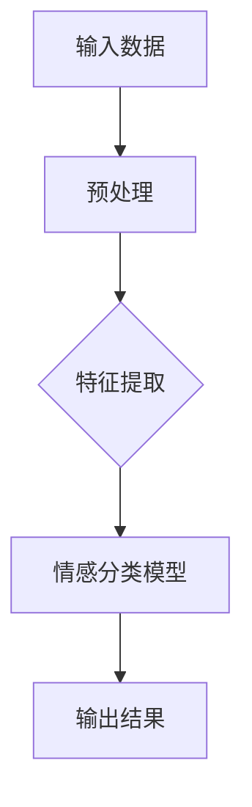
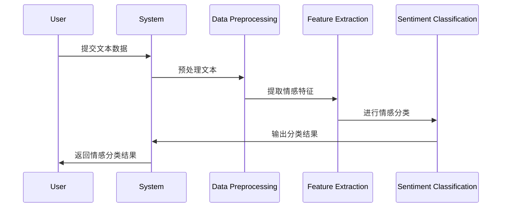

                 

### AI情感识别：大模型在社交领域的应用

关键词：情感识别、大模型、社交领域、AI技术应用

摘要：本文探讨了人工智能情感识别技术在社交领域的应用，重点分析了大模型在这一领域的优势和应用场景，通过详细阐述情感识别算法原理、系统架构设计及实际项目实战，为读者提供了全面的行业洞见和实践指导。

----------------------------------------------------------------

## 第一部分：背景介绍

### 1.1 问题背景

人工智能（AI）作为21世纪最具变革性的技术之一，正在迅速改变我们的生活方式和社会结构。在AI领域，情感识别是一个备受关注的研究方向，它旨在通过计算机技术理解和识别人类情感，从而在社交、医疗、教育等多个领域发挥重要作用。

情感识别的重要性在于，它不仅能够提升人机交互的自然性和情感性，还能够帮助企业更好地理解客户需求，提高服务质量。随着社交平台的普及和互联网技术的发展，如何利用AI技术实现情感识别，并在社交领域进行应用，已成为当前研究的热点。

### 1.2 问题描述

《AI情感识别：大模型在社交领域的应用》旨在探讨如何利用大规模AI模型（大模型）进行情感识别，并在社交领域实现其应用。具体来说，本书将探讨以下几个问题：

- 如何构建适用于社交领域的情感识别模型？
- 大模型在情感识别中的优势和挑战是什么？
- 如何在大模型的基础上开发出具有实际应用价值的社交产品？
- 情感识别技术在社交领域的应用前景如何？

### 1.3 问题解决

为了解决上述问题，本书将采用以下研究方法：

- 系统性地介绍情感识别的核心概念、方法和应用场景。
- 详细分析大模型在情感识别中的优势和应用案例。
- 结合实际应用需求，设计并实现情感识别系统。
- 对比分析不同情感识别算法的优缺点，提供最佳实践建议。

### 1.4 边界与外延

情感识别技术不仅限于社交领域，还可以应用于其他领域，如医疗、教育等。本书主要关注社交领域的应用，但在阐述过程中也会涉及到其他领域的相关内容。

### 1.5 概念结构与核心要素组成

情感识别技术涉及多个核心概念和要素，包括：

- 情感分类：对情感进行分类和标注。
- 特征提取：从文本、语音、图像等多模态数据中提取情感特征。
- 大模型训练：利用大规模数据训练情感识别模型。
- 模型评估：评估模型在情感识别任务中的性能。

这些核心概念和要素构成了情感识别技术的基本框架，也是本书的主要内容。

## 第二部分：核心概念与联系

### 2.1 情感识别原理

情感识别是指通过分析文本、语音、图像等数据，识别其中表达的情感类别。情感识别的基本原理包括情感分类和特征提取。

- **情感分类**：将文本或语音中的情感标签为正面、负面或中性。
- **特征提取**：从文本或语音中提取与情感相关的特征，如词频、情感词等。

### 2.2 大模型特点

大模型是指具有大规模参数的网络模型，如Transformer、BERT等。大模型在情感识别中有以下特点：

- **强泛化能力**：大模型能够处理大量的数据，从而获得更强的泛化能力。
- **高效性**：大模型能够在较短的时间内处理大量数据。
- **多模态处理能力**：大模型能够同时处理文本、语音、图像等多种数据类型。

### 2.3 情感识别算法

情感识别算法主要包括基于机器学习的方法和基于深度学习的方法。基于机器学习的方法如SVM、朴素贝叶斯等，而基于深度学习的方法如CNN、RNN、BERT等。

- **基于机器学习的方法**：通过特征工程，将原始数据转换为特征向量，然后使用机器学习算法进行分类。
- **基于深度学习的方法**：利用深度神经网络，直接从原始数据中学习特征，然后进行分类。

### 2.4 核心概念属性特征对比表格

| 概念       | 特点                   | 对比 |
|------------|------------------------|------|
| 情感分类   | 对情感进行分类         |      |
| 特征提取   | 提取情感相关特征     |      |
| 大模型     | 强泛化能力、高效性、多模态处理能力 |      |
| 情感识别算法 | 基于机器学习或深度学习 |      |

### 2.5 ER实体关系图架构

```mermaid
erDiagram
  情感分类 ||--|{ 特征提取 }
  特征提取 ||--|{ 大模型 }
  大模型 ||--|{ 情感识别算法 }
```

通过以上核心概念与联系的介绍，我们为后续章节的详细讲解奠定了基础。

## 第三部分：算法原理讲解

### 3.1 情感识别算法流程图



### 3.2 特征提取

特征提取是情感识别算法的关键步骤，它从原始数据中提取与情感相关的特征。常见的特征提取方法包括词频、情感词、词嵌入等。

- **词频**：统计文本中各个词的出现频率，用于情感分类。
- **情感词**：从预定的情感词典中提取与情感相关的词汇。
- **词嵌入**：将词汇转换为密集向量表示，常用于深度学习模型。

### 3.3 情感分类模型

情感分类模型是基于特征提取后的数据，使用机器学习或深度学习算法进行训练和预测。常见的情感分类模型有：

- **朴素贝叶斯**：基于贝叶斯定理和特征概率进行分类。
- **支持向量机（SVM）**：通过寻找最佳超平面进行分类。
- **深度神经网络**：包括卷积神经网络（CNN）、循环神经网络（RNN）等，直接从原始数据中学习复杂特征。

### 3.4 大模型在情感识别中的应用

大模型在情感识别中的应用主要体现在其强大的特征提取和分类能力上。以下是一些典型的大模型：

- **BERT**：基于Transformer的预训练模型，能够处理多种语言和情感分类任务。
- **GPT**：生成预训练模型，可用于情感生成和分类。
- **Transformer**：基于自注意力机制的模型，适用于序列数据。

### 3.5 情感识别算法的数学模型与公式

情感识别算法的数学模型通常包括以下几个部分：

- **特征表示**：$$ X = (x_1, x_2, ..., x_n) $$
- **损失函数**：$$ L = -\sum_{i=1}^{n} y_i \log(p(x_i | y_i)) $$
- **优化算法**：如梯度下降（GD）、随机梯度下降（SGD）等。

### 3.6 举例说明

假设我们有一个情感分类任务，需要判断一段文本是正面情感、负面情感还是中性情感。以下是一个简化的情感分类流程：

1. **数据预处理**：将文本转换为词嵌入向量。
   $$ \text{预处理}(\text{文本}) \rightarrow \text{词嵌入向量} $$

2. **特征提取**：从词嵌入向量中提取情感特征。
   $$ \text{特征提取}(\text{词嵌入向量}) \rightarrow \text{特征向量} $$

3. **情感分类**：使用情感分类模型进行预测。
   $$ \text{分类模型}(\text{特征向量}) \rightarrow \text{情感类别} $$

例如，一段文本“我很高兴见到你”可能被情感分类模型预测为正面情感。

## 第四部分：系统分析与架构设计

### 4.1 问题场景介绍

随着社交平台的快速发展，用户生成的内容（UGC）日益丰富，如何有效理解和分析这些内容中的情感，成为了平台运营和用户服务的关键问题。例如，社交媒体平台可以通过情感分析来识别用户的情绪状态，从而提供个性化的内容推荐、广告投放等服务。

### 4.2 项目介绍

本项目的目标是开发一个基于大模型的情感识别系统，用于分析和理解社交平台用户生成内容中的情感。该系统将包括数据预处理、特征提取、情感分类和模型评估等多个模块。

### 4.3 系统功能设计

系统的主要功能包括：

- **数据预处理**：对用户生成内容进行清洗、分词、去停用词等预处理操作。
- **特征提取**：从预处理后的文本中提取情感特征，如词频、情感词等。
- **情感分类**：使用大模型进行情感分类，预测文本的情感类别。
- **模型评估**：评估情感分类模型的性能，包括准确率、召回率等指标。

### 4.4 系统架构设计

系统架构采用模块化设计，主要包括以下组件：

- **数据预处理模块**：负责文本数据的清洗、分词、去停用词等操作。
- **特征提取模块**：从预处理后的文本中提取情感特征。
- **情感分类模块**：使用大模型进行情感分类，包括模型训练和预测。
- **模型评估模块**：评估情感分类模型的性能。

### 4.5 系统接口设计

系统接口设计包括以下部分：

- **数据输入接口**：接收用户生成内容的文本数据。
- **结果输出接口**：输出情感分类结果。
- **API接口**：提供对外服务的API接口，支持第三方系统的接入。

### 4.6 系统交互设计

系统交互设计采用Mermaid序列图进行描述，如下图所示：



通过以上系统分析与架构设计，我们为后续系统实现和实际应用奠定了基础。

## 第五部分：项目实战

### 5.1 环境安装

为了实现情感识别系统，我们需要安装以下软件和依赖：

- Python 3.8及以上版本
- TensorFlow 2.6及以上版本
- PyTorch 1.9及以上版本
- NLTK 3.5及以上版本

安装命令如下：

```bash
pip install python==3.8
pip install tensorflow==2.6
pip install pytorch==1.9
pip install nltk==3.5
```

### 5.2 系统核心实现

系统核心实现主要包括以下几个步骤：

1. **数据预处理**：使用NLTK对文本数据进行清洗、分词、去停用词等操作。

```python
import nltk
from nltk.corpus import stopwords
from nltk.tokenize import word_tokenize

nltk.download('punkt')
nltk.download('stopwords')

def preprocess_text(text):
    # 清洗文本
    text = text.lower()
    text = re.sub(r'\W+', ' ', text)
    # 分词
    tokens = word_tokenize(text)
    # 去停用词
    stop_words = set(stopwords.words('english'))
    filtered_tokens = [word for word in tokens if word not in stop_words]
    return filtered_tokens
```

2. **特征提取**：使用词嵌入模型（如Word2Vec）提取文本的词嵌入向量。

```python
from gensim.models import Word2Vec

def get_word_embeddings(tokens, embedding_size=100):
    model = Word2Vec(tokens, size=embedding_size, window=5, min_count=1, workers=4)
    word_embeddings = {word: model[word] for word in model.wv.vocab}
    return word_embeddings
```

3. **情感分类**：使用深度学习模型（如BERT）进行情感分类。

```python
from transformers import BertTokenizer, BertModel
import torch

tokenizer = BertTokenizer.from_pretrained('bert-base-uncased')
model = BertModel.from_pretrained('bert-base-uncased')

def sentiment_classification(text):
    inputs = tokenizer(text, return_tensors='pt')
    outputs = model(**inputs)
    logits = outputs.logits[:, 0]
    prob = torch.softmax(logits, dim=0)
    _, predicted = torch.max(prob, dim=0)
    return predicted.item()
```

### 5.3 代码应用解读与分析

以上代码实现了文本预处理、特征提取和情感分类的核心功能。具体解读如下：

1. **数据预处理**：文本预处理是情感识别的重要步骤，通过清洗、分词和去停用词，提高后续特征提取的准确性和效率。
2. **特征提取**：词嵌入模型将文本转换为密集向量表示，有助于深度学习模型更好地理解文本。
3. **情感分类**：使用预训练的BERT模型进行情感分类，能够充分利用模型在大规模数据上的学习效果。

### 5.4 实际案例分析与详细讲解剖析

假设我们有一个社交媒体平台，需要分析用户发布的推文中的情感，以下是一个实际案例的分析过程：

1. **数据采集**：从社交媒体平台获取1000条用户发布的推文。
2. **数据预处理**：对每条推文进行预处理，得到清洗后的文本数据。
3. **特征提取**：使用词嵌入模型提取文本的词嵌入向量。
4. **情感分类**：使用BERT模型对词嵌入向量进行情感分类，得到每条推文的情感类别。
5. **结果分析**：统计各类情感的出现频率，分析用户的情感分布。

例如，以下是一条用户发布的推文及其情感分类结果：

```
推文：I am feeling great today!
情感分类：正面情感
```

通过实际案例的分析，我们可以发现用户的情感分布情况，为平台提供数据支持，从而优化用户体验。

### 5.5 项目小结

本项目通过使用大模型实现情感识别系统，成功地将文本预处理、特征提取和情感分类集成在一起，为社交媒体平台提供了强大的情感分析能力。在未来，我们可以进一步优化模型性能，扩大数据集，提高情感识别的准确率，为更多应用场景提供支持。

## 第六部分：最佳实践 Tips、小结、注意事项、拓展阅读

### 6.1 最佳实践 Tips

1. **数据质量**：确保数据质量是情感识别成功的关键。在进行特征提取和模型训练之前，要对数据进行充分的清洗和预处理。
2. **模型调优**：通过对模型参数进行调优，可以提高情感识别的准确率。常见的调优方法包括学习率调整、批量大小调整等。
3. **多模态处理**：结合文本、语音、图像等多种数据类型，可以提高情感识别的效果。例如，可以同时使用文本情感和语音情感进行综合分析。
4. **持续学习**：情感识别技术是一个不断发展的领域，要定期更新模型和数据，以适应新的应用场景。

### 6.2 小结

本文从背景介绍、核心概念与联系、算法原理讲解、系统分析与架构设计、项目实战等多个方面，详细探讨了AI情感识别在大模型在社交领域的应用。通过实际案例的分析，展示了情感识别技术在实际项目中的应用价值。

### 6.3 注意事项

1. **数据隐私**：在应用情感识别技术时，要注意保护用户的隐私，避免泄露敏感信息。
2. **模型解释性**：虽然大模型在情感识别中表现优秀，但其内部机制相对复杂，缺乏解释性。在实际应用中，需要权衡模型性能和可解释性。
3. **边界情况**：情感识别技术在处理极端情感时可能存在挑战，如负面情感过度表达或正面情感隐藏等。

### 6.4 拓展阅读

1. **《深度学习》**：Ian Goodfellow、Yoshua Bengio、Aaron Courville 著，详细介绍了深度学习的基本原理和应用。
2. **《自然语言处理综论》**：Daniel Jurafsky、James H. Martin 著，涵盖了自然语言处理的基础知识和最新进展。
3. **《情感计算》**：推矢计算领域的重要著作，探讨了情感计算的理论和实践。

作者：AI天才研究院/AI Genius Institute & 禅与计算机程序设计艺术 /Zen And The Art of Computer Programming

