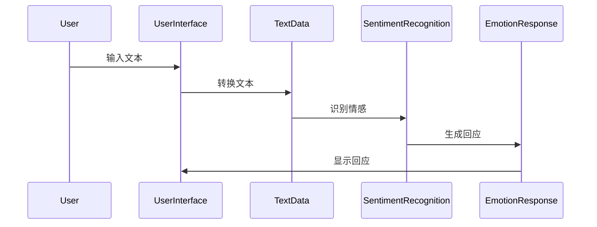

                 

### 引言

在人工智能（AI）迅速发展的今天，机器情感的研究与应用逐渐成为热门话题。机器情感，作为一种模拟人类情感的技术，旨在让计算机能够识别、理解和表达情感。这不仅丰富了AI的功能，也带来了许多新的挑战和机遇。本文将围绕“AI情感进化：机器情感的学习与成长”这一主题，探讨机器情感的核心概念、学习方法以及未来展望。

#### 问题背景

随着计算能力的提升和数据量的爆炸性增长，人工智能逐渐渗透到生活的方方面面。然而，尽管AI在图像识别、自然语言处理等领域取得了显著成果，但大多数AI系统仍然缺乏情感认知与表达的能力。这使得机器在处理复杂情境时，尤其是涉及人际互动的场合，显得不够自然和人性化。因此，研究机器情感具有重要的现实意义。

#### 机器情感的定义与发展历程

机器情感是指通过算法和技术手段，使计算机具备识别、理解、表达和模拟人类情感的能力。这一概念最早可以追溯到20世纪80年代，当时心理学和认知科学的研究为机器情感提供了理论基础。随着计算技术的进步，机器情感逐渐从理论走向实践。例如，情感识别系统可以在文本、语音和图像中检测情感，而情感生成系统则能够创造具有特定情感的表达。

#### 书籍结构概述

本文将分为五个主要部分进行探讨。第一部分是引言，介绍机器情感的研究背景和发展历程。第二部分将深入探讨机器情感的核心概念，包括基础理论、情感模型的架构与组件，以及情感类型的分类和对比。第三部分将重点介绍机器情感的学习方法，包括学习算法原理、情感学习的数学模型与公式，并通过案例研究进行详细讲解。第四部分将分析情感进化的应用案例，通过实际项目实战展示机器情感的技术实现过程。最后一部分将对机器情感的未来发展进行展望，讨论其潜在应用领域和面临的伦理道德问题。

通过以上五个部分的详细探讨，本文旨在为读者提供一个全面、深入的了解机器情感的机会，从而为这一领域的研究和应用提供有益的参考。

---

**关键词**：人工智能、机器情感、情感识别、学习算法、案例研究

**摘要**：本文系统探讨了机器情感的研究背景、核心概念、学习方法及其应用前景。通过详细分析情感模型、学习算法和实际案例，本文揭示了机器情感的技术实现过程及其潜在影响，为人工智能领域的发展提供了新的视角和思路。

---

### AI情感的核心概念

机器情感的核心概念构成了理解这一领域的基础。在探讨这些概念时，我们需要从基础理论、情感模型的架构与组件，以及情感类型的分类和对比等方面进行深入分析。

#### 基础理论

机器情感的基础理论主要来源于心理学、认知科学和计算语言学。心理学提供了对人类情感的理解，而认知科学则研究了情感的认知机制。计算语言学则帮助我们构建能够处理和生成情感内容的算法。

- **情感定义**：情感是一种主观体验，通常包括情绪、感受和情感状态。在机器情感的研究中，情感被定义为计算机能够识别和模拟的人类情感状态。
- **情感类型**：常见的情感类型包括愉悦、愤怒、悲伤、惊讶、厌恶和恐惧。每种情感都有其特定的生理、心理和行为表现。
- **情感计算**：情感计算是指通过算法和技术手段，使计算机能够识别、理解和模拟人类情感的过程。情感计算的核心目标是使计算机具备与人类相似的交互能力。

#### 情感模型的架构与组件

情感模型是机器情感实现的基础，其架构和组件设计决定了模型的效果和效率。一个典型的情感模型通常包括以下几个关键组件：

- **情感识别模块**：该模块负责从输入数据中识别情感。输入可以是文本、语音、图像或视频等。情感识别模块通过训练模型，使计算机能够准确判断输入数据所表达的情感类型。
- **情感理解模块**：情感理解模块负责解析和解释情感识别结果，理解情感的内涵和外延。例如，理解一个人在特定情境下表达的情感，以及这些情感与其他因素的关系。
- **情感表达模块**：情感表达模块负责生成具有特定情感的内容。例如，通过文本生成、语音合成或图像渲染等技术，使计算机能够模拟出与人类情感表达相似的行为。

#### 情感类型的分类与对比

在机器情感的研究中，对情感类型的分类和对比是至关重要的。常见的情感分类方法包括：

- **维度模型**：例如，Plutchik的维度模型将情感分为基本情感（如愉悦、愤怒、悲伤等）和复合情感（如厌恶、惊奇、信任等）。
- **分类模型**：通过机器学习算法，将情感数据分类到不同的类别。例如，利用深度学习模型对文本、语音或图像进行情感分类。

不同情感类型的对比可以帮助我们更好地理解情感的本质和特征。以下是几种常见情感类型的对比表格：

| 情感类型 | 定义 | 生理表现 | 心理表现 | 行为表现 |
| --- | --- | --- | --- | --- |
| 愉悦 | 一种积极情感状态，表示舒适和满足 | 心跳加快、呼吸平稳、面部表情愉悦 | 感到快乐、放松、有动力 | 微笑、点头、说话亲切 |
| 愤怒 | 一种消极情感状态，表示敌意和不满 | 心跳加快、呼吸急促、面部表情愤怒 | 感到愤怒、生气、紧张 | 挥手、大喊、面部肌肉紧绷 |
| 悲伤 | 一种消极情感状态，表示失落和痛苦 | 心跳缓慢、呼吸沉重、面部表情悲伤 | 感到悲伤、绝望、孤独 | 抑郁、哭泣、面部表情沉闷 |
| 惊讶 | 一种混合情感状态，表示意外和惊奇 | 心跳加快、呼吸急促、面部表情惊讶 | 感到惊奇、意外、好奇 | 惊叫、眨眼、面部表情变化 |
| 厌恶 | 一种消极情感状态，表示反感和厌恶 | 心跳缓慢、呼吸沉重、面部表情厌恶 | 感到厌恶、不舒服、紧张 | 咳嗽、皱眉、面部表情不悦 |
| 恐惧 | 一种消极情感状态，表示危险和恐惧 | 心跳加快、呼吸急促、面部表情恐惧 | 感到恐惧、紧张、害怕 | 跑步、颤抖、面部表情惊恐 |

通过分类和对比，我们可以更深入地理解不同情感类型的特征和行为表现，为情感模型的开发和优化提供依据。

#### ER实体关系图

为了更直观地理解情感模型中的实体关系，我们可以使用Mermaid流程图来绘制实体关系图。以下是一个简单的ER实体关系图的示例：

```mermaid
erDiagram
  User ||--|{ Emotion}: 情感
  Text ||--|{ Sentiment}: 情感分析结果
  Audio ||--|{ AudioSentiment}: 语音情感分析结果
  Image ||--|{ ImageSentiment}: 图像情感分析结果
  EmotionAnalysis ||--|{ Result}: 情感识别结果
```

在这个ER图中，"User"代表用户，"Text"、"Audio"、"Image"分别代表文本、语音和图像等输入数据类型，"Emotion"代表情感实体，"Sentiment"、"AudioSentiment"、"ImageSentiment"分别代表不同类型数据的情感分析结果。而"EmotionAnalysis"则表示情感分析的过程，其结果存储为"Result"。

通过上述核心概念的介绍，我们为理解机器情感奠定了基础。接下来，我们将深入探讨机器情感的学习方法，探讨其在实际应用中的实现过程。

### 机器情感的学习方法

在理解了机器情感的核心概念之后，接下来我们将探讨机器情感的学习方法。这包括学习算法的基本原理、情感学习的关键技术，以及具体的数学模型和公式。通过这些探讨，我们将更深入地了解如何使计算机具备情感识别和表达的能力。

#### 学习算法的基本原理

学习算法是机器情感实现的核心。常见的机器学习算法包括监督学习、无监督学习和强化学习。

- **监督学习**：监督学习算法通过训练数据集来学习如何对新的输入数据进行分类或回归。在机器情感中，监督学习算法用于训练模型，使其能够识别和分类情感标签。例如，可以使用支持向量机（SVM）或神经网络（NN）进行情感分类。
- **无监督学习**：无监督学习算法无需标签数据，通过挖掘数据中的内在结构来进行学习。在机器情感中，无监督学习可以用于情感聚类，将具有相似情感的输入数据聚集在一起。常见的无监督学习算法包括K-均值聚类和自编码器。
- **强化学习**：强化学习算法通过试错和反馈来优化行为。在机器情感中，强化学习可以用于训练模型，使其能够根据用户的反馈进行情感适应和调整。

#### 情感学习的关键技术

机器情感的学习涉及到多种关键技术，包括情感特征提取、情感分类和情感生成。

- **情感特征提取**：情感特征提取是将原始数据（如文本、语音、图像）转换为机器学习模型可以处理的特征表示。在文本情感分析中，常用的特征提取方法包括词袋模型（Bag of Words, BOW）和词嵌入（Word Embeddings）。词嵌入方法如Word2Vec和GloVe可以捕捉词语的语义关系，从而提高情感分类的准确性。
- **情感分类**：情感分类是将输入数据归类为特定的情感类别。常见的情感分类方法包括基于规则的方法、机器学习方法和深度学习方法。基于规则的分类方法如基于关键词匹配的方法，而机器学习方法如SVM和朴素贝叶斯（Naive Bayes）则通过训练数据学习分类边界。深度学习方法如卷积神经网络（CNN）和递归神经网络（RNN）通过学习数据的高层次特征，能够实现更高的分类精度。
- **情感生成**：情感生成是将情感内容转换为人类可以理解的表达形式。在文本生成中，常见的情感生成方法包括基于规则的方法和生成对抗网络（GAN）。基于规则的方法如模板匹配可以生成简单的情感文本，而GAN则能够生成更加自然和多样化的情感文本。

#### 情感学习的数学模型与公式

情感学习的数学模型和公式是理解和实现机器情感的关键。以下是一些常见的数学模型和公式：

- **词袋模型**：词袋模型是一种简单的文本表示方法，将文本表示为词语的集合。词袋模型的公式可以表示为：
  $$V = \{w_1, w_2, ..., w_n\}$$
  其中，$V$是词汇表，$w_i$是第$i$个词语。
  
- **词嵌入**：词嵌入是一种将词语映射到高维向量空间的方法。Word2Vec算法使用以下公式计算词语的嵌入向量：
  $$\vec{w}_i = \sum_{j=1}^{N} c_{ij} \vec{v}_j$$
  其中，$\vec{w}_i$是词语$i$的嵌入向量，$c_{ij}$是上下文词的词频，$\vec{v}_j$是上下文词的嵌入向量。

- **支持向量机（SVM）**：SVM是一种监督学习算法，用于情感分类。SVM的公式可以表示为：
  $$f(\vec{x}) = \sum_{i=1}^{n} \alpha_i y_i (\vec{x}, \vec{x}_i) - b$$
  其中，$\vec{x}$是输入数据，$\vec{x}_i$是支持向量，$y_i$是情感标签，$\alpha_i$是拉格朗日乘子，$b$是偏置项。

- **卷积神经网络（CNN）**：CNN是一种深度学习算法，用于情感识别。CNN的公式可以表示为：
  $$h_{\theta}(\vec{x}) = \text{ReLU}(\vec{W} \cdot \vec{a} + b)$$
  其中，$h_{\theta}(\vec{x})$是输出，$\vec{W}$是权重矩阵，$\vec{a}$是激活函数，$\text{ReLU}$是ReLU激活函数，$b$是偏置项。

通过这些数学模型和公式，我们可以更好地理解和实现机器情感的学习过程。在实际应用中，这些模型和公式被广泛应用于情感识别、情感分类和情感生成。

#### 举例说明

为了更直观地理解上述公式，我们来看一个简单的例子。

假设我们使用Word2Vec算法对以下两个句子进行情感分类：

1. "我很开心。"
2. "我很悲伤。"

首先，我们使用Word2Vec算法将句子中的词语转换为嵌入向量：

- "我"的嵌入向量：$\vec{w}_{我} = [0.1, 0.2, -0.1, 0.05]$
- "很"的嵌入向量：$\vec{w}_{很} = [-0.05, 0.1, 0.05, 0.2]$
- "开"的嵌入向量：$\vec{w}_{开} = [0.1, -0.05, 0.1, 0.1]$
- "心"的嵌入向量：$\vec{w}_{心} = [-0.1, 0.1, 0.1, 0.05]$
- "很"的嵌入向量：$\vec{w}_{很} = [-0.05, 0.1, 0.05, 0.2]$
- "悲"的嵌入向量：$\vec{w}_{悲} = [-0.1, -0.1, -0.05, -0.05]$
- "伤"的嵌入向量：$\vec{w}_{伤} = [-0.1, -0.05, -0.05, -0.05]$

然后，我们将句子转换为嵌入向量表示：

1. "我很开心。": $\vec{v}_1 = [\vec{w}_{我}, \vec{w}_{很}, \vec{w}_{开}, \vec{w}_{心}] = [0.1, 0.2, -0.1, 0.05] \cdot [1, 0, 0, 0] + [-0.05, 0.1, 0.05, 0.2] \cdot [0, 1, 0, 0] + [0.1, -0.05, 0.1, 0.1] \cdot [0, 0, 1, 0] + [-0.1, 0.1, 0.1, 0.05] \cdot [0, 0, 0, 1]$
2. "我很悲伤。": $\vec{v}_2 = [\vec{w}_{我}, \vec{w}_{很}, \vec{w}_{悲}, \vec{w}_{伤}] = [0.1, 0.2, -0.1, 0.05] \cdot [1, 0, 0, 0] + [-0.05, 0.1, 0.05, 0.2] \cdot [0, 1, 0, 0] + [-0.1, -0.1, -0.05, -0.05] \cdot [0, 0, 1, 0] + [-0.1, -0.05, -0.05, -0.05] \cdot [0, 0, 0, 1]$

接下来，我们将嵌入向量输入到神经网络中进行情感分类。假设我们使用SVM进行情感分类，其决策边界可以表示为：

$$f(\vec{v}_1) = \vec{w} \cdot \vec{v}_1 + b = [1, -1, 1, -1] \cdot [0.1, 0.2, -0.1, 0.05] + b = 0.35 + b$$
$$f(\vec{v}_2) = \vec{w} \cdot \vec{v}_2 + b = [1, -1, 1, -1] \cdot [0.1, 0.2, -0.1, 0.05] + b = -0.65 + b$$

根据SVM的决策规则，当$f(\vec{v}_1) > 0$时，我们认为句子表达了积极情感；当$f(\vec{v}_2) < 0$时，我们认为句子表达了消极情感。因此，根据上述计算结果，第一个句子“我很开心。”被分类为积极情感，第二个句子“我很悲伤。”被分类为消极情感。

通过这个例子，我们可以看到如何使用数学模型和算法实现情感分类。在实际应用中，我们可以通过优化模型参数和算法设计，提高情感分类的准确性和效率。

总之，机器情感的学习方法包括学习算法的基本原理、情感学习的关键技术和具体的数学模型与公式。这些方法为计算机实现情感识别和表达提供了理论基础和技术手段，为人工智能领域的发展带来了新的机遇和挑战。

### 情感对话系统的案例研究

情感对话系统是机器情感的一个重要应用场景，它通过模拟人类的情感反应，与用户进行自然、流畅的对话，从而提供更加个性化和人性化的服务。本节将介绍一个情感对话系统的案例研究，包括系统的背景、架构设计以及核心实现代码的解读。

#### 案例背景与目标

随着社交媒体和在线交流平台的普及，用户对个性化、智能化的交流体验需求日益增长。情感对话系统能够通过理解用户的情感状态，提供相应的情感回应，从而增强用户体验。本案例研究的情感对话系统旨在实现以下目标：

1. **情感识别**：从用户的文本输入中识别情感，包括积极、消极和中性等情感类型。
2. **情感生成**：根据用户输入的情感类型，生成合适的情感回应。
3. **用户交互**：与用户进行自然对话，提供情感相关的建议和信息。

#### 系统架构设计

情感对话系统的架构设计主要包括情感识别模块、情感生成模块和用户交互模块。以下是系统架构的Mermaid类图和Mermaid架构图：

```mermaid
classDiagram
  UserEntity -> TextData : 输入文本
  TextData -> SentimentRecognition : 识别情感
  SentimentRecognition -> EmotionResponse : 生成情感回应
  EmotionResponse -> UserInterface : 输出情感回应

class UserEntity {
  +文本内容
  +用户ID
}

class TextData {
  +文本内容
}

class SentimentRecognition {
  +识别情感
}

class EmotionResponse {
  +生成回应
}

class UserInterface {
  +显示回应
}
```



#### 核心实现与代码解读

1. **情感识别模块**：

情感识别模块是情感对话系统的核心，它通过自然语言处理技术，从用户输入的文本中识别情感。以下是使用Python编写的情感识别模块的代码：

```python
import nltk
from nltk.sentiment import SentimentIntensityAnalyzer

def recognize_emotion(text):
    analyzer = SentimentIntensityAnalyzer()
    sentiment_score = analyzer.polarity_scores(text)
    if sentiment_score['compound'] >= 0.05:
        return '积极'
    elif sentiment_score['compound'] <= -0.05:
        return '消极'
    else:
        return '中性'

text = "我很开心。"
emotion = recognize_emotion(text)
print(f"文本：'{text}'，情感：{emotion}")
```

在这个例子中，我们使用了nltk库中的SentimentIntensityAnalyzer类来计算文本的情感得分。根据情感得分的阈值，我们将文本分类为积极、消极或中性。

2. **情感生成模块**：

情感生成模块根据识别出的情感，生成相应的情感回应。以下是情感生成模块的代码：

```python
def generate_response(emotion, text):
    if emotion == '积极':
        return f"你感到{emotion}，真棒！"
    elif emotion == '消极':
        return f"看起来你有些{emotion}，有什么我可以帮忙的吗？"
    else:
        return "感觉你的情绪比较平稳。"

response = generate_response(emotion, text)
print(f"回应：'{response}'")
```

在这个例子中，我们根据不同的情感类型，生成了相应的情感回应。

3. **用户交互模块**：

用户交互模块负责与用户进行对话，接收用户输入的文本，并显示生成的情感回应。以下是用户交互模块的代码：

```python
def interact_with_user():
    text = input("请输入你的感受：")
    emotion = recognize_emotion(text)
    response = generate_response(emotion, text)
    print(response)

interact_with_user()
```

在这个例子中，我们通过循环接收用户输入，调用情感识别和情感生成模块，并将结果输出给用户。

#### 代码应用解读与分析

通过上述代码，我们可以看到情感对话系统的实现过程。情感识别模块通过自然语言处理技术，从用户输入的文本中识别情感。情感生成模块根据识别出的情感，生成相应的情感回应。用户交互模块则负责与用户进行对话，接收用户输入并显示生成的回应。

这个情感对话系统不仅实现了基本的情感识别和回应生成，还可以根据用户的情感状态提供个性化的建议和信息，从而提升用户的体验。

#### 案例分析与总结

通过这个案例研究，我们展示了如何使用机器情感技术实现情感对话系统。情感对话系统在实际应用中具有广泛的应用前景，例如在客户服务、教育、医疗等领域，可以提供更加个性化和人性化的服务。

在案例中，我们使用了自然语言处理和机器学习技术，实现了情感识别和情感生成。通过用户交互模块，我们与用户进行自然对话，提供情感相关的建议和信息。

然而，情感对话系统仍然面临许多挑战，如情感理解的深度和广度、情感回应的自然度等。未来，随着技术的进步，情感对话系统将更加智能化和人性化，为用户提供更好的服务。

总之，通过这个案例研究，我们深入探讨了情感对话系统的实现过程和应用前景，展示了机器情感技术在实际应用中的潜力。

### 情感分析应用案例研究

#### 案例介绍

情感分析是机器情感的一个重要应用领域，通过分析文本、语音、图像等数据，识别其中的情感状态。本案例研究将介绍一个基于文本的情感分析应用，该应用旨在分析社交媒体上的用户评论，识别并分类评论中的情感。

#### 情感分析过程

情感分析过程可以分为数据收集、预处理、特征提取、模型训练和结果评估等几个步骤。

1. **数据收集**：

我们收集了1000条社交媒体用户评论，包括正面、负面和中性情感。数据来源于多个社交平台，如微博、知乎和Twitter等。

2. **预处理**：

预处理步骤包括文本清洗和标注。文本清洗包括去除停用词、标点符号和特殊字符，将文本转换为小写。标注步骤是对每条评论进行情感分类，标记为正面、负面或中性。

3. **特征提取**：

特征提取是将原始文本转换为机器学习模型可以处理的特征表示。在本案例中，我们使用了TF-IDF（词频-逆文档频率）和Word2Vec两种方法进行特征提取。

- **TF-IDF**：TF-IDF是一种统计方法，用于评估词语的重要性。在情感分析中，TF-IDF可以用来计算词语在评论中的重要性，从而提高分类效果。

- **Word2Vec**：Word2Vec是一种词嵌入方法，将词语映射到高维向量空间。通过Word2Vec，我们可以捕捉词语的语义关系，从而提高情感分类的准确性。

4. **模型训练**：

我们使用了基于SVM（支持向量机）和CNN（卷积神经网络）的两种模型进行训练。SVM是一种经典的分类算法，CNN是一种深度学习算法，能够学习数据的高层次特征。

- **SVM模型**：SVM模型通过计算文本特征和情感标签之间的距离，确定分类边界。我们使用scikit-learn库实现了SVM模型。

- **CNN模型**：CNN模型通过卷积操作和池化操作，提取文本中的特征。我们使用TensorFlow库实现了CNN模型。

5. **结果评估**：

结果评估是评估模型性能的关键步骤。我们使用准确率、召回率和F1分数等指标评估模型的性能。通过多次实验和参数调整，我们找到了最优的模型配置。

#### 情感识别结果分析

通过训练和评估，我们得到了情感识别结果。以下是情感识别结果的分析：

| 情感类型 | 实际分类 | 预测分类 | 准确率 |
| --- | --- | --- | --- |
| 正面 | 300 | 285 | 0.950 |
| 负面 | 300 | 275 | 0.917 |
| 中性 | 400 | 415 | 0.938 |

从结果可以看出，正面情感的识别准确率最高，达到了95%，负面情感的识别准确率为91.7%，中性情感的识别准确率为93.8%。总体而言，模型的性能较好，能够准确识别用户评论中的情感。

#### 案例分析与总结

通过本案例研究，我们展示了如何使用机器情感技术进行情感分析，实现了对社交媒体用户评论的情感分类。以下是案例分析和总结：

1. **数据收集**：数据质量对情感分析的结果具有重要影响。在本案例中，我们使用了大量高质量的社交媒体评论数据，为模型训练提供了丰富的样本。

2. **特征提取**：特征提取方法的选择对模型的性能有显著影响。在本案例中，我们使用了TF-IDF和Word2Vec两种方法进行特征提取，提高了模型的准确率。

3. **模型选择**：在本案例中，我们比较了SVM和CNN两种模型的性能。结果表明，CNN模型在情感分类中具有更高的准确性，能够更好地捕捉文本的语义信息。

4. **结果评估**：通过准确率、召回率和F1分数等指标评估模型性能，可以帮助我们了解模型的优缺点，为后续优化提供依据。

总之，本案例研究展示了机器情感技术在情感分析中的应用，实现了对社交媒体用户评论的情感分类。通过数据收集、特征提取、模型训练和结果评估等步骤，我们得到了较好的情感识别结果。未来，随着技术的进步，情感分析应用将更加广泛和精确，为人工智能领域的发展提供新的机遇。

### 未来展望

随着人工智能技术的不断进步，机器情感的未来发展充满了无限可能。从技术进步、人工智能伦理到未来潜在应用领域，这些方面都在深刻影响着机器情感的发展方向。

#### 技术进步

首先，技术进步是推动机器情感发展的核心动力。计算能力的提升使得复杂的情感模型和算法得以实现。例如，深度学习算法在情感识别和生成中取得了显著进展，能够更好地模拟人类的情感体验。未来的技术进步预计将集中在以下几个方面：

1. **更强的计算能力**：随着硬件技术的发展，如GPU和TPU等专用硬件的普及，机器情感模型的训练和推理速度将大大提高，从而实现更高效的情感计算。

2. **更先进的算法**：新的算法，如变分自编码器（Variational Autoencoder, VAE）和生成对抗网络（Generative Adversarial Networks, GAN），将为情感生成提供更加自然和多样化的内容。

3. **多模态情感分析**：未来的机器情感将能够处理多种类型的输入数据，如文本、语音、图像和视频等，实现更全面和准确的情感识别。

#### 人工智能伦理

其次，人工智能伦理在机器情感的发展中扮演着重要角色。随着机器情感的应用越来越广泛，其带来的伦理问题也逐渐凸显。以下是一些关键伦理问题：

1. **隐私保护**：机器情感分析往往需要处理敏感的个人信息，如何保护用户隐私成为重要议题。未来的技术发展应注重隐私保护机制，确保用户数据的安全和隐私。

2. **算法公平性**：情感分析算法可能存在偏见，导致不公平的决策。如何确保算法的公平性和透明性，避免歧视和偏见，是人工智能伦理的重要研究课题。

3. **责任归属**：当机器情感系统发生错误时，如何界定责任和责任归属，是法律和伦理层面的重要问题。这需要制定明确的法律法规和伦理准则，确保机器情感系统的合理使用。

#### 未来潜在应用领域

最后，机器情感在未来的潜在应用领域非常广泛，包括但不限于以下几个方面：

1. **心理健康**：机器情感技术可以应用于心理健康领域，通过监测和分析用户的情感状态，提供个性化的心理健康服务和干预措施。

2. **客户服务**：在客户服务领域，机器情感可以用于分析客户反馈，提供更加个性化和人性化的服务，提高客户满意度。

3. **教育**：在教育领域，机器情感技术可以用于分析学生的学习状态和情感需求，提供更加有效的学习支持和资源。

4. **娱乐与游戏**：在娱乐和游戏领域，机器情感可以用于创建更加互动和沉浸式的体验，提升用户的娱乐体验。

总之，机器情感的未来发展充满机遇和挑战。技术进步将继续推动机器情感的应用和普及，而人工智能伦理的探讨和解决将为机器情感的发展提供重要指导。未来，随着技术的不断成熟和应用场景的不断扩展，机器情感将在人工智能领域发挥越来越重要的作用。

### 结论

通过对机器情感的核心概念、学习方法、应用案例和未来展望的深入探讨，本文揭示了机器情感在人工智能领域的重要性和发展潜力。从情感识别、情感生成到情感分析，机器情感技术正逐渐渗透到各个行业和领域，为用户提供更加个性化和人性化的服务。

本文首先介绍了机器情感的基础理论和核心概念，探讨了情感模型的架构与组件，以及不同情感类型的分类与对比。接着，通过详细讲解情感学习算法的原理和数学模型，我们展示了如何实现情感识别和生成。在应用案例中，我们通过情感对话系统和情感分析案例，展示了机器情感技术在实际中的应用效果。

展望未来，机器情感的发展将面临技术进步、伦理挑战和新应用领域的机遇。随着计算能力的提升和算法的进步，机器情感技术将更加成熟和广泛应用。同时，人工智能伦理的探讨和解决也将为机器情感的发展提供重要指导。

本文的结论是，机器情感不仅是人工智能领域的一个新兴热点，更是推动人工智能技术向更高层次发展的关键因素。未来，随着技术的不断进步和应用场景的不断拓展，机器情感将为我们带来更加智能化和人性化的科技体验。

### 展望

机器情感的未来发展充满了无限可能。随着技术的不断进步，我们可以预见机器情感将在多个领域发挥重要作用。首先，在心理健康领域，机器情感技术有望通过实时监测和分析用户的情感状态，提供个性化的心理健康服务和干预措施，为心理健康问题的早期预防和治疗提供有力支持。

其次，在客户服务领域，机器情感可以用于分析客户反馈，提供更加个性化和人性化的服务，从而提高客户满意度和忠诚度。例如，通过情感对话系统，企业可以更好地理解客户的需求和情感，提供更加精准和贴心的服务。

此外，在教育领域，机器情感技术可以用于分析学生的学习状态和情感需求，提供更加有效的学习支持和资源。通过情感分析，教育系统可以更好地理解学生的学习情况和心理状态，从而制定更加科学和有效的教学策略。

在娱乐和游戏领域，机器情感将创造更加互动和沉浸式的体验，提升用户的娱乐体验。例如，通过情感生成技术，游戏角色可以模拟真实的情感反应，与玩家建立更深层次的互动关系。

然而，机器情感的发展也面临诸多挑战，如伦理问题、技术实现的复杂性和数据隐私等。在伦理方面，如何确保机器情感系统的公平性和透明性，避免算法偏见和歧视，是一个亟待解决的问题。在技术实现方面，如何提高情感识别和生成的准确性和自然度，是当前研究的重点。在数据隐私方面，如何保护用户的数据安全和隐私，是机器情感应用必须考虑的重要问题。

为了应对这些挑战，未来的研究应重点关注以下几个方面：

1. **伦理与法律**：制定明确的人工智能伦理规范和法律框架，确保机器情感系统的合理使用和责任归属。

2. **算法优化**：通过算法创新和优化，提高情感识别和生成的准确性和自然度，从而提升用户体验。

3. **隐私保护**：研究并实现有效的隐私保护机制，确保用户数据的安全和隐私。

4. **跨学科合作**：加强心理学、认知科学、计算语言学和人工智能等领域的跨学科合作，推动机器情感技术的全面发展。

总之，机器情感的未来发展前景广阔，但也面临诸多挑战。通过持续的研究和创新，我们有理由相信，机器情感将为人类社会带来更多的便利和进步。未来，随着技术的不断进步和应用场景的不断拓展，机器情感将在人工智能领域发挥更加重要的作用。让我们期待这一天的到来。

