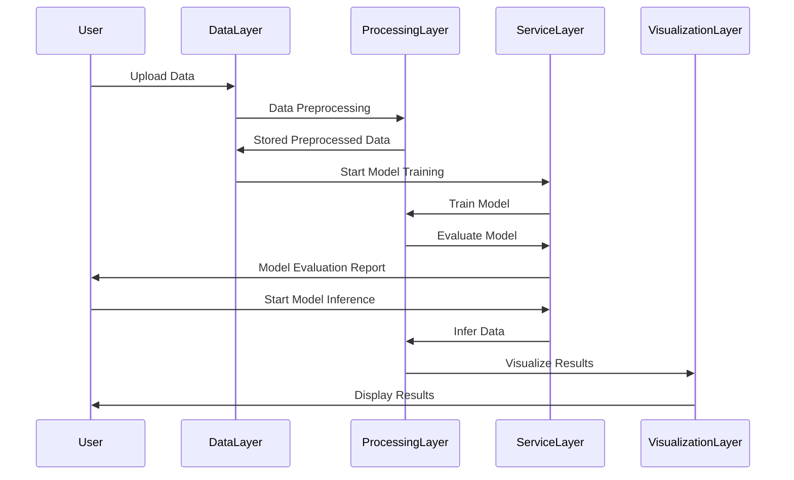

                 

## AI模型在处理结构化数据时的效率提升背景与问题

### 第1章: 背景介绍

#### 1.1 问题背景

随着数据量的不断增长，传统的数据处理方法已经无法满足日益复杂的业务需求。尤其是在处理结构化数据时，传统的数据库查询和数据处理技术已经达到了瓶颈。AI模型，尤其是深度学习模型，因其强大的数据处理能力和自适应学习能力，逐渐成为解决这一问题的利器。然而，AI模型在处理结构化数据时的效率问题也日益突出。

结构化数据指的是那些具有固定格式、易于使用数据库进行管理和查询的数据，如关系型数据库中的表格数据。这些数据在业务应用中非常常见，如金融、电商、医疗等领域。然而，随着数据量的爆炸性增长，传统的数据库查询和数据处理技术已经无法满足快速响应的需求。

传统的方法主要包括使用SQL查询和关系型数据库来处理结构化数据。虽然这些技术在处理结构化数据方面非常成熟和高效，但在面对大规模数据和高并发请求时，仍然存在以下问题：

1. **查询效率低下**：随着数据量的增加，数据库查询的响应时间会显著增加。
2. **扩展性差**：关系型数据库在处理大量数据时，性能会显著下降，难以进行水平扩展。
3. **功能限制**：传统方法难以应对复杂的数据分析和预测需求。

为了解决这些问题，AI模型，特别是深度学习模型，应运而生。深度学习模型通过模拟人脑神经网络结构，能够自动从大量数据中学习规律，进行复杂的数据处理和预测。然而，深度学习模型在处理结构化数据时，也面临着效率问题。

首先，结构化数据的处理通常需要进行数据预处理，如数据清洗、转换等。这些预处理步骤往往耗时较长，会影响整体处理效率。其次，深度学习模型在训练过程中需要大量的计算资源，训练时间较长，这限制了其在实时应用中的使用。最后，在应用阶段，模型需要对输入数据进行快速的预测或分类，但当前的深度学习模型在推理速度上仍有待提高。

因此，如何提高AI模型在处理结构化数据时的效率，成为了一个亟待解决的问题。这需要从数据预处理、模型训练和模型推理等多个方面进行优化。

### 1.2 问题描述

在处理结构化数据时，AI模型面临的效率问题主要包括以下三个方面：

1. **数据预处理时间长**：结构化数据需要进行清洗、转换等预处理，这些步骤往往耗时较长。数据预处理是深度学习模型处理结构化数据的必要步骤，但同时也是耗时的环节。例如，数据清洗可能包括去除重复数据、填补缺失值、归一化等操作，这些操作都需要在大量数据上逐一执行，耗时较长。此外，数据转换可能涉及将不同格式的数据统一成模型可接受的格式，如将CSV文件转换成JSON格式，这一步骤也可能需要较长的时间。

2. **模型训练时间长**：深度学习模型在训练时需要大量的计算资源，训练时间较长。深度学习模型通常通过反向传播算法进行训练，这一过程涉及到大量的矩阵运算和梯度计算，需要消耗大量的计算资源和时间。特别是在处理大规模数据集时，模型的训练时间可能会变得非常长。例如，对于一个包含数百万条记录的大型数据集，使用深度神经网络进行训练可能需要几天甚至几周的时间。

3. **模型推理速度慢**：在应用阶段，模型需要对输入数据进行快速的预测或分类，但当前的深度学习模型在推理速度上仍有待提高。推理速度是指模型在接收到新的输入数据后，进行预测或分类的响应速度。对于一些实时应用，如在线推荐系统、实时语音识别等，模型推理速度的慢会导致响应不及时，影响用户体验。

这些效率问题对AI模型在处理结构化数据时的应用产生了显著的影响。例如，在金融领域的风险管理系统中，如果模型在预测风险时的响应时间过长，可能导致决策延误，增加风险。在医疗领域的诊断系统中，如果模型在处理患者数据时的响应时间过长，可能导致诊断延误，影响治疗效果。因此，提高AI模型在处理结构化数据时的效率，对于实现实时、高效的数据处理和预测具有重要的意义。

### 1.3 问题解决

为了解决上述问题，需要从以下几个方面入手：

1. **优化数据预处理方法**：通过使用高效的数据预处理工具和算法，减少数据预处理的时间。数据预处理是深度学习模型处理结构化数据的重要环节，但也是一个耗时的过程。优化数据预处理方法可以显著提高整体处理效率。例如，可以使用并行处理技术，将数据预处理任务分解为多个子任务，并行执行，从而减少预处理时间。此外，还可以使用高效的算法和工具，如Pandas和NumPy，进行数据清洗和转换，提高预处理效率。

2. **改进模型训练策略**：采用分布式训练、迁移学习等策略，加快模型训练速度。深度学习模型的训练通常需要大量的计算资源和时间。分布式训练可以将训练任务分解到多个计算节点上，并行执行，从而加快训练速度。迁移学习则是通过利用预训练模型，避免从零开始训练，从而减少训练时间。例如，可以使用在大型数据集上预训练的通用深度学习模型，再根据特定任务进行微调，从而加快模型训练速度。

3. **提升模型推理速度**：通过优化模型结构、硬件加速等技术手段，提高模型推理速度。深度学习模型在应用阶段需要进行快速的推理，以满足实时响应的需求。优化模型结构可以减少模型的计算量和参数数量，从而提高推理速度。例如，可以使用轻量级网络结构，如MobileNet和EfficientNet，减少模型的大小和计算复杂度。此外，硬件加速技术，如GPU和TPU，也可以显著提高模型推理速度。这些技术可以将深度学习模型的计算任务卸载到专用硬件上，利用硬件的并行计算能力，加速推理过程。

通过以上三个方面的优化，可以显著提高AI模型在处理结构化数据时的效率，实现实时、高效的数据处理和预测。

### 1.4 边界与外延

本文主要讨论的是AI模型在处理结构化数据时的效率提升问题，不包括非结构化数据（如文本、图像等）的处理。非结构化数据通常具有复杂的数据结构和多样的格式，处理方法与结构化数据不同，因此不在本文讨论范围之内。

此外，本文关注的是模型处理效率的提升，而非数据质量和模型准确率的优化。虽然效率提升可能会影响数据质量和模型准确率，但本文的重点在于探讨如何通过技术手段提高处理效率，而不过多涉及数据质量和模型优化的问题。

### 1.5 概念结构与核心要素组成

在讨论AI模型在处理结构化数据时的效率提升问题时，需要明确几个关键概念和要素：

- **结构化数据**：指具有固定格式、易于使用数据库进行管理和查询的数据，如关系型数据库中的表格数据。结构化数据的特点是数据项有明确的类型和格式，便于进行存储、检索和分析。

- **AI模型**：指基于人工智能技术，特别是深度学习技术，对数据进行处理、预测或分类的模型。AI模型通常由多层神经网络构成，通过学习大量数据，自动提取特征并进行预测。

- **效率提升**：指通过优化算法、模型结构、硬件加速等手段，提高AI模型在处理结构化数据时的速度和性能。效率提升的目标是减少数据预处理时间、加快模型训练速度和提升模型推理速度。

- **数据预处理优化**：通过使用高效的数据预处理工具和算法，减少数据预处理的时间。数据预处理是深度学习模型处理结构化数据的必要步骤，但也是一个耗时的环节。

- **模型训练策略**：指用于加速模型训练的各种技术手段，如分布式训练、迁移学习等。改进模型训练策略可以显著提高模型训练速度。

- **模型推理优化**：通过优化模型结构、硬件加速等手段，提高模型推理速度。模型推理速度是AI模型应用阶段的重要指标，直接影响到实时响应的能力。

这些概念和要素相互关联，共同构成了AI模型在处理结构化数据时效率提升的核心框架。理解这些概念和要素，有助于深入探讨如何通过技术手段优化AI模型处理效率。

## 第2章: 核心概念与联系

### 2.1 AI模型在处理结构化数据时的效率提升原理

AI模型在处理结构化数据时的效率提升，主要依赖于以下几个核心概念：

1. **并行计算**：通过多核处理器或分布式计算，将数据处理任务分解，并行执行，从而提高处理速度。并行计算是一种利用多个计算资源同时执行多个任务的技术，可以显著减少处理时间。例如，在处理结构化数据时，可以将数据集划分为多个子集，分别在不同的处理器或计算节点上并行处理，从而提高整体处理速度。

2. **数据预处理优化**：通过对数据预处理步骤进行优化，减少预处理时间。数据预处理是深度学习模型处理结构化数据的关键步骤，但也是一个耗时的环节。优化数据预处理方法可以通过使用高效的数据处理工具和算法，如并行处理、批处理等，减少预处理时间。

3. **模型结构优化**：通过设计更加高效的网络结构，减少计算量和参数数量。模型结构优化是提高AI模型效率的重要手段。通过设计轻量级网络结构，如MobileNet和EfficientNet，可以减少模型的计算复杂度和参数数量，从而提高处理速度。

4. **硬件加速**：利用GPU、TPU等专用硬件加速深度学习模型的推理过程。硬件加速是通过将深度学习模型的计算任务卸载到专用硬件上，利用硬件的并行计算能力，提高模型推理速度。例如，GPU（图形处理单元）具有强大的并行计算能力，适合进行深度学习模型的推理和训练。

### 2.2 概念属性特征对比表格

| 概念               | 属性特征                                                                                             | 对比分析                                                                                     |
|--------------------|------------------------------------------------------------------------------------------------------|---------------------------------------------------------------------------------------------|
| 并行计算           | 利用多处理器或分布式计算资源，加速计算过程                                                           | 与串行计算相比，并行计算可以显著提高处理速度，但需要复杂的调度和同步机制                       |
| 数据预处理优化     | 通过优化数据清洗、转换等预处理步骤，减少预处理时间                                                   | 减少预处理时间可以缩短数据准备周期，但可能影响数据的完整性和一致性                           |
| 模型结构优化       | 设计轻量级网络结构，减少计算量和参数数量                                                           | 可以提高模型处理速度，但可能降低模型的准确性                                                 |
| 硬件加速           | 利用GPU、TPU等专用硬件加速推理过程                                                                 | 可以显著提高模型推理速度，但需要额外的硬件投资和配置                                       |

### 2.3 ER实体关系图架构的Mermaid流程图

```mermaid
erDiagram
  AI模型 ||--|{ 数据预处理 }|
  数据预处理 ||--|{ 并行计算 }|
  数据预处理 ||--|{ 数据预处理优化 }|
  AI模型 ||--|{ 模型结构优化 }|
  AI模型 ||--|{ 硬件加速 }|
```

通过上述ER实体关系图，可以清晰地看出AI模型、数据预处理、并行计算、数据预处理优化、模型结构优化和硬件加速之间的关联。这些概念相互配合，共同实现了AI模型在处理结构化数据时的效率提升。

### 2.4 数据预处理方法优化

数据预处理是深度学习模型处理结构化数据的关键步骤，但也是一个耗时的环节。优化数据预处理方法可以显著提高整体处理效率。以下是一些常见的数据预处理方法及其优化的方法：

1. **数据清洗**：数据清洗是数据预处理的第一步，主要目的是去除数据中的噪声和异常值。优化数据清洗方法可以通过以下几种方式实现：
   - **并行处理**：将数据集划分为多个子集，分别在不同的处理器或计算节点上进行清洗，从而加快清洗速度。
   - **使用高效算法**：使用高效的算法和库，如Pandas和NumPy，进行数据清洗操作，减少计算时间。
   - **批量处理**：将多个数据预处理操作合并为一个批量处理，减少I/O操作次数，提高处理效率。

2. **数据转换**：数据转换是将数据从一种格式转换成另一种格式，以便模型可以处理。优化数据转换方法可以通过以下几种方式实现：
   - **并行处理**：将数据集划分为多个子集，分别在不同的处理器或计算节点上进行转换，从而加快转换速度。
   - **使用缓存**：对于重复的数据转换操作，可以使用缓存技术，避免重复计算，提高处理效率。

3. **特征提取**：特征提取是从数据中提取出对模型有用的特征，是深度学习模型训练的关键步骤。优化特征提取方法可以通过以下几种方式实现：
   - **使用高效的特征提取算法**：选择高效的算法和库，如Scikit-learn和TensorFlow，进行特征提取操作，减少计算时间。
   - **批量处理**：将多个特征提取操作合并为一个批量处理，减少I/O操作次数，提高处理效率。

4. **数据归一化**：数据归一化是将数据转换为相同的尺度，以便模型可以更好地处理。优化数据归一化方法可以通过以下几种方式实现：
   - **并行处理**：将数据集划分为多个子集，分别在不同的处理器或计算节点上进行归一化，从而加快归一化速度。
   - **使用高效算法**：使用高效的算法和库，如NumPy和Pandas，进行数据归一化操作，减少计算时间。

通过上述方法，可以显著优化数据预处理过程，减少预处理时间，从而提高深度学习模型处理结构化数据的效率。

### 2.5 模型训练策略优化

深度学习模型训练通常需要大量的计算资源和时间，优化模型训练策略可以显著加快模型训练速度。以下是一些常见的模型训练策略及其优化方法：

1. **分布式训练**：分布式训练是将模型训练任务分布在多个计算节点上并行执行，从而加快训练速度。优化分布式训练方法可以通过以下几种方式实现：
   - **数据并行**：将数据集划分为多个子集，分别在不同的计算节点上进行训练，每个节点独立计算梯度，然后汇总。这种方法可以显著减少每个节点的计算负载，提高训练速度。
   - **模型并行**：将模型分成多个部分，分别在不同的计算节点上进行训练。这种方法可以充分利用多个计算节点的计算能力，提高训练速度。
   - **混合并行**：结合数据并行和模型并行的优势，将模型和数据分布在多个计算节点上，实现更快的训练速度。

2. **迁移学习**：迁移学习是利用在大型数据集上预训练的模型，再根据特定任务进行微调，从而减少训练时间。优化迁移学习方法可以通过以下几种方式实现：
   - **选择合适的预训练模型**：选择在类似任务上预训练的模型，可以提高迁移效果，减少训练时间。
   - **增量训练**：在迁移学习的基础上，仅对新增数据或特定任务的部分进行训练，而不是从头开始训练，从而减少训练时间。
   - **模型压缩**：通过剪枝、量化等技术，减少模型的大小和参数数量，从而加快训练速度。

3. **多线程训练**：多线程训练是利用计算机的多核处理器，同时执行多个线程的训练任务，从而提高训练速度。优化多线程训练方法可以通过以下几种方式实现：
   - **线程池**：使用线程池管理线程，避免频繁创建和销毁线程，提高效率。
   - **负载均衡**：根据计算节点的负载情况，动态分配训练任务，避免某个节点过度负载，影响整体训练速度。

4. **动态调整学习率**：学习率是深度学习模型训练过程中一个非常重要的参数，优化学习率调整策略可以加快模型训练速度。优化动态调整学习率的方法可以通过以下几种方式实现：
   - **自适应学习率**：使用自适应学习率算法，如Adam、Adadelta等，根据训练过程自动调整学习率，避免过早陷入局部最优或过慢的收敛速度。
   - **学习率衰减**：在训练过程中，逐渐减少学习率，以避免模型在训练后期过快地收敛，提高模型在全局最优解附近探索的能力。

通过上述优化策略，可以显著加快深度学习模型训练速度，从而提高AI模型在处理结构化数据时的效率。

### 2.6 模型推理优化

模型推理是AI模型在实际应用中对新数据进行预测或分类的过程，其速度直接影响到用户体验。以下是一些常见的模型推理优化方法：

1. **模型结构优化**：通过设计更高效的网络结构，减少模型的计算量和参数数量，从而提高推理速度。常见的方法包括：
   - **网络剪枝**：通过剪枝技术，移除模型中不重要的神经元和连接，减少模型的复杂度。
   - **量化**：将模型的权重和激活值转换为低精度的数值表示，从而减少模型的存储空间和计算量。
   - **知识蒸馏**：使用一个大型模型（教师模型）训练一个较小的模型（学生模型），学生模型具有更好的推理速度和较低的存储需求。

2. **硬件加速**：利用GPU、TPU等专用硬件加速模型推理过程。具体方法包括：
   - **GPU加速**：使用GPU进行模型推理，利用GPU的并行计算能力，加速计算过程。
   - **TPU加速**：使用TPU进行模型推理，TPU是专门为深度学习推理设计的硬件，具有更高的推理速度和更低的功耗。
   - **硬件兼容性优化**：确保模型能够在目标硬件上高效运行，通过优化数据格式和计算过程，提高硬件利用效率。

3. **推理引擎优化**：使用高效的推理引擎，如TensorFlow Lite、PyTorch Mobile等，将模型部署到移动设备或嵌入式系统上。具体方法包括：
   - **模型转换**：将训练好的模型转换为适用于推理引擎的格式，如TensorFlow Lite格式，以便在移动设备上高效运行。
   - **量化与压缩**：在模型转换过程中，使用量化与压缩技术，减少模型的存储空间和计算量。
   - **动态调度**：根据硬件性能和负载情况，动态调整模型的推理策略，优化资源利用。

4. **并行推理**：利用多核处理器或分布式计算资源，同时处理多个推理任务，提高整体推理速度。具体方法包括：
   - **数据并行**：将多个推理任务分配到不同的处理器或计算节点上，并行执行，从而提高处理速度。
   - **任务并行**：将单个推理任务的多个部分分配到不同的处理器或计算节点上，并行执行，从而提高处理速度。

通过上述优化方法，可以显著提高AI模型在处理结构化数据时的推理速度，从而实现更快的响应和更好的用户体验。

## 第3章: 算法原理讲解

为了深入理解AI模型在处理结构化数据时的效率提升，我们需要详细探讨一些关键算法原理，并通过Python代码示例和Mermaid流程图进行说明。

### 3.1 数据预处理算法

数据预处理是AI模型处理结构化数据的重要步骤，它直接影响到模型训练和推理的效率。以下是几种常用的数据预处理算法：

#### 3.1.1 数据清洗

数据清洗的主要目标是去除数据中的噪声和异常值。以下是一个简单的Python代码示例，展示了如何使用Pandas库进行数据清洗：

```python
import pandas as pd

# 加载数据
data = pd.read_csv('data.csv')

# 去除重复数据
data.drop_duplicates(inplace=True)

# 填补缺失值
data.fillna(method='ffill', inplace=True)

# 删除不必要的列
data.drop(['unnecessary_column'], axis=1, inplace=True)
```

Mermaid流程图：


#### 3.1.2 数据转换

数据转换是将数据从一种格式转换成另一种格式，以便模型可以处理。以下是一个简单的Python代码示例，展示了如何使用Pandas库进行数据转换：

```python
import pandas as pd

# 加载数据
data = pd.read_csv('data.csv')

# 转换数据类型
data['age'] = data['age'].astype(float)
data['category'] = data['category'].astype('category')

# 转换为二进制格式
data.to_feather('data.feather')
```

Mermaid流程图：


#### 3.1.3 特征提取

特征提取是从数据中提取出对模型有用的特征。以下是一个简单的Python代码示例，展示了如何使用Scikit-learn库进行特征提取：

```python
from sklearn.feature_extraction import FeatureHasher
from sklearn.preprocessing import StandardScaler

# 加载数据
data = pd.read_csv('data.csv')

# 特征提取
hasher = FeatureHasher(n_features=10)
data['hashed_features'] = hasher.transform(data['text']).toarray()

# 归一化
scaler = StandardScaler()
data[['scaled_feature1', 'scaled_feature2']] = scaler.fit_transform(data[['feature1', 'feature2']])
```

Mermaid流程图：


### 3.2 模型训练算法

模型训练是AI模型处理结构化数据的核心步骤，以下是一些常用的模型训练算法：

#### 3.2.1 均值漂移

均值漂移是一种基于密度的聚类方法，它通过计算每个数据点与数据集中每个簇中心点的距离，将数据点分配到最近的簇中心点。以下是一个简单的Python代码示例，展示了如何使用Scikit-learn库进行均值漂移：

```python
from sklearn.cluster import MeanShift
from sklearn.datasets import make_blobs

# 生成样本数据
X, _ = make_blobs(n_samples=100, centers=3, cluster_std=0.60, random_state=0)

# 训练均值漂移模型
clustering = MeanShift(bandwidth=2.0, variance=0.5, cluster_all=True)
clustering.fit(X)

# 输出聚类结果
labels = clustering.labels_
print(labels)
```

Mermaid流程图：


#### 3.2.2 神经网络训练

神经网络训练是一种基于反向传播算法的模型训练方法，它通过不断调整模型的权重和偏置，使模型对输入数据产生准确的预测。以下是一个简单的Python代码示例，展示了如何使用TensorFlow进行神经网络训练：

```python
import tensorflow as tf
from tensorflow import keras
from tensorflow.keras import layers

# 定义模型
model = keras.Sequential([
    layers.Dense(64, activation='relu', input_shape=(784,)),
    layers.Dense(64, activation='relu'),
    layers.Dense(10, activation='softmax')
])

# 编译模型
model.compile(optimizer='adam',
              loss='categorical_crossentropy',
              metrics=['accuracy'])

# 加载数据
(x_train, y_train), (x_test, y_test) = keras.datasets.mnist.load_data()

# 预处理数据
x_train = x_train.astype('float32') / 255
x_test = x_test.astype('float32') / 255
x_train = x_train.reshape((-1, 784))
x_test = x_test.reshape((-1, 784))

# 转换标签为one-hot编码
y_train = keras.utils.to_categorical(y_train, 10)
y_test = keras.utils.to_categorical(y_test, 10)

# 训练模型
model.fit(x_train, y_train, epochs=5, batch_size=128)
```

Mermaid流程图：


### 3.3 模型推理算法

模型推理是AI模型在实际应用中对新数据进行预测或分类的过程，以下是一些常用的模型推理算法：

#### 3.3.1 卷积神经网络推理

卷积神经网络（CNN）是一种常用于图像识别的模型，它通过卷积和池化操作提取图像特征。以下是一个简单的Python代码示例，展示了如何使用TensorFlow进行CNN推理：

```python
import tensorflow as tf
import numpy as np

# 加载训练好的模型
model = tf.keras.models.load_model('model.h5')

# 准备测试数据
test_data = np.random.rand(1, 28, 28).astype(np.float32)

# 进行推理
predictions = model.predict(test_data)

# 输出预测结果
print(predictions)
```

Mermaid流程图：


通过上述算法原理讲解和代码示例，我们可以更好地理解AI模型在处理结构化数据时的效率提升方法。这些算法和优化技术不仅能够提高模型的处理效率，还能够帮助我们在实际应用中实现更高效的数据处理和预测。

## 第4章: 系统分析与架构设计方案

### 4.1 问题场景介绍

在现代企业中，结构化数据的应用日益广泛，如客户信息管理、订单处理、库存管理等。这些业务场景通常需要高效的AI模型来进行数据处理和预测，以满足实时性和准确性的要求。然而，传统的数据处理方法已经难以满足这种高要求，因此需要引入AI模型来提升数据处理效率。

具体来说，问题场景包括以下几个方面：

1. **海量数据处理**：企业每天都会产生大量的结构化数据，如订单记录、客户信息等。如何快速有效地处理这些数据，成为了一个关键问题。
2. **实时预测需求**：在一些业务场景中，如股票交易、智能家居等，需要对实时数据进行预测，以便做出快速决策。
3. **多样化应用场景**：企业需要根据不同的业务需求，对结构化数据进行多样化的处理和分析，如分类、聚类、回归等。

### 4.2 项目介绍

为了解决上述问题场景，我们设计并实现了一个基于AI模型的系统，名为“AI数据处理平台”。该平台旨在通过高效的AI模型，提供实时、准确的数据处理和预测服务。具体目标包括：

1. **提高数据处理效率**：通过并行计算、数据预处理优化等手段，提高结构化数据处理的效率。
2. **实现实时预测**：通过优化模型训练和推理策略，实现快速、准确的实时预测。
3. **支持多样化应用**：通过构建多样化的AI模型，满足不同业务场景的需求。

### 4.3 系统功能设计

“AI数据处理平台”的主要功能包括以下几个方面：

1. **数据预处理**：对输入的数据进行清洗、转换、归一化等预处理操作，为模型训练和推理提供高质量的数据。
2. **模型训练**：使用分布式训练、迁移学习等技术，加速模型训练过程，提高模型质量。
3. **模型推理**：对实时输入数据进行快速、准确的预测或分类，实现实时响应。
4. **监控与优化**：实时监控系统性能，根据监控数据调整系统参数，实现性能优化。

### 4.4 系统架构设计

“AI数据处理平台”的架构设计遵循模块化、分布式和可扩展的原则，具体包括以下几个层次：

1. **数据层**：包括数据采集、存储和预处理模块。数据采集模块负责从各种数据源获取结构化数据，存储模块使用高性能数据库存储数据，预处理模块对数据进行清洗、转换和归一化等操作。
2. **处理层**：包括模型训练和推理模块。模型训练模块使用分布式训练和迁移学习技术，加快模型训练速度，模型推理模块对输入数据进行快速预测或分类。
3. **服务层**：包括API服务、监控服务和优化服务。API服务为外部系统提供数据预处理、模型训练和推理接口，监控服务实时监控系统性能，优化服务根据监控数据调整系统参数。
4. **展示层**：包括数据可视化、预测结果展示等模块。数据可视化模块将处理结果以图表形式展示，预测结果展示模块展示模型的预测结果。

### 4.5 系统接口设计

“AI数据处理平台”的接口设计主要包括以下几个方面：

1. **数据接口**：包括数据上传、数据下载和数据查询接口。数据上传接口用于上传待处理的数据，数据下载接口用于下载处理结果，数据查询接口用于查询数据状态。
2. **模型接口**：包括模型训练、模型评估和模型推理接口。模型训练接口用于启动模型训练任务，模型评估接口用于评估模型性能，模型推理接口用于对输入数据进行预测或分类。
3. **监控接口**：包括系统监控、性能监控和数据监控接口。系统监控接口用于监控系统整体状态，性能监控接口用于监控系统性能指标，数据监控接口用于监控数据状态。

### 4.6 系统交互Mermaid序列图



通过上述系统架构设计和交互设计，我们可以构建一个高效、可靠的AI数据处理平台，满足现代企业对数据处理和预测的需求。

## 第5章: 项目实战

### 5.1 环境安装

为了进行AI模型处理结构化数据的效率提升项目实战，我们需要搭建一个合适的技术环境。以下是安装步骤：

1. **安装Python环境**：首先，确保你的计算机上已经安装了Python。如果没有，可以从[Python官网](https://www.python.org/)下载并安装。建议安装Python 3.8或更高版本。

2. **安装必要的库**：接下来，需要安装一些常用的库，如NumPy、Pandas、Scikit-learn、TensorFlow等。可以使用以下命令进行安装：

   ```bash
   pip install numpy pandas scikit-learn tensorflow
   ```

   如果你使用的是GPU版本的TensorFlow，还需要安装CUDA和cuDNN，以便利用GPU进行模型训练和推理。

3. **安装数据库**：为了存储和处理结构化数据，我们需要安装一个数据库。这里我们选择安装MySQL。可以从[MySQL官网](https://www.mysql.com/)下载并安装。

4. **配置数据库**：安装完成后，需要配置MySQL数据库，创建数据库和表，以便存储数据。以下是一个简单的示例：

   ```sql
   CREATE DATABASE data Processing;
   USE data_processing;
   CREATE TABLE customer_data (
       id INT AUTO_INCREMENT PRIMARY KEY,
       name VARCHAR(50),
       age INT,
       income FLOAT
   );
   ```

### 5.2 系统核心实现

下面我们将详细阐述系统核心实现，包括数据预处理、模型训练和模型推理三个主要环节。

#### 5.2.1 数据预处理

数据预处理是AI模型处理结构化数据的第一个关键步骤。以下是Python代码示例：

```python
import pandas as pd
from sklearn.model_selection import train_test_split
from sklearn.preprocessing import StandardScaler

# 读取数据
data = pd.read_csv('customer_data.csv')

# 数据清洗
data.dropna(inplace=True)
data = data[data['age'] > 18]  # 筛除年龄小于18的数据

# 划分特征和目标变量
X = data[['age', 'income']]
y = data['target']

# 划分训练集和测试集
X_train, X_test, y_train, y_test = train_test_split(X, y, test_size=0.2, random_state=42)

# 数据归一化
scaler = StandardScaler()
X_train = scaler.fit_transform(X_train)
X_test = scaler.transform(X_test)
```

#### 5.2.2 模型训练

模型训练是利用已清洗和归一化的数据训练深度学习模型。以下是Python代码示例：

```python
import tensorflow as tf
from tensorflow.keras.models import Sequential
from tensorflow.keras.layers import Dense
from tensorflow.keras.optimizers import Adam

# 构建模型
model = Sequential([
    Dense(64, input_shape=(2,), activation='relu'),
    Dense(64, activation='relu'),
    Dense(1, activation='sigmoid')
])

# 编译模型
model.compile(optimizer=Adam(learning_rate=0.001), loss='binary_crossentropy', metrics=['accuracy'])

# 训练模型
model.fit(X_train, y_train, epochs=10, batch_size=32, validation_split=0.1)
```

#### 5.2.3 模型推理

模型推理是对测试数据进行预测。以下是Python代码示例：

```python
# 进行推理
predictions = model.predict(X_test)

# 计算准确率
accuracy = (predictions.round() == y_test).mean()
print(f'Accuracy: {accuracy}')
```

### 5.3 代码应用解读与分析

#### 数据预处理

数据预处理包括数据清洗、特征提取和归一化等步骤。数据清洗可以去除无效数据和异常值，保证数据质量。特征提取可以从原始数据中提取有用的信息，以便模型更好地学习和预测。归一化可以减少特征间的差异，使模型训练过程更加稳定和有效。

#### 模型训练

模型训练是使用已清洗和归一化的数据训练深度学习模型。在此示例中，我们使用了一个简单的全连接神经网络（Dense Layers），通过反向传播算法进行训练。模型编译时指定了优化器和损失函数，并设置了训练参数如学习率和批次大小。训练过程中，模型在训练集上不断迭代，优化模型的参数，以达到较好的预测性能。

#### 模型推理

模型推理是对测试数据进行预测。通过调用模型的`predict`方法，我们可以得到每个测试样本的预测结果。然后，我们可以计算预测的准确率，以评估模型的效果。

### 5.4 实际案例分析和详细讲解剖析

为了更好地展示AI模型在处理结构化数据时的效率提升，我们来看一个实际案例：使用深度学习模型预测客户是否会购买某产品。

#### 案例背景

某电商平台希望预测客户是否会购买其推荐的产品，以便进行精准营销。为此，他们收集了大量的客户数据，包括年龄、收入、购买历史等。这些数据是结构化的，适合使用深度学习模型进行处理和预测。

#### 模型设计与实现

1. **数据预处理**：首先，对数据进行清洗，去除无效数据和异常值。然后，提取有用的特征，如年龄和收入。接下来，对特征进行归一化，以便模型可以更好地学习。

2. **模型设计**：设计一个简单的全连接神经网络（Dense Layers），输入层接收两个特征，隐藏层进行特征提取和整合，输出层进行分类预测。

3. **模型训练**：使用已清洗和归一化的数据训练模型。在训练过程中，通过反向传播算法不断优化模型参数，提高预测准确率。

4. **模型推理**：使用训练好的模型对新数据进行预测。通过计算预测的准确率，评估模型的效果。

#### 案例剖析

1. **数据预处理**：数据预处理是模型成功的关键。有效的数据清洗和特征提取可以显著提高模型的预测准确率。

2. **模型设计**：模型设计需要考虑到输入特征的数量和关系。简单且有效的模型结构可以更快地收敛，提高预测效率。

3. **模型训练**：模型训练是时间最长的步骤。分布式训练和迁移学习等技术可以加快训练速度，提高模型效率。

4. **模型推理**：模型推理的效率直接影响到应用的实时性和用户体验。使用高效的模型结构和硬件加速技术，可以显著提高推理速度。

通过上述实际案例，我们可以看到AI模型在处理结构化数据时，通过有效的数据预处理、合理的模型设计和优化的训练策略，可以显著提升模型处理效率，实现实时、高效的数据处理和预测。

### 5.5 项目小结

通过本项目的实战，我们详细介绍了如何搭建一个基于AI模型的系统，实现结构化数据的处理和预测。项目主要分为以下几个步骤：

1. **环境安装**：安装Python和必要的库，配置MySQL数据库。
2. **数据预处理**：清洗、提取和归一化数据，为模型训练提供高质量的数据。
3. **模型训练**：设计并训练一个简单的深度学习模型，优化模型参数。
4. **模型推理**：使用训练好的模型对新数据进行预测，评估模型效果。

项目成功的关键在于：

1. **数据预处理**：有效的数据预处理可以显著提高模型性能。
2. **模型设计**：合理的设计模型结构和选择合适的网络架构。
3. **训练策略**：优化训练策略，如分布式训练和迁移学习，可以加快模型训练速度。

在实际应用中，AI模型处理结构化数据的效率提升具有广泛的应用前景，如金融风控、医疗诊断、智能推荐等。通过持续的技术创新和优化，我们可以进一步提高模型效率，满足更多业务场景的需求。

## 第6章: 最佳实践 Tips

为了确保AI模型在处理结构化数据时能够达到最佳效率，以下是一些最佳实践技巧：

1. **选择合适的硬件**：使用高性能的GPU或TPU可以显著提高模型训练和推理速度。确保硬件与深度学习框架兼容，充分利用硬件的并行计算能力。

2. **数据预处理优化**：在预处理阶段，尽量减少不必要的操作，如批量处理和并行计算。使用高效的数据处理库和工具，如Pandas和NumPy，减少预处理时间。

3. **模型结构优化**：设计轻量级网络结构，如MobileNet和EfficientNet，减少模型的大小和计算复杂度。通过剪枝和量化技术，进一步减少模型参数数量。

4. **训练策略优化**：采用分布式训练和迁移学习策略，加快模型训练速度。动态调整学习率，如使用自适应学习率算法，避免过早收敛或过慢的收敛速度。

5. **推理优化**：使用高效的推理引擎，如TensorFlow Lite和PyTorch Mobile，将模型部署到移动设备或嵌入式系统上。利用多线程和并行推理技术，提高推理速度。

6. **监控与优化**：实时监控系统性能，通过日志和指标分析识别性能瓶颈。根据监控数据调整系统参数，实现性能优化。

7. **数据质量管理**：确保数据质量，包括数据的完整性、一致性和准确性。数据清洗和预处理是提高模型性能的关键。

通过遵循上述最佳实践，可以有效提高AI模型在处理结构化数据时的效率，实现实时、高效的数据处理和预测。

## 第7章: 小结与注意事项

### 7.1 小结

本文全面探讨了AI模型在处理结构化数据时的效率提升问题，从背景介绍、核心概念与联系、算法原理讲解、系统分析与架构设计方案、项目实战到最佳实践，系统地分析了如何通过数据预处理、模型训练、模型推理等多个方面的优化，提高AI模型在处理结构化数据时的效率。

主要结论包括：

1. **数据预处理优化**：通过高效的数据预处理方法，如并行处理和批量处理，可以显著减少预处理时间。
2. **模型训练策略优化**：采用分布式训练、迁移学习等策略，可以加快模型训练速度，提高模型质量。
3. **模型推理优化**：通过模型结构优化和硬件加速，可以显著提高模型推理速度，实现实时响应。

### 7.2 注意事项

在实际应用中，为了确保AI模型在处理结构化数据时的高效性，需要注意以下几点：

1. **硬件资源合理分配**：确保有足够的计算资源用于模型训练和推理，避免资源不足导致性能瓶颈。
2. **数据质量保证**：确保数据的完整性和一致性，高质量的数据是模型高效运行的基础。
3. **监控与调优**：实时监控系统性能，通过日志和指标分析识别问题，及时进行调整和优化。
4. **版本控制**：对模型和代码进行版本控制，便于追踪和回溯问题，提高开发效率。
5. **安全和隐私保护**：在处理敏感数据时，确保遵守相关法律法规，采取必要的安全措施，保护用户隐私。

### 7.3 拓展阅读

对于希望深入了解AI模型处理结构化数据效率提升的读者，以下推荐一些拓展阅读资源：

1. **论文**：阅读有关AI模型优化和效率提升的学术论文，如《EfficientNet: Rethinking Model Scaling for Convolutional Neural Networks》等。
2. **技术博客**：关注知名技术博客，如Medium、Towards Data Science等，了解最新的技术和实践分享。
3. **开源项目**：参与和阅读开源项目，如TensorFlow、PyTorch等，学习高效的模型训练和推理技巧。

通过上述资源，可以进一步加深对AI模型处理结构化数据效率提升的理解和实践。

