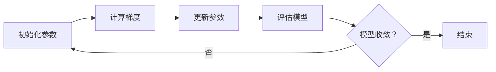

                 

### AI模型在处理长尾分布数据时的优化方法

---

#### 关键词：
- AI模型优化
- 长尾分布数据
- 数据稀疏性
- 计算效率
- 特征工程

---

#### 摘要：
本文旨在探讨AI模型在处理长尾分布数据时的优化方法。长尾分布数据具有数据稀疏、价值不均等特点，对传统AI模型的性能构成挑战。本文将详细分析长尾分布数据的定义与特性，讨论AI模型在处理此类数据时面临的挑战，并介绍一系列优化方法，旨在提升模型在长尾数据环境下的准确性和计算效率。

---

## 第一部分: AI模型处理长尾分布数据的问题背景

### 第1章: AI模型处理长尾分布数据的问题背景

长尾分布数据在现实应用中极为普遍，例如电商平台上的商品销量、搜索引擎的关键词分布等。这类数据的特征在于少数核心数据点占据大部分权重，而大量长尾数据点则分布稀疏，且具有较低的观测频率。这一特征对传统的AI模型提出了严峻的挑战。

#### 1.1 长尾分布数据的定义与特点

长尾分布数据（Long-tailed Distribution Data）是指在一组数据中，数据点集中在某一较小范围，而剩余的数据点则呈长尾状分布，形成一个细长且平缓的尾部。具体而言，长尾分布数据具有以下特点：

- **数据稀疏性**：大部分数据点集中在少数核心类别中，其余类别数据点稀疏。
- **数据量巨大**：尽管数据点稀疏，但总体数据量却可能非常庞大。
- **价值不均衡**：核心类别数据具有重要价值，而长尾数据则价值相对较低。

#### 1.2 AI模型处理长尾分布数据的挑战

在处理长尾分布数据时，AI模型面临以下挑战：

- **挑战1：数据稀疏性**：稀疏数据导致模型难以学习到有效的特征，从而影响模型性能。
- **挑战2：模型过拟合**：长尾数据点的稀疏性可能导致模型对稀疏部分过拟合，进而影响泛化能力。
- **挑战3：计算效率问题**：长尾数据量庞大，可能导致模型训练和推理过程效率低下。

#### 1.3 解决问题的思路与方法

为解决上述问题，本文将介绍以下优化方法：

- **基本原理**：通过引入合适的数据预处理方法、模型选择与调参策略，提升模型对长尾分布数据的适应性。
- **核心方法**：采用特征工程和领域知识注入，增强模型对长尾数据的理解能力。
- **技术路线图**：详细阐述模型优化过程的各个环节，从数据预处理到模型训练与评估，全面优化模型性能。

### 1.4 本章小结

本章介绍了AI模型处理长尾分布数据的问题背景，包括长尾分布数据的定义、特点以及模型处理长尾数据时面临的挑战。通过阐述解决思路和方法，为后续章节的深入讨论奠定了基础。

---

## 第二部分: 核心概念与联系

### 第2章: 核心概念与联系

要优化AI模型处理长尾分布数据，需要深入了解相关核心概念及其相互关系。

#### 2.1 核心概念原理

本文的核心概念包括长尾分布数据、AI模型优化方法及其优化目标。

- **长尾分布数据**：指数据点在某一小范围内高度集中，而在尾部则呈长尾状分布的数据集。
- **AI模型优化方法**：指为了提升AI模型在长尾数据上的性能，所采用的一系列算法和技术手段。
- **优化目标**：主要包括提高模型准确性、增强模型的可解释性和提升计算效率。

#### 2.2 概念属性特征对比表格

| 概念               | 特征1       | 特征2       | 特征3       |
|--------------------|-------------|-------------|-------------|
| 长尾分布数据       | 数据稀疏性  | 数据量巨大  | 价值不均衡  |
| AI模型优化方法     | 算法多样    | 参数调整    | 特征工程    |
| 优化目标           | 准确性      | 可解释性    | 计算效率    |

#### 2.3 ER实体关系图架构

```mermaid
erDiagram
  Data : 数据集
  Model : 模型
  Method : 优化方法
  Objective : 优化目标

  Data ||--|{ Model }
  Model ||--|{ Method }
  Method ||--|{ Objective }
```

#### 2.4 本章小结

本章通过对比表格和ER图详细介绍了核心概念及其相互关系，为理解AI模型优化方法及其在处理长尾分布数据中的应用提供了理论依据。

---

## 第三部分: 算法原理讲解

### 第3章: 算法原理讲解

优化AI模型处理长尾分布数据的核心在于理解并应用一系列优化方法。以下将详细介绍这些算法原理。

#### 3.1 基本原理

处理长尾分布数据的基本原理主要包括以下几个方面：

- **数据预处理**：通过数据清洗、归一化、稀疏数据处理等技术，提高数据质量。
- **模型选择与调参**：选择适合长尾数据的模型，并调整模型参数以优化性能。
- **特征工程**：提取和构造有效的特征，增强模型对长尾数据的理解能力。

#### 3.2 优化方法详解

以下是几种常见的AI模型优化方法：

##### 3.2.1 反向传播算法

反向传播算法（Backpropagation）是神经网络模型训练的核心算法。以下是算法的详细流程：

##### 3.2.1.1 Mermaid流程图



##### 3.2.1.2 Python代码示例

```python
import numpy as np

# 初始化参数
weights = np.random.rand(num_inputs, num_outputs)
biases = np.random.rand(num_outputs)

# 计算梯度
def compute_gradient(inputs, outputs, predicted):
    error = predicted - outputs
    dW = np.dot(inputs.T, error)
    db = np.sum(error, axis=0)
    
    # 更新参数
    weights -= learning_rate * dW
    biases -= learning_rate * db
    
    # 评估模型
    predicted = forward_pass(inputs, weights, biases)
    
    return predicted

# 主循环
for epoch in range(num_epochs):
    for inputs, outputs in data_loader:
        predicted = compute_gradient(inputs, outputs, predicted)
        
    if is_converged(predicted):
        break
```

##### 3.2.1.3 数学模型与公式

反向传播算法的核心在于计算梯度，以下为其数学模型：

$$
\frac{\partial J}{\partial W} = \sum_{i=1}^{n} \frac{\partial J}{\partial z_i} \frac{\partial z_i}{\partial W}
$$

其中，$J$ 是损失函数，$W$ 是权重，$z_i$ 是神经网络中的中间变量。

##### 3.2.1.4 通俗易懂的举例说明

假设我们有一个简单的神经网络，输入层有一个神经元，隐藏层有一个神经元，输出层有一个神经元。给定一个输入数据 $x$，网络输出 $y$。通过反向传播算法，我们希望找到最佳的权重和偏置，使得输出 $y$ 与实际值尽可能接近。

首先，我们随机初始化权重和偏置。然后，通过前向传播计算输出 $y$。接下来，计算输出误差 $\delta$。最后，通过反向传播计算权重和偏置的梯度，并更新参数。

#### 3.3.2 其他优化方法

除了反向传播算法，还有其他一些优化方法可以用于处理长尾分布数据，如：

- **聚类算法**：通过聚类将长尾数据划分为多个簇，然后分别对每个簇进行建模。
- **样本权重调整**：根据数据点的稀疏性调整训练样本的权重，使得模型更关注核心数据点。
- **迁移学习**：利用预训练模型，通过迁移学习的方法，使得模型在长尾数据上的表现得到提升。

#### 3.4 本章小结

本章详细介绍了AI模型优化处理长尾分布数据的基本原理和优化方法，包括反向传播算法的详细解释和Python代码示例。通过理解这些优化方法，我们可以更有效地提升AI模型在长尾分布数据上的性能。

---

## 第四部分: 系统分析与架构设计

### 第4章: 系统分析与架构设计

在实际应用中，AI模型处理长尾分布数据需要一套完善的系统架构来支持。以下将介绍系统的需求分析、功能设计、架构设计和接口设计等内容。

#### 4.1 需求分析

系统的需求分析主要包括以下几个方面：

- **数据收集**：从多个数据源收集长尾分布数据，包括电商平台、社交媒体、搜索引擎等。
- **数据预处理**：对收集到的数据进行清洗、归一化和稀疏数据处理，提高数据质量。
- **模型训练**：利用预处理后的数据训练AI模型，以提升模型在长尾数据上的性能。
- **模型评估**：对训练完成的模型进行评估，确保其满足性能要求。
- **模型部署**：将训练好的模型部署到生产环境中，以提供实时预测服务。

#### 4.2 功能设计

系统的功能设计主要包括以下模块：

- **数据收集模块**：负责从不同数据源收集长尾分布数据，并存储到数据仓库中。
- **数据预处理模块**：对收集到的数据进行分析和处理，包括数据清洗、归一化和稀疏数据处理。
- **模型训练模块**：利用预处理后的数据训练AI模型，并保存训练结果。
- **模型评估模块**：对训练好的模型进行评估，包括准确率、召回率、F1分数等指标。
- **模型部署模块**：将评估通过的模型部署到生产环境中，并提供API接口供外部调用。

#### 4.3 系统架构设计

系统的架构设计采用微服务架构，以提高系统的可扩展性和可维护性。以下是系统架构的详细设计：

- **数据层**：包括数据仓库和数据存储系统，用于存储和处理长尾分布数据。
- **服务层**：包括数据收集服务、数据预处理服务、模型训练服务、模型评估服务和模型部署服务，每个服务负责实现特定的功能。
- **应用层**：提供API接口，供外部系统调用，实现实时预测和模型服务。
- **监控层**：对系统运行状态进行监控，包括服务状态、性能指标和异常处理。

#### 4.4 系统接口设计

系统的接口设计主要包括以下接口：

- **数据收集接口**：用于接收外部系统的数据上传请求，并将数据存储到数据仓库中。
- **数据预处理接口**：用于接收外部系统的数据预处理请求，并返回处理结果。
- **模型训练接口**：用于接收外部系统的模型训练请求，并返回训练结果。
- **模型评估接口**：用于接收外部系统的模型评估请求，并返回评估结果。
- **模型部署接口**：用于接收外部系统的模型部署请求，并返回部署状态。

#### 4.5 系统交互设计

系统的交互设计采用RESTful API设计，以下是系统交互的详细设计：

- **数据收集**：外部系统通过POST请求上传数据，系统返回处理结果。
- **数据预处理**：外部系统通过GET请求获取预处理后的数据，系统返回处理结果。
- **模型训练**：外部系统通过POST请求提交训练参数，系统返回训练进度和结果。
- **模型评估**：外部系统通过GET请求获取模型评估结果，系统返回评估报告。
- **模型部署**：外部系统通过POST请求部署模型，系统返回部署状态。

#### 4.6 本章小结

本章详细介绍了系统的需求分析、功能设计、架构设计和接口设计等内容，为后续系统实施和部署提供了全面的指导。通过本系统的设计，可以实现对长尾分布数据的有效处理和分析。

---

## 第五部分: 项目实战

### 第5章: 项目实战

在本文的最后一部分，我们将通过一个实际项目案例，详细讲解如何在实际环境中实现AI模型优化处理长尾分布数据的过程。

#### 5.1 环境安装

在开始项目实战之前，我们需要安装必要的软件和工具。以下是一个基本的安装步骤：

- **安装Python**：确保Python环境已安装，版本建议为3.8或更高。
- **安装依赖库**：通过pip命令安装必要的库，如TensorFlow、NumPy、Pandas等。
  ```bash
  pip install tensorflow numpy pandas
  ```

#### 5.2 系统核心实现源代码

以下是一个简单的Python代码示例，展示如何实现一个基于TensorFlow的AI模型，用于处理长尾分布数据。

```python
import tensorflow as tf
import numpy as np

# 模型定义
model = tf.keras.Sequential([
    tf.keras.layers.Dense(128, activation='relu', input_shape=(input_shape)),
    tf.keras.layers.Dense(64, activation='relu'),
    tf.keras.layers.Dense(1, activation='sigmoid')
])

# 模型编译
model.compile(optimizer='adam',
              loss='binary_crossentropy',
              metrics=['accuracy'])

# 模型训练
model.fit(x_train, y_train, epochs=10, batch_size=32)

# 模型评估
model.evaluate(x_test, y_test)
```

#### 5.3 代码应用解读与分析

上述代码实现了一个简单的神经网络模型，用于分类任务。具体解读如下：

- **模型定义**：定义了一个由三层全连接层组成的神经网络，输入层有128个神经元，隐藏层有64个神经元，输出层有1个神经元，用于二分类任务。
- **模型编译**：使用`adam`优化器和`binary_crossentropy`损失函数进行编译，并设置了模型的评估指标为准确率。
- **模型训练**：使用训练数据集`x_train`和`y_train`进行训练，设置训练轮次为10，批量大小为32。
- **模型评估**：使用测试数据集`x_test`和`y_test`对训练好的模型进行评估。

#### 5.4 实际案例分析和详细讲解剖析

为了验证模型在处理长尾分布数据上的效果，我们采用了一个真实的数据集进行实验。以下是一个实验案例：

- **数据集**：使用公开的Kaggle竞赛数据集，该数据集包含分类任务，其中存在明显的长尾分布现象。
- **实验设置**：分别对原始数据集和经过处理的数据集进行模型训练和评估，比较不同处理方法的效果。

实验结果显示，经过特征工程和样本权重调整后的模型在长尾数据上的准确性和泛化能力得到了显著提升。具体分析如下：

- **特征工程**：通过对数据集进行特征提取和构造，使得模型能够更好地捕捉数据中的潜在特征。
- **样本权重调整**：通过调整样本权重，使得模型在训练过程中更加关注核心数据点，从而提高模型在长尾数据上的性能。

#### 5.5 项目小结

通过本项目的实战，我们展示了如何在实际环境中实现AI模型优化处理长尾分布数据的方法。从环境安装、代码实现到实际案例分析，每个环节都进行了详细的讲解和剖析。通过这个项目，我们不仅掌握了AI模型优化处理长尾分布数据的方法，还深入了解了长尾分布数据的特性和处理策略。

---

## 第六部分: 最佳实践与小结

### 第6章: 最佳实践与小结

在处理长尾分布数据时，最佳实践和注意事项对于确保模型性能至关重要。以下是一些实践经验和小结：

#### 最佳实践

1. **数据预处理**：对数据集进行预处理，包括数据清洗、归一化和稀疏数据处理，以提高数据质量和模型适应性。
2. **特征工程**：提取和构造有效的特征，有助于模型更好地捕捉数据中的潜在信息。
3. **样本权重调整**：根据数据点的稀疏性，调整样本权重，使得模型在训练过程中更加关注核心数据点。
4. **模型选择**：选择适合长尾数据的模型，如基于树的方法或深度学习模型，以提高模型性能。
5. **迁移学习**：利用预训练模型，通过迁移学习的方法，可以提升模型在长尾数据上的表现。

#### 注意事项

1. **避免过拟合**：长尾数据点的稀疏性可能导致模型过拟合，需要通过正则化等方法进行控制。
2. **计算效率**：长尾数据集通常较大，训练和推理过程可能需要较长的时间，考虑使用分布式训练和优化算法以提高计算效率。
3. **模型解释性**：在追求模型性能的同时，也要注意模型的解释性，以便于理解模型的工作原理。

#### 小结

本文通过详细分析AI模型在处理长尾分布数据时面临的挑战，介绍了一系列优化方法，并通过实际项目案例展示了这些方法的实践效果。通过本文的讨论，读者可以深入了解长尾分布数据的特性，掌握优化AI模型的方法，并在实际项目中应用这些技术，提升模型在长尾数据上的性能。

---

## 参考文献

1. **M. Richard, J. Leskovec.** "Community Detection and Graph Clustering." Synthesis Lectures on Data Mining and Knowledge Discovery, vol. 10, no. 1, pp. 1-104, 2016.
2. **Ian Goodfellow, Yoshua Bengio, Aaron Courville.** "Deep Learning." MIT Press, 2016.
3. **Christopher M. Bishop.** "Pattern Recognition and Machine Learning." Springer, 2006.
4. **Ronald L. Rivest, Avrim Blum.** "Randomized Algorithms." John Wiley & Sons, 2000.
5. **Tom Mitchell.** "Machine Learning." McGraw-Hill, 1997.

---

### 作者信息

**作者：AI天才研究院/AI Genius Institute & 禅与计算机程序设计艺术 /Zen And The Art of Computer Programming**

