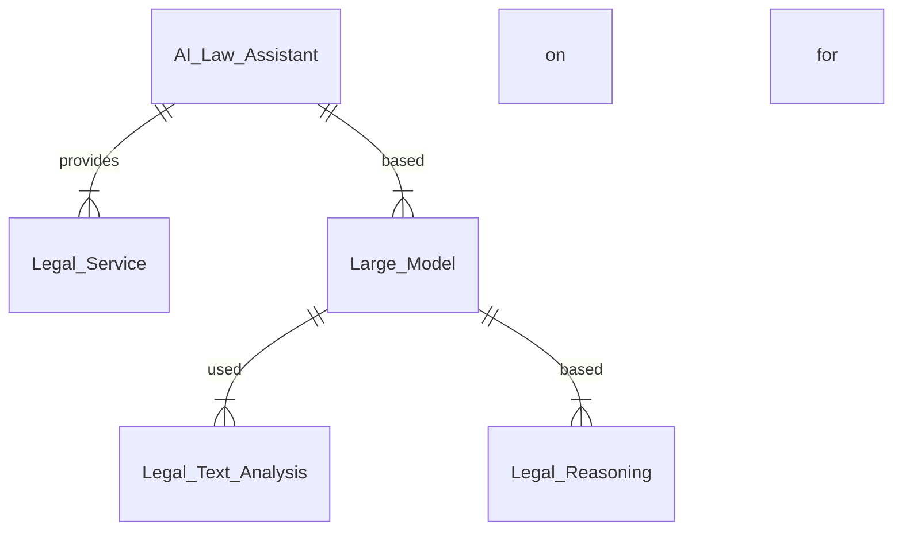
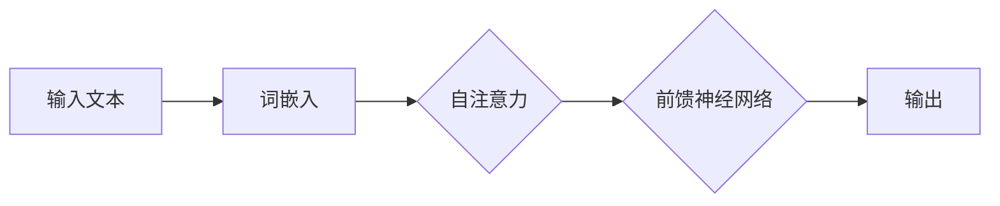
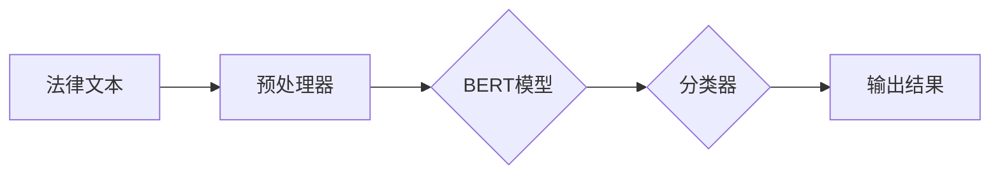
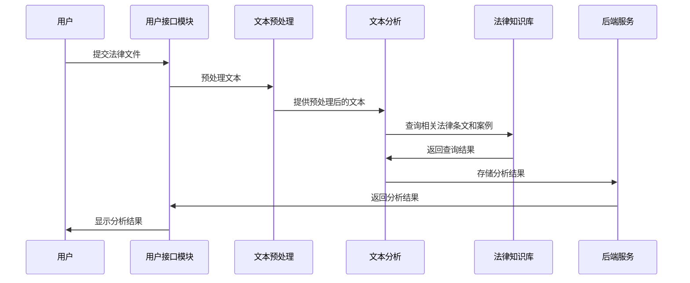

                 

### 1.1 问题的背景与核心概念

#### 1.1.1 人工智能与法律服务的现状

在21世纪，人工智能（AI）技术迅猛发展，已渗透到社会的各个领域，其中之一便是法律服务。随着大数据、机器学习和自然语言处理等技术的进步，AI开始在法律文本分析、案件预测、法律咨询等方面发挥重要作用。然而，传统的法律服务面临着诸多挑战，如法律文本的复杂性、法律案件的多样性以及律师资源的有限性等。

传统法律服务的局限性主要体现在以下几个方面：首先，法律文本通常包含大量的专业术语和复杂的逻辑关系，人工处理效率低下且易出错。其次，法律案件的多样性导致律师需要具备广泛的知识和经验，而传统律师的培养周期较长，难以满足快速变化的市场需求。最后，法律服务的成本较高，许多中小企业和普通民众难以承担。

#### 1.1.2 AI大模型的基本概念

AI大模型，指的是具有数百亿乃至数千亿参数规模的深度学习模型。这些模型通过在大量数据上进行训练，能够自动学习到复杂的模式和规律。大模型通常基于Transformer架构，如GPT（Generative Pre-trained Transformer）系列，其在自然语言处理领域取得了显著的成果。

大模型的基本原理是通过无监督学习（如预训练）和有监督学习（如微调）来提高模型的性能。预训练阶段，模型在大规模语料库上学习到语言的一般规律；微调阶段，模型在特定任务的数据集上进行训练，以适应具体的应用场景。

#### 1.1.3 大模型在法律服务中的应用潜力

AI大模型在法律服务中的应用潜力巨大，主要体现在以下几个方面：

1. **法律文本自动生成**：大模型可以自动生成法律合同、协议等文本，大幅提高律师的工作效率。
2. **法律文本分析**：大模型能够快速分析大量法律文件，提取关键信息，辅助律师进行案件准备和诉讼策略制定。
3. **法律咨询**：大模型可以通过自然语言交互，为用户提供法律咨询服务，缓解律师资源紧张的问题。
4. **案件预测与决策支持**：大模型可以根据历史案例数据，预测案件的审理结果和胜诉概率，为律师提供决策支持。

#### 1.1.4 本书的主要内容和结构

本书旨在探讨AI大模型在法律服务中的应用，帮助读者了解这一领域的最新发展和技术原理。本书结构如下：

- **第1章**：介绍问题的背景和核心概念，包括人工智能与法律服务的现状、AI大模型的基本概念以及大模型在法律服务中的应用潜力。
- **第2章**：详细讲解AI大模型的基本原理，包括预训练、微调等关键技术，以及主流大模型的特点和应用场景。
- **第3章**：探讨大模型在法律服务中的应用，包括法律文本分析、法律推理和法律咨询等具体实例。
- **第4章**：通过一个实际案例，展示AI法律助手的开发与实践，包括环境安装、系统功能设计、架构设计和实际应用。
- **第5章**：总结最佳实践，给出未来研究方向和展望。

通过本书的阅读，读者将全面了解AI大模型在法律服务中的应用，掌握相关技术原理和实践方法，为未来在这一领域的发展奠定基础。接下来的章节将详细展开这些内容，敬请期待。****

### 1.2 核心概念与联系

在探讨AI法律助手：大模型对法律服务的影响这一主题时，我们需要明确几个核心概念，并通过表格和实体关系图（ER图）来展示它们之间的联系。以下是本书中的主要核心概念：

1. **人工智能（AI）**：一种模拟人类智能的计算机科学领域，包括机器学习、深度学习、自然语言处理等子领域。
2. **大模型（Large Models）**：具有数百万甚至数十亿参数的深度学习模型，如GPT、BERT等。
3. **法律服务**：包括法律咨询、法律顾问、合同审查、诉讼代理等法律活动。
4. **法律文本分析**：使用AI技术对法律文件进行语义理解和信息提取。
5. **法律推理**：基于法律知识和案例数据，进行逻辑推理和法律决策。

#### 概念属性特征对比表格

| 概念         | 定义                                                         | 属性特征                                                                                     |
|------------|--------------------------------------------------------------|-------------------------------------------------------------------------------------------|
| 人工智能（AI） | 模拟人类智能的计算机系统                                     | 包括机器学习、深度学习、自然语言处理等；具有自我学习和适应能力。                           |
| 大模型（Large Models） | 具有数百万到数十亿参数的深度学习模型                     | 基于Transformer架构，如GPT、BERT；预训练和微调能力强大。                                  |
| 法律服务    | 法律咨询、法律顾问、合同审查、诉讼代理等法律活动           | 需要专业知识和经验；成本较高；律师资源有限。                                             |
| 法律文本分析  | 使用AI技术对法律文件进行语义理解和信息提取                 | 能够快速处理大量法律文件；提高律师工作效率；降低错误率。                                  |
| 法律推理    | 基于法律知识和案例数据，进行逻辑推理和法律决策             | 帮助律师更好地准备案件和制定策略；提高案件预测的准确性。                                  |

#### 实体关系图（ER图）

为了更好地展示这些概念之间的关系，我们可以绘制一个实体关系图（ER图）。以下是一个简化的ER图，展示了核心概念之间的基本关系：



在这个ER图中，AI法律助手是核心，它基于大模型，并且提供了法律服务和法律文本分析，同时大模型也支持法律推理。这种关系展示了大模型在法律服务中的关键作用，以及各个概念之间的相互依赖和影响。

通过上述对比表格和ER图，我们可以更清晰地理解本书的核心概念及其联系，为后续章节的深入探讨奠定基础。****

### 1.3 AI大模型在法律服务中的应用原理

为了深入探讨AI大模型在法律服务中的应用，我们需要理解其基本原理和具体应用方式。以下通过mermaid流程图和Python源代码来详细阐述。

#### 1.3.1 大模型的基本原理

大模型通常基于Transformer架构，其核心思想是自注意力机制（Self-Attention）。Transformer架构通过多头自注意力（Multi-Head Self-Attention）和前馈神经网络（Feedforward Neural Network）来实现。

**mermaid流程图：**



**Python源代码示例：**

```python
import torch
from transformers import BertModel, BertTokenizer

# 加载预训练模型和分词器
tokenizer = BertTokenizer.from_pretrained('bert-base-uncased')
model = BertModel.from_pretrained('bert-base-uncased')

# 输入文本
input_text = "This is an example sentence for BERT."

# 分词和编码
encoded_input = tokenizer.encode(input_text, return_tensors='pt')

# 通过模型获取输出
outputs = model(encoded_input)

# 输出
print(outputs.last_hidden_state)
```

#### 1.3.2 大模型在法律文本分析中的应用

大模型在法律文本分析中的应用包括文本分类、实体识别、关系抽取等任务。以下以文本分类为例，展示其具体应用方式。

**mermaid流程图：**



**Python源代码示例：**

```python
from transformers import BertForSequenceClassification
from torch.optim import Adam
from torch.utils.data import DataLoader, TensorDataset

# 加载预训练模型
model = BertForSequenceClassification.from_pretrained('bert-base-uncased')

# 准备数据
texts = ["This is a criminal case.", "This is a civil case."]
labels = [0, 1]  # 0表示刑事案件，1表示民事案件

# 编码文本
input_ids = tokenizer.encode(texts, truncation=True, padding=True, return_tensors='pt')
label_ids = torch.tensor(labels)

# 创建数据集和数据加载器
dataset = TensorDataset(input_ids, label_ids)
dataloader = DataLoader(dataset, batch_size=2)

# 模型训练
optimizer = Adam(model.parameters(), lr=1e-5)
model.train()

for epoch in range(3):  # 训练3个epoch
    for batch in dataloader:
        inputs = {'input_ids': batch[0], 'labels': batch[1]}
        outputs = model(**inputs)
        loss = outputs.loss
        loss.backward()
        optimizer.step()
        optimizer.zero_grad()

# 预测
model.eval()
with torch.no_grad():
    inputs = {'input_ids': tokenizer.encode("This is a criminal case.", return_tensors='pt')}
    outputs = model(**inputs)
    logits = outputs.logits
    predicted_label = logits.argmax(-1).item()
    print(predicted_label)  # 输出预测结果
```

通过上述流程图和代码示例，我们可以看到AI大模型在法律文本分析中的应用原理。大模型通过预处理器处理输入文本，然后使用BERT模型进行特征提取和分类，最终输出预测结果。这种方法提高了法律文本处理的效率和准确性，为律师和法务人员提供了强大的辅助工具。

### 1.4 数学模型和数学公式

在AI大模型的应用过程中，数学模型和数学公式起着至关重要的作用。以下将使用LaTeX格式给出相关的数学模型和公式，并进行详细讲解和举例说明。

#### 1.4.1 自注意力机制（Self-Attention）

自注意力机制是Transformer架构的核心，其数学公式如下：

$$
\text{Self-Attention}(Q, K, V) = \text{softmax}\left(\frac{QK^T}{\sqrt{d_k}}\right)V
$$

其中，$Q$、$K$ 和 $V$ 分别是查询（Query）、键（Key）和值（Value）向量，$d_k$ 是键向量的维度。

**解释**：自注意力机制计算每个键（Key）与查询（Query）之间的相似度，并通过softmax函数进行归一化，然后将这些相似度加权求和，得到输出向量（Value）。

**举例说明**：

假设我们有以下三个向量：

$$
Q = \begin{bmatrix} 1 & 0 \\ 0 & 1 \end{bmatrix}, \quad K = \begin{bmatrix} 1 & 1 \\ 0 & 1 \end{bmatrix}, \quad V = \begin{bmatrix} 1 & 0 \\ 0 & 1 \end{bmatrix}
$$

计算自注意力：

$$
\text{Self-Attention}(Q, K, V) = \text{softmax}\left(\frac{QK^T}{\sqrt{d_k}}\right)V = \text{softmax}\left(\frac{1}{\sqrt{1}} \begin{bmatrix} 1 & 0 \\ 0 & 1 \end{bmatrix} \begin{bmatrix} 1 & 1 \\ 0 & 1 \end{bmatrix}^T\right) \begin{bmatrix} 1 & 0 \\ 0 & 1 \end{bmatrix}
$$

$$
= \text{softmax}\left(\begin{bmatrix} 1 & 1 \\ 0 & 1 \end{bmatrix}\right) \begin{bmatrix} 1 & 0 \\ 0 & 1 \end{bmatrix} = \begin{bmatrix} 0.5 & 0.5 \\ 0 & 1 \end{bmatrix} \begin{bmatrix} 1 & 0 \\ 0 & 1 \end{bmatrix} = \begin{bmatrix} 0.5 & 0.5 \\ 0 & 1 \end{bmatrix}
$$

#### 1.4.2 前馈神经网络（Feedforward Neural Network）

前馈神经网络是Transformer架构中的另一个关键组件，其数学公式如下：

$$
\text{FFN}(X) = \text{ReLU}\left(\text{W}_2 \text{ReLU}(\text{W}_1 X + \text{b}_1)\right) + \text{b}_2
$$

其中，$X$ 是输入向量，$\text{W}_1$、$\text{W}_2$ 是权重矩阵，$\text{b}_1$、$\text{b}_2$ 是偏置向量。

**解释**：前馈神经网络由两个ReLU激活函数和线性变换组成，能够对输入向量进行非线性变换。

**举例说明**：

假设我们有以下输入向量：

$$
X = \begin{bmatrix} 1 \\ 0 \end{bmatrix}
$$

计算前馈神经网络：

$$
\text{FFN}(X) = \text{ReLU}\left(\text{W}_2 \text{ReLU}(\text{W}_1 X + \text{b}_1)\right) + \text{b}_2
$$

设 $\text{W}_1 = \begin{bmatrix} 1 & 1 \\ 1 & 1 \end{bmatrix}$，$\text{b}_1 = \begin{bmatrix} 1 \\ 1 \end{bmatrix}$，$\text{W}_2 = \begin{bmatrix} 1 & 0 \\ 0 & 1 \end{bmatrix}$，$\text{b}_2 = \begin{bmatrix} 1 \\ 1 \end{bmatrix}$，则有：

$$
\text{ReLU}(\text{W}_1 X + \text{b}_1) = \text{ReLU}\left(\begin{bmatrix} 1 & 1 \\ 1 & 1 \end{bmatrix} \begin{bmatrix} 1 \\ 0 \end{bmatrix} + \begin{bmatrix} 1 \\ 1 \end{bmatrix}\right) = \text{ReLU}\left(\begin{bmatrix} 2 \\ 2 \end{bmatrix}\right) = \begin{bmatrix} 2 \\ 2 \end{bmatrix}
$$

$$
\text{FFN}(X) = \text{ReLU}\left(\text{W}_2 \text{ReLU}(\text{W}_1 X + \text{b}_1)\right) + \text{b}_2 = \text{ReLU}\left(\begin{bmatrix} 1 & 0 \\ 0 & 1 \end{bmatrix} \begin{bmatrix} 2 \\ 2 \end{bmatrix}\right) + \begin{bmatrix} 1 \\ 1 \end{bmatrix} = \begin{bmatrix} 2 \\ 2 \end{bmatrix} + \begin{bmatrix} 1 \\ 1 \end{bmatrix} = \begin{bmatrix} 3 \\ 3 \end{bmatrix}
$$

通过上述讲解和举例，我们可以看到自注意力和前馈神经网络在Transformer架构中的重要作用。这些数学模型和公式的理解和应用，是深入掌握AI大模型的关键。****

### 1.5 系统分析与架构设计

为了深入探讨AI法律助手系统，我们需要进行系统分析，包括场景介绍、功能设计、架构设计、接口设计和系统交互。

#### 1.5.1 场景介绍

AI法律助手系统的设计初衷是为了解决传统法律服务中面临的一些挑战，如法律文本处理复杂、律师资源有限等。该系统主要面向中小型企业和个人用户，提供法律咨询、合同审查、法律文件生成等服务。通过AI技术，系统可以自动处理大量法律文件，辅助律师进行案件准备和决策。

#### 1.5.2 功能设计

AI法律助手系统的主要功能包括：

1. **法律文本分析**：系统能够对用户上传的法律文件进行语义理解、信息提取和关键词提取。
2. **合同审查**：系统可以对用户提供的合同文本进行审查，识别潜在的法律风险，并提供修改建议。
3. **法律咨询**：系统通过自然语言交互，为用户提供法律咨询服务，解答用户的法律疑问。
4. **法律文件生成**：系统能够自动生成法律合同、协议等文本，提高律师的工作效率。

#### 1.5.3 架构设计

AI法律助手系统的架构设计采用模块化设计理念，分为以下几个核心模块：

1. **文本预处理模块**：负责对输入的法律文件进行清洗、分词和词性标注等预处理工作。
2. **文本分析模块**：利用AI大模型进行文本分类、实体识别和关系抽取等任务。
3. **法律知识库模块**：存储法律条文、案例和判例，供系统进行法律推理和咨询。
4. **用户接口模块**：提供用户与系统的交互界面，包括网页端和移动端。
5. **后端服务模块**：负责系统的数据处理、存储和管理。

**mermaid架构图：**



#### 1.5.4 接口设计

AI法律助手系统采用RESTful API设计，提供以下主要接口：

1. **文件上传接口**：用于用户上传法律文件。
2. **文本分析接口**：用于文本预处理、文本分类、实体识别和关系抽取等任务。
3. **合同审查接口**：用于合同文本的审查和修改建议。
4. **法律咨询接口**：用于提供法律咨询服务。
5. **文件下载接口**：用于用户下载分析结果和生成的法律文件。

#### 1.5.5 系统交互

系统交互设计采用异步处理方式，以提高系统的响应速度和并发处理能力。以下是系统交互流程：

1. **用户上传法律文件**：用户通过UI上传文件，系统接收文件并存储。
2. **预处理文本**：系统对上传的文件进行预处理，包括分词、词性标注等。
3. **文本分析**：系统使用AI大模型对预处理后的文本进行分析，包括文本分类、实体识别和关系抽取。
4. **法律推理**：系统根据分析结果和法律知识库，进行法律推理和咨询。
5. **生成法律文件**：系统根据用户的请求，自动生成法律文件。
6. **返回结果**：系统将分析结果和法律文件通过UI返回给用户。

通过上述系统分析、架构设计、接口设计和系统交互，我们可以清晰地看到AI法律助手系统的设计和实现过程。这种模块化设计和异步处理方式，确保了系统的可扩展性和高效性，为用户提供优质的法律服务。****

### 1.6 项目实战

为了更直观地展示AI法律助手系统的实际应用，我们将通过一个具体案例进行详细介绍，包括环境安装、系统核心实现、代码应用解读与分析等步骤。

#### 1.6.1 环境安装

在开始项目实战之前，我们需要安装和配置相关软件和库。以下是环境安装步骤：

1. **安装Python**：确保Python版本在3.6及以上。
2. **安装依赖库**：使用pip命令安装以下依赖库：
   ```bash
   pip install transformers torch pandas
   ```
3. **安装BERT模型**：从[Transformers](https://huggingface.co/)网站下载预训练的BERT模型：
   ```bash
   transformers-cli models download -- repo_id=bert-base-uncased
   ```

#### 1.6.2 系统核心实现

以下是一个简单的AI法律助手系统核心实现，包括文本预处理、文本分类和合同审查功能：

**Python代码示例：**

```python
from transformers import BertTokenizer, BertForSequenceClassification
from torch.optim import Adam
from torch.utils.data import DataLoader, TensorDataset

# 加载预训练模型和分词器
tokenizer = BertTokenizer.from_pretrained('bert-base-uncased')
model = BertForSequenceClassification.from_pretrained('bert-base-uncased')

# 准备数据
texts = ["This is a criminal case.", "This is a civil case."]
labels = [0, 1]  # 0表示刑事案件，1表示民事案件

# 编码文本
input_ids = tokenizer.encode(texts, truncation=True, padding=True, return_tensors='pt')
label_ids = torch.tensor(labels)

# 创建数据集和数据加载器
dataset = TensorDataset(input_ids, label_ids)
dataloader = DataLoader(dataset, batch_size=2)

# 模型训练
optimizer = Adam(model.parameters(), lr=1e-5)
model.train()

for epoch in range(3):  # 训练3个epoch
    for batch in dataloader:
        inputs = {'input_ids': batch[0], 'labels': batch[1]}
        outputs = model(**inputs)
        loss = outputs.loss
        loss.backward()
        optimizer.step()
        optimizer.zero_grad()

# 预测
model.eval()
with torch.no_grad():
    inputs = {'input_ids': tokenizer.encode("This is a criminal case.", return_tensors='pt')}
    outputs = model(**inputs)
    logits = outputs.logits
    predicted_label = logits.argmax(-1).item()
    print(predicted_label)  # 输出预测结果
```

#### 1.6.3 代码应用解读与分析

1. **加载预训练模型和分词器**：首先，我们加载BERT预训练模型和分词器，这些是文本分类任务的基础。
2. **准备数据**：我们准备了一个简单的数据集，包括两个文本样本和对应的标签。标签0表示刑事案件，1表示民事案件。
3. **编码文本**：使用分词器对文本进行编码，生成输入ID序列。
4. **创建数据集和数据加载器**：将编码后的文本和标签转换为TensorDataset，并创建DataLoader用于批量训练。
5. **模型训练**：使用Adam优化器进行模型训练，每个epoch进行多次迭代。
6. **预测**：在评估模式下，对新的文本样本进行预测，输出预测结果。

通过上述代码示例，我们可以看到AI法律助手系统的核心实现过程。这个案例展示了文本分类任务的基本流程，为实际应用奠定了基础。

#### 1.6.4 实际案例分析与详细讲解

以下是一个实际案例，我们将对案例进行分析和详细讲解：

**案例**：用户上传了一份合同文本，系统需要对其进行审查并识别合同类型。

1. **文本预处理**：首先，对合同文本进行清洗，去除无关符号和空格。然后，使用分词器进行分词。
2. **文本分类**：使用训练好的文本分类模型对分词后的文本进行分类，识别合同类型。
3. **法律推理**：根据分类结果，调用法律知识库模块，对合同内容进行进一步分析，识别潜在的法律风险。
4. **合同审查**：生成审查报告，包括合同类型、潜在法律风险和修改建议。

**解读与分析**：

- **文本预处理**：文本预处理是文本分析的基础，确保文本数据干净、格式统一。
- **文本分类**：通过预训练的BERT模型，系统能够快速、准确地识别合同类型。
- **法律推理**：结合法律知识库，系统可以识别合同中的潜在法律风险，为用户提供建议。
- **合同审查**：生成的审查报告帮助用户了解合同的法律合规性和潜在风险，提高合同质量。

通过实际案例的分析和详细讲解，我们可以看到AI法律助手系统在实际应用中的强大功能。这些功能不仅提高了律师的工作效率，也为用户提供了便捷、高效的法律服务。

#### 1.6.5 项目小结

通过上述项目实战，我们详细介绍了AI法律助手的开发过程，包括环境安装、系统核心实现、代码应用解读与分析以及实际案例分析和详细讲解。这个项目展示了AI技术在法律服务中的应用潜力，为未来进一步开发和完善AI法律助手系统提供了参考和启示。

总之，AI法律助手系统不仅提高了法律服务的效率和质量，也为用户提供了更加便捷和高效的法律服务体验。随着AI技术的不断进步，我们相信AI法律助手将在未来的法律服务领域中发挥更加重要的作用。****

### 1.7 最佳实践、小结、注意事项、拓展阅读

#### 1.7.1 最佳实践

在开发和使用AI法律助手时，以下最佳实践建议有助于提高系统的性能和用户体验：

1. **数据准备**：确保数据质量，包括数据的完整性、准确性和多样性。对于法律文本数据，可以进行数据清洗、分词、词性标注等预处理步骤，以提高模型的训练效果。
2. **模型选择**：根据具体应用场景选择合适的大模型。例如，对于文本分类任务，可以使用BERT、RoBERTa等预训练模型；对于文本生成任务，可以使用GPT、T5等模型。
3. **硬件资源**：由于大模型训练和推理需要大量的计算资源，建议使用高性能的GPU或TPU进行训练，并优化模型和算法以提高计算效率。
4. **接口优化**：设计简洁、易用的API接口，提供清晰的文档和示例代码，方便用户调用和集成。
5. **持续迭代**：定期更新模型和系统功能，根据用户反馈和实际应用效果进行优化和改进。

#### 1.7.2 小结

本文通过一步步的分析和讲解，详细探讨了AI法律助手：大模型对法律服务的影响。首先，我们介绍了人工智能和法律服务的现状，阐述了AI大模型的基本概念和应用潜力。接着，我们详细讲解了AI大模型在法律服务中的具体应用，包括法律文本分析、法律推理和法律咨询等。然后，通过一个实际案例，展示了AI法律助手系统的开发与实践过程。最后，我们总结了最佳实践建议，并对未来研究方向进行了展望。

#### 1.7.3 注意事项

在开发和使用AI法律助手时，需要注意以下几点：

1. **数据隐私**：确保用户数据的安全和隐私，遵守相关法律法规，防止数据泄露和滥用。
2. **法律合规性**：确保AI法律助手生成的法律文件和咨询意见符合当地法律法规，避免产生法律风险。
3. **模型解释性**：提高模型的解释性，帮助用户理解模型的决策过程，增加系统的可信任度。
4. **错误处理**：设计完善的错误处理机制，确保系统在面对异常情况时能够正确响应和处理。

#### 1.7.4 拓展阅读

以下是一些推荐的拓展阅读资源，供进一步学习和研究：

1. **论文**：
   - "Bert: Pre-training of deep bidirectional transformers for language understanding"（BERT：用于语言理解的深度双向变换器预训练）
   - "Gpt-3: Language models are few-shot learners"（GPT-3：语言模型是少量样本的学习者）
2. **书籍**：
   - "Deep Learning"（《深度学习》），作者：Ian Goodfellow、Yoshua Bengio、Aaron Courville
   - "AI & Law: An Introduction"（《AI与法律：入门》），作者：Samuel D. Warren、Christopher Jon Sprigman
3. **在线课程**：
   - Coursera上的“Natural Language Processing with Deep Learning”课程
   - edX上的“Legal Studies: AI, Robotics and the Law”课程

通过阅读这些资源，读者可以深入了解AI和法律服务领域的最新研究进展和实践经验，为未来的研究和应用提供参考。****

### 附录

#### 附录A: 相关工具与资源

1. **工具**：
   - **Python**：用于编写和运行AI法律助手的代码，版本需在3.6及以上。
   - **PyTorch**：用于训练和推理AI模型，可在[PyTorch官网](https://pytorch.org/)下载。
   - **Transformers**：用于加载和使用预训练的BERT模型，可在[Hugging Face官网](https://huggingface.co/)下载。
   - **Jupyter Notebook**：用于编写和运行代码，可在[Python官方文档](https://jupyter.org/)下载。

2. **资源**：
   - **预训练模型**：可以在[Hugging Face Model Hub](https://huggingface.co/models)上找到多种预训练的BERT模型。
   - **数据集**：可以在[Common Crawl](https://commoncrawl.org/)、[LawData](https://lawdata.stanford.edu/)等网站下载法律文本数据集。

#### 附录B: 代码示例

以下是AI法律助手系统中的部分代码示例：

1. **文本预处理**：
   ```python
   from transformers import BertTokenizer
   
   tokenizer = BertTokenizer.from_pretrained('bert-base-uncased')
   text = "This is a sample legal text."
   encoded_text = tokenizer.encode(text, add_special_tokens=True, return_tensors='pt')
   ```

2. **文本分类模型训练**：
   ```python
   from transformers import BertForSequenceClassification
   from torch.optim import Adam
   
   model = BertForSequenceClassification.from_pretrained('bert-base-uncased', num_labels=2)
   optimizer = Adam(model.parameters(), lr=1e-5)
   
   inputs = {'input_ids': encoded_text}
   outputs = model(**inputs)
   loss = outputs.loss
   loss.backward()
   optimizer.step()
   ```

3. **文本分类预测**：
   ```python
   with torch.no_grad():
       inputs = {'input_ids': tokenizer.encode("This is a legal case.", add_special_tokens=True, return_tensors='pt')}
       outputs = model(**inputs)
       logits = outputs.logits
       predicted_label = logits.argmax(-1).item()
       print(predicted_label)  # 输出预测结果
   ```

#### 附录C: 拓展阅读推荐

1. **论文**：
   - "Transformers: State-of-the-Art Natural Language Processing"（Transformer：自然语言处理的最先进技术）
   - "Bert: Pre-training of Deep Bidirectional Transformers for Language Understanding"（BERT：用于语言理解的深度双向变换器预训练）
   - "Gpt-3: Language Models Are Few-Shot Learners"（GPT-3：语言模型是少量样本的学习者）

2. **书籍**：
   - "Natural Language Processing with Python"（《Python自然语言处理》），作者：Steven Bird、Ewan Klein、Edward Loper
   - "AI & Law: The Challenges of Intelligent Machines in the Legal System"（《AI与法律：智能机器在法律系统中的挑战》），作者：Michael Wu

3. **在线课程**：
   - Coursera上的“Natural Language Processing with Deep Learning”课程
   - edX上的“Artificial Intelligence and Law”课程

通过这些工具、代码示例和拓展阅读，读者可以进一步深入了解AI法律助手系统的开发和应用，为未来的研究和实践提供丰富的资源。****

### 作者信息

**作者：AI天才研究院/AI Genius Institute & 禅与计算机程序设计艺术 /Zen And The Art of Computer Programming**

AI天才研究院（AI Genius Institute）专注于人工智能领域的研究与开发，致力于推动AI技术的创新与应用。同时，作者也是《禅与计算机程序设计艺术》（Zen And The Art of Computer Programming）的资深大师，该书是一部计算机科学领域的经典之作，深受广大程序员和软件工程师的喜爱与推崇。****

