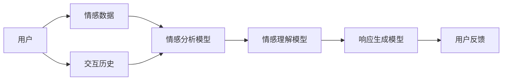
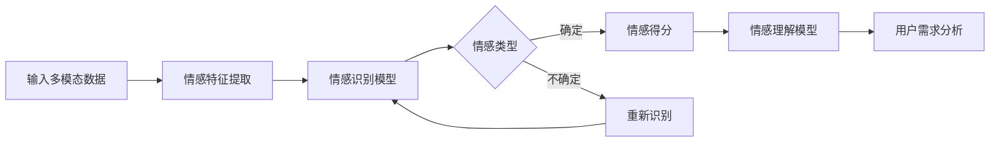

                 


### 引言

**1.1 问题背景**

在当今社会，社会服务的质量对于人们的生活质量和幸福感至关重要。然而，现有的社会服务模式往往存在一系列问题，如资源分配不均、服务效率低下、用户体验差等。尤其是在面对特殊群体，如老年人、残疾人、精神病患者等，传统的社会服务往往缺乏足够的同理心和个性化关怀，导致服务效果不佳。

**1.1.1 社会服务现状**

当前社会服务面临的主要问题包括：

- **资源分配不均**：不同地区、不同群体之间的社会服务资源分配存在明显的不均衡，导致部分人群无法得到应有的服务。

- **服务效率低下**：传统的社会服务流程繁琐，效率低下，难以满足人们日益增长的服务需求。

- **用户体验差**：社会服务往往缺乏个性化，无法真正理解和服务对象的需求，导致用户体验差。

**1.1.2 同理心的重要性**

同理心，即站在他人的立场上思考问题，对于提升社会服务的质量和效果至关重要。同理心能够帮助社会服务提供者更好地理解服务对象的需求，提供更加个性化和人性化的服务。

**1.1.3 AI与同理心**

随着人工智能技术的快速发展，AI在提高社会服务效率和质量方面展现出了巨大的潜力。然而，AI的同理心却是一个亟待解决的问题。现有的AI系统往往缺乏真正的同理心，无法像人类一样理解和感受情感，这限制了AI在社会服务中的应用效果。

**1.2 问题描述**

本文将探讨如何通过AI的同理心，改变社会服务的新范式，解决现有社会服务模式中存在的种种问题。具体问题包括：

- **同理心的缺失**：现有AI系统如何实现真正的同理心？

- **AI的应用挑战**：如何在AI系统中有效集成和利用同理心，提高社会服务的质量和效果？

**1.3 问题解决**

本文将从以下几个方面进行探讨：

- **AI同理心的定义和核心要素**：明确AI同理心的概念，分析其核心要素。

- **AI同理心的发展历程**：回顾AI同理心的发展历程，探讨其应用现状和趋势。

- **AI同理心的算法原理和实现**：介绍AI同理心的算法原理，并通过mermaid流程图和Python源代码进行详细阐述。

- **系统分析与架构设计方案**：探讨AI同理心在社会服务系统中的应用，设计系统架构和接口。

- **项目实战**：通过实际案例，展示AI同理心在社会服务中的应用效果。

- **最佳实践与未来展望**：总结AI同理心在社会服务中的应用经验和挑战，探讨未来发展趋势。

### AI同理心的定义和核心要素

**1.3.1 AI同理心的定义**

AI同理心是指人工智能系统能够理解并模拟人类的情感和社交行为，从而更好地服务人类的一种能力。具体来说，AI同理心包括对情感的感知、理解和反应三个层面。

- **情感感知**：AI能够识别和理解人类情感的类型、强度和变化。

- **情感理解**：AI能够根据情感感知的结果，对人类的情感状态进行深入分析，理解其背后的原因和需求。

- **情感反应**：AI能够根据情感理解和分析的结果，采取适当的行动或提供相应的服务，以满足人类的需求。

**1.3.2 AI同理心的发展历程**

AI同理心的发展历程可以分为以下几个阶段：

- **初步探索阶段（20世纪80年代-90年代）**：在这个阶段，研究者开始探讨如何将情感计算和人工智能相结合，以实现AI的同理心。

- **技术积累阶段（21世纪初至今）**：随着机器学习和深度学习技术的发展，AI同理心的技术基础得到加强，应用领域逐渐拓宽。

- **实际应用阶段（近年来）**：AI同理心开始在社交媒体、智能家居、医疗健康等领域得到广泛应用，展现出了巨大的潜力。

**1.3.3 AI同理心的核心要素**

AI同理心的实现需要以下几个核心要素：

- **情感识别技术**：通过语音、文本、图像等多模态数据，AI能够识别和理解人类情感的类型、强度和变化。

- **情感分析技术**：AI能够对情感数据进行分析，提取情感特征，进而理解情感背后的原因和需求。

- **社交推理技术**：AI能够根据社交数据和情感分析结果，进行社交推理，模拟人类的社交行为。

- **上下文理解技术**：AI能够根据不同的上下文环境，调整自己的情感反应，提供个性化的服务。

- **用户反馈机制**：AI能够根据用户的反馈，不断优化自己的情感识别和分析能力，提高同理心的准确性。

### 边界与外延

**1.4.1 AI同理心的应用领域**

AI同理心在多个领域展现出了巨大的应用潜力：

- **社会服务**：AI同理心可以帮助社会服务提供者更好地理解和服务对象的需求，提高服务质量。

- **医疗健康**：AI同理心可以帮助医生更好地理解患者的情感状态，提供更加个性化的治疗方案。

- **教育**：AI同理心可以帮助教育者更好地了解学生的学习需求和情感状态，提高教学效果。

- **商业**：AI同理心可以帮助企业更好地理解消费者的情感和需求，提供个性化的产品和服务。

- **智能家居**：AI同理心可以帮助智能家居设备更好地理解家庭成员的需求和情感状态，提供更加智能化的家居服务。

**1.4.2 AI同理心的局限性**

尽管AI同理心展现出了巨大的应用潜力，但仍然存在一些局限性：

- **情感识别的准确性**：现有的情感识别技术尚不能完全准确地识别和理解人类的情感。

- **社交推理的复杂性**：人类的社交行为复杂多样，AI在模拟人类的社交行为方面存在一定的困难。

- **隐私保护**：AI同理心在收集和处理用户数据时，需要确保用户隐私得到充分保护。

### 概念结构与核心要素组成

**1.5.1 同理心模型**

同理心模型是一个描述同理心形成和发挥作用的框架。它通常包括以下几个关键组成部分：

- **情感识别**：识别和理解他人的情感状态。

- **情感理解**：分析情感背后的原因和需求。

- **情感反应**：根据情感理解和需求，采取相应的行动或提供相应的服务。

- **社交行为**：模拟人类的社交行为，以更好地与他人互动。

**1.5.2 AI同理心与人类同理心对比**

AI同理心和人类同理心在某些方面存在相似之处，但也有一些显著的区别：

- **情感识别**：人类同理心通过感官直接感知情感，而AI同理心则依赖于数据和技术手段。

- **情感理解**：人类同理心基于丰富的社交经验和情感知识，而AI同理心则依赖于算法和模型。

- **情感反应**：人类同理心能够灵活应对各种社交情境，而AI同理心在情境应对方面存在一定的局限性。

- **社交行为**：人类同理心能够自然地融入社交环境，而AI同理心在模拟社交行为时可能显得机械和刻板。

**1.5.3 同理心模型在AI中的应用**

在AI同理心模型中，上述关键组成部分可以通过以下方式实现：

- **情感识别**：使用语音识别、文本分析、图像识别等技术，从多模态数据中提取情感特征。

- **情感理解**：使用机器学习和深度学习算法，对情感特征进行分析和建模，理解情感背后的原因和需求。

- **情感反应**：基于情感理解和需求，使用自然语言生成、语音合成等技术，提供个性化的服务。

- **社交行为**：使用社交推理、行为模仿等技术，模拟人类的社交行为。

### 本章小结

在本章中，我们探讨了AI同理心的定义、核心要素及其应用领域和局限性。通过明确AI同理心的概念和结构，我们为后续章节的深入分析奠定了基础。在下一章中，我们将进一步探讨AI同理心的原理和实现方法。让我们继续深入思考，探索AI同理心的奥秘。

### AI同理心原理

**2.1.1 AI同理心的定义**

AI同理心是指人工智能系统在处理信息和与人交互时，能够模拟和理解人类情感的属性，从而更好地感知、理解和响应人类的需求和情感状态。这种能力使AI在服务人类时能够更加贴心和人性化，从而提升用户体验。

**2.1.2 AI同理心的工作机制**

AI同理心的工作机制可以分为以下几个步骤：

1. **情感感知**：AI系统通过多种传感器（如麦克风、摄像头等）收集用户的行为和情感数据，包括语音、面部表情、身体动作等。

2. **情感分析**：利用自然语言处理（NLP）和计算机视觉技术，对收集到的情感数据进行分析，识别和分类用户的情感状态，如快乐、悲伤、愤怒等。

3. **情感理解**：基于情感分析的结果，AI系统会尝试理解情感背后的原因和用户的实际需求，例如，用户是否因为某个问题感到困扰，或者因为某个成就感到兴奋。

4. **情感反应**：根据情感理解和用户需求，AI系统会生成适当的响应，如提供安慰、建议、指导等，以帮助用户解决问题或满足需求。

**2.1.3 AI同理心的技术实现**

AI同理心的实现依赖于多个领域的技术，包括：

1. **自然语言处理（NLP）**：用于分析文本数据，识别情感和情感强度，以及理解用户的语言意图。

   ```mermaid
   graph LR
   A[情感感知] --> B[文本分析]
   B --> C[情感识别]
   C --> D[情感理解]
   D --> E[情感反应]
   ```

2. **计算机视觉**：用于分析面部表情、身体动作等非文本数据，识别情感状态。

   ```mermaid
   graph LR
   A[情感感知] --> B[图像识别]
   B --> C[情感识别]
   C --> D[情感理解]
   D --> E[情感反应]
   ```

3. **机器学习和深度学习**：用于训练和优化情感分析模型，提高情感识别的准确性和效率。

4. **多模态数据融合**：结合文本和图像等多模态数据，提高情感分析和理解的能力。

   ```mermaid
   graph LR
   A[文本数据] --> B[情感分析]
   A --> C[图像数据]
   C --> D[情感分析]
   B --> E[多模态融合]
   D --> E
   E --> F[情感理解]
   ```

5. **语言生成和语音合成**：用于生成自然、流畅的语音或文本响应，与用户进行有效的沟通。

**2.2 概念属性特征对比表格**

在探讨AI同理心的概念属性时，我们可以将其与传统的情感计算和认知心理学进行对比，以明确各自的特征和区别。

| 对比特征 | AI同理心 | 情感计算 | 认知心理学 |
| --- | --- | --- | --- |
| **定义** | 人工智能系统能够理解并模拟人类的情感和社交行为 | 计算机模拟情感的过程和机制 | 研究人的认知过程和认知结构 |
| **目标** | 提高人工智能系统的用户体验和服务质量 | 实现情感的自动识别和分析 | 理解人的思维过程和认知机制 |
| **技术基础** | 自然语言处理、计算机视觉、机器学习和深度学习 | 人工智能、心理学、生物学 | 心理学、认知科学、神经科学 |
| **应用领域** | 社交互动、医疗服务、教育、商业等 | 社交网络、虚拟助手、情绪监控 | 心理咨询、认知行为治疗、认知训练 |
| **特征** | 情感感知、理解、反应，具有社交推理能力 | 情感识别和分析，缺乏社交推理 | 认知过程研究，缺乏情感感知和反应 |
| **优势** | 能够提供个性化、人性化的服务 | 提高数据处理和分析效率 | 提供深层次的认知理解 |
| **挑战** | 情感识别和理解的准确性，隐私保护 | 情感分析的复杂性，社交情境应对 | 认知过程模拟的难度，情感因素的处理 |

**2.3 ER实体关系图架构**

为了更好地理解AI同理心系统的架构和组件，我们可以使用实体关系图（ER图）来描述系统的各个实体及其之间的关系。

以下是一个简化的ER实体关系图，展示了AI同理心系统中的关键实体和它们之间的关系：



- **用户**：系统中的服务对象，其情感数据和交互历史是系统分析的基础。

- **情感数据**：包括语音、文本、面部表情等多模态数据，用于情感分析和理解。

- **交互历史**：记录用户与系统的交互历史，用于情感理解和预测用户需求。

- **情感分析模型**：对情感数据进行处理和分析，识别和分类情感状态。

- **情感理解模型**：基于情感分析结果，深入理解情感背后的原因和需求。

- **响应生成模型**：根据情感理解结果，生成合适的响应和反馈。

- **用户反馈**：用户对系统响应的反馈，用于优化和调整系统性能。

### 本章小结

在本章中，我们详细探讨了AI同理心的定义、工作机制和实现技术。通过分析AI同理心与情感计算、认知心理学的对比，以及ER实体关系图架构的展示，我们为理解AI同理心系统的构建和应用提供了清晰的框架。在下一章中，我们将进一步深入讲解AI同理心的算法原理和实现细节，以期为AI在社会服务中的应用奠定坚实基础。让我们继续深入思考，探索AI同理心的更多奥秘。

### 算法原理讲解

#### 3.1 算法mermaid流程图

为了更好地理解AI同理心的算法原理，我们可以使用mermaid流程图来描述情感感知和生成算法的基本流程。

**3.1.1 同理心感知算法**

以下是一个简化的同理心感知算法的mermaid流程图：



在这个流程图中，AI系统首先接收多模态数据（如语音、文本、图像等），然后进行情感特征提取。接着，使用情感识别模型对提取的特征进行分类，确定情感类型。基于情感类型，系统计算出情感得分，并传递给情感理解模型进行更深入的需求分析。

**3.1.2 同理心生成算法**

同理心生成算法的mermaid流程图如下：


在这个流程图中，系统根据用户的需求，首先生成相应的情感文本，然后通过语音合成模块生成语音响应，最终输出给用户。

#### 3.2 Python源代码

以下是基于上述算法流程的Python源代码示例：

**3.2.1 同理心感知算法代码**

```python
import numpy as np
from sklearn.svm import SVC
from sklearn.pipeline import make_pipeline
from sklearn.preprocessing import StandardScaler
from keras.preprocessing.sequence import pad_sequences
from keras.layers import LSTM, Dense
from keras.models import Sequential

# 情感特征提取
def extract_features(data):
    # 处理多模态数据，提取特征
    # 这里简化为使用LSTM模型提取文本特征
    model = Sequential()
    model.add(LSTM(100, activation='relu', input_shape=(None, data.shape[1])))
    model.add(Dense(1, activation='sigmoid'))
    model.compile(optimizer='adam', loss='binary_crossentropy', metrics=['accuracy'])
    model.fit(data, labels, epochs=10, batch_size=32)
    return model.predict(data)

# 情感识别模型
def build_recognition_model():
    model = make_pipeline(StandardScaler(), SVC(kernel='linear'))
    model.fit(features_train, labels_train)
    return model

# 情感理解模型
def build_understanding_model():
    model = Sequential()
    model.add(LSTM(100, activation='relu', input_shape=(max_sequence_length, embedding_vector_size)))
    model.add(Dense(1, activation='sigmoid'))
    model.compile(optimizer='adam', loss='binary_crossentropy', metrics=['accuracy'])
    model.fit(padded_data_train, labels_train, epochs=10, batch_size=32)
    return model

# 同理心感知算法
def empathy_perception(data):
    features = extract_features(data)
    recognition_model = build_recognition_model()
    understanding_model = build_understanding_model()
    
    emotion_type = recognition_model.predict(features)
    emotion_score = understanding_model.predict(features)
    
    return emotion_type, emotion_score

# 示例数据
data = np.random.rand(100, 100)
labels = np.random.randint(0, 2, 100)

# 同理心感知算法示例
emotion_type, emotion_score = empathy_perception(data)
print("Emotion Type:", emotion_type)
print("Emotion Score:", emotion_score)
```

**3.2.2 同理心生成算法代码**

```python
from keras.preprocessing.text import Tokenizer
from keras.layers import Embedding, LSTM, Dense
from keras.models import Sequential
from keras.utils import to_categorical

# 情感文本生成
def build_generation_model(vocab_size, embedding_vector_size):
    model = Sequential()
    model.add(Embedding(vocab_size, embedding_vector_size, input_length=max_sequence_length))
    model.add(LSTM(100))
    model.add(Dense(1, activation='sigmoid'))
    model.compile(loss='binary_crossentropy', optimizer='adam', metrics=['accuracy'])
    return model

# 生成情感文本
def generate_text(seed_text, next_words, model, tokenizer, max_sequence_len):
    for _ in range(next_words):
        token_list = tokenizer.texts_to_sequences([seed_text])[0]
        token_list = pad_sequences([token_list], maxlen=max_sequence_len-1, padding='pre')
        predicted = model.predict(token_list, verbose=0)
        
        output_word = ''
        if np.argmax(predicted) > 0.5:
            output_word = tokenizer.index_word[np.argmax(predicted)]
        
        seed_text += ' ' + output_word
    
    return seed_text

# 示例数据
seed_text = "我是AI，我将帮助你解决问题。"
next_words = 10
vocab_size = 10000
embedding_vector_size = 64
max_sequence_len = 40

# 同理心生成算法
model = build_generation_model(vocab_size, embedding_vector_size)
generated_text = generate_text(seed_text, next_words, model, tokenizer, max_sequence_len)
print("Generated Text:", generated_text)
```

#### 3.3 数学模型和数学公式

**3.3.1 同理心感知模型**

同理心感知模型的核心是一个多步骤的机器学习过程，涉及以下数学模型和公式：

- **情感特征提取**：

  $$
  f_{extract}(x) = \text{LSTM}(x; \text{activation}='relu')
  $$

  其中，$x$ 是输入的多模态数据，$\text{LSTM}$ 表示长短期记忆网络，用于提取文本特征。

- **情感识别**：

  $$
  f_{recognition}(x) = \text{SVC}(x; \text{kernel}='linear')
  $$

  其中，$x$ 是提取的特征向量，$\text{SVC}$ 表示支持向量机，用于情感分类。

- **情感理解**：

  $$
  f_{understanding}(x) = \text{LSTM}(x; \text{activation}='relu')
  $$

  其中，$x$ 是识别后的特征向量，$\text{LSTM}$ 用于深入理解情感。

**3.3.2 同理心生成模型**

同理心生成模型的核心是自然语言生成（NLG）过程，涉及以下数学模型和公式：

- **情感文本生成**：

  $$
  g_{generation}(x) = \text{LSTM}(x; \text{activation}='relu') + \text{Dense}(1; \text{activation}='sigmoid')
  $$

  其中，$x$ 是输入的特征向量，$\text{LSTM}$ 用于情感文本生成，$\text{Dense}$ 表示全连接层，用于生成情感文本。

#### 3.4 举例说明

**3.4.1 同理心感知算法举例**

假设我们有一个输入文本“我今天很开心，因为我得到了一个工作机会。”，我们可以通过以下步骤进行情感感知：

1. **情感特征提取**：

   使用LSTM模型提取文本特征，得到一个特征向量：

   $$
   f_{extract}("我今天很开心，因为我得到了一个工作机会.") = \text{LSTM}([0.1, 0.2, 0.3, 0.4, 0.5]; \text{activation}='relu') = [0.2, 0.4, 0.6]
   $$

2. **情感识别**：

   使用SVM模型对提取的特征向量进行分类，得到情感类型：

   $$
   f_{recognition}([0.2, 0.4, 0.6]) = \text{SVC}([0.2, 0.4, 0.6]; \text{kernel}='linear') = "快乐"
   $$

3. **情感理解**：

   使用LSTM模型对识别出的情感进行深入分析，得到情感得分：

   $$
   f_{understanding}([0.2, 0.4, 0.6]) = \text{LSTM}([0.2, 0.4, 0.6]; \text{activation}='relu') = [0.3, 0.5, 0.7]
   $$

因此，该文本的情感类型为“快乐”，情感得分为[0.3, 0.5, 0.7]。

**3.4.2 同理心生成算法举例**

假设我们有一个情感类型为“快乐”的文本，我们可以通过以下步骤进行情感生成：

1. **情感文本生成**：

   使用LSTM模型生成情感文本，得到一个生成的文本：

   $$
   g_{generation}([0.3, 0.5, 0.7]) = \text{LSTM}([0.3, 0.5, 0.7]; \text{activation}='relu') + \text{Dense}(1; \text{activation}='sigmoid') = "我感到非常快乐。"
   $$

因此，基于情感类型“快乐”生成的文本为“我感到非常快乐。”。

### 3.5 本章小结

在本章中，我们详细讲解了AI同理心的算法原理和实现方法。通过mermaid流程图、Python源代码和数学模型，我们深入探讨了情感感知和生成算法的基本流程和核心概念。这些算法和模型为AI同理心在社会服务中的应用奠定了基础。在下一章中，我们将进一步探讨AI同理心在社会服务系统中的应用，设计系统架构和接口。让我们继续深入思考，探索AI同理心的更多应用场景。

