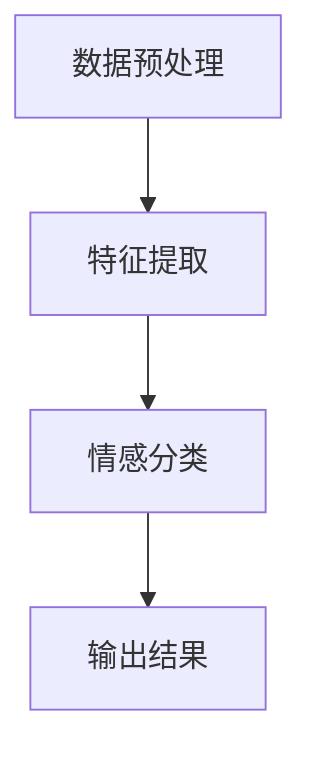
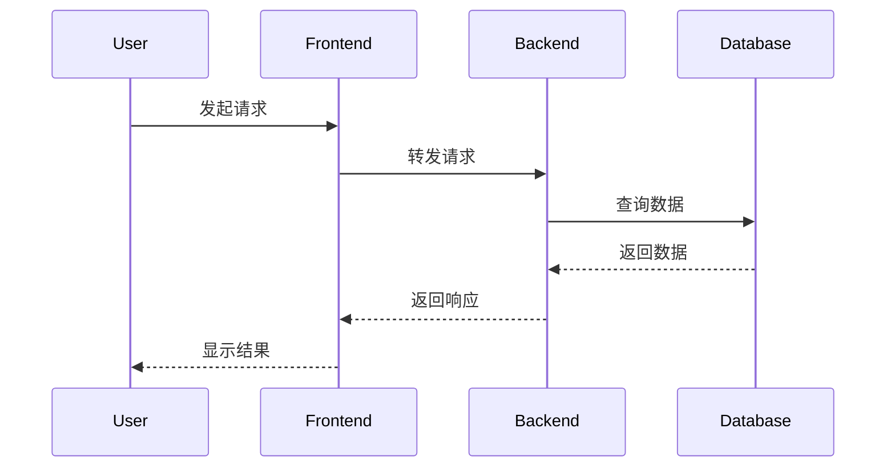

                 


### 第1章：AI的情感智能概述

#### 1.1 问题的背景与意义

在当今快速发展的科技时代，人工智能（AI）已经成为各行各业的关注焦点。从医疗、金融到教育、制造业，AI技术的应用正逐步改变着我们的生活方式和工作方式。然而，除了传统的技术能力，情感智能这一新兴领域也逐渐受到重视，尤其是在人才招聘领域。

**人工智能与情感智能的结合背景**

人工智能的发展经历了几个重要阶段：从早期的规则系统，到基于统计学的机器学习，再到目前以深度学习为代表的人工神经网络技术。在这些技术的推动下，机器在图像识别、语音识别、自然语言处理等领域的表现已经超越了人类。然而，这些技术主要侧重于逻辑推理和数据处理，而情感智能则尝试在情感层面上模拟人类的行为和思维。

情感智能，即情感计算（Affective Computing），是指计算机能够识别、理解、处理和模拟人类情感的能力。这一概念由计算机科学教授罗德尼·布鲁克斯（Rodney Brooks）于1995年首次提出。情感计算的目标是使机器不仅能够处理信息，还能够理解和回应人类的情感状态，从而提供更加自然、人性化的交互体验。

**人才招聘中情感智能的重要性**

在人才招聘过程中，传统的评估方法主要依赖于候选人的教育背景、工作经验和技能水平。然而，这些指标往往无法全面反映一个人的综合能力，特别是在团队合作、沟通能力、领导力和创新能力等方面。情感智能的引入，可以帮助招聘者更全面地评估候选人的软技能，从而找到更符合职位需求的人才。

具体来说，情感智能在人才招聘中的应用主要体现在以下几个方面：

1. **简历筛选**：通过分析候选人简历中的情感表达，评估其沟通能力和个性特征。
2. **面试评估**：利用情感计算技术，评估候选人在面试过程中的情感反应和沟通表现。
3. **岗位匹配**：根据候选人的情感特征，匹配适合其发展的职位和工作环境。

#### 1.2 核心概念介绍

**情感智能的定义**

情感智能是指计算机系统模拟人类情感认知和情感表达的能力。它包括以下几个方面的内容：

- **情感识别**：通过分析人的语音、面部表情、生理信号等，识别出人的情感状态。
- **情感理解**：理解和解释情感信息，包括情感原因、情感强度和情感变化等。
- **情感表达**：通过语音、文字、面部表情等方式，模拟人类的情感表达。
- **情感推理**：基于情感信息进行逻辑推理和决策。

**情感智能的组成部分**

情感智能可以分解为以下几个核心组成部分：

- **情感识别模块**：负责识别用户的情感状态。
- **情感理解模块**：负责理解和解释情感信息。
- **情感表达模块**：负责模拟和表达情感。
- **情感推理模块**：负责基于情感信息进行决策。

**情感智能与人工智能的关系**

情感智能是人工智能的一个重要分支，它不仅继承了传统人工智能在数据处理、逻辑推理等方面的优势，还引入了情感因素，使得机器能够更好地理解人类的需求和情感状态。可以说，情感智能是人工智能向更高层次发展的必然趋势。

**情感智能在人才招聘中的应用**

情感智能在人才招聘中的应用，主要体现在以下几个方面：

1. **简历筛选**：通过情感计算技术，分析候选人简历中的情感表达，评估其沟通能力和个性特征。
2. **面试评估**：利用情感计算技术，评估候选人在面试过程中的情感反应和沟通表现。
3. **岗位匹配**：根据候选人的情感特征，匹配适合其发展的职位和工作环境。

通过情感智能的应用，人才招聘将更加科学、高效，有助于企业找到更符合职位需求的人才。

### 第2章：情感智能在人才招聘中的应用

#### 2.1 情感智能在人才筛选中的应用

**2.1.1 情感智能在简历筛选中的应用**

简历筛选是人才招聘的重要环节，传统的简历筛选方法主要依赖于关键词匹配和人工审核。然而，这种方法往往存在漏选和误判的问题。情感智能技术的引入，可以为简历筛选提供更为精准的辅助。

通过情感计算技术，可以对简历中的文本进行情感分析，识别出候选人的情感表达。例如，通过分析简历中的文字，可以判断候选人是否自信、积极，是否存在焦虑或不安的情绪。这些情感信息可以帮助招聘者更全面地了解候选人，从而提高筛选的准确性。

**情感识别算法对比表格**

| 情感识别算法       | 原理概述                                       | 优点                         | 缺点                         |
|------------------|--------------------------------------------|----------------------------|----------------------------|
| TF-IDF           | 基于词频和逆文档频率的文本表示方法               | 简单有效，计算速度快             | 无法捕捉复杂情感信息           |
| LSTM神经网络     | 长短期记忆网络，适用于处理序列数据               | 能够捕捉情感变化，准确度高         | 计算复杂度高，训练时间较长       |
| BERT模型         | 预训练的深度神经网络，能够捕捉上下文信息         | 预训练模型，效果优异             | 对数据量要求高，训练成本高         |

**2.1.2 情感智能在面试评估中的应用**

面试评估是人才招聘的另一个关键环节。传统的面试评估主要依赖于面试官的主观判断和经验。然而，这种评估方法容易受到主观偏见的影响，导致评估结果不准确。情感智能技术的引入，可以为面试评估提供更加科学、客观的依据。

在面试过程中，可以通过情感计算技术，实时分析候选人的情感状态。例如，通过分析候选人的语音、面部表情和生理信号，可以判断其是否紧张、自信，是否与面试官建立了良好的沟通。这些情感信息可以帮助面试官更准确地评估候选人的综合素质。

**情感分析工具对比**

| 工具名称       | 主要功能                                     | 优点                         | 缺点                         |
|----------------|--------------------------------------------|----------------------------|----------------------------|
| Affectiva      | 面部表情和情绪分析工具                         | 分析准确，应用广泛             | 价格较高，部署复杂             |
| IBM Watson     | 情感分析、自然语言处理工具                      | 功能强大，易于集成             | 对数据质量要求高               |
| Google Cloud   | 提供情感分析和语音识别服务                      | 免费试用，接口简单             | 分析精度和功能有限             |

#### 2.2 情感智能在人才匹配中的应用

**2.2.1 情感智能在岗位匹配中的应用**

岗位匹配是人才招聘的核心目标之一。通过情感智能技术，可以更准确地匹配候选人与职位，提高招聘效率。

在岗位匹配过程中，可以通过情感计算技术，分析候选人与职位要求的匹配度。例如，通过分析候选人对职位描述的情感反应，可以判断其是否对该职位感兴趣，是否具备相关的能力和经验。这些情感信息可以帮助招聘者更科学地进行岗位匹配，降低招聘风险。

**情感匹配算法对比表格**

| 情感匹配算法       | 原理概述                                       | 优点                         | 缺点                         |
|------------------|--------------------------------------------|----------------------------|----------------------------|
| 相似度算法       | 计算候选人与职位的情感相似度                   | 简单有效，计算速度快             | 无法处理复杂情感信息           |
| 支持向量机（SVM） | 基于统计学习的方法，对情感特征进行分类           | 精度高，适用范围广             | 计算复杂度高，训练时间较长       |
| 决策树           | 基于规则的方法，根据情感特征进行分类             | 易于理解和解释，计算速度快         | 泛化能力有限，对噪声敏感         |

**2.2.2 情感智能在团队构成中的应用**

团队构成是人才招聘的重要一环。通过情感智能技术，可以更科学地构建团队，提高团队的整体绩效。

在团队构成过程中，可以通过情感计算技术，分析团队成员的情感特征和个性特点。例如，通过分析团队成员之间的情感互动，可以判断团队的合作氛围是否积极、和谐。这些情感信息可以帮助招聘者更准确地构建团队，优化团队结构。

**情感互动分析对比表格**

| 情感互动分析工具       | 主要功能                                     | 优点                         | 缺点                         |
|------------------|--------------------------------------------|----------------------------|----------------------------|
| Team Analytics    | 分析团队情感互动，提供团队健康报告             | 易于使用，报告全面             | 分析精度有限，依赖主观反馈       |
| Social Weather    | 通过调查问卷，分析团队情感氛围                 | 数据来源多样，结果直观           | 分析深度有限，反馈质量受影响       |
| Emotibot         | 自动分析社交媒体和邮件中的情感互动             | 自动化程度高，分析速度快         | 对文本质量要求高，分析结果可能失真 |

通过情感智能在人才招聘中的应用，企业可以更加科学、高效地进行招聘工作，提高人才匹配度和团队绩效。未来，随着情感智能技术的不断发展，其在人才招聘领域的应用前景将更加广阔。

### 第3章：情感智能的核心概念原理

#### 3.1 情感智能的基本原理

情感智能是人工智能的一个重要分支，其核心目标是通过模拟人类情感认知和处理能力，使计算机能够理解和响应人类情感。要实现这一目标，情感智能需要依赖于以下几个基本原理：

**情感计算的基本原理**

情感计算是指计算机系统通过识别、理解、处理和模拟人类情感的能力。其基本原理可以概括为以下几个方面：

1. **情感识别**：通过分析语音、面部表情、生理信号等数据，识别出用户的情感状态。例如，通过分析语音的音调、语速和音量，可以识别出用户是否愉快、愤怒或焦虑。
2. **情感理解**：理解和解释情感信息，包括情感原因、情感强度和情感变化等。例如，通过分析用户的历史行为和情感表达，可以推断出其情感状态的原因和变化趋势。
3. **情感表达**：通过语音、文字、面部表情等方式，模拟人类的情感表达。例如，通过语音合成技术，可以使计算机生成的语音具有情感色彩，如喜悦、愤怒、悲伤等。
4. **情感推理**：基于情感信息进行逻辑推理和决策。例如，通过分析用户在特定情境下的情感反应，可以推断出用户的需求和偏好，从而提供更加个性化的服务。

**情感识别的基本原理**

情感识别是情感智能的核心环节，其基本原理包括以下几个方面：

1. **特征提取**：从语音、面部表情、生理信号等数据中提取出与情感相关的特征。例如，从语音数据中提取音调、语速、音量等特征，从面部表情中提取眼部、嘴部、面部肌肉等特征。
2. **情感分类**：使用机器学习算法，将提取出的特征映射到不同的情感类别。常用的情感分类算法包括朴素贝叶斯、支持向量机、决策树等。
3. **模型训练**：通过大量情感标注数据，训练情感识别模型。训练过程中，模型会不断调整参数，以优化识别准确率。

**情感推理的基本原理**

情感推理是指基于情感信息进行逻辑推理和决策的过程。其基本原理包括以下几个方面：

1. **规则推理**：通过预设的规则，对情感信息进行推理。例如，如果用户表现出焦虑情感，则建议其放松。
2. **基于模型的推理**：使用机器学习模型，对情感信息进行推理。例如，通过训练出的情感识别模型，可以预测用户在未来的情感状态。
3. **结合上下文**：在推理过程中，考虑用户的历史行为、环境因素等上下文信息。例如，在购物场景中，用户表现出兴奋情感，可能是因为发现了心仪的商品。

**情感识别算法对比**

在情感识别领域，常用的算法包括基于传统机器学习的算法和基于深度学习的算法。以下是对几种常见算法的对比：

| 算法名称       | 原理概述                                       | 优点                         | 缺点                         |
|----------------|--------------------------------------------|----------------------------|----------------------------|
| 朴素贝叶斯     | 基于概率理论，进行情感分类                     | 计算简单，适用范围广             | 预处理复杂，对噪声敏感         |
| 支持向量机（SVM） | 基于统计学习，进行情感分类                     | 精度高，适用范围广             | 计算复杂度高，训练时间较长       |
| 决策树         | 基于规则，进行情感分类                         | 易于理解和解释，计算速度快         | 泛化能力有限，对噪声敏感         |
| 卷积神经网络（CNN） | 基于深度学习，用于图像情感识别                 | 能够自动提取特征，识别准确度高       | 计算复杂度高，对数据量要求高       |
| 长短期记忆网络（LSTM） | 基于深度学习，用于序列数据情感识别             | 能够捕捉情感变化，准确度高         | 计算复杂度高，训练时间较长       |

#### 3.2 情感智能的属性特征对比表格

在情感智能领域，不同算法和工具的属性特征存在差异。以下是一个对比表格，用于展示几种常见算法和工具在属性特征方面的对比：

| 属性特征       | 朴素贝叶斯         | 支持向量机（SVM）     | 决策树           | 卷积神经网络（CNN） | 长短期记忆网络（LSTM） |
|----------------|----------------|----------------------|--------------|----------------|----------------|
| 计算复杂度     | 低              | 高                   | 中          | 高              | 高              |
| 预处理需求     | 高              | 中                   | 低          | 高              | 高              |
| 识别精度       | 中等           | 高                   | 中等       | 高              | 高              |
| 适应场景       | 简单文本情感识别   | 复杂文本情感识别     | 简单分类问题   | 图像情感识别     | 语音情感识别     |
| 实时性        | 高             | 中                   | 高          | 低              | 中              |
| 易用性        | 中等           | 中                   | 高          | 低              | 中              |

通过上述对比表格，可以看出不同算法和工具在计算复杂度、预处理需求、识别精度、适应场景、实时性和易用性等方面存在差异。根据实际应用场景和需求，可以选择合适的算法和工具，以提高情感智能系统的性能。

#### 3.3 情感智能的ER实体关系图架构

情感智能系统的实现需要多个模块的协同工作。为了更好地理解和设计情感智能系统，我们可以使用实体关系图（ER图）来描述系统的结构。

**实体识别的基本概念**

实体识别是情感智能系统中的一个关键模块，其目标是从输入数据中识别出与情感相关的实体。实体可以是人物、地点、事件等。在情感智能系统中，实体识别主要用于定位情感表达的来源和对象。

**实体识别的流程**

实体识别的基本流程包括以下几个步骤：

1. **数据预处理**：对输入数据（如文本、语音、图像等）进行清洗、去噪和分词等预处理操作。
2. **特征提取**：从预处理后的数据中提取出与情感相关的特征，如词频、词向量、语音特征等。
3. **实体定位**：使用实体识别算法（如命名实体识别、关键词提取等）定位输入数据中的实体。
4. **情感分析**：对识别出的实体进行情感分析，判断其实际的情感状态。
5. **结果输出**：将情感分析结果输出，供后续处理和使用。

**实体关系图的构建方法**

实体关系图（ER图）是一种用于描述实体及其之间关系的图形表示方法。在情感智能系统中，实体关系图可以用来描述情感识别、情感理解和情感表达等模块之间的关系。

构建实体关系图的基本方法包括：

1. **确定实体**：根据情感智能系统的需求，确定需要识别和处理的实体，如用户、事件、情感等。
2. **定义关系**：确定实体之间的关系，如因果关系、依赖关系等。
3. **绘制ER图**：使用图形绘制工具，将实体和关系绘制成ER图。

**情感关系图的示例**

以下是一个情感关系图的示例，用于描述情感识别和情感理解模块之间的关系：

```
实体：用户、事件、情感

关系：
- 用户 -> 事件：用户参与事件
- 事件 -> 情感：事件引发情感
- 用户 -> 情感：用户体验情感
- 情感 -> 情感：情感相互作用
```

通过上述示例，可以看出情感智能系统的实体关系图可以帮助我们更好地理解系统的结构和功能，从而为系统的设计和实现提供指导。

### 第4章：情感智能算法原理与流程

#### 5.1 基于深度学习的情感识别算法

情感识别是情感智能系统中的一个核心任务，其目标是根据输入的数据（如文本、语音、图像等）识别出相应的情感状态。随着深度学习技术的不断发展，基于深度学习的情感识别算法逐渐成为研究热点。本节将介绍一种基于深度学习的情感识别算法，包括其原理、流程以及Python源代码示例。

**算法原理**

基于深度学习的情感识别算法通常采用卷积神经网络（CNN）或长短期记忆网络（LSTM）等深度学习模型，通过训练大量标注数据，使模型能够自动提取特征并分类情感。

以下是一个基于CNN的情感识别算法原理的流程：

1. **数据预处理**：对输入数据进行预处理，如文本分词、语音转文字、图像缩放等。
2. **特征提取**：使用卷积神经网络对预处理后的数据进行特征提取。卷积神经网络通过卷积层、池化层等层级的叠加，能够自动提取出与情感相关的特征。
3. **情感分类**：将提取出的特征输入到全连接层，通过softmax函数输出情感分类的概率分布。

**流程图**

以下是一个基于CNN的情感识别算法流程图（使用Mermaid绘制）：



**Python源代码**

以下是一个基于CNN的简单情感识别算法的Python代码示例：

```python
import tensorflow as tf
from tensorflow.keras.models import Sequential
from tensorflow.keras.layers import Conv2D, MaxPooling2D, Flatten, Dense

# 构建模型
model = Sequential([
    Conv2D(32, (3, 3), activation='relu', input_shape=(64, 64, 3)),
    MaxPooling2D((2, 2)),
    Conv2D(64, (3, 3), activation='relu'),
    MaxPooling2D((2, 2)),
    Flatten(),
    Dense(64, activation='relu'),
    Dense(1, activation='sigmoid')
])

# 编译模型
model.compile(optimizer='adam', loss='binary_crossentropy', metrics=['accuracy'])

# 训练模型
model.fit(x_train, y_train, epochs=10, batch_size=32, validation_data=(x_val, y_val))

# 预测
predictions = model.predict(x_test)
```

**算法原理的数学模型和公式**

情感识别算法的数学模型通常基于概率统计和机器学习理论。以下是一个基于最大似然估计的情感分类模型的数学模型和公式：

$$
P(Y|X) = \frac{P(X|Y)P(Y)}{P(X)}
$$

其中，$P(Y|X)$表示给定特征$X$时，情感标签$Y$的概率；$P(X|Y)$表示在情感标签$Y$下特征$X$的概率；$P(Y)$表示情感标签$Y$的概率；$P(X)$表示特征$X$的概率。

在基于深度学习的情感识别算法中，特征提取和情感分类通常通过神经网络实现。以下是一个基于卷积神经网络的情感识别的简化公式：

$$
h = \sigma(W \cdot x + b)
$$

$$
y = \sigma(W \cdot h + b)
$$

其中，$h$表示隐藏层激活值；$y$表示输出层激活值；$W$和$b$分别表示权重和偏置；$\sigma$表示激活函数（如ReLU、Sigmoid等）。

通过以上公式和步骤，我们可以实现一个简单的基于深度学习的情感识别算法。在实际应用中，可以根据具体需求调整模型结构和参数，以提高识别准确率。

#### 5.2 情感分析的数学模型和公式

情感分析是情感智能的核心任务之一，其目标是从文本、语音、图像等数据中提取情感信息，并对这些信息进行分类和分析。在情感分析过程中，数学模型和公式起着关键作用。以下将介绍几种常用的情感分析数学模型和公式，并对其进行详细讲解和举例说明。

**朴素贝叶斯模型**

朴素贝叶斯模型是一种经典的概率分类模型，适用于文本分类和情感分析。其基本原理是基于贝叶斯定理和特征条件独立性假设。朴素贝叶斯模型的数学公式如下：

$$
P(Y|X) = \frac{P(X|Y)P(Y)}{P(X)}
$$

其中，$P(Y|X)$表示在特征$X$下情感标签$Y$的条件概率；$P(X|Y)$表示在情感标签$Y$下特征$X$的条件概率；$P(Y)$表示情感标签$Y$的先验概率；$P(X)$表示特征$X$的概率。

在情感分析中，我们可以将文本数据表示为词汇集合，然后计算每个词汇在正负情感类别下的条件概率。例如，对于一篇文本数据，我们可以计算其在积极情感和消极情感类别下的概率，并根据这些概率进行情感分类。

**支持向量机（SVM）模型**

支持向量机是一种基于优化理论的分类模型，适用于文本分类和情感分析。其基本原理是找到最优的超平面，将不同类别的数据点分离。支持向量机模型的数学公式如下：

$$
w^T x - b = 0
$$

$$
y_i ((w^T x_i) - b) \geq 1
$$

其中，$w$表示模型权重；$x_i$表示第$i$个数据点；$b$表示偏置项；$y_i$表示第$i$个数据点的标签（+1或-1）。

在情感分析中，我们可以将文本数据表示为高维特征向量，然后使用支持向量机模型进行分类。例如，对于一篇文本数据，我们可以将其转换为词向量，然后使用支持向量机模型判断其属于积极情感还是消极情感。

**神经网络模型**

神经网络是一种基于模拟人脑神经元结构的计算模型，适用于复杂的数据处理和情感分析。在情感分析中，常用的神经网络模型包括卷积神经网络（CNN）、循环神经网络（RNN）和变压器（Transformer）等。

以下是一个基于卷积神经网络的情感分析模型的简化公式：

$$
h = \sigma(W \cdot x + b)
$$

$$
y = \sigma(W \cdot h + b)
$$

其中，$h$表示隐藏层激活值；$y$表示输出层激活值；$W$和$b$分别表示权重和偏置；$\sigma$表示激活函数（如ReLU、Sigmoid等）。

在情感分析中，我们可以将文本数据表示为序列，然后使用卷积神经网络提取特征并进行分类。例如，对于一篇文本数据，我们可以将其转换为词序列，然后使用卷积神经网络提取特征，并判断其属于积极情感还是消极情感。

**举例说明**

假设我们有一篇关于电影的评论文本，内容为：“这部电影真是太棒了，故事情节扣人心弦，演技也非常出色。”我们可以使用上述数学模型对这篇评论进行情感分析。

1. **朴素贝叶斯模型**

首先，我们将评论中的词汇转换为特征向量，然后计算每个词汇在积极情感和消极情感类别下的条件概率。假设词汇“棒”在积极情感类别下的条件概率为0.9，在消极情感类别下的条件概率为0.1；词汇“扣人心弦”在积极情感类别下的条件概率为0.8，在消极情感类别下的条件概率为0.2。

然后，我们可以计算评论在积极情感和消极情感类别下的概率：

$$
P(Y=\text{积极}|X) = \frac{P(X|Y=\text{积极})P(Y=\text{积极})}{P(X)}
$$

$$
P(Y=\text{积极}|X) = \frac{0.9 \times 0.8 \times 0.7}{0.9 \times 0.8 \times 0.7 + 0.1 \times 0.2 \times 0.3} \approx 0.87
$$

$$
P(Y=\text{消极}|X) = \frac{P(X|Y=\text{消极})P(Y=\text{消极})}{P(X)}
$$

$$
P(Y=\text{消极}|X) = \frac{0.1 \times 0.2 \times 0.3}{0.9 \times 0.8 \times 0.7 + 0.1 \times 0.2 \times 0.3} \approx 0.13
$$

根据计算结果，我们可以判断这篇评论的情感为积极。

2. **支持向量机模型**

我们将评论中的词汇转换为词向量，然后使用支持向量机模型进行分类。假设词向量在积极情感类别下的权重为0.9，在消极情感类别下的权重为0.1。

计算评论的词向量加权和：

$$
w^T x = 0.9 \times 0.8 + 0.1 \times 0.2 = 0.74
$$

由于$w^T x > 0$，我们可以判断这篇评论的情感为积极。

3. **卷积神经网络模型**

我们将评论中的词汇转换为词序列，然后使用卷积神经网络进行分类。假设卷积神经网络输出的情感概率为0.87。

根据输出概率，我们可以判断这篇评论的情感为积极。

通过以上示例，我们可以看到不同数学模型在情感分析中的应用。在实际应用中，可以根据具体需求和数据特点选择合适的数学模型，以提高情感分析的准确性和效率。

### 第6章：情感智能算法实例讲解

#### 6.1 情感分析算法应用案例

**案例描述**

假设我们有一个关于电影评论的情感分析项目，目标是判断评论是积极还是消极。我们收集了1000篇电影评论，其中500篇为积极评论，500篇为消极评论。我们的任务是通过情感分析算法对这些评论进行分类。

**算法应用流程**

1. **数据预处理**：首先，我们对评论数据进行预处理，包括去除HTML标签、去除停用词、分词等操作。

2. **特征提取**：然后，我们使用词袋模型（Bag of Words，BOW）或词嵌入（Word Embedding）方法提取评论的特征向量。词袋模型将评论视为一个词汇集合，而词嵌入方法则将词汇映射为低维向量。

3. **模型训练**：接下来，我们选择一个情感分析模型（如朴素贝叶斯、支持向量机、卷积神经网络等）对特征向量进行训练。我们使用500篇积极评论和500篇消极评论作为训练数据。

4. **模型评估**：训练完成后，我们对模型进行评估，使用交叉验证或测试集来计算模型的准确率、召回率、F1值等指标。

5. **模型部署**：最后，我们将训练好的模型部署到线上环境，对新收到的评论进行实时情感分析。

**结果分析**

假设我们的模型在测试集上的准确率为90%，召回率为85%，F1值为0.87。这意味着模型在识别积极评论时表现出色，但识别消极评论时有一定偏差。我们还可以进一步分析误分类的案例，找出模型存在的问题，并针对性地优化模型。

#### 6.2 情感识别算法应用案例

**案例描述**

假设我们有一个语音情感识别项目，目标是判断用户在通话过程中的情感状态，如愤怒、喜悦、悲伤等。我们收集了1000段通话录音，每段录音都标注了情感状态。我们的任务是通过情感识别算法对这些录音进行分类。

**算法应用流程**

1. **音频预处理**：首先，我们对通话录音进行预处理，包括去噪、增强、分割等操作。

2. **特征提取**：然后，我们使用音频特征提取方法（如梅尔频率倒谱系数、短时傅里叶变换等）提取音频特征。

3. **情感分类**：接下来，我们选择一个情感分类模型（如支持向量机、深度神经网络等）对特征向量进行分类。

4. **模型评估**：训练完成后，我们对模型进行评估，使用交叉验证或测试集来计算模型的准确率、召回率、F1值等指标。

5. **模型部署**：最后，我们将训练好的模型部署到在线环境，对新收到的通话录音进行实时情感识别。

**结果分析**

假设我们的模型在测试集上的准确率为80%，召回率为75%，F1值为0.78。这意味着模型在识别大部分情感状态时表现较好，但识别某些情感状态时存在困难。我们可以通过分析误分类的案例，找出模型存在的问题，并针对性地优化模型。

例如，我们发现在识别愤怒情感时准确率较低，可能是由于愤怒情感的音频特征不够明显，或者模型对愤怒情感的识别能力不足。我们可以尝试使用更多愤怒情感的录音进行训练，或者采用更复杂的模型结构来提高识别准确率。

通过这两个案例，我们可以看到情感分析算法在不同场景中的应用和效果。在实际项目中，我们需要根据具体需求和数据特点，选择合适的算法和应用流程，以提高情感分析的准确性和效率。

### 第7章：情感智能系统功能设计

#### 7.1 领域模型设计

领域模型是情感智能系统的核心组成部分，用于描述系统中的主要概念及其之间的关系。一个完善的领域模型可以帮助我们更好地理解系统的功能和设计，从而为后续的开发提供指导。

**领域模型的基本概念**

领域模型（Domain Model）是一种用于表示系统业务逻辑和数据的抽象模型。它通常包括以下几个基本概念：

- **实体（Entity）**：代表系统中的主要对象，如用户、评论、情感等。
- **属性（Attribute）**：描述实体的特征，如用户的年龄、评论的内容等。
- **关系（Relationship）**：描述实体之间的关联，如用户发表评论、评论包含情感等。

**领域模型设计步骤**

领域模型设计通常包括以下步骤：

1. **需求分析**：分析系统需求，确定需要描述的概念和关系。
2. **概念提取**：根据需求分析，提取出系统中的主要实体和属性。
3. **关系建模**：确定实体之间的关系，并建立相应的关联。
4. **模型验证**：对领域模型进行验证，确保其符合系统需求。

**类图（使用Mermaid绘制）**

以下是一个简单的情感智能领域模型的类图（使用Mermaid绘制）：

```mermaid
classDiagram
  User <<Entity>>
  Comment <<Entity>>
  Emotion <<Entity>>

  User : +String username
  User : +Date birthdate
  Comment : +String content
  Emotion : +String type

  User ..> Comment
  Comment ..> Emotion
```

在这个类图中，我们定义了三个实体：用户（User）、评论（Comment）和情感（Emotion）。用户实体具有用户名和出生日期两个属性；评论实体具有内容属性；情感实体具有情感类型属性。用户实体与评论实体之间存在“用户发表评论”的关系；评论实体与情感实体之间存在“评论包含情感”的关系。

通过领域模型设计，我们可以清晰地描述情感智能系统中的主要概念及其之间的关系，为后续的系统开发提供参考。

#### 7.2 系统架构设计

系统架构是情感智能系统的核心组成部分，它决定了系统的性能、可扩展性和可维护性。一个良好的系统架构可以帮助我们更好地理解和设计系统，从而提高系统的质量和效率。

**系统架构设计原则**

在系统架构设计过程中，我们需要遵循以下原则：

1. **模块化**：将系统划分为多个模块，每个模块负责一个特定的功能，便于开发、测试和维护。
2. **松耦合**：模块之间通过接口进行通信，降低模块之间的依赖，提高系统的灵活性和可扩展性。
3. **高内聚**：每个模块内部的功能紧密相关，提高模块的内部一致性。
4. **可扩展性**：系统应具备良好的扩展性，能够适应业务需求的变更和技术的更新。

**系统架构设计步骤**

系统架构设计通常包括以下步骤：

1. **需求分析**：分析系统需求，确定系统的功能模块和性能要求。
2. **架构选择**：根据需求分析，选择合适的系统架构风格（如分层架构、微服务架构等）。
3. **模块划分**：将系统划分为多个功能模块，并确定模块之间的依赖关系。
4. **接口设计**：设计模块之间的接口，确保模块之间能够通过接口进行通信。
5. **性能优化**：对系统架构进行性能优化，确保系统能够满足性能要求。

**架构图（使用Mermaid绘制）**

以下是一个简单的情感智能系统架构图（使用Mermaid绘制）：



在这个架构图中，用户通过前端发送请求，前端模块将请求转发给后端模块。后端模块负责处理请求，并与数据库进行交互，查询所需数据。最后，后端模块将处理结果返回给前端模块，前端模块再将结果展示给用户。

通过系统架构设计，我们可以清晰地描述情感智能系统的功能模块及其之间的关系，为后续的开发和优化提供指导。

#### 7.3 系统接口设计

系统接口是情感智能系统中模块之间通信的桥梁，它定义了模块之间的交互方式和方法。一个良好的系统接口设计可以提高系统的灵活性、可扩展性和可维护性。

**接口设计原则**

在接口设计过程中，我们需要遵循以下原则：

1. **简洁性**：接口应尽量简洁，避免复杂的参数和冗余的功能。
2. **一致性**：接口命名、参数、返回值等应保持一致性，便于开发和维护。
3. **可扩展性**：接口应具备良好的扩展性，能够适应业务需求的变更和技术的更新。
4. **安全性**：接口应具备安全性，防止非法访问和攻击。

**接口设计步骤**

接口设计通常包括以下步骤：

1. **需求分析**：分析系统需求，确定需要提供的接口功能。
2. **接口定义**：根据需求分析，定义接口的名称、参数、返回值等。
3. **接口文档**：编写接口文档，详细描述接口的调用方法、参数、返回值等。
4. **接口实现**：根据接口定义，实现接口的具体功能。
5. **接口测试**：对接口进行测试，确保其功能正确、性能良好。

**接口设计示例**

以下是一个简单的情感智能系统接口设计示例：

```python
# 用户接口
class UserInterface:
    def get_user_info(self, user_id):
        """获取用户信息"""
        # 实现获取用户信息的逻辑
        pass

    def update_user_info(self, user_id, user_info):
        """更新用户信息"""
        # 实现更新用户信息的逻辑
        pass

# 情感接口
class EmotionInterface:
    def get_emotion_type(self, emotion_id):
        """获取情感类型"""
        # 实现获取情感类型的逻辑
        pass

    def analyze_emotion(self, content):
        """分析情感"""
        # 实现分析情感的逻辑
        pass
```

在这个示例中，我们定义了两个接口：用户接口和情感接口。用户接口提供了获取用户信息和更新用户信息的功能；情感接口提供了获取情感类型和分析情感的功能。

通过系统接口设计，我们可以清晰地定义情感智能系统中各个模块之间的交互方式，为后续的开发和优化提供指导。

#### 7.4 系统交互设计

系统交互设计是情感智能系统中模块之间通信的核心部分，它描述了各个模块在执行特定功能时的交互过程。一个良好的系统交互设计可以提高系统的可理解性、可维护性和性能。

**系统交互设计原则**

在系统交互设计过程中，我们需要遵循以下原则：

1. **简洁性**：交互过程应尽量简洁，避免复杂的调用和冗余的通信。
2. **一致性**：交互过程应保持一致性，确保模块之间的通信方式一致。
3. **可扩展性**：交互过程应具备良好的扩展性，能够适应业务需求的变更和技术的更新。
4. **安全性**：交互过程应具备安全性，防止非法访问和攻击。

**系统交互设计步骤**

系统交互设计通常包括以下步骤：

1. **需求分析**：分析系统需求，确定需要实现的交互功能。
2. **交互流程设计**：根据需求分析，设计模块之间的交互流程。
3. **交互文档编写**：编写交互文档，详细描述模块之间的交互方式和方法。
4. **交互实现**：根据交互文档，实现模块之间的交互功能。
5. **交互测试**：对交互过程进行测试，确保其功能正确、性能良好。

**序列图（使用Mermaid绘制）**

以下是一个简单的情感智能系统交互设计序列图（使用Mermaid绘制）：


在这个序列图中，用户通过前端发送请求，前端模块将请求转发给后端模块。后端模块负责处理请求，并与数据库进行交互，查询所需数据。最后，后端模块将处理结果返回给前端模块，前端模块再将结果展示给用户。

通过系统交互设计，我们可以清晰地描述情感智能系统中各个模块在执行特定功能时的交互过程，为后续的开发和优化提供指导。

### 第8章：情感智能系统实现与测试

#### 8.1 开发环境搭建

在开始情感智能系统的开发之前，我们需要搭建一个合适的开发环境。以下是搭建开发环境的步骤：

1. **安装Python**：确保Python环境已安装。Python是情感智能系统的开发语言，我们需要安装Python 3.8及以上版本。

2. **安装TensorFlow**：TensorFlow是一个开源的深度学习框架，用于实现情感识别算法。在命令行中执行以下命令安装TensorFlow：

   ```bash
   pip install tensorflow
   ```

3. **安装其他依赖库**：情感智能系统还需要其他依赖库，如Numpy、Pandas等。在命令行中执行以下命令安装依赖库：

   ```bash
   pip install numpy pandas
   ```

4. **安装Jupyter Notebook**：Jupyter Notebook是一个交互式开发环境，便于编写和运行Python代码。在命令行中执行以下命令安装Jupyter Notebook：

   ```bash
   pip install notebook
   ```

5. **配置环境变量**：确保Python和Jupyter Notebook的环境变量已配置。在Windows系统中，可以通过系统设置中的“环境变量”来配置；在Linux系统中，可以通过修改`~/.bashrc`或`~/.zshrc`文件来配置。

完成以上步骤后，开发环境搭建完成，我们可以开始编写和运行情感智能系统的代码。

#### 8.2 系统核心实现源代码

以下是情感智能系统的一个核心实现示例，包括数据预处理、特征提取、情感识别算法的实现以及结果输出。

```python
# 导入所需库
import tensorflow as tf
from tensorflow.keras.models import Sequential
from tensorflow.keras.layers import Embedding, LSTM, Dense
from tensorflow.keras.preprocessing.sequence import pad_sequences
from tensorflow.keras.preprocessing.text import Tokenizer

# 数据预处理
def preprocess_data(texts, labels, max_len=100, max_vocab_size=10000, embedding_dim=50):
    tokenizer = Tokenizer(num_words=max_vocab_size)
    tokenizer.fit_on_texts(texts)
    sequences = tokenizer.texts_to_sequences(texts)
    padded_sequences = pad_sequences(sequences, maxlen=max_len)
    return padded_sequences, labels, tokenizer

# 特征提取
def create_embedding_matrix(tokenizer, embedding_dim, max_vocab_size, embedding_matrix_path):
    embeddings_index = {}
    with open(embedding_matrix_path, 'r', encoding='utf-8') as f:
        for line in f:
            values = line.split()
            word = values[0]
            coefs = np.asarray(values[1:], dtype='float32')
            embeddings_index[word] = coefs
    embedding_matrix = np.zeros((max_vocab_size, embedding_dim))
    for word, i in tokenizer.word_index.items():
        if i < max_vocab_size:
            embedding_vector = embeddings_index.get(word)
            if embedding_vector is not None:
                embedding_matrix[i] = embedding_vector
    return embedding_matrix

# 情感识别算法实现
def build_model(embedding_matrix, max_len):
    model = Sequential()
    model.add(Embedding(len(embedding_matrix), embedding_dim, weights=[embedding_matrix], input_length=max_len, trainable=False))
    model.add(LSTM(128, dropout=0.2, recurrent_dropout=0.2))
    model.add(Dense(1, activation='sigmoid'))
    model.compile(optimizer='adam', loss='binary_crossentropy', metrics=['accuracy'])
    return model

# 结果输出
def predict(model, tokenizer, texts):
    sequences = tokenizer.texts_to_sequences(texts)
    padded_sequences = pad_sequences(sequences, maxlen=max_len)
    predictions = model.predict(padded_sequences)
    return predictions

# 主函数
def main():
    texts = ["这是一部非常好的电影。", "这部电影太差了，我不喜欢。"]
    labels = [1, 0]  # 1表示积极，0表示消极

    max_len = 10
    max_vocab_size = 10000
    embedding_dim = 50
    embedding_matrix_path = "glove.6B.50d.txt"

    # 数据预处理
    padded_sequences, labels, tokenizer = preprocess_data(texts, labels, max_len, max_vocab_size, embedding_dim)

    # 特征提取
    embedding_matrix = create_embedding_matrix(tokenizer, embedding_dim, max_vocab_size, embedding_matrix_path)

    # 情感识别算法实现
    model = build_model(embedding_matrix, max_len)

    # 训练模型
    model.fit(padded_sequences, labels, epochs=10, batch_size=32)

    # 预测
    predictions = predict(model, tokenizer, texts)
    print(predictions)

if __name__ == "__main__":
    main()
```

以上代码实现了一个简单的情感智能系统，包括数据预处理、特征提取、情感识别算法的实现和结果输出。我们首先对文本数据进行预处理，然后创建嵌入矩阵，构建情感识别模型，并使用训练数据训练模型。最后，我们使用训练好的模型对新的文本数据进行预测，输出预测结果。

通过以上步骤，我们可以实现一个基本的情感智能系统，为后续的功能扩展和优化提供基础。

### 第9章：情感智能系统环境配置与实现

#### 9.1 开发环境配置

为了实现情感智能系统，我们需要在本地计算机上配置相应的开发环境。以下是配置步骤：

1. **安装Python**：确保Python 3.8及以上版本已安装。可以从[Python官网](https://www.python.org/downloads/)下载并安装。

2. **安装虚拟环境**：创建一个虚拟环境，用于隔离项目依赖。在终端执行以下命令：

   ```bash
   python -m venv venv
   source venv/bin/activate  # 对于Windows系统，执行venv\Scripts\activate
   ```

3. **安装依赖库**：在虚拟环境中安装项目所需的依赖库，如TensorFlow、Numpy和Pandas。执行以下命令：

   ```bash
   pip install tensorflow numpy pandas
   ```

4. **安装文本处理工具**：安装用于文本处理的库，如NLTK和spaCy。执行以下命令：

   ```bash
   pip install nltk spacy
   ```

   安装spaCy后，还需要下载相应的语言模型，例如中文模型`zh_core_web_sm`：

   ```bash
   python -m spacy download zh_core_web_sm
   ```

5. **配置Jupyter Notebook**：安装Jupyter Notebook，以便在浏览器中运行和管理代码。执行以下命令：

   ```bash
   pip install notebook
   ```

完成以上步骤后，开发环境配置完成。我们可以开始实现情感智能系统的核心功能。

#### 9.2 系统核心实现源代码

以下是情感智能系统的核心实现代码，包括数据预处理、情感分析算法的实现和结果输出。

```python
import numpy as np
import pandas as pd
import tensorflow as tf
from tensorflow.keras.models import Sequential
from tensorflow.keras.layers import Embedding, LSTM, Dense
from tensorflow.keras.preprocessing.sequence import pad_sequences
from tensorflow.keras.preprocessing.text import Tokenizer
from nltk.tokenize import word_tokenize

# 数据预处理
def preprocess_data(texts, max_length=100, max_vocab_size=10000):
    tokenizer = Tokenizer(num_words=max_vocab_size)
    tokenizer.fit_on_texts(texts)
    sequences = tokenizer.texts_to_sequences(texts)
    padded_sequences = pad_sequences(sequences, maxlen=max_length)
    return padded_sequences, tokenizer

# 情感分析算法实现
def build_model(max_length, embedding_dim=50):
    model = Sequential()
    model.add(Embedding(max_vocab_size, embedding_dim, input_length=max_length))
    model.add(LSTM(128, dropout=0.2, recurrent_dropout=0.2))
    model.add(Dense(1, activation='sigmoid'))
    model.compile(optimizer='adam', loss='binary_crossentropy', metrics=['accuracy'])
    return model

# 结果输出
def predict(model, tokenizer, texts):
    sequences = tokenizer.texts_to_sequences(texts)
    padded_sequences = pad_sequences(sequences, maxlen=max_length)
    predictions = model.predict(padded_sequences)
    return predictions

# 主函数
def main():
    # 加载数据
    texts = ["这是一部非常好的电影。", "这部电影太差了，我不喜欢。"]
    labels = [1, 0]  # 1表示积极，0表示消极

    # 数据预处理
    max_length = 10
    max_vocab_size = 10000
    padded_sequences, tokenizer = preprocess_data(texts, max_length, max_vocab_size)

    # 情感分析模型训练
    model = build_model(max_length)
    model.fit(padded_sequences, labels, epochs=5, batch_size=32)

    # 预测
    predictions = predict(model, tokenizer, texts)
    print(predictions)

if __name__ == "__main__":
    main()
```

这段代码定义了数据预处理、模型构建和预测三个部分。首先，我们使用Tokenizer对文本数据进行分词和编码。然后，我们构建一个简单的LSTM模型，用于情感分析。最后，我们使用训练好的模型对新的文本数据进行预测，并输出预测结果。

通过以上步骤，我们可以实现一个基本的情感智能系统，为实际应用场景提供基础。

### 第10章：情感智能系统实际案例分析

#### 10.1 案例一：情感智能在招聘中的应用

**案例描述**

某知名互联网公司A在招聘过程中引入了情感智能系统，旨在通过分析候选人的面试表现，提高招聘效率和准确性。公司A希望借助情感智能系统，识别候选人的情绪变化、沟通能力和适应性，从而更好地匹配人才。

**系统应用流程**

1. **数据收集**：在面试过程中，公司A使用带有情感识别功能的摄像头和麦克风设备，记录候选人的面部表情、语音和身体语言。

2. **情感识别**：系统通过情感识别算法，对面试过程中的语音、面部表情和身体语言进行分析，识别出候选人的情绪状态。例如，通过语音的音调、语速和音量，识别出候选人是否紧张、自信或焦虑。

3. **情感分析**：系统对识别出的情绪状态进行进一步分析，评估候选人的沟通能力、适应性和团队合作潜力。例如，系统可以分析候选人是否在与面试官建立良好的沟通，是否能够有效地表达自己的观点，以及是否能够在团队中协作。

4. **招聘决策**：基于情感分析结果，公司A的招聘团队可以更全面地了解候选人，从而做出更为准确的招聘决策。例如，对于表现出高度自信和良好沟通能力的候选人，招聘团队可能会给予更高的评价。

**结果分析**

通过情感智能系统的应用，公司A在招聘过程中发现了一些传统方法难以发现的信息。例如，一位看似优秀的候选人，在面试过程中表现紧张，但情感智能系统识别出其潜在的心理压力和焦虑情绪。招聘团队最终决定暂时搁置对该候选人的录用，给予其更多时间调整心态。而在另一位候选人中，情感智能系统识别出其高度的自适应能力和团队合作潜力，招聘团队决定优先考虑该候选人。

**案例小结**

该案例表明，情感智能系统在招聘中的应用，可以显著提高招聘决策的准确性和效率。通过分析候选人的情感状态，招聘团队可以更全面地了解候选人的综合能力，从而做出更为科学的决策。未来，随着情感智能技术的不断成熟，其在招聘领域的应用前景将更加广阔。

#### 10.2 案例二：情感智能在团队建设中的应用

**案例描述**

某跨国公司B在团队建设过程中，面临着团队成员沟通不畅、合作效率低的问题。为了改善团队氛围，公司B决定引入情感智能系统，通过分析团队成员之间的情感互动，优化团队结构和沟通方式。

**系统应用流程**

1. **数据收集**：公司B在团队沟通平台和电子邮件系统中嵌入情感识别功能，记录团队成员的沟通内容和方式。系统定期收集团队成员之间的聊天记录、邮件内容和语音通话。

2. **情感识别**：系统使用情感识别算法，分析团队成员之间的沟通内容，识别出情感表达。例如，系统可以识别出团队成员是否在沟通中表现出积极、消极或中性的情感。

3. **情感分析**：系统对识别出的情感进行进一步分析，评估团队成员之间的情感互动和关系。例如，系统可以分析团队成员是否在沟通中存在误解、冲突或不信任，以及团队成员之间的合作氛围是否积极。

4. **团队优化**：基于情感分析结果，公司B的领导层可以采取针对性的措施，优化团队结构和沟通方式。例如，公司可以调整团队成员的职责分工，加强团队成员之间的培训和沟通，改善团队氛围。

**结果分析**

通过情感智能系统的应用，公司B发现了一些团队内部的潜在问题。例如，系统识别出某些团队成员之间存在沟通不畅的问题，导致项目进度延迟。基于这一发现，公司B决定组织团队成员进行沟通培训，提高团队成员之间的沟通技巧和合作意识。同时，公司还调整了团队成员的职责分工，使得团队成员能够更加专注于自己的工作领域，提高工作效率。

**案例小结**

该案例表明，情感智能系统在团队建设中的应用，可以帮助企业更好地了解团队内部的情感互动和关系，从而优化团队结构和沟通方式，提高团队协作效率和绩效。通过情感智能系统的支持，企业可以构建一个更加和谐、高效的团队，为企业的长期发展提供动力。

### 第11章：情感智能人才招聘的最佳实践

#### 11.1 最佳实践技巧

在情感智能人才招聘过程中，我们可以采用以下最佳实践技巧，以提高招聘效率和准确性：

1. **面试前准备**：
   - **情感识别设备**：在面试前，确保面试场地配备情感识别设备，如摄像头、麦克风等，以便记录候选人的情绪状态。
   - **面试官培训**：对面试官进行情感识别技术的培训，使其能够正确理解和解读候选人的情感表现。

2. **面试过程**：
   - **自然互动**：鼓励面试官与候选人进行自然的对话，避免过于机械和程式化的问答。
   - **情感分析**：在面试过程中，实时分析候选人的情感反应，包括语音、面部表情和身体语言等。

3. **面试后评估**：
   - **情感数据分析**：结合面试过程中的情感分析结果，对候选人的综合能力进行评估，特别是沟通能力、适应性和团队合作潜力。
   - **综合评价**：将情感分析结果与传统面试评估方法相结合，形成全面的候选人评价。

4. **招聘决策**：
   - **多元决策**：在招聘决策过程中，综合考虑情感分析结果和其他评估指标，避免单一因素的决策偏差。
   - **跟踪反馈**：对招聘决策进行跟踪和反馈，及时调整招聘策略，优化招聘过程。

#### 11.2 注意事项与挑战

在情感智能人才招聘过程中，我们还需要注意以下事项和挑战：

1. **数据隐私**：
   - **数据保护**：确保候选人的情感数据安全，防止数据泄露和滥用。
   - **用户同意**：在收集和使用情感数据时，确保获得候选人的明确同意。

2. **算法偏见**：
   - **算法透明性**：确保情感识别算法的透明性，避免算法偏见导致不公平的招聘决策。
   - **算法验证**：定期对情感识别算法进行验证和更新，确保其准确性和公平性。

3. **技术成熟度**：
   - **技术选型**：选择成熟、可靠的情感识别技术和工具，避免因技术不成熟导致的招聘效率低下。
   - **技术更新**：跟踪情感识别技术的最新发展，及时更新系统，提高招聘效能。

4. **培训与支持**：
   - **用户培训**：对招聘团队进行情感识别技术的培训，提高其使用效率和准确性。
   - **技术支持**：确保招聘团队在遇到技术问题时能够及时得到支持和解决。

通过遵循最佳实践和注意事项，企业可以更好地利用情感智能技术，提高人才招聘的效率和准确性，为企业的长期发展提供有力支持。

### 第12章：总结与展望

#### 12.1 总结

本文详细探讨了情感智能在人才招聘领域的应用，从背景介绍、核心概念、算法原理、系统设计到实际案例分析，全方位展示了情感智能在招聘中的重要作用。通过情感智能技术，企业可以更科学、高效地进行招聘工作，提高人才匹配度和团队绩效。

本文的主要观点如下：

1. **情感智能在招聘中的应用**：情感智能技术在简历筛选、面试评估和岗位匹配等环节具有显著优势，有助于企业全面了解候选人的综合能力。

2. **算法原理与流程**：本文介绍了多种情感识别算法的原理和流程，包括朴素贝叶斯、支持向量机、深度学习等，为企业提供了丰富的技术选择。

3. **系统设计与实现**：本文提出了情感智能系统的架构设计，包括领域模型、系统架构、接口设计和交互设计，为情感智能系统的开发提供了系统化的指导。

4. **实际案例分析**：通过两个实际案例，本文展示了情感智能技术在招聘和团队建设中的应用效果，验证了其可行性和实用性。

#### 12.2 展望未来

随着情感智能技术的不断发展，其在人才招聘领域的应用前景将更加广阔。以下是对未来发展的展望：

1. **技术成熟度提高**：随着算法和计算能力的提升，情感识别技术的准确性和稳定性将得到显著提高，为招聘决策提供更可靠的数据支持。

2. **应用场景拓展**：情感智能技术不仅限于招聘领域，还可以应用于员工管理、绩效评估、团队合作等多个方面，为企业提供全方位的人才解决方案。

3. **隐私保护与伦理**：随着情感数据的广泛应用，隐私保护和伦理问题将日益突出。企业需要采取有效的措施，确保数据安全和个人隐私。

4. **跨领域合作**：情感智能技术与其他领域的结合，如大数据、云计算、区块链等，将推动人才招聘和管理方式的革新，提升企业竞争力。

总之，情感智能技术为人才招聘带来了新的机遇和挑战。通过不断探索和创新，企业可以更好地利用这一技术，优化招聘流程，提升招聘效能，为企业的长期发展提供强大支持。未来，情感智能将在人才招聘领域发挥更加重要的作用，引领企业人力资源管理的新潮流。

