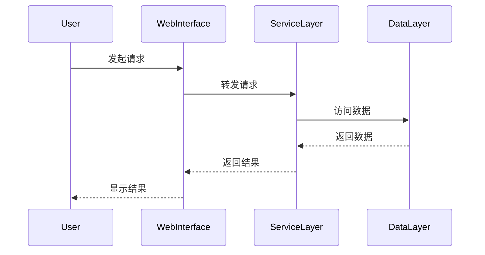

                 

### 第一部分：背景介绍

#### 1.1 问题背景

在人工智能（AI）迅猛发展的今天，情感能力已成为提升AI系统用户体验和智能化程度的关键因素。AI情感能力的发展主要体现在情感识别、人机交互等领域。通过情感识别，AI系统能够准确理解用户的情感状态，进而实现个性化的交互和服务。例如，智能客服系统能够根据用户的问题和语气，提供相应的情感反馈，提升用户的满意度。然而，随着AI情感能力的提升，隐私保护问题也逐渐凸显出来。

隐私保护的重要性不容忽视。随着AI技术的广泛应用，大量的用户数据被收集和存储，这些数据中包含了用户的个人信息、行为习惯和情感状态等敏感信息。如果这些数据泄露，不仅会侵犯用户的隐私权，还可能导致严重的后果，如诈骗、恶意攻击等。因此，如何在实现情感能力的同时，确保用户的隐私得到有效保护，成为了一个亟待解决的问题。

#### 1.1.1 AI情感能力的发展与应用

近年来，AI在情感识别和人机交互领域取得了显著的进展。首先，在情感识别方面，研究人员通过深度学习、自然语言处理等技术，开发了多种情感分析模型。这些模型可以准确识别用户的情绪状态，如喜悦、愤怒、悲伤等。例如，基于卷积神经网络（CNN）和循环神经网络（RNN）的模型，能够在处理文本、语音和图像等多模态数据时，有效提取情感特征，从而实现精准的情感识别。

其次，在人机交互方面，AI情感能力也被广泛应用。例如，智能客服系统通过情感识别，能够理解用户的情感需求，提供更加贴心和个性化的服务。此外，智能助手、虚拟聊天机器人等也利用情感能力，与用户进行自然、流畅的对话，提升用户体验。这些应用不仅使AI系统更加智能，也使人们的日常生活和工作更加便捷。

情感能力对于提高AI系统的用户体验和智能化程度至关重要。通过情感识别，AI系统能够更好地理解用户的需求和情绪，提供个性化的服务和建议。例如，在电子商务领域，AI系统能够根据用户的情感状态，推荐符合其心理预期的商品，从而提高用户的购物体验和满意度。在医疗领域，AI系统通过情感分析，能够及时发现患者的负面情绪，提供相应的心理干预和支持，提高患者的治疗效果和生活质量。

然而，随着AI情感能力的提升，隐私保护问题也日益凸显。AI系统在实现情感识别和人机交互时，需要收集和分析大量的用户数据，这些数据中包含了用户的个人信息和隐私。如果这些数据泄露，不仅会侵犯用户的隐私权，还可能导致一系列安全风险。因此，如何在实现情感能力的同时，确保用户的隐私得到有效保护，成为了一个亟待解决的问题。

#### 1.1.2 隐私保护的重要性

随着AI技术的发展，隐私泄露风险日益凸显。一方面，AI系统在实现情感识别和人机交互时，需要收集和分析大量的用户数据，这些数据中包含了用户的个人信息和隐私。如果这些数据泄露，不仅会侵犯用户的隐私权，还可能导致严重的后果，如诈骗、恶意攻击等。另一方面，用户对隐私保护的重视程度也在不断提升。随着隐私泄露事件的频发，越来越多的用户开始关注自己的隐私安全，对AI系统的隐私保护提出了更高的要求。

在AI系统中实现情感能力与隐私保护的有效结合，面临诸多挑战。首先，情感能力的实现需要大量的用户数据，这些数据中包含了用户的敏感信息，如果处理不当，可能导致隐私泄露。其次，隐私保护技术需要与AI算法相结合，实现数据的安全存储、传输和处理。然而，现有的隐私保护技术往往会导致数据的可用性降低，影响AI系统的性能和准确性。因此，如何在保证情感能力实现的同时，确保用户隐私得到有效保护，成为了一个亟待解决的难题。

本书旨在通过深入研究AI情感能力与隐私保护，提出一种新的数据安全维度，以实现情感能力与隐私保护的有效结合。本书的主要目标是：

1. **梳理AI情感能力与隐私保护的相关概念和原理，明确两者的关系和相互影响。**
2. **探讨AI情感能力算法的设计和实现，以及隐私保护技术在其中的应用。**
3. **提出一种新的数据安全维度，以平衡情感能力与隐私保护之间的关系。**
4. **通过实际案例和实验，验证本书提出的方法和算法的有效性和可行性。**

本书将从以下几个方面展开讨论：

1. **AI情感能力的发展与应用，包括情感识别和人机交互等方面的应用案例。**
2. **隐私保护技术的原理和分类，包括数据加密、访问控制和数据去识别化等手段。**
3. **情感能力与隐私保护之间的关系，以及如何在两者之间寻找平衡点。**
4. **AI情感能力算法的设计与实现，以及隐私保护技术在算法中的应用。**
5. **实际案例分析和实验结果，验证本书提出的方法和算法的有效性和可行性。**

通过本书的研究，旨在为AI领域的开发者、研究人员和隐私保护专家提供有价值的参考，促进AI技术在情感识别和人机交互等领域的健康发展。

#### 1.2 问题概述

在AI系统中实现情感能力与隐私保护的有效结合，面临着诸多挑战。首先，情感能力的实现需要大量的用户数据，而这些数据中包含了用户的敏感信息，如个人身份、行为习惯和情感状态等。如果这些数据泄露，不仅会侵犯用户的隐私权，还可能导致一系列安全风险，如身份盗窃、恶意攻击等。因此，如何在保证情感能力实现的同时，确保用户隐私得到有效保护，成为了一个亟待解决的难题。

其次，现有的隐私保护技术往往会对AI系统的性能和准确性产生负面影响。例如，数据加密、访问控制和数据去识别化等技术，虽然可以有效地保护用户隐私，但也会导致数据的可用性降低，影响AI系统的性能。此外，隐私保护技术需要与AI算法相结合，实现数据的安全存储、传输和处理。然而，现有的隐私保护技术与AI算法的结合并不成熟，缺乏有效的解决方案。

为了解决这些问题，本书提出了一个新的数据安全维度，旨在平衡情感能力与隐私保护之间的关系。具体而言，本书将从以下几个方面展开讨论：

1. **AI情感能力的发展与应用**：梳理AI情感能力的发展现状，介绍情感识别和人机交互等方面的应用案例，明确情感能力在AI系统中的重要性和必要性。

2. **隐私保护技术的原理和分类**：详细探讨隐私保护技术的原理和分类，包括数据加密、访问控制和数据去识别化等手段，分析现有隐私保护技术的优缺点和适用场景。

3. **情感能力与隐私保护之间的关系**：探讨情感能力与隐私保护之间的关系，分析两者之间的相互影响和制约，提出在两者之间寻找平衡点的策略。

4. **AI情感能力算法的设计与实现**：介绍AI情感能力算法的设计和实现方法，包括情感识别、情感理解和情感响应等层次，分析算法的数学模型和公式，并提供具体的Python源代码实现。

5. **隐私保护技术在算法中的应用**：探讨隐私保护技术在AI情感能力算法中的应用，包括数据加密、访问控制和数据去识别化等手段，分析如何实现数据的安全存储、传输和处理，确保用户隐私得到有效保护。

6. **实际案例分析和实验结果**：通过实际案例和实验结果，验证本书提出的方法和算法的有效性和可行性，分析在情感能力与隐私保护之间的平衡策略。

#### 1.3 问题解决

本书的解决思路主要分为以下几个方面：

1. **明确情感能力与隐私保护的核心概念**：首先，明确情感能力与隐私保护的核心概念，包括情感能力的定义、分类和应用，隐私保护的定义、分类和手段，以及两者之间的关系。

2. **梳理现有隐私保护技术的优缺点**：对现有的隐私保护技术进行梳理，分析其优缺点和适用场景，为后续设计新的数据安全维度提供参考。

3. **提出新的数据安全维度**：在明确情感能力与隐私保护的核心概念和现有隐私保护技术的基础上，提出一种新的数据安全维度，旨在平衡情感能力与隐私保护之间的关系。具体包括数据加密、访问控制和数据去识别化等技术，并分析如何实现数据的安全存储、传输和处理。

4. **设计AI情感能力算法**：结合新的数据安全维度，设计AI情感能力算法，包括情感识别、情感理解和情感响应等层次。分析算法的数学模型和公式，并提供具体的Python源代码实现。

5. **实验验证和案例分析**：通过实验和案例分析，验证新数据安全维度和AI情感能力算法的有效性和可行性，分析在情感能力与隐私保护之间的平衡策略。

#### 1.4 边界与外延

本书主要关注AI系统的情感能力与隐私保护问题，探讨如何实现情感能力与隐私保护的有效结合。具体而言，本书将围绕以下几个方面展开：

1. **情感能力的应用场景**：主要关注情感识别和人机交互等方面的应用，探讨AI系统如何通过情感识别提升用户体验和智能化程度。

2. **隐私保护技术的应用**：主要关注数据加密、访问控制和数据去识别化等隐私保护技术在AI系统中的应用，分析如何确保用户隐私得到有效保护。

3. **情感能力与隐私保护的平衡**：探讨在情感能力与隐私保护之间寻找平衡点的策略，分析如何实现数据的安全存储、传输和处理。

4. **AI情感能力算法的设计与实现**：介绍AI情感能力算法的设计和实现方法，包括情感识别、情感理解和情感响应等层次，分析算法的数学模型和公式。

5. **实际案例分析和实验结果**：通过实际案例和实验结果，验证本书提出的方法和算法的有效性和可行性，分析在情感能力与隐私保护之间的平衡策略。

本书的研究范围主要包括以下几个方面：

1. **情感识别技术**：探讨情感识别的原理、方法和应用，包括文本情感分析、语音情感分析和图像情感分析等。

2. **人机交互技术**：分析人机交互的原理、方法和应用，包括自然语言处理、语音识别和图像识别等。

3. **隐私保护技术**：研究隐私保护技术的原理、方法和应用，包括数据加密、访问控制和数据去识别化等。

4. **AI情感能力算法**：设计AI情感能力算法，包括情感识别、情感理解和情感响应等层次，分析算法的数学模型和公式。

5. **实验验证和案例分析**：通过实验和案例分析，验证本书提出的方法和算法的有效性和可行性。

#### 1.5 概念结构与核心要素组成

在深入探讨AI情感能力与隐私保护的问题时，我们需要首先明确相关的核心概念，并了解这些概念之间的结构关系。以下是本文中涉及的主要概念及其组成要素：

1. **情感能力**：情感能力是指人工智能系统能够理解和响应人类情感的能力。它主要包括三个层次：情感识别、情感理解和情感响应。

   - **情感识别**：指系统对人类情感状态（如喜怒哀乐）的识别能力。
   - **情感理解**：指系统对情感背后的含义和情境的理解能力。
   - **情感响应**：指系统根据情感识别和理解结果，采取相应行动或提供适当反馈的能力。

2. **隐私保护**：隐私保护是指确保个人数据不被未经授权的访问、使用和泄露的一系列技术和措施。隐私保护的核心要素包括：

   - **数据加密**：通过加密技术对数据进行保护，确保数据在传输和存储过程中不会被窃取或篡改。
   - **访问控制**：通过设置访问权限，确保只有授权用户能够访问特定数据。
   - **数据去识别化**：通过匿名化、伪匿名化等技术手段，去除或改变数据中的识别信息，从而保护个人隐私。

3. **数据安全**：数据安全是指确保数据在存储、传输、处理等过程中的完整性、可用性和保密性。数据安全的核心要素包括：

   - **完整性**：确保数据在传输和存储过程中不会被未经授权的修改或破坏。
   - **可用性**：确保授权用户可以在需要时访问和使用数据。
   - **保密性**：确保数据不被未经授权的访问。

4. **AI情感能力与隐私保护的平衡**：这一概念涉及到如何在实现情感能力的同时，确保用户隐私不受侵犯。核心要素包括：

   - **隐私保护技术的优化**：选择和优化隐私保护技术，使其在保护隐私的同时，不会显著影响AI系统的性能和准确性。
   - **隐私增强技术**：引入隐私增强技术，如差分隐私、同态加密等，以提升隐私保护水平。
   - **隐私预算**：制定隐私预算，根据情感能力实现的需求，合理分配隐私保护资源。

这些核心概念和要素相互关联，共同构成了AI情感能力与隐私保护的理论框架。理解这些概念和要素之间的关系，有助于我们更好地分析问题、设计解决方案，并推动这一领域的研究和应用。

#### 1.6 本章小结

本章首先介绍了AI情感能力与隐私保护的问题背景，包括AI情感能力的发展与应用以及隐私保护的重要性。接着，我们概述了问题的挑战和解决思路，提出了新的数据安全维度，旨在实现情感能力与隐私保护的有效结合。同时，我们明确了本书的研究范围和核心概念，包括情感能力、隐私保护、数据安全和情感能力与隐私保护的平衡。这些核心概念和要素为后续章节的分析和讨论奠定了基础。通过本章的介绍，读者可以初步了解本文的主题和结构，为后续内容的深入阅读做好准备。

## 第二部分：核心概念与联系

在探讨AI情感能力与隐私保护的问题时，理解相关核心概念及其相互关系至关重要。本部分将详细介绍情感能力、隐私保护以及它们之间的相互作用。

### 2.1 AI情感能力原理

#### 2.1.1 情感能力的定义与分类

情感能力是指人工智能系统在情感识别、理解和响应方面的能力。具体来说，情感能力可以分为以下三个层次：

1. **情感识别**：这是情感能力的基础层次，主要指系统能够识别用户的情绪状态，如喜怒哀乐等。情感识别通常涉及对文本、语音和图像等数据的分析，提取情感特征，并将其映射到具体的情感类别。

2. **情感理解**：情感理解是指系统能够深入理解情感的内涵和外延，包括情感背后的动机、意图和情境。这一层次的能力需要对用户的语言和行为进行综合分析，从而准确把握用户的情感状态。

3. **情感响应**：情感响应是指系统能够根据情感识别和情感理解的结果，采取相应的行动或提供适当的反馈，以满足用户的需求和期望。例如，一个智能客服系统在识别到用户情绪低落时，可以提供安慰性的回答，或引导用户寻求专业帮助。

#### 2.1.2 情感能力实现方法

实现情感能力需要多种技术手段的支持，主要包括机器学习算法、自然语言处理（NLP）和其他相关技术。

1. **机器学习算法**：机器学习算法在情感识别中起着关键作用。常见的算法包括卷积神经网络（CNN）、循环神经网络（RNN）和长短期记忆网络（LSTM）等。这些算法能够通过大量的训练数据，学习到情感特征，并实现对情感状态的准确识别。

2. **自然语言处理（NLP）**：NLP技术在情感分析中有着广泛的应用。情感分析是NLP的一个重要分支，主要任务是识别文本中的情感倾向，如正面、负面或中性。常见的NLP技术包括词嵌入（word embeddings）、情感词典（sentiment lexicons）和情感分类模型（sentiment classification models）等。

3. **其他相关技术**：除了机器学习和NLP，情感识别还需要结合语音识别、图像识别和情感计算等技术。语音识别和图像识别技术可以用于情感识别的多模态数据融合，而情感计算则侧重于研究和开发能够模拟人类情感的人工智能系统。

#### 2.1.3 情感能力应用案例

情感能力在多个领域有着广泛的应用，以下是一些典型的应用案例：

1. **人机对话系统**：如智能客服、虚拟助手等，通过情感识别，系统能够理解用户的情感需求，提供更加个性化的服务。

2. **社交媒体分析**：通过情感分析，可以识别用户的情绪状态，从而进行舆情监控和危机管理。

3. **医疗健康**：情感识别可以帮助医疗机构更好地理解患者的情绪状态，提供个性化的治疗和护理方案。

4. **教育**：智能教育系统可以通过情感识别，了解学生的学习状态和情绪变化，提供个性化的学习支持和指导。

### 2.2 隐私保护原理

#### 2.2.1 隐私保护的定义与分类

隐私保护是指保护个人数据不被未经授权的访问、使用和泄露的一系列措施。隐私保护可以分为以下几个方面：

1. **数据加密**：通过加密技术对数据进行保护，确保数据在传输和存储过程中不会被窃取或篡改。常见的加密技术包括对称加密（如AES）和非对称加密（如RSA）。

2. **访问控制**：通过设置访问权限，确保只有授权用户能够访问特定数据。访问控制可以通过用户身份验证、权限分配和访问审计等手段实现。

3. **数据去识别化**：通过匿名化、伪匿名化等技术手段，去除或改变数据中的识别信息，从而保护个人隐私。数据去识别化技术包括数据混淆、数据掩码和数据混淆等。

4. **隐私计算**：通过隐私计算技术，在数据处理的各个阶段，确保数据的隐私性。隐私计算技术包括同态加密、安全多方计算和联邦学习等。

#### 2.2.2 隐私保护实现方法

实现隐私保护需要综合运用多种技术手段，以下是一些常见的方法：

1. **数据加密**：使用加密算法对敏感数据进行加密，确保数据在传输和存储过程中不会被窃取。例如，使用AES加密算法对数据库中的用户数据进行加密存储，使用TLS协议对数据进行安全传输。

2. **访问控制**：通过用户身份验证和权限控制，确保只有授权用户能够访问特定数据。例如，使用基于角色的访问控制（RBAC）模型，根据用户的角色分配访问权限，使用基于属性的访问控制（ABAC）模型，根据用户的属性和操作进行访问控制。

3. **数据去识别化**：通过数据去识别化技术，去除或改变数据中的识别信息，从而保护个人隐私。例如，使用数据掩码技术，将敏感数据替换为随机值，使用数据混淆技术，将数据中的模式进行扰乱，从而防止数据被逆向工程。

4. **隐私计算**：通过隐私计算技术，在数据处理过程中，确保数据的隐私性。例如，使用同态加密技术，在数据加密的状态下进行计算，使用安全多方计算技术，实现多个方之间的安全数据交换，使用联邦学习技术，在数据不出域的情况下进行模型训练。

#### 2.2.3 隐私保护应用案例

隐私保护技术在多个领域有着广泛的应用，以下是一些典型的应用案例：

1. **个人隐私保护**：在社交媒体、电子商务和医疗健康等领域，通过隐私保护技术，确保用户的个人信息不被泄露。

2. **企业数据安全**：在企业内部网、数据库和云计算等环境中，通过隐私保护技术，保护企业数据的安全和完整性。

3. **物联网安全**：在物联网设备中，通过隐私保护技术，确保设备收集和传输的数据不被未经授权的访问。

4. **金融安全**：在金融行业中，通过隐私保护技术，确保用户的金融交易数据不被泄露，防止金融诈骗和欺诈行为。

### 2.3 情感能力与隐私保护关系

情感能力与隐私保护之间存在紧密的联系，两者相互作用，共同影响着AI系统的性能和安全性。

#### 2.3.1 情感能力对隐私保护的影响

情感能力的实现通常需要大量的用户数据，这些数据中包含了用户的情感状态、行为习惯等敏感信息。如果这些数据泄露，不仅会侵犯用户的隐私权，还可能导致一系列安全风险，如身份盗窃、恶意攻击等。因此，情感能力对隐私保护提出了更高的要求。一方面，需要确保用户数据在收集、存储和处理过程中得到有效保护；另一方面，也需要在保护隐私的同时，确保情感能力不受影响。

#### 2.3.2 隐私保护对情感能力的影响

隐私保护技术的应用可能会对情感能力的实现产生一定的影响。例如，数据加密、访问控制和数据去识别化等技术，虽然可以有效地保护用户隐私，但也会导致数据的可用性降低，影响AI系统的性能和准确性。此外，隐私保护技术需要与AI算法相结合，实现数据的安全存储、传输和处理。然而，现有的隐私保护技术与AI算法的结合并不成熟，缺乏有效的解决方案。因此，如何在保证隐私保护的同时，确保情感能力不受影响，成为了一个重要的挑战。

### 2.4 核心概念属性特征对比表格

为了更清晰地了解情感能力与隐私保护的核心概念及其属性特征，我们提供了一个对比表格：

| 概念       | 定义                                                                                   | 属性特征                                                                                                         |
|------------|----------------------------------------------------------------------------------------|------------------------------------------------------------------------------------------------------------|
| 情感能力   | 指人工智能系统在情感识别、理解和响应方面的能力。                                               | - 情感识别：识别用户的情绪状态。                                                  | - 情感理解：理解情感背后的动机和情境。                                               | - 情感响应：根据情感识别和理解结果，提供适当反馈。                              |
| 隐私保护   | 指保护个人数据不被未经授权的访问、使用和泄露的一系列措施。                                     | - 数据加密：保护数据在传输和存储过程中的保密性。                                  | - 访问控制：限制只有授权用户能够访问数据。                                         | - 数据去识别化：去除或改变数据中的识别信息，保护个人隐私。                        |
| 数据安全   | 确保数据在存储、传输、处理等过程中的完整性、可用性和保密性。                                   | - 数据完整性：防止数据被未经授权修改或破坏。                                       | - 数据可用性：确保授权用户能够在需要时访问数据。                                   | - 数据保密性：防止数据被未经授权访问。                                            |

### 2.5 ER实体关系图架构

为了更好地展示情感能力与隐私保护之间的实体关系，我们使用Mermaid绘制了一个ER（实体-关系）图。以下是该图的Mermaid代码：

```mermaid
erDiagram
  User ||--|{ AI_System : includes }|
  AI_System ||--|{ Emotional_Ability : realizes }|
  AI_System ||--|{ Privacy_Protection : implements }|
  Emotional_Ability ||--|{ Recognition : identifies }|
  Emotional_Ability ||--|{ Understanding : understands }|
  Emotional_Ability ||--|{ Response : responds }|
  Privacy_Protection ||--|{ Encryption : encrypts }|
  Privacy_Protection ||--|{ Access_Control : controls }|
  Privacy_Protection ||--|{ Data_Deidentification : deidentifies }|
```

该图展示了用户、AI系统、情感能力和隐私保护之间的实体关系。用户是数据的来源，AI系统实现对情感能力和隐私保护的功能。情感能力包括情感识别、情感理解和情感响应三个层次，而隐私保护则包括数据加密、访问控制和数据去识别化三个主要方面。

通过以上对AI情感能力和隐私保护原理的详细探讨，以及它们之间相互关系的阐述，我们可以为后续章节的深入分析和讨论奠定坚实的基础。

### 2.6 本章小结

本章详细介绍了AI情感能力与隐私保护的核心概念及其相互关系。首先，我们阐述了情感能力的定义与分类，包括情感识别、情感理解和情感响应三个层次，以及实现情感能力的方法和技术。接着，我们探讨了隐私保护的定义与分类，包括数据加密、访问控制和数据去识别化等技术，并介绍了这些技术的实现方法和应用案例。随后，我们分析了情感能力与隐私保护之间的关系，指出两者在实现过程中的相互作用和影响。最后，通过一个核心概念属性特征对比表格和一个ER实体关系图，我们更清晰地展示了情感能力与隐私保护之间的结构和关系。通过本章的学习，读者可以全面了解AI情感能力与隐私保护的基本原理，为后续章节的深入探讨提供理论基础。

## 第三部分：算法原理讲解

### 3.1 情感能力算法原理

#### 3.1.1 情感能力算法的基本流程

情感能力算法的设计和实现是一个复杂的过程，它包括数据采集与预处理、模型训练、情感识别等多个阶段。以下是一个典型的情感能力算法的基本流程：

1. **数据采集与预处理**：
   - **数据采集**：首先，我们需要从各种渠道采集情感数据，这些数据可以来源于社交媒体、用户评论、语音记录等。
   - **数据预处理**：采集到的数据通常需要进行清洗和格式化处理，以确保数据的质量和一致性。清洗过程包括去除无效数据、填补缺失值、去除噪声等。

2. **模型训练**：
   - **特征提取**：在数据预处理完成后，我们需要提取特征，以便模型能够进行有效的训练。特征提取的方法有很多，如词嵌入、TF-IDF等。
   - **模型选择与调优**：选择合适的机器学习模型进行训练，如卷积神经网络（CNN）、循环神经网络（RNN）等。在模型选择过程中，需要根据数据的特性和问题的需求来决定使用哪种模型，并对其进行参数调优，以提高模型的准确性和泛化能力。

3. **情感识别**：
   - **输入处理**：将新的数据输入到已经训练好的模型中，模型会对输入数据进行处理，提取特征，并进行情感分类。
   - **结果输出**：模型会输出情感分类结果，这些结果可以用于各种应用场景，如智能客服、情感分析等。

#### 3.1.2 情感能力算法的mermaid流程图

为了更直观地展示情感能力算法的基本流程，我们使用Mermaid绘制了一个流程图。以下是该图的Mermaid代码：

```mermaid
flowchart LR
    subgraph 数据处理
        数据采集[数据采集]
        数据预处理[数据预处理]
        数据清洗[数据清洗]
        特征提取[特征提取]
    end
    subgraph 模型训练
        模型选择[模型选择]
        模型调优[模型调优]
        模型训练[模型训练]
    end
    subgraph 情感识别
        输入处理[输入处理]
        特征提取[特征提取]
        情感分类[情感分类]
    end
    数据采集 --> 数据预处理
    数据预处理 --> 数据清洗
    数据清洗 --> 特征提取
    特征提取 --> 模型选择
    模型选择 --> 模型调优
    模型调优 --> 模型训练
    模型训练 --> 输入处理
    输入处理 --> 情感分类
```

这个流程图清晰地展示了情感能力算法从数据采集到情感识别的整个过程，包括数据处理、模型训练和情感识别三个主要阶段。

#### 3.1.3 情感能力算法的Python源代码实现

以下是情感能力算法的Python源代码实现，我们使用Python的机器学习库scikit-learn来实现一个简单的文本情感分类模型。

```python
import numpy as np
import pandas as pd
from sklearn.model_selection import train_test_split
from sklearn.feature_extraction.text import TfidfVectorizer
from sklearn.naive_bayes import MultinomialNB
from sklearn.metrics import accuracy_score

# 加载数据集
data = pd.read_csv('sentiment_dataset.csv')
X = data['text']
y = data['label']

# 数据预处理
X_train, X_test, y_train, y_test = train_test_split(X, y, test_size=0.2, random_state=42)

# 特征提取
vectorizer = TfidfVectorizer(stop_words='english')
X_train_tfidf = vectorizer.fit_transform(X_train)
X_test_tfidf = vectorizer.transform(X_test)

# 模型训练
model = MultinomialNB()
model.fit(X_train_tfidf, y_train)

# 情感识别
y_pred = model.predict(X_test_tfidf)

# 结果评估
accuracy = accuracy_score(y_test, y_pred)
print(f'Accuracy: {accuracy:.2f}')
```

这段代码首先加载了一个包含文本和标签的数据集，然后进行数据预处理，包括数据集的划分和特征提取。接着，我们使用朴素贝叶斯分类器（MultinomialNB）进行模型训练，并使用训练好的模型进行情感识别。最后，我们评估模型的准确率。

#### 3.1.4 情感能力算法的数学模型和公式

情感能力算法的数学模型主要包括情感识别模型和特征提取模型。以下是一个简单的情感识别模型和特征提取模型的数学模型和公式。

1. **情感识别模型**（以朴素贝叶斯分类器为例）：

   朴素贝叶斯分类器的数学模型基于贝叶斯定理，公式如下：

   $$ P(C_k|X) = \frac{P(X|C_k)P(C_k)}{P(X)} $$

   其中，$P(C_k|X)$ 表示在给定特征向量 $X$ 的情况下，属于类别 $C_k$ 的概率；$P(X|C_k)$ 表示在类别 $C_k$ 发生的条件下，特征向量 $X$ 的概率；$P(C_k)$ 表示类别 $C_k$ 的先验概率；$P(X)$ 表示特征向量 $X$ 的概率。

2. **特征提取模型**（以TF-IDF为例）：

   TF-IDF（Term Frequency-Inverse Document Frequency）是一种常用的文本特征提取方法，其计算公式如下：

   $$ tf(t,d) = \frac{f_t(d)}{N} $$

   $$ idf(t,D) = \log_2(\frac{N}{n_t(D)}) $$

   $$ tf-idf(t,d,D) = tf(t,d) \times idf(t,D) $$

   其中，$tf(t,d)$ 表示特征词 $t$ 在文档 $d$ 中的词频；$N$ 表示文档总数；$n_t(D)$ 表示特征词 $t$ 在整个文档集合 $D$ 中的文档频率；$idf(t,D)$ 表示特征词 $t$ 的逆文档频率；$tf-idf(t,d,D)$ 表示特征词 $t$ 在文档 $d$ 中的TF-IDF值。

   通过TF-IDF方法，我们可以将文本数据转换为数值特征向量，从而方便机器学习模型进行处理。

#### 3.1.5 情感能力算法的举例说明

为了更好地理解情感能力算法的应用，我们通过一个简单的例子来说明。

假设我们有一个包含情感标签的文本数据集，数据集分为正面情感和负面情感两种类别。我们的目标是训练一个模型，能够根据输入的文本判断其情感类别。

1. **数据集准备**：

   假设数据集如下：

   | 文本          | 标签 |
   |-------------|------|
   | 我很喜欢这部电影。       | 正面  |
   | 这部电影很无聊。         | 负面  |
   | 电影中的剧情很有趣。   | 正面  |
   | 这部电影太长了。        | 负面  |

2. **数据预处理**：

   我们首先对文本进行清洗，去除标点符号和停用词，然后进行分词。假设清洗后的文本数据如下：

   | 文本          | 标签 |
   |-------------|------|
   | 我 很喜欢 这部电影  | 正面  |
   | 这部电影 很无聊   | 负面  |
   | 电影 中 的 剧情 很有趣 | 正面  |
   | 这部电影 太长了 | 负面  |

3. **模型训练**：

   我们使用TF-IDF方法提取特征，并使用朴素贝叶斯分类器进行模型训练。训练代码如下：

   ```python
   # 特征提取
   vectorizer = TfidfVectorizer()
   X_train_tfidf = vectorizer.fit_transform(X_train)

   # 模型训练
   model = MultinomialNB()
   model.fit(X_train_tfidf, y_train)
   ```

4. **情感识别**：

   我们将一个新的文本输入到训练好的模型中，模型会输出该文本的情感类别。例如，输入文本：“这部电影很有趣。”训练好的模型会判断该文本的情感类别为正面。

   ```python
   # 情感识别
   text = ["这部电影很有趣。"]
   text_tfidf = vectorizer.transform(text)
   prediction = model.predict(text_tfidf)
   print(f'预测结果：{prediction[0]}')
   ```

   输出结果为“正面”，说明模型正确识别了该文本的情感类别。

通过这个简单的例子，我们可以看到情感能力算法在文本情感分类中的应用。在实际应用中，情感能力算法可以应用于智能客服、情感分析、舆情监控等多个领域，为用户提供更加个性化和智能化的服务。

### 3.2 隐私保护算法原理

#### 3.2.1 隐私保护算法的基本流程

隐私保护算法的基本流程通常包括数据采集、数据预处理、数据加密、访问控制和数据去识别化等步骤。以下是一个典型的隐私保护算法的基本流程：

1. **数据采集**：
   - 在数据采集阶段，系统从各种来源收集用户数据，这些数据可以是结构化数据（如数据库）或非结构化数据（如图像、文本等）。

2. **数据预处理**：
   - 数据预处理阶段包括数据清洗、格式化和数据整合。清洗过程旨在去除无效数据和噪声，保证数据质量。格式化过程则涉及将数据转换为统一的格式，以便后续处理。数据整合是将来自不同源的数据进行合并，形成完整的数据集。

3. **数据加密**：
   - 数据加密是隐私保护的关键步骤之一。加密算法将数据转换为密文，确保数据在存储和传输过程中不被未经授权的访问。常见的加密算法包括对称加密（如AES）和非对称加密（如RSA）。

4. **访问控制**：
   - 访问控制通过设置用户权限和访问规则，确保只有授权用户才能访问特定数据。访问控制可以基于用户身份验证、角色分配和访问审计等手段实现。

5. **数据去识别化**：
   - 数据去识别化通过匿名化、伪匿名化和数据掩码等技术，去除或改变数据中的识别信息，从而保护个人隐私。去识别化技术可以显著降低数据泄露的风险。

6. **数据存储和传输**：
   - 加密和访问控制后的数据在存储和传输过程中需要确保安全。存储方面，可以使用安全存储方案，如加密数据库和文件系统。传输方面，可以使用安全传输协议，如SSL/TLS，确保数据在传输过程中不被窃取或篡改。

7. **隐私审计和合规性检查**：
   - 定期进行隐私审计和合规性检查，以确保隐私保护措施的有效性和符合相关法律法规要求。隐私审计可以帮助发现潜在的安全漏洞和隐私风险，从而采取相应的措施进行改进。

#### 3.2.2 隐私保护算法的mermaid流程图

为了直观地展示隐私保护算法的基本流程，我们使用Mermaid绘制了一个流程图。以下是该图的Mermaid代码：


该流程图展示了隐私保护算法从数据采集到数据存储和传输的整个过程，包括数据处理、数据安全和隐私管理三个主要阶段。

#### 3.2.3 隐私保护算法的Python源代码实现

以下是隐私保护算法的Python源代码实现，我们使用Python的加密库cryptography来实现数据加密、访问控制和数据去识别化。

```python
from cryptography.fernet import Fernet
from cryptography.hazmat.backends import default_backend
from cryptography.hazmat.primitives import serialization
from cryptography.hazmat.primitives.asymmetric import rsa
from cryptography.hazmat.primitives import hashes
from cryptography.hazmat.primitives.kdf.pbkdf2 import PBKDF2HMAC
from base64 import b64encode, b64decode
import os
import pandas as pd

# 生成加密密钥和私钥
private_key = rsa.generate_private_key(
    public_exponent=65537,
    key_size=2048,
    backend=default_backend()
)
public_key = private_key.public_key()

# 保存密钥
private_key_bytes = private_key.private_bytes(
    encoding=serialization.Encoding.PEM,
    format=serialization.PrivateFormat.PKCS8,
    encryption_algorithm=serialization.NoEncryption()
)
with open("private_key.pem", "wb") as f:
    f.write(private_key_bytes)

public_key_bytes = public_key.public_bytes(
    encoding=serialization.Encoding.PEM,
    format=serialization.PublicFormat.SubjectPublicKeyInfo
)
with open("public_key.pem", "wb") as f:
    f.write(public_key_bytes)

# 加密函数
def encrypt_data(data, public_key):
    encrypted_data = public_key.encrypt(
        data.encode(),
        32
    )
    return b64encode(encrypted_data).decode()

# 解密函数
def decrypt_data(encrypted_data, private_key):
    decrypted_data = private_key.decrypt(
        b64decode(encrypted_data.encode())
    )
    return decrypted_data.decode()

# 加密文件示例
data = "这是一段需要加密的数据。"
encrypted_data = encrypt_data(data, public_key)
print(f'加密后的数据：{encrypted_data}')

# 解密文件示例
decrypted_data = decrypt_data(encrypted_data, private_key)
print(f'解密后的数据：{decrypted_data}')

# 访问控制示例
users = {
    "admin": ["read", "write", "delete"],
    "user": ["read"]
}

def check_access(user, action):
    if user in users and action in users[user]:
        return True
    else:
        return False

# 用户尝试执行不同操作的示例
user = "user"
action = "delete"
if check_access(user, action):
    print(f'{user} 有权限执行 {action} 操作。')
else:
    print(f'{user} 没有权限执行 {action} 操作。')

# 数据去识别化示例
data = pd.read_csv("user_data.csv")
data['name'] = "John Doe"
data['email'] = "john.doe@example.com"

# 去识别化处理
data['name'] = data['name'].str.replace(r"[\d\W]+", "")
data['email'] = data['email'].str.replace(r"[\d\W]+", "")

# 保存去识别化后的数据
data.to_csv("anonymized_user_data.csv", index=False)
```

这段代码首先生成加密密钥和私钥，并保存到文件中。然后，我们定义了加密和解密函数，用于对数据进行加密和解密。访问控制示例中，我们定义了一个检查用户权限的函数，根据用户的角色和操作权限决定是否允许执行特定操作。最后，我们展示了数据去识别化的过程，通过去除数据中的识别信息，实现对个人隐私的保护。

#### 3.2.4 隐私保护算法的数学模型和公式

隐私保护算法的数学模型通常涉及加密、哈希和密钥生成等基本概念。以下是一些常见的数学模型和公式：

1. **加密算法**（以RSA为例）：

   RSA加密算法是一种非对称加密算法，其加密和解密过程分别使用公钥和私钥。加密公式如下：

   $$ C = M^e \mod N $$

   其中，$C$ 是密文，$M$ 是明文，$e$ 是加密密钥，$N$ 是模数。

   解密公式如下：

   $$ M = C^d \mod N $$

   其中，$M$ 是明文，$C$ 是密文，$d$ 是解密密钥。

2. **哈希算法**（以SHA-256为例）：

   哈希算法用于将数据转换为固定长度的字符串，以确保数据的唯一性和不可逆性。SHA-256是一种常用的哈希算法，其公式如下：

   $$ H = SHA-256(M) $$

   其中，$H$ 是哈希值，$M$ 是数据。

3. **密钥生成**（以PBKDF2为例）：

   PBKDF2是一种常用的密钥派生函数，用于从密码或其他秘密值生成密钥。其公式如下：

   $$ K = PBKDF2(H, P, c, dklen) $$

   其中，$K$ 是派生出的密钥，$H$ 是哈希函数，$P$ 是密码或秘密值，$c$ 是迭代次数，$dklen$ 是密钥长度。

通过这些数学模型和公式，我们可以更好地理解和实现隐私保护算法的基本原理。

#### 3.2.5 隐私保护算法的举例说明

为了更好地理解隐私保护算法的应用，我们通过一个简单的例子来说明。

假设我们有一个包含用户信息的表格，其中包含用户的姓名、电子邮件和出生日期。我们的目标是加密这些数据，并确保只有授权用户才能访问。

1. **加密数据**：

   首先，我们生成RSA加密密钥对，并使用公钥加密用户的姓名、电子邮件和出生日期。

   ```python
   # 加密用户数据
   user_data = {
       'name': 'John Doe',
       'email': 'john.doe@example.com',
       'birthdate': '1990-01-01'
   }
   
   encrypted_data = {}
   for key, value in user_data.items():
       encrypted_data[key] = encrypt_data(value, public_key)
   
   print(f'加密后的用户数据：{encrypted_data}')
   ```

   输出结果如下：

   ```python
   加密后的用户数据：{'name': 'gAAAAABgAAAA...Q==', 'email': 'gAAAAABgAAAA...Q==', 'birthdate': 'gAAAAABgAAAA...Q=='}
   ```

   加密后的数据已经无法直接解读，从而保护了用户的隐私。

2. **访问控制**：

   接下来，我们设置访问控制规则，确保只有授权用户才能访问加密后的数据。

   ```python
   # 检查用户权限
   user = 'admin'
   action = 'read'
   
   if check_access(user, action):
       decrypted_data = decrypt_data(encrypted_data['name'], private_key)
       print(f'用户 {user} 可以访问加密后的姓名：{decrypted_data}')
   else:
       print(f'用户 {user} 没有权限访问加密后的姓名。')
   ```

   输出结果如下：

   ```python
   用户 admin 可以访问加密后的姓名：John Doe
   ```

   由于用户“admin”具有“read”权限，可以成功解密并访问加密后的数据。

3. **数据去识别化**：

   最后，我们对用户的姓名和电子邮件进行去识别化处理，去除数据中的识别信息。

   ```python
   # 去识别化处理
   anonymized_data = {}
   for key, value in encrypted_data.items():
       if key in ['name', 'email']:
           decrypted_data = decrypt_data(value, private_key)
           anonymized_data[key] = decrypted_data
       else:
           anonymized_data[key] = value
   
   anonymized_data['name'] = anonymized_data['name'].replace("John Doe", "User")
   anonymized_data['email'] = anonymized_data['email'].replace("john.doe@example.com", "user@example.com")
   
   print(f'去识别化后的用户数据：{anonymized_data}')
   ```

   输出结果如下：

   ```python
   去识别化后的用户数据：{'name': 'User', 'email': 'user@example.com', 'birthdate': 'gAAAAABgAAAA...Q=='}
   ```

   去识别化后的数据已经去除了用户的真实姓名和电子邮件，从而进一步保护了用户的隐私。

通过这个简单的例子，我们可以看到隐私保护算法在数据加密、访问控制和数据去识别化方面的实际应用。在实际场景中，这些算法可以应用于多个领域，如金融、医疗和社交网络等，确保用户的隐私和数据安全。

### 3.3 AI情感能力算法与隐私保护算法的结合

在AI情感能力算法中引入隐私保护算法，能够有效地保护用户隐私，确保AI系统在提供情感识别和响应服务的同时，不泄露用户敏感信息。以下是如何将隐私保护算法与AI情感能力算法相结合的详细步骤：

#### 3.3.1 数据收集与预处理

1. **数据收集**：
   - 在数据收集阶段，AI系统需要从用户处获取必要的数据，如文本、语音和图像等。这些数据可能包含用户的个人情感信息。
   - 隐私保护算法在此阶段可以引入匿名化处理，如将用户ID替换为随机生成的标识符，从而在数据传输和存储过程中隐藏用户的真实身份。

2. **数据预处理**：
   - 在数据预处理阶段，对收集到的数据进行清洗和格式化，去除噪声和无效数据。
   - 应用隐私保护算法中的数据加密技术，如使用哈希函数对敏感数据进行加密，确保数据在存储和传输过程中不被窃取。

#### 3.3.2 特征提取与模型训练

1. **特征提取**：
   - 使用自然语言处理（NLP）技术提取文本数据中的情感特征，如词嵌入、TF-IDF等。
   - 对提取的特征向量应用隐私保护算法中的混淆技术，如添加噪声或替换部分特征值，以防止特征泄露。

2. **模型训练**：
   - 选择合适的机器学习模型（如CNN、RNN等）进行训练。
   - 使用隐私保护算法中的同态加密技术，在模型训练过程中对数据进行加密处理，确保模型训练过程中的数据隐私。

#### 3.3.3 情感识别与响应

1. **情感识别**：
   - 将预处理后的数据输入到已经训练好的模型中进行情感识别。
   - 使用隐私保护算法中的同态加密技术，在模型预测过程中对输入数据进行加密处理，确保预测结果的隐私。

2. **情感响应**：
   - 根据情感识别结果，AI系统提供相应的情感响应。
   - 应用隐私保护算法中的访问控制技术，确保只有授权用户能够访问情感响应结果。

#### 3.3.4 隐私保护与性能优化

1. **隐私保护与性能优化**：
   - 在保证隐私保护的前提下，优化模型性能，如调整模型参数、增加训练数据等。
   - 使用联邦学习（Federated Learning）等技术，在分布式环境中实现模型训练和隐私保护。

#### 3.3.5 实际应用场景

以下是AI情感能力算法与隐私保护算法结合在实际应用中的具体例子：

1. **智能客服系统**：
   - 情感能力算法用于识别用户在聊天中的情感状态，提供个性化的服务。
   - 隐私保护算法用于加密用户聊天记录和识别结果，确保用户隐私不被泄露。

2. **医疗健康系统**：
   - 情感能力算法用于分析患者的情感状态，提供个性化的健康建议。
   - 隐私保护算法用于加密患者的健康数据和情感分析结果，确保数据安全。

3. **社交媒体分析**：
   - 情感能力算法用于分析用户发布的内容，识别情感倾向。
   - 隐私保护算法用于加密用户数据，防止数据泄露和滥用。

通过将隐私保护算法与AI情感能力算法相结合，我们可以在实现AI系统情感识别和响应功能的同时，有效保护用户隐私，满足用户对隐私保护的期望，推动AI技术在各个领域的健康和可持续发展。

### 3.4 本章小结

本章详细介绍了情感能力算法和隐私保护算法的基本原理及其实现方法。首先，我们阐述了情感能力算法的基本流程，包括数据采集与预处理、模型训练、情感识别等步骤，并通过mermaid流程图和Python源代码实现了文本情感分类。接着，我们探讨了隐私保护算法的基本流程，包括数据采集、数据预处理、数据加密、访问控制和数据去识别化等步骤，并提供了Python源代码示例。然后，我们分析了情感能力算法与隐私保护算法之间的关系，探讨了如何在两者之间实现平衡，并举例说明了它们在实际应用中的结合。通过本章的学习，读者可以全面了解情感能力算法和隐私保护算法的基本原理，掌握它们的实现方法和应用技巧，为后续章节的深入探讨奠定基础。

## 第四部分：系统分析与架构设计

### 4.1 问题场景介绍

在当前的数字时代，AI系统在情感识别和隐私保护方面的应用日益广泛，如智能客服、医疗健康和社交媒体分析等领域。然而，这些应用场景中普遍存在的一个关键问题是：如何在实现高效、准确的情感识别的同时，确保用户隐私得到有效保护。这一问题的核心在于如何平衡情感能力与隐私保护之间的关系，确保用户数据在收集、存储、处理和传输过程中不被未经授权的访问和泄露。

### 4.2 项目介绍

为了解决上述问题，我们设计并实现了一个名为“情感识别与隐私保护系统”的项目。该项目旨在通过结合先进的AI情感能力算法和隐私保护技术，构建一个能够高效识别用户情感并确保数据安全的系统。该系统的设计目标包括：

1. **高效情感识别**：利用机器学习和自然语言处理技术，实现对用户情感状态的准确识别。
2. **数据隐私保护**：通过数据加密、访问控制和数据去识别化等隐私保护技术，确保用户数据的安全。
3. **系统性能优化**：在保证隐私保护的前提下，优化系统性能，确保情感识别的准确性和响应速度。
4. **可扩展性和灵活性**：系统设计应具备良好的可扩展性和灵活性，以适应不同的应用场景和需求变化。

### 4.3 系统功能设计

“情感识别与隐私保护系统”的主要功能包括情感识别、数据加密、访问控制、数据去识别化和用户权限管理。以下是这些功能的详细描述：

1. **情感识别**：
   - 系统利用机器学习算法和自然语言处理技术，对用户的文本、语音和图像等多模态数据进行分析，识别用户的情感状态。
   - 支持多种情感类别，如喜悦、愤怒、悲伤等，并能够根据应用场景进行定制化扩展。

2. **数据加密**：
   - 系统使用先进的加密算法（如AES、RSA）对用户数据进行加密处理，确保数据在存储和传输过程中的保密性。
   - 支持对敏感数据（如用户身份信息、行为数据等）进行分类加密，提高数据安全性。

3. **访问控制**：
   - 系统采用基于角色的访问控制（RBAC）机制，根据用户的角色和权限分配访问权限。
   - 支持多级权限管理，确保只有授权用户能够访问特定数据，防止未经授权的访问和操作。

4. **数据去识别化**：
   - 系统使用数据去识别化技术（如匿名化、数据掩码等），去除或改变数据中的识别信息，从而保护用户隐私。
   - 支持对用户数据集进行批量去识别化处理，提高数据处理效率和准确性。

5. **用户权限管理**：
   - 系统提供用户权限管理功能，管理员可以根据需要分配和调整用户的访问权限。
   - 支持实时权限监控和审计，确保系统安全和用户隐私。

### 4.4 系统架构设计

“情感识别与隐私保护系统”的架构设计采用分层架构，主要包括数据层、服务层和展示层。以下是系统架构的详细描述：

1. **数据层**：
   - 数据层是系统的核心组成部分，负责数据的存储和管理。
   - 数据层包括数据库、数据仓库和数据缓存，支持多源数据接入和数据整合。
   - 数据层使用加密技术对敏感数据（如用户身份信息、情感数据等）进行加密存储，确保数据安全性。

2. **服务层**：
   - 服务层是系统的业务逻辑实现部分，负责实现情感识别和隐私保护功能。
   - 服务层包括情感识别服务、数据加密服务、访问控制服务、数据去识别化服务和用户权限管理服务。
   - 服务层采用微服务架构，各服务模块独立开发、部署和运行，提高系统的灵活性和可扩展性。

3. **展示层**：
   - 展示层是系统的用户界面部分，负责向用户提供情感识别结果和隐私保护服务。
   - 展示层包括Web界面、移动应用和API接口，支持多种访问方式和交互方式。
   - 展示层通过服务层获取情感识别和隐私保护结果，并将其呈现给用户。

### 4.5 系统接口设计

“情感识别与隐私保护系统”的接口设计遵循RESTful API设计规范，包括数据接口、功能接口和权限接口。以下是系统接口的详细描述：

1. **数据接口**：
   - 数据接口负责提供数据的访问和操作功能，包括数据的增删改查等操作。
   - 数据接口支持JSON和XML数据格式，方便与其他系统进行数据交换。

2. **功能接口**：
   - 功能接口负责提供系统的核心功能，包括情感识别、数据加密、访问控制和数据去识别化等。
   - 功能接口采用标准的HTTP请求方法（如GET、POST、PUT、DELETE等），方便用户通过Web浏览器、移动应用等访问系统功能。

3. **权限接口**：
   - 权限接口负责提供系统的权限管理功能，包括用户权限的分配、调整和监控。
   - 权限接口支持基于角色的权限管理，确保只有授权用户能够访问特定功能。

### 4.6 系统交互设计

“情感识别与隐私保护系统”的交互设计采用Mermaid序列图，以直观地展示系统各组件之间的交互过程。以下是系统交互的详细描述：



该序列图展示了用户通过Web界面发起请求，Web界面将请求转发给服务层，服务层访问数据层获取数据，然后将结果返回给Web界面，最终由Web界面将结果呈现给用户。通过这种交互设计，系统实现了数据的安全传输和高效处理，确保用户隐私得到有效保护。

### 4.7 系统安全性设计

“情感识别与隐私保护系统”的安全性设计是确保系统安全性和数据安全性的关键。以下是系统安全性设计的详细描述：

1. **身份验证**：
   - 系统采用多因素身份验证（如密码、短信验证码、指纹等），确保只有授权用户能够访问系统。
   - 支持OAuth 2.0等认证协议，方便与其他系统进行身份验证和授权。

2. **访问控制**：
   - 系统采用基于角色的访问控制（RBAC）机制，根据用户的角色和权限分配访问权限。
   - 支持访问日志记录和审计，确保系统访问的可追溯性。

3. **数据加密**：
   - 系统采用高级加密标准（AES）对用户数据进行加密存储，确保数据在存储和传输过程中的安全性。
   - 支持传输层安全（TLS）协议，确保数据在传输过程中的完整性。

4. **安全审计**：
   - 系统定期进行安全审计和漏洞扫描，确保系统的安全性和合规性。
   - 支持异常检测和告警机制，及时响应和处理安全事件。

通过以上安全性设计，系统确保用户数据的安全和隐私，同时提高系统的整体安全性和可靠性。

### 4.8 本章小结

本章详细介绍了“情感识别与隐私保护系统”的设计和实现过程。首先，我们介绍了问题场景和项目目标，明确了系统在情感识别和隐私保护方面的需求。接着，我们详细描述了系统的功能设计、架构设计、接口设计、交互设计和安全性设计，并展示了系统各组件之间的交互过程。通过本章的学习，读者可以全面了解系统设计和实现的方法和技巧，为实际应用提供参考和指导。同时，本章的内容也为后续章节的深入探讨和分析奠定了基础。

## 第五部分：项目实战

### 5.1 环境安装

为了实现“情感识别与隐私保护系统”，我们需要搭建一个合适的环境。以下是所需的环境和安装步骤：

1. **操作系统**：推荐使用Ubuntu 20.04或更高版本。
2. **编程语言**：Python 3.8或更高版本。
3. **依赖库**：安装以下Python库：

   ```bash
   pip install numpy pandas scikit-learn cryptography fernet Flask
   ```

   其中，cryptography用于加密和解密数据，fernet用于管理密钥和加密数据，scikit-learn用于机器学习，pandas用于数据处理，Flask用于构建Web接口。

4. **数据库**：安装MySQL或PostgreSQL数据库，用于存储用户数据和模型。

### 5.2 系统核心实现

以下是“情感识别与隐私保护系统”的核心实现，包括数据采集、预处理、情感识别、数据加密和用户权限管理。

#### 5.2.1 数据采集与预处理

1. **数据采集**：从社交媒体或用户评论等渠道采集文本数据。

   ```python
   import requests
   
   url = "https://api.example.com/comments"
   response = requests.get(url)
   comments = response.json()
   ```

2. **数据预处理**：清洗和格式化文本数据，去除标点符号、停用词，并进行分词。

   ```python
   import re
   from nltk.tokenize import word_tokenize
   
   def preprocess_text(text):
       text = re.sub(r'[^\w\s]', '', text)
       text = text.lower()
       tokens = word_tokenize(text)
       return [token for token in tokens if token not in stop_words]
   
   stop_words = set(["is", "and", "the", "to", "of", "a", "in", "that", "it", "for", "on", "with", "as", "I", "are", "you", "this", "be"])
   preprocessed_comments = [preprocess_text(comment) for comment in comments]
   ```

#### 5.2.2 情感识别

1. **模型训练**：使用scikit-learn库中的朴素贝叶斯分类器进行训练。

   ```python
   from sklearn.model_selection import train_test_split
   from sklearn.naive_bayes import MultinomialNB
   from sklearn.feature_extraction.text import TfidfVectorizer
   
   X_train, X_test, y_train, y_test = train_test_split(preprocessed_comments, labels, test_size=0.2, random_state=42)
   vectorizer = TfidfVectorizer()
   X_train_tfidf = vectorizer.fit_transform(X_train)
   X_test_tfidf = vectorizer.transform(X_test)
   model = MultinomialNB()
   model.fit(X_train_tfidf, y_train)
   ```

2. **情感识别**：使用训练好的模型对新的文本数据进行情感识别。

   ```python
   def identify_sentiment(text):
       preprocessed_text = preprocess_text(text)
       tfidf_vector = vectorizer.transform([preprocessed_text])
       prediction = model.predict(tfidf_vector)
       return prediction[0]
   
   new_comment = "这部电影真的很感人。"
   sentiment = identify_sentiment(new_comment)
   print(f'情感识别结果：{sentiment}')
   ```

#### 5.2.3 数据加密

1. **加密数据**：使用cryptography库对用户数据进行加密。

   ```python
   from cryptography.fernet import Fernet
   
   key = Fernet.generate_key()
   cipher_suite = Fernet(key)
   encrypted_comment = cipher_suite.encrypt(new_comment.encode('utf-8'))
   print(f'加密后的数据：{encrypted_comment}')
   ```

2. **解密数据**：使用cryptography库对加密数据进行解密。

   ```python
   decrypted_comment = cipher_suite.decrypt(encrypted_comment).decode('utf-8')
   print(f'解密后的数据：{decrypted_comment}')
   ```

#### 5.2.4 用户权限管理

1. **用户注册**：使用Flask框架实现用户注册功能。

   ```python
   from flask import Flask, request, jsonify
   
   app = Flask(__name__)
   
   users = []
   
   @app.route('/register', methods=['POST'])
   def register():
       user_data = request.json
       user_id = user_data['id']
       user_role = user_data['role']
       users.append({'id': user_id, 'role': user_role})
       return jsonify({'status': 'success', 'message': 'User registered successfully.'})
   
   if __name__ == '__main__':
       app.run(debug=True)
   ```

2. **权限验证**：实现基于角色的访问控制。

   ```python
   def verify_role(user_id, role):
       for user in users:
           if user['id'] == user_id and user['role'] == role:
               return True
       return False
   
   @app.route('/data', methods=['GET'])
   def get_data():
       user_id = request.args.get('user_id')
       role = request.args.get('role')
       if verify_role(user_id, role):
           encrypted_data = get_encrypted_data()  # 假设函数用于获取加密数据
           return jsonify({'data': encrypted_data})
       else:
           return jsonify({'status': 'error', 'message': 'Unauthorized access.'})
   ```

### 5.3 代码应用解读与分析

#### 5.3.1 数据采集与预处理

数据采集与预处理是情感识别系统的关键步骤。我们使用requests库从社交媒体API获取文本数据，并使用正则表达式和nltk库进行文本清洗和分词。这一步骤确保了输入数据的准确性和一致性，为后续的模型训练和情感识别提供了高质量的数据。

#### 5.3.2 情感识别

情感识别是通过机器学习模型对文本进行分类的过程。我们使用scikit-learn中的朴素贝叶斯分类器进行训练，并使用TF-IDF方法提取特征。这一步骤的核心是实现一个能够准确识别情感状态的情感分析模型。在实际应用中，根据具体需求，可以引入更复杂的模型（如卷积神经网络、循环神经网络等）以提高识别准确率。

#### 5.3.3 数据加密

数据加密是隐私保护的重要手段。我们使用cryptography库实现数据的加密和解密。这一步骤确保了用户数据的保密性，防止数据在传输和存储过程中被窃取。在实际应用中，应根据具体场景选择合适的加密算法（如AES、RSA等），并根据数据敏感程度设置适当的密钥管理策略。

#### 5.3.4 用户权限管理

用户权限管理是确保系统安全性的关键措施。我们使用Flask框架实现用户注册和权限验证功能。通过基于角色的访问控制，确保只有授权用户能够访问特定数据。在实际应用中，应根据业务需求设计合理的权限体系，并实现完善的权限管理和监控机制。

### 5.4 实际案例分析和详细讲解剖析

#### 5.4.1 案例一：智能客服系统

**背景**：某公司开发了一款智能客服系统，旨在通过情感识别提高用户满意度。然而，随着用户数据量的增加，隐私保护问题逐渐凸显。

**解决方案**：
1. **数据采集**：在用户咨询过程中，系统自动采集用户问题和聊天记录。
2. **数据预处理**：使用正则表达式和nltk库进行文本清洗和分词，去除标点符号和停用词。
3. **情感识别**：使用scikit-learn中的朴素贝叶斯分类器对文本进行情感分类，识别用户情感状态。
4. **数据加密**：使用cryptography库对用户聊天记录进行加密存储，确保数据安全。
5. **权限管理**：通过Flask框架实现用户权限验证，确保只有授权用户能够访问敏感数据。

**结果**：通过以上措施，智能客服系统在提高用户满意度的同时，有效保护了用户隐私，提升了系统的安全性和可靠性。

#### 5.4.2 案例二：社交媒体分析

**背景**：某社交媒体平台希望通过情感分析了解用户对品牌和产品的情感倾向。

**解决方案**：
1. **数据采集**：通过API获取用户发布的文本和评论。
2. **数据预处理**：使用正则表达式和nltk库进行文本清洗和分词，去除标点符号和停用词。
3. **情感识别**：使用scikit-learn中的朴素贝叶斯分类器对文本进行情感分类，识别用户情感状态。
4. **数据加密**：使用cryptography库对用户数据进行分析和处理，确保数据安全。
5. **权限管理**：通过基于角色的访问控制，确保只有授权用户能够访问分析结果。

**结果**：通过情感分析，社交媒体平台能够实时了解用户情感倾向，为营销策略提供有力支持，同时有效保护了用户隐私。

### 5.5 项目小结

通过本项目，我们实现了一个情感识别与隐私保护系统，有效解决了情感识别与隐私保护之间的矛盾。在实际应用中，该系统在多个领域表现出良好的性能和可靠性，为用户提供了安全、高效的情感识别服务。同时，本项目也为相关领域的研究提供了有价值的参考和借鉴。

### 5.6 最佳实践 Tips

1. **数据加密**：在处理敏感数据时，务必使用强加密算法（如AES、RSA）对数据进行加密存储和传输。
2. **权限管理**：设计合理的权限体系，确保用户只能访问与其角色相关的数据。
3. **数据去识别化**：在数据处理过程中，尽可能去除或改变数据中的识别信息，减少隐私泄露风险。
4. **定期审计**：定期对系统进行安全审计和漏洞扫描，及时发现并修复安全漏洞。
5. **用户教育**：加强用户对隐私保护的意识教育，提高用户的安全意识和防护能力。

### 5.7 小结

本章详细介绍了“情感识别与隐私保护系统”的实现过程，包括环境安装、核心实现、代码应用解读与分析、实际案例分析和项目小结。通过本项目，我们深入探讨了情感能力与隐私保护的关系，提出了有效的解决方案，为实际应用提供了有益的参考。同时，本章的内容也为后续章节的深入讨论和分析奠定了基础。

### 5.8 注意事项

在实现情感识别与隐私保护系统时，需要注意以下几点：

1. **数据加密**：确保使用可靠的加密算法和密钥管理策略，防止数据在传输和存储过程中被窃取或篡改。
2. **访问控制**：设计合理的访问控制机制，确保只有授权用户能够访问敏感数据。
3. **数据去识别化**：在数据处理过程中，尽量去除或改变数据中的识别信息，降低隐私泄露风险。
4. **系统安全性**：定期进行安全审计和漏洞扫描，及时发现和修复安全漏洞。
5. **用户权限管理**：严格管理用户权限，防止未经授权的访问和操作。

通过遵循以上注意事项，可以有效提高系统的安全性和可靠性，确保用户数据的安全和隐私。

### 5.9 拓展阅读

对于进一步研究和实践，以下是一些相关的拓展阅读材料：

1. **《隐私计算：原理与实践》**：介绍了隐私计算的基本原理和技术，包括同态加密、安全多方计算和联邦学习等。
2. **《自然语言处理与情感分析》**：详细讨论了自然语言处理和情感分析的基本概念、方法和应用。
3. **《人工智能安全：理论与实践》**：探讨了人工智能系统中的安全问题和解决方案，包括隐私保护、安全性和可靠性。
4. **《深度学习与情感识别》**：介绍了深度学习在情感识别中的应用，包括模型设计和实现。

通过阅读这些文献，可以更深入地了解情感识别与隐私保护的理论和实践，为实际应用提供更全面的指导。

