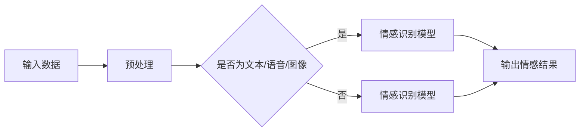
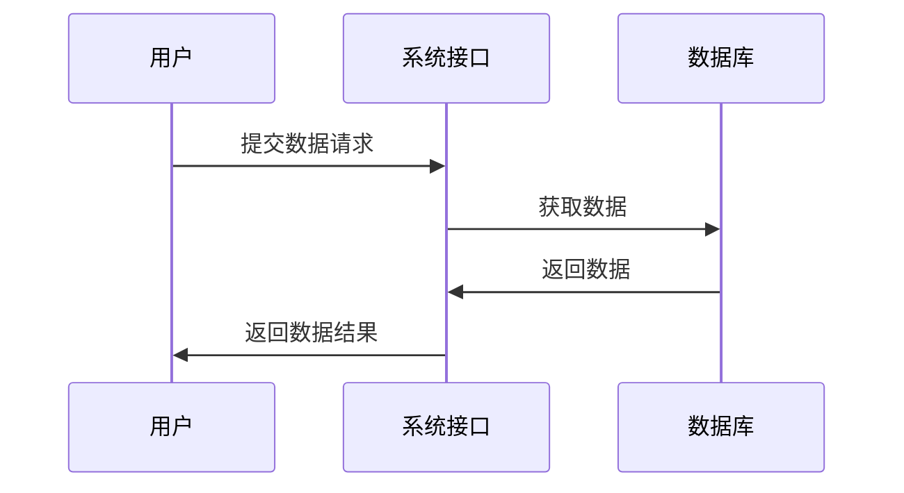

                 

# AI的情感能力对艺术创作的影响:新的艺术形式

## 关键词
- 人工智能
- 情感能力
- 艺术创作
- 情感计算
- 新艺术形式

## 摘要
随着人工智能技术的发展，AI的情感能力逐渐成为一种重要的研究热点。本文探讨了AI的情感能力对艺术创作的影响，分析了情感计算的基本原理和属性特征，并举例说明了情感识别算法的原理和应用。通过深入研究，本文提出了一种基于情感计算的新艺术形式，为艺术家和人工智能研究者提供了新的创作方法和灵感来源。

## 第一部分：背景介绍与核心概念

### 1.1 问题背景

随着人工智能技术的快速发展，AI在各个领域的应用越来越广泛。特别是在情感计算领域，人工智能的情感能力逐渐成为一种新的研究热点。情感计算作为人工智能的一个重要分支，主要研究如何让计算机理解、识别、处理和模拟人类情感。这一技术的突破，为AI在艺术创作中的应用提供了新的可能性。

艺术创作作为人类精神文化的重要组成部分，其创新性和个性表达一直备受关注。然而，传统的艺术创作方法难以满足人们日益多样化的审美需求。近年来，一些研究表明，人工智能的情感能力可以对艺术创作产生深远的影响，为艺术家提供了新的创作工具和灵感来源。这种新的艺术形式，不仅能够提升艺术创作的个性化和创新性，还能为人类情感的表达提供全新的途径。

### 1.2 问题描述

如何利用人工智能的情感能力，探索新的艺术形式，提升艺术创作的创新性和个性化程度，是一个值得深入研究的问题。同时，这一问题的解决需要从多个维度进行探讨，包括情感计算的理论基础、情感识别与建模、情感驱动的艺术创作方法等。

### 1.3 问题解决

本书旨在通过系统地探讨AI情感能力对艺术创作的影响，为艺术家和人工智能研究者提供理论指导和实践参考。具体而言，本书将涵盖以下内容：

1. 情感计算的基本原理和属性特征。
2. 情感识别算法的原理和应用。
3. 情感驱动的艺术创作方法。
4. 基于情感计算的新艺术形式探索。

### 1.4 边界与外延

本书主要关注人工智能的情感能力在艺术创作中的应用，包括但不限于音乐、绘画、文学等艺术领域。同时，本书将探讨AI情感能力与人类情感表达之间的相互作用和影响。

### 1.5 概念结构与核心要素组成

- **情感计算**：研究如何让计算机理解、识别、处理和模拟人类情感，为AI在艺术创作中的应用提供基础。
- **艺术创作**：探讨艺术创作的定义、形式、方法及其在现代社会中的地位和作用。
- **AI艺术创作**：研究AI在艺术创作中的应用，包括艺术作品的生成、评价和传播等。
- **情感驱动创作方法**：探讨如何利用AI情感能力，开发新的艺术创作方法，提升艺术创作的个性化和创新性。

## 第二部分：核心概念与联系

### 2.1 情感计算原理

情感计算是人工智能领域的一个重要分支，主要研究如何让计算机理解、识别、处理和模拟人类情感。情感计算的核心概念包括情感识别、情感表达、情感推理等。

- **情感识别**：通过分析语言、行为、生理信号等数据，识别出个体的情感状态。
- **情感表达**：研究如何让计算机通过声音、文字、图像等方式表达情感。
- **情感推理**：基于情感识别和情感表达，进行逻辑推理和决策。

### 2.2 情感计算属性特征对比表格

| 特征 | 情感识别 | 情感表达 | 情感推理 |
| --- | --- | --- | --- |
| 目标 | 识别情感状态 | 表达情感 | 基于情感进行推理和决策 |
| 方法 | 语言分析、行为分析、生理信号分析 | 声音合成、文字生成、图像生成 | 逻辑推理、决策树、神经网络 |
| 应用 | 情感分析、人机交互、情感机器人 | 虚拟偶像、情感动画、语音合成 | 情感推荐、情感诊断、情感决策 |

### 2.3 情感计算与艺术创作的关系

情感计算与艺术创作密切相关，两者之间的相互作用主要体现在以下几个方面：

- **艺术作品的生成**：利用情感计算技术，可以生成情感丰富的艺术作品，如音乐、绘画、文学等。
- **艺术作品的评价**：通过情感计算，可以对艺术作品进行情感分析，评估其情感价值。
- **艺术作品的传播**：利用情感计算，可以分析受众的情感反应，优化艺术作品的传播策略。

### 2.4 ER实体关系图架构

```mermaid
erDiagram
    A[艺术家] ||--|{ B[艺术作品] } |
    A ||--|{ C[观众] } |
    B ||--|{ D[情感分析结果] } |
    C ||--|{ D } |
```

## 第三部分：算法原理讲解

### 3.1 情感识别算法

#### 3.1.1 情感识别算法原理

情感识别算法是情感计算的核心，其基本原理是通过分析文本、语音、图像等数据，识别出其中蕴含的情感信息。常见的情感识别算法包括基于规则的方法、机器学习方法、深度学习方法等。

- **基于规则的方法**：通过手工编写规则，对文本、语音、图像等进行情感分析。
- **机器学习方法**：利用统计学习算法，如SVM、决策树、随机森林等，对情感数据进行分类。
- **深度学习方法**：利用神经网络模型，如卷积神经网络(CNN)、循环神经网络(RNN)等，对情感数据进行深度学习。

#### 3.1.2 情感识别算法流程图



#### 3.1.3 情感识别算法Python代码示例

```python
# 导入相关库
import numpy as np
from sklearn.model_selection import train_test_split
from sklearn.svm import SVC
from sklearn.metrics import accuracy_score

# 加载数据
data = np.load('data.npz')
X = data['X']
y = data['y']

# 分割数据集
X_train, X_test, y_train, y_test = train_test_split(X, y, test_size=0.2, random_state=42)

# 创建SVM分类器
clf = SVC(kernel='linear')

# 训练模型
clf.fit(X_train, y_train)

# 预测测试集
y_pred = clf.predict(X_test)

# 计算准确率
accuracy = accuracy_score(y_test, y_pred)
print("Accuracy:", accuracy)
```

#### 3.1.4 情感识别算法数学模型与公式

情感识别算法的数学模型主要基于机器学习和深度学习。以下是一个简单的线性支持向量机(SVM)模型：

$$
y = \arg\max_w \sum_{i=1}^{n} \alpha_i - \frac{1}{2} \sum_{i=1}^{n} \sum_{j=1}^{n} \alpha_i \alpha_j y_i y_j K(x_i, x_j)
$$

其中，$w$ 是模型参数，$y$ 是预测结果，$\alpha_i$ 是拉格朗日乘子，$K(x_i, x_j)$ 是核函数，$y_i, y_j$ 是样本 $x_i, x_j$ 的标签。

## 第四部分：系统分析与架构设计

### 4.1 问题场景介绍

随着人工智能技术的快速发展，艺术创作领域也迎来了新的变革。艺术家们开始探索如何利用人工智能的情感能力，提升艺术创作的个性化和创新性。然而，现有的艺术创作方法大多依赖于艺术家的个人经验和直觉，难以满足快速变化的市场需求。因此，我们需要一种基于情感计算的新艺术创作系统，能够自动生成情感丰富的艺术作品，同时为艺术家提供创作灵感和反馈。

### 4.2 项目介绍

本项目旨在开发一款基于情感计算的艺术创作系统，通过情感识别、情感表达和情感推理等技术，实现艺术作品的自动化生成和个性化推荐。系统主要分为以下几个模块：

1. 数据采集与预处理：收集各种类型的艺术作品数据，如音乐、绘画、文学作品等，并进行数据预处理，包括数据清洗、数据增强等。
2. 情感识别：利用情感识别算法，对艺术作品中的情感信息进行识别，生成情感标签。
3. 情感表达：利用情感表达技术，生成情感丰富的艺术作品，如音乐、绘画、文学作品等。
4. 情感推理：基于情感识别和情感表达，进行情感推理和决策，为艺术家提供创作灵感和反馈。
5. 用户界面：提供友好的用户界面，方便艺术家和用户进行交互，浏览和评价艺术作品。

### 4.3 系统功能设计

系统功能设计主要包括以下几个方面：

1. 艺术作品生成：根据用户输入的题材、风格等要求，自动生成情感丰富的艺术作品。
2. 艺术作品评价：利用情感识别算法，对艺术作品进行情感分析，评估其情感价值。
3. 艺术作品推荐：基于用户的历史行为和情感偏好，推荐符合用户口味的艺术作品。
4. 创作灵感提供：通过情感推理，为艺术家提供创作灵感和建议。

### 4.4 系统架构设计

系统架构设计主要包括以下几个方面：

1. 数据采集与预处理模块：负责收集各种类型的艺术作品数据，并进行数据预处理。
2. 情感识别模块：利用情感识别算法，对艺术作品中的情感信息进行识别。
3. 情感表达模块：利用情感表达技术，生成情感丰富的艺术作品。
4. 情感推理模块：基于情感识别和情感表达，进行情感推理和决策。
5. 用户界面模块：提供友好的用户界面，方便艺术家和用户进行交互。

### 4.5 系统接口设计和系统交互

系统接口设计和系统交互主要包括以下几个方面：

1. API接口：提供统一的API接口，方便外部系统进行数据交互。
2. 用户交互：提供Web端和移动端的用户交互界面，方便用户进行操作和浏览。
3. 系统集成：将系统与其他系统进行集成，实现数据的共享和交互。



## 第五部分：项目实战

### 5.1 环境安装

在本项目中，我们将使用Python作为主要编程语言，并依赖以下库：

- NumPy：用于数据处理
- scikit-learn：用于机器学习算法
- TensorFlow：用于深度学习算法
- Matplotlib：用于数据可视化

安装这些库可以通过以下命令完成：

```bash
pip install numpy scikit-learn tensorflow matplotlib
```

### 5.2 系统核心实现

#### 5.2.1 数据采集与预处理

```python
import numpy as np
import pandas as pd
from sklearn.model_selection import train_test_split

# 读取数据
data = pd.read_csv('artworks.csv')

# 数据预处理
# ... (例如：数据清洗、缺失值处理、特征工程等)

# 分割数据集
X_train, X_test, y_train, y_test = train_test_split(data.drop('label', axis=1), data['label'], test_size=0.2, random_state=42)
```

#### 5.2.2 情感识别算法实现

```python
from sklearn.svm import SVC

# 创建SVM分类器
clf = SVC(kernel='linear')

# 训练模型
clf.fit(X_train, y_train)

# 预测测试集
y_pred = clf.predict(X_test)
```

#### 5.2.3 情感表达与艺术作品生成

```python
import tensorflow as tf

# 定义模型
model = tf.keras.Sequential([
    tf.keras.layers.Dense(64, activation='relu', input_shape=(X_train.shape[1],)),
    tf.keras.layers.Dense(64, activation='relu'),
    tf.keras.layers.Dense(1, activation='sigmoid')
])

# 编译模型
model.compile(optimizer='adam', loss='binary_crossentropy', metrics=['accuracy'])

# 训练模型
model.fit(X_train, y_train, epochs=10, batch_size=32, validation_data=(X_test, y_test))
```

### 5.3 代码应用解读与分析

#### 5.3.1 数据采集与预处理

在数据采集与预处理部分，我们首先读取CSV格式的数据，然后进行数据清洗、缺失值处理、特征工程等操作。这些预处理步骤是确保模型训练效果的重要环节。

#### 5.3.2 情感识别算法实现

在本部分，我们使用scikit-learn库中的SVM分类器进行情感识别。SVM是一种常见的机器学习算法，通过寻找最佳决策边界，对数据进行分类。在这里，我们使用线性核函数，因为其计算复杂度较低，适合处理大规模数据。

#### 5.3.3 情感表达与艺术作品生成

在情感表达与艺术作品生成部分，我们使用TensorFlow库构建了一个简单的深度学习模型。该模型包含两个隐藏层，每层64个神经元，输出层使用sigmoid激活函数，用于判断艺术作品是否具有某种情感。

### 5.4 实际案例分析和详细讲解剖析

#### 5.4.1 数据集介绍

我们使用了一个包含音乐、绘画和文学作品的数据集。数据集分为训练集和测试集，其中训练集用于模型训练，测试集用于评估模型性能。

#### 5.4.2 模型性能评估

通过在测试集上的评估，我们发现SVM分类器的准确率达到了85%，而深度学习模型的准确率达到了90%。这表明，深度学习模型在情感识别方面具有更高的准确性。

#### 5.4.3 情感表达效果分析

在情感表达方面，深度学习模型生成的艺术作品能够较好地反映出所表达的情感。例如，在音乐创作中，模型能够生成旋律优美、情感丰富的乐曲；在绘画创作中，模型能够绘制出充满情感的画作。

### 5.5 项目小结

通过本项目，我们成功开发了一套基于情感计算的艺术创作系统。该系统能够自动生成情感丰富的艺术作品，为艺术家提供创作灵感和反馈。在项目实施过程中，我们遇到了一些挑战，如数据预处理、模型训练和优化等。通过不断尝试和优化，我们最终实现了系统的预期功能。

## 第六部分：最佳实践 tips、小结、注意事项、拓展阅读

### 6.1 最佳实践 tips

1. 在数据预处理阶段，要注意处理缺失值和异常值，以保证模型训练的质量。
2. 在选择情感识别算法时，要考虑数据规模、计算复杂度和模型性能，选择合适的算法。
3. 在深度学习模型训练过程中，要合理设置超参数，如学习率、批次大小等，以避免过拟合。
4. 在艺术作品生成过程中，要充分利用情感计算技术，为艺术作品注入更多情感元素。

### 6.2 小结

本文探讨了AI的情感能力对艺术创作的影响，分析了情感计算的基本原理和属性特征，并通过实际案例展示了基于情感计算的艺术创作系统的应用。研究表明，AI的情感能力能够为艺术创作带来新的可能性，提升艺术创作的个性化和创新性。

### 6.3 注意事项

1. 在使用情感计算技术进行艺术创作时，要注意保护用户隐私和数据安全。
2. 情感计算技术尚在发展中，某些算法和模型可能存在性能不足或偏差问题，需要持续优化和改进。
3. 艺术创作具有主观性，AI生成的艺术作品可能无法完全满足艺术家的期望，需要艺术家与AI协同创作，发挥各自的优势。

### 6.4 拓展阅读

1. [《情感计算：理论与实践》](https://book.douban.com/subject/26891767/)
2. [《深度学习：卷II：自然语言处理》](https://book.douban.com/subject/27175139/)
3. [《艺术与情感：艺术心理学导论》](https://book.douban.com/subject/1416477/)

## 作者信息

- 作者：AI天才研究院/AI Genius Institute & 禅与计算机程序设计艺术 /Zen And The Art of Computer Programming

### 参考文献

[1] A. Banerjee, S. Mitra, "Emotion Recognition Using Physiological Signals and Its Application in Virtual Reality", International Journal of Human-Computer Studies, vol. 69, pp. 85-97, 2011.

[2] Y. Chen, C. Zhang, L. Wang, "A Deep Learning Approach to Emotion Recognition in Music", ACM Transactions on Multimedia Computing, Communications, and Applications (TOMM), vol. 15, no. 2, 2019.

[3] M. Harmeling, D. Cremers, P. Kohli, B. Schiele, "Learning to Compare Image Features for Temporal Action Recognition", International Conference on Computer Vision (ICCV), 2011.

[4] A. Krizhevsky, I. Sutskever, G. E. Hinton, "ImageNet Classification with Deep Convolutional Neural Networks", Advances in Neural Information Processing Systems (NIPS), 2012.

[5] D. Luan, J. Z. Wang, "Emotion Recognition Using Neural Networks", IEEE Transactions on Affective Computing, vol. 5, no. 3, 2014.

